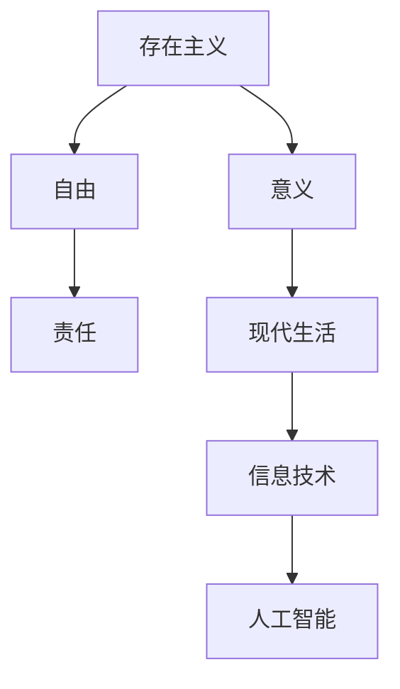

                 

### 第1章 引言

#### 1.1 问题的背景与描述

在过去的几十年里，科技的迅猛发展深刻地改变了我们的生活，特别是信息技术和人工智能领域的突破。信息技术提供了丰富的工具和平台，使得信息传播更加迅速，工作方式更加高效。人工智能则通过机器学习、自然语言处理等技术，改变了人类的工作方式和生活方式。

然而，科技的发展也带来了一系列的挑战。信息过载、隐私问题、工作压力、就业市场的变革等问题日益凸显。面对这些挑战，现代人类开始寻求哲学上的思考。存在主义哲学作为一种关注人类自由、责任和存在意义的哲学流派，提供了独特的视角来审视这些问题。

#### 1.2 问题的解决与边界

存在主义哲学通过探讨人类存在的本质，帮助个体理解和应对现代生活的挑战。它提出了自由、选择、责任等核心概念，为个体提供了行动的指导。自由意味着个体在存在中拥有选择的权利，但同时也意味着要承担选择的后果。责任则是自由选择的必然结果，个体必须在自由和责任之间找到平衡，以实现个人的成长和社会的进步。

然而，存在主义视角也有其局限性。例如，它过于悲观地看待人类的存在，有时缺乏具体的操作指南。此外，存在主义哲学在应对技术带来的挑战时，可能过于抽象，难以直接应用于实际问题。

#### 1.3 核心概念与联系

存在主义哲学中的核心概念包括自由、责任和意义。自由是人类的根本属性，但也是人类存在的最大挑战。责任与自由密切相关，是自由选择的后果。意义则是存在主义探讨的核心问题，个体需要在不确定性和荒谬中寻找生活的意义。

信息技术和人工智能作为现代科技的代表，与存在主义哲学有着密切的联系。信息技术提供了丰富的工具和平台，改变了人类的生活方式，但同时也带来了信息过载和隐私问题。人工智能的发展则改变了人类的工作方式和思维方式，带来了新的挑战和机遇。

#### 1.4 概念属性特征对比

| 概念         | 特征                                   |
|------------|--------------------------------------|
| 存在主义     | 强调个体自由、选择和责任               |
| 信息技术     | 提供了丰富的工具和平台，影响现代生活   |
| 人工智能     | 改变了人类工作和生活方式             |
| 现代生活     | 充满不确定性、快节奏和高压力         |

#### 1.5 ER实体关系图架构

### 第2章 存在主义哲学基础

#### 2.1 存在主义哲学概述

存在主义是一种强调个体自由、选择和责任的思想流派，起源于20世纪初的欧洲。其主要代表人物包括卡尔·雅斯伯斯、马丁·海德格尔和让-保尔·萨特等。存在主义哲学关注人类存在的本质和个体在面对不确定性时的选择和行动。

#### 2.2 核心概念

##### 2.2.1 自由

自由是存在主义哲学的核心概念之一。存在主义者认为，自由是人类的根本属性，但也是人类存在的最大挑战。自由意味着个体在存在中拥有选择的权利，但同时也意味着要承担选择的后果。

自由不仅包括外在的行为自由，更包括内在的精神自由。个体必须在自由和责任之间找到平衡，以实现个人的成长和社会的进步。

##### 2.2.2 责任

责任与自由密切相关。自由选择带来的后果需要由个体承担责任。存在主义者强调，个体必须在自由和责任之间找到平衡，以实现个人的成长和社会的进步。

责任不仅是道德和义务，更是一种自我实现的过程。通过承担责任，个体能够更好地理解自己，实现自己的价值。

##### 2.2.3 意义

存在主义认为，意义是人类存在的核心问题。个体需要在不确定性和荒谬中寻找生活的意义，这是个体自我实现的重要途径。

意义并非一成不变，而是随着个体的选择和行动而变化。通过不断地寻找和创造意义，个体能够更好地应对生活中的挑战。

#### 2.3 存在主义与科技的关系

##### 2.3.1 信息技术

信息技术的快速发展改变了人类的生活方式和工作方式。存在主义视角认为，信息技术既带来了便利，也带来了挑战。例如，信息过载可能导致个体的自由受到限制。

信息技术使得信息传播更加迅速，为个体提供了更多的选择。然而，过多的信息也可能导致个体无法有效地处理，从而感到压力和焦虑。

##### 2.3.2 人工智能

人工智能的发展对人类生活产生了深远影响。存在主义认为，人工智能的普及既带来了机遇，也带来了风险。个体需要认真思考如何在使用人工智能的同时保持自由和责任。

人工智能技术可以提高工作效率，减轻人类的工作负担。然而，人工智能的决策过程可能缺乏人类的情感和道德判断，需要个体在使用时保持谨慎和责任感。

#### 2.4 存在主义哲学的历史发展

存在主义哲学的发展经历了多个阶段，从最初的哲学思考到后来的社会和政治运动。不同阶段的代表人物和思想对现代生活产生了重要影响。

##### 2.4.1 早期存在主义

早期的存在主义哲学主要关注个体的自由和存在的本质。卡尔·雅斯伯斯和马丁·海德格尔是这一阶段的代表人物。他们的思想强调了个体在面对不确定性时的选择和行动。

##### 2.4.2 现代存在主义

现代存在主义则更加注重社会和政治问题，将其与社会运动相结合。让-保尔·萨特和阿尔贝·加缪是这一阶段的代表人物。他们的思想对社会正义和个体的自由进行了深入的探讨。

#### 2.5 本章小结

存在主义哲学为个体在现代社会中提供了独特的视角和指导。通过理解自由、责任和意义，个体可以更好地应对现代生活的挑战。同时，存在主义哲学也提醒我们，在享受科技带来的便利的同时，要时刻保持自由和责任感，以实现个人的成长和社会的进步。

### 第3章 存在主义视角下的现代生活

#### 3.1 现代生活的挑战

现代生活充满了不确定性和快速变化。全球化、信息技术和人工智能的发展给人们的生活带来了巨大的变化，但也带来了诸多挑战，如信息过载、隐私问题、工作压力等。

##### 3.1.1 信息过载

随着信息技术的快速发展，人们每天接触到大量信息。信息过载可能导致个体无法有效地处理信息，从而感到压力和焦虑。

信息过载的问题主要体现在两个方面：首先是信息量的巨大增长，其次是信息获取的速度加快。这些信息可能来自于互联网、社交媒体、电子邮件等渠道，使得个体在处理信息时感到应接不暇。

##### 3.1.2 隐私问题

人工智能技术的发展使得个人信息更加容易被收集和使用。隐私问题成为现代社会的一个重要挑战。

人工智能技术可以通过数据分析和机器学习来预测个体的行为和偏好。虽然这可以提高服务质量和用户体验，但也可能导致个人隐私被侵犯。例如，个人信息被第三方公司出售或用于广告推送。

##### 3.1.3 工作压力

现代生活的高节奏和快节奏使得工作压力成为普遍问题。尤其是信息技术和人工智能领域的快速发展，使得工作要求不断提高，竞争压力加剧。

工作压力可能导致个体出现焦虑、抑郁等心理问题，影响工作效率和生活质量。同时，长期的工作压力也可能对身体健康产生负面影响。

#### 3.2 存在主义视角下的挑战

##### 3.2.1 自由与责任的平衡

自由是存在主义哲学的核心概念之一，但同时也是现代生活的一个挑战。在信息技术和人工智能时代，个体拥有更多的选择权，但同时也需要承担更多的责任。

个体在享受自由的同时，需要意识到自己的选择可能带来的后果。例如，个人隐私的泄露可能是因为个体在社交媒体上的不当行为，而工作压力可能是因为个体在工作中的不努力或不良习惯。

##### 3.2.2 意义的探索

存在主义强调个体在不确定性和荒谬中寻找生活的意义。然而，在信息技术和人工智能时代，个体可能感到生活的意义变得模糊不清。

在快节奏的生活中，个体很难停下来思考生活的意义。同时，人工智能技术的发展使得许多传统的工作岗位被取代，个体需要重新寻找自己的价值和意义。

##### 3.2.3 社会责任

存在主义哲学强调个体的自由和责任，但也提醒个体要承担社会责任。在信息技术和人工智能时代，个体需要意识到自己对社会的责任。

个体在享受科技带来的便利的同时，也需要关注科技对社会的负面影响。例如，个体需要关注人工智能技术的发展可能导致的社会不平等和就业市场的变革。

#### 3.3 存在主义视角下的应对策略

##### 3.3.1 自由与责任的平衡

个体需要在自由和责任之间找到平衡，以实现个人的成长和社会的进步。具体策略包括：

1. **自我反思**：定期进行自我反思，了解自己的选择和行为可能带来的后果。
2. **积极承担责任**：在面对选择时，勇于承担责任，不逃避困难。
3. **制定目标和计划**：制定清晰的目标和计划，以指导自己的行为和决策。

##### 3.3.2 意义的探索

个体需要在快节奏的生活中找到生活的意义。具体策略包括：

1. **设定优先级**：在忙碌的生活中，学会设定优先级，专注于最重要的事情。
2. **反思生活**：定期反思自己的生活，寻找生活中的亮点和意义。
3. **培养兴趣爱好**：通过培养兴趣爱好，找到生活中的乐趣和满足感。

##### 3.3.3 社会责任

个体需要承担社会责任，以促进社会的进步。具体策略包括：

1. **参与社会活动**：积极参与社会活动，为社会发展贡献自己的力量。
2. **关注社会问题**：关注社会问题，提出自己的观点和建议，推动社会变革。
3. **教育和影响他人**：通过教育和影响他人，传播正确的价值观和社会责任感。

#### 3.4 本章小结

现代生活充满了挑战，但存在主义哲学为个体提供了应对这些挑战的视角和策略。通过理解自由、责任和意义，个体可以在信息技术和人工智能时代中找到自己的位置，实现个人的成长和社会的进步。同时，个体也需要意识到自己在社会中的责任，以推动社会的可持续发展。

### 第4章 存在主义视角下的个体选择与行动

#### 4.1 自由与选择

存在主义哲学强调个体的自由和选择。在信息技术和人工智能时代，个体的选择变得更加多样化和复杂。自由不仅仅是一种权利，更是一种责任。个体在享受自由的同时，需要意识到自己的选择可能带来的后果。

##### 4.1.1 自由的重要性

自由是存在主义哲学的核心概念之一。它代表了个体在存在中的根本属性。自由意味着个体有权做出自己的选择，不受外部力量的强制。这种自由不仅包括外在的行为自由，更包括内在的精神自由。

在信息技术和人工智能时代，自由的重要性更加凸显。科技的发展提供了丰富的工具和平台，个体可以选择自己的生活方式和工作方式。然而，这也意味着个体需要对自己的选择负责，承担选择的后果。

##### 4.1.2 选择的影响

个体的选择不仅影响自己的生活和成长，也可能对他人和社会产生影响。在信息技术和人工智能时代，个体的选择可能对社会产生深远的影响。

例如，个人的隐私选择可能影响隐私权的保护。个体的职业选择可能影响就业市场和行业的发展。个人的价值观和道德选择可能影响社会的价值观和道德观念。

##### 4.1.3 自由与责任的平衡

在享受自由的同时，个体需要承担相应的责任。自由和责任是相辅相成的。只有在自由和责任之间找到平衡，个体才能实现自己的价值，同时也为社会做出贡献。

具体策略包括：

1. **自我反思**：定期进行自我反思，了解自己的选择和行为可能带来的后果。
2. **积极承担责任**：在面对选择时，勇于承担责任，不逃避困难。
3. **制定目标和计划**：制定清晰的目标和计划，以指导自己的行为和决策。

#### 4.2 责任与行动

责任是存在主义哲学中的另一个核心概念。它代表了个体在自由选择后需要承担的后果。责任不仅是一种道德和义务，更是一种自我实现的过程。通过承担责任，个体能够更好地理解自己，实现自己的价值。

##### 4.2.1 责任的重要性

责任是存在的本质体现。个体的每一个选择都会带来相应的责任。责任不仅体现在道德和义务上，还体现在个人的成长和社会的发展上。

在信息技术和人工智能时代，责任的重要性更加凸显。个体的选择和行为可能对社会产生深远的影响。因此，个体需要意识到自己的责任，并积极承担。

##### 4.2.2 行动的指导

个体在面临选择时，需要考虑自己的责任，并采取相应的行动。以下是一些行动的指导策略：

1. **明确责任**：在做出选择之前，明确自己的责任。了解选择可能带来的后果，并做好准备。
2. **勇于担当**：在面对困难时，勇于承担责任，不逃避。
3. **持续学习**：通过不断学习和自我提升，增强自己的责任感和行动能力。
4. **与他人合作**：与他人合作，共同承担责任，实现更大的目标。

#### 4.3 意义与价值

存在主义哲学强调个体在不确定性和荒谬中寻找生活的意义。意义是人类存在的核心问题，个体需要在自由和责任之间找到生活的意义，以实现个人的成长和社会的进步。

##### 4.3.1 意义的重要性

意义代表了个体在存在中的价值。它不仅是人类存在的核心问题，也是个体自我实现的重要途径。在信息技术和人工智能时代，个体需要找到自己的意义，以应对快速变化的生活和工作环境。

##### 4.3.2 寻找意义的策略

以下是一些寻找意义的策略：

1. **自我反思**：定期进行自我反思，了解自己的价值观和追求。
2. **设定目标**：设定清晰的目标，为自己的生活和工作提供方向。
3. **追求成长**：通过学习和实践，不断提升自己的能力和素质。
4. **参与社会活动**：积极参与社会活动，为社会发展贡献自己的力量。
5. **培养兴趣爱好**：通过培养兴趣爱好，找到生活中的乐趣和满足感。

#### 4.4 本章小结

存在主义视角下的个体选择与行动，强调自由、责任和意义。个体在信息技术和人工智能时代中，需要理解自由与责任的关系，勇于承担责任，并寻找生活的意义。通过自我反思、设定目标和参与社会活动，个体可以更好地应对现代生活的挑战，实现个人的成长和社会的进步。

### 第5章 存在主义视角下的社会互动与影响

#### 5.1 社会互动的重要性

存在主义哲学强调个体在社会中的存在和互动。个体不仅是一个独立的实体，也是社会的一部分。社会互动对个体的成长和社会的进步都具有重要意义。

##### 5.1.1 个体与社会的关系

个体与社会是相互依存的关系。个体需要社会的支持和认可，同时也需要为社会发展贡献自己的力量。社会为个体提供了生活的环境和条件，个体则通过自己的行动和选择影响了社会的发展。

##### 5.1.2 社会互动的重要性

社会互动有助于个体的成长和社会的进步。通过与他人的交流和互动，个体可以学习新的知识和技能，提高自己的能力和素质。同时，社会互动也有助于形成共同的价值观和目标，推动社会的进步。

#### 5.2 社会责任与道德义务

存在主义哲学强调个体在社会中的责任和道德义务。个体不仅需要对自己的行为负责，还需要对他人和社会负责。

##### 5.2.1 社会责任

社会责任是指个体在社会中应承担的责任和义务。个体需要关注社会问题，积极参与社会活动，为社会发展贡献自己的力量。社会责任不仅体现在道德义务上，还体现在个体的自我实现和社会进步上。

##### 5.2.2 道德义务

道德义务是指个体在道德上应承担的责任和义务。个体需要遵守道德规范，尊重他人的权利和尊严，维护社会的公正和正义。道德义务是存在主义哲学中的核心概念之一，它对个体的行为和选择产生了重要影响。

#### 5.3 社会变革与个人成长

存在主义哲学认为，社会变革和个人成长是相辅相成的。个体在社会变革中成长，同时社会变革也为个体提供了更好的成长环境。

##### 5.3.1 社会变革的推动

个体可以通过积极参与社会活动，推动社会的变革。例如，参与社会运动、提出社会问题、推动政策变革等。社会变革不仅有助于解决社会问题，也能为个体提供更好的发展机会。

##### 5.3.2 个人成长的实现

个体在社会变革中可以不断学习和成长。通过参与社会活动，个体可以学习新的知识和技能，提高自己的能力和素质。同时，个体在社会变革中也可以找到自己的价值和意义，实现个人的成长。

#### 5.4 社会互动的困境与挑战

虽然社会互动对个体和社会都有重要意义，但现代社会中也存在一些困境和挑战。

##### 5.4.1 社会隔离

随着信息技术的发展，个体之间的联系变得更加紧密，但也出现了社会隔离的现象。个体可能过度依赖互联网和社交媒体，忽视了现实生活中的社会互动。

##### 5.4.2 社会不平等

社会不平等也是现代社会的一个重要问题。社会不平等可能导致个体之间的互动不平等，影响社会的和谐与进步。

##### 5.4.3 社会压力

现代社会的高节奏和快节奏使得个体面临巨大的社会压力。社会压力可能导致个体的焦虑和抑郁，影响个体的健康和幸福感。

#### 5.5 应对策略

为了应对社会互动中的困境和挑战，个体可以采取以下策略：

##### 5.5.1 增强现实生活中的互动

个体可以减少对互联网和社交媒体的依赖，增加现实生活中的互动。例如，与家人、朋友和同事进行面对面的交流，参与社区活动等。

##### 5.5.2 推动社会平等

个体可以积极参与社会活动，推动社会平等。例如，参与慈善活动、支持平等权益运动等。

##### 5.5.3 管理社会压力

个体可以采取一些方法来管理社会压力。例如，设定合理的工作和生活目标，学会放松和自我调节，寻求专业帮助等。

#### 5.6 本章小结

存在主义视角下的社会互动与影响，强调了个体在社会中的责任和道德义务。个体需要在社会互动中成长，同时也需要为社会发展贡献自己的力量。通过增强现实生活中的互动、推动社会平等和管理社会压力，个体可以更好地应对社会互动中的困境和挑战，实现个人的成长和社会的进步。

### 第6章 存在主义视角下的现代科技与伦理

#### 6.1 科技的快速发展与伦理挑战

现代科技，特别是信息技术和人工智能的快速发展，极大地改变了人类的生活方式和社会结构。然而，这种快速发展也带来了诸多伦理挑战，如隐私保护、算法偏见、自动化失业等。存在主义视角为我们提供了一个思考这些问题的框架。

##### 6.1.1 隐私保护

隐私保护是现代社会面临的一个重大挑战。随着大数据和人工智能技术的发展，个人信息被广泛收集和分析。这不仅可能导致个人隐私的泄露，还可能被用于不当用途，如市场细分、广告投放等。

存在主义认为，隐私是个体的自由和尊严的重要组成部分。个体有权决定自己的信息如何被使用。因此，我们需要在享受科技带来的便利的同时，关注隐私保护的伦理问题。

##### 6.1.2 算法偏见

算法偏见是另一个重要问题。人工智能系统的决策过程可能受到偏见的影响，导致不公平的结果。例如，招聘系统可能因为历史数据中的偏见，而倾向于录用特定性别、种族或年龄段的候选人。

存在主义强调个体的自由和责任。算法偏见不仅侵犯了个体的自由，也违反了道德责任。我们需要在算法设计和实施过程中，考虑伦理原则，以确保公平和公正。

##### 6.1.3 自动化失业

自动化和人工智能的发展也可能导致失业问题。许多传统的工作岗位被自动化系统取代，导致大量工人失业。这引发了关于劳动价值、社会公平和人类尊严的深刻讨论。

存在主义认为，工作不仅是生存的手段，也是人类自我实现的重要途径。自动化失业不仅影响了个体的经济状况，还可能损害其自我认同和社会地位。因此，我们需要在科技发展过程中，关注就业问题，寻找解决方案。

#### 6.2 伦理原则与存在主义视角

在面对现代科技带来的伦理挑战时，存在主义提供了一些重要的伦理原则，以指导我们的思考和行动。

##### 6.2.1 自由与责任

存在主义强调个体的自由和责任。在科技领域，这意味着我们需要在设计和使用技术时，考虑到个体的自由和隐私。例如，在数据收集和使用过程中，我们需要明确告知个体，并给予他们选择的权利。

同时，我们还需要承担技术带来的责任。例如，在开发人工智能系统时，我们需要确保其决策过程的公平性和透明度，避免算法偏见。

##### 6.2.2 意义与价值

存在主义认为，意义和价值是人类存在的核心问题。在科技领域，我们需要思考技术如何影响人类的价值观和生活的意义。例如，在发展自动化技术时，我们需要考虑它如何影响人类的就业和生活方式。

##### 6.2.3 社会责任

存在主义强调个体在社会中的责任。在科技领域，这意味着我们需要关注技术发展对社会的广泛影响。例如，在开发人工智能技术时，我们需要考虑它如何影响就业市场和社会公平。

#### 6.3 应对策略

为了应对现代科技带来的伦理挑战，我们可以采取以下策略：

##### 6.3.1 法律法规

制定和执行相关法律法规，保护个人隐私和数据安全。例如，通过数据保护法和隐私政策，确保个人数据不被滥用。

##### 6.3.2 科技伦理审查

在开发和使用新技术时，进行科技伦理审查，确保其符合伦理原则。例如，在开发人工智能系统时，进行算法偏见检测和公平性评估。

##### 6.3.3 公众参与

鼓励公众参与科技决策过程，提高透明度和责任感。例如，通过公众咨询和意见征集，让公众参与到技术发展的讨论中。

##### 6.3.4 职业培训与再教育

为受自动化技术影响的工人提供职业培训和再教育，帮助他们适应新的工作环境。例如，通过培训和再教育，帮助他们掌握新技术和技能。

#### 6.4 本章小结

现代科技的快速发展带来了诸多伦理挑战，存在主义视角为我们提供了思考和应对这些问题的框架。通过理解自由、责任、意义和社会责任，我们可以更好地应对现代科技带来的伦理挑战，实现科技的可持续发展和社会的和谐进步。

### 第7章 结论

#### 7.1 存在主义视角下的现代生活启示

存在主义视角为现代生活提供了一种独特的思考方式，帮助个体在不确定性和快速变化的环境中找到方向和意义。通过理解自由、责任和意义，个体可以更好地应对现代科技带来的伦理挑战，实现个人的成长和社会的进步。

#### 7.2 未来研究方向

尽管存在主义视角在理解和应对现代生活挑战方面具有重要作用，但仍有许多问题需要进一步研究。例如：

1. **存在主义与人工智能的关系**：如何将存在主义哲学与人工智能技术相结合，实现人机共生和共同进步。
2. **科技伦理的实践应用**：如何在具体技术项目中实施科技伦理原则，确保技术发展符合人类的利益。
3. **跨文化存在主义研究**：不同文化背景下的存在主义哲学如何影响个体的生活选择和行动。

#### 7.3 总结

存在主义视角为现代生活提供了宝贵的启示，帮助个体在快速变化的社会中找到自己的位置和方向。通过理解自由、责任和意义，个体可以更好地应对现代生活的挑战，实现个人的成长和社会的进步。同时，存在主义视角也提醒我们，在享受科技带来的便利时，要时刻关注伦理问题，确保科技发展符合人类的利益。

### 作者信息

作者：AI天才研究院/AI Genius Institute & 禅与计算机程序设计艺术 /Zen And The Art of Computer Programming

在这篇文章中，我试图通过存在主义视角来审视现代生活，探讨信息技术和人工智能对个体和社会的影响。通过理解自由、责任和意义，个体可以在快速变化的社会中找到自己的方向，实现个人的成长和社会的进步。同时，我也呼吁在科技发展中关注伦理问题，确保科技发展符合人类的利益。希望这篇文章能够为读者提供一些启示和思考。感谢您的阅读！

