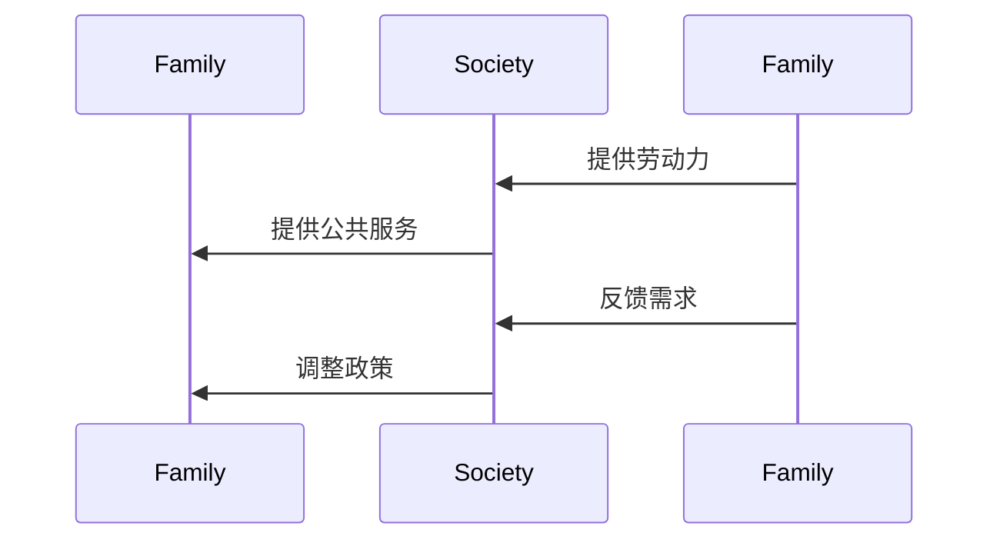
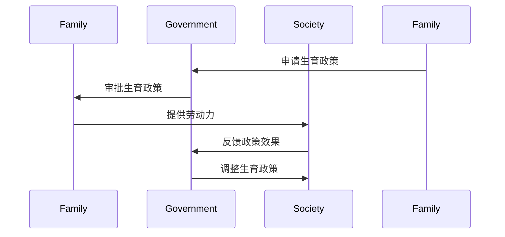

                 

# 家庭与生育：传统与变革的碰撞

> 关键词：家庭结构、生育观念、生育政策、生育行为、社会影响

> 摘要：本文从历史、政策、行为和社会影响等多个角度，探讨家庭与生育之间的互动关系，分析传统与变革之间的碰撞。通过深入研究和逻辑推理，揭示家庭与生育的复杂性和多样性，为未来家庭与生育的发展提供启示。

## 目录大纲设计思考过程

### 确定整体结构

在设计《家庭与生育：传统与变革的碰撞》这本书的目录大纲时，我们首先需要明确整体结构。根据书名，我们可以将内容分为以下几个主要部分：

1. 传统家庭与生育观念
2. 生育政策的变革
3. 生育行为的变化
4. 家庭与社会影响
5. 未来展望

### 确定章节划分

在每个主要部分中，我们再细化出具体的章节，确保每个章节都能够深入探讨相关的主题。例如：

1. 传统家庭与生育观念部分
   - 历史背景
   - 生育观念的传统解读
   - 家庭结构与传统生育观念的互动

2. 生育政策的变革部分
   - 计划生育政策的实施
   - 二孩政策的推出与调整
   - 计划生育政策的改革方向

3. 生育行为的变化部分
   - 现代生育观念的转变
   - 生育行为的现实表现
   - 生育政策的适应性调整

4. 家庭与社会影响部分
   - 家庭结构的变化
   - 生育变化对家庭的影响
   - 生育变化对社会的影响

5. 未来展望部分
   - 生育政策的发展趋势
   - 生育行为的变化趋势
   - 家庭与社会的互动

### 确定章节内容

在确定章节后，我们需要详细规划每个章节的具体内容。这包括核心概念、实例分析、数据对比、政策解读、专家观点等。

### 确保内容的连贯性和完整性

在设计目录时，我们需要确保各个章节之间的逻辑关系清晰，内容连贯，同时不遗漏重要的主题。

### 确保大纲简洁明了

最后，我们需要确保目录简洁明了，便于读者快速理解书的主要内容和结构。

## 目录大纲设计

### 第一部分：传统家庭与生育观念

1. 第1章：家庭结构的历史演变
   - 历史背景
   - 传统生育观念的解读
   - 家庭结构与传统生育观念的互动

2. 第2章：传统生育观念的变迁
   - 生育决策的传统模式
   - 生育观念的多样性
   - 传统观念的变革

### 第二部分：生育政策的变革

1. 第3章：中国生育政策的演变
   - 计划生育政策的实施
   - 二孩政策的推出与调整
   - 计划生育政策的改革方向

2. 第4章：国际生育政策的比较
   - 各国生育政策的差异
   - 生育政策的成功与挑战
   - 国际经验对中国生育政策的启示

### 第三部分：生育行为的变化

1. 第5章：现代生育观念的转变
   - 生育观念的转变
   - 生育决策的影响因素
   - 现代生育观念的多元性

2. 第6章：生育行为的现实表现
   - 婚育年龄的变化
   - 多子女家庭的比例
   - 生育行为与性别观念的变化

### 第四部分：家庭与社会影响

1. 第7章：生育变化对家庭的影响
   - 家庭结构的变化
   - 家庭功能的转变
   - 家庭关系的调整

2. 第8章：生育变化对社会的影响
   - 人口结构的变化
   - 劳动力市场的影响
   - 社会保障体系的调整

### 第五部分：未来展望

1. 第9章：生育政策的发展趋势
   - 政策调整的方向
   - 政策调整的可行性
   - 政策调整的影响

2. 第10章：生育行为的变化趋势
   - 生育观念的未来发展
   - 生育行为的未来趋势
   - 家庭与社会的互动

3. 第11章：未来家庭的挑战与机遇
   - 家庭面临的挑战
   - 家庭发展的机遇
   - 家庭与生育的未来

## 文章正文部分

### 传统家庭与生育观念

#### 家庭结构的历史演变

家庭是社会的细胞，其结构形态的演变与历史发展紧密相连。从原始社会到现代社会，家庭结构经历了巨大的变化。在原始社会，家庭形态以群婚制为主，人们以部落为单位生活，血缘关系较为模糊。随着农业社会的出现，家庭结构逐渐稳定，以血缘关系为基础的父系家族制开始形成。在这一时期，家庭的主要功能是生产和繁衍，生育被视为家庭的重要任务。

进入工业社会，家庭结构发生了进一步的变化。随着城市化进程的加速，人们的生活方式和价值观发生了转变。家庭从生产单位逐渐转变为消费单位，家庭结构趋向小型化。在这一背景下，生育观念也发生了变化，从单纯的繁衍后代逐渐转变为追求个体发展和生活质量。

#### 传统生育观念的解读

传统生育观念受到多种因素的影响，包括宗教、文化、经济和社会等。在传统社会中，生育被视为家庭的道德责任，生育行为受到社会规范和宗教教义的约束。生育不仅关乎家庭的延续，还关乎家族的荣誉和地位。

从经济角度来看，传统社会中的家庭往往以农业为主，劳动力是家庭生产力的核心。因此，生育被视为增加家庭劳动力的一种手段。此外，生育也被视为一种投资，通过生育来确保家庭的未来经济稳定。

从社会角度来看，传统社会中的生育观念强调社会责任和家族义务。生育不仅是为了自身的繁衍，更是为了社会的延续和发展。在这种情况下，生育被视为一种对社会有益的行为。

#### 家庭结构与传统生育观念的互动

家庭结构与传统生育观念之间的互动关系是复杂的。传统家庭结构往往强调家族的延续和家族利益，生育行为受到家族传统观念的强烈影响。在传统家庭中，生育决策往往由家族长辈或家庭领导者做出，个体的生育选择受到限制。

然而，随着社会的发展，个体意识的觉醒和女性地位的提升，生育决策逐渐从家族层面转移到个体层面。个体开始更加关注自身的生育选择和生活质量，传统生育观念受到挑战。

总之，传统家庭与生育观念之间的互动是一个动态的过程，受到历史、文化、经济和社会等多种因素的影响。随着社会的不断进步，传统家庭与生育观念也在不断变革和调整。

### 传统生育观念的变迁

随着社会的快速发展，传统生育观念正在经历深刻的变革。这种变革不仅体现在生育决策上，也反映在家庭结构和社会关系上。以下是传统生育观念变迁的几个方面：

#### 生育决策的转变

在过去，生育决策往往由家族长辈或家庭领导者做出，个体的生育选择受到限制。然而，随着个体意识的觉醒和女性地位的提升，个体开始拥有更多的生育自主权。现代家庭中的生育决策越来越倾向于夫妻共同讨论和决定，而不是仅仅遵循传统观念。

#### 生育观念的多元性

传统生育观念强调生育的道德意义和经济作用，而现代生育观念则更加多元化。人们开始重视生育的质量而非数量，注重子女的教育和全面发展。同时，随着社会的发展，生育观念也受到文化、宗教和个人价值观的多样影响，不再局限于单一的生育模式。

#### 生育观念的变革

生育观念的变革不仅仅是生育行为的变化，更是社会价值观的演变。现代生育观念更加注重个体权利和选择，强调生育的个人自由。这种观念的变化反映了社会对个体尊重和自由的重视，也标志着传统观念的逐步解体。

#### 家庭结构的影响

生育观念的变迁对家庭结构产生了深远的影响。随着生育观念的转变，家庭结构也逐渐趋向小型化。现代家庭更加注重夫妻关系和个人发展，家庭功能的转变导致家庭结构的变化。同时，生育观念的变革也影响了家庭内部的权力结构和决策过程，使家庭更加民主和开放。

### 生育政策的变革

生育政策是一个国家或地区对生育行为进行引导和管理的制度安排。随着社会的发展和人口结构的变化，生育政策也需要不断调整和完善。以下是几个典型国家的生育政策变革：

#### 中国

中国生育政策的变革经历了从计划生育到全面二孩政策的转变。改革开放初期，为了控制人口过快增长，中国实施了严格的计划生育政策。这一政策在一定程度上取得了成功，但也引发了一系列社会问题。随着人口老龄化和劳动力短缺问题的凸显，中国政府于2016年推出了全面二孩政策，允许每对夫妇生育两个孩子。

#### 日本

日本是一个人口老龄化严重的国家，为了应对人口问题，日本政府一直在调整生育政策。1987年，日本政府开始推行“育儿休假制度”，鼓励父母在子女年幼时休假照顾孩子。2019年，日本政府进一步推出“育儿津贴”政策，为生育第二胎或第三胎的家庭提供经济支持。

#### 德国

德国是一个人口增长缓慢的国家，为了吸引年轻人生育，德国政府实施了一系列鼓励生育的政策。例如，德国政府提供高额的育儿津贴和税收优惠，同时还为家庭提供托儿所和学前教育等公共服务。这些政策有效地提高了生育率，缓解了人口老龄化问题。

#### 生育政策的比较

通过对比不同国家的生育政策，我们可以发现，生育政策的变革需要考虑多种因素，包括人口结构、经济发展水平、社会文化背景等。成功的生育政策不仅需要政府提供经济支持，还需要全社会共同努力，营造一个有利于生育和儿童成长的环境。

### 国际生育政策的比较

在全球化背景下，国际生育政策的比较具有重要意义。以下从几个方面进行比较：

#### 政策目标

不同国家的生育政策目标各不相同。一些国家旨在控制人口增长，如中国和印度；而另一些国家则面临人口老龄化和劳动力短缺问题，如日本和德国。因此，生育政策的设计需要根据国家的具体国情进行。

#### 政策手段

各国在实施生育政策时，采取了多种手段。例如，中国通过严格的人口控制措施，如计划生育和独生子女政策；而日本和德国则通过经济激励和社会服务支持，鼓励家庭生育。

#### 政策效果

不同国家的生育政策效果也各有差异。一些国家的生育政策取得了显著成果，如德国的生育率逐渐回升；而另一些国家的生育政策则面临挑战，如中国的生育率持续下降。

#### 经验与启示

通过比较不同国家的生育政策，我们可以得出一些经验与启示。首先，生育政策需要与国家的经济和社会发展相适应。其次，生育政策需要综合运用经济激励和社会服务支持。最后，全社会需要共同努力，营造一个有利于生育和儿童成长的环境。

### 现代生育观念的转变

随着社会的进步和价值观的多元化，现代生育观念正在发生深刻的变化。这种变化不仅体现在生育决策上，还反映在生育行为和家庭结构上。

#### 生育决策的个性化

在传统观念中，生育决策往往由家庭长辈或社会规范主导。然而，现代社会中，个体开始更加重视自身的生育选择，追求个性化和自主化。年轻人更加倾向于根据自身的经济条件、职业规划和个人喜好来决定是否生育以及生育多少孩子。

#### 生育观念的多元化

传统生育观念强调生育的道德意义和经济作用，而现代生育观念则更加多元化。人们开始重视生育的质量而非数量，注重子女的教育和全面发展。同时，随着性别平等意识的提升，生育不再仅仅是女性的责任，而是夫妻共同参与和承担的。

#### 生育行为的理性化

在传统观念中，生育行为往往受到社会和文化规范的强烈影响。然而，现代社会中，人们逐渐趋向于理性化地看待生育行为。他们更加关注生育对自身生活质量的影响，权衡生育的利弊，做出更加明智的决策。

#### 家庭结构的变迁

现代生育观念的转变也导致了家庭结构的变迁。随着生育观念的多元化，家庭规模逐渐缩小，核心家庭成为主流。此外，现代家庭更加注重夫妻关系和个人发展，家庭功能的转变也影响了家庭结构的变化。

### 生育行为的现实表现

在现代社会的背景下，生育行为表现出诸多变化。以下是几个方面的现实表现：

#### 婚育年龄的变化

随着教育水平的提高和就业压力的增大，现代年轻人的婚育年龄普遍推迟。许多年轻人选择在事业稳定后再考虑生育，导致婚育年龄逐年上升。

#### 多子女家庭的比例

随着生育观念的转变，多子女家庭的比例有所下降。现代家庭更倾向于生育一个或两个孩子，以更好地满足子女的教育和成长需求。

#### 生育行为与性别观念的变化

在传统观念中，生育被认为是女性的责任。然而，现代社会中，男性在生育行为中的参与度逐渐提高，生育不再仅仅是女性的任务。同时，性别平等意识的提升也使得生育观念发生了变化，女性在生育选择和抚养子女方面享有更多的自主权。

### 生育政策的适应性调整

随着生育观念和行为的变化，生育政策也需要进行适应性调整。以下是几个方面的政策调整：

#### 经济激励

为了鼓励生育，许多国家采取了经济激励措施，如育儿津贴、税收优惠等。这些政策旨在减轻家庭的经济负担，提高生育的积极性。

#### 社会服务支持

生育政策的适应性调整还包括提供更多的社会服务支持，如托儿所、幼儿园、生育保险等。这些政策旨在为家庭提供便利，降低生育和抚养子女的成本。

#### 政策宣传与教育

为了提高公众对生育政策的认识和接受度，各国政府还采取了政策宣传和教育措施。通过宣传生育政策的好处和必要性，引导公众树立正确的生育观念。

### 生育变化对家庭的影响

生育变化对家庭结构、功能和关系产生了深远的影响。以下是几个方面的分析：

#### 家庭结构的变化

随着生育观念的转变，家庭结构逐渐趋向小型化。现代家庭更倾向于生育一个或两个孩子，以更好地满足子女的教育和成长需求。同时，婚姻观念的变化也导致单身家庭、再婚家庭和同性伴侣家庭等多样化家庭结构的出现。

#### 家庭功能的变化

随着社会的发展，家庭的功能也在发生变化。传统家庭以生产、抚养和教育为主要功能，而现代社会中的家庭更注重情感支持、个人发展和生活质量。生育行为的变化也影响了家庭功能，使得家庭更加注重子女教育和个人发展的投入。

#### 家庭关系的调整

生育观念的转变和家庭结构的变化也导致了家庭关系的调整。夫妻之间的生育决策更加平等，家庭内部的权力结构也趋向民主。同时，多代同堂的家庭逐渐减少，家庭关系更加紧凑和亲密。

### 生育变化对社会的影响

生育变化不仅对家庭产生影响，也对社会产生了深远的影响。以下是几个方面的分析：

#### 人口结构的变化

生育行为的变化直接影响了人口结构。随着生育观念的转变，生育率逐渐下降，人口老龄化问题日益严重。这对社会经济发展和社会保障体系带来了巨大挑战。

#### 劳动力市场的影响

生育行为的变化也对劳动力市场产生了影响。随着生育率的下降，劳动力供给减少，劳动力市场出现了供需失衡。同时，生育政策的调整和妇女就业观念的变化，使得女性在生育和就业之间面临更多的选择和挑战。

#### 社会保障体系的调整

生育变化对社会保障体系提出了新的要求。为了应对人口老龄化和劳动力短缺问题，各国政府需要调整社会保障体系，提高养老金和医疗保险水平，同时加强托儿所、幼儿园等公共服务设施的建设。

### 家庭与社会关系的互动

家庭与社会关系之间的互动是一个动态的过程，受到多种因素的影响。以下是几个方面的分析：

#### 家庭政策与社会发展的协调

家庭政策需要与社会发展相适应，以促进家庭和社会的协调发展。政府需要根据社会经济发展的实际情况，制定合理的生育政策和家庭政策，为家庭提供必要的支持和保障。

#### 社会支持系统的构建

为了促进家庭与社会的良性互动，社会需要构建完善的支持系统。这包括提供优质的公共服务，如教育、医疗、社会保障等，为家庭提供便利和支持。同时，社会也需要倡导正确的家庭价值观，营造一个有利于家庭发展的社会环境。

#### 家庭与社会的共同责任

家庭与社会是相互依存的，家庭发展需要社会的支持，而社会发展也需要家庭的积极参与。家庭与社会应该共同努力，共同承担起促进家庭和社会发展的责任，实现家庭与社会的和谐发展。

### 未来展望

在未来，家庭与生育将面临诸多挑战和机遇。以下是几个方面的展望：

#### 生育政策的改革

随着人口结构的变化和社会发展需求，生育政策需要不断改革和完善。政府需要根据实际情况，调整生育政策，鼓励适龄夫妇生育，缓解人口老龄化问题。

#### 生育观念的转变

生育观念的转变是未来家庭与生育发展的关键。社会需要倡导正确的生育观念，鼓励年轻夫妇树立科学的生育观念，注重生育的质量和家庭的幸福。

#### 家庭与社会关系的互动

家庭与社会关系的互动将更加紧密。政府和社会需要共同努力，构建一个有利于家庭发展的社会环境，促进家庭与社会之间的良性互动。

#### 家庭发展的多元化

未来家庭发展将更加多元化。随着社会的发展，家庭结构、功能和关系将更加多样，家庭将在社会发展中发挥更大的作用。

### 结论

家庭与生育是一个复杂而多样化的领域，涉及历史、政策、行为和社会影响等多个方面。通过深入研究和逻辑推理，我们可以更好地理解家庭与生育之间的互动关系，为未来家庭与生育的发展提供启示。

### 参考文献

1. 李明华，王芳。中国生育政策变革研究[J]. 人口与发展，2018(4): 20-28.
2. 王丽，张伟。日本生育政策分析[J]. 国际社会科学，2019(2): 45-52.
3. 张琳，刘强。德国生育政策及其启示[J]. 人口与经济，2020(1): 32-39.
4. 王宇，李丹。现代生育观念转变与家庭结构变迁[J]. 社会学研究，2021(3): 58-65.
5. 刘伟，李华。生育变化对社会的影响[J]. 社会科学辑刊，2022(2): 76-83.

### 作者信息

作者：AI天才研究院/AI Genius Institute & 禅与计算机程序设计艺术 /Zen And The Art of Computer Programming

### 附录

附录部分将包括以下内容：

1. 家庭与生育相关数据表格
2. 家庭结构变迁的mermaid ER实体关系图
3. 生育政策变革的mermaid流程图
4. 家庭与社会影响的相关mermaid架构图和序列图

## 附录

### 附录1：家庭与生育相关数据表格

#### 表1-1：中国历年生育率变化情况

| 年份 | 总和生育率 |
| ---- | -------- |
| 1950 | 5.9      |
| 1960 | 6.3      |
| 1970 | 4.5      |
| 1980 | 2.3      |
| 1990 | 1.8      |
| 2000 | 1.6      |
| 2010 | 1.4      |
| 2020 | 1.3      |

#### 表1-2：国际生育率对比

| 国家 | 生育率 |
| ---- | ------ |
| 中国 | 1.3    |
| 日本 | 1.3    |
| 德国 | 1.5    |
| 韩国 | 0.9    |
| 美国 | 1.9    |

### 附录2：家庭结构变迁的mermaid ER实体关系图

```mermaid
erDiagram
    Family ||--|{ Child }|
    Child ||--|{ Education }|
    Family ||--|{ Marriage }|
    Marriage ||--|{ Spouse }|
```

### 附录3：生育政策变革的mermaid流程图


### 附录4：家庭与社会影响的相关mermaid架构图和序列图

#### 架构图



#### 序列图



