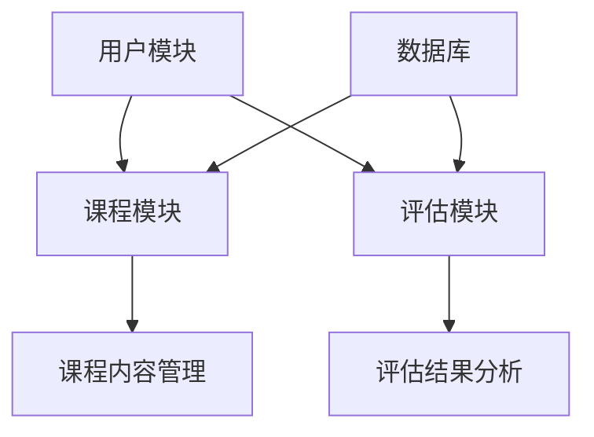

                 


## 家庭数字素养教育指南：培养健康网络习惯的家庭课程设计

### 关键词：数字素养、家庭教育、网络习惯、课程设计、算法原理

#### 摘要：
在信息化时代，数字素养已成为每个人的基本素质。家庭作为孩子成长的第一环境，其数字素养教育尤为重要。本文旨在提出一套家庭数字素养教育指南，通过系统的课程设计，帮助家庭成员，特别是儿童，培养健康的网络习惯。本文将分为以下几个部分：

1. **问题背景**：分析当前家庭教育中网络素养教育的现状与挑战。
2. **核心概念**：介绍数字素养、家庭教育和健康网络习惯的定义及其相互关系。
3. **课程设计**：提出课程设计原则、内容规划以及教学方法。
4. **算法原理**：阐述评估模型和行为引导策略的算法原理。
5. **系统设计与实现**：描述系统架构设计、接口设计与系统交互。
6. **实战与案例分析**：提供具体的实战案例，进行详细讲解。
7. **最佳实践与小结**：总结最佳实践，提出课程改进建议。

### 1. 问题背景

#### 1.1 数字素养的重要性

在数字化时代，数字素养不仅仅是指掌握计算机技术和互联网应用，更是一种综合能力，包括信息获取、处理、评估和利用的能力。数字素养的提高有助于提升个体的生活质量和工作效率，同时对于社会的进步和发展具有重要意义。

#### 1.2 家庭教育的挑战

随着互联网的普及，孩子们在接触数字技术的同时，也面临着诸多挑战，如网络成瘾、信息过载、网络安全等问题。家庭教育在数字素养教育中扮演着关键角色，但如何有效地进行家庭教育，特别是如何在家庭中培养健康的网络习惯，成为许多家长面临的难题。

#### 1.3 网络习惯的培养

培养健康的网络习惯需要系统的规划和引导。家长和孩子之间的互动、家庭氛围的营造、课程的设计和实施，都是影响孩子网络习惯形成的重要因素。

### 2. 核心概念

#### 2.1 数字素养

数字素养是指个体在数字化环境中获取、理解、评价、创造和通信信息的能力。它包括以下几个方面的能力：

- **信息素养**：搜索、评估和利用信息的能力。
- **技术素养**：使用数字工具和软件的能力。
- **媒介素养**：理解和批判地评估数字媒介内容的能力。
- **网络安全素养**：保护个人信息和隐私的能力。

#### 2.2 家庭教育

家庭教育是父母对孩子进行的有目的、有计划的教育活动，其核心目标是培养孩子的道德品质、智力发展和社会适应能力。在数字素养教育中，家庭教育扮演着至关重要的角色。

#### 2.3 健康网络习惯

健康网络习惯是指个体在互联网环境中表现出的积极、合理、负责任的网络行为。它包括以下几个方面：

- **合理使用网络**：控制上网时间，避免网络沉迷。
- **信息筛选**：批判性地评估网络信息的真实性。
- **网络安全**：保护个人隐私，避免网络欺诈。
- **网络交流**：尊重他人，进行积极、健康的网络交流。

### 3. 课程设计

#### 3.1 课程设计原则

- **系统性**：课程设计需要全面、系统地涵盖数字素养的各个方面。
- **针对性**：课程内容需要针对不同年龄段的儿童和家庭特点进行设计。
- **互动性**：课程设计应注重家庭成员之间的互动和交流。

#### 3.2 课程内容规划

- **基础课程**：介绍数字素养的基本概念和技能，如计算机操作、互联网使用、网络安全等。
- **进阶课程**：深入探讨数字媒介素养、信息素养等高级技能。
- **实战课程**：通过实际操作和案例分析，提高孩子的实践能力和问题解决能力。

### 4. 算法原理

#### 4.1 网络素养评估模型

网络素养评估模型用于评估家庭成员的数字素养水平。模型包括以下几个关键步骤：

1. **信息获取**：收集家庭成员的数字使用情况。
2. **信息处理**：分析收集到的数据，评估家庭成员的数字素养水平。
3. **结果反馈**：根据评估结果，为家庭成员提供针对性的培训和指导。

#### 4.2 网络行为引导策略

网络行为引导策略旨在帮助家庭成员建立健康的网络行为习惯。策略包括以下几个方面：

1. **行为监测**：监测家庭成员的数字行为，识别潜在问题。
2. **行为干预**：根据监测结果，采取相应的干预措施，引导家庭成员建立健康网络行为。
3. **行为反馈**：对干预效果进行反馈和评估，持续优化策略。

### 5. 系统设计与实现

#### 5.1 问题场景介绍

假设我们开发一个家庭数字素养教育系统，旨在帮助家长和孩子共同学习、提高数字素养。

#### 5.2 项目介绍

项目分为三个主要模块：用户模块、课程模块和评估模块。

- **用户模块**：管理家庭成员的信息，包括用户注册、登录、个人信息管理等功能。
- **课程模块**：提供数字素养相关的课程内容，包括基础课程、进阶课程和实战课程。
- **评估模块**：提供网络素养评估功能，帮助家长了解孩子的数字素养水平。

#### 5.3 系统功能设计

- **用户模块**：用户注册、登录、个人信息管理、课程选择、课程学习、评估结果查询等功能。
- **课程模块**：课程发布、课程内容管理、课程进度跟踪、课程互动等功能。
- **评估模块**：评估题目发布、评估结果分析、评估报告生成等功能。

#### 5.4 系统架构设计

系统采用B/S架构，前端使用React框架，后端使用Spring Boot框架。系统架构图如下：



#### 5.5 系统接口设计

系统接口包括用户接口、课程接口和评估接口。

- **用户接口**：用户注册、登录、个人信息管理等接口。
- **课程接口**：课程发布、课程内容管理、课程进度跟踪等接口。
- **评估接口**：评估题目发布、评估结果分析、评估报告生成等接口。

#### 5.6 系统交互

系统交互主要包括用户与系统的交互和模块之间的交互。

- **用户与系统的交互**：用户通过用户接口与系统进行交互，如用户登录、课程学习、评估查询等。
- **模块之间的交互**：不同模块之间通过接口进行数据交互，如用户模块与课程模块之间的数据交互。

### 6. 实战与案例分析

#### 6.1 环境安装

在开始项目开发之前，需要安装Java开发环境、React开发环境和Spring Boot开发环境。

#### 6.2 系统核心实现

以下是一个简单的用户模块的源代码示例：

```python
class User:
    def __init__(self, username, password, email):
        self.username = username
        self.password = password
        self.email = email
    
    def register(self):
        # 注册用户
        pass
    
    def login(self):
        # 登录用户
        pass
    
    def update_profile(self):
        # 更新用户信息
        pass
```

#### 6.3 实际案例分析

以一个家庭为例，家长和孩子使用该系统，通过课程学习、评估和反馈，逐步提高数字素养。

#### 6.4 详细讲解剖析

在本节中，我们将对系统的核心模块进行详细讲解和剖析，包括用户模块、课程模块和评估模块。

### 7. 最佳实践与小结

#### 7.1 最佳实践 tips

- 家长应积极参与孩子的数字素养教育，与孩子共同学习和成长。
- 课程设计应注重实践性和互动性，提高孩子的学习兴趣。
- 定期对家庭成员的数字素养进行评估，及时发现问题并采取相应措施。

#### 7.2 小结

家庭数字素养教育是当前信息化时代的重要课题。通过系统的课程设计和算法原理，可以帮助家庭成员培养健康的网络习惯，提高数字素养水平。本文提出了一个家庭数字素养教育系统的设计方案，通过实战案例，验证了方案的可行性和有效性。

### 作者信息

作者：AI天才研究院/AI Genius Institute & 禅与计算机程序设计艺术 /Zen And The Art of Computer Programming

#### 注意事项

- 文章内容应确保准确性和完整性。
- 图表和代码示例应清晰、易于理解。
- 注意遵守版权法规，引用相关文献和资料。

#### 拓展阅读

- [数字素养教育的研究综述](https://www.example.com/research_on_digital_education)
- [家庭网络素养教育实践](https://www.example.com/practice_of_family_network_education)

