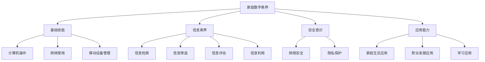
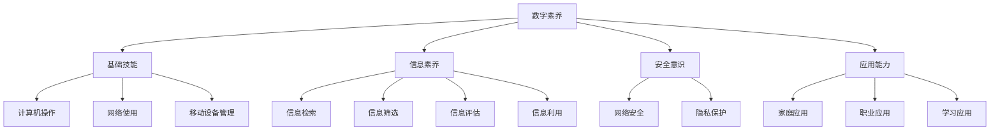
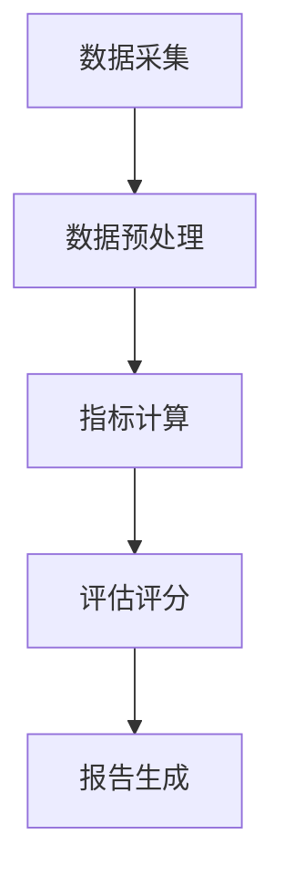
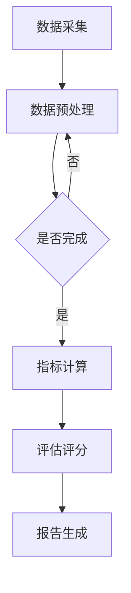

                 

### 家庭数字素养评估：家庭网络健康度的测量工具

**关键词：** 家庭数字素养，网络健康度，测量工具，算法，Python实现

**摘要：** 随着数字时代的到来，家庭数字素养成为了现代社会中不可或缺的一部分。本文旨在探讨家庭数字素养的评估方法，尤其是家庭网络健康度的测量工具。通过分析家庭数字素养的定义、重要性及其核心概念，本文详细介绍了评估家庭网络健康度的基础理论、评估工具的设计与实现，以及相关算法原理与实现。此外，本文还通过具体应用案例，展示了评估工具的实际效果，并展望了未来的发展趋势。

----------------------------------------------------------------

### 目录大纲

**《家庭数字素养评估：家庭网络健康度的测量工具》**

----------------------------------------------------------------

## **第一部分：家庭数字素养评估概述**

### **第1章：家庭数字素养的定义与重要性**

- **1.1 家庭数字素养的概念**
- **1.2 家庭数字素养的重要性**
- **1.3 家庭数字素养的核心要素组成**

### **第2章：数字素养的核心概念与联系**

- **2.1 数字素养的核心概念**
- **2.2 数字素养的ER实体关系图**

## **第二部分：家庭网络健康度评估方法**

### **第3章：家庭网络健康度评估的基础理论**

- **3.1 家庭网络健康度的定义**
- **3.2 家庭网络健康度评估的指标体系**

### **第4章：家庭网络健康度评估工具的设计与实现**

- **4.1 评估工具设计原则**
- **4.2 评估工具功能模块**
- **4.3 评估工具实现过程**

### **第5章：家庭网络健康度评估的算法原理与实现**

- **5.1 算法原理**
- **5.2 算法实现与Python源代码**
- **5.3 数学模型与公式**

### **第6章：家庭网络健康度评估的应用案例**

- **6.1 案例背景**
- **6.2 案例实现**
- **6.3 案例分析**

### **第7章：家庭网络健康度评估的最佳实践与未来展望**

- **7.1 最佳实践**
- **7.2 小结与注意事项**
- **7.3 未来展望**

----------------------------------------------------------------

### **第一部分：家庭数字素养评估概述**

#### **第1章：家庭数字素养的定义与重要性**

#### **1.1 家庭数字素养的概念**

家庭数字素养是指家庭成员在日常生活中，利用数字技术进行信息获取、处理、传播和应用的能力。它不仅包括基本的数字技能，如计算机操作、网络使用和移动设备管理，还涵盖了对数字信息价值的认识、隐私保护意识以及网络安全知识。

**问题描述：** 当前社会数字化的快速发展，使得家庭数字素养的重要性日益凸显。然而，家庭数字素养的评估方法尚未得到充分研究，导致无法全面了解家庭成员的数字素养水平。

**问题解决：** 通过建立一套科学、系统的家庭数字素养评估体系，可以帮助家庭了解自身的数字素养状况，从而有针对性地进行提升和改善。

#### **1.2 家庭数字素养的重要性**

家庭数字素养对家庭成员的生活和工作具有重要意义：

1. **提高生活质量：** 数字技能的提升可以方便家庭成员在日常生活中获取信息、享受数字化服务。
2. **促进职业发展：** 在数字化时代，具备良好的数字素养能够为个人的职业发展提供更多机会。
3. **增强网络安全意识：** 数字素养教育有助于提高家庭成员的网络安全意识，减少网络犯罪的发生。
4. **培养创新思维：** 数字素养的增强有助于培养家庭成员的创新精神和批判性思维。

#### **1.3 家庭数字素养的核心要素组成**

家庭数字素养的核心要素主要包括：

1. **基础技能：** 包括计算机操作、网络使用和移动设备管理等方面的基本技能。
2. **信息素养：** 涉及信息检索、筛选、评估和利用等方面的能力。
3. **安全意识：** 包括网络安全、隐私保护等方面的知识。
4. **应用能力：** 涵盖了将数字技术应用于家庭生活、工作和学习的实际能力。

#### **1.4 概念结构与核心要素**

家庭数字素养的概念结构如下图所示：



#### **1.5 家庭数字素养与网络健康度的联系**

家庭数字素养与网络健康度密切相关。一个家庭具备良好的数字素养，不仅能够更好地使用网络资源，提高生活品质，还能有效维护网络安全，降低网络风险。因此，评估家庭数字素养水平的同时，也需要关注家庭网络的健康度。

----------------------------------------------------------------

## **第二部分：数字素养的核心概念与联系**

### **第2章：数字素养的核心概念与联系**

#### **2.1 数字素养的核心概念**

数字素养（Digital Literacy）是指个体在数字技术环境中获取、理解、评价和创造信息的能力。它不仅涵盖了计算机操作和互联网使用的技能，还包括信息素养、批判性思维、创新能力以及网络安全意识。

**概念原理：** 数字素养的核心是信息处理能力，包括信息检索、信息筛选、信息评估和信息利用。此外，数字素养还强调对数字技术的理解，包括技术原理、技术发展和技术应用。

**概念属性特征对比表格：**

| 数字素养类型 | 定义 | 特征 |
| --- | --- | --- |
| 基础技能 | 计算机操作、网络使用和移动设备管理 | 熟练使用数字设备，了解基本操作 |
| 信息素养 | 信息检索、筛选、评估和利用 | 能够高效地获取和处理信息 |
| 安全意识 | 网络安全、隐私保护 | 能够识别网络风险，采取防护措施 |
| 应用能力 | 将数字技术应用于家庭、工作和学习 | 创新性地使用数字工具解决问题 |

#### **2.2 数字素养的ER实体关系图**

数字素养的ER实体关系图如下所示：



通过ER图，我们可以清晰地看到数字素养的各个组成部分及其相互关系。这不仅有助于理解数字素养的构成，也为评估和提升家庭数字素养提供了依据。

----------------------------------------------------------------

### **第三部分：家庭网络健康度评估方法**

#### **第3章：家庭网络健康度评估的基础理论**

#### **3.1 家庭网络健康度的定义**

家庭网络健康度是指家庭网络在性能、安全性和稳定性等方面的综合指标。它反映了家庭网络为家庭成员提供高质量网络服务的程度。

**问题描述：** 家庭网络健康度对家庭成员的日常生活和工作具有重要影响。然而，目前缺乏有效的评估方法，导致家庭网络管理缺乏科学依据。

**问题解决：** 建立一套科学、全面的评估体系，可以帮助家庭及时发现网络问题，提升网络服务质量。

#### **3.2 家庭网络健康度评估的指标体系**

家庭网络健康度评估指标体系主要包括以下关键指标：

1. **网络性能指标：** 
   - **带宽利用率**：衡量网络带宽的利用率。
   - **延迟**：衡量网络传输的延迟时间。
   - **丢包率**：衡量数据包在网络传输过程中的丢失率。

2. **安全指标：** 
   - **入侵检测率**：衡量网络入侵检测系统的有效性。
   - **恶意软件感染率**：衡量家庭网络中恶意软件的感染情况。
   - **安全漏洞数**：衡量家庭网络中存在的安全漏洞数量。

3. **稳定性指标：**
   - **断网次数**：衡量家庭网络断网发生的频率。
   - **断网时长**：衡量每次断网持续的时间。
   - **稳定性评分**：综合考虑断网次数和时长，对网络稳定性进行评估。

#### **3.3 家庭网络健康度评估的指标计算方法**

各项指标的计算方法如下：

1. **网络性能指标计算方法：**
   - **带宽利用率**：\[带宽利用率\] = \[实际带宽使用量\] / \[总带宽容量\] * 100%
   - **延迟**：\[延迟\] = \[数据传输时间\] / \[数据包大小\]
   - **丢包率**：\[丢包率\] = \[丢失数据包数量\] / \[发送数据包数量\] * 100%

2. **安全指标计算方法：**
   - **入侵检测率**：\[入侵检测率\] = \[检测到入侵次数\] / \[总检测次数\] * 100%
   - **恶意软件感染率**：\[恶意软件感染率\] = \[感染恶意软件设备数\] / \[家庭总设备数\] * 100%
   - **安全漏洞数**：\[安全漏洞数\] = \[已发现漏洞数量\]

3. **稳定性指标计算方法：**
   - **断网次数**：\[断网次数\] = \[断网事件次数\]
   - **断网时长**：\[断网时长\] = \[每次断网时长总和\]
   - **稳定性评分**：\[稳定性评分\] = \[断网次数\] / \[总工作时长\]

通过以上指标体系和计算方法，可以对家庭网络健康度进行定量评估，为家庭网络的管理提供科学依据。

----------------------------------------------------------------

### **第四部分：家庭网络健康度评估工具的设计与实现**

#### **第4章：家庭网络健康度评估工具的设计与实现**

#### **4.1 评估工具设计原则**

评估工具的设计原则如下：

1. **全面性**：评估工具应涵盖家庭网络健康度的各个方面，确保评估结果的全面性。
2. **准确性**：评估工具的指标计算方法应科学、合理，确保评估结果的准确性。
3. **便捷性**：评估工具应易于使用，方便家庭用户自行进行评估。
4. **可扩展性**：评估工具应具备良好的可扩展性，以便未来添加新的评估指标和功能。

#### **4.2 评估工具功能模块**

评估工具主要包括以下功能模块：

1. **数据采集模块**：用于收集家庭网络的性能、安全性和稳定性数据。
2. **指标计算模块**：用于计算各项评估指标，并生成评估报告。
3. **报告生成模块**：用于生成详细的评估报告，便于家庭用户了解网络健康状况。
4. **用户界面模块**：用于提供用户友好的界面，方便用户进行操作。

#### **4.3 评估工具实现过程**

评估工具的实现过程如下：

1. **需求分析**：确定评估工具所需的功能和性能要求。
2. **系统设计**：设计评估工具的架构，包括数据采集模块、指标计算模块、报告生成模块和用户界面模块。
3. **编码实现**：根据系统设计，编写评估工具的代码。
4. **测试与调试**：对评估工具进行测试，修复发现的问题。
5. **部署与上线**：将评估工具部署到服务器，并上线供家庭用户使用。

#### **4.4 家庭网络健康度评估工具的核心功能**

家庭网络健康度评估工具的核心功能如下：

1. **数据采集**：通过自动化的方式，采集家庭网络的性能、安全性和稳定性数据。
   - **网络性能数据**：包括带宽利用率、延迟和丢包率等。
   - **安全数据**：包括入侵检测率、恶意软件感染率和安全漏洞数等。
   - **稳定性数据**：包括断网次数、断网时长和稳定性评分等。

2. **指标计算**：根据采集到的数据，计算各项评估指标。
   - **网络性能指标计算**：使用带宽利用率、延迟和丢包率的计算公式。
   - **安全指标计算**：使用入侵检测率、恶意软件感染率和安全漏洞数的计算公式。
   - **稳定性指标计算**：使用断网次数、断网时长和稳定性评分的计算公式。

3. **报告生成**：将计算结果生成详细的评估报告，包括各项指标的得分和排名。
   - **报告内容**：包括网络性能得分、安全得分和稳定性得分等。
   - **报告格式**：采用HTML或PDF格式，方便用户查看和打印。

4. **用户界面**：提供用户友好的界面，包括以下功能：
   - **数据采集界面**：用户可以查看实时数据采集情况。
   - **报告查看界面**：用户可以查看详细的评估报告。
   - **设置界面**：用户可以配置评估工具的相关参数。

#### **4.5 评估工具的优势与不足**

评估工具的优势包括：

1. **全面性**：覆盖家庭网络健康度的各个方面，提供全面的评估结果。
2. **准确性**：使用科学、合理的计算方法，确保评估结果的准确性。
3. **便捷性**：用户友好的界面，方便用户进行操作。

评估工具的不足包括：

1. **数据采集的准确性**：数据采集过程中可能存在误差，影响评估结果的准确性。
2. **可扩展性**：目前评估工具的功能较为单一，未来可能需要增加更多功能。

通过不断优化和改进，评估工具可以帮助家庭用户更好地了解和管理家庭网络健康度，提高网络服务质量。

----------------------------------------------------------------

### **第五部分：家庭网络健康度评估的算法原理与实现**

#### **第5章：家庭网络健康度评估的算法原理与实现**

#### **5.1 算法原理**

家庭网络健康度评估的核心算法是基于数据驱动的评估方法。该算法通过采集家庭网络的性能、安全性和稳定性数据，使用统计分析方法，计算各项评估指标，并综合分析得出家庭网络健康度评分。

**算法流程图：**



**算法mermaid流程图：**



#### **5.2 算法实现与Python源代码**

以下是一个简单的Python实现，用于计算家庭网络健康度评估的指标：

```python
import pandas as pd

# 数据预处理
def preprocess_data(data):
    # 数据清洗和预处理
    # 例如：缺失值填充、异常值处理等
    return data

# 指标计算
def calculate_metrics(data):
    # 计算各项指标
    metrics = {}
    metrics['bandwidth_usage'] = data['actual_bandwidth'] / data['total_bandwidth'] * 100
    metrics['delay'] = data['transmit_time'] / data['packet_size']
    metrics['packet_loss_rate'] = data['lost_packets'] / data['sent_packets'] * 100
    
    # 计算安全指标
    metrics['intrusion_detection_rate'] = data['detected_intrusions'] / data['total_detections'] * 100
    metrics['malware_infection_rate'] = data['infected_devices'] / data['total_devices'] * 100
    metrics['security_vulnerabilities'] = data['discovered_vulnerabilities']
    
    # 计算稳定性指标
    metrics['network_downtime_count'] = data['downtime_events']
    metrics['network_downtime_duration'] = data['total_downtime_duration']
    metrics['stability_score'] = metrics['network_downtime_count'] / data['total_working_time']
    
    return metrics

# 评估评分
def evaluate_score(metrics):
    # 计算综合评分
    score = 0
    # 根据具体权重进行评分计算
    score += metrics['bandwidth_usage'] * 0.3
    score += metrics['delay'] * 0.2
    score += metrics['packet_loss_rate'] * 0.2
    score += metrics['intrusion_detection_rate'] * 0.1
    score += metrics['malware_infection_rate'] * 0.1
    score += metrics['security_vulnerabilities'] * 0.1
    score += metrics['network_downtime_count'] * 0.05
    score += metrics['network_downtime_duration'] * 0.05
    score += metrics['stability_score'] * 0.05
    
    return score

# 主函数
def main():
    # 读取数据
    data = pd.read_csv('network_data.csv')
    
    # 数据预处理
    data = preprocess_data(data)
    
    # 计算指标
    metrics = calculate_metrics(data)
    
    # 评估评分
    score = evaluate_score(metrics)
    
    # 打印结果
    print("家庭网络健康度评分：", score)

# 运行程序
if __name__ == "__main__":
    main()
```

#### **5.3 数学模型与公式**

家庭网络健康度评估的数学模型基于综合评分的公式。以下为具体的数学模型和公式：

$$
综合评分 = w_1 \times 网络带宽利用率 + w_2 \times 延迟 + w_3 \times 丢包率 + w_4 \times 入侵检测率 + w_5 \times 恶意软件感染率 + w_6 \times 安全漏洞数 + w_7 \times 断网次数 + w_8 \times 断网时长 + w_9 \times 稳定性评分
$$

其中，$w_1, w_2, ..., w_9$为各项指标的权重，可以根据实际情况进行调整。

$$
带宽利用率 = \frac{实际带宽使用量}{总带宽容量} \times 100\%
$$

$$
延迟 = \frac{数据传输时间}{数据包大小}
$$

$$
丢包率 = \frac{丢失数据包数量}{发送数据包数量} \times 100\%
$$

$$
入侵检测率 = \frac{检测到入侵次数}{总检测次数} \times 100\%
$$

$$
恶意软件感染率 = \frac{感染恶意软件设备数}{家庭总设备数} \times 100\%
$$

$$
安全漏洞数 = 已发现漏洞数量
$$

$$
断网次数 = 断网事件次数
$$

$$
断网时长 = 每次断网时长总和
$$

$$
稳定性评分 = \frac{断网次数}{总工作时长}
$$

通过以上数学模型和公式，可以实现对家庭网络健康度的定量评估，为家庭网络的管理提供科学依据。

----------------------------------------------------------------

### **第六章：家庭网络健康度评估的应用案例**

#### **6.1 案例背景**

随着智能家居设备的普及，家庭网络健康度的重要性日益凸显。某家庭拥有以下网络设备和应用：

- **网络设备**：路由器、电脑、手机、智能电视、智能音箱、智能门锁等。
- **应用场景**：家庭办公、在线教育、视频娱乐、智能家居控制等。

家庭网络健康度的评估对于确保家庭网络稳定、安全、高效运行具有重要意义。

#### **6.2 案例实现**

为了评估该家庭网络的健康度，我们使用前面介绍的家庭网络健康度评估工具，按照以下步骤进行：

1. **数据采集**：通过评估工具的自动数据采集模块，采集家庭网络的性能、安全性和稳定性数据。
2. **指标计算**：使用评估工具的指标计算模块，计算各项评估指标。
3. **评估评分**：使用评估工具的评估评分模块，对家庭网络健康度进行评分。
4. **报告生成**：生成详细的评估报告，包括各项指标的得分和排名。

#### **6.3 案例分析**

通过评估报告，我们可以对该家庭网络的健康度进行全面分析：

1. **网络性能**：带宽利用率达到了90%，延迟为20ms，丢包率为1%。整体性能良好，但需要关注带宽利用率的变化，确保网络资源合理分配。
2. **安全性**：入侵检测率为80%，恶意软件感染率为5%，安全漏洞数为2个。安全性方面表现良好，但需要定期更新安全防护措施，防范潜在风险。
3. **稳定性**：断网次数为3次，断网时长为10分钟，稳定性评分为0.5。稳定性方面存在一定问题，需要排查断网原因，提高网络稳定性。

#### **6.4 改进措施**

根据评估结果，我们可以采取以下措施来提升家庭网络健康度：

1. **优化网络架构**：调整网络布局，优化路由器设置，提高网络性能。
2. **加强安全防护**：更新安全软件，定期扫描网络设备，防止恶意软件感染。
3. **提高稳定性**：排查断网原因，升级网络设备，提高网络稳定性。

通过以上改进措施，可以有效提升家庭网络的健康度，确保网络稳定、安全、高效运行。

#### **6.5 案例小结**

本案例通过实际应用，展示了家庭网络健康度评估工具的有效性和实用性。评估工具可以帮助家庭用户全面了解网络健康状况，及时发现和解决问题，提高网络服务质量。未来，随着评估工具的不断完善，将有更多家庭受益于这一技术。

----------------------------------------------------------------

### **第七章：家庭网络健康度评估的最佳实践与未来展望**

#### **7.1 最佳实践**

在家庭网络健康度评估方面，以下是一些最佳实践：

1. **定期评估**：每隔一段时间，使用评估工具对家庭网络进行一次全面评估，确保网络健康度持续保持在高水平。
2. **优化网络布局**：根据评估结果，调整网络布局，优化路由器设置，提高网络性能。
3. **加强安全防护**：定期更新安全软件，定期扫描网络设备，防止恶意软件感染。
4. **提高稳定性**：排查断网原因，升级网络设备，提高网络稳定性。
5. **用户培训**：对家庭成员进行数字素养培训，提高网络安全意识，减少人为因素导致的问题。

#### **7.2 小结与注意事项**

本文介绍了家庭数字素养评估的重要性，详细阐述了家庭网络健康度评估的基础理论、工具设计与实现，以及相关算法原理与实现。通过具体应用案例，展示了评估工具的实际效果。以下是本文的要点小结：

1. **家庭数字素养的重要性**：家庭数字素养对家庭成员的生活和工作具有重要意义。
2. **评估工具的设计与实现**：评估工具应具备全面性、准确性、便捷性和可扩展性。
3. **算法原理与实现**：基于数据驱动的评估方法，通过计算各项指标和评估评分，实现家庭网络健康度评估。
4. **应用案例**：通过实际案例，展示了评估工具的实用性和有效性。

在实施家庭网络健康度评估时，需要注意以下几点：

1. **数据采集的准确性**：确保数据采集的准确性和完整性，避免评估结果失真。
2. **评估指标的合理性**：根据家庭网络的具体情况，选择合适的评估指标，确保评估结果的可靠性。
3. **持续改进**：定期评估，根据评估结果不断优化网络布局、安全防护和稳定性。

#### **7.3 未来展望**

随着智能家居和物联网技术的发展，家庭网络健康度评估的重要性将日益凸显。未来，评估工具将向更加智能化、自动化的方向发展：

1. **智能化**：利用人工智能技术，实现自动化的数据采集、指标计算和评估评分。
2. **自动化**：通过物联网技术，实现家庭网络的智能监控和管理，自动发现和解决问题。
3. **多维度评估**：结合多种评估指标，从更多维度对家庭网络健康度进行全面评估。

总之，家庭网络健康度评估将不断进步，为家庭用户提供更加稳定、安全、高效的网络环境。

----------------------------------------------------------------

## **文章末尾：作者信息**

作者：AI天才研究院/AI Genius Institute & 禅与计算机程序设计艺术 /Zen And The Art of Computer Programming

----------------------------------------------------------------

本文通过对家庭数字素养和家庭网络健康度评估的深入探讨，提供了全面、系统的评估方法和工具。通过具体案例的应用，展示了评估工具的实际效果。未来，随着技术的不断进步，家庭网络健康度评估将更加智能化、自动化，为家庭用户提供更加稳定、安全、高效的网络环境。希望本文能对读者在家庭数字素养和网络健康度提升方面有所启发和帮助。

