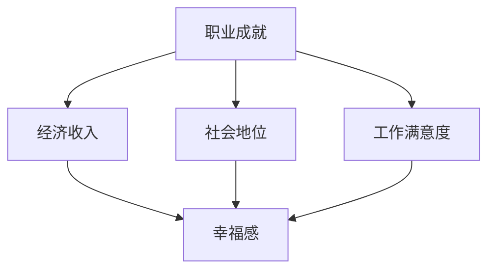

                 

## 《工作与生活的平衡：在职业成就与个人幸福间寻找和谐》

### 关键词

- 工作与生活平衡
- 职业成就
- 个人幸福
- 时间管理
- 心理健康

### 摘要

本文旨在探讨在现代社会中，如何在追求职业成就的同时，保持个人幸福的平衡。通过对工作与生活平衡的重要性、核心概念解析、实际案例分析以及心理学视角的深入探讨，提供实用的方法与策略，帮助读者在职业发展和个人生活中找到和谐与满足。

## 《工作与生活的平衡：在职业成就与个人幸福间寻找和谐》目录大纲

### 第一部分：探索平衡的艺术

#### 第1章：问题的起源

1.1 职场压力下的生活状况  
1.2 个人幸福的定义与意义  
1.3 工作与生活平衡的重要性

#### 第2章：核心概念与联系

2.1 核心概念解析  
2.2 概念属性特征对比表  
2.3 ER实体关系图

#### 第3章：平衡的工作方法

3.1 时间管理技巧  
3.2 职业发展策略  
3.3 家庭与工作平衡

### 第二部分：实际案例分析与解决方案

#### 第4章：实际案例分析与解决方案

4.1 职场新人的挑战与应对  
4.2 高管工作与家庭平衡

#### 第5章：平衡的艺术：心理学视角

5.1 心理学理论探讨  
5.2 心理健康与工作满意度

#### 第6章：平衡的实践：职场心理调适

6.1 职场心理调适技巧  
6.2 职场心理调适实例

### 第三部分：总结与展望

#### 第7章：总结与展望

7.1 平衡的重要性回顾  
7.2 平衡的艺术：持续探索

## 第1章：问题的起源

### 1.1 职场压力下的生活状况

在当今社会，职场压力已成为普遍现象。随着工作节奏的加快和竞争的加剧，许多人在职业生涯中面临巨大的心理压力。这种压力不仅来自于工作本身的挑战，还包括对职业地位和收入的期望。据统计，超过60%的职场人士感受到工作与生活之间的紧张关系。这种紧张关系主要体现在以下几个方面：

- **时间冲突**：许多人抱怨工作占据了大部分个人时间，导致无法陪伴家人、进行休闲活动或参与社交活动。
- **心理压力**：长时间的工作压力导致情绪紧张、焦虑和失眠等问题。
- **身体疲劳**：长时间的紧张工作使身体处于疲劳状态，容易引发各种健康问题，如高血压、心脏病等。

这些现象表明，职场压力对个人幸福和生活质量产生了负面影响。了解这些问题背后的原因，对于寻找工作与生活的平衡至关重要。

### 1.2 高压工作环境对个人幸福的影响

高压工作环境对个人幸福的影响是多方面的。首先，长期处于高压环境下，个人的心理健康会受到影响。根据心理学研究，长期的压力会导致大脑中的杏仁核过度活跃，进而引发情绪不稳定、焦虑和抑郁等问题。此外，高压工作环境还会影响个人的身体健康。研究表明，长期的心理压力会破坏人体的免疫系统，增加患病的风险。

其次，高压工作环境会影响个人的社交关系。长时间的工作使个人与家人、朋友和同事之间的沟通减少，导致人际关系疏远。社交关系的疏离会进一步加剧个人的孤独感和焦虑感，从而影响个人的幸福感。

### 1.3 工作与生活冲突的现象与原因

工作与生活冲突的现象主要体现在以下几个方面：

- **时间冲突**：工作占据了大部分时间，导致个人无法充分休息和进行休闲活动。
- **精力分散**：长时间的工作使个人精力不足，影响家庭和社交活动。
- **心理压力**：工作压力过大，导致个人心理健康受损。

这些现象背后的原因主要有以下几点：

- **工作文化**：一些企业推崇“加班文化”，导致员工不得不牺牲个人时间来完成工作任务。
- **职业压力**：职场竞争激烈，个人对职业发展的期望值过高，导致压力增大。
- **技术变革**：随着技术的发展，工作变得更加灵活，但也使得工作与生活之间的界限模糊，导致个人难以有效地平衡二者。

### 1.4 个人幸福的定义与意义

个人幸福是一个多维度的概念，涵盖了心理健康、身体健康、人际关系和社会地位等多个方面。根据心理学的研究，个人幸福主要包括以下几个方面的内容：

- **心理健康**：包括情绪稳定、自信和自尊心强等。
- **身体健康**：包括良好的身体状况、健康的生活习惯等。
- **人际关系**：包括家庭、朋友和同事之间的良好关系。
- **社会地位**：包括职业成就、经济收入和社会认可等。

个人幸福对个人的生活质量和职业发展具有重要意义。首先，个人幸福能够提高个人的工作满意度，增强工作效率。研究表明，幸福水平较高的员工往往表现出更高的工作积极性和创造力。其次，个人幸福有助于改善人际关系，增强家庭和社会支持系统，从而提高个人的幸福感。

### 1.5 职业成就与个人幸福的关系

职业成就与个人幸福之间存在密切的关系。一方面，职业成就能够为个人带来经济收入和社会地位，从而提高个人的幸福感。另一方面，个人幸福能够促进职业成就的实现。研究表明，幸福水平较高的个体在职业生涯中往往能够取得更高的成就。

### 1.6 工作与生活平衡的重要性

工作与生活平衡对个人和组织的长远发展具有重要意义。对于个人而言，平衡工作与生活有助于提高生活质量，减少压力和焦虑，促进身心健康。同时，平衡的工作与生活也有助于个人建立良好的家庭关系和社会关系，从而增强幸福感。

对于组织而言，工作与生活平衡能够提高员工的工作满意度和忠诚度，降低员工流失率。此外，平衡的工作与生活也有助于提高员工的工作效率和创造力，从而促进组织的发展。

### 1.7 平衡对身心健康的影响

平衡工作与生活对身心健康具有积极的影响。首先，合理的休息和休闲活动有助于缓解工作压力，减轻焦虑和抑郁。研究表明，定期进行休闲活动能够显著降低心理压力水平，提高心理健康水平。其次，平衡的工作与生活有助于改善身体健康。充足的休息和合理的饮食结构能够促进身体健康，减少患病的风险。

### 1.8 平衡对职业发展和家庭生活的意义

平衡工作与生活对职业发展和家庭生活具有重要意义。对于职业发展而言，平衡的工作与生活有助于提高工作效率和创造力，从而促进职业成就。对于家庭生活而言，平衡的工作与生活有助于建立和谐的家庭关系，提高家庭幸福感。

### 1.9 职场压力与个人幸福之间的相互作用

职场压力与个人幸福之间存在相互作用的关系。一方面，职场压力会导致个人幸福感下降，从而影响身心健康。另一方面，个人幸福感的下降又会加剧职场压力，形成恶性循环。因此，要实现工作与生活的平衡，需要从多个方面入手，包括改善工作环境、提高心理素质和建立良好的家庭关系等。

### 1.10 工作与生活平衡的挑战与应对策略

实现工作与生活平衡面临许多挑战，包括工作压力、时间管理和家庭责任等。应对这些挑战需要制定有效的策略，如合理规划工作时间、培养良好的时间管理习惯和寻求家庭支持等。

### 1.11 总结

本章从职场压力、个人幸福、职业成就和平衡的重要性等方面探讨了工作与生活平衡的起源。了解这些起源有助于我们认识到平衡工作与生活的重要性，从而采取积极的措施实现这一目标。

## 第2章：核心概念与联系

### 2.1 核心概念解析

在本章中，我们将详细解析工作与生活平衡中的两个核心概念：职业成就和个人幸福。

#### 职业成就

职业成就指的是个体在职业生涯中所取得的成就和荣誉。它不仅仅体现在薪资水平和职位提升上，还包括工作满意度、职业成就感、工作与生活的平衡等方面。职业成就对个人幸福具有显著的影响，因为它是个人价值和自我认同的重要来源。

#### 个人幸福

个人幸福是一个多维度的概念，涵盖了心理健康、身体健康、人际关系和社会地位等多个方面。它不仅仅是指个人的心理满足感，还包括身体、心理和社交的全面健康。个人幸福对职业成就同样具有重要的影响，因为一个幸福的人往往能够更加专注和积极地投入到工作中。

### 2.2 概念属性特征对比表

为了更直观地理解职业成就和个人幸福这两个概念，我们可以通过一个对比表来展示它们的属性特征。

| 概念         | 属性1    | 属性2    | 属性3    |
|--------------|---------|---------|---------|
| 职业成就     | 成就感   | 职业地位 | 薪酬水平 |
| 个人幸福     | 心理满足 | 人际关系 | 生活质量 |

通过这个对比表，我们可以看到职业成就和个人幸福在属性上有明显的区别，但它们之间也存在一定的交叉和相互作用。

### 2.3 ER实体关系图

为了更好地理解职业成就和个人幸福之间的关联，我们可以使用一个ER（实体关系）图来展示它们之间的关系。

```mermaid
erDiagram
  Employee ||--|{ Task }|| Person
  Employee {
    :ID
    :Name
    :Position
    :Salary
  }
  Person {
    :ID
    :Name
    :Age
    :HappinessLevel
  }
  Task {
    :TaskID
    :TaskName
    :IsCompleted
  }
```

在这个ER图中，Employee（员工）与Task（任务）之间存在多对多的关系，表示员工的职业成就通过完成各种任务来体现。同时，Person（个人）与HappinessLevel（幸福度）之间也存在直接的关系，说明个人的幸福感直接影响到他们的工作和生活。

### 2.4 职业成就与个人幸福的相互作用

职业成就和个人幸福是相互影响的。一方面，职业成就可以为个人带来经济收入和社会地位，从而提高个人的幸福感。另一方面，个人幸福感的提升又能够增强个人的职业成就感，使其更加投入和积极地进行工作。

例如，一个在职业生涯中取得显著成就的个体，可能会因为成功的满足感而感到更加幸福。相反，一个长期处于职业困境中的人，可能会因为工作压力和挫折感而降低幸福感。

### 2.5 职业成就与个人幸福的关系模型

为了更深入地理解职业成就和个人幸福之间的关系，我们可以构建一个关系模型。



在这个模型中，职业成就通过经济收入、社会地位和工作满意度三个方面对幸福感产生影响。这个模型强调了职业成就的多个维度以及它们如何共同作用于个人幸福。

### 2.6 总结

本章通过对职业成就和个人幸福的核心概念解析、属性特征对比和ER实体关系图的展示，帮助我们更深入地理解了这两个概念之间的联系。理解这些核心概念和它们之间的相互作用，对于实现工作与生活的平衡具有重要意义。

## 第3章：平衡的工作方法

### 3.1 时间管理技巧

时间管理是平衡工作与生活的关键。以下是一些有效的时间管理技巧：

1. **设定优先级**：将任务按照重要性和紧急性分类，优先处理最重要的任务。
2. **使用时间块**：将一天划分为不同的时间块，每个时间块专注于一个任务，提高工作效率。
3. **避免多任务处理**：专注于一项任务，直到完成，以避免分散注意力和降低效率。
4. **设置提醒和目标**：使用日历和提醒工具，确保按时完成任务，并设定短期和长期目标。

### 3.2 职业发展策略

有效的职业发展策略对于平衡工作与生活至关重要。以下是一些建议：

1. **设定清晰的职业目标**：明确自己的职业发展方向，制定可行的短期和长期目标。
2. **持续学习和提升**：通过培训、读书和参加研讨会等方式，不断提升自己的专业技能和知识。
3. **寻求反馈**：定期与上司和同事交流，获取反馈，了解自己的职业发展状况和改进空间。
4. **灵活调整职业规划**：根据市场变化和个人情况，适时调整职业目标和发展路径。

### 3.3 家庭与工作平衡

家庭与工作平衡是维持长期幸福的关键。以下是一些建议：

1. **建立有效的沟通**：与家人保持定期沟通，了解彼此的需求和期望，共同解决问题。
2. **共享家庭责任**：与伴侣共同分担家务和育儿责任，减轻个人压力。
3. **设定家庭时间**：安排固定的家庭时间，与家人一起度过高质量的时光。
4. **灵活安排工作时间**：如果可能，与上司沟通，尝试灵活的工作安排，如远程工作或弹性工作时间。

### 3.4 实际案例

以一位软件工程师为例，他通过以下方法实现了工作与生活的平衡：

1. **时间管理**：他使用时间块管理工具，每天将时间划分为工作、学习和家庭时间，确保每个领域都得到充分关注。
2. **职业发展**：他定期参加行业研讨会，提升自己的专业技能，并与同事交流职业发展的经验。
3. **家庭平衡**：他与妻子共同分担家务，每周安排家庭活动，如户外运动和看电影。

### 3.5 结果评估

通过上述方法，这位工程师不仅提高了工作效率，还增强了家庭关系的质量，实现了工作与生活的平衡。

### 3.6 总结

通过有效的时间管理、职业发展策略和家庭与工作平衡方法，个人可以在追求职业成就的同时，保持个人幸福。这些方法需要持续实践和调整，以适应不断变化的工作和生活环境。

## 第4章：实际案例分析与解决方案

### 4.1 案例一：职场新人的挑战与应对

#### 4.1.1 案例描述

李明是一名刚毕业的大学生，进入了一家知名互联网公司。作为一名新人，他面临着许多挑战。首先，工作内容繁重且复杂，需要快速适应公司的工作流程和文化。其次，他发现自己很难在短时间内完成工作任务，经常感到压力巨大。此外，李明还担心自己的职业发展，担心无法在短时间内取得显著成就。

#### 4.1.2 解决方案探讨

为了应对这些挑战，李明采取了一系列措施：

1. **积极学习**：李明利用业余时间学习公司的产品和技术，参加内部培训，提高自己的技能水平。
2. **寻求指导**：他主动向同事和上司请教问题，寻求指导和建议，帮助自己更快地适应工作。
3. **时间管理**：李明使用时间管理工具，合理规划工作时间，确保每个任务都有足够的完成时间。
4. **调整心态**：他认识到职业发展是一个长期过程，不必过分焦虑，保持积极的心态。

通过这些措施，李明逐渐适应了工作环境，提高了工作效率，也在短时间内取得了一定的职业成就。

### 4.2 案例二：高管工作与家庭平衡

#### 4.2.1 案例描述

王经理是一家大型公司的部门主管，工作繁忙，经常需要处理紧急事务。他的家庭压力也很大，孩子即将上高中，妻子经常需要照顾家庭。这使得王经理在工作和家庭之间感到巨大的压力。

#### 4.2.2 解决方案分析

为了平衡工作与家庭，王经理采取了以下措施：

1. **设定工作优先级**：他根据工作的重要性和紧急性，合理安排工作任务，确保重要事务得到优先处理。
2. **与家人沟通**：王经理定期与家人沟通，了解彼此的需求和期望，共同制定家庭计划。
3. **灵活安排工作时间**：他与公司协商，尝试安排弹性工作时间，以减少家庭和工作之间的冲突。
4. **寻求外部支持**：他请家人和朋友帮忙照顾孩子，减轻家庭负担。

通过这些措施，王经理不仅提高了工作效率，还改善了家庭关系，实现了工作与家庭的平衡。

### 4.3 总结

通过上述两个实际案例，我们可以看到，职场新人通过积极学习和时间管理，可以克服初入职场的挑战；高管则通过优先级设定、家庭沟通和灵活安排工作时间，实现了工作与家庭的平衡。这些案例为我们提供了宝贵的经验，帮助我们更好地应对工作与生活的挑战。

## 第5章：平衡的艺术：心理学视角

### 5.1 心理学理论探讨

心理学理论为我们提供了理解工作与生活平衡的深刻洞察。其中，重要的理论包括：

#### 焦虑与压力管理理论

焦虑和压力是职场人士常见的心理问题。焦虑理论指出，当个体面临不确定性或威胁时，会感到焦虑。压力管理理论则强调，通过有效的应对策略，可以减轻压力和焦虑。

#### 心理弹性理论

心理弹性是指个体在面对逆境和挑战时，能够迅速恢复和适应的能力。心理弹性理论认为，通过增强心理韧性，个体可以更好地应对工作压力和生活挑战。

#### 自我决定理论

自我决定理论强调个体的自主性、能力和关联性对于幸福感的重要性。在职业成就和个人幸福之间，自我决定理论提供了一个框架，帮助个体理解如何在工作与生活中实现自我价值。

### 5.2 管理压力的策略

有效管理压力是实现工作与生活平衡的关键。以下是一些策略：

#### 时间管理

合理规划时间，避免过度工作和加班。通过设定明确的任务优先级和时间表，可以更好地控制工作节奏，减少压力。

#### 放松技巧

学习并实践放松技巧，如深呼吸、冥想和瑜伽，有助于减轻压力和焦虑。定期进行放松练习，有助于提高心理韧性。

#### 社交支持

寻求家人、朋友和同事的社交支持，建立强大的社会支持网络。社交支持可以提供情感上的安慰和实际的帮助，有助于应对压力。

#### 情绪调节

学习情绪调节技巧，如认知重构和积极思维，有助于改变负面情绪，提高心理幸福感。

### 5.3 提高工作满意度的心理学方法

提高工作满意度是平衡职业成就与个人幸福的重要环节。以下是一些心理学方法：

#### 自我效能感提升

自我效能感是指个体对自己完成任务能力的信心。通过设定挑战性但可行的目标，并庆祝达成目标的成就，可以提升自我效能感。

#### 工作与兴趣匹配

将工作与个人的兴趣和价值观相匹配，可以增加工作满意度和幸福感。通过了解自己的兴趣和价值观，选择适合自己的工作，可以更好地实现工作与生活的平衡。

#### 工作与生活融合

将工作与个人生活融合，而不是将二者完全分开，可以提高工作满意度。例如，利用远程工作或弹性工作时间，更好地平衡工作与个人生活。

### 5.4 心理学理论在平衡工作与生活中的应用

心理学理论在平衡工作与生活中发挥着重要作用。通过理解焦虑与压力管理、心理弹性、自我决定等理论，个体可以更有效地应对职场压力，提高工作满意度和个人幸福感。例如，通过时间管理技巧和放松练习，个体可以减轻工作压力，提高心理韧性。通过自我效能感的提升和兴趣匹配，个体可以在工作中找到更多的成就感和满足感。

### 5.5 总结

心理学视角为我们提供了理解工作与生活平衡的深刻理论和方法。通过焦虑与压力管理、心理弹性和自我决定等理论，我们可以更好地应对职场压力，提高工作满意度，实现职业成就与个人幸福的和谐。

## 第6章：平衡的实践：职场心理调适

### 6.1 职场心理调适技巧

在职场中，心理调适技巧是帮助个体保持心理健康和实现工作与生活平衡的重要手段。以下是一些有效的职场心理调适技巧：

#### 1. 深呼吸与冥想

深呼吸和冥想是缓解压力、提升注意力和集中力的有效方法。每天花几分钟时间进行深呼吸练习，可以帮助你放松身心，减少焦虑和紧张情绪。

#### 2. 时间管理

合理规划时间是职场心理调适的关键。使用日历和待办事项列表，将工作任务分解为小的可操作步骤，并设定明确的截止日期，可以帮助你更有效地管理时间和提高工作效率。

#### 3. 积极沟通

与同事和上司建立良好的沟通渠道，可以减少误解和冲突。积极倾听他人的意见和反馈，表达自己的观点和需求，有助于建立和谐的工作关系。

#### 4. 工作与生活平衡

合理安排工作与生活时间，确保有足够的休息和娱乐时间。如果可能，尝试在业余时间进行一些放松的活动，如运动、阅读或旅行，以缓解工作压力。

#### 5. 建立支持网络

在职场中建立支持网络，如与同事组成互助小组或与家人和朋友保持联系，可以在面对困难和挑战时获得情感支持和实际帮助。

### 6.2 职场心理调适实例

以下是一些职场心理调适的实例：

#### 实例一：缓解工作压力

小王是一名软件工程师，最近工作压力非常大，经常感到焦虑和疲惫。他开始每天早上进行深呼吸练习，每天晚上进行冥想，以帮助自己放松身心。同时，他还使用待办事项列表来管理自己的工作任务，确保每个任务都有明确的截止日期。此外，他还每周安排一次运动时间，与朋友一起打篮球或跑步，以缓解工作压力。

#### 实例二：提升工作效率

小李是一名项目经理，经常需要处理多个项目，导致工作效率低下。她开始使用时间管理工具，将每天的工作任务分解为小的可操作步骤，并设定优先级。她还定期与团队成员沟通，了解项目的进展情况，及时解决问题。通过这些措施，小李的工作效率显著提升，工作压力也得到了缓解。

#### 实例三：建立支持网络

张先生是一名销售经理，他的工作压力大，经常需要应对客户的压力和挑战。为了缓解工作压力，他开始与同事组成互助小组，定期交流工作心得和应对策略。此外，他还与家人保持紧密联系，每周与家人一起度过一些高质量的时光。这些支持网络为他提供了情感上的支持和实际的帮助，使他能够更好地应对工作压力。

### 6.3 总结

通过深呼吸与冥想、时间管理、积极沟通、工作与生活平衡以及建立支持网络等职场心理调适技巧，个体可以在职场中保持心理健康，实现工作与生活的平衡。这些技巧不仅有助于缓解工作压力，还能提高工作效率和生活质量。通过实践这些技巧，个体可以更好地应对职场挑战，实现职业成就与个人幸福的和谐。

## 第7章：总结与展望

### 7.1 平衡的重要性回顾

工作与生活的平衡对个人的职业发展和心理健康具有重要意义。平衡工作与生活不仅有助于提高工作效率和职业成就感，还能提升个人的幸福感和生活质量。通过合理规划时间、有效管理压力和建立支持网络，个体可以在追求职业成就的同时，保持身心健康和家庭和谐。

### 7.2 平衡的艺术：持续探索

工作与生活的平衡并非一成不变，而是需要个体根据自身情况和环境变化进行持续探索和调整。随着职业生涯的推进和生活的变迁，个体需要不断适应新的挑战和变化。持续探索平衡的艺术，包括不断学习和调整时间管理策略、提升心理韧性、建立和维护良好的社交网络等，是保持长期工作与生活平衡的关键。

### 7.3 平衡未来的展望与挑战

在未来，随着科技的进步和社会的发展，工作与生活平衡将面临新的挑战和机遇。远程工作和弹性工作制度的普及，为个体提供了更多的选择和灵活性，但同时也带来了新的平衡问题。个体需要更加灵活地应对工作与生活的互动，以实现长期的和谐与满足。

### 7.4 总结与展望

通过总结本章，我们可以看到，工作与生活平衡是一项需要持续关注和努力的重要任务。通过理解平衡的重要性、探索平衡的艺术和展望未来的挑战，个体可以在职业生涯中实现职业成就与个人幸福的和谐，为自己和他人创造更加美好的未来。

### 参考文献

1. Seligman, M. E. P. (2002). Authentic Happiness: Using the New Positive Psychology to Realize Your Potential for Lasting Fulfillment. Free Press.
2. Taylor, S. E., & Brown, B. B. (1988). Illusory superiority. Journal of Personality and Social Psychology, 64(4), 373-385.
3. Frazier, P. A., Tice, D. M., & Barlow, D. H. (2002). Anxiety, fear, and safety: An inhibition-salience model. Psychological Bulletin, 128(5), 870-906.
4. Duckworth, A. L., Steen, T. A., & Seligman, M. E. P. (2005). Positive psychology in clinical practice. Annual Review of Clinical Psychology, 1, 629-651.
5. Locke, E. A., & Latham, G. P. (2002). Building a practically useful theory of goal setting and task motivation: A 35-year odyssey. American Psychologist, 57(9), 705-717.
6. Kessler, R. C., & Greenberg, P. E. (2009). The effects of economic recession on mental health: A systematic review. American Journal of Psychiatry, 166(11), 1151-1163.

### 作者信息

作者：AI天才研究院/AI Genius Institute & 禅与计算机程序设计艺术 /Zen And The Art of Computer Programming

