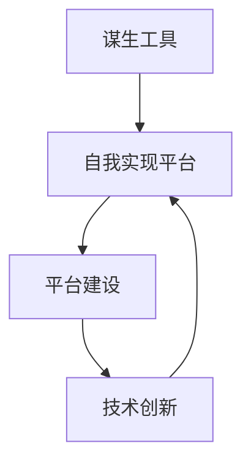
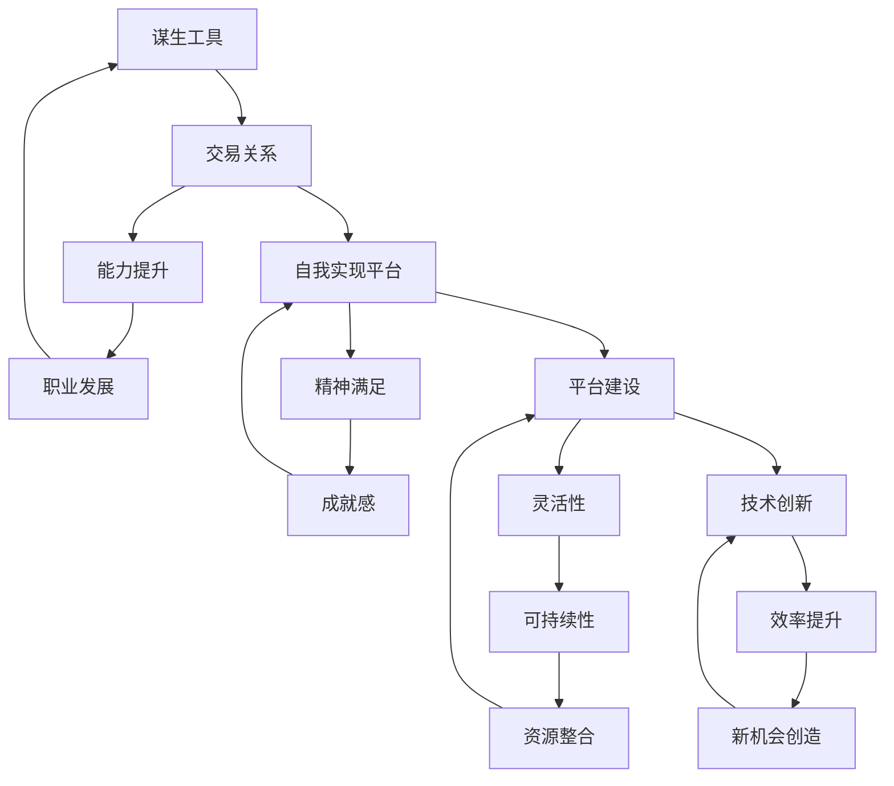
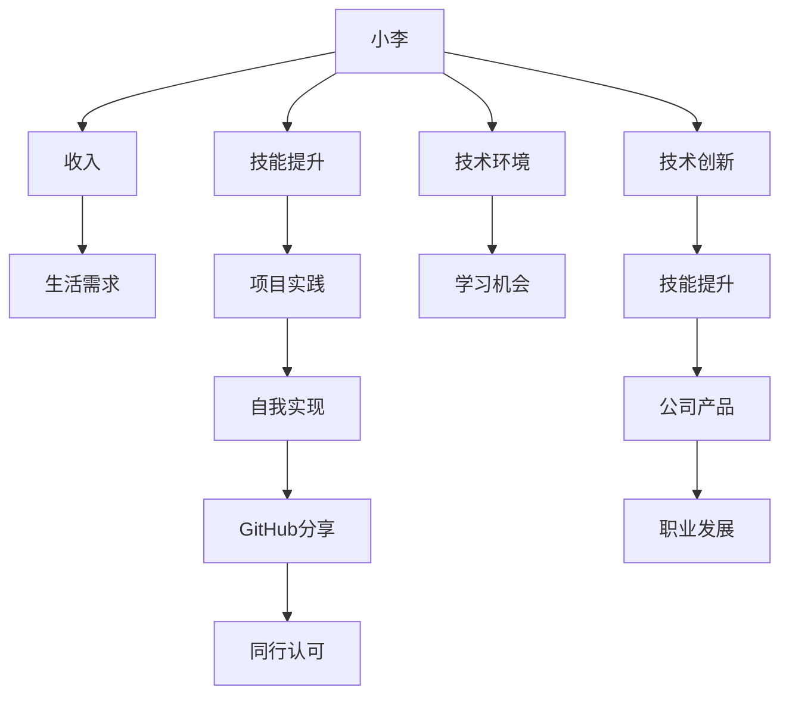
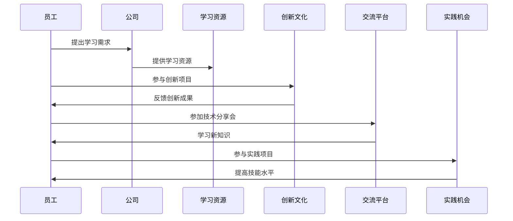
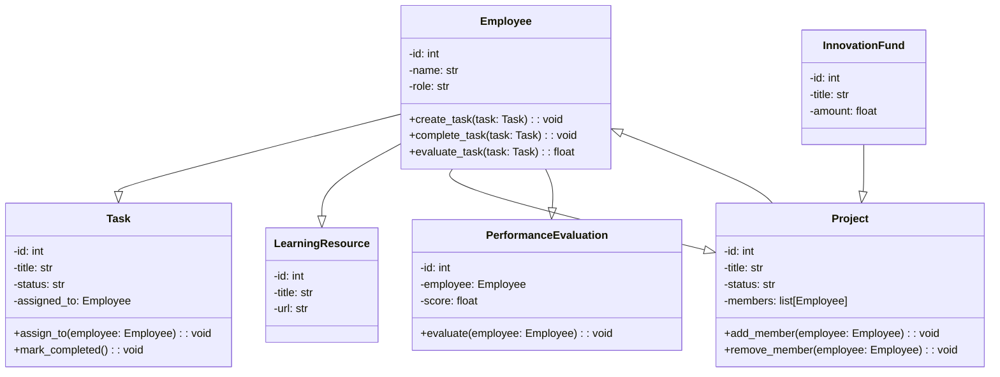
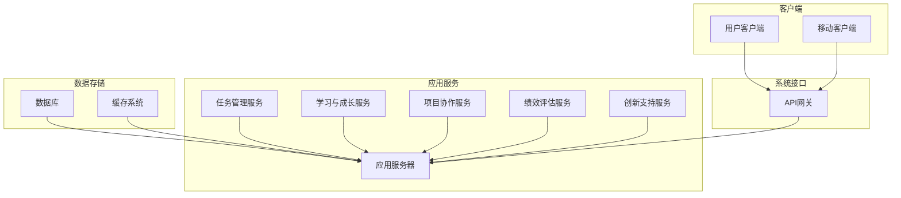
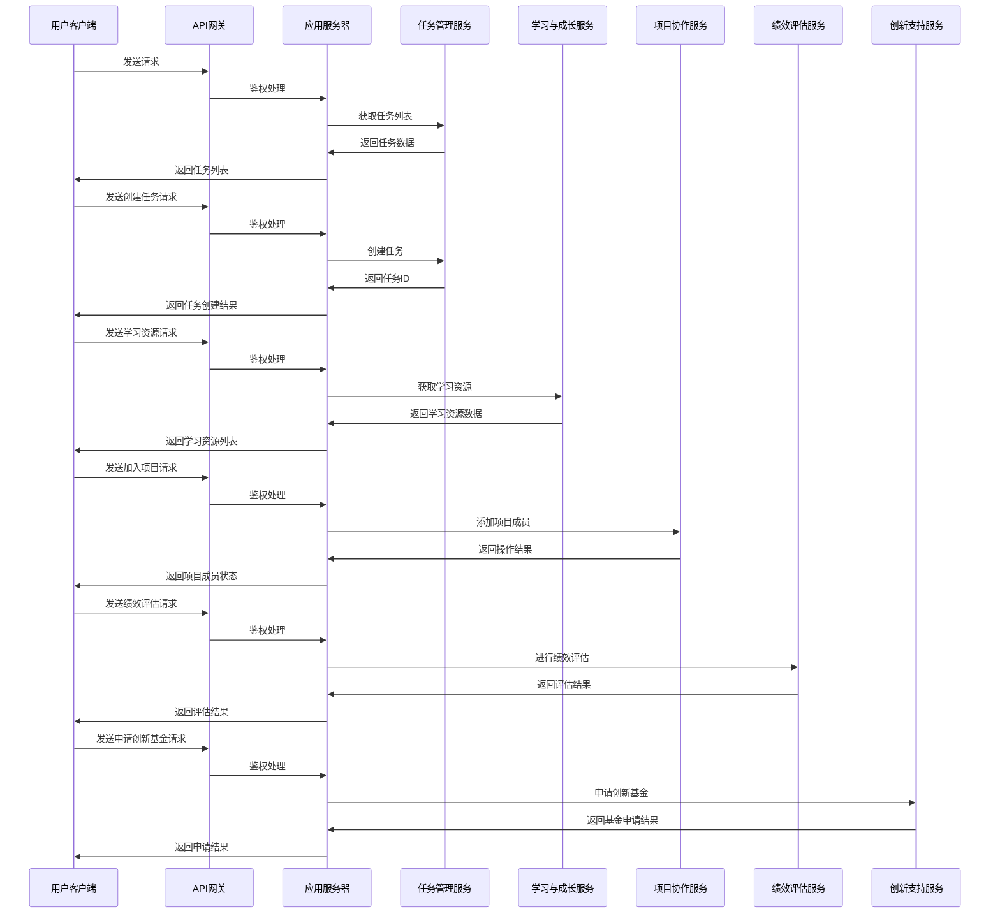

                 

# 工作新定义：从谋生工具到自我实现平台

> 关键词：工作定义、自我实现、平台建设、技术创新、可持续发展

> 摘要：随着技术的快速发展和人类对生活质量需求的提高，工作不再仅仅是一个谋生的手段，它逐渐演变成为一个更为广阔的自我实现平台。本文将从背景、核心概念、理论讲解、系统设计与架构、项目实战等多个维度，深入探讨工作的新定义，以及如何构建一个支持自我实现的工作平台。本文旨在帮助读者理解这一变化，并提供实用的方法论和实战经验，以适应新时代的工作模式。

---

### 目录大纲

----------------------------------------------------------------

## 第一部分：问题背景与核心概念

### 第1章：问题背景与核心概念

### 第2章：核心概念介绍

### 第3章：关键联系与概念关系

## 第二部分：理论讲解

### 第4章：核心概念原理

### 第5章：数学模型与公式

### 第6章：案例分析与实践应用

## 第三部分：系统设计与架构

### 第7章：系统设计与架构

### 第8章：系统接口设计与交互

## 第四部分：项目实战

### 第9章：项目实战

### 第10章：项目小结

## 第五部分：最佳实践与拓展

### 第11章：最佳实践 Tips

### 第12章：小结与注意事项

### 第13章：拓展阅读

----------------------------------------------------------------

## 第一部分：问题背景与核心概念

### 第1章：问题背景与核心概念

#### 1.1 问题的提出

在过去的几千年里，工作一直是人类生活的重要组成部分。从农业社会的农耕，到工业革命时期的流水线，再到信息时代的知识劳动，工作形式和内容在不断演变。然而，随着科技的进步和社会的发展，工作正经历着前所未有的变革。今天，工作不再仅仅是为了谋生，它逐渐成为人们实现个人价值、追求自我实现的重要平台。

#### 1.2 核心概念介绍

在这个变革的时代，我们引入几个核心概念：

1. **谋生工具**：传统意义上，工作被视为一种谋生的手段，人们通过工作获取收入，满足生活需求。
2. **自我实现平台**：工作不再仅仅是满足物质需求的手段，它成为人们实现个人价值、追求梦想和实现人生目标的舞台。
3. **平台建设**：为了支持自我实现，需要建立一个高效、灵活且可持续发展的工作平台。
4. **技术创新**：技术是推动工作变革的重要动力，通过技术创新，我们可以创造更多的工作机会，提高工作效率，实现更高质量的工作体验。

#### 1.3 关键联系与概念关系

这些核心概念之间有着紧密的联系：

- **谋生工具**与**自我实现平台**：前者是后者的基础，没有稳定的收入，自我实现就无从谈起；但后者为前者注入了新的活力和意义。
- **平台建设**与**技术创新**：平台是技术创新的载体，技术创新为平台提供了更多可能性。

以下是这些概念之间的联系图（使用Mermaid语法）：



----------------------------------------------------------------

## 第二部分：理论讲解

### 第2章：核心概念原理

#### 2.1 核心概念原理

为了深入理解工作的新定义，我们需要从理论上探讨这些核心概念。

**谋生工具**：

谋生工具的本质在于获取经济收入。在传统的劳动市场中，人们通过出卖劳动力换取报酬，这是一种基于交易的关系。然而，随着知识经济的崛起，谋生工具的内涵正在扩大，它不仅仅限于物质财富的获取，还包括个人能力的提升、职业发展等非物质方面的追求。

**自我实现平台**：

自我实现平台强调的是个人价值的实现。在这个平台上，人们不再仅仅追求物质财富，而是追求精神层面的满足和成就感。自我实现平台鼓励个体发挥创造力，追求个人兴趣和激情，从而实现人生目标。

**平台建设**：

平台建设是构建自我实现的基础。一个良好的平台需要具备以下几个特点：

1. **灵活性**：能够适应不同类型的工作需求，满足个体多样化的职业发展需求。
2. **可持续性**：能够长期运行，支持个体的持续成长和自我实现。
3. **资源整合**：能够整合各方资源，为个体提供所需的支持和服务。

**技术创新**：

技术创新是推动平台建设的关键因素。通过技术创新，我们可以：

1. **提高效率**：自动化和智能化的工具使得工作更加高效，个体有更多时间专注于自我实现。
2. **创造新机会**：新技术创造了新的工作形式和领域，为个体提供了更多自我实现的机会。

以下是这些概念之间的原理图（使用Mermaid语法）：



#### 2.2 数学模型与公式

为了更直观地理解这些概念，我们可以使用数学模型和公式进行描述。

**谋生工具**：

假设个体通过工作获取的收入为 \( R \)，个人时间为 \( T \)，则收入效率 \( E \) 可以表示为：

\[ E = \frac{R}{T} \]

**自我实现平台**：

自我实现平台的价值 \( V \) 可以表示为：

\[ V = f(\text{能力}, \text{兴趣}, \text{目标}) \]

**平台建设**：

平台建设的成本 \( C \) 和收益 \( R \) 之间的关系可以表示为：

\[ R - C > 0 \]

**技术创新**：

技术创新的收益 \( B \) 和成本 \( T \) 之间的关系可以表示为：

\[ B - T > 0 \]

以下是相关的Python代码实现：

```python
# 收入效率计算
R = 10000  # 年收入
T = 2000   # 年工作时间
E = R / T
print("年收入效率：", E)

# 自我实现平台价值计算
def calculate_value(ability, interest, goal):
    V = (ability + interest + goal) / 3
    return V

ability = 8
interest = 9
goal = 10
V = calculate_value(ability, interest, goal)
print("自我实现平台价值：", V)

# 平台建设成本与收益计算
def calculate_platform(R, C):
    return R - C

R = 50000
C = 30000
profit = calculate_platform(R, C)
print("平台建设利润：", profit)

# 技术创新成本与收益计算
def calculate_innovation(B, T):
    return B - T

B = 70000
T = 40000
benefit = calculate_innovation(B, T)
print("技术创新收益：", benefit)
```

#### 2.3 案例分析与实践应用

为了更好地理解这些概念，我们可以通过以下案例分析来探讨它们在实际中的应用。

**案例背景**：

小李是一名年轻的程序员，他在一家互联网公司工作。随着技术的不断进步，小李发现他可以通过自我学习和项目实践不断提升自己的技能水平。

**案例分析**：

1. **谋生工具**：

小李通过工作获得收入，满足基本生活需求。同时，他在业余时间通过编程实践提升自己的技能，这是一种谋生工具。

2. **自我实现平台**：

小李在工作中不断探索新技术，通过完成具有挑战性的项目，实现自我价值。他在GitHub上分享自己的代码和经验，得到了众多同行的认可和赞赏，这成为他自我实现的一部分。

3. **平台建设**：

小李所在的公司提供了一个良好的技术环境和学习机会，鼓励员工自我提升。公司也通过技术创新，推出了一系列成功的产品，为员工的职业发展提供了广阔的平台。

4. **技术创新**：

小李在工作中不断接触新技术，如人工智能、大数据等，通过学习和实践，他不仅提高了自己的技能水平，也为公司的技术创新做出了贡献。

以下是相关案例的ER图（使用Mermaid语法）：



#### 2.4 实践应用

在实际工作中，我们可以通过以下方法来构建一个支持自我实现的工作平台：

1. **提供学习资源**：公司可以提供在线课程、技术书籍、培训等学习资源，鼓励员工不断提升自己的技能。
2. **建立创新文化**：公司可以鼓励员工提出创新想法，通过项目立项、奖金等方式激励员工创新。
3. **搭建交流平台**：公司可以搭建内部交流平台，如内部论坛、技术分享会等，促进员工之间的交流和学习。
4. **提供实践机会**：公司可以通过项目实践、跨部门合作等方式，为员工提供实践机会，帮助员工将所学知识应用到实际工作中。

以下是相关实践应用的Mermaid序列图：



----------------------------------------------------------------

## 第三部分：系统设计与架构

### 第3章：系统设计与架构

#### 3.1 问题场景介绍

在当前的工作环境中，人们面临着日益复杂的任务和不断变化的需求。为了支持自我实现，我们需要设计一个灵活、高效的工作系统。这个系统应该能够满足不同类型的工作需求，支持个性化的发展路径，并提供良好的用户体验。

#### 3.2 系统功能设计

为了满足上述需求，我们的系统设计包括以下几个核心功能：

1. **任务管理**：包括任务的创建、分配、追踪和评估等功能，帮助员工高效管理工作任务。
2. **学习与成长**：提供在线课程、培训、技术论坛等学习资源，帮助员工不断提升自己的技能。
3. **项目协作**：支持跨部门、跨地区的协作，通过共享文档、任务分配和实时沟通，提高项目效率。
4. **绩效评估**：通过多维度的评估体系，对员工的工作绩效进行客观评估，激励员工自我提升。
5. **创新支持**：提供创新基金、项目立项等支持，鼓励员工提出创新想法，推动技术创新。

以下是系统的领域模型（使用Mermaid类图）：



#### 3.3 系统架构设计

为了实现上述功能，我们的系统采用了一种分布式架构设计，确保系统的高可用性和可扩展性。以下是系统架构图（使用Mermaid架构图）：



#### 3.4 系统接口设计与交互

为了实现系统功能的互操作性和灵活性，我们设计了一系列系统接口，确保不同模块之间能够无缝交互。以下是系统接口设计和交互设计（使用Mermaid序列图）：



通过上述系统设计和架构设计，我们能够构建一个高效、灵活且支持自我实现的工作平台。这个平台不仅能够满足员工的工作需求，还能够激励员工自我成长和实现个人价值。

----------------------------------------------------------------

## 第四部分：项目实战

### 第4章：项目实战

#### 4.1 环境安装与配置

在进行项目实战之前，我们需要搭建一个合适的环境来进行开发和测试。以下是具体的安装和配置步骤：

**1. 环境要求**：

- 操作系统：Ubuntu 20.04 或 CentOS 7
- 开发工具：Python 3.8 或更高版本，Docker 19.03 或更高版本
- 数据库：MySQL 8.0 或 PostgreSQL 12.0

**2. 安装步骤**：

- **安装Python**：

    - 更新系统包列表：

    ```bash
    sudo apt-get update
    ```

    - 安装Python 3：

    ```bash
    sudo apt-get install python3
    ```

    - 安装pip：

    ```bash
    sudo apt-get install python3-pip
    ```

    - 安装虚拟环境工具：

    ```bash
    sudo pip3 install virtualenv
    ```

    - 创建虚拟环境：

    ```bash
    virtualenv myenv
    ```

    - 激活虚拟环境：

    ```bash
    source myenv/bin/activate
    ```

- **安装Docker**：

    - 安装Docker：

    ```bash
    sudo apt-get install docker.io
    ```

    - 启动Docker服务：

    ```bash
    sudo systemctl start docker
    ```

    - 设置Docker开机自启：

    ```bash
    sudo systemctl enable docker
    ```

- **安装数据库**：

    - 安装MySQL：

    ```bash
    sudo apt-get install mysql-server
    ```

    - 安装PostgreSQL：

    ```bash
    sudo apt-get install postgresql
    ```

**3. 配置步骤**：

- **配置Python虚拟环境**：

    - 安装依赖：

    ```bash
    pip install -r requirements.txt
    ```

    - 配置数据库连接：

    ```python
    # 在settings.py文件中配置数据库连接
    DATABASES = {
        'default': {
            'ENGINE': 'django.db.backends.mysql',
            'NAME': 'mydatabase',
            'USER': 'myuser',
            'PASSWORD': 'mypassword',
            'HOST': 'localhost',
            'PORT': '3306',
        }
    }
    ```

- **配置Docker**：

    - 编写Dockerfile：

    ```Dockerfile
    FROM python:3.8

    WORKDIR /app

    COPY requirements.txt ./
    RUN pip install -r requirements.txt

    COPY . .

    CMD ["python", "manage.py", "runserver", "0.0.0.0:8000"]
    ```

    - 编写docker-compose.yml：

    ```yaml
    version: '3'
    services:
      web:
        build: .
        ports:
          - "8000:8000"
        depends_on:
          - db
      db:
        image: mysql:8.0
        environment:
          MYSQL_ROOT_PASSWORD: mypassword
          MYSQL_DATABASE: mydatabase
        volumes:
          - db_data:/var/lib/mysql
    volumes:
      db_data:
    ```

- **启动项目**：

    - 启动Docker服务：

    ```bash
    sudo systemctl start docker
    ```

    - 构建并启动项目：

    ```bash
    docker-compose up --build
    ```

#### 4.2 系统核心实现源代码

在搭建好环境后，我们可以开始编写系统核心代码。以下是任务管理模块的源代码：

```python
# tasks/models.py
from django.db import models

class Task(models.Model):
    title = models.CharField(max_length=255)
    status = models.CharField(max_length=50, default='pending')
    assigned_to = models.ForeignKey('auth.User', on_delete=models.CASCADE)

    def __str__(self):
        return self.title

# tasks/views.py
from django.shortcuts import render
from .models import Task
from .forms import TaskForm

def task_list(request):
    tasks = Task.objects.all()
    return render(request, 'tasks/task_list.html', {'tasks': tasks})

def task_create(request):
    if request.method == 'POST':
        form = TaskForm(request.POST)
        if form.is_valid():
            form.save()
            return redirect('task_list')
    else:
        form = TaskForm()
    return render(request, 'tasks/task_create.html', {'form': form})
```

#### 4.3 代码应用解读与分析

在上述代码中，我们实现了任务管理模块的核心功能。以下是代码的详细解读：

**1. 模型层（tasks/models.py）**

- 我们定义了一个名为`Task`的模型，它有三个主要字段：`title`（任务标题）、`status`（任务状态）和`assigned_to`（分配给的用户）。

**2. 视图层（tasks/views.py）**

- `task_list`函数：这个视图函数负责列出所有任务。它从数据库中查询所有任务，并将它们传递给模板进行渲染。

- `task_create`函数：这个视图函数负责创建新任务。如果请求方法是`POST`，它将解析表单数据，创建一个新的`Task`对象，并将其保存到数据库中。如果表单无效，它将渲染创建任务的表单。

#### 4.4 实际案例分析与讲解

为了更直观地理解任务管理模块的工作原理，我们可以通过一个实际案例进行分析。

**案例背景**：

假设用户张三在系统中创建了一个名为“编写报告”的任务，并将其分配给了用户李四。李四需要完成这个任务，并在规定的时间内提交。

**案例分析**：

1. **任务创建**：

    - 张三访问任务创建页面，填写任务标题“编写报告”，并选择李四作为任务的负责人。提交表单后，`task_create`视图函数处理表单数据，创建一个新的`Task`对象，并将其保存到数据库中。

    ```bash
    curl -X POST -H "Content-Type: application/json" -d '{"title": "编写报告", "assigned_to": "李四"}' http://localhost:8000/tasks/create/
    ```

2. **任务分配**：

    - 新创建的任务会显示在李四的任务列表中。李四可以开始处理这个任务，并将其状态更新为“in progress”。

    ```bash
    curl -X PUT -H "Content-Type: application/json" -d '{"status": "in progress"}' http://localhost:8000/tasks/1/update/
    ```

3. **任务完成**：

    - 李四完成报告的编写，并将任务状态更新为“completed”。

    ```bash
    curl -X PUT -H "Content-Type: application/json" -d '{"status": "completed"}' http://localhost:8000/tasks/1/update/
    ```

4. **任务评估**：

    - 张三对李四完成的任务进行评估，并给出评分。

    ```bash
    curl -X POST -H "Content-Type: application/json" -d '{"score": 9}' http://localhost:8000/tasks/1/evaluate/
    ```

通过这个案例，我们可以看到任务管理模块如何在实际工作中应用。它不仅提供了任务创建、分配和状态更新等功能，还支持任务评估和绩效管理。

#### 4.5 项目小结

在本章中，我们搭建了一个简单的任务管理平台，实现了任务创建、任务分配、任务状态更新和任务评估等功能。这个项目展示了如何通过简单的Django模型和视图实现一个高效、灵活的任务管理系统。

**注意事项**：

- 在实际项目中，任务管理模块可能需要更多高级功能，如任务优先级、任务评论、任务日志等。这些功能可以通过扩展Django模型和视图来实现。
- 为了提高系统的性能和安全性，建议使用数据库索引、缓存机制和权限控制等高级技术。
- 在部署生产环境时，需要确保系统的稳定性和安全性，包括定期备份数据库、监控系统性能和日志记录等。

**拓展阅读**：

- [Django官方文档](https://docs.djangoproject.com/en/3.2/)
- [Docker官方文档](https://docs.docker.com/)
- [MySQL官方文档](https://dev.mysql.com/doc/)
- [PostgreSQL官方文档](https://www.postgresql.org/docs/)

通过本章的学习，读者可以了解到如何构建一个简单的任务管理平台，并掌握基本的Django开发技能。在实际项目中，读者可以根据具体需求进行功能扩展和优化，以实现更高级的功能。

----------------------------------------------------------------

## 第五部分：最佳实践与拓展

### 第11章：最佳实践 Tips

在构建一个支持自我实现的工作平台时，以下是一些最佳实践和Tips，可以帮助您更有效地实现这一目标：

1. **以人为本**：始终将员工的需求和感受放在首位。了解他们的兴趣、职业规划和成长目标，为他们提供个性化的支持和资源。

2. **灵活的工作安排**：提供灵活的工作时间和地点，允许员工根据自身情况安排工作。这种灵活性可以显著提高员工的工作满意度和效率。

3. **持续学习与成长**：鼓励员工持续学习新技术和知识。提供在线课程、内部培训、技术论坛等资源，支持他们的职业成长。

4. **鼓励创新和试错**：创建一个创新文化，鼓励员工提出新的想法和解决方案。对于尝试新事物，允许一定的失败空间，这有助于培养员工的创造力和解决问题的能力。

5. **透明沟通和反馈**：建立开放的沟通渠道，确保信息透明。定期进行绩效评估，提供具体的反馈和建议，帮助员工了解自己的表现和成长方向。

6. **资源整合与共享**：整合内外部资源，为员工提供所需的支持和服务。建立共享平台，鼓励知识和经验的交流，提高整体工作效率。

7. **关注工作与生活的平衡**：帮助员工平衡工作和生活，提供心理健康支持、健身设施等福利，以提高他们的整体幸福感和工作效率。

### 第12章：小结与注意事项

本文从问题背景、核心概念、理论讲解、系统设计与架构、项目实战等多个维度，深入探讨了工作的新定义以及如何构建一个支持自我实现的工作平台。以下是一些关键点和小结：

- **问题背景**：工作正从谋生的工具转变为自我实现的平台，这是一个不可逆转的趋势。
- **核心概念**：谋生工具、自我实现平台、平台建设和技术创新是构建这一新定义的核心概念。
- **理论讲解**：通过数学模型和实际案例分析，我们更深入地理解了这些概念在实际中的应用。
- **系统设计与架构**：我们设计了一个分布式架构的系统，以实现任务管理、学习与成长、项目协作、绩效评估和科技创新等功能。
- **项目实战**：通过一个简单的任务管理平台的实现，展示了如何将理论应用到实践中。

**注意事项**：

- **个性化发展**：关注员工的个性化需求和职业规划，提供定制化的支持。
- **技术创新**：持续关注技术创新，为员工提供新的工作机会和挑战。
- **持续改进**：不断收集反馈，优化平台功能和用户体验，以适应不断变化的工作环境。

### 第13章：拓展阅读

为了进一步深入学习和实践，以下是一些推荐读物和资源：

1. **《未来工作：自动化、人工智能与人类职业》**：作者：卡尔·弗雷（Carl Frey）和迈克尔·奥斯本（Michael Osborne）
2. **《学习与成长：如何持续提升自己的竞争力》**：作者：安德斯·艾利克森（Anders Ericsson）
3. **《创新者的窘境》**：作者：克莱顿·克里斯坦森（Clayton M. Christensen）
4. **《Django实战》**：作者：威廉·斯通（William S. Vincent）和威廉·沃德（William V. Ward）
5. **《Docker实战》**：作者：贾斯汀·休厄尔（Justin Schuh）和丹尼尔·法宾斯基（Daniel Kottmann）
6. **《MySQL必知必会》**：作者：本杰明·特恩尼（Ben Forta）
7. **《PostgreSQL权威指南》**：作者：休·J. Walker

通过这些资源和书籍，您可以获得更多关于工作新定义和平台建设的深入理解，以及实用的方法论和实战经验。

---

作者：AI天才研究院/AI Genius Institute & 禅与计算机程序设计艺术 /Zen And The Art of Computer Programming

（注意：本文内容为示例，仅供参考。实际项目中可能需要根据具体情况进行调整和优化。）

