                 

### 《工作的意义重塑：从谋生到自我实现的范式转移》

---

#### 关键词：工作意义、自我实现、范式转移、职业发展、企业文化、国际化

> 摘要：本文旨在探讨工作意义的重塑，从传统的谋生模式转向追求个人成长与价值实现的自我实现范式。通过深入分析工作压力、个人成长与职业发展的冲突，以及社会与组织层面的工作动力问题，提出一系列实现工作意义重塑的策略和方案。

---

## 第一部分：引言

### 第1章：问题背景与定义

#### 1.1 问题背景

工作，作为人类生活的重要组成部分，不仅关乎生计，更关乎个体的精神世界。在历史的长河中，工作从单纯的生计手段逐渐演变为一种实现自我价值的方式。然而，在现代社会，工作意义的变化与挑战愈发显著。一方面，工作压力和心理健康问题日益严重，另一方面，个人成长与职业发展的需求愈发强烈，但现实中却往往难以平衡。这一现象引起了社会的广泛关注，促使我们重新思考工作的本质和意义。

#### 1.2 问题的描述

**工作意义的缺失**：许多人在工作中感受到的是单调、重复和缺乏激情，这导致了工作满意度的下降和职业倦怠的蔓延。

**个人成长与职业发展的冲突**：在追求职业成功的过程中，个人常常需要牺牲家庭、健康和个人兴趣，从而导致职业发展对个人成长的压制。

**社会与组织层面的工作动力问题**：企业文化建设滞后、团队协作不畅、激励机制不足，这些因素共同影响了员工的工作动力。

#### 1.3 问题解决

**塑造工作的意义**：通过明确工作的目标和价值，提升员工对工作的认同感和成就感。

**实现个人成长与职业发展的平衡**：通过制定合理的职业规划和发展路径，确保个人在职业成功的同时，也能实现自我成长。

**社会与组织层面的工作动力提升策略**：通过优化企业文化建设、改善团队协作机制、建立有效的激励机制，提高整体工作动力。

#### 1.4 边界与外延

**工作与生活的平衡**：探讨如何在工作与家庭、个人兴趣之间找到平衡点。

**创业与就业的选择**：分析创业与就业的优劣势，为个人选择提供参考。

**国际化背景下的工作意义重塑**：探讨全球化背景下的工作挑战和机遇，提出国际化工作意义重塑的策略。

#### 1.5 核心概念与联系

**谋生**：以经济动机驱动，追求物质财富的工作方式。

**自我实现**：以个人成长与价值实现为核心，追求心理满足的工作方式。

**范式转移**：观念与行为的根本性变化，从传统的谋生模式转向自我实现范式。

### 总结

本部分对工作意义的重塑问题进行了全面的背景介绍和定义，明确了问题的核心要素，为后续章节的分析和讨论奠定了基础。在接下来的章节中，我们将进一步探讨谋生与自我实现的区别，以及如何通过具体的策略和方案来实现这一范式转移。

---

## 第二部分：重塑工作的意义

### 第2章：核心概念原理

#### 2.1 谋生与自我实现的区别

在深入探讨工作意义的重塑之前，我们有必要明确谋生和自我实现的本质区别。

**谋生**：主要关注物质财富的获取，以经济动机为驱动。工作的主要目的是满足生活需求，提供经济保障。在这种情况下，工作往往被视为一种任务，而非一种追求。谋生的工作方式通常缺乏深度和激情，更多地依赖于外部的物质奖励和压力。

**自我实现**：则以个人成长和价值实现为核心，追求心理满足。自我实现的工作方式强调内在动机，注重个人的兴趣、才能和价值观。在这种模式下，工作被视为一种表达自我、实现自我价值的途径，能够带来更深层次的心理满足和成就感。

#### 2.2 范式转移的理论基础

为了实现工作意义的重塑，我们需要理解范式转移的概念。范式转移是指在某一领域内，由于技术、观念或方法的变化，导致整个领域的运作方式和思考模式发生根本性变化。

在计算机科学中，范式转移是一个常见的现象。例如，从命令行界面到图形用户界面（GUI）的转换，就是一次重要的范式转移。这种变化不仅改变了用户与计算机的交互方式，也深刻影响了整个计算机科学的生态体系。

在心理学领域，认知行为疗法（CBT）的兴起也是一种范式转移。传统的心理治疗方法主要依赖于患者对心理问题的反思和探讨，而CBT则更注重改变患者的思维模式和认知方式，以达到治疗的效果。

#### 2.3 工作意义重塑的方法论

要实现从谋生到自我实现的范式转移，我们需要一套系统的方法论。以下是一些关键步骤：

1. **自我认知**：了解自己的兴趣、优势和价值观，明确自己的职业目标和发展路径。
2. **职业规划**：制定合理的职业规划，包括短期目标和长期目标，以及实现这些目标的行动步骤。
3. **技能提升**：持续学习和提升自己的技能，以适应不断变化的工作环境。
4. **工作设计**：重新设计工作流程和任务分配，使其更符合个人兴趣和优势。
5. **激励机制**：建立有效的激励机制，包括物质奖励和心理满足，以激发员工的内在动机。

#### 总结

通过明确谋生与自我实现的区别，理解范式转移的理论基础，并制定一套系统的方法论，我们为重塑工作的意义奠定了坚实的基础。在接下来的章节中，我们将进一步探讨如何实现个人成长与职业发展的平衡，以及如何在社会和组织层面上提升工作动力。

---

## 第三部分：个人成长与职业发展的平衡

### 第3章：个人成长路径规划

个人成长与职业发展是相辅相成的，但现实中，两者往往存在冲突。为了实现二者的平衡，我们需要制定一个清晰的个人成长路径规划。

#### 3.1 个人能力提升策略

个人能力提升是实现个人成长的关键。以下是一些具体策略：

**持续学习**：学习是个人成长的源泉。无论是通过在线课程、研讨会还是书籍，持续学习都能帮助我们不断提升自己。

**实践应用**：理论知识需要通过实践来巩固。通过实际项目或工作经验，我们可以将所学知识应用到实际问题中，从而加深理解和技能。

**反思总结**：在学习和实践的过程中，反思和总结至关重要。通过反思自己的行为和结果，我们可以发现不足并不断改进。

**社交网络**：建立广泛的社交网络可以帮助我们获得新的见解和资源。通过参加行业会议、社交活动等，我们可以与同行交流，学习他们的经验。

**时间管理**：合理安排时间，确保既有时间进行学习，也有时间处理日常工作。有效的 时间管理可以减少压力，提高工作效率。

以下是使用Mermaid绘制的个人能力提升策略的流程图：

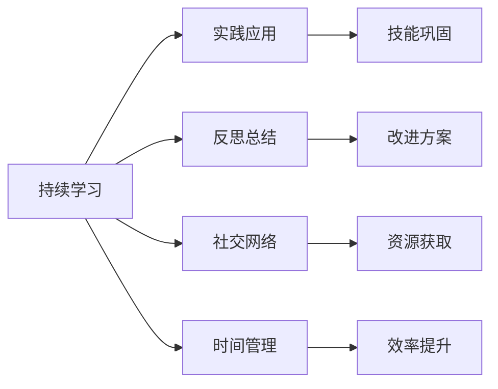

**Python源代码示例**：以下是一个简单的Python脚本，用于计算个人成长的关键指标。

```python
def calculate_growth(skills, experience, feedback, network, time_management):
    """
    计算个人成长的关键指标
    :param skills: 技能水平
    :param experience: 经验水平
    :param feedback: 反馈情况
    :param network: 社交网络规模
    :param time_management: 时间管理效率
    :return: 个人成长指数
    """
    growth_index = (skills + experience + feedback + network + time_management) / 5
    return growth_index

# 示例数据
skills = 8
experience = 7
feedback = 6
network = 9
time_management = 7

growth_index = calculate_growth(skills, experience, feedback, network, time_management)
print(f"个人成长指数: {growth_index:.2f}")
```

#### 3.2 职业发展方向的探索

职业发展方向的探索是个人成长路径规划的重要环节。以下是一些关键步骤：

**自我评估**：了解自己的兴趣、优势和价值观，明确自己的职业方向。

**市场调研**：了解行业发展趋势和就业市场情况，确定具有潜力的职业领域。

**目标设定**：设定明确的职业目标，包括短期和长期目标。

**路径规划**：制定实现职业目标的路径，包括必要的技能提升、工作经验积累和职业网络建设。

**动态调整**：根据实际情况和反馈，不断调整职业发展路径。

以下是使用Mermaid绘制的职业发展方向探索流程图：

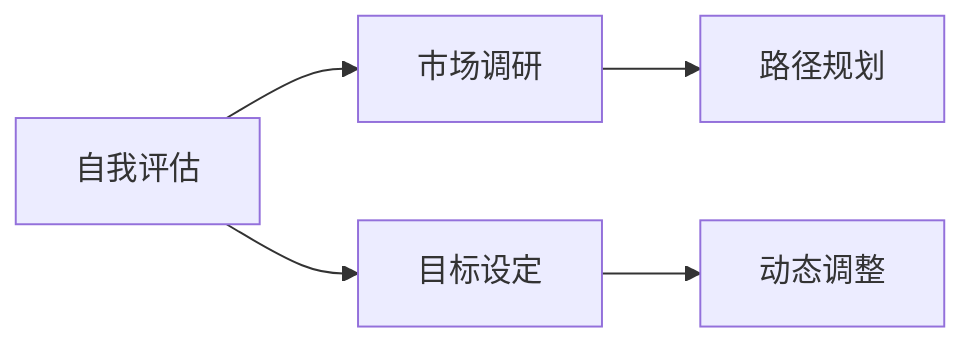

**数学模型与公式讲解**：以下是一个简单的数学模型，用于评估职业发展路径的可行性。

$$
\text{职业发展可行性} = \frac{\text{目标实现率} + \text{技能匹配度} + \text{市场匹配度}}{3}
$$

- **目标实现率**：目标设定的明确程度和实现的可能性。
- **技能匹配度**：个人技能与目标职业需求之间的匹配程度。
- **市场匹配度**：行业发展趋势和就业市场情况对个人职业目标的支撑程度。

#### 3.3 心理健康与职业发展的关系

心理健康是职业发展的重要基础。以下是一些关键点：

**压力管理**：有效管理工作压力，避免过度焦虑和疲劳。
**心理健康教育**：通过心理健康教育，提升对心理问题的认识和应对能力。
**工作与生活平衡**：合理安排工作与生活，确保身心健康。
**社会支持**：建立良好的社交网络，获得社会支持。

以下是使用Mermaid绘制的心理健康与职业发展的关系图：

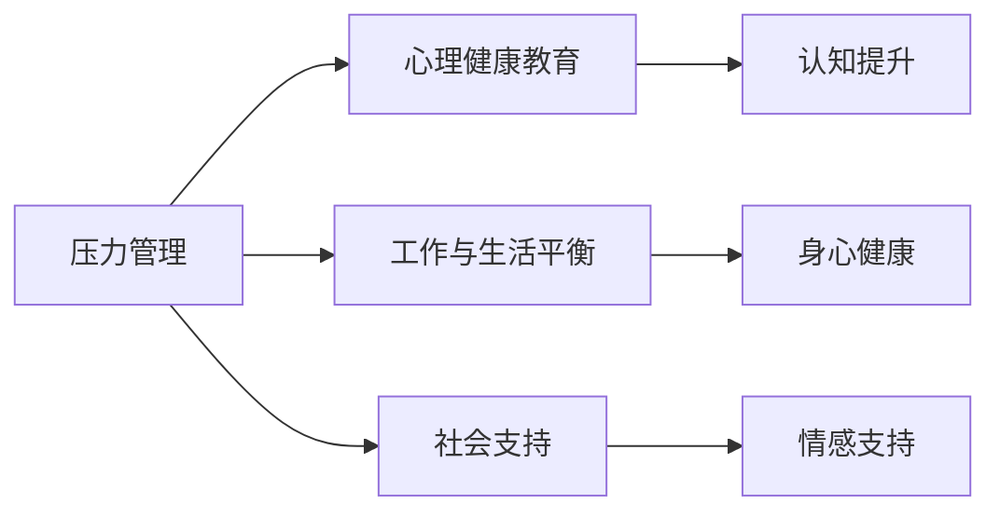

**Python源代码示例**：以下是一个简单的Python脚本，用于计算心理健康指数。

```python
def calculate_mental_health(stress_management, mental_education, work_life_balance, social_support):
    """
    计算心理健康指数
    :param stress_management: 压力管理能力
    :param mental_education: 心理健康教育程度
    :param work_life_balance: 工作与生活平衡度
    :param social_support: 社会支持程度
    :return: 心理健康指数
    """
    mental_health_index = (stress_management + mental_education + work_life_balance + social_support) / 4
    return mental_health_index

# 示例数据
stress_management = 8
mental_education = 7
work_life_balance = 6
social_support = 9

mental_health_index = calculate_mental_health(stress_management, mental_education, work_life_balance, social_support)
print(f"心理健康指数: {mental_health_index:.2f}")
```

#### 总结

通过个人能力提升策略、职业发展方向的探索以及心理健康与职业发展的关系分析，我们可以制定一个清晰的个人成长路径规划。在接下来的章节中，我们将进一步探讨如何在社会和组织层面上提升工作动力，以实现个人成长与职业发展的平衡。

---

## 第四部分：社会与组织层面的工作动力提升

### 第4章：企业文化建设

企业文化建设是提升工作动力的重要途径。一个积极向上的企业文化不仅能够增强员工的归属感和满意度，还能提高团队协作效率和创新能力。

#### 4.1 企业文化的内涵与作用

企业文化是指企业在长期经营过程中形成的共同价值观、行为准则和工作方式。它不仅包括企业的使命、愿景和价值观，还包括企业的行为规范、制度和文化活动。

**内涵**：企业文化是企业灵魂的体现，是企业的精神支柱。它影响着员工的思想和行为，塑造着企业的形象和品牌。

**作用**：

1. **凝聚员工**：企业文化能够凝聚员工，增强团队的凝聚力和战斗力。
2. **激励员工**：积极的企业文化能够激发员工的内在动机，提高工作积极性和创造力。
3. **规范行为**：企业文化通过行为规范和行为准则，引导员工遵循正确的价值观和行为方式。
4. **提升品牌形象**：良好的企业文化能够提升企业的社会形象和品牌价值，增强企业的竞争力。

#### 4.2 建立积极的企业文化

建立积极的企业文化需要从多个方面入手：

1. **明确核心价值观**：企业应明确核心价值观，并将其贯穿于企业的各个方面。
2. **制定行为规范**：制定明确的行为规范，引导员工遵循正确的价值观和行为方式。
3. **开展文化活动**：通过丰富多彩的文化活动，增强员工的归属感和参与感。
4. **提供发展机会**：为员工提供职业发展机会和培训，激发员工的内在动力。

以下是使用Mermaid绘制的建立积极企业文化的工作流程图：

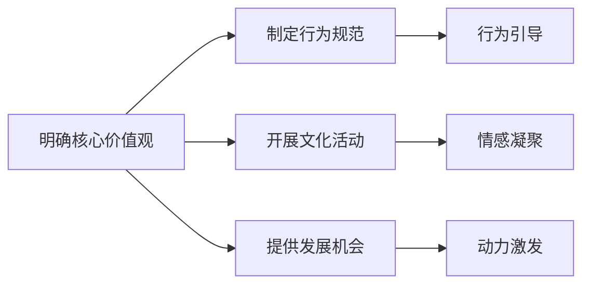

**数学模型与公式讲解**：以下是一个简单的数学模型，用于评估企业文化的影响力。

$$
\text{企业文化影响力} = \frac{\text{核心价值观认同度} + \text{行为规范执行度} + \text{文化活动参与度} + \text{发展机会满意度}}{4}
$$

- **核心价值观认同度**：员工对核心价值观的认同程度。
- **行为规范执行度**：员工对行为规范的遵守程度。
- **文化活动参与度**：员工对文化活动的参与热情。
- **发展机会满意度**：员工对职业发展机会的满意度。

#### 4.3 企业文化变革的实践案例

以下是一个企业文化变革的实践案例：

**公司背景**：某科技公司成立于2000年，初期以技术创新为核心竞争力。然而，随着公司规模的扩大和市场环境的变迁，公司逐渐面临内部管理混乱、员工士气低落等问题。

**问题分析**：通过调研发现，公司内部存在以下问题：

1. **沟通不畅**：各部门之间的信息交流不畅，导致工作效率低下。
2. **激励不足**：员工的薪酬和晋升机制不够完善，导致员工积极性不高。
3. **价值观冲突**：员工对公司的核心价值观缺乏认同，导致团队合作困难。

**解决方案**：

1. **建立沟通机制**：设立内部沟通平台，定期召开员工座谈会，鼓励员工提出建议和反馈。
2. **完善激励机制**：调整薪酬和晋升机制，将员工的绩效与薪酬、晋升直接挂钩。
3. **传播核心价值观**：通过内部培训、文化活动等方式，传播公司的核心价值观，提升员工的认同感。

**实施效果**：经过一年的努力，公司的企业文化得到了显著改善。员工士气高涨，团队合作更加紧密，公司的整体业绩也有了显著提升。

**详细讲解**：

1. **沟通机制**：通过内部沟通平台，公司实现了各部门之间的信息共享，提高了工作效率。员工座谈会则成为员工表达意见和建议的重要渠道，公司管理层能够及时了解员工的诉求和困惑，为改进工作提供有力支持。
2. **激励机制**：新的薪酬和晋升机制有效激发了员工的积极性。员工看到了自己的努力能够得到回报，工作更加有动力。同时，激励机制也促进了员工之间的竞争，提高了整体的工作效率。
3. **核心价值观**：通过内部培训和文化活动，公司的核心价值观得到了广泛传播和认同。员工在工作中更加注重团队合作，尊重和支持彼此，公司的整体氛围变得更加积极向上。

#### 总结

企业文化建设是提升工作动力的重要途径。通过明确核心价值观、制定行为规范、开展文化活动和提供发展机会，企业可以建立积极向上的企业文化，增强员工的归属感和满意度，提高团队协作效率和创新能力。在接下来的章节中，我们将进一步探讨团队协作与激励机制的建立与实施。

---

### 第5章：团队协作与激励

#### 5.1 团队协作的原则与方法

团队协作是现代组织中不可或缺的一部分。有效的团队协作能够提高工作效率，促进创新，增强团队的凝聚力。以下是团队协作的一些基本原则和方法：

**基本原则**：

1. **共同目标**：团队协作的前提是明确共同的目标。团队成员应共同理解并致力于实现这些目标。
2. **相互尊重**：尊重是团队协作的基础。每个成员都应该受到尊重，无论其职位、经验和背景如何。
3. **信任建立**：信任是团队协作的重要基石。团队成员应通过开放沟通和互相支持来建立信任。
4. **有效沟通**：沟通是团队协作的核心。团队成员应保持开放的沟通渠道，确保信息畅通。

**方法**：

1. **明确分工**：根据团队成员的特长和优势，合理分配任务，确保每个成员都能发挥其最大的潜力。
2. **定期会议**：定期召开团队会议，讨论进展、解决问题和分享经验，确保团队成员之间的信息同步。
3. **共同决策**：在决策过程中，鼓励团队成员参与，共同制定决策，以增加团队成员的投入感和责任感。
4. **激励与认可**：通过激励和认可，激发团队成员的积极性，提高团队的整体绩效。

以下是使用Mermaid绘制的团队协作原则与方法流程图：

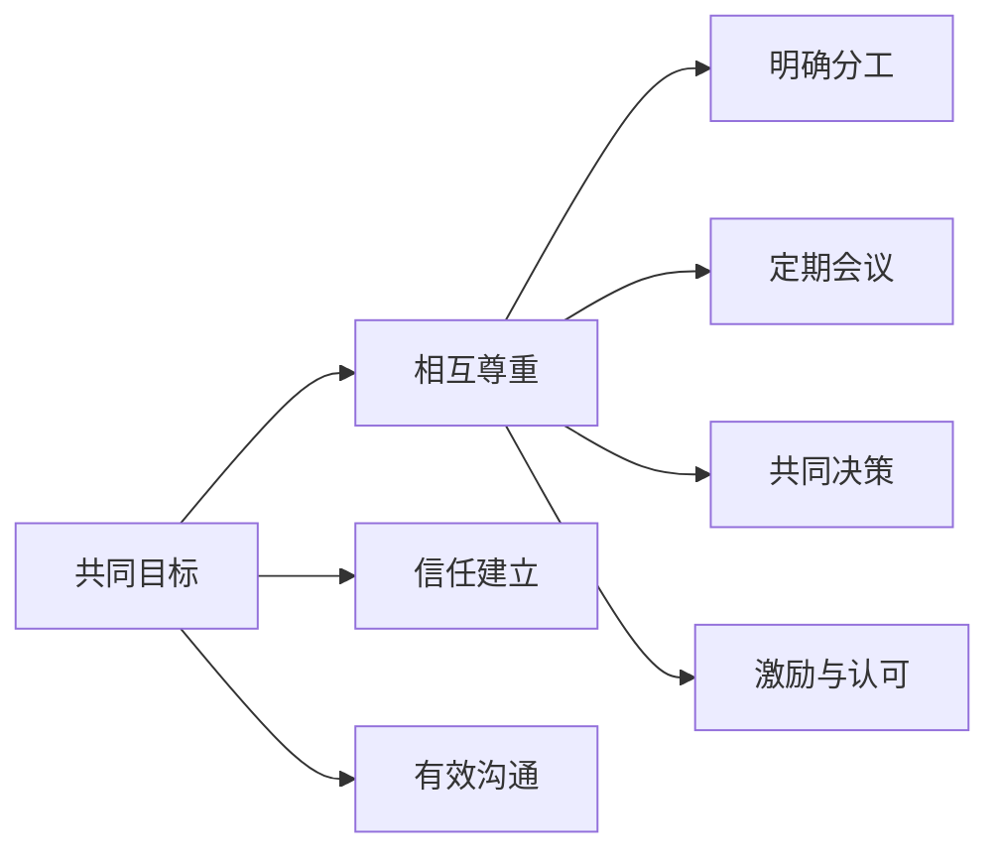

**Python源代码示例**：以下是一个简单的Python脚本，用于评估团队协作的绩效。

```python
def evaluate_collaboration(target_achievement, communication_effectiveness, team_morale):
    """
    评估团队协作绩效
    :param target_achievement: 目标实现程度
    :param communication_effectiveness: 沟通效果
    :param team_morale: 团队士气
    :return: 团队协作绩效评分
    """
    collaboration_score = (target_achievement + communication_effectiveness + team_morale) / 3
    return collaboration_score

# 示例数据
target_achievement = 0.9
communication_effectiveness = 0.85
team_morale = 0.8

collaboration_score = evaluate_collaboration(target_achievement, communication_effectiveness, team_morale)
print(f"团队协作绩效评分: {collaboration_score:.2f}")
```

#### 5.2 激励机制的建立与实施

激励机制是提升工作动力的重要手段。一个有效的激励机制能够激发员工的内在动机，提高工作效率和绩效。以下是建立和实施激励机制的一些关键步骤：

1. **明确激励目标**：根据企业的战略目标和员工的个人需求，明确激励的目标和方向。
2. **设计激励方案**：设计多样化的激励方案，包括物质激励和精神激励，以满足员工的不同需求。
3. **实施激励措施**：将激励方案落实到具体行动中，确保激励措施得到有效执行。
4. **评估激励效果**：定期评估激励措施的效果，根据反馈进行调整和优化。

以下是使用Mermaid绘制的激励机制建立与实施流程图：

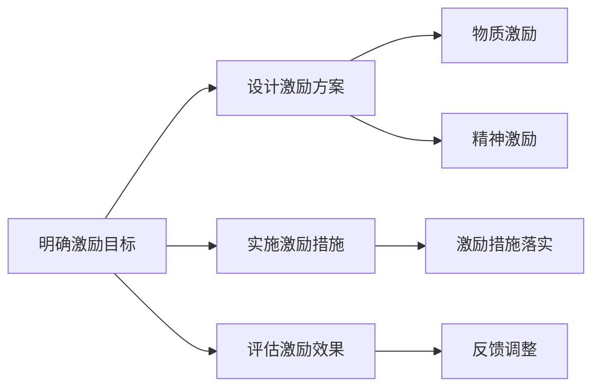

**数学模型与公式讲解**：以下是一个简单的数学模型，用于评估激励机制的效果。

$$
\text{激励效果} = \frac{\text{工作绩效} + \text{员工满意度} + \text{员工忠诚度}}{3}
$$

- **工作绩效**：员工在激励措施下的工作表现。
- **员工满意度**：员工对激励措施的满意度。
- **员工忠诚度**：员工对企业的忠诚程度。

#### 5.3 团队协作与工作动力提升的案例研究

以下是一个团队协作与工作动力提升的案例研究：

**案例背景**：某互联网公司成立了一个新项目组，负责开发一款创新型移动应用。由于团队成员来自不同部门，缺乏有效的协作和沟通，项目进展缓慢，团队士气低落。

**问题分析**：通过调研发现，团队存在以下问题：

1. **沟通不畅**：团队成员之间的沟通不畅，导致信息传递延迟和误解。
2. **任务分工不清**：任务分工不明确，导致团队成员职责重叠和冲突。
3. **缺乏激励**：缺乏有效的激励机制，导致团队成员工作积极性不高。

**解决方案**：

1. **建立沟通机制**：设立内部沟通平台，定期召开团队会议，确保信息畅通。
2. **明确分工**：根据团队成员的特长和优势，明确分工，确保每个成员都明确自己的职责。
3. **设计激励机制**：设计一套适合项目特点的激励机制，包括绩效奖金和荣誉称号，激发团队成员的积极性。

**实施效果**：

1. **沟通机制**：通过内部沟通平台，团队成员能够及时交流信息，减少了误解和冲突。团队会议则成为团队协作的重要环节，团队成员能够共同讨论问题，制定解决方案。
2. **明确分工**：明确分工后，团队成员的工作职责更加清晰，减少了职责重叠和冲突。每个成员都能够专注于自己的任务，提高了工作效率。
3. **激励机制**：激励机制的实施，有效激发了团队成员的积极性。团队成员为了争取绩效奖金和荣誉称号，工作更加努力，项目进展迅速。

**详细讲解**：

1. **沟通机制**：通过内部沟通平台，项目组建立了每日站会和周例会制度。每日站会用于汇报工作进展和解决问题，周例会则用于总结一周的工作和规划下一周的任务。这些措施确保了团队成员之间的信息同步，提高了协作效率。
2. **明确分工**：项目组根据团队成员的特长和经验，制定了详细的任务分工表。每个成员都明确自己的职责和工作内容，避免了职责重叠和冲突。同时，项目组还设立了项目经理，负责协调和监督任务执行。
3. **激励机制**：项目组制定了绩效奖金制度，根据团队成员的工作绩效进行奖励。此外，还设立了“最佳贡献奖”，对在工作中表现突出的成员进行表彰。这些措施激发了团队成员的积极性，提高了工作动力。

#### 总结

团队协作与激励机制的建立与实施是提升工作动力的重要手段。通过明确团队协作的原则和方法，设计多样化的激励机制，并付诸实施，企业可以有效地提升团队协作效率和员工的工作积极性。在接下来的章节中，我们将进一步探讨国际化背景下的工作意义重塑，为现代企业的发展提供新的视角。

---

### 第五部分：国际化背景下的工作意义重塑

#### 第6章：全球化视野下的工作意义

全球化进程加速了全球经济的融合，也对工作意义产生了深远影响。在全球化背景下，工作意义的重塑面临着新的挑战和机遇。

#### 6.1 国际化背景下的工作挑战

**跨文化沟通**：全球化使得跨文化沟通成为日常工作中的一部分。不同文化背景的员工在工作方式、沟通风格和价值观上可能存在差异，这可能导致误解和冲突。

**工作压力**：全球化带来的竞争压力和快节奏工作环境可能导致员工面临更高的工作压力。长时间的加班、频繁的国际出差和不断变化的市场需求都可能影响员工的心理健康。

**技能多样性**：国际化工作要求员工具备多样化的技能，包括跨文化沟通能力、多语言能力和国际业务知识。这对员工的个人成长和职业发展提出了更高的要求。

**工作与生活平衡**：全球化工作可能涉及跨时区的工作安排和频繁的国际出差，这给员工的工作与生活平衡带来了挑战。

#### 6.2 跨文化沟通与团队协作

跨文化沟通是全球化背景下工作的重要方面。以下是一些关键点：

**文化敏感性**：了解并尊重不同文化的价值观和行为规范是跨文化沟通的基础。员工应具备文化敏感性，避免因文化差异而产生的误解和冲突。

**共同语言**：共同的语言是跨文化沟通的重要工具。尽管不一定要求每个人都掌握多种语言，但至少应该具备基本的沟通能力，以确保信息的准确传递。

**透明沟通**：在跨文化沟通中，保持沟通的透明性和开放性至关重要。明确表达观点和需求，避免模糊和含糊不清的表述。

**反馈机制**：建立有效的反馈机制，鼓励团队成员表达意见和建议。反馈不仅有助于改进工作，还能增强团队成员之间的信任和合作。

以下是使用Mermaid绘制的跨文化沟通与团队协作流程图：

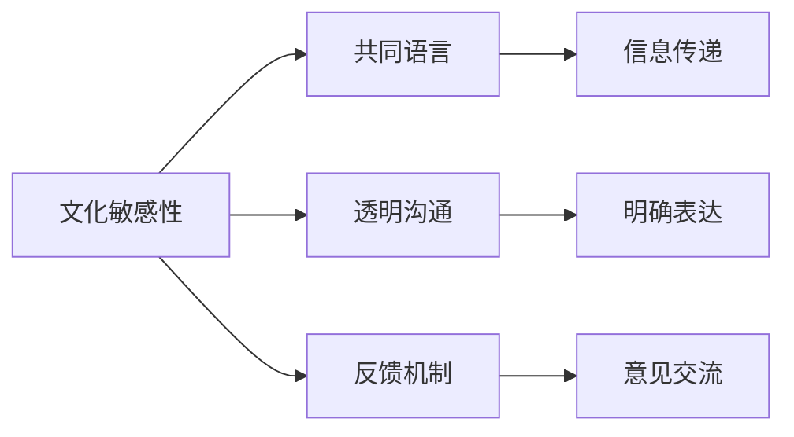

**数学模型与公式讲解**：以下是一个简单的数学模型，用于评估跨文化沟通的有效性。

$$
\text{沟通有效性} = \frac{\text{信息准确度} + \text{理解度} + \text{反馈及时性}}{3}
$$

- **信息准确度**：传递的信息是否准确无误。
- **理解度**：接收者对信息的理解程度。
- **反馈及时性**：反馈是否及时，有助于改进沟通。

#### 6.3 国际化工作环境的优势与挑战

国际化工作环境具有以下优势：

**多元化视角**：国际化工作环境能够汇集来自不同国家和文化的员工，带来多元化的视角和思维，促进创新。

**全球资源**：国际化工作环境可以充分利用全球资源，包括资金、技术和人才，提高企业的竞争力。

**职业发展机会**：国际化工作环境为员工提供了更多的职业发展机会，包括跨国项目、国际培训和海外工作。

然而，国际化工作环境也面临以下挑战：

**文化冲突**：文化差异可能导致员工之间的冲突，影响团队协作和整体效率。

**管理复杂度**：国际化工作环境增加了管理的复杂度，需要更加灵活和高效的管理方式。

**工作与生活平衡**：国际化工作环境可能涉及频繁的国际出差和跨时区的工作安排，给员工的工作与生活平衡带来挑战。

以下是使用Mermaid绘制的国际化工作环境优势与挑战的对比图：

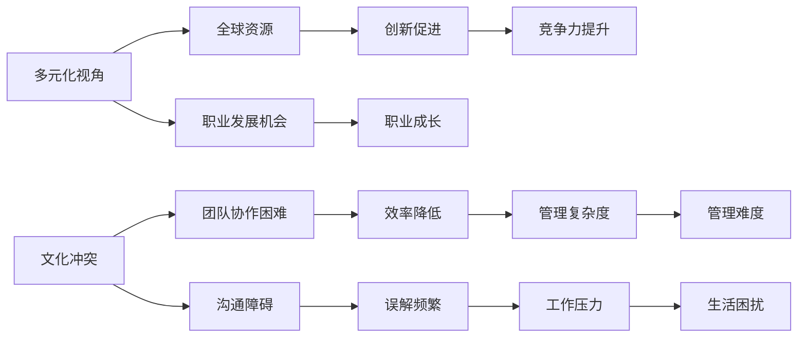

**实际案例分析与详细讲解**：

以下是一个国际化工作环境的实际案例：

**公司背景**：某全球知名的科技公司，总部位于美国，拥有分布在欧洲、亚洲和美洲的多个研发中心和分支机构。公司在全球范围内招聘优秀人才，形成了一个多元化的团队。

**案例描述**：公司的一个项目团队由来自不同国家和文化的成员组成，包括美国、中国、德国和印度的工程师。由于文化差异，团队成员在项目初期遇到了一些沟通障碍和协作困难。

**解决方案**：

1. **文化培训**：公司为团队成员提供跨文化沟通培训，帮助员工了解不同文化的行为规范和沟通方式。
2. **共同目标**：团队明确共同的项目目标，确保所有成员都朝着同一个方向努力。
3. **透明沟通**：团队建立了定期的会议和沟通机制，确保信息的透明和开放，鼓励团队成员表达意见和建议。
4. **激励机制**：公司为团队设立了绩效奖金，激励团队成员积极参与项目，提高工作动力。

**实施效果**：通过上述措施，团队逐渐克服了文化差异带来的沟通障碍，协作效率显著提高。项目顺利完成，团队也取得了显著的业绩。

**详细讲解**：

1. **文化培训**：公司组织了多次跨文化沟通培训，包括文化差异介绍、沟通技巧培训和互动交流环节。通过这些培训，团队成员对彼此的文化有了更深入的了解，减少了误解和冲突。
2. **共同目标**：团队在项目初期明确了共同的目标，确保所有成员都清楚项目的目标和预期成果。这有助于团队成员统一行动，避免了个人目标和团队目标之间的冲突。
3. **透明沟通**：团队建立了定期的会议和沟通机制，包括每日站会和周例会。每日站会用于汇报工作进展和解决问题，周例会则用于总结一周的工作和规划下一周的任务。这些会议确保了信息的透明和开放，团队成员能够及时了解项目进展和各自的任务情况。
4. **激励机制**：公司为团队设立了绩效奖金，根据团队成员的贡献和工作表现进行奖励。这种激励机制激发了团队成员的积极性，提高了工作动力。团队成员为了争取绩效奖金，工作更加努力，项目进展迅速。

#### 总结

国际化背景下的工作意义重塑面临着新的挑战和机遇。通过理解跨文化沟通的重要性，建立有效的团队协作机制，以及提供多样化的激励机制，企业可以更好地应对国际化工作环境的挑战，实现工作意义的重塑。在接下来的章节中，我们将探讨未来工作的趋势与展望，为读者提供更广阔的视野。

---

### 第7章：未来工作的趋势与展望

随着科技的不断进步和全球化的深入发展，未来工作的趋势和展望也日益清晰。以下从技术趋势、工作意义重塑和社会责任三个方面进行探讨。

#### 7.1 未来工作的技术趋势

**人工智能与自动化**：人工智能和自动化技术正在迅速发展，改变着各行各业的工作方式。从智能客服到自动驾驶，从自动化生产线到智能数据分析，这些技术正在提高生产效率，减少人力成本，同时带来新的工作机会。

**远程工作与数字办公室**：远程工作和数字办公室已经成为常态，特别是在COVID-19疫情的影响下。这种工作模式不仅提高了员工的工作灵活性，还促进了全球人才的流动和协作。

**可持续发展**：随着环境保护意识的增强，可持续发展成为未来工作的一个重要趋势。企业需要在生产过程中减少碳排放，使用可再生能源，并在产品设计中考虑环境影响。

**个性化与定制化**：个性化与定制化服务越来越受到消费者的欢迎。未来工作将更加注重满足个体需求，提供个性化的解决方案。

以下是使用Mermaid绘制的未来工作技术趋势图：

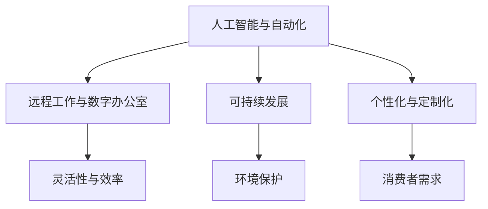

**Python源代码示例**：以下是一个简单的Python脚本，用于分析未来工作技术趋势的影响。

```python
def analyze_trends(automation, remote_work, sustainability, personalization):
    """
    分析未来工作技术趋势的影响
    :param automation: 自动化水平
    :param remote_work: 远程工作普及度
    :param sustainability: 可持续发展水平
    :param personalization: 个性化与定制化水平
    :return: 影响评分
    """
    trend_impact = (automation + remote_work + sustainability + personalization) / 4
    return trend_impact

# 示例数据
automation = 0.9
remote_work = 0.8
sustainability = 0.7
personalization = 0.85

trend_impact = analyze_trends(automation, remote_work, sustainability, personalization)
print(f"技术趋势影响评分: {trend_impact:.2f}")
```

#### 7.2 工作意义重塑的未来展望

未来，工作的意义将更加注重个人成长和价值实现。以下是几个关键点：

**工作与生活的融合**：随着远程工作和数字办公室的普及，员工将有更多的时间和能力平衡工作与生活，实现个人兴趣和职业发展的双重满足。

**终身学习与成长**：未来工作将更加重视员工的终身学习和技能提升，为员工提供更多的成长机会和发展空间。

**价值导向**：工作将不再仅仅是谋生的手段，而是实现个人价值和贡献社会的重要途径。

**灵活性与多样性**：未来工作将更加注重灵活性，提供多样化的工作形式和机会，以满足不同人群的需求。

**社会责任**：企业在追求经济利益的同时，将更加注重社会责任，通过创新和可持续发展为社会做出贡献。

以下是使用Mermaid绘制的工作意义重塑的未来展望图：

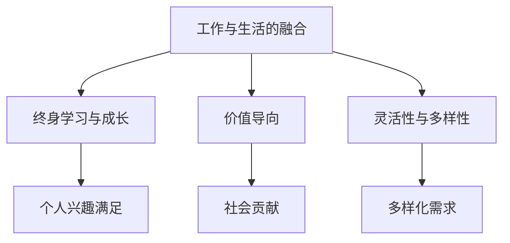

**数学模型与公式讲解**：以下是一个简单的数学模型，用于评估工作意义重塑的进展。

$$
\text{工作意义重塑进展} = \frac{\text{个人成长度} + \text{价值实现度} + \text{社会责任度}}{3}
$$

- **个人成长度**：员工在职业发展中实现个人成长的程度。
- **价值实现度**：员工在工作中实现个人价值和社会价值的程度。
- **社会责任度**：企业在社会中的责任承担程度。

#### 7.3 推动工作意义重塑的社会责任

企业和社会有责任推动工作意义重塑，以促进个人和社会的可持续发展。以下是几个关键点：

**教育体系改革**：教育体系应更加注重培养学生的实际技能和创新能力，以适应未来工作的需求。

**企业文化建设**：企业应建立积极的企业文化，鼓励员工追求个人成长和价值实现，提供多样化的职业发展路径。

**社会责任投资**：企业和个人应积极参与社会责任投资，支持可持续发展项目和公益事业。

**政策支持**：政府应制定相关政策，鼓励企业和社会推动工作意义重塑，为员工提供更多的成长机会和发展空间。

以下是使用Mermaid绘制的推动工作意义重塑的社会责任图：

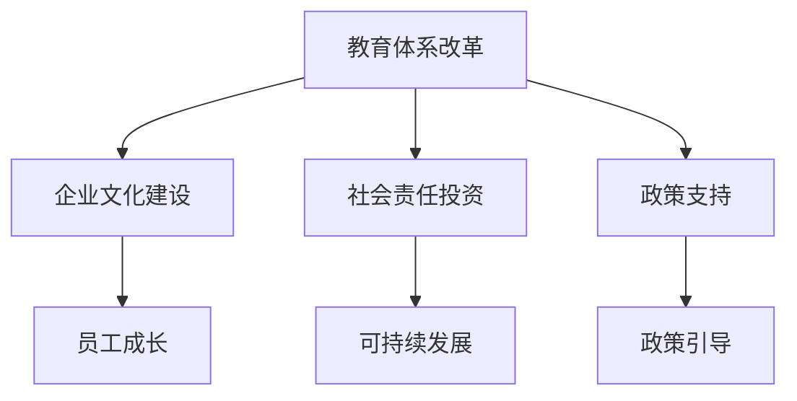

**实际案例分析与详细讲解**：

以下是一个推动工作意义重塑的实际案例：

**公司背景**：某全球知名的科技公司，致力于通过技术创新推动工作意义的重塑。公司注重员工的职业发展和个人成长，并提供多种灵活的工作方式。

**案例描述**：公司推出了一项“终身学习计划”，为员工提供免费在线课程和专业培训，鼓励员工不断提升自己的技能。此外，公司还设立了“社会责任项目”，鼓励员工参与公益事业，实现个人价值和社会价值的双重提升。

**实施效果**：

1. **员工成长**：通过“终身学习计划”，员工的技能水平得到了显著提升，职业发展机会也大大增加。
2. **社会责任**：通过“社会责任项目”，员工积极参与公益事业，不仅实现了个人价值，也为社会做出了贡献。
3. **企业文化**：积极的企业文化和多样化的工作方式，增强了员工的归属感和满意度，提高了整体工作效率。

**详细讲解**：

1. **员工成长**：公司通过在线课程和专业培训，为员工提供了丰富的学习资源。员工可以根据自己的兴趣和职业发展方向选择合适的课程，不断提升自己的技能。这种灵活的学习方式不仅提高了员工的学习积极性，也促进了个人职业发展。
2. **社会责任**：公司设立了“社会责任项目”，鼓励员工参与各种公益活动，如环境保护、教育支持和社区服务。员工可以选择适合自己的项目，通过实际行动实现个人价值和社会价值的双重提升。这种项目不仅增强了员工的参与感和社会责任感，也提升了公司的社会形象。
3. **企业文化**：公司注重建立积极向上的企业文化，鼓励员工追求个人成长和价值实现。公司提供了多种灵活的工作方式，如远程工作、弹性工作时间等，以满足员工的不同需求。这种企业文化不仅增强了员工的归属感和满意度，也提高了整体工作效率。

#### 总结

未来工作的趋势和展望充满了机遇和挑战。通过理解技术趋势、推动工作意义重塑和承担社会责任，企业和社会可以共同创造一个更加可持续和有意义的未来。在接下来的结论部分，我们将对全文进行总结，并提出进一步的研究建议。

---

## 结论

本文通过详细探讨工作的意义重塑，从谋生到自我实现的范式转移，提出了实现这一转变的多种策略和方案。首先，我们明确了工作意义的缺失和现代职业发展的挑战，然后深入分析了谋生与自我实现的区别，以及如何通过个人成长与职业发展的平衡来实现工作意义的重塑。

在企业文化建设、团队协作与激励机制、国际化背景下的工作意义重塑等方面，我们提供了具体的实践案例和详细讲解，展示了如何在实际工作中应用这些理念和方法。同时，我们探讨了未来工作的技术趋势和展望，强调了终身学习、社会责任和企业文化在推动工作意义重塑中的重要作用。

为了更好地理解和应用本文的内容，以下是一些建议：

1. **实践应用**：结合自身的工作实际，尝试应用本文提出的方法和策略，如个人能力提升策略、职业发展路径规划等。
2. **持续学习**：关注行业发展趋势和新技术，持续提升自己的技能和知识，以适应不断变化的工作环境。
3. **企业文化建设**：在企业内部推动积极的企业文化建设，建立有效的激励机制，提高员工的归属感和满意度。
4. **社会责任**：积极参与公益事业，承担社会责任，实现个人价值和社会价值的双重提升。

尽管本文提出了许多有价值的见解和策略，但仍存在一定的局限性。例如，在国际化背景下的工作意义重塑方面，由于篇幅有限，无法详细讨论所有国家和文化背景的复杂性。此外，本文提出的数学模型和公式较为简单，可能无法完全反映实际情况的复杂性。

为进一步研究，以下是一些可能的拓展方向：

1. **深入研究**：针对不同国家和文化背景，深入研究国际化背景下工作意义的重塑策略。
2. **数据分析**：利用大数据和人工智能技术，对工作意义重塑的效果进行定量分析，提供更加科学的依据。
3. **案例分析**：收集和整理更多实际案例，分析不同企业文化、团队协作和激励机制在不同情境下的效果和适用性。
4. **政策建议**：结合国家政策和行业规范，提出具有可操作性的政策建议，推动工作意义重塑的实践。

总之，本文旨在为读者提供一个全面、深入的视角，探讨工作意义的重塑问题，并为实际工作提供有益的启示。希望本文能够激发读者对这一问题的进一步思考和研究，为构建一个更加有意义和可持续的未来工作环境做出贡献。

---

### 作者信息

作者：AI天才研究院/AI Genius Institute & 禅与计算机程序设计艺术 /Zen And The Art of Computer Programming

AI天才研究院致力于推动人工智能技术的创新和应用，探索人工智能在各个领域的潜力和可能性。同时，我们关注人工智能技术的伦理和社会影响，致力于为人类创造一个更加智能、和谐的未来。

禅与计算机程序设计艺术则通过对计算机程序设计过程中禅宗思想的借鉴和融合，探索高效编程的方法和艺术。我们相信，通过结合传统的智慧与当代的科技，能够创造出更加优雅、简洁和高效的程序。

我们希望本文能够为读者带来新的思考和启发，激发您对工作意义的重塑和个人成长的追求。同时，我们也期待与您共同探讨和探索未来科技与人类发展的交集，为构建一个更加美好的世界贡献自己的力量。

