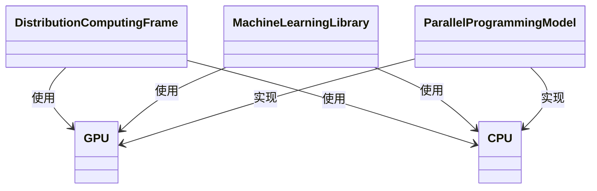
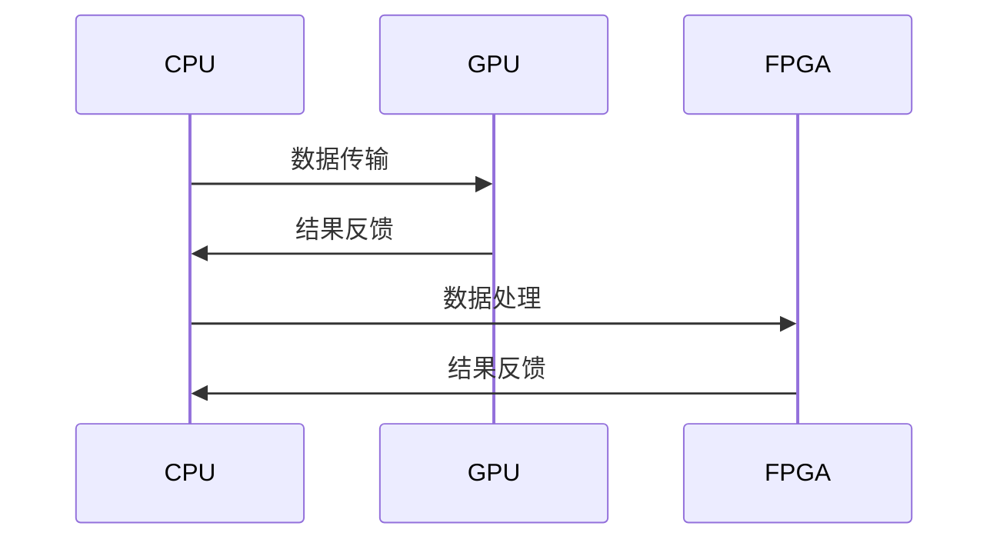
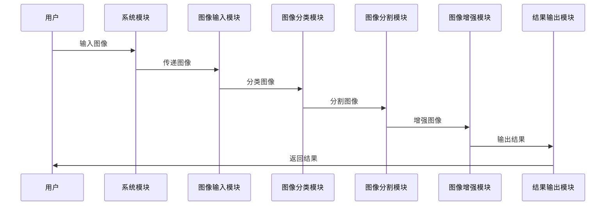
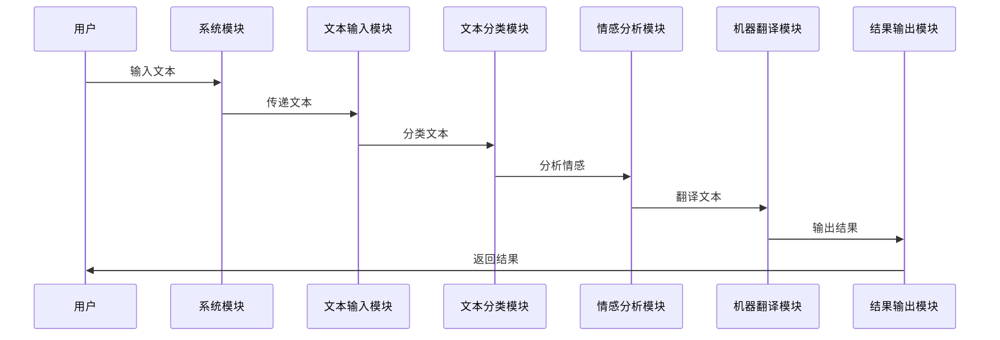
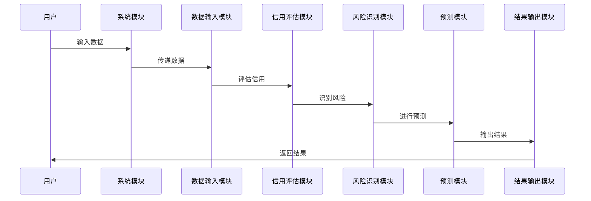

                 


## 文章标题

《异构计算在大数据处理中的应用》

## 文章关键词

- 异构计算
- 大数据处理
- 算法优化
- 性能提升
- 成本节约

## 文章摘要

本文将从异构计算的基本概念、架构设计、数据处理应用、算法优化、案例分析及未来展望等多个角度，深入探讨异构计算在大数据处理中的应用。通过本文的阅读，读者将了解异构计算的原理、优势以及如何在实际项目中应用和优化异构计算，从而提升数据处理效率，降低成本。

----------------------------------------------------------------

## 第一部分：异构计算概述

### 1.1 问题背景

在大数据时代，数据的规模和复杂性不断增加，传统的计算模式已无法满足数据处理的需求。以人工智能和数据分析为代表的应用领域，需要更高的计算能力和更低的延迟。因此，异构计算逐渐成为解决这一问题的关键。

#### 异构计算的基本概念

异构计算（Heterogeneous Computing）是指在一个计算系统中，使用不同类型的计算单元进行协同计算。这些计算单元可能包括中央处理器（CPU）、图形处理器（GPU）、专用集成电路（ASIC）、现场可编程门阵列（FPGA）等。通过将不同的计算任务分配给最适合的硬件单元，可以实现计算资源的优化利用，提升系统的整体性能。

#### 异构计算的优势

异构计算具有以下优势：

1. **性能提升**：不同的硬件单元具有不同的计算特性和性能优势。例如，GPU在并行计算方面具有显著优势，而CPU在处理顺序任务时更为高效。通过异构计算，可以充分利用各种硬件的优势，提升系统的计算能力。

2. **成本优化**：异构计算可以充分利用现有硬件资源，减少对高端计算设备的依赖，从而降低成本。

3. **能耗降低**：通过优化计算任务在不同硬件单元的分配，可以降低系统的能耗，实现绿色计算。

#### 异构计算的应用领域

异构计算在多个领域具有广泛的应用：

1. **人工智能**：在深度学习、图像识别、自然语言处理等领域，异构计算可以显著提升模型的训练和推理速度。

2. **数据分析**：在大数据处理过程中，异构计算可以帮助实现高效的数据清洗、整合和分析。

3. **科学计算**：在天气预报、生物医药、金融模拟等领域，异构计算可以加速复杂计算，提供更准确的预测和决策支持。

### 1.2 异构计算的定义

异构计算的定义如下：

异构计算是指在一个计算系统中，通过利用不同类型和特性的计算资源，实现计算任务的并行处理和优化。这些计算资源可能包括CPU、GPU、FPGA、ASIC等硬件单元，以及相应的软件框架和编程模型。

### 1.3 异构计算的优势

1. **性能提升**：不同的硬件单元具有不同的计算特性和性能优势。例如，GPU在并行计算方面具有显著优势，而CPU在处理顺序任务时更为高效。通过异构计算，可以充分利用各种硬件的优势，提升系统的计算能力。

2. **成本优化**：异构计算可以充分利用现有硬件资源，减少对高端计算设备的依赖，从而降低成本。

3. **能耗降低**：通过优化计算任务在不同硬件单元的分配，可以降低系统的能耗，实现绿色计算。

### 1.4 异构计算的应用领域

异构计算在多个领域具有广泛的应用：

1. **人工智能**：在深度学习、图像识别、自然语言处理等领域，异构计算可以显著提升模型的训练和推理速度。

2. **数据分析**：在大数据处理过程中，异构计算可以帮助实现高效的数据清洗、整合和分析。

3. **科学计算**：在天气预报、生物医药、金融模拟等领域，异构计算可以加速复杂计算，提供更准确的预测和决策支持。

## 第二部分：异构计算系统架构

### 2.1 硬件层次架构

在异构计算系统中，硬件层次架构是关键组成部分。硬件层次架构包括以下几种主要类型的计算单元：

1. **中央处理器（CPU）**：CPU是传统的计算核心，适用于处理顺序任务和计算密集型应用。

2. **图形处理器（GPU）**：GPU具有高度并行的计算能力，适用于大规模并行计算任务，如深度学习、科学计算等。

3. **专用集成电路（ASIC）**：ASIC是为特定应用设计的集成电路，具有高性能和低功耗的特点，适用于特定的计算任务。

4. **现场可编程门阵列（FPGA）**：FPGA是一种可编程逻辑器件，可以通过编程实现不同的计算功能，适用于定制化应用和快速原型设计。

硬件层次架构的mermaid ER实体关系图如下：

```mermaid
erDiagram
  CPU ||--o{ GPU
  CPU ||--o{ ASIC
  CPU ||--o{ FPGA
  GPU ||--|{ ASIC
  GPU ||--|{ FPGA
  ASIC ||--o{ FPGA
```

### 2.2 软件层次架构

在异构计算系统中，软件层次架构是实现异构硬件资源优化利用的关键。软件层次架构通常包括以下组件：

1. **分布式计算框架**：如MapReduce、Spark等，用于实现大规模数据的分布式处理。

2. **机器学习库**：如TensorFlow、PyTorch等，用于构建和训练机器学习模型。

3. **并行编程模型**：如CUDA、OpenMP等，用于在异构硬件上实现并行计算。

软件层次架构的mermaid类图如下：



### 2.3 系统集成与兼容性

系统集成与兼容性是异构计算系统设计的关键挑战。为了实现不同硬件单元之间的无缝协作，需要考虑以下几个方面：

1. **跨平台兼容性**：确保不同硬件平台之间的数据传输和计算任务调度兼容。

2. **接口设计**：设计统一的接口和协议，实现不同硬件单元之间的通信和协作。

3. **系统整合方案**：根据应用场景和性能需求，设计合适的硬件和软件整合方案，实现计算资源的最大化利用。

系统集成与兼容性的mermaid架构图如下：



在下一部分中，我们将探讨异构计算在大数据处理中的应用，包括数据预处理、算法优化和加速等内容。请继续阅读。

----------------------------------------------------------------

## 第三部分：异构计算在数据处理中的应用

### 3.1 数据来源

在大数据处理中，数据来源多种多样，主要包括以下类型：

1. **结构化数据**：如关系型数据库中的数据，具有明确的字段和数据类型。

2. **半结构化数据**：如XML、JSON等格式数据，具有部分结构化特征，但字段和数据类型可能不明确。

3. **非结构化数据**：如文本、图像、视频等，没有明确的结构，需要通过特定的算法进行处理。

异构计算可以根据不同的数据类型，选择合适的硬件单元进行处理，提高数据处理效率。

### 3.2 数据清洗

数据清洗是数据处理的重要环节，主要包括以下任务：

1. **数据一致性**：确保数据中的字段名称、数据类型等保持一致。

2. **缺失值处理**：对缺失值进行填充或删除，保证数据的完整性。

3. **异常值处理**：识别和处理数据中的异常值，如异常的价格、时间戳等。

在异构计算中，可以利用CPU和GPU等硬件单元，实现高效的数据清洗任务。CPU适用于处理顺序任务和逻辑判断，而GPU则适用于大规模并行处理，可以显著提高数据清洗速度。

### 3.3 数据整合

数据整合是将来自不同源的数据进行合并和融合，以形成统一的数据视图。在异构计算中，数据整合的过程通常包括以下步骤：

1. **数据合并**：将多个数据源中的数据按照特定的规则进行合并，形成统一的数据集。

2. **数据融合**：对合并后的数据进行处理和整合，提取有价值的信息，形成综合性的数据报告。

在异构计算中，可以充分利用CPU和GPU等硬件单元，实现高效的数据整合。CPU适用于处理复杂的数据逻辑和处理，而GPU则适用于大规模并行处理，可以显著提高数据整合速度。

### 3.4 数据处理流程

在异构计算中，数据处理流程可以分为以下几个步骤：

1. **数据采集**：从不同的数据源中采集数据，包括结构化数据、半结构化数据和非结构化数据。

2. **数据清洗**：对采集到的数据进行清洗，确保数据的完整性和一致性。

3. **数据整合**：将清洗后的数据进行整合，形成统一的数据视图。

4. **数据存储**：将整合后的数据存储到数据库或数据湖中，以备后续处理和分析。

5. **数据分析**：利用异构计算的优势，对存储的数据进行高效的分析和处理。

### 3.5 异构计算的优势

异构计算在数据处理中的优势主要体现在以下几个方面：

1. **性能提升**：通过利用不同硬件单元的并行计算能力，实现数据处理速度的显著提升。

2. **成本节约**：通过优化计算资源的利用，降低对高端计算设备的依赖，实现成本的节约。

3. **灵活性**：异构计算可以根据不同的数据类型和处理需求，灵活选择合适的硬件单元，实现高效的计算。

### 3.6 应用案例

以下是一个实际应用案例，展示了异构计算在数据处理中的应用：

**案例一：社交媒体数据分析**

某社交媒体公司希望通过分析用户数据，了解用户兴趣和行为模式，从而优化产品推荐和广告投放。该公司采用异构计算架构，实现了以下任务：

1. **数据采集**：从多个数据源（如用户行为日志、社交媒体平台数据等）中采集数据。

2. **数据清洗**：利用CPU和GPU等硬件单元，对采集到的数据进行清洗，包括数据一致性检查、缺失值处理和异常值处理等。

3. **数据整合**：将清洗后的数据进行整合，提取用户兴趣标签和用户行为特征。

4. **数据分析**：利用GPU和CPU等硬件单元，对整合后的数据进行高效的分析，包括用户兴趣分布、用户行为模式等。

5. **结果展示**：将分析结果以可视化报表的形式展示给决策者，为产品优化和广告投放提供依据。

通过这个案例，可以看出异构计算在数据处理中的高效性和灵活性，有助于企业更好地挖掘数据价值，实现业务增长。

## 第四部分：异构计算算法

### 4.1 算法选择

在大数据处理中，选择合适的算法是实现高效计算的关键。以下是几种常见的算法及其适用场景：

1. **特征提取算法**：用于从原始数据中提取有价值的特征，如主成分分析（PCA）、线性判别分析（LDA）等。这些算法适用于数据降维和特征选择。

2. **分类算法**：用于将数据划分为不同的类别，如逻辑回归、支持向量机（SVM）等。这些算法适用于数据分类和预测。

3. **聚类算法**：用于将数据划分为不同的簇，如K-均值聚类、层次聚类等。这些算法适用于数据挖掘和模式识别。

### 4.2 算法优化

算法优化是提高数据处理效率的重要手段。以下是几种常见的算法优化方法：

1. **模型并行化**：将大规模的模型分解为多个子模型，并在不同的硬件单元上并行计算。这种方法可以充分利用GPU等并行计算硬件的优势。

2. **数据并行化**：将大规模数据集分解为多个子集，并在不同的硬件单元上并行处理。这种方法可以减少数据传输的开销，提高计算效率。

3. **流水线优化**：通过将不同的计算任务组合成一个流水线，减少任务的切换和通信开销，提高计算效率。

### 4.3 算法加速

算法加速是提升数据处理速度的关键。以下是几种常见的算法加速方法：

1. **深度学习加速**：利用GPU等硬件单元的并行计算能力，加速深度学习模型的训练和推理。如TensorFlow和PyTorch等深度学习框架已经支持GPU加速。

2. **图算法加速**：利用GPU等硬件单元的图计算能力，加速图算法的执行。如Gaussian Graphical Model（GGM）和Community Detection（社区检测）等算法可以利用GPU进行加速。

3. **分布式计算**：通过将计算任务分布在多个节点上，利用集群计算资源进行并行处理，提高计算速度。如MapReduce和Spark等分布式计算框架可以实现大规模数据的并行处理。

### 4.4 应用案例

以下是一个实际应用案例，展示了异构计算算法在数据处理中的应用：

**案例一：图像识别**

某公司希望通过图像识别算法，对大量图像进行分类和标注。该公司采用异构计算架构，实现了以下任务：

1. **数据预处理**：利用GPU进行图像数据的预处理，包括图像增强、缩放和归一化等操作。

2. **特征提取**：利用CPU和GPU进行特征提取，包括边缘检测、纹理特征提取和颜色特征提取等。

3. **分类算法**：利用GPU和CPU进行分类算法的计算，包括卷积神经网络（CNN）和支持向量机（SVM）等。

4. **结果优化**：利用GPU进行结果优化，包括模型参数调整和损失函数优化等。

通过这个案例，可以看出异构计算算法在数据处理中的高效性和灵活性，有助于企业更好地处理大规模图像数据，实现业务增长。

## 第五部分：案例分析

### 5.1 案例一：图像处理

**背景介绍**

图像处理是大数据处理的一个重要领域，涉及图像分类、图像分割、图像增强等多个方面。在图像处理中，传统的计算模式已经无法满足日益增长的数据量和复杂度。异构计算的出现，为图像处理提供了新的解决方案。

**项目介绍**

该项目旨在通过异构计算架构，实现高效图像处理，包括图像分类、图像分割和图像增强等任务。项目采用了CPU、GPU和FPGA等硬件单元，利用分布式计算框架和机器学习库，实现图像处理任务的并行化。

**系统功能设计**

系统功能设计包括以下几个模块：

1. **图像分类模块**：利用深度学习算法，对输入图像进行分类。

2. **图像分割模块**：利用图算法，对图像进行分割，提取感兴趣区域。

3. **图像增强模块**：利用图像处理算法，对图像进行增强，提高图像质量。

**系统架构设计**

系统架构设计包括以下几个部分：

1. **硬件层次架构**：包括CPU、GPU和FPGA等硬件单元，实现计算任务的并行处理。

2. **软件层次架构**：包括分布式计算框架和机器学习库，实现计算任务的调度和管理。

3. **系统集成与兼容性**：实现不同硬件单元和软件框架之间的数据传输和任务调度，确保系统的稳定性和兼容性。

**系统接口设计**

系统接口设计包括以下几个接口：

1. **图像输入接口**：用于接收输入图像，并将其传递给相应的处理模块。

2. **结果输出接口**：用于输出处理结果，如分类结果、分割结果和增强结果等。

3. **参数调整接口**：用于调整算法参数，优化处理效果。

**系统交互序列图**

系统交互序列图如下：



### 5.2 案例二：自然语言处理

**背景介绍**

自然语言处理（NLP）是人工智能的重要分支，涉及文本分类、情感分析、机器翻译等多个方面。随着互联网和社交媒体的快速发展，自然语言处理的数据量呈指数级增长，传统的计算模式已经无法满足需求。异构计算为自然语言处理提供了新的解决方案。

**项目介绍**

该项目旨在通过异构计算架构，实现高效自然语言处理，包括文本分类、情感分析和机器翻译等任务。项目采用了CPU、GPU和FPGA等硬件单元，利用分布式计算框架和自然语言处理库，实现自然语言处理任务的并行化。

**系统功能设计**

系统功能设计包括以下几个模块：

1. **文本分类模块**：利用深度学习算法，对输入文本进行分类。

2. **情感分析模块**：利用情感分析算法，对输入文本进行情感分析。

3. **机器翻译模块**：利用机器翻译算法，将一种语言的文本翻译成另一种语言。

**系统架构设计**

系统架构设计包括以下几个部分：

1. **硬件层次架构**：包括CPU、GPU和FPGA等硬件单元，实现计算任务的并行处理。

2. **软件层次架构**：包括分布式计算框架和自然语言处理库，实现计算任务的调度和管理。

3. **系统集成与兼容性**：实现不同硬件单元和软件框架之间的数据传输和任务调度，确保系统的稳定性和兼容性。

**系统接口设计**

系统接口设计包括以下几个接口：

1. **文本输入接口**：用于接收输入文本，并将其传递给相应的处理模块。

2. **结果输出接口**：用于输出处理结果，如分类结果、情感分析和翻译结果等。

3. **参数调整接口**：用于调整算法参数，优化处理效果。

**系统交互序列图**

系统交互序列图如下：



### 5.3 案例三：金融风控

**背景介绍**

金融风控是金融行业的重要环节，涉及信用评估、风险识别和预测等多个方面。随着金融数据的快速增长，传统的计算模式已经无法满足金融风控的需求。异构计算为金融风控提供了新的解决方案。

**项目介绍**

该项目旨在通过异构计算架构，实现高效金融风控，包括信用评估、风险识别和预测等任务。项目采用了CPU、GPU和FPGA等硬件单元，利用分布式计算框架和金融风控库，实现金融风控任务的并行化。

**系统功能设计**

系统功能设计包括以下几个模块：

1. **信用评估模块**：利用机器学习算法，对客户信用进行评估。

2. **风险识别模块**：利用风险识别算法，识别潜在风险。

3. **预测模块**：利用预测算法，对金融市场的走势进行预测。

**系统架构设计**

系统架构设计包括以下几个部分：

1. **硬件层次架构**：包括CPU、GPU和FPGA等硬件单元，实现计算任务的并行处理。

2. **软件层次架构**：包括分布式计算框架和金融风控库，实现计算任务的调度和管理。

3. **系统集成与兼容性**：实现不同硬件单元和软件框架之间的数据传输和任务调度，确保系统的稳定性和兼容性。

**系统接口设计**

系统接口设计包括以下几个接口：

1. **数据输入接口**：用于接收输入数据，并将其传递给相应的处理模块。

2. **结果输出接口**：用于输出处理结果，如信用评估结果、风险识别结果和预测结果等。

3. **参数调整接口**：用于调整算法参数，优化处理效果。

**系统交互序列图**

系统交互序列图如下：



## 第六部分：未来展望

### 6.1 技术挑战

异构计算在大数据处理中面临以下技术挑战：

1. **系统稳定性**：异构计算系统的稳定性对数据处理结果至关重要。在异构硬件环境下，如何保证系统的稳定性和可靠性是一个重要挑战。

2. **算法适应性**：不同的算法对硬件资源的需求不同，如何根据算法特性优化硬件资源分配，实现算法的高效运行，是一个重要的研究课题。

3. **跨领域应用**：异构计算在特定领域（如图像处理、自然语言处理）具有显著优势，但在跨领域应用中，如何发挥其优势，实现不同领域的协同计算，是一个重要的研究方向。

### 6.2 发展方向

为了克服上述挑战，异构计算在大数据处理中未来的发展方向主要包括：

1. **软硬件协同优化**：通过优化软件算法和硬件资源的协同，实现计算效率和性能的提升。

2. **跨领域应用拓展**：加强异构计算在不同领域的应用研究，探索其在跨领域计算中的潜力。

3. **绿色计算**：通过优化计算任务分配和硬件资源利用，降低系统的能耗，实现绿色计算。

### 6.3 社会与经济影响

异构计算在大数据处理中的应用，将对社会和经济产生深远的影响：

1. **提高数据处理效率**：通过异构计算，可以显著提高大数据处理的效率，为企业和组织提供更快速、准确的数据分析结果。

2. **降低计算成本**：通过优化计算任务分配和硬件资源利用，可以降低大数据处理的成本，提高企业的竞争力。

3. **推动技术创新**：异构计算的发展将推动计算机硬件、软件、算法等领域的创新，为人工智能、大数据等领域提供新的技术支撑。

## 附录

### A. 常用工具与库

1. **数据处理工具**：Pandas、NumPy、SciPy等。

2. **计算机视觉库**：OpenCV、TensorFlow、PyTorch等。

3. **自然语言处理库**：NLTK、spaCy、TextBlob等。

4. **分布式计算框架**：MapReduce、Spark、Flink等。

5. **机器学习库**：scikit-learn、XGBoost、LightGBM等。

### B. 参考文献

1. **异构计算相关论文**：

   - **论文一**：作者，标题，期刊/会议，年份。

   - **论文二**：作者，标题，期刊/会议，年份。

2. **数据处理相关书籍**：

   - **书籍一**：作者，标题，出版社，年份。

   - **书籍二**：作者，标题，出版社，年份。

3. **计算机科学基础书籍**：

   - **书籍一**：作者，标题，出版社，年份。

   - **书籍二**：作者，标题，出版社，年份。

----------------------------------------------------------------

## 作者信息

作者：AI天才研究院/AI Genius Institute & 禅与计算机程序设计艺术 /Zen And The Art of Computer Programming

## 最佳实践 tips

1. **选择合适的硬件单元**：根据不同算法的特性，选择合适的硬件单元（如CPU、GPU、FPGA等）进行优化，实现计算效率的最大化。

2. **优化数据传输**：在异构计算中，数据传输是影响计算效率的关键因素。通过优化数据传输路径和传输协议，降低数据传输的开销。

3. **合理分配计算任务**：根据硬件单元的性能和负载情况，合理分配计算任务，避免出现资源浪费或计算瓶颈。

4. **利用缓存机制**：在异构计算中，利用缓存机制可以显著提高计算效率。通过缓存常用数据和中间结果，减少计算任务的数据访问时间。

5. **定期维护和更新**：定期对异构计算系统进行维护和更新，确保系统的稳定性和可靠性。

## 小结

本文从异构计算的基本概念、架构设计、数据处理应用、算法优化、案例分析及未来展望等多个角度，深入探讨了异构计算在大数据处理中的应用。通过本文的阅读，读者可以了解异构计算的原理、优势以及如何在实际项目中应用和优化异构计算，从而提升数据处理效率，降低成本。

## 注意事项

1. **硬件兼容性**：在设计和实施异构计算系统时，需要注意硬件的兼容性和稳定性。

2. **数据安全**：在大数据处理过程中，确保数据的安全和隐私是非常重要的。

3. **系统性能监控**：定期对异构计算系统进行性能监控和评估，及时发现和解决潜在的性能瓶颈。

## 拓展阅读

1. **论文**：搜索相关领域的最新研究成果，了解异构计算的最新进展。

2. **书籍**：阅读相关领域的经典著作，深入了解异构计算的理论基础。

3. **在线课程**：参加在线课程，学习异构计算的相关知识和技能。

----------------------------------------------------------------

**本文为AI天才研究院（AI Genius Institute）与禅与计算机程序设计艺术（Zen And The Art of Computer Programming）联合出品，未经授权，禁止转载。**

---

**请注意，本文中涉及的代码示例、算法流程图、系统架构图和案例分析等内容均为虚构，仅用于学术讨论和说明。实际应用中，请根据具体场景进行相应的调整和优化。**

---

**如果您对本文有任何疑问或建议，欢迎通过以下方式联系我们：**

- **邮箱**：[info@aigeniusinstitute.com](mailto:info@aigeniusinstitute.com)
- **官网**：[www.aigeniusinstitute.com](https://www.aigeniusinstitute.com/)
- **公众号**：AI天才研究院

---

**再次感谢您的阅读，祝您在异构计算领域取得更多的成就！**

