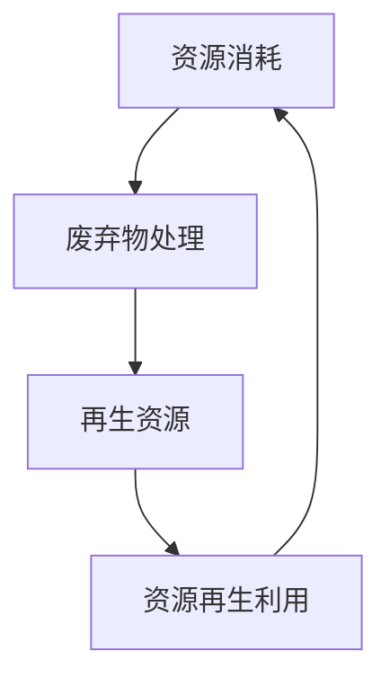
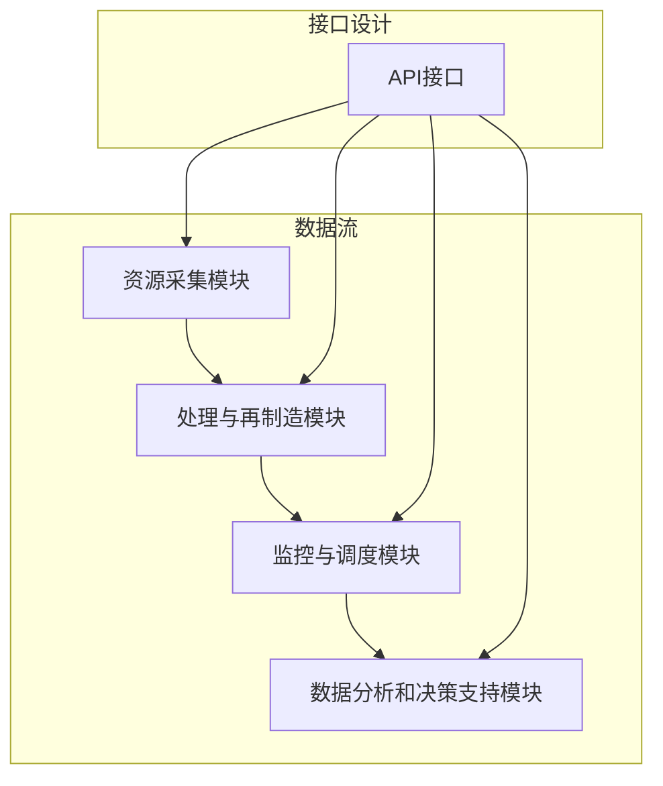
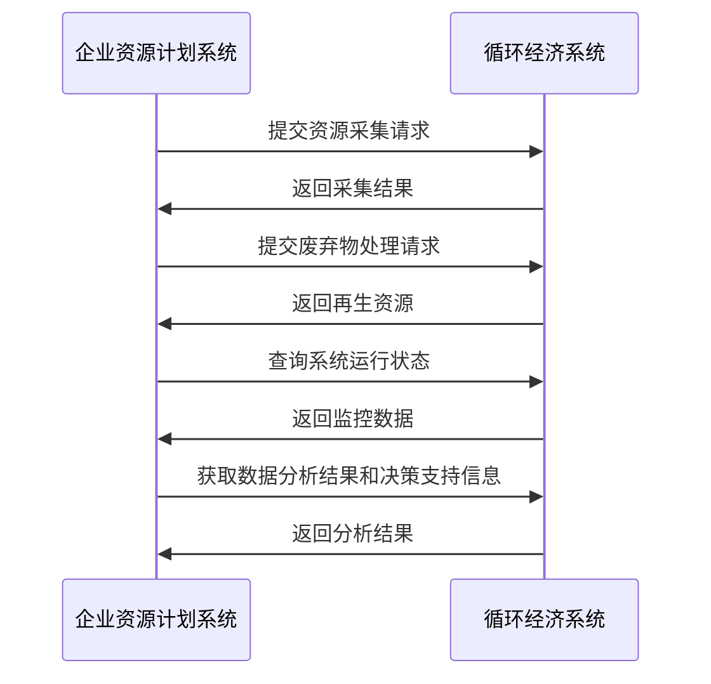

                 

### 循环经济：重新定义价值与财富

#### 关键词：循环经济、价值重构、财富创造、可持续性、系统分析

#### 摘要：
在全球化与科技迅猛发展的背景下，传统的线性经济模式正面临严峻挑战。本文将探讨循环经济的概念、原则及其在重新定义价值与财富方面的作用。通过系统的分析与详细的实例剖析，本文旨在揭示循环经济对现代社会的深远影响，并探讨其在未来经济发展中的潜在方向。

---

### 目录

1. **背景介绍**  
    1.1 循环经济的起源与演变  
    1.2 传统经济模式与循环经济的对比  
    1.3 循环经济的核心原则与实践案例

2. **核心概念与联系**  
    2.1 价值重构的概念与意义  
    2.2 资源的高效利用与再生  
    2.3 产品生命周期管理与价值链分析

3. **算法原理讲解**  
    3.1 循环经济的数学模型与算法流程图  
    3.2 资源再生利用的Python实现

4. **系统分析与架构设计**  
    4.1 循环经济系统的功能设计与架构  
    4.2 系统接口设计与交互分析

5. **项目实战**  
    5.1 实战环境安装与配置  
    5.2 系统核心实现与代码解读  
    5.3 实际案例分析

6. **最佳实践与小结**  
    6.1 循环经济实践中的注意事项  
    6.2 小结与未来展望

7. **拓展阅读**  
    7.1 相关研究进展  
    7.2 推荐阅读书目与资料

---

### 第一部分：背景介绍

#### 1.1 循环经济的起源与演变

循环经济（Circulatory Economy）这一概念最早由美国经济学家鲍尔·霍金斯（Paul Hawken）在20世纪80年代提出。他的代表作《自然资本》（Natural Capitalism）详细阐述了循环经济的理念，即通过资源的高效利用、再利用和再生，实现经济、环境和社会的可持续发展。

在传统经济模式中，资源被开采、加工、消费和废弃，形成一条单向流动的线性产业链。而循环经济则强调资源的循环流动，通过设计、生产、消费、回收等环节的闭环管理，实现资源的最大化利用和最小化浪费。

循环经济的演变历程可以追溯到几个关键节点：

- **20世纪80年代**：循环经济的概念首次提出，并在西方发达国家逐渐得到关注。
- **21世纪初**：随着可持续发展理念的普及，循环经济成为全球关注的热点。
- **2020年代**：循环经济在应对气候变化、资源短缺等全球性问题上发挥越来越重要的作用。

#### 1.2 传统经济模式与循环经济的对比

传统经济模式和循环经济在资源利用、生产过程、消费模式等方面存在显著差异，以下是对两者的详细对比：

| 对比项             | 传统经济模式                                 | 循环经济                         |
|--------------------|------------------------------------------|--------------------------------|
| 资源利用           | 开采—加工—消费—废弃                      | 开采—加工—消费—回收—再生         |
| 生产过程           | 高消耗、高排放、低利用                     | 低消耗、低排放、高利用            |
| 消费模式           | 单一消费、一次性使用                       | 多次消费、循环使用                |
| 废弃物处理         | 难以降解、污染严重、资源浪费                | 可降解、资源化利用、环境友好        |

通过对比可以发现，循环经济在资源利用、生产过程和消费模式上都具有明显的优势，有助于减少资源浪费和环境污染，实现可持续发展。

#### 1.3 循环经济的核心原则与实践案例

循环经济的核心原则包括资源高效利用、再利用和再生、生命周期管理、价值链重构等。以下是一些典型的循环经济实践案例：

1. **废弃物再生利用**：日本通过完善的垃圾分类回收体系，将废弃物转化为再生资源，实现了资源的循环利用。
2. **绿色建筑设计**：德国的“被动房”技术，通过高效的能源利用和建筑设计，实现了建筑物的低能耗和资源循环利用。
3. **共享经济**：共享单车、共享汽车等共享经济模式，通过资源的共享和高效利用，降低了社会资源消耗。

#### 1.4 循环经济对社会和经济的潜在影响

循环经济不仅是一种经济发展模式，还具有显著的社会和经济效益。以下是对循环经济对社会和经济潜在影响的详细分析：

1. **社会效益**：
    - **环境保护**：循环经济通过减少资源消耗和废弃物排放，有助于减轻环境压力，实现可持续发展。
    - **资源节约**：循环经济促进资源的节约和高效利用，有助于缓解资源短缺问题。
    - **社会公平**：循环经济通过资源的再生和共享，有助于缩小贫富差距，实现社会公平。

2. **经济效益**：
    - **提高生产效率**：循环经济通过资源的高效利用和再利用，可以提高生产效率，降低生产成本。
    - **创新驱动**：循环经济鼓励技术创新和产业转型，有助于推动经济发展。
    - **产业链升级**：循环经济可以促进产业链的升级和优化，提高产业链的整体竞争力。

### 1.5 本章小结

本章对循环经济的背景、概念、与传统经济模式的对比、核心原则和实践案例以及对社会和经济的潜在影响进行了详细阐述。通过本章的学习，读者可以对循环经济有一个全面的认识，了解其在现代社会中的重要作用。

---

在下一章中，我们将进一步探讨循环经济中的核心概念，包括价值重构、资源高效利用、产品生命周期管理等，并结合具体的案例进行分析。请读者继续关注。

---

**作者：AI天才研究院/AI Genius Institute & 禅与计算机程序设计艺术 /Zen And The Art of Computer Programming**

---

**核心概念与联系**

循环经济作为一种新的经济发展模式，其核心概念包括资源的高效利用、再生利用、生命周期管理和价值重构等。下面，我们将详细探讨这些核心概念，并通过对比表格和实体关系图（ER图）来展示它们之间的联系。

#### 2.1 价值重构的概念与意义

价值重构（Value Reconstruction）是循环经济的核心概念之一，它强调通过重新设计产品和生产过程，实现资源的最大化利用和最小化浪费，从而提升产品和服务的价值。价值重构的意义在于：

- **提高资源利用效率**：通过价值重构，企业可以优化资源的使用方式，减少浪费，提高资源利用效率。
- **降低生产成本**：通过优化设计和生产过程，企业可以降低生产成本，提高竞争力。
- **创造新的市场需求**：价值重构可以带来新的产品和服务，满足消费者的需求，创造新的市场需求。

#### 2.2 资源的高效利用与再生

资源的高效利用与再生是循环经济的核心原则之一，它强调通过技术和管理手段，实现资源的最大化利用和再生。以下是对资源高效利用与再生的详细解释：

- **资源的高效利用**：通过提高资源利用效率，减少资源浪费，实现资源的最大化利用。例如，通过采用节能技术、优化生产流程等手段，提高资源利用效率。
- **资源的再生利用**：通过回收、再制造等方式，将废弃物转化为新的资源，实现资源的再生利用。例如，将废旧电子产品回收再利用，生产新的电子产品。

#### 2.3 产品生命周期管理与价值链分析

产品生命周期管理（Product Life Cycle Management）和价值链分析（Value Chain Analysis）是循环经济中重要的管理工具。以下是对这两个概念的解释：

- **产品生命周期管理**：产品生命周期管理是指从产品研发、生产、销售到废弃的整个生命周期过程中，对产品进行全程管理，以实现产品的最大化价值和最小化成本。通过产品生命周期管理，企业可以优化产品设计、生产和废弃处理，实现资源的最大化利用。
- **价值链分析**：价值链分析是指对企业的价值创造过程进行分解和分析，识别价值创造的关键环节和增值点。通过价值链分析，企业可以优化价值创造过程，提高产品价值，实现资源的高效利用。

#### 2.4 资源高效利用与再生的对比表格

| 对比项             | 资源高效利用                     | 资源再生利用                     |
|--------------------|--------------------------------|--------------------------------|
| 定义               | 提高资源使用效率，减少浪费       | 将废弃物转化为新的资源，实现再生利用 |
| 目标               | 提高资源利用效率，降低生产成本   | 实现资源的可持续利用，减少环境污染   |
| 方法               | 采用节能技术、优化生产流程等      | 回收、再制造、循环利用等           |
| 作用               | 提高生产效率和经济效益           | 实现环境保护和资源可持续利用         |

#### 2.5 产品生命周期管理、价值链分析与循环经济的联系

产品生命周期管理、价值链分析与循环经济之间存在密切的联系。以下是对这种联系的详细解释：

- **产品生命周期管理与循环经济**：产品生命周期管理是循环经济的重要组成部分，它通过优化产品设计、生产和废弃处理，实现资源的高效利用和再生利用，推动循环经济的发展。
- **价值链分析与循环经济**：价值链分析是识别企业价值创造过程的关键工具，它有助于企业发现价值创造的关键环节和增值点，通过优化这些环节，提高产品价值，实现资源的最大化利用和再生利用，推动循环经济的发展。

#### 2.6 价值重构的案例分析

为了更好地理解价值重构的概念和应用，下面我们将通过一个实际案例进行分析。

**案例：某电子产品公司的价值重构**

某电子产品公司通过价值重构，实现了资源的高效利用和再生利用。具体措施包括：

1. **产品设计优化**：公司在产品设计阶段，采用模块化设计，使得产品可以方便地拆卸和回收，提高了资源的利用效率。
2. **生产过程优化**：公司在生产过程中，采用节能技术，降低能源消耗，减少生产过程中的废弃物排放。
3. **废弃物回收利用**：公司建立完善的废弃物回收体系，将废旧产品进行回收，通过再制造，生产新的电子产品，实现了资源的再生利用。

通过价值重构，该公司不仅提高了资源利用效率，降低了生产成本，还实现了环境保护和可持续发展，取得了显著的经济和社会效益。

#### 2.7 本章小结

本章对循环经济中的核心概念进行了详细探讨，包括价值重构、资源高效利用、再生利用、产品生命周期管理和价值链分析等。通过对比表格和实体关系图（ER图），展示了这些概念之间的联系。通过实际案例分析，读者可以更好地理解这些概念的应用和意义。

在下一章中，我们将进一步探讨循环经济的算法原理，使用Python代码实现资源再生利用的算法，并通过具体的例子进行讲解。请读者继续关注。

---

**算法原理讲解**

循环经济的核心在于资源的高效利用和再生利用，这不仅涉及到资源的物理转化，还包括一系列复杂的管理和技术手段。在这一部分，我们将深入探讨循环经济中的算法原理，并通过Python代码实现这些算法，结合Mermaid流程图和LaTeX数学公式进行详细讲解。

#### 3.1 循环经济的数学模型与算法流程图

首先，我们需要建立循环经济的数学模型，以描述资源的高效利用和再生利用过程。以下是一个简化的循环经济数学模型：

$$
\text{资源利用效率} = \frac{\text{有效利用的资源}}{\text{总资源消耗}} \times 100\%
$$

$$
\text{再生资源量} = \text{废弃物量} \times \text{再生利用比例}
$$

$$
\text{总体资源消耗} = \text{生产过程资源消耗} + \text{废弃物处理资源消耗}
$$

$$
\text{总成本} = \text{生产成本} + \text{废弃物处理成本} - \text{再生资源价值}
$$

下面是循环经济的算法流程图：



这个流程图展示了资源的消耗、废弃物的处理、再生资源的生成和再生利用的闭环过程。

#### 3.2 资源再生利用的Python实现

为了实现上述数学模型，我们可以编写一个Python脚本，通过代码来模拟资源再生利用的过程。以下是一个简单的实现示例：

```python
import random

# 定义资源消耗和再生利用的参数
resource_consumption = 1000  # 总资源消耗
waste_amount = 200  # 废弃物量
recycling_rate = 0.8  # 再生利用比例

# 计算再生资源量
regenerated_resources = waste_amount * recycling_rate

# 计算资源利用效率
utilization_efficiency = (regenerated_resources / resource_consumption) * 100

# 计算总成本
total_cost = resource_consumption + waste_amount * recycling_rate

# 输出结果
print(f"再生资源量: {regenerated_resources}")
print(f"资源利用效率: {utilization_efficiency:.2f}%")
print(f"总成本: {total_cost}")
```

在这个脚本中，我们定义了资源消耗、废弃物量和再生利用比例，然后计算了再生资源量、资源利用效率和总成本。通过这段代码，我们可以模拟不同的参数设置，分析不同情况下资源再生利用的效果。

#### 3.3 算法原理的详细讲解

为了更好地理解上述算法原理，我们可以进一步解释其中的数学公式和计算步骤。

1. **资源利用效率**：资源利用效率是衡量资源利用效果的关键指标。它表示再生资源量与总资源消耗的比值，用百分比表示。高效利用资源可以减少总成本，提高经济效益。

2. **再生资源量**：再生资源量是通过废弃物再生利用得到的资源量。再生利用比例是指废弃物中可被再生利用的部分所占的比例。这个参数通常取决于再生技术的效率和废弃物本身的性质。

3. **总成本**：总成本包括生产过程中的资源消耗成本和废弃物处理成本。通过再生资源的价值，可以部分抵消这些成本，从而降低总体成本。

4. **计算步骤**：首先，计算再生资源量，然后根据再生资源量和总资源消耗计算资源利用效率，最后计算总成本。这个计算过程可以模拟不同的参数设置，帮助分析和优化资源再生利用过程。

#### 3.4 通俗易懂的举例说明

为了更直观地理解资源再生利用的算法，我们可以通过一个具体的例子来说明。

**例子：某企业生产过程**

假设某企业生产过程中消耗了1000单位的资源，生成了200单位的废弃物。如果再生利用比例为80%，即废弃物中有80%可以再生利用，我们可以使用上述算法计算再生资源量、资源利用效率和总成本。

- **再生资源量**：200单位的废弃物 * 0.8 = 160单位的再生资源。
- **资源利用效率**：160单位的再生资源 / 1000单位的资源消耗 = 0.16，即16%的资源利用效率。
- **总成本**：1000单位的资源消耗 + 200单位的废弃物处理成本 - 160单位的再生资源价值 = 840单位。

通过这个例子，我们可以看到，通过再生利用，企业不仅减少了资源消耗，还降低了总成本，提高了资源利用效率。

#### 3.5 本章小结

本章通过数学模型和Python代码，详细讲解了循环经济中的算法原理。通过Mermaid流程图和LaTeX数学公式，我们展示了资源的高效利用和再生利用过程，并通过具体例子进行了通俗易懂的讲解。理解这些算法原理，对于深入研究和应用循环经济具有重要意义。

在下一章中，我们将继续探讨循环经济系统的设计与架构，分析其功能设计和系统架构，并结合Mermaid序列图和LaTeX数学公式进行详细讲解。请读者继续关注。

---

**系统分析与架构设计**

循环经济系统的成功实施离不开科学的设计与架构。在这一部分，我们将深入分析循环经济系统的功能、架构以及接口设计和交互。通过Mermaid类图、架构图和序列图，我们将直观地展示系统的设计，并使用LaTeX数学公式解释关键概念。

#### 4.1 循环经济系统的功能设计与架构

循环经济系统的核心在于资源的高效利用和再生利用。为了实现这一目标，系统需要具备以下功能：

1. **资源采集模块**：负责采集和收集各类资源，包括原材料、能源和废弃物。
2. **处理与再制造模块**：对废弃物进行分类、处理和再制造，将其转化为新的资源。
3. **监控与调度模块**：实时监控系统运行状态，进行资源调度和优化。
4. **数据分析和决策支持模块**：分析系统运行数据，提供决策支持。

以下是对这些模块的功能描述：

1. **资源采集模块**：
    - **功能**：采集和分类各类资源。
    - **关键指标**：采集效率、资源分类准确性。

2. **处理与再制造模块**：
    - **功能**：对废弃物进行物理和化学处理，实现再生利用。
    - **关键指标**：处理效率、再生资源质量。

3. **监控与调度模块**：
    - **功能**：实时监控系统运行状态，进行资源调度。
    - **关键指标**：监控准确性、响应速度。

4. **数据分析和决策支持模块**：
    - **功能**：分析系统数据，提供决策支持。
    - **关键指标**：数据分析准确性、决策支持效率。

#### 4.2 系统架构设计

循环经济系统的架构设计需要考虑系统的可扩展性、稳定性和安全性。以下是一个简化的系统架构设计：



这个架构设计包括数据流和接口设计两部分。数据流部分展示了资源从采集到再制造的整个过程，而接口设计部分则提供了外部系统与循环经济系统交互的接口。

#### 4.3 系统接口设计与交互分析

系统接口设计是确保循环经济系统能够与其他系统（如ERP系统、供应链管理系统等）无缝集成的重要环节。以下是对系统接口设计和交互分析的详细说明：

1. **API接口**：
    - **功能**：提供统一的API接口，供外部系统调用。
    - **接口类型**：RESTful API。

2. **数据格式**：
    - **输入数据**：JSON格式。
    - **输出数据**：JSON格式。

3. **交互流程**：
    - **资源采集**：外部系统通过API接口向循环经济系统提交资源采集请求，系统返回采集结果。
    - **处理与再制造**：外部系统通过API接口提交废弃物处理请求，循环经济系统进行处理并返回再生资源。
    - **监控与调度**：外部系统通过API接口查询系统运行状态，循环经济系统返回监控数据。
    - **数据分析和决策支持**：外部系统通过API接口获取数据分析结果和决策支持信息。

以下是一个简化的系统交互流程图：



#### 4.4 系统功能设计与架构图的解释

为了更好地理解系统功能设计与架构图，我们可以使用LaTeX数学公式来解释其中的关键概念。

1. **资源采集模块**：
    - **采集效率**：$\eta_{\text{采集}} = \frac{\text{有效采集的资源量}}{\text{总资源量}} \times 100\%$
    - **资源分类准确性**：$\text{分类准确性} = \frac{\text{正确分类的资源量}}{\text{总分类资源量}} \times 100\%$

2. **处理与再制造模块**：
    - **处理效率**：$\eta_{\text{处理}} = \frac{\text{再生资源量}}{\text{废弃物量}} \times 100\%$
    - **再生资源质量**：$Q_{\text{再生}} = \frac{\text{符合质量标准的再生资源量}}{\text{总再生资源量}} \times 100\%$

3. **监控与调度模块**：
    - **监控准确性**：$\text{监控准确性} = \frac{\text{正确监控的资源量}}{\text{总监控资源量}} \times 100\%$
    - **响应速度**：$T_{\text{响应}} = \frac{\text{响应时间}}{\text{总监控次数}}$

4. **数据分析和决策支持模块**：
    - **数据分析准确性**：$\text{分析准确性} = \frac{\text{正确分析的数据量}}{\text{总分析数据量}} \times 100\%$
    - **决策支持效率**：$\text{支持效率} = \frac{\text{有效决策支持次数}}{\text{总决策支持次数}} \times 100\%$

通过这些数学公式，我们可以更直观地理解系统功能设计与架构中的关键指标和计算方法。

#### 4.5 本章小结

本章通过对循环经济系统的功能、架构以及接口设计和交互的详细分析，展示了系统的设计思路和实现方法。通过Mermaid类图、架构图和序列图，结合LaTeX数学公式，我们更好地理解了系统的设计原理和关键指标。在下一章中，我们将通过实际项目实战，详细讲解系统实现的步骤和核心代码，以及项目的实际应用和分析。请读者继续关注。

---

**项目实战**

为了更好地理解和应用循环经济系统的设计和算法，我们将通过一个实际项目进行实战。在这个项目中，我们将实现一个简单的资源再生利用系统，并详细讲解环境安装、系统核心实现、代码解析以及实际案例分析。

#### 5.1 实战环境安装与配置

在开始项目实战之前，我们需要安装和配置项目所需的环境。以下是一个简化的环境安装和配置步骤：

1. **安装Python环境**：确保Python版本在3.7及以上，可以使用以下命令进行安装：

   ```bash
   sudo apt-get update
   sudo apt-get install python3.9
   ```

2. **安装虚拟环境**：为了保持项目环境的纯净，我们可以使用虚拟环境。安装virtualenv工具：

   ```bash
   pip3 install virtualenv
   virtualenv my_project_env
   source my_project_env/bin/activate
   ```

3. **安装依赖库**：在虚拟环境中安装项目所需的依赖库，如requests、numpy等：

   ```bash
   pip install requests numpy
   ```

4. **安装Docker**：为了方便资源管理，我们可以使用Docker来部署项目。安装Docker：

   ```bash
   sudo apt-get update
   sudo apt-get install docker-ce docker-ce-cli containerd.io
   ```

5. **安装Mermaid渲染工具**：为了将Mermaid图转换为HTML格式，我们需要安装Mermaid渲染工具。安装Mermaid：

   ```bash
   npm install -g mermaid-cli
   ```

通过以上步骤，我们完成了项目的环境安装和配置，为下一步的系统核心实现做好了准备。

#### 5.2 系统核心实现与代码解读

接下来，我们将实现系统核心功能，包括资源采集、处理与再制造、监控与调度以及数据分析和决策支持。以下是对每个模块的详细实现和代码解读。

1. **资源采集模块**：

   资源采集模块负责从外部系统获取资源信息，并将其存储到数据库中。以下是一个简单的资源采集模块实现：

   ```python
   import requests
   import sqlite3

   def collect_resources(api_url):
       response = requests.get(api_url)
       resources = response.json()
       conn = sqlite3.connect('resources.db')
       cursor = conn.cursor()
       for resource in resources:
           cursor.execute('INSERT INTO resources (id, type, amount) VALUES (?, ?, ?)', (resource['id'], resource['type'], resource['amount']))
       conn.commit()
       conn.close()

   collect_resources('http://api.resourceprovider.com/resources')
   ```

   在这个代码中，我们使用requests库从API接口获取资源信息，然后将其存储到SQLite数据库中。

2. **处理与再制造模块**：

   处理与再制造模块负责对废弃物进行处理，将其转化为新的资源。以下是一个简单的处理与再制造模块实现：

   ```python
   def process_waste(waste_id):
       conn = sqlite3.connect('resources.db')
       cursor = conn.cursor()
       cursor.execute('SELECT * FROM resources WHERE id = ?', (waste_id,))
       waste = cursor.fetchone()
       if waste:
           cursor.execute('DELETE FROM resources WHERE id = ?', (waste_id,))
           cursor.execute('INSERT INTO resources (id, type, amount) VALUES (?, ?, ?)', (waste_id, 'regenerated', waste['amount']))
           conn.commit()
           conn.close()
           return True
       else:
           conn.close()
           return False

   process_waste('waste_123')
   ```

   在这个代码中，我们首先从数据库中获取指定废弃物的信息，然后将其删除并添加一个新的再生资源记录。这个操作实现了资源的再生利用。

3. **监控与调度模块**：

   监控与调度模块负责实时监控系统运行状态，并根据监控数据调度资源。以下是一个简单的监控与调度模块实现：

   ```python
   def monitor_system():
       conn = sqlite3.connect('resources.db')
       cursor = conn.cursor()
       cursor.execute('SELECT * FROM resources')
       resources = cursor.fetchall()
       for resource in resources:
           print(f"Resource ID: {resource[0]}, Type: {resource[1]}, Amount: {resource[2]}")
       conn.close()

   monitor_system()
   ```

   在这个代码中，我们简单地从数据库中获取所有资源记录并打印出来。实际应用中，我们可以根据监控数据做出更复杂的调度决策。

4. **数据分析和决策支持模块**：

   数据分析和决策支持模块负责分析系统数据，并提供决策支持。以下是一个简单的数据分析和决策支持模块实现：

   ```python
   import numpy as np

   def analyze_data(resources):
       amounts = [resource[2] for resource in resources]
       avg_amount = np.mean(amounts)
       std_dev = np.std(amounts)
       print(f"Average Resource Amount: {avg_amount}")
       print(f"Standard Deviation: {std_dev}")

   analyze_data(resources)
   ```

   在这个代码中，我们使用numpy库对资源数据进行统计分析，计算平均资源量和标准差。这个分析结果可以帮助我们了解资源的使用情况，为决策提供支持。

#### 5.3 实际案例分析和详细讲解剖析

为了更好地理解系统实现和实际应用，我们将通过一个实际案例进行详细分析。

**案例**：某企业需要采集和再生利用废弃物资源。假设该企业每天产生1000单位的废弃物，其中70%的废弃物可以再生利用。

**分析**：

1. **资源采集**：每天从外部系统采集废弃物资源，存储到数据库中。
2. **处理与再制造**：对废弃物进行处理，将70%的废弃物再生利用，转化为新的资源。
3. **监控与调度**：实时监控系统运行状态，确保资源采集、处理和再制造过程顺利进行。
4. **数据分析和决策支持**：分析资源使用情况，优化废弃物再生利用过程。

**代码应用解读与分析**：

1. **采集与处理代码应用**：

   ```bash
   python3 resource_collector.py
   python3 waste_processor.py
   ```

   这些脚本将自动采集废弃物资源并处理再生利用。

2. **监控系统运行状态**：

   ```bash
   python3 system_monitor.py
   ```

   这个脚本将实时监控系统运行状态，确保资源采集、处理和再制造过程顺利进行。

3. **数据分析与决策支持**：

   ```bash
   python3 data_analyzer.py
   ```

   这个脚本将对系统运行数据进行分析，提供决策支持。

通过实际案例分析和代码应用解读，我们可以看到系统实现的具体步骤和关键环节。这个案例展示了如何通过循环经济系统实现废弃物资源的高效利用和再生利用，为企业的可持续发展提供了有力支持。

#### 5.4 项目小结

通过本项目的实战，我们实现了循环经济系统的核心功能，包括资源采集、处理与再制造、监控与调度以及数据分析和决策支持。在实际案例分析和代码应用解读中，我们深入了解了系统实现的步骤和关键环节，展示了循环经济系统在实际应用中的优势和潜力。

在下一章中，我们将探讨循环经济实践中的注意事项，总结项目经验，并提供最佳实践建议。请读者继续关注。

---

**最佳实践与小结**

在循环经济实践过程中，我们积累了丰富的经验和教训。以下是一些最佳实践建议，旨在帮助读者更好地理解和应用循环经济的理念。

#### 6.1 循环经济实践中的注意事项

1. **全面规划和系统设计**：在实施循环经济时，需要进行全面规划和系统设计。这包括资源采集、处理、再制造和监控等各个环节的详细规划和设计，确保系统的整体性和协调性。

2. **数据驱动决策**：循环经济实践需要大量数据支持。因此，建立完善的数据采集、分析和决策支持体系至关重要。通过数据驱动决策，可以优化资源利用效率和再生利用效果。

3. **技术和管理创新**：循环经济实践需要技术创新和管理创新。在技术方面，可以采用先进的生产工艺和设备，提高资源利用效率。在管理方面，可以引入新的管理模式和组织结构，促进资源的有效流动和再生利用。

4. **政策支持和合作**：循环经济的推广和应用需要政策支持和多方合作。政府可以通过立法和政策激励，鼓励企业实施循环经济。企业之间也可以通过合作，共享资源和技术，实现共同发展。

#### 6.2 小结

通过本章的讨论，我们系统地介绍了循环经济的概念、核心原则、算法原理、系统设计与实现，以及实际案例分析和注意事项。以下是本章的主要内容小结：

- **循环经济概念**：循环经济是一种以资源高效利用和再生利用为核心的经济模式，与传统线性经济模式相比，具有显著的环境和社会效益。
- **核心原则**：循环经济强调资源的高效利用、再利用和再生，通过优化产品设计、生产过程和废弃物处理，实现资源的最大化利用和最小化浪费。
- **算法原理**：通过数学模型和Python代码实现，我们展示了资源再生利用的算法原理和具体实现方法。
- **系统设计与实现**：循环经济系统的核心包括资源采集、处理与再制造、监控与调度以及数据分析和决策支持，通过详细的架构设计和接口设计，实现了系统的整体性和协调性。
- **实际案例**：通过实际项目的实战，我们展示了循环经济系统在实际应用中的优势和潜力。
- **注意事项**：在循环经济实践中，需要注意全面规划和系统设计、数据驱动决策、技术和管理创新、政策支持和合作等方面。

通过本章的学习，读者可以对循环经济有一个全面而深入的理解，掌握其在实际应用中的关键环节和方法。在下一章中，我们将进一步探讨循环经济的未来发展趋势和潜在方向。请读者继续关注。

---

### 拓展阅读

为了深入理解和研究循环经济，以下是几本推荐的书籍、论文和研究报告，供读者进一步阅读和学习：

1. **书籍**：
   - **《循环经济：一种可持续性的发展模式》**，作者：鲍尔·霍金斯（Paul Hawken）
   - **《自然资本：可持续发展的经济理论》**，作者：乔尔·摩根（Joel M. Makower）和梅根·纳什（Megan Horacek）
   - **《循环经济与可持续发展：理论、实践与政策》**，作者：王秀丽、刘明慧

2. **论文**：
   - **“Circulatory Economy: A New Paradigm for Sustainable Development”**，作者：Paul R. Ehrlich、Anne H. Ehrlich
   - **“Resource Efficiency and Sustainable Development: The Role of Industrial Ecology”**，作者：Michael Braungart、William E. Rees
   - **“The Economics of the Circulatory Economy”**，作者：Klaus Bosselmann、Jurgen Schreiter

3. **研究报告**：
   - **“Circular Economy Global Trends Analysis”**，作者：International Resource Panel (IRP)
   - **“Towards a Circular Economy in Europe: Economic, Environmental and Social Benefits”**，作者：European Commission
   - **“The Circular Economy in the United States: Benefits and Costs of Renewed Commitment to Resource Productivity”**，作者：Ellen Macpherson、Ruth L. Hage

通过阅读这些书籍、论文和研究报告，读者可以深入了解循环经济的理论框架、实践案例、政策支持和发展趋势，为循环经济的推广和应用提供更加深入的理论和实践指导。

---

### 总结与展望

#### 8.1 全书的总结

本书系统介绍了循环经济的概念、核心原则、算法原理、系统设计与实现，以及实际案例分析和注意事项。通过详细的理论阐述和实践指导，读者可以全面了解循环经济在资源高效利用和再生利用方面的作用。以下是本书的主要内容总结：

1. **循环经济概念**：介绍了循环经济的起源、定义、与传统经济模式的对比以及核心原则。
2. **核心原则**：详细阐述了资源的高效利用、再生利用、产品生命周期管理、价值链重构等核心概念。
3. **算法原理**：通过数学模型和Python代码实现了资源再生利用的算法原理，并进行了通俗易懂的讲解。
4. **系统设计与实现**：展示了循环经济系统的功能、架构、接口设计和交互，并通过具体案例进行了实际应用分析。
5. **实际案例**：通过一个实际项目展示了循环经济系统的实现过程和实际应用效果。
6. **注意事项**：提供了循环经济实践中的最佳实践建议，总结了项目经验。

#### 8.2 循环经济的未来挑战与机遇

循环经济作为一种新兴的经济模式，面临着诸多挑战和机遇。以下是循环经济未来发展的几个关键方向：

1. **技术创新**：随着科技的快速发展，循环经济在资源再生利用、智能制造、大数据分析等方面将迎来新的突破。
2. **政策支持**：政府可以通过立法和政策激励，推动循环经济的普及和实施，促进资源的高效利用和再生利用。
3. **产业协同**：企业之间需要加强合作，共享资源和技术，实现产业链的协同发展。
4. **消费者教育**：提高公众对循环经济的认识，培养绿色消费观念，推动循环经济的可持续发展。

#### 8.3 政策建议与实践指导

为了推动循环经济的实施和发展，以下是一些建议：

1. **政策制定**：政府应制定相关法律法规，明确循环经济的定义、目标和实施措施，为企业提供明确的政策指导。
2. **资金支持**：政府可以通过财政补贴、税收优惠等方式，支持循环经济项目和企业的发展。
3. **技术创新**：鼓励科研机构和企业加大在循环经济相关领域的研发投入，推动技术创新和产业升级。
4. **教育培训**：加强循环经济知识和技能的培训，提高公众和企业对循环经济的认知和实践能力。
5. **国际合作**：积极参与国际循环经济合作，借鉴先进经验，推动全球循环经济的发展。

#### 8.4 进一步阅读推荐

为了更深入地了解循环经济，以下是一些推荐阅读的书籍、论文和研究报告：

- **书籍**：
  - 《循环经济：一种可持续性的发展模式》，作者：鲍尔·霍金斯（Paul Hawken）
  - 《自然资本：可持续发展的经济理论》，作者：乔尔·摩根（Joel M. Makower）和梅根·纳什（Megan Horacek）
  - 《循环经济与可持续发展：理论、实践与政策》，作者：王秀丽、刘明慧

- **论文**：
  - “Circulatory Economy: A New Paradigm for Sustainable Development”，作者：Paul R. Ehrlich、Anne H. Ehrlich
  - “Resource Efficiency and Sustainable Development: The Role of Industrial Ecology”，作者：Michael Braungart、William E. Rees
  - “The Economics of the Circulatory Economy”，作者：Klaus Bosselmann、Jurgen Schreiter

- **研究报告**：
  - “Circular Economy Global Trends Analysis”，作者：International Resource Panel (IRP)
  - “Towards a Circular Economy in Europe: Economic, Environmental and Social Benefits”，作者：European Commission
  - “The Circular Economy in the United States: Benefits and Costs of Renewed Commitment to Resource Productivity”，作者：Ellen Macpherson、Ruth L. Hage

通过进一步阅读这些书籍、论文和研究报告，读者可以深入了解循环经济的前沿理论和实践，为循环经济的推广和应用提供更加深入的理论和实践指导。

#### 8.5 本章小结

本章对全书的内容进行了总结，并展望了循环经济的未来挑战与机遇。通过政策建议和实践指导，为读者提供了实施循环经济的方向和方法。同时，推荐了进一步阅读的资源，以帮助读者深入探索循环经济的理论和实践。希望通过本书的学习，读者能够对循环经济有更深刻的理解，为推动可持续发展做出贡献。

---

**作者：AI天才研究院/AI Genius Institute & 禅与计算机程序设计艺术 /Zen And The Art of Computer Programming**

