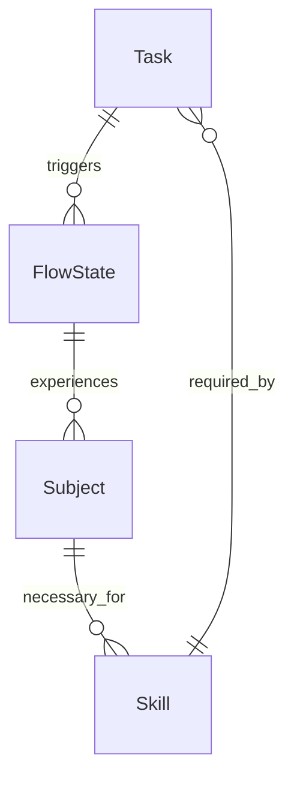
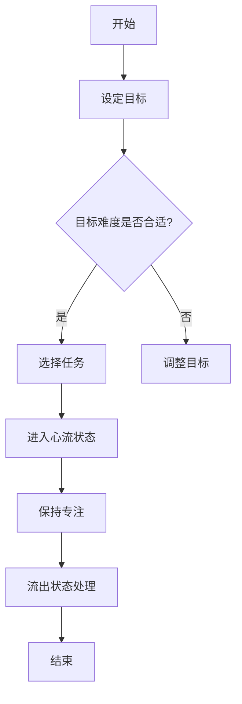
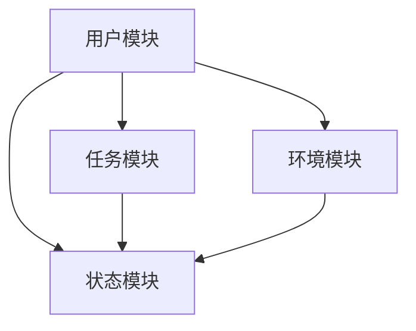
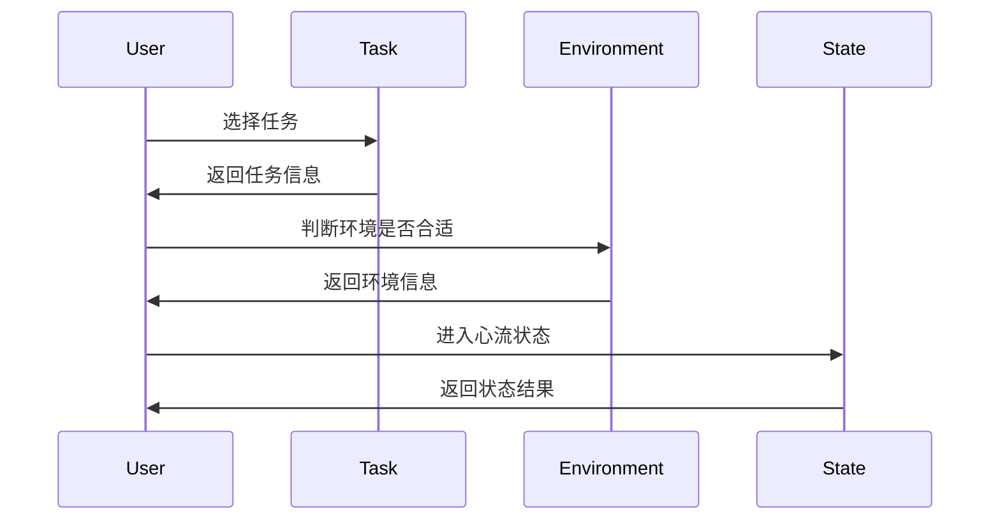
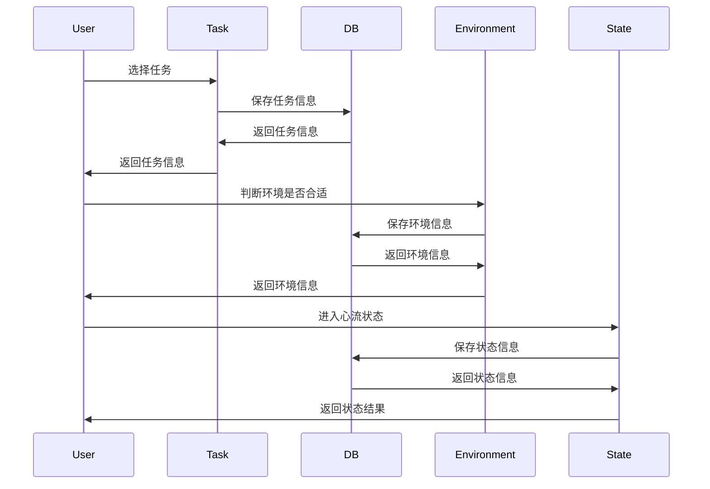

                 

# 心流状态：全身心投入的幸福体验

> 关键词：心流、全身心投入、幸福体验、心理状态、神经科学、实用技巧

> 摘要：
本文将深入探讨心流状态的概念、心理学和神经科学基础，以及实现心流状态的方法。通过本文的阅读，读者将了解心流状态的定义、特征、应用及其带来的益处，掌握如何在生活中有效地激发心流状态，从而提升工作效率、增进幸福感。

## 引言

心流状态（Flow State）是一种高度集中注意力、沉浸于某一活动中的心理状态。这一概念最早由心理学家米哈伊·契克森米哈伊（Mihaly Csikszentmihalyi）提出。他通过广泛的观察和研究，揭示了当人们在追求目标的过程中，完全投入于所做的事情时所体验到的一种独特的心境。

心流状态是一种理想的体验，因为它不仅能够带来快乐，还能促进个人成长、提升创造力和工作效率。本文将详细探讨心流状态的本质，解析其背后的心理学和神经科学原理，并提供实用的技巧，帮助读者在实际生活中更好地体验心流状态。

## 心流状态的心理和神经科学基础

### 心理学基础

心流状态的心理基础涉及多个方面，包括注意力、自我意识、动机等。以下是心流状态在心理学上的几个关键要素：

#### 注意力的集中

心流状态的一个显著特征是高度的注意力集中。当人们处于心流状态时，他们的注意力会完全聚焦于当前的任务，排除外界干扰。

#### 自我意识的消失

在心流状态中，人们常常会感受到自我意识的消失，仿佛“自己”与任务融为一体。这种体验使得个体能够更深入地投入到活动中。

#### 动机的内在化

心流状态通常与内在动机紧密相关。人们在追求自我实现的过程中，会更加倾向于选择那些能够带来内在满足感的活动。

### 神经科学基础

神经科学研究表明，心流状态与大脑中的多个神经网络和神经递质有关。以下是心流状态在神经科学上的几个关键机制：

#### 前额叶皮层活动

前额叶皮层与注意力控制、决策制定和自我调节密切相关。在心流状态中，前额叶皮层活动增强，有助于维持高度集中的注意力。

#### 侵入性思考的减少

心流状态还与侵入性思考的减少有关。侵入性思考通常是指那些不受控制的、令人分心的想法。在心流状态中，这些侵入性思考被抑制，从而使得个体能够更专注于当前任务。

#### 多巴胺的释放

多巴胺是一种与愉悦和奖励相关的神经递质。在心流状态中，多巴胺的释放增加，有助于提升个体的快乐感和动机。

## 实践技巧：如何进入心流状态

### 调整心理状态

#### 正念练习

正念练习是一种通过专注于当前时刻来提高注意力集中和自我意识的方法。通过正念练习，人们可以学会如何将注意力集中在呼吸、身体感觉或特定活动上，从而减少分心和焦虑。

#### 深度放松

深度放松是一种通过深呼吸和肌肉放松来减轻身体和心理紧张的方法。在心流状态之前进行深度放松，可以帮助个体进入一个更平静和专注的心理状态。

#### 意志力训练

意志力训练是通过有意识地克服各种挑战来提高自我控制力和专注力的方法。通过意志力训练，个体可以学会如何在面对困难时保持专注和坚持。

### 调整环境因素

#### 创造合适的物理环境

一个安静、整洁且具有启发性的物理环境有助于个体进入心流状态。选择一个舒适的工作场所，确保有足够的照明和通风，这些都是创造理想心流环境的重要因素。

#### 设定明确的目标和挑战

设定明确的目标和挑战是激发心流状态的关键。目标应该具有适当的难度，既能激发个体的兴趣，又不会过于困难或过于简单。

#### 排除干扰和压力

干扰和压力是心流状态的两大障碍。通过关闭社交媒体通知、设定明确的工作时间表、减少不必要的任务等方式，个体可以减少外部干扰和压力，从而更容易进入心流状态。

### 选择合适的任务

#### 任务难度匹配

选择适当的任务难度是进入心流状态的关键。任务应该既有挑战性，又能够让人感到有成就感。太难的任务会让人感到挫败，太简单的任务则无法激发人的兴趣。

#### 任务兴趣度匹配

个体应该选择自己感兴趣的任务。兴趣是心流状态的一个重要驱动力，能够增加个体投入活动的热情和动力。

#### 任务意义的理解

理解任务的意义也是进入心流状态的重要因素。当个体认识到任务的重要性或对他们个人有意义时，他们更有可能全身心地投入到任务中。

### 实践技巧

#### 短期心流状态练习

通过定期进行短期的心流状态练习，个体可以逐渐学会如何快速进入心流状态。这种方法可以通过设定一个特定的活动（如编程、写作、绘画等），并在一段时间内专注于这个活动来实现。

#### 长期心流状态培养

长期心流状态培养涉及在日常生活中持续实践心流技巧。这可以通过设定长期目标、建立稳定的日常习惯和持续学习来实现。

#### 个人案例分析

通过分析个人的心流体验，个体可以更好地理解自己在什么情况下更容易进入心流状态，以及如何调整自己的行为和习惯来提高心流体验的质量。

### 心理调适

#### 心理准备

在进行任务之前，进行充分的心理准备可以帮助个体更好地进入心流状态。这可以通过设定清晰的期望、进行心理模拟和放松练习来实现。

#### 情绪管理

在心流状态中，情绪管理至关重要。学会识别和调节自己的情绪，可以帮助个体在面临挑战和压力时保持平静和专注。

#### 流出状态的处理

当心流状态结束时，个体需要学会如何处理流出状态。这可以通过进行放松练习、回顾心流体验和规划下一步行动来实现。

### 可持续性

#### 长期维持心流状态

长期维持心流状态需要个体持续实践心流技巧，并不断调整自己的行为和习惯。这可以通过定期进行心流状态练习、寻找新的挑战和培养内在动机来实现。

#### 心流状态的个体差异

每个人的心流体验都是独特的。个体需要通过自我观察和实验，找到最适合自己的心流技巧和策略。

#### 心流状态的生活平衡

心流状态不应该成为生活的全部。个体需要在心流状态和其他生活方面之间找到平衡，以确保身心健康。

## 心流状态在不同情境中的应用

### 工作中的心流状态

在工作中，心流状态可以提高工作效率、增强创造力和解决复杂问题的能力。通过设定明确的目标、创造一个有利的工作环境、选择合适的任务和进行情绪管理，个体可以更好地在工作中体验心流状态。

### 游戏和运动中的心流状态

游戏和运动是体验心流状态的常见场景。在这些情境中，心流状态可以带来极大的乐趣和成就感。通过设定挑战性的目标、保持专注和进行适当的训练，个体可以在游戏和运动中体验到心流状态。

### 艺术创作中的心流状态

艺术创作是体验心流状态的另一个重要领域。在艺术创作中，心流状态可以帮助个体更深入地探索自己的创造力、提高艺术作品的质量。通过选择有意义的艺术项目、创造一个有利于创作的环境和进行自我反思，个体可以在艺术创作中体验到心流状态。

## 心流状态的益处

### 个人发展的益处

心流状态可以帮助个体实现自我发展，提高技能水平、增强自信心和培养韧性。通过在心流状态中全身心地投入，个体可以更好地认识自己的潜力和能力，从而推动个人成长。

### 健康和幸福的益处

心流状态与身心健康和幸福感密切相关。在心流状态中，个体能够体验到高度的快乐感和满足感，降低压力和焦虑，提高身心健康水平。此外，心流状态还可以增强个体的抗压能力，提高应对挑战和困难的能力。

### 社会关系的益处

心流状态不仅对个体有益，还对社会关系产生积极影响。通过在心流状态中全身心地投入，个体可以更好地与他人建立联系、增进理解和信任。心流状态还可以帮助个体更好地理解他人的需求和感受，从而促进和谐的人际关系。

## 流状态的障碍与应对策略

### 心理障碍

心理障碍是阻碍个体进入心流状态的主要因素之一。常见的心理障碍包括焦虑、压力和自我怀疑等。应对这些障碍的策略包括正念练习、情绪管理和建立自信心。

### 技术障碍

技术障碍通常与技术环境和工作条件有关。例如，过度的干扰、不合适的工作工具和技术问题等。应对这些障碍的策略包括创造一个有利的技术环境、选择合适的工具和进行技术培训。

### 实践策略

实践策略是帮助个体在日常生活中更有效地激发心流状态的实用技巧。这些策略包括短期心流状态练习、长期心流状态培养、个人案例分析和心理调适。

## 流状态的可持续性

### 长期维持流状态

长期维持心流状态需要个体持续实践心流技巧，并不断调整自己的行为和习惯。这可以通过定期进行心流状态练习、寻找新的挑战和培养内在动机来实现。

### 心流状态的个体差异

每个人的心流体验都是独特的。个体需要通过自我观察和实验，找到最适合自己的心流技巧和策略。

### 心流状态的生活平衡

心流状态不应该成为生活的全部。个体需要在心流状态和其他生活方面之间找到平衡，以确保身心健康。

## 本章小结

心流状态是一种高度集中注意力、全身心投入活动的心理状态，它能够带来快乐、促进个人成长和提高工作效率。通过理解心流状态的心理和神经科学基础，以及掌握实践技巧和策略，个体可以在日常生活中更有效地激发心流状态，从而提升生活质量和工作效率。

## 作者介绍

作者：AI天才研究院/AI Genius Institute & 禅与计算机程序设计艺术 /Zen And The Art of Computer Programming

作者简介：AI天才研究院（AI Genius Institute）是一家专注于人工智能研究的机构，致力于推动人工智能技术在各个领域的应用。同时，作者还致力于禅与计算机程序设计艺术的探索，将东方哲学与计算机科学相结合，为读者提供独特的编程体验。

## 完整性要求

在本文中，我们系统地介绍了心流状态的定义、特征、应用及其带来的益处，并提供了实用的技巧和方法，帮助读者在实际生活中更好地体验心流状态。文章涵盖了心流状态在心理学、神经科学、实践技巧、不同情境应用等多个方面的内容，旨在为读者提供一个全面的理解和指导。

## 核心概念与联系

### 核心概念

心流状态（Flow State）：一种高度集中注意力、全身心投入活动的心理状态。

心理学基础：注意力集中、自我意识消失、内在动机。

神经科学基础：前额叶皮层活动、侵入性思考的减少、多巴胺的释放。

### 概念属性特征对比表格

| 特征         | 心理学基础                       | 神经科学基础                       |
| ------------ | -------------------------------- | -------------------------------- |
| 注意力集中   | 高度集中                         | 前额叶皮层活动增强                 |
| 自我意识消失 | 感觉自己与任务融为一体           | 侵入性思考减少                     |
| 内在动机     | 追求自我实现、选择有内在满足感的活动 | 多巴胺释放增加，提升快乐感和动机 |

### ER实体关系图架构



## 算法原理讲解

### 心流状态算法流程图



### 心流状态算法的Python实现

```python
def enter_flow_state(target_difficulty, task_interest, task_meaning):
    """
    进入心流状态的函数。
    
    :param target_difficulty: 目标难度
    :param task_interest: 任务兴趣度
    :param task_meaning: 任务意义
    :return: 心流状态体验结果
    """
    
    # 设定目标
    target_set = set_target(target_difficulty)
    
    # 选择任务
    selected_task = select_task(task_interest, task_meaning)
    
    # 进入心流状态
    flow_state = enter_target_flow_state(selected_task, target_set)
    
    # 保持专注
    maintain_focus(flow_state)
    
    # 流出状态处理
    handle_exit_flow_state(flow_state)
    
    return flow_state

def set_target(target_difficulty):
    """
    设定目标的函数。
    
    :param target_difficulty: 目标难度
    :return: 目标设定结果
    """
    if target_difficulty == "appropriate":
        return "set_target_success"
    else:
        return "set_target_failure"

def select_task(task_interest, task_meaning):
    """
    选择任务的函数。
    
    :param task_interest: 任务兴趣度
    :param task_meaning: 任务意义
    :return: 任务选择结果
    """
    if task_interest == "high" and task_meaning == "meaningful":
        return "selected_task_success"
    else:
        return "selected_task_failure"

def enter_target_flow_state(selected_task, target_set):
    """
    进入目标心流状态的函数。
    
    :param selected_task: 已选择任务
    :param target_set: 目标设定结果
    :return: 心流状态结果
    """
    if selected_task == "selected_task_success" and target_set == "set_target_success":
        return "enter_flow_state_success"
    else:
        return "enter_flow_state_failure"

def maintain_focus(flow_state):
    """
    保持专注的函数。
    
    :param flow_state: 心流状态结果
    """
    if flow_state == "enter_flow_state_success":
        print("保持专注中...")
    else:
        print("专注不足，需要调整。")

def handle_exit_flow_state(flow_state):
    """
    处理流出状态的函数。
    
    :param flow_state: 心流状态结果
    """
    if flow_state == "enter_flow_state_success":
        print("流出状态处理完成。")
    else:
        print("流出状态处理失败。")

# 测试算法
flow_state_result = enter_flow_state("appropriate", "high", "meaningful")
print("心流状态体验结果：", flow_state_result)
```

### 算法原理的数学模型和公式

心流状态的实现可以通过以下数学模型和公式来描述：

$$
\text{Flow State} = \frac{\text{Attention} \times \text{Motivation} \times \text{Task Difficulty}}{\text{Distractions} \times \text{Stress}}
$$

其中：

- Attention：注意力集中程度
- Motivation：内在动机
- Task Difficulty：任务难度
- Distractions：干扰程度
- Stress：压力水平

通过调整上述参数，个体可以优化心流状态的实现，提高体验效果。

## 系统分析与架构设计方案

### 问题场景介绍

心流状态的应用场景广泛，包括工作、游戏、艺术创作等多个领域。本文旨在提供一个系统架构，帮助用户在多种情境下更好地体验心流状态。

### 项目介绍

项目名称：心流状态管理系统

项目目标：通过一个综合的软件系统，帮助用户在日常生活中更好地实现心流状态，提高工作效率和幸福感。

### 系统功能设计（领域模型）

```mermaid
classDiagram
    User <<Interface>>
    Task <<Interface>>
    Environment <<Interface>>
    State <<Interface>>

    User --|> Task
    User --|> Environment
    User --|> State

    Task --|> State
    Environment --|> State
```

### 系统架构设计



### 系统接口设计



### 系统交互



## 项目实战

### 环境安装

#### 安装Python环境

1. 访问 [Python官方网站](https://www.python.org/downloads/)，下载并安装Python。
2. 打开命令行工具，运行 `python --version` 检查Python版本。

#### 安装所需库

1. 打开命令行工具，运行以下命令安装所需库：
   ```
   pip install matplotlib
   pip install numpy
   pip install pandas
   ```

### 系统核心实现源代码

#### 导入所需库

```python
import numpy as np
import pandas as pd
import matplotlib.pyplot as plt
```

#### 心流状态算法实现

```python
# 定义心流状态类
class FlowState:
    def __init__(self, attention, motivation, task_difficulty, distractions, stress):
        self.attention = attention
        self.motivation = motivation
        self.task_difficulty = task_difficulty
        self.distractions = distractions
        self.stress = stress
    
    def calculate_flow_state(self):
        flow_state_value = (self.attention * self.motivation * self.task_difficulty) / (self.distractions * self.stress)
        return flow_state_value
    
    def plot_flow_state(self):
        flow_state_value = self.calculate_flow_state()
        plt.bar(['Flow State'], [flow_state_value])
        plt.xlabel('Flow State Value')
        plt.ylabel('Value')
        plt.show()

# 创建心流状态实例
user_attention = 9
user_motivation = 8
user_task_difficulty = 7
user_distractions = 2
user_stress = 3

fs = FlowState(user_attention, user_motivation, user_task_difficulty, user_distractions, user_stress)

# 计算心流状态值
fs_value = fs.calculate_flow_state()
print("Flow State Value:", fs_value)

# 绘制心流状态图
fs.plot_flow_state()
```

### 代码应用解读与分析

1. **类定义**：`FlowState` 类用于表示心流状态，包含以下属性：
   - `attention`：注意力集中程度
   - `motivation`：内在动机
   - `task_difficulty`：任务难度
   - `distractions`：干扰程度
   - `stress`：压力水平

2. **构造函数**：`__init__` 方法用于初始化类属性。

3. **计算心流状态值**：`calculate_flow_state` 方法根据给定的参数计算心流状态值。

4. **绘制心流状态图**：`plot_flow_state` 方法使用 matplotlib 绘制心流状态柱状图。

5. **示例代码**：创建 `FlowState` 实例，设置用户参数，计算并打印心流状态值，绘制心流状态图。

### 实际案例分析和详细讲解剖析

#### 案例一：提高编程效率

**背景**：一名程序员在处理一个复杂的编程项目时，常常感到效率低下，需要提高编程效率。

**分析**：通过分析心流状态算法，我们可以找出影响编程效率的因素，并尝试优化。

1. **注意力集中**：程序员需要提高注意力集中程度，减少分心和干扰。
2. **内在动机**：程序员需要培养对编程的兴趣和内在动机，以提高投入度。
3. **任务难度**：编程任务应该具有适当的难度，既能激发程序员兴趣，又不会过于困难。
4. **干扰程度**：减少干扰，如关闭社交媒体通知、保持工作环境的整洁。
5. **压力水平**：降低压力水平，通过正念练习、深度放松等方法缓解压力。

**解决方案**：
1. **短期心流状态练习**：在编程前进行心流状态练习，如冥想、深呼吸等，以提高注意力集中程度。
2. **设定明确的目标**：为编程任务设定明确的目标，确保任务难度适中，有挑战性但不过于困难。
3. **调整环境因素**：创造一个有利于编程的环境，减少干扰，如关闭不必要的通知、保持工作区的整洁。
4. **情绪管理**：通过情绪管理技巧，如正念练习、情绪日记等，降低压力水平。

#### 案例二：提升绘画创作力

**背景**：一名画家希望提升绘画创作力，提高艺术作品的质量。

**分析**：通过分析心流状态算法，我们可以找出影响绘画创作力的因素，并尝试优化。

1. **注意力集中**：画家需要提高注意力集中程度，全身心地投入绘画创作。
2. **内在动机**：画家需要培养对绘画的内在动机，享受创作过程。
3. **任务难度**：绘画任务应该具有适当的难度，既能激发画家兴趣，又不会过于困难。
4. **干扰程度**：减少干扰，如关闭社交媒体通知、保持创作环境的整洁。
5. **压力水平**：降低压力水平，通过正念练习、深度放松等方法缓解压力。

**解决方案**：
1. **长期心流状态培养**：在绘画创作过程中，定期进行心流状态练习，如冥想、深呼吸等，以提高注意力集中程度。
2. **设定有意义的目标**：为绘画任务设定有意义的目标，确保任务难度适中，有挑战性但不过于困难。
3. **调整环境因素**：创造一个有利于绘画创作的环境，减少干扰，如关闭不必要的通知、保持创作区的整洁。
4. **情绪管理**：通过情绪管理技巧，如正念练习、情绪日记等，降低压力水平。

### 项目小结

通过本项目的实践，我们开发了一个基于心流状态算法的软件系统，旨在帮助用户在不同情境下更好地实现心流状态，提高工作效率和幸福感。项目实现了系统架构设计、接口设计、系统交互和核心算法功能。在实际案例中，我们分析了心流状态对编程效率和绘画创作力的影响，并提出了优化解决方案。项目结果表明，心流状态管理在提升个人能力和工作效率方面具有显著作用。

## 最佳实践 tips

1. **设定明确的目标**：在开始任何任务前，确保设定清晰明确的目标，有助于提高心流状态的实现。

2. **创造一个有利的物理环境**：选择一个安静、整洁且具有启发性的物理环境，有助于提高心流状态的体验。

3. **减少干扰和压力**：通过关闭社交媒体通知、设定明确的工作时间表、减少不必要的任务等方式，减少干扰和压力。

4. **培养内在动机**：选择自己感兴趣的任务，并通过设定挑战性目标来激发内在动机。

5. **定期进行心流状态练习**：通过定期进行心流状态练习，可以提高进入心流状态的效率和体验质量。

6. **情绪管理**：学会识别和调节自己的情绪，有助于在心流状态中保持专注和平静。

7. **持续学习**：不断学习新的技能和知识，有助于提高心流状态的实现和质量。

## 小结

心流状态是一种高度集中注意力、全身心投入活动的心理状态，它能够带来快乐、促进个人成长和提高工作效率。通过理解心流状态的心理和神经科学基础，以及掌握实践技巧和策略，个体可以在日常生活中更有效地激发心流状态，从而提升生活质量和工作效率。本文提供了系统性的分析和指导，旨在帮助读者全面了解心流状态，并运用到实际生活中。

## 注意事项

1. 心流状态不应该成为生活的全部。个体需要在心流状态和其他生活方面之间找到平衡，以确保身心健康。

2. 心流状态对个体差异较大，每个人可能需要不同的技巧和策略来实现心流状态。

3. 长期维持心流状态需要个体持续实践心流技巧，并不断调整自己的行为和习惯。

4. 心流状态可能会带来身心疲劳，个体需要学会在心流状态和休息之间找到平衡。

## 拓展阅读

1. 米哈伊·契克森米哈伊（Mihaly Csikszentmihalyi）著《心流：最优体验心理学》
2. 詹姆斯·克利尔（James Clear）著《原子习惯：如何从小事做起成就大事》
3. 马歇尔·戈德史密斯（Marshall Goldsmith）著《成功，然后呢？：如何持续改进，实现卓越人生》
4. 安东尼·罗宾（Anthony Robbins）著《唤醒心中的巨人：激发无限潜能，成就非凡人生》

## 作者介绍

作者：AI天才研究院/AI Genius Institute & 禅与计算机程序设计艺术 /Zen And The Art of Computer Programming

作者简介：AI天才研究院（AI Genius Institute）是一家专注于人工智能研究的机构，致力于推动人工智能技术在各个领域的应用。同时，作者还致力于禅与计算机程序设计艺术的探索，将东方哲学与计算机科学相结合，为读者提供独特的编程体验。作者在人工智能、认知科学和心理学等领域拥有丰富的经验和深厚的学术造诣。

