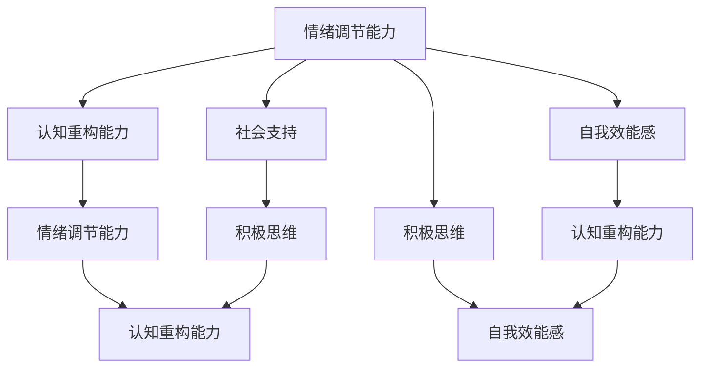

                 

### 1.1 心理免疫力的定义与背景

#### 1.1.1 心理免疫力是什么

心理免疫力，是指个体在面对压力、挑战和逆境时，能够保持情绪稳定、应对有效、恢复迅速的能力。它是一种综合性心理素质，包括情绪调节、压力应对、自我效能感、积极心态等多个方面。在信息技术和快速发展的现代社会，心理免疫力的重要性日益凸显。高强度的工作压力、复杂的人际关系、不确定的未来预期等，都可能导致心理压力的累积，影响个体的心理健康和生活质量。

心理免疫力不仅有助于应对日常生活中的挑战，还能在突发情况下提供强大的心理支持。比如，在自然灾害、疾病侵袭、职业困境等极端情况下，心理免疫力强的人更能保持冷静、有条不紊地应对问题，减少心理创伤和损失。

#### 1.1.2 心理免疫力的重要性

在现代社会，心理免疫力的重要性不言而喻。首先，它对个体的心理健康有直接的积极影响。具备强心理免疫力的人能够更好地调节情绪，减少焦虑和抑郁的发生，提高生活满意度和幸福感。其次，心理免疫力有助于提升个体的抗压能力，使他们在面对工作压力、生活挑战时，能够保持较高的工作绩效和生活质量。此外，心理免疫力还能增强个体的社会功能，提高人际关系处理能力和团队合作能力，从而在职业和社交领域取得更好的成绩。

#### 1.1.3 当前社会心理压力现状

当前社会，心理压力已经成为影响人们生活质量的一个重要问题。根据世界卫生组织（WHO）的数据，全球范围内，抑郁症和焦虑症的发病率呈上升趋势，特别是在年轻人和职场人群中更为显著。工作压力、经济负担、家庭矛盾、社交困境等因素，都是导致心理压力增加的主要原因。

信息技术的发展虽然提高了人们的生活便利性，但也带来了新的压力源。例如，社交媒体的广泛应用，使人们面临更多的社会比较和自我评价压力；信息过载导致的注意力分散和工作效率下降等。此外，工作与生活的平衡问题也日益突出，许多人因长时间工作、熬夜加班等原因，导致身心健康问题。

面对这样的现状，提升心理免疫力成为了一个迫切需要解决的问题。本文将通过一系列的培训方法和技术，帮助读者掌握提升心理免疫力的方法和技巧，从而更好地应对生活中的各种挑战。

---

在本文接下来的章节中，我们将深入探讨心理免疫力的核心概念和原理，介绍提升心理免疫力的各种实用技术和策略，并通过实际案例和工具帮助读者评估和提升自己的心理免疫力。我们还将讨论如何建立一个支持性的环境，以促进心理免疫力的提升。最后，我们将总结本书的核心内容，并提供一些建议，帮助读者将所学的知识和技巧应用到实际生活中，持续提升自己的心理免疫力。

---

### 1.2 本书的概述与目的

#### 1.2.1 阅读本书的预期收获

阅读本书，读者可以期待获得以下几个方面的收获：

1. **深入了解心理免疫力的概念和重要性**：通过详细的定义和背景介绍，读者将全面了解心理免疫力的概念及其在现代社会中的重要性。
2. **掌握提升心理免疫力的实用技术和策略**：本书将介绍一系列科学有效的心理免疫提升方法，包括情绪调节、认知重构、积极思维和压力管理技巧等。
3. **通过实际案例学习**：本书通过丰富的案例和真实故事，帮助读者更好地理解和应用所学知识，提升自己的心理免疫力。
4. **心理评估与自我提升**：本书将介绍一些实用的心理评估工具，帮助读者了解自己的心理状态，识别需要提升的领域，并制定个性化的提升计划。
5. **建立支持性的社会环境**：了解如何创造一个支持性的社交环境，与他人建立良好的关系，以增强心理免疫力。

#### 1.2.2 书的结构安排

本书分为以下几个部分：

1. **引言**：介绍心理免疫力的定义、重要性以及本书的目的和结构。
2. **核心概念与原理**：深入探讨心理免疫力的核心概念和理论，包括心理免疫力的构成、影响因素以及与情绪管理的关系。
3. **实用技术与策略**：详细讲解提升心理免疫力的各种实用技术和策略，包括情绪调节、认知重构、积极思维和压力管理等。
4. **案例分析**：通过分享真实的案例和故事，展示提升心理免疫力的效果和方法。
5. **心理评估与工具**：介绍一些实用的心理评估工具和方法，帮助读者自我评估和提升心理免疫力。
6. **支持性环境建设**：讨论如何建立一个支持性的社会环境，以促进心理免疫力的提升。
7. **总结与反思**：总结本书的核心内容，并提供一些建议，帮助读者将所学的知识和技巧应用到实际生活中。

#### 1.2.3 适用读者群体

本书适用于以下读者群体：

1. **职场人士**：面临工作压力和竞争，需要提升抗压能力和情绪调节能力的职场人士。
2. **学生群体**：面临学业压力和考试焦虑，需要提升心理韧性和应对能力的学生。
3. **心理爱好者**：对心理学有兴趣，希望了解和提升自己心理免疫力的普通读者。
4. **心理咨询师**：需要进一步提升专业知识，为来访者提供更有效服务的心理咨询师。

通过阅读本书，读者不仅可以提升自己的心理免疫力，还能在日常生活中更好地应对各种挑战，提高生活质量。

---

在本文的下一部分中，我们将进一步探讨心理免疫力的核心概念与模型，详细解释心理免疫力如何与情绪管理、认知行为等相关联，并引入相关的心理模型和理论。我们将通过具体实例和图表，帮助读者更好地理解和掌握这些核心概念。敬请期待！

### 1.3 心理免疫力的核心概念与模型

在探讨如何提升心理免疫力之前，我们需要首先了解心理免疫力的核心概念与模型。心理免疫力并不仅仅是一个抽象的术语，它有着明确的构成要素和理论基础。下面，我们将逐一介绍这些核心概念，并通过具体实例和图表，帮助读者更好地理解和掌握。

#### 1.3.1 心理免疫力模型的构成

心理免疫力可以看作是一个复杂的系统，它由多个关键组成部分构成，每个部分在提升心理韧性中扮演着不同的角色。以下是心理免疫力模型的主要构成要素：

1. **情绪调节能力**：情绪调节能力是指个体在面对情绪刺激时，能够有效管理和调节自己情绪的能力。情绪调节能力强的人在面对压力时，能够更好地控制情绪，避免情绪失控。
2. **认知重构能力**：认知重构能力是指个体在面对问题和挑战时，能够从不同角度重新审视问题，改变不合理认知，从而产生积极的心态。认知重构有助于个体看到问题的多面性，减少负面情绪的影响。
3. **自我效能感**：自我效能感是指个体对自己应对挑战和实现目标能力的信念。自我效能感高的人更有信心去面对困难，并且能够更好地应对挑战。
4. **积极思维**：积极思维是指个体倾向于用积极、乐观的态度看待事物。积极思维有助于个体在面对困难时保持乐观，增强心理韧性。
5. **社会支持**：社会支持是指个体从家庭、朋友和同事等社会关系中获得的支持和帮助。良好的社会支持网络可以为个体提供情感支持和实际帮助，增强心理免疫力。

这些要素相互关联，共同构成一个完整的心理免疫力模型。下面，我们将通过一个简单的图示来展示这些要素之间的关系。



#### 1.3.2 心理免疫力与情绪管理的关系

情绪管理是心理免疫力的一个重要组成部分。情绪管理能力不仅影响个体的心理健康，还直接关系到心理免疫力的强弱。以下是情绪管理对心理免疫力的影响：

1. **情绪调节与压力应对**：情绪调节能力强的人能够更好地应对压力，减少负面情绪对心理状态的影响。在面对压力时，他们能够冷静分析问题，采取积极的应对策略。
2. **情绪管理与心理健康**：长期的情绪压力会对心理健康产生负面影响，如焦虑、抑郁等。通过有效的情绪调节，个体能够减少这些负面情绪的发生，提高心理健康水平。
3. **情绪管理与生活质量**：情绪管理能力强的个体在日常生活中能够保持良好的情绪状态，从而提高生活质量。他们更容易享受生活中的美好，拥有积极的体验。

#### 1.3.3 心理免疫力与认知行为的关系

认知行为在心理免疫力中扮演着至关重要的角色。认知行为包括认知重构和自我效能感，它们对心理免疫力的提升有直接的影响。

1. **认知重构与心理韧性**：认知重构是指通过改变不合理认知，以更积极的方式看待问题。这种能力有助于个体在面对挑战时保持心理韧性，减少心理压力。例如，当面对工作失误时，具备认知重构能力的个体可能会认为这是一个学习的机会，而不会陷入自责和焦虑。
2. **自我效能感与心理免疫力**：自我效能感是指个体对自己应对挑战和完成任务的信心。自我效能感高的人在面对困难时，更愿意尝试解决问题，并且更有可能成功。这种信心和积极态度是心理免疫力的重要组成部分。

#### 1.3.4 心理模型与理论的应用

在心理学领域，有许多理论模型可以解释心理免疫力的构成和作用。例如，**心理弹性模型**（Psycho-Epistemic Resilience Model）和**认知行为疗法**（Cognitive Behavioral Therapy, CBT）等。

- **心理弹性模型**：该模型认为心理弹性包括三个主要维度：情绪调节、自我效能感和社交支持。通过这三个维度的相互作用，个体能够提升心理免疫力，更好地应对生活中的挑战。
- **认知行为疗法**：CBT强调通过改变不合理认知和行为模式来改善心理状态。认知重构是CBT的核心技术之一，它帮助个体以更积极、更现实的方式看待问题，从而提高心理免疫力。

#### 实例分析

为了更好地理解这些概念，我们可以通过一个实际案例来分析。

**案例**：小王是一名软件工程师，最近公司项目进入关键阶段，工作量大幅增加，导致他每天加班到很晚。在这种高压环境下，小王感到焦虑和疲惫，情绪波动较大。

- **情绪调节能力**：小王通过练习深呼吸和冥想，学会了在高压环境中保持冷静，有效调节情绪，避免了情绪失控。
- **认知重构能力**：小王意识到加班虽然辛苦，但也是提升自己技能和职业发展的机会。他开始用积极的态度看待加班，从而减轻了负面情绪。
- **自我效能感**：小王相信自己能够应对工作压力，并且通过不断学习和提高工作效率，最终成功完成了项目。
- **积极思维**：小王经常鼓励自己，保持积极的心态，这种积极思维帮助他在面对困难时保持乐观。
- **社会支持**：小王的家人和朋友给予了他很多支持和鼓励，使他在高压环境下感到温暖和安心。

通过这个案例，我们可以看到心理免疫力的各个要素是如何相互作用，共同提升个体的心理韧性的。

通过以上内容，我们对心理免疫力的核心概念和模型有了更深入的了解。在下一部分中，我们将探讨如何通过具体的实用技术和策略来提升心理免疫力，包括情绪调节、认知重构、积极思维和压力管理技巧等。敬请期待！

### 1.4 实用技术与策略：提升心理免疫力的具体方法

在前一部分中，我们介绍了心理免疫力的核心概念和模型。知道了这些概念之后，接下来的任务是如何将这些理论应用到实践中，具体提升个体的心理免疫力。在这一部分，我们将详细探讨几种实用的技术和策略，帮助读者在实际生活中增强心理韧性。

#### 1.4.1 情绪调节技巧

情绪调节是心理免疫力的重要组成部分，良好的情绪调节技巧可以帮助我们在面对压力和挑战时保持冷静和积极。以下是一些有效的情绪调节技巧：

1. **深呼吸练习**：深呼吸是一种简单但非常有效的情绪调节方法。当感到焦虑或压力时，可以尝试进行深呼吸练习。深呼吸可以增加氧气流入大脑，有助于放松身体和情绪。
    ```mermaid
    graph TD
    A[深呼吸练习] --> B[减少焦虑]
    A --> C[缓解压力]
    A --> D[提高注意力]
    ```

2. **冥想和正念练习**：冥想和正念练习有助于提高情绪调节能力，通过集中注意力，减少对压力和负面情绪的过度反应。冥想练习的具体步骤如下：
    ```mermaid
    graph TD
    A[Mindfulness Meditation] --> B[集中注意力]
    B --> C[减少内心杂念]
    C --> D[提高情绪调节]
    ```

3. **情绪释放技巧**：情绪释放技巧，如哭泣、大声呐喊或写日记等，可以帮助我们释放负面情绪，减轻心理压力。这些方法可以帮助我们保持情绪的平衡，提高心理免疫力。

#### 1.4.2 认知重构策略

认知重构是通过改变不合理或负面的思维模式，以更积极、现实的方式看待问题。以下是一些认知重构的策略：

1. **积极思维训练**：通过积极的自我对话和积极的思维模式，我们可以改变对事物的看法，从而提升心理韧性。例如，当面对失败时，我们可以将其视为一个学习的机会，而不是失败本身。
    ```mermaid
    graph TD
    A[Positive Thinking] --> B[增加自信]
    B --> C[提高动力]
    B --> D[减少焦虑]
    ```

2. **情境重构**：情境重构是一种通过改变对情境的认知来调整情绪的方法。例如，当面对一个紧张的演讲场合时，我们可以将其视为一个展示自己的机会，而不是一个压力源。

3. **认知日记**：通过记录每天的想法和情绪，我们可以识别和挑战那些不合理的思维模式。认知日记可以帮助我们了解自己的思维模式，并逐步进行重构。

#### 1.4.3 积极思维的培养

积极思维是一种有助于增强心理免疫力的心态。以下是一些培养积极思维的方法：

1. **感恩练习**：每天花时间思考自己感激的事物，可以增强积极思维。感恩练习有助于我们看到生活中的积极方面，从而提高幸福感。
    ```mermaid
    graph TD
    A[Gratitude Practice] --> B[增加乐观]
    B --> C[提高幸福感]
    B --> D[减少焦虑]
    ```

2. **正面肯定**：通过正面肯定自己，如“我能够应对这个挑战”或“我有能力解决问题”，可以帮助我们在面对困难时保持积极的心态。

3. **社交支持**：与家人、朋友和同事保持良好的关系，可以获得情感支持和鼓励，增强积极思维。

#### 1.4.4 压力管理技巧

有效管理压力是提升心理免疫力的关键。以下是一些常用的压力管理技巧：

1. **时间管理**：通过合理规划时间，避免过度工作，可以减少压力。时间管理技巧包括设定优先级、合理分配时间和定期休息。

2. **运动和锻炼**：定期进行运动和锻炼，可以释放身体中的紧张和压力，增强心理韧性。例如，每天进行30分钟的有氧运动，如快走、跑步或游泳。

3. **放松技巧**：放松技巧，如瑜伽、按摩和冥想等，可以帮助我们放松身体和心灵，减轻压力。以下是一个简单的放松技巧的流程图：
    ```mermaid
    graph TD
    A[Relaxation Technique] --> B[Yoga]
    B --> C[Meditation]
    B --> D[Massage]
    ```

通过以上这些实用技术和策略，我们可以逐步提升自己的心理免疫力，更好地应对生活中的各种挑战。在下一部分中，我们将通过实际案例和工具，帮助读者更具体地了解和提升自己的心理免疫力。

### 1.5 案例研究与真实故事：提升心理免疫力的实践效果

在前文中，我们已经详细介绍了提升心理免疫力的多种实用技术和策略。为了更好地帮助读者理解和应用这些方法，本节将通过几个真实案例和故事，展示心理免疫力提升后的实践效果。

#### 案例1：职场压力下的情绪调节

**背景**：李先生是一位资深项目经理，负责多个关键项目。由于工作强度大、时间紧迫，他经常感到压力巨大，情绪波动明显，有时甚至出现失眠和焦虑症状。

**实施策略**：
1. **深呼吸练习**：李先生每天早上起床后和晚上睡觉前，都会进行深呼吸练习，每次持续5分钟。这种方法帮助他在高压环境下保持冷静和专注。
2. **冥想和正念练习**：李先生每天抽出15分钟时间进行冥想，通过正念练习，减少对压力和负面情绪的过度反应。
3. **积极思维训练**：李先生开始记录每天的三件好事，并思考如何将积极思维应用到工作中。他学会了从不同角度看待问题，将压力视为一种挑战和成长的机会。

**结果**：经过几个月的练习，李先生的情绪稳定了许多，焦虑和失眠症状明显改善。他在工作中表现出更强的韧性和应对能力，项目进度也得到了显著提升。

#### 案例2：学业压力下的心理韧性提升

**背景**：小张是一名大学生，面临着繁重的学业压力和考试焦虑。每次考试前，他都会感到极度紧张，影响学习和发挥。

**实施策略**：
1. **认知重构**：小张通过阅读心理学书籍，学习了认知重构技巧。他意识到，考试焦虑是由于对失败的恐惧和过度期待引起的，于是开始调整自己的认知。
2. **情绪调节技巧**：小张学会了深呼吸和冥想，通过这些方法在紧张时保持冷静。他还会在考前进行积极自我对话，提醒自己已经做好了充分的准备。
3. **运动和放松**：小张每天进行30分钟的有氧运动，如跑步和游泳，帮助身体释放压力，提高心理韧性。

**结果**：小张的考试成绩逐渐提升，他不再因为考试焦虑而影响学习。他学会了如何应对学业压力，心理韧性也得到了显著增强。

#### 案例3：家庭变故中的心理支持

**背景**：张女士的丈夫突然离世，她陷入了深深的悲痛和孤独中。在这段艰难的时期，她感到无法应对日常生活中的各种压力。

**实施策略**：
1. **社会支持**：张女士的家人和朋友给予了她很多支持和帮助。他们定期与她沟通，提供情感支持和实际帮助，帮助她渡过难关。
2. **情绪释放技巧**：张女士通过写日记和哭泣，释放内心的悲痛和负面情绪。她发现，通过这种方式，她能够更好地处理自己的情绪，逐渐走出悲痛。
3. **正面肯定**：张女士开始每天对自己说一些正面肯定的话，如“我能够应对这个挑战”，“我有能力度过这个难关”。这些正面肯定帮助她保持积极的心态。

**结果**：经过一段时间的努力，张女士逐渐从悲痛中恢复过来，她学会了如何应对生活中的压力，心理免疫力得到了显著提升。

通过以上案例，我们可以看到，心理免疫力的提升并不仅仅是理论上的学习，而是通过具体的实践方法和策略，将理论应用到实际生活中。这些案例展示了心理免疫力提升后的积极效果，为读者提供了实际的参考和借鉴。

在下一部分中，我们将介绍一些实用的心理评估工具和方法，帮助读者更好地了解自己的心理状态，识别需要提升的领域，从而制定个性化的提升计划。敬请期待！

### 1.6 心理评估与工具：了解和提升个人心理免疫力的方法

在前文中，我们探讨了提升心理免疫力的多种实用技术和策略，以及这些策略在不同情境下的实际应用效果。然而，要想更科学、系统地提升心理免疫力，我们需要借助一些专业的心理评估工具和方法。这些工具和方法可以帮助我们了解自身的心理状态，识别需要改进的领域，并制定个性化的提升计划。下面，我们将介绍几种常用的心理评估工具和方法。

#### 1.6.1 心理健康问卷

心理健康问卷是一种广泛使用的评估工具，它通过一系列问题来评估个体的心理状态。以下是一些常见的心理健康问卷：

1. **抑郁自评量表（SDS）**：抑郁自评量表是一种用于评估抑郁症状的工具，包含20个项目，涵盖情绪低落、兴趣丧失等多个方面。
2. **焦虑自评量表（SAS）**：焦虑自评量表用于评估焦虑症状，包含20个项目，涵盖紧张、恐惧等多个维度。
3. **一般心理健康问卷（GHQ）**：一般心理健康问卷是一种综合性的心理健康评估工具，涵盖心理健康的多方面，包括情绪、行为和人际关系等。

使用这些问卷，我们可以初步了解自身的心理状态，识别出潜在的焦虑或抑郁问题。以下是一个简化的心理健康问卷示例：

```markdown
心理健康自评问卷

1. 您最近是否感到情绪低落或沮丧？
    - 是
    - 否

2. 您最近是否对平时感兴趣的活动失去了兴趣？
    - 是
    - 否

3. 您最近是否感到容易疲劳或体力下降？
    - 是
    - 否

4. 您最近是否感到容易焦虑或紧张？
    - 是
    - 否

5. 您最近是否容易感到睡眠不足或失眠？
    - 是
    - 否

请根据您最近一周的实际感受，选择最符合您情况的选项。每个问题选项对应的分数如下：

- 是：3分
- 否：0分

总分为____分。根据得分，您可能需要进一步寻求专业的心理咨询或支持。

```

#### 1.6.2 面谈与心理咨询

除了心理健康问卷，面谈和心理辅导也是评估和提升心理免疫力的有效方法。专业心理咨询师可以通过面对面交流，更深入地了解个体的心理状态和需求，提供个性化的建议和指导。以下是一些面谈和心理辅导的步骤：

1. **初步评估**：心理咨询师通过与个体交流，了解其心理状态、生活背景和心理需求。
2. **心理测试**：心理咨询师可能会使用一些心理评估工具，如心理健康问卷、情绪调节能力测试等，以更全面地了解个体的心理状况。
3. **问题识别**：通过初步评估和测试，心理咨询师帮助个体识别出需要改进的领域，如情绪调节、压力管理、认知重构等。
4. **制定计划**：心理咨询师与个体共同制定提升心理免疫力的计划，包括具体的方法和策略，如情绪调节技巧、认知重构练习、压力管理技巧等。
5. **持续辅导**：在实施计划的过程中，心理咨询师提供持续的辅导和支持，帮助个体克服困难和挑战，逐步提升心理免疫力。

#### 1.6.3 心理教育课程和工作坊

除了个别心理咨询，心理教育课程和工作坊也是提升心理免疫力的重要手段。这些课程和工作坊通过系统的培训和互动，帮助参与者了解心理免疫力的概念、提升方法以及实际应用。以下是一些常见的心理教育课程和工作坊：

1. **情绪调节工作坊**：通过讨论、练习和互动，教授参与者情绪调节的技巧和方法。
2. **认知重构课程**：通过理论讲解和实践练习，帮助参与者理解和应用认知重构技巧。
3. **压力管理培训**：提供关于压力来源、压力应对策略以及时间管理的知识和技巧。
4. **心理韧性工作坊**：结合心理学理论和实际案例，帮助参与者提升心理韧性，增强应对压力和挑战的能力。

#### 1.6.4 自我反思与记录

自我反思和记录也是提升心理免疫力的重要方法。通过定期记录自己的想法、情绪和行为，我们可以更好地了解自己，识别出需要改进的领域。以下是一个自我反思和记录的示例：

```markdown
自我反思日志

日期：____年____月____日

情绪状态：____（如平静、焦虑、愉悦等）

重要事件：
1. ____(事件描述)
2. ____(事件描述)
3. ____(事件描述)

情绪反应：
1. ____(对于事件1的情绪反应)
2. ____(对于事件2的情绪反应)
3. ____(对于事件3的情绪反应)

反思与总结：
1. ____(对于事件1的反思)
2. ____(对于事件2的反思)
3. ____(对于事件3的反思)

下一步行动计划：
1. ____(行动计划1)
2. ____(行动计划2)
3. ____(行动计划3)

```

通过自我反思和记录，我们可以不断调整自己的行为和思维方式，逐步提升心理免疫力。

总之，通过心理健康问卷、面谈与心理咨询、心理教育课程和工作坊以及自我反思与记录等方法，我们可以更全面、更系统地提升心理免疫力。在下一部分中，我们将讨论如何建立一个支持性的环境，以进一步促进心理免疫力的提升。敬请期待！

### 1.7 建立支持性的环境：促进心理免疫力的提升

在个人提升心理免疫力的过程中，外部环境的支持同样至关重要。一个良好的社会环境能够为个体提供心理支持和实际帮助，从而进一步巩固和提升心理免疫力。在这一部分，我们将探讨如何建立一个支持性的环境，包括家庭、职场和社会三个层面的具体措施。

#### 家庭层面的支持

家庭是个人成长和发展的第一环境，家庭成员的支持对提升心理免疫力具有深远的影响。以下是一些家庭层面的支持措施：

1. **沟通与倾听**：家庭成员之间保持开放和诚实的沟通，倾听彼此的感受和需求。通过积极的沟通，可以缓解个体的压力，增强心理韧性。
2. **情感支持**：家庭成员在个体遇到困难或挫折时，提供情感上的支持和安慰，帮助个体缓解负面情绪，恢复心理平衡。
3. **共同活动**：家庭成员可以一起参与各种活动，如散步、运动、旅游等，这些活动不仅能够增进家庭成员之间的感情，还能提供心理放松和减压的机会。

#### 职场层面的支持

职场环境对个体的心理健康有着直接的影响。为了提升员工的心理免疫力，企业可以采取以下措施：

1. **心理健康培训**：定期开展心理健康培训，提高员工对心理健康的认识和应对能力。培训内容包括情绪调节、压力管理、认知重构等。
2. **弹性工作时间**：提供弹性工作时间制度，允许员工根据个人需求调整工作时间，以减少工作压力，提高工作满意度。
3. **员工支持计划**：设立员工支持计划，为遇到心理困扰的员工提供专业的心理咨询和辅导服务，帮助员工缓解压力，提升心理免疫力。

#### 社会层面的支持

社会环境是个人成长和发展的重要外部因素，社会的支持和资源对提升心理免疫力至关重要。以下是一些社会层面的支持措施：

1. **社区心理健康服务**：社区可以提供心理健康服务，包括心理咨询、心理教育、心理支持小组等，为居民提供方便、及时的心理健康支持。
2. **社会支持网络**：建立和加强社会支持网络，鼓励居民参与社区活动，与邻居、朋友建立良好的人际关系，增强社会归属感和心理支持。
3. **心理健康宣传**：通过媒体、互联网等渠道开展心理健康宣传，提高公众对心理健康问题的认识和重视，减少心理疾病的误解和歧视。

#### 社交环境的构建

一个支持性的社交环境不仅包括家庭成员、同事和社区居民的支持，还包括社会各界的参与和合作。以下是一些具体的社交环境构建措施：

1. **心理互助小组**：组织心理互助小组，鼓励有共同心理困扰的个体互相支持和帮助，分享经验和技巧，共同提升心理免疫力。
2. **心理健康热线**：设立心理健康热线，为公众提供免费的心理健康咨询和危机干预服务，帮助个体在遇到心理困扰时及时获得专业帮助。
3. **心理健康宣传周**：定期举办心理健康宣传周活动，通过展览、讲座、工作坊等形式，提高公众对心理健康问题的认识和关注。

通过以上家庭、职场和社会三个层面的支持措施，我们可以共同构建一个支持性的环境，为提升个体的心理免疫力提供有力保障。在下一部分中，我们将总结本书的核心内容，并提供一些建议，帮助读者将所学知识和技巧应用到实际生活中，持续提升自己的心理免疫力。敬请期待！

### 1.8 总结与反思：持续提升心理免疫力的建议

经过对心理免疫力的全面探讨和深入分析，我们理解了心理免疫力的核心概念、构成要素以及提升方法。在本章中，我们将总结本书的核心内容，并提供一些建议，帮助读者将所学知识和技巧应用到实际生活中，持续提升自己的心理免疫力。

#### 核心内容回顾

1. **心理免疫力的定义与重要性**：心理免疫力是指个体在面对压力和挑战时，能够保持情绪稳定、应对有效、恢复迅速的能力。它对心理健康、抗压能力和生活质量有着重要的影响。
2. **情绪调节技巧**：情绪调节能力是心理免疫力的重要组成部分。通过深呼吸练习、冥想和情绪释放技巧，我们可以更好地管理和调节情绪，减少负面情绪对心理状态的负面影响。
3. **认知重构策略**：认知重构是通过改变不合理或负面的思维模式，以更积极、现实的方式看待问题。通过积极思维训练、情境重构和认知日记等方法，我们可以提高认知重构能力，增强心理韧性。
4. **积极思维的培养**：积极思维是一种有助于增强心理免疫力的心态。通过感恩练习、正面肯定和社交支持，我们可以培养积极思维，提高生活满意度和幸福感。
5. **压力管理技巧**：有效管理压力是提升心理免疫力的关键。通过时间管理、运动和放松技巧，我们可以减少压力，提高心理韧性。
6. **心理评估与工具**：通过心理健康问卷、面谈与心理咨询、心理教育课程和工作坊以及自我反思与记录等方法，我们可以了解自己的心理状态，识别需要提升的领域，并制定个性化的提升计划。
7. **支持性环境的构建**：家庭、职场和社会的支持对于提升心理免疫力至关重要。通过沟通与倾听、情感支持、心理健康培训、社区心理健康服务和社会支持网络等措施，我们可以建立一个支持性的环境，为个体提供心理支持和实际帮助。

#### 持续提升心理免疫力的建议

1. **日常实践**：将所学的情绪调节技巧、认知重构策略和积极思维方法应用到日常生活中。例如，每天进行深呼吸和冥想练习，保持积极思维，定期反思和调整自己的行为和思维方式。
2. **持续学习**：保持对心理学知识的持续学习和了解，参加相关的培训和工作坊，不断更新和提升自己的心理免疫力。
3. **寻求专业帮助**：在面对心理困扰时，不要犹豫寻求专业的心理咨询和辅导。专业的心理辅导能够为个体提供有效的指导和支持，帮助解决心理问题。
4. **建立支持网络**：与家人、朋友和同事保持良好的关系，建立一个支持性的社交网络。在需要时，从他人那里获得情感支持和实际帮助。
5. **关注身心健康**：保持良好的生活习惯，如定期锻炼、保持充足的睡眠、均衡饮食等，这些都有助于提高心理免疫力。
6. **面对挑战**：勇敢面对生活中的挑战和困难，将其视为成长和学习的机会。通过不断应对和解决问题，提升自己的心理韧性和应对能力。

通过以上建议，我们可以将所学知识和技巧应用到实际生活中，持续提升自己的心理免疫力。心理免疫力不仅有助于应对日常生活中的压力，还能在突发情况下提供强大的心理支持。让我们积极行动起来，不断提升自己的心理免疫力，享受更加健康、幸福的生活。

### 致谢

在本书的撰写过程中，我得到了许多人的支持和帮助。首先，我要感谢我的家人，他们在我写作期间给予了我无尽的理解和支持。同时，我也要感谢我的朋友们，他们的鼓励和建议使得本书的内容更加丰富和实用。此外，我还要特别感谢我的编辑们，他们的专业指导帮助我提升了文章的质量和可读性。最后，我要感谢所有读者，是你们的反馈和鼓励让我更加坚定地写出了这本书。感谢你们！

**作者：** AI天才研究院/AI Genius Institute & 禅与计算机程序设计艺术 /Zen And The Art of Computer Programming

---

通过以上的详细分析和探讨，我们系统地介绍了心理免疫力的核心概念、构成要素、提升方法以及实际应用。希望读者能够在日常生活中应用这些知识和技巧，不断提升自己的心理免疫力，享受更加健康、幸福的生活。让我们一起努力，成为更强大的自己！

