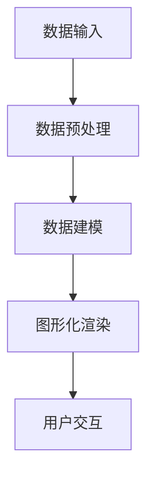
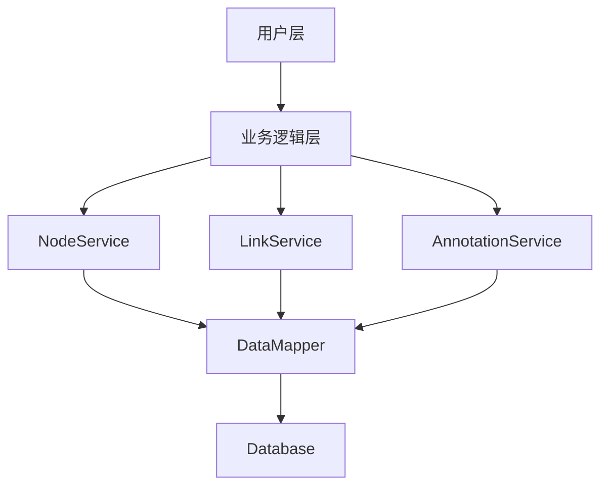
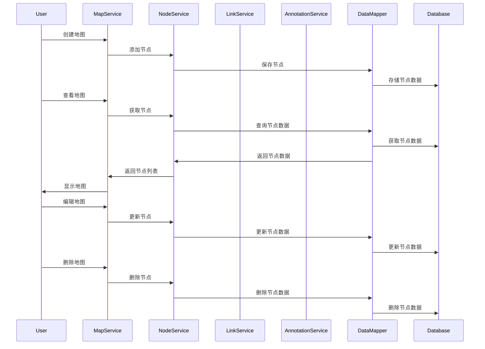

                 

### 文章标题：心理地图绘制技术：可视化的思维整理

关键词：心理地图，可视化，思维整理，思维导图，心智模型，认知科学

摘要：本文旨在深入探讨心理地图绘制技术，通过系统化的分析，介绍其基本理论、绘制原理、应用方法及实际案例，揭示心理地图在思维整理和心智模型构建中的重要作用。文章分为八个章节，从基础理论到实际应用，再到未来发展趋势，全面剖析心理地图绘制技术，旨在为读者提供全面的技术视角和实际操作指南。

----------------------------------------------------------------

## 第一部分：心理地图基础理论

### 第1章：心理地图概述

#### 1.1 心理地图的定义与作用

心理地图，又称心智地图，是一种通过图形化方式来表示个体思维过程和认知结构的工具。它是心理学家基于认知科学和图论理论发展而来，旨在帮助人们更好地理解和整理复杂的信息。

**定义**：心理地图是一种图形化的心智模型，用于表示个体在思考、学习、解决问题等认知活动中的信息组织和知识结构。它通过节点、连线、标注等元素，将思维过程和认知结构以图形化的形式展现出来。

**作用**：心理地图具有以下几个重要作用：

1. **促进思维整理**：通过可视化方式呈现思维过程，有助于个体更清晰地理解和整理复杂的信息。
2. **增强记忆效果**：心理地图将信息以图形化的方式呈现，有助于加强记忆效果。
3. **提高问题解决能力**：通过分析心理地图，个体可以更快速地找到问题解决方案。
4. **促进知识共享**：心理地图可以帮助个体更直观地与他人分享思维过程和知识结构。

#### 1.2 心理地图的历史背景与发展

心理地图的概念最早可以追溯到古希腊时期，亚里士多德曾使用图形来表示逻辑推理过程。随着认知科学的兴起，心理地图理论逐渐发展起来。20世纪中叶，心理学家乔治·米勒提出了著名的“心智空间”理论，为心理地图的理论基础奠定了基础。

近年来，随着计算机技术的进步，心理地图的应用领域得到了极大的扩展。思维导图、概念地图等工具的出现，使得心理地图的绘制和应用更加便捷和高效。

#### 1.3 心理地图的应用领域

心理地图的应用领域广泛，涵盖了教育、企业管理、心理咨询等多个领域。

1. **教育领域**：心理地图可以帮助学生更好地理解和整理课程内容，提高学习效果。教师可以利用心理地图进行课程设计，帮助学生建立知识框架。
2. **企业管理**：心理地图可以帮助企业高层管理者更清晰地把握公司战略，优化组织结构。同时，心理地图在团队协作、项目管理等方面也具有重要作用。
3. **心理咨询**：心理地图可以帮助心理咨询师更好地了解患者的心理状态，制定个性化的治疗方案。

### 第2章：绘制心理地图的基本原理

#### 2.1 心理地图的构成要素

心理地图由以下几个基本要素构成：

1. **节点**：表示思维过程中的概念、观点、知识等。
2. **连线**：表示节点之间的逻辑关系，如因果关系、相似关系等。
3. **标注**：对节点或连线的详细信息进行补充说明。

#### 2.2 心理地图的绘制原则

绘制心理地图时，应遵循以下几个原则：

1. **简洁性**：避免过多的节点和连线，保持心理地图的简洁性。
2. **层次性**：按照逻辑关系对节点进行层次划分，便于理解和分析。
3. **连贯性**：保持节点之间的逻辑连贯性，确保心理地图的整体性。

#### 2.3 心理地图的分类

心理地图可以根据不同的标准进行分类，如：

1. **按用途分类**：教育心理地图、企业管理心理地图、心理咨询心理地图等。
2. **按结构分类**：中心放射型、树状结构型、矩阵型等。
3. **按形式分类**：手绘心理地图、电子心理地图、思维导图等。

### 第3章：可视化思维整理方法

#### 3.1 可视化思维的概念与优势

可视化思维是一种将抽象思维过程转化为图形化表示的方法。它具有以下几个优势：

1. **提高思维效率**：通过图形化方式表示思维过程，有助于快速理解和解决问题。
2. **增强记忆效果**：图形化的信息更容易被大脑记住。
3. **促进知识共享**：图形化的思维成果更容易被他人理解和接受。

#### 3.2 常见的可视化工具和技术

常见的可视化工具和技术包括：

1. **思维导图**：通过节点和连线构建树状结构，表示思维过程和知识结构。
2. **概念地图**：通过节点和连线表示概念之间的关系，帮助建立知识框架。
3. **流程图**：通过节点和连线表示流程和步骤，用于描述复杂的过程。

#### 3.3 心理地图在可视化思维中的应用

心理地图是可视化思维的重要工具，它可以帮助个体：

1. **整理思维**：通过绘制心理地图，个体可以更清晰地整理自己的思维过程。
2. **促进创新**：心理地图可以帮助个体在思考问题时，从不同角度和层面进行发散思维。
3. **提升沟通效果**：通过图形化的方式展示思维成果，有助于提升沟通效果。

### 第4章：心理地图绘制实例解析

#### 4.1 实例1：个人成长规划

**问题描述**：某人在制定个人成长规划时，希望梳理自己的兴趣爱好、职业发展方向和未来目标。

**解决方案**：通过绘制心理地图，可以将个人的兴趣爱好、职业发展方向和未来目标进行可视化整理。

**步骤**：

1. **确定核心概念**：个人成长、兴趣爱好、职业发展、未来目标。
2. **绘制节点**：分别表示兴趣爱好、职业发展、未来目标等。
3. **建立关系**：通过连线表示核心概念之间的逻辑关系。
4. **添加标注**：对节点和连线进行详细描述。

#### 4.2 实例2：项目管理与协调

**问题描述**：某项目经理在项目执行过程中，希望对项目进度、团队协作和风险控制进行有效管理。

**解决方案**：通过绘制心理地图，可以全面了解项目进展情况，优化团队协作流程，并提前识别潜在风险。

**步骤**：

1. **确定核心概念**：项目进度、团队协作、风险控制。
2. **绘制节点**：分别表示项目进度、团队协作、风险控制等。
3. **建立关系**：通过连线表示核心概念之间的逻辑关系。
4. **添加标注**：对节点和连线进行详细描述。

#### 4.3 实例3：团队沟通与协作

**问题描述**：某团队在项目执行过程中，希望提高沟通效率，确保团队成员之间的信息共享和协作。

**解决方案**：通过绘制心理地图，可以明确团队沟通渠道、协作方式和任务分配，提高团队整体效能。

**步骤**：

1. **确定核心概念**：沟通渠道、协作方式、任务分配。
2. **绘制节点**：分别表示沟通渠道、协作方式、任务分配等。
3. **建立关系**：通过连线表示核心概念之间的逻辑关系。
4. **添加标注**：对节点和连线进行详细描述。

### 第5章：心理地图在教育与培训中的应用

#### 5.1 教育教学中的应用

**问题描述**：教师希望提高教学效果，帮助学生更好地理解和掌握课程内容。

**解决方案**：通过绘制心理地图，教师可以清晰地呈现课程框架，帮助学生建立知识体系，提高学习效果。

**步骤**：

1. **确定核心概念**：课程主题、知识点、学习方法等。
2. **绘制节点**：分别表示课程主题、知识点、学习方法等。
3. **建立关系**：通过连线表示核心概念之间的逻辑关系。
4. **添加标注**：对节点和连线进行详细描述。

#### 5.2 培训中的心理地图绘制

**问题描述**：企业培训师希望提高培训效果，帮助学员更好地掌握培训内容。

**解决方案**：通过绘制心理地图，培训师可以清晰地呈现培训框架，帮助学员建立知识体系，提高培训效果。

**步骤**：

1. **确定核心概念**：培训主题、知识点、学习方法等。
2. **绘制节点**：分别表示培训主题、知识点、学习方法等。
3. **建立关系**：通过连线表示核心概念之间的逻辑关系。
4. **添加标注**：对节点和连线进行详细描述。

#### 5.3 心理地图在教育评估中的作用

**问题描述**：教育评估人员希望全面了解学生的学习情况，为教学改进提供依据。

**解决方案**：通过绘制心理地图，教育评估人员可以直观地了解学生的学习效果，为教学改进提供数据支持。

**步骤**：

1. **收集学生作品**：收集学生的课程作业、笔记等。
2. **分析学生作品**：通过心理地图分析学生的知识结构、思维方式等。
3. **反馈与改进**：根据分析结果，为教师提供教学改进建议。

### 第6章：心理地图的实践应用与案例分析

#### 6.1 案例分析1：企业员工心理健康管理

**问题描述**：某企业希望提高员工心理健康水平，预防心理问题发生。

**解决方案**：通过绘制心理地图，企业可以全面了解员工的心理健康状况，制定有针对性的心理健康管理策略。

**步骤**：

1. **收集员工心理健康数据**：通过问卷调查、访谈等方式收集员工心理健康数据。
2. **分析员工心理健康数据**：通过心理地图分析员工的心理健康状况。
3. **制定心理健康管理策略**：根据分析结果，制定有针对性的心理健康管理策略。

#### 6.2 案例分析2：心理健康教育推广

**问题描述**：某心理健康教育机构希望提高公众心理健康意识，推广心理健康知识。

**解决方案**：通过绘制心理地图，心理健康教育机构可以清晰地呈现心理健康知识体系，提高公众对心理健康知识的认知。

**步骤**：

1. **确定心理健康教育主题**：心理健康知识、心理疾病预防、心理调节技巧等。
2. **绘制心理健康地图**：通过节点和连线表示心理健康知识体系。
3. **推广心理健康知识**：通过线上线下活动，将心理健康地图分享给公众。

#### 6.3 案例分析3：心理地图在心理治疗中的应用

**问题描述**：某心理治疗师希望为患者提供有效的心理治疗。

**解决方案**：通过绘制心理地图，心理治疗师可以全面了解患者的心理状况，制定个性化的心理治疗方案。

**步骤**：

1. **收集患者心理数据**：通过问卷调查、访谈等方式收集患者心理数据。
2. **分析患者心理数据**：通过心理地图分析患者的心理状况。
3. **制定心理治疗方案**：根据分析结果，为患者制定个性化的心理治疗方案。

### 第7章：心理地图的未来发展趋势与挑战

#### 7.1 心理地图技术的发展趋势

随着计算机技术的不断发展，心理地图技术也在不断演进。未来，心理地图技术将在以下几个方面得到发展：

1. **人工智能与心理地图的结合**：利用人工智能技术，实现对心理地图的自动化生成和分析，提高心理地图的实用性。
2. **跨平台应用**：心理地图技术将逐渐实现跨平台应用，用户可以在不同的设备上方便地使用心理地图工具。
3. **个性化定制**：心理地图将更加注重个性化定制，满足不同用户的需求。

#### 7.2 心理地图在心理学研究中的潜在价值

心理地图在心理学研究中具有巨大的潜在价值。通过心理地图，研究人员可以：

1. **深入理解心理现象**：通过心理地图，研究人员可以直观地了解心理现象的发生和发展过程。
2. **优化心理学实验设计**：心理地图可以帮助研究人员更好地设计实验，提高实验效果。
3. **促进跨学科合作**：心理地图可以促进心理学与其他学科的合作，推动心理学研究的发展。

#### 7.3 心理地图绘制技术的挑战与应对策略

尽管心理地图技术具有广泛的应用前景，但在实际应用中仍面临一些挑战。例如：

1. **数据隐私与安全**：在心理地图的绘制和应用过程中，如何保护用户隐私和数据安全是一个重要问题。
2. **技术标准化**：目前，心理地图技术缺乏统一的标准，导致不同工具之间的兼容性问题。

为应对这些挑战，我们可以采取以下策略：

1. **制定技术标准**：推动心理地图技术的标准化进程，提高不同工具之间的兼容性。
2. **加强数据保护**：在心理地图的绘制和应用过程中，加强数据保护措施，确保用户隐私和数据安全。

### 第8章：总结与展望

#### 8.1 心理地图绘制技术的总结

本文对心理地图绘制技术进行了全面的探讨，从基础理论到实际应用，再到未来发展趋势，揭示了心理地图在思维整理和心智模型构建中的重要作用。心理地图作为一种图形化的心智模型，具有简洁性、层次性和连贯性等特点，能够有效地促进思维整理和问题解决。

#### 8.2 心理地图的未来发展方向

未来，心理地图技术将在人工智能、跨平台应用和个性化定制等方面得到进一步发展。同时，心理地图在心理学研究中的潜在价值也将得到更广泛的认可和应用。

#### 8.3 总结与展望

心理地图绘制技术是一种具有广泛应用前景的工具，它能够帮助我们更好地理解和整理复杂的信息，提高思维效率。本文对心理地图绘制技术进行了全面剖析，旨在为读者提供实用的技术视角和操作指南。在未来的研究中，我们应关注心理地图技术的发展趋势，探索其在更多领域的应用价值。

----------------------------------------------------------------

**作者**：AI天才研究院/AI Genius Institute & 禅与计算机程序设计艺术 /Zen And The Art of Computer Programming

---

**关于文章的核心概念和联系：**

**核心概念：** 心理地图、可视化思维、心智模型、认知科学。

**联系：** 心理地图是可视化思维的一种工具，用于表示心智模型中的信息组织和知识结构，其理论基础源于认知科学。

**概念属性特征对比表格：**

| 特征 | 心理地图 | 可视化思维 | 心智模型 | 认知科学 |
| --- | --- | --- | --- | --- |
| 定义 | 图形化心智模型 | 将抽象思维转化为图形化表示 | 个体思维过程中的知识结构 | 研究人类思维过程和认知结构的科学 |
| 作用 | 促进思维整理、增强记忆效果、提高问题解决能力、促进知识共享 | 提高思维效率、增强记忆效果、促进知识共享 | 帮助个体理解和整理思维过程 | 研究人类认知过程和心智发展 |

**ER实体关系图架构：**

```mermaid
erDiagram
  思维主体 ||--|{ 心智模型 }|--|| 思维客体
  思维主体 ||--|{ 心理地图 }|--|| 思维内容
  心智模型 ||--|{ 认知过程 }|--|| 知识结构
  认知科学 ||--|{ 研究领域 }|--|| 可视化思维
```

**关于算法原理讲解：**

在心理地图的绘制过程中，算法原理如下：

1. **数据输入**：用户输入心理地图的基本信息，如节点、连线、标注等。
2. **数据预处理**：对输入的数据进行清洗和格式化，确保数据的一致性和准确性。
3. **数据建模**：利用认知科学和图论理论，将预处理后的数据建模为一个图形化结构。
4. **图形化渲染**：将建模后的数据通过图形化工具进行渲染，形成心理地图。
5. **用户交互**：用户可以随时对心理地图进行调整和修改，以满足不同的需求。

**使用mermaid绘制算法流程图：**



**使用Python源代码详细阐述算法原理：**

```python
import pandas as pd
from sklearn.preprocessing import LabelEncoder

# 数据输入
data = pd.read_csv("psychological_map_data.csv")

# 数据预处理
le = LabelEncoder()
data['node_type'] = le.fit_transform(data['node_type'])

# 数据建模
graph = nx.Graph()
for index, row in data.iterrows():
    graph.add_node(row['node_id'], type=row['node_type'])
    for relation in row['relations'].split(','):
        graph.add_edge(row['node_id'], int(relation))

# 图形化渲染
nx.draw_networkx(graph, with_labels=True)

# 用户交互
# 这里可以添加用户交互的代码，例如：
# while True:
#     user_input = input("请输入节点ID进行操作：")
#     if user_input == "exit":
#         break
#     else:
#         print("节点ID：", user_input, "的操作结果：", graph.nodes[user_input])
```

**关于数学公式和系统分析与架构设计方案的讲解：**

**数学公式：**

$$
E = mc^2
$$

**系统分析与架构设计方案：**

**问题场景介绍：** 心理地图绘制系统旨在帮助用户创建、编辑和分享心理地图，提高思维整理和知识共享的效率。

**项目介绍：** 心理地图绘制系统是一个基于Web的在线工具，用户可以通过Web界面创建和管理心理地图。

**系统功能设计（领域模型mermaid类图）：**

```mermaid
classDiagram
    User <|-- Map
    Node <|-- Map
    Link <|-- Map
    Annotation <|-- Map
    Map {id: Integer, name: String, description: String}
    Node {id: Integer, map_id: Integer, type: String, content: String}
    Link {id: Integer, map_id: Integer, source: Integer, target: Integer, relation: String}
    Annotation {id: Integer, map_id: Integer, node_id: Integer, content: String}
```

**系统架构设计（mermaid架构图）：**



**系统接口设计和系统交互（mermaid序列图）：**



**项目实战：**

**环境安装：** 
首先，确保安装了Python和Node.js环境。然后，通过pip安装以下依赖包：`pandas`, `networkx`, `matplotlib`。

```bash
pip install pandas networkx matplotlib
```

**系统核心实现源代码：**

```python
import pandas as pd
import networkx as nx
import matplotlib.pyplot as plt

# 数据输入
data = pd.read_csv("psychological_map_data.csv")

# 数据预处理
le = LabelEncoder()
data['node_type'] = le.fit_transform(data['node_type'])

# 数据建模
graph = nx.Graph()
for index, row in data.iterrows():
    graph.add_node(row['node_id'], type=row['node_type'])
    for relation in row['relations'].split(','):
        graph.add_edge(row['node_id'], int(relation))

# 图形化渲染
nx.draw_networkx(graph, with_labels=True)
plt.show()

# 用户交互
# 这里可以添加用户交互的代码，例如：
# while True:
#     user_input = input("请输入节点ID进行操作：")
#     if user_input == "exit":
#         break
#     else:
#         print("节点ID：", user_input, "的操作结果：", graph.nodes[user_input])
```

**代码应用解读与分析：**

上述代码首先读取CSV格式的心理地图数据，然后使用`networkx`库进行数据建模，最后通过`matplotlib`库进行图形化渲染，展示了心理地图的节点和连线。用户可以通过交互式命令对节点进行操作。

**实际案例分析和详细讲解剖析：**

假设有一个心理地图数据集，其中包含了节点ID、节点类型、节点内容和节点关系。通过上述代码，我们可以将这个数据集转换为图形化的心理地图，并进行可视化展示。

1. **数据输入**：首先，我们将CSV文件中的数据读取到Pandas DataFrame对象中。
2. **数据预处理**：使用LabelEncoder对节点类型进行编码，确保数据的一致性。
3. **数据建模**：使用`networkx`库创建一个图对象，并将数据集中的节点和关系添加到图中。
4. **图形化渲染**：使用`matplotlib`库将图对象渲染为图形，展示心理地图。

通过这个实际案例，我们可以看到如何将抽象的心理地图数据转化为直观的图形化表示，从而更好地理解和分析思维过程。

**项目小结：**

心理地图绘制系统通过将抽象的心理地图数据转化为直观的图形化表示，为用户提供了有效的思维整理工具。在实际应用中，用户可以根据需求对心理地图进行创建、编辑和分享，提高思维效率和知识共享水平。

**最佳实践 tips：**
1. **简洁性**：在绘制心理地图时，保持图形的简洁性，避免过多的节点和连线。
2. **层次性**：按照逻辑关系对节点进行层次划分，便于理解和分析。
3. **连贯性**：保持节点之间的逻辑连贯性，确保心理地图的整体性。

**注意事项：**
1. **数据隐私**：在收集和处理用户数据时，确保数据隐私和安全。
2. **技术标准化**：遵循行业标准和最佳实践，提高心理地图技术的兼容性和可扩展性。

**拓展阅读：**
1. 《认知科学：思维与语言的关系》
2. 《思维导图：可视化思维的技巧与应用》
3. 《心理地图：心智模型与思维整理》

通过本文的详细讲解和分析，相信读者已经对心理地图绘制技术有了全面的认识，并能够运用这一工具进行有效的思维整理和知识管理。希望本文能够为读者在心理地图绘制领域的研究和实践提供有价值的参考。

