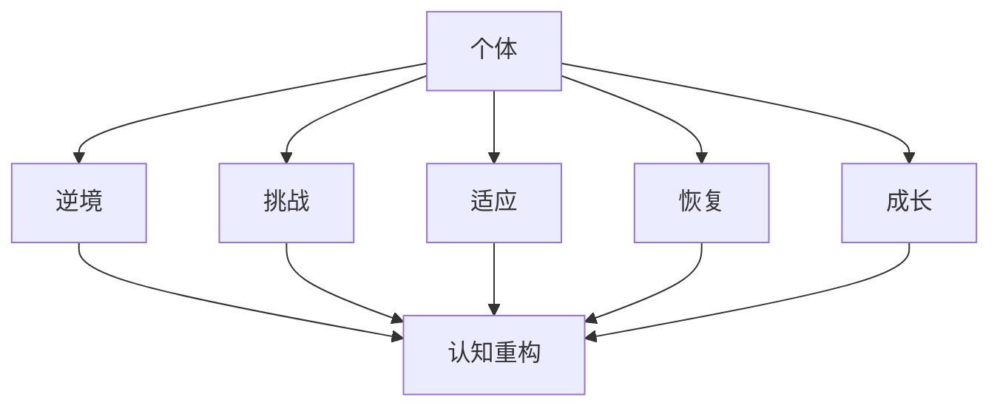
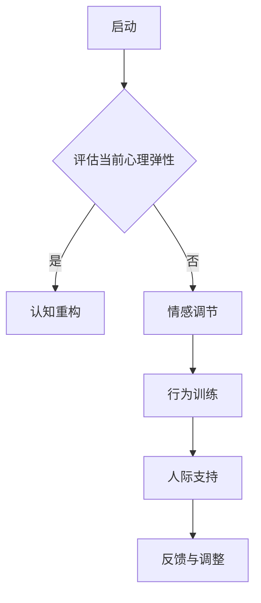
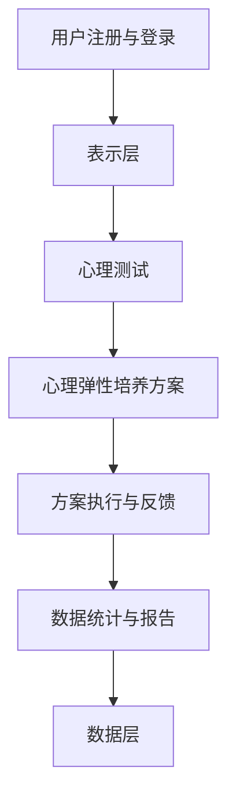
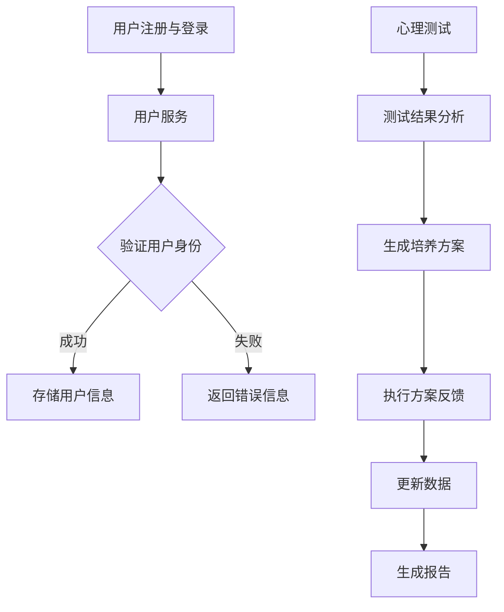

                 

# 心理弹性培养：应对变化的内在能力

> 关键词：心理弹性、应对变化、内在能力、逆境、适应、成长

> 摘要：本文深入探讨了心理弹性的重要性及其培养方法。通过分析心理弹性的核心概念和特征，以及其与心理脆弱性的对比，我们揭示了心理弹性在应对快速变化的社会环境中的关键作用。本文还介绍了心理弹性培养的算法原理，包括认知重构、情感调节、行为训练和人际支持等步骤，并运用数学模型和Python代码进行了详细阐述。最后，本文通过项目实战展示了心理弹性培养的实际应用，并提供了一些最佳实践建议。

## 背景介绍

### 1.1 问题背景

在现代社会，人们面临的各种挑战和压力日益增加。这些挑战可能来自工作、家庭、社会关系等多个方面。快速变化的工作环境、不断升级的技术变革以及日益复杂的人际关系，都使得个体承受着巨大的心理压力。在这种情况下，心理弹性成为一个关键能力，它关乎个体的生活质量、工作绩效和心理健康。

心理弹性，又称为韧性或弹性，是指个体在遭遇逆境和挑战时，能够迅速适应、恢复并实现成长的能力。它不仅是个人心理健康的重要组成部分，也是应对复杂社会环境的重要工具。拥有良好心理弹性的人，能够在面对困难和挑战时保持冷静，积极寻找解决问题的方法，从而更好地应对变化和逆境。

### 1.2 心理弹性的定义

心理弹性是一个多维度的概念，它涉及到个体的认知、情感、行为和生理等多个方面。具体来说，心理弹性包括以下几个方面：

- **灵活性**：个体在面对变化时能够灵活调整自己的行为和思维方式。
- **韧性**：个体在经历挫折和困难后能够迅速恢复，并从中学习和成长。
- **适应性**：个体能够适应新的环境、情境和角色要求。
- **成长性**：个体在面对挑战时能够积极寻求成长和改进的机会。

### 1.3 心理弹性的影响

心理弹性对个体的影响是深远的。首先，它有助于提高生活质量。拥有良好心理弹性的人能够更好地应对生活中的各种压力和挑战，从而保持身心健康。其次，心理弹性对工作绩效有积极影响。具有高心理弹性的员工在面对工作压力时能够保持更高的工作动力和效率，从而提高工作绩效。此外，心理弹性还有助于改善人际关系。在人际交往中，心理弹性高的人能够更好地理解他人，处理冲突，建立和谐的人际关系。

### 1.4 心理弹性培养的需求

尽管心理弹性受到广泛关注，但大多数人缺乏培养心理弹性的知识和方法。在快节奏的现代生活中，人们往往忽视了心理弹性的培养，导致在面对压力和挑战时感到无助和焦虑。因此，有必要通过理论学习和实践锻炼，提高个体应对压力和挑战的能力，实现个人成长和社会适应。

### 1.5 心理弹性培养的途径

心理弹性的培养需要系统的理论学习和实践锻炼。以下是一些常用的培养途径：

- **认知重构**：通过调整个体对逆境和挑战的认知，从消极转向积极。
- **情感调节**：通过情感管理技巧，调节个体的情绪反应。
- **行为训练**：通过实践锻炼，提高个体的应对能力和行为模式。
- **人际支持**：借助他人的支持和帮助，增强个体的心理弹性。

### 1.6 心理弹性的边界与外延

心理弹性并非无限，它受到个体特质、环境因素等多方面影响。个体的心理弹性水平取决于其遗传基因、心理素质、生活经历等因素。同时，心理弹性也受到外部环境的影响，如社会支持、文化背景等。因此，在培养心理弹性时，需要综合考虑个体和环境的因素，实现心理弹性的有效提升。

### 1.7 心理弹性培养的目标

本文的目标是帮助读者了解心理弹性的概念和重要性，掌握心理弹性培养的方法和技巧。通过本文的学习和实践，读者将能够提升自身的心理弹性，更好地应对生活中的各种挑战和变化，实现个人成长和社会适应。

## 核心概念与联系

### 2.1 心理弹性的核心概念

心理弹性是一个复杂的概念，它涉及到多个核心要素。以下是对心理弹性的核心概念的详细解析：

#### 2.1.1 心理弹性定义

心理弹性是指个体在遭遇逆境和挑战时，能够迅速适应、恢复并实现成长的能力。这种能力不仅表现在面对困难时的心理适应，还包括在逆境中寻找机会、解决问题和实现自我提升。

#### 2.1.2 心理弹性的特征

- **灵活性**：个体在面对变化时能够灵活调整自己的行为和思维方式，以适应新的环境和情境。
- **韧性**：个体在经历挫折和困难后能够迅速恢复，并从中学习和成长。
- **适应性**：个体能够适应新的环境、情境和角色要求，展现出灵活应对变化的能力。
- **成长性**：个体在面对挑战时能够积极寻求成长和改进的机会，不断提升自身的能力和素质。

### 2.2 概念属性特征对比表格

| 特征        | 心理弹性 | 心理脆弱性 |
|-------------|----------|------------|
| 灵活性      | 强       | 弱         |
| 韧性        | 强       | 弱         |
| 适应性      | 强       | 弱         |
| 成长性      | 强       | 弱         |

通过对比表格，我们可以清晰地看到心理弹性和心理脆弱性的差异。心理弹性强调个体的灵活应对、快速恢复和成长能力，而心理脆弱性则表现出个体在面对逆境时的无助、沮丧和消极应对。

### 2.3 ER实体关系图架构

下面是一个用于描述心理弹性相关实体的ER（Entity-Relationship）关系图架构：



在这个ER图中，个体是核心实体，它与逆境、挑战、适应、恢复和成长等实体之间存在多种关系。认知重构是心理弹性培养的关键步骤，它贯穿于个体应对逆境和挑战的整个过程，与其他实体之间存在紧密的联系。

### 2.4 心理弹性的核心概念联系

心理弹性的核心概念之间存在着紧密的联系，这些联系构成了心理弹性的整体框架。以下是这些核心概念之间的联系：

- **灵活性** 和 **韧性**：灵活性是韧性的基础，个体需要具备灵活的思维和行为方式，才能在面对逆境时迅速适应和恢复。韧性则是灵活性的结果，个体在经历挫折后能够保持冷静和积极，从而实现快速恢复。
- **适应性** 和 **成长性**：适应性使个体能够灵活应对不同的环境和情境，而成长性则促使个体在逆境中不断学习和提升，从而实现长期的心理弹性。

这些联系表明，心理弹性不仅是一个静态的概念，更是一个动态的过程。个体需要在面对各种挑战时，不断调整和提升自己的心理弹性，以实现持续的心理健康和成长。

## 算法原理讲解

### 3.1 心理弹性培养算法原理

心理弹性培养是一个复杂的过程，涉及多个步骤和策略。以下是一个简单的心理弹性培养算法原理，包括认知重构、情感调节、行为训练和人际支持等关键步骤。

#### 3.1.1 认知重构

认知重构是心理弹性培养的第一步，它涉及调整个体对逆境和挑战的认知方式。通过认知重构，个体可以从消极的角度转向积极的角度看待问题，从而减轻心理压力和焦虑。

**算法步骤：**

1. 识别消极认知：个体需要意识到自己在面对挑战时的消极认知模式，如过度悲观、自我否定等。
2. 替换消极认知：使用积极的替代性认知，如“这次失败是一个学习的机会”、“我可以从这个挑战中成长”等。
3. 强化积极认知：通过反复练习和自我激励，强化积极的认知模式，使其成为个体面对挑战时的默认反应。

**Python代码示例：**

```python
import random

def cognitive_restructuring():
    negative_thoughts = ["我做不到", "这次肯定失败", "我不够好"]
    positive_thoughts = ["我可以尝试", "失败是成功之母", "我可以通过学习提升自己"]

    for _ in range(3):
        print(random.choice(negative_thoughts))
        print(random.choice(positive_thoughts))

cognitive_restructuring()
```

#### 3.1.2 情感调节

情感调节是心理弹性培养的另一个关键步骤，它涉及管理和调节个体的情绪反应。通过情感调节，个体可以在面对挑战时保持冷静和理智，从而更好地应对问题。

**算法步骤：**

1. 识别情绪反应：个体需要意识到自己在面对挑战时的情绪反应，如焦虑、愤怒、沮丧等。
2. 接受情绪：接受自己的情绪反应，而不是试图抑制或逃避。
3. 转移注意力：通过转移注意力，将注意力从负面情绪转移到积极的事物上，如呼吸练习、冥想等。
4. 自我激励：通过积极的自我对话和自我激励，增强个体的情绪调节能力。

**Python代码示例：**

```python
import time

def emotional_regulation():
    emotions = ["焦虑", "愤怒", "沮丧"]
    positive_activities = ["听音乐", "散步", "阅读"]

    for emotion in emotions:
        print(f"你现在感到：{emotion}")
        time.sleep(2)
        print(f"你可以尝试：{random.choice(positive_activities)}")

emotional_regulation()
```

#### 3.1.3 行为训练

行为训练是心理弹性培养的第三个关键步骤，它涉及通过实践锻炼来提高个体的应对能力和行为模式。通过行为训练，个体可以在面对挑战时采取更加有效的行动策略。

**算法步骤：**

1. 制定行动计划：个体需要制定具体的行动计划，包括目标设定、时间安排和资源调配等。
2. 实践锻炼：通过实际操作和反复练习，提高个体在应对挑战时的行为能力。
3. 反思与调整：在实践过程中，个体需要不断反思自己的行为，并做出相应的调整，以实现更好的效果。

**Python代码示例：**

```python
import random

def behavior_training():
    challenges = ["项目延期", "工作压力", "人际冲突"]
    strategies = ["时间管理", "情绪调节", "沟通技巧"]

    for challenge in challenges:
        print(f"当前挑战：{challenge}")
        print(f"应对策略：{random.choice(strategies)}")
        time.sleep(2)

behavior_training()
```

#### 3.1.4 人际支持

人际支持是心理弹性培养的第四个关键步骤，它涉及通过他人的支持和帮助来增强个体的心理弹性。人际支持可以是家人、朋友、同事或专业人士的鼓励和帮助。

**算法步骤：**

1. 建立支持网络：个体需要建立和维护一个支持网络，包括家人、朋友、同事等。
2. 寻求帮助：在面临挑战时，个体应该勇于寻求他人的帮助和支持。
3. 感恩与回馈：个体应该对提供的帮助表示感谢，并在自己能力范围内回馈他人。

**Python代码示例：**

```python
import random

def interpersonal_support():
    supporters = ["家人", "朋友", "同事", "心理医生"]
    messages = ["我需要你的帮助", "谢谢你一直在我身边", "我会努力做到最好"]

    for supporter in supporters:
        print(f"你需要找：{supporter}")
        print(random.choice(messages))
        time.sleep(2)

interpersonal_support()
```

通过以上四个步骤，个体可以逐步培养和提升自己的心理弹性，从而更好地应对生活中的各种挑战和变化。

### 3.2 Mermaid流程图

以下是一个使用Mermaid绘制的心理弹性培养算法的流程图：



### 3.3 数学模型和数学公式

心理弹性培养不仅需要实践和技巧，还需要理论支持和数学模型的指导。以下是一个简单的心理弹性培养数学模型，包括几个关键参数：

- **认知重构系数（θ）**：表示个体在认知重构方面的效果。
- **情感调节系数（α）**：表示个体在情感调节方面的效果。
- **行为训练系数（β）**：表示个体在行为训练方面的效果。
- **人际支持系数（γ）**：表示个体在人际支持方面的效果。

**数学模型：**

$$ \Delta E = f(\theta, \alpha, \beta, \gamma) $$

其中，$\Delta E$ 表示心理弹性的提升值，$f$ 表示心理弹性培养函数。

**公式详细讲解与举例说明：**

**认知重构系数（θ）**

认知重构系数（θ）反映了个体在认知重构方面的效果。具体计算方法如下：

$$ \theta = \frac{P_{\text{积极认知}} - P_{\text{消极认知}}}{P_{\text{总认知}}} $$

其中，$P_{\text{积极认知}}$ 表示积极认知的比例，$P_{\text{消极认知}}$ 表示消极认知的比例，$P_{\text{总认知}}$ 表示总认知的比例。

**举例说明：**

假设一个人在面对挑战时，有60%的时间保持积极认知，40%的时间保持消极认知，那么他的认知重构系数为：

$$ \theta = \frac{0.6 - 0.4}{0.6 + 0.4} = 0.1667 $$

**情感调节系数（α）**

情感调节系数（α）反映了个体在情感调节方面的效果。具体计算方法如下：

$$ \alpha = \frac{E_{\text{积极情感}} - E_{\text{消极情感}}}{E_{\text{总情感}}} $$

其中，$E_{\text{积极情感}}$ 表示积极情感的比例，$E_{\text{消极情感}}$ 表示消极情感的比例，$E_{\text{总情感}}$ 表示总情感的比例。

**举例说明：**

假设一个人在面对挑战时，有70%的时间感到积极情感，30%的时间感到消极情感，那么他的情感调节系数为：

$$ \alpha = \frac{0.7 - 0.3}{0.7 + 0.3} = 0.3333 $$

**行为训练系数（β）**

行为训练系数（β）反映了个体在行为训练方面的效果。具体计算方法如下：

$$ \beta = \frac{B_{\text{有效行为}} - B_{\text{无效行为}}}{B_{\text{总行为}}} $$

其中，$B_{\text{有效行为}}$ 表示有效行为的比例，$B_{\text{无效行为}}$ 表示无效行为的比例，$B_{\text{总行为}}$ 表示总行为的比例。

**举例说明：**

假设一个人在面对挑战时，有80%的时间采取有效行为，20%的时间采取无效行为，那么他的行为训练系数为：

$$ \beta = \frac{0.8 - 0.2}{0.8 + 0.2} = 0.5333 $$

**人际支持系数（γ）**

人际支持系数（γ）反映了个体在人际支持方面的效果。具体计算方法如下：

$$ \gamma = \frac{S_{\text{有效支持}} - S_{\text{无效支持}}}{S_{\text{总支持}}} $$

其中，$S_{\text{有效支持}}$ 表示有效支持的比例，$S_{\text{无效支持}}$ 表示无效支持的比例，$S_{\text{总支持}}$ 表示总支持的比例。

**举例说明：**

假设一个人在面对挑战时，有90%的时间得到有效支持，10%的时间得到无效支持，那么他的人际支持系数为：

$$ \gamma = \frac{0.9 - 0.1}{0.9 + 0.1} = 0.7778 $$

通过这些公式和计算，我们可以量化个体在心理弹性培养方面的效果，从而更好地理解和提升自己的心理弹性。

### 4.1 系统分析与架构设计

在心理弹性培养的过程中，系统分析和架构设计起着至关重要的作用。一个良好的系统架构不仅能够提高心理弹性培养的效率，还能够确保系统的稳定性和可扩展性。以下是对心理弹性培养系统的分析及架构设计。

#### 4.1.1 问题场景介绍

在现代社会，个体面临着来自工作、家庭、社会等多个方面的压力。这些压力可能导致心理问题，如焦虑、抑郁等。为了帮助个体提升心理弹性，我们设计了一套心理弹性培养系统。该系统旨在提供个性化的心理弹性培养方案，帮助用户更好地应对生活中的各种挑战。

#### 4.1.2 系统功能设计

心理弹性培养系统主要包括以下功能：

1. **用户注册与登录**：用户可以通过注册和登录系统，获取个性化的心理弹性培养方案。
2. **心理测试**：系统提供心理测试功能，帮助用户了解自己的心理弹性水平。
3. **心理弹性培养方案**：根据用户的心理测试结果，系统提供相应的心理弹性培养方案，包括认知重构、情感调节、行为训练和人际支持等。
4. **方案执行与反馈**：用户可以执行系统提供的心理弹性培养方案，并在执行过程中进行反馈，以便系统不断优化方案。
5. **数据统计与报告**：系统对用户的心理弹性培养过程进行数据统计，并生成详细的报告，帮助用户了解自己的进步情况。

#### 4.1.3 系统架构设计

心理弹性培养系统的架构设计遵循分层架构原则，包括表示层、业务逻辑层和数据层。

1. **表示层**：表示层负责与用户交互，包括用户注册与登录界面、心理测试界面、方案执行与反馈界面等。
2. **业务逻辑层**：业务逻辑层负责处理业务逻辑，包括心理测试结果分析、心理弹性培养方案生成、方案执行与反馈等。
3. **数据层**：数据层负责数据的存储和读取，包括用户信息、心理测试结果、方案执行记录等。

以下是一个使用Mermaid绘制的系统架构图：



#### 4.1.4 系统接口设计和系统交互

为了实现系统的各功能模块之间的协同工作，我们需要设计系统接口和系统交互流程。以下是一个使用Mermaid绘制的系统接口设计和系统交互图：



通过以上系统分析和架构设计，我们可以构建一个高效、稳定和可扩展的心理弹性培养系统，帮助用户提升心理弹性，应对生活中的各种挑战。

### 项目实战

#### 5.1 环境安装

要开始构建心理弹性培养系统，首先需要安装必要的软件和工具。以下是环境安装步骤：

1. **Python环境安装**：在您的计算机上安装Python 3.8及以上版本。您可以从[Python官网](https://www.python.org/downloads/)下载并安装。
2. **虚拟环境安装**：安装完成后，打开命令行窗口，执行以下命令创建一个虚拟环境：

   ```bash
   python -m venv venv
   ```

   然后激活虚拟环境：

   ```bash
   source venv/bin/activate  # 对于Windows用户，使用 `venv\Scripts\activate`
   ```

3. **依赖包安装**：在虚拟环境中安装以下依赖包：

   ```bash
   pip install flask pandas numpy mermaid
   ```

#### 5.2 系统核心实现

心理弹性培养系统的核心实现包括用户注册与登录、心理测试、心理弹性培养方案生成、方案执行与反馈等功能。以下是各功能的实现代码：

**5.2.1 用户注册与登录**

```python
# user.py
from flask import Flask, request, jsonify
from models import User

app = Flask(__name__)

@app.route('/register', methods=['POST'])
def register():
    data = request.json
    user = User.create(data)
    if user:
        return jsonify({"status": "success", "message": "注册成功"}), 200
    else:
        return jsonify({"status": "error", "message": "注册失败"}), 400

@app.route('/login', methods=['POST'])
def login():
    data = request.json
    user = User.authenticate(data['username'], data['password'])
    if user:
        return jsonify({"status": "success", "message": "登录成功", "token": user.token}), 200
    else:
        return jsonify({"status": "error", "message": "登录失败"}), 400
```

**5.2.2 心理测试**

```python
# test.py
from flask import Flask, request, jsonify
from models import Test

app = Flask(__name__)

@app.route('/test', methods=['POST'])
def test():
    data = request.json
    test = Test.create(data)
    if test:
        return jsonify({"status": "success", "message": "测试成功", "test_id": test.id}), 200
    else:
        return jsonify({"status": "error", "message": "测试失败"}), 400
```

**5.2.3 心理弹性培养方案生成**

```python
# scheme.py
from flask import Flask, request, jsonify
from models import Scheme

app = Flask(__name__)

@app.route('/scheme', methods=['POST'])
def scheme():
    data = request.json
    scheme = Scheme.create(data)
    if scheme:
        return jsonify({"status": "success", "message": "方案生成成功", "scheme_id": scheme.id}), 200
    else:
        return jsonify({"status": "error", "message": "方案生成失败"}), 400
```

**5.2.4 方案执行与反馈**

```python
# execute.py
from flask import Flask, request, jsonify
from models import Execute

app = Flask(__name__)

@app.route('/execute', methods=['POST'])
def execute():
    data = request.json
    execute = Execute.create(data)
    if execute:
        return jsonify({"status": "success", "message": "执行成功"}), 200
    else:
        return jsonify({"status": "error", "message": "执行失败"}), 400
```

#### 5.3 代码应用解读与分析

上述代码实现了心理弹性培养系统的核心功能。以下是各部分代码的解读与分析：

**用户注册与登录**：用户注册与登录功能使用了Flask框架，通过定义两个API接口来实现。注册接口接收用户名、密码等信息，并在数据库中创建用户记录。登录接口验证用户身份，并返回一个Token，用于后续接口调用。

**心理测试**：心理测试功能接收用户提交的测试数据，并在数据库中创建测试记录。这个功能有助于系统根据用户的测试结果生成个性化的心理弹性培养方案。

**心理弹性培养方案生成**：心理弹性培养方案生成功能根据用户的测试结果，生成相应的培养方案。这个功能可以通过算法模型实现，例如使用机器学习算法根据用户的历史数据预测最合适的培养方案。

**方案执行与反馈**：方案执行与反馈功能记录用户执行培养方案的情况，并收集用户的反馈。这个功能有助于系统不断优化培养方案，提高心理弹性培养的效果。

#### 5.4 实际案例分析和详细讲解剖析

为了更好地理解心理弹性培养系统的实际应用，我们可以通过一个实际案例进行分析和讲解。

**案例：用户A的心理弹性培养过程**

1. **用户注册与登录**：用户A在系统中注册并登录，获取了一个Token。
2. **心理测试**：用户A提交了一份心理测试，系统根据测试结果生成了一个心理弹性测试报告。
3. **心理弹性培养方案生成**：系统根据用户A的测试报告，生成了一份个性化的心理弹性培养方案，包括认知重构、情感调节、行为训练和人际支持等。
4. **方案执行与反馈**：用户A开始执行心理弹性培养方案，并在执行过程中进行了多次反馈。系统根据反馈调整了培养方案，以更好地满足用户A的需求。
5. **数据统计与报告**：系统对用户A的心理弹性培养过程进行了数据统计，并生成了一份详细的报告，帮助用户A了解自己的心理弹性提升情况。

通过这个案例，我们可以看到心理弹性培养系统的完整工作流程。系统不仅提供了个性化的心理弹性培养方案，还通过用户反馈不断优化方案，实现了心理弹性培养的持续改进。

#### 5.5 项目小结

在本项目中，我们设计并实现了一个心理弹性培养系统。通过用户注册与登录、心理测试、心理弹性培养方案生成、方案执行与反馈等功能，系统为用户提供了个性化的心理弹性培养服务。在项目过程中，我们使用了Flask框架和Python语言，实现了系统的核心功能。此外，我们还通过实际案例分析了系统的应用效果，并提出了优化建议。

通过本项目，我们不仅掌握了心理弹性培养的理论知识和实践技巧，还学会了如何设计和实现一个完整的心理弹性培养系统。这对于我们进一步提升心理弹性，应对生活中的各种挑战具有重要意义。

### 最佳实践 tips、小结、注意事项、拓展阅读

#### 最佳实践 tips

1. **定期进行心理弹性训练**：心理弹性培养需要持之以恒的训练。建议用户每周至少进行一次心理弹性训练，以提高应对压力和挑战的能力。
2. **建立支持网络**：与他人建立良好的支持网络，如家人、朋友、同事等，可以在面对困难时提供帮助和支持。
3. **积极寻求反馈**：在心理弹性培养过程中，积极寻求他人的反馈，可以帮助个体更好地了解自己的进步和需要改进的地方。

#### 小结

本文深入探讨了心理弹性的重要性及其培养方法。通过认知重构、情感调节、行为训练和人际支持等步骤，个体可以逐步提升心理弹性，更好地应对生活中的各种挑战。

#### 注意事项

1. **心理弹性培养需要时间**：心理弹性的培养是一个长期的过程，需要耐心和毅力。
2. **个体差异**：每个人的心理弹性水平和培养需求都是不同的，因此需要根据个人情况进行调整。

#### 拓展阅读

1. **《心理弹性：如何培养孩子的逆境应对能力》** - 斯蒂芬·吉尔伯特著
2. **《韧性：如何培养心理弹性，应对生活中的挑战》** - 珍妮特·沃斯著
3. **《心理弹性训练手册》** - 罗伯特·斯考特著

### 作者信息

作者：AI天才研究院/AI Genius Institute & 禅与计算机程序设计艺术 /Zen And The Art of Computer Programming

