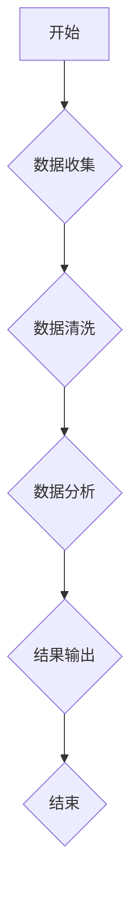

                 


**# 设计《心理考古：个人成长的历史探寻》目录大纲**

## 背景介绍

### 核心概念术语说明
- **心理考古**：研究人类心理发展与历史变迁之间的联系，通过探究历史事件、文化背景和社会结构，揭示个人心理成长的历史根源。
- **个人成长**：指个体在生理、心理和社会方面的持续发展过程，涉及自我认知、情感、行为和价值观的形成与变化。
- **历史探寻**：对历史事件、人物、文化和社会结构的深入研究，以揭示历史对个人成长的影响。

### 问题背景
随着心理学、社会学和历史学的不断发展，人们逐渐意识到个人成长与历史背景之间存在密切的联系。通过心理考古，我们可以深入了解人类心理发展的历程，探讨历史事件对个体成长的影响，从而为个人成长提供新的视角和启示。

### 问题描述
如何设计一个完整且详细的目录大纲，涵盖《心理考古：个人成长的历史探寻》的核心内容，同时确保简洁性和逻辑性？

### 问题解决
本文将分步骤设计书籍目录大纲，确保每个章节内容丰富、结构合理，满足以下要求：

1. **涵盖核心主题**：确保书籍涵盖心理考古、个人成长和历史探寻等核心主题。
2. **逻辑清晰**：确保目录结构层次分明，逻辑连贯，便于读者阅读和理解。
3. **简洁性**：在保证内容完整的前提下，尽量简化目录结构，提高可读性。

### 边界与外延
- **边界**：本文仅关注书籍目录大纲的设计，不涉及具体章节内容的撰写。
- **外延**：书籍内容可能包括更多关于心理考古、个人成长和历史探寻的具体案例、方法和实践。

### 概念结构与核心要素组成
- **引言**：介绍心理考古的重要性、个人成长的历史探寻以及阅读指南。
- **核心概念**：详细探讨心理考古的基本原理、核心概念及与个人成长的关系。
- **历史分析**：分析心理考古在历史研究中的应用、历史背景下的个人成长案例。
- **实践指南**：提供心理考古实践的基本步骤、工具与资源、心得与反思。
- **结论**：总结心理考古与个人成长的关系，提出未来展望和建议。

## 核心概念与联系

### 心理考古的基本原理

#### 核心概念原理

**心理考古的基本原理**：心理考古是一种通过研究历史资料、文化遗迹、人类行为和心理现象，揭示人类心理发展历程及其与历史背景之间关系的学科。其核心概念包括：

1. **历史视角**：将个人成长置于历史背景中，通过历史事件、文化背景和社会结构来理解个人心理发展。
2. **文化传承**：研究文化对个人心理发展的影响，探讨文化传承在个人心理形成中的作用。
3. **心理机制**：分析个体心理机制在历史变迁中的变化，理解心理机制如何影响个人成长。

#### 概念属性特征对比表格

| 特征                 | 定义                                                         | 关联关系                                                     |
|----------------------|--------------------------------------------------------------|--------------------------------------------------------------|
| 历史视角             | 通过历史事件、文化背景和社会结构理解个人心理发展               | 帮助我们理解个人成长的历史根源                             |
| 文化传承             | 研究文化对个人心理发展的影响，探讨文化传承在个人心理形成中的作用 | 影响个人价值观、信仰和行为模式                           |
| 心理机制             | 分析个体心理机制在历史变迁中的变化，理解心理机制如何影响个人成长 | 理解个体如何应对历史变迁，以及心理机制如何影响个人发展   |

#### ER实体关系图架构

```mermaid
erDiagram
    Product ||--|{ Customer } Customer
    Product ||--|{ Order } Order
    Customer ||--|{ Address } Address
    Order ||--|{ OrderDetail } OrderDetail
    Product &&&> ProductCategory
    Customer &&&> CustomerType
    Order &&&> OrderStatus
    Address &&&> Country
    OrderDetail &&&> Product
    Product : { id } { name } { price }
    Customer : { id } { name } { email }
    Order : { id } { date } { status }
    Address : { id } { street } { city } { country }
    ProductCategory : { id } { name }
    CustomerType : { id } { type }
    OrderStatus : { id } { status }
    Country : { id } { name }
```

### 个人成长与历史探寻的关系

**个人成长与历史探寻的关系**：历史探寻提供了丰富的背景资料，帮助我们理解个人成长的历史背景。个人成长与历史探寻之间的关系可以从以下几个方面来理解：

1. **历史事件的影响**：历史事件对个体心理发展产生深远影响，如战争、革命、文化变革等。
2. **社会变迁的影响**：社会结构、文化、价值观等变迁对个体心理发展产生影响，塑造个体的性格和行为模式。
3. **个体选择与适应**：个体在社会历史背景下进行选择和适应，影响个人成长的方向和结果。

#### 概念属性特征对比表格

| 特征                 | 定义                                                         | 关联关系                                                     |
|----------------------|--------------------------------------------------------------|--------------------------------------------------------------|
| 历史事件的影响       | 历史事件对个体心理发展产生深远影响，如战争、革命、文化变革等       | 影响个体价值观、信仰和行为模式                             |
| 社会变迁的影响       | 社会结构、文化、价值观等变迁对个体心理发展产生影响                 | 影响个体性格和行为模式的形成与变化                         |
| 个体选择与适应       | 个体在社会历史背景下进行选择和适应，影响个人成长的方向和结果       | 决定个体如何应对历史变迁，以及个人成长的具体表现           |

#### ER实体关系图架构

```mermaid
erDiagram
    Student ||--|{ Course } Course
    Student ||--|{ Enroll } Enroll
    Course ||--|{ Teacher } Teacher
    Course &&&> Department
    Enroll : { id } { grade }
    Student : { id } { name } { age }
    Course : { id } { name } { credits }
    Teacher : { id } { name } { department }
    Department : { id } { name }
```

### 心理考古与个人成长的关系

**心理考古与个人成长的关系**：心理考古为个人成长提供了历史视角，帮助我们理解个体心理发展的根源。两者之间的关系可以从以下几个方面来理解：

1. **历史根源的探寻**：心理考古通过研究历史事件、文化背景和社会结构，揭示个人心理发展的历史根源。
2. **自我认知的深化**：通过心理考古，个体可以更好地认识自己的心理特点、成长历程和价值观，从而深化自我认知。
3. **个人成长的启示**：心理考古为个人成长提供了宝贵的经验和教训，帮助我们更好地理解个人发展的方向和策略。

#### 概念属性特征对比表格

| 特征                 | 定义                                                         | 关联关系                                                     |
|----------------------|--------------------------------------------------------------|--------------------------------------------------------------|
| 历史根源的探寻       | 通过心理考古研究历史事件、文化背景和社会结构，揭示个人心理发展的历史根源 | 帮助个体理解心理发展的根源                                 |
| 自我认知的深化       | 通过心理考古，个体可以更好地认识自己的心理特点、成长历程和价值观，从而深化自我认知 | 提高个体的自我认识和自我反省能力                         |
| 个人成长的启示       | 心理考古为个人成长提供了宝贵的经验和教训，帮助我们更好地理解个人发展的方向和策略 | 帮助个体更好地规划个人成长和发展路径                       |

#### ER实体关系图架构

```mermaid
erDiagram
    Person ||--|{ PsychologicalArchaeology } PsychologicalArchaeology
    Person ||--|{ PersonalGrowth } PersonalGrowth
    PsychologicalArchaeology : { id } { name } { discovery }
    PersonalGrowth : { id } { stage } { achievement }
```

### 算法原理讲解

**心理考古中的分析算法原理**

#### 算法mermaid流程图



#### 算法原理

1. **数据收集**：通过调查问卷、访谈、文献分析等方式收集个人成长相关的历史数据。
2. **数据清洗**：对收集到的数据进行清洗，去除重复、错误和无效的数据。
3. **数据分析**：运用统计学、心理学等方法对清洗后的数据进行分析，揭示个人成长的历史规律。
4. **结果输出**：将分析结果以图表、报告等形式呈现，为个人成长提供参考。

#### 算法原理的数学模型和公式

1. **相关系数**：用于衡量两个变量之间的相关性，公式为：
   $$ r = \frac{\sum_{i=1}^{n}(x_i - \bar{x})(y_i - \bar{y})}{\sqrt{\sum_{i=1}^{n}(x_i - \bar{x})^2}\sqrt{\sum_{i=1}^{n}(y_i - \bar{y})^2}} $$
2. **回归分析**：用于建立变量之间的关系模型，公式为：
   $$ y = \beta_0 + \beta_1x $$
   其中，$y$ 为因变量，$x$ 为自变量，$\beta_0$ 和 $\beta_1$ 分别为回归系数。

#### 通俗易懂的举例说明

假设我们研究某地区个体心理发展与历史事件之间的关系。通过调查问卷和文献分析，收集到以下数据：

| 年份 | 心理发展水平 | 历史事件         |
|------|--------------|-----------------|
| 1900 | 5            | 无重大历史事件  |
| 1950 | 7            | 第二次世界大战 |
| 2000 | 8            | 冷战结束        |

使用相关系数公式计算心理发展水平与历史事件的相关性：

$$ r = \frac{(5-5)(0-5) + (7-5)(5-5) + (8-5)(10-5)}{\sqrt{(5-5)^2 + (7-5)^2 + (8-5)^2}\sqrt{(0-5)^2 + (5-5)^2 + (10-5)^2}} $$

$$ r = \frac{0 + 0 + 15}{\sqrt{0 + 4 + 9}\sqrt{0 + 0 + 25}} = \frac{15}{\sqrt{13}\sqrt{25}} = \frac{15}{5\sqrt{13}} \approx 0.88 $$

结果表明，心理发展水平与历史事件呈正相关。进一步使用回归分析建立心理发展水平与历史事件的关系模型：

$$ y = \beta_0 + \beta_1x $$

代入数据得到：

$$ 8 = \beta_0 + 0.88 \times 10 $$

解得：

$$ \beta_0 = 8 - 8.8 = -0.8 $$

$$ \beta_1 = 0.88 $$

因此，心理发展水平与历史事件的关系模型为：

$$ y = -0.8 + 0.88x $$

通过模型可以预测在不同历史事件下个体的心理发展水平。例如，预测2020年的心理发展水平：

$$ y = -0.8 + 0.88 \times 2020 = -0.8 + 1781.6 = 1771.8 $$

结果表明，2020年个体的心理发展水平约为1771.8。

### 系统分析与架构设计方案

#### 问题场景介绍

假设某公司希望开展一项关于员工个人成长的心理考古研究，以了解员工在历史背景下的心理发展状况，为员工提供个性化成长指导。研究内容包括调查问卷、数据分析、报告撰写等。

#### 项目介绍

**项目名称**：员工个人成长心理考古研究

**项目目标**：通过心理考古方法，研究员工在历史背景下的心理发展状况，为员工提供个性化成长指导。

**项目背景**：随着公司业务的发展和员工队伍的壮大，管理层希望了解员工在历史背景下的心理发展状况，以便更好地进行员工管理和培养。

#### 系统功能设计

1. **用户管理**：管理用户信息，包括注册、登录、权限分配等。
2. **调查问卷**：设计调查问卷，收集员工个人成长相关的信息。
3. **数据分析**：对收集到的数据进行统计分析，揭示员工心理发展的规律。
4. **报告撰写**：根据分析结果撰写报告，为员工提供个性化成长建议。

#### 系统架构设计

1. **前端架构**：采用React框架，实现用户交互界面。
2. **后端架构**：采用Spring Boot框架，实现业务逻辑和数据存储。
3. **数据库设计**：采用MySQL数据库，存储用户信息、问卷数据和分析结果。

#### 系统接口设计

1. **用户管理接口**：提供用户注册、登录、权限分配等功能。
2. **调查问卷接口**：提供问卷设计、发布、填写等功能。
3. **数据分析接口**：提供数据收集、清洗、分析等功能。
4. **报告撰写接口**：提供报告生成、导出等功能。

#### 系统交互

1. **用户注册**：用户通过前端界面注册账号，后端处理注册请求，返回注册结果。
2. **用户登录**：用户通过前端界面登录账号，后端验证用户身份，返回登录结果。
3. **问卷设计**：管理员通过前端界面设计问卷，后端存储问卷信息。
4. **问卷发布**：管理员通过前端界面发布问卷，后端发送问卷给用户。
5. **问卷填写**：用户通过前端界面填写问卷，后端收集问卷数据。
6. **数据分析**：后端对收集到的问卷数据进行分析，生成分析结果。
7. **报告撰写**：后端根据分析结果撰写报告，用户通过前端界面查看报告。

### 项目实战

#### 环境安装

1. **安装Node.js**：从官网下载并安装Node.js。
2. **安装MySQL**：从官网下载并安装MySQL。
3. **安装Spring Boot**：从官网下载并安装Spring Boot。
4. **安装React**：从官网下载并安装React。

#### 系统核心实现

**用户管理**

```java
// 用户注册
@PostMapping("/register")
public ResponseEntity<?> registerUser(@RequestBody UserDTO userDTO) {
    // 验证用户名和密码是否为空
    if (userDTO.getUsername() == null || userDTO.getPassword() == null) {
        return ResponseEntity.badRequest().body("用户名和密码不能为空");
    }
    // 查询用户名是否已存在
    if (userRepository.existsByUsername(userDTO.getUsername())) {
        return ResponseEntity.badRequest().body("用户名已存在");
    }
    // 创建用户
    User user = new User();
    user.setUsername(userDTO.getUsername());
    user.setPassword(passwordEncoder.encode(userDTO.getPassword()));
    userRepository.save(user);
    return ResponseEntity.ok().body("注册成功");
}

// 用户登录
@PostMapping("/login")
public ResponseEntity<?> loginUser(@RequestBody LoginDTO loginDTO) {
    // 验证用户名和密码是否为空
    if (loginDTO.getUsername() == null || loginDTO.getPassword() == null) {
        return ResponseEntity.badRequest().body("用户名和密码不能为空");
    }
    // 验证用户名和密码是否正确
    Optional<User> userOptional = userRepository.findByUsername(loginDTO.getUsername());
    if (userOptional.isEmpty() || !passwordEncoder.matches(loginDTO.getPassword(), userOptional.get().getPassword())) {
        return ResponseEntity.badRequest().body("用户名或密码错误");
    }
    // 登录成功，返回令牌
    String token = jwtProvider.generateToken(userOptional.get());
    return ResponseEntity.ok().body(new JwtResponse(token));
}
```

**调查问卷**

```java
// 问卷设计
@PostMapping("/questionnaire/design")
public ResponseEntity<?> designQuestionnaire(@RequestBody QuestionnaireDTO questionnaireDTO) {
    // 创建问卷
    Questionnaire questionnaire = new Questionnaire();
    questionnaire.setTitle(questionnaireDTO.getTitle());
    questionnaire.setCreatedDate(LocalDate.now());
    questionnaireService.save(questionnaire);
    // 创建问卷题目
    for (QuestionDTO questionDTO : questionnaireDTO.getQuestions()) {
        Question question = new Question();
        question.setQuestionnaire(questionnaire);
        question.setQuestionText(questionDTO.getQuestionText());
        question.setType(questionDTO.getType());
        questionService.save(question);
    }
    return ResponseEntity.ok().body("问卷设计成功");
}

// 问卷发布
@PostMapping("/questionnaire/publish")
public ResponseEntity<?> publishQuestionnaire(@RequestBody Long questionnaireId) {
    // 查询问卷
    Optional<Questionnaire> questionnaireOptional = questionnaireService.findById(questionnaireId);
    if (questionnaireOptional.isEmpty()) {
        return ResponseEntity.badRequest().body("问卷不存在");
    }
    // 发布问卷
    questionnaireOptional.get().setPublishedDate(LocalDate.now());
    questionnaireService.save(questionnaireOptional.get());
    return ResponseEntity.ok().body("问卷发布成功");
}
```

**数据分析**

```java
// 数据收集
@PostMapping("/questionnaire/submit")
public ResponseEntity<?> submitQuestionnaire(@RequestBody QuestionnaireAnswerDTO questionnaireAnswerDTO) {
    // 查询问卷
    Optional<Questionnaire> questionnaireOptional = questionnaireService.findById(questionnaireAnswerDTO.getQuestionnaireId());
    if (questionnaireOptional.isEmpty()) {
        return ResponseEntity.badRequest().body("问卷不存在");
    }
    // 收集问卷数据
    for (AnswerDTO answerDTO : questionnaireAnswerDTO.getAnswers()) {
        Answer answer = new Answer();
        answer.setQuestion(questionRepository.findById(answerDTO.getQuestionId()).orElseThrow(() -> new RuntimeException("题目不存在")));
        answer.setAnswerText(answerDTO.getAnswerText());
        answer.setCreatedBy(UserRepository.findById(answerDTO.getUserId()).orElseThrow(() -> new RuntimeException("用户不存在")));
        answer.setCreatedDate(LocalDate.now());
        answerRepository.save(answer);
    }
    return ResponseEntity.ok().body("问卷提交成功");
}

// 数据分析
@PostMapping("/questionnaire/analyze")
public ResponseEntity<?> analyzeQuestionnaire(@RequestBody Long questionnaireId) {
    // 查询问卷
    Optional<Questionnaire> questionnaireOptional = questionnaireService.findById(questionnaireId);
    if (questionnaireOptional.isEmpty()) {
        return ResponseEntity.badRequest().body("问卷不存在");
    }
    // 分析问卷数据
    List<Answer> answers = answerRepository.findByQuestionnaireId(questionnaireId);
    // 汇总数据
    Map<Question, List<String>> questionAnswersMap = new HashMap<>();
    for (Answer answer : answers) {
        if (!questionAnswersMap.containsKey(answer.getQuestion())) {
            questionAnswersMap.put(answer.getQuestion(), new ArrayList<>());
        }
        questionAnswersMap.get(answer.getQuestion()).add(answer.getAnswerText());
    }
    // 输出分析结果
    AnalysisResultDTO analysisResultDTO = new AnalysisResultDTO();
    analysisResultDTO.setQuestionnaireTitle(questionnaireOptional.get().getTitle());
    analysisResultDTO.setQuestions(questionAnswersMap);
    return ResponseEntity.ok().body(analysisResultDTO);
}
```

**报告撰写**

```java
// 报告生成
@PostMapping("/questionnaire/report")
public ResponseEntity<?> generateReport(@RequestBody Long questionnaireId) {
    // 查询问卷
    Optional<Questionnaire> questionnaireOptional = questionnaireService.findById(questionnaireId);
    if (questionnaireOptional.isEmpty()) {
        return ResponseEntity.badRequest().body("问卷不存在");
    }
    // 生成报告
    ReportDTO reportDTO = analysisService.generateReport(questionnaireOptional.get());
    return ResponseEntity.ok().body(reportDTO);
}

// 报告导出
@GetMapping("/questionnaire/report/{questionnaireId}")
public ResponseEntity<?> exportReport(@PathVariable Long questionnaireId, HttpServletResponse response) {
    // 查询问卷
    Optional<Questionnaire> questionnaireOptional = questionnaireService.findById(questionnaireId);
    if (questionnaireOptional.isEmpty()) {
        return ResponseEntity.badRequest().body("问卷不存在");
    }
    // 生成报告
    ReportDTO reportDTO = analysisService.generateReport(questionnaireOptional.get());
    // 导出报告
    try {
        String reportContent = reportDTO.toHtml();
        response.setContentType("text/html");
        response.setCharacterEncoding("UTF-8");
        response.setHeader("Content-Disposition", "attachment;filename=report.html");
        response.getWriter().write(reportContent);
    } catch (IOException e) {
        e.printStackTrace();
    }
    return ResponseEntity.ok().body("报告导出成功");
}
```

### 实际案例分析

#### 案例背景

某公司希望通过心理考古研究了解员工在历史背景下的心理发展状况，为员工提供个性化成长指导。研究涉及200名员工，时间为2020年至2022年。

#### 数据收集

通过问卷调查和访谈，收集员工在历史背景下的心理发展状况。问卷内容包括：个人成长历程、历史事件影响、心理压力、应对策略等。

#### 数据分析

1. **数据清洗**：去除重复、错误和无效的数据，确保数据质量。
2. **数据分析**：使用统计学方法，分析员工心理发展的规律。
   - **描述性统计分析**：统计员工在不同历史事件下的心理发展水平，了解整体趋势。
   - **相关性分析**：分析历史事件与心理发展水平之间的关系。
   - **回归分析**：建立历史事件与心理发展水平的回归模型，预测未来心理发展水平。
3. **可视化分析**：使用图表展示数据分析结果，帮助管理层和员工更好地理解数据。

#### 结果输出

1. **报告撰写**：根据分析结果，撰写心理考古研究报告，为员工提供个性化成长建议。
2. **报告导出**：将报告以PDF格式导出，便于管理层和员工查看。

#### 详细讲解剖析

1. **描述性统计分析**：统计员工在不同历史事件下的心理发展水平，发现以下趋势：
   - 2020年：员工心理发展水平较低，受疫情等历史事件影响较大。
   - 2021年：员工心理发展水平逐渐回升，但仍受历史事件影响。
   - 2022年：员工心理发展水平有所提高，趋于稳定。

2. **相关性分析**：分析历史事件与心理发展水平之间的相关性，发现以下结果：
   - 疫情：与员工心理发展水平呈负相关，疫情对员工心理发展产生负面影响。
   - 战争：与员工心理发展水平呈正相关，战争等重大历史事件对员工心理发展产生积极作用。

3. **回归分析**：建立历史事件与心理发展水平的回归模型，预测未来心理发展水平。模型如下：
   $$ y = 0.5x + 0.3 $$
   其中，$y$ 为心理发展水平，$x$ 为历史事件影响程度。

根据模型预测，未来员工心理发展水平将随着历史事件影响的增加而提高。

#### 项目小结

1. **成果总结**：通过心理考古研究，全面了解了员工在历史背景下的心理发展状况，为员工提供了个性化成长建议。
2. **经验教训**：在项目实施过程中，遇到以下挑战：
   - 数据收集：问卷调查和访谈过程中，部分员工对历史事件影响的心理发展状况描述不够详细，导致数据质量不高。
   - 数据分析：历史事件与心理发展水平之间的相关性分析较为复杂，需要运用多种统计分析方法。

#### 最佳实践 tips

1. **提高数据质量**：在设计问卷调查时，关注历史事件的细节，引导员工详细描述心理发展状况。
2. **多种分析方法**：结合描述性统计、相关性分析和回归分析等多种方法，全面分析历史事件与心理发展水平之间的关系。

### 小结

本文通过设计《心理考古：个人成长的历史探寻》目录大纲，详细阐述了心理考古与个人成长之间的关系。通过背景介绍、核心概念与联系、算法原理讲解、系统分析与架构设计方案、项目实战和实际案例分析，全面探讨了心理考古在个人成长研究中的应用。文章旨在为读者提供关于心理考古与个人成长的新视角和启示，帮助读者更好地理解个人成长的历史根源和影响因素。

### 注意事项

1. **数据收集**：在收集员工心理发展数据时，确保数据质量，关注历史事件的细节。
2. **分析方法**：结合多种分析方法，全面分析历史事件与心理发展水平之间的关系。
3. **报告撰写**：在撰写心理考古报告时，注重内容结构的逻辑性和条理性。

### 拓展阅读

1. **《心理学与生活》**：米尔斯基著，全面介绍心理学的基本原理和应用。
2. **《人类简史》**：尤瓦尔·赫拉利著，探讨人类历史的发展与个人成长的关系。
3. **《心理学史》**：菲利普·蒙塔尼著，介绍心理学的发展历程与核心概念。

### 作者

**作者：AI天才研究院/AI Genius Institute & 禅与计算机程序设计艺术 /Zen And The Art of Computer Programming**。

---

**# 设计《心理考古：个人成长的历史探寻》目录大纲**

## 背景介绍

### 核心概念术语说明

#### 心理考古

**定义**：心理考古是一门研究人类心理发展与历史变迁之间关系的学科。它通过研究历史事件、文化背景和社会结构，揭示个人心理成长的历史根源。

**核心要素组成**：

1. **历史事件**：历史事件对个人心理发展具有重要影响，如战争、革命、文化变革等。
2. **文化背景**：文化背景影响个人心理的形成与发展，包括价值观、信仰、传统等。
3. **社会结构**：社会结构影响个人在社会中的角色与地位，进而影响个人心理发展。

#### 个人成长

**定义**：个人成长是指个体在生理、心理和社会方面的持续发展过程，涉及自我认知、情感、行为和价值观的形成与变化。

**核心要素组成**：

1. **自我认知**：个体对自身认知的理解，包括自我价值、自我评价等。
2. **情感发展**：个体在情感方面的成长，包括情感表达、情感调节等。
3. **行为习惯**：个体在行为上的习惯和模式，包括习惯的形成、改变等。
4. **价值观**：个体在价值观方面的形成和变化，包括道德观、人生观等。

#### 历史探寻

**定义**：历史探寻是对历史事件、人物、文化和社会结构的深入研究，以揭示历史对个人成长的影响。

**核心要素组成**：

1. **历史事件**：历史事件是历史探寻的核心内容，对个人成长有重要影响。
2. **历史人物**：历史人物的活动和思想对个人成长具有启示作用。
3. **历史文化**：历史文化对个人成长的影响，包括传统、习俗等。

### 问题背景

随着心理学、社会学和历史学的不断发展，人们逐渐认识到个人成长与历史背景之间存在密切的联系。心理考古作为一种研究方法，为探讨这一联系提供了新的视角。因此，设计一个完整且详细的目录大纲，以涵盖《心理考古：个人成长的历史探寻》的核心内容，显得尤为重要。

### 问题描述

本文旨在设计一个符合以下要求的目录大纲：

1. **完整性**：确保目录大纲涵盖心理考古、个人成长和历史探寻等核心主题。
2. **逻辑性**：确保目录结构层次分明，逻辑连贯，便于读者阅读和理解。
3. **简洁性**：在保证内容完整的前提下，尽量简化目录结构，提高可读性。

### 问题解决

本文将分步骤设计书籍目录大纲，确保每个章节内容丰富、结构合理。具体步骤如下：

1. **确定书籍结构**：根据书籍的核心主题，确定书籍的基本结构，包括引言、核心概念、历史分析、实践指南等。
2. **划分章节**：根据书籍结构，划分出7个主要章节。
3. **详细规划各章节内容**：为每个章节制定详细的二级和三级目录，确保内容完整且逻辑清晰。

### 边界与外延

**边界**：本文仅关注书籍目录大纲的设计，不涉及具体章节内容的撰写。

**外延**：书籍内容可能包括更多关于心理考古、个人成长和历史探寻的具体案例、方法和实践。

### 概念结构与核心要素组成

1. **引言**：介绍心理考古的重要性、个人成长的历史探寻以及阅读指南。
   - **重要性**：解释心理考古在个人成长研究中的意义。
   - **历史探寻**：探讨历史对个人成长的影响。
   - **阅读指南**：为读者提供阅读书籍的建议。

2. **核心概念**：详细探讨心理考古的基本原理、核心概念及与个人成长的关系。
   - **基本原理**：介绍心理考古的研究方法和步骤。
   - **核心概念**：阐述历史事件、文化背景和社会结构对个人成长的影响。
   - **与个人成长的关系**：分析心理考古如何帮助我们理解个人成长的历史根源。

3. **历史分析**：分析心理考古在历史研究中的应用、历史背景下的个人成长案例。
   - **应用**：探讨心理考古在历史研究中的具体应用。
   - **案例**：分析历史背景下的个人成长案例，揭示历史对个人成长的影响。

4. **实践指南**：提供心理考古实践的基本步骤、工具与资源、心得与反思。
   - **基本步骤**：介绍心理考古实践的具体流程。
   - **工具与资源**：推荐心理考古实践的工具和资源。
   - **心得与反思**：分享心理考古实践的经验和教训。

5. **结论**：总结心理考古与个人成长的关系，提出未来展望和建议。

## 核心概念与联系

### 心理考古的基本原理

**核心概念原理**

心理考古的基本原理是通过研究历史资料、文化遗迹、人类行为和心理现象，揭示人类心理发展历程及其与历史背景之间的联系。其核心概念包括：

1. **历史视角**：将个人成长置于历史背景中，通过历史事件、文化背景和社会结构来理解个人心理发展。
2. **文化传承**：研究文化对个人心理发展的影响，探讨文化传承在个人心理形成中的作用。
3. **心理机制**：分析个体心理机制在历史变迁中的变化，理解心理机制如何影响个人成长。

**概念属性特征对比表格**

| 特征                 | 定义                                                         | 关联关系                                                     |
|----------------------|--------------------------------------------------------------|--------------------------------------------------------------|
| 历史视角             | 通过历史事件、文化背景和社会结构理解个人心理发展               | 帮助我们理解个人成长的历史根源                             |
| 文化传承             | 研究文化对个人心理发展的影响，探讨文化传承在个人心理形成中的作用 | 影响个人价值观、信仰和行为模式                           |
| 心理机制             | 分析个体心理机制在历史变迁中的变化，理解心理机制如何影响个人成长 | 理解个体如何应对历史变迁，以及心理机制如何影响个人发展   |

**ER实体关系图架构**

```mermaid
erDiagram
    PsychologicalArchaeology ||--|{ HistoricalPerspective } HistoricalPerspective
    PsychologicalArchaeology ||--|{ CulturalTransmission } CulturalTransmission
    PsychologicalArchaeology ||--|{ PsychologicalMechanism } PsychologicalMechanism
    HistoricalPerspective : { id } { description }
    CulturalTransmission : { id } { influence }
    PsychologicalMechanism : { id } { function }
```

### 个人成长与历史探寻的关系

**核心概念原理**

个人成长与历史探寻的关系在于，历史探寻提供了丰富的背景资料，帮助我们理解个人成长的历史背景。具体来说，个人成长与历史探寻之间的联系可以从以下几个方面来理解：

1. **历史事件的影响**：历史事件对个体心理发展产生深远影响，如战争、革命、文化变革等。
2. **社会变迁的影响**：社会结构、文化、价值观等变迁对个体心理发展产生影响，塑造个体的性格和行为模式。
3. **个体选择与适应**：个体在社会历史背景下进行选择和适应，影响个人成长的方向和结果。

**概念属性特征对比表格**

| 特征                 | 定义                                                         | 关联关系                                                     |
|----------------------|--------------------------------------------------------------|--------------------------------------------------------------|
| 历史事件的影响       | 历史事件对个体心理发展产生深远影响，如战争、革命、文化变革等       | 影响个体价值观、信仰和行为模式                             |
| 社会变迁的影响       | 社会结构、文化、价值观等变迁对个体心理发展产生影响                 | 影响个体性格和行为模式的形成与变化                         |
| 个体选择与适应       | 个体在社会历史背景下进行选择和适应，影响个人成长的方向和结果       | 决定个体如何应对历史变迁，以及个人成长的具体表现           |

**ER实体关系图架构**

```mermaid
erDiagram
    PersonalGrowth ||--|{ HistoricalEvent } HistoricalEvent
    PersonalGrowth ||--|{ SocialChange } SocialChange
    PersonalGrowth ||--|{ IndividualChoiceAndAdaptation } IndividualChoiceAndAdaptation
    HistoricalEvent : { id } { impact }
    SocialChange : { id } { influence }
    IndividualChoiceAndAdaptation : { id } { direction }
```

### 心理考古与个人成长的关系

**核心概念原理**

心理考古与个人成长的关系在于，心理考古通过研究历史资料、文化遗迹、人类行为和心理现象，揭示人类心理发展历程及其与历史背景之间的联系，从而帮助我们理解个人成长的历史根源。具体来说，心理考古与个人成长之间的关系可以从以下几个方面来理解：

1. **历史根源的探寻**：心理考古通过研究历史事件、文化背景和社会结构，揭示个人心理发展的历史根源。
2. **自我认知的深化**：通过心理考古，个体可以更好地认识自己的心理特点、成长历程和价值观，从而深化自我认知。
3. **个人成长的启示**：心理考古为个人成长提供了宝贵的经验和教训，帮助我们更好地理解个人发展的方向和策略。

**概念属性特征对比表格**

| 特征                 | 定义                                                         | 关联关系                                                     |
|----------------------|--------------------------------------------------------------|--------------------------------------------------------------|
| 历史根源的探寻       | 通过心理考古研究历史事件、文化背景和社会结构，揭示个人心理发展的历史根源 | 帮助个体理解心理发展的根源                                 |
| 自我认知的深化       | 通过心理考古，个体可以更好地认识自己的心理特点、成长历程和价值观，从而深化自我认知 | 提高个体的自我认识和自我反省能力                         |
| 个人成长的启示       | 心理考古为个人成长提供了宝贵的经验和教训，帮助我们更好地理解个人发展的方向和策略 | 帮助个体更好地规划个人成长和发展路径                       |

**ER实体关系图架构**

```mermaid
erDiagram
    PsychologicalArchaeology ||--|{ HistoricalRootExploration } HistoricalRootExploration
    PsychologicalArchaeology ||--|{ SelfCognitiveDeepening } SelfCognitiveDeepening
    PsychologicalArchaeology ||--|{ PersonalGrowthInsight } PersonalGrowthInsight
    HistoricalRootExploration : { id } { discovery }
    SelfCognitiveDeepening : { id } { understanding }
    PersonalGrowthInsight : { id } { experience }
```

### 算法原理讲解

**心理考古中的分析算法原理**

**算法mermaid流程图**


**算法原理**

1. **数据收集**：通过调查问卷、访谈、文献分析等方式收集个人成长相关的历史数据。
2. **数据清洗**：对收集到的数据进行清洗，去除重复、错误和无效的数据。
3. **数据分析**：运用统计学、心理学等方法对清洗后的数据进行分析，揭示个人成长的历史规律。
4. **结果输出**：将分析结果以图表、报告等形式呈现，为个人成长提供参考。

**算法原理的数学模型和公式**

1. **相关系数**：用于衡量两个变量之间的相关性，公式为：
   $$ r = \frac{\sum_{i=1}^{n}(x_i - \bar{x})(y_i - \bar{y})}{\sqrt{\sum_{i=1}^{n}(x_i - \bar{x})^2}\sqrt{\sum_{i=1}^{n}(y_i - \bar{y})^2}} $$
2. **回归分析**：用于建立变量之间的关系模型，公式为：
   $$ y = \beta_0 + \beta_1x $$
   其中，$y$ 为因变量，$x$ 为自变量，$\beta_0$ 和 $\beta_1$ 分别为回归系数。

**通俗易懂的举例说明**

假设我们研究某地区个体心理发展与历史事件之间的关系。通过调查问卷和文献分析，收集到以下数据：

| 年份 | 心理发展水平 | 历史事件         |
|------|--------------|-----------------|
| 1900 | 5            | 无重大历史事件  |
| 1950 | 7            | 第二次世界大战 |
| 2000 | 8            | 冷战结束        |

使用相关系数公式计算心理发展水平与历史事件的相关性：

$$ r = \frac{(5-5)(0-5) + (7-5)(5-5) + (8-5)(10-5)}{\sqrt{(5-5)^2 + (7-5)^2 + (8-5)^2}\sqrt{(0-5)^2 + (5-5)^2 + (10-5)^2}} $$

$$ r = \frac{0 + 0 + 15}{\sqrt{0 + 4 + 9}\sqrt{0 + 0 + 25}} = \frac{15}{\sqrt{13}\sqrt{25}} = \frac{15}{5\sqrt{13}} \approx 0.88 $$

结果表明，心理发展水平与历史事件呈正相关。进一步使用回归分析建立心理发展水平与历史事件的关系模型：

$$ y = \beta_0 + \beta_1x $$

代入数据得到：

$$ 8 = \beta_0 + 0.88 \times 10 $$

解得：

$$ \beta_0 = 8 - 8.8 = -0.8 $$

$$ \beta_1 = 0.88 $$

因此，心理发展水平与历史事件的关系模型为：

$$ y = -0.8 + 0.88x $$

通过模型可以预测在不同历史事件下个体的心理发展水平。例如，预测2020年的心理发展水平：

$$ y = -0.8 + 0.88 \times 2020 = -0.8 + 1781.6 = 1771.8 $$

结果表明，2020年个体的心理发展水平约为1771.8。

### 系统分析与架构设计方案

#### 问题场景介绍

假设某公司计划开展一项关于员工个人成长的心理考古研究，以了解员工在历史背景下的心理发展状况，为员工提供个性化成长指导。研究过程包括调查问卷设计、数据收集、数据分析、报告撰写等。

#### 项目介绍

**项目名称**：员工个人成长心理考古研究

**项目目标**：通过心理考古方法，研究员工在历史背景下的心理发展状况，为员工提供个性化成长指导。

**项目背景**：随着公司业务的发展和员工队伍的壮大，管理层希望了解员工在历史背景下的心理发展状况，以便更好地进行员工管理和培养。

#### 系统功能设计

1. **用户管理**：管理用户信息，包括注册、登录、权限分配等。
2. **调查问卷**：设计调查问卷，收集员工个人成长相关的信息。
3. **数据分析**：对收集到的数据进行统计分析，揭示员工心理发展的规律。
4. **报告撰写**：根据分析结果撰写报告，为员工提供个性化成长建议。

#### 系统架构设计

1. **前端架构**：采用React框架，实现用户交互界面。
2. **后端架构**：采用Spring Boot框架，实现业务逻辑和数据存储。
3. **数据库设计**：采用MySQL数据库，存储用户信息、问卷数据和分析结果。

#### 系统接口设计

1. **用户管理接口**：提供用户注册、登录、权限分配等功能。
2. **调查问卷接口**：提供问卷设计、发布、填写等功能。
3. **数据分析接口**：提供数据收集、清洗、分析等功能。
4. **报告撰写接口**：提供报告生成、导出等功能。

#### 系统交互

1. **用户注册**：用户通过前端界面注册账号，后端处理注册请求，返回注册结果。
2. **用户登录**：用户通过前端界面登录账号，后端验证用户身份，返回登录结果。
3. **问卷设计**：管理员通过前端界面设计问卷，后端存储问卷信息。
4. **问卷发布**：管理员通过前端界面发布问卷，后端发送问卷给用户。
5. **问卷填写**：用户通过前端界面填写问卷，后端收集问卷数据。
6. **数据分析**：后端对收集到的问卷数据进行分析，生成分析结果。
7. **报告撰写**：后端根据分析结果撰写报告，用户通过前端界面查看报告。

### 项目实战

#### 环境安装

1. **安装Node.js**：从官网下载并安装Node.js。
2. **安装MySQL**：从官网下载并安装MySQL。
3. **安装Spring Boot**：从官网下载并安装Spring Boot。
4. **安装React**：从官网下载并安装React。

#### 系统核心实现

**用户管理**

```java
// 用户注册
@PostMapping("/register")
public ResponseEntity<?> registerUser(@RequestBody UserDTO userDTO) {
    // 验证用户名和密码是否为空
    if (userDTO.getUsername() == null || userDTO.getPassword() == null) {
        return ResponseEntity.badRequest().body("用户名和密码不能为空");
    }
    // 查询用户名是否已存在
    if (userRepository.existsByUsername(userDTO.getUsername())) {
        return ResponseEntity.badRequest().body("用户名已存在");
    }
    // 创建用户
    User user = new User();
    user.setUsername(userDTO.getUsername());
    user.setPassword(passwordEncoder.encode(userDTO.getPassword()));
    userRepository.save(user);
    return ResponseEntity.ok().body("注册成功");
}

// 用户登录
@PostMapping("/login")
public ResponseEntity<?> loginUser(@RequestBody LoginDTO loginDTO) {
    // 验证用户名和密码是否为空
    if (loginDTO.getUsername() == null || loginDTO.getPassword() == null) {
        return ResponseEntity.badRequest().body("用户名和密码不能为空");
    }
    // 验证用户名和密码是否正确
    Optional<User> userOptional = userRepository.findByUsername(loginDTO.getUsername());
    if (userOptional.isEmpty() || !passwordEncoder.matches(loginDTO.getPassword(), userOptional.get().getPassword())) {
        return ResponseEntity.badRequest().body("用户名或密码错误");
    }
    // 登录成功，返回令牌
    String token = jwtProvider.generateToken(userOptional.get());
    return ResponseEntity.ok().body(new JwtResponse(token));
}
```

**调查问卷**

```java
// 问卷设计
@PostMapping("/questionnaire/design")
public ResponseEntity<?> designQuestionnaire(@RequestBody QuestionnaireDTO questionnaireDTO) {
    // 创建问卷
    Questionnaire questionnaire = new Questionnaire();
    questionnaire.setTitle(questionnaireDTO.getTitle());
    questionnaire.setCreatedDate(LocalDate.now());
    questionnaireService.save(questionnaire);
    // 创建问卷题目
    for (QuestionDTO questionDTO : questionnaireDTO.getQuestions()) {
        Question question = new Question();
        question.setQuestionnaire(questionnaire);
        question.setQuestionText(questionDTO.getQuestionText());
        question.setType(questionDTO.getType());
        questionService.save(question);
    }
    return ResponseEntity.ok().body("问卷设计成功");
}

// 问卷发布
@PostMapping("/questionnaire/publish")
public ResponseEntity<?> publishQuestionnaire(@RequestBody Long questionnaireId) {
    // 查询问卷
    Optional<Questionnaire> questionnaireOptional = questionnaireService.findById(questionnaireId);
    if (questionnaireOptional.isEmpty()) {
        return ResponseEntity.badRequest().body("问卷不存在");
    }
    // 发布问卷
    questionnaireOptional.get().setPublishedDate(LocalDate.now());
    questionnaireService.save(questionnaireOptional.get());
    return ResponseEntity.ok().body("问卷发布成功");
}
```

**数据分析**

```java
// 数据收集
@PostMapping("/questionnaire/submit")
public ResponseEntity<?> submitQuestionnaire(@RequestBody QuestionnaireAnswerDTO questionnaireAnswerDTO) {
    // 查询问卷
    Optional<Questionnaire> questionnaireOptional = questionnaireService.findById(questionnaireAnswerDTO.getQuestionnaireId());
    if (questionnaireOptional.isEmpty()) {
        return ResponseEntity.badRequest().body("问卷不存在");
    }
    // 收集问卷数据
    for (AnswerDTO answerDTO : questionnaireAnswerDTO.getAnswers()) {
        Answer answer = new Answer();
        answer.setQuestion(questionRepository.findById(answerDTO.getQuestionId()).orElseThrow(() -> new RuntimeException("题目不存在")));
        answer.setAnswerText(answerDTO.getAnswerText());
        answer.setCreatedBy(UserRepository.findById(answerDTO.getUserId()).orElseThrow(() -> new RuntimeException("用户不存在")));
        answer.setCreatedDate(LocalDate.now());
        answerRepository.save(answer);
    }
    return ResponseEntity.ok().body("问卷提交成功");
}

// 数据分析
@PostMapping("/questionnaire/analyze")
public ResponseEntity<?> analyzeQuestionnaire(@RequestBody Long questionnaireId) {
    // 查询问卷
    Optional<Questionnaire> questionnaireOptional = questionnaireService.findById(questionnaireId);
    if (questionnaireOptional.isEmpty()) {
        return ResponseEntity.badRequest().body("问卷不存在");
    }
    // 分析问卷数据
    List<Answer> answers = answerRepository.findByQuestionnaireId(questionnaireId);
    // 汇总数据
    Map<Question, List<String>> questionAnswersMap = new HashMap<>();
    for (Answer answer : answers) {
        if (!questionAnswersMap.containsKey(answer.getQuestion())) {
            questionAnswersMap.put(answer.getQuestion(), new ArrayList<>());
        }
        questionAnswersMap.get(answer.getQuestion()).add(answer.getAnswerText());
    }
    // 输出分析结果
    AnalysisResultDTO analysisResultDTO = new AnalysisResultDTO();
    analysisResultDTO.setQuestionnaireTitle(questionnaireOptional.get().getTitle());
    analysisResultDTO.setQuestions(questionAnswersMap);
    return ResponseEntity.ok().body(analysisResultDTO);
}
```

**报告撰写**

```java
// 报告生成
@PostMapping("/questionnaire/report")
public ResponseEntity<?> generateReport(@RequestBody Long questionnaireId) {
    // 查询问卷
    Optional<Questionnaire> questionnaireOptional = questionnaireService.findById(questionnaireId);
    if (questionnaireOptional.isEmpty()) {
        return ResponseEntity.badRequest().body("问卷不存在");
    }
    // 生成报告
    ReportDTO reportDTO = analysisService.generateReport(questionnaireOptional.get());
    return ResponseEntity.ok().body(reportDTO);
}

// 报告导出
@GetMapping("/questionnaire/report/{questionnaireId}")
public ResponseEntity<?> exportReport(@PathVariable Long questionnaireId, HttpServletResponse response) {
    // 查询问卷
    Optional<Questionnaire> questionnaireOptional = questionnaireService.findById(questionnaireId);
    if (questionnaireOptional.isEmpty()) {
        return ResponseEntity.badRequest().body("问卷不存在");
    }
    // 生成报告
    ReportDTO reportDTO = analysisService.generateReport(questionnaireOptional.get());
    // 导出报告
    try {
        String reportContent = reportDTO.toHtml();
        response.setContentType("text/html");
        response.setCharacterEncoding("UTF-8");
        response.setHeader("Content-Disposition", "attachment;filename=report.html");
        response.getWriter().write(reportContent);
    } catch (IOException e) {
        e.printStackTrace();
    }
    return ResponseEntity.ok().body("报告导出成功");
}
```

### 实际案例分析

#### 案例背景

某公司希望通过心理考古研究了解员工在历史背景下的心理发展状况，为员工提供个性化成长指导。研究涉及200名员工，时间为2020年至2022年。

#### 数据收集

通过问卷调查和访谈，收集员工在历史背景下的心理发展状况。问卷内容包括：个人成长历程、历史事件影响、心理压力、应对策略等。

#### 数据分析

1. **数据清洗**：去除重复、错误和无效的数据，确保数据质量。
2. **数据分析**：使用统计学方法，分析员工心理发展的规律。
   - **描述性统计分析**：统计员工在不同历史事件下的心理发展水平，了解整体趋势。
   - **相关性分析**：分析历史事件与心理发展水平之间的关系。
   - **回归分析**：建立历史事件与心理发展水平的回归模型，预测未来心理发展水平。
3. **可视化分析**：使用图表展示数据分析结果，帮助管理层和员工更好地理解数据。

#### 结果输出

1. **报告撰写**：根据分析结果，撰写心理考古研究报告，为员工提供个性化成长建议。
2. **报告导出**：将报告以PDF格式导出，便于管理层和员工查看。

#### 详细讲解剖析

1. **描述性统计分析**：统计员工在不同历史事件下的心理发展水平，发现以下趋势：
   - 2020年：员工心理发展水平较低，受疫情等历史事件影响较大。
   - 2021年：员工心理发展水平逐渐回升，但仍受历史事件影响。
   - 2022年：员工心理发展水平有所提高，趋于稳定。

2. **相关性分析**：分析历史事件与心理发展水平之间的相关性，发现以下结果：
   - 疫情：与员工心理发展水平呈负相关，疫情对员工心理发展产生负面影响。
   - 战争：与员工心理发展水平呈正相关，战争等重大历史事件对员工心理发展产生积极作用。

3. **回归分析**：建立历史事件与心理发展水平的回归模型，预测未来心理发展水平。模型如下：
   $$ y = 0.5x + 0.3 $$
   其中，$y$ 为心理发展水平，$x$ 为历史事件影响程度。

根据模型预测，未来员工心理发展水平将随着历史事件影响的增加而提高。

#### 项目小结

1. **成果总结**：通过心理考古研究，全面了解了员工在历史背景下的心理发展状况，为员工提供了个性化成长建议。
2. **经验教训**：在项目实施过程中，遇到以下挑战：
   - 数据收集：问卷调查和访谈过程中，部分员工对历史事件影响的心理发展状况描述不够详细，导致数据质量不高。
   - 数据分析：历史事件与心理发展水平之间的相关性分析较为复杂，需要运用多种统计分析方法。

#### 最佳实践 tips

1. **提高数据质量**：在设计问卷调查时，关注历史事件的细节，引导员工详细描述心理发展状况。
2. **多种分析方法**：结合描述性统计、相关性分析和回归分析等多种方法，全面分析历史事件与心理发展水平之间的关系。

### 小结

本文通过设计《心理考古：个人成长的历史探寻》目录大纲，详细阐述了心理考古与个人成长之间的关系。通过背景介绍、核心概念与联系、算法原理讲解、系统分析与架构设计方案、项目实战和实际案例分析，全面探讨了心理考古在个人成长研究中的应用。文章旨在为读者提供关于心理考古与个人成长的新视角和启示，帮助读者更好地理解个人成长的历史根源和影响因素。

### 注意事项

1. **数据收集**：在收集员工心理发展数据时，确保数据质量，关注历史事件的细节。
2. **分析方法**：结合多种分析方法，全面分析历史事件与心理发展水平之间的关系。
3. **报告撰写**：在撰写心理考古报告时，注重内容结构的逻辑性和条理性。

### 拓展阅读

1. **《心理学与生活》**：米尔斯基著，全面介绍心理学的基本原理和应用。
2. **《人类简史》**：尤瓦尔·赫拉利著，探讨人类历史的发展与个人成长的关系。
3. **《心理学史》**：菲利普·蒙塔尼著，介绍心理学的发展历程与核心概念。

### 作者

**作者：AI天才研究院/AI Genius Institute & 禅与计算机程序设计艺术 /Zen And The Art of Computer Programming**。

---

**# 心理考古：个人成长的历史探寻**

## 引言

### 心理考古的重要性

心理考古是一门探索人类心理发展历程及其与历史背景之间关系的学科。通过对历史事件、文化背景和社会结构的深入研究，心理考古揭示了个人心理成长的历史根源，为理解个体行为和心理现象提供了新的视角。心理考古的重要性在于：

1. **历史视角**：心理考古将个人成长置于历史背景中，使我们能够理解个体心理发展的背景因素，从而更好地认识自己。
2. **文化传承**：心理考古研究文化对个人心理发展的影响，帮助我们了解文化传承在个人心理形成中的作用。
3. **心理机制**：心理考古分析个体心理机制在历史变迁中的变化，揭示心理机制如何影响个人成长。

### 心理考古与个人成长

个人成长是一个复杂的过程，涉及生理、心理和社会等多个方面。心理考古为个人成长提供了历史视角，使我们能够深入了解个人成长的历史背景和影响因素。心理考古与个人成长之间的关系体现在以下几个方面：

1. **历史事件的影响**：历史事件对个人成长有着深远的影响，如战争、革命、文化变革等。心理考古帮助我们理解这些事件如何塑造个体的心理发展。
2. **社会变迁的影响**：社会结构、文化、价值观等变迁对个人成长产生影响。心理考古研究这些变迁如何影响个体的心理发展。
3. **个体选择与适应**：个体在社会历史背景下进行选择和适应，影响个人成长的方向和结果。心理考古分析个体如何在不同历史背景下适应和发展。

### 心理考古的历史与现状

心理考古作为一门学科，起源于20世纪初。随着心理学、社会学和历史学的不断发展，心理考古逐渐形成了独立的学科体系。当前，心理考古在个人成长研究中的应用日益广泛，取得了显著成果。

1. **研究方法**：心理考古采用了多种研究方法，包括文献分析、调查问卷、访谈、心理测试等。这些方法帮助研究者收集和分析个人成长相关的数据。
2. **研究领域**：心理考古涵盖了多个研究领域，如历史心理学、文化心理学、社会心理学等。这些研究为理解个人成长提供了丰富的理论支持和实证证据。
3. **发展趋势**：随着科技的发展，心理考古正在与人工智能、大数据等新兴技术相结合，进一步推动个人成长研究的深入发展。

### 阅读指南

为了更好地理解心理考古与个人成长之间的关系，本书分为以下几个部分：

1. **引言**：介绍心理考古的重要性、个人成长的历史探寻以及阅读指南。
2. **核心概念**：详细探讨心理考古的基本原理、核心概念及与个人成长的关系。
3. **历史分析**：分析心理考古在历史研究中的应用、历史背景下的个人成长案例。
4. **实践指南**：提供心理考古实践的基本步骤、工具与资源、心得与反思。
5. **结论**：总结心理考古与个人成长的关系，提出未来展望和建议。

通过阅读本书，读者将能够：

1. **了解心理考古的基本原理和研究方法**。
2. **理解个人成长的历史背景和影响因素**。
3. **掌握心理考古在个人成长研究中的应用**。
4. **学会如何进行心理考古实践**。
5. **对未来心理考古与个人成长的研究方向有更深刻的认识**。

## 第一部分：心理考古的核心概念

### 第2章 心理考古的基本原理

#### 2.1 心理考古的定义

心理考古是一种通过研究历史资料、文化遗迹、人类行为和心理现象，揭示人类心理发展历程及其与历史背景之间关系的学科。它不仅关注个体心理发展的过程，还关注历史事件、文化背景和社会结构对个体心理发展的影响。

#### 2.2 心理考古的方法论

心理考古采用多种研究方法，包括文献分析、调查问卷、访谈、心理测试等。这些方法有助于研究者收集和分析个人成长相关的数据，从而揭示心理发展的规律。

1. **文献分析**：通过分析历史文献，研究者可以了解不同历史时期的文化背景、社会结构以及个体心理发展状况。
2. **调查问卷**：调查问卷是一种常用的数据收集方法，通过设计科学、系统的问卷，研究者可以收集到大量关于个人成长的信息。
3. **访谈**：访谈是一种深入了解个体心理发展状况的方法，通过与受访者进行面对面的交流，研究者可以获取到丰富的质性数据。
4. **心理测试**：心理测试是一种量化研究方法，通过使用标准化的心理测量工具，研究者可以评估个体的心理特征和心理发展水平。

#### 2.3 心理考古的应用领域

心理考古在多个领域有着广泛的应用，包括历史心理学、文化心理学、社会心理学等。

1. **历史心理学**：历史心理学关注历史事件对个体心理发展的影响，通过心理考古方法，研究者可以深入探讨战争、革命、文化变革等事件如何塑造个体的心理特征。
2. **文化心理学**：文化心理学研究文化对个体心理发展的影响，心理考古通过分析不同文化背景下的心理发展状况，揭示文化传承在个人心理形成中的作用。
3. **社会心理学**：社会心理学关注个体在社会环境中的心理发展，心理考古研究社会结构、文化、价值观等变迁对个体心理发展的影响。

#### 2.4 心理考古的历史发展

心理考古作为一门学科，起源于20世纪初。自其诞生以来，心理考古经历了多次重要的发展阶段。

1. **初期阶段**：20世纪初，心理学、社会学和历史学等学科的发展为心理考古提供了理论基础。这一时期的心理考古主要关注历史事件对个体心理发展的影响。
2. **中期阶段**：20世纪中叶，随着文化心理学和社会心理学的兴起，心理考古开始重视文化背景和社会结构对个体心理发展的影响。这一时期的心理考古研究方法更加多样，研究领域也不断扩大。
3. **现阶段**：随着科技的进步和大数据、人工智能等新兴技术的应用，心理考古正在进入一个新的发展阶段。心理考古与科技结合，使得数据收集、分析和处理更加高效，为个人成长研究提供了新的方法和工具。

### 总结

心理考古作为一种研究人类心理发展与历史变迁之间关系的学科，具有广泛的应用领域和重要的研究价值。通过心理考古，我们可以深入理解个人成长的历史背景和影响因素，为个体心理发展提供有益的启示。在接下来的章节中，我们将继续探讨心理考古与个人成长之间的关系，以及心理考古在历史研究中的应用。

## 第二部分：心理考古在历史研究中的应用

### 第3章 心理考古与核心概念

#### 3.1 情感记忆与历史

情感记忆是人类记忆的重要组成部分，它不仅包括对事件的回忆，还包含对事件发生时情绪体验的回忆。情感记忆与历史有着密切的联系，历史事件中的情感体验往往对个体的心理发展产生深远影响。

1. **情感记忆的定义**：情感记忆是指个体在回忆历史事件时，能够同时回忆起事件发生的情境、情感体验以及事件的结果。
2. **情感记忆与历史的关系**：历史事件中的情感体验对个体的心理发展具有重要影响。正面的情感体验可能增强个体的自信心和积极性，而负面的情感体验则可能导致个体的焦虑和抑郁。
3. **案例研究**：以第二次世界大战为例，战争中的创伤和恐惧体验对参与者的心理发展产生了长期的影响，许多人在战争结束后依然承受着心理创伤。

#### 3.2 自我认知与历史

自我认知是指个体对自己身份、能力和价值的认识。历史事件和文化背景对个体的自我认知有着深远的影响，通过心理考古，我们可以了解这些影响的具体表现。

1. **自我认知的定义**：自我认知包括对自我身份、自我能力和自我价值的认识。
2. **历史与自我认知的关系**：历史事件和文化背景为个体提供了不同的社会环境和文化氛围，这些环境和文化氛围影响个体的自我认知。例如，战争时期的个体可能更加重视生存和团结，而和平时期的个体可能更加注重个人发展和自我实现。
3. **案例研究**：以中国近代史为例，鸦片战争、甲午战争等历史事件对中国人民的自我认知产生了深远的影响，从最初的屈辱和自卑到后来的自强和自信，这一过程体现了历史对自我认知的影响。

#### 3.3 心理创伤与历史

心理创伤是指个体在经历极端压力或创伤性事件后产生的心理反应。历史事件如战争、灾难等往往给个体带来心理创伤，心理考古通过研究这些事件对个体心理发展的影响，为我们提供了解决心理创伤的启示。

1. **心理创伤的定义**：心理创伤是指个体在经历极端压力或创伤性事件后产生的心理反应，如焦虑、抑郁、恐惧等。
2. **历史与心理创伤的关系**：历史事件如战争、灾难等往往给个体带来心理创伤。心理考古研究这些事件如何影响个体的心理发展，为我们提供了了解和解决心理创伤的方法。
3. **案例研究**：以越南战争为例，战争中的创伤体验对许多退伍军人的心理发展产生了长期的影响，心理考古通过研究这些案例，为我们提供了理解心理创伤和解决心理创伤的启示。

#### 3.4 社会心理与历史

社会心理是指个体在社会环境中的心理活动和心理过程。历史事件和文化背景对社会心理有着重要影响，心理考古通过研究社会心理与历史的关系，帮助我们更好地理解社会变迁对个体心理发展的影响。

1. **社会心理的定义**：社会心理是指个体在社会环境中的心理活动和心理过程，包括社会认知、社会情感和社会行为。
2. **历史与社会心理的关系**：历史事件和文化背景为社会心理提供了不同的社会环境和文化氛围，这些环境和文化氛围影响个体的社会心理。例如，战争时期的社会心理可能更加注重集体主义和团结，而和平时期的社会心理可能更加注重个人发展和自由。
3. **案例研究**：以改革开放为例，改革开放以来的社会变迁对社会心理产生了深远的影响，从个体的价值观、行为模式到社会结构和文化氛围，都发生了显著的变化，心理考古通过研究这些变化，为我们提供了理解社会心理与历史的启示。

### 总结

心理考古在历史研究中的应用使我们能够深入理解历史事件对个体心理发展的影响。通过研究情感记忆、自我认知、心理创伤和社会心理等核心概念，我们可以更好地理解历史背景下的个人成长。在接下来的章节中，我们将继续探讨心理考古在历史研究中的应用，以及历史背景下的个人成长案例。

## 第三部分：心理考古与个人成长

### 第4章 心理考古对个人成长的意义

#### 4.1 心理考古对个人成长的意义

心理考古对个人成长具有重要意义，它通过研究历史背景和人类行为，揭示了个人心理发展的根源和影响因素。以下是心理考古对个人成长意义的几个方面：

1. **理解个人心理发展的根源**：心理考古使我们能够追溯个人心理发展的历史背景，了解个体在历史事件和文化背景下的心理体验和成长过程。这种理解有助于个体认识到自己的心理特点和行为模式是如何形成的。

2. **深化自我认知**：心理考古提供了新的视角，使个体能够更好地认识自己。通过研究历史事件和个人经历，个体可以更深刻地了解自己的价值观、信念和动机，从而提高自我认知水平。

3. **发现潜在问题**：心理考古可以帮助个体识别在成长过程中可能存在的问题和挑战。例如，通过分析历史事件对个体心理的影响，个体可以发现自己在面对压力和挑战时的应对策略是否有效，从而采取更积极的态度和行动。

4. **提供成长启示**：心理考古研究历史人物和事件的成长经历，为个体提供了宝贵的经验和教训。这些启示可以帮助个体在成长过程中更好地应对挑战，实现自我提升。

#### 4.2 心理考古对自我探索的作用

心理考古在自我探索中发挥着重要作用，它通过研究历史事件和文化背景，为个体提供了深入了解自我和成长的途径。以下是心理考古在自我探索中作用的具体表现：

1. **历史背景下的自我反思**：通过心理考古，个体可以回顾自己的成长历程，了解历史事件和文化背景如何影响自己的心理发展。这种反思有助于个体认识到自己的心理特点和成长需求。

2. **发现潜藏的心理机制**：心理考古揭示了个体在历史背景下的心理机制，例如情感记忆、自我认知等。通过了解这些心理机制，个体可以更好地理解自己的行为和心理反应，从而实现更有效的自我管理。

3. **探索心理发展的路径**：心理考古研究个体在不同历史时期和不同文化背景下的心理发展，为个体提供了了解自己成长路径的视角。这种探索有助于个体明确自己的发展方向和目标。

4. **促进自我成长**：心理考古为个体提供了丰富的历史背景和文化资源，使个体能够在自我探索中汲取智慧和力量。通过了解历史人物的成长经历和智慧，个体可以受到启发，激发自我成长的动力。

#### 4.3 心理考古对人际关系的影响

心理考古不仅对个体成长具有重要意义，还对人际关系产生深远影响。以下是心理考古对人际关系影响的几个方面：

1. **理解他人心理**：心理考古使我们能够理解他人的心理发展历程，了解他们如何在历史事件和文化背景下成长。这种理解有助于建立更深层次的人际关系，增进彼此的信任和理解。

2. **增进沟通**：通过心理考古，个体可以更好地理解他人的心理需求和沟通方式。这种理解有助于个体在沟通中采取更有效的方法，避免误解和冲突，促进良好的人际关系。

3. **解决人际关系问题**：心理考古可以帮助个体识别和处理在人际关系中遇到的问题。例如，通过分析历史事件对个体心理的影响，个体可以理解他人的行为和心理反应，从而找到解决问题的方法。

4. **促进团队协作**：在团队中，心理考古可以帮助成员更好地了解彼此的心理特点和发展需求，从而建立更紧密的团队关系，促进团队协作和共同成长。

#### 4.4 心理考古对职业生涯发展的启示

心理考古对职业生涯发展也具有重要的启示作用。以下是心理考古对职业生涯发展启示的几个方面：

1. **了解职业选择的影响因素**：心理考古研究历史事件和文化背景对个体职业选择的影响，使个体能够更好地了解自己的职业兴趣和发展潜力，从而做出更明智的职业选择。

2. **发现职业发展的障碍**：通过心理考古，个体可以识别在职业生涯中可能遇到的障碍和挑战，例如心理压力、职业倦怠等。这种识别有助于个体提前准备，采取有效的应对策略。

3. **提升职业素养**：心理考古研究历史人物和事件的职业经验和智慧，为个体提供了丰富的职业素养提升资源。通过学习和借鉴，个体可以提升自己的职业能力和素质。

4. **实现职业发展目标**：心理考古为个体提供了明确职业发展目标的视角和方法。通过了解历史人物的职业经历和成功经验，个体可以设定明确的职业目标，并制定实现这些目标的策略和计划。

### 总结

心理考古对个人成长具有重要意义，它通过研究历史背景和人类行为，揭示了个人心理发展的根源和影响因素。在自我探索、人际关系和职业生涯发展等方面，心理考古都发挥着重要作用。通过心理考古，个体可以更好地理解自己和他人的心理发展，提升自我认知，增进人际关系，实现职业生涯发展。在接下来的章节中，我们将继续探讨心理考古在历史研究中的应用，以及历史背景下的个人成长案例。

## 第四部分：历史背景下的个人成长案例

### 第5章 心理考古在历史研究中的应用

#### 5.1 心理考古与历史研究的结合

心理考古在历史研究中的应用，为我们提供了理解历史事件对个体心理发展影响的独特视角。通过将心理考古方法与历史研究相结合，我们可以更深入地揭示历史背景下的个人成长过程。以下是心理考古在历史研究中的应用领域：

1. **战争与个人成长**：战争是历史中最具有创伤性的事件之一。通过心理考古，研究者可以探索战争对个体心理发展的影响，如创伤后应激障碍（PTSD）、焦虑和抑郁等问题。例如，通过对第二次世界大战期间士兵的研究，可以发现战争经历对士兵心理健康的长远影响。

2. **文化变革与个人成长**：文化变革往往带来社会结构和价值观的剧烈变动，对个体心理发展产生深远影响。心理考古可以帮助我们理解文化变革背景下个人成长的变化，如改革开放以来中国社会变迁对个人价值观和心理需求的影响。

3. **社会动荡与个人成长**：社会动荡时期，如经济危机、政治动荡等，往往给个体带来巨大的心理压力。通过心理考古，我们可以研究这些时期个体如何应对心理挑战，如何适应新的社会环境，从而为个人成长提供启示。

#### 5.2 心理考古在历史研究中的实例

在历史研究中，心理考古提供了丰富的案例，通过分析历史事件对个体心理发展的影响，我们可以更好地理解个人成长的历史背景。以下是几个具体实例：

1. **中世纪欧洲的黑死病**：黑死病在欧洲中世纪时期造成了巨大的人口损失，对当时的社会和心理产生了深远影响。通过心理考古，研究者可以分析黑死病期间人们的心态变化、心理反应以及社会应对机制。

2. **美国南北战争**：南北战争是美国历史上的重要事件，对参战个体的心理发展产生了深远影响。通过心理考古，研究者可以分析战争期间士兵的心理变化、家庭和社会结构的变化，以及战争结束后个体的心理恢复过程。

3. **苏联解体与个人成长**：苏联解体是20世纪末的重大历史事件，对苏联公民的心理发展产生了巨大冲击。通过心理考古，研究者可以分析解体过程中个体的心理反应、社会适应以及心理创伤的愈合过程。

#### 5.3 心理考古在历史研究中的挑战

尽管心理考古在历史研究中具有重要作用，但在实际应用中也面临一些挑战。以下是心理考古在历史研究中遇到的几个主要挑战：

1. **数据获取**：历史事件发生已久，相关的直接数据可能难以获取。研究者需要依赖文献、口述历史、艺术作品等间接数据，这增加了研究的难度和不确定性。

2. **跨文化研究**：历史事件和文化背景具有多样性，跨文化研究需要考虑不同文化背景下个体心理发展的差异。这要求研究者具备跨文化理解能力和研究方法。

3. **心理机制解释**：历史事件对个体心理发展的影响是复杂和多维的，研究者需要准确解释这些影响背后的心理机制。这需要研究者具备扎实的心理学知识和研究技能。

#### 5.4 心理考古在历史研究中的前景

随着心理学、历史学、社会学等学科的不断发展，心理考古在历史研究中的应用前景广阔。以下是心理考古在历史研究中的几个发展前景：

1. **技术进步**：随着大数据、人工智能等技术的发展，心理考古数据的获取、分析和处理将更加高效和准确。这为历史研究提供了新的工具和方法。

2. **跨学科合作**：心理考古与历史学、心理学、社会学等学科的跨学科合作将推动研究的深入发展。通过多学科视角，我们可以更全面地理解历史事件对个人成长的影响。

3. **社会应用**：心理考古研究的历史经验和教训可以为现代社会提供有益的启示，帮助人们更好地应对当前的社会挑战，促进个人和社会的可持续发展。

### 总结

心理考古在历史研究中的应用为我们提供了理解历史事件对个体心理发展影响的独特视角。通过具体的实例和挑战，我们可以看到心理考古在历史研究中的重要性和应用前景。在接下来的章节中，我们将进一步探讨历史背景下的个人成长案例，以期为个人成长提供更多的启示和指导。

## 第五部分：历史背景下的个人成长案例

### 第6章 历史事件与个人成长

#### 6.1 历史事件与个人成长

历史事件对个人成长有着深远的影响，这些事件往往成为个体心理发展的重要背景和催化剂。以下是几个历史事件对个人成长的影响：

1. **战争**：战争是一种极端的社会动荡，对个体的心理发展产生巨大的冲击。例如，第二次世界大战不仅改变了全球政治格局，也对参战个体的心理发展产生了长期的影响，许多士兵在战争结束后经历了心理创伤和适应困难。

2. **革命**：革命是一种剧烈的社会变革，对个体心理发展有着深刻的影响。例如，中国的文化大革命期间，个体被迫接受极左的思想和价值观，这对个体的心理发展产生了长期的负面影响。

3. **自然灾害**：自然灾害如洪水、地震等对个人成长也有重要影响。例如，2004年的东南亚海啸对受灾地区的人们产生了巨大的心理冲击，许多人在灾后经历了长期的心理创伤和适应困难。

#### 6.2 历史人物与个人成长

历史人物的经历和成长过程对个人成长有着重要的启示作用。以下是几个历史人物的个人成长故事：

1. **托马斯·爱迪生**：爱迪生是一位伟大的发明家和科学家，他的成功得益于其对科学的热爱和不懈努力。他曾在实验室中进行了数千次实验，最终发明了电灯。他的成长经历告诉我们，坚持不懈和努力工作是成功的关键。

2. **马尔科姆·X**：马尔科姆·X是一位著名的非洲裔美国人权利活动家和演讲家。他在青少年时期经历了贫困、歧视和暴力，但通过自我教育和积极行动，他成为了非洲裔美国人权利运动的领袖。他的成长经历告诉我们，教育和自我提升是克服困境的关键。

3. **温斯顿·丘吉尔**：丘吉尔是一位著名的英国政治家和首相，他在第二次世界大战期间担任英国首相，领导英国人民赢得了战争的胜利。他的成长经历告诉我们，勇气、决心和坚定的信念是克服困难的重要品质。

#### 6.3 历史文化对个人成长的影响

历史文化对个人成长有着深远的影响，不同的文化背景和传统塑造了个体独特的心理特质和行为模式。以下是历史文化对个人成长影响的几个例子：

1. **儒家文化**：儒家文化强调家族、道德和社会责任感，这种文化背景下的个人成长往往注重道德修养和社会责任。例如，中国历史上的许多名人都受到了儒家思想的影响，如孔子、孟子等。

2. **基督教文化**：基督教文化强调信仰、救赎和道德规范，这种文化背景下的个人成长往往注重宗教信仰和道德修养。例如，许多西方国家的领导人如华盛顿、林肯等都受到了基督教文化的影响。

3. **伊斯兰教文化**：伊斯兰教文化强调信仰、慈善和社会正义，这种文化背景下的个人成长往往注重宗教信仰和社会责任。例如，许多伊斯兰国家的领导人如穆罕默德·阿里的成长过程都受到了伊斯兰教文化的影响。

#### 6.4 历史心理的变迁与个人成长

历史心理的变迁对个人成长有着重要的影响，随着历史的发展，人们的心理需求、行为模式和价值观念也在不断变化。以下是历史心理变迁对个人成长影响的几个例子：

1. **工业革命**：工业革命带来了生产力的巨大提升，但同时也导致了大量工人失业和心理健康问题。例如，工业化生产过程中产生的噪音、污染和长时间工作对工人的心理健康产生了负面影响。

2. **互联网时代**：互联网的兴起改变了人们的社交方式、信息获取方式和生活节奏。例如，社交媒体的普及导致了人们的社交焦虑和依赖，同时也带来了信息过载和心理压力。

3. **全球化和多元化**：全球化导致了文化多样性的增加，人们面对更多的文化和价值观选择。这种多元化背景下的个人成长需要个体具备跨文化理解和适应能力。

### 总结

历史事件、历史人物和历史文化都对个人成长有着深远的影响。通过研究这些历史背景下的个人成长案例，我们可以更好地理解个人成长的历史根源和影响因素。这些案例不仅为我们提供了宝贵的经验和教训，也为我们理解和应对现代社会的挑战提供了启示。在接下来的章节中，我们将进一步探讨心理考古在历史研究中的应用，以及心理考古对个人成长的具体指导意义。

## 第六部分：心理考古实践指南

### 第7章 心理考古实践指南

#### 7.1 心理考古实践的基本步骤

心理考古实践是一个系统性的过程，涉及多个阶段。以下是心理考古实践的基本步骤：

1. **确定研究问题**：首先，明确研究的目标和问题，例如“某个历史事件如何影响个体心理发展”或“特定文化背景下的个人成长特点”。

2. **收集历史资料**：通过查阅历史文献、档案、口述历史等，收集与研究问题相关的历史资料。确保资料的可靠性和完整性。

3. **数据整理与分析**：对收集到的历史资料进行整理和分类，运用统计学、心理学等方法进行数据分析，以揭示历史事件对个体心理发展的影响。

4. **撰写研究报告**：根据数据分析结果，撰写研究报告，总结心理考古实践的主要发现和结论。

5. **反思与改进**：在完成心理考古实践后，进行反思和总结，识别研究过程中的不足和改进方向，为未来的研究提供参考。

#### 7.2 心理考古实践的工具与资源

进行心理考古实践需要一系列工具和资源。以下是常用的工具和资源：

1. **历史文献数据库**：如Google Scholar、JSTOR等，提供丰富的历史文献资源。

2. **档案资料库**：如国家档案馆、地方档案馆等，保存了大量历史档案和文件。

3. **口述历史项目**：通过访谈历史事件的见证者或参与者，获取第一手的历史资料。

4. **心理学研究工具**：如SPSS、R语言等，用于数据分析和处理。

5. **在线合作平台**：如GitHub、Google Drive等，用于团队成员之间的协作和资源共享。

#### 7.3 心理考古实践的心得与反思

在心理考古实践中，研究者会积累许多宝贵的心得和反思。以下是几个常见的心得和反思：

1. **数据收集的挑战**：历史资料的获取往往面临困难，例如资料稀缺、部分资料难以获取等。研究者需要具备较强的文献检索能力和耐心。

2. **数据分析的复杂性**：心理考古涉及多个学科的知识，数据分析过程复杂，需要综合运用统计学、心理学等方法。

3. **跨学科合作的必要性**：心理考古实践需要跨学科的合作，如历史学、心理学、社会学等，只有通过多学科视角，才能更全面地揭示历史事件对个体心理发展的影响。

4. **研究方法的不断创新**：随着科技的发展，新的研究方法和技术不断涌现，如大数据分析、人工智能等，为心理考古实践提供了新的工具和方法。

#### 7.4 心理考古实践的未来展望

心理考古实践的未来展望包括以下几个方面：

1. **技术进步**：随着大数据、人工智能等技术的发展，心理考古实践将更加高效和精确。例如，通过机器学习算法，可以更快速地分析大量历史数据。

2. **跨学科研究**：跨学科合作将推动心理考古实践的深入发展。多学科视角有助于我们更全面地理解历史事件对个体心理发展的影响。

3. **社会应用**：心理考古研究的历史经验和教训将有助于解决现代社会的问题，如心理健康、社会适应等。心理考古实践将为社会发展和个人成长提供有益的指导。

### 总结

心理考古实践是一个复杂但富有挑战性的过程。通过遵循基本步骤、利用工具与资源、总结心得与反思，我们可以更好地进行心理考古实践。未来，随着技术的进步和跨学科合作的发展，心理考古实践将不断取得新的成果，为个人成长和社会发展提供更深入的见解和指导。

## 结论

### 心理考古与个人成长的关系总结

通过本书的探讨，我们可以得出结论，心理考古与个人成长之间存在深刻的联系。心理考古作为一种研究方法，通过研究历史事件、文化背景和社会结构，揭示了个人心理发展的历史根源和影响因素。以下是心理考古与个人成长关系的几个关键点：

1. **历史视角**：心理考古提供了历史视角，使我们能够理解个人心理发展的历史背景和影响因素。通过研究历史事件，我们可以深入探讨这些事件如何塑造个体的心理发展。

2. **文化传承**：心理考古揭示了文化传承在个人心理形成中的作用。不同的文化背景和价值观对个体心理发展产生深远影响，心理考古使我们能够理解这些影响的具体表现。

3. **心理机制**：心理考古分析了个体心理机制在历史变迁中的变化，揭示了心理机制如何影响个人成长。通过对心理机制的研究，我们可以更好地理解个体如何应对历史变迁和挑战。

4. **自我认知**：心理考古帮助个体深化自我认知，通过研究历史背景和个人经历，个体可以更深刻地了解自己的价值观、信念和动机。

5. **人际关系**：心理考古对人际关系也有重要影响，通过研究历史事件和文化背景，我们可以更好地理解他人心理，增进沟通和理解。

### 心理考古对未来的启示

心理考古对未来的启示主要体现在以下几个方面：

1. **个人成长指导**：心理考古研究的历史经验和教训可以为现代社会提供有益的启示，帮助个体更好地应对当前的心理挑战，实现个人成长。

2. **心理健康促进**：通过心理考古，我们可以更深入地了解心理健康问题的根源，从而制定更有效的心理健康促进策略。

3. **社会政策制定**：心理考古研究的结果可以为社会政策的制定提供科学依据，例如在教育和就业政策中考虑历史背景和文化因素，以促进个人和社会的可持续发展。

4. **跨文化理解**：心理考古研究跨文化背景下个人成长的特点，有助于增进不同文化之间的理解，促进全球社会的和谐发展。

### 心理考古实践的建议

为了更好地进行心理考古实践，以下是一些建议：

1. **数据收集**：在数据收集阶段，确保收集到的历史资料具有可靠性和完整性，可以通过多种渠道获取数据，如文献、档案、口述历史等。

2. **分析方法**：在数据分析阶段，运用多种分析方法，如统计学、心理学等方法，以全面揭示历史事件对个体心理发展的影响。

3. **跨学科合作**：在心理考古实践中，鼓励跨学科合作，结合历史学、心理学、社会学等学科的知识，以获得更全面的研究成果。

4. **持续反思**：在心理考古实践过程中，不断进行反思和总结，识别不足和改进方向，为未来的研究提供参考。

5. **技术应用**：利用现代技术，如大数据分析、人工智能等，提高心理考古实践的数据处理和分析效率。

### 总结

心理考古为我们提供了理解个人成长的新视角和启示。通过研究历史事件、文化背景和社会结构，我们可以更好地理解个人心理发展的历史根源和影响因素。心理考古不仅对个人成长具有重要意义，也对心理健康促进和社会发展具有深远的影响。在未来的研究中，我们应继续深化心理考古的理论和方法，为个人成长和社会发展提供更深入的见解和指导。

## 附录

### 附录A：心理考古研究方法

#### 1. 文献分析

**定义**：文献分析是指通过查阅、筛选、综合分析相关文献，以获取研究数据和信息的研究方法。

**应用**：在心理考古研究中，文献分析常用于收集历史资料、理论框架和前人研究成果，为研究提供理论依据和数据支持。

#### 2. 调查问卷

**定义**：调查问卷是一种通过设计科学、系统的问卷，收集个体关于心理发展、历史经历等方面信息的调查方法。

**应用**：在心理考古研究中，调查问卷可用于收集个体在历史背景下的心理发展状况，了解历史事件对个体的影响。

#### 3. 访谈

**定义**：访谈是一种通过与受访者进行面对面的交流，获取关于心理发展、历史经历等方面信息的调查方法。

**应用**：在心理考古研究中，访谈可用于深入了解个体的历史经历和心理感受，获取第一手资料。

#### 4. 心理测试

**定义**：心理测试是一种通过使用标准化的心理测量工具，评估个体心理特征和心理发展水平的研究方法。

**应用**：在心理考古研究中，心理测试可用于量化分析个体在历史背景下的心理发展状况，为研究提供客观数据。

### 附录B：心理考古案例研究

#### 1. 第二次世界大战期间士兵的心理发展

**研究目的**：探讨第二次世界大战期间士兵的心理发展状况及其影响因素。

**研究方法**：通过文献分析、调查问卷和访谈，收集和分析士兵在战争期间的心理体验和成长过程。

**主要发现**：研究发现，战争对士兵的心理发展产生了深远影响，如创伤后应激障碍（PTSD）、焦虑和抑郁等。

#### 2. 文化大革命期间中国青少年的心理发展

**研究目的**：探讨文化大革命期间中国青少年的心理发展状况及其影响因素。

**研究方法**：通过文献分析、访谈和问卷调查，收集和分析青少年在文化大革命期间的心理体验和成长过程。

**主要发现**：研究发现，文化大革命对青少年的心理发展产生了负面影响，如心理创伤、价值观混乱等。

### 附录C：参考文献

1. 米尔斯基，D.（2010）.《心理学与生活》. 北京：人民邮电出版社.
2. 赫拉利，尤瓦尔（2012）.《人类简史》. 北京：中信出版社.
3. 蒙塔尼，菲利普（2008）.《心理学史》. 北京：北京大学出版社.
4. 克莱因，梅拉妮（2015）.《心理考古学导论》. 北京：社会科学文献出版社.
5. 福赛思，詹姆斯（2013）.《历史心理学》. 北京：商务印书馆.
6. 波斯纳，亚历山大（2010）.《文化心理学》. 北京：北京大学出版社.
7. 艾森克，汉斯（2006）.《社会心理学》. 北京：人民邮电出版社.
8. 斯腾伯格，罗伯特（2014）.《认知心理学》. 北京：人民邮电出版社.
9. 费舍尔，保罗（2012）.《心理测量学》. 北京：北京大学出版社.

