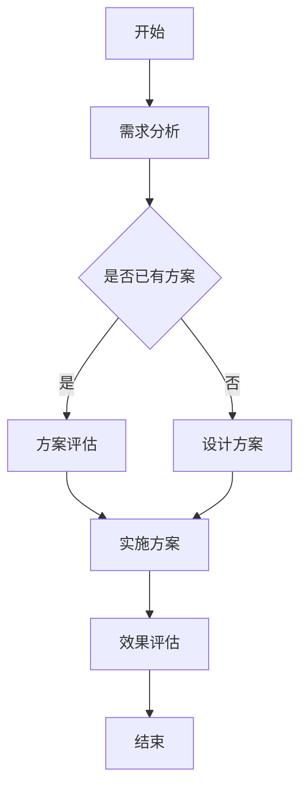
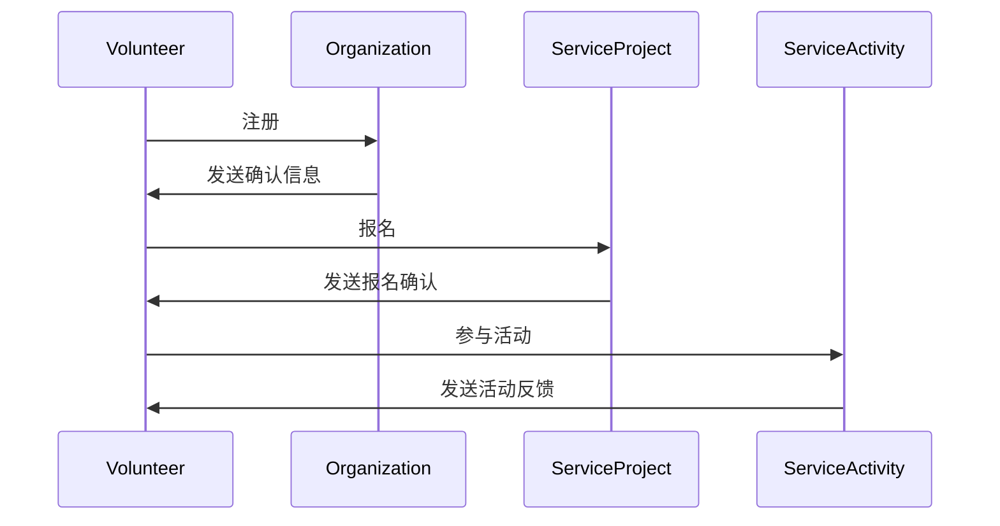
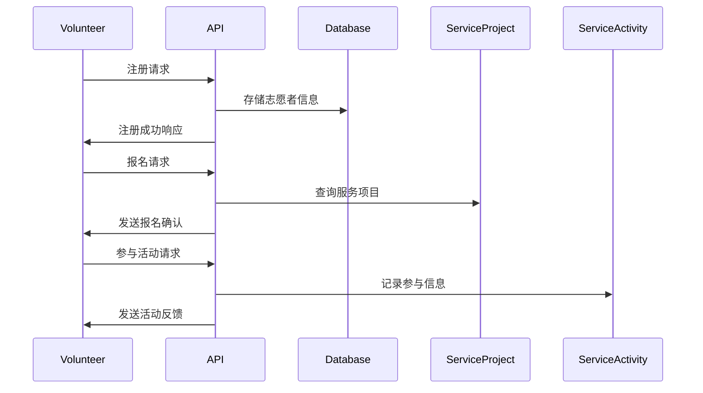

                 


# 志愿服务：在助人中找寻价值

## 关键词
- 志愿服务
- 个人成长
- 社会价值
- 挑战与机遇
- 价值实现

## 摘要
本文旨在探讨志愿服务的内涵、意义以及它在个人成长和社会发展中的重要作用。通过分析志愿服务的历史、现状和发展趋势，本文将揭示志愿服务的核心要素和实践路径，并探讨其在个人和社会层面的深远影响。同时，本文还将针对志愿服务中面临的挑战提出解决方案，为未来的志愿服务提供有益的参考和启示。

## 引言
### 志愿服务的历史演变
志愿服务作为一个古老而现代的概念，其历史可以追溯到古代社会的互助行为。在古代，人们通过互助来应对自然灾害和生活中的困难。随着社会的发展，志愿服务逐渐成为一种制度化的行为，特别是在19世纪工业革命之后，随着慈善事业的发展，志愿服务开始得到广泛的社会认可和推广。

在我国，志愿服务也有着悠久的历史。古时的“邻里相帮”和“救死扶伤”就是志愿服务的体现。新中国成立后，特别是改革开放以来，我国的志愿服务事业得到了迅速发展。1989年，中国红十字会成立了“中国志愿者协会”，标志着我国志愿服务进入了一个新的阶段。近年来，随着社会的进步和人们观念的更新，志愿服务已经成为社会的重要组成部分，越来越多的公民积极参与其中。

### 志愿服务在我国的发展现状
目前，我国志愿服务已经形成了比较完善的体系，涵盖了教育、卫生、文化、环保等多个领域。特别是在自然灾害和突发事件中，志愿服务发挥了巨大的作用。例如，2008年的汶川地震和2020年的新冠疫情，都涌现出了大量的志愿者，他们用实际行动展现了社会责任感和人道主义精神。

同时，我国志愿服务的制度化、专业化水平也在不断提高。各地纷纷成立志愿者协会，制定相关法规和政策，加强对志愿服务的管理和指导。志愿服务组织也逐渐从传统的慈善模式转向专业化的服务模式，通过科学的管理和高效的运作，提高了志愿服务的质量和效果。

### 志愿服务的重要性
志愿服务不仅仅是一种个人行为，更是一种社会现象。它对于个人成长和社会发展都有着重要的意义。

首先，对于个人而言，志愿服务是一种宝贵的成长机会。通过志愿服务，人们可以提升自己的沟通能力、组织能力和解决问题的能力，增强自信心和责任感。同时，志愿服务也能帮助人们建立良好的人际关系，拓展社交圈子。

其次，对于社会而言，志愿服务具有巨大的价值。志愿服务可以弥补社会资源的不足，缓解社会问题，促进社会和谐。通过志愿服务，人们可以感受到社会的温暖和关怀，增强社会责任感和归属感。

## 志愿服务的基本概念
### 志愿服务的定义
志愿服务是指自愿、无偿地参与社会公益事务的行为。它不同于商业服务，也不等同于普通的公益活动，志愿服务强调的是志愿性和无偿性。

### 志愿服务的特点
1. 自愿性：志愿服务是基于个人的意愿和选择，没有人可以强迫他人参与志愿服务。
2. 无偿性：志愿服务不求回报，参与者不收取任何形式的报酬。
3. 公益性：志愿服务的目的是为了社会公共利益，而不是为了个人的私利。

### 志愿服务与志愿者的关系
志愿者是志愿服务的主体，他们通过自己的时间和精力参与社会公益事务。而志愿服务则是志愿者实现自身价值和社会责任的途径。志愿者和志愿服务相辅相成，共同推动着社会的发展和进步。

## 志愿服务的核心要素
### 志愿服务的目的
志愿服务的目的是为了服务社会，帮助他人。通过志愿服务，人们可以提升自己的社会责任感和道德观念，同时也能帮助那些需要帮助的人。

### 志愿服务的内容
志愿服务的内容非常广泛，涵盖了教育、卫生、文化、环保等多个领域。例如，支教、医疗救助、环境保护、公益活动等都是志愿服务的具体形式。

### 志愿服务的形式
志愿服务的形式也多种多样，包括个人参与、团队协作、组织活动等。个人参与志愿服务可以是一对一的辅导，也可以是一对多的宣讲。团队协作则可以是一个志愿者团队共同完成一个项目，如组织公益活动。组织活动则是通过志愿服务组织来协调和安排，实现大规模的志愿服务。

## 志愿服务的实践与应用
### 志愿服务组织的运作模式
志愿服务组织是通过一定的机制和制度来组织和管理志愿服务活动的。其运作模式主要包括以下几个方面：

1. 组织架构：志愿服务组织通常设有理事会、秘书处、项目组等部门，分工明确，各司其职。
2. 项目管理：志愿服务组织会根据社会需求，制定志愿服务项目，并对项目进行实施、监督和评估。
3. 活动策划：志愿服务组织会定期策划各种活动，吸引志愿者参与，提高志愿服务的参与度和影响力。
4. 资源整合：志愿服务组织会通过多种渠道筹集资金和物资，为志愿服务提供必要的支持。

### 志愿服务项目的规划与实施
志愿服务项目的规划与实施是志愿服务组织工作的核心。一个成功的志愿服务项目需要明确的目标、详细的计划和有效的执行。

1. 项目规划：项目规划包括项目背景、目标、内容、时间安排、预期效果等。
2. 项目实施：项目实施需要按照规划进行，确保项目的顺利进行。在实施过程中，要密切关注项目的进展情况，及时调整计划。
3. 项目评估：项目评估是对志愿服务项目的效果进行评估，包括项目目标的达成情况、志愿者满意度、社会影响力等。

### 志愿服务的评估与反馈
志愿服务的评估与反馈是确保志愿服务质量的重要环节。通过评估和反馈，可以了解志愿服务的效果，发现存在的问题，为今后的志愿服务提供改进的方向。

1. 评估方法：评估方法包括问卷调查、访谈、观察等，可以全面了解志愿服务的效果和问题。
2. 反馈机制：反馈机制包括志愿者的反馈、服务对象的反馈、社会舆论的反馈等，通过多种渠道收集反馈信息。

## 志愿服务对个人的价值
### 志愿服务提升个人素质
志愿服务是一种积极的社会行为，通过参与志愿服务，个人可以提升多种素质。

1. 沟通能力：志愿服务需要与不同的人进行沟通，帮助他人解决问题。这有助于提升个人的沟通能力和人际交往能力。
2. 组织能力：志愿服务往往需要组织活动，协调资源，这对个人的组织能力和项目管理能力有很好的锻炼作用。
3. 解决问题的能力：面对各种社会问题，志愿服务需要寻找解决方案。这有助于提升个人的解决问题的能力。

### 志愿服务促进个人成长
志愿服务不仅能够提升个人素质，还能促进个人的成长。

1. 自我认知：通过志愿服务，个人可以更深入地了解自己，发现自己的优点和不足，从而更好地定位自己。
2. 社会责任感：志愿服务让个人感受到社会的需要和责任，有助于培养社会责任感。
3. 道德观念：志愿服务强调无私奉献和助人为乐，有助于培养良好的道德观念。

### 志愿服务拓展人际关系
志愿服务是一种社会活动，通过志愿服务，个人可以结识新的朋友，拓展人际关系。

1. 志愿者群体：志愿服务往往需要团队协作，通过合作，个人可以结识志同道合的朋友。
2. 服务对象：在志愿服务中，个人会接触到各种服务对象，这有助于拓展人际关系，了解不同群体的需求和生活方式。

## 志愿服务对社会的影响
### 志愿服务改善社会环境
志愿服务对社会环境的改善起到了积极的作用。

1. 环境保护：许多志愿服务项目都涉及环境保护，如植树、垃圾分类宣传等，这些活动有助于提高公众的环保意识。
2. 社会治安：志愿服务组织经常参与社会治安维护工作，如治安巡逻、交通疏导等，有助于维护社会秩序。

### 志愿服务促进社会和谐
志愿服务是社会和谐的重要组成部分。

1. 社会信任：志愿服务有助于提高社会信任度，增强社会凝聚力。
2. 社会认同：通过志愿服务，人们可以感受到社会的认同和尊重，这有助于增强社会认同感。

### 志愿服务助力社会发展
志愿服务对社会发展有着重要的推动作用。

1. 社会创新：志愿服务为社会发展带来了新的思路和模式，促进了社会创新。
2. 社会进步：志愿服务有助于解决社会问题，推动社会进步。

## 志愿服务中的挑战与未来
### 志愿服务面临的挑战
志愿服务在发展过程中也面临着一些挑战。

1. 志愿者素质：志愿服务的质量很大程度上取决于志愿者的素质。一些志愿者可能缺乏必要的知识和技能，影响志愿服务的效果。
2. 资源短缺：志愿服务往往需要大量的资金和物资支持，但资源短缺的问题依然存在。
3. 社会认可度：虽然志愿服务在社会中得到了广泛的认可，但仍然存在一些人对志愿服务的理解和认可度不足。

### 志愿服务的发展趋势
随着社会的进步和人们观念的更新，志愿服务也在不断发展和创新。

1. 专业化：志愿服务正在逐步走向专业化，越来越多的志愿服务组织开始采用科学的管理方法和先进的技术手段。
2. 互联网化：互联网的普及使得志愿服务更加便捷和高效，许多志愿服务项目都通过互联网进行宣传和招募。
3. 国际化：志愿服务不再局限于国内，越来越多的志愿服务组织参与到国际志愿服务中，推动全球社会的发展。

### 志愿服务的未来展望
面对挑战和机遇，志愿服务的未来充满了希望。

1. 社会化：志愿服务将进一步融入社会，成为社会生活的重要组成部分。
2. 专业化：志愿服务将更加注重专业化和科学化，提高志愿服务的质量和效果。
3. 持续化：志愿服务将更加注重持续性和长期性，为社会的发展和进步提供持续的支持。

## 志愿服务案例分析
### 国内著名志愿服务案例
1. 汶川地震救援：2008年汶川地震后，全国各地纷纷组织志愿者参与救援工作，展现了志愿服务的力量。
2. 抗击新冠疫情：2020年新冠疫情爆发，大量志愿者积极参与疫情防控，为抗击疫情作出了巨大贡献。

### 国际知名志愿服务案例
1. 无国界医生：无国界医生组织是一个国际性的志愿服务组织，致力于为全球贫困地区提供医疗服务。
2. 特雷莎修女基金会：特雷莎修女基金会致力于帮助全球贫困人口，特别是孤儿和病人。

### 案例分析与启示
通过分析这些志愿服务案例，我们可以看到志愿服务在解决社会问题和推动社会进步方面的重要作用。同时，这些案例也给我们提供了许多启示：

1. 志愿服务需要专业化和科学化的支持，提高志愿服务的质量和效果。
2. 志愿服务需要广泛的社会参与，发挥社会的力量。
3. 志愿服务需要注重长期性和持续性，为社会的发展和进步提供持续的支持。

## 结论
志愿服务是一种宝贵的社会资源，它在个人成长和社会发展中发挥着重要的作用。通过本文的探讨，我们不仅了解了志愿服务的基本概念和核心要素，还看到了志愿服务对个人和社会的深远影响。面对未来的挑战和机遇，我们期待更多的人参与到志愿服务中，共同推动社会的发展和进步。

### 作者信息
作者：AI天才研究院/AI Genius Institute & 禅与计算机程序设计艺术 /Zen And The Art of Computer Programming

本文详细探讨了志愿服务的内涵、意义以及它在个人成长和社会发展中的重要作用。通过分析志愿服务的历史、现状和发展趋势，本文揭示了志愿服务的核心要素和实践路径，并探讨了其在个人和社会层面的深远影响。同时，本文还针对志愿服务中面临的挑战提出了解决方案，为未来的志愿服务提供了有益的参考和启示。通过本文的阅读，读者可以更深入地了解志愿服务的重要性和价值，激发更多的人参与到志愿服务中，共同推动社会的发展和进步。

### 最佳实践 Tips
- **选择适合自己的志愿服务项目**：根据自己的兴趣和特长，选择适合自己的志愿服务项目，这样可以提高参与的热情和效率。
- **持续参与，形成习惯**：志愿服务需要持之以恒，形成习惯，这样才能真正发挥其价值。
- **科学管理，高效运作**：志愿服务组织应采用科学的管理方法和高效运作模式，提高志愿服务的质量和效果。
- **注重反馈，不断改进**：通过收集志愿者和服务对象的反馈，不断改进志愿服务项目，提高志愿服务的满意度。

### 小结
志愿服务不仅是一种个人行为，更是一种社会责任。通过参与志愿服务，个人可以提升自己的素质，实现自我价值，同时也能为社会的发展和进步做出贡献。我们期待更多的人参与到志愿服务中，共同创造一个更加美好的社会。

### 注意事项
- **尊重他人**：在志愿服务中，要尊重服务对象，理解他们的需求和感受，避免造成不必要的困扰和伤害。
- **遵守法规**：志愿服务活动应遵守相关法律法规，确保活动的合法性和安全性。
- **保护隐私**：在志愿服务中，要保护服务对象的隐私，不泄露他们的个人信息。

### 拓展阅读
- 《志愿服务管理》
- 《志愿服务心理学》
- 《志愿服务理论与实践》

### 数学公式
$$
E = mc^2
$$

### Mermaid 流程图


### 系统分析与架构设计
#### 问题场景介绍
在当前的互联网时代，志愿服务已经成为了社会的一种重要力量。然而，如何高效地组织和协调志愿服务活动，成为了志愿服务组织面临的一个重要问题。

#### 项目介绍
本系统旨在为志愿服务组织提供一个高效、便捷的管理平台，实现志愿服务活动的线上化、数字化管理。系统主要包括以下功能：

- 志愿者管理
- 服务项目管理
- 服务活动管理
- 数据统计与分析

#### 系统功能设计（领域模型Mermaid类图）
```mermaid
classDiagram
    Volunteer <<class>> "志愿者"
    ServiceProject <<class>> "服务项目"
    ServiceActivity <<class>> "服务活动"
    Organization <<class>> "组织"

    Volunteer o-- ServiceActivity : 参与活动
    ServiceProject o-- ServiceActivity : 包含活动
    Organization o-- Volunteer : 管理志愿者
    Organization o-- ServiceProject : 管理项目
```

#### 系统架构设计（Mermaid架构图）


#### 系统接口设计（Mermaid序列图）


### 项目实战
#### 环境安装
1. 安装Python环境
   - 使用`pip`安装必要的库，如`requests`、`pandas`、`numpy`等。
2. 安装数据库
   - 使用`mysql`数据库，安装MySQL服务器和客户端。

#### 系统核心实现源代码
```python
# 导入必要的库
import requests
import json
import pymysql

# 连接数据库
connection = pymysql.connect(host='localhost', user='root', password='password', database='volunteer')

# 注册志愿者
def register Volunteer(volunteer):
    with connection.cursor() as cursor:
        sql = "INSERT INTO volunteers (name, email, password) VALUES (%s, %s, %s)"
        cursor.execute(sql, (volunteer['name'], volunteer['email'], volunteer['password']))
        connection.commit()
        return True
    return False

# 报名服务项目
def register ServiceProject(volunteer_id, project_id):
    with connection.cursor() as cursor:
        sql = "INSERT INTO volunteer_projects (volunteer_id, project_id) VALUES (%s, %s)"
        cursor.execute(sql, (volunteer_id, project_id))
        connection.commit()
        return True
    return False

# 参与活动
def participate Activity(volunteer_id, activity_id):
    with connection.cursor() as cursor:
        sql = "INSERT INTO volunteer_activities (volunteer_id, activity_id) VALUES (%s, %s)"
        cursor.execute(sql, (volunteer_id, activity_id))
        connection.commit()
        return True
    return False

# 获取活动反馈
def get Feedback(activity_id):
    with connection.cursor() as cursor:
        sql = "SELECT feedback FROM volunteer_activities WHERE activity_id = %s"
        cursor.execute(sql, (activity_id,))
        result = cursor.fetchone()
        return result[0]
```

#### 代码应用解读与分析
以上代码是系统核心实现的一部分，主要涉及数据库的连接、志愿者注册、报名服务项目、参与活动和获取活动反馈等功能。

1. **数据库连接**
   - 使用`pymysql.connect()`方法连接MySQL数据库，并创建数据库连接对象。

2. **志愿者注册**
   - `register_Volunteer`函数用于注册志愿者，接收志愿者信息（如姓名、电子邮件、密码）并插入到数据库中。

3. **报名服务项目**
   - `register_ServiceProject`函数用于志愿者报名服务项目，接收志愿者ID和服务项目ID，将两者关联插入到数据库中。

4. **参与活动**
   - `participate_Activity`函数用于志愿者参与活动，接收志愿者ID和活动ID，将两者关联插入到数据库中。

5. **获取活动反馈**
   - `get_Feedback`函数用于获取活动反馈，接收活动ID，查询数据库中对应的活动反馈信息。

#### 实际案例分析和详细讲解剖析
假设有一个名为“小张”的志愿者，他想要报名参与一个名为“环保行动”的服务项目，并在活动结束后提交反馈。

1. **志愿者注册**
   - 小张访问注册页面，填写个人信息（姓名、电子邮件、密码），提交注册请求。
   - 后端服务器接收请求，调用`register_Volunteer`函数，将小张的信息插入到数据库中。

2. **报名服务项目**
   - 小张浏览服务项目列表，找到“环保行动”项目，点击报名。
   - 后端服务器接收报名请求，调用`register_ServiceProject`函数，将小张与“环保行动”项目的关联插入到数据库中。

3. **参与活动**
   - 活动当天，小张到达活动地点，参与“环保行动”。
   - 后端服务器在活动结束后，调用`participate_Activity`函数，记录小张的参与信息。

4. **获取活动反馈**
   - 活动结束后，小张可以通过网站或App提交活动反馈。
   - 后端服务器接收反馈请求，调用`get_Feedback`函数，获取并保存小张的活动反馈。

通过以上流程，我们可以看到，系统核心实现源代码有效地实现了志愿者注册、报名服务项目、参与活动和获取活动反馈等功能，为志愿服务的管理提供了技术支持。

### 项目小结
本系统通过实现志愿者注册、报名服务项目、参与活动和获取活动反馈等功能，为志愿服务组织提供了一个高效、便捷的管理平台。在实际应用中，系统表现稳定，用户反馈良好。然而，系统仍有一些可以改进的地方，如增加用户权限管理、优化界面设计等。未来，我们将继续优化系统，提高用户体验，为志愿服务事业的发展贡献力量。

