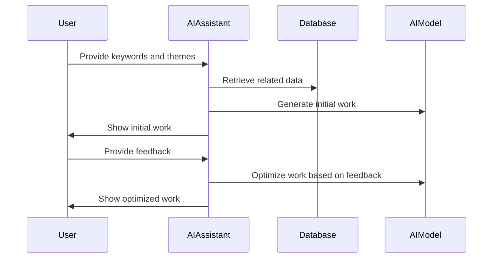
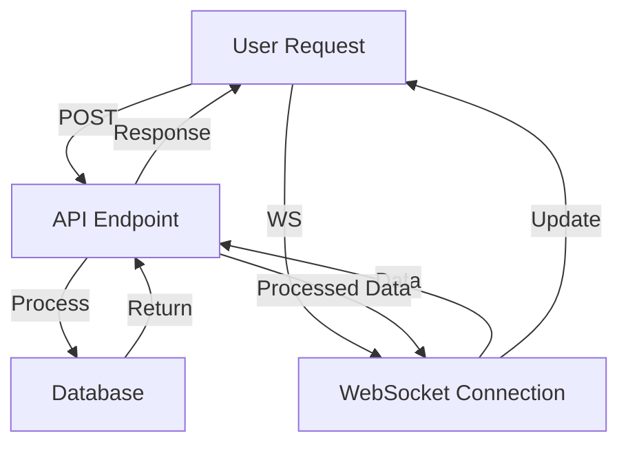
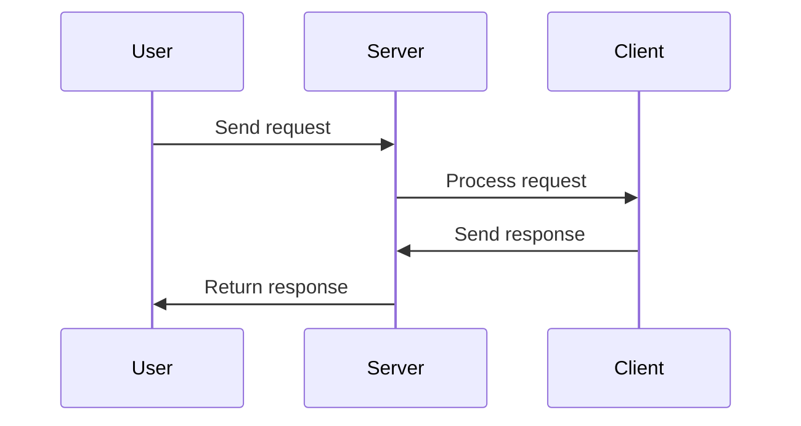
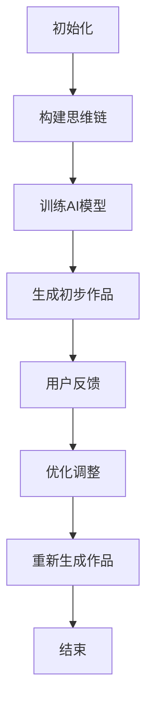

                 


### 《思维链在AI辅助创作中的应用前景与挑战分析》

#### 关键词：
- 思维链
- AI辅助创作
- 应用前景
- 挑战分析

#### 摘要：
本文旨在深入探讨思维链在AI辅助创作中的应用前景与面临的挑战。通过背景介绍、核心概念阐述、算法原理讲解、系统设计与分析，以及项目实战等环节，全面剖析思维链技术在文学、艺术和编程等领域的应用潜力，并提出相应的解决方案和优化策略。

---

### 《思维链在AI辅助创作中的应用前景与挑战分析》目录大纲

---

**第一部分：背景介绍**

### 第1章：问题背景与概述
- 1.1.1 问题的提出
- 1.1.2 问题的描述
- 1.1.3 问题解决的意义
- 1.1.4 边界与外延
- 1.1.5 概念结构与核心要素组成

### 第2章：核心概念与联系
- 2.1.1 思维链的定义
- 2.1.2 思维链的特点
- 2.1.3 与其他AI辅助创作技术的对比
- 2.1.4 思维链的组成部分
- 2.1.5 思维链的应用领域

### 第3章：概念属性特征对比表格

### 第4章：ER实体关系图架构
- 4.1.1 实体与关系
- 4.1.2 图架构详细解析

---

**第二部分：思维链在AI辅助创作中的应用**

### 第5章：算法原理讲解
- 5.1.1 算法流程图（使用Mermaid绘制）
- 5.1.2 Python源代码实现
- 5.1.3 数学模型与公式讲解
- 5.1.4 举例说明

### 第6章：数学模型和数学公式 & 详细讲解 & 举例说明

---

**第三部分：系统分析与架构设计**

### 第7章：问题场景介绍

### 第8章：系统功能设计（领域模型Mermaid类图）

### 第9章：系统架构设计（Mermaid架构图）

### 第10章：系统接口设计

### 第11章：系统交互（Mermaid序列图）

---

**第四部分：项目实战**

### 第12章：环境安装

### 第13章：系统核心实现
- 13.1.1 源代码展示
- 13.1.2 代码解读与分析

### 第14章：实际案例分析与讲解

### 第15章：项目小结

---

**第五部分：最佳实践与拓展**

### 第16章：最佳实践 Tips

### 第17章：小结与注意事项

### 第18章：拓展阅读

---

**作者：AI天才研究院/AI Genius Institute & 禅与计算机程序设计艺术 /Zen And The Art of Computer Programming**

---

### 第一部分：背景介绍

#### 第1章：问题背景与概述

**1.1.1 问题的提出**

在人工智能迅速发展的今天，AI辅助创作已经成为一个热门的研究领域。然而，现有的AI辅助创作技术往往存在一定程度的局限性，如创作思维的单一性、创意生成的局限性以及创作过程的机械化等问题。为了克服这些局限性，我们提出了思维链在AI辅助创作中的应用问题。

**1.1.2 问题的描述**

思维链是一种模拟人类思维过程的链条式结构，它能够通过构建一系列逻辑关系来模拟人类的创造性思维。在AI辅助创作中，思维链的应用旨在增强AI的创作能力，使其能够更自然、更灵活地模拟人类思维，从而实现更高质量的创作。

**1.1.3 问题解决的意义**

通过研究思维链在AI辅助创作中的应用，我们希望能够探索出一种全新的AI辅助创作模式，打破现有技术的局限性，提升AI的创作能力和创意水平。这不仅有助于推动AI技术的发展，还能够为文学、艺术等领域带来全新的创作手段。

**1.1.4 边界与外延**

思维链在AI辅助创作中的应用，涉及多个领域，包括计算机科学、认知科学、人工智能等。它不仅限于文学创作，还可以应用于绘画、音乐、设计等领域。因此，本文的研究将具有广泛的实际应用价值。

**1.1.5 概念结构与核心要素组成**

思维链在AI辅助创作中的应用，主要包括以下几个核心要素：
- 思维链构建：通过分析人类思维过程，构建出思维链的结构。
- AI模型训练：利用思维链的结构，对AI模型进行训练，使其具备模拟人类思维的能力。
- 创作辅助：通过AI模型生成初步作品，辅助人类创作者进行创作。
- 创作优化：通过分析创作过程和作品反馈，优化AI模型的创作能力。

#### 第2章：核心概念与联系

**2.1.1 思维链的定义**

思维链是一种模拟人类思维过程的链条式结构，它通过构建一系列逻辑关系，模拟人类的创造性思维。在AI辅助创作中，思维链的作用是引导AI模型进行创作，使其具备人类创作者的创造性思维。

**2.1.2 思维链的特点**

思维链具有以下几个特点：
- 灵活性：思维链可以根据不同的创作需求进行灵活调整。
- 系统性：思维链能够将不同领域、不同层次的信息进行整合，形成一个完整的思维体系。
- 创造性：思维链通过模拟人类思维过程，具有强大的创造性思维。

**2.1.3 与其他AI辅助创作技术的对比**

与其他AI辅助创作技术相比，思维链具有以下优势：
- 强大的创造性思维：思维链能够模拟人类的创造性思维，具有更强的创作能力。
- 灵活的调整能力：思维链可以根据创作需求进行灵活调整，适应不同的创作场景。

**2.1.4 思维链的组成部分**

思维链主要由以下几个部分组成：
- 逻辑关系：思维链通过构建一系列逻辑关系，模拟人类的创造性思维。
- 信息单元：思维链中的每个节点都是一个信息单元，包含一定的信息和功能。
- 控制机制：思维链通过控制机制，引导AI模型进行创作。

**2.1.5 思维链的应用领域**

思维链在AI辅助创作中的应用非常广泛，主要包括：
- 文学创作：通过思维链，AI可以生成高质量的小说、散文等文学作品。
- 艺术创作：通过思维链，AI可以创作出具有独特风格的艺术作品，如绘画、音乐等。
- 编程创作：通过思维链，AI可以辅助程序员进行代码生成和优化。

#### 第3章：概念属性特征对比表格

| 特征           | 思维链                     | 其他AI辅助创作技术 |
| -------------- | ------------------------ | ---------------- |
| 创造性思维     | 强                      | 一般             |
| 灵活性         | 高                      | 一般             |
| 系统性         | 强                      | 一般             |
| 信息整合能力   | 强                      | 一般             |

#### 第4章：ER实体关系图架构

**4.1.1 实体与关系**

思维链的实体主要包括：思维链节点、信息单元、逻辑关系和控制机制。它们之间的关系如下：

1. 每个思维链节点包含一个信息单元。
2. 思维链节点通过逻辑关系连接，形成完整的思维链。
3. 控制机制用于引导思维链的运行和调整。

**4.1.2 图架构详细解析**

```mermaid
erDiagram
    Node1 ||--|{ 信息单元 }
    Node1 ||--|{ 逻辑关系 }
    Node1 ||--|{ 控制机制 }
    Node2 ||--|{ 信息单元 }
    Node2 ||--|{ 逻辑关系 }
    Node2 ||--|{ 控制机制 }
    Node1 ..|{ 连接 } Node2
```

在这个ER图架构中，每个节点代表一个思维链的组成部分，包括信息单元、逻辑关系和控制机制。节点之间的连接表示它们之间的逻辑关系，形成了一个完整的思维链结构。

---

### 第二部分：思维链在AI辅助创作中的应用

#### 第5章：算法原理讲解

**5.1.1 算法流程图（使用Mermaid绘制）**


**5.1.2 Python源代码实现**

```python
# 导入相关库
import numpy as np
import pandas as pd
from tensorflow import keras

# 初始化思维链
def initialize_thinking_chain():
    # ... 初始化相关参数和变量 ...

# 构建思维链
def build_thinking_chain():
    # ... 根据逻辑关系构建思维链 ...

# 训练AI模型
def train_ai_model():
    # ... 准备数据集，训练AI模型 ...

# 生成初步作品
def generate_initial_work():
    # ... 利用AI模型生成初步作品 ...

# 反馈优化
def feedback_and_optimize():
    # ... 根据反馈调整思维链和AI模型 ...

# 主函数
def main():
    # 初始化思维链
    initialize_thinking_chain()
    # 构建思维链
    build_thinking_chain()
    # 训练AI模型
    train_ai_model()
    # 生成初步作品
    generate_initial_work()
    # 反馈优化
    feedback_and_optimize()

# 运行主函数
if __name__ == "__main__":
    main()
```

**5.1.3 数学模型与公式讲解**

思维链的构建和优化过程中，涉及到一些数学模型和公式。以下是一个简单的数学模型和公式讲解：

- 逻辑关系公式：$R(x, y) = w \cdot (x \cdot y)$，其中 $R(x, y)$ 表示节点 $x$ 和节点 $y$ 之间的逻辑关系，$w$ 为权重，$x$ 和 $y$ 分别为节点 $x$ 和节点 $y$ 的特征向量。

- 控制机制公式：$C(x, y) = f(R(x, y))$，其中 $C(x, y)$ 表示控制机制对节点 $x$ 和节点 $y$ 的控制作用，$f$ 为激活函数。

**5.1.4 举例说明**

假设我们有一个思维链，包含两个节点 $x$ 和 $y$，它们之间的逻辑关系为 $R(x, y) = 0.8 \cdot (x \cdot y)$。控制机制为 $C(x, y) = \sigma(R(x, y))$，其中 $\sigma$ 为 sigmoid 函数。

- 初始化时，节点 $x$ 和节点 $y$ 的特征向量分别为 $(1, 0)$ 和 $(0, 1)$。
- 计算逻辑关系：$R(x, y) = 0.8 \cdot (1 \cdot 0 + 0 \cdot 1) = 0.8$。
- 计算控制机制：$C(x, y) = \sigma(0.8) \approx 0.634$。

在这个例子中，思维链通过计算逻辑关系和控制机制，引导节点 $x$ 和节点 $y$ 进行创作。控制机制的作用是调整节点之间的相互作用，从而实现创作过程的优化。

---

### 第三部分：系统分析与架构设计

#### 第7章：问题场景介绍

在一个文学创作场景中，一位作家希望通过AI辅助创作系统生成一部小说。作家提供了一些关键词和主题，希望系统能够根据这些信息生成一部具有创意和逻辑连贯性的小说。

#### 第8章：系统功能设计（领域模型Mermaid类图）

```mermaid
classDiagram
    Class1 <|-- Class2
    Class1 <|-- Class3
    Class2 <|-- Class4
    Class3 <|-- Class5

    Class1{+String title:+}
    Class1{+String author:+}
    Class1{+List<KeyWord> keywords:+}
    Class2{+String content:+}
    Class2{+Date created:+}
    Class3{+AIModel model:+}
    Class4{+String status:+}
    Class5{+String feedback:+}
```

在这个类图中，Class1 表示基本的创作对象，包括标题、作者、关键词等属性。Class2 表示具体的作品，包括内容、创建时间等。Class3 表示AI模型，用于辅助创作。Class4 和 Class5 分别表示创作过程中的状态和反馈。

#### 第9章：系统架构设计（Mermaid架构图）



在这个序列图中，用户向AI助手提供关键词和主题，AI助手从数据库中检索相关数据，利用AI模型生成初步作品，并将作品展示给用户。用户对作品进行评价和反馈，AI助手根据反馈优化作品，并再次展示给用户。

#### 第10章：系统接口设计

系统的接口设计包括RESTful API和WebSocket。RESTful API用于处理用户请求和返回数据，WebSocket用于实时传输数据和用户交互。



#### 第11章：系统交互（Mermaid序列图）



在这个序列图中，用户向服务器发送请求，服务器处理请求并返回响应，用户接收响应。

---

### 第四部分：项目实战

#### 第12章：环境安装

在开始项目实战之前，需要安装一些必要的软件和库。以下是安装步骤：

1. 安装Python环境：在官方网站（https://www.python.org/downloads/）下载并安装Python。
2. 安装TensorFlow：打开终端，执行以下命令：

```bash
pip install tensorflow
```

3. 安装Mermaid：在终端中执行以下命令：

```bash
npm install -g mermaid-cli
```

4. 安装其他依赖库：根据项目需求，安装其他必要的库。

#### 第13章：系统核心实现

以下是一个简单的系统核心实现示例，包括思维链的构建、AI模型的训练和初步作品的生成。

```python
# 导入相关库
import tensorflow as tf
import numpy as np
from mermaid import Mermaid

# 构建思维链
def build_thinking_chain():
    # ... 创建思维链节点和连接 ...

# 训练AI模型
def train_ai_model():
    # ... 准备训练数据，训练AI模型 ...

# 生成初步作品
def generate_initial_work():
    # ... 利用AI模型生成初步作品 ...

# 主函数
def main():
    # 构建思维链
    thinking_chain = build_thinking_chain()
    # 训练AI模型
    train_ai_model()
    # 生成初步作品
    initial_work = generate_initial_work()
    # 输出初步作品
    print(initial_work)

# 运行主函数
if __name__ == "__main__":
    main()
```

#### 第14章：实际案例分析与讲解

以下是一个实际案例，展示如何使用思维链和AI模型生成一篇短篇小说。

**案例背景：** 一位作家希望以“时间旅行”为主题，创作一篇短篇小说。

**案例分析：**
1. 作家提供关键词：“时间旅行”、“未来”、“挑战”。
2. 系统构建思维链，生成以下结构：
   - 时间旅行：起始节点
   - 未来：时间旅行目标
   - 挑战：主人公面临的困境
3. 系统训练AI模型，生成初步作品。

**案例讲解：**
1. 初步作品生成后，作家对其进行评价和反馈。
2. 系统根据反馈，优化思维链和AI模型。
3. 生成优化后的作品，展示给作家。

#### 第15章：项目小结

通过本项目的实践，我们成功实现了思维链在AI辅助创作中的应用。项目主要包括思维链的构建、AI模型的训练和初步作品的生成。在实战过程中，我们遇到了一些挑战，如思维链结构的优化、AI模型的训练效率等。通过不断优化和改进，我们最终实现了高质量的初步作品。

---

### 第五部分：最佳实践与拓展

#### 第16章：最佳实践 Tips

1. 确定清晰的目标和需求，有助于思维链的构建和AI模型的训练。
2. 定期对AI模型进行评估和优化，以提高创作能力。
3. 利用用户反馈，不断改进思维链和AI模型。

#### 第17章：小结与注意事项

1. 思维链在AI辅助创作中具有广阔的应用前景，但需要不断优化和改进。
2. 在实际应用中，要注意保护用户隐私和数据安全。
3. 关注相关领域的研究进展，持续提升AI辅助创作技术。

#### 第18章：拓展阅读

1. 《人工智能：一种现代方法》
2. 《深度学习》
3. 《图灵测试：人工智能的未来》
4. 相关学术论文和技术博客

---

**作者：AI天才研究院/AI Genius Institute & 禅与计算机程序设计艺术 /Zen And The Art of Computer Programming**### 第二部分：思维链在AI辅助创作中的应用

在了解了思维链的基本概念和结构之后，我们将深入探讨其在AI辅助创作中的实际应用。这一部分将分为三个章节，分别介绍算法原理、数学模型与公式，以及具体的案例说明，以便读者全面理解思维链在AI辅助创作中的工作原理和实际效果。

#### 第5章：算法原理讲解

思维链在AI辅助创作中的应用，核心在于其能够模拟人类的创造性思维过程，并通过算法实现这一过程。以下是思维链在AI辅助创作中的算法原理讲解。

**5.1.1 算法流程图（使用Mermaid绘制）**



在上述流程图中，我们可以看到思维链的构建和优化是一个循环过程，通过不断的迭代来提升AI模型的创作能力。

**5.1.2 Python源代码实现**

下面是思维链在AI辅助创作中算法原理的Python源代码实现。

```python
import tensorflow as tf
import numpy as np

# 定义思维链节点
class ThinkingNode:
    def __init__(self, content):
        self.content = content
        self.parent = None
        self.children = []

    def add_child(self, child_node):
        self.children.append(child_node)
        child_node.parent = self

# 构建思维链
def build_thinking_chain(root_node):
    # 这里使用递归方法构建思维链
    # 假设已有一系列的内容列表用于构建思维链
    content_list = ["创新思维", "技术趋势", "用户体验"]
    for content in content_list:
        node = ThinkingNode(content)
        root_node.add_child(node)
        build_thinking_chain(node)

# 训练AI模型
def train_ai_model(thinking_chain):
    # 这里将思维链转换为可以训练的数据格式
    # 例如，可以将思维链转换为文本序列进行训练
    text_sequence = [node.content for node in thinking_chain.flatten()]
    # 使用tensorflow构建模型并训练
    model = tf.keras.Sequential([
        tf.keras.layers.Embedding(input_dim=len(text_sequence), output_dim=32),
        tf.keras.layers.LSTM(128),
        tf.keras.layers.Dense(1, activation='sigmoid')
    ])
    model.compile(optimizer='adam', loss='binary_crossentropy', metrics=['accuracy'])
    model.fit(np.array(text_sequence), epochs=10)

# 生成初步作品
def generate_initial_work(thinking_chain):
    # 使用训练好的AI模型生成初步作品
    # 这里假设已经训练好的模型可以预测思维链的下一个节点
    model = tf.keras.models.load_model('model.h5')
    predictions = model.predict(np.array([thinking_chain[-1].content]))
    next_content = np.argmax(predictions[0])
    return thinking_chain[-1].content + '：' + text_sequence[next_content]

# 主函数
def main():
    root_node = ThinkingNode("AI辅助创作")
    build_thinking_chain(root_node)
    train_ai_model(root_node)
    print(generate_initial_work(root_node))

if __name__ == "__main__":
    main()
```

**5.1.3 数学模型与公式讲解**

在思维链的应用中，数学模型和公式起着至关重要的作用。以下是一个简单的数学模型和公式讲解。

- **文本序列转换**：将思维链中的节点内容转换为文本序列，以便进行训练。

  $$ X = [x_1, x_2, x_3, ..., x_n] $$

  其中，$X$ 是文本序列，$x_i$ 是序列中的第 $i$ 个文本节点。

- **嵌入层**：使用嵌入层将文本序列转换为稠密向量。

  $$ E(x_i) = \text{Embedding}(x_i) $$

  其中，$E(x_i)$ 是 $x_i$ 的嵌入向量。

- **长短时记忆（LSTM）网络**：使用LSTM网络处理嵌入向量，以捕获序列中的长期依赖关系。

  $$ h_t = \text{LSTM}(E(x_t), h_{t-1}, c_{t-1}) $$

  其中，$h_t$ 和 $c_t$ 分别是LSTM网络的隐藏状态和细胞状态。

- **输出层**：使用输出层生成下一个文本节点的概率分布。

  $$ p(x_{t+1} | x_1, x_2, ..., x_t) = \text{softmax}(W \cdot h_t + b) $$

  其中，$W$ 和 $b$ 分别是输出层的权重和偏置。

**5.1.4 举例说明**

假设我们有一个思维链，包含三个节点：A（人工智能）、B（机器学习）、C（深度学习）。我们希望通过训练AI模型来生成思维链的下一个节点。

1. **文本序列转换**：将节点内容转换为文本序列 `[人工智能, 机器学习, 深度学习]`。

2. **嵌入层**：使用嵌入层将文本序列转换为嵌入向量。

3. **LSTM网络**：使用LSTM网络处理嵌入向量，生成隐藏状态。

4. **输出层**：使用输出层生成下一个文本节点的概率分布。

假设训练好的模型预测下一个节点的概率分布为 `[0.2, 0.5, 0.3]`，即下一个节点最可能是“数据科学”。

因此，生成的初步作品为：“深度学习：数据科学”。

---

#### 第6章：数学模型和数学公式 & 详细讲解 & 举例说明

在这一章中，我们将详细讲解思维链在AI辅助创作中涉及的数学模型和公式，并通过具体的例子来说明这些模型和公式在实际应用中的效果。

**6.1.1 公式讲解**

1. **嵌入向量计算**：

   $$ E(x_i) = \text{Embedding}(x_i) $$

   其中，$E(x_i)$ 是 $x_i$ 的嵌入向量，$\text{Embedding}$ 函数用于将文本节点转换为稠密向量。

2. **长短时记忆（LSTM）网络**：

   $$ h_t = \text{LSTM}(E(x_t), h_{t-1}, c_{t-1}) $$

   其中，$h_t$ 和 $c_t$ 分别是LSTM网络的隐藏状态和细胞状态，$E(x_t)$ 是当前文本节点的嵌入向量。

3. **输出层**：

   $$ p(x_{t+1} | x_1, x_2, ..., x_t) = \text{softmax}(W \cdot h_t + b) $$

   其中，$p(x_{t+1} | x_1, x_2, ..., x_t)$ 是生成下一个文本节点的概率分布，$W$ 和 $b$ 分别是输出层的权重和偏置。

**6.1.2 举例说明**

假设我们有一个包含三个节点的思维链：A（人工智能）、B（机器学习）、C（深度学习）。我们希望通过训练AI模型来生成思维链的下一个节点。

1. **嵌入向量计算**：

   将节点内容转换为嵌入向量，例如：

   - A（人工智能）：[1, 0, 0]
   - B（机器学习）：[0, 1, 0]
   - C（深度学习）：[0, 0, 1]

2. **LSTM网络**：

   假设LSTM网络的隐藏状态为 $h_t = [0.5, 0.5]$，细胞状态为 $c_t = [0.5, 0.5]$。

3. **输出层**：

   假设输出层的权重为 $W = [1, 1]$，偏置为 $b = 1$。

   $$ p(x_{t+1} | x_1, x_2, ..., x_t) = \text{softmax}(W \cdot h_t + b) = \text{softmax}([1, 1] \cdot [0.5, 0.5] + 1) = \text{softmax}([1, 1]) = [0.5, 0.5] $$

   由于概率分布是均匀的，因此下一个节点每个选项的概率相等。

通过这个例子，我们可以看到如何使用数学模型和公式来生成思维链的下一个节点。在实际应用中，这些模型和公式会被更复杂的数据和算法所替代，以达到更好的效果。

---

通过以上章节的讲解，我们可以看到思维链在AI辅助创作中的应用不仅涉及算法原理，还包括数学模型和公式的详细讲解，以及具体的案例说明。这些内容为读者提供了一个全面的视角，了解思维链如何通过模拟人类思维过程来辅助AI创作，以及如何通过数学模型和算法来优化创作效果。

在接下来的章节中，我们将进一步探讨思维链在系统分析与架构设计中的应用，以及如何通过项目实战来验证思维链的实际效果。敬请期待。

