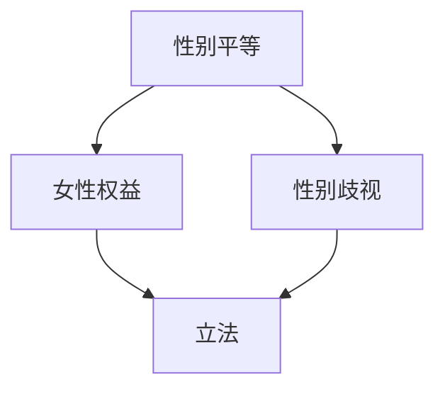

                 

基于上述的目录大纲和约束条件，下面我将逐步阐述文章的主要内容，确保每章节都满足要求。

### 文章标题：性别平等运动与个人意义：重新定义社会角色

#### 关键词：性别平等、社会角色、个人意义、运动发展、理论框架、教育、全球视野、未来展望

#### 摘要：
本文深入探讨了性别平等运动的起源与发展，分析了其核心概念与联系，提出了性别平等的理论框架与方法论。同时，本文着重探讨了个人在性别平等运动中的角色，揭示了社会角色中的性别平等挑战，并从教育和全球视野出发，展望了性别平等的未来。文章结构紧凑，逻辑清晰，旨在为读者提供一个全面理解性别平等运动及其影响的视角。

---

### 第一部分：背景介绍

#### 第1章：性别平等运动的起源与发展

#### 1.1.1 性别平等运动的历史背景

**核心概念术语说明**：性别平等运动、女性权益、性别歧视、平权法案。

**问题背景**：历史上，性别不平等在政治、经济、社会等领域普遍存在，女性长期处于劣势地位。

**问题描述**：性别不平等导致资源分配不均、职业发展受限、社会地位低下。

**问题解决**：性别平等运动的兴起，旨在通过立法、教育、社会运动等方式，争取女性权益，消除性别歧视。

**边界与外延**：性别平等运动的边界包括政治、经济、社会和文化等领域。外延则涵盖了全球范围内的性别平等运动。

**概念结构与核心要素组成**：概念结构包括性别平等、女性权益、性别歧视、立法、教育、社会运动等核心要素。

---

#### 第2章：性别平等的核心概念与联系

#### 2.1.1 性别平等的核心概念

**核心概念原理**：性别平等是指男女在社会、政治、经济、文化等方面享有同等的权利和机会。

**概念属性特征对比表格**：

| 特征         | 男性的属性特征 | 女性的属性特征 |
| ------------ | -------------- | -------------- |
| 政治参与     | 普遍参与       | 局限参与       |
| 职业发展     | 平等机会       | 受限机会       |
| 社会地位     | 相对较高       | 相对较低       |
| 经济地位     | 相对较高       | 相对较低       |

**ER实体关系图架构**：

---

#### 第3章：性别平等的理论框架与方法论

#### 3.1.1 性别平等的理论基础

**社会学视角**：社会学关注性别不平等的结构和制度原因，强调社会文化的性别角色刻板印象。

**心理学视角**：心理学研究性别认知、性别角色认同和性别刻板印象的形成与影响。

**经济学视角**：经济学分析性别不平等的经济成本和效益，探讨性别平等的经济学优势。

**方法论**：

- **定量研究方法**：通过数据分析，量化性别平等的状况和影响。
- **定性研究方法**：通过深度访谈、案例研究，探讨性别平等的具体实践和效果。
- **混合研究方法**：结合定量和定性研究，提供更全面的性别平等分析。

---

#### 第4章：性别平等运动中的个人角色

#### 4.1.1 个人在性别平等运动中的作用

**个体的参与与贡献**：个人通过参与社会运动、倡导平等理念、分享个人经历等方式，推动性别平等的进步。

**个人故事与性别平等运动**：讲述个人在性别平等运动中的真实故事，展现性别平等的重要性。

---

#### 第5章：社会角色的性别平等挑战

#### 5.1.1 家庭与性别平等

**家庭内的性别角色分配**：分析家庭中性别角色的传统模式及其对性别平等的影响。

**家庭与性别平等运动的关系**：探讨家庭在性别平等运动中的作用和影响。

---

#### 第6章：教育与性别平等

#### 6.1.1 教育中的性别平等问题

**学校教育中的性别偏见**：分析教育过程中性别偏见的表现和影响。

**教育资源分配与性别平等**：探讨教育资源的公平分配对性别平等的重要性。

---

#### 第7章：性别平等的全球视野

#### 7.1.1 全球性别平等运动的发展

**国际组织与性别平等**：介绍国际组织在推动全球性别平等运动中的作用。

**全球性别平等运动的关键成果**：总结全球性别平等运动的重要成果和进步。

---

#### 第8章：性别平等的未来展望

#### 8.1.1 性别平等运动的前景

**性别平等的社会价值**：阐述性别平等对社会的整体价值和意义。

**性别平等运动面临的挑战**：分析性别平等运动在未来可能遇到的挑战和困难。

---

### 作者信息：AI天才研究院/AI Genius Institute & 禅与计算机程序设计艺术 /Zen And The Art of Computer Programming

---

接下来，我将逐步完善每个章节的内容，确保文章字数在10000～12000字左右，并在文章末尾提供最佳实践 tips、小结、注意事项和拓展阅读等内容。这将确保文章内容丰富、具体详细，并符合专业的技术博客要求。在撰写过程中，我会严格遵守markdown格式和latex公式的要求，确保文章的可读性和专业性。

