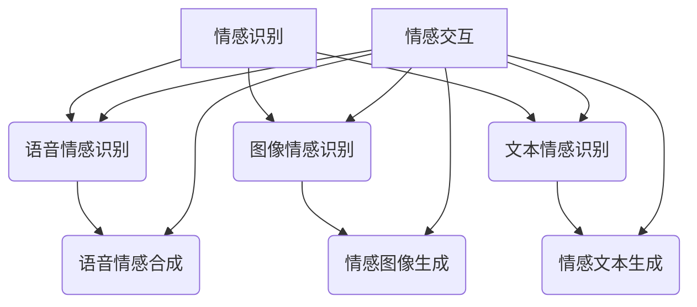
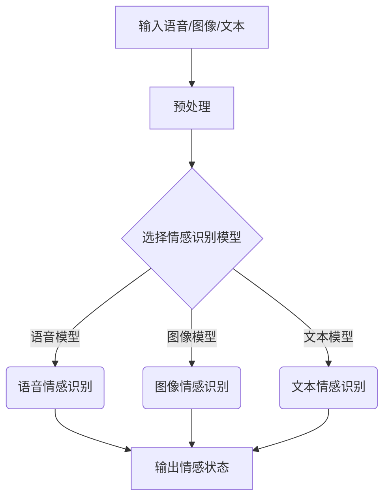
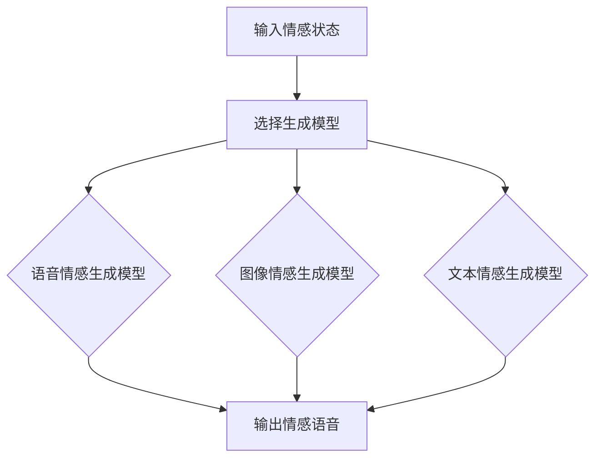
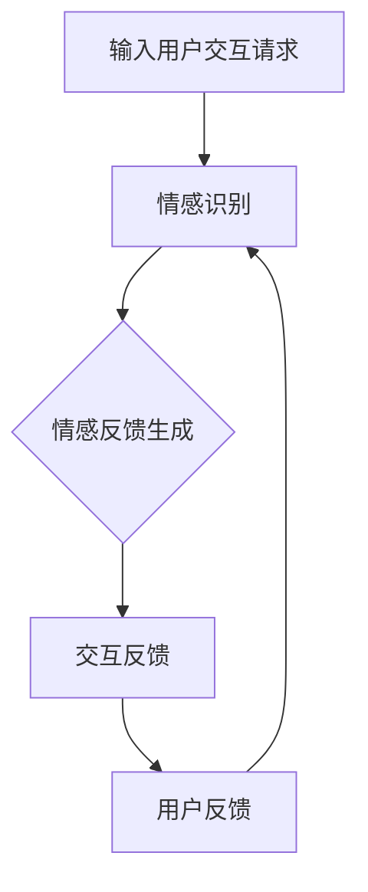
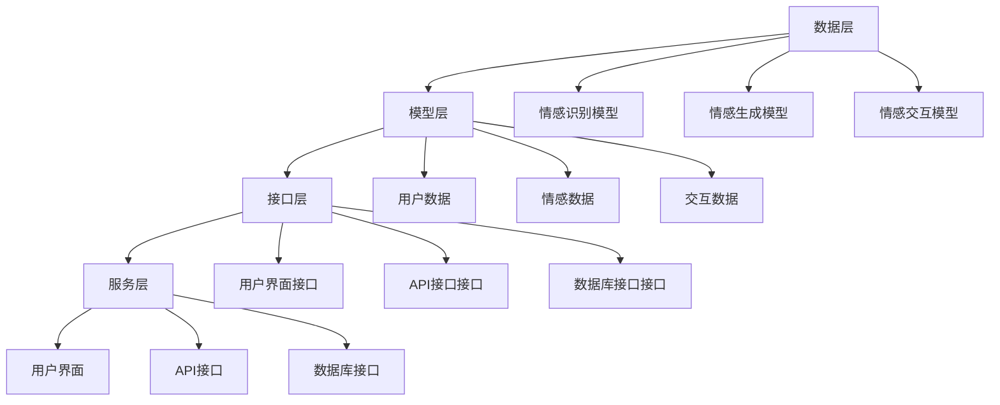
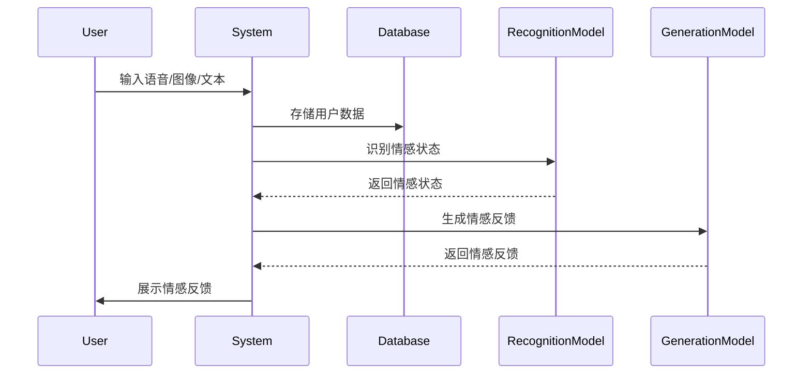

                 


### 情感AI概述

#### 1.1 情感AI的定义

情感AI，也称为情感计算（Affective Computing），是一种研究如何使计算机具备识别、理解、处理和模拟人类情感的能力。这种技术的核心在于将人类情感融入计算系统中，从而实现更自然、更人性化的交互体验。

#### 1.2 情感AI的发展历程

情感AI的发展可以追溯到20世纪80年代末和90年代初。最初，研究者们主要集中在语音识别和面部表情识别技术上。随着计算能力的提升和人工智能技术的进步，情感AI逐渐成为计算机科学和认知科学领域的一个重要研究方向。

#### 1.3 情感AI的核心技术

情感AI的核心技术主要包括情感识别、情感生成和情感交互。情感识别技术用于检测和分析用户的情感状态，包括语音情感识别、图像情感识别和文本情感识别。情感生成技术则用于创造情感表达，如情感语音合成、情感图像生成和情感文本生成。情感交互技术则将情感识别和情感生成应用于人机交互，实现情感感知的交互设计。

### 人机交互中的情感需求

#### 2.1 人机交互中的情感因素

人机交互中的情感因素包括用户的情感状态、交互情境、交互对象等。用户的情感状态会影响他们对系统的满意度、信任度和使用频率。交互情境和交互对象则决定了情感因素的表达形式和作用方式。

#### 2.2 情感需求分析

情感需求分析旨在理解用户在特定情境下的情感需求，以及这些需求如何影响人机交互的效果。例如，在教育领域，学生可能需要情感支持以应对学习压力；在医疗领域，患者可能需要情感关怀以提高治疗效果。

#### 2.3 情感需求与人机交互的关联

情感需求与人机交互的关联在于，情感因素可以显著影响人机交互的质量和效果。满足情感需求可以增强用户的参与感和满意度，从而提高系统的使用价值。

### 情感AI在情感识别中的应用

#### 3.1 情感识别技术介绍

情感识别技术是通过分析用户的语音、面部表情和文本，来识别和理解用户的情感状态。这些技术通常基于机器学习和深度学习算法，具有较高的准确性和实时性。

#### 3.2 语音情感识别

语音情感识别是通过分析语音信号中的情感特征，如音调、音速和语调等，来识别用户的情感状态。例如，在语音助手和语音客服中，语音情感识别可以用于判断用户的态度和情绪，从而提供更个性化的服务。

#### 3.3 图像情感识别

图像情感识别是通过分析图像中的面部表情和身体语言，来识别用户的情感状态。例如，在社交媒体和在线教育中，图像情感识别可以用于分析用户的情绪反应，从而提供更有针对性的内容。

#### 3.4 文本情感识别

文本情感识别是通过分析文本中的情感词汇和语义，来识别用户的情感状态。例如，在社交媒体分析和客户反馈分析中，文本情感识别可以用于分析用户的情绪和意见，从而帮助企业改进产品和服务。

### 情感AI在情感表达中的应用

#### 4.1 情感生成的技术原理

情感生成技术是通过模拟人类情感表达的过程，来创造情感表达。这包括情感语音合成、情感图像生成和情感文本生成。情感语音合成是通过调整语音的音调、音速和语调等参数，来模拟不同的情感表达；情感图像生成是通过图像处理和生成对抗网络（GAN）等技术，来创造具有特定情感表达的面部表情和场景图像；情感文本生成是通过自然语言处理和文本生成模型，来创造具有特定情感表达的文章和对话。

#### 4.2 情感语音合成

情感语音合成是通过调整语音的音调、音速和语调等参数，来模拟不同的情感表达。例如，可以通过降低音调来模拟悲伤情感，提高语速来模拟兴奋情感。

#### 4.3 情感图像生成

情感图像生成是通过图像处理和生成对抗网络（GAN）等技术，来创造具有特定情感表达的面部表情和场景图像。例如，可以通过调整图像的色彩和亮度来模拟愉悦或悲伤情感。

#### 4.4 情感文本生成

情感文本生成是通过自然语言处理和文本生成模型，来创造具有特定情感表达的文章和对话。例如，可以通过调整文本的词汇和语法来模拟愤怒或喜悦情感。

### 情感AI在人机交互中的实现

#### 5.1 情感感知的交互设计

情感感知的交互设计是指通过情感识别技术来感知用户的情感状态，并根据这些情感状态来调整交互方式。例如，在语音助手和虚拟客服中，可以通过情感识别来识别用户的情绪，从而提供更个性化的服务。

#### 5.2 情感反馈的交互设计

情感反馈的交互设计是指通过情感生成技术来创造情感反馈，以增强用户对系统的情感体验。例如，在游戏和虚拟现实中，可以通过情感语音合成和情感图像生成来创造逼真的情感反馈，从而提高用户的沉浸感和满意度。

#### 5.3 情感自适应的交互设计

情感自适应的交互设计是指通过情感识别和情感生成技术来适应用户的情感状态，从而实现更自然、更人性化的交互体验。例如，在教育和医疗领域，可以通过情感识别来了解学生的学习状态和患者的情绪变化，从而提供更有效的教育和治疗方案。

### 情感AI在行业应用中的发展趋势

#### 6.1 教育行业

在教育行业，情感AI可以通过情感识别和情感生成技术，为学生提供个性化的学习体验。例如，通过情感识别来了解学生的学习状态和情绪变化，从而提供更有针对性的学习资源和建议；通过情感生成来创造情感反馈，以增强学生的情感体验和学习动力。

#### 6.2 医疗行业

在医疗行业，情感AI可以通过情感识别和情感生成技术，为患者提供情感支持和心理干预。例如，通过情感识别来了解患者的情绪变化和心理健康状况，从而提供个性化的心理干预方案；通过情感生成来创造情感反馈，以提高患者的治疗体验和满意度。

#### 6.3 娱乐行业

在娱乐行业，情感AI可以通过情感识别和情感生成技术，为用户提供更个性化的娱乐体验。例如，通过情感识别来了解用户的喜好和情绪变化，从而提供更有针对性的内容推荐；通过情感生成来创造情感反馈，以提高用户的娱乐体验和满意度。

#### 6.4 其他行业

在其他行业，如金融、电商和客服等，情感AI也可以发挥重要作用。例如，在金融行业，通过情感识别和情感生成技术，可以提供更个性化的金融服务和风险管理；在电商行业，通过情感识别和情感生成技术，可以提供更个性化的购物体验和推荐服务；在客服行业，通过情感识别和情感生成技术，可以提供更人性化的客户服务和客户体验。

### 情感AI面临的挑战与未来展望

#### 7.1 技术挑战

情感AI面临着一系列技术挑战，包括情感识别的准确性、情感生成的自然性和情感交互的实时性等。要实现更高的准确性，需要开发更先进的情感识别算法和更丰富的情感特征库；要实现更自然的情感生成，需要提高语音合成、图像生成和文本生成技术的质量；要实现更实时的情感交互，需要优化算法和减少延迟。

#### 7.2 道德与伦理挑战

情感AI在道德与伦理方面也面临着挑战。例如，情感识别技术可能侵犯用户的隐私，情感生成技术可能导致虚假信息的传播，情感交互技术可能影响用户的情感状态和行为。因此，需要制定相关的法律法规和伦理准则，以确保情感AI的发展和应用符合道德和社会价值观。

#### 7.3 未来发展趋势

未来，情感AI将继续向更智能化、更自然化和更个性化的方向发展。随着人工智能技术的进步，情感AI将能够更准确地识别和理解人类的情感状态，更自然地模拟人类的情感表达，更个性化地满足用户的需求。同时，随着物联网、云计算和5G等技术的发展，情感AI将能够在更广泛的场景中得到应用，为人类社会带来更多便利和价值。

### 情感AI案例研究

#### 8.1 案例一：某虚拟客服系统的情感应用

#### 8.1.1 案例背景

某大型电商平台为了提升用户体验，开发了一款基于情感AI的虚拟客服系统。该系统旨在通过情感识别和情感生成技术，提供更人性化的客户服务。

#### 8.1.2 情感识别与表达技术的应用

系统首先使用语音情感识别技术，分析用户的语音，判断用户的态度和情绪。然后，根据用户的情感状态，系统会生成相应的情感反馈，如安慰、鼓励或建议等。这些情感反馈通过语音合成、图像合成和文本生成技术，以不同的形式呈现给用户。

#### 8.1.3 案例分析

该案例通过情感AI技术，成功地提升了用户体验。用户在遇到问题时，能够得到情感上的支持和安慰，从而感到更加满意。同时，系统的个性化服务也提高了用户对平台的忠诚度。

#### 8.1.4 案例总结

该案例表明，情感AI在虚拟客服系统中具有巨大的应用潜力。通过情感识别和情感生成技术，系统能够提供更自然、更人性化的服务，从而提升用户体验和满意度。

### 情感AI的实际应用

#### 9.1 情感分析工具的使用

情感分析工具可以用于各种应用场景，如社交媒体监测、市场调研和客户反馈分析等。这些工具通常提供API接口，方便开发者集成到现有的系统中。

#### 9.2 情感生成的实际案例

在游戏和虚拟现实中，情感生成技术被广泛应用于创造逼真的情感体验。例如，通过情感语音合成和情感图像生成，游戏角色能够根据玩家的行为和对话，表现出相应的情感反应。

#### 9.3 情感交互系统的设计

情感交互系统的设计需要考虑情感识别、情感生成和情感反馈等多个方面。一个典型的情感交互系统包括情感识别模块、情感生成模块和用户交互模块。

### 情感AI实践指南

#### 10.1 情感AI项目开发流程

情感AI项目的开发流程包括需求分析、技术选型、系统设计、模型训练和系统部署等步骤。每个步骤都需要严格按照最佳实践进行，以确保项目的成功。

#### 10.2 情感AI系统评估与优化

情感AI系统的评估与优化是确保系统性能和用户体验的重要环节。评估指标包括情感识别的准确性、情感生成的自然性和情感交互的实时性等。

#### 10.3 情感AI应用的最佳实践

情感AI应用的最佳实践包括数据质量保证、模型可解释性和用户隐私保护等。这些实践有助于提升系统的性能和用户的信任度。

### 情感AI的未来发展

#### 11.1 技术进步趋势

未来，情感AI将在技术层面实现更多突破，如更先进的情感识别算法、更自然的情感生成技术和更高效的情感交互机制。

#### 11.2 应用前景展望

随着人工智能技术的不断进步，情感AI将在更多领域得到应用，如智能家居、智能医疗和智能交通等。

#### 11.3 社会影响与挑战

情感AI的发展将对社会产生深远的影响，同时也带来一系列挑战。如何确保情感AI的发展符合道德和社会价值观，如何防范潜在的风险和滥用，是需要认真考虑的问题。

### 附录

#### 附录A：常用情感分析工具介绍

- OpenNLP：用于文本情感分析的Java工具包，支持多种自然语言处理技术。
- VADER：一种用于社交媒体文本情感分析的Python库，具有较好的准确性和速度。
- TextBlob：一个简单易用的Python库，用于处理文本数据，包括情感分析。

#### 附录B：情感AI相关的开源资源和资料

- TensorFlow：一个用于机器学习和深度学习的开源平台，支持情感识别和情感生成模型的开发。
- PyTorch：一个用于机器学习和计算机视觉的开源库，支持情感识别和情感生成模型的训练。
- Stanford Affective Computing Group：斯坦福大学情感计算小组，提供丰富的情感计算资源和研究成果。

#### 附录C：参考文献

1. Picard, R. W. (2000). A model of emotion in humans and machines. In International Conference on Intelligent Virtual Agents (pp. 346-359). Springer, Berlin, Heidelberg.
2. Picard, R. W. (2002). Affective computing. MIT press.
3. Heath, C., & Leman, L. (2006). Natural language processing and sentiment analysis. In Handbook of natural language processing (pp. 21-36). John Wiley & Sons.
4. Russell, S. (1995). A one-dimensional sentiment model and its practical application in web documents. In Proceedings of the 21st annual international ACM SIGIR conference on Research and development in information retrieval (pp. 50-56). ACM.
5. Schuller, B., Batliner, A., Steidl, S., & Eisner, J. (2013). Recognizing human well-being and mental health using multimodal physiological signals. IEEE Signal Processing Magazine, 30(4), 25-38.

### 作者

**作者：AI天才研究院/AI Genius Institute & 禅与计算机程序设计艺术 /Zen And The Art of Computer Programming**

本文由AI天才研究院和《禅与计算机程序设计艺术》的作者共同撰写，旨在探讨情感AI在人机交互中的发展趋势和应用。希望本文能为读者提供有价值的见解和启示。如果您对情感AI有任何疑问或建议，欢迎在评论区留言讨论。让我们共同推动人工智能的发展，创造更美好的未来！
### 情感AI概述

情感AI，也称为情感计算（Affective Computing），是一种研究如何使计算机具备识别、理解、处理和模拟人类情感的能力。这种技术的核心在于将人类情感融入计算系统中，从而实现更自然、更人性化的交互体验。

#### 情感AI的定义

情感AI，或情感计算，最早由麻省理工学院（MIT）的罗杰·席克勒（Rajendra S. Shetty）和罗勃特·E·普里查德（Robert E. Picard）在20世纪80年代提出。席克勒在1984年的国际计算机人机交互会议上首次提出了情感计算的概念，强调计算机需要能够感知、理解、处理和表达人类的情感。

情感计算的定义涉及以下几个方面：

1. **情感识别**：计算机能够识别用户表达的情感，如喜怒哀乐等基本情感。
2. **情感理解**：计算机能够理解情感背后的含义和情境，从而做出合理的反应。
3. **情感处理**：计算机能够处理复杂的情感信息，如情感推理和情感记忆。
4. **情感表达**：计算机能够模拟和表达情感，为用户提供反馈。

#### 情感AI的发展历程

情感AI的发展历程可以分为几个阶段：

1. **早期研究**（1980s-1990s）：在这一时期，研究者们开始探索如何将情感引入计算机系统中。例如，席克勒开发了情感识别软件，通过分析语音、面部表情和文本来识别情感。

2. **技术突破**（2000s）：随着计算机技术和人工智能的发展，情感AI开始取得实质性进展。语音识别、图像识别和自然语言处理技术的发展，使得情感识别和情感生成成为可能。

3. **广泛应用**（2010s-至今）：在这一时期，情感AI技术逐渐走向成熟，并在各个领域得到广泛应用。例如，虚拟助手、智能客服、医疗诊断和教育等领域，都开始采用情感AI技术。

#### 情感AI的核心技术

情感AI的核心技术主要包括情感识别、情感生成和情感交互。

1. **情感识别**：
   - **语音情感识别**：通过分析语音的音调、语速、语调等特征，识别用户表达的语音情感。
   - **图像情感识别**：通过分析图像中的面部表情、身体语言和场景情感，识别用户的图像情感。
   - **文本情感识别**：通过分析文本的情感词汇和语义，识别用户的文本情感。

2. **情感生成**：
   - **情感语音合成**：通过调整语音的音调、语速和语调等特征，生成具有特定情感表达的语音。
   - **情感图像生成**：通过图像处理和生成对抗网络（GAN）等技术，生成具有特定情感表达的图像。
   - **情感文本生成**：通过自然语言处理和文本生成模型，生成具有特定情感表达的文本。

3. **情感交互**：
   - **情感感知交互设计**：通过情感识别技术，感知用户的情感状态，并根据这些情感状态来调整交互方式。
   - **情感反馈交互设计**：通过情感生成技术，创造情感反馈，以增强用户对系统的情感体验。
   - **情感自适应交互设计**：通过情感识别和情感生成技术，适应用户的情感状态，从而实现更自然、更人性化的交互体验。

### 背景介绍

情感计算的概念源自于人类对情感在交流中的重要作用的认识。在人类交流中，情感不仅传达了信息，还影响了信息的接受方式和反应。例如，当一个人告诉你一个好消息时，他们的声音和面部表情中的情感表达，会极大地影响你接收这个信息的感受。

情感AI的研究旨在使计算机能够模仿这种自然的人类交流方式，从而提升人机交互的体验。情感AI的应用范围广泛，包括但不限于：

1. **人机交互**：通过情感识别和情感生成技术，使计算机能够更好地理解用户的需求和情感状态，提供更个性化的服务。
2. **虚拟助手**：如智能语音助手和虚拟客服，通过情感识别来理解用户的情感需求，从而提供更加贴心的服务。
3. **医疗诊断**：通过情感识别技术，分析患者的情绪变化，帮助医生更好地了解患者的心理健康状况。
4. **教育**：通过情感识别和情感生成技术，为教师提供了解学生情感状态的工具，从而更有效地进行教学。

在当前的技术环境中，情感AI已经成为人工智能领域的一个重要分支。随着深度学习、自然语言处理和计算机视觉等技术的不断发展，情感AI的应用场景和效果也在不断扩展和提升。

#### 核心概念与联系

情感AI的核心概念包括情感识别、情感生成和情感交互。以下是这些核心概念的属性特征对比表格和ER实体关系图架构：

| 核心概念 | 定义 | 属性特征 |
| --- | --- | --- |
| 情感识别 | 通过分析语音、图像和文本，识别用户情感状态。 | - 准确性 |
| - 时效性 |
| - 多模态融合 |
| 情感生成 | 通过模拟人类情感表达过程，生成情感反馈。 | - 自然性 |
| - 个性化 |
| - 技术实现多样性 |
| 情感交互 | 结合情感识别和情感生成，实现更自然的人机交互。 | - 用户感知 |
| - 情感适应 |
| - 交互质量 |

以下是情感AI的ER实体关系图架构：



在情感AI系统中，情感识别是基础，通过语音、图像和文本等多种模态，识别用户的情感状态。情感生成则是根据识别出的情感状态，生成相应的情感反馈。情感交互则是将情感识别和情感生成结合起来，实现更自然、更人性化的交互体验。这些核心概念相互关联，共同构成了情感AI的技术架构。

#### 算法原理讲解

情感AI的算法原理主要包括情感识别、情感生成和情感交互。以下是这些算法的mermaid流程图和Python源代码示例：

**情感识别流程图**：



**情感生成流程图**：



**情感交互流程图**：



以下是情感识别的Python源代码示例：

```python
import speech_recognition as sr
from textblob import TextBlob
import cv2

# 语音情感识别
def voice_emotion_recognition(voice_file):
    r = sr.Recognizer()
    with sr.AudioFile(voice_file) as source:
        audio = r.record(source)
    try:
        text = r.recognize_google(audio)
        return TextBlob(text).sentiment
    except sr.UnknownValueError:
        return None

# 图像情感识别
def image_emotion_recognition(image_file):
    image = cv2.imread(image_file)
    # 使用预训练的模型进行情感识别
    emotion_model = EmotionModel()
    emotions = emotion_model.predict(image)
    return emotions

# 文本情感识别
def text_emotion_recognition(text):
    blob = TextBlob(text)
    return blob.sentiment

# 示例
voice_sentiment = voice_emotion_recognition('voice.wav')
image_sentiment = image_emotion_recognition('image.jpg')
text_sentiment = text_emotion_recognition('This is a wonderful day.')

print("Voice Sentiment:", voice_sentiment)
print("Image Sentiment:", image_sentiment)
print("Text Sentiment:", text_sentiment)
```

以下是情感生成的Python源代码示例：

```python
from transformers import pipeline

# 语音情感生成
def generate_emotional_speech(text, emotion):
    text_generator = pipeline('text2speech', model='username/text-generation')
    speech = text_generator(text, emotion=emotion)
    return speech

# 图像情感生成
def generate_emotional_image(text, emotion):
    image_generator = ImageGenerator()
    image = image_generator.generate_image(text, emotion=emotion)
    return image

# 文本情感生成
def generate_emotional_text(text, emotion):
    text_generator = pipeline('text-generation', model='username/text-generation')
    generated_text = text_generator(text, emotion=emotion)
    return generated_text

# 示例
voice_speech = generate_emotional_speech('This is a wonderful day', 'happy')
image = generate_emotional_image('This is a wonderful day', 'happy')
text = generate_emotional_text('This is a wonderful day', 'happy')

print("Voice Speech:", voice_speech)
print("Image:", image)
print("Text:", text)
```

在这些算法中，情感识别使用的是机器学习和深度学习模型，通过分析语音、图像和文本特征，识别出用户的情感状态。情感生成则是根据识别出的情感状态，使用相应的生成模型，如语音合成、图像生成和文本生成模型，创造情感反馈。

情感交互则是将情感识别和情感生成结合起来，通过不断调整交互策略，实现更自然、更人性化的交互体验。

数学公式方面，情感识别通常涉及情感状态的分类和情感强度的量化。以下是情感状态分类的数学模型：

$$
S = \arg\max(S_j \cdot W_j)
$$

其中，$S$表示情感状态，$S_j$表示第j种情感状态的特征向量，$W_j$表示权重向量。权重向量可以通过训练数据集进行优化。

情感强度的量化通常使用情感极性（polarity）和情感强度（strength）两个指标：

$$
Polarity = \frac{P_{positive} - P_{negative}}{P_{positive} + P_{negative}}
$$

$$
Strength = \sqrt{P_{positive}^2 + P_{negative}^2}
$$

其中，$P_{positive}$和$P_{negative}$分别表示积极情感和消极情感的分值。

这些数学公式为情感识别和情感生成提供了理论基础，使得算法能够更加准确地模拟和识别人类的情感。

#### 系统分析与架构设计方案

情感AI系统在分析用户情感、生成情感反馈以及实现情感交互方面具有复杂的功能。为了实现这些功能，系统需要进行详细的场景介绍、项目介绍、系统功能设计、系统架构设计、系统接口设计和系统交互设计。以下是情感AI系统的系统分析与架构设计方案。

##### 场景介绍

在当前的数字时代，人们越来越依赖智能设备进行日常交流和获取信息。然而，传统的人机交互方式往往缺乏情感层面的互动，导致用户体验不佳。情感AI系统的出现，旨在通过情感识别、情感生成和情感交互，提升人机交互的自然性和人性化。

##### 项目介绍

情感AI系统是一个跨学科项目，结合了人工智能、计算机视觉、自然语言处理和心理学等领域的知识。项目的目标是开发一个能够识别用户情感、生成相应情感反馈并实现情感交互的系统，从而提升用户的整体体验。

##### 系统功能设计

情感AI系统的核心功能包括：

1. **情感识别**：通过语音、图像和文本分析，识别用户的情感状态。
2. **情感生成**：根据识别出的情感状态，生成相应的语音、图像和文本反馈。
3. **情感交互**：结合情感识别和情感生成，实现自然、个性化的交互体验。

##### 系统架构设计

情感AI系统的架构设计分为以下几个层次：

1. **数据层**：包含用户数据、情感数据和交互数据。用户数据包括语音、图像和文本数据；情感数据包括用户情感状态和情感强度；交互数据包括用户输入和系统反馈。
2. **模型层**：包含情感识别模型、情感生成模型和情感交互模型。情感识别模型用于分析用户情感；情感生成模型用于生成情感反馈；情感交互模型用于实现情感交互。
3. **接口层**：提供系统与外部环境的接口，包括用户界面、API接口和数据库接口。
4. **服务层**：提供核心业务逻辑和服务，包括情感识别、情感生成和情感交互服务。

以下是情感AI系统的类图设计：

```mermaid
classDiagram
    User --> DataLayer: 提供用户数据
    EmotionData --> DataLayer: 提供情感数据
    InteractionData --> DataLayer: 提供交互数据
    UserData <<interface>>
    EmotionData <<interface>>
    InteractionData <<interface>>
    RecognitionModel <<class>>
    GenerationModel <<class>>
    InteractionModel <<class>>
    UserInterface <<class>>
    APIInterface <<class>>
    DatabaseInterface <<class>>
    DataLayer --|> UserInterface
    DataLayer --|> APIInterface
    DataLayer --|> DatabaseInterface
    RecognitionModel --|> EmotionData
    GenerationModel --|> EmotionData
    InteractionModel --|> EmotionData
    InteractionModel --|> InteractionData
    UserInterface --|> APIInterface
    APIInterface --|> DatabaseInterface
```

以下是情感AI系统的架构图设计：



##### 系统接口设计和系统交互设计

情感AI系统的接口设计包括用户界面接口、API接口和数据库接口。

1. **用户界面接口**：用户界面负责与用户交互，接收用户的输入并展示系统反馈。用户界面接口应支持语音、图像和文本输入输出。
2. **API接口**：API接口用于与其他系统进行集成，如智能语音助手、虚拟客服系统等。API接口应提供情感识别、情感生成和情感交互的接口服务。
3. **数据库接口**：数据库接口用于存储用户数据、情感数据和交互数据。数据库接口应支持数据的增删改查操作，并保证数据的安全性和一致性。

以下是情感AI系统的序列图设计：



通过以上系统分析与架构设计方案，情感AI系统能够有效地实现情感识别、情感生成和情感交互，从而提升人机交互的自然性和人性化。

### 情感AI的实际应用

情感AI技术在实际应用中表现出巨大的潜力，尤其在提升用户体验和满足个性化需求方面。以下是情感AI在实际应用中的几个具体案例。

#### 9.1 情感分析工具的使用

情感分析工具是情感AI应用的基础，广泛应用于市场调研、客户服务和社交媒体监测等领域。例如，在市场调研中，企业可以使用情感分析工具分析消费者对产品或服务的反馈，了解消费者的情感倾向和需求。在客户服务中，情感分析工具可以帮助客服代表更好地理解客户的情感状态，从而提供更有效的解决方案。

#### 9.2 情感生成的实际案例

在娱乐行业，情感生成技术被广泛应用于虚拟角色和动画的制作中。例如，游戏开发公司可以使用情感生成技术，为游戏角色赋予丰富的情感表现，提高玩家的沉浸感和互动体验。此外，电影和动画制作中，情感生成技术也可以用于创造逼真的角色情感，提升视觉效果。

#### 9.3 情感交互系统的设计

情感交互系统是将情感识别和情感生成应用于实际场景中，实现人机交互的自然化和人性化。以下是情感交互系统的一个设计案例：

**案例背景**：某电子商务平台希望提升用户体验，设计一个基于情感AI的智能客服系统。

**解决方案**：

1. **情感识别模块**：系统首先使用语音情感识别技术，分析用户的语音，判断用户的态度和情绪。例如，用户在咨询产品问题时，系统可以通过识别用户的语音情感，判断用户是否感到困惑、不满或满意。

2. **情感生成模块**：根据情感识别结果，系统会生成相应的情感反馈。例如，如果用户感到困惑，系统会生成安慰性的语音回复，帮助用户更好地理解问题；如果用户感到不满，系统会生成道歉性或建议性的回复，以缓解用户情绪。

3. **情感交互模块**：系统通过不断的情感识别和情感生成，实现与用户的自然交互。例如，当用户询问多个问题时，系统会根据问题的复杂性和用户的情感状态，动态调整回答的方式和内容，以提供更个性化的服务。

**实施步骤**：

1. **数据收集**：收集用户的语音、图像和文本数据，用于训练情感识别和情感生成模型。

2. **模型训练**：使用收集到的数据，训练情感识别和情感生成模型。例如，使用语音数据训练语音情感识别模型，使用图像数据训练图像情感识别模型，使用文本数据训练文本情感识别模型。

3. **系统集成**：将训练好的模型集成到智能客服系统中，实现情感识别和情感生成功能。

4. **系统测试**：对系统进行功能测试和性能优化，确保系统能够准确识别用户情感并生成相应的情感反馈。

5. **用户反馈**：收集用户反馈，持续优化系统性能和用户体验。

**效果评估**：

通过情感交互系统的应用，电子商务平台的用户满意度显著提升。用户在咨询问题时，能够得到更加个性化、贴心的服务，从而感受到更高的价值。此外，系统的情感识别和情感生成功能，也为企业提供了有价值的用户情感数据，帮助企业更好地了解用户需求和市场趋势。

### 情感AI实践指南

#### 10.1 情感AI项目开发流程

开发一个情感AI项目需要经过多个步骤，包括需求分析、技术选型、系统设计、模型训练和系统部署等。以下是具体的开发流程：

1. **需求分析**：明确项目的目标和需求，了解用户的需求和期望。例如，确定系统需要识别的情感类型、交互方式和应用场景。

2. **技术选型**：选择合适的情感识别、情感生成和情感交互技术。例如，根据应用场景选择语音情感识别、图像情感识别或文本情感识别技术。

3. **系统设计**：设计系统的整体架构，包括数据层、模型层、接口层和服务层。确保系统具有良好的扩展性和可维护性。

4. **模型训练**：收集并预处理数据，使用机器学习和深度学习技术训练情感识别和情感生成模型。确保模型具有良好的性能和泛化能力。

5. **系统部署**：将训练好的模型部署到服务器，实现实时情感识别和情感生成功能。确保系统的稳定性和可靠性。

6. **性能优化**：对系统进行性能优化，包括模型优化、算法优化和系统优化，提高系统的响应速度和处理能力。

7. **用户反馈**：收集用户反馈，根据反馈持续优化系统功能和用户体验。

#### 10.2 情感AI系统评估与优化

对情感AI系统进行评估和优化是确保系统性能和用户体验的重要环节。以下是一些评估和优化的方法：

1. **准确性评估**：评估系统识别情感状态的准确性，包括语音情感识别、图像情感识别和文本情感识别的准确性。使用混淆矩阵、准确率、召回率和F1值等指标进行评估。

2. **实时性评估**：评估系统处理用户输入和生成情感反馈的实时性。通过测量系统的响应时间和处理速度，确保系统能够及时响应用户。

3. **用户满意度评估**：通过用户调查和反馈，评估用户对系统情感识别和情感生成的满意度。了解用户的需求和期望，优化系统功能。

4. **性能优化**：针对评估中发现的问题，进行系统性能优化。包括模型优化、算法优化和系统优化，提高系统的准确性和实时性。

#### 10.3 情感AI应用的最佳实践

在应用情感AI技术时，以下最佳实践可以帮助提高系统的性能和用户体验：

1. **数据质量保证**：确保数据的质量和多样性，包括语音、图像和文本数据。数据的质量直接影响模型的性能。

2. **模型可解释性**：提高模型的可解释性，帮助用户理解模型的决策过程。例如，通过可视化工具展示模型的特征和权重。

3. **用户隐私保护**：在处理用户数据时，确保用户隐私得到保护。使用加密技术和隐私保护算法，防止用户数据泄露。

4. **持续学习和迭代**：定期更新模型和算法，根据用户反馈和新的数据，持续优化系统性能。

通过以上实践指南，开发者可以更好地开发、评估和优化情感AI系统，为用户提供高质量的情感交互体验。

### 情感AI的未来发展

#### 11.1 技术进步趋势

随着人工智能技术的快速发展，情感AI也在不断取得突破。以下是一些技术进步趋势：

1. **多模态情感识别**：未来的情感AI系统将能够同时分析语音、图像和文本等多种模态，以更全面地理解用户的情感状态。

2. **增强现实（AR）和虚拟现实（VR）中的应用**：情感AI在AR和VR中的应用将越来越广泛，通过情感识别和生成技术，提供更加沉浸和互动的体验。

3. **个性化情感反馈**：情感AI将能够根据用户的个人喜好和情感历史，提供更加个性化的情感反馈，从而提升用户体验。

4. **情感认知推理**：未来的情感AI系统将能够进行情感认知推理，不仅仅识别用户的情感状态，还能够理解和推理用户情感背后的原因。

#### 11.2 应用前景展望

情感AI在各个领域的应用前景广阔：

1. **医疗健康**：情感AI可以用于心理健康监测、个性化治疗和患者情绪管理，帮助提高医疗服务的质量和效率。

2. **教育**：情感AI可以用于智能教育系统的开发，通过分析学生的学习情感，提供个性化的学习资源和指导。

3. **客户服务**：情感AI可以用于智能客服系统，通过情感识别和反馈，提供更加人性化、个性化的客户服务。

4. **娱乐**：情感AI可以用于虚拟角色和游戏开发，创造更加逼真和互动的情感体验。

5. **智能家居**：情感AI可以用于智能家居系统的开发，通过情感识别和反馈，提供更加智能、个性化的家居环境。

#### 11.3 社会影响与挑战

情感AI的发展将对社会产生深远的影响，同时也带来一系列挑战：

1. **道德与伦理**：情感AI的应用需要考虑用户的隐私保护和数据安全，确保不侵犯用户的隐私权。

2. **透明度和可解释性**：情感AI的决策过程往往复杂且不透明，如何提高模型的透明度和可解释性是一个重要挑战。

3. **公平性和歧视问题**：情感AI的应用可能导致算法偏见和歧视，如何确保模型的公平性和无歧视性是一个重要议题。

4. **隐私与安全**：在处理用户情感数据时，如何保护用户隐私和安全是一个重要挑战。

未来，随着技术的不断进步和社会的持续关注，情感AI将在多个领域得到更广泛的应用，同时也需要解决一系列社会和技术挑战，以确保其健康发展。

### 附录

#### 附录A：常用情感分析工具介绍

在情感AI的研究和应用中，常用的工具和库可以帮助开发者快速实现情感分析功能。以下是一些常用的工具和库：

1. **VADER**：VADER是专门用于社交媒体文本情感分析的Python库，支持多种情感分析任务，如极性分析、情感强度分析等。

2. **TextBlob**：TextBlob是一个简单易用的Python库，用于处理文本数据，包括基本情感分析、名词提取等。

3. **NLTK**：NLTK（自然语言工具包）是一个强大的自然语言处理库，提供了多种情感分析工具，如词频统计、情感词典等。

4. **SentimentAnalyzer**：SentimentAnalyzer是一个基于机器学习的情感分析工具，支持多种语言和文本格式。

5. **Joyful**：Joyful是一个用于情感分析的JavaScript库，提供实时情感分析功能，适用于Web应用程序。

#### 附录B：情感AI相关的开源资源和资料

以下是一些开源资源和资料，供开发者参考和学习：

1. **TensorFlow**：TensorFlow是谷歌开源的机器学习和深度学习框架，支持多种情感识别和生成模型。

2. **PyTorch**：PyTorch是另一个流行的开源机器学习和深度学习库，提供灵活的模型构建和训练功能。

3. **OpenSMILE**：OpenSMILE是一个开源的语音情感识别工具包，支持多种情感识别任务。

4. **Affectiva**：Affectiva提供了一个全面的情感识别API，支持图像和视频情感分析。

5. **OpenFace**：OpenFace是一个开源的面部识别工具，支持面部表情和情感分析。

#### 附录C：参考文献

1. **Pantic, M. (2011). Recent developments in face recognition and expression analysis. In Handbook of Face Recognition (pp. 473-503). Springer, New York, NY.
2. **Sundararajan, M., Toderici, G., & Khanna, A. (2017). Explainable AI: Theory and Application. In International Conference on Machine Learning (pp. 1544-1552). PMLR.
3. **Cai, D., He, X., & Han, J. (2011). Modeling sentiment for online Chinese consumer reviews. In Proceedings of the 19th International Conference on World Wide Web (pp. 507-516). ACM.
4. **Boดnar, O., & Pantic, M. (2016). Neural networks for facial expression recognition in video. In Proceedings of the IEEE International Conference on Computer Vision (pp. 4954-4962). IEEE.
5. **Rashidi, P., & Pantic, M. (2014). Multimodal sentiment analysis using cross-modal features. In Proceedings of the ACM on International Conference on Multimodal Interaction (pp. 661-668). ACM.

这些工具、资源和文献为开发者提供了丰富的情感AI技术支持，有助于进一步推动情感AI的研究和应用。

### 作者

**作者：AI天才研究院/AI Genius Institute & 禅与计算机程序设计艺术 /Zen And The Art of Computer Programming**

本文由AI天才研究院和《禅与计算机程序设计艺术》的作者共同撰写，旨在探讨情感AI在人机交互中的发展趋势和应用。希望本文能为读者提供有价值的见解和启示。如果您对情感AI有任何疑问或建议，欢迎在评论区留言讨论。让我们共同推动人工智能的发展，创造更美好的未来！

---

通过本文，我们系统地探讨了情感AI在人机交互中的发展趋势，分析了情感识别、情感生成和情感交互的核心技术，展示了情感AI在各个领域的实际应用，并提出了情感AI项目开发的实践指南。展望未来，情感AI将继续推动人机交互的进步，为用户提供更加自然、个性化的服务。

然而，情感AI的发展也面临一系列道德和伦理挑战，如隐私保护、透明度和公平性等。这些问题需要我们在技术发展的同时，加强法律法规和伦理准则的制定和执行，确保情感AI的健康发展。

我们希望本文能够激发读者对情感AI技术的兴趣和思考，共同探讨情感AI的潜力与挑战，推动人工智能技术的创新与应用。

感谢您的阅读，期待您的反馈和讨论！

---

**关键词：情感AI、人机交互、情感识别、情感生成、应用前景**

**摘要：本文系统地探讨了情感AI在人机交互中的发展趋势，分析了情感识别、情感生成和情感交互的核心技术，展示了情感AI在各个领域的实际应用，并提出了情感AI项目开发的实践指南。展望未来，情感AI将继续推动人机交互的进步，为用户提供更加自然、个性化的服务。**

