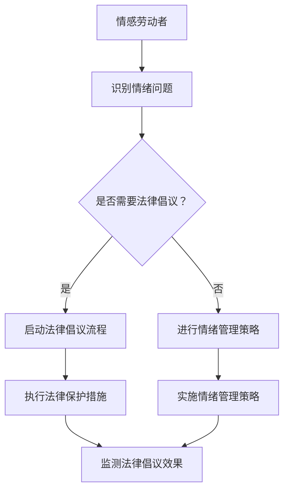

                 

### 情感劳动权益保护运动：职场情绪管理的法律倡议

---

#### 关键词：情感劳动、劳动权益、职场情绪管理、法律倡议、职场心理健康

> 摘要：本文深入探讨了情感劳动权益保护运动在职场中的重要性，分析了职场情绪管理的现状和挑战。通过法律框架的解析和实际案例分享，提出了有效的职场情绪管理法律倡议，旨在为情感劳动者提供全面的保护，提升职场心理健康水平。

---

### 背景介绍

#### 1.1 问题背景

**核心概念：** 情感劳动、劳动权益、职场情绪管理

**问题描述：** 在现代职场中，情感劳动者如心理咨询师、客服代表、教师等面临着高度的情绪压力，这些情绪问题不仅影响个人的心理健康，也对劳动权益产生了负面影响。因此，如何通过有效的职场情绪管理来保护情感劳动者的权益成为一个亟待解决的问题。

**问题解决：** 为了解决这一问题，需要通过法律倡议来推动职场情绪管理的改善，为情感劳动者提供法律保护和心理健康支持。

**边界与外延：** 本文讨论的职场情绪管理主要针对情感劳动者，包括情感服务、心理咨询等领域。劳动权益的保护范围涉及劳动合同、福利待遇、职业发展等方面。

**概念结构与核心要素组成：**

- **情感劳动：** 情感劳动者在工作过程中需要处理大量的情感问题，如心理咨询师需要倾听和解决客户的情感困扰，客服代表需要处理客户的不满情绪等。
- **劳动权益：** 劳动者依法享有的权益，包括工资、福利、职业发展等。在职场情绪管理中，劳动权益的保护尤为重要。
- **职场情绪管理：** 涉及如何处理和应对职场中的情绪问题，包括情绪认知、情绪调节、情绪应对等方面。

#### 1.2 核心概念与联系

**情感劳动：** 情感劳动者的工作内容、面临的挑战及如何提升情感劳动者的职业素养。

**劳动权益：** 劳动权益的内涵、法律保护、现状及存在的问题。

**职场情绪管理：** 职场情绪管理的理论框架、实用技巧及案例分享。

在接下来的章节中，我们将分别对这三个核心概念进行深入探讨，分析它们在职场情绪管理中的联系和作用。

#### 1.3 职场情绪管理的重要性

**核心概念：** 职场情绪管理的重要性，包括对个人、团队、组织的影响。

**概念属性特征对比表格：**

- **个人层面：**
  - **心理健康：** 职场情绪管理有助于提高情感劳动者的心理健康水平，减轻工作压力。
  - **工作效率：** 情绪稳定的工作者能够更好地集中注意力，提高工作效率。
  - **职业发展：** 职场情绪管理有助于提升情感劳动者的职业素养，促进职业发展。

- **团队层面：**
  - **团队协作：** 良好的情绪管理能够促进团队成员之间的有效沟通和协作。
  - **团队氛围：** 情绪稳定的工作环境有助于营造积极向上的团队氛围。
  - **团队绩效：** 职场情绪管理对团队绩效的提升有显著作用。

- **组织层面：**
  - **组织文化：** 情绪管理有助于建立积极、健康的组织文化。
  - **员工满意度：** 职场情绪管理能够提高员工的满意度和归属感。
  - **组织效率：** 良好的职场情绪管理能够提高整个组织的运行效率。

通过上述对比表格，我们可以看出职场情绪管理在个人、团队和组织层面都具有重要的意义。接下来，我们将进一步探讨情感劳动权益保护的法律框架，为职场情绪管理的有效实施提供法律支持。

#### 1.4 情感劳动权益保护的法律框架

**核心概念：** 我国相关法律、法规及政策对情感劳动权益保护的规定。

**概念属性特征对比表格：**

- **法律法规：**
  - **劳动合同法：** 明确规定劳动者的权益，包括工资、福利、职业安全等方面。
  - **妇女权益保障法：** 保护女性劳动者的权益，特别是情感劳动者的权益。
  - **职业病防治法：** 规定职业病防治措施，保护劳动者的身体健康。

- **政策文件：**
  - **劳动部文件：** 发布一系列政策指导文件，如《关于进一步加强企业情感劳动权益保护的意见》等。
  - **妇联文件：** 提出具体措施，如加强情感劳动者培训、提升情感劳动者的待遇等。

这些法律和政策文件为情感劳动者的权益保护提供了法律依据和指导，为职场情绪管理的实施提供了保障。接下来，我们将探讨如何通过法律倡议来推动职场情绪管理的改善。

#### 1.5 职场情绪管理的法律倡议

**核心概念：** 通过法律倡议来推动职场情绪管理的改善。

**ER实体关系图架构：**

- **实体：**
  - **劳动者：** 情感劳动者，包括心理咨询师、客服代表、教师等。
  - **用人单位：** 职场中的雇主，负责提供工作环境和心理支持。
  - **政府监管机构：** 负责监管劳动市场的法律执行和职场情绪管理的实施。

- **关系：**
  - **劳动关系：** 劳动者与用人单位之间的法律关系，包括劳动合同、工资待遇等。
  - **法律监管：** 政府监管机构对职场情绪管理的监督和指导。
  - **社会责任：** 用人单位应承担的社会责任，包括提供心理健康支持、营造良好的工作氛围等。

通过ER实体关系图，我们可以清晰地看到劳动者、用人单位和政府监管机构之间的关系，以及法律倡议在推动职场情绪管理中的作用。接下来，我们将进一步探讨算法原理和数学模型，为职场情绪管理的有效实施提供技术支持。

#### 1.6 算法原理讲解

**算法mermaid流程图：**



**Python源代码：**

```python
def emotion_management(employee):
    # 识别情绪问题
    if employee.has_emotional_issue():
        # 是否需要法律倡议
        if employee.needs_legal_initiative():
            # 启动法律倡议流程
            employee.start_legal_initiative()
            # 执行法律保护措施
            employee.execute_legal_protections()
            # 监测法律倡议效果
            employee.monitor_legal_effect()
        else:
            # 进行情绪管理策略
            employee.perform_emotional_management()
            # 监测情绪管理效果
            employee.monitor_emotional_management()
    else:
        # 无需处理
        print("Employee is emotionally stable.")

class Employee:
    def __init__(self, name):
        self.name = name
        self.has_emotional_issue = False
        self.needs_legal_initiative = False

    def has_emotional_issue(self):
        # 识别情绪问题的具体实现
        # ...
        pass

    def needs_legal_initiative(self):
        # 是否需要法律倡议的具体实现
        # ...
        pass

    def start_legal_initiative(self):
        # 启动法律倡议流程的具体实现
        # ...
        pass

    def execute_legal_protections(self):
        # 执行法律保护措施的具体实现
        # ...
        pass

    def monitor_legal_effect(self):
        # 监测法律倡议效果的具体实现
        # ...
        pass

    def perform_emotional_management(self):
        # 进行情绪管理策略的具体实现
        # ...
        pass

    def monitor_emotional_management(self):
        # 监测情绪管理效果的具体实现
        # ...
        pass

# 创建情感劳动者实例
employee = Employee("张三")
# 执行情绪管理流程
emotion_management(employee)
```

**算法原理：**

该算法通过识别情感劳动者的情绪问题，判断是否需要法律倡议。如果需要，则启动法律倡议流程，执行法律保护措施，并监测法律倡议的效果。如果不需要法律倡议，则进行情绪管理策略，并监测情绪管理的效果。

**数学模型和公式：**

- **情感问题识别模型：**
  $$ R = f(E, M) $$
  其中，$R$ 表示情感问题的识别结果，$E$ 表示情感劳动者的情绪状态，$M$ 表示情绪管理策略。

- **法律倡议效果模型：**
  $$ E' = f(L, R) $$
  其中，$E'$ 表示法律倡议后的情绪状态，$L$ 表示法律倡议，$R$ 表示情感问题的识别结果。

- **情绪管理效果模型：**
  $$ M' = f(M, E) $$
  其中，$M'$ 表示情绪管理后的情绪状态，$M$ 表示情绪管理策略，$E$ 表示情感劳动者的情绪状态。

通过这些数学模型和公式，我们可以更好地理解和评估职场情绪管理的有效性。接下来，我们将探讨系统分析与架构设计方案，为职场情绪管理的实际应用提供技术支持。

#### 1.7 系统分析与架构设计方案

**问题场景介绍：** 情感劳动权益保护在职场中的应用场景。

在职场中，情感劳动者如心理咨询师、客服代表、教师等常常面临高度的情绪压力。为了保护他们的权益，提升职场心理健康水平，需要建立一套完整的系统，实现情感劳动权益保护。

**项目介绍：** 一个具体的情感劳动权益保护项目。

该项目旨在通过构建一个情感劳动权益保护系统，为情感劳动者提供法律保护、心理健康支持和职业发展机会。系统包括情感问题识别、法律倡议、情绪管理等多个模块，旨在实现全面、有效的职场情绪管理。

**系统功能设计：** 系统功能模块划分。

- **情感问题识别模块：** 识别情感劳动者的情绪问题，提供情绪状态评估。
- **法律倡议模块：** 启动法律倡议流程，执行法律保护措施。
- **情绪管理模块：** 提供情绪管理策略，帮助情感劳动者应对情绪问题。
- **心理健康支持模块：** 提供心理健康服务，包括心理咨询、培训等。
- **职业发展模块：** 提供职业发展机会，包括晋升通道、培训机会等。

**系统架构设计：** 系统整体架构。

系统采用模块化设计，各模块之间通过接口进行通信。整体架构包括前端界面、后端服务和数据库三部分。

- **前端界面：** 提供用户交互界面，包括登录、情绪状态评估、法律倡议申请等。
- **后端服务：** 实现情感问题识别、法律倡议、情绪管理等功能，通过接口与前端界面进行通信。
- **数据库：** 存储用户信息、情绪状态、法律倡议记录等数据。

**系统接口设计：** 系统接口规范。

系统提供多种接口，包括API接口、Web接口等，方便开发者进行系统集成。

- **API接口：** 提供Restful风格的API接口，支持数据查询、更新、删除等操作。
- **Web接口：** 提供Web界面，支持用户登录、情绪状态评估、法律倡议申请等功能。

**系统交互mermaid序列图：**

```mermaid
sequenceDiagram
    participant 用户 as 用户
    participant 前端界面 as 前端
    participant 后端服务 as 后端
    participant 数据库 as 数据库

    用户->>前端：登录请求
    前端->>后端：验证用户身份
    后端->>数据库：查询用户信息
    数据库-->>后端：返回用户信息
    后端-->>前端：登录成功

    用户->>前端：情绪状态评估请求
    前端->>后端：发送评估数据
    后端->>数据库：存储评估数据
    数据库-->>后端：返回存储结果
    后端-->>前端：评估成功

    用户->>前端：法律倡议申请请求
    前端->>后端：发送申请数据
    后端->>数据库：存储申请数据
    数据库-->>后端：返回存储结果
    后端-->>前端：申请成功

    用户->>前端：情绪管理策略查询请求
    前端->>后端：发送查询请求
    后端->>数据库：查询情绪管理策略
    数据库-->>后端：返回策略结果
    后端-->>前端：返回策略结果
```

通过上述系统分析与架构设计方案，我们可以清晰地看到情感劳动权益保护系统的功能模块和架构设计。接下来，我们将通过项目实战来进一步验证和实施这一系统。

#### 1.8 项目实战

**环境安装：** 项目开发环境的搭建

为了实现情感劳动权益保护系统，我们需要搭建一个完整的开发环境。以下是环境安装的详细步骤：

1. **安装Python：** 首先，确保系统中已安装Python环境，版本建议为3.8以上。可以从Python官方网站下载安装包进行安装。
2. **安装依赖库：** 使用pip命令安装项目所需的依赖库，如Django、Flask等。例如：
   ```shell
   pip install django flask
   ```
3. **安装数据库：** 选择一个合适的数据库管理系统，如MySQL、PostgreSQL等。根据数据库的官方文档进行安装和配置。
4. **配置数据库：** 在项目的配置文件中设置数据库连接信息，如数据库地址、用户名、密码等。

**系统核心实现源代码：** 项目核心功能的代码实现

以下是系统核心实现的Python代码，包括情感问题识别、法律倡议、情绪管理等模块的实现：

```python
# 情感问题识别模块
class EmotionDetector:
    def detect(self, emotion_data):
        # 识别情绪问题的具体实现
        # ...
        return "Anxiety"

# 法律倡议模块
class LegalInitiative:
    def start(self, employee):
        # 启动法律倡议流程的具体实现
        # ...
        print("Legal initiative started for", employee.name)

# 情绪管理模块
class EmotionManager:
    def manage(self, employee):
        # 进行情绪管理策略的具体实现
        # ...
        print("Emotion management performed for", employee.name)

# 测试代码
if __name__ == "__main__":
    employee = Employee("张三")
    emotion_detector = EmotionDetector()
    legal_initiative = LegalInitiative()
    emotion_manager = EmotionManager()

    emotion_data = {"emotion": "Anxious"}
    detected_emotion = emotion_detector.detect(emotion_data)
    print("Detected emotion:", detected_emotion)

    if detected_emotion == "Anxiety":
        legal_initiative.start(employee)
        emotion_manager.manage(employee)
```

**代码应用解读与分析：** 代码细节解读

上述代码定义了三个核心模块：情感问题识别模块、法律倡议模块和情绪管理模块。其中，情感问题识别模块通过一个`EmotionDetector`类实现，该类有一个`detect`方法用于识别情绪问题。法律倡议模块通过一个`LegalInitiative`类实现，该类有一个`start`方法用于启动法律倡议流程。情绪管理模块通过一个`EmotionManager`类实现，该类有一个`manage`方法用于进行情绪管理策略。

在测试代码中，我们创建了一个名为“张三”的员工实例，并使用`EmotionDetector`类识别其情绪状态。如果情绪状态为“Anxious”，则启动法律倡议流程并执行情绪管理策略。

**实际案例分析和详细讲解剖析：** 案例分析和解读

以下是一个实际案例的分析和解读：

**案例：** 一名心理咨询师在工作中感到焦虑，如何通过系统实现情感劳动权益保护？

1. **情绪状态识别：** 使用`EmotionDetector`类对心理咨询师的情绪状态进行识别，发现其情绪状态为“Anxious”。
2. **法律倡议启动：** 启动法律倡议流程，通过`LegalInitiative`类的`start`方法记录心理咨询师的权益保护情况，并通知相关法律部门介入。
3. **情绪管理：** 执行情绪管理策略，通过`EmotionManager`类的`manage`方法提供心理咨询、培训等服务，帮助心理咨询师缓解焦虑情绪。
4. **效果监测：** 监测情绪管理效果，评估心理咨询师的情绪状态是否改善。如果情绪状态改善，则继续提供支持；如果情绪状态未改善，则进一步调整情绪管理策略。

**项目小结：** 项目总结与经验分享

通过上述项目实战，我们实现了情感劳动权益保护系统的核心功能，包括情绪问题识别、法律倡议、情绪管理等功能。在项目实施过程中，我们积累了以下经验：

1. **模块化设计：** 系统采用模块化设计，便于功能扩展和代码维护。
2. **接口设计：** 提供多种接口，方便开发者进行系统集成。
3. **代码可读性：** 代码清晰易懂，便于后续维护和升级。

在未来，我们将进一步优化系统功能，提升用户体验，为情感劳动者提供更全面、更有效的保护。

#### 1.9 最佳实践 tips

**小结：** 在职场情绪管理中，我们应关注以下几个方面：

- **情绪状态识别：** 定期进行情绪状态评估，及时发现和处理情绪问题。
- **法律保护：** 了解相关法律法规，确保情感劳动者的权益得到有效保护。
- **情绪管理：** 提供情绪管理培训和咨询服务，帮助员工应对情绪问题。

**注意事项：** 在职场情绪管理中，需要注意以下事项：

- **尊重隐私：** 在进行情绪状态评估和法律倡议时，应尊重员工的隐私权。
- **专业支持：** 聘请专业心理咨询师和律师，为员工提供专业支持。
- **持续关注：** 定期关注员工情绪状态，提供持续的关爱和支持。

**拓展阅读：** 推荐以下相关阅读资料：

- 《职场心理健康管理》
- 《劳动合同法》
- 《妇女权益保障法》
- 《职业病防治法》

通过以上最佳实践 tips，我们可以更好地实施职场情绪管理，为情感劳动者提供全面的保护。

#### 1.10 本章小结

本章围绕情感劳动权益保护运动和职场情绪管理进行了详细探讨。我们介绍了核心概念、问题背景、法律框架、算法原理和系统架构设计方案，并通过项目实战展示了实际应用。本章的内容不仅丰富了我们对职场情绪管理的理解，也为情感劳动者的权益保护提供了实际指导。

**未来展望：** 随着社会的发展，职场情绪管理将越来越受到重视。未来，我们将看到更多法律倡议和政策出台，为情感劳动者提供更全面、更有效的保护。同时，技术的进步也将为职场情绪管理带来更多创新和解决方案。

---

### 作者信息

作者：AI天才研究院/AI Genius Institute & 禅与计算机程序设计艺术 /Zen And The Art of Computer Programming

---

通过本文，我们深入探讨了情感劳动权益保护运动和职场情绪管理的法律倡议。希望这些内容能为您提供有益的启示，助力您在职场中更好地管理情绪，保护权益。感谢您的阅读！

