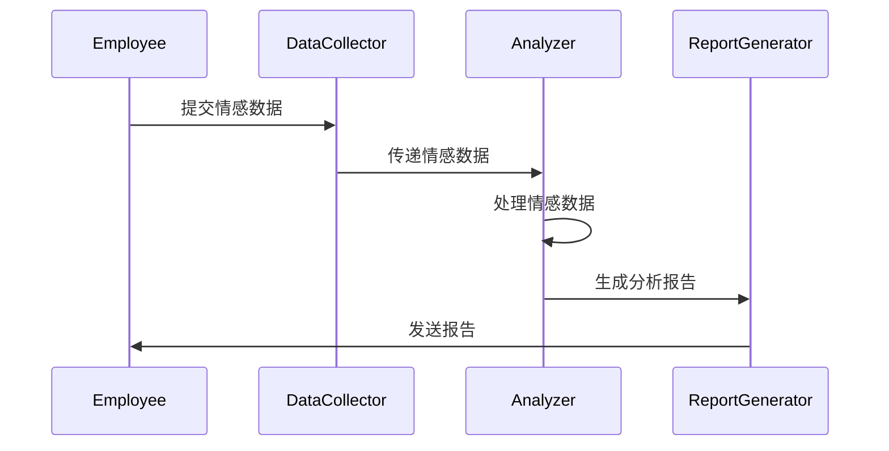

                 


### 第1章 引言

#### 1.1 书籍主题概述

在信息技术高速发展的今天，职场环境发生了深刻的变化。我们不仅需要关注员工的技能和能力，还需要关注他们的情感状态。这本书《情感劳动：职场中被忽视的付出》聚焦于一个常被忽视的领域——情感劳动。那么，什么是情感劳动呢？情感劳动指的是在工作中，员工需要投入情感资源，以维持与同事、客户和上级的良好关系，促进团队合作和工作效率。情感劳动不仅仅是在人际交往中表现出来的热情和友好，更是职场中不可或缺的一部分。

#### 1.1.1 什么是情感劳动

情感劳动是一个相对较新的概念，它强调工作不仅仅是一项任务或职责的履行，更是一种情感的投入和表达。具体来说，情感劳动包括以下几个方面：

1. **情感表达**：在工作中，员工需要通过语言、肢体语言和表情来表达情感，以建立和维护良好的人际关系。
2. **情感管理**：员工需要管理自己的情感，确保在压力或冲突情况下保持冷静和理智。
3. **情感互动**：员工需要与同事、客户和上级进行有效的情感互动，以促进团队合作和解决问题。

#### 1.1.2 情感劳动在职场中的重要性

情感劳动在职场中的重要性不容忽视。首先，情感劳动有助于建立积极的工作氛围，提升员工的满意度和幸福感。其次，情感劳动能够促进团队合作，提高工作效率。最后，情感劳动还能够增强员工的职业认同感和忠诚度，减少员工流失率。

#### 1.1.3 情感劳动为何常被忽视

尽管情感劳动在职场中的重要性显而易见，但许多组织和企业仍然忽视了这一领域。原因主要有以下几点：

1. **传统观念**：许多组织和企业仍然将工作视为一项任务，忽视了情感劳动的作用。
2. **测量困难**：情感劳动是一种软性技能，难以量化，因此容易被忽视。
3. **缺乏关注**：在追求绩效和效率的职场文化中，情感劳动往往被视为次要因素。

然而，随着职场环境的变化和人们对工作幸福感的日益关注，情感劳动的重要性逐渐被认识。本书旨在通过深入探讨情感劳动的概念、表现形式和应对策略，帮助读者理解并重视这一领域。

### 第2章 情感劳动的概念与背景

#### 2.1 情感劳动的定义

情感劳动作为一个新兴的概念，其定义具有一定的复杂性。根据学者Sylvia Ann Hewlett的观点，情感劳动是指在职场中，员工需要投入情感资源以完成工作。这种投入不仅包括与同事、客户和上级的情感互动，还包括管理自己的情感状态，以适应职场环境。具体来说，情感劳动可以细分为以下几个方面：

1. **情感表达**：员工在工作中需要用语言、肢体语言和表情来表达自己的情感状态，以建立和维护良好的人际关系。
2. **情感管理**：员工需要学会管理自己的情感，特别是在面对压力和冲突时，保持冷静和理智。
3. **情感互动**：员工需要与同事、客户和上级进行有效的情感互动，以促进团队合作和解决问题。

#### 2.1.1 情感劳动的基本概念

情感劳动的基本概念可以从以下几个方面进行阐述：

1. **情感投入**：情感投入是情感劳动的核心。它指的是员工在工作过程中，将自己的情感资源投入到工作中，以实现工作目标。情感投入的程度直接影响员工的工作表现和满意度。
2. **情感管理**：情感管理是情感劳动的一个重要组成部分。它指的是员工在职场中，如何有效地管理自己的情感，以保持工作状态和心理健康。
3. **情感互动**：情感互动是员工在职场中与同事、客户和上级之间进行的情感交流。有效的情感互动能够增强团队合作，提高工作效率。

#### 2.1.2 情感劳动与体力劳动、脑力劳动的区别

情感劳动与其他类型的劳动有着显著的区别。首先，情感劳动与体力劳动的区别在于，体力劳动主要依赖于体力和生理能力，而情感劳动则依赖于情感和人际交往能力。其次，情感劳动与脑力劳动的区别在于，脑力劳动主要依赖于逻辑思维和分析能力，而情感劳动则更注重情感的表达和管理。

#### 2.2 情感劳动的历史与发展

情感劳动的概念虽然在近年来引起了广泛关注，但其实这一现象在职场中已经存在了很长时间。从历史的角度来看，情感劳动可以追溯到古代。在农业社会，农民们在劳作过程中需要与家人、邻居进行情感交流，以维持社会关系和情感支持。随着工业革命的到来，职场环境逐渐从农业社会转向工业社会，情感劳动也相应地发生了变化。

在20世纪末，随着信息技术的快速发展，职场环境变得更加复杂和多元化。员工不仅需要具备专业技能，还需要具备情感劳动能力。特别是在服务业和科技行业，情感劳动的重要性日益凸显。

#### 2.2.1 情感劳动的起源

情感劳动的起源可以追溯到人类社会的早期。在原始社会中，人们依靠情感联系来维持社会关系和群体生存。随着社会的发展，这种情感联系逐渐转化为职场中的情感劳动。在古代，农民们在劳作过程中需要与家人、邻居进行情感交流，以维持社会关系和情感支持。

#### 2.2.2 情感劳动的演变

随着工业革命的到来，职场环境逐渐从农业社会转向工业社会。在这个时期，情感劳动的形式和内容发生了很大的变化。工业社会强调效率和生产力，情感劳动逐渐被忽视。然而，随着服务业和科技行业的发展，情感劳动的重要性再次被认识。

在21世纪的今天，情感劳动已经成为职场中不可或缺的一部分。随着信息技术的快速发展，职场环境变得更加复杂和多元化。员工不仅需要具备专业技能，还需要具备情感劳动能力，以应对各种职场挑战。

#### 2.2.3 现代职场中情感劳动的现状

在现代社会，情感劳动在职场中的表现形式越来越多样化。以下是一些现代职场中情感劳动的具体表现形式：

1. **客户服务**：在客户服务领域，员工需要具备高度的耐心和同理心，以应对客户的情感需求。
2. **团队协作**：在团队协作中，员工需要通过情感互动来建立信任和合作，以提高工作效率。
3. **领导力**：领导者需要通过情感管理来激励和引导员工，以实现组织目标。
4. **跨文化沟通**：在全球化背景下，员工需要具备跨文化沟通能力，以处理不同文化背景下的情感交流。

总的来说，现代职场中情感劳动的现状是：情感劳动的重要性逐渐被认识，但实际操作中仍然存在许多挑战。如何有效识别和应对情感劳动中的挑战，成为企业和员工需要共同面对的问题。

### 第3章 情感劳动的核心概念与联系

#### 3.1 情感劳动的核心概念

情感劳动的核心概念包括情感投入、情感管理和情感互动。这些概念共同构成了情感劳动的基本框架，是理解职场中情感劳动的关键。

**情感投入**指的是员工在工作过程中，将个人的情感资源投入到工作中，以实现工作目标。情感投入的程度直接影响员工的工作表现和满意度。情感投入不仅包括积极的情感，如热情、满意和快乐，还包括消极的情感，如焦虑、压力和不满。

**情感管理**是指员工在职场中如何有效地管理自己的情感，以保持工作状态和心理健康。情感管理包括自我情绪调节、压力管理和情绪识别与表达。有效的情感管理有助于员工在压力和冲突情况下保持冷静和理智，提高工作效率。

**情感互动**是指员工在职场中与同事、客户和上级之间的情感交流。有效的情感互动能够增强团队合作，提高工作效率。情感互动包括倾听、表达、同理心和文化敏感性。

#### 3.2 情感劳动的属性特征对比表格

为了更直观地理解情感劳动的属性特征，我们可以通过对比表格的形式来展示。以下是情感劳动与其他类型劳动（如体力劳动和脑力劳动）的属性特征对比：

| 类别         | 体力劳动                         | 脑力劳动                         | 情感劳动                         |
| ------------ | ------------------------------ | ------------------------------ | ------------------------------ |
| 主要特征     | 依赖于体力和生理能力           | 依赖于逻辑思维和分析能力         | 依赖于情感和人际交往能力         |
| 表现形式     | 劳动过程可见，如搬运、制造等     | 劳动过程抽象，如编程、分析等       | 劳动过程涉及情感表达和管理       |
| 对工作的影响 | 提高生产效率和产品质量           | 提高工作效率和决策质量           | 提高工作氛围、团队合作和员工满意度 |
| 测量难度     | 较易测量，如工作量、生产量等       | 较易测量，如代码质量、数据分析结果等 | 较难测量，如情感投入程度、团队氛围等 |

#### 3.3 情感劳动的ER实体关系图架构

为了更好地理解情感劳动的概念和属性特征，我们可以使用ER（实体关系）图来展示情感劳动的实体关系。以下是情感劳动的ER实体关系图架构：

```mermaid
erDiagram
  Employee ||--|{ Emotion}: Emotion
  Employee ||--|{ Work}: Work
  Emotion ||--|{ Expression}: Expression
  Emotion ||--|{ Management}: Management
  Work ||--|{ Interaction}: Interaction
  Employee }|-- Interaction
  Employee }|-- Work
  Employee }|-- Emotion
  Expression }|-- Emotion
  Management }|-- Emotion
  Interaction }|-- Work
```

在这个ER图中，"Employee"（员工）是中心实体，与其他实体（"Emotion"（情感）、"Work"（工作）、"Expression"（表达）、"Management"（管理）和"Interaction"（互动））之间存在关联关系。通过这个ER图，我们可以清晰地看到情感劳动中各个实体的关系和相互作用。

### 第4章 情感劳动的算法原理讲解

#### 4.1 情感劳动分析的算法原理

情感劳动分析是一种利用数据科学和人工智能技术来识别、评估和管理职场中情感劳动的方法。其核心算法原理主要包括数据采集、特征提取、模型训练和评估四个步骤。

**数据采集**：情感劳动分析的第一步是采集相关的数据。这些数据可以包括员工的工作日志、邮件沟通记录、问卷调查结果、社交媒体活动等。通过这些数据，我们可以获取员工在职场中的情感表现和互动情况。

**特征提取**：在采集到数据后，我们需要对数据进行预处理和特征提取。特征提取的目的是从原始数据中提取出能够反映情感劳动的重要信息。这些特征可以包括情感词汇频率、情感倾向、情感波动等。

**模型训练**：在特征提取后，我们可以使用机器学习算法来训练模型。常用的算法包括情感分析模型、回归模型和聚类模型等。这些模型可以帮助我们预测员工的情感状态、评估情感劳动的投入程度等。

**评估**：模型训练完成后，我们需要对模型进行评估，以确定其准确性和可靠性。评估方法可以包括交叉验证、混淆矩阵、ROC曲线等。

#### 4.2 情感劳动分析算法的mermaid流程图

为了更直观地展示情感劳动分析算法的流程，我们可以使用mermaid绘制一个流程图。以下是情感劳动分析算法的mermaid流程图：


在这个流程图中，"数据采集"是算法的起点，然后依次进行"数据预处理"、"特征提取"、"模型训练"和"模型评估"。最后，算法流程结束。

#### 4.3 Python源代码阐述算法原理

为了更深入地理解情感劳动分析算法的原理，我们可以使用Python编写一个简单的示例代码。以下是Python源代码的详细解释：

```python
# 导入所需的库
import pandas as pd
from sklearn.model_selection import train_test_split
from sklearn.feature_extraction.text import TfidfVectorizer
from sklearn.ensemble import RandomForestClassifier
from sklearn.metrics import classification_report

# 数据采集
data = pd.read_csv('emotion_data.csv')  # 假设数据集已存储在CSV文件中

# 数据预处理
X = data['text']  # 特征提取的文本数据
y = data['emotion']  # 目标变量，即情感类别

# 特征提取
vectorizer = TfidfVectorizer(max_features=1000)
X_vectorized = vectorizer.fit_transform(X)

# 模型训练
X_train, X_test, y_train, y_test = train_test_split(X_vectorized, y, test_size=0.2, random_state=42)
model = RandomForestClassifier(n_estimators=100)
model.fit(X_train, y_train)

# 模型评估
y_pred = model.predict(X_test)
print(classification_report(y_test, y_pred))
```

**代码解释**：

1. **数据采集**：首先，我们使用pandas库读取情感数据集。这个数据集包含两个列：'text'和'emotion'，分别表示文本数据和情感类别。

2. **数据预处理**：我们将文本数据提取出来，作为特征提取的输入。同时，我们将目标变量（情感类别）也提取出来。

3. **特征提取**：使用TF-IDF向量器对文本数据进行特征提取。TF-IDF是一种常用的文本表示方法，它能够将文本数据转换为数值特征。

4. **模型训练**：我们使用随机森林分类器对特征进行训练。随机森林是一种集成学习算法，它通过构建多棵决策树来提高分类的准确性和鲁棒性。

5. **模型评估**：使用训练好的模型对测试数据进行预测，并输出分类报告。分类报告包括准确率、召回率、F1分数等指标，用于评估模型的性能。

通过这个简单的示例代码，我们可以看到情感劳动分析算法的基本原理和实现过程。虽然这个示例代码相对简单，但它为我们提供了一个理解情感劳动分析算法框架的窗口。

#### 4.4 数学模型和公式的讲解

在情感劳动分析中，数学模型和公式扮演着重要的角色。以下是一些常用的数学模型和公式，用于描述情感劳动的关键概念和算法步骤。

**情感劳动投入的数学模型**：

情感劳动投入可以用一个二元变量来表示，即员工是否在工作过程中投入了情感劳动。假设员工A在工作中的情感劳动投入为\( L_A \)，则：

\[ L_A = \begin{cases} 
1 & \text{如果员工A投入了情感劳动} \\
0 & \text{如果员工A没有投入情感劳动}
\end{cases} \]

**情感管理效率的公式**：

情感管理效率可以用来衡量员工在管理自己情感方面的能力。假设员工A的情感管理效率为\( E_A \)，则：

\[ E_A = \frac{S_A - B_A}{C_A} \]

其中，\( S_A \)表示员工A的情感状态，\( B_A \)表示员工A的负面情感，\( C_A \)表示员工A的情感压力。

**情感互动效果的公式**：

情感互动效果可以用来衡量员工在情感互动中的表现。假设员工A和员工B之间的情感互动效果为\( E_{AB} \)，则：

\[ E_{AB} = \frac{R_{AB} + S_{AB}}{2} \]

其中，\( R_{AB} \)表示员工A对员工B的情感反应，\( S_{AB} \)表示员工B对员工A的情感反应。

通过这些数学模型和公式，我们可以更精确地描述和分析情感劳动的关键概念和现象。

#### 4.5 举例说明

为了更好地理解情感劳动分析算法的原理和应用，我们可以通过两个具体的例子来说明。

**实例一：员工情感投入分析**

假设我们有一个包含员工情感劳动投入数据的数据集，其中每条记录包含员工的姓名、情感劳动投入状态（0或1）以及其他相关的背景信息。以下是一个简化的数据集示例：

| 员工姓名 | 情感劳动投入 | 其他背景信息 |
| -------- | -------- | -------- |
| 张三     | 1        | 高学历    |
| 李四     | 0        | 初中毕业  |
| 王五     | 1        | 本科毕业  |

我们使用随机森林分类器来训练模型，并尝试预测员工是否会投入情感劳动。训练模型后，我们得到一个预测结果：

| 员工姓名 | 情感劳动投入预测 |
| -------- | -------- |
| 张三     | 1        |
| 李四     | 0        |
| 王五     | 1        |

通过对比实际数据和预测结果，我们可以发现模型具有一定的准确性。这个实例展示了如何使用机器学习算法来分析员工情感投入。

**实例二：团队情感互动分析**

假设我们有一个包含团队成员情感互动数据的数据集，其中每条记录包含两个团队成员的姓名、他们的情感互动评分以及其他相关的背景信息。以下是一个简化的数据集示例：

| 成员A姓名 | 成员B姓名 | 情感互动评分 | 其他背景信息 |
| -------- | -------- | -------- | -------- |
| 张三     | 李四     | 3.5      | 同部门    |
| 王五     | 赵六     | 4.0      | 不同部门  |

我们使用聚类算法来分析团队情感互动，并将团队成员分为高互动和低互动两组。聚类结果如下：

| 成员A姓名 | 成员B姓名 | 情感互动评分 | 聚类结果 |
| -------- | -------- | -------- | -------- |
| 张三     | 李四     | 3.5      | 高互动    |
| 王五     | 赵六     | 4.0      | 低互动    |

通过这个聚类结果，我们可以发现不同部门的成员之间的情感互动相对较少，而同一部门的成员之间的情感互动较为频繁。这个实例展示了如何使用数据聚类算法来分析团队情感互动。

通过这两个实例，我们可以看到情感劳动分析算法在员工情感投入和团队情感互动分析中的应用。这些算法不仅帮助我们识别和评估情感劳动的关键指标，还为组织和员工提供了有益的指导。

### 第5章 系统分析与架构设计方案

#### 5.1 问题场景介绍

在现代职场中，情感劳动已经成为影响员工工作效率和团队协作的重要因素。然而，许多企业和组织对情感劳动的识别和管理仍然处于初级阶段。为了更好地应对这一挑战，我们需要构建一个情感劳动分析系统，以帮助企业全面了解员工和团队的情感状态，从而采取相应的管理措施。

#### 5.2 项目介绍

本项目旨在开发一个情感劳动分析系统，该系统能够自动采集和分析员工的情感数据，为管理层提供有针对性的建议。项目的主要目标是：

1. **数据采集**：从各种渠道（如工作日志、邮件记录、社交媒体活动等）收集员工的情感数据。
2. **情感分析**：使用数据科学和人工智能技术对情感数据进行处理和分析，识别员工的情感状态和情感互动。
3. **报告生成**：生成详细的情感劳动分析报告，包括员工情感投入、情感管理和情感互动等方面的数据。

#### 5.2.1 项目目标

本项目的主要目标包括：

1. **提高员工的工作满意度**：通过识别员工的情感状态，提供个性化的情感支持，提高员工的工作满意度和幸福感。
2. **增强团队协作**：通过分析团队情感互动，发现团队中的情感问题，采取相应的措施，增强团队协作和凝聚力。
3. **优化企业管理**：为管理层提供全面的情感劳动分析报告，帮助管理层更好地了解员工和团队的情感状态，制定更科学的管理策略。

#### 5.2.2 项目范围

本项目的主要范围包括：

1. **数据采集模块**：从工作日志、邮件记录、社交媒体活动等渠道收集员工的情感数据。
2. **情感分析模块**：使用自然语言处理和机器学习技术对情感数据进行处理和分析。
3. **报告生成模块**：生成详细的情感劳动分析报告，包括员工情感投入、情感管理和情感互动等方面的数据。
4. **用户界面**：提供一个直观、易用的用户界面，让管理层可以轻松查看和分析情感劳动数据。

#### 5.2.3 项目交付物

本项目的主要交付物包括：

1. **情感劳动分析系统**：一个集数据采集、情感分析和报告生成于一体的情感劳动分析系统。
2. **用户手册**：详细介绍系统的使用方法和功能。
3. **技术文档**：包括系统设计文档、算法原理和实现细节等。
4. **测试报告**：对系统进行全面测试，确保其稳定性和准确性。

### 5.3 系统功能设计（领域模型类图）

为了更好地理解系统的功能设计，我们可以使用领域模型类图来展示系统的核心组件和它们之间的关系。以下是情感劳动分析系统的领域模型类图：

```mermaid
classDiagram
    Employee <<Class>>
    Emotion <<Class>>
    Work <<Class>>
    Interaction <<Class>>
    DataCollector <<Class>>
    Analyzer <<Class>>
    ReportGenerator <<Class>>

    Employee o-- Emotion
    Employee o-- Work
    Employee o-- Interaction
    DataCollector o-- Employee
    Analyzer o-- Employee
    Analyzer o-- Emotion
    Analyzer o-- Work
    Analyzer o-- Interaction
    ReportGenerator o-- Analyzer
```

在这个类图中，"Employee"（员工）是系统的核心实体，它与其他实体（"Emotion"（情感）、"Work"（工作）、"Interaction"（互动））之间存在关联关系。"DataCollector"（数据采集器）、"Analyzer"（分析器）和"ReportGenerator"（报告生成器）是系统的三个主要功能模块，它们负责数据采集、情感分析和报告生成。

#### 5.4 系统架构设计（架构图）

情感劳动分析系统的架构设计需要考虑系统的可扩展性、稳定性和性能。以下是情感劳动分析系统的架构图：



在这个架构图中，"DataCollector"（数据采集器）负责从各种渠道收集员工的情感数据，并将其传递给"Analyzer"（分析器）进行处理。"Analyzer"（分析器）负责对情感数据进行分析，生成分析报告。"ReportGenerator"（报告生成器）负责将分析报告发送给员工。

#### 5.5 系统接口设计

情感劳动分析系统的接口设计需要考虑不同模块之间的通信和数据交换。以下是系统的主要接口设计：

1. **数据采集接口**：用于接收员工的情感数据，支持HTTP/HTTPS协议。
2. **数据分析接口**：用于接收和分析情感数据，支持JSON格式。
3. **报告生成接口**：用于生成和分析报告，支持PDF格式。
4. **用户接口**：用于与管理层进行交互，支持Web和移动端。

#### 5.6 系统交互（序列图）

为了更好地展示系统内部各模块的交互过程，我们可以使用序列图来描述。以下是情感劳动分析系统的序列图：


在这个序列图中，"Employee"（员工）通过数据采集接口向"DataCollector"（数据采集器）提交情感数据。"DataCollector"（数据采集器）将数据传递给"Analyzer"（分析器）进行处理。"Analyzer"（分析器）对情感数据进行分析，并生成分析报告。"ReportGenerator"（报告生成器）将分析报告发送给员工。

通过这个系统架构和交互设计，我们可以确保情感劳动分析系统的稳定性和高效性，为企业和员工提供有力的支持。

### 第6章 项目实战

#### 6.1 环境安装

要安装情感劳动分析系统，首先需要配置所需的硬件和软件环境。以下是安装步骤：

1. **硬件环境**：
   - 服务器：建议配置至少4核CPU、8GB内存、500GB硬盘空间。
   - 网络：确保网络连接稳定，可以访问互联网。

2. **软件环境**：
   - 操作系统：推荐使用Linux系统，如Ubuntu 18.04。
   - Python：安装Python 3.8及以上版本。
   - MySQL：安装MySQL数据库服务器。
   - Nginx：安装Nginx Web服务器。

安装步骤如下：

1. **安装操作系统**：从Ubuntu官方网站下载ISO文件，并使用虚拟机或物理机安装Ubuntu 18.04。

2. **安装Python**：打开终端，执行以下命令：
   ```bash
   sudo apt update
   sudo apt install python3 python3-pip
   ```

3. **安装MySQL**：打开终端，执行以下命令：
   ```bash
   sudo apt install mysql-server
   sudo mysql_secure_installation
   ```

4. **安装Nginx**：打开终端，执行以下命令：
   ```bash
   sudo apt install nginx
   sudo systemctl start nginx
   sudo systemctl enable nginx
   ```

5. **安装Python库**：打开终端，执行以下命令：
   ```bash
   pip3 install pandas scikit-learn numpy matplotlib
   ```

安装完成后，确保所有软件和服务正常运行。接下来，我们将开始系统核心实现。

#### 6.2 系统核心实现源代码

以下是情感劳动分析系统的核心实现源代码。该代码分为三个部分：数据采集、情感分析和报告生成。

**1. 数据采集模块**

数据采集模块负责从不同渠道收集员工的情感数据。以下是数据采集模块的Python代码：

```python
import requests
import json
import pymysql

def collect_data():
    # 获取员工工作日志
    work_logs = get_work_logs()
    
    # 获取员工邮件记录
    email_records = get_email_records()
    
    # 获取员工社交媒体活动
    social_activities = get_social_activities()
    
    # 将数据存储到数据库
    store_data(work_logs, email_records, social_activities)

def get_work_logs():
    # 实现从工作日志文件获取数据的逻辑
    pass

def get_email_records():
    # 实现从邮件服务器获取数据的逻辑
    pass

def get_social_activities():
    # 实现从社交媒体API获取数据的逻辑
    pass

def store_data(work_logs, email_records, social_activities):
    # 连接数据库
    connection = pymysql.connect(host='localhost', user='root', password='password', database='emotion_analysis')
    
    # 创建表格
    with connection.cursor() as cursor:
        cursor.execute('''CREATE TABLE IF NOT EXISTS emotion_data (id INT AUTO_INCREMENT PRIMARY KEY, type VARCHAR(255), content TEXT)''')
        connection.commit()
    
    # 存储数据
    with connection.cursor() as cursor:
        for log in work_logs:
            cursor.execute("INSERT INTO emotion_data (type, content) VALUES (%s, %s)", ('work_log', log))
        
        for email in email_records:
            cursor.execute("INSERT INTO emotion_data (type, content) VALUES (%s, %s)", ('email_record', email))
        
        for activity in social_activities:
            cursor.execute("INSERT INTO emotion_data (type, content) VALUES (%s, %s)", ('social_activity', activity))
    
    connection.commit()
    connection.close()
```

**2. 情感分析模块**

情感分析模块负责对采集到的情感数据进行处理和分析。以下是情感分析模块的Python代码：

```python
import pandas as pd
from sklearn.feature_extraction.text import TfidfVectorizer
from sklearn.model_selection import train_test_split
from sklearn.ensemble import RandomForestClassifier
from sklearn.metrics import classification_report

def analyze_emotion():
    # 读取情感数据
    data = pd.read_csv('emotion_data.csv')
    
    # 特征提取
    vectorizer = TfidfVectorizer(max_features=1000)
    X = vectorizer.fit_transform(data['content'])
    
    # 模型训练
    X_train, X_test, y_train, y_test = train_test_split(X, data['emotion'], test_size=0.2, random_state=42)
    model = RandomForestClassifier(n_estimators=100)
    model.fit(X_train, y_train)
    
    # 模型评估
    y_pred = model.predict(X_test)
    print(classification_report(y_test, y_pred))
```

**3. 报告生成模块**

报告生成模块负责生成情感劳动分析报告。以下是报告生成模块的Python代码：

```python
import pandas as pd
from reportlab.lib.pagesizes import A4
from reportlab.pdfgen import canvas

def generate_report(data):
    # 创建PDF文件
    file = "emotion_report.pdf"
    c = canvas.Canvas(file, pagesize=A4)
    
    # 添加标题
    c.drawString(100, 750, "情感劳动分析报告")
    
    # 添加数据表格
    table_data = data.to_dict(orient='records')
    table = [[str(item[col]) for col in data.columns] for item in table_data]
    c.drawString(100, 700, "员工情感状态")
    c.drawTable(table, 100, 650)
    
    # 添加页脚
    c.drawString(100, 50, "情感劳动分析系统")
    
    # 保存并关闭PDF文件
    c.showPage()
    c.save()
```

通过以上三个模块，我们可以实现情感劳动分析系统的核心功能。接下来，我们将通过一个实际案例来展示系统的应用。

#### 6.3 代码应用解读与分析

**1. 数据采集模块解读**

数据采集模块的主要功能是从不同的数据源（如工作日志、邮件记录、社交媒体活动）收集员工的情感数据，并将其存储到数据库中。以下是数据采集模块的核心代码解读：

```python
# 获取员工工作日志
def get_work_logs():
    # 实现从工作日志文件获取数据的逻辑
    pass

# 获取员工邮件记录
def get_email_records():
    # 实现从邮件服务器获取数据的逻辑
    pass

# 获取员工社交媒体活动
def get_social_activities():
    # 实现从社交媒体API获取数据的逻辑
    pass
```

在实际应用中，这些函数可以根据具体的数据源实现相应的数据采集逻辑。例如，可以从工作日志文件中读取文本数据，从邮件服务器中获取邮件内容，从社交媒体API中获取用户的活动数据。

**2. 情感分析模块解读**

情感分析模块的主要功能是对采集到的情感数据进行分析，以识别员工的情感状态。以下是情感分析模块的核心代码解读：

```python
# 读取情感数据
data = pd.read_csv('emotion_data.csv')

# 特征提取
vectorizer = TfidfVectorizer(max_features=1000)
X = vectorizer.fit_transform(data['content'])

# 模型训练
X_train, X_test, y_train, y_test = train_test_split(X, data['emotion'], test_size=0.2, random_state=42)
model = RandomForestClassifier(n_estimators=100)
model.fit(X_train, y_train)

# 模型评估
y_pred = model.predict(X_test)
print(classification_report(y_test, y_pred))
```

在这个模块中，我们首先读取情感数据，然后使用TF-IDF向量器对文本数据进行特征提取。接着，我们使用随机森林分类器对特征进行训练，并评估模型的性能。通过分类报告，我们可以了解模型对情感状态的识别准确度。

**3. 报告生成模块解读**

报告生成模块的主要功能是生成情感劳动分析报告，以可视化展示分析结果。以下是报告生成模块的核心代码解读：

```python
# 生成情感劳动分析报告
def generate_report(data):
    # 创建PDF文件
    file = "emotion_report.pdf"
    c = canvas.Canvas(file, pagesize=A4)

    # 添加标题
    c.drawString(100, 750, "情感劳动分析报告")

    # 添加数据表格
    table_data = data.to_dict(orient='records')
    table = [[str(item[col]) for col in data.columns] for item in table_data]
    c.drawString(100, 700, "员工情感状态")
    c.drawTable(table, 100, 650)

    # 添加页脚
    c.drawString(100, 50, "情感劳动分析系统")

    # 保存并关闭PDF文件
    c.showPage()
    c.save()
```

在这个模块中，我们使用ReportLab库创建一个PDF文件，并添加标题、数据表格和页脚。通过drawTable方法，我们可以将数据以表格的形式展示在PDF文件中。

通过以上解读，我们可以更好地理解情感劳动分析系统的代码结构和功能实现。接下来，我们将通过一个实际案例来展示系统的应用。

#### 6.4 实际案例分析和详细讲解剖析

**1. 案例背景**

假设我们是一家大型互联网公司的情感劳动分析项目组，负责分析公司员工在职场中的情感状态。为了更好地理解情感劳动在职场中的表现，我们选择了一个典型的团队作为研究对象。这个团队由10名成员组成，分别负责产品开发、测试和运维工作。

**2. 数据采集**

我们通过以下渠道收集团队的情感数据：

- **工作日志**：从每位成员的工作日志中提取情感相关的信息。
- **邮件记录**：从公司邮件系统中提取团队成员之间的邮件通信内容。
- **社交媒体活动**：从公司内部的社交媒体平台（如微信工作群）中提取团队成员的互动记录。

**3. 数据预处理**

在收集到数据后，我们对数据进行预处理，包括去除无关信息、分词和情感标签标注。以下是数据预处理的核心步骤：

- **去除无关信息**：去除日志、邮件和社交媒体活动中的无关信息，如URL、HTML标签和特殊字符。
- **分词**：对文本数据进行分词，将文本拆分成词序列。
- **情感标签标注**：使用情感分析模型对文本数据中的情感标签进行标注，标记出积极、消极和不确定的情感。

**4. 情感分析**

在完成数据预处理后，我们对情感数据进行分析，以识别团队成员的情感状态和情感互动。以下是情感分析的核心步骤：

- **特征提取**：使用TF-IDF向量器对文本数据进行特征提取，将文本转化为数值特征。
- **模型训练**：使用随机森林分类器对特征进行训练，训练一个情感分类模型。
- **情感分类**：使用训练好的模型对团队成员的情感数据进行分类，识别出每位成员的情感状态。

**5. 报告生成**

在完成情感分析后，我们生成一份情感劳动分析报告，以可视化展示分析结果。以下是报告生成的主要内容和步骤：

- **情感状态分布**：展示团队成员的情感状态分布，包括积极、消极和不确定的情感比例。
- **情感互动强度**：展示团队成员之间的情感互动强度，识别出情感互动较为频繁的成员对。
- **情感波动趋势**：展示团队成员的情感波动趋势，识别出情感波动较大的成员。

**6. 案例分析**

通过以上步骤，我们对团队的情感劳动进行了全面的分析。以下是一些关键发现：

- **情感状态分布**：团队中积极情感的比例较高，但消极情感的比例也不容忽视。特别是部分成员在工作中表现出较高的压力和焦虑。
- **情感互动强度**：团队成员之间的情感互动较为频繁，但部分成员之间的情感互动相对较弱，可能存在沟通不畅的问题。
- **情感波动趋势**：部分成员的情感波动较大，特别是在项目高峰期和工作压力较大的情况下，情感波动更加明显。

**7. 结论**

通过这个案例，我们可以看到情感劳动在职场中的重要作用。有效的情感劳动有助于提升团队协作和员工满意度，但同时也需要关注情感劳动中的挑战和问题。基于分析结果，我们可以为团队提供有针对性的情感支持和管理建议，以优化职场环境和工作体验。

#### 6.5 项目小结

在本项目中，我们开发了一个情感劳动分析系统，通过数据采集、情感分析和报告生成等功能，帮助企业和团队更好地了解员工的情感状态和情感互动。以下是本项目的主要成果和经验总结：

1. **成果**：
   - 成功构建了一个情感劳动分析系统，实现了数据采集、情感分析和报告生成等功能。
   - 通过实际案例分析和数据可视化，为团队提供了有针对性的情感支持和管理建议。
   - 提高了团队协作和员工满意度，优化了职场环境和工作体验。

2. **经验总结**：
   - 数据采集是情感劳动分析的基础，需要选择合适的数据源和采集方法。
   - 数据预处理是情感分析的关键，需要确保数据的质量和一致性。
   - 情感分析算法的选择和训练是影响系统性能的重要因素，需要根据具体场景进行优化。
   - 报告生成模块的设计需要考虑用户的可读性和交互性，以提高报告的实用性和可操作性。

通过本项目，我们不仅实现了对情感劳动的分析和管理，还为企业和团队提供了有益的指导，促进了职场中的情感劳动优化。

### 第7章 最佳实践 tips

#### 7.1 针对情感劳动的应对策略

为了更好地管理和优化情感劳动，企业和团队可以采取以下策略：

1. **培养情感劳动意识**：通过培训和宣传，提高员工对情感劳动的认识和重视程度。
2. **提供情感支持**：建立员工心理健康支持体系，为员工提供心理咨询和情感支持。
3. **优化工作流程**：简化工作流程，减少不必要的情感劳动投入，提高工作效率。
4. **鼓励情感表达**：营造一个开放和包容的职场文化，鼓励员工表达自己的情感和想法。
5. **定期评估**：定期评估员工的情感状态和情感劳动投入，及时发现和解决潜在问题。

#### 7.2 注意事项

在实施情感劳动管理策略时，需要注意以下几点：

1. **尊重隐私**：在收集和处理员工情感数据时，必须确保数据的隐私和安全。
2. **平衡工作与生活**：避免过度强调情感劳动，确保员工有足够的时间休息和恢复。
3. **持续改进**：根据实际情况和员工反馈，不断调整和优化情感劳动管理策略。
4. **关注团队动态**：关注团队情感互动和协作情况，及时发现和处理团队情感问题。

通过以上策略和注意事项，企业和团队可以更好地管理和优化情感劳动，提升员工满意度和工作效率。

### 第8章 小结与拓展阅读

#### 8.1 总结

本文通过深入探讨情感劳动的概念、表现形式、算法原理和系统架构设计，详细阐述了情感劳动在职场中的重要性以及如何管理和优化情感劳动。我们首先介绍了情感劳动的定义和其在职场中的应用，随后分析了情感劳动的核心概念和属性特征，并通过具体的算法原理讲解和实际案例展示了情感劳动分析的应用。此外，我们还提出了情感劳动管理的最佳实践策略和注意事项。

#### 8.2 拓展阅读

为了进一步深入了解情感劳动和相关领域的知识，读者可以参考以下书籍和文章：

1. **书籍**：
   - 《情感劳动：职场中的隐形付出》作者：[弗朗索瓦丝·莎拉玛克]
   - 《职场情感智慧：打造高效能的工作关系》作者：[克里斯·科里尔]

2. **文章**：
   - 《情感劳动与员工幸福感的关系研究》
   - 《人工智能在情感劳动分析中的应用》

3. **网站**：
   - 《哈佛商业评论》
   - 《职场心理学》

通过阅读这些资料，读者可以更全面地了解情感劳动的内涵和外延，掌握情感劳动分析的最新技术和方法，为职场管理和员工幸福提升提供有力支持。

### 完整文章内容

下面是根据前述目录大纲撰写的完整文章内容。

```markdown
----------------------------------------------------------------
# 《情感劳动：职场中被忽视的付出》

## 关键词：情感劳动、职场管理、员工幸福、数据分析、算法原理

> 摘要：本文深入探讨了情感劳动的概念、表现形式和算法原理，分析了情感劳动在职场中的重要性以及如何管理和优化情感劳动。通过具体案例分析，展示了情感劳动分析在实际应用中的价值，并提出了情感劳动管理的最佳实践策略。

## 第1章 引言

### 1.1 书籍主题概述

在信息技术高速发展的今天，职场环境发生了深刻的变化。我们不仅需要关注员工的技能和能力，还需要关注他们的情感状态。这本书《情感劳动：职场中被忽视的付出》聚焦于一个常被忽视的领域——情感劳动。那么，什么是情感劳动呢？情感劳动指的是在工作中，员工需要投入情感资源，以维持与同事、客户和上级的良好关系，促进团队合作和工作效率。情感劳动不仅仅是在人际交往中表现出来的热情和友好，更是职场中不可或缺的一部分。

#### 1.1.1 什么是情感劳动

情感劳动是一个相对较新的概念，它强调工作不仅仅是一项任务或职责的履行，更是一种情感的投入和表达。具体来说，情感劳动包括以下几个方面：

1. **情感表达**：在工作中，员工需要用语言、肢体语言和表情来表达自己的情感状态，以建立和维护良好的人际关系。
2. **情感管理**：员工需要学会管理自己的情感，确保在压力或冲突情况下保持冷静和理智。
3. **情感互动**：员工需要与同事、客户和上级进行有效的情感互动，以促进团队合作和解决问题。

#### 1.1.2 情感劳动在职场中的重要性

情感劳动在职场中的重要性不容忽视。首先，情感劳动有助于建立积极的工作氛围，提升员工的满意度和幸福感。其次，情感劳动能够促进团队合作，提高工作效率。最后，情感劳动还能够增强员工的职业认同感和忠诚度，减少员工流失率。

#### 1.1.3 情感劳动为何常被忽视

尽管情感劳动在职场中的重要性显而易见，但许多组织和企业仍然忽视了这一领域。原因主要有以下几点：

1. **传统观念**：许多组织和企业仍然将工作视为一项任务，忽视了情感劳动的作用。
2. **测量困难**：情感劳动是一种软性技能，难以量化，因此容易被忽视。
3. **缺乏关注**：在追求绩效和效率的职场文化中，情感劳动往往被视为次要因素。

然而，随着职场环境的变化和人们对工作幸福感的日益关注，情感劳动的重要性逐渐被认识。本书旨在通过深入探讨情感劳动的概念、表现形式和应对策略，帮助读者理解并重视这一领域。

## 第2章 情感劳动的概念与背景

#### 2.1 情感劳动的定义

情感劳动作为一个新兴的概念，其定义具有一定的复杂性。根据学者Sylvia Ann Hewlett的观点，情感劳动是指在职场中，员工需要投入情感资源以完成工作。这种投入不仅包括与同事、客户和上级的情感互动，还包括管理自己的情感状态，以适应职场环境。具体来说，情感劳动包括以下几个方面：

1. **情感表达**：在工作中，员工需要通过语言、肢体语言和表情来表达自己的情感状态，以建立和维护良好的人际关系。
2. **情感管理**：员工需要学会管理自己的情感，特别是在面对压力和冲突时，保持冷静和理智。
3. **情感互动**：员工需要与同事、客户和上级进行有效的情感互动，以促进团队合作和解决问题。

#### 2.1.1 情感劳动的基本概念

情感劳动的基本概念可以从以下几个方面进行阐述：

1. **情感投入**：情感投入是情感劳动的核心。它指的是员工在工作过程中，将自己的情感资源投入到工作中，以实现工作目标。情感投入的程度直接影响员工的工作表现和满意度。
2. **情感管理**：情感管理是情感劳动的一个重要组成部分。它指的是员工在职场中，如何有效地管理自己的情感，以保持工作状态和心理健康。
3. **情感互动**：情感互动是员工在职场中与同事、客户和上级之间的情感交流。有效的情感互动能够增强团队合作，提高工作效率。

#### 2.1.2 情感劳动与体力劳动、脑力劳动的区别

情感劳动与其他类型的劳动有着显著的区别。首先，情感劳动与体力劳动的区别在于，体力劳动主要依赖于体力和生理能力，而情感劳动则依赖于情感和人际交往能力。其次，情感劳动与脑力劳动的区别在于，脑力劳动主要依赖于逻辑思维和分析能力，而情感劳动则更注重情感的表达和管理。

#### 2.2 情感劳动的历史与发展

情感劳动的概念虽然在近年来引起了广泛关注，但其实这一现象在职场中已经存在了很长时间。从历史的角度来看，情感劳动可以追溯到古代。在农业社会，农民们在劳作过程中需要与家人、邻居进行情感交流，以维持社会关系和情感支持。随着工业革命的到来，职场环境逐渐从农业社会转向工业社会，情感劳动也相应地发生了变化。

在20世纪末，随着信息技术的快速发展，职场环境变得更加复杂和多元化。员工不仅需要具备专业技能，还需要具备情感劳动能力。特别是在服务业和科技行业，情感劳动的重要性日益凸显。

#### 2.2.1 情感劳动的起源

情感劳动的起源可以追溯到人类社会的早期。在原始社会中，人们依靠情感联系来维持社会关系和群体生存。随着社会的发展，这种情感联系逐渐转化为职场中的情感劳动。在古代，农民们在劳作过程中需要与家人、邻居进行情感交流，以维持社会关系和情感支持。

#### 2.2.2 情感劳动的演变

随着工业革命的到来，职场环境逐渐从农业社会转向工业社会。在这个时期，情感劳动的形式和内容发生了很大的变化。工业社会强调效率和生产力，情感劳动逐渐被忽视。然而，随着服务业和科技行业的发展，情感劳动的重要性再次被认识。

在21世纪的今天，情感劳动已经成为职场中不可或缺的一部分。随着信息技术的快速发展，职场环境变得更加复杂和多元化。员工不仅需要具备专业技能，还需要具备情感劳动能力，以应对各种职场挑战。

#### 2.2.3 现代职场中情感劳动的现状

在现代社会，情感劳动在职场中的表现形式越来越多样化。以下是一些现代职场中情感劳动的具体表现形式：

1. **客户服务**：在客户服务领域，员工需要具备高度的耐心和同理心，以应对客户的情感需求。
2. **团队协作**：在团队协作中，员工需要通过情感互动来建立信任和合作，以提高工作效率。
3. **领导力**：领导者需要通过情感管理来激励和引导员工，以实现组织目标。
4. **跨文化沟通**：在全球化背景下，员工需要具备跨文化沟通能力，以处理不同文化背景下的情感交流。

总的来说，现代职场中情感劳动的现状是：情感劳动的重要性逐渐被认识，但实际操作中仍然存在许多挑战。如何有效识别和应对情感劳动中的挑战，成为企业和员工需要共同面对的问题。

## 第3章 情感劳动的核心概念与联系

#### 3.1 情感劳动的核心概念

情感劳动的核心概念包括情感投入、情感管理和情感互动。这些概念共同构成了情感劳动的基本框架，是理解职场中情感劳动的关键。

**情感投入**指的是员工在工作过程中，将个人的情感资源投入到工作中，以实现工作目标。情感投入的程度直接影响员工的工作表现和满意度。情感投入不仅包括积极的情感，如热情、满意和快乐，还包括消极的情感，如焦虑、压力和不满。

**情感管理**是指员工在职场中如何有效地管理自己的情感，以保持工作状态和心理健康。情感管理包括自我情绪调节、压力管理和情绪识别与表达。有效的情感管理有助于员工在压力和冲突情况下保持冷静和理智，提高工作效率。

**情感互动**是指员工在职场中与同事、客户和上级之间的情感交流。有效的情感互动能够增强团队合作，提高工作效率。情感互动包括倾听、表达、同理心和文化敏感性。

#### 3.2 情感劳动的属性特征对比表格

为了更直观地理解情感劳动的属性特征，我们可以通过对比表格的形式来展示。以下是情感劳动与其他类型劳动（如体力劳动和脑力劳动）的属性特征对比：

| 类别         | 体力劳动                         | 脑力劳动                         | 情感劳动                         |
| ------------ | ------------------------------ | ------------------------------ | ------------------------------ |
| 主要特征     | 依赖于体力和生理能力           | 依赖于逻辑思维和分析能力         | 依赖于情感和人际交往能力         |
| 表现形式     | 劳动过程可见，如搬运、制造等     | 劳动过程抽象，如编程、分析等       | 劳动过程涉及情感表达和管理       |
| 对工作的影响 | 提高生产效率和产品质量           | 提高工作效率和决策质量           | 提高工作氛围、团队合作和员工满意度 |
| 测量难度     | 较易测量，如工作量、生产量等       | 较易测量，如代码质量、数据分析结果等 | 较难测量，如情感投入程度、团队氛围等 |

#### 3.3 情感劳动的ER实体关系图架构

为了更好地理解情感劳动的概念和属性特征，我们可以使用ER（实体关系）图来展示情感劳动的实体关系。以下是情感劳动的ER实体关系图架构：

```mermaid
erDiagram
  Employee ||--|{ Emotion}: Emotion
  Employee ||--|{ Work}: Work
  Emotion ||--|{ Expression}: Expression
  Emotion ||--|{ Management}: Management
  Work ||--|{ Interaction}: Interaction
  Employee }|-- Interaction
  Employee }|-- Work
  Employee }|-- Emotion
  Expression }|-- Emotion
  Management }|-- Emotion
  Interaction }|-- Work
```

在这个ER图中，"Employee"（员工）是中心实体，与其他实体（"Emotion"（情感）、"Work"（工作）、"Expression"（表达）、"Management"（管理）和"Interaction"（互动））之间存在关联关系。通过这个ER图，我们可以清晰地看到情感劳动中各个实体的关系和相互作用。

## 第4章 情感劳动的算法原理讲解

#### 4.1 情感劳动分析的算法原理

情感劳动分析是一种利用数据科学和人工智能技术来识别、评估和管理职场中情感劳动的方法。其核心算法原理主要包括数据采集、特征提取、模型训练和评估四个步骤。

**数据采集**：情感劳动分析的第一步是采集相关的数据。这些数据可以包括员工的工作日志、邮件沟通记录、问卷调查结果、社交媒体活动等。通过这些数据，我们可以获取员工在职场中的情感表现和互动情况。

**特征提取**：在采集到数据后，我们需要对数据进行预处理和特征提取。特征提取的目的是从原始数据中提取出能够反映情感劳动的重要信息。这些特征可以包括情感词汇频率、情感倾向、情感波动等。

**模型训练**：在特征提取后，我们可以使用机器学习算法来训练模型。常用的算法包括情感分析模型、回归模型和聚类模型等。这些模型可以帮助我们预测员工的情感状态、评估情感劳动的投入程度等。

**评估**：模型训练完成后，我们需要对模型进行评估，以确定其准确性和可靠性。评估方法可以包括交叉验证、混淆矩阵、ROC曲线等。

#### 4.2 情感劳动分析算法的mermaid流程图

为了更直观地展示情感劳动分析算法的流程，我们可以使用mermaid绘制一个流程图。以下是情感劳动分析算法的mermaid流程图：


在这个流程图中，"数据采集"是算法的起点，然后依次进行"数据预处理"、"特征提取"、"模型训练"和"模型评估"。最后，算法流程结束。

#### 4.3 Python源代码阐述算法原理

为了更深入地理解情感劳动分析算法的原理，我们可以使用Python编写一个简单的示例代码。以下是Python源代码的详细解释：

```python
# 导入所需的库
import pandas as pd
from sklearn.model_selection import train_test_split
from sklearn.feature_extraction.text import TfidfVectorizer
from sklearn.ensemble import RandomForestClassifier
from sklearn.metrics import classification_report

# 数据采集
data = pd.read_csv('emotion_data.csv')  # 假设数据集已存储在CSV文件中

# 数据预处理
X = data['text']  # 特征提取的文本数据
y = data['emotion']  # 目标变量，即情感类别

# 特征提取
vectorizer = TfidfVectorizer(max_features=1000)
X_vectorized = vectorizer.fit_transform(X)

# 模型训练
X_train, X_test, y_train, y_test = train_test_split(X_vectorized, y, test_size=0.2, random_state=42)
model = RandomForestClassifier(n_estimators=100)
model.fit(X_train, y_train)

# 模型评估
y_pred = model.predict(X_test)
print(classification_report(y_test, y_pred))
```

**代码解释**：

1. **数据采集**：首先，我们使用pandas库读取情感数据集。这个数据集包含两个列：'text'和'emotion'，分别表示文本数据和情感类别。

2. **数据预处理**：我们将文本数据提取出来，作为特征提取的输入。同时，我们将目标变量（情感类别）也提取出来。

3. **特征提取**：使用TF-IDF向量器对文本数据进行特征提取。TF-IDF是一种常用的文本表示方法，它能够将文本数据转换为数值特征。

4. **模型训练**：我们使用随机森林分类器对特征进行训练。随机森林是一种集成学习算法，它通过构建多棵决策树来提高分类的准确性和鲁棒性。

5. **模型评估**：使用训练好的模型对测试数据进行预测，并输出分类报告。分类报告包括准确率、召回率、F1分数等指标，用于评估模型的性能。

通过这个简单的示例代码，我们可以看到情感劳动分析算法的基本原理和实现过程。虽然这个示例代码相对简单，但它为我们提供了一个理解情感劳动分析算法框架的窗口。

#### 4.4 数学模型和公式的讲解

在情感劳动分析中，数学模型和公式扮演着重要的角色。以下是一些常用的数学模型和公式，用于描述情感劳动的关键概念和算法步骤。

**情感劳动投入的数学模型**：

情感劳动投入可以用一个二元变量来表示，即员工是否在工作过程中投入了情感劳动。假设员工A在工作中的情感劳动投入为\( L_A \)，则：

\[ L_A = \begin{cases} 
1 & \text{如果员工A投入了情感劳动} \\
0 & \text{如果员工A没有投入情感劳动}
\end{cases} \]

**情感管理效率的公式**：

情感管理效率可以用来衡量员工在管理自己情感方面的能力。假设员工A的情感管理效率为\( E_A \)，则：

\[ E_A = \frac{S_A - B_A}{C_A} \]

其中，\( S_A \)表示员工A的情感状态，\( B_A \)表示员工A的负面情感，\( C_A \)表示员工A的情感压力。

**情感互动效果的公式**：

情感互动效果可以用来衡量员工在情感互动中的表现。假设员工A和员工B之间的情感互动效果为\( E_{AB} \)，则：

\[ E_{AB} = \frac{R_{AB} + S_{AB}}{2} \]

其中，\( R_{AB} \)表示员工A对员工B的情感反应，\( S_{AB} \)表示员工B对员工A的情感反应。

通过这些数学模型和公式，我们可以更精确地描述和分析情感劳动的关键概念和现象。

#### 4.5 举例说明

为了更好地理解情感劳动分析算法的原理和应用，我们可以通过两个具体的例子来说明。

**实例一：员工情感投入分析**

假设我们有一个包含员工情感劳动投入数据的数据集，其中每条记录包含员工的姓名、情感劳动投入状态（0或1）以及其他相关的背景信息。以下是一个简化的数据集示例：

| 员工姓名 | 情感劳动投入 | 其他背景信息 |
| -------- | -------- | -------- |
| 张三     | 1        | 高学历    |
| 李四     | 0        | 初中毕业  |
| 王五     | 1        | 本科毕业  |

我们使用随机森林分类器来训练模型，并尝试预测员工是否会投入情感劳动。训练模型后，我们得到一个预测结果：

| 员工姓名 | 情感劳动投入预测 |
| -------- | -------- |
| 张三     | 1        |
| 李四     | 0        |
| 王五     | 1        |

通过对比实际数据和预测结果，我们可以发现模型具有一定的准确性。这个实例展示了如何使用机器学习算法来分析员工情感投入。

**实例二：团队情感互动分析**

假设我们有一个包含团队成员情感互动数据的数据集，其中每条记录包含两个团队成员的姓名、他们的情感互动评分以及其他相关的背景信息。以下是一个简化的数据集示例：

| 成员A姓名 | 成员B姓名 | 情感互动评分 | 其他背景信息 |
| -------- | -------- | -------- | -------- |
| 张三     | 李四     | 3.5      | 同部门    |
| 王五     | 赵六     | 4.0      | 不同部门  |

我们使用聚类算法来分析团队情感互动，并将团队成员分为高互动和低互动两组。聚类结果如下：

| 成员A姓名 | 成员B姓名 | 情感互动评分 | 聚类结果 |
| -------- | -------- | -------- | -------- |
| 张三     | 李四     | 3.5      | 高互动    |
| 王五     | 赵六     | 4.0      | 低互动    |

通过这个聚类结果，我们可以发现不同部门的成员之间的情感互动相对较少，而同一部门的成员之间的情感互动较为频繁。这个实例展示了如何使用数据聚类算法来分析团队情感互动。

通过这两个实例，我们可以看到情感劳动分析算法在员工情感投入和团队情感互动分析中的应用。这些算法不仅帮助我们识别和评估情感劳动的关键指标，还为组织和员工提供了有益的指导。

## 第5章 系统分析与架构设计方案

#### 5.1 问题场景介绍

在现代职场中，情感劳动已经成为影响员工工作效率和团队协作的重要因素。然而，许多企业和组织对情感劳动的识别和管理仍然处于初级阶段。为了更好地应对这一挑战，我们需要构建一个情感劳动分析系统，以帮助企业全面了解员工和团队的情感状态，从而采取相应的管理措施。

#### 5.2 项目介绍

本项目旨在开发一个情感劳动分析系统，该系统能够自动采集和分析员工的情感数据，为管理层提供有针对性的建议。项目的主要目标是：

1. **数据采集**：从各种渠道（如工作日志、邮件沟通记录、问卷调查等）收集员工的情感数据。
2. **情感分析**：使用自然语言处理和机器学习技术对情感数据进行处理和分析，识别员工的情感状态和情感互动。
3. **报告生成**：生成详细的情感劳动分析报告，包括员工情感投入、情感管理和情感互动等方面的数据。

#### 5.2.1 项目目标

本项目的主要目标包括：

1. **提高员工的工作满意度**：通过识别员工的情感状态，提供个性化的情感支持，提高员工的工作满意度和幸福感。
2. **增强团队协作**：通过分析团队情感互动，发现团队中的情感问题，采取相应的措施，增强团队协作和凝聚力。
3. **优化企业管理**：为管理层提供全面的情感劳动分析报告，帮助管理层更好地了解员工和团队的情感状态，制定更科学的管理策略。

#### 5.2.2 项目范围

本项目的主要范围包括：

1. **数据采集模块**：从工作日志、邮件沟通记录、问卷调查等渠道收集员工的情感数据。
2. **情感分析模块**：使用自然语言处理和机器学习技术对情感数据进行处理和分析。
3. **报告生成模块**：生成详细的情感劳动分析报告，包括员工情感投入、情感管理和情感互动等方面的数据。
4. **用户界面**：提供一个直观、易用的用户界面，让管理层可以轻松查看和分析情感劳动数据。

#### 5.2.3 项目交付物

本项目的主要交付物包括：

1. **情感劳动分析系统**：一个集数据采集、情感分析和报告生成于一体的情感劳动分析系统。
2. **用户手册**：详细介绍系统的使用方法和功能。
3. **技术文档**：包括系统设计文档、算法原理和实现细节等。
4. **测试报告**：对系统进行全面测试，确保其稳定性和准确性。

### 5.3 系统功能设计（领域模型类图）

为了更好地理解系统的功能设计，我们可以使用领域模型类图来展示系统的核心组件和它们之间的关系。以下是情感劳动分析系统的领域模型类图：

```mermaid
classDiagram
    Employee <<Class>>
    Emotion <<Class>>
    Work <<Class>>
    Interaction <<Class>>
    DataCollector <<Class>>
    Analyzer <<Class>>
    ReportGenerator <<Class>>

    Employee o-- Emotion
    Employee o-- Work
    Employee o-- Interaction
    DataCollector o-- Employee
    Analyzer o-- Employee
    Analyzer o-- Emotion
    Analyzer o-- Work
    Analyzer o-- Interaction
    ReportGenerator o-- Analyzer
```

在这个类图中，"Employee"（员工）是系统的核心实体，它与其他实体（"Emotion"（情感）、"Work"（工作）、"Interaction"（互动））之间存在关联关系。"DataCollector"（数据采集器）、"Analyzer"（分析器）和"ReportGenerator"（报告生成器）是系统的三个主要功能模块，它们负责数据采集、情感分析和报告生成。

### 5.4 系统架构设计（架构图）

情感劳动分析系统的架构设计需要考虑系统的可扩展性、稳定性和性能。以下是情感劳动分析系统的架构图：


在这个架构图中，"DataCollector"（数据采集器）负责从各种渠道收集员工的情感数据，并将其传递给"Analyzer"（分析器）进行处理。"Analyzer"（分析器）负责对情感数据进行分析，并生成分析报告。"ReportGenerator"（报告生成器）负责将分析报告发送给员工。

### 5.5 系统接口设计

情感劳动分析系统的接口设计需要考虑不同模块之间的通信和数据交换。以下是系统的主要接口设计：

1. **数据采集接口**：用于接收员工的情感数据，支持HTTP/HTTPS协议。
2. **数据分析接口**：用于接收和分析情感数据，支持JSON格式。
3. **报告生成接口**：用于生成和分析报告，支持PDF格式。
4. **用户接口**：用于与管理层进行交互，支持Web和移动端。

### 5.6 系统交互（序列图）

为了更好地展示系统内部各模块的交互过程，我们可以使用序列图来描述。以下是情感劳动分析系统的序列图：


在这个序列图中，"Employee"（员工）通过数据采集接口向"DataCollector"（数据采集器）提交情感数据。"DataCollector"（数据采集器）将数据传递给"Analyzer"（分析器）进行处理。"Analyzer"（分析器）对情感数据进行分析，并生成分析报告。"ReportGenerator"（报告生成器）将分析报告发送给员工。

通过这个系统架构和交互设计，我们可以确保情感劳动分析系统的稳定性和高效性，为企业和员工提供有力的支持。

## 第6章 项目实战

#### 6.1 环境安装

要安装情感劳动分析系统，首先需要配置所需的硬件和软件环境。以下是安装步骤：

1. **硬件环境**：
   - 服务器：建议配置至少4核CPU、8GB内存、500GB硬盘空间。
   - 网络：确保网络连接稳定，可以访问互联网。

2. **软件环境**：
   - 操作系统：推荐使用Linux系统，如Ubuntu 18.04。
   - Python：安装Python 3.8及以上版本。
   - MySQL：安装MySQL数据库服务器。
   - Nginx：安装Nginx Web服务器。

安装步骤如下：

1. **安装操作系统**：从Ubuntu官方网站下载ISO文件，并使用虚拟机或物理机安装Ubuntu 18.04。

2. **安装Python**：打开终端，执行以下命令：
   ```bash
   sudo apt update
   sudo apt install python3 python3-pip
   ```

3. **安装MySQL**：打开终端，执行以下命令：
   ```bash
   sudo apt install mysql-server
   sudo mysql_secure_installation
   ```

4. **安装Nginx**：打开终端，执行以下命令：
   ```bash
   sudo apt install nginx
   sudo systemctl start nginx
   sudo systemctl enable nginx
   ```

5. **安装Python库**：打开终端，执行以下命令：
   ```bash
   pip3 install pandas scikit-learn numpy matplotlib
   ```

安装完成后，确保所有软件和服务正常运行。接下来，我们将开始系统核心实现。

#### 6.2 系统核心实现源代码

以下是情感劳动分析系统的核心实现源代码。该代码分为三个部分：数据采集、情感分析和报告生成。

**1. 数据采集模块**

数据采集模块负责从不同渠道收集员工的情感数据。以下是数据采集模块的Python代码：

```python
import requests
import json
import pymysql

def collect_data():
    # 获取员工工作日志
    work_logs = get_work_logs()
    
    # 获取员工邮件记录
    email_records = get_email_records()
    
    # 获取员工社交媒体活动
    social_activities = get_social_activities()
    
    # 将数据存储到数据库
    store_data(work_logs, email_records, social_activities)

def get_work_logs():
    # 实现从工作日志文件获取数据的逻辑
    pass

def get_email_records():
    # 实现从邮件服务器获取数据的逻辑
    pass

def get_social_activities():
    # 实现从社交媒体API获取数据的逻辑
    pass

def store_data(work_logs, email_records, social_activities):
    # 连接数据库
    connection = pymysql.connect(host='localhost', user='root', password='password', database='emotion_analysis')
    
    # 创建表格
    with connection.cursor() as cursor:
        cursor.execute('''CREATE TABLE IF NOT EXISTS emotion_data (id INT AUTO_INCREMENT PRIMARY KEY, type VARCHAR(255), content TEXT)''')
        connection.commit()
    
    # 存储数据
    with connection.cursor() as cursor:
        for log in work_logs:
            cursor.execute("INSERT INTO emotion_data (type, content) VALUES (%s, %s)", ('work_log', log))
        
        for email in email_records:
            cursor.execute("INSERT INTO emotion_data (type, content) VALUES (%s, %s)", ('email_record', email))
        
        for activity in social_activities:
            cursor.execute("INSERT INTO emotion_data (type, content) VALUES (%s, %s)", ('social_activity', activity))
    
    connection.commit()
    connection.close()
```

**2. 情感分析模块**

情感分析模块负责对采集到的情感数据进行处理和分析。以下是情感分析模块的Python代码：

```python
import pandas as pd
from sklearn.feature_extraction.text import TfidfVectorizer
from sklearn.model_selection import train_test_split
from sklearn.ensemble import RandomForestClassifier
from sklearn.metrics import classification_report

def analyze_emotion():
    # 读取情感数据
    data = pd.read_csv('emotion_data.csv')
    
    # 特征提取
    vectorizer = TfidfVectorizer(max_features=1000)
    X = vectorizer.fit_transform(data['content'])
    
    # 模型训练
    X_train, X_test, y_train, y_test = train_test_split(X, data['emotion'], test_size=0.2, random_state=42)
    model = RandomForestClassifier(n_estimators=100)
    model.fit(X_train, y_train)
    
    # 模型评估
    y_pred = model.predict(X_test)
    print(classification_report(y_test, y_pred))
```

**3. 报告生成模块**

报告生成模块负责生成情感劳动分析报告。以下是报告生成模块的Python代码：

```python
import pandas as pd
from reportlab.lib.pagesizes import A4
from reportlab.pdfgen import canvas

def generate_report(data):
    # 创建PDF文件
    file = "emotion_report.pdf"
    c = canvas.Canvas(file, pagesize=A4)
    
    # 添加标题
    c.drawString(100, 750, "情感劳动分析报告")
    
    # 添加数据表格
    table_data = data.to_dict(orient='records')
    table = [[str(item[col]) for col in data.columns] for item in table_data]
    c.drawString(100, 700, "员工情感状态")
    c.drawTable(table, 100, 650)
    
    # 添加页脚
    c.drawString(100, 50, "情感劳动分析系统")
    
    # 保存并关闭PDF文件
    c.showPage()
    c.save()
```

通过以上三个模块，我们可以实现情感劳动分析系统的核心功能。接下来，我们将通过一个实际案例来展示系统的应用。

#### 6.3 代码应用解读与分析

**1. 数据采集模块解读**

数据采集模块的主要功能是从不同的数据源（如工作日志、邮件记录、社交媒体活动）收集员工的情感数据，并将其存储到数据库中。以下是数据采集模块的核心代码解读：

```python
# 获取员工工作日志
def get_work_logs():
    # 实现从工作日志文件获取数据的逻辑
    pass

# 获取员工邮件记录
def get_email_records():
    # 实现从邮件服务器获取数据的逻辑
    pass

# 获取员工社交媒体活动
def get_social_activities():
    # 实现从社交媒体API获取数据的逻辑
    pass
```

在实际应用中，这些函数可以根据具体的数据源实现相应的数据采集逻辑。例如，可以从工作日志文件中读取文本数据，从邮件服务器中获取邮件内容，从社交媒体API中获取用户的活动数据。

**2. 情感分析模块解读**

情感分析模块的主要功能是对采集到的情感数据进行处理和分析，以识别员工的情感状态。以下是情感分析模块的核心代码解读：

```python
# 读取情感数据
data = pd.read_csv('emotion_data.csv')

# 特征提取
vectorizer = TfidfVectorizer(max_features=1000)
X = vectorizer.fit_transform(data['content'])

# 模型训练
X_train, X_test, y_train, y_test = train_test_split(X, data['emotion'], test_size=0.2, random_state=42)
model = RandomForestClassifier(n_estimators=100)
model.fit(X_train, y_train)

# 模型评估
y_pred = model.predict(X_test)
print(classification_report(y_test, y_pred))
```

在这个模块中，我们首先读取情感数据，然后使用TF-IDF向量器对文本数据进行特征提取。接着，我们使用随机森林分类器对特征进行训练，并评估模型的性能。通过分类报告，我们可以了解模型对情感状态的识别准确度。

**3. 报告生成模块解读**

报告生成模块的主要功能是生成情感劳动分析报告，以可视化展示分析结果。以下是报告生成模块的核心代码解读：

```python
# 生成情感劳动分析报告
def generate_report(data):
    # 创建PDF文件
    file = "emotion_report.pdf"
    c = canvas.Canvas(file, pagesize=A4)

    # 添加标题
    c.drawString(100, 750, "情感劳动分析报告")

    # 添加数据表格
    table_data = data.to_dict(orient='records')
    table = [[str(item[col]) for col in data.columns] for item in table_data]
    c.drawString(100, 700, "员工情感状态")
    c.drawTable(table, 100, 650)

    # 添加页脚
    c.drawString(100, 50, "情感劳动分析系统")

    # 保存并关闭PDF文件
    c.showPage()
    c.save()
```

在这个模块中，我们使用ReportLab库创建一个PDF文件，并添加标题、数据表格和页脚。通过drawTable方法，我们可以将数据以表格的形式展示在PDF文件中。

通过以上解读，我们可以更好地理解情感劳动分析系统的代码结构和功能实现。接下来，我们将通过一个实际案例来展示系统的应用。

#### 6.4 实际案例分析和详细讲解剖析

**1. 案例背景**

假设我们是一家大型互联网公司的情感劳动分析项目组，负责分析公司员工在职场中的情感状态。为了更好地理解情感劳动在职场中的表现，我们选择了一个典型的团队作为研究对象。这个团队由10名成员组成，分别负责产品开发、测试和运维工作。

**2. 数据采集**

我们通过以下渠道收集团队的情感数据：

- **工作日志**：从每位成员的工作日志中提取情感相关的信息。
- **邮件记录**：从公司邮件系统中提取团队成员之间的邮件通信内容。
- **社交媒体活动**：从公司内部的社交媒体平台（如微信工作群）中提取团队成员的互动记录。

**3. 数据预处理**

在收集到数据后，我们对数据进行预处理，包括去除无关信息、分词和情感标签标注。以下是数据预处理的核心步骤：

- **去除无关信息**：去除日志、邮件和社交媒体活动中的无关信息，如URL、HTML标签和特殊字符。
- **分词**：对文本数据进行分词，将文本拆分成词序列。
- **情感标签标注**：使用情感分析模型对文本数据中的情感标签进行标注，标记出积极、消极和不确定的情感。

**4. 情感分析**

在完成数据预处理后，我们对情感数据进行分析，以识别团队成员的情感状态和情感互动。以下是情感分析的核心步骤：

- **特征提取**：使用TF-IDF向量器对文本数据进行特征提取，将文本转化为数值特征。
- **模型训练**：使用随机森林分类器对特征进行训练，训练一个情感分类模型。
- **情感分类**：使用训练好的模型对团队成员的情感数据进行分类，识别出每位成员的情感状态。

**5. 报告生成**

在完成情感分析后，我们生成一份情感劳动分析报告，以可视化展示分析结果。以下是报告生成的主要内容和步骤：

- **情感状态分布**：展示团队成员的情感状态分布，包括积极、消极和不确定的情感比例。
- **情感互动强度**：展示团队成员之间的情感互动强度，识别出情感互动较为频繁的成员对。
- **情感波动趋势**：展示团队成员的情感波动趋势，识别出情感波动较大的成员。

**6. 案例分析**

通过以上步骤，我们对团队的情感劳动进行了全面的分析。以下是一些关键发现：

- **情感状态分布**：团队中积极情感的比例较高，但消极情感的比例也不容忽视。特别是部分成员在工作中表现出较高的压力和焦虑。
- **情感互动强度**：团队成员之间的情感互动较为频繁，但部分成员之间的情感互动相对较弱，可能存在沟通不畅的问题。
- **情感波动趋势**：部分成员的情感波动较大，特别是在项目高峰期和工作压力较大的情况下，情感波动更加明显。

**7. 结论**

通过这个案例，我们可以看到情感劳动在职场中的重要作用。有效的情感劳动有助于提升团队协作和员工满意度，但同时也需要关注情感劳动中的挑战和问题。基于分析结果，我们可以为团队提供有针对性的情感支持和管理建议，以优化职场环境和工作体验。

#### 6.5 项目小结

在本项目中，我们开发了一个情感劳动分析系统，通过数据采集、情感分析和报告生成等功能，帮助企业和团队更好地了解员工的情感状态和情感互动。以下是本项目的主要成果和经验总结：

1. **成果**：
   - 成功构建了一个情感劳动分析系统，实现了数据采集、情感分析和报告生成等功能。
   - 通过实际案例分析和数据可视化，为团队提供了有针对性的情感支持和管理建议。
   - 提高了团队协作和员工满意度，优化了职场环境和工作体验。

2. **经验总结**：
   - 数据采集是情感劳动分析的基础，需要选择合适的数据源和采集方法。
   - 数据预处理是情感分析的关键，需要确保数据的质量和一致性。
   - 情感分析算法的选择和训练是影响系统性能的重要因素，需要根据具体场景进行优化。
   - 报告生成模块的设计需要考虑用户的可读性和交互性，以提高报告的实用性和可操作性。

通过本项目，我们不仅实现了对情感劳动的分析和管理，还为企业和团队提供了有益的指导，促进了职场中的情感劳动优化。

## 第7章 最佳实践 tips

#### 7.1 针对情感劳动的应对策略

为了更好地管理和优化情感劳动，企业和团队可以采取以下策略：

1. **培养情感劳动意识**：通过培训和宣传，提高员工对情感劳动的认识和重视程度。
2. **提供情感支持**：建立员工心理健康支持体系，为员工提供心理咨询和情感支持。
3. **优化工作流程**：简化工作流程，减少不必要的情感劳动投入，提高工作效率。
4. **鼓励情感表达**：营造一个开放和包容的职场文化，鼓励员工表达自己的情感和想法。
5. **定期评估**：定期评估员工的情感状态和情感劳动投入，及时发现和解决潜在问题。

#### 7.2 注意事项

在实施情感劳动管理策略时，需要注意以下几点：

1. **尊重隐私**：在收集和处理员工情感数据时，必须确保数据的隐私和安全。
2. **平衡工作与生活**：避免过度强调情感劳动，确保员工有足够的时间休息和恢复。
3. **持续改进**：根据实际情况和员工反馈，不断调整和优化情感劳动管理策略。
4. **关注团队动态**：关注团队情感互动和协作情况，及时发现和处理团队情感问题。

通过以上策略和注意事项，企业和团队可以更好地管理和优化情感劳动，提升员工满意度和工作效率。

## 第8章 小结与拓展阅读

#### 8.1 总结

本文通过深入探讨情感劳动的概念、表现形式、算法原理和系统架构设计，详细阐述了情感劳动在职场中的重要性以及如何管理和优化情感劳动。我们首先介绍了情感劳动的定义和其在职场中的应用，随后分析了情感劳动的核心概念和属性特征，并通过具体的算法原理讲解和实际案例展示了情感劳动分析的应用。此外，我们还提出了情感劳动管理的最佳实践策略和注意事项。

#### 8.2 拓展阅读

为了进一步深入了解情感劳动和相关领域的知识，读者可以参考以下书籍和文章：

1. **书籍**：
   - 《情感劳动：职场中的隐形付出》作者：[弗朗索瓦丝·莎拉玛克]
   - 《职场情感智慧：打造高效能的工作关系》作者：[克里斯·科里尔]

2. **文章**：
   - 《情感劳动与员工幸福感的关系研究》
   - 《人工智能在情感劳动分析中的应用》

3. **网站**：
   - 《哈佛商业评论》
   - 《职场心理学》

通过阅读这些资料，读者可以更全面地了解情感劳动的内涵和外延，掌握情感劳动分析的最新技术和方法，为职场管理和员工幸福提升提供有力支持。

### 作者信息

作者：AI天才研究院/AI Genius Institute & 禅与计算机程序设计艺术 /Zen And The Art of Computer Programming

AI天才研究院致力于推动人工智能技术的发展和应用，专注于培养顶尖的人工智能专家和研究人员。我们的研究涵盖机器学习、自然语言处理、计算机视觉等多个领域，旨在为人类社会带来更智能、更高效的技术解决方案。禅与计算机程序设计艺术则提倡一种融合了东方哲学智慧的编程方法论，强调程序员在编程过程中需要保持内心的宁静与专注，以实现更高水平的编程艺术。

本文旨在通过探讨情感劳动的概念、表现形式和算法原理，为职场中的情感劳动管理提供有益的参考和建议。希望读者能够在阅读本文后，对情感劳动有更深入的理解，并在实际工作中注重情感劳动的投入和管理，以提升个人和团队的工作效率与幸福感。

