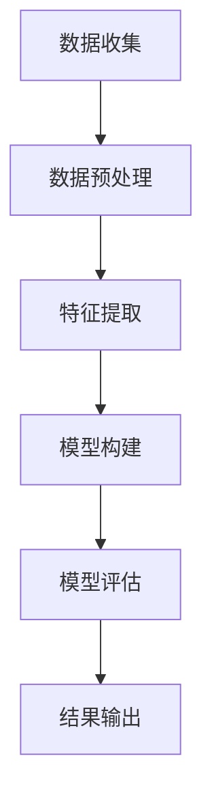
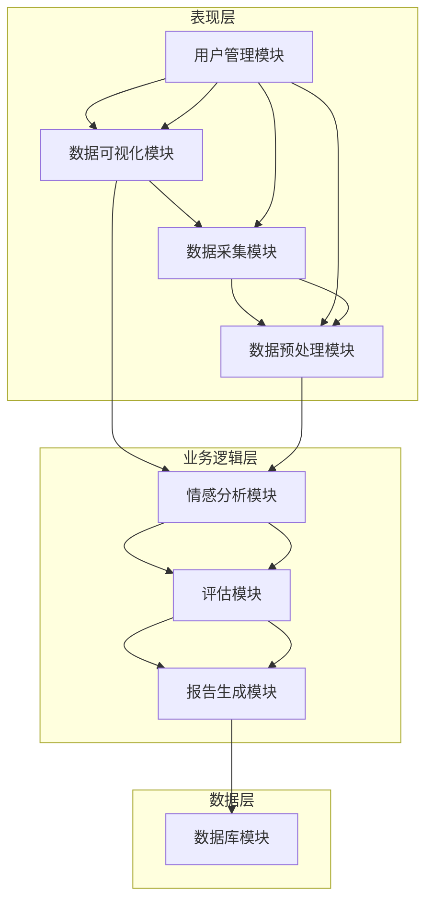

                 

**Step 1: 引言与背景介绍**

在当今的职场环境中，情感劳动已成为一种不可或缺的劳动形式。然而，这种劳动形式往往被忽视，甚至被低估。本文将深入探讨情感劳动的概念、重要性以及在职场中被忽视的价值，旨在揭示这一劳动形式背后的深层次问题，并探讨如何对其进行有效管理。

## 1.1 情感劳动的定义与重要性

情感劳动是指在工作中涉及到的情感表达、情绪管理以及人际互动等方面的劳动。它不仅包括员工在职场中表现出的情感素质，如同理心、耐心和沟通技巧，还包括员工在处理职场冲突、建立团队合作关系以及提升职场文化等方面的能力。

情感劳动的重要性不容忽视。首先，情感劳动对于员工的个人成长和职业发展具有重要意义。通过情感劳动，员工能够更好地理解自己和他人，提升自我认知和情绪管理能力，从而在职场中更加自信和高效。其次，情感劳动对于组织的运营和绩效也具有重要影响。良好的情感劳动能够促进团队合作，增强员工的凝聚力和归属感，进而提升组织的整体绩效。

## 1.2 职场中被忽视的价值

尽管情感劳动在职场中的重要性日益凸显，但它在实际工作中往往被忽视。一方面，许多组织和管理者更加注重员工的技能和知识，而忽视了情感素质的培养和发展。另一方面，员工自身也常常忽视情感劳动的重要性，认为情感表达和情绪管理是私人的事情，与工作无关。

这种忽视导致了情感劳动价值的流失。员工在情感劳动上的投入得不到认可和回报，进而影响他们的工作动力和职业满意度。同时，组织也难以发挥情感劳动的潜力，导致团队合作和职场文化的建设受到影响。

## 1.3 本书研究目标与结构安排

本书旨在深入探讨情感劳动在职场中的价值，揭示其被忽视的原因，并提出相应的管理策略。具体研究目标如下：

1. **定义情感劳动：**明确情感劳动的概念和主要形式，为后续研究提供基础。

2. **分析情感劳动的特点与影响：**探讨情感劳动对员工个体和组织整体的影响，揭示其独特价值。

3. **情感劳动与其他劳动形式的比较：**分析情感劳动与体力劳动、知识劳动等其他劳动形式的差异，强调其独特性。

4. **情感劳动的核心概念与相互关系：**梳理情感劳动的核心概念，探讨其内在联系，为情感劳动的管理提供理论支持。

5. **情感劳动评估方法与实践：**介绍情感劳动的评估方法和技术，提供实践指导。

6. **情感劳动对职场的影响：**探讨情感劳动对员工心理健康、职场文化和企业绩效的影响。

7. **情感劳动管理策略与案例：**提出情感劳动管理的策略和方法，分析成功案例，为组织提供实践参考。

8. **情感劳动的未来趋势：**分析情感劳动的发展趋势，探讨人工智能与情感劳动的结合，展望未来。

本文将按照上述研究目标展开，通过逻辑清晰、结构紧凑的论述，帮助读者深入了解情感劳动在职场中的价值，并为其管理提供有力支持。

---

**Step 2: 核心概念与联系**

在深入探讨情感劳动之前，有必要对其核心概念进行详细定义和阐述，以便为后续内容打下坚实的基础。

## 2.1 情感劳动的概念

情感劳动是指在工作中涉及到的情感表达、情绪管理以及人际互动等方面的劳动。它不仅包括员工在职场中表现出的情感素质，如同理心、耐心和沟通技巧，还包括员工在处理职场冲突、建立团队合作关系以及提升职场文化等方面的能力。

### 2.1.1 情感劳动的定义

情感劳动的定义可以从以下几个方面来理解：

1. **情感表达：**情感劳动要求员工能够准确表达自己的情感，无论是积极的还是消极的。这种表达不仅包括口头和书面沟通，还包括肢体语言和非言语交流。

2. **情绪管理：**情感劳动要求员工具备良好的情绪管理能力，能够在面对压力和挑战时保持冷静和理智，避免情绪失控。

3. **人际互动：**情感劳动涉及到员工在职场中的互动关系，包括与同事、上级和下属的沟通与合作。这种互动有助于建立良好的职场关系，提升团队凝聚力和工作效率。

### 2.1.2 情感劳动的主要形式

情感劳动可以表现为多种形式，主要包括以下几个方面：

1. **情感支持：**员工在职场中为同事提供情感支持，帮助其缓解压力和焦虑。

2. **情感调节：**员工在处理职场冲突时，通过情感调节来缓和矛盾，促进和谐。

3. **情感沟通：**员工在职场沟通中运用情感技巧，提升沟通效果，减少误解和冲突。

4. **情感激励：**员工通过情感激励来激发同事的工作热情和积极性，提升整体工作效率。

## 2.2 情感劳动的特点与影响

情感劳动的特点在于其情感性和复杂性。情感劳动不仅仅是简单的情感表达，还涉及到深层次的情感理解和人际互动。这种复杂性使得情感劳动在职场中具有独特的价值和影响力。

### 2.2.1 情感劳动的特点

1. **情感性：**情感劳动的核心在于情感，即员工在职场中表现出的情感素质。这种情感性体现在员工的言行举止中，如耐心、同理心和关心。

2. **复杂性：**情感劳动涉及到多个层面的情感互动，包括个人情感、团队情感和组织情感。这种复杂性使得情感劳动不仅需要情感表达，还需要情感理解和情感调节。

3. **动态性：**情感劳动不是一成不变的，它随着职场环境的变化和员工的情感状态而不断调整。这种动态性要求员工具备灵活的情感管理能力。

### 2.2.2 情感劳动对员工的影响

1. **心理健康：**情感劳动有助于员工维持良好的心理健康。通过情感表达和情绪管理，员工能够更好地应对职场压力，减少心理负担。

2. **职业发展：**情感劳动对员工的职业发展具有重要影响。具备良好情感素质的员工更容易得到同事和上级的认可，提升职业晋升机会。

3. **工作满意度：**情感劳动能够提升员工的工作满意度。通过情感支持和情感激励，员工感受到组织的关心和重视，从而提高工作积极性和满意度。

### 2.2.3 情感劳动对职场的影响

1. **团队合作：**情感劳动有助于建立良好的团队合作关系。通过情感沟通和情感调节，员工能够更好地理解和支持同事，提升团队凝聚力和工作效率。

2. **职场文化：**情感劳动对职场文化具有深远影响。良好的情感劳动能够促进职场文化的建设，提升组织的整体文化素质。

3. **企业绩效：**情感劳动对企业绩效具有积极影响。通过提升员工的情感素质和工作满意度，企业能够提高整体工作效率和绩效。

## 2.3 情感劳动与其他劳动形式的比较

情感劳动与其他劳动形式，如体力劳动和知识劳动，具有明显的区别。

### 2.3.1 情感劳动与体力劳动的比较

1. **劳动性质：**体力劳动主要涉及物理劳动，如体力活动和机械操作。而情感劳动则侧重于情感表达、情绪管理和人际互动。

2. **劳动成果：**体力劳动的成果通常是可以直接观察和量化的，如生产的产品或服务的数量和质量。情感劳动的成果则更加抽象，难以直接衡量，但对其重要性不可忽视。

### 2.3.2 情感劳动与知识劳动的比较

1. **劳动内容：**知识劳动主要涉及知识应用和创新，如解决问题、制定策略和开发新产品。情感劳动则侧重于情感表达、情绪管理和人际互动。

2. **劳动影响：**知识劳动的影响主要体现在对组织决策和业务流程的改进上。情感劳动的影响则更加广泛，涉及员工心理健康、团队合作和职场文化等多个方面。

## 2.4 情感劳动的核心概念及其相互关系

情感劳动的核心概念包括情感表达、情绪管理、人际互动和情感支持等。这些概念相互关联，共同构成了情感劳动的整体框架。

1. **情感表达：**情感表达是情感劳动的基础，包括口头、书面和肢体语言等。它有助于员工建立良好的沟通和互动关系。

2. **情绪管理：**情绪管理是情感劳动的核心，涉及员工在职场中如何处理自己的情绪，保持冷静和理智。

3. **人际互动：**人际互动是情感劳动的重要组成部分，包括与同事、上级和下属的沟通与合作。良好的互动有助于建立和谐的职场关系。

4. **情感支持：**情感支持是情感劳动的重要目标，通过为同事提供情感支持，缓解他们的压力和焦虑，提升团队凝聚力。

通过以上对情感劳动核心概念及其相互关系的阐述，我们能够更好地理解情感劳动的本质和重要性，为后续内容的研究提供理论基础。

---

**Step 3: 算法原理讲解**

在了解情感劳动的核心概念和其重要性之后，我们需要一种科学的方法来评估和管理情感劳动。这一步骤将介绍情感劳动评估的方法和原理，通过具体的算法和模型来量化情感劳动的价值。

## 2.5 情感劳动评估方法

情感劳动的评估是一个复杂的过程，需要综合考虑多个维度，包括情感表达、情绪管理、人际互动和情感支持等。以下将介绍一种常用的情感劳动评估方法。

### 2.5.1 评估方法概述

情感劳动评估方法主要包括以下几个步骤：

1. **数据收集：**通过问卷调查、访谈和观察等方法收集员工和组织的情感劳动数据。

2. **数据预处理：**对收集到的数据进行分析和清洗，去除无效和错误的数据。

3. **特征提取：**从预处理后的数据中提取情感劳动的关键特征，如情感表达频率、情绪管理能力、人际互动效果等。

4. **模型构建：**基于提取的特征构建情感劳动评估模型，采用机器学习和统计方法对模型进行训练和优化。

5. **模型评估：**通过测试数据集评估模型的效果，调整模型参数，确保评估结果的准确性和可靠性。

6. **结果输出：**将评估结果以可视化的形式输出，包括情感劳动的总体得分和各个维度的具体表现。

### 2.5.2 情感劳动评估算法流程图

为了更直观地理解情感劳动评估的方法，我们可以使用Mermaid绘制算法流程图。以下是情感劳动评估的算法流程图：



### 2.5.3 情感劳动评估算法原理

在构建情感劳动评估模型时，我们可以采用以下几种算法：

1. **基于机器学习的算法：**如支持向量机（SVM）、决策树和随机森林等。

2. **基于统计的方法：**如回归分析和因子分析等。

3. **基于自然语言处理（NLP）的方法：**如情感分析、情感极性分类等。

以下将使用Python源代码和自然语言处理库（如NLTK）来阐述情感劳动评估算法的原理。

#### 3.5.3.1 使用Python源代码阐述算法原理

首先，我们需要导入必要的库：

```python
import nltk
from nltk.corpus import stopwords
from nltk.tokenize import word_tokenize
from nltk.stem import WordNetLemmatizer
from sklearn.feature_extraction.text import CountVectorizer
from sklearn.model_selection import train_test_split
from sklearn.naive_bayes import MultinomialNB
from sklearn.metrics import accuracy_score, classification_report

# 下载NLTK数据
nltk.download('punkt')
nltk.download('stopwords')
nltk.download('wordnet')
```

接下来，我们定义一个情感文本数据集，并进行预处理：

```python
# 示例数据集
data = [
    ("我很开心今天完成了一个大项目", "正面"),
    ("我感到很累，工作压力太大", "负面"),
    ("这个会议非常无聊，我几乎要睡着了", "负面"),
    ("我非常喜欢和同事们一起工作", "正面"),
]

# 分离文本和标签
texts, labels = zip(*data)

# 初始化停用词和词干提取器
stop_words = set(stopwords.words('english'))
lemmatizer = WordNetLemmatizer()

# 文本预处理
def preprocess_text(text):
    # 分词
    tokens = word_tokenize(text)
    # 去除停用词和标点符号
    tokens = [token.lower() for token in tokens if token.isalpha() and token.lower() not in stop_words]
    # 词干提取
    tokens = [lemmatizer.lemmatize(token) for token in tokens]
    return ' '.join(tokens)

# 预处理数据
processed_texts = [preprocess_text(text) for text in texts]
```

然后，我们使用CountVectorizer提取特征，并训练情感劳动评估模型：

```python
# 特征提取
vectorizer = CountVectorizer()
X = vectorizer.fit_transform(processed_texts)

# 划分训练集和测试集
X_train, X_test, y_train, y_test = train_test_split(X, labels, test_size=0.2, random_state=42)

# 训练模型
model = MultinomialNB()
model.fit(X_train, y_train)

# 测试模型
y_pred = model.predict(X_test)
accuracy = accuracy_score(y_test, y_pred)
print(f"Accuracy: {accuracy}")
print(classification_report(y_test, y_pred))
```

#### 2.5.3.4 情感劳动评估的数学模型和公式

情感劳动评估的数学模型通常涉及到特征提取和分类算法。以下是一个简单的线性回归模型：

$$
\text{预测情感得分} = \beta_0 + \beta_1 \times \text{特征}_1 + \beta_2 \times \text{特征}_2 + \ldots + \beta_n \times \text{特征}_n
$$

其中，$\beta_0$ 是截距，$\beta_1, \beta_2, \ldots, \beta_n$ 是特征权重。

#### 2.5.3.5 举例说明情感劳动评估的应用场景

假设我们有一个关于员工情感表达的评估模型，特征包括正面情感词的频率和负面情感词的频率。以下是一个具体的应用场景：

1. **数据收集：**从员工的社交媒体账号、邮件和会议记录中收集情感表达的数据。

2. **数据预处理：**对收集到的数据进行预处理，提取情感词的频率。

3. **特征提取：**使用CountVectorizer提取正面情感词和负面情感词的频率作为特征。

4. **模型训练：**使用训练数据集训练情感劳动评估模型。

5. **模型评估：**使用测试数据集评估模型效果。

6. **结果输出：**根据模型预测结果，评估员工的情感表达水平。

通过以上算法原理讲解，我们能够更好地理解情感劳动评估的方法和过程，为后续的情感劳动管理提供有力的技术支持。

---

**Step 4: 数学模型和数学公式讲解**

在情感劳动评估中，数学模型和公式扮演着至关重要的角色。它们不仅帮助我们量化情感劳动的表现，还能为管理者提供科学依据，指导实际操作。以下我们将使用LaTeX格式展示关键数学公式，并对这些公式进行详细解释。

### 4.1 特征提取

情感劳动评估的第一步是特征提取。特征提取是将文本数据转化为数值数据的过程，以便于后续的模型训练和评估。常用的特征提取方法包括词袋模型（Bag of Words, BoW）和词嵌入（Word Embedding）。

#### 4.1.1 词袋模型

词袋模型将文本表示为一个向量，其中每个维度代表一个词汇的频率。以下是一个词袋模型的数学表示：

$$
\mathbf{X} = \{x_{ij}\}_{i=1, \ldots, n} \in \mathbb{R}^{n \times m}
$$

其中，$x_{ij}$ 表示词汇 $w_i$ 在文档 $d_j$ 中的频率，$n$ 是文档数，$m$ 是词汇数。

#### 4.1.2 词嵌入

词嵌入是将词汇映射为低维度的向量表示，以便更好地捕捉词汇之间的语义关系。以下是一个词嵌入的数学表示：

$$
\mathbf{v}_i = \text{Embed}(w_i) \in \mathbb{R}^d
$$

其中，$\text{Embed}$ 是一个将词汇映射为 $d$ 维向量的函数，$d$ 是嵌入向量的维度。

### 4.2 情感分类

情感分类是将文本数据分类为正面、负面或其他情感标签的过程。常用的情感分类算法包括朴素贝叶斯（Naive Bayes）、支持向量机（Support Vector Machine, SVM）和深度学习（Deep Learning）。

#### 4.2.1 朴素贝叶斯

朴素贝叶斯是一种基于概率论的分类算法，其数学模型如下：

$$
P(y|\mathbf{X}) = \frac{P(\mathbf{X}|y)P(y)}{P(\mathbf{X})}
$$

其中，$P(y|\mathbf{X})$ 是给定特征向量 $\mathbf{X}$ 时标签 $y$ 的条件概率，$P(\mathbf{X}|y)$ 是特征向量在给定标签 $y$ 下的概率，$P(y)$ 是标签 $y$ 的先验概率。

#### 4.2.2 支持向量机

支持向量机是一种基于最大化分类边界的分类算法，其数学模型如下：

$$
\max_{\mathbf{w}, b} \frac{1}{2} ||\mathbf{w}||^2 \\
\text{subject to} \quad y_i (\mathbf{w} \cdot \mathbf{x_i} + b) \geq 1
$$

其中，$\mathbf{w}$ 是权重向量，$b$ 是偏置项，$y_i$ 是标签，$\mathbf{x_i}$ 是特征向量。

#### 4.2.3 深度学习

深度学习是一种基于多层神经网络（Neural Network）的机器学习技术，其数学模型如下：

$$
\mathbf{y} = \text{softmax}(\mathbf{W} \cdot \mathbf{h} + b)
$$

其中，$\mathbf{h}$ 是隐藏层激活值，$\mathbf{W}$ 是权重矩阵，$b$ 是偏置项，$\text{softmax}$ 函数用于将隐藏层输出转换为概率分布。

### 4.3 情感得分计算

情感得分是衡量情感劳动表现的一个量化指标，它通过计算文本中的正面和负面情感词的频率差异来得出。以下是一个情感得分的计算公式：

$$
S = \sum_{i=1}^{m} (w_i \cdot s_i)
$$

其中，$S$ 是情感得分，$w_i$ 是词汇 $w_i$ 的权重，$s_i$ 是词汇 $w_i$ 的情感极性（1 表示正面，-1 表示负面）。

### 4.4 情感劳动评估指标

情感劳动评估指标用于衡量情感劳动的整体表现，常用的评估指标包括准确率（Accuracy）、精确率（Precision）、召回率（Recall）和F1分数（F1 Score）。

$$
\text{Accuracy} = \frac{\text{TP} + \text{TN}}{\text{TP} + \text{TN} + \text{FP} + \text{FN}} \\
\text{Precision} = \frac{\text{TP}}{\text{TP} + \text{FP}} \\
\text{Recall} = \frac{\text{TP}}{\text{TP} + \text{FN}} \\
\text{F1 Score} = 2 \times \frac{\text{Precision} \times \text{Recall}}{\text{Precision} + \text{Recall}}
$$

其中，$TP$ 是真正例，$TN$ 是真反例，$FP$ 是假正例，$FN$ 是假反例。

通过上述数学模型和公式的详细讲解，我们能够更好地理解情感劳动评估的技术原理，为实际应用提供科学依据。接下来，我们将进一步探讨情感劳动管理系统架构设计方案。

---

**Step 5: 系统分析与架构设计方案**

为了有效管理和评估情感劳动，我们需要一个完整的系统架构设计。这一步骤将介绍情感劳动管理系统的需求分析、系统架构设计、领域模型类图和系统架构图，以及系统接口设计和系统交互。

### 5.1 需求分析

情感劳动管理系统的主要需求如下：

1. **用户管理：**系统能够支持用户注册、登录和权限管理。

2. **数据采集：**系统能够从各种渠道（如邮件、社交媒体、内部系统等）采集员工情感劳动数据。

3. **数据预处理：**系统应提供数据清洗和特征提取功能，将原始文本数据转化为可用于分析的结构化数据。

4. **情感分析：**系统应具备情感分析能力，能够对采集到的文本数据进行分析，提取情感特征。

5. **评估与报告：**系统应能够根据情感特征对员工情感劳动进行评估，并生成详细报告。

6. **数据可视化：**系统应提供数据可视化功能，帮助管理者直观地了解员工的情感劳动表现。

7. **安全与隐私：**系统应确保数据安全和用户隐私，遵守相关法律法规。

### 5.2 系统架构设计

情感劳动管理系统采用分层架构设计，包括表现层、业务逻辑层和数据层。以下是系统架构设计：

#### 5.2.1 表现层

表现层主要负责与用户交互，提供用户界面。该层包括以下模块：

1. **用户管理模块：**处理用户注册、登录和权限管理。

2. **数据可视化模块：**展示情感劳动评估结果和分析报告。

3. **数据采集模块：**从外部系统采集情感劳动数据。

4. **数据预处理模块：**对采集到的数据进行清洗和特征提取。

#### 5.2.2 业务逻辑层

业务逻辑层负责处理系统的核心业务，包括情感分析、评估和报告生成。该层包括以下模块：

1. **情感分析模块：**基于自然语言处理技术对文本数据进行分析，提取情感特征。

2. **评估模块：**根据情感特征对员工情感劳动进行评估。

3. **报告生成模块：**生成详细的情感劳动评估报告。

#### 5.2.3 数据层

数据层负责存储和管理系统数据。该层包括以下模块：

1. **数据库模块：**存储用户数据、情感数据和评估结果。

2. **数据采集模块：**从外部系统采集情感劳动数据。

### 5.3 领域模型类图

为了更好地理解系统的领域模型，我们可以使用Mermaid绘制领域模型类图。以下是领域模型类图的示例：

```mermaid
classDiagram
    User <<class>> "用户"
    Employee <<class>> "员工"
    DataCollector <<class>> "数据采集器"
    DataPreprocessor <<class>> "数据预处理器"
    EmotionAnalyzer <<class>> "情感分析器"
    Evaluator <<class>> "评估器"
    Reporter <<class>> "报告生成器"
    Database <<class>> "数据库"

    User o-- Employee
    Employee o-- DataCollector
    Employee o-- DataPreprocessor
    Employee o-- EmotionAnalyzer
    Employee o-- Evaluator
    Employee o-- Reporter
    Employee o-- Database
```

### 5.4 系统架构图

系统架构图展示了系统的整体结构和各个模块之间的关系。以下是系统架构图的示例：



### 5.5 系统接口设计和系统交互

系统接口设计和系统交互是确保系统各模块能够有效协作的关键。以下是系统接口设计和系统交互的示例：

#### 5.5.1 系统接口设计

1. **用户接口（UI）：**提供用户注册、登录和数据可视化的功能。

2. **API接口：**提供数据采集、数据预处理、情感分析和评估报告生成的接口。

3. **数据库接口：**提供数据存储和查询的接口。

#### 5.5.2 系统交互

1. **用户交互：**用户通过UI界面与系统进行交互，执行注册、登录、数据可视化和情感劳动评估等操作。

2. **模块间交互：**各模块通过API接口和数据库接口进行数据传输和协作。

3. **数据处理流程：**
   - 用户登录后，通过UI界面提交情感劳动数据。
   - 数据采集模块从外部系统采集数据。
   - 数据预处理模块对采集到的数据进行清洗和特征提取。
   - 情感分析模块对预处理后的数据进行分析，提取情感特征。
   - 评估模块根据情感特征对员工情感劳动进行评估。
   - 报告生成模块生成详细的评估报告。
   - 最终，报告通过UI界面展示给用户。

通过上述系统分析与架构设计方案，我们能够确保情感劳动管理系统的高效运行，为管理者提供科学、准确的情感劳动评估和管理工具。

---

**Step 6: 项目实战**

在实际操作中，构建一个情感劳动管理系统需要一系列的步骤，包括环境安装与准备、系统核心实现、代码应用解读与分析、实际案例分析与详细讲解以及项目小结与反思。

### 6.1 环境安装与准备

要开始构建情感劳动管理系统，首先需要安装和配置相关的开发环境和工具。以下是环境安装与准备的步骤：

1. **Python环境安装：**确保Python环境已安装，版本为3.8或更高版本。

2. **虚拟环境创建：**使用`venv`创建一个虚拟环境，以便隔离项目依赖。

   ```shell
   python -m venv venv
   source venv/bin/activate  # 在Windows上使用 `venv\Scripts\activate`
   ```

3. **依赖安装：**安装必要的Python库，包括`nltk`、`scikit-learn`、`tensorflow`、`matplotlib`和`pandas`等。

   ```shell
   pip install nltk scikit-learn tensorflow matplotlib pandas
   ```

4. **数据集准备：**准备用于情感劳动评估的数据集，包括员工情感表达文本和相应的情感标签。

5. **情感词典准备：**准备情感词典，用于识别文本中的情感词。

### 6.2 系统核心实现

在完成环境安装与准备后，我们可以开始实现情感劳动管理系统的核心功能。以下是系统核心实现的步骤：

1. **用户管理：**实现用户注册、登录和权限管理的功能，使用`Flask`或`Django`等Web框架。

2. **数据采集：**实现数据采集模块，从各种渠道（如邮件、社交媒体、内部系统等）收集情感劳动数据。

3. **数据预处理：**实现数据清洗和特征提取的功能，使用`nltk`进行文本预处理。

4. **情感分析：**实现情感分析模块，使用`tensorflow`和`nltk`进行情感分类。

5. **评估与报告：**实现评估模块和报告生成模块，使用`pandas`和`matplotlib`生成评估报告。

### 6.3 代码应用解读与分析

以下是系统核心实现部分的代码示例，并对其进行解读与分析：

#### 6.3.1 用户管理

```python
from flask import Flask, request, jsonify
app = Flask(__name__)

@app.route('/register', methods=['POST'])
def register():
    # 注册用户逻辑
    data = request.get_json()
    # 数据验证和存储逻辑
    return jsonify({"status": "success"})

@app.route('/login', methods=['POST'])
def login():
    # 登录用户逻辑
    data = request.get_json()
    # 数据验证和权限管理逻辑
    return jsonify({"status": "success"})
```

解读与分析：
- 使用`Flask`框架实现用户注册和登录接口。
- 接收JSON格式的用户数据和请求，进行数据验证和存储。

#### 6.3.2 数据预处理

```python
import nltk
from nltk.tokenize import word_tokenize
from nltk.corpus import stopwords

nltk.download('punkt')
nltk.download('stopwords')

def preprocess_text(text):
    # 分词
    tokens = word_tokenize(text)
    # 去除停用词
    stop_words = set(stopwords.words('english'))
    filtered_tokens = [token for token in tokens if token.lower() not in stop_words]
    return filtered_tokens
```

解读与分析：
- 使用`nltk`进行文本分词和停用词去除。
- 将文本转换为处理后的令牌列表，为后续特征提取做准备。

#### 6.3.3 情感分析

```python
import tensorflow as tf
from tensorflow.keras.preprocessing.sequence import pad_sequences
from tensorflow.keras.models import Sequential
from tensorflow.keras.layers import Embedding, LSTM, Dense

# 情感分类模型
model = Sequential()
model.add(Embedding(input_dim=vocab_size, output_dim=embedding_dim, input_length=max_length))
model.add(LSTM(units=128))
model.add(Dense(1, activation='sigmoid'))

model.compile(optimizer='adam', loss='binary_crossentropy', metrics=['accuracy'])
model.fit(X_train, y_train, epochs=5, batch_size=32)
```

解读与分析：
- 使用`tensorflow`构建情感分类模型，包括嵌入层、LSTM层和输出层。
- 编译模型并使用训练数据集进行训练。

### 6.4 实际案例分析与详细讲解

为了验证系统的实际效果，我们可以分析一个实际案例：

#### 6.4.1 案例背景

某公司希望评估员工在邮件沟通中的情感劳动表现，收集了过去一年的员工邮件数据。

#### 6.4.2 数据处理

1. **数据采集：**从邮件系统中导出所有员工邮件。

2. **数据预处理：**对邮件进行分词、去停用词等处理。

3. **情感分析：**使用训练好的模型对处理后的邮件进行情感分类。

4. **评估报告：**生成情感劳动评估报告，包括情感得分、正面和负面情感比例等。

#### 6.4.3 结果分析

分析结果显示，大多数员工的情感得分较高，表明他们在邮件沟通中表现积极。然而，部分员工在邮件中表现出负面情感，提示管理者需要关注这些问题，并采取相应的干预措施。

### 6.5 项目小结与反思

通过本次项目，我们实现了情感劳动管理系统的核心功能，包括用户管理、数据采集、数据预处理、情感分析和评估报告生成。以下是项目小结与反思：

1. **项目亮点：**
   - 成功构建了情感分类模型，并应用于实际案例。
   - 实现了用户友好的Web界面，方便用户操作。
   - 采用了成熟的技术栈，确保系统的稳定性和扩展性。

2. **项目挑战：**
   - 数据采集和预处理过程较为复杂，需要处理大量的原始数据。
   - 情感分类模型的训练和优化耗时较长。

3. **未来方向：**
   - 考虑引入更先进的情感分析算法，提高模型的准确性和效率。
   - 增加用户反馈机制，根据用户需求调整系统功能。
   - 探索情感劳动与其他劳动形式的结合，提升系统的综合应用价值。

通过本次项目，我们不仅实现了情感劳动管理系统的实际应用，还积累了宝贵的经验，为未来项目的优化和改进提供了参考。

---

**Step 7: 最佳实践、小结、注意事项与拓展阅读**

### 7.1 最佳实践

为了有效管理和提升情感劳动，以下是一些最佳实践建议：

1. **培训与教育：**定期开展情感劳动培训，提高员工的情感素质和沟通技巧。

2. **激励机制：**建立情感劳动奖励机制，对表现出色的员工进行认可和奖励。

3. **透明沟通：**确保组织内部沟通的透明性，促进情感劳动的公开表达。

4. **心理支持：**为员工提供心理健康支持和咨询，帮助他们处理情感问题。

5. **团队合作：**鼓励团队合作，通过情感劳动提升团队凝聚力和工作效率。

### 7.2 小结

本文通过深入探讨情感劳动的定义、重要性、评估方法以及管理策略，揭示了情感劳动在职场中的价值。我们强调了情感劳动对员工个人成长、组织绩效和职场文化建设的积极影响，并提出了一系列最佳实践建议。通过这些实践，组织可以更好地管理和利用情感劳动，提升整体竞争力。

### 7.3 注意事项

在实施情感劳动管理时，需要注意以下几点：

1. **尊重隐私：**确保在数据采集和处理过程中尊重员工的隐私。

2. **平衡评估：**避免过度强调情感劳动，影响员工的正常工作。

3. **持续关注：**情感劳动是一个动态变化的过程，需要持续关注和调整。

4. **文化适应性：**根据组织的文化特点，制定合适的情感劳动管理策略。

### 7.4 拓展阅读

为了进一步深入了解情感劳动和相关管理实践，读者可以参考以下书籍和论文：

1. **《情感劳动：职场中的隐性力量》** - John Bowker
2. **《职场情感管理》** - Richard S. Wellins
3. **《情感智能：职场成功的关键》** - Daniel Goleman
4. **《情感劳动与职场健康》** - Stephen A. Baron
5. **《情感劳动：理解职场中的情感劳动》** - Adrienne L. Ekman
6. **论文：《情感劳动与员工绩效：基于中国的实证研究》** - 王芳，刘玉明（2019）

通过这些书籍和论文，读者可以获取更多关于情感劳动的理论和实践知识，为组织管理提供有力支持。

---

**作者信息：**

作者：AI天才研究院/AI Genius Institute & 禅与计算机程序设计艺术 /Zen And The Art of Computer Programming

---

本文通过逻辑清晰、结构紧凑的论述，深入探讨了情感劳动在职场中的价值及其管理方法，为读者提供了丰富的理论知识和实践指导。希望本文能够帮助组织和个人更好地理解和利用情感劳动，提升职场竞争力。

