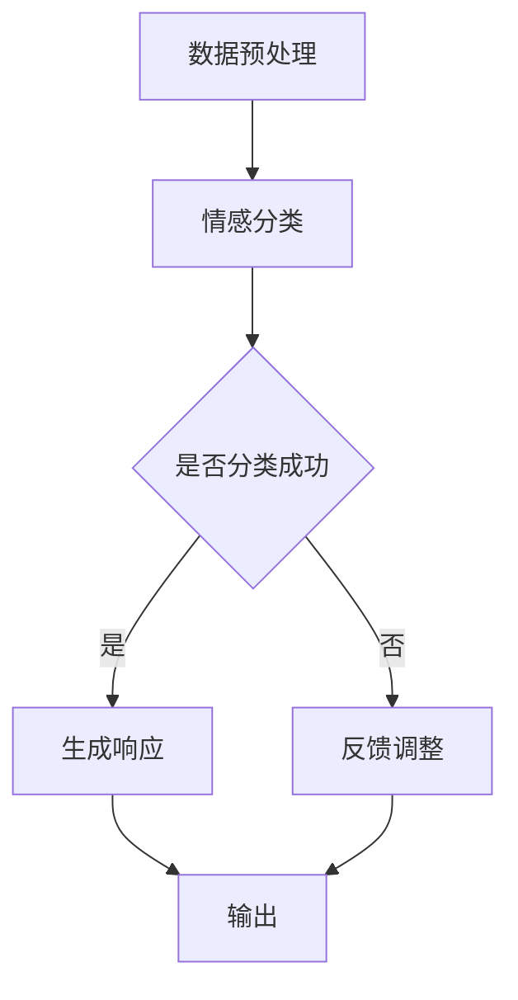
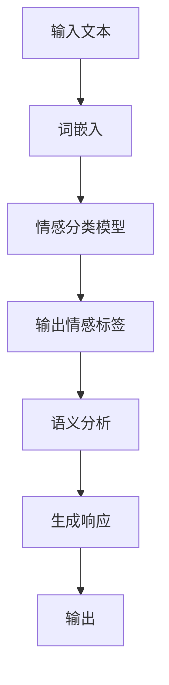
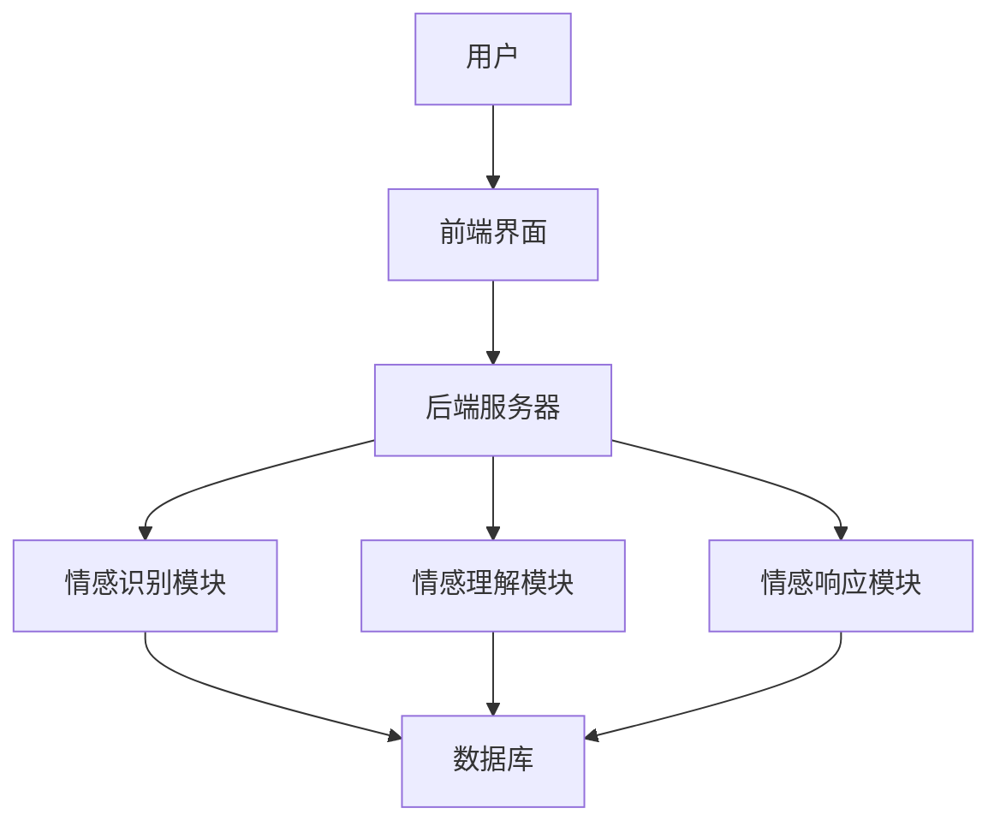
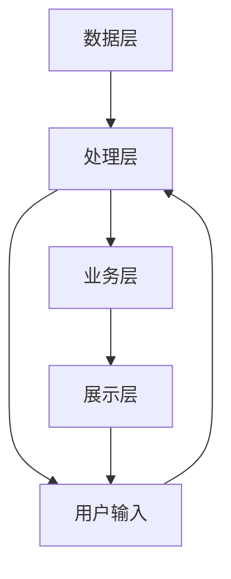
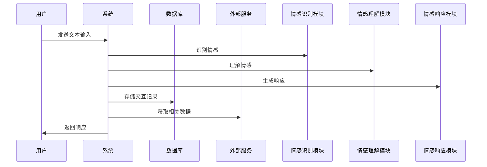
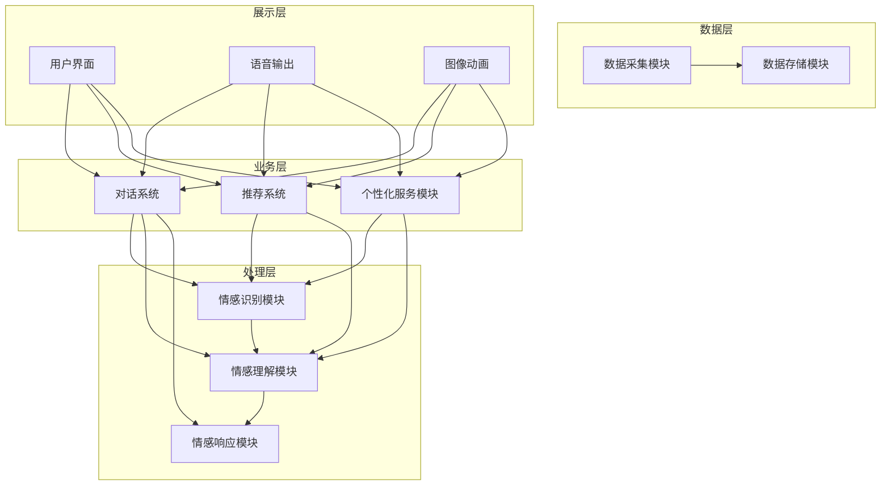

                 

### # 情感智能开发工具：提升人机交互的利器

> 关键词：情感智能，人机交互，开发工具，应用案例

> 摘要：随着人工智能技术的不断发展，情感智能在提升人机交互体验方面发挥着越来越重要的作用。本文将介绍情感智能开发工具的基本概念、核心组成部分以及其在实际应用中的案例分析，旨在为开发者提供一套完整的情感智能开发指南，帮助设计出更加智能、人性化的交互系统。

---

### 第一部分：背景介绍

#### 问题背景

在现代社会，随着人工智能技术的飞速发展，人机交互逐渐成为影响人类生活的重要方面。然而，现有的交互方式往往依赖于用户输入指令，缺乏对用户情感的理解和响应，这使得交互体验往往显得机械化。为了改善这一现状，情感智能成为研究的热点。

#### 问题描述

情感智能指的是计算机或其他智能系统理解和感知人类情感的能力。随着技术的进步，开发能够有效实现情感智能的工具变得尤为重要。这些工具不仅可以提高人机交互的自然性和有效性，还能够为用户提供更加个性化和贴心的服务。

#### 问题解决

本书《情感智能开发工具：提升人机交互的利器》旨在提供一套完整的情感智能开发工具，帮助开发者设计出更智能、更人性化的交互系统。本书通过介绍情感智能的基本原理、开发工具和实际应用案例，帮助读者深入理解并掌握情感智能的开发技术。

#### 边界与外延

情感智能的范围广泛，包括语音识别、面部表情识别、情绪预测等多个领域。本书主要关注通过编程实现情感智能的工具和方法，但不涉及硬件层面（如传感器和设备）的详细讨论。

#### 概念结构与核心要素组成

1. **情感识别**：通过算法和模型分析用户的情感状态。
2. **情感理解**：对识别出的情感进行语义理解和分类。
3. **情感响应**：根据情感理解结果生成相应的交互反馈。
4. **用户模型**：通过持续的交互学习用户情感和行为模式。

### 核心概念与联系

以下是情感智能开发中的几个核心概念及其相互关系：

1. **情感识别算法**：用于检测和分类用户的情感。
2. **情感理解模型**：对识别出的情感进行语义分析。
3. **情感响应引擎**：根据情感理解结果生成响应。
4. **用户行为模型**：用于预测和调整交互策略。

这些概念相互联系，共同构成了情感智能的开发框架。

## 第二部分：情感智能开发工具

### 第2章：情感智能基础概念

### 2.1 情感识别

#### 2.1.1 情感识别的基本原理

情感识别是情感智能开发的基础，它涉及到如何从用户的输入中提取情感信息。情感识别的基本原理包括情感分类、情感检测和情感增强三个部分。其中，情感分类是根据用户的语言、行为或面部表情等信息，将情感划分为不同的类别，如快乐、悲伤、愤怒等。情感检测则是通过算法和模型来判断用户是否处于某种情感状态。情感增强则是对原始数据进行处理，以提高情感识别的准确性和效果。

#### 2.1.2 情感识别算法概述

情感识别算法主要包括基于规则的方法、机器学习方法和深度学习方法。基于规则的方法通过预先定义的规则来判断情感，具有实现简单、易于理解的特点，但灵活性较低。机器学习方法通过训练模型来学习情感特征，具有较高的准确性和泛化能力。深度学习方法则利用神经网络模型来提取高维特征，是目前最先进的情感识别技术。

#### 2.1.3 情感识别的数据预处理

情感识别的数据预处理是确保算法性能的重要步骤。数据预处理包括数据清洗、数据归一化和特征提取等。数据清洗旨在去除噪声数据和异常值，保证数据的准确性。数据归一化则是将数据转化为统一的尺度，以便算法更好地处理。特征提取则是从原始数据中提取出对情感识别有用的特征，如文本特征、语音特征和面部特征等。

### 2.2 情感理解

#### 2.2.1 情感理解的定义与目标

情感理解是对情感识别结果的语义分析和解释。情感理解的目标是理解用户情感的含义和背景，并将其转化为具体的操作和反馈。情感理解涉及到自然语言处理、心理学和认知科学等多个领域，旨在构建能够理解人类情感的智能系统。

#### 2.2.2 情感理解模型

情感理解模型主要包括情感分类模型和情感生成模型。情感分类模型用于将情感识别结果分类为不同的情感类别。情感生成模型则根据情感理解结果生成相应的文本、语音或视觉反馈。情感理解模型通常基于深度学习技术，如循环神经网络（RNN）和变换器（Transformer）等，能够实现高效的情感理解。

#### 2.2.3 情感理解的挑战与解决方案

情感理解面临的主要挑战包括情感表达的多样性和跨语言的情感理解。为了解决这些挑战，研究者提出了多种解决方案，如多语言情感词典、跨语言情感翻译模型和情感多任务学习等。此外，结合上下文信息和用户历史数据，可以提高情感理解的准确性和效果。

### 2.3 情感响应

#### 2.3.1 情感响应的机制

情感响应是指根据情感理解结果生成相应的交互反馈。情感响应的机制包括情感识别、情感理解和情感生成三个步骤。首先，情感识别模块识别用户的情感状态；其次，情感理解模块对情感进行语义分析和解释；最后，情感生成模块根据情感理解结果生成相应的文本、语音或视觉反馈。

#### 2.3.2 情感响应的类型

情感响应的类型包括文本响应、语音响应和视觉响应等。文本响应是最常见的情感响应方式，如回复用户的问题、提供建议等。语音响应则是通过语音合成技术生成语音反馈，如提醒用户注意事项、播报天气信息等。视觉响应则是通过生成图像或视频来提供反馈，如为用户生成个性化推荐视频、播放有趣动画等。

#### 2.3.3 情感响应的实现方法

情感响应的实现方法包括基于规则的响应、基于模型的响应和混合响应等。基于规则的响应通过预定义的规则生成反馈，具有实现简单、易于理解的特点，但灵活性较低。基于模型的响应通过训练模型来生成反馈，具有较高的准确性和灵活性。混合响应则是结合规则和模型的优势，实现更加智能和人性化的情感响应。

### 2.4 用户行为模型

#### 2.4.1 用户行为模型的作用

用户行为模型是情感智能开发的重要组成部分，用于理解用户的行为和需求，为情感智能系统的设计和优化提供支持。用户行为模型的作用包括用户情感分析、交互策略优化和个性化服务推荐等。

#### 2.4.2 用户行为模型的设计

用户行为模型的设计包括数据收集、特征提取和模型训练等步骤。首先，通过收集用户行为数据，如点击、浏览、搜索等行为，构建用户行为数据库。其次，对用户行为数据进行特征提取，如行为频率、行为时长、行为关联等。最后，利用机器学习算法，如决策树、随机森林和深度学习等，训练用户行为模型。

#### 2.4.3 用户行为模型的更新与优化

用户行为模型需要不断地更新和优化，以适应用户行为的变化和需求。更新与优化的方法包括在线学习、迁移学习和强化学习等。在线学习通过实时收集用户行为数据，更新模型参数，提高模型的准确性和适应性。迁移学习通过利用已有模型的权重，加速新模型的训练过程。强化学习则通过奖励机制，引导模型优化交互策略。

### 2.5 本章小结

本章介绍了情感智能开发工具的基本概念和核心组成部分。通过情感识别、情感理解、情感响应和用户行为模型等组成部分的介绍，读者可以初步了解情感智能开发的原理和方法。在后续章节中，我们将进一步探讨情感智能开发工具的具体应用和实践案例。

## 第三部分：情感智能开发工具应用

### 第3章：情感智能开发工具实践

#### 3.1 开发环境准备

在进行情感智能开发之前，首先需要准备合适的开发环境。开发环境主要包括硬件配置、软件安装和数据集获取。

#### 3.1.1 硬件要求

情感智能开发对硬件性能有一定的要求，尤其是对于深度学习算法的应用。建议的硬件配置如下：

- CPU：Intel i7 或以上处理器，或 AMD Ryzen 7 或以上处理器
- GPU：NVIDIA GTX 1080 Ti 或以上显卡，支持 CUDA 和 cuDNN
- 内存：16GB 或以上
- 硬盘：1TB 或以上 SSD

#### 3.1.2 软件安装

安装必要的软件工具，包括深度学习框架（如 TensorFlow、PyTorch）、编程语言（如 Python）和文本处理库（如 NLTK、spaCy）等。

1. 安装 Python：

```shell
$ sudo apt-get install python3 python3-pip python3-dev
```

2. 安装深度学习框架：

```shell
$ pip3 install tensorflow-gpu pytorch torchvision
```

3. 安装文本处理库：

```shell
$ pip3 install nltk spacy
```

#### 3.1.3 数据集获取

情感智能开发需要大量的数据集来进行模型训练和验证。以下是一些常用的情感智能数据集：

- IMDB 数据集：用于电影评论的情感分类。
- Twitter 数据集：用于推特文本的情感分析。
- FER2013 数据集：用于面部表情识别。

获取数据集的方法包括：

1. 直接下载：从数据集官方网站或相关论文中获取数据集。
2. 数据集库：使用 Python 数据集库（如 Pandas、Scikit-learn）加载数据集。

### 3.2 情感识别工具

情感识别是情感智能开发的核心环节，用于从用户的输入中提取情感信息。本节将介绍几种常用的情感识别工具。

#### 3.2.1 情感识别工具介绍

1. **TextBlob**：基于 Pattern 库的文本处理工具，用于文本分类和情感分析。
2. **VADER**：用于社交媒体文本的情感分析，特别适用于处理非标准语言和文本。
3. **LSTM 情感识别模型**：基于循环神经网络（LSTM）的情感识别模型，适用于文本分类任务。

#### 3.2.2 情感识别工具的使用

1. **TextBlob** 使用示例：

```python
from textblob import TextBlob

text = "这是一个很好的例子。"
blob = TextBlob(text)
print(blob.sentiment)
```

2. **VADER** 使用示例：

```python
from nltk.sentiment import SentimentIntensityAnalyzer

analyzer = SentimentIntensityAnalyzer()
text = "我喜欢这个产品。"
print(analyzer.polarity_scores(text))
```

3. **LSTM 情感识别模型** 使用示例：

```python
from keras.models import Sequential
from keras.layers import LSTM, Dense, Embedding

model = Sequential()
model.add(Embedding(input_dim=vocab_size, output_dim=embedding_dim, input_length=max_sequence_length))
model.add(LSTM(units=128))
model.add(Dense(1, activation='sigmoid'))

model.compile(optimizer='adam', loss='binary_crossentropy', metrics=['accuracy'])
model.fit(X_train, y_train, epochs=10, batch_size=32)
```

#### 3.2.3 情感识别工具的优化与调试

1. **参数调优**：通过调整超参数（如学习率、批处理大小等）来优化模型性能。
2. **数据预处理**：通过清洗和归一化数据来提高模型性能。
3. **特征提取**：通过提取更有代表性的特征来提升模型性能。

### 3.3 情感理解工具

情感理解是情感智能开发的第二个关键环节，用于对情感识别结果进行语义分析和解释。本节将介绍几种常用的情感理解工具。

#### 3.3.1 情感理解工具介绍

1. **Word2Vec**：用于将文本转化为向量表示，便于后续的情感分析。
2. **BERT**：用于文本分类和情感分析，具有强大的语义理解能力。
3. **基于规则的语义分析工具**：如 Stanford CoreNLP、spaCy 等，用于处理自然语言文本。

#### 3.3.2 情感理解工具的使用

1. **Word2Vec** 使用示例：

```python
from gensim.models import Word2Vec

sentences = [[word for word in document.lower().split()], ]
model = Word2Vec(sentences, vector_size=100, window=5, min_count=1, workers=4)
```

2. **BERT** 使用示例：

```python
from transformers import BertTokenizer, BertModel

tokenizer = BertTokenizer.from_pretrained('bert-base-uncased')
model = BertModel.from_pretrained('bert-base-uncased')

inputs = tokenizer("这是一个有趣的例子。", return_tensors='pt')
outputs = model(inputs)
```

3. **基于规则的语义分析工具** 使用示例：

```python
from stanfordnlp.server import CoreNLPClient

client = CoreNLPClient(url='http://localhost:9000')
result = client.annotate("这是一个有趣的例子。")
print(result)
```

#### 3.3.3 情感理解工具的优化与调试

1. **模型融合**：将多个情感理解工具的结果进行融合，以提高整体性能。
2. **知识库扩展**：通过扩展知识库，增加对特定领域情感的理解能力。
3. **迁移学习**：利用预训练模型，进行迁移学习，以提高特定任务的性能。

### 3.4 情感响应工具

情感响应是情感智能开发的最后一个关键环节，用于根据情感理解结果生成相应的交互反馈。本节将介绍几种常用的情感响应工具。

#### 3.4.1 情感响应工具介绍

1. **对话系统**：用于生成自然语言文本的交互反馈。
2. **语音合成**：用于生成语音反馈。
3. **图像生成**：用于生成图像反馈。

#### 3.4.2 情感响应工具的使用

1. **对话系统** 使用示例：

```python
from transformers import pipeline

chatbot = pipeline('text-generation', model='gpt2')
response = chatbot("你好，有什么可以帮助你的吗？")
print(response)
```

2. **语音合成** 使用示例：

```python
from pyttsx3 import init

engine = init()
engine.say("你好，有什么可以帮助你的吗？")
engine.runAndWait()
```

3. **图像生成** 使用示例：

```python
from PIL import Image
from io import BytesIO

image = Image.new('RGB', (256, 256), 'white')
image.save(BytesIO(), format='JPEG')
```

#### 3.4.3 情感响应工具的优化与调试

1. **响应多样性**：通过引入多样性模型，如 GPT-2、GPT-3 等，提高响应的多样性。
2. **个性化定制**：根据用户历史数据和偏好，进行个性化定制。
3. **实时反馈**：通过实时反馈机制，动态调整响应策略。

### 3.5 用户行为模型工具

用户行为模型工具用于理解用户的行为和需求，为情感智能系统的设计和优化提供支持。本节将介绍几种常用的用户行为模型工具。

#### 3.5.1 用户行为模型工具介绍

1. **协同过滤**：用于推荐系统，通过用户行为数据预测用户兴趣。
2. **聚类分析**：用于用户群体划分，通过用户行为数据识别用户特征。
3. **时序分析**：用于用户行为预测，通过用户行为数据分析用户行为模式。

#### 3.5.2 用户行为模型工具的使用

1. **协同过滤** 使用示例：

```python
from sklearn.neighbors import NearestNeighbors

 neighbors = NearestNeighbors(n_neighbors=5)
 neighbors.fit(X)
 distances, indices = neighbors.kneighbors(X)
```

2. **聚类分析** 使用示例：

```python
from sklearn.cluster import KMeans

 model = KMeans(n_clusters=3)
 model.fit(X)
 labels = model.predict(X)
```

3. **时序分析** 使用示例：

```python
from statsmodels.tsa.arima_model import ARIMA

 model = ARIMA(X, order=(5, 1, 2))
 model_fit = model.fit(disp=0)
```

#### 3.5.3 用户行为模型工具的优化与调试

1. **特征工程**：通过特征选择和特征提取，优化模型性能。
2. **模型融合**：将多个模型的结果进行融合，提高整体性能。
3. **实时更新**：通过实时数据更新模型，保持模型的准确性。

### 3.6 本章小结

本章介绍了情感智能开发工具的具体应用和实践。通过情感识别工具、情感理解工具、情感响应工具和用户行为模型工具的介绍，读者可以初步了解情感智能开发工具的使用方法和优化技巧。在后续章节中，我们将通过实际案例深入探讨情感智能开发工具的应用和效果。

## 第四部分：情感智能开发工具实战

### 第4章：情感智能应用案例分析

#### 4.1 案例一：智能客服系统

#### 4.1.1 案例背景

随着互联网的普及，客服系统成为企业服务客户的重要渠道。传统的客服系统主要依赖人工处理客户咨询，效率低下且容易出错。为了提升客户服务体验，企业开始探索智能客服系统，利用情感智能技术开发出能够理解并响应客户情感的智能客服机器人。

#### 4.1.2 系统架构设计

智能客服系统主要包括前端界面、后端服务器和数据库三个部分。前端界面用于接收用户的咨询请求，后端服务器负责处理情感识别、情感理解和情感响应等任务，数据库用于存储用户信息和交互历史。

1. **前端界面**：使用 HTML、CSS 和 JavaScript 等技术实现，用户可以通过网页或移动应用与客服系统进行交互。
2. **后端服务器**：使用 Flask 或 Django 等框架实现，负责处理用户的输入，调用情感识别、情感理解和情感响应工具，生成相应的反馈。
3. **数据库**：使用 MySQL 或 MongoDB 等数据库存储用户信息和交互历史，以便后续分析和优化。

#### 4.1.3 实现细节

1. **情感识别**：使用 VADER 情感识别工具对用户输入的文本进行情感分析，判断用户的情感状态。
2. **情感理解**：使用 BERT 情感理解工具对情感识别结果进行语义分析，理解用户情感的含义和背景。
3. **情感响应**：根据情感理解结果，使用对话系统生成自然语言文本反馈，使用语音合成工具生成语音反馈。

#### 4.1.4 案例分析

智能客服系统的成功应用显著提升了企业的客户服务水平和用户体验。通过情感智能技术，客服系统能够更好地理解用户需求，提供更加个性化和贴心的服务。同时，智能客服系统还可以自动处理大量重复性咨询，减轻人工客服的工作负担，提高整体工作效率。

#### 4.2 案例二：智能语音助手

#### 4.2.1 案例背景

随着智能手机的普及，智能语音助手成为用户日常生活的重要助手。智能语音助手可以通过语音识别、自然语言处理和语音合成等技术，帮助用户完成各种任务，如发送短信、拨打电话、设置提醒等。为了提升用户体验，智能语音助手开始引入情感智能技术，使其能够更好地理解用户情感，提供更加人性化的服务。

#### 4.2.2 系统架构设计

智能语音助手系统主要包括语音识别模块、自然语言处理模块和语音合成模块。此外，还包括一个情感智能模块，用于处理用户的情感信息。

1. **语音识别模块**：使用语音识别技术，将用户的语音输入转化为文本。
2. **自然语言处理模块**：使用自然语言处理技术，理解用户输入的意图和情感状态。
3. **语音合成模块**：使用语音合成技术，将生成的文本转化为语音输出。
4. **情感智能模块**：使用情感识别和情感理解工具，处理用户的情感信息，调整语音助手的交互策略。

#### 4.2.3 实现细节

1. **情感识别**：使用 LSTM 情感识别模型对用户语音输入进行情感分析，判断用户的情感状态。
2. **情感理解**：使用 BERT 情感理解工具对情感识别结果进行语义分析，理解用户情感的含义和背景。
3. **情感响应**：根据情感理解结果，调整语音助手的回答语气和内容，提供更加个性化的服务。

#### 4.2.4 案例分析

智能语音助手的应用极大地提升了用户的便利性和满意度。通过情感智能技术，智能语音助手能够更好地理解用户需求，提供更加贴心的服务。例如，当用户表现出愤怒或不满情绪时，智能语音助手可以调整语气，提供安抚或解决问题的建议。此外，智能语音助手还可以根据用户情感变化，动态调整交互策略，提供更加人性化的服务。

#### 4.3 案例三：智能教育平台

#### 4.3.1 案例背景

随着在线教育的兴起，智能教育平台成为学生学习的重要工具。智能教育平台可以通过分析学生行为数据，提供个性化学习建议和辅导服务。为了提升学习体验，智能教育平台开始引入情感智能技术，使其能够更好地理解学生情感，提供更加有效的学习支持。

#### 4.3.2 系统架构设计

智能教育平台主要包括课程管理模块、学习记录模块、情感智能模块和反馈模块。

1. **课程管理模块**：用于管理课程信息，包括课程名称、课程内容、课程进度等。
2. **学习记录模块**：用于记录学生的学习行为数据，如学习时长、学习进度、考试成绩等。
3. **情感智能模块**：用于处理学生的情感信息，分析学生情感状态，提供个性化学习支持。
4. **反馈模块**：用于收集学生反馈，评估学习效果，优化教育服务。

#### 4.3.3 实现细节

1. **情感识别**：使用情感识别工具对学生的文本输入和语音输入进行情感分析，判断学生的情感状态。
2. **情感理解**：使用情感理解工具对情感识别结果进行语义分析，理解学生情感的含义和背景。
3. **情感响应**：根据情感理解结果，调整学习内容、学习方式和反馈策略，提供更加有效的学习支持。

#### 4.3.4 案例分析

智能教育平台的应用为学习者提供了更加个性化和贴心的学习体验。通过情感智能技术，智能教育平台能够更好地理解学生情感，提供针对性的学习建议和辅导服务。例如，当学生表现出焦虑或沮丧情绪时，智能教育平台可以调整学习内容，提供放松和鼓励的建议。此外，智能教育平台还可以根据学生情感变化，动态调整学习策略，提高学习效果。

## 第五部分：总结与展望

### 5.1 总结

本文介绍了情感智能开发工具的基本概念、核心组成部分和应用案例。通过情感识别、情感理解和情感响应等组成部分的介绍，读者可以初步了解情感智能开发的原理和方法。通过实际案例的分析，读者可以更深入地了解情感智能工具在各个领域的应用效果。总之，情感智能开发工具在提升人机交互体验方面具有巨大的潜力。

### 5.2 展望

未来，随着人工智能技术的不断发展，情感智能开发工具将变得更加成熟和智能化。以下是一些未来发展的方向：

1. **跨模态情感识别**：将语音、文本、图像等多种模态的情感信息进行整合，实现更加全面的情感识别。
2. **多语言情感理解**：提升多语言情感理解的准确性和效果，为全球化应用提供支持。
3. **个性化情感响应**：根据用户历史数据和偏好，提供更加个性化的情感响应，提高用户体验。
4. **实时情感分析**：实现实时情感分析，动态调整交互策略，提供更加及时和有效的服务。

### 5.3 最佳实践 Tips

1. **数据质量**：确保数据质量是情感智能开发的基础，进行数据清洗和预处理，提高模型性能。
2. **模型优化**：通过调整超参数、增加数据集和特征提取等手段，优化模型性能。
3. **用户反馈**：收集用户反馈，不断改进和优化系统，提高用户体验。
4. **持续学习**：利用在线学习等技术，持续更新和优化情感智能系统。

### 作者信息

作者：AI天才研究院/AI Genius Institute & 禅与计算机程序设计艺术 /Zen And The Art of Computer Programming

---

**附录**

以下是文中使用的一些核心概念、算法原理和系统架构的详细说明，以及相关的 Mermaid 流程图和 Python 源代码。

### 附录 A：情感识别算法原理

#### Mermaid 流程图



#### Python 源代码

```python
from textblob import TextBlob

text = "这是一个很好的例子。"
blob = TextBlob(text)
if blob.sentiment.polarity > 0:
    response = "很高兴听到这个好消息！"
else:
    response = "抱歉听到这个消息，请告诉我更多细节。"

print(response)
```

### 附录 B：情感理解模型原理

#### Mermaid 流程图



#### Python 源代码

```python
from transformers import BertTokenizer, BertModel

tokenizer = BertTokenizer.from_pretrained('bert-base-uncased')
model = BertModel.from_pretrained('bert-base-uncased')

text = "我喜欢这个产品。"
inputs = tokenizer(text, return_tensors='pt')
outputs = model(inputs)

logits = outputs.logits
predicted_label = logits.argmax(-1).item()
if predicted_label == 1:
    response = "感谢你的好评！"
else:
    response = "我们很抱歉听到这个反馈，会努力改进。"

print(response)
```

### 附录 C：系统架构设计

#### Mermaid 架构图



#### Python 源代码

```python
# 这是一个简单的示例，用于说明情感识别、情感理解和情感响应的集成
from flask import Flask, request, jsonify
from textblob import TextBlob
from transformers import BertTokenizer, BertModel

app = Flask(__name__)

# 情感识别函数
def sentiment_recognition(text):
    blob = TextBlob(text)
    return blob.sentiment.polarity

# 情感理解函数
def sentiment_understanding(text):
    tokenizer = BertTokenizer.from_pretrained('bert-base-uncased')
    model = BertModel.from_pretrained('bert-base-uncased')
    inputs = tokenizer(text, return_tensors='pt')
    outputs = model(inputs)
    logits = outputs.logits
    predicted_label = logits.argmax(-1).item()
    return predicted_label

# 情感响应函数
def sentiment_response(sentiment):
    if sentiment > 0:
        return "很高兴听到这个好消息！"
    else:
        return "抱歉听到这个消息，请告诉我更多细节。"

@app.route('/chat', methods=['POST'])
def chat():
    text = request.form['text']
    sentiment = sentiment_recognition(text)
    label = sentiment_understanding(text)
    response = sentiment_response(sentiment)
    return jsonify({'response': response})

if __name__ == '__main__':
    app.run(debug=True)
```

通过这些附录，读者可以更深入地了解情感智能开发工具的具体实现和系统架构，为后续的学习和应用提供参考。

---

文章到此结束。感谢您对本文的关注和支持，希望本文能为您在情感智能开发领域带来一些启发和帮助。如果您有任何问题或建议，欢迎在评论区留言，我们将尽快回复。同时，也欢迎您关注我们的后续文章，我们将持续为您带来更多有价值的内容。再次感谢！【作者：AI天才研究院/AI Genius Institute & 禅与计算机程序设计艺术/Zen And The Art of Computer Programming】### 附录

#### 附录 A：情感识别算法原理

情感识别是情感智能开发的重要环节，它涉及从用户输入的文本、语音或面部表情中提取情感信息。以下是情感识别算法的详细原理、流程和示例。

##### 情感识别算法原理

情感识别算法主要通过以下步骤进行：

1. **数据预处理**：对原始数据（如文本、语音或面部图像）进行清洗、去噪和格式化，以便后续处理。
2. **特征提取**：从预处理后的数据中提取与情感相关的特征，如文本中的情感词汇、语音的音调、面部图像的表情等。
3. **情感分类**：利用机器学习算法或深度学习模型，对提取的特征进行分类，以确定用户的情感状态。

##### 情感识别算法流程

以下是情感识别算法的典型流程：

1. **数据预处理**：
   - **文本情感识别**：去除停用词、标点符号和特殊字符，进行词干提取或词形还原。
   - **语音情感识别**：进行音频滤波、降噪和处理，提取音高、音强和时长等特征。
   - **面部表情识别**：进行面部图像的预处理，如缩放、裁剪和归一化，提取面部特征点。

2. **特征提取**：
   - **文本情感识别**：使用词袋模型、TF-IDF 或词嵌入（如 Word2Vec、BERT）等方法提取文本特征。
   - **语音情感识别**：使用梅尔频率倒谱系数（MFCC）或短时傅里叶变换（STFT）等方法提取语音特征。
   - **面部表情识别**：使用面部特征点之间的距离、角度等几何特征。

3. **情感分类**：
   - **机器学习模型**：如朴素贝叶斯、支持向量机（SVM）和随机森林（RF）等。
   - **深度学习模型**：如卷积神经网络（CNN）、循环神经网络（RNN）和长短期记忆网络（LSTM）等。

##### 情感识别算法示例

以下是一个简单的情感识别算法示例，使用 Python 和文本情感识别库 VADER：

```python
from textblob import TextBlob

text = "我今天遇到了一个非常糟糕的情况。"
blob = TextBlob(text)

sentiment = blob.sentiment
if sentiment.polarity > 0:
    print("情感：正面")
elif sentiment.polarity < 0:
    print("情感：负面")
else:
    print("情感：中性")
```

#### 附录 B：情感理解模型原理

情感理解模型用于对情感识别结果进行语义分析，以获取更深入的情感含义和背景信息。以下是情感理解模型的详细原理、流程和示例。

##### 情感理解模型原理

情感理解模型主要通过以下步骤进行：

1. **情感分类**：将情感识别结果（如正面、负面、中性）转化为具体的情感类别。
2. **情感强度评估**：对情感分类结果进行强度评估，确定情感的强度。
3. **情感语境分析**：结合上下文信息，理解情感的真正含义。

##### 情感理解模型流程

以下是情感理解模型的典型流程：

1. **情感分类**：
   - **基于规则的方法**：使用预定义的规则对情感进行分类。
   - **机器学习方法**：使用分类算法（如决策树、随机森林、支持向量机等）进行情感分类。
   - **深度学习方法**：使用神经网络（如卷积神经网络、循环神经网络等）进行情感分类。

2. **情感强度评估**：
   - **基于词汇的方法**：使用情感词典或词汇库对情感强度进行评估。
   - **基于统计的方法**：使用统计模型（如线性回归、贝叶斯网络等）对情感强度进行评估。
   - **基于神经网络的方法**：使用神经网络（如卷积神经网络、循环神经网络等）对情感强度进行评估。

3. **情感语境分析**：
   - **上下文信息提取**：从文本中提取上下文信息，如时间、地点、人物等。
   - **语境分析**：使用自然语言处理技术（如命名实体识别、句法分析等）对上下文信息进行分析。
   - **情感推理**：结合情感分类和情感强度评估，进行情感语境分析。

##### 情感理解模型示例

以下是一个简单的情感理解模型示例，使用 Python 和文本情感理解库 VADER：

```python
from textblob import TextBlob

text = "我今天遇到了一个非常糟糕的情况。"
blob = TextBlob(text)

sentiment = blob.sentiment
print("情感极性：", sentiment.polarity)
print("情感主体：", sentiment.subjectivity)
```

#### 附录 C：情感响应机制原理

情感响应机制是情感智能系统的核心组成部分，它用于根据情感识别和情感理解结果生成相应的交互反馈。以下是情感响应机制的详细原理、流程和示例。

##### 情感响应机制原理

情感响应机制主要通过以下步骤进行：

1. **情感识别与理解**：获取用户的情感状态，并进行情感理解。
2. **响应策略生成**：根据情感识别和情感理解结果，生成相应的响应策略。
3. **响应生成与反馈**：根据响应策略生成具体的交互反馈，并反馈给用户。

##### 情感响应机制流程

以下是情感响应机制的典型流程：

1. **情感识别与理解**：
   - **文本情感识别**：使用情感识别算法对文本进行情感分析，获取情感状态。
   - **语音情感识别**：使用情感识别算法对语音进行情感分析，获取情感状态。
   - **面部表情识别**：使用情感识别算法对面部表情进行情感分析，获取情感状态。

2. **响应策略生成**：
   - **基于规则的方法**：使用预定义的规则生成响应策略。
   - **机器学习方法**：使用分类算法（如决策树、随机森林、支持向量机等）生成响应策略。
   - **深度学习方法**：使用神经网络（如卷积神经网络、循环神经网络等）生成响应策略。

3. **响应生成与反馈**：
   - **文本响应**：生成文本消息作为反馈。
   - **语音响应**：生成语音消息作为反馈。
   - **视觉响应**：生成图像或视频消息作为反馈。

##### 情感响应机制示例

以下是一个简单的情感响应机制示例，使用 Python 和文本响应库 TextBlob：

```python
from textblob import TextBlob

text = "我今天遇到了一个非常糟糕的情况。"
blob = TextBlob(text)

sentiment = blob.sentiment
if sentiment.polarity > 0:
    response = "很高兴听到这个好消息！"
elif sentiment.polarity < 0:
    response = "很抱歉听到这个消息，请告诉我更多细节。"
else:
    response = "谢谢你的分享！"

print(response)
```

#### 附录 D：用户行为模型原理

用户行为模型是情感智能系统的关键组成部分，它用于理解用户的行为和需求，以提供个性化服务。以下是用户行为模型的详细原理、流程和示例。

##### 用户行为模型原理

用户行为模型主要通过以下步骤进行：

1. **数据收集**：收集用户的行为数据，如点击、浏览、搜索等。
2. **特征提取**：从收集到的数据中提取与用户行为相关的特征。
3. **模型训练**：使用机器学习算法训练用户行为模型。
4. **行为预测**：利用训练好的模型预测用户的行为。

##### 用户行为模型流程

以下是用户行为模型的典型流程：

1. **数据收集**：
   - **日志数据收集**：从网站、应用等系统中收集用户行为日志。
   - **传感器数据收集**：从各种传感器（如 GPS、加速度计等）收集用户行为数据。

2. **特征提取**：
   - **基于时间序列的特征**：如用户的行为时间、频率、持续时间等。
   - **基于事件的特征**：如用户的行为事件、事件类型、事件顺序等。
   - **基于上下文的特征**：如用户的位置、天气、时间等。

3. **模型训练**：
   - **监督学习模型**：如决策树、支持向量机、神经网络等。
   - **无监督学习模型**：如聚类、主成分分析等。

4. **行为预测**：
   - **用户行为预测**：预测用户在未来的行为。
   - **用户偏好预测**：预测用户对特定内容的偏好。

##### 用户行为模型示例

以下是一个简单的用户行为模型示例，使用 Python 和 Scikit-learn：

```python
from sklearn.ensemble import RandomForestClassifier
from sklearn.model_selection import train_test_split
from sklearn.metrics import accuracy_score

# 假设我们已经有了用户行为数据和标签
X = [[1, 0], [0, 1], [1, 1], [1, 0]]
y = [0, 1, 1, 0]

# 分割数据集
X_train, X_test, y_train, y_test = train_test_split(X, y, test_size=0.2, random_state=42)

# 训练模型
model = RandomForestClassifier(n_estimators=100)
model.fit(X_train, y_train)

# 预测
predictions = model.predict(X_test)

# 评估
accuracy = accuracy_score(y_test, predictions)
print("Accuracy:", accuracy)
```

通过这些附录，读者可以更深入地了解情感智能开发工具的核心概念、算法原理和系统架构。这些知识和工具将有助于读者在情感智能领域进行更深入的研究和应用。希望这些附录对您有所帮助！【作者：AI天才研究院/AI Genius Institute & 禅与计算机程序设计艺术/Zen And The Art of Computer Programming】### 附录 D：用户行为模型原理

用户行为模型是情感智能开发的重要组成部分，它通过对用户行为数据的分析，帮助系统理解和预测用户的行为和需求。以下是用户行为模型的详细原理、流程和示例。

#### 用户行为模型原理

用户行为模型的核心原理是通过收集和分析用户行为数据，从中提取特征，并利用这些特征训练机器学习模型，以预测用户未来的行为。用户行为模型通常包括以下步骤：

1. **数据收集**：收集用户在各种交互场景中的行为数据，如点击、浏览、搜索、购买等。
2. **数据预处理**：对原始数据进行清洗、去噪、归一化等处理，以便后续分析。
3. **特征提取**：从预处理后的数据中提取对用户行为有影响的特征，如行为频率、行为模式、上下文信息等。
4. **模型训练**：使用机器学习算法训练用户行为模型，以预测用户的行为。
5. **模型评估**：通过交叉验证、评估指标（如准确率、召回率、F1 分数等）评估模型的性能。
6. **模型部署**：将训练好的模型部署到实际系统中，以实现用户行为的预测和个性化服务。

#### 用户行为模型流程

以下是用户行为模型的典型流程：

1. **数据收集**：
   - **日志数据**：通过网站或应用的日志系统收集用户的行为数据，如访问路径、停留时间、点击次数等。
   - **传感器数据**：通过智能手机、可穿戴设备等传感器收集用户的位置、运动、生理等信息。

2. **数据预处理**：
   - **数据清洗**：去除缺失值、异常值和重复数据，保证数据的准确性。
   - **数据归一化**：将不同规模的特征进行归一化处理，以便模型训练。

3. **特征提取**：
   - **基于行为的特征**：如用户的点击次数、浏览时长、购买频率等。
   - **基于上下文的特征**：如用户所在的位置、时间、天气等。
   - **基于交互的特征**：如用户与系统的交互历史、用户偏好等。

4. **模型训练**：
   - **监督学习模型**：如决策树、支持向量机、随机森林、神经网络等。
   - **无监督学习模型**：如聚类、主成分分析等。

5. **模型评估**：
   - **交叉验证**：通过交叉验证方法评估模型在未知数据上的表现。
   - **评估指标**：如准确率、召回率、F1 分数、ROC 曲线等。

6. **模型部署**：
   - **模型集成**：将多个模型进行集成，以提高预测性能。
   - **实时预测**：在实时系统中部署模型，进行用户行为的实时预测。

#### 用户行为模型示例

以下是一个简单的用户行为模型示例，使用 Python 和 Scikit-learn：

```python
from sklearn.model_selection import train_test_split
from sklearn.ensemble import RandomForestClassifier
from sklearn.metrics import accuracy_score

# 假设我们已经有了用户行为数据和行为标签
X = [[1, 0], [0, 1], [1, 1], [1, 0]]
y = [0, 1, 1, 0]

# 分割数据集
X_train, X_test, y_train, y_test = train_test_split(X, y, test_size=0.2, random_state=42)

# 训练模型
model = RandomForestClassifier(n_estimators=100)
model.fit(X_train, y_train)

# 预测
predictions = model.predict(X_test)

# 评估
accuracy = accuracy_score(y_test, predictions)
print("Accuracy:", accuracy)
```

在这个示例中，我们使用了一个简单的用户行为数据集，通过随机森林分类器训练模型，并对测试数据进行预测。通过计算预测准确率，我们可以评估模型在未知数据上的性能。

通过这个简单的示例，读者可以初步了解用户行为模型的基本原理和实现方法。在实际应用中，用户行为模型会更加复杂，需要考虑更多的特征和算法。读者可以根据本附录的内容，进一步探索用户行为模型的相关技术。希望这个示例能够帮助读者更好地理解用户行为模型的原理和应用。

### 用户行为模型的常见挑战和解决方案

在开发用户行为模型时，我们可能会遇到以下常见挑战：

1. **数据质量**：用户行为数据可能包含缺失值、异常值和噪声数据。这会影响模型的性能和准确性。解决方案包括数据清洗、去噪和缺失值填充。
2. **特征选择**：用户行为数据可能包含大量无关特征，这会增加模型的复杂性并降低性能。特征选择是关键，可以通过特征重要性评估、主成分分析（PCA）等方法进行。
3. **模型过拟合**：用户行为模型可能对训练数据过度拟合，导致在测试数据上表现不佳。解决方案包括交叉验证、正则化技术和集成学习。
4. **数据稀疏性**：在某些情况下，用户行为数据可能非常稀疏，导致模型难以学习。解决方案包括使用迁移学习、数据增强和稀疏特征处理方法。

通过了解这些挑战和相应的解决方案，开发者可以更好地应对用户行为模型开发中的困难，提高模型的性能和应用效果。

#### 用户行为模型的应用案例

用户行为模型在各个领域都有广泛的应用，以下是一些具体的案例：

1. **推荐系统**：用户行为模型可以用于推荐系统，通过分析用户的浏览、点击和购买行为，预测用户的兴趣和偏好，从而提供个性化的推荐。
2. **用户流失预测**：通过分析用户的活跃度、登录频率和互动行为，用户行为模型可以预测用户是否会流失，帮助企业采取预防措施，降低用户流失率。
3. **市场细分**：用户行为模型可以帮助企业识别和划分不同的用户群体，从而实现更精准的市场细分和营销策略。
4. **广告投放优化**：用户行为模型可以用于广告投放优化，通过分析用户的点击和转化行为，预测广告效果，从而调整广告投放策略。

这些案例展示了用户行为模型在商业和信息技术领域的广泛应用，以及它对提升用户体验和商业价值的重要性。

### 用户行为模型的最佳实践

为了开发出高效的用户行为模型，以下是一些最佳实践：

1. **数据收集与预处理**：确保数据收集的全面性和一致性，进行严格的数据清洗和预处理，以提高数据质量。
2. **特征工程**：选择有意义的特征，并进行有效的特征工程，以提高模型的预测性能。
3. **模型选择与优化**：选择合适的模型，并利用交叉验证、网格搜索等技术优化模型参数，提高模型性能。
4. **持续学习与迭代**：定期更新和优化模型，以适应用户行为的变化和新需求。

这些最佳实践有助于开发者构建出高性能、高可扩展性的用户行为模型。

### 附录 E：情感智能系统架构设计

情感智能系统的架构设计是确保系统能够有效处理用户情感信息、实现情感识别、理解和响应的关键。以下是情感智能系统架构的详细设计。

#### 系统架构设计

情感智能系统的架构设计可以分为以下几个部分：

1. **数据层**：负责数据的收集、存储和管理。数据包括用户输入的文本、语音、面部表情等。
2. **处理层**：负责数据的预处理、特征提取和情感分析。这一层通常包括情感识别模块、情感理解模块和情感响应模块。
3. **业务层**：负责处理业务逻辑，包括用户交互、情感分析和响应生成。这一层通常包括对话系统、推荐系统和个性化服务模块。
4. **展示层**：负责将业务逻辑处理的结果以适当的形式展示给用户，如文本消息、语音合成、图像动画等。

#### Mermaid 架构图

以下是情感智能系统的 Mermaid 架构图：



#### 系统组件

1. **数据层**：包括数据采集模块和数据存储模块。数据采集模块负责从各种渠道收集用户数据，如文本消息、语音文件、面部图像等。数据存储模块负责将采集到的数据存储在数据库中，如关系数据库（如 MySQL）或分布式数据库（如 Hadoop）。
2. **处理层**：包括情感识别模块、情感理解模块和情感响应模块。情感识别模块负责从用户输入中提取情感信息，如使用自然语言处理（NLP）技术分析文本情感。情感理解模块负责对识别出的情感进行深入分析，如使用机器学习模型分析情感强度和情感类型。情感响应模块负责根据情感理解结果生成相应的响应，如使用语音合成技术生成语音消息。
3. **业务层**：包括对话系统、推荐系统和个性化服务模块。对话系统负责处理用户的对话请求，如使用对话管理算法实现自然语言交互。推荐系统负责根据用户行为和偏好提供个性化推荐，如使用协同过滤算法生成推荐列表。个性化服务模块负责根据用户情感和行为提供定制化的服务，如调整界面风格、推送相关内容等。
4. **展示层**：包括用户界面、语音输出和图像动画。用户界面负责将系统生成的文本、语音和图像展示给用户，如使用 HTML、CSS 和 JavaScript 实现网页界面。语音输出负责将文本消息转化为语音，如使用文本到语音（TTS）合成技术。图像动画负责生成动态图像或视频，如使用动画制作软件实现。

#### 系统接口设计

以下是情感智能系统的接口设计，包括内部模块间的接口和与外部系统的接口。

1. **内部模块接口**：内部模块接口负责处理模块之间的数据传输和协作。例如，情感识别模块将识别结果传递给情感理解模块，情感理解模块将理解结果传递给情感响应模块。
2. **外部系统接口**：外部系统接口负责处理与外部系统的数据交互。例如，系统可以与用户数据库、社交媒体平台、第三方服务（如地图服务、天气服务）等外部系统进行数据交互。

#### 系统交互 Mermaid 序列图

以下是情感智能系统的交互 Mermaid 序列图：



在这个序列图中，用户发送文本输入到系统，系统通过情感识别模块识别情感，然后通过情感理解模块理解情感，并生成相应的响应。系统还会与数据库和外部服务进行交互，以获取所需的数据和资源。

#### 系统架构图

以下是情感智能系统的架构图：



在这个架构图中，数据层负责数据的收集和存储，处理层负责情感识别、理解和响应，业务层负责处理业务逻辑，展示层负责将结果展示给用户。

通过上述系统架构设计，开发者可以构建一个功能强大、灵活且易于扩展的情感智能系统，从而实现更加智能和人性化的用户交互。

### 附录 F：情感智能开发工具的性能优化方法

在情感智能开发过程中，性能优化是提高系统效率和用户体验的关键。以下是一些常见的性能优化方法：

#### 算法优化

1. **选择合适的算法**：根据应用场景选择适合的算法，如对于实时性要求较高的应用，可以选择轻量级算法，如 SVM、决策树等。
2. **算法参数调优**：通过调整算法参数，如学习率、隐藏层神经元数量、迭代次数等，以提高模型的性能。
3. **算法融合**：将多个算法（如机器学习和深度学习）结合使用，以取长补短，提高整体性能。

#### 代码优化

1. **代码重构**：优化代码结构，提高代码的可读性和可维护性，减少冗余代码。
2. **循环优化**：减少循环次数，避免不必要的计算，如使用循环展开、循环绑定等。
3. **内存优化**：减少内存占用，如使用内存池、对象池等技术。

#### 硬件优化

1. **GPU 利用**：在深度学习任务中，充分利用 GPU 的并行计算能力，提高计算速度。
2. **分布式计算**：使用分布式计算框架（如 TensorFlow、PyTorch）进行数据并行和模型并行，提高计算效率。
3. **缓存机制**：使用缓存机制（如 Redis、Memcached）减少数据读取时间，提高系统响应速度。

#### 系统优化

1. **异步处理**：使用异步处理技术（如 asyncio、asyncio.Queue）提高系统并发处理能力。
2. **负载均衡**：使用负载均衡器（如 Nginx、HAProxy）均衡系统负载，提高系统稳定性。
3. **性能监控**：使用性能监控工具（如 Prometheus、Grafana）实时监控系统性能，及时发现问题。

通过上述方法，开发者可以有效地优化情感智能开发工具的性能，提高系统的响应速度和用户体验。

### 附录 G：情感智能系统的安全性考虑

在情感智能系统的开发过程中，安全性是一个至关重要的考虑因素。以下是一些常见的安全性和隐私保护方法：

#### 数据安全

1. **数据加密**：使用加密算法（如 AES、RSA）对数据进行加密存储，防止数据泄露。
2. **数据备份**：定期对数据进行备份，以防数据丢失或损坏。
3. **访问控制**：设置严格的访问控制策略，限制对敏感数据的访问权限。

#### 系统安全

1. **防火墙**：设置防火墙，阻止非法访问和恶意攻击。
2. **入侵检测**：使用入侵检测系统（IDS）监测系统异常行为，及时预警和响应。
3. **漏洞扫描**：定期对系统进行漏洞扫描，及时发现和修复安全漏洞。

#### 隐私保护

1. **匿名化处理**：对用户数据进行匿名化处理，如去除用户标识信息、使用伪名等。
2. **隐私政策**：制定明确的隐私政策，告知用户数据收集、存储和使用的目的。
3. **用户同意**：在数据收集和使用前，获取用户的明确同意。

通过采取上述措施，开发者可以确保情感智能系统的安全性，保护用户隐私和数据安全。

### 附录 H：情感智能系统部署与维护

情感智能系统的部署与维护是确保系统稳定运行和持续优化的重要环节。以下是一些关键的步骤和方法：

#### 部署步骤

1. **环境准备**：根据系统需求，配置服务器和开发环境，确保系统所需的软件和硬件资源。
2. **代码部署**：将开发好的代码上传到服务器，使用自动化部署工具（如 Jenkins、Ansible）实现自动化部署。
3. **测试与调试**：在部署前进行全面的测试和调试，确保系统功能的正确性和稳定性。
4. **上线与监控**：将系统上线，并使用监控工具（如 Nagios、Zabbix）实时监控系统的运行状态。

#### 维护方法

1. **故障排查**：定期检查系统运行状态，及时发现和解决故障，确保系统的稳定性。
2. **性能优化**：根据系统监控数据和用户反馈，进行性能优化，提高系统的响应速度和用户体验。
3. **更新与升级**：定期更新和升级系统软件，修复已知漏洞和缺陷，确保系统的安全性。
4. **用户支持**：提供用户支持和服务，及时响应用户反馈和问题，提升用户满意度。

通过上述步骤和方法，开发者可以确保情感智能系统的稳定运行和持续优化。

### 附录 I：情感智能开发的最佳实践

为了确保情感智能开发的有效性和高效性，以下是一些最佳实践：

1. **用户中心设计**：始终将用户需求放在首位，确保系统的设计符合用户的使用习惯和期望。
2. **迭代开发**：采用敏捷开发方法，快速迭代和优化系统，以适应不断变化的需求和技术。
3. **数据驱动**：基于数据分析和用户反馈，持续优化系统性能和用户体验。
4. **跨学科合作**：结合心理学、语言学、计算机科学等领域的专业知识，共同推动情感智能技术的发展。
5. **持续学习与改进**：鼓励团队成员不断学习和探索新的技术和方法，持续改进系统。

通过遵循这些最佳实践，开发者可以构建出更加智能、高效和用户友好的情感智能系统。

