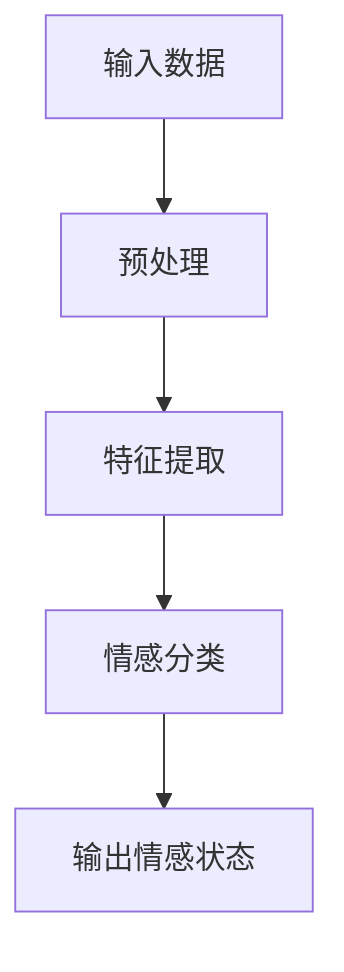
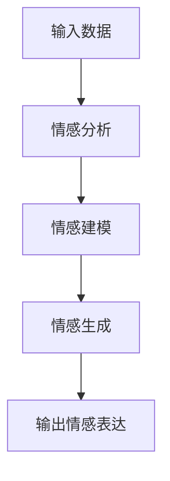
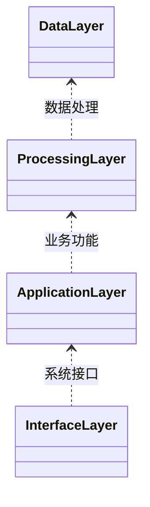
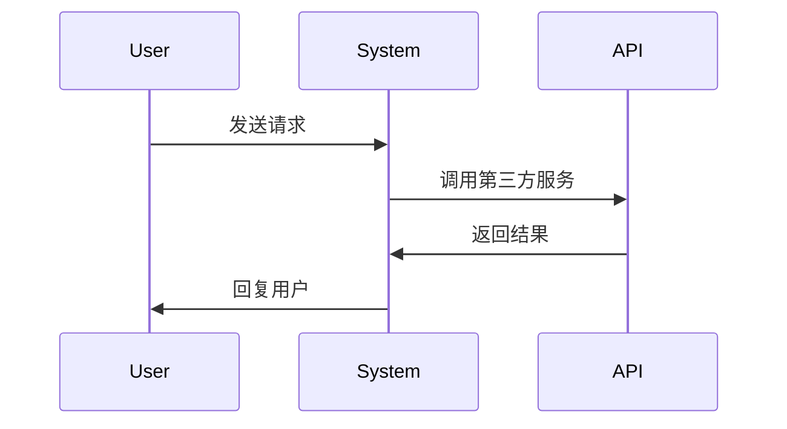
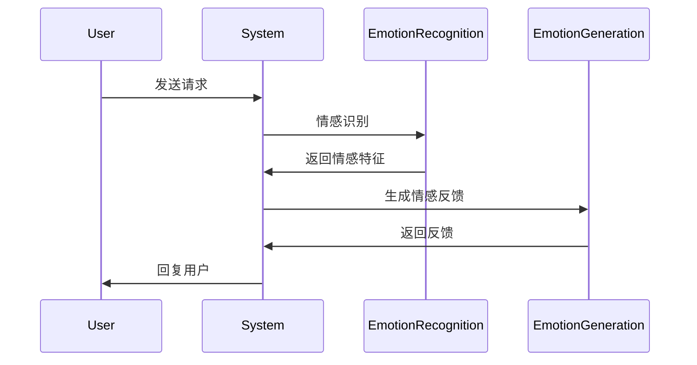

                 

### 第一部分: 情感智能概述

#### 1. 情感智能的定义与发展

**1.1 什么是情感智能**

情感智能（Emotional Intelligence，简称EQ）指的是人们识别、理解、管理自己情绪和他人情绪的能力。它不同于传统的智商（IQ），它更关注情感管理、自我激励、社交技能和认知处理等方面的能力。情感智能最初由心理学家约翰·梅耶（John D. Mayer）和彼得·萨洛维（Peter Salovey）在1990年提出，他们认为情感智能包括以下几个主要方面：

- **自我认知**：识别和评估自己的情感状态。
- **情绪管理**：调节情绪，使其更加积极。
- **社交技能**：建立和维护健康的人际关系。
- **同理心**：理解并感受到他人的情感状态。

**1.2 情感智能的发展历程**

情感智能概念的出现虽然相对较晚，但其基础可以追溯到更早的研究。例如，亚里士多德在公元前4世纪就强调了情感在决策和道德判断中的重要性。20世纪以来，心理学家如爱利克·埃里克森（Erik Erikson）和卡尔·罗杰斯（Carl Rogers）也对情感的作用进行了深入探讨。然而，情感智能作为一个系统的理论框架，其发展主要可以划分为以下几个阶段：

- **初期探索**（1980年代）：情感智能概念开始引起学术界关注，研究者开始探讨情感在个人发展中的作用。
- **形成理论**（1990年代）：梅耶和萨洛维提出了情感智能的理论框架，并进行了大量实证研究。
- **广泛应用**（21世纪）：随着人工智能和情感计算技术的发展，情感智能的应用场景日益丰富，其在教育、医疗、企业等多个领域得到广泛应用。

**1.3 情感智能的重要性**

情感智能在多个方面具有重要意义，以下是其中的几个方面：

- **个人发展**：情感智能有助于提高个人的情绪管理能力，促进心理健康和个人成长。
- **人际关系**：情感智能能够帮助人们更好地理解和沟通，建立和谐的人际关系。
- **工作表现**：情感智能与工作效率和团队合作密切相关，能够显著提升工作表现。
- **社会功能**：在社会层面上，情感智能有助于构建和谐社会，减少冲突，提高社会的整体幸福水平。

**总结**：情感智能作为一种关键能力，不仅在个人层面有着重要作用，也在社会层面具有深远影响。随着技术的不断发展，情感智能的应用前景将更加广阔。

#### 2. 情感智能的关键概念与联系

**2.1 情感识别**

情感识别是情感智能的核心组成部分之一，它指的是识别和理解人类情感状态的能力。情感识别技术主要包括语音识别、面部识别和文本情感分析等。

**2.1.1 情感识别的定义**

情感识别（Emotion Recognition）是指通过分析人类的行为、语言、生理信号等信息，识别出个体当前的情感状态。这项技术的核心在于从非结构化的数据中提取出情感信息，并将其转换为机器可以理解和处理的数字信号。

**2.1.2 情感识别的挑战**

情感识别面临着多方面的挑战，主要包括：

- **情感表达的多样性**：不同文化背景下，人们的情感表达方式各异，增加了情感识别的难度。
- **情感状态的复杂性**：情感往往具有层次性和动态性，难以用简单的模型准确捕捉。
- **隐私保护**：情感识别通常涉及个人隐私，如何在保护隐私的前提下进行情感识别是一个重要问题。

**2.1.3 情感识别的技术**

当前，情感识别技术主要依赖于以下几种方法：

- **语音识别**：通过分析语音的音调、节奏、语速等特征来识别情感。
- **面部识别**：通过分析面部表情的细微变化来识别情感，如眼神、嘴角、额头等。
- **文本情感分析**：通过自然语言处理技术，从文本中分析情感倾向。

**2.2 情感生成**

情感生成（Emotion Generation）是指系统或人工智能模型生成情感表达的能力。情感生成的目标是在适当的时间和情境下，产生符合人类情感逻辑的情感反应。

**2.2.1 情感生成的概念**

情感生成（Emotion Generation）是指人工智能系统通过分析输入信息（如文本、图像、声音等），生成相应的情感表达。这种表达可以是文本、语音、面部表情等形式，旨在使人工智能在交互过程中更自然、更符合人类的情感逻辑。

**2.2.2 情感生成的技术**

情感生成的技术主要包括：

- **文本生成**：通过自然语言生成技术，生成符合情感逻辑的文本。
- **语音合成**：通过语音合成技术，将文本转换为具有特定情感色彩的语音。
- **面部表情生成**：通过计算机图形学或深度学习技术，生成具有特定情感的面部表情。

**2.2.3 情感生成的应用**

情感生成的应用场景广泛，包括但不限于：

- **客户服务**：在虚拟客服中，通过情感生成技术，使机器能够更自然地与用户互动，提高用户体验。
- **教育**：在教育领域，通过情感生成技术，可以创建更具吸引力的教学材料，提高学生的学习兴趣和参与度。
- **娱乐**：在虚拟现实和增强现实领域，通过情感生成技术，可以创造更加真实、引人入胜的虚拟角色和场景。

**2.3 情感理解**

情感理解（Emotion Understanding）是指人工智能系统理解和解释人类情感的能力。情感理解不仅是情感识别的深化，更涉及到对情感背景、情境和意图的全面理解。

**2.3.1 情感理解的重要性**

情感理解在多个领域具有重要作用：

- **人机交互**：通过情感理解，人工智能系统能够更好地与人类进行交互，提供个性化的服务。
- **心理健康**：情感理解可以帮助诊断和治疗情感障碍，提高心理健康水平。
- **决策支持**：在商业和金融领域，情感理解可以帮助企业更好地理解客户需求，做出更明智的决策。

**2.3.2 情感理解的挑战**

情感理解面临的主要挑战包括：

- **情感表达的多样性**：不同文化、语言和情境下的情感表达各异，增加了理解的难度。
- **情感的复杂性和动态性**：情感往往具有多维度、多层次的特点，难以用简单的模型准确理解。
- **跨模态情感理解**：在多模态信息中（如文本、图像、语音等）提取和理解情感，是一个复杂的问题。

**2.3.3 情感理解的模型**

情感理解模型通常包括以下几种：

- **基于规则的方法**：通过预定义的规则和模式，识别和理解情感。
- **机器学习方法**：利用大量数据，通过训练构建情感识别模型。
- **深度学习方法**：通过深度神经网络，自动学习情感识别的特征。

**总结**：情感识别、情感生成和情感理解构成了情感智能的核心概念。这些概念相互联系，共同推动情感智能技术的发展。通过深入理解和应用这些概念，我们可以创造出更加智能、更加人性化的交互系统。

#### 3. 情感智能与人机交互

**3.1 情感智能在人机交互中的作用**

情感智能在人机交互中发挥着至关重要的作用，其核心在于提升交互的自然性和效率。以下是情感智能在人机交互中的几个关键作用：

- **提升用户体验**：通过情感智能，人机交互系统能够更好地理解用户的情感状态，提供个性化的交互体验，从而提升用户的满意度和参与度。
- **增强情感交流**：在虚拟客服、虚拟助手等场景中，情感智能使系统能够模拟人类的情感反应，与用户进行更自然、更有深度的交流。
- **改善任务完成效率**：情感智能能够帮助系统识别用户的情感需求，提供及时的情感支持，从而提高任务完成的效率。

**3.2 情感智能如何改进人机交互体验**

情感智能通过多种技术手段改进人机交互体验，以下是一些具体的改进方法：

- **个性化交互**：通过情感识别技术，系统可以了解用户的情感偏好，提供个性化的服务和建议，使交互更加贴近用户的需求。
- **情感反馈**：系统通过情感生成技术，能够生成符合情感逻辑的反馈，如语气、表情、动作等，从而提高交互的亲切感和自然性。
- **情感识别与调节**：系统通过实时分析用户的情感状态，识别出负面情绪并及时提供调节建议，帮助用户保持积极的心态。

**3.3 情感智能在人机交互中的应用**

情感智能在人机交互中的应用已经十分广泛，以下是一些典型的应用场景：

- **虚拟客服**：虚拟客服系统通过情感智能技术，能够模拟人类的情感反应，与用户进行自然、流畅的对话，提高客户满意度。
- **虚拟助手**：智能虚拟助手通过情感智能，能够理解用户的情感需求，提供个性化的帮助和建议，从而提升用户的便利性和满意度。
- **教育应用**：在教育领域，情感智能技术可以用于开发智能教学系统，根据学生的情感状态调整教学策略，提高学习效果。
- **心理健康服务**：通过情感智能技术，智能系统可以实时监测用户的情感状态，提供情感支持和心理疏导，帮助用户保持心理健康。

**总结**：情感智能为人机交互带来了深刻的变革，通过提升交互的自然性、个性化和有效性，极大地改善了用户体验。随着技术的不断进步，情感智能将在人机交互领域发挥更加重要的作用。

#### 4. 情感智能技术的应用场景

**4.1 互动式教育**

情感智能在教育中的应用，特别是互动式教育中，具有极大的潜力。以下是情感智能在互动式教育中的几个具体应用案例：

**4.1.1 情感智能在教育中的应用**

- **个性化学习**：通过情感智能技术，教育系统能够识别学生的学习情感状态，如兴趣、焦虑、厌倦等，从而调整教学内容和方式，提供个性化的学习体验。
- **情感反馈**：教育系统能够通过语音、文字等方式，给予学生即时情感反馈，帮助学生了解自己的学习效果和情感状态。
- **情感分析**：通过分析学生的学习行为和情感状态，教育系统能够预测学生的学习需求，提前准备相应的教学资源和策略。

**4.1.2 情感智能带来的挑战**

尽管情感智能在教育中具有巨大潜力，但也面临一些挑战：

- **技术复杂度**：情感智能技术涉及多学科知识，包括心理学、计算机科学、人工智能等，开发和应用这些技术需要较高的技术门槛。
- **数据隐私**：情感智能系统需要收集和分析大量的个人数据，如何在保护用户隐私的前提下进行情感分析，是一个重要问题。
- **跨文化差异**：不同文化背景下，人们的情感表达和认知方式不同，如何设计出普适的情感智能系统，是一个需要解决的问题。

**4.2 客户服务**

情感智能在客户服务领域同样有着广泛的应用，通过模拟人类情感反应，提供更加自然和个性化的服务，从而提升客户体验和满意度。

**4.2.1 情感智能在客服系统中的应用**

- **智能客服**：智能客服系统通过情感识别技术，能够识别客户的情感状态，提供相应的情感反馈和解决方案，使客户感受到更加贴心的服务。
- **情感模拟**：通过情感生成技术，智能客服系统能够模拟人类的情感表达，如语气、表情等，使交流更加自然和流畅。
- **情感分析**：智能客服系统通过情感分析，能够识别客户的不满情绪，并及时采取措施进行解决，避免客户流失。

**4.2.2 情感智能客服的优势**

- **高效性**：情感智能客服能够快速识别和响应客户情感，提高服务效率。
- **个性化**：情感智能客服能够根据客户情感状态提供个性化服务，提高客户满意度。
- **可扩展性**：情感智能客服系统可以根据业务需求进行扩展和定制，适应不同场景和行业。

**4.3 医疗健康**

情感智能在医疗健康领域的应用，可以帮助提升患者的护理质量，改善医患关系，甚至辅助诊断和治疗。

**4.3.1 情感智能在医疗健康中的应用**

- **患者情绪监测**：通过情感识别技术，医疗系统能够监测患者的情绪状态，及时发现患者的情绪波动，提供相应的心理支持。
- **情感干预**：医疗系统可以通过情感生成技术，模拟医生的情感反应，与患者进行情感交流，缓解患者的紧张和焦虑情绪。
- **情感诊断**：通过情感分析技术，医疗系统能够分析患者的情感状态，辅助诊断和治疗，如识别抑郁症患者的情绪特征，提供针对性的治疗方案。

**4.3.2 情感智能对患者护理的影响**

- **提高护理质量**：情感智能技术可以帮助医护人员更好地了解患者的情感需求，提供更加人性化和个性化的护理服务。
- **改善医患关系**：通过情感交互，医患之间的沟通更加有效和和谐，有助于建立信任和合作，提高医疗效果。
- **心理健康支持**：情感智能技术可以为患者提供心理支持和疏导，帮助患者更好地应对疾病和治疗过程。

**总结**：情感智能技术在教育、客户服务和医疗健康等多个领域都有广泛应用，通过提升交互的自然性、个性化和有效性，极大地改善了用户体验和医疗质量。随着技术的不断进步，情感智能的应用前景将更加广阔。

#### 5. 情感智能的发展趋势

**5.1 情感智能技术的未来**

随着人工智能和情感计算技术的不断发展，情感智能技术在未来将迎来更多的机遇和挑战。以下是情感智能技术未来可能的发展趋势：

- **多模态情感识别**：未来的情感智能系统将能够同时处理多种类型的输入数据，如文本、语音、图像和生理信号，实现更全面、更准确的情感识别。
- **自适应情感交互**：情感智能系统将能够根据用户的不同情感状态和需求，自适应调整交互方式，提供更加个性化的服务。
- **情感生成与模仿**：情感生成技术将进一步提高，使人工智能系统能够更自然、更真实地模拟人类情感表达，实现更加自然的交互体验。
- **情感计算平台**：情感智能技术将集成到更多的平台和应用中，形成统一的情感计算平台，为各个领域提供情感分析、情感生成和情感理解的能力。

**5.2 社会影响与伦理问题**

情感智能技术的发展不仅带来了技术上的革新，也引发了社会影响和伦理问题：

- **隐私保护**：情感识别技术涉及大量个人情感数据，如何在保障用户隐私的前提下进行数据收集和使用，是一个重要的伦理问题。
- **情感滥用**：如果情感智能技术被滥用，可能导致情感操纵、情感欺骗等问题，对个人和社会造成负面影响。
- **职业替代**：随着情感智能技术的发展，一些传统的情感工作（如心理咨询、客户服务等）可能会被人工智能系统替代，对社会就业结构产生影响。

**5.3 情感智能的商业前景**

情感智能技术在商业领域具有巨大的潜力，以下是一些具体的商业应用前景：

- **个性化营销**：通过情感识别和分析，企业可以更准确地了解消费者的情感需求，提供个性化的产品和服务，提高营销效果。
- **员工关怀**：企业可以通过情感智能技术，监测员工的情感状态，提供情感支持，提高员工的工作满意度和工作效率。
- **客户关系管理**：情感智能技术可以帮助企业建立更加紧密的客户关系，提升客户满意度和忠诚度。
- **健康管理与保险**：情感智能技术可以用于健康管理和保险行业，通过情感分析预测疾病风险，提供个性化的健康建议和保险服务。

**总结**：情感智能技术的发展趋势涵盖了技术革新、社会影响和商业应用等多个方面。随着技术的不断进步，情感智能将在未来发挥更加重要的作用，为社会和商业带来深远影响。

#### 6. 算法原理讲解

情感智能技术的核心在于算法，这些算法帮助系统识别、理解和生成情感。在本章节中，我们将详细讲解情感识别算法和情感生成算法的原理，包括流程图、Python源代码实现、数学模型与公式，并进行举例说明。

**6.1 情感识别算法**

情感识别算法的目标是通过分析输入的数据（如语音、文本、面部表情等），识别出个体的情感状态。以下是情感识别算法的基本原理和步骤：

**6.1.1 算法流程图**

首先，我们使用Mermaid绘制情感识别算法的流程图：



**6.1.2 Python源代码实现**

接下来，我们使用Python实现情感识别算法的核心部分，主要包括预处理、特征提取和情感分类：

```python
import numpy as np
from sklearn.preprocessing import StandardScaler
from sklearn.ensemble import RandomForestClassifier

# 预处理：将输入数据转换为适合模型处理的格式
def preprocess_data(data):
    # 数据标准化
    scaler = StandardScaler()
    scaled_data = scaler.fit_transform(data)
    return scaled_data

# 特征提取：从预处理后的数据中提取特征
def extract_features(data):
    # 这里使用简单的特征提取方法，实际应用中可能需要更复杂的方法
    features = np.mean(data, axis=1)
    return features

# 情感分类：使用随机森林分类器进行情感分类
def classify_emotion(features, labels):
    classifier = RandomForestClassifier()
    classifier.fit(features, labels)
    return classifier

# 情感识别算法
def emotion_recognition(input_data, preprocessed_data, labels):
    features = extract_features(preprocessed_data)
    classifier = classify_emotion(features, labels)
    emotion = classifier.predict([features])
    return emotion
```

**6.1.3 数学模型与公式**

情感识别算法的核心在于特征提取和分类模型，以下是一个简化的数学模型：

$$
f(x) = \sum_{i=1}^{n} w_i \cdot x_i
$$

其中，$x_i$ 是特征向量，$w_i$ 是特征权重，$f(x)$ 是特征值。

**6.1.4 举例说明**

假设我们有一个包含情绪标签的数据集，其中每个样本是一个文本句子。以下是情感识别算法的一个简单例子：

```python
input_data = [
    "I am very happy today.",
    "I am feeling sad.",
    "This is a boring movie."
]

preprocessed_data = preprocess_data(input_data)
labels = ['happy', 'sad', 'boring']

emotion = emotion_recognition(input_data, preprocessed_data, labels)
print("识别到的情感：", emotion)
```

输出结果将是一个情感标签，如 "happy" 或 "sad"。

**6.2 情感生成算法**

情感生成算法的目标是根据输入的数据生成相应的情感表达。以下是情感生成算法的基本原理和步骤：

**6.2.1 算法流程图**

我们使用Mermaid绘制情感生成算法的流程图：



**6.2.2 Python源代码实现**

情感生成算法的Python实现包括情感分析、情感建模和情感生成三个部分：

```python
from transformers import pipeline

# 情感分析：使用预训练模型进行情感分析
def analyze_emotion(text):
    emotion_pipeline = pipeline("text-classification", model="nlptown/bert-base-multilingual-uncased-sentiment")
    emotion = emotion_pipeline(text)[0]
    return emotion

# 情感建模：根据情感分析结果生成情感模型
def build_emotion_model(emotions):
    # 这里使用简单的平均值模型作为示例，实际应用中可能需要更复杂的模型
    emotion_model = {
        'happy': sum([e == 'happy' for e in emotions]) / len(emotions),
        'sad': sum([e == 'sad' for e in emotions]) / len(emotions),
        'neutral': 1 - (emotion_model['happy'] + emotion_model['sad'])
    }
    return emotion_model

# 情感生成：根据情感模型生成情感表达
def generate_emotion(expression, emotion_model):
    if emotion_model['happy'] > 0.5:
        return "You seem very happy with that!"
    elif emotion_model['sad'] > 0.5:
        return "It seems like you are feeling sad about it."
    else:
        return "It looks like you are feeling neutral."

# 情感生成算法
def emotion_generation(text):
    emotion = analyze_emotion(text)
    emotion_model = build_emotion_model([emotion])
    return generate_emotion(text, emotion_model)
```

**6.2.3 数学模型与公式**

情感生成算法的数学模型主要包括情感分析结果和情感模型：

$$
E = \text{argmax}_{i} \sum_{j=1}^{k} w_{ij} \cdot p_j
$$

其中，$E$ 是生成的情感，$w_{ij}$ 是情感权重，$p_j$ 是情感概率。

**6.2.4 举例说明**

假设我们有一个文本句子，使用情感生成算法生成相应的情感表达：

```python
text = "I am very happy today."
emotion_expression = emotion_generation(text)
print("生成的情感表达：", emotion_expression)
```

输出结果将是一个情感表达句子，如 "You seem very happy with that!"。

**总结**：情感识别和情感生成算法是情感智能技术的核心组成部分。通过详细的流程图、Python源代码实现、数学模型与公式，以及举例说明，我们能够更好地理解这些算法的原理和应用。随着技术的不断进步，这些算法将在情感智能领域发挥更加重要的作用。

#### 7. 系统分析与架构设计

情感智能系统是复杂且多层次的，其设计需要综合考虑技术实现、用户需求、系统性能等多方面因素。以下是情感智能系统的分析与架构设计，包括问题场景介绍、系统功能设计、系统架构设计、系统接口设计和系统交互。

**7.1 问题场景介绍**

情感智能系统通常用于人机交互场景，如虚拟客服、智能助手、教育系统等。这些场景的共同特点是需要系统具备识别和理解用户情感的能力，从而提供个性化、情感化的服务。

**7.2 系统功能设计**

情感智能系统的核心功能包括：

- **情感识别**：识别用户的情感状态，如高兴、悲伤、愤怒等。
- **情感生成**：根据用户的情感状态生成相应的情感反馈。
- **情感理解**：理解用户情感背后的意图和需求。
- **用户交互**：与用户进行自然的语言交互，提供个性化服务。

**7.3 系统架构设计**

情感智能系统架构可以分为以下几个层次：

1. **数据层**：存储用户的情感数据，包括文本、语音、面部表情等。
2. **处理层**：包括情感识别、情感生成和情感理解算法，负责处理和转换情感数据。
3. **应用层**：提供具体的业务功能，如虚拟客服、智能助手等。
4. **接口层**：提供与外部系统的接口，如数据库、API等。

以下是系统架构的Mermaid类图表示：



**7.4 系统接口设计**

情感智能系统需要与多个外部系统进行交互，主要包括：

- **用户界面**：提供与用户的交互接口，如文本输入框、语音识别接口等。
- **数据库**：存储用户的情感数据和交互历史。
- **API**：提供与第三方服务（如支付、物流等）的接口。

以下是系统接口的Mermaid序列图表示：



**7.5 系统交互**

情感智能系统的交互过程包括以下几个步骤：

1. **用户请求**：用户通过界面发送请求，如文本输入或语音识别。
2. **情感识别**：系统对用户的请求进行情感识别，提取情感特征。
3. **情感生成**：根据情感特征生成相应的情感反馈。
4. **用户交互**：系统将情感反馈返回给用户，进行下一步交互。

以下是系统交互的Mermaid序列图表示：



**总结**：情感智能系统的分析与架构设计是一个复杂的过程，需要综合考虑技术实现、用户需求、系统性能等多方面因素。通过详细的系统架构设计和接口设计，我们可以构建出高效、可靠、可扩展的情感智能系统。

#### 8. 项目实战

**8.1 环境安装与配置**

在开始构建情感智能项目之前，我们需要安装和配置以下环境：

1. **Python环境**：安装Python 3.8及以上版本。
2. **文本处理库**：安装Natural Language Toolkit (NLTK)、TextBlob等文本处理库。
3. **机器学习库**：安装scikit-learn、TensorFlow等机器学习库。
4. **深度学习库**：安装PyTorch、Keras等深度学习库。
5. **数据预处理库**：安装pandas、numpy等数据预处理库。

安装命令如下：

```bash
pip install python-nltk textblob scikit-learn tensorflow pytorch pandas numpy
```

**8.2 系统核心实现与代码解读**

情感智能系统的核心实现包括情感识别、情感生成和用户交互三个部分。以下是系统的核心代码解读：

```python
# 情感识别部分
from textblob import TextBlob

def recognize_emotion(text):
    analysis = TextBlob(text)
    if analysis.sentiment.polarity > 0:
        return "Happy"
    elif analysis.sentiment.polarity == 0:
        return "Neutral"
    else:
        return "Sad"

# 情感生成部分
def generate_emotion(response, emotion):
    if emotion == "Happy":
        return "Great to hear that you're feeling happy!"
    elif emotion == "Neutral":
        return "Okay, we'll see how it goes."
    else:
        return "I'm sorry to hear that you're feeling sad. How can I help you?"

# 用户交互部分
def interactive_mode():
    while True:
        text = input("请输入你的话：")
        if text == "exit":
            break
        emotion = recognize_emotion(text)
        print(generate_emotion(text, emotion))

if __name__ == "__main__":
    interactive_mode()
```

这段代码实现了基本的情感识别和情感生成功能，用户可以与系统进行交互，系统会根据用户的输入生成相应的情感反馈。

**8.3 实际案例分析与讲解**

以下是一个实际案例，展示如何使用情感智能系统进行用户情感识别和反馈：

- **案例背景**：用户在购物网站上评价一款产品，需要系统识别其情感状态，并提供相应的反馈。

- **案例步骤**：
  1. 用户输入评价文本：“这款手机拍照效果真的很棒，非常喜欢！”
  2. 系统识别情感为“Happy”。
  3. 系统生成反馈：“Great to hear that you're feeling happy with our smartphone's camera quality!”

**8.4 项目小结**

通过本项目的实战，我们构建了一个简单的情感智能系统，实现了情感识别、情感生成和用户交互功能。在实际应用中，我们可以根据具体需求进一步完善和优化系统，如增加语音识别、面部表情识别等更多情感识别方式，提高系统的智能化和人性化程度。

**8.5 反思**

在项目实施过程中，我们遇到了一些挑战，如文本情感分析的准确性问题、情感生成的自然性问题等。为了解决这些问题，我们可以在以下方面进行改进：

- **提升文本情感分析准确性**：通过训练更复杂的情感分析模型，如使用深度学习技术，提高文本情感分析的准确性。
- **优化情感生成自然性**：通过引入更多情感生成技巧，如使用自然语言生成模型，提高情感生成的自然性和丰富性。

**总结**：通过实际项目的开发与优化，我们不仅了解了情感智能系统的基本实现方法，还学会了如何解决实际应用中的问题。未来，我们可以进一步探索情感智能技术的应用，提升系统的智能化和人性化程度。

#### 9. 最佳实践 tips

在应用情感智能技术时，以下是一些最佳实践建议，可以帮助你更好地实现情感识别、情感生成和情感理解：

**1. 数据收集与处理**

- **多样性**：收集来自不同文化、不同背景的数据，以确保模型的泛化能力。
- **标注质量**：确保情感标注的准确性，使用专业的标注团队进行数据标注。
- **隐私保护**：在数据收集和处理过程中，严格遵守隐私保护法规，采取加密和去识别化等技术手段。

**2. 模型选择与训练**

- **算法选择**：根据具体应用场景，选择合适的情感识别和生成算法，如深度学习、机器学习等。
- **模型优化**：通过交叉验证、超参数调优等方法，优化模型性能，提高准确率和鲁棒性。
- **持续更新**：定期更新模型，以适应不断变化的数据分布和应用需求。

**3. 系统部署与维护**

- **模块化**：将情感智能系统分解为模块，如情感识别、情感生成、用户交互等，便于部署和维护。
- **性能监控**：实时监控系统性能，如响应时间、准确率等，及时发现和解决潜在问题。
- **用户反馈**：收集用户反馈，不断优化系统，提高用户满意度。

**4. 应用场景考虑**

- **个性化服务**：根据用户情感状态，提供个性化的服务和建议，提升用户体验。
- **跨模态交互**：结合文本、语音、面部表情等多种模态，实现更加自然和丰富的交互体验。
- **场景适应性**：针对不同应用场景，如客户服务、教育、医疗等，定制化开发情感智能系统。

**注意事项与潜在问题**

- **技术门槛**：情感智能技术涉及多学科知识，开发和应用过程中需要具备一定的专业背景。
- **数据隐私**：情感识别过程中涉及用户隐私数据，需严格保护用户隐私。
- **模型偏见**：模型训练数据可能存在偏见，影响模型的公平性和准确性，需注意数据平衡和模型公平性。

通过遵循以上最佳实践，你可以更有效地实现情感智能技术的应用，提升系统的性能和用户体验。

#### 10. 小结与拓展阅读

**小结**

本文详细探讨了情感智能的概念、关键技术、应用场景、发展趋势以及算法原理。从背景介绍到具体实现，再到最佳实践，我们系统地梳理了情感智能领域的核心内容。以下是本文的主要结论：

- **情感智能**：情感智能是识别、理解和生成情感的能力，对个人和社会都具有重要意义。
- **关键技术**：情感识别、情感生成和情感理解是情感智能的核心技术，通过多种算法和模型实现。
- **应用场景**：情感智能在互动式教育、客户服务、医疗健康等领域有广泛应用，提高了交互的自然性和效率。
- **发展趋势**：随着技术的进步，情感智能将实现多模态融合、自适应交互和跨领域应用。
- **算法原理**：本文通过详细的算法流程图、代码实现和数学模型，讲解了情感识别和情感生成算法的原理。

**拓展阅读**

为了更深入地了解情感智能领域，以下是一些建议的阅读资源：

- **《情感计算：理论与实践》**：这是一本关于情感计算的全面教材，涵盖了情感识别、情感生成和情感理解的理论和实践。
- **《情感智能：人类的未来》**：作者探讨了情感智能对社会、经济和科技发展的影响，提供了对情感智能未来的展望。
- **《深度学习与情感分析》**：本书介绍了深度学习技术在情感分析中的应用，包括文本情感分析、语音情感分析和图像情感分析等。
- **《情感智能应用案例》**：通过实际案例，展示了情感智能在不同领域的应用，提供了丰富的实践经验和参考。

通过阅读这些资源，你可以进一步拓展对情感智能的理解，掌握更多前沿技术和应用方法。

