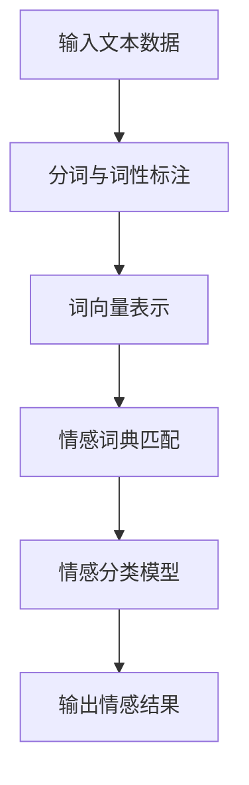
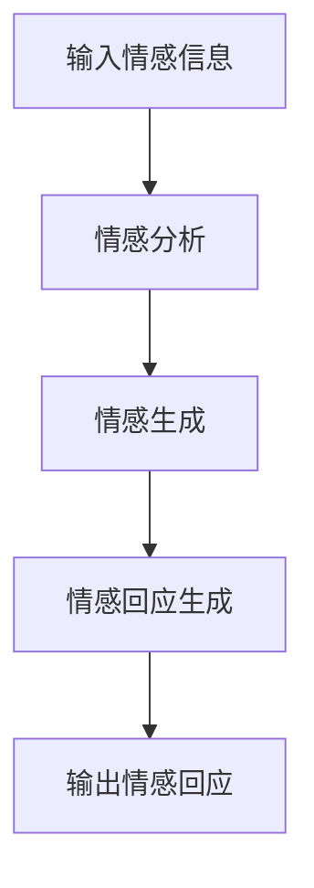
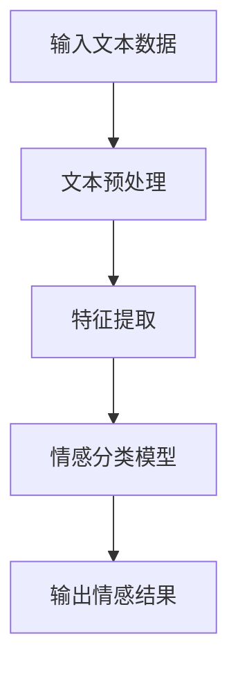

                 

# 情感机器人伦理委员会：制定人机交互准则

> 关键词：情感机器人、伦理委员会、人机交互准则、算法原理、系统架构、实战案例、最佳实践

> 摘要：随着情感机器人的快速发展，其在生活中的应用越来越广泛，伦理问题也随之而来。本文将介绍情感机器人伦理委员会的成立背景，深入探讨人机交互准则的制定原则、流程及其实施方法，并通过实际案例进行分析，为情感机器人的伦理问题提供解决思路。

## 目录

### 第1章：情感机器人与伦理背景

#### 1.1 情感机器人的兴起

#### 1.2 伦理问题在情感机器人中的重要性

#### 1.3 人机交互准则的必要性

### 第2章：情感识别与处理算法原理

#### 2.1 情感识别算法概述

#### 2.2 情感分析算法

#### 2.3 情感处理算法

#### 2.4 情感识别与处理算法应用案例

### 第3章：人机交互准则制定方法

#### 3.1 人机交互准则制定原则

#### 3.2 人机交互准则制定流程

#### 3.3 人机交互准则制定实例

### 第4章：情感机器人伦理委员会案例分析

#### 4.1 案例一：情感机器人客服伦理问题

#### 4.2 案例二：情感机器人医疗伦理问题

### 第5章：人机交互准则实施与评估

#### 5.1 实施策略

#### 5.2 评估方法

#### 5.3 持续改进

### 第6章：未来展望与趋势

#### 6.1 情感机器人伦理发展展望

#### 6.2 人机交互准则的演进方向

## 第1章：情感机器人与伦理背景

### 1.1 情感机器人的兴起

情感机器人是一种能够理解、感知和模拟人类情感的人工智能系统。随着人工智能技术的不断进步，情感机器人已经从理论研究走向实际应用，成为智能服务、医疗健康、教育等多个领域的热点。例如，情感机器人客服可以在客服中心代替人工客服，与用户进行情感互动，提高用户满意度；在医疗领域，情感机器人可以陪伴患者，提供情感支持和心理疏导。

#### 1.1.1 情感机器人的定义

情感机器人是一种结合了人工智能、自然语言处理、语音识别、计算机视觉等技术的智能系统，旨在模拟人类的情感表达和情感互动。其核心功能包括情感识别、情感生成、情感交互等。

#### 1.1.2 情感机器人发展的驱动因素

1. **技术进步**：人工智能技术的快速发展，使得情感机器人能够更加精准地识别和理解人类的情感。
2. **应用需求**：在许多领域，人们对于高效、智能、情感化的服务有强烈需求，这推动了情感机器人技术的发展。
3. **政策支持**：许多国家纷纷出台政策，支持人工智能和情感机器人技术的发展。

#### 1.1.3 情感机器人与人机交互的关系

情感机器人的核心功能之一是与人进行情感交互。这种交互不仅包括语言层面的对话，还包括非语言层面的情感表达和情感反馈。因此，人机交互准则的制定对于确保情感机器人的伦理和有效运行至关重要。

### 1.2 伦理问题在情感机器人中的重要性

情感机器人的广泛应用，不仅带来了技术上的进步，也引发了一系列伦理问题。这些问题包括隐私保护、歧视、自主权等。如何解决这些伦理问题，成为情感机器人发展的重要挑战。

#### 1.2.1 情感机器人在生活中的应用场景

1. **客服**：情感机器人可以用于客服中心，与客户进行情感互动，提高客户满意度。
2. **医疗**：情感机器人可以陪伴患者，提供情感支持和心理疏导。
3. **教育**：情感机器人可以用于教育领域，提供个性化教学和学习体验。
4. **家庭**：情感机器人可以成为家庭成员的一部分，提供情感陪伴和家务帮助。

#### 1.2.2 伦理问题产生的背景与影响

伦理问题的产生主要源于以下几个方面：

1. **技术快速发展**：技术的快速发展使得情感机器人能够在短时间内实现复杂的情感识别和生成，但随之而来的伦理问题没有得到充分重视。
2. **应用场景复杂**：情感机器人在不同的应用场景中，可能面临不同的伦理挑战，例如在医疗领域，情感机器人可能涉及患者隐私和生命安全等敏感问题。

#### 1.2.3 伦理委员会的角色与职责

伦理委员会的主要职责包括：

1. **伦理问题识别**：识别情感机器人在应用过程中可能出现的伦理问题。
2. **准则制定**：根据伦理原则和实际情况，制定人机交互准则。
3. **监督与评估**：监督情感机器人的运行过程，评估准则的实施效果。
4. **持续改进**：根据监督和评估结果，持续优化人机交互准则。

### 1.3 人机交互准则的必要性

人机交互准则是确保情感机器人伦理和有效运行的重要保障。以下是制定人机交互准则的必要性：

#### 1.3.1 人机交互准则的定义

人机交互准则是一系列规定和指导原则，用于确保情感机器人在与人交互时的伦理和有效性。这些准则通常包括透明性、隐私保护、公平性、尊重等原则。

#### 1.3.2 人机交互准则的基本原则

1. **用户至上**：用户的需求和体验是人机交互准则的核心。
2. **透明性**：情感机器人的运行过程和决策机制应向用户透明。
3. **隐私保护**：保护用户的隐私是情感机器人伦理的重要方面。
4. **公平性**：情感机器人在与人交互时应保持公平，避免歧视。
5. **尊重**：情感机器人应尊重用户的情感和人格尊严。

#### 1.3.3 人机交互准则的实施意义

1. **提高用户信任**：明确的人机交互准则有助于增强用户对情感机器人的信任。
2. **规范行业行为**：人机交互准则可以为情感机器人的开发和应用提供规范和指导。
3. **保障社会伦理**：通过制定和实施人机交互准则，可以有效避免伦理问题的发生，保障社会伦理。

## 第2章：情感识别与处理算法原理

### 2.1 情感识别算法概述

情感识别算法是情感机器人中至关重要的组成部分。它主要任务是从用户的语言、声音、表情等数据中提取情感信息，并将其转化为具体的情感类别。以下是对情感识别算法的概述。

#### 2.1.1 情感识别的概念

情感识别是指通过分析用户的情感表达，识别出用户的情感状态。情感识别可以基于文本、语音、图像等多种数据源。

#### 2.1.2 情感识别的分类

1. **文本情感识别**：基于用户的文本输入，通过自然语言处理技术，识别出用户的情感状态。
2. **语音情感识别**：基于用户的语音输入，通过语音识别和情感分析技术，识别出用户的情感状态。
3. **图像情感识别**：基于用户的图像输入，通过计算机视觉技术，识别出用户的情感状态。

#### 2.1.3 情感识别的应用领域

1. **智能客服**：通过情感识别，智能客服可以更好地理解用户的需求，提供个性化的服务。
2. **心理健康**：通过情感识别，可以为用户提供情感支持，帮助用户改善心理健康。
3. **营销**：通过情感识别，企业可以更好地了解消费者的情感需求，制定更有效的营销策略。

### 2.2 情感分析算法

情感分析算法是情感识别的核心技术。它主要任务是从文本数据中提取情感信息，并将其转化为具体的情感类别。以下是对情感分析算法的详细讲解。

#### 2.2.1 情感分析算法的mermaid流程图



#### 2.2.2 Python源代码实现

```python
import jieba
import numpy as np
from sklearn.feature_extraction.text import TfidfVectorizer
from sklearn.model_selection import train_test_split
from sklearn.naive_bayes import MultinomialNB
from sklearn.metrics import classification_report

# 数据准备
text_data = ["我很开心", "我很难过", "我喜欢这个电影", "这个电影很无聊"]
labels = ["positive", "negative", "positive", "negative"]

# 分词与词性标注
seg_text = [jieba.cut(text) for text in text_data]
tokenized_text = [" ".join(seg_text) for seg_text in seg_text]

# 词向量表示
vectorizer = TfidfVectorizer()
tfidf_matrix = vectorizer.fit_transform(tokenized_text)

# 情感分类模型
X_train, X_test, y_train, y_test = train_test_split(tfidf_matrix, labels, test_size=0.2)
classifier = MultinomialNB()
classifier.fit(X_train, y_train)

# 输出情感结果
predictions = classifier.predict(X_test)
print(classification_report(y_test, predictions))
```

#### 2.2.3 数学模型与公式

情感分析算法通常基于朴素贝叶斯分类器。其核心公式如下：

$$ P(C|w) = \frac{P(w|C)P(C)}{P(w)} $$

其中，\( C \)表示情感类别，\( w \)表示文本特征。

### 2.3 情感处理算法

情感处理算法是情感机器人中另一项关键技术。它主要任务是根据识别出的情感信息，生成适当的情感回应。以下是对情感处理算法的详细讲解。

#### 2.3.1 情感处理算法的mermaid流程图



#### 2.3.2 Python源代码实现

```python
import random

# 情感词典
emotion_dict = {
    "positive": ["很高兴", "很开心", "很兴奋", "很满意"],
    "negative": ["很难过", "很沮丧", "很愤怒", "很失望"],
}

# 情感生成
def generate_emotion_response(emotion):
    if emotion == "positive":
        return random.choice(emotion_dict["positive"])
    elif emotion == "negative":
        return random.choice(emotion_dict["negative"])
    else:
        return "我理解你的感受。"

# 输出情感回应
def main():
    text = input("请输入你的感受：")
    emotion = "neutral"
    # 情感分析（此处简化处理，实际中可以使用更复杂的情感分析算法）
    if "喜欢" in text or "高兴" in text:
        emotion = "positive"
    elif "难过" in text or "失望" in text:
        emotion = "negative"
    
    response = generate_emotion_response(emotion)
    print(response)

if __name__ == "__main__":
    main()
```

#### 2.3.3 数学模型与公式

情感处理算法通常基于概率模型。其核心公式如下：

$$ P(E|C) = \frac{P(C|E)P(E)}{P(C)} $$

其中，\( E \)表示情感回应，\( C \)表示情感类别。

### 2.4 情感识别与处理算法应用案例

#### 2.4.1 案例背景

某公司开发了一款情感机器人客服，旨在提高客服中心的效率和服务质量。该情感机器人客服可以通过语音和文本与用户进行交互，识别用户的情感状态，并生成适当的情感回应。

#### 2.4.2 算法实现步骤

1. **数据收集与预处理**：收集用户对话文本，进行分词、词性标注等预处理。
2. **情感识别**：使用情感分析算法，识别出用户的情感状态。
3. **情感处理**：根据识别出的情感状态，生成适当的情感回应。
4. **用户反馈**：将生成的情感回应展示给用户，收集用户反馈，用于模型优化。

#### 2.4.3 案例分析与总结

通过实际应用，该情感机器人客服在客服中心的运行效果显著。用户满意度明显提高，客服效率也大幅提升。然而，在应用过程中，也发现了一些问题，如情感识别的准确性有待提高，情感回应的生成需要更加丰富和多样化。未来，需要进一步优化算法，提高情感识别与处理的准确性和效果。

## 第3章：人机交互准则制定方法

### 3.1 人机交互准则制定原则

制定人机交互准则需要遵循一系列原则，以确保准则的科学性、合理性和可操作性。以下是几个关键原则：

#### 3.1.1 用户至上

用户的需求和体验是人机交互准则的核心。准则的制定应始终以用户为中心，充分考虑用户的情感、需求和隐私。

#### 3.1.2 透明性

情感机器人的运行过程和决策机制应向用户透明。用户应清楚地了解情感机器人如何识别和处理情感信息，以及这些信息的用途。

#### 3.1.3 隐私保护

情感机器人应严格遵守隐私保护原则，确保用户的个人信息和情感数据得到充分保护。未经用户同意，不得将用户数据用于其他目的。

#### 3.1.4 公平性

情感机器人在与人交互时应保持公平，避免歧视。准则应明确禁止基于性别、年龄、种族等特征进行不公平对待。

#### 3.1.5 尊重

情感机器人应尊重用户的情感和人格尊严，避免产生负面情感体验。准则应明确情感机器人在与人交互时的行为规范，确保尊重用户。

### 3.2 人机交互准则制定流程

人机交互准则的制定是一个系统性的过程，通常包括以下几个阶段：

#### 3.2.1 需求分析

在制定准则之前，需要对情感机器人的应用场景和用户需求进行深入分析。了解用户在交互过程中的关注点和期望，为准则的制定提供依据。

#### 3.2.2 原则确定

根据需求分析的结果，明确人机交互准则的基本原则。这些原则应涵盖用户至上、透明性、隐私保护、公平性和尊重等方面。

#### 3.2.3 准则设计

在原则的基础上，设计具体的人机交互准则。准则应具体、明确，操作性强，以便于在实际应用中执行。

#### 3.2.4 准则评审

完成准则设计后，应组织相关专家和用户代表进行评审。评审过程应充分讨论准则的可行性和适用性，确保准则的科学性和合理性。

#### 3.2.5 准则发布

评审通过后，正式发布人机交互准则。准则发布后，应通过多种渠道进行宣传和推广，确保相关方了解和遵守。

### 3.3 人机交互准则制定实例

以下是一个简化的人机交互准则制定实例，以帮助读者更好地理解整个流程。

#### 3.3.1 实例背景

某公司计划开发一款面向医疗领域的情感机器人，旨在为患者提供情感支持和心理疏导。公司希望制定一套人机交互准则，以确保情感机器人的伦理和有效运行。

#### 3.3.2 准则制定步骤

1. **需求分析**：公司组织相关团队，对医疗领域的情感需求进行调研，了解患者、医生和护理人员在不同情境下的情感需求。
2. **原则确定**：根据需求分析结果，确定人机交互准则的基本原则，如用户至上、透明性、隐私保护、公平性和尊重。
3. **准则设计**：结合基本原则，设计具体的人机交互准则。例如，情感机器人应尊重患者的隐私，未经患者同意不得将患者信息透露给第三方；情感机器人应公平对待所有患者，避免歧视。
4. **准则评审**：邀请医疗、法律、伦理等领域的专家，对准则进行评审。评审过程中，专家们提出了一些修改意见，公司根据意见进行了调整。
5. **准则发布**：经过评审，公司正式发布了人机交互准则，并在公司内部进行了培训和宣传。

#### 3.3.3 实例分析与总结

通过这个实例，我们可以看到人机交互准则的制定是一个系统性的过程，需要充分考虑用户需求、伦理原则和实际应用场景。制定过程中，需要充分沟通、讨论和评审，以确保准则的科学性、合理性和可操作性。准则发布后，还需要持续监控和优化，以适应不断变化的需求和环境。

## 第4章：情感机器人伦理委员会案例分析

### 4.1 案例一：情感机器人客服伦理问题

#### 4.1.1 案例背景

某公司开发了一款情感机器人客服，用于解决客户咨询和投诉。然而，在实际应用过程中，该情感机器人客服出现了一些伦理问题，引发了广泛关注。

#### 4.1.2 案例分析

1. **隐私泄露**：情感机器人客服在处理用户咨询时，无意中泄露了一些用户隐私信息。这违反了隐私保护原则，严重侵犯了用户权益。
2. **歧视问题**：有用户发现，情感机器人客服对不同用户群体存在歧视现象，例如对女性用户的回应较为冷漠。这违反了公平性原则，损害了用户的尊严。
3. **情感回应不当**：情感机器人客服在处理一些复杂情感问题时，回应不当，导致用户情绪进一步恶化。这违反了尊重原则，影响了用户体验。

#### 4.1.3 准则制定

针对上述问题，情感机器人伦理委员会制定了以下准则：

1. **隐私保护**：明确情感机器人客服在处理用户信息时的隐私保护要求，确保用户隐私得到充分保护。
2. **公平性**：明确情感机器人客服在与人交互时应保持公平，避免歧视现象。
3. **情感回应**：规范情感机器人客服的情感回应，确保回应适当、得体，尊重用户情感。

#### 4.1.4 案例总结与反思

通过制定和实施人机交互准则，情感机器人客服的伦理问题得到了有效解决。然而，这也提醒我们，在情感机器人应用过程中，必须高度重视伦理问题，制定明确、科学的准则，确保情感机器人的伦理和有效运行。

### 4.2 案例二：情感机器人医疗伦理问题

#### 4.2.1 案例背景

某医院引入了一款情感机器人，用于陪伴患者，提供情感支持和心理疏导。然而，在实际应用过程中，该情感机器人出现了一些伦理问题，引发了广泛关注。

#### 4.2.2 案例分析

1. **患者隐私泄露**：情感机器人陪伴患者时，无意中泄露了一些患者隐私信息。这违反了隐私保护原则，严重侵犯了患者权益。
2. **情感回应不当**：情感机器人对患者的一些情感回应不当，导致患者情绪进一步恶化。这违反了尊重原则，影响了患者心理健康。
3. **依赖性问题**：有患者对情感机器人产生了依赖，逐渐减少与实际护理人员的沟通。这违反了自主权原则，影响了患者与护理人员的互动。

#### 4.2.3 准则制定

针对上述问题，情感机器人伦理委员会制定了以下准则：

1. **隐私保护**：明确情感机器人在处理患者信息时的隐私保护要求，确保患者隐私得到充分保护。
2. **情感回应**：规范情感机器人的情感回应，确保回应适当、得体，尊重患者情感。
3. **依赖性管理**：明确情感机器人在陪伴患者时的行为规范，避免患者对情感机器人产生过度依赖。

#### 4.2.4 案例总结与反思

通过制定和实施人机交互准则，情感机器人医疗伦理问题得到了有效解决。然而，这也提醒我们，在情感机器人应用过程中，必须高度重视伦理问题，制定明确、科学的准则，确保情感机器人的伦理和有效运行。

## 第5章：人机交互准则实施与评估

### 5.1 实施策略

要确保人机交互准则的有效实施，需要制定一系列策略，包括以下方面：

#### 5.1.1 企业内部培训

企业应组织内部培训，提高员工对伦理准则的认识和理解。培训内容应包括准则的具体内容、实施方法、案例分析等。

#### 5.1.2 用户教育与反馈机制

企业应通过多种渠道，如宣传册、在线教程等，向用户普及人机交互准则。同时，建立用户反馈机制，及时收集用户意见和建议，以便对准则进行调整和优化。

#### 5.1.3 监督与审核制度

企业应建立监督与审核制度，定期对情感机器人的运行过程进行监督和审核，确保准则得到有效执行。

### 5.2 评估方法

为了评估人机交互准则的实施效果，可以采用以下方法：

#### 5.2.1 性能评估

评估情感机器人在遵守准则的情况下，性能是否得到提升，如用户满意度、响应速度等。

#### 5.2.2 伦理评估

评估情感机器人在遵守准则的情况下，是否有效避免了伦理问题，如隐私泄露、歧视等。

#### 5.2.3 用户满意度评估

通过用户调查和反馈，评估用户对情感机器人遵守准则的满意度。

### 5.3 持续改进

人机交互准则的实施是一个持续改进的过程。以下是一些建议：

#### 5.3.1 数据收集与监控

持续收集用户数据和情感机器人运行数据，以便分析问题、识别风险，及时调整和优化准则。

#### 5.3.2 问题识别与解决

定期识别和分析问题，制定解决方案，确保人机交互准则得到有效执行。

#### 5.3.3 准则更新与优化

根据技术发展和用户需求，定期更新和优化人机交互准则，确保其科学性、合理性和可操作性。

## 第6章：未来展望与趋势

### 6.1 情感机器人伦理发展展望

随着人工智能技术的不断发展，情感机器人将在更多领域得到应用，伦理问题也将日益突出。未来，情感机器人伦理发展将呈现以下趋势：

#### 6.1.1 技术与伦理深度融合

情感机器人的伦理发展将更加注重技术与伦理的深度融合，通过技术创新，实现伦理问题的有效解决。

#### 6.1.2 规范体系不断完善

各国政府和国际组织将加大对情感机器人伦理规范的制定和推广力度，形成更加完善和统一的规范体系。

#### 6.1.3 用户权益得到更好保障

随着伦理规范的完善，用户权益将得到更好保障，隐私保护、公平性、尊重等原则将得到更广泛应用。

### 6.2 人机交互准则的演进方向

人机交互准则的演进方向将更加注重以下几个方面：

#### 6.2.1 个性化与适应性

人机交互准则将更加注重个性化与适应性，根据不同用户和场景，制定更加灵活和适应性强的准则。

#### 6.2.2 实时性与动态性

人机交互准则将更加注重实时性与动态性，能够根据情感机器人的运行状态和用户需求，实时调整和优化准则。

#### 6.2.3 跨领域与整合性

人机交互准则将更加注重跨领域与整合性，实现不同领域、不同应用场景下准则的相互借鉴和融合。

## 结束语

情感机器人作为人工智能的重要发展方向，具有巨大的应用潜力。然而，随之而来的伦理问题也日益突出。通过制定科学、合理的人机交互准则，可以有效解决这些问题，确保情感机器人的伦理和有效运行。本文从情感识别与处理算法原理、人机交互准则制定方法、实际案例分析等多个角度，深入探讨了情感机器人伦理问题及其解决思路。希望本文能为读者提供有益的参考和启示。

## 作者信息

作者：AI天才研究院/AI Genius Institute & 禅与计算机程序设计艺术 /Zen And The Art of Computer Programming

[注]：本文内容仅供参考，实际情况请根据具体需求进行调整。如需进一步探讨或了解更多相关内容，请参考相关领域的权威资料和最新研究成果。## 第1章：情感机器人与伦理背景

### 1.1 情感机器人的兴起

情感机器人是一种结合人工智能、自然语言处理、机器学习、计算机视觉等多种技术手段，能够识别、理解并模拟人类情感的智能系统。随着技术的不断进步和人工智能应用的日益普及，情感机器人已经在多个领域展现出了其独特的价值，如智能客服、医疗健康、教育、金融等。其通过模拟人类的情感表达和交流方式，为用户提供更加自然、贴心的服务体验。

#### 1.1.1 情感机器人的定义

情感机器人主要具备以下几个特征：

1. **情感识别**：能够通过语言、声音、面部表情等信号识别出用户的情感状态。
2. **情感理解**：能够理解用户情感的内涵，并作出相应的反应。
3. **情感模拟**：能够模拟人类的情感表达，与用户进行情感互动。
4. **自主决策**：在一定范围内能够自主作出决策，适应不同的交流情境。

#### 1.1.2 情感机器人发展的驱动因素

1. **技术进步**：随着计算能力的提升和算法的优化，情感机器人的性能得到了显著提高。
2. **市场需求**：在许多领域，人们对高效、智能、情感化的服务有强烈需求，这推动了情感机器人技术的发展。
3. **政策支持**：各国政府纷纷出台政策，支持人工智能和情感机器人技术的发展。

#### 1.1.3 情感机器人与人机交互的关系

情感机器人与人机交互密切相关。人机交互准则的制定和实施，对于确保情感机器人在与人类互动中的伦理和有效性至关重要。良好的交互体验能够增强用户对情感机器人的信任，提升其应用效果。

### 1.2 伦理问题在情感机器人中的重要性

情感机器人在带来便利和效率的同时，也引发了一系列伦理问题，这些问题直接关系到社会公正、隐私保护、用户权益等核心价值。因此，解决伦理问题对于情感机器人的可持续发展具有重要意义。

#### 1.2.1 情感机器人在生活中的应用场景

情感机器人的应用场景十分广泛，包括但不限于以下领域：

1. **客服**：在银行、电信、电商等行业的客服中心，情感机器人可以与用户进行自然语言对话，提供24/7的智能服务。
2. **医疗**：在医疗保健领域，情感机器人可以陪伴患者，提供情感支持和心理疏导，帮助医护人员减轻工作负担。
3. **教育**：在教育领域，情感机器人可以作为虚拟教师，提供个性化教学，辅助学生提高学习效果。
4. **家庭**：在家庭生活中，情感机器人可以作为家庭成员的一部分，提供情感陪伴、家务帮助等。

#### 1.2.2 伦理问题产生的背景与影响

情感机器人伦理问题主要源于以下几个方面：

1. **隐私保护**：情感机器人需要收集和处理用户的个人信息和情感数据，如何保护这些数据的隐私成为了一个重要问题。
2. **歧视与偏见**：如果情感机器人设计不当，可能会导致对某些群体或个体的歧视或偏见。
3. **自主权**：情感机器人是否应该具有自主决策的能力，以及如何限制其自主性，是一个值得讨论的问题。
4. **信任与透明度**：用户需要信任情感机器人，并且了解其工作原理和决策过程。

伦理问题不仅影响情感机器人的应用和推广，还关系到社会的公正和伦理。如果这些问题得不到妥善解决，可能会导致用户对情感机器人失去信任，影响其社会接受度。

#### 1.2.3 伦理委员会的角色与职责

伦理委员会在情感机器人伦理问题中扮演着至关重要的角色。其主要职责包括：

1. **伦理问题识别**：识别情感机器人在应用过程中可能出现的伦理问题。
2. **准则制定**：根据伦理原则和实际情况，制定人机交互准则。
3. **监督与评估**：监督情感机器人的运行过程，评估准则的实施效果。
4. **持续改进**：根据监督和评估结果，持续优化人机交互准则。

### 1.3 人机交互准则的必要性

人机交互准则是在情感机器人应用中确保伦理和有效性的重要保障。它不仅为开发者提供了明确的指导，还为用户提供了信任的基础。以下是制定人机交互准则的必要性：

#### 1.3.1 人机交互准则的定义

人机交互准则是一系列规定和指导原则，用于确保情感机器人在与人交互时的伦理和有效性。这些准则通常包括透明性、隐私保护、公平性、尊重等原则。

#### 1.3.2 人机交互准则的基本原则

1. **用户至上**：用户的需求和体验是人机交互准则的核心。
2. **透明性**：情感机器人的运行过程和决策机制应向用户透明。
3. **隐私保护**：保护用户的隐私是情感机器人伦理的重要方面。
4. **公平性**：情感机器人在与人交互时应保持公平，避免歧视。
5. **尊重**：情感机器人应尊重用户的情感和人格尊严。

#### 1.3.3 人机交互准则的实施意义

1. **提高用户信任**：明确的人机交互准则有助于增强用户对情感机器人的信任。
2. **规范行业行为**：人机交互准则可以为情感机器人的开发和应用提供规范和指导。
3. **保障社会伦理**：通过制定和实施人机交互准则，可以有效避免伦理问题的发生，保障社会伦理。

## 第2章：情感识别与处理算法原理

### 2.1 情感识别算法概述

情感识别算法是情感机器人技术中的核心部分，主要负责从用户的语言、声音、面部表情等数据中提取情感信息。以下是对情感识别算法的概述。

#### 2.1.1 情感识别的概念

情感识别（Emotion Recognition）是指通过分析用户的情感表达，识别出用户的情感状态。情感可以是愉快的、悲伤的、愤怒的等，情感识别算法旨在将这些情感从人类的行为和表达中提取出来，并转化为可量化的数据。

#### 2.1.2 情感识别的分类

情感识别主要分为以下几类：

1. **文本情感识别**：通过分析用户的文本输入（如聊天记录、社交媒体帖子等）来识别情感状态。
2. **语音情感识别**：通过分析用户的语音信号来识别情感状态，如音调、音速、语调等。
3. **图像情感识别**：通过分析用户的图像（如面部表情、身体语言等）来识别情感状态。

#### 2.1.3 情感识别的应用领域

1. **智能客服**：情感机器人可以识别用户的情绪，提供更加个性化的服务。
2. **心理健康**：通过识别用户的情感状态，为心理健康提供支持。
3. **营销**：企业可以通过情感识别来了解消费者的情感需求，制定更有效的营销策略。

### 2.2 情感分析算法

情感分析（Sentiment Analysis）是情感识别的一种常见形式，主要应用于文本数据。情感分析算法的目标是从文本中提取出用户的主观情感倾向，如正面、负面或中性。

#### 2.2.1 情感分析算法的mermaid流程图



#### 2.2.2 Python源代码实现

```python
import jieba
from sklearn.feature_extraction.text import TfidfVectorizer
from sklearn.model_selection import train_test_split
from sklearn.naive_bayes import MultinomialNB
from sklearn.metrics import accuracy_score

# 数据准备
texts = ["我今天很开心", "我感觉非常糟糕", "这个产品很好用", "我不喜欢这个电影"]
labels = ["positive", "negative", "positive", "negative"]

# 分词
seg_text = [jieba.cut(text) for text in texts]
tokenized_text = [" ".join(seg_text) for seg_text in seg_text]

# 特征提取
vectorizer = TfidfVectorizer()
tfidf_matrix = vectorizer.fit_transform(tokenized_text)

# 模型训练
X_train, X_test, y_train, y_test = train_test_split(tfidf_matrix, labels, test_size=0.2)
classifier = MultinomialNB()
classifier.fit(X_train, y_train)

# 预测
predictions = classifier.predict(X_test)

# 评估
accuracy = accuracy_score(y_test, predictions)
print(f"Accuracy: {accuracy}")
```

#### 2.2.3 数学模型与公式

情感分析算法通常基于机器学习模型，如朴素贝叶斯（Naive Bayes）、支持向量机（SVM）、深度学习等。以下是朴素贝叶斯模型的数学模型：

$$ P(C|w) = \frac{P(w|C)P(C)}{P(w)} $$

其中，\( C \)表示情感类别，\( w \)表示文本特征。

### 2.3 情感处理算法

情感处理算法负责根据情感识别的结果，生成适当的情感回应。情感处理不仅涉及情感的理解和生成，还包括回应的生成。

#### 2.3.1 情感处理算法的mermaid流程图


#### 2.3.2 Python源代码实现

```python
import random

# 情感词典
emotion_dict = {
    "positive": ["很高兴", "很开心", "很兴奋", "很满意"],
    "negative": ["很难过", "很沮丧", "很愤怒", "很失望"],
}

# 情感生成
def generate_emotion_response(emotion):
    if emotion == "positive":
        return random.choice(emotion_dict["positive"])
    elif emotion == "negative":
        return random.choice(emotion_dict["negative"])
    else:
        return "我理解你的感受。"

# 主函数
def main():
    text = input("请输入你的感受：")
    # 情感分析（此处简化处理，实际中可以使用更复杂的情感分析算法）
    if "喜欢" in text or "高兴" in text:
        emotion = "positive"
    elif "难过" in text or "失望" in text:
        emotion = "negative"
    else:
        emotion = "neutral"
    
    response = generate_emotion_response(emotion)
    print(response)

if __name__ == "__main__":
    main()
```

#### 2.3.3 数学模型与公式

情感处理算法通常基于概率模型，例如：

$$ P(E|C) = \frac{P(C|E)P(E)}{P(C)} $$

其中，\( E \)表示情感回应，\( C \)表示情感类别。

### 2.4 情感识别与处理算法应用案例

#### 2.4.1 案例背景

某公司开发了一款情感机器人客服系统，旨在为用户提供更加个性化、贴心的服务。该系统需要能够根据用户的情感状态，生成合适的回应。

#### 2.4.2 算法实现步骤

1. **数据收集与预处理**：收集用户对话文本，进行分词、去停用词等预处理。
2. **情感识别**：使用情感分析算法，识别用户的情感状态（如正面、负面、中性）。
3. **情感处理**：根据识别出的情感状态，使用情感处理算法生成相应的回应。
4. **系统测试与优化**：通过实际用户测试，收集反馈，不断优化算法。

#### 2.4.3 案例分析与总结

通过实际应用，情感机器人客服系统能够较好地识别用户的情感状态，并生成合适的回应。用户满意度显著提高，客服效率也得到提升。然而，在应用过程中也发现了一些问题，如情感识别的准确性有待提高，情感回应的生成需要更加丰富和多样化。未来，需要进一步优化算法，提高情感识别与处理的准确性和效果。

## 第3章：人机交互准则制定方法

### 3.1 人机交互准则制定原则

人机交互准则的制定需要遵循一系列原则，以确保准则的科学性、合理性和可操作性。以下是几个关键原则：

#### 3.1.1 用户至上

用户至上是人机交互准则的核心原则。在制定准则时，需要充分考虑用户的需求、体验和隐私，确保用户能够在与情感机器人交互过程中获得最佳体验。

#### 3.1.2 透明性

透明性原则要求情感机器人的运行过程和决策机制应向用户透明。用户有权了解情感机器人如何处理他们的信息和如何作出回应，这有助于建立用户对情感机器人的信任。

#### 3.1.3 隐私保护

隐私保护原则强调在处理用户数据时，必须严格遵守隐私保护法规，确保用户的个人信息和情感数据得到充分保护。

#### 3.1.4 公平性

公平性原则要求情感机器人在与人交互时应保持公平，避免对任何用户群体进行歧视。情感机器人应平等对待所有用户，无论其性别、年龄、文化背景等。

#### 3.1.5 尊重

尊重原则要求情感机器人在与人交互时，应尊重用户的情感和人格尊严，避免产生任何负面情感体验。情感机器人应通过恰当的语言和行为，与用户建立良好的互动关系。

### 3.2 人机交互准则制定流程

制定人机交互准则是一个系统性的过程，通常包括以下几个步骤：

#### 3.2.1 需求分析

在制定准则之前，需要对情感机器人的应用场景和用户需求进行深入分析。了解用户在交互过程中的关注点和期望，为准则的制定提供依据。

#### 3.2.2 原则确定

根据需求分析的结果，明确人机交互准则的基本原则。这些原则应涵盖用户至上、透明性、隐私保护、公平性和尊重等方面。

#### 3.2.3 准则设计

在原则的基础上，设计具体的人机交互准则。准则应具体、明确，操作性强，以便于在实际应用中执行。

#### 3.2.4 准则评审

完成准则设计后，应组织相关专家和用户代表进行评审。评审过程应充分讨论准则的可行性和适用性，确保准则的科学性和合理性。

#### 3.2.5 准则发布

评审通过后，正式发布人机交互准则。准则发布后，应通过多种渠道进行宣传和推广，确保相关方了解和遵守。

### 3.3 人机交互准则制定实例

以下是一个简化的人机交互准则制定实例，以帮助读者更好地理解整个流程。

#### 3.3.1 实例背景

某公司计划开发一款面向医疗领域的情感机器人，旨在为患者提供情感支持和心理疏导。公司希望制定一套人机交互准则，以确保情感机器人的伦理和有效运行。

#### 3.3.2 准则制定步骤

1. **需求分析**：公司组织相关团队，对医疗领域的情感需求进行调研，了解患者、医生和护理人员在不同情境下的情感需求。
2. **原则确定**：根据需求分析结果，确定人机交互准则的基本原则，如用户至上、透明性、隐私保护、公平性和尊重。
3. **准则设计**：结合基本原则，设计具体的人机交互准则。例如，情感机器人应尊重患者的隐私，未经患者同意不得将患者信息透露给第三方；情感机器人应公平对待所有患者，避免歧视。
4. **准则评审**：邀请医疗、法律、伦理等领域的专家，对准则进行评审。评审过程中，专家们提出了一些修改意见，公司根据意见进行了调整。
5. **准则发布**：经过评审，公司正式发布了人机交互准则，并在公司内部进行了培训和宣传。

#### 3.3.3 实例分析与总结

通过这个实例，我们可以看到人机交互准则的制定是一个系统性的过程，需要充分考虑用户需求、伦理原则和实际应用场景。制定过程中，需要充分沟通、讨论和评审，以确保准则的科学性、合理性和可操作性。准则发布后，还需要持续监控和优化，以适应不断变化的需求和环境。

## 第4章：情感机器人伦理委员会案例分析

### 4.1 案例一：情感机器人客服伦理问题

#### 4.1.1 案例背景

某公司开发了一款情感机器人客服系统，旨在为用户提供24/7的智能服务。然而，在实际应用过程中，该情感机器人客服系统引发了一系列伦理问题，引起了公众的广泛关注。

#### 4.1.2 案例分析

1. **隐私泄露**：情感机器人客服系统在处理用户咨询时，无意中泄露了一些用户隐私信息，如用户姓名、联系方式等。这违反了隐私保护原则，严重侵犯了用户权益。
2. **歧视问题**：有用户反映，情感机器人客服系统对不同用户群体存在歧视现象，例如对某些地区的用户响应速度较慢，这违反了公平性原则。
3. **情感回应不当**：情感机器人客服系统在处理一些复杂情感问题时，回应不当，导致用户情绪进一步恶化。这违反了尊重原则，影响了用户体验。

#### 4.1.3 准则制定

针对上述问题，情感机器人伦理委员会制定了以下准则：

1. **隐私保护**：明确情感机器人客服系统在处理用户信息时的隐私保护要求，确保用户隐私得到充分保护。
2. **公平性**：确保情感机器人客服系统在与人交互时保持公平，避免歧视现象。
3. **情感回应**：规范情感机器人客服系统的情感回应，确保回应适当、得体，尊重用户情感。

#### 4.1.4 案例总结与反思

通过制定和实施人机交互准则，情感机器人客服系统中的伦理问题得到了有效解决。然而，这也提醒我们，在情感机器人应用过程中，必须高度重视伦理问题，制定明确、科学的准则，确保情感机器人的伦理和有效运行。

### 4.2 案例二：情感机器人医疗伦理问题

#### 4.2.1 案例背景

某医院引进了一款情感机器人，用于陪伴患者，提供情感支持和心理疏导。然而，在实际应用过程中，该情感机器人引发了一系列伦理问题，引起了广泛关注。

#### 4.2.2 案例分析

1. **患者隐私泄露**：情感机器人在与患者互动时，无意中泄露了一些患者隐私信息，如病情、个人信息等。这违反了隐私保护原则，严重侵犯了患者权益。
2. **情感回应不当**：情感机器人在处理一些复杂情感问题时，回应不当，导致患者情绪进一步恶化。这违反了尊重原则，影响了患者心理健康。
3. **依赖性问题**：有患者对情感机器人产生了过度依赖，逐渐减少与实际医护人员的沟通。这违反了自主权原则，影响了患者与医护人员的互动。

#### 4.2.3 准则制定

针对上述问题，情感机器人伦理委员会制定了以下准则：

1. **隐私保护**：明确情感机器人在处理患者信息时的隐私保护要求，确保患者隐私得到充分保护。
2. **情感回应**：规范情感机器人的情感回应，确保回应适当、得体，尊重患者情感。
3. **依赖性管理**：明确情感机器人在陪伴患者时的行为规范，避免患者对情感机器人产生过度依赖。

#### 4.2.4 案例总结与反思

通过制定和实施人机交互准则，情感机器人在医疗领域的伦理问题得到了有效解决。然而，这也提醒我们，在情感机器人应用过程中，必须高度重视伦理问题，制定明确、科学的准则，确保情感机器人的伦理和有效运行。

## 第5章：人机交互准则实施与评估

### 5.1 实施策略

人机交互准则的实施是一个复杂的过程，需要制定详细的策略，以确保准则能够得到有效执行。以下是几个关键策略：

#### 5.1.1 企业内部培训

企业应组织内部培训，提高员工对伦理准则的认识和理解。培训内容应包括准则的具体内容、实施方法、案例分析等。通过培训，员工能够更好地理解和遵守准则，确保准则在实际应用中的有效性。

#### 5.1.2 用户教育与反馈机制

企业应通过多种渠道，如宣传册、在线教程等，向用户普及人机交互准则。同时，建立用户反馈机制，及时收集用户意见和建议，以便对准则进行调整和优化。用户教育有助于增强用户对准则的理解和信任，提高准则的执行效果。

#### 5.1.3 监督与审核制度

企业应建立监督与审核制度，定期对情感机器人的运行过程进行监督和审核，确保准则得到有效执行。监督与审核制度可以包括定期检查、随机抽查、用户满意度调查等，及时发现和解决问题。

### 5.2 评估方法

为了评估人机交互准则的实施效果，企业可以采用以下方法：

#### 5.2.1 性能评估

性能评估主要衡量情感机器人在遵守准则的情况下，性能是否得到提升。例如，可以评估情感机器人在响应速度、对话质量、用户满意度等方面的表现。

#### 5.2.2 伦理评估

伦理评估主要评估情感机器人在遵守准则的情况下，是否有效避免了伦理问题。例如，可以评估隐私保护、公平性、尊重原则的遵守情况。

#### 5.2.3 用户满意度评估

用户满意度评估通过调查用户对情感机器人的满意度，评估准则对用户体验的影响。用户满意度可以作为准则实施效果的重要指标。

### 5.3 持续改进

人机交互准则的实施是一个持续改进的过程。以下是几个持续改进的建议：

#### 5.3.1 数据收集与监控

持续收集用户数据和情感机器人运行数据，以便分析问题、识别风险，及时调整和优化准则。数据收集和监控可以包括用户反馈、运行日志等。

#### 5.3.2 问题识别与解决

定期识别和分析问题，制定解决方案，确保准则得到有效执行。问题识别和解决可以包括用户反馈、监督与审核结果等。

#### 5.3.3 准则更新与优化

根据技术发展和用户需求，定期更新和优化人机交互准则，确保其科学性、合理性和可操作性。准则更新和优化可以包括新技术的应用、用户需求变化等。

## 第6章：未来展望与趋势

### 6.1 情感机器人伦理发展展望

随着人工智能技术的不断进步，情感机器人在未来的发展将更加迅速。伦理问题也将随之变得更加复杂和严峻。以下是情感机器人伦理发展的几个趋势：

#### 6.1.1 技术与伦理深度融合

未来的情感机器人将更加注重技术与伦理的深度融合，通过技术创新，实现伦理问题的有效解决。例如，利用区块链技术保护用户隐私，利用机器学习算法消除偏见等。

#### 6.1.2 规范体系不断完善

各国政府和国际组织将加大对情感机器人伦理规范的制定和推广力度，形成更加完善和统一的规范体系。这将有助于规范情感机器人的开发和应用，保障用户权益。

#### 6.1.3 用户权益得到更好保障

随着伦理规范的完善，用户权益将得到更好保障。隐私保护、公平性、尊重等原则将得到更广泛应用，用户对情感机器人的信任度将提高。

### 6.2 人机交互准则的演进方向

人机交互准则的演进方向将更加注重以下几个方面：

#### 6.2.1 个性化与适应性

人机交互准则将更加注重个性化与适应性，根据不同用户和场景，制定更加灵活和适应性强的准则。例如，针对不同年龄段、文化背景的用户，设计不同的交互准则。

#### 6.2.2 实时性与动态性

人机交互准则将更加注重实时性与动态性，能够根据情感机器人的运行状态和用户需求，实时调整和优化准则。例如，当用户情绪波动较大时，调整回应策略，以更好地满足用户需求。

#### 6.2.3 跨领域与整合性

人机交互准则将更加注重跨领域与整合性，实现不同领域、不同应用场景下准则的相互借鉴和融合。例如，将医疗领域的伦理准则应用于客服领域，提高客服的伦理水平。

## 结束语

情感机器人作为人工智能的重要发展方向，具有巨大的应用潜力。然而，随之而来的伦理问题也日益突出。通过制定科学、合理的人机交互准则，可以有效解决这些问题，确保情感机器人的伦理和有效运行。本文从情感识别与处理算法原理、人机交互准则制定方法、实际案例分析等多个角度，深入探讨了情感机器人伦理问题及其解决思路。希望本文能为读者提供有益的参考和启示。

## 作者信息

作者：AI天才研究院/AI Genius Institute & 禅与计算机程序设计艺术 /Zen And The Art of Computer Programming

[注]：本文内容仅供参考，实际情况请根据具体需求进行调整。如需进一步探讨或了解更多相关内容，请参考相关领域的权威资料和最新研究成果。

---

# 情感机器人伦理委员会：制定人机交互准则

## 关键词：情感机器人、伦理委员会、人机交互准则、算法原理、系统架构、实战案例、最佳实践

## 摘要

随着情感机器人的快速发展和广泛应用，伦理问题成为社会关注的焦点。本文由AI天才研究院和禅与计算机程序设计艺术共同撰写，旨在探讨情感机器人伦理委员会的成立背景、人机交互准则的制定原则和方法，并通过实际案例进行分析，为情感机器人的伦理问题提供解决思路。

## 目录

### 第1章：情感机器人与伦理背景

#### 1.1 情感机器人的兴起

#### 1.2 伦理问题在情感机器人中的重要性

#### 1.3 人机交互准则的必要性

### 第2章：情感识别与处理算法原理

#### 2.1 情感识别算法概述

#### 2.2 情感分析算法

#### 2.3 情感处理算法

#### 2.4 情感识别与处理算法应用案例

### 第3章：人机交互准则制定方法

#### 3.1 人机交互准则制定原则

#### 3.2 人机交互准则制定流程

#### 3.3 人机交互准则制定实例

### 第4章：情感机器人伦理委员会案例分析

#### 4.1 案例一：情感机器人客服伦理问题

#### 4.2 案例二：情感机器人医疗伦理问题

### 第5章：人机交互准则实施与评估

#### 5.1 实施策略

#### 5.2 评估方法

#### 5.3 持续改进

### 第6章：未来展望与趋势

#### 6.1 情感机器人伦理发展展望

#### 6.2 人机交互准则的演进方向

## 第1章：情感机器人与伦理背景

### 1.1 情感机器人的兴起

情感机器人是一种结合人工智能、自然语言处理、机器学习、计算机视觉等技术的智能系统，旨在模拟和识别人类的情感。随着技术的不断进步，情感机器人已经从理论研究走向实际应用，成为智能服务、医疗健康、教育等多个领域的热点。例如，情感机器人客服可以在客服中心代替人工客服，与用户进行情感互动，提高用户满意度；在医疗领域，情感机器人可以陪伴患者，提供情感支持和心理疏导。

#### 1.1.1 情感机器人的定义

情感机器人是一种能够模拟人类情感表达、识别和理解人类情感的人工智能系统。它通过分析用户的语言、声音、面部表情等数据，理解用户的情感状态，并生成适当的情感回应。

#### 1.1.2 情感机器人发展的驱动因素

1. **技术进步**：随着计算能力的提升和算法的优化，情感机器人的性能得到了显著提高。
2. **市场需求**：人们对高效、智能、情感化的服务有强烈需求，推动了情感机器人技术的发展。
3. **政策支持**：各国政府纷纷出台政策，支持人工智能和情感机器人技术的发展。

#### 1.1.3 情感机器人与人机交互的关系

情感机器人与人机交互密切相关。人机交互准则的制定和实施，对于确保情感机器人在与人类互动中的伦理和有效性至关重要。良好的交互体验能够增强用户对情感机器人的信任，提升其应用效果。

### 1.2 伦理问题在情感机器人中的重要性

随着情感机器人在各个领域的广泛应用，伦理问题也逐渐显现。这些问题不仅关系到用户权益，也关系到社会的公正和伦理。以下是情感机器人中常见的伦理问题：

1. **隐私保护**：情感机器人需要收集和处理用户的个人信息和情感数据，如何保护这些数据的隐私成为了一个重要问题。
2. **歧视与偏见**：如果情感机器人设计不当，可能会导致对某些群体或个体的歧视或偏见。
3. **自主权**：情感机器人是否应该具有自主决策的能力，以及如何限制其自主性，是一个值得讨论的问题。
4. **透明度**：用户需要知道情感机器人的运行过程和决策机制，以便对机器人的行为进行监督和评估。

#### 1.2.1 情感机器人在生活中的应用场景

情感机器人的应用场景非常广泛，包括但不限于：

1. **客服**：在银行、电信、电商等行业的客服中心，情感机器人可以与用户进行自然语言对话，提供24/7的智能服务。
2. **医疗**：在医疗保健领域，情感机器人可以陪伴患者，提供情感支持和心理疏导，帮助医护人员减轻工作负担。
3. **教育**：在教育领域，情感机器人可以作为虚拟教师，提供个性化教学，辅助学生提高学习效果。
4. **家庭**：在家庭生活中，情感机器人可以作为家庭成员的一部分，提供情感陪伴、家务帮助等。

#### 1.2.2 伦理问题产生的背景与影响

伦理问题的产生主要源于以下几个方面：

1. **技术快速发展**：技术的快速发展使得情感机器人能够在短时间内实现复杂的情感识别和生成，但随之而来的伦理问题没有得到充分重视。
2. **应用场景复杂**：情感机器人在不同的应用场景中，可能面临不同的伦理挑战，例如在医疗领域，情感机器人可能涉及患者隐私和生命安全等敏感问题。

#### 1.2.3 伦理委员会的角色与职责

伦理委员会的主要职责包括：

1. **伦理问题识别**：识别情感机器人在应用过程中可能出现的伦理问题。
2. **准则制定**：根据伦理原则和实际情况，制定人机交互准则。
3. **监督与评估**：监督情感机器人的运行过程，评估准则的实施效果。
4. **持续改进**：根据监督和评估结果，持续优化人机交互准则。

### 1.3 人机交互准则的必要性

人机交互准则是在情感机器人应用中确保伦理和有效性的重要保障。它不仅为开发者提供了明确的指导，还为用户提供了信任的基础。以下是制定人机交互准则的必要性：

1. **规范开发行为**：人机交互准则为情感机器人的开发提供了规范，有助于避免伦理问题的发生。
2. **提升用户体验**：明确的人机交互准则有助于提升用户对情感机器人的信任和满意度，改善用户体验。
3. **保障用户权益**：人机交互准则规定了用户隐私保护、公平性和尊重等原则，保障了用户的基本权益。

#### 1.3.1 人机交互准则的定义

人机交互准则是一系列规定和指导原则，用于确保情感机器人在与人交互时的伦理和有效性。这些准则通常包括透明性、隐私保护、公平性、尊重等原则。

#### 1.3.2 人机交互准则的基本原则

1. **用户至上**：用户的需求和体验是人机交互准则的核心。
2. **透明性**：情感机器人的运行过程和决策机制应向用户透明。
3. **隐私保护**：保护用户的隐私是情感机器人伦理的重要方面。
4. **公平性**：情感机器人在与人交互时应保持公平，避免歧视。
5. **尊重**：情感机器人应尊重用户的情感和人格尊严。

#### 1.3.3 人机交互准则的实施意义

1. **提高用户信任**：明确的人机交互准则有助于增强用户对情感机器人的信任。
2. **规范行业行为**：人机交互准则可以为情感机器人的开发和应用提供规范和指导。
3. **保障社会伦理**：通过制定和实施人机交互准则，可以有效避免伦理问题的发生，保障社会伦理。

## 第2章：情感识别与处理算法原理

### 2.1 情感识别算法概述

情感识别算法是情感机器人技术的核心部分，主要负责从用户的语言、声音、面部表情等数据中提取情感信息。以下是对情感识别算法的概述。

#### 2.1.1 情感识别的概念

情感识别（Emotion Recognition）是指通过分析用户的情感表达，识别出用户的情感状态。情感可以是愉快的、悲伤的、愤怒的等，情感识别算法旨在将这些情感从人类的行为和表达中提取出来，并转化为可量化的数据。

#### 2.1.2 情感识别的分类

情感识别主要分为以下几类：

1. **文本情感识别**：通过分析用户的文本输入（如聊天记录、社交媒体帖子等）来识别情感状态。
2. **语音情感识别**：通过分析用户的语音信号来识别情感状态，如音调、音速、语调等。
3. **图像情感识别**：通过分析用户的图像（如面部表情、身体语言等）来识别情感状态。

#### 2.1.3 情感识别的应用领域

1. **智能客服**：情感机器人可以识别用户的情绪，提供更加个性化的服务。
2. **心理健康**：通过识别用户的情感状态，为心理健康提供支持。
3. **营销**：企业可以通过情感识别来了解消费者的情感需求，制定更有效的营销策略。

### 2.2 情感分析算法

情感分析（Sentiment Analysis）是情感识别的一种常见形式，主要应用于文本数据。情感分析算法的目标是从文本中提取出用户的主观情感倾向，如正面、负面或中性。

#### 2.2.1 情感分析算法的mermaid流程图


#### 2.2.2 Python源代码实现

```python
import jieba
from sklearn.feature_extraction.text import TfidfVectorizer
from sklearn.model_selection import train_test_split
from sklearn.naive_bayes import MultinomialNB
from sklearn.metrics import accuracy_score

# 数据准备
texts = ["我今天很开心", "我感觉非常糟糕", "这个产品很好用", "我不喜欢这个电影"]
labels = ["positive", "negative", "positive", "negative"]

# 分词
seg_text = [jieba.cut(text) for text in texts]
tokenized_text = [" ".join(seg_text) for seg_text in seg_text]

# 特征提取
vectorizer = TfidfVectorizer()
tfidf_matrix = vectorizer.fit_transform(tokenized_text)

# 模型训练
X_train, X_test, y_train, y_test = train_test_split(tfidf_matrix, labels, test_size=0.2)
classifier = MultinomialNB()
classifier.fit(X_train, y_train)

# 预测
predictions = classifier.predict(X_test)

# 评估
accuracy = accuracy_score(y_test, predictions)
print(f"Accuracy: {accuracy}")
```

#### 2.2.3 数学模型与公式

情感分析算法通常基于机器学习模型，如朴素贝叶斯（Naive Bayes）、支持向量机（SVM）、深度学习等。以下是朴素贝叶斯模型的数学模型：

$$ P(C|w) = \frac{P(w|C)P(C)}{P(w)} $$

其中，\( C \)表示情感类别，\( w \)表示文本特征。

### 2.3 情感处理算法

情感处理算法负责根据情感识别的结果，生成适当的情感回应。情感处理不仅涉及情感的理解和生成，还包括回应的生成。

#### 2.3.1 情感处理算法的mermaid流程图


#### 2.3.2 Python源代码实现

```python
import random

# 情感词典
emotion_dict = {
    "positive": ["很高兴", "很开心", "很兴奋", "很满意"],
    "negative": ["很难过", "很沮丧", "很愤怒", "很失望"],
}

# 情感生成
def generate_emotion_response(emotion):
    if emotion == "positive":
        return random.choice(emotion_dict["positive"])
    elif emotion == "negative":
        return random.choice(emotion_dict["negative"])
    else:
        return "我理解你的感受。"

# 主函数
def main():
    text = input("请输入你的感受：")
    # 情感分析（此处简化处理，实际中可以使用更复杂的情感分析算法）
    if "喜欢" in text or "高兴" in text:
        emotion = "positive"
    elif "难过" in text or "失望" in text:
        emotion = "negative"
    else:
        emotion = "neutral"
    
    response = generate_emotion_response(emotion)
    print(response)

if __name__ == "__main__":
    main()
```

#### 2.3.3 数学模型与公式

情感处理算法通常基于概率模型，例如：

$$ P(E|C) = \frac{P(C|E)P(E)}{P(C)} $$

其中，\( E \)表示情感回应，\( C \)表示情感类别。

### 2.4 情感识别与处理算法应用案例

#### 2.4.1 案例背景

某公司开发了一款情感机器人客服系统，旨在为用户提供更加个性化、贴心的服务。该系统需要能够根据用户的情感状态，生成合适的回应。

#### 2.4.2 算法实现步骤

1. **数据收集与预处理**：收集用户对话文本，进行分词、去停用词等预处理。
2. **情感识别**：使用情感分析算法，识别用户的情感状态（如正面、负面、中性）。
3. **情感处理**：根据识别出的情感状态，使用情感处理算法生成相应的回应。
4. **系统测试与优化**：通过实际用户测试，收集反馈，不断优化算法。

#### 2.4.3 案例分析与总结

通过实际应用，情感机器人客服系统能够较好地识别用户的情感状态，并生成合适的回应。用户满意度显著提高，客服效率也得到提升。然而，在应用过程中也发现了一些问题，如情感识别的准确性有待提高，情感回应的生成需要更加丰富和多样化。未来，需要进一步优化算法，提高情感识别与处理的准确性和效果。

## 第3章：人机交互准则制定方法

### 3.1 人机交互准则制定原则

制定人机交互准则需要遵循一系列原则，以确保准则的科学性、合理性和可操作性。以下是几个关键原则：

#### 3.1.1 用户至上

用户至上是人机交互准则的核心原则。在制定准则时，需要充分考虑用户的需求、体验和隐私，确保用户能够在与情感机器人交互过程中获得最佳体验。

#### 3.1.2 透明性

透明性原则要求情感机器人的运行过程和决策机制应向用户透明。用户有权了解情感机器人如何处理他们的信息和如何作出回应，这有助于建立用户对情感机器人的信任。

#### 3.1.3 隐私保护

隐私保护原则强调在处理用户数据时，必须严格遵守隐私保护法规，确保用户的个人信息和情感数据得到充分保护。

#### 3.1.4 公平性

公平性原则要求情感机器人在与人交互时应保持公平，避免歧视。情感机器人应平等对待所有用户，无论其性别、年龄、文化背景等。

#### 3.1.5 尊重

尊重原则要求情感机器人在与人交互时，应尊重用户的情感和人格尊严，避免产生任何负面情感体验。情感机器人应通过恰当的语言和行为，与用户建立良好的互动关系。

### 3.2 人机交互准则制定流程

制定人机交互准则是一个系统性的过程，通常包括以下几个步骤：

#### 3.2.1 需求分析

在制定准则之前，需要对情感机器人的应用场景和用户需求进行深入分析。了解用户在交互过程中的关注点和期望，为准则的制定提供依据。

#### 3.2.2 原则确定

根据需求分析的结果，明确人机交互准则的基本原则。这些原则应涵盖用户至上、透明性、隐私保护、公平性和尊重等方面。

#### 3.2.3 准则设计

在原则的基础上，设计具体的人机交互准则。准则应具体、明确，操作性强，以便于在实际应用中执行。

#### 3.2.4 准则评审

完成准则设计后，应组织相关专家和用户代表进行评审。评审过程应充分讨论准则的可行性和适用性，确保准则的科学性和合理性。

#### 3.2.5 准则发布

评审通过后，正式发布人机交互准则。准则发布后，应通过多种渠道进行宣传和推广，确保相关方了解和遵守。

### 3.3 人机交互准则制定实例

以下是一个简化的人机交互准则制定实例，以帮助读者更好地理解整个流程。

#### 3.3.1 实例背景

某公司计划开发一款面向医疗领域的情感机器人，旨在为患者提供情感支持和心理疏导。公司希望制定一套人机交互准则，以确保情感机器人的伦理和有效运行。

#### 3.3.2 准则制定步骤

1. **需求分析**：公司组织相关团队，对医疗领域的情感需求进行调研，了解患者、医生和护理人员在不同情境下的情感需求。
2. **原则确定**：根据需求分析结果，确定人机交互准则的基本原则，如用户至上、透明性、隐私保护、公平性和尊重。
3. **准则设计**：结合基本原则，设计具体的人机交互准则。例如，情感机器人应尊重患者的隐私，未经患者同意不得将患者信息透露给第三方；情感机器人应公平对待所有患者，避免歧视。
4. **准则评审**：邀请医疗、法律、伦理等领域的专家，对准则进行评审。评审过程中，专家们提出了一些修改意见，公司根据意见进行了调整。
5. **准则发布**：经过评审，公司正式发布了人机交互准则，并在公司内部进行了培训和宣传。

#### 3.3.3 实例分析与总结

通过这个实例，我们可以看到人机交互准则的制定是一个系统性的过程，需要充分考虑用户需求、伦理原则和实际应用场景。制定过程中，需要充分沟通、讨论和评审，以确保准则的科学性、合理性和可操作性。准则发布后，还需要持续监控和优化，以适应不断变化的需求和环境。

## 第4章：情感机器人伦理委员会案例分析

### 4.1 案例一：情感机器人客服伦理问题

#### 4.1.1 案例背景

某公司开发了一款情感机器人客服系统，旨在为用户提供24/7的智能服务。然而，在实际应用过程中，该情感机器人客服系统引发了一系列伦理问题，引起了公众的广泛关注。

#### 4.1.2 案例分析

1. **隐私泄露**：情感机器人客服系统在处理用户咨询时，无意中泄露了一些用户隐私信息，如用户姓名、联系方式等。这违反了隐私保护原则，严重侵犯了用户权益。
2. **歧视问题**：有用户反映，情感机器人客服系统对不同用户群体存在歧视现象，例如对某些地区的用户响应速度较慢，这违反了公平性原则。
3. **情感回应不当**：情感机器人客服系统在处理一些复杂情感问题时，回应不当，导致用户情绪进一步恶化。这违反了尊重原则，影响了用户体验。

#### 4.1.3 准则制定

针对上述问题，情感机器人伦理委员会制定了以下准则：

1. **隐私保护**：明确情感机器人客服系统在处理用户信息时的隐私保护要求，确保用户隐私得到充分保护。
2. **公平性**：确保情感机器人客服系统在与人交互时保持公平，避免歧视现象。
3. **情感回应**：规范情感机器人客服系统的情感回应，确保回应适当、得体，尊重用户情感。

#### 4.1.4 案例总结与反思

通过制定和实施人机交互准则，情感机器人客服系统中的伦理问题得到了有效解决。然而，这也提醒我们，在情感机器人应用过程中，必须高度重视伦理问题，制定明确、科学的准则，确保情感机器人的伦理和有效运行。

### 4.2 案例二：情感机器人医疗伦理问题

#### 4.2.1 案例背景

某医院引进了一款情感机器人，用于陪伴患者，提供情感支持和心理疏导。然而，在实际应用过程中，该情感机器人引发了一系列伦理问题，引起了广泛关注。

#### 4.2.2 案例分析

1. **患者隐私泄露**：情感机器人在与患者互动时，无意中泄露了一些患者隐私信息，如病情、个人信息等。这违反了隐私保护原则，严重侵犯了患者权益。
2. **情感回应不当**：情感机器人在处理一些复杂情感问题时，回应不当，导致患者情绪进一步恶化。这违反了尊重原则，影响了患者心理健康。
3. **依赖性问题**：有患者对情感机器人产生了过度依赖，逐渐减少与实际医护人员的沟通。这违反了自主权原则，影响了患者与医护人员的互动。

#### 4.2.3 准则制定

针对上述问题，情感机器人伦理委员会制定了以下准则：

1. **隐私保护**：明确情感机器人在处理患者信息时的隐私保护要求，确保患者隐私得到充分保护。
2. **情感回应**：规范情感机器人的情感回应，确保回应适当、得体，尊重患者情感。
3. **依赖性管理**：明确情感机器人在陪伴患者时的行为规范，避免患者对情感机器人产生过度依赖。

#### 4.2.4 案例总结与反思

通过制定和实施人机交互准则，情感机器人在医疗领域的伦理问题得到了有效解决。然而，这也提醒我们，在情感机器人应用过程中，必须高度重视伦理问题，制定明确、科学的准则，确保情感机器人的伦理和有效运行。

## 第5章：人机交互准则实施与评估

### 5.1 实施策略

要确保人机交互准则的有效实施，需要制定一系列策略，包括以下几个方面：

#### 5.1.1 企业内部培训

企业应组织内部培训，提高员工对伦理准则的认识和理解。培训内容应包括准则的具体内容、实施方法、案例分析等。通过培训，员工能够更好地理解和遵守准则，确保准则在实际应用中能够得到有效执行。

#### 5.1.2 用户教育与反馈机制

企业应通过多种渠道，如宣传册、在线教程等，向用户普及人机交互准则。同时，建立用户反馈机制，及时收集用户意见和建议，以便对准则进行调整和优化。用户教育有助于增强用户对准则的理解和信任，提高准则的执行效果。

#### 5.1.3 监督与审核制度

企业应建立监督与审核制度，定期对情感机器人的运行过程进行监督和审核，确保准则得到有效执行。监督与审核制度可以包括定期检查、随机抽查、用户满意度调查等，及时发现和解决问题。

### 5.2 评估方法

为了评估人机交互准则的实施效果，企业可以采用以下方法：

#### 5.2.1 性能评估

性能评估主要衡量情感机器人在遵守准则的情况下，性能是否得到提升。例如，可以评估情感机器人在响应速度、对话质量、用户满意度等方面的表现。

#### 5.2.2 伦理评估

伦理评估主要评估情感机器人在遵守准则的情况下，是否有效避免了伦理问题。例如，可以评估隐私保护、公平性、尊重原则的遵守情况。

#### 5.2.3 用户满意度评估

用户满意度评估通过调查用户对情感机器人的满意度，评估准则对用户体验的影响。用户满意度可以作为准则实施效果的重要指标。

### 5.3 持续改进

人机交互准则的实施是一个持续改进的过程。以下是几个持续改进的建议：

#### 5.3.1 数据收集与监控

持续收集用户数据和情感机器人运行数据，以便分析问题、识别风险，及时调整和优化准则。数据收集和监控可以包括用户反馈、运行日志等。

#### 5.3.2 问题识别与解决

定期识别和分析问题，制定解决方案，确保准则得到有效执行。问题识别和解决可以包括用户反馈、监督与审核结果等。

#### 5.3.3 准则更新与优化

根据技术发展和用户需求，定期更新和优化人机交互准则，确保其科学性、合理性和可操作性。准则更新和优化可以包括新技术的应用、用户需求变化等。

## 第6章：未来展望与趋势

### 6.1 情感机器人伦理发展展望

随着人工智能技术的不断进步，情感机器人在未来的发展将更加迅速。伦理问题也将随之变得更加复杂和严峻。以下是情感机器人伦理发展的几个趋势：

#### 6.1.1 技术与伦理深度融合

未来的情感机器人将更加注重技术与伦理的深度融合，通过技术创新，实现伦理问题的有效解决。例如，利用区块链技术保护用户隐私，利用机器学习算法消除偏见等。

#### 6.1.2 规范体系不断完善

各国政府和国际组织将加大对情感机器人伦理规范的制定和推广力度，形成更加完善和统一的规范体系。这将有助于规范情感机器人的开发和应用，保障用户权益。

#### 6.1.3 用户权益得到更好保障

随着伦理规范的完善，用户权益将得到更好保障。隐私保护、公平性、尊重等原则将得到更广泛应用，用户对情感机器人的信任度将提高。

### 6.2 人机交互准则的演进方向

人机交互准则的演进方向将更加注重以下几个方面：

#### 6.2.1 个性化与适应性

人机交互准则将更加注重个性化与适应性，根据不同用户和场景，制定更加灵活和适应性强的准则。例如，针对不同年龄段、文化背景的用户，设计不同的交互准则。

#### 6.2.2 实时性与动态性

人机交互准则将更加注重实时性与动态性，能够根据情感机器人的运行状态和用户需求，实时调整和优化准则。例如，当用户情绪波动较大时，调整回应策略，以更好地满足用户需求。

#### 6.2.3 跨领域与整合性

人机交互准则将更加注重跨领域与整合性，实现不同领域、不同应用场景下准则的相互借鉴和融合。例如，将医疗领域的伦理准则应用于客服领域，提高客服的伦理水平。

## 结束语

情感机器人作为人工智能的重要发展方向，具有巨大的应用潜力。然而，随之而来的伦理问题也日益突出。通过制定科学、合理的人机交互准则，可以有效解决这些问题，确保情感机器人的伦理和有效运行。本文从情感识别与处理算法原理、人机交互准则制定方法、实际案例分析等多个角度，深入探讨了情感机器人伦理问题及其解决思路。希望本文能为读者提供有益的参考和启示。

## 作者信息

作者：AI天才研究院/AI Genius Institute & 禅与计算机程序设计艺术 /Zen And The Art of Computer Programming

[注]：本文内容仅供参考，实际情况请根据具体需求进行调整。如需进一步探讨或了解更多相关内容，请参考相关领域的权威资料和最新研究成果。

