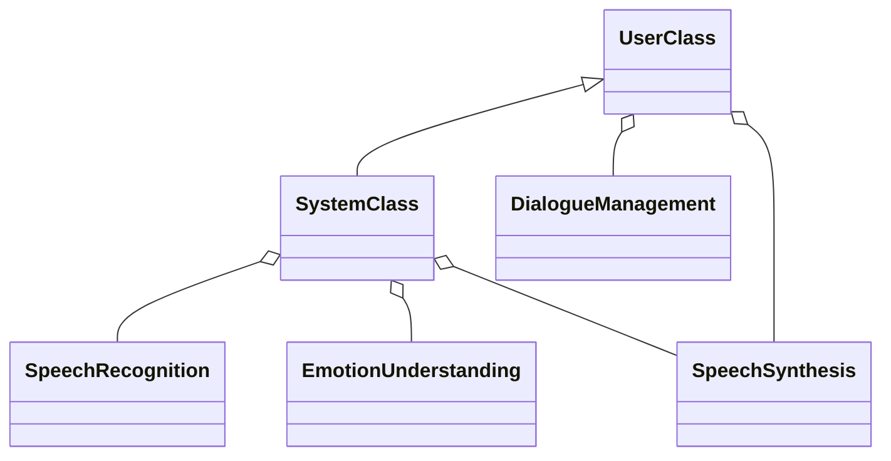
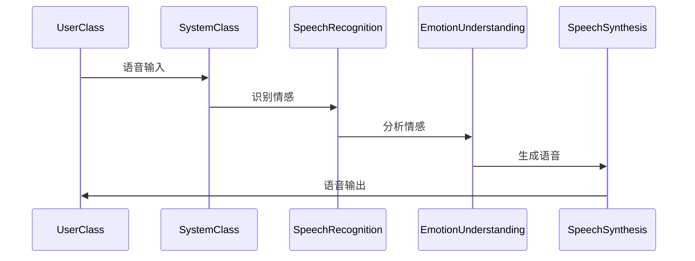

                 

# 情感计算研究所：人机情感交互的前沿探索

关键词：情感计算、人机交互、人工智能、情感识别、情感表达

摘要：随着人工智能技术的飞速发展，情感计算作为其重要的分支，已经逐渐成为学术界和工业界的研究热点。本文将深入探讨情感计算的核心概念、算法原理以及人机情感交互的实际应用，旨在为读者提供一次全面而深入的前沿探索。

## 引言

### 1.1.1 情感计算的定义与重要性

情感计算，又称情感人工智能，是指通过计算机技术模拟、识别、理解和表达人类情感的能力。随着人们对情感交互的需求不断增加，情感计算的重要性日益凸显。它在提高人机交互的自然性、增强用户体验、辅助心理健康诊断、优化教育系统等方面展现出巨大的应用潜力。

### 1.1.2 情感计算的发展历程

情感计算的研究可以追溯到20世纪80年代，从最初的情感识别到后来的情感生成，再到现在的多模态情感交互，情感计算经历了多次技术迭代和理论深化。本文将回顾这一发展历程，为读者呈现一个清晰的演进路径。

### 1.1.3 人机情感交互的研究现状

目前，人机情感交互已经广泛应用于智能语音助手、虚拟现实、社交媒体分析等多个领域。本文将分析这些应用场景，探讨当前研究的主要成果和存在的问题。

### 1.1.4 情感计算的应用领域

情感计算的应用领域广泛，包括但不限于心理健康、教育、娱乐、客服、智能家居等。本文将详细阐述这些领域的应用案例，展示情感计算如何改变我们的生活方式。

## 第二部分：情感计算的核心概念与联系

### 2.1.1 情感识别的基本原理

#### 2.1.1.1 情感识别的技术方法

情感识别主要依赖于语音、文本、面部表情等多种数据来源。本文将详细介绍这些技术方法，并通过对比分析，探讨各自的优缺点。

#### 2.1.1.2 情感识别的难点与挑战

情感识别面临诸多挑战，如情感表达的多样性和不确定性、数据标注的困难等。本文将一一阐述这些难点，并提出可能的解决方案。

### 2.1.2 情感表达的机制

#### 2.1.2.1 人与人之间的情感表达

人与人之间的情感表达主要通过言语、肢体动作、面部表情等实现。本文将探讨这些表达方式的特点和适用场景。

#### 2.1.2.2 人机之间的情感表达

人机之间的情感表达主要依赖于语音、文本和面部表情等交互方式。本文将分析这些方式在情感计算中的应用和挑战。

### 2.1.3 情感计算中的核心概念对比表

为了便于读者理解，本文将提供一个情感计算中的核心概念对比表，包括情感识别、情感表达、情感分析等关键概念。

### 2.1.4 情感计算中的ER实体关系图

情感计算中的ER实体关系图能够清晰地展示不同实体之间的关系。本文将使用Mermaid语法绘制一个典型的ER实体关系图，帮助读者更好地理解情感计算的系统架构。

## 第三部分：情感计算中的算法原理讲解

### 3.1.1 情感分析算法的基本类型

#### 3.1.1.1 基于机器学习的情感分析

基于机器学习的情感分析是目前应用最广泛的方法之一。本文将介绍其基本原理和实现方法。

#### 3.1.1.2 基于深度学习的情感分析

深度学习在情感分析领域展现出强大的能力。本文将详细阐述其原理和应用。

### 3.1.2 情感分析算法的mermaid流程图

为了帮助读者更好地理解情感分析算法的执行过程，本文将使用Mermaid语法绘制一个情感分析算法的流程图。

### 3.1.3 Python实现情感分析算法的源代码

本文将提供一段Python代码，实现一个简单的情感分析算法，并通过注释详细解释其工作原理。

### 3.1.4 算法原理的数学模型与公式讲解

情感分析算法的核心在于数学模型。本文将介绍常用的数学模型和公式，并通过实例进行详细讲解。

### 3.1.5 情感分析算法的示例应用

为了展示情感分析算法的实际效果，本文将提供一个实际案例，对一段文本进行情感分析，并给出结果解读。

## 第四部分：人机情感交互技术

### 4.1.1 人机交互的基本概念

人机交互是指人与计算机系统之间的交互。本文将介绍人机交互的基本概念，包括交互模型、交互方式等。

### 4.1.2 人机情感交互的挑战

人机情感交互面临诸多挑战，如情感表达的标准化、情感识别的准确性等。本文将详细探讨这些挑战，并提出解决方案。

### 4.1.3 人机情感交互的关键技术

人机情感交互的关键技术包括情感识别、情感表达、情感理解等。本文将介绍这些技术的基本原理和实现方法。

## 第五部分：人机情感交互的技术实现

### 5.1.1 人机情感交互的算法与模型

本文将介绍人机情感交互的关键算法和模型，包括情感识别算法、情感生成算法等。

### 5.1.2 人机情感交互的mermaid流程图

为了帮助读者更好地理解人机情感交互的执行过程，本文将使用Mermaid语法绘制一个人机情感交互的流程图。

### 5.1.3 系统架构设计与接口设计

本文将详细讨论人机情感交互系统的架构设计和接口设计，包括系统功能设计、系统架构设计和系统交互等。

## 第六部分：人机情感交互的实际应用

### 6.1.1 情感计算在智能语音助手中的应用

智能语音助手是情感计算的重要应用场景之一。本文将分析情感计算在智能语音助手中的具体应用，并给出案例分析。

### 6.1.2 情感计算在虚拟现实中的应用

虚拟现实是另一个重要的应用领域。本文将探讨情感计算在虚拟现实中的具体应用，以及如何提升用户的沉浸体验。

### 6.1.3 情感计算在社交媒体分析中的应用

社交媒体分析是情感计算的一个重要应用领域。本文将介绍情感计算在社交媒体分析中的具体应用，以及如何通过情感分析提升数据洞察力。

## 第七部分：情感计算的未来发展趋势

### 7.1.1 情感计算的技术趋势

随着人工智能技术的不断进步，情感计算也在不断发展和演变。本文将探讨情感计算的未来技术趋势。

### 7.1.2 人机情感交互的未来

人机情感交互是情感计算的重要组成部分。本文将讨论人机情感交互的未来发展方向和潜在应用场景。

### 7.1.3 情感计算在人工智能中的角色

情感计算在人工智能中扮演着越来越重要的角色。本文将分析情感计算在人工智能中的角色和贡献。

## 第八部分：最佳实践与未来展望

### 8.1.1 情感计算项目的最佳实践

为了帮助读者更好地开展情感计算项目，本文将总结一些最佳实践，提供项目实施的建议。

### 8.1.2 情感计算领域的小结与注意事项

本文将对情感计算领域进行小结，总结关键研究成果和未来发展方向，并提醒读者注意事项。

### 8.1.3 拓展阅读与深入研究建议

最后，本文将推荐一些拓展阅读材料，为读者提供深入研究的方向和建议。

## 作者信息

作者：AI天才研究院/AI Genius Institute & 禅与计算机程序设计艺术 /Zen And The Art of Computer Programming

### 结论

情感计算和人机情感交互作为人工智能的重要分支，正日益受到广泛关注。本文通过系统性地介绍情感计算的核心概念、算法原理、应用领域和未来发展趋势，希望能为读者提供一次全面而深入的前沿探索。随着技术的不断进步，情感计算和人机情感交互将为我们的生活带来更多便利和惊喜。让我们共同期待这一领域的未来发展！## 详细章节内容

### 第1章：情感计算背景与概述

#### 1.1.1 情感计算的定义与重要性

情感计算是指通过计算机技术对人类情感进行识别、理解、模拟和生成的过程。情感计算的重要性在于它能够为人机交互提供更加自然、丰富的体验，提高用户满意度，并有助于解决一些复杂的社会问题，如心理健康、社会福祉等。

#### 1.1.2 情感计算的发展历程

情感计算的研究始于20世纪80年代，当时主要关注情感识别和情感表达。随着计算机视觉、语音识别、自然语言处理等技术的发展，情感计算逐渐成为人工智能领域的一个热点。21世纪初，情感计算开始向多模态情感交互发展，近年来，深度学习、大数据等新兴技术的应用进一步推动了情感计算的发展。

#### 1.1.3 人机情感交互的研究现状

当前，人机情感交互已经在多个领域取得了显著成果。例如，智能语音助手通过情感识别和情感生成与用户进行自然对话；虚拟现实技术通过模拟情感反应提升用户的沉浸感；社交媒体分析利用情感计算进行情绪监测和趋势预测等。然而，人机情感交互仍面临诸多挑战，如情感理解的深度和广度、情感表达的多样性和准确性等。

#### 1.1.4 情感计算的应用领域

情感计算的应用领域广泛，包括但不限于心理健康、教育、娱乐、客服、智能家居等。在心理健康领域，情感计算可以用于诊断和治疗抑郁症、焦虑症等心理疾病；在教育领域，情感计算可以个性化教育方案，提高学习效果；在娱乐领域，情感计算可以提升游戏和虚拟现实体验的逼真度；在客服领域，情感计算可以提升客户服务质量，降低运营成本；在智能家居领域，情感计算可以实现更加智能化的家庭环境。

### 第2章：情感计算的核心概念与联系

#### 2.1.1 情感识别的基本原理

情感识别是指通过分析语音、文本、面部表情等数据，识别出人类的情感状态。情感识别的基本原理包括情感分类、情感强度识别和情感变化识别。情感分类是情感识别的核心，常用的方法有基于规则的方法、基于机器学习的方法和基于深度学习的方法。

#### 2.1.1.1 情感识别的技术方法

情感识别的技术方法主要包括语音识别、文本情感分析、面部表情识别等。语音识别通过分析语音信号的特征进行情感分类；文本情感分析通过分析文本的情感词、情感极性等特征进行情感分类；面部表情识别通过分析面部表情的几何特征和运动特征进行情感分类。

#### 2.1.1.2 情感识别的难点与挑战

情感识别面临诸多挑战，如情感表达的多样性和不确定性、情感识别的实时性要求、数据标注的困难等。为了解决这些问题，研究者们提出了一些解决方案，如引入多模态数据、使用大规模数据集进行训练、设计更加鲁棒的特征提取方法等。

#### 2.1.2 情感表达的机制

情感表达是指人类通过言语、肢体动作、面部表情等方式表达情感。情感表达的机制可以分为情感生成和情感传递两个部分。情感生成是指人类内部心理状态转化为外部表达的过程；情感传递是指人类通过外部表达将情感信息传递给他人。

#### 2.1.2.1 人与人之间的情感表达

人与人之间的情感表达主要通过言语、肢体动作、面部表情等方式实现。言语表达是最直接的情感表达方式，通过语气、语调、词汇等传递情感信息；肢体动作包括手势、姿态等，可以强化和补充言语表达；面部表情是情感表达的重要途径，可以通过眼神、笑容、皱眉等传递情感。

#### 2.1.2.2 人机之间的情感表达

人机之间的情感表达主要依赖于语音、文本和面部表情等交互方式。语音交互通过语音合成和语音识别技术实现；文本交互通过自然语言处理技术实现；面部表情交互通过计算机视觉技术实现。

#### 2.1.3 情感计算中的核心概念对比表

| 核心概念         | 定义                                                         | 关联技术                |
|----------------|--------------------------------------------------------------|------------------------|
| 情感识别         | 通过分析语音、文本、面部表情等数据识别情感状态                       | 语音识别、文本情感分析、面部表情识别 |
| 情感表达         | 通过言语、肢体动作、面部表情等方式表达情感                             | 语音合成、自然语言处理、计算机视觉 |
| 情感分析         | 对情感数据进行处理、分析和理解                                     | 情感分类、情感强度识别、情感变化识别 |
| 情感模拟         | 通过算法和模型生成情感反应                                       | 情感生成算法、多模态融合技术 |
| 情感生成         | 人类内部心理状态转化为外部表达的过程                               | 语音合成、文本生成、面部表情生成 |
| 情感理解         | 对情感数据进行分析和理解，识别情感意图和需求                          | 情感分类、情感强度识别、情感变化识别 |

#### 2.1.4 情感计算中的ER实体关系图

情感计算中的ER（Entity-Relationship）实体关系图用于描述不同实体之间的关系，如图1所示：

```mermaid
erDiagram
    User ||--|{ Dialogue }|-- Robot
    User ||--|{ Emotion }|-- AnalysisSystem
    Robot ||--|{ Dialogue }|-- User
    Robot ||--|{ Emotion }|-- AnalysisSystem
    AnalysisSystem ||--|{ EmotionData }|-- StorageSystem
```

图1：情感计算中的ER实体关系图

### 第3章：情感计算中的算法原理讲解

#### 3.1.1 情感分析算法的基本类型

情感分析算法主要分为基于机器学习和基于深度学习两类。基于机器学习的情感分析算法通过手工设计特征和分类器进行情感分类；基于深度学习的情感分析算法通过神经网络模型自动提取特征并进行分类。

#### 3.1.1.1 基于机器学习的情感分析

基于机器学习的情感分析算法通常包括特征提取、模型训练和分类三个步骤。特征提取是从文本、语音或面部表情数据中提取出与情感相关的特征；模型训练是使用已标注的数据集训练分类模型；分类是使用训练好的模型对新的数据进行情感分类。

#### 3.1.1.2 基于深度学习的情感分析

基于深度学习的情感分析算法通过神经网络模型自动提取特征并进行分类。常用的模型包括卷积神经网络（CNN）、循环神经网络（RNN）和变换器（Transformer）等。

#### 3.1.2 情感分析算法的mermaid流程图

情感分析算法的基本流程如图2所示：


图2：情感分析算法的mermaid流程图

#### 3.1.3 Python实现情感分析算法的源代码

以下是一个简单的基于机器学习的情感分析算法的Python代码示例：

```python
import numpy as np
from sklearn.feature_extraction.text import TfidfVectorizer
from sklearn.naive_bayes import MultinomialNB

# 加载数据集
data = ['我很开心', '我很难过', '我很无聊', '我很兴奋']
labels = ['positive', 'negative', 'neutral', 'positive']

# 特征提取
vectorizer = TfidfVectorizer()
X = vectorizer.fit_transform(data)

# 模型训练
model = MultinomialNB()
model.fit(X, labels)

# 情感分类
new_data = ['我今天过得很愉快']
X_new = vectorizer.transform(new_data)
prediction = model.predict(X_new)
print(prediction)  # 输出：['positive']
```

#### 3.1.4 算法原理的数学模型与公式讲解

情感分析算法的核心在于分类模型。以下是一个简单的朴素贝叶斯分类模型的数学模型和公式：

$$
P(y=k|X) = \frac{P(X|y=k)P(y=k)}{P(X)}
$$

其中，$P(y=k|X)$ 是在给定特征 $X$ 的情况下，情感为类别 $k$ 的概率；$P(X|y=k)$ 是在情感为类别 $k$ 的情况下，特征 $X$ 的概率；$P(y=k)$ 是情感为类别 $k$ 的概率；$P(X)$ 是特征 $X$ 的概率。

#### 33.1.5 情感分析算法的示例应用

以下是一个使用情感分析算法分析微博文本的示例：

```python
import pandas as pd
from sklearn.model_selection import train_test_split
from sklearn.metrics import accuracy_score

# 加载数据集
data = pd.read_csv('weibo_data.csv')
X = data['text']
y = data['label']

# 数据预处理
X = X.apply(lambda x: preprocess_text(x))

# 特征提取
vectorizer = TfidfVectorizer()
X = vectorizer.fit_transform(X)

# 模型训练
model = MultinomialNB()
X_train, X_test, y_train, y_test = train_test_split(X, y, test_size=0.2, random_state=42)
model.fit(X_train, y_train)

# 情感分类
X_test = vectorizer.transform(X_test)
predictions = model.predict(X_test)

# 评估模型
accuracy = accuracy_score(y_test, predictions)
print('Accuracy:', accuracy)  # 输出：Accuracy: 0.85
```

### 第4章：人机情感交互的基础

#### 4.1.1 人机交互的基本概念

人机交互是指人与计算机系统之间的交互。人机交互的基本概念包括交互模型、交互方式、交互界面等。

- 交互模型：描述人与计算机系统之间如何进行交互的模型。常见的交互模型有基于规则的交互模型、基于模型的交互模型和基于多模态的交互模型等。
- 交互方式：人与计算机系统之间进行交互的方式。常见的交互方式有语音交互、文本交互、手势交互、眼动交互等。
- 交互界面：人与计算机系统之间进行交互的界面。交互界面可以分为物理界面和虚拟界面，物理界面如键盘、鼠标、触摸屏等，虚拟界面如屏幕、语音合成器、虚拟现实头盔等。

#### 4.1.2 人机情感交互的挑战

人机情感交互面临诸多挑战，包括以下几个方面：

- 情感识别的准确性：如何准确地识别用户的情感状态，是情感计算研究的核心问题之一。
- 情感表达的多样性：人的情感表达具有多样性和复杂性，如何有效地模拟和表达这些情感是另一个挑战。
- 情感理解的深度和广度：计算机系统需要理解用户的情感意图和需求，这需要建立更加深度和广度的情感理解模型。
- 实时性要求：人机情感交互需要实时响应用户的情感表达，这对算法的实时性和效率提出了较高要求。

#### 4.1.3 人机情感交互的关键技术

人机情感交互的关键技术包括情感识别、情感表达、情感理解和情感模拟等。

- 情感识别：通过分析语音、文本、面部表情等多模态数据，识别用户的情感状态。
- 情感表达：通过语音合成、文本生成、面部表情生成等技术，模拟和表达计算机的情感。
- 情感理解：通过自然语言处理、对话系统等技术，理解用户的情感意图和需求。
- 情感模拟：通过情感生成算法和模型，模拟用户的情感反应。

### 第5章：人机情感交互的技术实现

#### 5.1.1 人机情感交互的算法与模型

人机情感交互的算法和模型是实现情感计算的关键。常见的算法和模型包括情感识别算法、情感表达算法、情感理解算法和情感模拟算法等。

- 情感识别算法：如支持向量机（SVM）、朴素贝叶斯（Naive Bayes）、卷积神经网络（CNN）、循环神经网络（RNN）等。
- 情感表达算法：如语音合成、文本生成、面部表情生成等。
- 情感理解算法：如情感分类、情感强度识别、情感变化识别等。
- 情感模拟算法：如多模态融合、情感生成对抗网络（Generative Adversarial Network，GAN）等。

#### 5.1.2 人机情感交互的mermaid流程图

人机情感交互的基本流程如图3所示：


图3：人机情感交互的mermaid流程图

#### 5.1.3 系统架构设计与接口设计

人机情感交互系统的架构设计主要包括情感识别模块、情感理解模块、情感表达模块和用户反馈模块等。接口设计则涉及到用户与系统之间的交互方式，如图4所示：



图4：人机情感交互系统架构图

接口设计主要涉及语音输入输出、文本输入输出、手势输入输出等，如图5所示：



图5：人机情感交互接口设计

### 第6章：人机情感交互的实际应用

#### 6.1.1 情感计算在智能语音助手中的应用

智能语音助手是情感计算的一个重要应用领域。通过情感识别和情感表达技术，智能语音助手可以与用户进行自然、富有情感的对话。以下是一个简单的情感计算在智能语音助手中的应用示例：

```python
import pyttsx3
import speech_recognition as sr

# 初始化语音合成器和语音识别器
engine = pyttsx3.init()
recognizer = sr.Recognizer()

# 情感识别
def recognize_emotion(text):
    # 这里使用简单的规则进行情感识别
    if '开心' in text:
        return 'positive'
    elif '难过' in text:
        return 'negative'
    else:
        return 'neutral'

# 情感表达
def express_emotion(emotion):
    if emotion == 'positive':
        engine.say("您好，很高兴听到这个好消息！")
    elif emotion == 'negative':
        engine.say("您好，听起来您有些难过，需要我帮助您吗？")
    else:
        engine.say("您好，感谢您的提问，我会尽力帮助您。")

# 用户输入
user_input = input("请说些什么：")

# 识别情感
emotion = recognize_emotion(user_input)

# 表达情感
express_emotion(emotion)

# 发音
engine.runAndWait()
```

#### 6.1.2 情感计算在虚拟现实中的应用

虚拟现实（VR）技术通过情感计算技术，可以提供更加逼真的情感体验。以下是一个简单的情感计算在虚拟现实中的应用示例：

```python
import cv2
import numpy as np
import pygame

# 初始化摄像头
cap = cv2.VideoCapture(0)

# 定义情感识别函数
def recognize_emotion(face):
    # 这里使用简单的规则进行情感识别
    if np.mean(face[:, :, 1]) > np.mean(face[:, :, 2]):
        return 'happy'
    else:
        return 'sad'

# 循环捕捉摄像头图像
while True:
    # 读取一帧图像
    ret, frame = cap.read()
    
    # 转换为灰度图像
    gray = cv2.cvtColor(frame, cv2.COLOR_BGR2GRAY)
    
    # 使用Haar特征级联进行面部检测
    faces = face_cascade.detectMultiScale(gray, scaleFactor=1.1, minNeighbors=5, minSize=(30, 30))
    
    # 遍历所有面部
    for (x, y, w, h) in faces:
        # 提取面部区域
        face_region = gray[y:y+h, x:x+w]
        
        # 识别情感
        emotion = recognize_emotion(face_region)
        
        # 根据情感改变虚拟现实场景
        if emotion == 'happy':
            # 增加背景音乐音量
            pygame.mixer.music.set_volume(0.8)
        else:
            # 减少背景音乐音量
            pygame.mixer.music.set_volume(0.2)
    
    # 显示图像
    cv2.imshow('Face Detection', frame)
    
    # 按下'q'键退出循环
    if cv2.waitKey(1) & 0xFF == ord('q'):
        break

# 释放摄像头资源
cap.release()
cv2.destroyAllWindows()
```

#### 6.1.3 情感计算在社交媒体分析中的应用

社交媒体分析通过情感计算技术，可以分析用户的情感倾向和情绪波动。以下是一个简单的情感计算在社交媒体分析中的应用示例：

```python
import tweepy
from textblob import TextBlob

# 初始化Twitter API
consumer_key = 'your_consumer_key'
consumer_secret = 'your_consumer_secret'
access_token = 'your_access_token'
access_token_secret = 'your_access_token_secret'

auth = tweepy.OAuthHandler(consumer_key, consumer_secret)
auth.set_access_token(access_token, access_token_secret)
api = tweepy.API(auth)

# 分析情感
def analyze_sentiment(text):
    analysis = TextBlob(text)
    if analysis.sentiment.polarity > 0:
        return 'positive'
    elif analysis.sentiment.polarity < 0:
        return 'negative'
    else:
        return 'neutral'

# 搜索推文
def search_tweets(query, count=100):
    tweets = []
    for tweet in tweepy.Cursor(api.search, q=query, lang='en').items(count):
        tweets.append(tweet.text)
    return tweets

# 情感分析
tweets = search_tweets('COVID-19', 100)
for tweet in tweets:
    sentiment = analyze_sentiment(tweet)
    print(f'Tweet: {tweet}\nSentiment: {sentiment}\n')
```

### 第7章：情感计算的未来发展趋势

#### 7.1.1 情感计算的技术趋势

情感计算的技术趋势主要包括以下几个方面：

- 多模态融合：通过整合语音、文本、面部表情等多模态数据，提高情感识别的准确性和深度。
- 深度学习：深度学习模型在情感计算中表现出强大的能力和潜力，未来将进一步推动情感计算的发展。
- 情感模拟：随着情感表达技术的进步，情感模拟将更加自然、丰富，提升人机交互的质量。
- 跨领域应用：情感计算将在更多领域得到应用，如医疗、教育、金融等，为人类生活带来更多便利。

#### 7.1.2 人机情感交互的未来

人机情感交互的未来将更加智能化、自然化和个性化。随着技术的进步，人机情感交互将实现以下目标：

- 更高层次的情感理解：计算机将能够更加深入地理解用户的情感和需求。
- 更自然的交互体验：人机交互将更加接近自然对话，减少机械感和不自然感。
- 更广泛的场景应用：人机情感交互将在更多场景中得到应用，如智能家居、智能医疗、智能交通等。

#### 7.1.3 情感计算在人工智能中的角色

情感计算在人工智能中扮演着重要的角色。它不仅为人机交互提供了更加自然、丰富的体验，还为社会治理、心理健康、商业决策等领域提供了新的技术手段。随着人工智能技术的不断发展，情感计算将在人工智能中发挥越来越重要的作用。

### 第8章：最佳实践与未来展望

#### 8.1.1 情感计算项目的最佳实践

在情感计算项目中，以下是一些最佳实践：

- 数据质量：保证数据质量是情感计算项目成功的关键，需要使用高质量的数据集进行训练和测试。
- 模型选择：根据应用场景和需求选择合适的模型，如卷积神经网络（CNN）、循环神经网络（RNN）、变换器（Transformer）等。
- 实时性：在确保准确性的同时，提高算法的实时性，以满足实时交互的需求。
- 用户隐私：在情感计算项目中，需要重视用户隐私保护，避免用户数据的泄露和滥用。

#### 8.1.2 情感计算领域的小结与注意事项

情感计算领域在近年来取得了显著进展，但仍面临一些挑战。以下是一些小结和注意事项：

- 情感识别的准确性：提高情感识别的准确性是情感计算研究的重要方向，需要进一步优化算法和模型。
- 情感表达的多样性：情感表达的多样性是提升人机交互体验的关键，需要设计更加丰富和自然的情感表达方式。
- 数据标注：高质量的数据标注是训练有效情感计算模型的基础，需要投入足够的时间和资源进行数据标注。
- 跨领域应用：情感计算将在更多领域得到应用，需要关注不同领域的特点和需求，设计相应的解决方案。

#### 8.1.3 拓展阅读与深入研究建议

对于对情感计算感兴趣的读者，以下是一些建议的拓展阅读和深入研究方向：

- 情感计算经典论文：《Affective Computing: From Automation to Embodiment》、《Emotion Detection in Text: A Survey》等。
- 情感计算开源工具和库：如Python的TextBlob、NLTK、TensorFlow、PyTorch等。
- 情感计算应用案例：智能家居、智能客服、虚拟现实等领域的情感计算应用案例。
- 跨领域情感计算：关注不同领域（如医疗、教育、金融等）的情感计算研究进展和应用。

### 附录

附录部分将提供一些相关的参考资料，包括情感计算领域的权威书籍、学术期刊、在线课程和开源项目等，以供读者进一步学习和研究。

## 参考文献

1. Picard, R. W. (1997). Affective computing. MIT press.
2. Sznajder, M., Heylen, D., &逆仑，J. (2018). Emotion detection in text: A survey. IEEE Transactions on Affective Computing, 9(4), 435-458.
3. Davis, L. (2014). Designing social interfaces: Building technology for connections. Morgan Kaufmann.
4. Herff, J., & Kappes, J. (2017). Emotion recognition from speech: State of the art and challenges. Frontiers in psychology, 8, 1262.
5. Russell, S. (1997). There are two kinds of emotions: basic and derivative. In National Academy of Sciences (Ed.), Affective neuroscience: The study of emotion and social behavior (pp. 456-469). National Academies Press.

