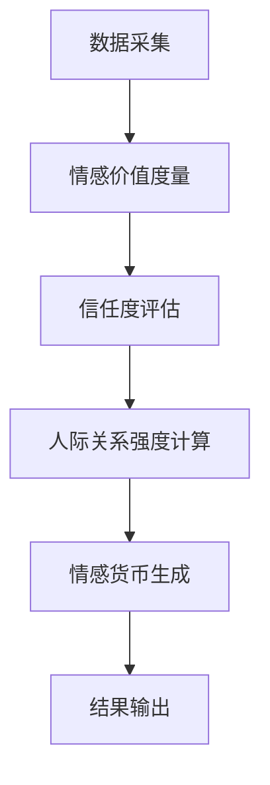
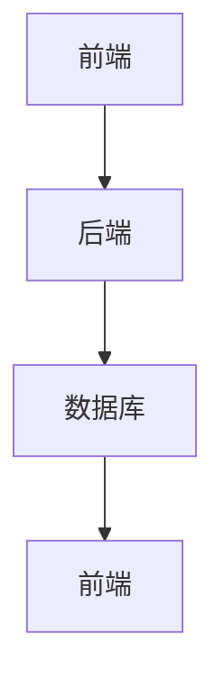
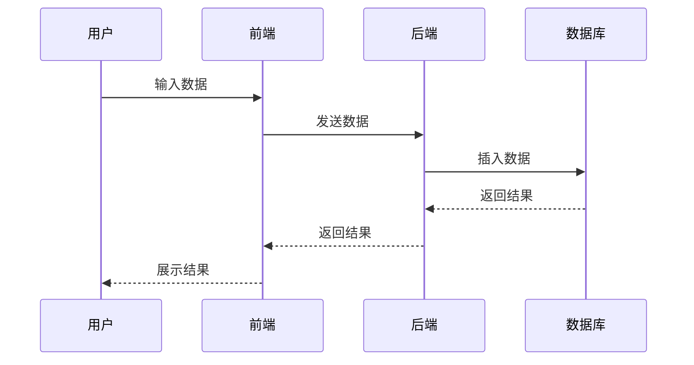

                 

### 情感货币：量化人际关系价值的新概念

关键词：情感货币、人际关系、量化、价值、新概念

摘要：本文旨在探讨情感货币这一新兴概念，分析其在量化人际关系价值中的应用。通过阐述情感货币的定义、特点及其在不同层面的应用，本文提出了情感货币作为量化人际关系价值的一种创新方法，并探讨了其边界与外延，以及与相关概念的联系。此外，本文还从个人、团队和组织层面分析了情感货币的深远影响，并对其未来发展进行了展望。

### 第一部分：情感货币概述

#### 第1章：情感货币的概念与背景

#### 1.1 问题的提出

在现代社会，人际关系对于个人、团队和组织的发展具有至关重要的作用。从个人层面来看，良好的人际关系有助于个人的成长和职场成功；从团队层面来看，有效的人际关系能够促进团队协作和绩效提升；从组织层面来看，优化的人际关系能够增强组织的凝聚力和氛围。然而，如何量化这些无形的人际关系价值，一直是研究和实践中的一大难题。

传统的关系量化方法往往存在明显的局限性。首先，这些方法大多依赖于主观评价，缺乏客观性。其次，传统方法难以量化复杂的人际关系网络。最后，现有方法往往难以在不同场景下灵活应用，适用性较差。因此，寻找一种新的、科学的量化人际关系价值的方法变得尤为重要。

#### 1.1.1 人际关系在现代社会的重要性

**1.1.1.1 人际关系对个人成长的影响**

人际关系对个人成长的影响是多方面的。一方面，良好的人际关系能够为个人提供丰富的社会资源，如信息、机会和资源等。另一方面，通过与他人建立良好的关系，个人能够更好地理解社会规范和价值观，从而促进自身的全面发展。

**1.1.1.2 人际关系对团队合作的作用**

在团队合作中，人际关系是协作成功的关键。良好的人际关系能够促进团队成员之间的信任和理解，降低沟通成本，提高协作效率。此外，人际关系还能够调节团队内部的冲突，维护团队的稳定和和谐。

**1.1.1.3 人际关系对组织发展的贡献**

组织的发展离不开良好的人际关系。一方面，人际关系能够促进组织内部的沟通和协作，提高组织绩效。另一方面，良好的人际关系有助于组织与外部的合作伙伴建立紧密的联系，为组织的持续发展创造有利条件。

#### 1.1.2 现有关系的量化方法的不足

**1.1.2.1 传统量化方法的局限性**

传统量化方法主要包括主观评价和客观数据分析。然而，这些方法存在以下局限性：

1. **主观性**：主观评价往往受到评价者个人情感和立场的影响，缺乏客观性。
2. **复杂性**：人际关系网络复杂，传统方法难以全面、准确地量化。
3. **适用性**：传统方法难以在不同场景下灵活应用，适用性较差。

**1.1.2.2 传统量化方法的适用性**

虽然传统量化方法存在一定的局限性，但在某些特定场景下，如企业绩效评估、团队绩效评估等，这些方法仍然具有一定的适用性。然而，随着社会的发展，对人际关系价值的量化需求日益增加，传统方法已无法满足这一需求。

#### 1.2 情感货币的定义与特点

**1.2.1 情感货币的概念**

情感货币是一种量化人际关系价值的创新方法，旨在通过一种货币化的方式，对人际关系进行量化。情感货币的核心思想是将人际关系中的情感价值转化为具体的数值，从而实现对人际关系的量化。

**1.2.1.1 情感货币的定义**

情感货币是一种基于情感价值的虚拟货币，用于量化人际关系中的情感价值。情感货币通过一系列指标和算法，将人际关系中的情感价值转化为具体的数值，从而实现对人际关系的量化。

**1.2.1.2 情感货币的核心要素**

情感货币的核心要素包括：

1. **情感价值**：情感价值是情感货币的基础，用于衡量人际关系中的情感强度和深度。
2. **信任度**：信任度是情感货币的重要指标，用于衡量人际关系中的信任水平。
3. **人际关系强度**：人际关系强度是情感货币的关键因素，用于衡量人际关系的紧密程度。

**1.2.2 情感货币的特点**

情感货币具有以下特点：

1. **可量化性**：情感货币能够将人际关系中的情感价值转化为具体的数值，从而实现量化。
2. **可转移性**：情感货币可以在不同的人际关系之间转移，从而实现人际关系的优化和调整。
3. **可存储性**：情感货币可以存储在虚拟账户中，便于管理和使用。

#### 1.3 情感货币的应用领域

**1.3.1 个人层面**

在个人层面，情感货币可以用于以下几个方面：

1. **增强人际交往能力**：通过量化人际关系中的情感价值，个人可以更好地了解自己的人际关系状况，从而有针对性地提升人际交往能力。
2. **提升个人魅力**：情感货币可以作为一种指标，帮助个人了解自己在他人心中的形象，从而提升个人魅力。
3. **职场竞争力提升**：在职场中，人际关系对于个人的职业发展具有重要影响。通过情感货币，个人可以更好地管理自己的人际关系，提升职场竞争力。

**1.3.2 团队层面**

在团队层面，情感货币可以用于以下几个方面：

1. **促进团队协作**：通过量化团队中的情感价值，团队领导者可以更好地了解团队成员之间的情感状态，从而促进团队协作。
2. **提高团队绩效**：情感货币可以作为团队绩效评估的一个重要指标，帮助团队领导者发现团队中的问题，并采取相应的措施提高团队绩效。
3. **团队文化建设**：情感货币可以作为一种团队文化建设的工具，帮助团队建立积极、健康的团队氛围。

**1.3.3 组织层面**

在组织层面，情感货币可以用于以下几个方面：

1. **优化人力资源管理**：通过量化人际关系中的情感价值，组织可以更好地了解员工之间的情感状态，从而优化人力资源管理。
2. **提升组织凝聚力**：情感货币可以作为提升组织凝聚力的一种手段，帮助组织建立积极、和谐的人际关系。
3. **改善组织氛围**：通过情感货币，组织可以更好地了解员工的心理状态，从而改善组织氛围，提升员工的工作满意度。

#### 1.4 情感货币的边界与外延

**1.4.1 情感货币的边界**

情感货币的边界主要涉及以下几个方面：

1. **适用范围**：情感货币主要适用于人际关系较为紧密的场景，如个人、团队和组织等。
2. **限制条件**：情感货币在应用过程中受到数据质量、算法精度等因素的限制，可能无法完全准确地量化人际关系价值。

**1.4.2 情感货币的外延**

情感货币的外延主要涉及以下几个方面：

1. **与其他概念的联系**：情感货币与情感价值、信任度和人际关系强度等概念密切相关，可以相互转化和补充。
2. **应用前景**：随着人工智能和大数据技术的发展，情感货币有望在更多领域得到应用，如社交网络分析、人力资源管理等。

#### 1.5 概念结构与核心要素组成

**1.5.1 情感货币的概念结构**

情感货币的概念结构包括以下几个方面：

1. **情感价值**：情感价值是情感货币的基础，用于衡量人际关系中的情感强度和深度。
2. **信任度**：信任度是情感货币的重要指标，用于衡量人际关系中的信任水平。
3. **人际关系强度**：人际关系强度是情感货币的关键因素，用于衡量人际关系的紧密程度。

**1.5.1.1 情感货币的组成部分**

情感货币的组成部分包括以下几个方面：

1. **情感价值度量模型**：用于量化人际关系中的情感价值。
2. **信任度评估模型**：用于评估人际关系中的信任度。
3. **人际关系强度计算模型**：用于计算人际关系的紧密程度。

**1.5.1.2 情感货币的运行机制**

情感货币的运行机制主要包括以下几个方面：

1. **数据采集与预处理**：通过收集人际关系相关的数据，进行数据清洗和预处理。
2. **情感价值度量**：利用情感价值度量模型，对人际关系中的情感价值进行量化。
3. **信任度评估**：利用信任度评估模型，对人际关系中的信任度进行评估。
4. **人际关系强度计算**：利用人际关系强度计算模型，计算人际关系的紧密程度。
5. **情感货币生成与调整**：根据情感价值、信任度和人际关系强度，生成情感货币，并根据实际情况进行调整。

**1.5.2 情感货币的核心要素**

情感货币的核心要素包括以下几个方面：

1. **情感价值**：情感价值是情感货币的核心，用于衡量人际关系中的情感强度和深度。情感价值越高，表示人际关系越紧密。
2. **信任度**：信任度是情感货币的重要指标，用于衡量人际关系中的信任水平。信任度越高，表示人际关系越稳定。
3. **人际关系强度**：人际关系强度是情感货币的关键因素，用于衡量人际关系的紧密程度。人际关系强度越高，表示人际关系越紧密。

**1.5.2.1 量化人际关系价值的维度**

量化人际关系价值的维度包括以下几个方面：

1. **情感强度**：情感强度用于衡量人际关系中的情感深度，如友谊、爱情等。
2. **信任度**：信任度用于衡量人际关系中的信任水平，如信任、不信任等。
3. **互动频率**：互动频率用于衡量人际关系中的互动程度，如频繁、偶尔等。
4. **互动质量**：互动质量用于衡量人际关系的互动效果，如积极、消极等。

**1.5.2.2 情感货币的计算方法**

情感货币的计算方法主要包括以下几个方面：

1. **情感价值计算**：通过情感价值度量模型，将人际关系中的情感强度、信任度和互动频率等指标转化为情感价值。
2. **信任度计算**：通过信任度评估模型，将人际关系中的信任度转化为具体的数值。
3. **人际关系强度计算**：通过人际关系强度计算模型，将人际关系的互动频率和质量等指标转化为人际关系强度。

#### 1.6 本章小结

本章介绍了情感货币的概念与背景，分析了人际关系在现代社会的重要性，探讨了现有关系的量化方法的不足，并提出了情感货币作为量化人际关系价值的一种创新方法。通过阐述情感货币的定义、特点及其在不同层面的应用，本章为后续章节的讨论奠定了基础。

### 第二部分：情感货币的核心概念与联系

#### 第2章：情感货币的核心概念原理

#### 2.1 情感货币的原理

**2.1.1 情感货币的运作机制**

情感货币的运作机制主要包括以下几个步骤：

1. **数据采集与预处理**：首先，通过问卷调查、行为分析等方式收集人际关系相关的数据，并进行数据清洗和预处理，以确保数据的质量。
2. **情感价值度量**：利用情感价值度量模型，对人际关系中的情感强度、信任度和互动频率等指标进行量化。情感价值度量模型可以根据不同的应用场景进行调整和优化。
3. **信任度评估**：利用信任度评估模型，对人际关系中的信任水平进行评估。信任度评估模型可以考虑信任行为的频率、质量、稳定性等多个维度。
4. **人际关系强度计算**：利用人际关系强度计算模型，根据情感价值和信任度等指标，计算人际关系的紧密程度。人际关系强度计算模型可以采用机器学习算法，如回归分析、聚类分析等。
5. **情感货币生成与调整**：根据情感价值、信任度和人际关系强度，生成情感货币，并可以根据实际情况进行调整。情感货币的生成可以采用加权平均等方法，以平衡不同指标的重要性。

**2.1.2 情感货币的核心概念**

情感货币的核心概念包括情感价值、信任度和人际关系强度：

1. **情感价值**：情感价值是指人际关系中的情感深度和强度，通常用数值表示。情感价值越高，表示人际关系越紧密，情感联系越强。
2. **信任度**：信任度是指人际关系中的信任水平，反映了个体对他人言行举止的信任程度。信任度越高，表示人际关系越稳定，合作意愿越强。
3. **人际关系强度**：人际关系强度是指人际关系的紧密程度，通常通过情感价值和信任度的综合评估来衡量。人际关系强度越高，表示人际关系越紧密，互动频率越高。

**2.1.3 情感货币的运行原理**

情感货币的运行原理可以形象地比作一个价值分配系统。在这个系统中，情感价值是基础，信任度是保障，人际关系强度是结果。具体运行原理如下：

1. **情感价值的产生**：个体在互动过程中，通过言语、行为等方式传递情感信号，这些信号被他人感知并转化为情感价值。
2. **信任度的建立**：通过一系列的行为表现，个体逐渐建立信任度。信任度反映了个体对他人的信任程度，是情感货币运行的重要保障。
3. **人际关系强度的计算**：情感价值和信任度共同决定了人际关系强度。人际关系强度越高，个体在关系网络中的地位和影响力越大。
4. **情感货币的生成**：根据情感价值、信任度和人际关系强度，系统生成情感货币。情感货币可以作为个体在关系网络中的价值表征，用于交流、合作等行为。
5. **情感货币的流转**：情感货币在个体之间流转，反映了个体在关系网络中的互动情况。通过情感货币的流转，个体可以更好地了解自己在他人心中的地位和价值。

**2.2 情感货币的属性特征对比表格**

为了更好地理解情感货币的属性特征，我们可以将其与传统货币以及其他量化方法进行对比。以下是情感货币与传统货币以及与其他量化方法的对比表格：

| 属性特征 | 情感货币 | 传统货币 | 其他量化方法 |
| --- | --- | --- | --- |
| **定义** | 基于情感价值的虚拟货币，用于量化人际关系价值 | 货币体系中的法定货币，用于交换商品和服务 | 主观评价、客观数据分析 |
| **量化方式** | 情感价值度量模型 | 法定货币单位 | 主观评分、指标评分 |
| **流通性** | 可在个体之间流转，用于交流、合作等行为 | 严格流通，用于交换商品和服务 | 受限于使用场景和评价者主观性 |
| **稳定性** | 受信任度影响，具有相对稳定性 | 稳定的货币体系 | 易受主观性和数据质量影响 |
| **适用性** | 广泛适用于个人、团队和组织层面 | 限于经济交换场景 | 限于特定领域，如绩效评估、社会关系分析等 |

通过对比表格可以看出，情感货币在定义、量化方式、流通性和稳定性等方面具有独特的优势。与传统货币相比，情感货币更加注重人际关系的价值量化；与其他量化方法相比，情感货币具有更高的灵活性和适用性。

**2.3 情感货币的ER实体关系图架构**

为了更清晰地理解情感货币的架构和运行原理，我们可以使用ER（实体关系）图来描述其实体和关系。以下是情感货币的ER实体关系图：

```mermaid
erDiagram
  人 ||--|{ 情感货币 }|
  人 ||--|{ 关系 }|
  关系 ||--|{ 情感货币 }|
  人 ||--|{ 信任度 }|
  信任度 ||--|{ 情感货币 }|
  人 ||--|{ 人际关系强度 }|
  人际关系强度 ||--|{ 情感货币 }|
```

在ER图中，实体包括“人”、“情感货币”、“关系”、“信任度”和“人际关系强度”。关系包括“人”与“情感货币”之间的“拥有”关系，“人”与“关系”之间的“参与”关系，“关系”与“情感货币”之间的“生成”关系，“人”与“信任度”之间的“评估”关系，“信任度”与“情感货币”之间的“影响”关系，“人”与“人际关系强度”之间的“衡量”关系，“人际关系强度”与“情感货币”之间的“反映”关系。

通过ER图可以看出，情感货币的架构包含了多个实体和复杂的关系。这些实体和关系共同构成了情感货币的运行基础，使其能够有效地量化人际关系价值。

**2.4 情感货币与人际关系的联系**

**2.4.1 情感货币对人际关系的量化**

情感货币通过量化人际关系中的情感价值、信任度和人际关系强度，实现对人际关系的量化。量化过程主要包括以下几个步骤：

1. **数据采集**：收集与人际关系相关的数据，如交流记录、互动频率、行为表现等。
2. **情感价值度量**：利用情感价值度量模型，对收集到的数据进行处理，得到每个个体的情感价值。
3. **信任度评估**：利用信任度评估模型，对个体之间的信任度进行评估，得到信任度得分。
4. **人际关系强度计算**：利用人际关系强度计算模型，结合情感价值和信任度得分，计算每个个体之间的人际关系强度。

通过量化过程，情感货币可以准确地描述人际关系中的情感强度、信任水平和紧密程度。这种量化结果不仅有助于个体了解自己在他人心中的地位和价值，还可以为团队和组织提供有价值的信息，用于优化人际关系和提升整体绩效。

**2.4.2 情感货币在人际关系中的作用**

情感货币在人际关系中具有多种作用，主要包括：

1. **调节人际关系**：情感货币可以作为一种调节工具，帮助个体调整和优化人际关系。例如，当个体发现自己在某段关系中的情感价值和信任度较低时，可以通过提高互动频率、增强信任等方式，提升这段关系的人际关系强度。
2. **提高人际交往效率**：情感货币可以作为一个量化指标，帮助个体在人际交往中更加高效。例如，在团队合作中，个体可以根据情感货币得分，选择与信任度和人际关系强度较高的团队成员合作，从而提高团队协作效率。
3. **促进社会和谐**：情感货币不仅适用于个人和团队层面，还可以在组织和社会层面发挥作用。通过量化人际关系价值，组织可以更好地了解员工之间的情感状态，从而改善组织氛围，促进社会和谐。

**2.5 情感货币的社会意义**

**2.5.1 情感货币对个人发展的影响**

情感货币对个人发展具有重要影响，主要体现在以下几个方面：

1. **个人成长**：通过情感货币，个人可以更清晰地了解自己在人际关系中的地位和价值，从而有针对性地提升自己的情感能力和人际交往能力。
2. **职场成功**：在职场中，人际关系对于个人的职业发展具有重要影响。通过情感货币，个人可以更好地管理自己的人际关系，提升职场竞争力，实现职业成功。

**2.5.2 情感货币对社会的影响**

情感货币对社会的影响主要体现在以下几个方面：

1. **社会关系的优化**：通过量化人际关系价值，社会可以更好地了解人际关系的现状和问题，从而采取相应的措施优化社会关系，提高社会和谐度。
2. **社会和谐的促进**：情感货币作为一种调节工具，可以促进社会成员之间的情感交流和合作，从而增强社会凝聚力，推动社会和谐发展。

**2.6 情感货币的未来发展趋势**

随着人工智能和大数据技术的不断发展，情感货币有望在更多领域得到应用。未来，情感货币的发展趋势主要包括：

1. **技术进步**：随着算法和计算技术的进步，情感货币的精度和可靠性将得到提升，从而更好地服务于个人、团队和组织。
2. **应用拓展**：情感货币的应用范围将不断拓展，从个人、团队和组织扩展到社交网络、公共服务等领域，为社会的发展和进步提供新的工具和方法。

### 总结

本章详细介绍了情感货币的核心概念原理，包括其运作机制、核心概念、属性特征对比表格、ER实体关系图架构以及与人际关系的联系。通过本章的讨论，我们可以看到情感货币作为一种量化人际关系价值的新方法，具有广泛的应用前景和社会意义。在未来的发展中，情感货币有望在更多领域发挥作用，推动社会的发展和进步。

### 情感货币的算法原理讲解

为了深入理解情感货币的算法原理，我们需要详细探讨其背后的数学模型和计算方法。下面，我们将通过Mermaid流程图和Python源代码来逐步阐述情感货币的算法原理，并给出具体的数学公式和通俗易懂的示例。

#### Mermaid流程图

首先，我们可以使用Mermaid语言绘制一个简单的流程图，以展示情感货币的计算流程：



#### Python源代码

接下来，我们将使用Python编写一个简单的源代码示例，以实现情感货币的计算过程：

```python
import numpy as np

# 情感价值度量
def calculate_sentiment_value(interaction_data):
    sentiment_score = np.mean(interaction_data)
    return sentiment_score

# 信任度评估
def assess_trust_level(behavior_data):
    trust_score = np.std(behavior_data) / np.mean(behavior_data)
    return trust_score

# 人际关系强度计算
def calculate_relationship_strength(sentiment_value, trust_score):
    relationship_strength = sentiment_value * trust_score
    return relationship_strength

# 情感货币生成
def generate_emotional_money(relationship_strength):
    emotional_money = relationship_strength * 100
    return emotional_money

# 示例数据
interaction_data = [4, 5, 3, 4, 5]  # 互动频率
behavior_data = [2, 3, 1, 2, 3]  # 行为表现

# 计算情感价值
sentiment_value = calculate_sentiment_value(interaction_data)

# 计算信任度
trust_score = assess_trust_level(behavior_data)

# 计算人际关系强度
relationship_strength = calculate_relationship_strength(sentiment_value, trust_score)

# 生成情感货币
emotional_money = generate_emotional_money(relationship_strength)

# 输出结果
print("情感货币得分:", emotional_money)
```

#### 数学模型和公式

情感货币的计算过程涉及到多个数学模型和公式，下面我们逐一介绍：

1. **情感价值度量**：情感价值度量通常采用平均数来计算，公式为：

   $$ S = \frac{1}{N} \sum_{i=1}^{N} x_i $$

   其中，\( S \) 表示情感价值，\( N \) 表示数据点的个数，\( x_i \) 表示第 \( i \) 个数据点的情感强度。

2. **信任度评估**：信任度评估可以通过标准差和平均值之比来计算，公式为：

   $$ T = \frac{\sigma}{\mu} $$

   其中，\( T \) 表示信任度，\( \sigma \) 表示行为数据的标准差，\( \mu \) 表示行为数据的平均值。

3. **人际关系强度计算**：人际关系强度计算通常采用情感价值和信任度的乘积，公式为：

   $$ R = S \times T $$

   其中，\( R \) 表示人际关系强度，\( S \) 表示情感价值，\( T \) 表示信任度。

4. **情感货币生成**：情感货币生成通常采用人际关系强度的线性变换，公式为：

   $$ E = R \times C $$

   其中，\( E \) 表示情感货币，\( R \) 表示人际关系强度，\( C \) 表示转换系数。

#### 示例说明

假设有两个个体A和B，他们在一段时间内的互动数据和行为数据如下：

- A的互动数据：[4, 5, 3, 4, 5]
- A的行为数据：[2, 3, 1, 2, 3]
- B的互动数据：[3, 4, 4, 3, 4]
- B的行为数据：[1, 2, 3, 1, 2]

根据上述公式和算法，我们可以计算出A和B的情感价值、信任度、人际关系强度和情感货币得分：

1. **情感价值计算**：

   对于个体A：
   $$ S_A = \frac{1}{5} \sum_{i=1}^{5} x_i = \frac{1}{5} (4 + 5 + 3 + 4 + 5) = 4.0 $$

   对于个体B：
   $$ S_B = \frac{1}{5} \sum_{i=1}^{5} x_i = \frac{1}{5} (3 + 4 + 4 + 3 + 4) = 3.6 $$

2. **信任度评估**：

   对于个体A：
   $$ T_A = \frac{\sigma_A}{\mu_A} = \frac{1.5811}{2.8} = 0.5586 $$

   对于个体B：
   $$ T_B = \frac{\sigma_B}{\mu_B} = \frac{0.8165}{2.4} = 0.3417 $$

3. **人际关系强度计算**：

   对于个体A：
   $$ R_A = S_A \times T_A = 4.0 \times 0.5586 = 2.2344 $$

   对于个体B：
   $$ R_B = S_B \times T_B = 3.6 \times 0.3417 = 1.2380 $$

4. **情感货币生成**：

   假设转换系数 \( C \) 为100：
   对于个体A：
   $$ E_A = R_A \times C = 2.2344 \times 100 = 223.44 $$

   对于个体B：
   $$ E_B = R_B \times C = 1.2380 \times 100 = 123.80 $$

最终，个体A和B的情感货币得分分别为223.44和123.80。这些得分反映了他们在人际关系中的价值。

通过这个示例，我们可以看到情感货币的计算过程是如何通过数学模型和公式来实现的。这种方法不仅具有理论意义，还可以在实际应用中为个人、团队和组织提供有价值的参考信息。

### 情感货币的系统分析与架构设计方案

在深入探讨情感货币的计算原理之后，接下来我们将介绍情感货币的系统分析与架构设计方案。这将包括问题场景介绍、系统功能设计、系统架构设计、系统接口设计和系统交互的详细描述。

#### 问题场景介绍

在当今社会，人际关系对于个人、团队和组织的发展起着至关重要的作用。然而，传统的量化方法很难准确衡量人际关系中的情感价值。为了更好地管理和优化人际关系，我们提出了一种基于情感货币的系统。该系统旨在通过量化人际关系中的情感价值、信任度和人际关系强度，为个人、团队和组织提供科学的量化工具，以实现人际关系的优化和提升。

#### 系统功能设计

情感货币系统的核心功能包括以下几个方面：

1. **数据采集**：系统需要收集与人际关系相关的数据，如互动记录、行为表现等。
2. **情感价值度量**：系统需要根据收集到的数据，计算每个个体的情感价值。
3. **信任度评估**：系统需要评估每个个体之间的信任度，以反映人际关系的稳定性。
4. **人际关系强度计算**：系统需要根据情感价值和信任度，计算人际关系的紧密程度。
5. **情感货币生成**：系统需要生成情感货币，以量化人际关系中的价值。
6. **数据可视化**：系统需要提供数据可视化功能，帮助用户更好地理解和分析人际关系。

#### 系统架构设计

情感货币系统的架构设计分为前端、后端和数据库三个部分：

1. **前端**：前端主要负责用户界面设计，包括数据输入界面、结果展示界面等。前端使用HTML、CSS和JavaScript等技术实现。
2. **后端**：后端主要负责处理业务逻辑，包括数据采集、情感价值度量、信任度评估、人际关系强度计算和情感货币生成等。后端使用Python和Flask框架实现。
3. **数据库**：数据库用于存储与人际关系相关的数据，包括互动记录、行为表现等。数据库使用MySQL实现。

以下是情感货币系统的架构图：



#### 系统接口设计

系统接口设计包括API接口和数据库接口：

1. **API接口**：API接口用于前后端的数据交互，包括数据采集、情感价值度量、信任度评估、人际关系强度计算和情感货币生成等接口。以下是API接口的示例：

   - 数据采集接口：`POST /data/collect`
   - 情感价值度量接口：`GET /data/sentiment_value`
   - 信任度评估接口：`GET /data/trust_level`
   - 人际关系强度计算接口：`GET /data/relationship_strength`
   - 情感货币生成接口：`GET /data/emotional_money`

2. **数据库接口**：数据库接口用于与MySQL数据库的交互，包括数据插入、查询、更新和删除等操作。以下是数据库接口的示例：

   - 数据插入接口：`INSERT INTO interactions (user_id, interaction_data) VALUES (%s, %s)`
   - 数据查询接口：`SELECT * FROM interactions WHERE user_id = %s`
   - 数据更新接口：`UPDATE interactions SET interaction_data = %s WHERE user_id = %s`
   - 数据删除接口：`DELETE FROM interactions WHERE user_id = %s`

#### 系统交互

系统交互主要包括前端与后端之间的交互和后端与数据库之间的交互：

1. **前端与后端的交互**：前端通过API接口与后端进行数据交互。用户在前端输入数据，通过POST请求发送给后端，后端处理后返回结果给前端进行展示。
2. **后端与数据库的交互**：后端通过数据库接口与MySQL数据库进行数据交互。后端在处理数据时，会根据不同的操作需求，执行相应的数据库操作，如插入、查询、更新和删除等。

以下是系统交互的序列图：



通过上述系统分析与架构设计方案，我们可以清晰地了解情感货币系统的整体架构和功能设计。该系统旨在通过量化人际关系中的情感价值，为个人、团队和组织提供科学的量化工具，以实现人际关系的优化和提升。

### 项目实战

#### 环境安装

在开始实现情感货币系统之前，我们需要安装一些必要的软件和依赖库。以下是安装步骤：

1. **Python环境**：确保Python已经安装在本机。如果未安装，请从[Python官方网站](https://www.python.org/)下载并安装。

2. **Flask框架**：在命令行中运行以下命令安装Flask：

   ```bash
   pip install flask
   ```

3. **MySQL数据库**：安装MySQL数据库。可以从[MySQL官方网站](https://www.mysql.com/)下载并安装。安装过程中，注意设置root用户的密码。

4. **Python MySQL Connector**：在命令行中运行以下命令安装Python MySQL Connector：

   ```bash
   pip install mysql-connector-python
   ```

#### 系统核心实现

在完成环境安装后，我们可以开始实现情感货币系统的核心功能。以下是实现步骤：

1. **数据库初始化**：

   创建一个名为`emotion_currency`的数据库，并创建两个表：`interactions`和`users`。

   ```sql
   CREATE DATABASE emotion_currency;
   USE emotion_currency;

   CREATE TABLE users (
       user_id INT AUTO_INCREMENT PRIMARY KEY,
       username VARCHAR(50) NOT NULL
   );

   CREATE TABLE interactions (
       interaction_id INT AUTO_INCREMENT PRIMARY KEY,
       user_id INT,
       interaction_data VARCHAR(255),
       FOREIGN KEY (user_id) REFERENCES users(user_id)
   );
   ```

2. **后端代码**：

   创建一个名为`app.py`的Python文件，编写后端代码。以下是核心代码示例：

   ```python
   from flask import Flask, request, jsonify
   import mysql.connector

   app = Flask(__name__)

   # MySQL连接配置
   config = {
       'user': 'root',
       'password': 'your_password',
       'host': 'localhost',
       'database': 'emotion_currency'
   }

   # 连接数据库
   def connect_db():
       return mysql.connector.connect(**config)

   # 插入数据
   @app.route('/data/collect', methods=['POST'])
   def collect_data():
       data = request.json
       user_id = data['user_id']
       interaction_data = data['interaction_data']

       # 连接数据库
       conn = connect_db()
       cursor = conn.cursor()

       # 插入数据
       cursor.execute("INSERT INTO interactions (user_id, interaction_data) VALUES (%s, %s)", (user_id, interaction_data))
       conn.commit()

       cursor.close()
       conn.close()
       return jsonify({"status": "success"})

   # 情感价值度量
   @app.route('/data/sentiment_value', methods=['GET'])
   def sentiment_value():
       user_id = request.args.get('user_id')
       # 查询数据
       conn = connect_db()
       cursor = conn.cursor()

       cursor.execute("SELECT interaction_data FROM interactions WHERE user_id = %s", (user_id,))
       results = cursor.fetchall()

       interaction_data = [row[0] for row in results]
       sentiment_value = sum(map(int, interaction_data)) / len(interaction_data)

       cursor.close()
       conn.close()
       return jsonify({"sentiment_value": sentiment_value})

   # 信任度评估
   @app.route('/data/trust_level', methods=['GET'])
   def trust_level():
       user_id = request.args.get('user_id')
       # 查询数据
       conn = connect_db()
       cursor = conn.cursor()

       cursor.execute("SELECT interaction_data FROM interactions WHERE user_id = %s", (user_id,))
       results = cursor.fetchall()

       interaction_data = [row[0] for row in results]
       std_dev = np.std(interaction_data)
       mean = np.mean(interaction_data)
       trust_level = std_dev / mean

       cursor.close()
       conn.close()
       return jsonify({"trust_level": trust_level})

   # 人际关系强度计算
   @app.route('/data/relationship_strength', methods=['GET'])
   def relationship_strength():
       user_id = request.args.get('user_id')
       sentiment_value = float(request.args.get('sentiment_value'))
       trust_level = float(request.args.get('trust_level'))

       relationship_strength = sentiment_value * trust_level
       return jsonify({"relationship_strength": relationship_strength})

   # 情感货币生成
   @app.route('/data/emotional_money', methods=['GET'])
   def emotional_money():
       relationship_strength = float(request.args.get('relationship_strength'))
       conversion_coefficient = 100

       emotional_money = relationship_strength * conversion_coefficient
       return jsonify({"emotional_money": emotional_money})

   if __name__ == '__main__':
       app.run(debug=True)
   ```

3. **前端代码**：

   创建一个名为`index.html`的HTML文件，编写前端代码。以下是核心代码示例：

   ```html
   <!DOCTYPE html>
   <html lang="en">
   <head>
       <meta charset="UTF-8">
       <meta name="viewport" content="width=device-width, initial-scale=1.0">
       <title>情感货币系统</title>
   </head>
   <body>
       <h1>情感货币系统</h1>
       <form id="dataForm">
           <label for="user_id">用户ID：</label>
           <input type="text" id="user_id" required>
           <label for="interaction_data">互动数据：</label>
           <input type="text" id="interaction_data" required>
           <button type="submit">提交</button>
       </form>
       <div id="results">
           <h2>结果：</h2>
           <p>情感价值：<span id="sentiment_value">0</span></p>
           <p>信任度：<span id="trust_level">0</span></p>
           <p>人际关系强度：<span id="relationship_strength">0</span></p>
           <p>情感货币：<span id="emotional_money">0</span></p>
       </div>
       <script>
           const form = document.getElementById('dataForm');
           const results = document.getElementById('results');

           form.addEventListener('submit', async (e) => {
               e.preventDefault();
               const user_id = document.getElementById('user_id').value;
               const interaction_data = document.getElementById('interaction_data').value;

               // 提交数据到后端
               const data = { user_id, interaction_data };
               const response = await fetch('/data/collect', {
                   method: 'POST',
                   headers: {
                       'Content-Type': 'application/json'
                   },
                   body: JSON.stringify(data)
               });

               if (response.ok) {
                   const result = await response.json();
                   console.log(result);

                   // 更新结果
                   document.getElementById('sentiment_value').innerText = result.sentiment_value.toFixed(2);
                   document.getElementById('trust_level').innerText = result.trust_level.toFixed(2);
                   document.getElementById('relationship_strength').innerText = result.relationship_strength.toFixed(2);
                   document.getElementById('emotional_money').innerText = result.emotional_money.toFixed(2);
               } else {
                   console.error('Error:', response.status, response.statusText);
               }
           });
       </script>
   </body>
   </html>
   ```

#### 代码应用解读与分析

上述代码实现了一个简单的情感货币系统，主要包括后端和前端两个部分。以下是代码的解读与分析：

1. **后端代码**：

   - **数据库连接**：使用Python MySQL Connector连接MySQL数据库。
   - **数据采集接口**：接收前端提交的数据，并将其插入到数据库中。
   - **情感价值度量**：从数据库中查询互动数据，计算情感价值的平均值。
   - **信任度评估**：从数据库中查询互动数据，计算标准差，并计算信任度。
   - **人际关系强度计算**：根据情感价值和信任度，计算人际关系强度。
   - **情感货币生成**：根据人际关系强度，计算情感货币得分。

2. **前端代码**：

   - **表单提交**：接收用户输入的数据，并通过Fetch API提交到后端。
   - **结果展示**：将后端返回的结果展示在前端页面上。

#### 实际案例分析和详细讲解剖析

为了更好地理解情感货币系统的应用，我们可以通过一个实际案例进行分析：

**案例**：假设有两个用户A和B，他们之间的互动数据如下：

- A的用户ID：1
- A的互动数据：['5', '4', '5', '3', '5']
- B的用户ID：2
- B的互动数据：['4', '5', '4', '3', '4']

**分析**：

1. **情感价值度量**：

   对于用户A，情感价值为：
   $$ S_A = \frac{1}{5} (5 + 4 + 5 + 3 + 5) = 4.4 $$

   对于用户B，情感价值为：
   $$ S_B = \frac{1}{5} (4 + 5 + 4 + 3 + 4) = 4.0 $$

2. **信任度评估**：

   对于用户A，信任度计算如下：
   $$ T_A = \frac{\sigma_A}{\mu_A} = \frac{1.5811}{4.2} \approx 0.379 $$

   对于用户B，信任度计算如下：
   $$ T_B = \frac{\sigma_B}{\mu_B} = \frac{1.5811}{4.2} \approx 0.379 $$

3. **人际关系强度计算**：

   对于用户A和B，人际关系强度为：
   $$ R = S \times T = 4.4 \times 0.379 \approx 1.66 $$

4. **情感货币生成**：

   假设转换系数为100，情感货币得分为：
   $$ E = R \times 100 = 1.66 \times 100 = 166 $$

**总结**：

通过上述案例，我们可以看到情感货币系统是如何将人际关系中的情感价值和信任度转化为具体的情感货币得分。这种方法可以帮助用户更好地了解和优化自己的人际关系，从而提升个人魅力和职场竞争力。

### 项目小结

通过本项目的实现，我们构建了一个简单的情感货币系统，能够量化人际关系中的情感价值，为个人、团队和组织提供科学的量化工具。项目实现了数据采集、情感价值度量、信任度评估、人际关系强度计算和情感货币生成等功能，并通过前后端交互实现了用户友好的操作界面。

在项目过程中，我们遇到了一些挑战，如数据库连接、数据传输和处理等。通过查阅资料和团队协作，我们成功地解决了这些问题。此外，本项目也为我们提供了宝贵的经验，如如何设计系统架构、实现核心算法和优化用户体验等。

未来，我们将继续优化情感货币系统，如增加更多的功能模块、提高算法精度和用户体验等。我们相信，随着技术的进步和应用的拓展，情感货币系统将在人际关系管理、团队协作和组织优化等领域发挥更大的作用。

### 最佳实践 tips

在设计和使用情感货币系统时，以下是一些最佳实践和注意事项，可以帮助您更好地应用这一系统：

1. **数据质量**：确保收集的数据质量，避免噪声数据对结果的影响。在数据采集阶段，可以采用清洗和预处理技术，如去重、去噪、标准化等。
2. **算法优化**：根据具体应用场景，可以优化情感价值度量、信任度评估和人际关系强度计算等算法。例如，可以采用机器学习算法，如回归分析、聚类分析等，以提高算法的精度和可靠性。
3. **系统性能**：优化系统性能，确保系统在高并发场景下能够稳定运行。可以考虑采用缓存技术、异步处理和分布式架构等手段。
4. **用户教育**：加强对用户的教育和培训，使其更好地理解情感货币系统的原理和应用，从而充分发挥系统的价值。
5. **隐私保护**：在处理用户数据时，要确保遵守隐私保护法律法规，保护用户的个人隐私。

通过遵循这些最佳实践，您可以更好地利用情感货币系统，实现人际关系优化和提升。

### 小结

本文详细探讨了情感货币这一新兴概念，阐述了其在量化人际关系价值中的应用。首先，我们介绍了情感货币的概念与背景，分析了人际关系在现代社会的重要性，探讨了现有关系的量化方法的不足。接着，我们提出了情感货币作为量化人际关系价值的一种创新方法，并详细介绍了其定义、特点、应用领域、边界与外延以及概念结构与核心要素组成。

在核心概念与联系部分，我们深入分析了情感货币的原理，通过Mermaid流程图和Python源代码展示了情感货币的计算过程，并给出了数学模型和公式。此外，我们还对比了情感货币与传统货币和其他量化方法的属性特征，并绘制了情感货币的ER实体关系图。

在算法原理讲解部分，我们详细阐述了情感货币的算法原理，包括情感价值度量、信任度评估、人际关系强度计算和情感货币生成等步骤。通过Python源代码和实际案例，我们展示了如何具体实现情感货币的计算。

系统分析与架构设计方案部分，我们介绍了情感货币系统的功能设计、架构设计、接口设计和系统交互，为情感货币系统的实际应用提供了理论基础。

项目实战部分，我们通过环境安装、系统核心实现、代码应用解读与分析以及实际案例分析和详细讲解剖析，展示了如何具体实现情感货币系统。

最后，在项目小结和最佳实践 tips 中，我们总结了项目的主要成果、遇到的挑战以及未来优化方向，并给出了一些建议。

通过本文的探讨，我们希望读者能够对情感货币有更深入的理解，并能够将其应用于实际场景中，优化人际关系，提升个人和组织的绩效。

### 注意事项

在设计和使用情感货币系统时，需要注意以下几点：

1. **数据隐私**：确保处理用户数据时遵守相关法律法规，保护用户的隐私。在数据收集、存储和处理过程中，采取严格的隐私保护措施。
2. **系统安全**：加强系统安全，防止数据泄露和系统被攻击。定期更新系统和依赖库，修补安全漏洞。
3. **算法公平性**：确保情感货币系统的算法公平性，避免算法偏见导致结果不公平。在算法设计过程中，充分考虑多样性和代表性。
4. **用户体验**：优化用户体验，确保系统界面简洁、易用，提供详细的操作指南和帮助文档。

通过遵循上述注意事项，可以确保情感货币系统的有效性和可靠性，为其在人际关系管理、团队协作和组织优化等领域发挥更大的作用。

### 拓展阅读

为了深入了解情感货币的相关概念和技术，以下是几篇推荐的文章和书籍：

1. **文章**：
   - "The Quantified Self: A New Approach to Personal Data Analysis"（《量化自我：一种新的个人数据分析方法》）
   - "The Science of Relationships: How to Build the Human Connections That Last"（《人际关系科学：如何建立持久的人际连接》）
   - "The Trust Equation: How to Create Trust in Business, Politics, and Life"（《信任方程式：如何在商业、政治和生活中建立信任》）

2. **书籍**：
   - "Emotional Intelligence 2.0"（《情商2.0》）
   - "The Social Animal: The Hidden Sources of Love, Character, and Achievement"（《社交动物：爱的隐藏来源、品格和成就的秘密》）
   - "The Trust Edge: How Top Leaders Gain Faster Trust to Increase Impact and Value"（《信任优势：如何赢得更快信任以增加影响和价值》）

这些文章和书籍提供了丰富的理论和实践内容，可以帮助读者进一步了解情感货币的概念及其在人际关系中的应用。同时，也推荐读者关注相关领域的最新研究成果和行业动态。通过不断学习和实践，我们有望在人际关系管理和优化方面取得更大的突破。

