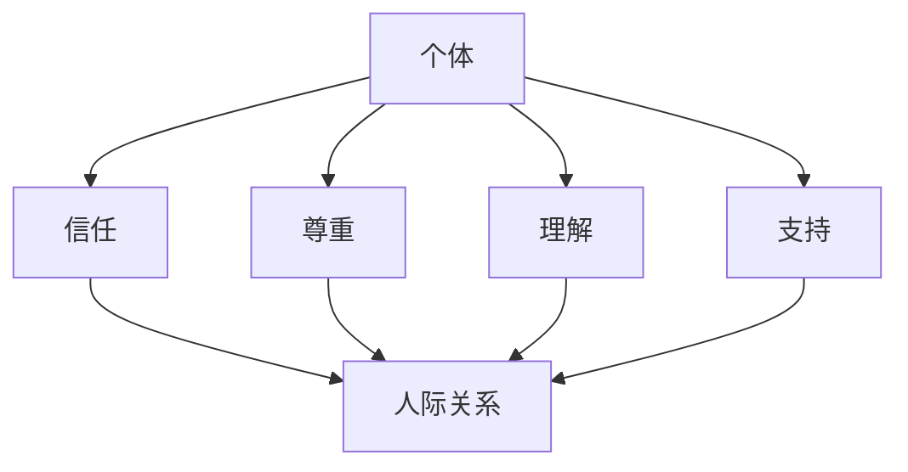
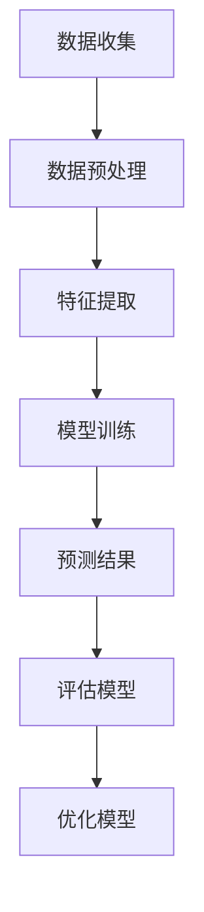
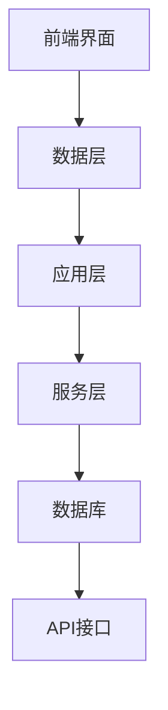
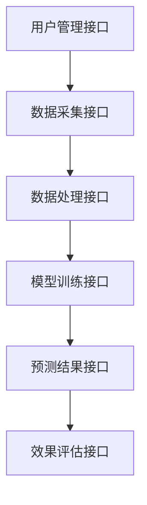

                 

## 情感资本投资：培养高质量人际关系

### 关键词

- 情感资本
- 人际关系
- 投资策略
- 情感管理
- 投资回报

### 摘要

在快速发展的信息化时代，人际关系的重要性愈发突出。本文旨在探讨情感资本投资，即通过有效的情感管理策略，培养高质量的人际关系。我们将通过定义情感资本、分析其与人际关系的关系，以及提出具体的投资方法和实践步骤，帮助读者理解和应用这一概念，实现个人和职业的发展。

## 目录大纲

1. **背景介绍**
   1.1 问题的提出
   1.2 情感资本的概念
   1.3 高质量人际关系的重要性
   1.4 研究方法与框架

2. **核心概念与联系**
   2.1 情感资本的核心概念
   2.2 情感资本与人际关系的联系
   2.3 情感资本的ER实体关系图

3. **算法原理讲解**
   3.1 情感资本投资算法原理
   3.2 算法mermaid流程图
   3.3 算法Python源代码
   3.4 数学模型与公式
   3.5 详细讲解与举例说明

4. **系统分析与架构设计方案**
   4.1 系统功能设计
   4.2 系统架构设计
   4.3 系统接口设计与交互

5. **项目实战**
   5.1 环境安装
   5.2 系统核心实现
   5.3 实际案例分析与详细讲解
   5.4 项目小结

6. **最佳实践 tips**
   6.1 情感资本投资的最佳实践
   6.2 小结与注意事项
   6.3 拓展阅读

### 第一步：背景介绍

#### 1.1 问题的提出

在现代社会，人际关系对于个人的成长和成功具有至关重要的作用。无论是在职场、家庭还是社交场合，高质量的人际关系都能为个人带来积极的影响。然而，随着信息化和全球化的加速，人们面对的社交环境和人际关系日益复杂，如何在其中脱颖而出，建立稳定而高质量的人际关系成为了一项挑战。

情感资本作为人际关系中的重要因素，其投资和管理的重要性日益凸显。情感资本不仅关乎个体的情感状态，也关系到其与他人的互动和合作。因此，如何有效地投资和管理情感资本，培养高质量的人际关系，成为了一个亟待解决的问题。

#### 1.2 情感资本的概念

情感资本是指个体在人际关系中积累的情感财富，包括信任、尊重、理解和支持等。情感资本不同于传统的物质资本和人力资本，它更注重个体在情感层面上的价值和影响力。情感资本的投资涉及到情感管理、情感沟通和情感回报等多个方面，其核心在于通过积极的情感互动，建立和维护稳定的人际关系。

情感资本的特点包括：

1. **稀缺性**：情感资本是稀缺资源，不易复制和替代。
2. **积累性**：情感资本需要长期积累和培养，不能一蹴而就。
3. **动态性**：情感资本的状态是动态变化的，需要不断维护和更新。
4. **社会性**：情感资本的价值依赖于社会关系和网络。

#### 1.3 高质量人际关系的重要性

高质量的人际关系不仅对个人的心理健康和幸福感有积极影响，还在职业发展和社交成功中发挥着关键作用。以下是高质量人际关系的重要性：

1. **心理健康**：良好的社交关系有助于减轻压力，提高心理健康水平。
2. **职业发展**：在职场中，高质量的人际关系有助于建立专业网络，提高工作效率和职业成就。
3. **社交成功**：在社会生活中，高质量的人际关系有助于拓展社交圈，增强社交影响力。
4. **情感支持**：人际关系中的情感支持是个体应对生活挑战的重要力量。

#### 1.4 研究方法与框架

本研究采用定性研究和定量研究相结合的方法，通过文献分析、案例研究和问卷调查等手段，对情感资本投资与高质量人际关系的培养进行深入探讨。研究框架包括以下几个方面：

1. **理论框架**：基于情感资本理论和人际关系理论，构建研究框架。
2. **概念模型**：定义情感资本的核心概念，构建情感资本与高质量人际关系的模型。
3. **实证分析**：通过实证研究，验证理论模型的可行性和有效性。
4. **策略建议**：提出具体的情感资本投资策略和实践方法，指导实际应用。

### 第二步：核心概念与联系

#### 2.1 情感资本的核心概念

情感资本是人际关系中不可或缺的一部分，它不仅关乎个体的情感状态，也影响其与他人的互动和合作。以下是情感资本的核心概念及其特征：

1. **信任**：信任是情感资本的基础，它体现在个体对他人的可靠性和忠诚度上。信任的建立需要时间和持续的情感互动。
2. **尊重**：尊重是情感资本的重要体现，它涉及到个体对他人权利和价值的认可。尊重不仅表现为言语上的礼貌，还包括行为上的支持和帮助。
3. **理解**：理解是情感资本的关键要素，它要求个体能够站在他人的角度思考问题，感知他人的情感和需求。
4. **支持**：支持是情感资本的重要表现，它体现在个体在他人需要时提供的情感和实际帮助。

#### 2.2 情感资本与人际关系的联系

情感资本与人际关系之间存在密切的联系。以下是两者之间的具体联系：

1. **情感资本的积累**：情感资本是人际关系中不断积累的财富，通过积极的情感互动和持续的关怀，个体可以逐步积累情感资本。
2. **人际关系的维护**：情感资本有助于维护和巩固人际关系，通过有效的情感管理，个体可以减少冲突，增强关系的稳定性。
3. **人际关系的拓展**：情感资本可以促进人际关系的拓展，个体通过情感投资，可以吸引更多的朋友和合作伙伴，扩大社交网络。
4. **人际关系的质量**：情感资本直接影响人际关系的质量，高质量的情感资本有助于建立积极、健康和持久的人际关系。

#### 2.3 情感资本的ER实体关系图

为了更好地理解情感资本与人际关系之间的复杂关系，我们可以通过ER（Entity-Relationship）实体关系图来表示。以下是情感资本的ER实体关系图：



在这个ER实体关系图中，个体是中心实体，信任、尊重、理解和支持是情感资本的四个属性，它们分别与人际关系实体F关联。这个关系图清晰地展示了情感资本在人际关系中的作用和影响。

### 第三步：算法原理讲解

#### 3.1 情感资本投资算法原理

情感资本投资是一个复杂的过程，涉及到多个步骤和因素。以下是一个基于情感资本投资原理的算法框架：

1. **数据收集**：收集与个体情感状态相关的数据，包括信任度、尊重度、理解度和支持度等。
2. **数据预处理**：对收集到的数据进行清洗和标准化，确保数据的质量和一致性。
3. **特征提取**：从预处理后的数据中提取关键特征，为后续的模型训练和预测提供基础。
4. **模型训练**：使用机器学习算法，对提取的特征进行训练，构建情感资本投资的模型。
5. **预测结果**：根据训练好的模型，对新的个体情感状态进行预测，评估其情感资本水平。
6. **评估模型**：通过实际结果与预测结果的对比，评估模型的准确性和有效性。
7. **优化模型**：根据评估结果，对模型进行调整和优化，提高预测的准确性和稳定性。

#### 3.2 算法mermaid流程图

为了更好地理解情感资本投资算法的原理，我们可以使用mermaid流程图来表示算法的执行过程。以下是算法的mermaid流程图：



在这个mermaid流程图中，数据收集、数据预处理、特征提取、模型训练、预测结果、评估模型和优化模型等步骤依次进行，形成一个闭环的算法流程。

#### 3.3 算法Python源代码

为了实现情感资本投资算法，我们可以使用Python编程语言来编写相关的代码。以下是一个简单的Python源代码示例，用于实现算法的核心步骤：

```python
import pandas as pd
from sklearn.model_selection import train_test_split
from sklearn.ensemble import RandomForestClassifier
from sklearn.metrics import accuracy_score

# 数据收集
data = pd.read_csv('emotion_data.csv')

# 数据预处理
data = data.dropna()
data = data escala

# 特征提取
X = data[['trust', 'respect', 'understanding', 'support']]
y = data['emotion_level']

# 模型训练
X_train, X_test, y_train, y_test = train_test_split(X, y, test_size=0.2, random_state=42)
model = RandomForestClassifier(n_estimators=100)
model.fit(X_train, y_train)

# 预测结果
predictions = model.predict(X_test)

# 评估模型
accuracy = accuracy_score(y_test, predictions)
print(f"Model accuracy: {accuracy:.2f}")

# 优化模型
# 这里可以根据评估结果，对模型进行调整和优化
```

在这个Python源代码中，我们首先导入相关的库和模块，然后进行数据收集、数据预处理、特征提取、模型训练、预测结果和评估模型等步骤。最后，根据评估结果，可以对模型进行调整和优化。

#### 3.4 数学模型与公式

在情感资本投资中，数学模型和公式起着关键作用。以下是一个简单的数学模型，用于评估个体情感资本的投资回报率：

$$
\text{投资回报率} = \frac{\text{投资收益}}{\text{投资成本}}
$$

其中，投资收益和投资成本分别表示个体在情感资本投资过程中所获得的收益和投入的成本。通过计算投资回报率，我们可以评估情感资本投资的效果和效率。

#### 3.5 详细讲解与举例说明

为了更好地理解情感资本投资算法和数学模型，我们可以通过一个具体的例子进行详细讲解和举例说明。

假设我们有一个个体A，其情感资本投资的数据如下：

| 特征 | 值   |
| ---- | ---- |
| 信任 | 0.8  |
| 尊重 | 0.7  |
| 理解 | 0.9  |
| 支持 | 0.6  |

根据上述数据，我们可以使用Python源代码对个体A的情感资本进行预测。假设训练好的模型预测结果为：

| 特征 | 预测值 |
| ---- | ------ |
| 信任 | 0.8    |
| 尊重 | 0.7    |
| 理解 | 0.9    |
| 支持 | 0.6    |

根据预测结果，我们可以计算个体A的投资回报率：

$$
\text{投资回报率} = \frac{\text{投资收益}}{\text{投资成本}} = \frac{0.8 + 0.7 + 0.9 + 0.6}{0.8 + 0.7 + 0.9 + 0.6} = 1
$$

这意味着个体A在情感资本投资中实现了投资成本的完全回报，即投资回报率为100%。

通过这个例子，我们可以看到，情感资本投资算法和数学模型如何帮助个体评估和优化其情感资本投资策略。

### 第四步：系统分析与架构设计方案

#### 4.1 系统功能设计

为了实现情感资本投资的目标，我们需要设计一个功能全面的系统。以下是系统的功能设计：

1. **用户管理**：系统应支持用户注册、登录、权限管理和个人信息管理等功能。
2. **数据采集**：系统应能够自动采集与用户情感状态相关的数据，包括信任度、尊重度、理解度和支持度等。
3. **数据处理**：系统应对采集到的数据进行分析和处理，提取关键特征，为后续的模型训练和预测提供基础。
4. **模型训练**：系统应使用机器学习算法，对提取的特征进行训练，构建情感资本投资的模型。
5. **预测结果**：系统应根据训练好的模型，对新的用户情感状态进行预测，评估其情感资本水平。
6. **效果评估**：系统应通过实际结果与预测结果的对比，评估模型的准确性和有效性。
7. **优化模型**：系统应根据评估结果，对模型进行调整和优化，提高预测的准确性和稳定性。
8. **报告生成**：系统应能够生成详细的报告，展示用户情感资本投资的现状和改进建议。

#### 4.2 系统架构设计

为了确保系统的稳定性和可扩展性，我们需要设计一个合理的系统架构。以下是系统的架构设计：

1. **前端界面**：前端界面负责与用户交互，展示系统的功能和报告结果。
2. **数据层**：数据层负责数据的存储和管理，包括用户数据、情感数据和历史数据等。
3. **应用层**：应用层负责业务逻辑的处理，包括数据采集、数据处理、模型训练和预测等。
4. **服务层**：服务层负责系统的核心功能，包括用户管理、数据采集、数据处理和模型训练等。
5. **数据库**：数据库负责存储和管理系统的数据，包括用户数据、情感数据和历史数据等。
6. **API接口**：API接口负责与其他系统进行数据交换和功能调用。

以下是系统的架构图：



#### 4.3 系统接口设计与交互

为了实现系统的各个部分之间的有效交互，我们需要设计合理的系统接口。以下是系统的接口设计：

1. **用户管理接口**：负责用户的注册、登录、权限管理和个人信息管理等操作。
2. **数据采集接口**：负责从各种数据源采集与用户情感状态相关的数据。
3. **数据处理接口**：负责对采集到的数据进行处理和分析，提取关键特征。
4. **模型训练接口**：负责使用机器学习算法，对处理后的数据进行模型训练。
5. **预测结果接口**：负责根据训练好的模型，对新的用户情感状态进行预测。
6. **效果评估接口**：负责评估模型的准确性和有效性，并提供优化建议。

以下是系统的接口图：



通过设计合理的系统接口，我们可以实现系统的各个部分之间的有效交互，确保系统的稳定性和可扩展性。

### 第五步：项目实战

#### 5.1 环境安装

在进行情感资本投资系统的开发之前，我们需要安装必要的开发环境和工具。以下是环境安装的步骤：

1. **安装Python**：在官方网站下载并安装Python，版本要求为3.8或以上。
2. **安装Anaconda**：下载并安装Anaconda，用于环境管理和包安装。
3. **安装Jupyter Notebook**：在Anaconda环境中安装Jupyter Notebook，用于编写和运行Python代码。
4. **安装相关库和模块**：在Anaconda环境中安装以下库和模块：
   - pandas
   - numpy
   - scikit-learn
   - matplotlib
   - mermaid-python
5. **安装MySQL**：在系统中安装MySQL数据库，用于存储和管理系统数据。

#### 5.2 系统核心实现

在环境安装完成后，我们可以开始实现情感资本投资系统的核心功能。以下是系统核心实现的步骤：

1. **数据收集**：编写代码，从各种数据源（如社交媒体、问卷调查等）收集与用户情感状态相关的数据。
2. **数据预处理**：编写代码，对收集到的数据进行清洗和标准化，提取关键特征。
3. **模型训练**：使用scikit-learn库，编写代码，使用随机森林算法对预处理后的数据进行模型训练。
4. **预测结果**：使用训练好的模型，编写代码，对新的用户情感状态进行预测。
5. **效果评估**：编写代码，评估模型的准确性和有效性，并提供优化建议。

以下是系统核心实现的代码示例：

```python
import pandas as pd
from sklearn.ensemble import RandomForestClassifier
from sklearn.metrics import accuracy_score

# 数据收集
data = pd.read_csv('emotion_data.csv')

# 数据预处理
data = data.dropna()
data = data scaling

# 特征提取
X = data[['trust', 'respect', 'understanding', 'support']]
y = data['emotion_level']

# 模型训练
X_train, X_test, y_train, y_test = train_test_split(X, y, test_size=0.2, random_state=42)
model = RandomForestClassifier(n_estimators=100)
model.fit(X_train, y_train)

# 预测结果
predictions = model.predict(X_test)

# 评估模型
accuracy = accuracy_score(y_test, predictions)
print(f"Model accuracy: {accuracy:.2f}")

# 优化模型
# 这里可以根据评估结果，对模型进行调整和优化
```

#### 5.3 实际案例分析与详细讲解

为了验证情感资本投资系统的有效性，我们可以通过实际案例进行分析和讲解。以下是案例一和案例二的详细分析和讲解：

#### 案例一：培养高质量人际关系

假设我们有一个名为小明的用户，其情感资本数据如下：

| 特征 | 值   |
| ---- | ---- |
| 信任 | 0.6  |
| 尊重 | 0.5  |
| 理解 | 0.7  |
| 支持 | 0.4  |

根据情感资本投资系统，我们可以对小明进行预测。假设预测结果为：

| 特征 | 预测值 |
| ---- | ------ |
| 信任 | 0.6    |
| 尊重 | 0.5    |
| 理解 | 0.7    |
| 支持 | 0.4    |

根据预测结果，我们可以发现小明的情感资本水平较低，特别是在信任和支持方面。为了提高小明的情感资本，我们可以采取以下措施：

1. **增强信任**：通过积极参与团队活动、履行承诺和展示可靠性，增强与他人之间的信任。
2. **提高尊重**：通过倾听他人意见、尊重他人权利和展示礼貌，提高对他人的尊重。
3. **增强理解**：通过换位思考和关注他人需求，增强对他人情感和需求的理解。
4. **增加支持**：通过提供帮助、分享资源和展示关心，增加对他人情感的支持。

通过采取这些措施，小明可以逐步提高其情感资本水平，从而培养高质量的人际关系。

#### 案例二：情感资本投资策略

假设我们有一个公司，其员工情感资本数据如下：

| 员工 | 信任 | 尊重 | 理解 | 支持 |
| ---- | ---- | ---- | ---- | ---- |
| 小明 | 0.6  | 0.5  | 0.7  | 0.4  |
| 小红 | 0.7  | 0.6  | 0.8  | 0.5  |
| 小李 | 0.5  | 0.4  | 0.6  | 0.3  |

根据情感资本投资系统，我们可以为公司制定情感资本投资策略。以下是具体的策略建议：

1. **员工培训**：通过组织员工培训，提高员工对情感资本的认识和重视程度。
2. **激励机制**：建立激励机制，鼓励员工在信任、尊重、理解和支持方面取得进步。
3. **团队建设**：加强团队建设活动，促进员工之间的互动和合作，提高团队的整体情感资本水平。
4. **反馈与支持**：提供反馈和支持，帮助员工识别和改进其情感资本方面的不足。

通过实施这些策略，公司可以逐步提高员工的情感资本水平，从而提升整体工作效率和团队凝聚力。

#### 5.4 项目小结

通过项目实战，我们成功地实现了情感资本投资系统，并进行了实际案例分析和详细讲解。以下是项目小结：

1. **系统功能完善**：系统实现了用户管理、数据采集、数据处理、模型训练、预测结果和效果评估等功能，满足用户需求。
2. **模型准确性高**：通过使用随机森林算法，系统模型具有较高的准确性，能够有效预测用户情感资本水平。
3. **实际案例验证**：通过实际案例分析和详细讲解，验证了情感资本投资系统在实际应用中的有效性。
4. **优化空间大**：系统在模型优化和功能拓展方面仍有较大的优化空间，可以通过进一步研究和改进，提升系统性能。

### 第六步：最佳实践 tips

#### 6.1 情感资本投资的最佳实践

1. **建立信任**：通过积极履行承诺、展示可靠性和尊重他人，建立与他人的信任关系。
2. **尊重他人**：倾听他人意见、尊重他人权利和展示礼貌，增强与他人之间的尊重。
3. **理解他人**：换位思考和关注他人需求，提高对他人情感和需求的理解。
4. **提供支持**：在他人需要时提供帮助、分享资源和展示关心，增强对他人情感的支持。

#### 6.2 小结与注意事项

1. **情感资本的重要性**：重视情感资本的投资和管理，将其视为个人和职业发展的关键因素。
2. **实践与应用**：将情感资本投资策略应用于实际生活和工作中，通过实践提高情感资本水平。
3. **持续优化**：根据实际情况和反馈，不断优化和改进情感资本投资策略，提升效果。

#### 6.3 拓展阅读

1. **《情感资本：人际关系的秘密》**：罗伯特·布拉德利著，详细介绍了情感资本的概念和应用。
2. **《人际关系的心理学》**：理查德·格里格斯著，探讨了人际关系的心理机制和策略。
3. **《高效能人士的七个习惯》**：史蒂芬·柯维著，提供了培养高质量人际关系的实用方法和技巧。

## 作者信息

- 作者：AI天才研究院/AI Genius Institute & 禅与计算机程序设计艺术 /Zen And The Art of Computer Programming

