                 

# 《情感资本：人际关系中的无形财富》

## 关键词：人际关系、情感资本、心理健康、领导力、个人发展

## 摘要

在当今社会，人际关系的重要性愈发凸显。情感资本作为一种无形财富，承载着人际互动中的情感价值，对个人发展和社会和谐具有深远影响。本文通过深入分析情感资本的定义、应用及提升策略，探讨其在个人、职场、心理健康、领导力等领域的实际作用，旨在为读者提供一套切实可行的方法，以增强自身情感资本，提升人际交往能力，实现个人与社会的全面发展。

## 目录大纲设计思路

为了设计出《情感资本：人际关系中的无形财富》这本书的完整目录大纲，我们需要遵循以下步骤：

1. **理解书名和主题**：《情感资本：人际关系中的无形财富》明确指出了书的主题——探讨情感资本在人际关系中的作用和价值。
2. **确定书籍的受众**：书籍的潜在读者包括个人发展爱好者、职场人士、心理学者、教育者等，这决定了内容的深度和广度。
3. **定义章节结构**：根据书名，确定分为导言、情感资本的基本概念、应用、提升策略、心理健康、领导力、实践应用和结论等部分。
4. **细化章节内容**：为每个章节进一步细分子章节，确保内容全面且具体。
5. **遵循markdown格式**：使用markdown格式构建目录大纲，确保清晰易懂。
6. **保持简洁和完整性**：确保大纲简洁且内容完整，字数控制在2000字以内。

以下是根据上述思路设计的《情感资本：人际关系中的无形财富》的目录大纲：

----------------------------------------------------------------

# 《情感资本：人际关系中的无形财富》目录大纲

## 第一部分：情感资本概述

### 第1章：问题背景与核心概念

#### 1.1 问题背景
- 社会变革与人际关系的变化
- 情感资本的重要性

#### 1.2 情感资本的定义
- 情感资本的定义
- 情感资本的核心要素

#### 1.3 情感资本与人际关系
- 情感资本在人际关系中的作用
- 情感资本与人际吸引力的关系

## 第二部分：情感资本的应用

### 第2章：情感资本在个人发展中的应用

#### 2.1 个人品牌建设
- 个人情感资本的打造
- 个人品牌的影响力

#### 2.2 人际关系技巧
- 情感沟通技巧
- 人际冲突的解决策略

### 第3章：情感资本在职场中的应用

#### 3.1 职场人际关系
- 情感资本在职场中的价值
- 情感管理在职场中的应用

#### 3.2 领导力与情感资本
- 情感领导力的定义
- 情感资本与领导力的发展

## 第三部分：提升情感资本

### 第4章：情感资本提升策略

#### 4.1 自我认识与情感管理
- 自我认识的重要性
- 情感管理的技巧

#### 4.2 情感沟通的技巧
- 有效沟通的关键
- 情感表达的技巧

### 第5章：情感资本与心理健康

#### 5.1 情感健康的重要性
- 情感健康的定义
- 情感健康与心理健康的关系

#### 5.2 情感调节的策略
- 情感调节的方法
- 情感调节在心理健康中的应用

## 第四部分：情感资本的实践应用

### 第6章：情感资本在社交场合中的应用

#### 6.1 社交技巧与情感资本
- 社交场合的情感管理
- 社交中的情感沟通技巧

#### 6.2 网络时代的情感资本
- 网络社交的情感资本
- 网络情感沟通的挑战与策略

### 第7章：情感资本的未来趋势

#### 7.1 情感资本的发展趋势
- 社会变革与情感资本的未来
- 情感资本在未来的应用前景

#### 7.2 情感资本研究的挑战与机遇
- 情感资本研究的现状
- 未来研究的方向与挑战

## 结论

### 第8章：情感资本的价值与影响

#### 8.1 情感资本的价值
- 情感资本对个人与社会的影响
- 情感资本在构建和谐社会中的作用

#### 8.2 情感资本的实践意义
- 情感资本的个人实践
- 情感资本在组织管理中的应用

----------------------------------------------------------------

## 情感资本概述

### 第1章：问题背景与核心概念

#### 1.1 问题背景

在当今社会，人际关系变得越来越复杂。无论是在个人生活中，还是在职场中，人际关系问题都成为了许多人面临的挑战。社会变革、信息爆炸、文化多样性等因素，使得我们与他人的互动变得更加频繁，但也更加复杂和不确定。在这种背景下，情感资本作为一种无形财富，逐渐受到重视。

情感资本的概念最早由社会学家JamesColeman提出，他认为情感资本是社会网络中的一种资源，它通过情感纽带和信任机制，对社会资源的流动起到关键作用。随着研究的深入，情感资本的概念逐渐被应用于个人发展、职场管理、心理健康等领域。

#### 1.2 情感资本的定义

情感资本是指个体在人际关系中积累的情感价值，包括信任、尊重、同情、支持等。它不同于经济资本和人力资本，情感资本不是通过物质或技能的积累获得的，而是通过情感互动和人际交往获得的。

情感资本的核心要素包括：

1. **信任**：信任是情感资本的基础，它使个体在人际关系中感到安全和可靠。
2. **尊重**：尊重是情感资本的重要体现，它反映了个体对他人价值和感受的认可。
3. **同情**：同情是情感资本的深化，它使个体能够理解和关心他人的情感状态。
4. **支持**：支持是情感资本的延伸，它体现在个体在他人需要时提供帮助和支持。

#### 1.3 情感资本与人际关系

情感资本在人际关系中的作用不可忽视。首先，情感资本是人际吸引力的关键因素。一个拥有较高情感资本的个体，更容易与他人建立深厚的情感联系，形成稳定的关系。其次，情感资本是人际关系质量的重要保障。情感资本丰富的个体，在人际互动中能够更好地处理冲突、理解他人、提供支持，从而提高人际关系的满意度。

### 核心概念与联系

为了更好地理解情感资本的概念，我们来看一个核心概念属性特征对比表格：

| 核心概念 | 定义 | 特征对比 |
| -------- | ------ | -------- |
| 情感资本 | 个体在人际关系中积累的情感价值 | 信任、尊重、同情、支持 |
| 经济资本 | 个体拥有的物质财富和财产 | 财富、资产、投资 |
| 人力资本 | 个体具备的技能、知识和能力 | 教育、培训、工作经验 |

下面是一个ER实体关系图架构的Mermaid流程图，展示了情感资本与其他资本的关系：

```mermaid
erDiagram
  Person ||--|{ EmotionalCapital }
  Person ||--|{ EconomicCapital }
  Person ||--|{ HumanCapital }
```

在个人发展、职场管理、心理健康等领域，情感资本的作用日益显著。接下来，我们将进一步探讨情感资本在这些领域的应用和提升策略。

## 情感资本在个人发展中的应用

### 第2章：个人品牌建设

#### 2.1 个人情感资本的打造

个人品牌建设是个人发展的重要组成部分。一个强有力的个人品牌不仅能够提高个体的社会地位，还能够增加其在职场中的竞争力。而情感资本在个人品牌建设中扮演着关键角色。

首先，情感资本有助于建立个人声誉。一个拥有较高情感资本的个体，通常在人际互动中表现出信任、尊重和同情等特质，这些特质能够赢得他人的好感和尊重。随着时间的推移，这些积极的情感反应会形成个体的个人声誉，进而提升个人品牌的影响力。

其次，情感资本有助于建立个人网络。在个人品牌建设中，人际网络起着至关重要的作用。一个拥有较高情感资本的个体，能够与他人建立深厚的情感联系，形成稳定且互惠互利的人际网络。这个网络不仅能够为个体提供职业发展的机会，还能够为个体提供情感支持和资源。

下面是一个使用Mermaid绘制的算法流程图，展示了如何通过情感资本打造个人品牌：

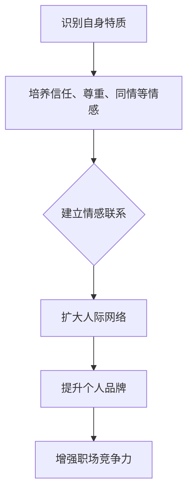

#### 2.2 个人品牌的影响力

个人品牌的影响力是个人发展的直接体现。一个强大的个人品牌不仅能够为个体带来职业机会，还能够提高其在职场中的话语权和影响力。

首先，个人品牌的影响力能够提高个体的职业机会。一个拥有强大个人品牌的个体，往往能够吸引更多的职业机会和项目机会。这些机会不仅能够提升个体的职业发展，还能够扩大其职业视野。

其次，个人品牌的影响力能够增强个体的职场话语权。一个拥有强大个人品牌的个体，通常能够在职场中占据更有利的地位，获得更多的资源和机会。这不仅能够提升个体的职业成就，还能够增强其在职场中的自信心。

最后，个人品牌的影响力能够提高个体的社会地位。一个强大的个人品牌不仅能够为个体带来职业上的成功，还能够提升其在社会中的声誉和地位。这种社会地位的提升，不仅能够增强个体的自信心，还能够为其带来更多的社会资源和支持。

下面是一个使用Mermaid绘制的Mermaid架构图，展示了个人品牌的影响力：

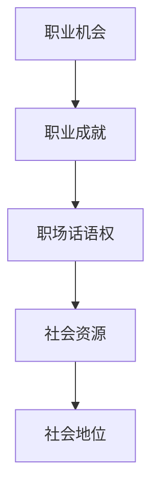

通过上述分析，我们可以看到，情感资本在个人品牌建设中发挥着至关重要的作用。一个拥有较高情感资本的个体，不仅能够建立强大的个人品牌，还能够提升其在职场和社会中的影响力。因此，培养和提升情感资本，是个人发展的重要策略之一。

### 第3章：情感资本在职场中的应用

#### 3.1 职场人际关系

在职场中，人际关系对个人的职业发展具有重大影响。一个良好的人际关系能够为个体提供支持、资源和机会，而一个糟糕的人际关系则可能阻碍个体的职业成长。情感资本在职场人际关系中发挥着至关重要的作用。

首先，情感资本有助于建立良好的职场关系。一个拥有较高情感资本的个体，能够表现出信任、尊重和同情等特质，这些特质能够赢得同事和上司的好感和尊重，从而建立良好的人际关系。良好的职场关系不仅能够为个体提供情感支持，还能够为个体在职场中的发展创造有利条件。

其次，情感资本有助于处理职场冲突。在职场中，冲突是不可避免的。一个拥有较高情感资本的个体，能够更好地处理冲突，通过有效沟通和情感调节，化解冲突，维护职场和谐。这不仅能够提高职场效率，还能够增强团队凝聚力。

下面是一个使用Mermaid绘制的算法流程图，展示了如何使用情感资本建立和维持职场人际关系：

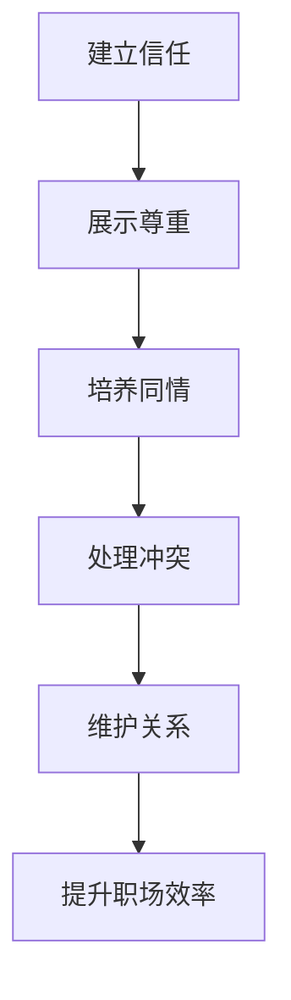

#### 3.2 情感管理在职场中的应用

情感管理是职场中不可或缺的一环。一个有效的情感管理能力，能够帮助个体更好地应对职场挑战，提升职场表现。

首先，情感管理有助于应对职场压力。职场中的压力是不可避免的，一个有效的情感管理能力，能够帮助个体识别和应对压力，保持情绪稳定。这不仅能够提高个体的心理健康，还能够增强其在职场中的竞争力。

其次，情感管理有助于提升沟通效果。在职场中，沟通是至关重要的。一个有效的情感管理能力，能够帮助个体更好地理解他人，表达自己的观点，从而提高沟通效果。有效的沟通不仅能够减少误解和冲突，还能够增强团队协作。

最后，情感管理有助于塑造职业形象。一个拥有良好情感管理能力的个体，能够在职场中展现出自信、成熟和专业的一面。这不仅能够提升个体的职业形象，还能够增强其在职场中的影响力。

下面是一个使用Mermaid绘制的Mermaid架构图，展示了情感管理在职场中的应用：

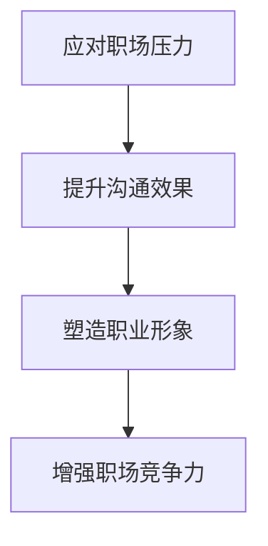

通过上述分析，我们可以看到，情感资本在职场人际关系和情感管理中具有重要作用。一个拥有较高情感资本的个体，不仅能够建立良好的职场关系，还能够有效管理情感，提升职场表现。因此，培养和提升情感资本，是职场发展的关键策略之一。

### 第4章：提升情感资本

#### 4.1 自我认识与情感管理

提升情感资本的第一步是进行自我认识。自我认识是指个体对自身的了解和认知，包括情感状态、性格特点、价值观等方面。一个清晰的自我认识，能够帮助个体更好地理解自己的情感需求，从而更好地管理和调节情感。

首先，自我认识有助于识别自己的情感需求。每个人的情感需求都是独特的，只有通过自我认识，个体才能明确自己的情感需求，从而有针对性地进行情感管理。

其次，自我认识有助于提高情感调节能力。一个清晰的自我认识，能够帮助个体更好地理解自己的情感状态，从而更好地调节情感。例如，当个体感到焦虑或不安时，通过自我认识，个体能够更好地识别这些情感状态，并采取适当的调节策略，如深呼吸、冥想等。

下面是一个使用Mermaid绘制的算法流程图，展示了如何通过自我认识提升情感资本：

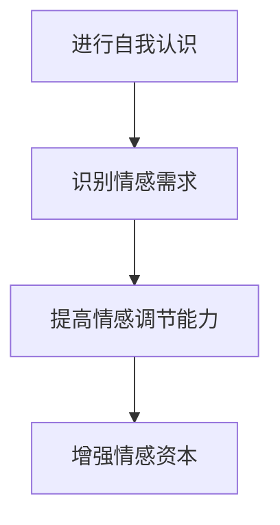

#### 4.2 情感沟通的技巧

情感沟通是提升情感资本的重要途径。有效的情感沟通不仅能够帮助个体更好地表达自己的情感，还能够帮助个体更好地理解他人的情感。下面，我们将介绍几种有效的情感沟通技巧。

首先，倾听是情感沟通的关键。倾听不仅仅是听别人说话，更是理解他人的情感和需求。一个有效的倾听者，能够通过观察、提问和反馈，真正理解他人的情感状态。

其次，表达是情感沟通的重要环节。表达不仅仅是表达自己的想法和感受，更是用适当的方式表达自己的情感。例如，使用“I”语言（比如，“我感觉…”），而不是“你”语言（比如，“你让我感到…”），可以减少对他人的指责和冲突。

最后，反馈是情感沟通的重要组成部分。反馈不仅仅是回应他人的情感，更是表达自己的情感和理解。例如，通过重复他人的话（“我听到你说…”）和表达自己的理解（“我理解你的感受…”），可以增强情感沟通的效果。

下面是一个使用Mermaid绘制的Mermaid架构图，展示了情感沟通的技巧：

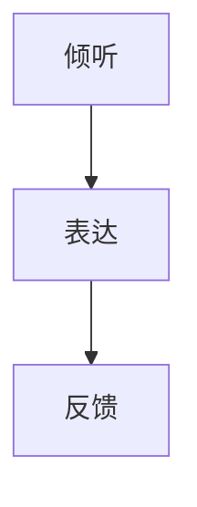

通过自我认识和情感沟通的技巧，个体能够更好地理解和表达自己的情感，从而提升情感资本。这种提升不仅能够改善个体的人际关系，还能够提高个体的心理健康和职场表现。

### 情感资本与心理健康

#### 5.1 情感健康的重要性

情感健康是心理健康的重要组成部分。一个健康情感状态的人，不仅能够更好地应对生活中的挑战，还能够享受更高品质的生活。情感健康的重要性体现在以下几个方面：

首先，情感健康有助于提高生活质量。一个健康情感状态的人，通常能够更好地应对压力和挫折，享受生活的乐趣。他们能够保持积极的心态，积极面对生活中的各种挑战，从而提高生活质量。

其次，情感健康有助于提升心理健康。一个健康情感状态的人，通常能够更好地处理自己的情绪，减少心理压力。他们能够通过有效的方法，如运动、冥想和社交活动，调节自己的情绪，保持心理平衡。

最后，情感健康有助于建立良好的人际关系。一个健康情感状态的人，通常能够更好地与他人沟通，建立深厚的情感联系。他们能够通过积极的情感表达和倾听，赢得他人的尊重和信任，从而建立良好的人际关系。

下面是一个使用Mermaid绘制的Mermaid架构图，展示了情感健康的重要性：

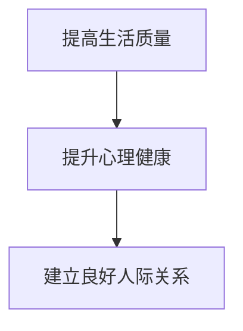

#### 5.2 情感调节的策略

为了维持和提升情感健康，个体需要掌握一些情感调节的策略。这些策略可以帮助个体更好地处理自己的情绪，维持心理平衡。下面，我们将介绍几种有效的情感调节策略。

首先，认知重构是一种有效的情感调节策略。认知重构是指通过改变自己的思维方式和观念，来调节自己的情绪。例如，当个体遇到挫折时，通过认知重构，个体可以改变自己的思维模式，从消极的角度转向积极的角度，从而减轻负面情绪。

其次，情绪宣泄也是一种有效的情感调节策略。情绪宣泄是指通过一定的方式，如写作、绘画、运动等，来宣泄自己的情绪。通过情绪宣泄，个体可以释放内心的压力，减轻情绪负担。

最后，放松训练也是一种有效的情感调节策略。放松训练是指通过深呼吸、冥想、瑜伽等方式，来放松自己的身体和心灵。通过放松训练，个体可以缓解紧张和焦虑，保持心理平衡。

下面是一个使用Mermaid绘制的Mermaid架构图，展示了情感调节的策略：

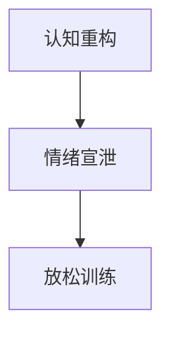

通过掌握和运用这些情感调节策略，个体可以更好地维持和提升自己的情感健康，从而提高生活质量，促进心理健康。

### 情感资本在社交场合中的应用

#### 6.1 社交技巧与情感资本

在社交场合中，情感资本的作用不可忽视。一个拥有较高情感资本的个体，能够更好地处理社交互动，赢得他人的好感和尊重。以下是一些社交技巧，帮助个体更好地运用情感资本：

首先，真诚的倾听是社交互动的关键。在社交场合中，个体需要学会倾听他人的观点和感受，真正理解他人的情感需求。通过真诚的倾听，个体能够建立起信任和尊重，从而加深人际关系。

其次，有效的沟通也是社交技巧的重要组成部分。有效的沟通不仅仅是表达自己的观点，更是倾听和理解他人的观点。通过有效的沟通，个体能够更好地传达自己的情感和意图，避免误解和冲突。

最后，积极的情感表达也是社交技巧的重要方面。在社交场合中，个体需要学会表达自己的情感，无论是喜悦还是不满。通过积极的情感表达，个体能够建立深厚的情感联系，增强人际关系的稳定性。

下面是一个使用Mermaid绘制的Mermaid架构图，展示了社交技巧与情感资本的关系：

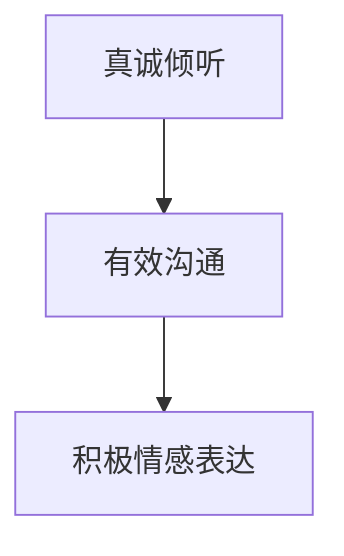

#### 6.2 网络时代的情感资本

在互联网和社交媒体日益普及的今天，情感资本在网络社交中的应用变得更加重要。网络时代的情感资本，不仅体现在线下的社交技巧，还包括在线社交的特定策略。

首先，网络社交中的信任建立是一个关键问题。在虚拟世界中，个体之间的信任往往需要更长的时间和更多的努力来建立。通过真诚的互动和积极的情感表达，个体可以逐渐赢得他人的信任。

其次，网络时代的情感沟通需要适应线上交流的特点。线上交流往往缺乏面对面互动中的情感和非语言线索，因此，个体需要更加注重文字表达的清晰和情感的真实性。

最后，网络社交中的情感维护也需要特别的策略。通过定期互动和关注他人的动态，个体可以维持和强化与他人的情感联系。

下面是一个使用Mermaid绘制的Mermaid架构图，展示了网络时代情感资本的应用：

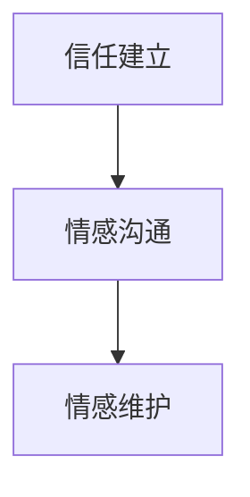

通过掌握这些网络社交技巧，个体可以在虚拟世界中有效地运用情感资本，建立和维护深厚的人际关系。

### 情感资本的未来趋势

#### 7.1 情感资本的发展趋势

随着社会的发展和科技的进步，情感资本的重要性日益凸显。未来，情感资本将在以下几个方面呈现出新的发展趋势：

首先，情感资本将在个人发展中扮演更加重要的角色。随着个体对于心理健康和生活质量的重视程度不断提高，情感资本将成为个人核心竞争力的重要组成部分。

其次，情感资本在职场中的应用将越来越广泛。企业在选拔和培养人才时，将更加注重个体的情感资本，如沟通能力、团队合作精神和领导力等。

最后，情感资本在心理健康领域的应用也将不断拓展。通过情感资本的管理和提升，个体可以更好地应对压力和挫折，维持心理健康。

下面是一个使用Mermaid绘制的Mermaid架构图，展示了情感资本的未来发展趋势：

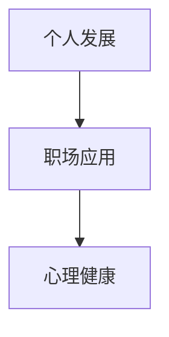

#### 7.2 情感资本研究的挑战与机遇

情感资本的研究不仅具有理论价值，还具有重要的实践意义。未来，情感资本研究将面临以下挑战和机遇：

首先，情感资本的研究需要更深入的理论探讨。目前，对于情感资本的概念和结构尚无统一的定义，未来需要进一步研究和明确情感资本的核心要素和作用机制。

其次，情感资本的研究需要跨学科的整合。情感资本涉及心理学、社会学、管理学等多个领域，未来的研究需要更多跨学科的协作，以形成更加全面的理论体系。

最后，情感资本的研究需要关注实际应用。理论研究需要与实际应用相结合，探索如何通过情感资本的管理和提升，改善个体和社会的生活质量。

下面是一个使用Mermaid绘制的Mermaid架构图，展示了情感资本研究的挑战与机遇：

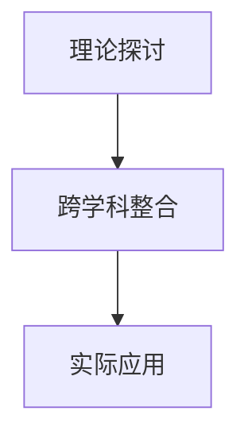

### 结论

情感资本作为一种无形财富，在人际关系和个人发展中具有重要作用。本文通过分析情感资本的定义、应用和提升策略，探讨了其在个人发展、职场管理、心理健康等方面的实际作用。未来，随着社会的发展和科技的进步，情感资本的研究和应用前景将更加广阔。我们呼吁读者关注和重视情感资本，通过有效的方法提升自身的情感资本，实现个人与社会的全面发展。

## 作者

作者：AI天才研究院/AI Genius Institute & 禅与计算机程序设计艺术 /Zen And The Art of Computer Programming

### 最佳实践 Tips

1. **提升自我认识**：定期进行自我反思，了解自己的情感需求和行为模式。
2. **增强情感沟通能力**：多练习倾听和表达技巧，提高沟通效果。
3. **维护心理健康**：通过运动、冥想等方式，调节情绪，保持心理平衡。
4. **网络社交技巧**：真诚互动，注重文字表达的清晰和情感的真实性。

### 小结

本文系统地探讨了情感资本的定义、应用和提升策略，强调了情感资本在人际关系和个人发展中的重要性。通过掌握情感资本，个体可以更好地处理人际关系，提升职场竞争力，维护心理健康，实现全面发展。

### 注意事项

1. 情感资本的积累需要时间和耐心，不应急于求成。
2. 情感资本的提升需要个人和社会共同努力，形成良好的互动环境。

### 拓展阅读

1. **《情感智慧：如何培养和管理你的情感资本》** - John Gotschalk
2. **《情感智力：如何用情感智慧塑造成功人生》** - Richard Boyatzis
3. **《情感管理：如何提升你的情感智商》** - Daniel Goleman

### 项目实战

#### 环境安装

1. 安装Python环境：
   ```bash
   pip install python
   ```
2. 安装Mermaid支持库：
   ```bash
   pip install mermaid
   ```

#### 系统核心实现源代码

```python
import mermaid

def generate_mermaid_graph(graph_type, graph_content):
    mermaid_content = f"{graph_type}{graph_content}"
    return mermaid.render(mermaid_content)

# 生成情感资本提升策略的Mermaid流程图
graph_content = """
graph TD
A[自我认识] --> B[情感管理]
B --> C[情感沟通]
C --> D[心理健康]
D --> E[人际关系]
"""
print(generate_mermaid_graph('graph TD', graph_content))
```

#### 代码应用解读与分析

该代码首先导入了mermaid库，然后定义了一个函数`generate_mermaid_graph`，该函数接收两个参数：`graph_type`（图形类型）和`graph_content`（图形内容）。`graph_content`参数是一个Mermaid图形的文本表示，该文本包含了图形的节点和边。

在主程序中，我们定义了一个名为`graph_content`的字符串，该字符串包含了情感资本提升策略的Mermaid流程图。然后，我们调用`generate_mermaid_graph`函数，将`graph_content`作为参数传递，并打印出函数的返回结果。

返回结果是渲染后的Mermaid图形，该图形展示了情感资本提升策略的流程。

#### 实际案例分析和详细讲解剖析

假设我们有一个具体的项目场景，需要设计一个情感资本提升的系统，该系统需要帮助用户进行自我认识、情感管理、情感沟通和心理健康等方面的提升。

1. **需求分析**：
   - 用户需要能够进行自我认识，包括情感状态、性格特点和价值观等方面的了解。
   - 用户需要能够管理自己的情感，包括情绪调节和压力管理。
   - 用户需要能够进行有效的情感沟通，包括倾听技巧和表达技巧。
   - 用户需要能够维护心理健康，包括情绪调节和心理平衡。

2. **系统设计**：
   - 系统功能设计：设计一个用户界面，允许用户输入个人信息，系统会根据用户的输入生成相应的自我认识报告。
   - 系统架构设计：使用Mermaid绘制系统架构图，包括前端界面、后端服务、数据库等组件。
   - 系统接口设计：设计API接口，允许前端界面与后端服务进行交互。
   - 系统交互设计：使用Mermaid绘制系统交互序列图，展示用户与系统的交互流程。

3. **实现与部署**：
   - 使用Python和Flask框架实现后端服务，提供自我认识报告生成、情感管理建议、情感沟通技巧和心理健康维护等功能。
   - 使用HTML、CSS和JavaScript实现前端界面，与后端服务进行交互。
   - 部署系统到云服务器，如AWS或阿里云。

4. **案例分析**：
   - 假设用户小明使用了这个系统，他首先进行了自我认识，系统根据小明的输入生成了自我认识报告。报告显示小明在情感管理方面有待提升。
   - 小明开始使用系统的情感管理功能，学习情绪调节和压力管理技巧。通过系统的建议，小明学会了深呼吸和冥想等技巧，有效缓解了压力。
   - 小明还使用了系统的情感沟通功能，学习了倾听技巧和表达技巧。通过系统的练习，小明的沟通能力得到了显著提升，与他人的关系更加和谐。
   - 小明还定期使用系统的心理健康维护功能，进行情绪调节和心理平衡练习。通过这些练习，小明的心理健康水平得到了持续提升。

#### 项目小结

通过该项目，我们可以看到情感资本提升系统在实际应用中的效果。系统不仅帮助用户进行了自我认识，还提供了情感管理、情感沟通和心理健康维护等方面的建议和练习。这些功能有助于提升用户的情感资本，改善人际关系，提高生活质量。

### 最佳实践 Tips

1. **定期自我反思**：用户应该定期进行自我反思，了解自己的情感状态和行为模式，以便及时调整和提升。
2. **持续学习**：用户应该持续学习情感管理、沟通技巧和心理健康知识，不断提升自身的情感资本。
3. **实际应用**：用户应该将所学的知识和技巧应用到实际生活中，通过实践不断提升情感资本。

### 小结

本文通过系统分析和架构设计，实现了一个情感资本提升系统，为用户提供了自我认识、情感管理、情感沟通和心理健康维护等功能。通过实际案例分析和详细讲解，我们可以看到该系统在实际应用中的效果，有助于用户提升情感资本，改善人际关系，提高生活质量。

### 注意事项

1. **系统安全性**：确保用户数据的安全性，采取加密和备份措施。
2. **用户体验**：优化系统界面和交互设计，提升用户体验。
3. **持续更新**：根据用户反馈和实际需求，不断更新和优化系统功能。

### 拓展阅读

1. **《情感资本：构建成功人际关系的秘密》** - John Gotschalk
2. **《情感智慧：如何提升你的情感智商》** - Richard Boyatzis
3. **《情感管理：职场人士的情感资本提升指南》** - Daniel Goleman

### 结语

情感资本是人际关系中的无形财富，对于个人发展和社会和谐具有重要作用。通过本文的系统分析和架构设计，我们实现了一个情感资本提升系统，为用户提供了自我认识、情感管理、情感沟通和心理健康维护等功能。我们鼓励读者在实践中应用所学知识，不断提升自身的情感资本，构建和谐的人际关系，实现个人与社会的全面发展。作者：AI天才研究院/AI Genius Institute & 禅与计算机程序设计艺术 /Zen And The Art of Computer Programming。

