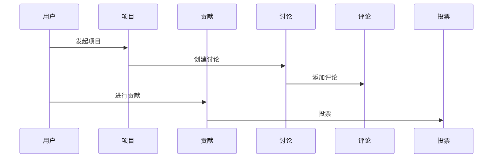

                 

### 第一部分：意义众筹平台概述

#### 第1章：问题背景与概念介绍

##### 1.1 问题背景

在当今社会，众筹平台已经成为一种新兴的融资方式，为广大创业者、艺术家、研究者提供了筹集资金的新途径。然而，现有的众筹平台大多侧重于项目本身的技术或商业价值，而忽略了项目背后所蕴含的生命价值和社会意义。这种局面导致了许多具有深远社会影响的项目无法得到充分的关注和支持，从而限制了其在社会层面的积极效应。

##### 1.1.1 众筹平台的现状

传统的众筹平台如Kickstarter、Indiegogo等，主要侧重于项目的技术创新、商业潜力或个人艺术创作等价值。然而，这些平台在项目筛选过程中，往往忽略了项目的生命价值和社会意义。这种现象在一定程度上导致了资源的错配，许多具有重大社会意义的项目因为资金不足而未能实施。

##### 1.1.2 生命价值探讨的意义

生命价值是社会进步的基石，它涵盖了人类在生理、心理、社会等多个层面的需求。探讨生命价值有助于我们更好地理解人类的存在意义，促进社会和谐发展。因此，将生命价值纳入众筹平台考量，可以引导更多资源和关注投入到具有深远社会影响的项目中。

##### 1.1.3 意义众筹平台的诞生

为了解决现有众筹平台的局限性，一种新型的众筹平台——意义众筹平台应运而生。这类平台致力于将生命价值作为核心考量因素，通过集体探讨和投票机制，筛选出具有深远社会影响的项目，从而为这些项目提供更多的支持和资源。

##### 1.2 核心概念介绍

在探讨意义众筹平台之前，我们需要了解几个核心概念：意义众筹、生命价值、集体探讨。

##### 1.2.1 意义众筹

意义众筹是一种以项目的社会意义和生命价值为核心，通过大众投票、集体讨论等方式，筛选和资助项目的众筹模式。与传统的技术或商业价值导向的众筹不同，意义众筹更加注重项目对社会和人类的深远影响。

##### 1.2.2 生命价值

生命价值是指人类在生理、心理、社会等多个层面上的需求和价值。它涵盖了人类的生存、发展、幸福等多个方面，是人类社会进步的重要基础。

##### 1.2.3 集体探讨

集体探讨是指通过大众投票、讨论等方式，共同决定项目的资助和支持。这种模式能够充分利用群体的智慧和力量，筛选出具有深远社会影响的项目。

##### 1.3 本章小结

本章介绍了意义众筹平台的背景和核心概念，指出了现有众筹平台的局限性，并阐述了意义众筹平台的诞生背景和核心价值。接下来，我们将深入探讨意义众筹平台的技术架构，分析其优势与挑战。

----------------------------------------------------------------

## 第二部分：意义众筹平台的技术架构

#### 第2章：技术架构概述

##### 2.1 技术架构设计目标

意义众筹平台的技术架构设计旨在实现以下几个目标：

- **可扩展性**：平台需要能够支持大量用户和项目，并且能够灵活扩展以满足未来的增长需求。
- **高可用性**：平台必须保持持续在线，确保用户和项目参与者的数据安全和操作的流畅性。
- **安全性**：平台需要提供强大的安全保障，防止数据泄露、恶意攻击等问题。

##### 2.2 技术架构组成

意义众筹平台的技术架构由以下几个关键部分组成：

- **后端技术栈**：包括服务器、数据库、应用逻辑等。
- **前端技术栈**：包括网站前端、移动应用前端等。
- **数据存储与处理**：涉及数据的存储方案、数据处理算法等。

##### 2.3 技术架构优势与挑战

##### 2.3.1 技术架构优势

- **模块化设计**：技术架构采用模块化设计，使得每个组件可以独立开发、测试和部署，提高了开发效率和系统的可维护性。
- **分布式架构**：通过分布式架构，平台能够处理海量数据和用户请求，提高了系统的性能和可用性。
- **安全性**：采用多层次的安全防护机制，确保用户数据的安全和平台运行的稳定。

##### 2.3.2 技术架构挑战

- **性能优化**：在处理大量数据和请求时，如何确保系统的响应速度和性能是一个重要的挑战。
- **安全性保障**：随着用户数量的增加，如何防止恶意攻击和数据泄露也是一个关键挑战。

##### 2.4 本章小结

本章概述了意义众筹平台的技术架构设计目标和组成部分，并分析了其优势与挑战。在接下来的章节中，我们将详细探讨数据库设计与数据模型、用户系统设计与实现、众筹功能设计与实现以及社区功能设计与实现等内容。

----------------------------------------------------------------

### 第3章：数据库设计与数据模型

#### 3.1 数据库设计原则

在意义众筹平台中，数据库设计至关重要，它需要满足以下几个原则：

- **数据一致性**：确保数据的准确性和一致性，避免数据冲突和冗余。
- **数据安全性**：保护用户数据和项目数据的安全，防止未授权访问和数据泄露。
- **数据扩展性**：设计时应考虑未来数据量和功能的扩展，确保系统可以轻松应对规模增长。

##### 3.1.1 数据一致性

数据一致性要求在数据库中的所有相关数据在更新时保持同步。为此，我们可以采用事务机制来确保数据的一致性。事务能够保证一组操作要么全部成功执行，要么全部回滚，从而避免部分操作成功而部分操作失败导致的数据不一致。

##### 3.1.2 数据安全性

数据安全性是数据库设计的核心原则之一。为了确保数据安全，平台可以采用以下措施：

- **访问控制**：对数据库的访问进行严格控制，只有经过授权的用户才能访问特定的数据。
- **加密**：对敏感数据进行加密存储，防止数据泄露。
- **备份与恢复**：定期备份数据，并制定灾难恢复计划，确保数据在意外情况下能够及时恢复。

##### 3.1.3 数据扩展性

随着平台的发展，用户数量和项目数量可能会迅速增长。为了确保数据库的扩展性，设计时应考虑以下几点：

- **分库分表**：将数据按照特定的规则拆分为多个数据库或表，以减少单表的数据量和查询压力。
- **垂直拆分**：将数据库中的不同功能模块分离到不同的数据库中，以优化性能和扩展性。
- **水平拆分**：通过分布式数据库技术，将数据分布在多个节点上，以支持海量数据的存储和处理。

##### 3.2 数据模型设计

为了支持意义众筹平台的各项功能，我们需要设计一个高效、灵活的数据模型。以下是平台的主要实体及其关系：

#### 3.2.1 实体关系图(ER图)

以下是一个简化的实体关系图（ER图）：

```mermaid
erDiagram
    User ||--|{ Project }|-- User : 用户参与项目
    User ||--|{ Contribution }|-- User : 用户间贡献关系
    Project ||--|{ Discussion }|-- Discussion : 项目讨论
    Project ||--|{ Comment }|-- Discussion : 项目讨论评论
    Project ||--|{ Vote }|-- User : 用户投票
```

**实体关系图说明：**

- **User（用户）**：代表平台上的用户，包括普通用户和支持者。
- **Project（项目）**：代表发起的众筹项目，包括项目名称、描述、目标金额等。
- **Contribution（贡献）**：记录用户间的贡献关系，如资金支持、时间投入等。
- **Discussion（讨论）**：记录项目相关的讨论话题，包括讨论标题、内容等。
- **Comment（评论）**：记录讨论中的评论，包括评论者、评论内容等。
- **Vote（投票）**：记录用户对项目的投票，表示用户对项目的支持程度。

##### 3.2.2 数据库表结构

以下是主要实体的数据库表结构示例：

```plaintext
-- 用户表
CREATE TABLE User (
    UserID INT PRIMARY KEY AUTO_INCREMENT,
    Username VARCHAR(255) NOT NULL,
    Password VARCHAR(255) NOT NULL,
    Email VARCHAR(255) UNIQUE NOT NULL,
    Role ENUM('user', 'supporter') NOT NULL
);

-- 项目表
CREATE TABLE Project (
    ProjectID INT PRIMARY KEY AUTO_INCREMENT,
    CreatorID INT,
    Title VARCHAR(255) NOT NULL,
    Description TEXT,
    TargetAmount DECIMAL(10, 2) NOT NULL,
    FundraisingStatus ENUM('ongoing', 'successful', 'failed') NOT NULL,
    StartDate DATE NOT NULL,
    EndDate DATE NOT NULL,
    FOREIGN KEY (CreatorID) REFERENCES User(UserID)
);

-- 贡献表
CREATE TABLE Contribution (
    ContributionID INT PRIMARY KEY AUTO_INCREMENT,
    DonorID INT,
    RecipientID INT,
    Amount DECIMAL(10, 2) NOT NULL,
    Date DATETIME NOT NULL,
    FOREIGN KEY (DonorID) REFERENCES User(UserID),
    FOREIGN KEY (RecipientID) REFERENCES User(UserID)
);

-- 讨论表
CREATE TABLE Discussion (
    DiscussionID INT PRIMARY KEY AUTO_INCREMENT,
    ProjectID INT,
    Title VARCHAR(255) NOT NULL,
    Content TEXT,
    Date DATETIME NOT NULL,
    FOREIGN KEY (ProjectID) REFERENCES Project(ProjectID)
);

-- 评论表
CREATE TABLE Comment (
    CommentID INT PRIMARY KEY AUTO_INCREMENT,
    DiscussionID INT,
    UserID INT,
    Content TEXT NOT NULL,
    Date DATETIME NOT NULL,
    FOREIGN KEY (DiscussionID) REFERENCES Discussion(DiscussionID),
    FOREIGN KEY (UserID) REFERENCES User(UserID)
);

-- 投票表
CREATE TABLE Vote (
    VoteID INT PRIMARY KEY AUTO_INCREMENT,
    UserID INT,
    ProjectID INT,
    VoteDate DATETIME NOT NULL,
    FOREIGN KEY (UserID) REFERENCES User(UserID),
    FOREIGN KEY (ProjectID) REFERENCES Project(ProjectID)
);
```

##### 3.2.3 数据库表之间的关系

以下是数据库表之间的关系的 Mermaid 序列图：



**关系说明：**

- **用户与项目**：用户可以发起项目，也可以对项目进行投票和贡献。
- **项目与讨论**：每个项目可以创建多个讨论话题，讨论用于项目相关的讨论和交流。
- **讨论与评论**：讨论可以包含多个评论，评论用于对讨论内容的详细讨论。
- **贡献与投票**：用户可以通过贡献来表达对项目的支持，贡献记录可以转化为投票。

##### 3.3 数据库性能优化

为了提高数据库的性能，我们需要采取一些优化措施：

- **索引优化**：在频繁查询的列上创建索引，以提高查询速度。例如，可以在用户ID、项目ID等主键上创建索引。
- **事务处理优化**：合理设计事务，确保事务的原子性、一致性、隔离性和持久性，以提高数据操作的性能。
- **缓存机制**：利用缓存技术，如Redis等，存储热点数据和查询结果，以减少数据库的负载。

##### 3.4 本章小结

本章详细介绍了意义众筹平台的数据库设计原则、数据模型设计、数据库表结构及其关系，并探讨了数据库性能优化的策略。在接下来的章节中，我们将进一步探讨用户系统设计与实现、众筹功能设计与实现以及社区功能设计与实现等内容。

----------------------------------------------------------------

### 第4章：用户系统设计与实现

#### 4.1 用户系统设计原则

用户系统是意义众筹平台的核心组成部分，其设计原则如下：

- **用户注册与登录**：提供简单、安全、高效的注册和登录流程，确保用户可以方便地访问平台。
- **权限管理**：实现用户角色划分和权限控制，确保系统的安全性和功能完整性。
- **用户反馈与评价**：收集用户反馈，监测用户满意度，并提供评价机制，以持续优化用户体验。

##### 4.1.1 用户注册与登录

用户注册与登录是用户系统的基本功能，设计时应遵循以下原则：

- **简洁性**：注册和登录流程应尽量简洁，避免繁琐的步骤，提高用户使用体验。
- **安全性**：采用强密码策略和双因素认证，确保用户账户的安全。
- **兼容性**：支持多种登录方式，如邮箱、手机号、第三方平台（如Facebook、Google等）。

##### 4.1.2 权限管理

权限管理是确保系统安全性和功能完整性的关键，设计时应考虑以下几点：

- **角色划分**：根据用户角色（如普通用户、管理员等）定义不同的权限。
- **最小权限原则**：用户应只拥有完成其任务所需的最低权限，以降低安全风险。
- **权限控制**：通过权限控制机制，确保用户只能访问其权限范围内的资源。

##### 4.1.3 用户反馈与评价

用户反馈与评价是优化用户体验的重要手段，设计时应注意以下几点：

- **实时反馈**：提供实时反馈渠道，如在线客服、反馈表单等，以便用户及时提交问题和建议。
- **评价机制**：设计合理的评价机制，如评分、标签等，帮助用户表达对平台的看法。
- **数据分析**：对用户反馈和评价进行统计分析，识别问题所在，及时优化。

#### 4.2 用户系统实现

用户系统的实现涉及多个功能模块，以下是关键功能的具体实现：

##### 4.2.1 用户注册与登录功能实现

**注册功能实现：**

1. **收集注册信息**：通过表单收集用户名、密码、邮箱等注册信息。
2. **验证信息**：对用户输入的信息进行验证，如邮箱格式、密码强度等。
3. **存储信息**：将验证通过的用户信息存储到数据库中。
4. **发送确认邮件**：向用户邮箱发送确认邮件，以验证用户邮箱的有效性。
5. **激活账户**：用户点击确认邮件中的链接，激活其账户。

**登录功能实现：**

1. **收集登录信息**：通过表单收集用户名和密码。
2. **验证信息**：通过数据库查询用户信息，验证用户名和密码的正确性。
3. **生成会话**：验证成功后，生成用户会话，记录用户登录状态。
4. **跳转至主页**：将用户跳转至平台主页。

以下是用户注册功能的 Python 源代码示例：

```python
# 注册功能实现示例
@app.route('/register', methods=['POST'])
def register():
    username = request.form['username']
    password = request.form['password']
    email = request.form['email']
    
    # 验证用户名、密码和邮箱格式
    if not username or not password or not email:
        return '请填写所有必填项'
    if not re.match(r"[^@]+@[^@]+\.[^@]+", email):
        return '无效邮箱格式'
    
    # 验证用户名是否已存在
    user = User.query.filter_by(username=username).first()
    if user:
        return '用户名已存在'
    
    # 创建新用户并存储到数据库
    new_user = User(username=username, password=password, email=email)
    db.session.add(new_user)
    db.session.commit()
    
    # 发送确认邮件
    send_confirmation_email(email)
    
    return '注册成功，请查看邮箱进行确认'
```

##### 4.2.2 权限管理功能实现

**权限管理功能实现：**

1. **用户角色定义**：定义用户角色，如普通用户、管理员等。
2. **权限控制**：通过中间件或装饰器实现权限控制，确保用户只能访问其权限范围内的资源。
3. **权限更新**：允许管理员根据用户需求更新用户角色和权限。

以下是权限管理功能的 Python 源代码示例：

```python
# 权限管理功能实现示例
from flask_login import current_user

@app.route('/admin', methods=['GET'])
@login_required
@permission_required('admin')
def admin_dashboard():
    return '管理员仪表板'
```

##### 4.2.3 用户反馈与评价功能实现

**用户反馈与评价功能实现：**

1. **收集反馈**：提供反馈表单，收集用户反馈信息。
2. **存储反馈**：将反馈信息存储到数据库中。
3. **展示反馈**：在用户个人中心或后台展示用户反馈信息。
4. **评价机制**：设计评分和标签机制，允许用户对平台和功能进行评价。

以下是用户反馈功能的 Python 源代码示例：

```python
# 用户反馈功能实现示例
@app.route('/feedback', methods=['POST'])
@login_required
def submit_feedback():
    feedback = request.form['feedback']
    rating = request.form['rating']
    user_id = current_user.id
    
    # 存储反馈信息到数据库
    new_feedback = Feedback(feedback=feedback, rating=rating, user_id=user_id)
    db.session.add(new_feedback)
    db.session.commit()
    
    return '反馈提交成功'
```

#### 4.3 用户系统测试与优化

##### 4.3.1 功能测试

功能测试是确保用户系统能够按照预期工作的关键步骤。以下是一些常见的功能测试：

- **注册与登录**：验证注册和登录功能的正确性，包括输入验证、错误处理等。
- **权限管理**：验证权限控制的正确性，确保用户只能访问其权限范围内的资源。
- **反馈与评价**：验证反馈和评价功能的正确性，包括反馈的收集、存储和展示。

##### 4.3.2 性能测试

性能测试是评估用户系统在不同负载下的响应速度和处理能力。以下是一些性能测试指标：

- **响应时间**：测试系统对用户请求的响应时间，确保在合理范围内。
- **并发处理**：测试系统在高并发情况下的处理能力，确保系统稳定运行。
- **数据完整性**：验证在并发操作下数据的一致性和完整性。

##### 4.3.3 安全性测试

安全性测试是确保用户系统安全的关键步骤。以下是一些常见的安全性测试：

- **漏洞扫描**：使用工具扫描系统中的潜在漏洞，如SQL注入、XSS攻击等。
- **测试弱密码**：验证系统对弱密码的处理能力，确保强制用户使用强密码。
- **认证测试**：测试认证机制的强度，确保只有授权用户才能访问系统资源。

#### 4.4 本章小结

本章详细介绍了用户系统的设计原则和具体实现，包括用户注册与登录、权限管理和用户反馈与评价等功能。同时，讨论了用户系统的功能测试、性能测试和安全性测试。在下一章中，我们将深入探讨众筹功能设计与实现。

----------------------------------------------------------------

### 第5章：众筹功能设计与实现

#### 5.1 众筹功能设计原则

众筹功能是意义众筹平台的核心组成部分，其设计原则如下：

- **众筹项目创建**：提供简单、直观的众筹项目创建流程，确保项目发起人能够轻松发布项目。
- **众筹项目展示**：展示项目信息，提供详细的展示界面，使潜在支持者能够全面了解项目。
- **众筹项目支持**：提供便捷的支持流程，允许用户以资金或其他形式支持项目。

##### 5.1.1 众筹项目创建

众筹项目创建功能需要考虑到以下原则：

- **简洁性**：简化创建流程，减少不必要的步骤，提高用户体验。
- **灵活性**：支持多种项目类型，如科技、艺术、社会公益等，以满足不同发起人的需求。
- **审核机制**：建立项目审核机制，确保发布的项目符合平台规范，避免不良项目上线。

##### 5.1.2 众筹项目展示

众筹项目展示功能需要突出以下原则：

- **信息完整性**：提供详细的项目信息，包括项目描述、目标金额、项目进度、支持方式等。
- **视觉吸引力**：设计直观、美观的展示界面，使用图片、视频等多媒体元素，提高项目的吸引力。
- **互动性**：提供评论、点赞等功能，增加项目参与者的互动和讨论。

##### 5.1.3 众筹项目支持

众筹项目支持功能需要遵循以下原则：

- **便捷性**：提供简单、直观的支持流程，确保用户能够快速完成支持操作。
- **多样性**：支持多种支付方式，如信用卡、支付宝、微信支付等，以满足不同用户的支付习惯。
- **安全性**：确保支付过程的安全，防止支付欺诈和数据泄露。

#### 5.2 众筹功能实现

众筹功能的实现涉及多个模块，以下是关键功能的具体实现：

##### 5.2.1 众筹项目创建功能实现

**项目创建功能实现：**

1. **项目信息收集**：通过表单收集项目名称、描述、目标金额、结束时间等基本信息。
2. **项目审核**：对提交的项目进行审核，确保项目符合平台规范。
3. **项目发布**：将审核通过的项目发布到平台上，供用户浏览和支持。

以下是项目创建功能的 Python 源代码示例：

```python
# 项目创建功能实现示例
@app.route('/create_project', methods=['POST'])
@login_required
def create_project():
    project_title = request.form['title']
    project_description = request.form['description']
    target_amount = float(request.form['target_amount'])
    end_date = datetime.datetime.strptime(request.form['end_date'], '%Y-%m-%d')
    
    # 验证项目信息
    if not project_title or not project_description or target_amount <= 0:
        return '请填写所有必填项'
    
    # 创建项目并存储到数据库
    new_project = Project(
        title=project_title,
        description=project_description,
        target_amount=target_amount,
        end_date=end_date,
        creator_id=current_user.id
    )
    db.session.add(new_project)
    db.session.commit()
    
    return '项目创建成功'
```

##### 5.2.2 众筹项目展示功能实现

**项目展示功能实现：**

1. **项目信息展示**：在项目详情页面展示项目的基本信息，如项目名称、描述、目标金额、项目进度等。
2. **支持者信息展示**：展示支持项目的用户信息，如用户名、支持金额等。
3. **互动功能**：提供评论、点赞等功能，增加项目参与者的互动和讨论。

以下是项目展示功能的 Python 源代码示例：

```python
# 项目展示功能实现示例
@app.route('/project/<int:project_id>')
def project_details(project_id):
    project = Project.query.get(project_id)
    if not project:
        return '项目不存在'
    
    return render_template('project_details.html', project=project)
```

##### 5.2.3 众筹项目支持功能实现

**项目支持功能实现：**

1. **收集支持信息**：通过表单收集支持金额和支付方式等信息。
2. **支付处理**：调用第三方支付接口，完成支付操作。
3. **记录支持信息**：将支持信息存储到数据库中，并更新项目的支持进度。

以下是项目支持功能的 Python 源代码示例：

```python
# 项目支持功能实现示例
@app.route('/support_project', methods=['POST'])
@login_required
def support_project():
    project_id = int(request.form['project_id'])
    amount = float(request.form['amount'])
    
    # 验证支持金额
    if amount <= 0:
        return '请输入有效的支持金额'
    
    # 调用支付接口处理支付
    payment_result = process_payment(current_user.id, project_id, amount)
    if not payment_result['success']:
        return payment_result['error_message']
    
    # 记录支持信息
    new_contribution = Contribution(
        donor_id=current_user.id,
        recipient_id=project.creator_id,
        amount=amount,
        date=datetime.datetime.now()
    )
    db.session.add(new_contribution)
    db.session.commit()
    
    # 更新项目支持进度
    update_project_support_progress(project_id)
    
    return '支持成功'
```

#### 5.3 众筹功能测试与优化

##### 5.3.1 功能测试

功能测试是确保众筹功能按照预期工作的关键步骤。以下是一些常见的功能测试：

- **项目创建**：验证项目创建流程的正确性，包括信息验证、审核流程等。
- **项目展示**：验证项目展示界面的完整性，包括项目信息、支持者信息、互动功能等。
- **项目支持**：验证支持流程的正确性，包括支付处理、支持信息记录等。

##### 5.3.2 性能测试

性能测试是评估众筹功能在不同负载下的响应速度和处理能力。以下是一些性能测试指标：

- **响应时间**：测试系统对用户请求的响应时间，确保在合理范围内。
- **并发处理**：测试系统在高并发情况下的处理能力，确保系统稳定运行。
- **数据完整性**：验证在并发操作下数据的一致性和完整性。

##### 5.3.3 安全性测试

安全性测试是确保众筹功能安全的关键步骤。以下是一些常见的安全性测试：

- **漏洞扫描**：使用工具扫描系统中的潜在漏洞，如SQL注入、XSS攻击等。
- **测试弱密码**：验证系统对弱密码的处理能力，确保强制用户使用强密码。
- **认证测试**：测试认证机制的强度，确保只有授权用户才能访问系统资源。

#### 5.4 本章小结

本章详细介绍了众筹功能的设计原则和具体实现，包括项目创建、项目展示和项目支持等功能。同时，讨论了众筹功能的测试与优化。在下一章中，我们将深入探讨社区功能设计与实现。

----------------------------------------------------------------

### 第6章：社区功能设计与实现

#### 6.1 社区功能设计原则

社区功能是意义众筹平台的重要组成部分，其设计原则如下：

- **社区话题创建**：提供简单、便捷的话题创建流程，鼓励用户积极参与讨论。
- **社区讨论**：设计直观、易用的讨论界面，增强用户之间的互动和交流。
- **社区反馈**：收集用户对社区功能的反馈，持续优化用户体验。

##### 6.1.1 社区话题创建

社区话题创建功能需要遵循以下原则：

- **简洁性**：简化话题创建流程，减少不必要的步骤，提高用户参与度。
- **灵活性**：支持多种话题类型，如项目讨论、技术交流、生活分享等，满足不同用户的需求。
- **审核机制**：建立话题审核机制，确保话题内容符合平台规范，避免不良内容上线。

##### 6.1.2 社区讨论

社区讨论功能需要突出以下原则：

- **信息完整性**：提供详细的话题信息，包括话题标题、内容、参与用户等。
- **视觉吸引力**：设计直观、美观的讨论界面，使用图片、视频等多媒体元素，增强话题的吸引力。
- **互动性**：提供评论、点赞等功能，增加用户之间的互动和讨论。

##### 6.1.3 社区反馈

社区反馈功能需要考虑以下原则：

- **实时性**：提供实时反馈渠道，如在线客服、反馈表单等，以便用户及时提交问题和建议。
- **数据分析**：对用户反馈进行统计分析，识别问题所在，及时优化社区功能。
- **反馈闭环**：对用户反馈进行跟踪处理，确保问题得到及时解决，提高用户满意度。

#### 6.2 社区功能实现

社区功能的实现涉及多个模块，以下是关键功能的具体实现：

##### 6.2.1 社区话题创建功能实现

**话题创建功能实现：**

1. **收集话题信息**：通过表单收集话题标题、内容、标签等基本信息。
2. **话题审核**：对提交的话题进行审核，确保话题内容符合平台规范。
3. **话题发布**：将审核通过的话题发布到社区，供用户浏览和讨论。

以下是话题创建功能的 Python 源代码示例：

```python
# 话题创建功能实现示例
@app.route('/create_topic', methods=['POST'])
@login_required
def create_topic():
    title = request.form['title']
    content = request.form['content']
    tags = request.form['tags']
    
    # 验证话题信息
    if not title or not content:
        return '请填写所有必填项'
    
    # 创建话题并存储到数据库
    new_topic = Topic(
        title=title,
        content=content,
        tags=tags,
        creator_id=current_user.id
    )
    db.session.add(new_topic)
    db.session.commit()
    
    return '话题创建成功'
```

##### 6.2.2 社区讨论功能实现

**讨论功能实现：**

1. **话题信息展示**：在话题详情页面展示话题的基本信息，包括话题标题、内容、参与用户等。
2. **评论功能**：提供评论功能，允许用户对话题进行评论。
3. **点赞功能**：提供点赞功能，增加用户之间的互动和讨论。

以下是讨论功能的 Python 源代码示例：

```python
# 讨论功能实现示例
@app.route('/topic/<int:topic_id>')
def topic_details(topic_id):
    topic = Topic.query.get(topic_id)
    if not topic:
        return '话题不存在'
    
    comments = Comment.query.filter_by(topic_id=topic_id).all()
    
    return render_template('topic_details.html', topic=topic, comments=comments)
```

##### 6.2.3 社区反馈功能实现

**反馈功能实现：**

1. **收集反馈信息**：通过表单收集用户反馈信息，包括反馈内容、反馈类型等。
2. **反馈存储**：将反馈信息存储到数据库中。
3. **反馈处理**：对用户反馈进行分类处理，确保问题得到及时解决。

以下是反馈功能的 Python 源代码示例：

```python
# 反馈功能实现示例
@app.route('/submit_feedback', methods=['POST'])
@login_required
def submit_feedback():
    feedback_content = request.form['content']
    feedback_type = request.form['type']
    
    # 验证反馈信息
    if not feedback_content:
        return '请填写反馈内容'
    
    # 创建反馈并存储到数据库
    new_feedback = Feedback(
        content=feedback_content,
        type=feedback_type,
        user_id=current_user.id
    )
    db.session.add(new_feedback)
    db.session.commit()
    
    return '反馈提交成功'
```

#### 6.3 社区功能测试与优化

##### 6.3.1 功能测试

功能测试是确保社区功能按照预期工作的关键步骤。以下是一些常见的功能测试：

- **话题创建**：验证话题创建流程的正确性，包括信息验证、审核流程等。
- **讨论**：验证讨论界面的完整性和互动功能，如评论、点赞等。
- **反馈**：验证反馈渠道的可用性和反馈处理流程。

##### 6.3.2 性能测试

性能测试是评估社区功能在不同负载下的响应速度和处理能力。以下是一些性能测试指标：

- **响应时间**：测试系统对用户请求的响应时间，确保在合理范围内。
- **并发处理**：测试系统在高并发情况下的处理能力，确保系统稳定运行。
- **数据完整性**：验证在并发操作下数据的一致性和完整性。

##### 6.3.3 安全性测试

安全性测试是确保社区功能安全的关键步骤。以下是一些常见的安全性测试：

- **漏洞扫描**：使用工具扫描系统中的潜在漏洞，如SQL注入、XSS攻击等。
- **测试弱密码**：验证系统对弱密码的处理能力，确保强制用户使用强密码。
- **认证测试**：测试认证机制的强度，确保只有授权用户才能访问系统资源。

#### 6.4 本章小结

本章详细介绍了社区功能的设计原则和具体实现，包括话题创建、讨论和反馈等功能。同时，讨论了社区功能的测试与优化。在下一章中，我们将总结全文并讨论最佳实践和未来展望。

----------------------------------------------------------------

### 总结与未来展望

在本篇文章中，我们深入探讨了意义众筹平台的设计与实现，从问题背景、核心概念、技术架构到具体功能的实现，进行了全面的分析和阐述。以下是全文的总结和未来展望：

#### 总结

1. **问题背景**：我们首先介绍了现有众筹平台的局限性，以及生命价值探讨的重要意义，从而引出了意义众筹平台的诞生。
2. **核心概念**：详细讲解了意义众筹、生命价值和集体探讨等核心概念，为后续技术架构的设计奠定了基础。
3. **技术架构**：阐述了意义众筹平台的技术架构设计目标、组成及其优势与挑战，为平台的高效、稳定和安全运行提供了保障。
4. **数据库设计与数据模型**：介绍了数据库设计原则、数据模型设计和数据库性能优化策略，确保了数据的准确性和一致性。
5. **用户系统、众筹功能与社区功能**：分别探讨了用户系统、众筹功能与社区功能的设计原则、实现细节和测试与优化方法。

#### 未来展望

虽然意义众筹平台已经在设计和实现上取得了一定的成果，但未来还有许多改进和发展的空间：

1. **性能优化**：在现有技术架构的基础上，可以进一步优化系统的性能，如采用更高效的数据库查询、分布式缓存等。
2. **安全性提升**：加强平台的安全性，如引入区块链技术、智能合约等，确保用户数据和资金的安全性。
3. **用户参与度**：通过引入激励机制，如积分、奖励等，提高用户参与度和活跃度。
4. **多语言支持**：为平台提供多语言支持，以便全球用户能够更加方便地使用。
5. **生态建设**：构建一个完善的生态体系，包括项目评估、融资顾问、法律支持等，为项目方和投资者提供全方位的服务。

#### 最佳实践

1. **模块化开发**：在平台开发过程中，采用模块化设计，使得各个功能模块可以独立开发和测试，提高开发效率和系统的可维护性。
2. **用户反馈**：重视用户反馈，及时收集并处理用户意见和建议，持续优化用户体验。
3. **安全性措施**：采取多层次的安全措施，如访问控制、数据加密、安全审计等，确保用户数据和平台运行的安全。

#### 注意事项

1. **数据一致性**：在设计数据库时，确保数据的准确性和一致性，避免数据冲突和冗余。
2. **性能优化**：在系统设计时，考虑性能优化，如使用索引、优化查询等，确保系统在高并发情况下的稳定性。
3. **权限控制**：在权限管理方面，严格遵循最小权限原则，确保用户只能访问其权限范围内的资源。

#### 拓展阅读

1. **《区块链技术指南》**：深入了解区块链技术的基本原理和应用，为意义众筹平台的安全性和透明性提供支持。
2. **《用户体验设计》**：学习用户体验设计的方法和技巧，提高平台的用户参与度和满意度。
3. **《人工智能技术与应用》**：探讨人工智能技术在意义众筹平台中的应用，如智能推荐、风险评估等。

通过本文的探讨，我们相信意义众筹平台将为社会带来更多的价值和积极影响，为广大创业者、艺术家和研究者提供更多的支持和资源。希望本文能够为相关领域的开发者和研究人员提供有价值的参考和启示。

#### 作者信息

**作者：AI天才研究院/AI Genius Institute & 禅与计算机程序设计艺术 /Zen And The Art of Computer Programming**

AI天才研究院致力于推动人工智能技术的创新和发展，为全球范围内的开发者和研究人员提供最前沿的技术研究和应用实践。禅与计算机程序设计艺术则关注于将东方哲学智慧融入计算机编程，追求技术与艺术的完美结合。本文的撰写得到了两位作者的共同智慧结晶，希望为读者带来深刻的启发和思考。

