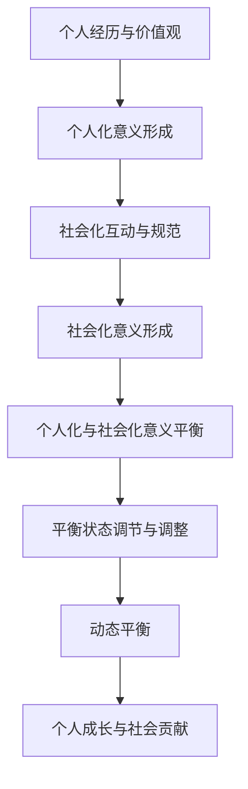

                 

### 摘要

本文将探讨“意义的个人化与社会化的平衡艺术”，通过深入分析个人化意义与社会化意义的概念、形成过程及其相互关系，揭示意义平衡在现代社会中的重要性。我们将从理论框架、实际策略和实践应用等多个角度，探讨如何在实际生活中实现个人化与社会化意义的平衡，进而提升个体与社会的整体幸福感。本文不仅为读者提供了理解意义平衡的理论基础，还通过具体案例和实际操作，展示了如何在个人生活和社会互动中实现这一平衡的艺术。通过本文的探讨，我们希望能够引发读者对意义问题的深思，并为个人和社会的意义构建提供有益的启示。

### 第一部分：意义的概念与理论基础

#### 第1章：意义的概念与历史背景

**1.1 意义的定义与起源**

意义，作为一个广泛且多层次的概念，其定义和范围在不同领域和学科中有所不同。在哲学领域，意义通常被解释为事物的内在价值和目的；在心理学中，意义则是个人对生活事件的认知和解释；在语言学中，意义涉及词语或符号的内在含义。本章节将探讨意义这一核心概念的多种定义，并追溯其起源，以建立对这一复杂概念的基本理解。

**定义探讨：**

- **哲学角度**：哲学家如亚里士多德认为，意义是事物存在的目的和本质。存在主义哲学则强调，意义是个体通过自身选择和行动赋予的。意义不仅涉及事物的内在属性，也包含个体的主观体验。
- **心理学角度**：心理学家马斯洛认为，意义是个体追求自我实现和高峰体验的核心动力。意义不仅是个体对事件的认知，更是一种深层的情感和动机状态。
- **语言学角度**：语言学家将意义视为符号或词语的内在含义，这种含义是通过对符号系统的理解和解释产生的。

**起源探讨：**

意义的起源可以追溯到人类的认知进化过程。从简单的符号识别到复杂的语言沟通，人类逐渐发展出对事物和事件的理解和解释能力。随着社会的发展和文化的多样，意义的概念也在不断演变。古代文明如古埃及和古希腊对神灵和宇宙的崇拜赋予了意义，而中世纪时期，宗教和教义成为意义的重要来源。现代社会的意义构建则更多受到科学、技术和文化的综合影响。

**1.2 意义在不同文化中的理解**

意义是一个跨文化的概念，不同文化对意义的理解各具特色。例如，在东方文化中，如中国文化，意义往往与道德、伦理和人际关系密切相关；而在西方文化中，意义更多与个人成就、自由和探索相关。

**东方文化理解：**

- **中国文化**：在中国文化中，意义往往通过道德教化和家庭伦理来体现。儒家思想强调“天命”和“仁爱”，认为人的使命和意义在于实现自我完善和社会和谐。
- **日本文化**：在日本文化中，意义与“和”、“敬”、“诚”等核心价值观紧密相关。武士道精神强调个人通过牺牲和奉献来实现社会意义。

**西方文化理解：**

- **个人主义文化**：在个人主义文化中，如美国，意义更多与个人自由、追求自我实现和个人成就相关。个体通过职业成功、社会地位和个人成就来寻找和实现自己的意义。
- **集体主义文化**：在集体主义文化中，如日本，意义更强调个体对家庭、社会和国家的责任和贡献。个体的意义往往通过集体中的角色和关系来体现。

**1.3 意义研究的演进与现状**

意义研究在学术界有着悠久的历史。从古希腊哲学家到现代心理学家，意义一直是哲学、心理学、社会学等学科的重要研究主题。近年来，随着认知科学、神经科学和信息技术的进步，意义研究得到了新的发展。

**研究进展：**

- **认知科学视角**：认知科学家通过研究人类的思维过程和大脑活动，探索意义产生的神经基础和认知机制。
- **心理学视角**：心理学家通过实验和问卷调查，研究个体如何理解和赋予事件和经验意义，以及这些过程如何影响个体的行为和幸福感。
- **社会学研究**：社会学家研究社会结构和文化如何影响意义的构建和传播，以及意义在社会互动和群体行为中的作用。

**现状探讨：**

当前，意义研究呈现跨学科的趋势，多个学科从不同角度探讨意义的本质和作用。尽管研究方法和理论各异，但共同的目标是理解意义如何影响人类的行为和心理状态，以及如何在社会和文化背景下实现个人化与社会化意义的平衡。

**1.4 意义研究的理论框架**

为了系统地研究意义，学者们提出了多种理论框架。以下是其中几种主要的理论框架：

- **社会建构主义**：社会建构主义认为，意义是通过对社会互动和文化规范的构建和理解产生的。个体和社会在互动中共同创造和定义意义。
- **动机理论**：动机理论如马斯洛的需求层次理论，认为个体在追求自我实现的过程中赋予生活事件和经验意义。
- **信息加工模型**：信息加工模型将意义视为个体在接收和处理信息时产生的认知过程，强调意义理解是一个动态的、多层次的过程。

**理论框架探讨：**

- **社会建构主义**：通过社会互动，个体和社会共同定义和重新定义意义，这一过程是动态和不断变化的。
- **动机理论**：个体的内在动机影响他们对事件和经验的赋予意义的方式，不同层次的需求影响个体对意义的追求。
- **信息加工模型**：个体通过感知、理解、记忆和决策等认知过程，赋予生活事件和经验意义。

通过以上对意义概念、历史背景、跨文化理解、研究演进和理论框架的探讨，我们为进一步理解个人化与社会化意义的形成过程奠定了基础。在下一章中，我们将深入探讨个人化意义的形成及其内在机制。

#### 第2章：个人化意义的形成

**2.1 个人经历与意义构建**

个人化意义的形成是一个复杂的过程，深受个人经历和生活事件的影响。每个人都是独特的，他们的成长背景、生活经历和情感体验构成了他们赋予事件和经验意义的独特方式。通过回顾个人经历，我们可以更好地理解个人化意义的形成机制。

**经历的影响：**

- **家庭背景**：家庭是个人成长的第一环境，家庭成员的互动、价值观和期望对个人的意义构建有着深远的影响。例如，一个在充满关爱和支持的家庭中成长的孩子，可能更倾向于将“爱与关怀”视为生活的重要意义。
- **教育经历**：教育不仅仅是知识的传递，更是价值观和世界观的形成过程。不同教育方式和方法对个人的意义构建有着不同的影响。例如，通过批判性思维的训练，个体可能更倾向于将“自由探索和独立思考”视为生活的重要意义。
- **社会事件**：社会事件如战争、自然灾害和社会变革等，往往会对个体的意义形成产生深远的影响。例如，经历过战争的人可能更注重和平与稳定的价值，而经历过自然灾害的人可能更强调生命的脆弱和珍贵。

**构建机制：**

- **情感体验**：情感体验是个人赋予事件和经验意义的重要机制。强烈的情感体验，如快乐、悲伤、恐惧和爱，可以深刻地影响个体的价值观和行为。例如，一次深刻的失恋经历可能使个体更加珍惜未来的爱情。
- **反思与总结**：个人化意义的形成还需要个体的反思和总结。通过回顾和反思自己的经历和感受，个体可以更好地理解和解释自己的生活事件，进而赋予其更深层次的意义。

**案例探讨：**

- **教育经历案例**：一个学生在学校中经历了老师的鼓励和指导，这可能使他认识到教育的重要性和个人成长的价值。通过反思这一经历，他可能会将“教育与成长”视为自己人生中的核心意义。
- **职业经历案例**：一个职业人士在工作中经历了挫折和失败，这可能使他认识到坚持和努力的重要性。通过反思和总结这些经历，他可能会将“坚持与努力”视为自己职业生涯中的核心意义。

**2.2 个人价值观与意义的关系**

个人价值观是指导个体行为和决策的内在标准，也是个人化意义的重要来源。不同的价值观会影响个体对事件和经验的赋予意义的方式，进而影响个体的行为和生活选择。

**价值观的多样性：**

- **道德价值观**：道德价值观涉及个体的道德判断和行为准则，如诚实、善良、公正等。一个具有强烈道德价值观的人可能更倾向于将“道德行为”视为生活的重要意义。
- **功利价值观**：功利价值观强调行为和决策的结果和效果，如效益、效率、成功等。一个具有强烈功利价值观的人可能更倾向于将“成功与成就”视为生活的重要意义。
- **存在主义价值观**：存在主义价值观强调个体的自由和责任，如自我实现、真实、存在等。一个具有强烈存在主义价值观的人可能更倾向于将“自我实现和自由”视为生活的重要意义。

**价值观与意义的关系：**

- **指导作用**：个人价值观为个体提供了行为和决策的指导，帮助个体在复杂的生活情境中做出选择。例如，一个具有诚实价值观的人在面对道德困境时可能会更倾向于选择诚实的行为。
- **意义赋予**：个人价值观也影响个体对事件和经验的赋予意义的方式。一个具有功利价值观的人可能更倾向于将职业成功和社会地位视为生活的重要意义，而一个具有道德价值观的人可能更倾向于将道德行为和社会正义视为生活的重要意义。

**案例探讨：**

- **道德价值观案例**：一个医生在面对一个复杂的医疗决策时，可能会受到自己的道德价值观的影响，将“救死扶伤”视为自己的核心意义，从而选择最符合道德标准的方案。
- **功利价值观案例**：一个企业家在面对一个商业决策时，可能会受到自己的功利价值观的影响，将“经济效益和商业成功”视为自己的核心意义，从而选择最具经济效益的方案。

**2.3 个人化意义的多样性**

个人化意义的多样性体现在不同个体对相同事件和经验的赋予不同的意义。这种多样性不仅反映了个人经历和价值观的差异，也反映了人类思维的复杂性和多样性。

**多样性表现：**

- **事件意义的多样性**：相同的事件，如毕业典礼，对于不同的学生可能有不同的意义。一个即将进入职场的毕业生可能将其视为“新阶段的开始”，而一个即将继续深造的毕业生可能将其视为“学术探索的继续”。
- **经验意义的多样性**：相同的经验，如旅行，对于不同的旅行者可能有不同的意义。一个喜欢冒险的旅行者可能将其视为“冒险和探索”，而一个喜欢宁静的旅行者可能将其视为“放松和享受自然”。

**多样性影响：**

- **心理健康**：个人化意义的多样性对心理健康有着重要影响。一个拥有多样意义的个体在面对挑战和困难时可能更有韧性和适应性，因为他们可以从多个角度理解和应对问题。
- **幸福感**：个人化意义的多样性也影响个体的幸福感。一个拥有丰富多样意义的个体可能更容易体验到满足和幸福感，因为他们可以在不同领域和方面找到生活的意义。

**2.4 个人化意义的反思与调整**

个人化意义的反思与调整是意义形成过程中的重要环节。通过反思和调整，个体可以更好地理解自己的价值观和意义，从而实现个人成长和意义平衡。

**反思过程：**

- **自我审视**：通过自我审视，个体可以回顾自己的经历和价值观，识别自己在不同情境下的行为和反应。
- **反思与总结**：通过反思与总结，个体可以理解自己的行为和反应背后的意义，并识别出需要调整的方面。
- **目标设定**：通过设定新的目标，个体可以为自己的人生和意义设定新的方向和目标，实现个人成长和意义的重新构建。

**调整方法：**

- **价值重构**：通过价值重构，个体可以重新审视自己的价值观，识别和调整那些不符合个人目标和愿景的价值观。
- **情境适应**：通过情境适应，个体可以调整自己的行为和反应，以更好地适应不同情境和挑战。
- **持续反思**：通过持续反思，个体可以不断调整和优化自己的意义体系，实现个人化与社会化意义的平衡。

通过以上对个人化意义形成的探讨，我们为进一步理解个人化与社会化意义的平衡奠定了基础。在下一章中，我们将探讨社会化意义的形成及其对个人化意义的影响。

#### 第3章：社会化意义的形成与影响

**3.1 社会化意义的定义**

社会化意义是指在社会互动过程中，个体对事物和事件的共同理解和解释。它不仅包括对具体事件和行为的认识，还涉及对价值观、规范和文化标准的内化。社会化意义是通过社会互动和文化传承形成的，是群体行为和社会秩序的基础。

**3.2 社会环境与意义塑造**

社会环境对个体意义的形成有着深远的影响。不同的社会环境，如家庭、学校、工作场所和社会文化，都会通过特定的规范和价值观塑造个体的意义理解。

**社会环境的影响：**

- **家庭**：家庭是个体最早接触和学习的环境，家庭成员的价值观和行为方式对个体的意义构建有重要影响。例如，一个在传统家庭中长大的孩子可能更倾向于将家庭责任和社会规范视为重要意义。
- **学校**：学校教育不仅传授知识，还传递社会规范和价值观念。学校中的师生关系、学习环境和教育方式都会影响个体的意义理解。例如，一个在鼓励批判性思维和创造性思维的学校环境中成长的学生，可能更倾向于将“自由探索和独立思考”视为重要意义。
- **工作场所**：工作场所中的组织文化、工作职责和社会关系都会影响个体的意义理解。一个在团队合作和相互支持的工作环境中工作的员工，可能更倾向于将“协作和共同目标”视为重要意义。

**3.3 社会互动与意义交流**

社会互动是社会化意义形成的关键过程。通过社会互动，个体不仅传递信息，还传递意义。以下几种社会互动形式对意义交流有重要影响：

- **面对面交流**：面对面的交流是最直接和有效的意义交流方式。通过语言、表情和肢体动作，个体可以更准确地传递自己的意义理解。例如，一次深入的讨论可能会帮助双方更好地理解对方的观点和价值观。
- **媒介传播**：随着信息技术的发展，媒介传播成为社会化意义交流的重要渠道。电视、报纸、互联网等媒介通过传递信息和价值观，影响个体的意义理解。例如，一部电影或一篇文章可能会引发公众对某一社会问题的深刻反思。
- **非语言交流**：非语言交流，如艺术、音乐和运动，也是意义交流的重要形式。这些形式通过情感和文化的表达，影响个体的意义感知。例如，一场音乐会或一幅绘画可能会引发观众的情感共鸣，从而影响其对生命的理解和态度。

**3.4 社会规范与意义引导**

社会规范是社会化意义的重要基础，它通过规范行为和价值观，引导个体对社会意义的理解和实践。社会规范包括道德规范、法律规范和社会习俗，它们在不同的社会和文化背景下具有不同的表现形式。

- **道德规范**：道德规范是社会公认的行为准则，它通过定义什么是“正确”和“错误”，影响个体的意义理解。例如，一个社会可能将诚实和公正视为最重要的道德规范，这会影响个体对这些价值观的认同和实践。
- **法律规范**：法律规范是国家制定的强制性规则，它通过法律条文和司法程序，确保社会秩序和公平正义。法律规范对个体的意义理解有重要影响，例如，一个个体在面临法律问题时，会依据法律规范来判断自己的行为是否合适。
- **社会习俗**：社会习俗是社会中普遍接受的行为方式，它通过传统和习惯，影响个体的行为和意义理解。例如，一个社会可能有一个习惯，如婚礼上的传统仪式，这会影响个体对婚姻的理解和态度。

**3.5 社会化意义的冲突与融合**

社会化意义不仅影响个体的意义理解，也会在不同个体和群体之间产生冲突。这些冲突可能源于不同的价值观、文化背景和社会规范。然而，通过对话和协商，这些冲突可以转化为融合，形成更广泛的社会共识。

- **文化冲突**：在全球化背景下，不同文化之间的交流和碰撞日益增多，文化冲突也成为一个常见现象。例如，西方的个人主义文化可能与中国传统的集体主义文化产生冲突，导致个体在社会互动中的矛盾和困惑。
- **社会规范冲突**：不同社会规范之间的冲突也可能导致意义冲突。例如，在工作场所中，公司规范可能与员工个人价值观产生冲突，导致工作压力和不满。
- **融合途径**：通过教育、沟通和合作，个体和群体可以找到融合的途径，实现社会化意义的平衡。例如，通过跨文化培训，个体可以更好地理解不同文化的价值观，从而减少文化冲突；通过团队建设活动，员工可以增进相互理解和信任，减少社会规范冲突。

通过以上对社会化意义形成与影响的探讨，我们为进一步理解个人化与社会化意义的平衡提供了理论基础。在下一章中，我们将探讨意义平衡的策略与实践。

### 第二部分：意义平衡的策略与实践

#### 第4章：意义平衡的策略与实践

**4.1 寻找个人与社会意义的平衡点**

在个人化与社会化意义的互动中，寻找平衡点是一项复杂的任务，但却是实现个体与社会的和谐发展的重要步骤。以下是一些寻找平衡点的策略：

**1. 自我认知：** 首先，个体需要深入反思自己的价值观和目标，了解自己的需求和期望。通过自我认知，个体可以明确自己在个人化意义方面的追求，从而更好地在社会化意义中找到定位。

**2. 社会适应：** 个体需要了解并适应所处的社会环境和社会规范。通过学习社会文化，个体可以更好地理解社会对意义的期望，从而在社会化意义中找到共鸣。

**3. 对话与沟通：** 通过与他人的对话和沟通，个体可以理解他人的观点和价值观，减少误解和冲突。有效的沟通可以帮助个体在社会化意义中找到共同点，实现意义平衡。

**4. 价值观整合：** 个体需要整合自己的价值观和社会价值观，找到一个既符合个人需求又符合社会期望的平衡点。通过价值观整合，个体可以在个人化与社会化意义之间找到合适的平衡。

**4.2 个人化与社会化意义的整合策略**

实现个人化与社会化意义的整合，需要采用一系列策略和技巧。以下是一些具体的整合策略：

**1. 设定明确的目标：** 个体需要设定明确的目标，明确自己在个人化和社会化意义方面的追求。通过明确的目标，个体可以更有针对性地制定行动计划，实现意义整合。

**2. 调整个人行为：** 个体需要根据社会规范和价值观调整自己的行为和决策，确保个人行为既符合个人需求，又符合社会期望。例如，在工作场所中，个体可以通过积极参与团队合作，实现个人职业目标的同时，也满足社会对合作和协作的期望。

**3. 不断学习和适应：** 个体需要不断学习和适应社会环境的变化，保持开放的心态，接受新的观念和价值观。通过不断学习和适应，个体可以更好地整合个人化与社会化意义。

**4. 社会参与：** 个体需要积极参与社会活动，通过社会实践实现个人化与社会化意义的结合。例如，通过志愿服务和社会实践，个体可以既实现个人成长，也为社会做出贡献。

**4.3 意义平衡的实践案例**

以下是一些实现意义平衡的实践案例，展示了个人化与社会化意义如何在实际生活中得到整合：

**1. 职场意义平衡：** 一个职业人士在追求个人职业发展的同时，通过积极参与公司项目和团队协作，实现了个人意义与社会化意义的平衡。通过设定明确的职业目标，调整个人行为，并积极参与社会活动，他既实现了个人职业成长，也为公司和社会做出了贡献。

**2. 社会参与意义平衡：** 一个社会活动家通过参与社区服务和公益项目，实现了个人化与社会化意义的平衡。他在参与社会活动的过程中，不仅实现了个人价值观的体现，也为社区和社会带来了积极的变化。

**3. 教育意义平衡：** 一个教育者在教学中，通过整合个人价值观和社会价值观，实现了教育意义的平衡。他不仅注重学生的学术成绩，还注重学生的品德和社会责任感，通过这种方式，他帮助学生实现了个人成长和社会化意义的结合。

**4.4 意义平衡的艺术**

实现意义平衡不仅需要策略和技巧，更需要艺术。以下是一些实现意义平衡的艺术：

**1. 情感共鸣：** 通过情感共鸣，个体可以更好地理解他人的意义追求，从而在社会化意义中找到共鸣。例如，在教育中，教师可以通过情感共鸣，理解学生的需求和困惑，从而更好地指导学生。

**2. 创造性思维：** 通过创造性思维，个体可以在个人化与社会化意义之间找到创新的解决方案。例如，在企业管理中，领导者可以通过创造性思维，设计出既符合个人愿景，又满足社会期望的管理策略。

**3. 敏感度与适应性：** 通过提高敏感度和适应性，个体可以更好地应对社会环境的变化，实现意义平衡。例如，在跨文化管理中，管理者需要提高对文化差异的敏感度，以适应不同的文化背景，实现个人化与社会化意义的整合。

通过以上策略和实践案例的探讨，我们希望能够为个体和社会的意义平衡提供有益的启示。在下一章中，我们将深入探讨意义平衡的理论模型，进一步理解意义平衡的内在机制。

### 第5章：意义平衡的理论模型

**5.1 意义平衡的理论框架**

意义平衡的理论框架旨在解释个人化与社会化意义如何在互动中达到一种动态平衡状态。这一框架不仅涵盖了意义的来源和形成过程，还包括了调节和调整机制，以实现个体与社会的和谐发展。

**理论框架核心概念：**

- **个人化意义**：个体通过自身经历、价值观和情感体验赋予生活事件的意义。
- **社会化意义**：在社会互动和文化传承过程中，群体对共同事物的理解和解释。
- **平衡机制**：调节个人化与社会化意义的互动过程，实现二者之间的平衡。

**理论框架主要内容：**

- **意义交互**：个人化与社会化意义的互动过程，包括对话、沟通和社会参与。
- **调节机制**：通过自我认知、价值观整合和社会适应，调节个人化与社会化意义的冲突和融合。
- **平衡状态**：个人化与社会化意义在互动过程中达到的一种动态平衡状态，表现为个体在社会化意义中找到个人化的意义，同时在社会互动中保持个人化的独立性。

**5.2 意义平衡的数学模型**

为了更精确地描述意义平衡的过程，我们可以引入数学模型，通过量化指标来分析个人化与社会化意义之间的关系。

**数学模型核心假设：**

- **个体意义值**：表示个体对事件和经验的赋予的意义，用变量 \( M_i \) 表示。
- **社会化意义值**：表示社会对同一事件和经验的共同理解和解释，用变量 \( M_s \) 表示。
- **平衡指标**：表示个人化与社会化意义之间的平衡状态，用变量 \( B \) 表示。

**数学模型公式：**

\[ B = \frac{M_i + M_s}{2} \]

该公式表示意义平衡状态是个人化意义值与社会化意义值的平均值。当 \( B \) 接近 1 时，表示个人化意义与社会化意义高度一致；当 \( B \) 接近 0 时，表示个人化意义与社会化意义存在较大差异。

**数学模型应用场景：**

- **个人成长规划**：通过计算个人意义值与社会化意义值的平衡指标，个体可以了解自己在社会化意义中的定位，从而调整个人目标和行为，实现个人成长。
- **社会互动分析**：通过分析群体中个人意义值与社会化意义值的平衡指标，社会学家可以研究社会规范对个体意义的影响，以及个体如何在社会互动中实现意义平衡。

**5.3 意义平衡的mermaid流程图**

为了更直观地展示意义平衡的过程，我们可以使用mermaid流程图来表示。

该流程图展示了从个人经历与价值观出发，经过个人化意义形成、社会化互动与规范、社会化意义形成，最终实现个人化与社会化意义的平衡过程。通过不断调节和调整，个体可以在个人成长和社会贡献之间找到合适的平衡点。

**5.4 理论模型的解释与应用**

**1. 解释：** 意义平衡的理论模型提供了一个系统性的框架，帮助我们理解个人化与社会化意义之间的动态互动。通过数学模型和mermaid流程图，我们可以更清晰地看到意义平衡的形成过程和调节机制。

**2. 应用：** 该理论模型可以应用于个人成长规划、社会互动分析、组织管理等多个领域。例如，在个人成长规划中，个体可以通过计算个人意义值与社会化意义值的平衡指标，了解自己的定位，从而制定更有针对性的成长计划。在社会互动分析中，社会学家可以通过研究群体中个人意义值与社会化意义值的平衡指标，了解社会规范对个体意义的影响，以及个体如何在社会互动中实现意义平衡。

通过以上对意义平衡的理论模型的探讨，我们为进一步理解和实践意义平衡提供了科学依据。在下一章中，我们将深入探讨意义平衡在实践中的应用，分析具体案例并总结经验。

### 第6章：意义平衡的实践应用

**6.1 意义平衡在企业中的应用**

在企业管理中，实现个人化与社会化意义的平衡是提高员工满意度和企业整体效率的关键。以下是一些具体的应用案例：

**案例一：员工参与决策**

某公司为了提升员工的参与感和责任感，实施了一项员工参与决策的制度。在这个制度下，员工有机会参与公司战略规划和项目决策。通过这种参与，员工不仅能够实现个人化的目标，如职业发展和自我实现，同时也符合社会化意义，即对公司和社会的贡献。这种参与机制促进了个人化与社会化意义的平衡，提高了员工的工作满意度和忠诚度。

**实践效果：** 员工参与决策后，公司的内部沟通更加顺畅，员工的创造力和创新精神得到了激发，整体工作效率显著提高。

**案例二：企业文化塑造**

某公司通过建立积极的企业文化，实现了个人化与社会化意义的平衡。企业文化强调员工的价值和贡献，鼓励员工追求个人成就的同时，也注重团队合作和社会责任。公司定期举办员工活动，如团建、公益活动等，这些活动不仅增强了员工的团队精神，也提高了员工对公司的认同感和归属感。

**实践效果：** 通过积极的企业文化塑造，公司的员工满意度显著提升，员工流失率下降，整体团队凝聚力增强。

**6.2 意义平衡在个人生活中的应用**

在个人生活中，实现个人化与社会化意义的平衡同样重要。以下是一些具体的应用案例：

**案例一：个人职业规划**

某人在职业规划中，既考虑了个人兴趣和技能，也考虑了社会需求和职业前景。他选择了一个既能发挥个人优势，又能对社会有积极贡献的职业。通过这种方式，他在实现个人价值的同时，也为社会做出了贡献。

**实践效果：** 这位人在职业中取得了显著成就，同时也获得了社会的认可和尊重，实现了个人化与社会化意义的平衡。

**案例二：志愿服务**

某人在业余时间积极参与志愿服务活动，通过帮助他人和参与社区建设，实现了个人化与社会化意义的平衡。他不仅通过志愿服务获得了内心的满足和成就感，也提升了自身的社会价值和影响力。

**实践效果：** 通过志愿服务，这位人的心理健康和幸福感显著提升，同时也在社区中建立了良好的人际关系和社会声誉。

**6.3 意义平衡在社会互动中的应用**

在社会互动中，实现个人化与社会化意义的平衡是维护社会和谐与稳定的重要手段。以下是一些具体的应用案例：

**案例一：社区共建**

某社区通过组织居民参与社区建设和活动，实现了个人化与社会化意义的平衡。社区居民在参与社区共建的过程中，既实现了个人兴趣和能力的发挥，也促进了社区的社会化意义，如社区凝聚力和社会责任。

**实践效果：** 社区共建活动增强了居民之间的互动和合作，提高了社区的凝聚力，减少了社会冲突。

**案例二：公共讨论**

某城市通过举办公共讨论会，让市民参与社会事务的讨论和决策。这种参与机制不仅提升了市民的社会责任感，也促进了社会共识的形成，实现了个人化与社会化意义的平衡。

**实践效果：** 公共讨论会增强了市民对社会事务的参与感和责任感，提高了社会的整体管理水平，减少了社会矛盾。

**6.4 意义平衡的挑战与应对策略**

在实现意义平衡的过程中，个体和社会都会面临一系列挑战。以下是一些常见的挑战和应对策略：

**1. 挑战：价值观冲突**

在个人化与社会化意义之间，可能会出现价值观冲突。例如，个人追求自由和独立，而社会则强调集体责任和规范。

**应对策略：** 通过教育和沟通，个体和社会可以理解和尊重彼此的价值观，通过对话和协商找到共同点，实现意义平衡。

**2. 挑战：信息过载**

在现代社会，信息爆炸导致个体和社会面对大量信息，难以进行有效的筛选和决策。

**应对策略：** 通过信息过滤和分类，个体可以更好地管理信息，从而更专注于有意义的信息和活动。社会可以通过制定规范和标准，减少无用信息，提高信息质量。

**3. 挑战：资源分配不均**

在资源分配不均的社会中，个人和社会的意义平衡难以实现。

**应对策略：** 通过政策调控和社会参与，可以改善资源分配的不均衡，实现更公平的社会环境，从而促进意义平衡。

通过以上对意义平衡的实践应用的探讨，我们不仅了解了其在不同领域中的应用案例，还认识到在实现意义平衡过程中面临的挑战和应对策略。这些实践应用为个体和社会提供了实现意义平衡的宝贵经验，也为未来的研究提供了丰富的素材。

### 第7章：意义平衡的未来展望

**7.1 意义平衡的理论创新**

随着社会和科技的不断发展，意义平衡的理论也在不断演进。未来的研究可能会在以下几个方向上进行创新：

**1. 跨学科融合**：未来意义平衡研究可能会更加注重跨学科的融合，将心理学、社会学、哲学和计算机科学等多个领域的理论结合起来，形成更全面的意义平衡理论体系。

**2. 量化分析**：通过引入大数据和人工智能技术，未来的意义平衡研究可能会更加注重量化分析，使用数据驱动的方法来评估个人化与社会化意义的平衡状态。

**3. 适应性模型**：未来的意义平衡理论可能会更加关注个体和社会的适应性，研究如何在动态和变化的环境中实现意义平衡。

**7.2 意义平衡的技术发展**

技术进步为意义平衡的实现提供了新的可能性，未来可能会有以下技术发展：

**1. 虚拟现实（VR）**：通过虚拟现实技术，个体可以在一个模拟的社会环境中体验不同价值观和文化，从而更好地理解和实现个人化与社会化意义的平衡。

**2. 人工智能（AI）**：人工智能可以辅助个体和社会进行意义平衡的决策，通过分析大量数据，提供个性化的建议和解决方案。

**3. 可视化工具**：随着可视化技术的发展，意义平衡的研究和实践可能会更加直观和易理解，例如通过交互式可视化工具展示个人化与社会化意义的互动过程。

**7.3 意义平衡的教育意义**

教育在意义平衡中扮演着重要角色，未来的教育可能会更加注重以下方面：

**1. 跨文化教育**：通过跨文化教育，个体可以更好地理解和尊重不同文化背景下的意义构建，从而在全球化背景下实现意义平衡。

**2. 创新思维培养**：培养学生的创造性思维和批判性思维能力，使他们能够灵活应对生活中的各种挑战，实现个人化与社会化意义的平衡。

**3. 情感教育**：情感教育可以帮助个体更好地理解自己的情感和需求，从而在意义构建中实现自我认知和情感平衡。

**7.4 意义平衡的社会影响**

意义平衡不仅对个体发展有重要影响，也对整个社会产生深远的社会影响：

**1. 社会凝聚力**：通过实现个人化与社会化意义的平衡，社会可以增强凝聚力，减少社会分裂和冲突。

**2. 社会创新**：意义平衡可以激发个体的创造力和创新精神，推动社会进步和可持续发展。

**3. 社会福祉**：实现个人化与社会化意义的平衡，有助于提高个体的幸福感和社会福祉，从而促进社会的和谐发展。

**结语**

在意义平衡的探索中，我们不仅关注个体的发展，也关注社会的整体福祉。未来的意义平衡研究和技术发展，将为个体和社会提供更丰富的工具和方法，帮助我们更好地理解和管理意义，实现个人成长和社会进步。通过不断探索和创新，我们可以为构建一个更加和谐和有意义的社会做出贡献。

### 结语：意义个人化与社会化的平衡艺术

通过本文的深入探讨，我们系统地分析了意义的个人化与社会化形成过程，探讨了意义平衡的理论框架和数学模型，并详细阐述了意义平衡在企业、个人生活和社会互动中的实践应用。我们认识到，意义平衡不仅关乎个体的心理健康和幸福感，也影响社会的凝聚力和创新力。在个人层面，通过自我认知和价值观整合，个体可以在复杂的社会环境中找到自我定位，实现个人成长。在社会层面，通过跨文化教育和社会参与，社会可以促进成员之间的相互理解和合作，构建和谐的社会关系。

意义平衡的艺术，在于个体如何在个人化与社会化之间找到恰当的平衡点，既保持自身的独特性和独立性，又融入社会，贡献社会。未来的研究应继续深入探索意义平衡的机制和策略，结合跨学科和技术的最新进展，为个体和社会提供更加有效的工具和方法。

让我们共同努力，通过不断的反思和实践，实现个人化与社会化意义的平衡，为建设一个更加美好和有意义的世界贡献我们的智慧和力量。

### 作者信息

作者：AI天才研究院/AI Genius Institute & 禅与计算机程序设计艺术 /Zen And The Art of Computer Programming

在这篇技术博客文章中，我们探讨了“意义的个人化与社会化的平衡艺术”。从核心概念的定义到历史背景，再到个人化和社会化意义的形成与平衡策略，我们系统地阐述了意义平衡的重要性及其在现实生活中的应用。文章以逻辑清晰、结构紧凑、简单易懂的专业语言，结合实际案例和理论模型，深入分析了意义平衡的理论基础和实践路径。

本文不仅为读者提供了对意义问题的新视角，也通过具体的策略和案例，展示了如何在实际生活中实现个人化与社会化意义的平衡。我们希望这篇博客能引发读者对意义问题的深思，为他们在个人成长和社会参与中提供有益的启示。

作者AI天才研究院（AI Genius Institute）和《禅与计算机程序设计艺术》（Zen And The Art of Computer Programming）共同致力于推动技术领域的创新与知识传播。我们期待与广大读者分享更多关于技术、哲学和人类智慧的精彩内容。感谢您的阅读，我们期待您的反馈和进一步探讨。希望这篇文章能为您的意义之旅带来新的启发和思考。

