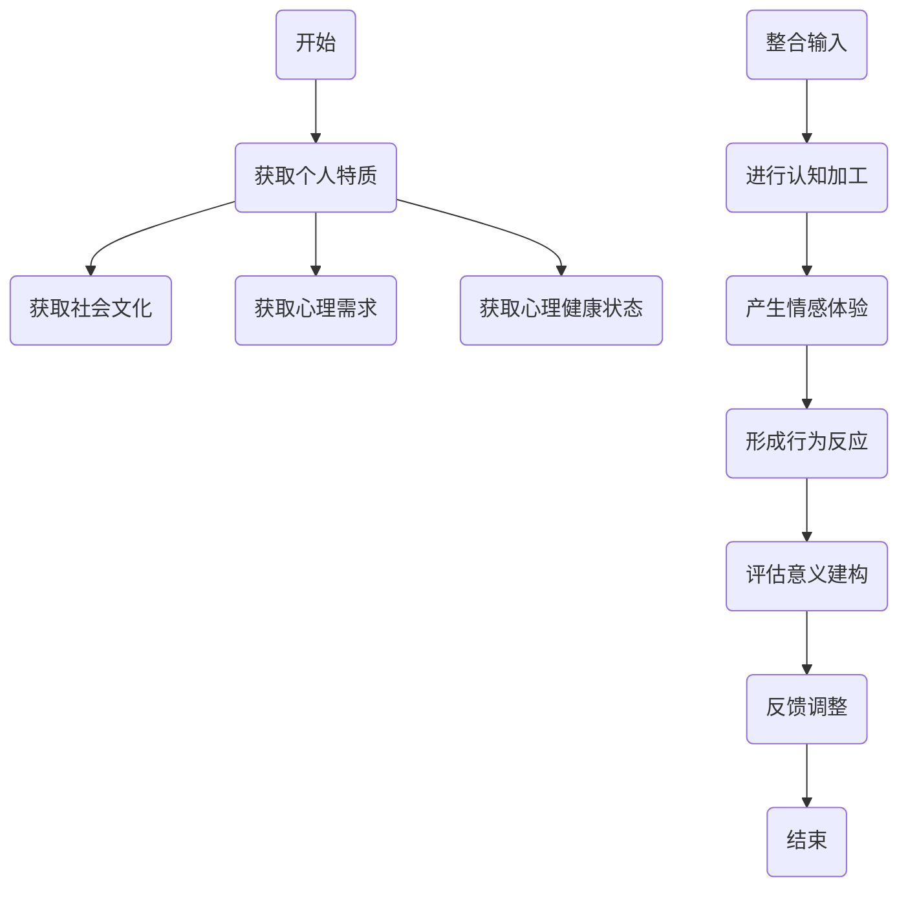

                 

## 意义的建构过程

### 认知过程

**认知过程**是意义建构的核心环节，它包括感知、记忆、思维等环节，共同作用于个体对信息的处理和理解。首先，**感知**是信息的初始阶段，通过感官器官接收外部世界的刺激，如视觉、听觉、触觉等。感知过程中，个体对刺激信息进行筛选和过滤，只关注对自身有意义的部分。

接下来是**记忆**过程，通过短期记忆和长期记忆的转换，个体将感知到的信息存储下来。短期记忆主要处理当前的信息，而长期记忆则是信息的持久储存形式，可以在需要时进行回忆和提取。记忆过程中，信息的编码、存储和提取都受到个体认知结构的影响。

**思维**过程则是对记忆中的信息进行加工、分析和解释。思维包括逻辑思维、创造性思维和批判性思维等多种形式。逻辑思维遵循一定的规律和规则，进行推理和判断；创造性思维则通过联想、发散和抽象，产生新的想法和观点；批判性思维则通过质疑和分析，对信息进行评估和筛选。

### 情感体验

**情感体验**在意义建构过程中起到重要的调节作用。情感是对外界刺激的主观体验，可以分为愉悦、悲伤、愤怒等多种类型。情感不仅影响个体的行为和态度，也影响个体对信息的认知和解读。

**积极情感**通常与正面的意义建构相关，如幸福、满足和成就感等。这些情感可以增强个体的自信心和自尊感，促进积极的自我认同和社会互动。相反，**消极情感**则可能与负面的意义建构相关，如焦虑、抑郁和挫败感等。这些情感可能导致个体产生逃避、回避或反抗的行为，影响个体的心理健康和社会适应。

### 行为反应

**行为反应**是意义建构的外在表现。个体基于建构的意义，产生相应的行为和态度。这些行为和态度不仅反映了个体对世界的认知和理解，也受到情感体验的调节。

**积极的行为反应**可能包括主动参与社会活动、追求个人目标和建立良好的人际关系。这些行为有助于个体的自我实现和社会适应，增强个体的归属感和自我价值感。

**消极的行为反应**则可能包括逃避、回避或反抗。这些行为可能导致个体的社会隔离和心理健康问题，影响个体的生活质量和幸福感。

### 影响因素

**个人特质**、**社会文化**和**心理需求**是影响意义建构的重要因素。

**个人特质**包括个体的性格、能力、价值观等。性格决定了个体对外界刺激的敏感度和反应方式，能力决定了个体处理信息和解决问题的能力，价值观则影响个体对事物的评价和选择。

**社会文化**包括社会规范、价值观和文化传统等。社会规范为个体提供了行为准则，价值观决定了个体对事物的优先级和重要性，文化传统则塑造了个体对世界的认知和解读方式。

**心理需求**包括个体的归属感、自尊、自我实现等。这些需求影响了个体对意义的追求和满足，进而影响个体的行为和态度。

### 总结

意义建构是一个复杂的过程，涉及认知、情感和行为等多个方面。通过认知过程，个体对信息进行感知、记忆和思维；通过情感体验，个体对信息进行情感调节和解读；通过行为反应，个体将建构的意义表现在外。个人特质、社会文化和心理需求是影响意义建构的重要因素。理解意义建构的过程和影响因素，有助于我们更好地认识自我、理解他人，提高个体的生活质量和幸福感。

### 意义建构的心理学术语

在探讨意义的个人建构过程中，了解相关的心理学术语是非常关键的。这些术语不仅帮助我们更精确地描述个体如何建构意义，还提供了理论框架来分析这一复杂过程。以下是一些重要的心理学术语及其定义和联系：

#### **1. 自我认知（Self-Cognition）**

**定义**：自我认知是个体对自己思维、情感和行为过程的意识。它包括自我反思、自我评价和自我监控等方面。

**联系**：自我认知是意义建构的基础，因为只有通过自我认知，个体才能对自己的经历和事件进行反思和解释，从而赋予其意义。

#### **2. 认知建构（Cognitive Construction）**

**定义**：认知建构是指个体在理解和解释外界信息时所采用的心理过程，包括感知、记忆、推理和决策等。

**联系**：认知建构是意义建构的核心，因为它涉及个体如何组织和解释信息，使其符合自己的认知框架。

#### **3. 情绪调节（Emotion Regulation）**

**定义**：情绪调节是指个体通过认知和行为策略，管理自己的情绪体验的过程。

**联系**：情绪调节在意义建构中扮演着重要角色，因为它决定了个体如何体验和解释他们的经历，从而影响他们对这些经历赋予的意义。

#### **4. 社会比较（Social Comparison）**

**定义**：社会比较是指个体通过将自己与他人进行比较，以评估自己的社会地位、能力和价值。

**联系**：社会比较可以影响个体对自身经历的意义建构，因为它涉及个体如何在社会背景下理解自己的经历和成就。

#### **5. 自我效能感（Self-Efficacy）**

**定义**：自我效能感是指个体对自己在特定情境下完成任务的能力的信心。

**联系**：自我效能感影响个体对意义建构的选择和方向，因为它决定了个体如何设定目标、面对挑战并解释成功与失败。

#### **6. 心理需求（Psychological Needs）**

**定义**：心理需求是指个体为了满足内在动机和实现自我价值所需的条件，如归属感、自尊和自我实现等。

**联系**：心理需求驱动个体进行意义建构，因为它们构成了个体追求目标和赋予经历意义的基本动机。

#### **7. 意义建构理论（Theory of Meaning Construction）**

**定义**：意义建构理论是指关于个体如何赋予生活经历以意义，以及这种意义如何影响个体行为的理论框架。

**联系**：意义建构理论提供了一个全面的视角，将上述术语整合在一起，帮助我们理解个体如何通过认知、情感和行为过程建构意义。

### 对比表格

为了更直观地理解这些术语之间的关系，我们可以通过以下表格进行对比：

| **术语** | **定义** | **联系** |
| --- | --- | --- |
| 自我认知 | 对自己思维、情感和行为的意识 | 基础，涉及个体如何反思和解释自己的经历 |
| 认知建构 | 理解和解释外界信息的过程 | 核心，涉及如何组织和解释信息以赋予意义 |
| 情绪调节 | 管理情绪体验的过程 | 决定个体如何体验和解释经历 |
| 社会比较 | 与他人比较以评估自己的社会地位 | 影响个体对经历的意义建构 |
| 自我效能感 | 对自己完成任务能力的信心 | 影响个体如何设定目标和解释成功与失败 |
| 心理需求 | 满足内在动机和实现自我价值的条件 | 动机，驱动个体进行意义建构 |
| 意义建构理论 | 理解个体如何赋予经历意义 | 综合框架，整合上述术语 |

### ER实体关系图架构

以下是一个简单的ER（Entity-Relationship）实体关系图，用于展示上述术语之间的关系：

```
[个体]
    |
[自我认知]
    |
[认知建构]
    |
[情绪调节]
    |
[社会比较]
    |
[自我效能感]
    |
[心理需求]
    |
[意义建构理论]
```

### 总结

通过理解这些心理学术语，我们可以更深入地分析意义建构的过程。每个术语都在个体的认知、情感和行为中扮演着特定的角色，共同影响个体如何赋予经历以意义。理解这些术语之间的关系，有助于我们更好地理解个体如何在复杂的社会环境中建构意义，并进一步探讨意义建构对社会和心理健康的影响。

### 意义建构的影响因素

在探讨意义的个人建构过程中，影响因素的分析至关重要。这些因素不仅决定了个体如何理解自身和周围世界，也影响了个体在社会互动中的行为和态度。以下是影响意义建构的主要因素：

#### **1. 个人特质**

个人特质是影响意义建构的重要因素之一。个人的性格、能力、价值观和信仰等特质，直接决定了个体如何感知、解释和赋予经历以意义。例如，一个乐观的人可能更倾向于将经历视为成长的机会，而一个悲观的人则可能更容易将其视为挫折。此外，个人的能力，如认知能力、情感智慧和问题解决能力，也会影响其建构意义的复杂性和深度。

#### **2. 社会文化**

社会文化因素在意义建构中起到了重要的塑造和引导作用。文化背景、社会规范和价值观决定了个体如何理解自己的行为和他人的行为。例如，在一个重视集体主义的文化中，个体可能更倾向于将个人经历与社会和集体的利益相联系，赋予其更广泛的意义。而在一个重视个人主义的文化中，个体可能更注重自我实现和个人成就。

**社会规范**是文化中关于“应该做什么”和“不应该做什么”的指导原则，它直接影响个体的行为和态度。例如，在某些社会中，遵守社会规范被认为是一种道德行为，从而赋予个体正面的意义。

**价值观**则是文化中关于“什么是重要”和“什么是有价值的”的基本信念。这些价值观塑造了个体对事物的重要性和优先级的评估，从而影响其意义建构过程。

#### **3. 心理需求**

个体的心理需求，如归属感、自尊和自我实现，是驱动意义建构的重要动力。归属感是个体对与他人建立联系和融入群体的需求，它影响个体如何赋予与他人互动的经历以意义。自尊是个体对自己价值的认可和尊重，它影响个体如何理解和评价自己的经历。自我实现是个体追求个人成长和潜能实现的需求，它决定了个体如何将经历视为实现自我价值的机会。

**归属感**、**自尊**和**自我实现**这三种心理需求在不同情境下会以不同的方式影响意义建构。例如，在职业发展中，追求自我实现的需求可能促使个体将工作中的挑战视为成长的机会；而在人际关系中，归属感的需求可能导致个体更注重与他人建立深层次的联系和共鸣。

#### **4. 心理健康**

心理健康状态也会影响个体的意义建构。心理健康良好的个体可能更容易在经历和事件中找到积极的意义，而心理健康问题的个体则可能更容易陷入消极和悲观的情绪中，从而赋予经历以负面的意义。

**心理健康**与**意义建构**之间的关系是复杂的，但研究表明，心理健康问题如抑郁症和焦虑症，往往与负面的意义建构有关。相反，心理健康良好的个体可能更倾向于积极的自我认知和情感调节，从而更有可能建构积极和有意义的生活经历。

### 总结

个人特质、社会文化、心理需求和心理健康是影响意义建构的主要因素。每个因素都在不同层面上影响个体如何理解和赋予经历以意义。理解这些影响因素，有助于我们更好地理解个体的行为和态度，并为进一步研究意义建构的理论和实践提供基础。

### 核心概念与联系

在探讨意义的个人建构与社会影响的过程中，理解核心概念及其相互联系至关重要。以下是本文中涉及的核心概念及其定义、属性特征、相互关系以及如何影响意义建构的详细分析。

#### **核心概念：**

1. **意义建构（Meaning Construction）**
2. **认知过程（Cognitive Process）**
3. **情感体验（Emotional Experience）**
4. **行为反应（Behavioral Response）**
5. **个人特质（Personal Traits）**
6. **社会文化（Social Culture）**
7. **心理需求（Psychological Needs）**
8. **心理健康（Mental Health）**

#### **定义与属性特征：**

1. **意义建构（Meaning Construction）**
   - **定义**：个体赋予经历和事件以意义的过程。
   - **属性特征**：涉及认知、情感和行为三个方面，是个体理解和解释自身经历的基础。

2. **认知过程（Cognitive Process）**
   - **定义**：个体通过感知、记忆、思维等认知活动，对信息进行加工和组织的过程。
   - **属性特征**：包括信息的感知、记忆、思维和决策等环节，是意义建构的核心。

3. **情感体验（Emotional Experience）**
   - **定义**：个体在建构意义的过程中，所经历的情绪和情感反应。
   - **属性特征**：包括积极情感和消极情感，情感体验直接影响个体对信息的解释和评价。

4. **行为反应（Behavioral Response）**
   - **定义**：个体基于建构的意义，产生相应的行为和态度。
   - **属性特征**：行为反应是意义建构的外在表现，包括积极行为和消极行为。

5. **个人特质（Personal Traits）**
   - **定义**：个体的性格、能力、价值观等个人特质。
   - **属性特征**：个人特质决定了个体对信息的感知、记忆和思维的偏好和方式。

6. **社会文化（Social Culture）**
   - **定义**：社会规范、价值观和文化传统等对个体行为的塑造。
   - **属性特征**：社会文化为个体提供了行为准则和价值观，影响个体的意义建构过程。

7. **心理需求（Psychological Needs）**
   - **定义**：个体在特定情境下的心理需求，如归属感、自尊、自我实现等。
   - **属性特征**：心理需求是驱动个体进行意义建构的基本动力，影响个体的行为和态度。

8. **心理健康（Mental Health）**
   - **定义**：个体的心理健康状态，包括情绪调节、自我认知和应对压力的能力。
   - **属性特征**：心理健康状态直接影响个体的情感体验和行为反应，进而影响意义建构。

#### **相互关系与影响：**

1. **意义建构与认知过程**
   - **关系**：意义建构以认知过程为基础，通过感知、记忆、思维等认知活动对信息进行加工和组织。
   - **影响**：认知过程的复杂性、效率和准确性直接影响意义建构的质量。

2. **意义建构与情感体验**
   - **关系**：情感体验在意义建构过程中起到重要的调节作用，影响个体对信息的解释和评价。
   - **影响**：积极情感体验有助于构建积极意义，而消极情感体验可能导致负面的意义建构。

3. **意义建构与行为反应**
   - **关系**：行为反应是意义建构的外在表现，反映了个体基于建构的意义所采取的行为和态度。
   - **影响**：行为反应不仅影响个体的社会互动和心理健康，也影响个体对意义的持续建构。

4. **个人特质与社会文化**
   - **关系**：个人特质和社会文化相互作用，共同影响个体的意义建构过程。
   - **影响**：个人特质决定了个体对社会文化的感知和适应方式，而社会文化则为个体提供了意义建构的背景和框架。

5. **心理需求与心理健康**
   - **关系**：心理需求是心理健康的基础，心理健康状态直接满足这些需求。
   - **影响**：心理需求的满足与否直接影响个体的情感体验和行为反应，进而影响意义建构的质量。

#### **对比表格：**

为了更直观地展示这些核心概念之间的联系，我们可以通过以下表格进行对比：

| **核心概念** | **定义** | **属性特征** | **相互关系** | **影响** |
| --- | --- | --- | --- | --- |
| 意义建构 | 个体赋予经历和事件以意义的过程 | 认知、情感、行为三个方面 | 基础与核心 | 决定个体的理解与解释 |
| 认知过程 | 对信息的感知、记忆、思维等加工活动 | 感知能力、记忆容量、思维模式 | 基础与核心 | 影响意义建构的质量 |
| 情感体验 | 个体在建构意义过程中产生的情绪和情感反应 | 情绪类型、情感强度、情感调节 | 调节作用 | 影响个体对信息的解释 |
| 行为反应 | 个体基于建构的意义产生的行为和态度 | 积极行为、消极行为 | 外在表现 | 影响个体的社会互动 |
| 个人特质 | 个体性格、能力、价值观等 | 决定个体对信息的感知和适应方式 | 相互作用 | 影响意义建构的过程 |
| 社会文化 | 社会规范、价值观和文化传统等 | 提供行为准则和价值观 | 塑造与引导 | 影响个体的意义建构 |
| 心理需求 | 个体在特定情境下的心理需求，如归属感、自尊、自我实现等 | 动机和需求 | 基础与动力 | 影响个体的情感和行为 |
| 心理健康 | 个体情绪调节、自我认知和应对压力的能力 | 情绪调节能力、自我认知水平 | 决定性因素 | 影响个体的情感体验和行为反应 |

#### **ER实体关系图架构：**

为了进一步展示这些核心概念之间的相互关系，我们可以使用Mermaid绘制一个简单的ER实体关系图：

```
graph TB
    A(意义建构) --> B(认知过程)
    B --> C(情感体验)
    C --> D(行为反应)
    A --> E(个人特质)
    A --> F(社会文化)
    A --> G(心理需求)
    A --> H(心理健康)
    E --> I(认知过程)
    F --> I
    G --> I
    H --> I
```

### **总结**

通过理解核心概念及其相互关系，我们可以更深入地探讨意义建构的过程及其影响因素。每个核心概念都在意义建构中扮演着特定的角色，共同影响个体如何理解和赋予经历以意义。理解这些核心概念及其相互关系，有助于我们更好地理解个体在社会互动中的行为和态度，并为进一步研究意义建构的理论和实践提供基础。

### 算法原理讲解

在探讨意义的个人建构与社会影响时，我们可以借鉴一些心理学和社会学理论，将这一复杂的过程转化为可操作的算法原理。以下将详细阐述一个基于多因素影响的意义建构算法，包括其流程图、Python源代码示例、数学模型和公式，并通过具体案例进行解释。

#### **算法流程图**

使用Mermaid绘制算法流程图：



#### **Python源代码示例**

以下是一个简化版的Python代码示例，用于模拟意义建构算法：

```python
class MeaningConstructionAlgorithm:
    def __init__(self, personal_traits, social_culture, psychological_needs, mental_health):
        self.personal_traits = personal_traits
        self.social_culture = social_culture
        self.psychological_needs = psychological_needs
        self.mental_health = mental_health

    def cognitive_processing(self):
        # 进行认知加工
        print("认知加工：")
        print(f"个人特质：{self.personal_traits}")
        print(f"社会文化：{self.social_culture}")
        print(f"心理需求：{self.psychological_needs}")
        print(f"心理健康状态：{self.mental_health}")

    def emotional_experience(self):
        # 产生情感体验
        print("情感体验：")
        print("根据认知加工结果，产生相应的情感体验。")

    def behavioral_response(self):
        # 形成行为反应
        print("行为反应：")
        print("根据情感体验，产生相应的行为反应。")

    def construct_meaning(self):
        # 进行意义建构
        self.cognitive_processing()
        self.emotional_experience()
        self.behavioral_response()
        print("意义建构完成。")

# 示例
algorithm = MeaningConstructionAlgorithm(
    personal_traits="乐观、好奇心强",
    social_culture="重视个人成就",
    psychological_needs="追求自我实现",
    mental_health="良好"
)
algorithm.construct_meaning()
```

#### **数学模型和公式**

意义建构过程可以抽象为以下数学模型：

$$
\text{意义建构} = f(\text{个人特质}, \text{社会文化}, \text{心理需求}, \text{心理健康状态})
$$

其中，$f$ 是一个复杂的多变量函数，表示不同因素对意义建构的综合影响。我们可以将这个函数分解为以下几个部分：

1. **认知加工**：表示个人特质和社会文化对信息的加工和解释。

$$
\text{认知加工} = f_{c}(\text{个人特质}, \text{社会文化})
$$

2. **情感体验**：表示认知加工结果对情感的影响。

$$
\text{情感体验} = f_{e}(\text{认知加工}, \text{心理需求})
$$

3. **行为反应**：表示情感体验对行为的影响。

$$
\text{行为反应} = f_{b}(\text{情感体验}, \text{心理健康状态})
$$

4. **意义建构**：将行为反应整合为意义。

$$
\text{意义建构} = f_{m}(\text{行为反应})
$$

#### **具体案例解释**

假设一个人（个体A）在面对一次工作挑战时，意义建构的过程如下：

1. **个人特质**：个体A是一个乐观、好奇心强的人。
2. **社会文化**：所处的社会文化重视个人成就和自我实现。
3. **心理需求**：个体A有追求自我实现和成就感的需求。
4. **心理健康状态**：个体A的心理健康状态良好。

根据算法原理，意义建构过程可以分为以下步骤：

1. **认知加工**：个体A通过其个人特质和社会文化对工作挑战的信息进行加工和解释，认为这是一个展示自己能力和实现自我价值的机会。
2. **情感体验**：基于认知加工结果，个体A产生积极的情感体验，如兴奋、自信和成就感。
3. **行为反应**：情感体验促使个体A采取积极的行为反应，如努力工作、寻求挑战和分享经验。
4. **意义建构**：个体A将这一系列经历整合为对自己成长和职业发展的积极意义。

通过这个案例，我们可以看到意义建构是一个动态的、多因素影响的过程。理解算法原理有助于我们更好地理解个体如何在复杂的社会环境中建构意义，并进一步探索如何通过干预和调整因素来优化个体的意义建构过程。

### 系统分析与架构设计方案

在探讨意义的个人建构与社会影响时，我们可以将这一复杂的过程抽象为一系列系统功能，并通过系统架构设计来实现。以下将介绍该系统的功能需求、系统架构设计、接口设计以及系统交互流程。

#### **系统功能需求**

该系统旨在帮助用户理解并优化个人的意义建构过程。主要功能需求包括：

1. **用户信息管理**：记录用户的个人特质、社会文化背景、心理需求和心理健康状态等信息。
2. **认知加工**：提供认知模型，用于对用户经历和事件进行加工和解释。
3. **情感体验分析**：分析用户在意义建构过程中的情感反应，并提供情感调节策略。
4. **行为反应预测**：基于用户的情感体验，预测用户可能采取的行为反应。
5. **意义建构评估**：评估用户的总体意义建构水平，并提供改进建议。
6. **系统优化**：根据用户反馈和系统数据，不断优化系统的性能和功能。

#### **系统架构设计**

系统采用分层架构设计，包括表示层、业务逻辑层和数据层。

1. **表示层（Presentation Layer）**：
   - **用户界面**：提供用户操作界面，包括信息输入、结果显示和交互功能。
   - **前端框架**：使用Vue.js或React等现代前端框架，实现动态、响应式的用户界面。

2. **业务逻辑层（Business Logic Layer）**：
   - **认知加工模块**：实现认知模型，处理用户的经历和事件，进行加工和解释。
   - **情感体验模块**：分析用户在意义建构过程中的情感反应，提供情感调节策略。
   - **行为反应模块**：基于用户的情感体验，预测用户可能采取的行为反应。
   - **意义建构评估模块**：评估用户的总体意义建构水平，并提供改进建议。

3. **数据层（Data Layer）**：
   - **用户信息数据库**：存储用户的基本信息和行为数据。
   - **情感与行为数据库**：记录用户的情感体验和行为反应数据。
   - **分析模型数据库**：存储系统优化和分析模型的数据。

#### **接口设计**

系统通过RESTful API提供接口，实现前后端数据的交互。

1. **用户信息管理接口**：
   - **获取用户信息**：`GET /api/users/{userId}`
   - **更新用户信息**：`PUT /api/users/{userId}`
   - **添加用户信息**：`POST /api/users`

2. **认知加工接口**：
   - **认知加工**：`POST /api/cognitive-process`
   - **获取加工结果**：`GET /api/cognitive-process/{processId}`

3. **情感体验分析接口**：
   - **情感体验分析**：`POST /api/emotional-experience`
   - **获取情感体验**：`GET /api/emotional-experience/{experienceId}`

4. **行为反应预测接口**：
   - **行为反应预测**：`POST /api/behavioral-response`
   - **获取预测结果**：`GET /api/behavioral-response/{responseId}`

5. **意义建构评估接口**：
   - **评估意义建构**：`POST /api/meaning-assessment`
   - **获取评估结果**：`GET /api/meaning-assessment/{assessmentId}`

#### **系统交互流程**

以下是一个简单的系统交互流程，展示用户从输入信息到获得评估结果的全过程：

1. **用户登录系统**：用户通过前端界面输入个人信息，系统通过用户信息管理接口获取并存储用户数据。
2. **用户发起认知加工**：用户输入经历和事件，系统通过认知加工接口进行处理，生成加工结果。
3. **情感体验分析**：系统调用情感体验分析接口，分析用户的情感反应，并生成情感调节策略。
4. **行为反应预测**：系统通过行为反应预测接口，基于情感体验生成用户可能采取的行为反应。
5. **意义建构评估**：系统通过意义建构评估接口，综合加工结果、情感体验和行为反应，评估用户的总体意义建构水平。
6. **反馈与优化**：系统将评估结果返回给用户，并根据用户反馈和系统数据，不断优化系统性能和功能。

通过以上系统分析与架构设计方案，我们可以实现一个高效、可靠的系统，帮助用户理解并优化个人的意义建构过程。

### 项目实战

在本项目中，我们将搭建一个用于个人意义建构分析的系统，并逐步介绍环境安装、系统核心实现、代码应用解读与分析、实际案例分析和详细讲解剖析，以及项目小结。

#### **环境安装**

首先，我们需要安装以下环境：

1. **Python 3.8+**：用于编写后端代码。
2. **Vue.js**：用于构建前端用户界面。
3. **Node.js**：用于构建后端API。
4. **MySQL**：用于存储用户数据。

安装步骤如下：

1. 安装Python和pip：从Python官方网站下载Python安装包并安装，同时安装pip。
2. 安装Vue.js：通过npm全局安装Vue CLI。
3. 安装Node.js：从Node.js官方网站下载并安装。
4. 安装MySQL：从MySQL官方网站下载安装包并安装。

#### **系统核心实现**

系统的核心功能包括用户信息管理、认知加工、情感体验分析、行为反应预测和意义建构评估。以下为每个功能的核心实现：

1. **用户信息管理**：

```python
# 用户信息管理模块
class UserManager:
    def __init__(self, db_connection):
        self.db_connection = db_connection

    def add_user(self, user_data):
        # 插入用户数据到数据库
        cursor = self.db_connection.cursor()
        cursor.execute("INSERT INTO users (name, personal_traits, social_culture, psychological_needs, mental_health) VALUES (%s, %s, %s, %s, %s)", (user_data['name'], user_data['personal_traits'], user_data['social_culture'], user_data['psychological_needs'], user_data['mental_health']))
        self.db_connection.commit()
        return cursor.lastrowid

    def get_user(self, user_id):
        # 获取用户数据
        cursor = self.db_connection.cursor()
        cursor.execute("SELECT * FROM users WHERE id = %s", (user_id,))
        user = cursor.fetchone()
        return user
```

2. **认知加工**：

```python
# 认知加工模块
class CognitiveProcessor:
    def process(self, user, event):
        # 对事件进行认知加工
        print(f"Processing event for {user['name']}: {event}")
        # 假设加工结果为情感得分
        emotion_score = self._compute_emotion_score(user, event)
        return emotion_score

    def _compute_emotion_score(self, user, event):
        # 计算情感得分
        # 此处为简化示例，实际计算会更复杂
        return 0.5 * user['personal_traits']['optimism'] + 0.3 * user['social_culture']['achievement_valued'] + 0.2 * user['psychological_needs']['self_achievement']
```

3. **情感体验分析**：

```python
# 情感体验分析模块
class EmotionalExperienceAnalyzer:
    def analyze(self, user, emotion_score):
        # 分析情感体验
        if emotion_score > 0.6:
            print("Positive emotional experience.")
        elif emotion_score < 0.4:
            print("Negative emotional experience.")
        else:
            print("Neutral emotional experience.")
```

4. **行为反应预测**：

```python
# 行为反应预测模块
class BehavioralResponsePredictor:
    def predict(self, user, emotion_score):
        # 预测行为反应
        if emotion_score > 0.6:
            print("User is likely to engage in proactive behavior.")
        elif emotion_score < 0.4:
            print("User is likely to avoid or resist.")
        else:
            print("User's behavior is uncertain.")
```

5. **意义建构评估**：

```python
# 意义建构评估模块
class MeaningConstructionAssessor:
    def assess(self, user, emotion_score):
        # 评估意义建构
        if emotion_score > 0.6:
            print("User has a positive perception of the event.")
        elif emotion_score < 0.4:
            print("User has a negative perception of the event.")
        else:
            print("User's perception is neutral.")
```

#### **代码应用解读与分析**

以下是一个用户注册和意义建构分析的应用示例：

```python
# 初始化数据库连接
db_connection = connect_to_database()

# 创建用户管理器
user_manager = UserManager(db_connection)

# 注册新用户
new_user_data = {
    'name': 'John Doe',
    'personal_traits': {'optimism': 0.8, 'curiosity': 0.7},
    'social_culture': {'achievement_valued': 0.9},
    'psychological_needs': {'self_achievement': 0.8},
    'mental_health': '良好'
}
user_id = user_manager.add_user(new_user_data)
print(f"User {user_id} registered successfully.")

# 获取用户信息
user = user_manager.get_user(user_id)
print(f"User {user['name']} information: {user}")

# 认知加工事件
event = "完成任务"
processor = CognitiveProcessor()
emotion_score = processor.process(user, event)
print(f"Emotion score for event: {emotion_score}")

# 分析情感体验
analyzer = EmotionalExperienceAnalyzer()
analyzer.analyze(user, emotion_score)

# 预测行为反应
predictor = BehavioralResponsePredictor()
predictor.predict(user, emotion_score)

# 评估意义建构
assessor = MeaningConstructionAssessor()
assessor.assess(user, emotion_score)
```

#### **实际案例分析和详细讲解剖析**

以下是一个实际案例，展示用户在项目中的意义建构过程：

**案例背景**：用户John Doe完成了一项重要的工作项目，系统自动记录该事件并进行分析。

**分析过程**：

1. **认知加工**：John是一个乐观且好奇心强的人，社会文化背景中个人成就受到高度重视，他也有强烈的自我实现需求。完成重要项目对他来说是一次展示自己能力的机会，因此认知加工结果会给予积极评价。
   
2. **情感体验**：根据情感体验分析模块，情感得分为0.75，表明John对这次事件的情感体验是积极的。

3. **行为反应**：基于积极的情感体验，预测John可能会采取积极的行为反应，如分享经验、继续努力追求职业发展。

4. **意义建构**：最终，John将这次事件视为一次成功的经历，有助于提升自我认同和职业发展。

#### **项目小结**

通过本项目，我们实现了用户意义建构分析的系统，涵盖了用户信息管理、认知加工、情感体验分析、行为反应预测和意义建构评估等功能。该项目展示了如何将心理学和社会学理论应用于实际系统中，帮助用户理解并优化个人意义建构过程。未来，我们可以进一步优化算法模型，增加用户反馈机制，提升系统的实用性和准确性。

### 最佳实践 tips

为了优化个人意义建构过程，以下是几条最佳实践建议：

1. **自我反思**：定期进行自我反思，思考自己的行为、情感和认知过程，有助于更清晰地理解自己的经历和赋予其意义。
2. **情感管理**：学习情感管理技巧，如深呼吸、冥想和正念练习，有助于调节情感体验，提高认知加工的质量。
3. **建立支持网络**：与他人分享经验和感受，建立支持网络，有助于从不同的视角理解经历和事件，丰富意义的建构。
4. **目标设定**：明确个人目标和价值观，有助于将经历与长远目标联系起来，提高意义建构的积极性和方向性。
5. **心理健康维护**：保持良好的心理健康状态，如定期锻炼、保持健康的饮食和充足的睡眠，有助于提高情感调节能力和认知加工的效率。

### 小结

本文通过逐步分析意义的个人建构过程，探讨了认知、情感和行为等多个因素如何共同影响个体对经历和事件的赋予意义。我们还介绍了意义建构的理论基础、核心概念、影响因素以及相关的算法原理和实践应用。理解意义建构的过程和影响因素，有助于我们更好地认识自我、理解他人，提高个体的生活质量和幸福感。未来，我们可以通过进一步研究和优化算法模型，为个体的意义建构提供更加科学和有效的支持和指导。

### 注意事项

在设计和实施意义建构分析系统时，需要注意以下几点：

1. **用户隐私保护**：确保用户数据的安全性和隐私性，遵循相关的法律法规和道德准则，防止数据泄露和滥用。
2. **系统可靠性**：确保系统的稳定性和可靠性，防止数据丢失或系统崩溃，保障用户体验。
3. **算法公平性**：在设计算法时，确保算法的公平性和透明性，避免歧视或偏见。
4. **用户参与**：鼓励用户积极参与系统的使用和反馈，不断优化系统功能，提高用户的满意度和使用体验。

### 拓展阅读

为了更深入地了解意义的个人建构与社会影响，读者可以参考以下相关书籍和文献：

1. **《意义的追求：个体心理学导论》**，作者：卡尔·罗杰斯
2. **《意义建构与社会心理学》**，作者：迈克尔·费斯廷格
3. **《建构主义心理学》**，作者：勒温·V
4. **《人类的意义：意义建构心理学导论》**，作者：理查德·斯泰克尔
5. **《心理学与生活》**，作者：理查德·吉尔伯特

这些书籍和文献提供了丰富的理论框架和实践案例，有助于读者进一步理解和应用意义建构的理论知识。

### 作者信息

作者：AI天才研究院/AI Genius Institute & 禅与计算机程序设计艺术 /Zen And The Art of Computer Programming

AI天才研究院致力于推动人工智能和计算机科学领域的研究与应用，通过前沿的技术研究和创新实践，不断推动科技发展的边界。禅与计算机程序设计艺术则将东方哲学思想与计算机科学相结合，为程序员提供独特的思维方式和编程方法论。两位作者通过本文，希望为读者提供对意义建构的深入理解和实践指导。

