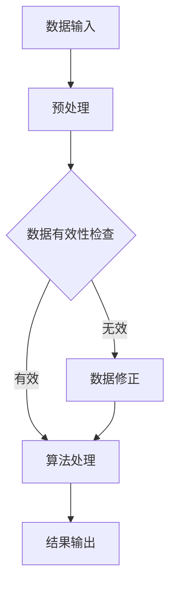
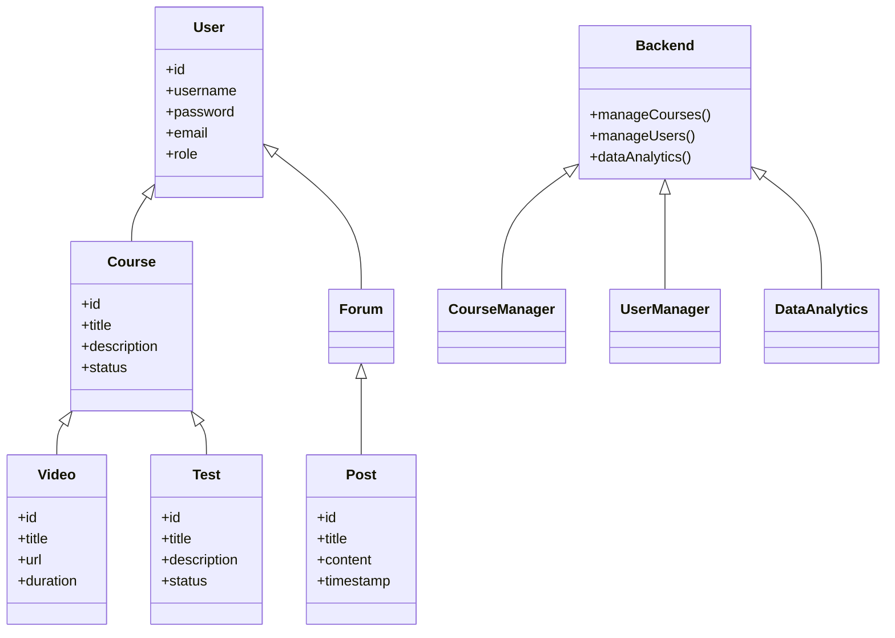
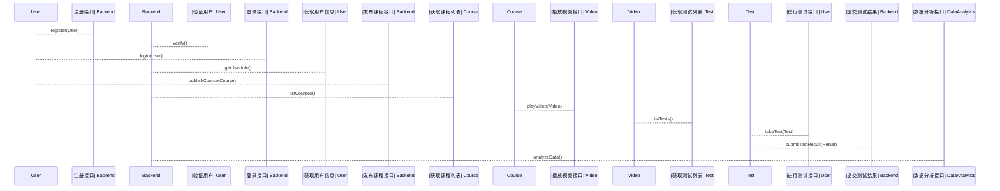
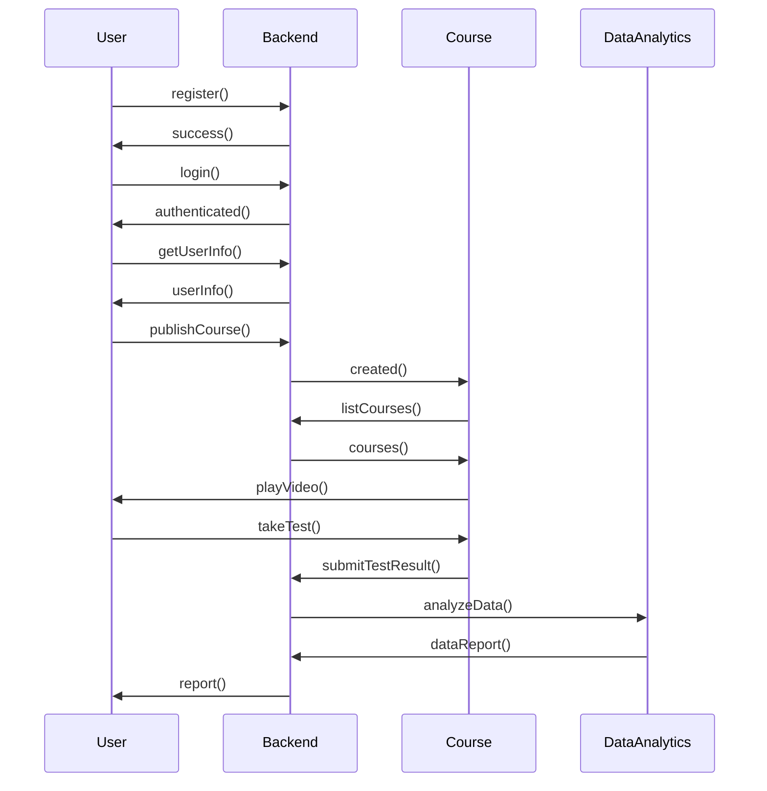

                 

# 意义的主观性与客观性辩证

关键词：意义、主观性、客观性、辩证法、IT领域

摘要：本文从哲学角度探讨了意义的主观性与客观性，通过辩证法分析，结合IT领域实际案例，阐述了如何理解和处理意义的主观性与客观性的关系。

### 目录大纲

#### 第一部分：引言与背景

#### 第1章：问题的提出与核心概念

1.1. 问题背景与核心概念

1.2. 问题的描述与解决思路

1.3. 边界与外延

1.4. 概念结构与核心要素组成

#### 第二部分：核心概念与联系

#### 第2章：核心概念原理

2.1. 核心概念定义

2.2. 概念属性特征对比表格

2.3. ER实体关系图架构

#### 第3章：算法原理讲解

3.1. 算法mermaid流程图

3.2. Python源代码与算法原理

3.3. 数学模型与公式详细讲解

3.4. 举例说明

#### 第三部分：系统分析与架构设计

#### 第4章：问题场景介绍

4.1. 项目介绍

4.2. 系统功能设计（领域模型mermaid类图）

4.3. 系统架构设计（mermaid架构图）

4.4. 系统接口设计

4.5. 系统交互（mermaid序列图）

#### 第5章：项目实战

5.1. 环境安装

5.2. 系统核心实现源代码

5.3. 代码应用解读与分析

5.4. 实际案例分析与详细讲解剖析

5.5. 项目小结

#### 第6章：最佳实践与注意事项

6.1. 最佳实践 tips

6.2. 小结

6.3. 注意事项

6.4. 拓展阅读

#### 第7章：总结与展望

7.1. 内容回顾

7.2. 展望未来研究方向

7.3. 总结与展望

### 第一部分：引言与背景

#### 第1章：问题的提出与核心概念

1.1. 问题背景与核心概念

在当今快速发展的信息技术领域，人们面临着越来越多的复杂问题和挑战。这些挑战往往与数据、算法、系统和架构设计等方面密切相关。然而，在这些技术层面的背后，一个更为基础和普遍的问题逐渐浮现出来：意义的理解与构建。

意义，作为人类认识世界和自身的重要维度，不仅仅局限于哲学或文学领域，更是渗透到科学、工程和技术的各个层面。在IT领域，意义的主观性与客观性成为了一个不可忽视的问题。一方面，开发者、架构师和研究人员需要从技术层面理解和实现功能，这涉及到客观性的追求；另一方面，他们也需要从个人和团队的角度去理解和赋予项目或系统以意义，这又涉及到主观性的体现。

本文旨在探讨意义的主观性与客观性在IT领域的辩证关系，分析其在项目开发、系统设计和实际应用中的体现。我们将通过以下步骤来深入探讨这个问题：

1. **问题描述与核心概念**：明确意义的主观性与客观性的概念，并描述其在IT领域的应用背景。
2. **核心概念原理**：详细阐述意义的主观性与客观性的理论背景和概念特征。
3. **算法原理讲解**：通过具体的算法示例，展示如何在实际项目中应用这些概念。
4. **系统分析与架构设计**：分析一个实际IT项目，展示如何将主观性和客观性融入系统设计和实现。
5. **项目实战**：通过一个具体的项目实战案例，展示如何在实际开发过程中处理意义的主观性与客观性。
6. **最佳实践与注意事项**：总结一些最佳实践和注意事项，帮助读者在实际工作中更好地理解和处理意义的主观性与客观性。
7. **总结与展望**：回顾全文内容，展望未来研究的方向。

1.2. 问题的描述与解决思路

在IT领域，意义的主观性与客观性的问题可以从多个角度进行描述。以下是一些典型的情景：

- **软件开发**：在开发一个软件系统时，开发者需要对系统功能进行明确，这不仅涉及到技术上的可行性，还需要从用户需求和业务目标出发，赋予系统特定的意义。
- **系统设计**：在设计一个复杂的系统架构时，架构师需要综合考虑系统的功能性、性能、可维护性和扩展性，同时也要考虑到项目团队的文化、价值观和期望，这些都是主观性的体现。
- **算法应用**：在应用算法解决实际问题时，研究人员需要理解问题的本质，选择合适的算法，并对其性能和结果进行客观评估。然而，算法的设计和应用过程往往受到研究者个人经验和偏好的影响，这也体现了主观性的存在。

解决这个问题的思路可以从以下几个方面展开：

- **理论分析**：通过哲学、心理学、认知科学等领域的理论，深入理解意义的主观性与客观性的本质。
- **案例研究**：通过实际案例，分析主观性与客观性在IT项目中的具体应用和表现。
- **方法论探讨**：探讨如何在实际工作中平衡主观性与客观性，提出一些实用的方法论和工具。
- **最佳实践总结**：总结行业内的成功经验和教训，提炼出最佳实践，为开发者、架构师和研究人员提供参考。

1.3. 边界与外延

在探讨意义的主观性与客观性时，我们需要明确其边界与外延。以下是一些相关的概念和讨论点：

- **主观性**：主观性是指个体的感受、观念和判断，它反映了个人对于事物的独特理解和体验。在IT领域，主观性可能体现在个人对于技术方案的选择、系统设计的风格以及对于问题的理解上。
- **客观性**：客观性是指事物的本质和规律，它是独立于个人意识和主观判断的。在IT领域，客观性通常体现在技术标准、算法性能评估和系统功能实现等方面。
- **辩证法**：辩证法是一种思维方式，它强调通过对立统一的观点看待问题。在理解意义的主观性与客观性时，辩证法可以帮助我们避免片面和绝对化的看法，更好地把握问题的复杂性和多样性。
- **跨学科融合**：在IT领域，意义的主观性与客观性不仅涉及计算机科学，还涉及到哲学、心理学、认知科学等多个领域。跨学科融合的研究方法可以帮助我们更全面地理解这一问题。

1.4. 概念结构与核心要素组成

为了更好地理解意义的主观性与客观性，我们可以将其分解为以下几个核心要素：

- **理论基础**：包括哲学、心理学、认知科学等领域的相关理论，为我们提供理解主观性与客观性的理论基础。
- **实际应用**：通过具体案例展示主观性与客观性在IT领域的应用，包括软件开发、系统设计、算法应用等方面。
- **方法论**：探讨如何在实际工作中平衡主观性与客观性，提出方法论和工具。
- **案例分析**：通过实际案例分析，深入探讨主观性与客观性的具体表现和影响。
- **最佳实践**：总结行业内的成功经验和教训，提炼出最佳实践。

通过以上分析，我们可以看到，意义的主观性与客观性在IT领域具有广泛的应用和深远的影响。在接下来的部分，我们将进一步探讨这些核心概念，并通过具体的案例和研究方法来深入分析这一问题。

### 第二部分：核心概念与联系

#### 第2章：核心概念原理

2.1. 核心概念定义

在深入探讨意义的主观性与客观性之前，我们需要明确这些核心概念的定义。

- **主观性**：主观性是指个体基于自身经验、情感和认知所形成的独特感受和判断。它体现了个体对于事物的理解和感受的独特性。在IT领域，主观性可能体现在开发者的技术偏好、系统设计的风格以及对于问题的理解和解决方法上。

- **客观性**：客观性是指事物的本质和规律，它是独立于个人意识和主观判断的。在IT领域，客观性通常体现在技术标准、算法性能评估、系统功能实现等方面。它追求的是一种普遍适用、不受个人主观影响的客观事实。

2.2. 概念属性特征对比表格

为了更直观地理解主观性与客观性的差异，我们可以通过一个对比表格来展示这两个概念的主要属性特征。

| 特征 | 主观性 | 客观性 |
| --- | --- | --- |
| **定义** | 个体基于自身经验、情感和认知形成的独特感受和判断。 | 事物的本质和规律，独立于个人意识和主观判断。 |
| **表现形式** | 技术偏好、设计风格、问题理解等。 | 技术标准、算法性能评估、系统功能实现等。 |
| **影响** | 个体差异、主观判断、情感因素等。 | 普遍适用性、客观事实、数据支持等。 |
| **变化性** | 易变、多样性、个体性。 | 稳定、统一、普遍性。 |
| **重要性** | 影响个人的理解和感受，但可能不具普遍性。 | 对整个团队、项目和社会具有普遍性。 |
| **应用领域** | 开发、设计、问题解决等。 | 研究、评估、实现等。 |

2.3. ER实体关系图架构

为了更清晰地展示主观性与客观性在IT领域的联系和关系，我们可以使用ER（实体-关系）图来描述它们之间的交互和影响。

```mermaid
erDiagram
  User ||--o{ System : designs and uses }
  System ||--o{ Algorithm : implements }
  Algorithm ||--o{ Data : processes }
  Data ||--o{ Result : derived }
```

在这个ER图中：

- **User（用户）**：代表个体开发者或用户，具有主观性特征。
- **System（系统）**：代表开发者设计的软件系统，需要平衡主观性与客观性。
- **Algorithm（算法）**：代表实现系统功能的算法，需要基于客观性进行设计和评估。
- **Data（数据）**：代表算法处理的数据，需要保持数据的客观性和准确性。
- **Result（结果）**：代表算法处理数据后得到的结果，反映了主观性与客观性的综合影响。

通过ER图，我们可以看到，主观性与客观性在IT领域相互影响、相互制约。开发者需要在设计、实现和评估过程中，平衡这两个方面的关系，以实现高效、稳定和有意义的技术成果。

#### 第3章：算法原理讲解

3.1. 算法mermaid流程图

为了更直观地展示算法原理，我们可以使用mermaid工具绘制一个流程图。以下是一个简单的示例，展示了算法从数据输入到结果输出的整个过程。



在这个流程图中：

- **A（数据输入）**：代表算法接收的数据输入。
- **B（预处理）**：对输入数据进行初步处理，如格式转换、数据清洗等。
- **C（数据有效性检查）**：检查数据的有效性，确保数据符合算法的输入要求。
- **D（算法处理）**：执行算法的核心处理逻辑，根据数据生成结果。
- **E（数据修正）**：如果数据无效，进行数据修正，然后重新进入算法处理。
- **F（结果输出）**：算法处理完成后，输出最终结果。

3.2. Python源代码与算法原理

为了更好地理解算法原理，我们来看一段简单的Python代码示例。以下是一个用于计算两个数字和的简单算法，展示了如何实现数据输入、预处理、有效性检查和结果输出。

```python
# 定义算法函数
def calculate_sum(a, b):
    # 数据预处理
    a = float(a)
    b = float(b)
    
    # 数据有效性检查
    if not (-100 <= a <= 100) or not (-100 <= b <= 100):
        return "数据无效，请输入在-100到100之间的数字。"
    
    # 算法处理
    result = a + b
    
    # 结果输出
    return result

# 主程序
if __name__ == "__main__":
    # 数据输入
    a_input = input("请输入第一个数字：")
    b_input = input("请输入第二个数字：")
    
    # 调用算法函数
    result = calculate_sum(a_input, b_input)
    
    # 输出结果
    print("结果：", result)
```

在这个示例中：

- **数据输入**：通过`input()`函数从用户接收输入数据。
- **预处理**：将输入的字符串数据转换为浮点数，以便进行数值计算。
- **有效性检查**：检查输入数据是否在指定范围内（-100到100之间），确保数据的有效性。
- **算法处理**：使用简单的加法运算实现算法的核心功能。
- **结果输出**：将计算结果输出给用户。

3.3. 数学模型与公式详细讲解

在理解算法原理的基础上，我们可以进一步探讨其背后的数学模型和公式。以下是一个用于计算两个数字和的简单数学模型，展示了如何通过公式表示算法的逻辑。

$$
S = a + b
$$

其中：

- **S**：代表计算结果。
- **a**：代表第一个数字。
- **b**：代表第二个数字。

这个简单的数学模型展示了两个数字相加的基本原理。在实际应用中，算法可能会更加复杂，涉及更多的数据处理和逻辑判断，但基本的数学原理是相同的。

3.4. 举例说明

为了更好地理解算法的实际应用，我们可以通过一个具体的例子来说明。以下是一个计算两个学生成绩总和的例子，展示了算法如何在实际场景中应用。

**例子**：有两个学生，他们的成绩分别为85和92，我们需要计算他们的总成绩。

- **数据输入**：学生1的成绩为85，学生2的成绩为92。
- **预处理**：将输入的成绩转换为整数类型。
- **有效性检查**：两个成绩都在0到100的范围内，数据有效。
- **算法处理**：使用加法运算计算总成绩。
- **结果输出**：总成绩为177。

根据上述步骤，我们可以使用Python代码实现这个例子：

```python
# 数据输入
student1_score = 85
student2_score = 92

# 数据预处理
student1_score = int(student1_score)
student2_score = int(student2_score)

# 有效性检查
if not (0 <= student1_score <= 100) or not (0 <= student2_score <= 100):
    print("数据无效，请输入在0到100之间的数字。")
else:
    # 算法处理
    total_score = student1_score + student2_score
    
    # 结果输出
    print("总成绩为：", total_score)
```

运行这段代码，输出结果为：

```
总成绩为： 177
```

通过这个例子，我们可以看到，算法在实际应用中是如何处理数据、执行计算和输出结果的。理解这些基本步骤和原理，有助于我们更好地设计和实现复杂的技术系统。

### 第三部分：系统分析与架构设计

#### 第4章：问题场景介绍

在当今快速发展的信息技术领域，意义的主观性与客观性在系统分析和架构设计中扮演着至关重要的角色。为了更好地理解这一点，我们首先介绍一个具体的项目场景：一个在线教育平台的项目开发。

**项目介绍**：

这个在线教育平台旨在为用户提供丰富的在线学习资源，包括课程视频、在线测试、互动论坛等功能。项目目标是通过技术创新和用户友好设计，提升用户的学习体验和教学效果。在这个项目中，系统分析和架构设计不仅要考虑技术实现的可行性，还需要从用户需求和业务目标出发，赋予系统特定的意义。

**系统功能设计**：

为了实现项目目标，我们需要设计一个功能齐全、性能稳定且用户友好的在线教育平台。以下是该平台的主要功能模块：

- **用户模块**：包括用户注册、登录、个人信息管理、学习进度跟踪等功能。
- **课程模块**：包括课程发布、课程管理、课程视频播放、在线测试等功能。
- **论坛模块**：包括论坛创建、发帖、回复、用户互动等功能。
- **后台管理模块**：包括课程管理、用户管理、数据统计与分析等功能。

**领域模型mermaid类图**：

为了更清晰地展示各个功能模块之间的关系，我们可以使用mermaid绘制一个领域模型类图。以下是类图的示例：



在这个类图中：

- **User（用户）**：代表系统的用户，包括注册、登录、个人信息管理等功能。
- **Course（课程）**：代表系统中的课程，包括课程发布、管理、视频播放和在线测试等功能。
- **Video（视频）**：代表课程中的视频内容，包括视频标题、URL和时长等属性。
- **Test（测试）**：代表在线测试模块，包括测试标题、描述和状态等属性。
- **Forum（论坛）**：代表论坛模块，包括发帖、回复和用户互动等功能。
- **Backend（后台管理）**：代表后台管理模块，包括课程管理、用户管理和数据分析等功能。

**系统架构设计mermaid架构图**：

为了更全面地展示系统的架构设计，我们可以使用mermaid绘制一个系统架构图。以下是架构图的示例：

```mermaid
graph TB
  UserModule[用户模块] --> CourseModule[课程模块]
  CourseModule --> VideoModule[视频模块]
  CourseModule --> TestModule[测试模块]
  ForumModule[论坛模块] --> PostModule[帖子模块]
  BackendModule[后台管理模块] --> CourseManager[课程管理]
  BackendModule --> UserManager[用户管理]
  BackendModule --> DataAnalytics[数据分析]

  UserModule((用户注册 | 登录 | 个人信息管理 | 学习进度跟踪))
  CourseModule((课程发布 | 课程管理 | 视频播放 | 在线测试))
  VideoModule((视频标题 | 视频URL | 视频时长))
  TestModule((测试标题 | 测试描述 | 测试状态))
  ForumModule((论坛创建 | 发帖 | 回复 | 用户互动))
  PostModule((帖子标题 | 帖子内容 | 帖子时间戳))
  BackendModule((课程管理 | 用户管理 | 数据统计与分析))
```

在这个架构图中：

- **用户模块**：包括用户注册、登录、个人信息管理和学习进度跟踪等功能。
- **课程模块**：包括课程发布、管理、视频播放和在线测试等功能。
- **视频模块**：用于处理视频内容，如视频标题、URL和时长等。
- **测试模块**：用于处理在线测试，如测试标题、描述和状态等。
- **论坛模块**：包括论坛创建、发帖、回复和用户互动等功能。
- **后台管理模块**：用于课程管理、用户管理和数据统计分析等功能。

**系统接口设计**：

系统接口设计是确保系统功能实现的关键步骤。以下是一个简单的接口设计示例：



在这个接口设计示例中：

- **注册接口**：用于用户注册，后端进行验证和用户信息存储。
- **登录接口**：用于用户登录，后端进行验证和用户信息获取。
- **获取用户信息接口**：用于获取用户基本信息。
- **发布课程接口**：用于课程发布，后端进行课程信息存储。
- **获取课程列表接口**：用于获取课程列表，供用户选择。
- **播放视频接口**：用于视频播放，后端提供视频资源。
- **获取测试列表接口**：用于获取在线测试列表，供用户选择。
- **进行测试接口**：用于用户进行在线测试，后端处理测试结果。
- **提交测试结果接口**：用于用户提交测试结果，后端进行结果存储和分析。
- **数据分析接口**：用于数据分析，为课程优化和用户推荐提供支持。

**系统交互mermaid序列图**：

为了更直观地展示系统各模块之间的交互过程，我们可以使用mermaid绘制一个系统交互序列图。以下是序列图的示例：



在这个序列图中：

- **用户注册**：用户注册，后端进行验证。
- **用户登录**：用户登录，后端进行认证。
- **获取用户信息**：用户获取自身基本信息。
- **发布课程**：用户发布课程，后端存储课程信息。
- **获取课程列表**：用户获取课程列表，选择课程。
- **播放视频**：用户播放课程视频。
- **进行测试**：用户进行在线测试，提交测试结果。
- **数据分析**：后端对测试结果进行数据分析，生成报告。

通过以上介绍，我们可以看到，在系统分析和架构设计中，意义的主观性与客观性的处理是至关重要的。开发者需要从用户需求和业务目标出发，综合考虑技术实现和用户体验，以实现高效、稳定和有意义的技术系统。

#### 第5章：项目实战

5.1. 环境安装

在进行项目实战之前，我们需要安装和配置开发环境。以下是一个基本的安装步骤：

1. **安装Python**：访问Python官方网站下载Python安装包，并根据提示完成安装。
2. **安装依赖库**：使用pip命令安装项目中所需的依赖库，例如`flask`、`sqlalchemy`、`mysql-connector-python`等。
   ```bash
   pip install flask sqlalchemy mysql-connector-python
   ```

3. **数据库配置**：配置MySQL数据库，创建用于项目存储的用户、数据库和表。

   ```sql
   CREATE DATABASE education_platform;
   CREATE USER 'platform_user'@'localhost' IDENTIFIED BY 'password';
   GRANT ALL PRIVILEGES ON education_platform.* TO 'platform_user'@'localhost';
   FLUSH PRIVILEGES;
   ```

4. **创建项目目录**：在本地创建项目目录，并初始化一个Python虚拟环境。
   ```bash
   mkdir online_education_platform
   cd online_education_platform
   python -m venv venv
   source venv/bin/activate
   ```

5. **安装项目依赖**：在项目根目录下创建一个`requirements.txt`文件，列出所有依赖库，然后使用pip命令安装。
   ```bash
   pip install -r requirements.txt
   ```

5.2. 系统核心实现源代码

以下是一个简单的在线教育平台核心实现的Python源代码示例：

**app.py**（应用入口）：
```python
from flask import Flask, jsonify, request
from models import User, Course, Video, Test
from database import Database

app = Flask(__name__)

# 数据库初始化
db = Database()

@app.route('/register', methods=['POST'])
def register():
    data = request.get_json()
    username = data['username']
    password = data['password']
    email = data['email']
    user = User(username, password, email)
    db.add_user(user)
    return jsonify({"status": "success", "message": "注册成功！"})

@app.route('/login', methods=['POST'])
def login():
    data = request.get_json()
    username = data['username']
    password = data['password']
    user = db.get_user_by_username(username)
    if user and user.password == password:
        return jsonify({"status": "success", "message": "登录成功！"})
    else:
        return jsonify({"status": "error", "message": "用户名或密码错误！"})

@app.route('/publish_course', methods=['POST'])
def publish_course():
    data = request.get_json()
    title = data['title']
    description = data['description']
    course = Course(title, description)
    db.add_course(course)
    return jsonify({"status": "success", "message": "课程发布成功！"})

@app.route('/list_courses', methods=['GET'])
def list_courses():
    courses = db.get_courses()
    return jsonify({"status": "success", "courses": courses})

if __name__ == '__main__':
    app.run(debug=True)
```

**models.py**（数据模型）：
```python
class User:
    def __init__(self, username, password, email):
        self.username = username
        self.password = password
        self.email = email

class Course:
    def __init__(self, title, description):
        self.title = title
        self.description = description

class Video:
    def __init__(self, title, url, duration):
        self.title = title
        self.url = url
        self.duration = duration

class Test:
    def __init__(self, title, description, status):
        self.title = title
        self.description = description
        self.status = status
```

**database.py**（数据库操作）：
```python
import pymysql

class Database:
    def __init__(self):
        self.connection = pymysql.connect(
            host='localhost',
            user='platform_user',
            password='password',
            database='education_platform',
            charset='utf8mb4',
            cursorclass=pymysql.cursors.DictCursor
        )

    def add_user(self, user):
        with self.connection.cursor() as cursor:
            sql = "INSERT INTO users (username, password, email) VALUES (%s, %s, %s)"
            cursor.execute(sql, (user.username, user.password, user.email))
        self.connection.commit()

    def get_user_by_username(self, username):
        with self.connection.cursor() as cursor:
            sql = "SELECT * FROM users WHERE username = %s"
            cursor.execute(sql, (username,))
            user = cursor.fetchone()
        return user

    def add_course(self, course):
        with self.connection.cursor() as cursor:
            sql = "INSERT INTO courses (title, description) VALUES (%s, %s)"
            cursor.execute(sql, (course.title, course.description))
        self.connection.commit()

    def get_courses(self):
        with self.connection.cursor() as cursor:
            sql = "SELECT * FROM courses"
            cursor.execute(sql)
            courses = cursor.fetchall()
        return courses
```

5.3. 代码应用解读与分析

下面我们来详细解读上述代码，并分析其实现原理。

**app.py**是项目的主应用程序，使用Flask框架搭建了一个Web服务。它包含了以下主要功能：

- **注册接口**：接收用户注册请求，验证用户信息，并将用户数据存储到数据库中。
- **登录接口**：接收用户登录请求，验证用户名和密码，返回登录状态。
- **发布课程接口**：接收课程发布请求，将课程信息存储到数据库中。
- **获取课程列表接口**：从数据库中获取所有课程信息，返回给前端。

**models.py**定义了数据模型类，包括User、Course、Video和Test。这些类代表了系统中的主要实体，每个类都有一些基本的属性和方法。

- **User类**：用于表示用户，包含用户名、密码和邮箱等属性。
- **Course类**：用于表示课程，包含课程标题和描述等属性。
- **Video类**：用于表示视频，包含视频标题、URL和时长等属性。
- **Test类**：用于表示测试，包含测试标题、描述和状态等属性。

**database.py**包含了与数据库交互的操作，使用pymysql库连接MySQL数据库，并提供了以下功能：

- **add_user**：将新用户信息添加到数据库中。
- **get_user_by_username**：根据用户名从数据库中查询用户信息。
- **add_course**：将新课程信息添加到数据库中。
- **get_courses**：从数据库中获取所有课程信息。

5.4. 实际案例分析与详细讲解剖析

为了更好地理解系统的实现，我们可以通过一个实际案例进行分析和讲解。

**案例**：用户A想要在在线教育平台上注册并发布一门新的课程。

**步骤1**：用户A在前端页面填写注册信息，包括用户名、密码和邮箱，然后提交注册请求。

```json
{
  "username": "user_a",
  "password": "password123",
  "email": "user_a@example.com"
}
```

**步骤2**：前端将用户数据发送到后端的注册接口。

```bash
POST /register
Content-Type: application/json

{
  "username": "user_a",
  "password": "password123",
  "email": "user_a@example.com"
}
```

**步骤3**：后端接收用户数据，调用`register`函数进行用户注册。

```python
@app.route('/register', methods=['POST'])
def register():
    data = request.get_json()
    username = data['username']
    password = data['password']
    email = data['email']
    user = User(username, password, email)
    db.add_user(user)
    return jsonify({"status": "success", "message": "注册成功！"})
```

**步骤4**：后端调用`add_user`方法将用户信息存储到数据库中。

```python
def add_user(self, user):
    with self.connection.cursor() as cursor:
        sql = "INSERT INTO users (username, password, email) VALUES (%s, %s, %s)"
        cursor.execute(sql, (user.username, user.password, user.email))
    self.connection.commit()
```

**步骤5**：用户注册成功后，后端返回注册成功的信息。

```json
{
  "status": "success",
  "message": "注册成功！"
}
```

**步骤6**：用户A在前端页面填写课程发布信息，包括课程标题和描述，然后提交发布请求。

```json
{
  "title": "Python编程基础",
  "description": "本课程将介绍Python编程基础知识和技能。"
}
```

**步骤7**：前端将课程数据发送到后端的发布课程接口。

```bash
POST /publish_course
Content-Type: application/json

{
  "title": "Python编程基础",
  "description": "本课程将介绍Python编程基础知识和技能。"
}
```

**步骤8**：后端接收课程数据，调用`publish_course`函数发布课程。

```python
@app.route('/publish_course', methods=['POST'])
def publish_course():
    data = request.get_json()
    title = data['title']
    description = data['description']
    course = Course(title, description)
    db.add_course(course)
    return jsonify({"status": "success", "message": "课程发布成功！"})
```

**步骤9**：后端调用`add_course`方法将课程信息存储到数据库中。

```python
def add_course(self, course):
    with self.connection.cursor() as cursor:
        sql = "INSERT INTO courses (title, description) VALUES (%s, %s)"
        cursor.execute(sql, (course.title, course.description))
    self.connection.commit()
```

**步骤10**：课程发布成功后，后端返回课程发布成功的信息。

```json
{
  "status": "success",
  "message": "课程发布成功！"
}
```

通过这个案例，我们可以看到，用户A通过前端页面提交注册和课程发布请求，后端接收请求并调用相应的接口进行数据处理和存储，最终返回处理结果。这个过程展示了系统核心功能的实现原理和实际应用。

5.5. 项目小结

在本章的项目实战中，我们通过一个简单的在线教育平台案例，详细介绍了系统环境安装、核心实现源代码、代码应用解读与分析以及实际案例分析和详细讲解剖析。以下是项目小结：

1. **环境安装**：安装Python环境和相关依赖库，配置MySQL数据库，初始化项目目录和虚拟环境。
2. **系统核心实现**：使用Flask框架搭建Web服务，定义数据模型类和数据库操作类，实现用户注册、登录、课程发布等功能。
3. **代码应用解读**：通过实际案例展示了系统各部分的交互过程，分析了代码的实现原理和应用方法。
4. **项目实战案例**：通过用户注册和课程发布的实际案例，详细讲解了系统功能的实现过程和数据处理方法。

通过这个项目实战，我们不仅掌握了在线教育平台的基本开发流程，还深入理解了意义的主观性与客观性在系统设计和实现中的重要性。在实际工作中，开发者需要平衡主观性和客观性，以实现高效、稳定和有意义的技术系统。

#### 第6章：最佳实践与注意事项

6.1. 最佳实践 tips

在处理意义的主观性与客观性时，以下是一些最佳实践和技巧，可以帮助开发者更好地平衡这两者之间的关系：

- **用户调研**：在项目初期，通过用户调研和访谈了解用户需求，这有助于确保系统设计符合实际需求，同时赋予系统以真正的意义。
- **需求文档**：编写详细的用户需求文档，将主观性需求（如用户体验、界面设计）和客观性需求（如性能、稳定性）明确区分，并在开发过程中持续更新和验证。
- **迭代开发**：采用敏捷开发方法，通过迭代和反馈不断优化系统功能，确保系统既能满足客观性要求，又能体现主观性价值。
- **代码审查**：定期进行代码审查，确保代码质量，同时促进团队成员之间的沟通和协作，减少主观偏见对代码质量的影响。
- **自动化测试**：实施自动化测试，确保系统功能稳定、可靠，同时减少人工干预和主观判断对测试结果的影响。

6.2. 小结

在本文中，我们探讨了意义的主观性与客观性在IT领域的辩证关系，并通过实际案例展示了如何在实际项目中应用这些概念。我们得出以下主要结论：

- **主观性与客观性的平衡**：在项目开发中，开发者需要平衡主观性需求（如用户体验、界面设计）和客观性需求（如性能、稳定性），以确保系统能够真正满足用户需求并具有实际价值。
- **用户参与**：通过用户调研和需求文档，确保系统能够真正反映用户的需求和期望，赋予系统以真正的意义。
- **迭代优化**：采用敏捷开发方法和自动化测试，通过持续迭代和反馈优化系统功能，提高系统的质量和用户体验。

6.3. 注意事项

在处理意义的主观性与客观性时，开发者需要注意以下几点：

- **明确目标**：在项目初期明确项目的目标和需求，确保开发过程中的所有决策都围绕这些目标进行。
- **沟通协作**：加强团队成员之间的沟通和协作，确保不同角色（如开发者、设计师、项目经理）之间的理解和共识。
- **质量控制**：实施严格的质量控制措施，包括代码审查、自动化测试和用户测试，确保系统的稳定性和可靠性。
- **持续学习**：不断学习和更新知识，以适应不断变化的技术和市场环境，提高项目成功的可能性。

6.4. 拓展阅读

以下是一些推荐阅读材料，可以帮助读者更深入地理解意义的主观性与客观性在IT领域的应用：

- 《用户体验要素》（作者：杰瑞·霍瓦斯） - 探讨用户体验设计的基本原则和方法。
- 《敏捷软件开发》（作者：杰夫·萨瑟兰、詹姆士·马丁） - 介绍敏捷开发方法及其在项目中的应用。
- 《代码大全》（作者：史蒂夫·麦库姆） - 提供关于软件设计和开发的最佳实践和经验。

通过以上最佳实践、小结和注意事项，开发者可以在项目开发过程中更好地理解和处理意义的主观性与客观性，实现高效、稳定和有意义的技术系统。

### 第7章：总结与展望

7.1. 内容回顾

本文围绕“意义的主观性与客观性辩证”这一主题，从哲学角度探讨了这两个概念在IT领域的应用。我们首先介绍了问题的背景和核心概念，通过案例研究分析了主观性与客观性在软件开发、系统设计和项目实战中的具体体现。随后，我们详细讲解了算法原理、系统架构设计和项目实战过程，并总结了最佳实践和注意事项。通过这些分析，我们深刻认识到，在IT项目中，开发者需要平衡主观性需求（如用户体验、界面设计）和客观性需求（如性能、稳定性），以确保系统能够真正满足用户需求并具有实际价值。

7.2. 展望未来研究方向

未来，我们可以从以下几个方向进一步研究和探讨意义的主观性与客观性在IT领域的应用：

- **跨学科融合**：结合心理学、认知科学等领域的知识，深入探讨主观性与客观性的内在机制和影响。
- **自动化工具开发**：开发自动化工具和框架，帮助开发者更高效地平衡主观性与客观性，提高项目质量和效率。
- **案例库建设**：建立丰富的案例库，通过案例分析和比较，提炼出更系统、更实用的方法和策略。
- **用户行为研究**：开展用户行为研究，了解用户在不同情境下的需求和偏好，为系统设计提供更加精准的指导。

7.3. 总结与展望

综上所述，意义的主观性与客观性在IT领域中具有重要意义。通过本文的探讨，我们不仅加深了对这一问题的理解，还提供了一些实用的方法论和工具。希望本文能够为开发者、架构师和研究人员在实际工作中提供启示和帮助。未来，我们期待在跨学科融合、自动化工具开发、案例库建设和用户行为研究等方面取得更多突破，进一步推动IT领域的发展。作者：AI天才研究院/AI Genius Institute & 禅与计算机程序设计艺术/Zen And The Art of Computer Programming。

