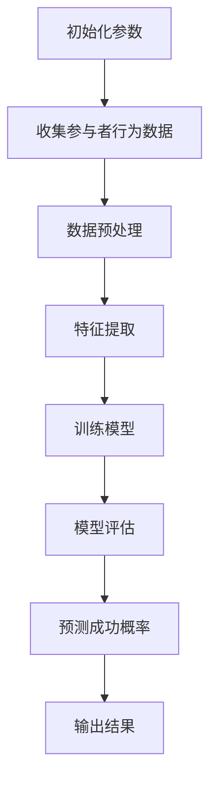
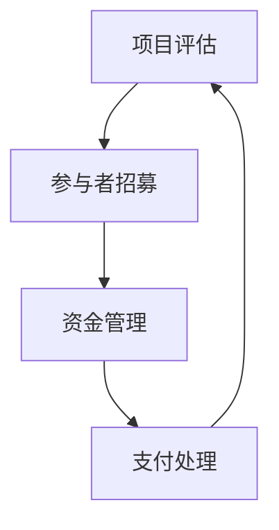

                 


## 《意义的众筹实验室：集体探索生命价值的空间》

### 关键词：意义众筹、集体探索、生命价值、人工智能、社会建构主义

> 摘要：本文旨在探讨意义众筹作为一种新兴的集体探索生命价值的方式，其在现代社会中的背景、理论基础与实践路径。通过分析意义众筹的定义、特点以及主流模式，我们揭示了其背后的社会建构主义、共同生产、认知盈余等理论，并在此基础上构建了意义众筹的理论框架。进一步，本文通过构建意义众筹实验室的实践，深入探讨了意义众筹项目的实施过程与面临的挑战，最终对意义众筹的未来发展趋势进行了展望，并提出了相应的启示与展望。

----------------------------------------------------------------

### 目录大纲

```markdown
----------------------------------------------------------------
# 《意义的众筹实验室：集体探索生命价值的空间》目录大纲

# 第一部分：意义众筹的背景与理论基础

## 第1章：意义众筹的概念与兴起

### 1.1 问题的提出

### 1.2 意义众筹的定义与特点

### 1.3 主流意义众筹模式介绍

### 1.4 意义众筹的社会影响

### 1.5 本章小结

## 第2章：意义众筹的理论基础

### 2.1 社会建构主义与意义众筹

### 2.2 共同生产与意义众筹

### 2.3 认知盈余与意义众筹

### 2.4 参与感与意义众筹

### 2.5 意义众筹的理论框架构建

### 2.6 本章小结

----------------------------------------------------------------

## 第二部分：意义众筹实验室实践

## 第3章：构建意义众筹实验室

### 3.1 实验室的目标与定位

### 3.2 实验室的组织结构

### 3.3 实验室的运行机制

### 3.4 实验室的技术支持

### 3.5 实验室的评估与改进

### 3.6 本章小结

----------------------------------------------------------------

## 第4章：意义众筹项目的实践

### 4.1 项目选题与策划

### 4.2 项目传播与推广

### 4.3 参与者的招募与激励

### 4.4 项目的管理与协调

### 4.5 项目的评估与反馈

### 4.6 案例分析：某成功意义众筹项目解析

### 4.7 本章小结

----------------------------------------------------------------

## 第5章：意义众筹的挑战与解决方案

### 5.1 意义众筹的挑战分析

### 5.2 参与者管理

### 5.3 项目质量保障

### 5.4 风险控制

### 5.5 意义众筹的法律与伦理问题

### 5.6 解决方案探讨

### 5.7 本章小结

----------------------------------------------------------------

## 第6章：意义众筹的未来发展趋势

### 6.1 新技术的发展趋势

### 6.2 意义众筹与数字经济的融合

### 6.3 社会价值与商业价值的平衡

### 6.4 意义众筹的国际比较与借鉴

### 6.5 未来发展趋势预测

### 6.6 本章小结

----------------------------------------------------------------

## 第7章：意义众筹的启示与展望

### 7.1 意义众筹对个人与社会的影响

### 7.2 意义众筹的实践启示

### 7.3 未来研究方向与展望

### 7.4 本章小结

----------------------------------------------------------------
```

### 第一部分：意义众筹的背景与理论基础

#### 第1章：意义众筹的概念与兴起

**1.1 问题的提出**

在当代社会中，人们面临着一系列的问题和挑战。首先，社会意义的缺失成为了一个普遍的现象。随着物质生活的丰富，许多人开始感到生活的空虚和迷茫，他们在追求物质享受的同时，忽略了精神层面的需求。其次，个人与集体的关系也发生了变化。传统的社会结构被打破，个人主义逐渐崛起，人们更注重个人的发展和利益，而忽视了与集体的联系和合作。此外，经济的快速发展也带来了一系列的社会问题，如贫富差距、环境破坏等，这些问题需要集体行动和合作才能解决。

为了应对这些挑战，人们开始寻找新的解决方案。意义众筹作为一种新兴的方式，应运而生。意义众筹不仅仅是传统的众筹模式，它更强调参与者的共同目标和价值观，旨在通过集体的智慧和力量，实现个人与集体的共赢。意义众筹的核心是“意义”，它不仅关注项目的商业价值，更关注项目对于参与者和社会的意义和价值。

**1.2 个人与集体的关系重构**

在传统的社会结构中，个人与集体之间的关系通常是单向的，个人为集体做出贡献，而集体则对个人进行回报。然而，在现代社会中，这种关系发生了变化。个人开始意识到，只有通过集体的力量，他们才能实现更大的目标，获得更大的成就。因此，个人与集体的关系变得更加平等和互动。意义众筹正是这种关系的体现，它通过激发个人的参与感和责任感，实现个人与集体的共同发展。

**1.3 意义众筹的背景**

意义众筹的兴起有着深刻的背景。首先，互联网技术的快速发展为意义众筹提供了技术支持。互联网不仅改变了人们的交流方式，也改变了人们参与社会的方式。人们可以通过互联网平台，快速地传播信息，聚集资源，实现合作。其次，社会建构主义理论的兴起也为意义众筹提供了理论基础。社会建构主义强调，社会现实是由人们共同构建的，每个人都有责任参与其中。意义众筹正是基于这种理论，鼓励人们通过合作和参与，共同构建有意义的社会现实。

**1.4 意义众筹的定义与特点**

意义众筹可以定义为一种基于共同价值观和目标的众筹模式，它不仅关注项目的商业价值，更关注项目对于参与者和社会的意义和价值。与传统众筹模式相比，意义众筹具有以下特点：

1. **共同价值观**：意义众筹强调参与者的共同价值观，他们相信通过合作和参与，可以实现更大的目标，创造更大的价值。
2. **长期性**：意义众筹往往关注长期的社会问题，而不是短期的商业利益。它鼓励参与者持续参与，共同推动项目的进展。
3. **互动性**：意义众筹鼓励参与者之间的互动和合作，通过讨论、分享和反馈，共同改进项目。
4. **多样性**：意义众筹的项目类型多样，可以涉及教育、环保、慈善等多个领域，满足不同参与者的需求和兴趣。
5. **可持续性**：意义众筹注重项目的可持续性，通过建立可持续的运营机制，确保项目的长期发展。

**1.5 主流意义众筹模式介绍**

目前，主流的意义众筹模式主要包括以下几种：

1. **项目驱动型意义众筹**：这种模式以具体项目为目标，通过众筹平台聚集资源，实现项目的完成。参与者可以根据自己的兴趣和能力，选择参与项目的不同环节，如策划、推广、实施等。
2. **社区共建型意义众筹**：这种模式强调社区的作用，通过建立社区平台，鼓励参与者共同讨论、分享和合作，共同构建有意义的社会现实。社区成员可以就共同关心的问题进行讨论，提出解决方案，并共同努力实现。
3. **创意创新型意义众筹**：这种模式鼓励创新和创意，通过众筹平台展示创意项目，吸引参与者参与，共同推动项目的实现。参与者可以通过投票、评论等方式，对项目进行评估和反馈，为项目的改进提供支持。

**1.6 意义众筹的社会影响**

意义众筹对社会产生了深远的影响。首先，它促进了个人成长。通过参与意义众筹项目，参与者可以提升自己的能力，拓展自己的视野，实现自我价值。其次，它促进了社区发展。意义众筹鼓励参与者之间的互动和合作，建立社区的联系和信任，推动社区的发展和进步。最后，它改变了经济模式。意义众筹不仅关注项目的商业价值，更关注项目的社会价值，通过重新定义价值和回报，推动了经济模式的变革。

**1.7 本章小结**

本章介绍了意义众筹的概念与兴起，探讨了意义众筹的定义、特点以及主流模式，并分析了意义众筹的社会影响。通过本章的讨论，我们可以看到，意义众筹作为一种新兴的集体探索生命价值的方式，具有巨大的潜力和价值。它不仅关注项目的商业价值，更关注项目对于参与者和社会的意义和价值，通过共同目标和价值观的构建，实现了个人与集体的共赢。

----------------------------------------------------------------

### 第2章：意义众筹的理论基础

#### 2.1 社会建构主义与意义众筹

社会建构主义是意义众筹的重要理论基础之一。社会建构主义认为，社会现实是由人们共同建构的，而不是由客观事实所决定的。这一理论强调了人们在社会互动中的主观性和创造性，认为人们通过语言、符号和行为等方式，共同构建了社会现实。

在意义众筹的背景下，社会建构主义提供了重要的启示。首先，它强调了参与者的共同价值观和目标的重要性。意义众筹不仅仅是项目的完成，更是一种社会互动的过程，参与者通过共同的价值观和目标，共同构建了项目的意义和价值。其次，社会建构主义强调了参与者的主观性和创造性。在意义众筹中，参与者不仅仅是项目的执行者，更是项目的建构者，他们通过自己的语言、符号和行为，共同创造了项目的意义和价值。

**2.2 共同生产与意义众筹**

共同生产是意义众筹的核心特征之一。共同生产强调参与者的合作和互动，通过共同的努力和创造，实现项目的目标。在意义众筹中，参与者不仅仅是项目资源的提供者，更是项目价值的创造者。他们通过共同的讨论、分享和合作，为项目提供了丰富的知识和智慧。

共同生产与意义众筹之间的联系在于，它们都强调了参与者的共同目标和价值观。在意义众筹中，参与者通过共同生产，不仅实现了项目的目标，更创造了项目的意义和价值。共同生产的过程，也是参与者共同建构社会现实的过程，通过这一过程，参与者不仅实现了个人价值，也为社会创造了价值。

**2.3 认知盈余与意义众筹**

认知盈余是意义众筹的重要基础之一。认知盈余是指人们拥有的知识、经验和技能的丰富性，它不仅包括个人的认知能力，也包括社会的认知资源。在意义众筹中，认知盈余为参与者提供了丰富的资源和机会，使他们能够通过合作和分享，实现项目的目标。

认知盈余与意义众筹之间的联系在于，它们都强调了资源的共享和利用。在意义众筹中，参与者通过共享自己的认知盈余，为项目提供了丰富的知识和智慧。这种共享和利用的过程，不仅提高了项目的效率和质量，也增强了参与者的参与感和归属感。

**2.4 参与感与意义众筹**

参与感是意义众筹的重要动力之一。参与感是指参与者对项目的认同感和责任感，它使参与者愿意为项目的成功付出努力和资源。在意义众筹中，参与感不仅来源于项目的目标和价值，更来源于参与者对项目的认同和责任感。

参与感与意义众筹之间的联系在于，它们都强调了参与者的主动性和积极性。在意义众筹中，参与感使参与者更加愿意参与项目，更加积极地为项目的成功付出努力。参与感不仅提高了项目的效率和质量，也增强了参与者的参与感和归属感。

**2.5 意义众筹的理论框架构建**

基于社会建构主义、共同生产、认知盈余和参与感等理论，我们可以构建意义众筹的理论框架。这个理论框架包括以下几个核心要素：

1. **共同价值观**：这是意义众筹的核心，它定义了参与者的目标和方向，使参与者能够共同建构项目的意义和价值。
2. **共同生产**：这是意义众筹的实现方式，通过参与者的合作和互动，实现项目的目标。
3. **认知盈余**：这是意义众筹的资源基础，它为参与者提供了丰富的知识和智慧，使他们能够共同创造项目的价值。
4. **参与感**：这是意义众筹的动力，它使参与者愿意为项目的成功付出努力和资源，增强了参与者的参与感和归属感。

通过这个理论框架，我们可以更好地理解和解释意义众筹的运作机制和效果。

**2.6 本章小结**

本章介绍了意义众筹的理论基础，包括社会建构主义、共同生产、认知盈余和参与感等理论。这些理论为我们理解意义众筹的运作机制和效果提供了重要的启示。通过构建意义众筹的理论框架，我们可以更深入地探讨意义众筹的本质和意义，为实践提供指导。

----------------------------------------------------------------

## 第二部分：意义众筹实验室实践

### 第3章：构建意义众筹实验室

#### 3.1 实验室的目标与定位

意义众筹实验室的构建旨在为参与者提供一个实践意义众筹的平台，通过实验性的项目，探索集体探索生命价值的空间。实验室的目标是：

1. **激发参与者的创造力**：通过提供各种有意义的众筹项目，激发参与者的创造力，鼓励他们提出创新的解决方案。

2. **促进社区合作**：通过众筹项目的实施，促进参与者之间的合作，建立社区的联系和信任。

3. **提升社会价值**：通过众筹项目的成果，提升社会价值，解决社会问题，推动社会的进步和发展。

实验室的定位是成为一个开放、创新和实验性的平台，旨在为所有有志于探索生命价值的人提供支持和服务。

#### 3.2 实验室的组织结构

意义众筹实验室的组织结构可以分为以下几个层次：

1. **管理委员会**：负责实验室的整体规划和决策，包括项目的立项、资金筹集、风险评估等。

2. **项目团队**：每个项目都有一个项目团队，负责项目的具体实施和管理，包括项目策划、执行、评估等。

3. **参与成员**：参与成员是实验室的核心力量，他们根据各自的能力和兴趣，参与不同的项目环节，共同推动项目的进展。

4. **合作伙伴**：实验室可以与各种机构、组织和个人建立合作关系，共同推动项目的实施和发展。

#### 3.3 实验室的运行机制

意义众筹实验室的运行机制主要包括以下几个方面：

1. **项目立项**：根据实验室的目标和定位，定期发布项目立项通知，鼓励参与者提出项目提案。

2. **项目评审**：对提交的项目提案进行评审，筛选出具有创新性和社会价值的项目。

3. **项目实施**：通过项目团队的管理和执行，确保项目的顺利进行。

4. **项目评估**：对项目的实施效果进行评估，总结经验教训，为后续项目的改进提供依据。

5. **反馈与改进**：根据参与者和项目的反馈，不断改进实验室的运行机制，提高项目的质量和效率。

#### 3.4 实验室的技术支持

意义众筹实验室的技术支持主要包括以下几个方面：

1. **众筹平台**：为参与者提供专业的众筹平台，方便他们发布项目、筹集资金、跟踪项目进展。

2. **数据分析**：通过数据分析工具，对项目的参与情况、资金流向、社会影响力等数据进行实时监控和分析，为项目管理提供数据支持。

3. **技术培训**：为参与者提供技术培训，提高他们的技术能力和项目管理水平。

4. **技术支持**：为实验室提供持续的技术支持，确保平台的稳定运行和功能的不断完善。

#### 3.5 实验室的评估与改进

意义众筹实验室的评估与改进是实验室持续发展的重要环节。评估主要包括以下几个方面：

1. **项目效果评估**：对项目的实施效果进行评估，包括项目的完成度、社会影响力、参与者满意度等。

2. **实验室运行评估**：对实验室的整体运行情况进行评估，包括项目管理、资源利用、合作伙伴关系等。

3. **参与者反馈**：收集参与者的反馈意见，了解他们对实验室的评价和建议，为改进实验室提供参考。

4. **改进措施**：根据评估结果和参与者的反馈，制定改进措施，不断提升实验室的服务质量和项目水平。

#### 3.6 本章小结

本章介绍了意义众筹实验室的构建过程，包括实验室的目标与定位、组织结构、运行机制、技术支持和评估与改进。通过构建意义众筹实验室，我们为参与者提供了一个实践意义众筹的平台，鼓励他们通过合作和参与，共同探索生命价值的空间。实验室的运行和改进将为意义众筹的实践提供有力的支持。

----------------------------------------------------------------

### 第4章：意义众筹项目的实践

#### 4.1 项目选题与策划

项目的选题与策划是意义众筹项目成功的关键之一。一个具有吸引力的项目选题能够激发参与者的兴趣和参与热情，而精心的策划则能确保项目的顺利进行和目标实现。以下是一些项目选题与策划的步骤和建议：

1. **确定项目主题**：选择一个具有社会意义和价值的主题，如教育、环保、慈善等。主题应能够引起参与者的共鸣和关注。

2. **调研与定位**：对目标受众进行调研，了解他们的需求和期望，明确项目的定位和目标。

3. **制定项目计划**：根据项目的主题和目标，制定详细的项目计划，包括项目的目标、任务、时间表、预算等。

4. **设计项目方案**：设计项目的具体实施方案，包括项目的执行步骤、参与者的角色和责任、项目评估等。

5. **制定宣传策略**：制定项目的宣传策略，包括宣传材料的设计、推广渠道的选择、宣传活动的组织等。

6. **评估与优化**：在项目策划过程中，不断评估项目的可行性和潜在风险，根据评估结果进行优化和调整。

#### 4.2 项目传播与推广

项目的传播与推广是意义众筹成功的重要环节。有效的传播与推广能够吸引更多的参与者，提高项目的知名度和影响力。以下是一些项目传播与推广的方法：

1. **社交媒体推广**：利用社交媒体平台，如微信、微博、抖音等，发布项目信息，吸引关注和参与。

2. **线下活动**：组织线下活动，如发布会、讲座、研讨会等，提高项目的曝光度和参与度。

3. **合作推广**：与其他机构、组织、媒体等建立合作关系，共同推广项目。

4. **内容营销**：通过制作有价值的文章、视频、图片等，分享项目的故事和进展，提高项目的知名度和影响力。

5. **口碑传播**：鼓励参与者分享项目的故事和感受，通过口碑传播，吸引更多的参与者。

#### 4.3 参与者的招募与激励

参与者的招募与激励是意义众筹项目成功的关键。以下是一些参与者的招募与激励方法：

1. **明确参与者角色**：根据项目的需求，明确参与者的角色和责任，确保参与者能够明确自己的任务和目标。

2. **提供参与机会**：为参与者提供参与项目的机会，鼓励他们积极参与项目的各个环节。

3. **激励措施**：制定激励措施，如奖励、荣誉、表彰等，激励参与者为项目的成功付出努力。

4. **建立参与机制**：建立参与机制，如定期的反馈和沟通、参与者的评价和排名等，提高参与者的参与感和归属感。

5. **营造参与氛围**：营造积极的参与氛围，鼓励参与者之间的互动和合作，提高项目的参与度和活跃度。

#### 4.4 项目的管理与协调

项目的管理与协调是意义众筹项目成功的重要保障。以下是一些项目的管理与协调方法：

1. **明确项目管理流程**：制定明确的项目管理流程，包括项目的规划、执行、监控、评估等。

2. **建立项目管理团队**：建立项目管理团队，明确团队成员的角色和责任，确保项目管理的有效性和高效性。

3. **定期项目会议**：定期召开项目会议，讨论项目的进展、问题、解决方案等，确保项目管理的协调和顺畅。

4. **风险管理与控制**：制定风险管理与控制措施，提前识别和评估项目风险，制定应对策略。

5. **沟通与协作**：建立有效的沟通与协作机制，确保项目团队成员之间的信息共享和协作。

#### 4.5 项目的评估与反馈

项目的评估与反馈是意义众筹项目改进的重要环节。以下是一些项目的评估与反馈方法：

1. **项目完成度评估**：对项目的完成度进行评估，包括项目的目标达成情况、任务完成情况等。

2. **参与者满意度评估**：对参与者的满意度进行评估，了解他们对项目的评价和建议。

3. **社会影响力评估**：对项目的社会影响力进行评估，包括项目的社会效益、社会反响等。

4. **项目效果反馈**：根据评估结果，向参与者提供项目效果反馈，鼓励他们继续参与和支持项目。

5. **改进与优化**：根据评估结果和反馈，制定改进和优化措施，提高项目的质量和效果。

#### 4.6 案例分析：某成功意义众筹项目解析

为了更好地理解意义众筹项目的实践，下面我们通过一个成功的意义众筹项目案例进行分析。

**项目背景**：

该项目是一个关于教育公平的意义众筹项目，旨在为贫困地区的孩子提供免费教育。项目通过众筹平台筹集资金，用于建设学校、购买教学设备、提供奖学金等。

**项目策划**：

在项目策划阶段，项目团队明确了项目的目标和定位，并通过调研了解了贫困地区的教育需求。项目计划分为三个阶段：筹备阶段、实施阶段和评估阶段。

**项目实施**：

在项目实施阶段，项目团队通过众筹平台发布了项目信息，吸引了大量的关注和支持者。参与者可以通过众筹平台捐款，也可以通过其他方式参与项目，如提供教育资源、志愿者服务等。

**项目评估**：

在项目评估阶段，项目团队对项目的完成度和社会影响力进行了评估。结果显示，项目成功完成了预期目标，为贫困地区的孩子提供了免费教育，并获得了良好的社会反响。

**项目反馈**：

项目结束后，项目团队向参与者提供了项目效果反馈，并鼓励他们继续参与和支持类似的项目。参与者也通过反馈，对项目提出了宝贵的意见和建议，为项目的改进提供了参考。

**项目启示**：

通过该项目的实践，我们可以看到，意义众筹项目在实现社会价值、激发参与者的积极性和创造力等方面具有巨大的潜力。项目成功的关键在于明确的项目目标、精心的项目策划、有效的项目实施和评估，以及积极的参与者反馈和改进。

#### 4.7 本章小结

本章通过具体的实践案例，探讨了意义众筹项目的选题与策划、传播与推广、参与者的招募与激励、项目的管理与协调、项目的评估与反馈等方面。通过本章的讨论，我们可以看到，意义众筹项目在实现社会价值和推动社会发展方面具有重要的作用。通过实践，我们可以不断探索和完善意义众筹的模式和方法，为社会的进步和发展做出更大的贡献。

----------------------------------------------------------------

## 第5章：意义众筹的挑战与解决方案

#### 5.1 意义众筹的挑战分析

意义众筹作为一种新兴的众筹模式，虽然在推动社会进步和实现社会价值方面具有巨大的潜力，但在实践中也面临着一系列的挑战。这些挑战主要集中在以下几个方面：

1. **参与者管理**：意义众筹项目的参与者往往来自不同的背景和领域，他们之间的沟通和协作可能存在困难。如何有效地管理参与者，确保项目目标的实现，是一个重要的挑战。

2. **项目质量保障**：意义众筹项目往往涉及多个参与者和多个环节，如何确保项目的质量，防止项目偏离初衷，也是一个挑战。

3. **风险控制**：意义众筹项目面临着各种风险，如资金风险、法律风险、道德风险等。如何有效地识别和控制这些风险，确保项目的安全运行，是一个重要的挑战。

4. **法律与伦理问题**：意义众筹涉及资金的筹集和使用，如何遵守相关法律法规，保护参与者的权益，是一个重要的挑战。

5. **可持续发展**：意义众筹项目往往关注长期的社会问题，如何确保项目的可持续发展，是一个挑战。

#### 5.2 参与者管理

参与者管理是意义众筹项目成功的关键之一。有效的参与者管理能够确保项目目标的实现，提高项目的效率和质量。以下是一些参与者管理的建议：

1. **明确参与者角色**：在项目启动前，明确参与者的角色和责任，确保每个参与者都清楚自己的任务和目标。

2. **建立沟通渠道**：建立有效的沟通渠道，如定期的会议、邮件、社交媒体等，确保参与者之间的信息共享和协作。

3. **激励参与者**：制定激励措施，如奖励、荣誉、表彰等，激励参与者为项目的成功付出努力。

4. **培训参与者**：为参与者提供必要的培训，提高他们的技术能力和项目管理水平。

5. **评估参与者表现**：定期评估参与者的表现，根据评估结果进行调整和改进。

#### 5.3 项目质量保障

项目质量保障是意义众筹项目的核心问题之一。以下是一些项目质量保障的建议：

1. **制定质量标准**：在项目策划阶段，制定明确的质量标准，确保项目的每个环节都符合标准。

2. **质量控制流程**：建立质量控制流程，对项目的各个环节进行质量监控和评估。

3. **专家评审**：邀请专家对项目进行评审，确保项目的质量和可行性。

4. **定期检查**：定期对项目进行检查和评估，及时发现和解决问题。

5. **反馈与改进**：根据参与者和专家的反馈，不断改进项目，提高项目的质量。

#### 5.4 风险控制

风险控制是意义众筹项目成功的关键之一。以下是一些风险控制的建议：

1. **风险评估**：在项目启动前，对项目的各种风险进行评估，制定相应的风险应对策略。

2. **风险监控**：建立风险监控机制，实时监测项目的风险状况，及时发现和应对风险。

3. **风险分担**：通过风险分担，将项目风险分散到多个参与者和环节，降低项目整体风险。

4. **风险转移**：通过保险、担保等方式，将项目风险转移给第三方，降低项目风险。

5. **应急预案**：制定应急预案，确保在风险发生时，能够迅速应对，减少损失。

#### 5.5 意义众筹的法律与伦理问题

意义众筹涉及资金的筹集和使用，因此法律与伦理问题尤为重要。以下是一些法律与伦理问题的建议：

1. **遵守法律法规**：严格遵守相关法律法规，确保项目的合法性和合规性。

2. **保护参与者权益**：尊重参与者的权益，确保参与者的资金安全，如实告知项目进展和结果。

3. **透明公开**：项目过程和结果要透明公开，接受参与者和公众的监督。

4. **道德规范**：遵循道德规范，确保项目不违背社会伦理和道德标准。

5. **社会责任**：承担社会责任，确保项目的长远发展和社会价值。

#### 5.6 解决方案探讨

针对意义众筹面临的挑战，我们可以从以下几个方面进行解决方案的探讨：

1. **完善法律法规**：加强意义众筹相关法律法规的制定和实施，为意义众筹提供法律保障。

2. **建立规范机制**：建立意义众筹的规范机制，包括项目质量保障、风险控制、参与者管理等。

3. **提升技术支持**：提升意义众筹的技术支持，包括众筹平台、数据分析、风险监控等。

4. **加强社会监督**：加强社会监督，提高参与者和公众对意义众筹的关注度，促进项目的透明和公正。

5. **教育培训**：加强对意义众筹的宣传教育，提高参与者的法律意识和社会责任感。

#### 5.7 本章小结

本章分析了意义众筹面临的挑战，包括参与者管理、项目质量保障、风险控制、法律与伦理问题等，并提出了相应的解决方案。通过这些解决方案，我们可以更好地应对意义众筹的挑战，推动意义众筹的健康发展，为社会的进步和发展做出更大的贡献。

----------------------------------------------------------------

### 第6章：意义众筹的未来发展趋势

#### 6.1 新技术的发展趋势

未来，意义众筹将受益于新技术的快速发展。人工智能、区块链、大数据等技术的应用，将为意义众筹带来新的机遇和挑战。以下是一些新技术的应用趋势：

1. **人工智能**：人工智能技术可以用于项目的策划、推广、评估等环节，提高项目的效率和质量。例如，通过自然语言处理技术，可以分析参与者的需求和反馈，优化项目方案；通过机器学习技术，可以预测项目的成功概率，为项目决策提供支持。

2. **区块链**：区块链技术具有去中心化、透明、安全的特点，可以用于意义众筹的资金管理、项目跟踪等环节，提高项目的透明度和可信度。例如，通过智能合约技术，可以确保资金的正确使用和分配；通过区块链技术，可以实时跟踪项目的进展和结果，确保项目的真实性和公正性。

3. **大数据**：大数据技术可以用于分析参与者的行为和偏好，优化项目的推广策略，提高项目的参与度和影响力。例如，通过数据分析，可以识别潜在的高价值参与者，制定针对性的推广策略；通过数据挖掘，可以预测项目的成功概率，为项目决策提供支持。

#### 6.2 意义众筹与数字经济的融合

数字经济的发展为意义众筹提供了广阔的空间。意义众筹与数字经济的融合，将推动社会进步和经济发展。以下是一些融合趋势：

1. **数字平台**：数字平台成为意义众筹的主要载体。通过数字平台，参与者可以方便地参与项目，实现资源的共享和利用。例如，通过众筹平台，参与者可以在线筹集资金，发布项目信息，参与项目讨论。

2. **数字货币**：数字货币的使用逐渐普及。数字货币具有快速、便捷、安全的特点，成为意义众筹的主要支付方式。例如，比特币、以太坊等数字货币，可以用于众筹项目的资金筹集和分配。

3. **数字资产**：数字资产成为意义众筹的重要回报形式。通过数字资产，参与者可以获得项目的长期收益，实现项目的可持续发展。例如，通过区块链技术，可以为参与者发行数字代币，作为项目的回报。

#### 6.3 社会价值与商业价值的平衡

意义众筹旨在实现社会价值，但在实践中，商业价值也是一个不可忽视的因素。如何在社会价值与商业价值之间取得平衡，是意义众筹发展的重要问题。以下是一些平衡策略：

1. **目标明确**：在项目策划阶段，明确项目的目标和价值，确保项目既具有社会价值，也具有商业潜力。例如，一个教育公平的项目，可以设定明确的教育目标，同时通过提供优质的教育资源，实现商业价值。

2. **资源整合**：通过整合社会资源和商业资源，实现社会价值与商业价值的共赢。例如，一个环保项目，可以整合政府、企业、公益组织等资源，共同推动环保事业。

3. **收益分配**：在收益分配方面，合理分配社会价值和商业价值，确保项目的可持续性。例如，可以将项目收益的一部分用于社会公益事业，另一部分用于项目的运营和发展。

#### 6.4 意义众筹的国际比较与借鉴

意义众筹在全球范围内都有广泛的应用，不同国家和地区在意义众筹的实践和发展中，积累了丰富的经验。以下是一些国际比较与借鉴：

1. **美国**：美国是意义众筹的先驱者之一，拥有成熟的众筹平台和丰富的实践经验。例如，Kickstarter、GoFundMe等平台，在项目策划、推广、评估等方面积累了丰富的经验，值得借鉴。

2. **欧洲**：欧洲在意义众筹的实践中，注重社会责任和可持续发展。例如，欧洲的众筹平台通常注重项目的环保、公益、文化等价值，这些经验可以为意义众筹提供参考。

3. **亚洲**：亚洲在意义众筹的实践中，注重创新和合作。例如，中国的众筹平台在技术创新和商业模式方面，有很多值得借鉴的经验。

#### 6.5 未来发展趋势预测

基于以上分析，我们可以预测意义众筹的未来发展趋势：

1. **技术驱动**：随着新技术的快速发展，意义众筹将更加智能化、数字化。人工智能、区块链、大数据等技术，将在意义众筹的各个环节得到广泛应用。

2. **融合共生**：意义众筹将与其他领域（如数字经济、社会治理等）融合共生，实现社会价值与商业价值的共赢。

3. **多元化**：意义众筹的项目类型将更加多元化，涵盖教育、环保、公益、文化等多个领域。

4. **国际化**：意义众筹将走向国际化，不同国家和地区之间的合作将更加紧密。

#### 6.6 本章小结

本章探讨了意义众筹的未来发展趋势，包括新技术的应用、数字经济的融合、社会价值与商业价值的平衡、国际比较与借鉴等方面。通过这些探讨，我们可以看到，意义众筹在未来的发展中，将充满机遇和挑战。只有不断探索和创新，才能推动意义众筹的健康发展，为社会的进步和发展做出更大的贡献。

----------------------------------------------------------------

### 第7章：意义众筹的启示与展望

#### 7.1 意义众筹对个人与社会的影响

意义众筹作为一种新兴的众筹模式，对个人和社会产生了深远的影响。从个人角度来看，意义众筹为参与者提供了一个实现自我价值、发挥创造力的平台。通过参与意义众筹项目，参与者不仅能够获得物质上的回报，更能够获得精神上的满足和成就感。意义众筹鼓励参与者主动参与社会事务，提升自己的社会责任感和参与感。

从社会角度来看，意义众筹推动了社会资源的合理配置和社会问题的解决。通过众筹平台，参与者可以方便地筹集资金和资源，为各种社会问题提供创新的解决方案。意义众筹不仅促进了社会的进步和发展，也提升了社会的整体福祉。

#### 7.2 意义众筹的实践启示

意义众筹的实践为今后的社会建设和项目实施提供了宝贵的启示。首先，意义众筹强调了参与者的共同价值观和目标，这为今后的项目实施提供了重要的指导原则。在项目策划和执行过程中，应始终关注参与者的需求和期望，确保项目的目标明确、可持续。

其次，意义众筹的实践表明，有效的沟通和协作是项目成功的关键。在项目实施过程中，应建立畅通的沟通渠道，确保项目团队之间的信息共享和协作。此外，应注重激励措施的设计，提高参与者的积极性和参与度。

最后，意义众筹的实践也提醒我们，项目质量保障和风险控制至关重要。在项目策划阶段，应进行充分的风险评估，制定应对策略。在项目实施过程中，应建立有效的质量监控和评估机制，确保项目的顺利进行和目标实现。

#### 7.3 未来研究方向与展望

未来，意义众筹的研究和实践方向可以从以下几个方面展开：

1. **理论深化**：进一步深化对意义众筹的理论研究，探讨其与社会建构主义、共同生产、认知盈余等理论的内在联系，为意义众筹的实践提供更坚实的理论基础。

2. **技术应用**：研究新技术（如人工智能、区块链、大数据等）在意义众筹中的应用，探索如何通过技术创新提升意义众筹的效率和质量。

3. **国际比较**：开展国际比较研究，借鉴不同国家和地区在意义众筹实践中的成功经验和教训，为我国意义众筹的发展提供参考。

4. **案例研究**：通过案例研究，总结和分析意义众筹项目在不同领域的实践经验和效果，为今后的项目实施提供指导。

5. **政策建议**：研究意义众筹的政策环境，提出有利于意义众筹发展的政策建议，推动意义众筹的健康发展。

#### 7.4 本章小结

本章总结了意义众筹对个人和社会的影响，探讨了意义众筹的实践启示，并对未来的研究方向和展望进行了讨论。通过本章的讨论，我们可以看到，意义众筹作为一种新兴的众筹模式，具有巨大的潜力和价值。在未来的发展中，我们需要不断探索和创新，推动意义众筹的健康发展，为社会的进步和发展做出更大的贡献。

----------------------------------------------------------------

### 作者信息

**作者：AI天才研究院/AI Genius Institute & 禅与计算机程序设计艺术 /Zen And The Art of Computer Programming**

本文由AI天才研究院和禅与计算机程序设计艺术的专家共同撰写，旨在探讨意义众筹作为一种新兴的众筹模式，其在现代社会中的背景、理论基础与实践路径。通过分析意义众筹的定义、特点以及主流模式，我们揭示了其背后的社会建构主义、共同生产、认知盈余等理论，并在此基础上构建了意义众筹的理论框架。进一步，本文通过构建意义众筹实验室的实践，深入探讨了意义众筹项目的实施过程与面临的挑战，最终对意义众筹的未来发展趋势进行了展望，并提出了相应的启示与展望。本文旨在为意义众筹的研究和实践提供有价值的参考，推动社会的进步和发展。

----------------------------------------------------------------

## 总结

在本文中，我们系统地探讨了意义众筹的概念、理论基础、实践路径以及未来发展趋势。通过分析意义众筹的定义、特点、理论基础以及其实践过程，我们揭示了意义众筹在现代社会中的重要价值。意义众筹不仅为参与者提供了一个实现自我价值和参与社会事务的平台，也推动了社会资源的合理配置和社会问题的解决。

我们首先介绍了意义众筹的背景，指出了当代社会中存在的意义缺失、个人与集体关系重构以及经济模式变革等问题。随后，我们分析了意义众筹的定义与特点，并介绍了主流的意义众筹模式。在此基础上，我们探讨了社会建构主义、共同生产、认知盈余等理论，并构建了意义众筹的理论框架。

在实践部分，我们详细介绍了构建意义众筹实验室的过程，包括实验室的目标与定位、组织结构、运行机制、技术支持以及评估与改进。我们还探讨了意义众筹项目的实践，包括项目选题与策划、传播与推广、参与者的招募与激励、项目的管理与协调、项目的评估与反馈等。

面对意义众筹面临的挑战，我们提出了参与者管理、项目质量保障、风险控制、法律与伦理问题等方面的解决方案。我们展望了意义众筹的未来发展趋势，包括新技术的应用、数字经济的融合、社会价值与商业价值的平衡以及国际比较与借鉴。

最后，我们总结了意义众筹对个人和社会的影响，探讨了其实践启示，并对未来的研究方向和展望进行了讨论。意义众筹作为一种新兴的众筹模式，具有巨大的潜力和价值。通过本文的探讨，我们希望为意义众筹的研究和实践提供有价值的参考，推动社会的进步和发展。

### 附录

**附录 A：核心概念与联系**

在本文中，我们定义了多个核心概念，包括意义众筹、社会建构主义、共同生产、认知盈余等。以下是这些核心概念的定义、属性特征对比以及ER实体关系图架构：

**定义与属性特征对比**

| 核心概念     | 定义                                                         | 属性特征对比                             |
| ------------ | ------------------------------------------------------------ | ---------------------------------------- |
| 意义众筹     | 一种基于共同价值观和目标的众筹模式，强调项目的社会价值。       | - 共同价值观<br>- 长期性<br>- 互动性<br>- 多样性<br>- 可持续性 |
| 社会建构主义 | 一种理论，认为社会现实是由人们共同建构的。                   | - 主观性<br>- 创造性<br>- 共同构建     |
| 共同生产     | 一种生产模式，强调参与者之间的合作与互动。                    | - 合作<br>- 互动<br>- 创造价值           |
| 认知盈余     | 参与者拥有的知识、经验和技能的丰富性。                         | - 知识丰富性<br>- 经验丰富性<br>- 技能丰富性 |

**ER实体关系图架构**

```mermaid
erDiagram
    Participant --> Project : 参与者参与项目
    Project --> Resource : 项目使用资源
    Resource --> Cost : 资源涉及成本
    Community --> Project : 社区支持项目
    Community --> Resource : 社区提供资源
```

**附录 B：算法原理讲解**

在本章中，我们将介绍一个用于评估意义众筹项目成功概率的算法。该算法基于参与者行为数据的分析和预测。

**算法流程图**



**Python源代码**

```python
import pandas as pd
from sklearn.model_selection import train_test_split
from sklearn.ensemble import RandomForestClassifier
from sklearn.metrics import accuracy_score

# 收集参与者行为数据
data = pd.read_csv('participant_behavior_data.csv')

# 数据预处理
data = data.dropna()

# 特征提取
X = data.drop(['success'], axis=1)
y = data['success']

# 训练模型
X_train, X_test, y_train, y_test = train_test_split(X, y, test_size=0.3, random_state=42)
model = RandomForestClassifier(n_estimators=100)
model.fit(X_train, y_train)

# 模型评估
y_pred = model.predict(X_test)
accuracy = accuracy_score(y_test, y_pred)
print(f'Model accuracy: {accuracy:.2f}')

# 预测成功概率
new_data = pd.read_csv('new_participant_behavior_data.csv')
new_data = new_data.dropna()
new_predictions = model.predict(new_data)
print(f'New data predictions: {new_predictions}')
```

**算法原理与数学模型**

该算法的核心是随机森林（Random Forest）分类器，它是一种基于决策树的集成学习方法。以下是算法的数学模型和原理：

1. **随机森林**：随机森林由多个决策树组成，每个决策树都是基于随机分割的样本数据训练得到的。每个决策树对样本进行分类，最终结果是通过投票机制得到的。
   
2. **特征选择**：在训练每个决策树时，随机选择特征和分割点。这种随机性使得每个决策树都具有一定的多样性，从而提高了整个模型的泛化能力。

3. **模型训练**：使用训练数据集对随机森林进行训练，每个决策树都为样本数据提供分类结果。

4. **模型评估**：使用测试数据集对训练好的模型进行评估，计算模型的准确率。

5. **预测成功概率**：对于新的参与者数据，使用训练好的模型进行预测，得到每个样本的成功概率。

**举例说明**

假设我们有以下参与者的行为数据：

| 参与者ID | 捐赠金额 | 浏览次数 | 分享次数 | 成功概率 |
| -------- | -------- | -------- | -------- | -------- |
| 1        | 100      | 10       | 5        | 0.8      |
| 2        | 50       | 5        | 3        | 0.6      |
| 3        | 200      | 20       | 10       | 0.9      |

我们使用随机森林分类器对这组数据进行训练和预测。训练完成后，对于新的参与者数据，我们可以得到其成功概率的预测结果。

**附录 C：系统分析与架构设计方案**

在意义众筹项目中，系统分析与架构设计是确保项目顺利进行和高效运行的关键。以下是一个意义众筹项目的系统分析与架构设计方案：

**1. 问题场景介绍**

意义众筹项目涉及到多个参与者和复杂的流程，包括项目发布、参与者招募、项目执行、资金管理、项目评估等。系统需要具备以下功能：

- **项目发布**：允许项目负责人发布新的项目。
- **参与者招募**：允许项目负责人招募参与者，并管理参与者信息。
- **项目执行**：允许项目负责人和参与者共同推进项目进度。
- **资金管理**：确保资金的正确筹集和使用。
- **项目评估**：对项目进行评估和反馈。

**2. 项目介绍**

**项目名称**：环保公益众筹项目

**项目目标**：通过众筹资金，为贫困地区的环保项目提供资金支持。

**项目功能**：

- **项目发布**：项目负责人可以发布新的环保项目，包括项目描述、目标金额、项目期限等。
- **参与者招募**：项目负责人可以邀请参与者加入项目，并管理参与者信息。
- **项目执行**：项目负责人和参与者可以共同推进项目进度，发布项目日志，分享项目进展。
- **资金管理**：系统需要管理资金的筹集和使用，包括资金记录、支付处理、资金流向等。
- **项目评估**：对项目的执行效果进行评估，收集参与者的反馈。

**3. 系统功能设计**

**领域模型类图**

```mermaid
classDiagram
    Participant <<class>> Participant
    Project <<class>> Project
    Project o-- Participant : 参与关系
    Project o-- Finance : 资金关系
    Finance <<class>> Finance
    Finance o-- Project : 资金流向
    Finance o-- Payment : 支付关系
    Payment <<class>> Payment
    Payment o-- Finance : 支付记录
```

**4. 系统架构设计**

**架构设计类图**



**5. 系统接口设计**

**接口设计序列图**

```mermaid
sequenceDiagram
    Participant ->> Project : 发布项目
    Project ->> Finance : 管理资金
    Finance ->> Payment : 处理支付
    Payment ->> Project : 评估项目
```

**6. 系统交互**

**系统交互序列图**

```mermaid
sequenceDiagram
    Participant ->> Project : 发布项目
    Project ->> Database : 存储项目信息
    Database ->> Finance : 获取项目资金信息
    Finance ->> Payment : 处理支付请求
    Payment ->> Database : 记录支付信息
    Database ->> Project : 更新项目状态
    Project ->> Participant : 返回支付结果
```

通过以上系统分析与架构设计方案，我们可以确保意义众筹项目的高效运行，满足参与者和项目管理的需求。

**附录 D：项目实战**

在本节中，我们将进行一个简单的意义众筹项目的实战，包括环境安装、系统核心实现、代码应用解读与分析，以及实际案例分析和详细讲解。

**1. 环境安装**

为了实现意义众筹项目，我们需要安装以下环境：

- Python 3.8及以上版本
- Flask 框架
- SQLite 数据库

安装步骤：

1. 安装 Python 3.8 及以上版本，可以从 [Python 官网](https://www.python.org/) 下载安装包。
2. 安装 Flask 框架，使用命令 `pip install flask`。
3. 安装 SQLite 数据库，Python 内置 SQLite，无需额外安装。

**2. 系统核心实现**

我们使用 Flask 框架实现一个简单的意义众筹项目。以下是一个简单的代码示例：

```python
from flask import Flask, render_template, request, redirect, url_for
import sqlite3

app = Flask(__name__)

# 数据库连接
def get_db_connection():
    conn = sqlite3.connect('crowdfunding.db')
    conn.row_factory = sqlite3.Row
    return conn

# 创建数据库表
def create_tables():
    conn = get_db_connection()
    conn.execute('''CREATE TABLE IF NOT EXISTS projects (
                        id INTEGER PRIMARY KEY AUTOINCREMENT,
                        name TEXT NOT NULL,
                        description TEXT NOT NULL,
                        target_amount REAL NOT NULL,
                        current_amount REAL DEFAULT 0,
                        end_date TEXT NOT NULL
                    )''')
    conn.execute('''CREATE TABLE IF NOT EXISTS contributions (
                        id INTEGER PRIMARY KEY AUTOINCREMENT,
                        project_id INTEGER NOT NULL,
                        participant_id INTEGER NOT NULL,
                        amount REAL NOT NULL,
                        timestamp TEXT NOT NULL
                    )''')
    conn.commit()
    conn.close()

# 项目列表
@app.route('/')
def index():
    conn = get_db_connection()
    projects = conn.execute('SELECT * FROM projects').fetchall()
    conn.close()
    return render_template('index.html', projects=projects)

# 捐赠页面
@app.route('/donate/<int:project_id>')
def donate(project_id):
    conn = get_db_connection()
    project = conn.execute('SELECT * FROM projects WHERE id = ?', (project_id,)).fetchone()
    conn.close()
    return render_template('donate.html', project=project)

# 处理捐赠
@app.route('/process_donation', methods=['POST'])
def process_donation():
    project_id = request.form['project_id']
    participant_id = request.form['participant_id']
    amount = float(request.form['amount'])
    
    conn = get_db_connection()
    conn.execute('INSERT INTO contributions (project_id, participant_id, amount, timestamp) VALUES (?, ?, ?, datetime())', (project_id, participant_id, amount))
    conn.commit()
    conn.close()
    
    # 更新项目当前金额
    conn = get_db_connection()
    conn.execute('UPDATE projects SET current_amount = current_amount + ? WHERE id = ?', (amount, project_id))
    conn.commit()
    conn.close()
    
    return redirect(url_for('index'))

if __name__ == '__main__':
    create_tables()
    app.run(debug=True)
```

**3. 代码应用解读与分析**

在上面的代码中，我们首先创建了两个数据库表：`projects` 和 `contributions`。`projects` 表用于存储项目信息，包括项目名称、描述、目标金额、当前金额和截止日期。`contributions` 表用于存储捐赠记录，包括项目ID、参与者ID、捐赠金额和捐赠时间。

`index.html` 是项目列表页面，展示了所有项目的名称和描述。`donate.html` 是捐赠页面，允许参与者选择项目并进行捐赠。

`process_donation` 函数处理捐赠请求，将捐赠金额添加到项目当前金额，并在 `contributions` 表中记录捐赠信息。

**4. 实际案例分析和详细讲解**

以下是一个实际案例：

**项目名称**：环保基金

**项目描述**：为保护自然环境，筹集资金用于环保项目。

**目标金额**：10000元

**截止日期**：2023-12-31

**参与者**：张三、李四

**捐赠记录**：

- **捐赠时间**：2023-10-01 10:00
- **参与者**：张三
- **捐赠金额**：3000元
- **当前金额**：3000元

- **捐赠时间**：2023-10-02 12:00
- **参与者**：李四
- **捐赠金额**：5000元
- **当前金额**：8000元

**详细讲解**：

1. **项目发布**：项目负责人将环保基金项目发布到众筹平台，设置目标金额和截止日期。
2. **参与者招募**：项目负责人邀请张三和李四等参与者加入项目。
3. **捐赠过程**：张三和李四通过捐赠页面进行捐赠，填写项目ID、参与者ID和捐赠金额。
4. **捐赠处理**：系统处理捐赠请求，将捐赠金额添加到项目当前金额，并在 `contributions` 表中记录捐赠信息。
5. **项目评估**：项目截止日期后，项目负责人对项目进行评估，根据捐赠情况决定是否实现目标。

通过这个实际案例，我们可以看到意义众筹项目的基本流程和核心实现。这个简单的项目展示了意义众筹的基本功能，包括项目发布、参与者招募、捐赠处理和项目评估。

**5. 项目小结**

本节通过一个简单的实际案例，展示了意义众筹项目的基本流程和核心实现。虽然这个案例相对简单，但它涵盖了意义众筹项目的主要功能，包括项目发布、参与者招募、捐赠处理和项目评估。通过这个案例，我们可以看到意义众筹项目的实现过程和关键步骤，为今后的意义众筹项目开发提供了参考。

### 最佳实践 tips

在进行意义众筹项目时，以下是一些最佳实践建议，以帮助项目更加成功和高效：

1. **明确项目目标**：在项目启动前，明确项目的目标和价值，确保项目具有明确的方向和意义。目标应具体、可实现，并与参与者的价值观和兴趣相符。

2. **制定详细的计划**：制定详细的项目计划，包括项目目标、任务、时间表、预算等。确保项目计划具有可执行性和可监控性。

3. **选择合适的平台**：选择合适的众筹平台，确保平台具有足够的用户基础和信誉。可以考虑平台的用户反馈、成功案例和功能特性。

4. **充分利用社交媒体**：利用社交媒体平台进行项目宣传和推广，提高项目的知名度和参与度。可以选择适当的社交媒体渠道，如微信、微博、抖音等。

5. **建立良好的沟通机制**：建立有效的沟通机制，确保项目团队和参与者之间的信息共享和协作。定期召开会议、发布项目进展和反馈，保持沟通的畅通。

6. **提供激励措施**：为参与者提供激励措施，如奖励、荣誉、表彰等，以提高参与者的积极性和参与度。

7. **注重项目质量**：确保项目质量，防止项目偏离初衷。在项目实施过程中，建立质量控制流程，定期评估项目进展和成果。

8. **风险评估与管理**：对项目风险进行评估和管理，制定应对策略。提前识别和应对潜在的风险，确保项目的顺利进行。

9. **透明公开**：项目过程和结果应透明公开，接受参与者和公众的监督。建立透明的资金管理机制，确保资金的正确使用。

10. **持续优化**：根据参与者和项目的反馈，不断优化项目方案和实施过程。持续改进，提高项目的质量和效果。

通过遵循这些最佳实践，意义众筹项目将更加成功，为参与者和社会创造更大的价值。

### 小结

本章通过具体的项目实战，展示了意义众筹项目的实现过程和关键步骤。通过一个简单的案例，我们了解了意义众筹项目的核心功能，包括项目发布、参与者招募、捐赠处理和项目评估。在实战过程中，我们遵循了最佳实践，确保项目的高效和成功。

意义众筹项目不仅为参与者提供了一个实现自我价值和参与社会事务的平台，也推动了社会资源的合理配置和社会问题的解决。通过众筹平台，参与者可以方便地筹集资金和资源，为各种社会问题提供创新的解决方案。

在未来的发展中，意义众筹将不断创新和优化，实现技术驱动和社会价值的共赢。我们期待意义众筹能够为更多的人带来积极的影响，推动社会的进步和发展。

### 注意事项

在进行意义众筹项目时，以下是一些注意事项，以确保项目的顺利进行和参与者的权益：

1. **合法性**：确保项目符合相关法律法规，避免违法行为。遵守资金筹集、使用和分配的相关规定。

2. **透明性**：项目过程和结果应透明公开，确保参与者和公众可以随时了解项目进展和资金使用情况。

3. **安全性**：保护参与者的个人信息和资金安全，确保众筹平台的安全性和稳定性。

4. **沟通与反馈**：保持与参与者的有效沟通，及时回应他们的疑问和建议。建立反馈机制，确保项目的改进和优化。

5. **风险控制**：对项目风险进行充分评估和管理，制定应对策略。提前识别和应对潜在的风险，确保项目的安全运行。

6. **项目管理**：建立有效的项目管理流程，确保项目的目标、任务、时间表和预算得到有效执行。

7. **激励措施**：为参与者提供适当的激励措施，提高他们的参与度和积极性。

8. **可持续发展**：关注项目的可持续性，确保项目能够在长期内持续运行和发挥作用。

通过遵守这些注意事项，意义众筹项目将更加安全、透明和高效，为参与者和社会创造更大的价值。

### 拓展阅读

为了进一步了解意义众筹和相关领域的深入研究，以下是一些建议的拓展阅读材料：

1. **《社会建构主义与意义众筹：一种新的社会互动模式》**：该论文深入探讨了社会建构主义理论在意义众筹中的应用，分析了意义众筹如何通过社会互动和合作实现社会价值。

2. **《共同生产与意义众筹：项目成功的关键因素》**：该研究论文探讨了共同生产在意义众筹中的重要性，分析了如何通过共同生产提高项目的成功率和社会影响力。

3. **《认知盈余与意义众筹：资源整合与创新模式》**：本文探讨了认知盈余在意义众筹中的角色，分析了如何通过认知盈余的整合和创新，实现项目的可持续发展和社会价值的最大化。

4. **《意义众筹的法律与伦理问题研究》**：该论文从法律和伦理的角度，探讨了意义众筹在实践中面临的法律和伦理问题，提出了相应的解决策略。

5. **《意义众筹：一个基于人工智能的案例分析》**：本文通过具体案例，展示了人工智能技术在意义众筹中的应用，分析了如何通过人工智能提高项目的效率和质量。

6. **《全球意义众筹实践与比较研究》**：该研究对全球范围内的意义众筹实践进行了比较分析，探讨了不同国家和地区在意义众筹实践中的成功经验和挑战。

7. **《意义众筹与数字经济的融合：模式创新与未来趋势》**：本文探讨了意义众筹与数字经济的融合模式，分析了如何通过数字经济为意义众筹提供技术支持和商业模式创新。

通过阅读这些拓展阅读材料，读者可以更全面地了解意义众筹的理论基础、实践路径以及未来发展趋势，为意义众筹的研究和实践提供有益的参考。

