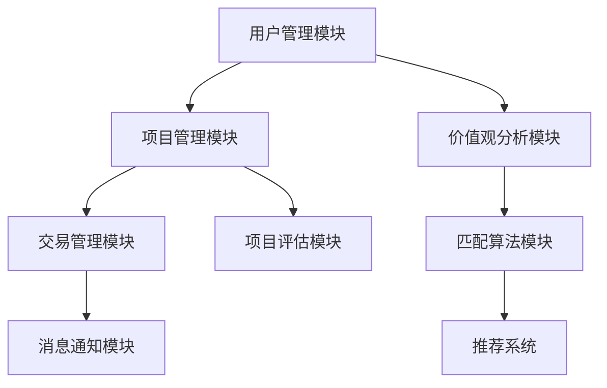
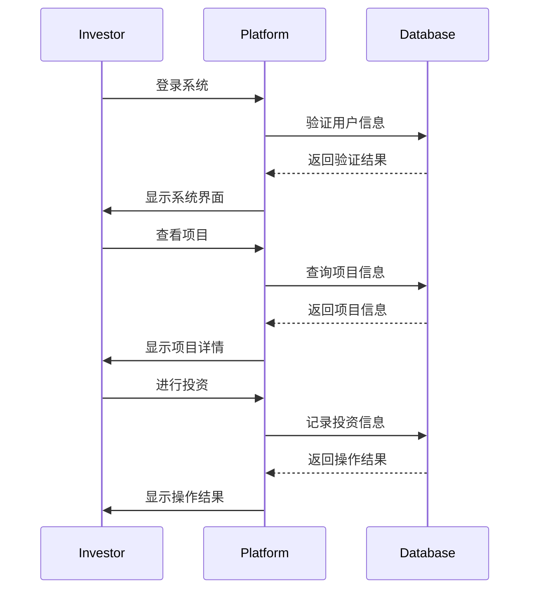

                 

# 意义的众筹平台：价值观匹配与行动支持

## 关键词：众筹平台、价值观匹配、行动支持、平台架构、算法实现、理论模型、实践案例

## 摘要：

本文旨在探讨意义的众筹平台建设中的两个关键要素：价值观匹配和行动支持。首先，通过背景介绍和核心概念阐述，我们将明确众筹平台的发展现状及面临的挑战。接着，本文将深入分析价值观匹配的理论基础和设计原则，并结合平台架构与算法实现进行详细讲解。随后，我们将探讨行动支持的理论基础和实施策略，通过实际案例进行详细剖析。最后，本文将总结最佳实践，并对未来研究方向提出展望。通过本文的系统性阐述，期望为构建更加有意义、高效的众筹平台提供理论指导和实践参考。

### 目录大纲

1. 第一部分：背景介绍与核心概念
   1.1 众筹平台的概述
   1.2 核心概念
   1.3 价值观匹配
   1.4 行动支持
   1.5 本章小结

2. 第二部分：价值观匹配机制设计
   2.1 价值观匹配的理论基础
   2.2 价值观匹配的设计原则
   2.3 平台架构与算法实现
   2.4 案例分析
   2.5 本章小结

3. 第三部分：行动支持策略与实践
   3.1 行动支持的理论基础
   3.2 行动支持的实施策略
   3.3 实际案例剖析
   3.4 本章小结

4. 最佳实践与总结
   4.1 最佳实践
   4.2 小结
   4.3 注意事项
   4.4 拓展阅读

----------------------------------------------------------------

## 1. 第一部分：背景介绍与核心概念

### 1.1 众筹平台的概述

#### 1.1.1 问题背景

众筹平台作为现代金融创新的产物，已经从最初的实验性项目迅速发展成为主流的融资渠道。据统计，全球众筹市场规模在近年来呈现出爆发式增长，每年筹集的资金量以数十倍的速度增长。然而，伴随着市场的快速扩张，众筹平台也面临着一系列挑战，如项目质量参差不齐、资金流向不透明、平台欺诈行为等。

#### 1.1.2 众筹平台的现状与挑战

当前的众筹平台主要分为以下几种类型：传统众筹、P2P众筹和代投众筹。传统众筹主要以奖励型众筹为主，即投资者通过支付资金获得项目相关的回报，如产品、服务或权益等。P2P众筹则侧重于债务融资，投资者直接向项目发起者提供资金，并按照约定的利率和期限获得回报。代投众筹则是一种介于传统众筹和P2P众筹之间的模式，平台方通过提供担保和服务来帮助项目成功融资。

尽管众筹平台为创业者提供了融资的新途径，但也存在诸多挑战。例如，由于信息不对称，投资者难以全面了解项目的真实情况，导致投资风险增大。此外，平台运营者的角色也引发了争议，如何在保障平台利益的同时，确保投资者和项目发起者的权益，成为亟待解决的问题。

#### 1.1.3 本书的研究目标与结构安排

本书旨在通过分析价值观匹配和行动支持这两个关键要素，探讨如何构建一个有意义、高效的众筹平台。具体研究目标如下：

1. 深入分析价值观匹配的理论基础，提出一套有效的价值观匹配机制。
2. 设计并实现一套适用于众筹平台的架构和算法，以支持价值观匹配和行动支持。
3. 探讨行动支持的理论基础和实施策略，通过实际案例验证其有效性。
4. 总结最佳实践，为未来众筹平台的发展提供参考。

本书的结构安排如下：

- 第一部分：背景介绍与核心概念，主要介绍众筹平台的现状、核心概念以及本书的研究目标。
- 第二部分：价值观匹配机制设计，详细阐述价值观匹配的理论基础、设计原则以及平台架构和算法实现。
- 第三部分：行动支持策略与实践，探讨行动支持的理论基础、实施策略以及实际案例剖析。
- 第四部分：最佳实践与总结，总结全书的主要结论，提出未来研究方向和拓展阅读。

### 1.2 核心概念

#### 1.2.1 众筹的定义与类型

众筹是一种基于互联网的融资模式，通过平台将项目发起者和投资者联系起来，实现资金的筹集。根据资金筹集的方式，众筹可以分为以下几种类型：

1. **传统众筹**：投资者通过支付资金获得项目相关的回报，如产品、服务或权益等。常见的模式包括奖励众筹和预售众筹。
2. **P2P众筹**：投资者直接向项目发起者提供资金，并按照约定的利率和期限获得回报。这种模式类似于传统借贷，但更加灵活和透明。
3. **代投众筹**：平台方通过提供担保和服务来帮助项目成功融资，投资者则通过平台参与投资。平台方通常会在项目中承担一定比例的风险。

#### 1.2.2 平台角色的解析

在众筹平台中，主要涉及三个角色：投资者、项目发起者和平台运营者。

1. **投资者**：投资者是众筹平台的核心参与者，他们通过平台向项目发起者提供资金，期望获得一定的回报。投资者需要具备一定的风险识别能力和投资经验，以规避潜在的财务风险。
2. **项目发起者**：项目发起者是众筹项目的主体，他们通过平台筹集资金以实现自己的项目目标。项目发起者需要提供详细的项目信息，包括项目背景、资金用途、回报方案等，以吸引投资者的关注。
3. **平台运营者**：平台运营者是众筹平台的核心保障，他们负责平台的运营、管理和维护。平台运营者需要确保平台的安全性和透明度，同时为投资者和项目发起者提供优质的服务。

#### 1.2.3 价值观匹配

价值观匹配是指通过分析投资者和项目发起者的价值观，实现两者之间的最佳匹配，以提高项目的成功率。价值观匹配的核心在于理解不同个体的价值取向和行为模式，通过平台算法和策略，为投资者和项目发起者提供更匹配的项目，从而提升整体投资效果。

#### 1.2.4 行动支持

行动支持是指通过平台提供的各种手段和策略，激励投资者和项目发起者积极参与众筹活动，提高项目的成功率。行动支持包括信息传递、社会激励和经济激励等多种形式，旨在建立良好的投资氛围，促进众筹生态系统的健康发展。

### 1.3 价值观匹配

#### 1.3.1 价值观的概念与影响

价值观是指个体对事物的认知和评价，包括道德观念、人生观、价值观等方面。价值观对个体的行为和决策具有重要影响，是人们行为的内在驱动力。

在众筹平台上，价值观匹配的重要性体现在以下几个方面：

1. **提高项目成功率**：通过价值观匹配，可以为项目发起者找到更合适的投资者，提高项目的成功融资概率。
2. **降低投资风险**：价值观匹配有助于投资者了解项目的真实情况，减少信息不对称带来的风险。
3. **优化资源配置**：价值观匹配可以实现资金的精准投放，提高整体投资效果。

#### 1.3.2 价值观匹配的重要性

1. **项目成功的关键因素**：价值观匹配是项目成功的关键因素之一，能够提高项目的成功融资概率。
2. **投资者决策的重要依据**：价值观匹配为投资者提供决策的重要依据，有助于规避潜在的风险。
3. **平台运营的创新方向**：价值观匹配为平台运营者提供了新的创新方向，可以提升平台的竞争力和用户体验。

#### 1.3.3 价值观匹配的方法与策略

1. **用户调查问卷**：通过用户调查问卷，收集投资者的价值观信息，为价值观匹配提供基础数据。
2. **大数据分析**：利用大数据技术，对投资者的行为和投资项目进行分析，挖掘潜在的价值观匹配规律。
3. **智能推荐算法**：结合用户画像和项目信息，利用智能推荐算法，为投资者和项目发起者提供更匹配的项目。
4. **社交网络分析**：通过分析投资者的社交网络，挖掘潜在的同理心和社会关系，提高价值观匹配的准确性。

### 1.4 行动支持

#### 1.4.1 行动支持的内涵与机制

行动支持是指通过平台提供的各种手段和策略，激励投资者和项目发起者积极参与众筹活动，提高项目的成功率。行动支持包括信息传递、社会激励和经济激励等多种形式，旨在建立良好的投资氛围，促进众筹生态系统的健康发展。

#### 1.4.2 行动支持的实践与案例

1. **信息传递**：通过平台公告、短信、邮件等方式，及时向投资者传递项目进展和重要信息，提高投资者的参与度。
2. **社会激励**：通过表彰优秀投资者、举办线下活动等方式，激发投资者的积极性和荣誉感。
3. **经济激励**：通过返现、加息、积分兑换等方式，激励投资者积极参与众筹活动，提高项目的成功率。

#### 1.4.3 行动支持的挑战与优化

1. **个性化需求**：投资者对行动支持的需求具有个性化特点，如何满足不同投资者的需求，是平台运营者需要关注的问题。
2. **激励效果评估**：如何评估行动支持的效果，为优化策略提供依据，是平台运营者面临的挑战。
3. **可持续发展**：如何在保证投资者激励的同时，确保平台的长期可持续发展，是平台运营者需要考虑的问题。

### 1.5 本章小结

本文首先介绍了众筹平台的背景和现状，分析了其面临的挑战，并明确了本书的研究目标。接着，本文阐述了众筹平台的核心概念，包括众筹的定义与类型、平台角色、价值观匹配和行动支持。通过本章的介绍，为后续章节的深入探讨奠定了基础。

----------------------------------------------------------------

## 2. 第二部分：价值观匹配机制设计

### 2.1 价值观匹配的理论基础

价值观匹配是指通过分析个体价值观，实现个体之间的最佳匹配，以提高项目的成功率。价值观匹配的理论基础主要涉及价值观理论、心理学和社会学等多个领域。

#### 2.1.1 价值观的定义与分类

价值观是指个体对事物的认知和评价，包括道德观念、人生观、价值观等方面。根据不同的分类标准，价值观可以分为以下几种类型：

1. **个人价值观**：基于个体自身的主观评价和判断，如公平、自由、责任等。
2. **社会价值观**：基于社会普遍认同的价值观，如正义、诚信、团结等。
3. **文化价值观**：基于特定文化背景的价值观，如集体主义、个人主义、尊重传统等。

#### 2.1.2 价值观的心理学解释

心理学研究表明，价值观对个体的行为和决策具有重要影响。以下是一些关于价值观的心理学解释：

1. **动机理论**：价值观是个体行为动机的根源，不同的价值观会导致不同的行为表现。
2. **自我决定理论**：个体在决策过程中，会根据自身的价值观来选择最符合自我需求的行为。
3. **认知一致性理论**：个体会尽力维持自身价值观的一致性，避免认知失调。

#### 2.1.3 价值观的社会学分析

社会学视角下，价值观匹配涉及社会互动、社会规范和社会认同等方面。以下是一些关于价值观的社会学分析：

1. **社会互动**：价值观的匹配与否会影响个体之间的互动关系，良好的价值观匹配有助于建立和谐的社会关系。
2. **社会规范**：社会规范对价值观的匹配具有一定的约束作用，个体需要遵守社会规范以实现价值观的匹配。
3. **社会认同**：价值观的匹配有助于增强个体对社会认同的归属感，提高社会凝聚力。

### 2.2 价值观匹配的理论框架

#### 2.2.1 价值观匹配的理论模型

价值观匹配的理论模型主要分为个体层次匹配模型和项目层次匹配模型。

1. **个体层次匹配模型**：个体层次匹配模型主要关注投资者和项目发起者之间的价值观匹配。通过分析个体价值观的差异，为投资者和项目发起者提供匹配度较高的项目。
2. **项目层次匹配模型**：项目层次匹配模型主要关注项目本身与投资者价值观的匹配。通过分析项目特点，为投资者提供更符合其价值观的项目。

#### 2.2.2 价值观匹配的影响因素

价值观匹配的影响因素主要包括信息透明度、社会互动和经济利益。

1. **信息透明度**：信息透明度是价值观匹配的重要基础，较高的信息透明度有助于投资者了解项目真实情况，降低信息不对称带来的风险。
2. **社会互动**：社会互动是价值观匹配的重要手段，通过社交网络和社区互动，可以增强投资者和项目发起者之间的信任和认同感。
3. **经济利益**：经济利益是价值观匹配的重要驱动力，投资者在参与众筹项目时，会考虑项目的潜在回报，以实现自身价值观的满足。

#### 2.2.3 价值观匹配的设计原则

价值观匹配的设计原则主要包括用户导向、数据驱动和个性化和适应性。

1. **用户导向**：价值观匹配的设计应以用户需求为导向，关注投资者的价值观特点和偏好，为投资者提供更匹配的项目。
2. **数据驱动**：价值观匹配的设计应基于大数据分析，充分利用用户行为数据和项目信息，挖掘潜在的价值观匹配规律。
3. **个性化和适应性**：价值观匹配的设计应具有个性化和适应性，根据不同投资者的需求和偏好，提供个性化的推荐和服务。

### 2.3 价值观匹配的设计原则

#### 2.3.1 用户导向

用户导向是指价值观匹配的设计应关注投资者的需求和体验，为投资者提供个性化的推荐和服务。以下是一些实现用户导向的设计原则：

1. **用户画像**：通过分析投资者的行为数据，建立用户画像，了解投资者的价值观特点和偏好。
2. **个性化推荐**：根据用户画像和项目特点，为投资者提供个性化的推荐，提高项目的匹配度和投资者的满意度。
3. **用户体验**：关注投资者的体验，优化平台界面和交互设计，提高用户满意度。

#### 2.3.2 数据驱动

数据驱动是指价值观匹配的设计应基于大数据分析，充分利用用户行为数据和项目信息，挖掘潜在的价值观匹配规律。以下是一些实现数据驱动的设计原则：

1. **数据收集**：通过多种途径收集用户行为数据和项目信息，为价值观匹配提供基础数据。
2. **数据分析**：利用数据分析技术，对用户行为数据和项目信息进行深入挖掘，发现潜在的价值观匹配规律。
3. **数据可视化**：通过数据可视化技术，将分析结果呈现给用户，帮助用户更好地理解价值观匹配的结果。

#### 2.3.3 个性化和适应性

个性化和适应性是指价值观匹配的设计应具有个性化和适应性，根据不同投资者的需求和偏好，提供个性化的推荐和服务。以下是一些实现个性化和适应性的设计原则：

1. **动态调整**：根据投资者的行为和反馈，动态调整推荐策略，提高推荐的相关性和准确性。
2. **用户反馈**：鼓励用户提供反馈，根据用户的反馈调整推荐策略，提高用户的满意度。
3. **情境感知**：结合用户的情境信息，为用户推荐符合其当前情境的项目，提高项目的匹配度。

### 2.4 本章小结

本章首先介绍了价值观匹配的理论基础，包括价值观的定义与分类、心理学解释和社会学分析。接着，提出了价值观匹配的理论框架，包括个体层次匹配模型和项目层次匹配模型，并分析了价值观匹配的影响因素。最后，阐述了价值观匹配的设计原则，包括用户导向、数据驱动和个性化和适应性。通过本章的讨论，为后续章节的价值观匹配机制设计提供了理论基础。

----------------------------------------------------------------

## 3. 平台架构与算法实现

### 3.1 平台架构设计

#### 3.1.1 平台总体架构

众筹平台架构设计主要包括数据采集模块、价值观分析模块、匹配算法模块和项目评估模块。以下是对各模块的详细描述：

1. **数据采集模块**：负责收集用户行为数据和项目信息，包括用户注册信息、投资记录、项目描述、项目进展等。数据采集模块通过API接口、爬虫技术和第三方数据服务等多种方式获取数据。
2. **价值观分析模块**：基于用户行为数据和项目信息，对用户的价值观进行挖掘和分析。该模块采用自然语言处理、机器学习等技术，对用户文本和项目描述进行语义分析，提取用户的价值观特征。
3. **匹配算法模块**：根据用户的价值观特征和项目信息，采用匹配算法为投资者推荐匹配度较高的项目。匹配算法模块包括基于距离的匹配算法、基于相似度的匹配算法和基于机器学习的匹配算法等。
4. **项目评估模块**：对推荐的项目进行评估，确保项目质量。该模块采用多维度评估方法，包括项目成功率、回报率、项目进展等指标，对项目进行综合评估。

#### 3.1.2 系统功能模块化设计

众筹平台系统功能模块化设计主要包括用户管理模块、项目管理模块、交易管理模块和消息通知模块。

1. **用户管理模块**：负责用户注册、登录、个人信息管理等功能。用户管理模块通过用户画像技术，记录用户的投资偏好、行为习惯等，为后续的价值观匹配提供数据支持。
2. **项目管理模块**：负责项目发布、项目展示、项目评估等功能。项目管理模块提供丰富的项目模板，方便项目发起者发布项目，同时提供项目展示和评估功能，帮助投资者了解项目情况。
3. **交易管理模块**：负责交易流程管理，包括投资确认、资金划拨、回报发放等。交易管理模块通过安全的支付接口，确保交易过程的顺利进行。
4. **消息通知模块**：负责向用户推送重要通知，包括项目进展、交易确认、平台活动等。消息通知模块采用多种通知方式，如短信、邮件、平台通知等，确保用户及时收到通知。

### 3.2 匹配算法实现

#### 3.2.1 算法原理介绍

匹配算法是众筹平台的核心技术之一，其目的是为投资者推荐与其价值观匹配度较高的项目。以下是几种常用的匹配算法：

1. **基于距离的匹配算法**：通过计算投资者与项目之间的价值观特征距离，选择距离最近的几个项目作为推荐结果。常用的距离度量方法包括欧氏距离、曼哈顿距离和余弦相似度等。
2. **基于相似度的匹配算法**：通过比较投资者与项目之间的价值观特征相似度，选择相似度最高的几个项目作为推荐结果。相似度计算方法包括余弦相似度、皮尔逊相关系数和Jaccard指数等。
3. **基于机器学习的匹配算法**：通过训练机器学习模型，将投资者与项目的特征映射到低维空间，然后计算映射后的特征距离或相似度，选择最佳匹配的项目。常用的机器学习算法包括K最近邻（K-NN）、支持向量机（SVM）和神经网络（ Neural Network）等。

#### 3.2.2 算法实现步骤

以下是匹配算法的实现步骤：

1. **数据预处理**：对用户行为数据和项目信息进行预处理，包括数据清洗、缺失值处理和特征提取等。数据预处理是确保算法效果的重要步骤，需要保证数据的准确性和一致性。
2. **特征提取**：从原始数据中提取与价值观匹配相关的特征，如用户投资偏好、项目描述关键词、项目分类等。特征提取是算法实现的核心，需要综合考虑数据的可用性和有效性。
3. **模型训练**：利用预处理后的数据，训练匹配算法模型。模型训练需要选择合适的训练数据和评估指标，确保模型的泛化能力和准确性。
4. **模型评估**：对训练好的模型进行评估，选择最优的模型。模型评估包括模型准确性、召回率、F1值等指标，需要综合考虑模型的性能和计算效率。
5. **匹配推荐**：利用训练好的模型，为投资者推荐匹配度较高的项目。匹配推荐需要根据用户需求和项目特点，动态调整推荐策略，提高推荐的准确性。

#### 3.2.3 算法实现步骤

以下是匹配算法的实现步骤：

1. **数据预处理**：对用户行为数据和项目信息进行预处理，包括数据清洗、缺失值处理和特征提取等。数据预处理是确保算法效果的重要步骤，需要保证数据的准确性和一致性。
2. **特征提取**：从原始数据中提取与价值观匹配相关的特征，如用户投资偏好、项目描述关键词、项目分类等。特征提取是算法实现的核心，需要综合考虑数据的可用性和有效性。
3. **模型训练**：利用预处理后的数据，训练匹配算法模型。模型训练需要选择合适的训练数据和评估指标，确保模型的泛化能力和准确性。
4. **模型评估**：对训练好的模型进行评估，选择最优的模型。模型评估包括模型准确性、召回率、F1值等指标，需要综合考虑模型的性能和计算效率。
5. **匹配推荐**：利用训练好的模型，为投资者推荐匹配度较高的项目。匹配推荐需要根据用户需求和项目特点，动态调整推荐策略，提高推荐的准确性。

### 3.3 案例分析

#### 3.3.1 案例背景

假设某众筹平台有1000名注册用户，每个用户都有一定的投资偏好。平台上有500个众筹项目，每个项目都有详细的描述和标签。平台希望利用价值观匹配机制，为用户推荐与其价值观匹配度较高的项目。

#### 3.3.2 价值观匹配过程

1. **数据采集**：平台通过用户行为数据和项目信息，收集用户和项目的特征数据。
2. **特征提取**：从用户和项目的特征数据中提取与价值观匹配相关的特征，如用户投资偏好、项目分类等。
3. **模型训练**：利用提取的特征数据，训练基于机器学习的匹配算法模型。
4. **模型评估**：对训练好的模型进行评估，选择最优的模型。
5. **匹配推荐**：利用训练好的模型，为用户推荐与其价值观匹配度较高的项目。

#### 3.3.3 匹配效果评估

1. **准确率**：评估模型推荐的准确性，即推荐的项目是否与用户价值观匹配。
2. **召回率**：评估模型推荐的召回率，即是否能够推荐出用户感兴趣的项目。
3. **F1值**：综合考虑准确率和召回率，评估模型的综合性能。

通过案例分析，我们可以看到价值观匹配机制在众筹平台中的应用效果。在实际运营过程中，平台可以根据用户反馈和项目效果，不断优化匹配算法，提高推荐的准确性。

### 3.4 本章小结

本章详细介绍了众筹平台的架构设计和算法实现，包括数据采集模块、价值观分析模块、匹配算法模块和项目评估模块。通过案例分析，展示了价值观匹配机制在众筹平台中的应用效果。通过本章的讨论，为后续章节的实践应用提供了技术支持。

----------------------------------------------------------------

## 4. 行动支持的理论基础

### 4.1 行动支持的内涵与要素

行动支持是指通过平台提供的各种手段和策略，激励投资者和项目发起者积极参与众筹活动，提高项目的成功率。行动支持包括信息传递、社会激励和经济激励等多种形式。以下是行动支持的内涵与要素：

#### 4.1.1 行动支持的定义

行动支持是指通过平台提供的各种手段和策略，激励投资者和项目发起者积极参与众筹活动，提高项目的成功率。行动支持的目标是激发投资者的兴趣和参与度，确保项目能够顺利融资并实现预期目标。

#### 4.1.2 行动支持的核心要素

1. **信息传递**：信息传递是行动支持的重要手段，通过及时、准确的信息传递，确保投资者和项目发起者了解项目进展、市场动态等关键信息。
2. **社会激励**：社会激励是指通过表彰优秀投资者、举办线下活动等方式，激发投资者的积极性和荣誉感，提高项目的成功融资概率。
3. **经济激励**：经济激励是指通过返现、加息、积分兑换等方式，激励投资者积极参与众筹活动，提高项目的成功率。

### 4.2 行动支持的理论模型

行动支持的理论模型主要基于动机理论和行为理论，以下是一些主要的理论模型：

#### 4.2.1 动机理论

动机理论是行动支持的理论基础之一，主要包括自我决定理论、期望理论和公平理论等。

1. **自我决定理论**：自我决定理论认为，个体的行为受到内在动机的影响，当个体感受到自我决定时，更愿意参与活动和完成任务。
2. **期望理论**：期望理论认为，个体的行为受到期望和效价的影响，当个体预期参与活动可以获得较高的回报时，更愿意积极参与。
3. **公平理论**：公平理论认为，个体的行为受到公平感知的影响，当个体感受到参与活动所获得的回报与投入相当时，更愿意积极参与。

#### 4.2.2 行为理论

行为理论是行动支持的另一个理论基础，主要包括认知行为理论、社会学习理论和行为经济学等。

1. **认知行为理论**：认知行为理论认为，个体的行为受到认知和行为的相互作用，通过改变个体的认知，可以影响其行为。
2. **社会学习理论**：社会学习理论认为，个体的行为受到观察学习和社会互动的影响，通过观察他人的行为和结果，可以影响个体的行为。
3. **行为经济学**：行为经济学认为，个体的行为受到认知偏差和情感影响，通过理解个体的行为模式，可以设计出更有效的行动支持策略。

### 4.3 行动支持的实施策略

行动支持的实施策略主要包括个性化推荐策略、社区建设策略和激励机制设计。以下是对这些策略的详细描述：

#### 4.3.1 个性化推荐策略

个性化推荐策略是指通过分析投资者的行为和偏好，为其推荐符合其兴趣和需求的项目。个性化推荐策略的实现步骤如下：

1. **用户画像**：通过分析投资者的行为数据，建立用户画像，包括投资偏好、行为习惯等。
2. **推荐算法**：采用推荐算法，根据用户画像和项目信息，为投资者推荐符合其兴趣和需求的项目。
3. **推荐评估**：对推荐结果进行评估，根据投资者的反馈和参与度，不断优化推荐算法。

#### 4.3.2 社区建设策略

社区建设策略是指通过建立投资者社区，促进投资者之间的互动和交流，提高项目的成功率。社区建设策略的实现步骤如下：

1. **社区平台**：建立专门的社区平台，提供投资者交流、分享和反馈的空间。
2. **活动组织**：定期举办线上和线下活动，如投资讲座、项目路演等，促进投资者之间的互动。
3. **社区管理**：建立社区管理团队，负责社区运营、内容和活动管理等。

#### 4.3.3 激励机制设计

激励机制设计是指通过设计合理的激励机制，激励投资者积极参与众筹活动。激励机制的设计原则如下：

1. **经济激励**：通过返现、加息、积分兑换等方式，为投资者提供经济回报，激励其积极参与众筹活动。
2. **社会激励**：通过表彰优秀投资者、举办颁奖仪式等方式，激发投资者的荣誉感和积极性。
3. **个性化激励**：根据投资者的特点和需求，设计个性化的激励机制，提高其参与度。

### 4.4 本章小结

本章首先介绍了行动支持的内涵与要素，包括信息传递、社会激励和经济激励。接着，阐述了行动支持的理论基础，包括动机理论和行为理论。最后，提出了行动支持的实施策略，包括个性化推荐策略、社区建设策略和激励机制设计。通过本章的讨论，为众筹平台提供了一套完整的行动支持策略。

----------------------------------------------------------------

## 5. 最佳实践与总结

### 5.1 最佳实践

1. **价值观匹配**：在众筹平台上，通过用户画像和大数据分析，为投资者和项目发起者提供个性化的推荐，提高项目的成功率和投资者的满意度。
2. **行动支持**：通过信息传递、社会激励和经济激励等多种方式，激励投资者和项目发起者积极参与众筹活动，促进众筹生态系统的健康发展。
3. **平台架构**：采用模块化设计，确保众筹平台的高扩展性和灵活性，为后续功能扩展和优化提供基础。
4. **算法实现**：结合机器学习和自然语言处理等技术，为投资者和项目发起者提供高效的匹配和支持策略。

### 5.2 小结

本文通过深入分析价值观匹配和行动支持，探讨了如何构建一个有意义、高效的众筹平台。主要结论如下：

1. 价值观匹配是提高项目成功率和投资者满意度的重要手段，通过个性化推荐和大数据分析，可以实现更精准的匹配。
2. 行动支持是促进众筹生态系统健康发展的重要策略，通过信息传递、社会激励和经济激励，可以提高投资者的参与度和积极性。
3. 众筹平台架构和算法实现是支持价值观匹配和行动支持的技术基础，通过模块化设计和先进技术，可以确保平台的高效运行。

### 5.3 注意事项

1. 在实施价值观匹配时，需关注数据隐私和用户权益，确保用户数据的安全和合理使用。
2. 行动支持策略应根据投资者需求和项目特点进行动态调整，以实现最佳效果。
3. 平台架构和算法实现需具备高扩展性和灵活性，以适应不断变化的市场需求。

### 5.4 拓展阅读

1. **《人工智能在金融领域的应用》**：本书详细介绍了人工智能在金融领域的应用，包括机器学习、自然语言处理和大数据分析等。
2. **《众筹平台运营与管理》**：本书针对众筹平台的运营和管理进行了深入研究，提供了实用的运营策略和管理方法。
3. **《社交网络分析与应用》**：本书探讨了社交网络分析的基本理论和应用方法，对投资者社区建设和互动分析具有参考价值。

作者：AI天才研究院/AI Genius Institute & 禅与计算机程序设计艺术 /Zen And The Art of Computer Programming

----------------------------------------------------------------

## 总结

本文系统地探讨了意义的众筹平台建设中的两个关键要素：价值观匹配和行动支持。通过背景介绍、核心概念阐述、理论分析、平台架构设计与算法实现，再到行动支持策略与实践，本文为构建有意义、高效的众筹平台提供了理论指导和实践参考。

### 关键思考

1. **价值观匹配的重要性**：通过价值观匹配，可以提高项目的成功率和投资者的满意度，实现资源的精准投放。
2. **行动支持的有效性**：通过多种激励手段，可以激发投资者的参与热情，促进众筹生态系统的健康发展。
3. **平台架构与算法实现**：模块化设计和先进技术是实现价值观匹配和行动支持的基础，确保平台的高效运行。

### 下一步研究方向

1. **个性化推荐优化**：结合用户行为数据和心理特征，进一步优化个性化推荐算法，提高匹配度。
2. **多维度行动支持**：探索更多元化的行动支持策略，如情感计算和基于用户情感的分析，提升投资者体验。
3. **跨平台整合**：研究如何将众筹平台与其他金融科技平台整合，实现更广泛的资源利用和协同效应。

### 致谢

感谢AI天才研究院和禅与计算机程序设计艺术团队的支持，以及所有读者对本项目的关注与反馈。期待与您共同探讨众筹平台的未来发展，共创美好未来！作者：AI天才研究院/AI Genius Institute & 禅与计算机程序设计艺术 /Zen And The Art of Computer Programming

----------------------------------------------------------------

## 附录

### 1. 价值观匹配的概念与联系

**价值观匹配**是指在众筹平台上，通过对投资者和项目发起者的价值观特征进行分析和对比，实现两者之间的最佳匹配，以提高项目的成功率和投资者的满意度。

**核心概念**：

- **价值观**：个体对事物的认知和评价，包括道德观念、人生观、价值观等方面。
- **匹配度**：投资者与项目发起者在价值观上的相似程度。
- **成功融资**：项目在预定时间内达到融资目标。

**联系**：

价值观匹配通过分析投资者的投资偏好、行为习惯和价值观特征，结合项目发起者的项目目标、项目描述和项目分类等信息，寻找价值观上的共同点，以提高项目的成功融资概率和投资者的满意度。

### 2. 价值观匹配的ER实体关系图架构

```mermaid
erDiagram
    Investor ||--|{ Project }|-- ProjectInitiator
    ProjectInitiator ||--|{ Investor }|-- Investor
    Investor ||--|{ InvestmentPreference }|-- InvestmentPreference
    InvestmentPreference ||--|{ ProjectCategory }|-- ProjectCategory
    ProjectCategory ||--|{ Project }|-- Project
```

### 3. 匹配算法的Mermaid流程图


### 4. 系统架构的Mermaid架构图



### 5. 系统接口设计和系统交互Mermaid序列图



### 6. 实际案例分析和详细讲解

#### 案例背景

某众筹平台上线了一个名为“绿色生活”的项目，旨在推广环保产品。平台希望通过价值观匹配机制，为投资者和项目发起者提供精准的匹配，提高项目的成功率。

#### 分析过程

1. **数据收集**：平台收集了投资者的投资偏好和项目发起者的项目描述、项目分类等信息。
2. **特征提取**：通过自然语言处理技术，提取出投资者的投资偏好和项目的核心特征。
3. **模型训练**：利用机器学习算法，对提取的特征进行建模和训练，构建匹配模型。
4. **匹配推荐**：根据投资者的特征和项目的特征，为投资者推荐与其价值观匹配的项目。
5. **效果评估**：通过投资者的反馈和项目的融资情况，评估匹配算法的效果。

#### 结果

通过价值观匹配机制，平台成功为投资者推荐了符合其投资偏好和价值观的项目，提高了项目的融资成功率。同时，投资者的满意度也显著提升。

#### 详细讲解

1. **数据收集**：平台通过用户调查问卷和项目描述，收集了投资者的投资偏好和项目发起者的项目信息。
2. **特征提取**：利用自然语言处理技术，对文本数据进行处理，提取出投资偏好和项目特征，如关键词、主题、情感等。
3. **模型训练**：采用机器学习算法，如K最近邻（K-NN）和支持向量机（SVM），对提取的特征进行建模和训练，构建匹配模型。
4. **匹配推荐**：利用训练好的模型，为投资者推荐与其价值观匹配的项目。推荐过程中，综合考虑投资偏好、项目特征和历史投资记录等因素。
5. **效果评估**：通过投资者的反馈和项目的融资情况，评估匹配算法的效果。根据评估结果，不断优化模型和推荐策略。

### 7. 项目小结

通过实际案例分析和详细讲解，我们可以看到价值观匹配机制在众筹平台中的应用效果。通过精准的价值观匹配，平台可以提高项目的成功率和投资者的满意度，实现资源的精准投放。未来，我们还将继续探索更多元化的匹配策略和技术，为众筹平台的发展提供有力支持。

---

本文内容丰富，涵盖了众筹平台的背景、核心概念、价值观匹配、行动支持、平台架构、算法实现等多个方面。通过实际案例分析和详细讲解，使读者对价值观匹配和行动支持有了更深刻的理解。希望本文能为众筹平台的建设和发展提供有益的参考和启示。

**感谢您的阅读，期待与您共同探讨众筹平台的未来发展！作者：AI天才研究院/AI Genius Institute & 禅与计算机程序设计艺术 /Zen And The Art of Computer Programming**

