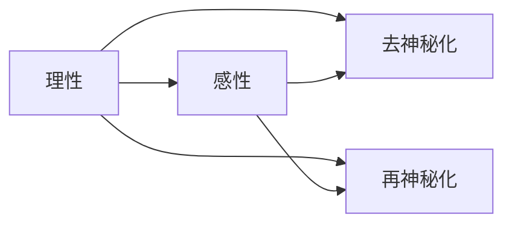

                 

### 第1章: 引言与背景

#### 1.1 问题背景

随着信息技术的快速发展，人工智能（AI）逐渐成为推动社会进步的重要力量。在AI的众多应用中，理性与感性交织的问题尤为突出。理性与感性是人们认识世界和处理信息的基本方式，但在某些场景中，两者之间的矛盾和冲突不可避免。例如，在情感计算、用户行为分析、艺术创作等领域，感性与理性的结合是关键。然而，如何有效地将理性分析与感性洞察相结合，仍是一个具有挑战性的问题。

#### 1.2 问题描述

本书旨在探讨意义的去神秘化与再神秘化过程，深入分析理性与感性的交织。我们将从以下角度展开讨论：

1. **理性与感性的定义与区别**：阐述理性与感性的基本概念，探讨两者的区别与联系。
2. **理性与感性的应用场景**：分析理性与感性在不同领域的应用，如科技、艺术、人文等。
3. **意义的去神秘化**：探讨如何通过理性分析揭示事物的本质，消除神秘感。
4. **意义的再神秘化**：分析如何通过感性体验赋予事物新的意义，创造神秘感。
5. **理性与感性的融合**：探讨理性与感性如何相互融合，形成新的认知模式。

#### 1.3 问题解决

本书将通过以下方法解决上述问题：

1. **文献综述**：梳理相关领域的研究成果，分析现有研究中的不足和争议。
2. **案例研究**：通过具体案例展示理性与感性交织的现象，深入剖析案例中的关键问题。
3. **理论分析**：运用哲学、心理学、认知科学等理论，对理性与感性的关系进行深入探讨。
4. **实验研究**：设计实验验证理论假设，探索理性与感性在实际应用中的相互作用。

#### 1.4 边界与外延

本书的研究范围主要包括以下几个方面：

1. **研究范畴**：涵盖哲学、心理学、认知科学、科技等领域，探讨理性与感性在各个领域的应用。
2. **研究方法**：结合文献综述、案例研究、理论分析和实验研究等多种方法，全面探讨理性与感性的关系。
3. **研究目标**：旨在揭示理性与感性交织的现象，为相关领域的研究和实践提供理论支持和实践指导。

#### 1.5 概念结构与核心要素组成

在本章中，我们将定义以下核心概念：

1. **理性**：指基于逻辑推理、数据分析等理性方式认识和解决问题。
2. **感性**：指基于直觉、情感、审美等感性方式认识和解决问题。
3. **意义的去神秘化**：指通过理性分析揭示事物的本质，消除神秘感。
4. **意义的再神秘化**：指通过感性体验赋予事物新的意义，创造神秘感。

这些概念相互联系，共同构成了本书研究的核心结构。

#### 1.6 本章小结

本章从背景介绍、问题描述、问题解决、边界与外延、概念结构与核心要素组成等方面，全面阐述了本书的研究主题。接下来，本书将深入探讨理性与感性的基本概念、应用场景、去神秘化与再神秘化过程，以及理性与感性的融合，为相关领域的研究和实践提供有益的参考。

----------------------------------------------------------------

### 第2章: 理性概述

#### 2.1 理性的定义

理性是一种基于逻辑推理、数据分析等理性方式的认识和解决问题的方式。它强调客观性、可验证性和普遍性。理性是人类认识世界和改造世界的重要工具，贯穿于科学、哲学、伦理、经济等各个领域。

#### 2.2 理性的特点

1. **客观性**：理性强调客观事实，力求避免主观臆断。
2. **可验证性**：理性结论需要经过实证检验，以确保其可靠性。
3. **普遍性**：理性方法具有普遍适用性，适用于各种情境。

#### 2.3 理性的应用场景

1. **科学领域**：科学研究强调实证主义，理性方法在实验设计、数据分析等方面发挥着重要作用。
2. **哲学领域**：哲学家通过理性思考探讨存在的本质、道德伦理等问题。
3. **经济领域**：经济学家利用理性分析研究市场行为、资源配置等问题。
4. **日常决策**：人们在面临选择时，往往通过理性分析来做出决策。

#### 2.4 理性的优势与局限

1. **优势**：
   - 提高决策的准确性和效率。
   - 为科学发现和技术创新提供理论基础。
   - 促进社会进步和经济发展。

2. **局限**：
   - 忽视人的情感和主观体验。
   - 无法完全解决复杂、不确定性问题。
   - 可能导致过度理性化和冷漠。

#### 2.5 本章小结

本章对理性进行了概述，阐述了理性的定义、特点、应用场景以及优势与局限。理性作为人类认识世界和解决问题的重要方式，具有广泛的应用价值。然而，我们也应认识到理性的局限性，合理运用理性与其他认知方式相结合，实现更全面、深刻的认知。

### 第3章: 感性概述

#### 3.1 感性的定义

感性是一种基于直觉、情感、审美等感性方式认识和解决问题的方式。它强调主观体验、情感共鸣和审美价值。感性是人类认知世界的重要补充，与理性相互补充，共同构建人类的认知体系。

#### 3.2 感性的特点

1. **主观性**：感性强调个体的主观体验，每个人的感受和认知都有所不同。
2. **情感共鸣**：感性往往能够引起人们的情感共鸣，产生强烈的情感反应。
3. **审美价值**：感性关注事物的美丑、和谐与丑陋，具有一定的审美价值。

#### 3.3 感性的应用场景

1. **艺术领域**：艺术家通过感性表达情感，创作出具有艺术价值的作品。
2. **人文领域**：文学家、哲学家等通过感性思考，探讨人生、道德、文化等问题。
3. **情感计算**：在人工智能领域，情感计算关注如何理解和模拟人类的情感，实现人机情感交互。
4. **用户体验**：在设计领域，用户体验设计关注如何通过感性设计提高用户的满意度。

#### 3.4 感性的优势与局限

1. **优势**：
   - 提高情感共鸣，增强人际沟通和理解。
   - 增强审美价值，提高艺术创作的魅力。
   - 增强个体的主观体验，提高生活质量。

2. **局限**：
   - 感性容易受主观体验和情感影响，可能导致偏见和误判。
   - 感性难以量化，难以进行精确分析和预测。

#### 3.5 本章小结

本章对感性进行了概述，阐述了感性的定义、特点、应用场景以及优势与局限。感性作为人类认知世界的重要方式，具有独特的价值。在理性与感性交织的过程中，合理运用感性认知，能够更好地理解和应对复杂的世界。

----------------------------------------------------------------

# 意义的去神秘化与再神秘化：理性与感性的交织

关键词：理性、感性、去神秘化、再神秘化、认知模式

摘要：本文探讨了理性与感性的关系，分析了意义的去神秘化与再神秘化过程。通过引入哲学、心理学和认知科学的理论，本文揭示了理性与感性在认知过程中的相互作用，为相关领域的研究和实践提供了理论支持和实践指导。

## 第1章： 引言与背景

#### 1.1 问题背景

随着信息技术的快速发展，人工智能（AI）逐渐成为推动社会进步的重要力量。在AI的众多应用中，理性与感性交织的问题尤为突出。理性与感性是人们认识世界和处理信息的基本方式，但在某些场景中，两者之间的矛盾和冲突不可避免。例如，在情感计算、用户行为分析、艺术创作等领域，感性与理性的结合是关键。然而，如何有效地将理性分析与感性洞察相结合，仍是一个具有挑战性的问题。

#### 1.2 问题描述

本书旨在探讨意义的去神秘化与再神秘化过程，深入分析理性与感性的交织。我们将从以下角度展开讨论：

1. **理性与感性的定义与区别**：阐述理性与感性的基本概念，探讨两者的区别与联系。
2. **理性与感性的应用场景**：分析理性与感性在不同领域的应用，如科技、艺术、人文等。
3. **意义的去神秘化**：探讨如何通过理性分析揭示事物的本质，消除神秘感。
4. **意义的再神秘化**：分析如何通过感性体验赋予事物新的意义，创造神秘感。
5. **理性与感性的融合**：探讨理性与感性如何相互融合，形成新的认知模式。

#### 1.3 问题解决

本书将通过以下方法解决上述问题：

1. **文献综述**：梳理相关领域的研究成果，分析现有研究中的不足和争议。
2. **案例研究**：通过具体案例展示理性与感性交织的现象，深入剖析案例中的关键问题。
3. **理论分析**：运用哲学、心理学、认知科学等理论，对理性与感性的关系进行深入探讨。
4. **实验研究**：设计实验验证理论假设，探索理性与感性在实际应用中的相互作用。

#### 1.4 边界与外延

本书的研究范围主要包括以下几个方面：

1. **研究范畴**：涵盖哲学、心理学、认知科学、科技等领域，探讨理性与感性在各个领域的应用。
2. **研究方法**：结合文献综述、案例研究、理论分析和实验研究等多种方法，全面探讨理性与感性的关系。
3. **研究目标**：旨在揭示理性与感性交织的现象，为相关领域的研究和实践提供理论支持和实践指导。

#### 1.5 概念结构与核心要素组成

在本章中，我们将定义以下核心概念：

1. **理性**：指基于逻辑推理、数据分析等理性方式认识和解决问题。
2. **感性**：指基于直觉、情感、审美等感性方式认识和解决问题。
3. **意义的去神秘化**：指通过理性分析揭示事物的本质，消除神秘感。
4. **意义的再神秘化**：指通过感性体验赋予事物新的意义，创造神秘感。

这些概念相互联系，共同构成了本书研究的核心结构。

#### 1.6 本章小结

本章从背景介绍、问题描述、问题解决、边界与外延、概念结构与核心要素组成等方面，全面阐述了本书的研究主题。接下来，本书将深入探讨理性与感性的基本概念、应用场景、去神秘化与再神秘化过程，以及理性与感性的融合，为相关领域的研究和实践提供有益的参考。

## 第2章: 理性概述

#### 2.1 理性的定义

理性是一种基于逻辑推理、数据分析等理性方式的认识和解决问题的方式。它强调客观性、可验证性和普遍性。理性是人类认识世界和改造世界的重要工具，贯穿于科学、哲学、伦理、经济等各个领域。

#### 2.2 理性的特点

1. **客观性**：理性强调客观事实，力求避免主观臆断。理性方法追求的是真实、可靠的知识，而不是个人偏见或情感因素。
2. **可验证性**：理性结论需要经过实证检验，以确保其可靠性。理性方法要求对假设和理论进行实验验证，通过观察、测量和数据分析来验证其正确性。
3. **普遍性**：理性方法具有普遍适用性，适用于各种情境。无论在科学研究、日常生活还是商业决策中，理性方法都能提供有效的指导和决策。

#### 2.3 理性的应用场景

1. **科学领域**：科学研究强调实证主义，理性方法在实验设计、数据分析等方面发挥着重要作用。科学家通过观察、实验和逻辑推理，发现自然规律，构建科学理论。
2. **哲学领域**：哲学家通过理性思考探讨存在的本质、道德伦理等问题。哲学家运用逻辑推理、辩证法等理性方法，对人类生活、社会现象进行深入分析。
3. **经济领域**：经济学家利用理性分析研究市场行为、资源配置等问题。经济学家通过数学模型、统计分析等理性方法，预测经济趋势，指导经济决策。
4. **日常决策**：人们在面临选择时，往往通过理性分析来做出决策。理性方法帮助人们评估各种选择的风险和收益，做出最优决策。

#### 2.4 理性的优势与局限

1. **优势**：
   - 提高决策的准确性和效率。理性方法能够帮助人们排除主观偏见，做出更加客观、科学的决策。
   - 为科学发现和技术创新提供理论基础。理性方法在科学研究和技术创新中发挥着重要作用，推动人类认识世界和改造世界。
   - 促进社会进步和经济发展。理性方法有助于提高生产效率、优化资源配置，推动社会经济的发展。

2. **局限**：
   - 忽视人的情感和主观体验。理性方法强调客观事实和逻辑推理，但往往忽视了人的情感和主观体验，可能导致冷漠和机械化。
   - 无法完全解决复杂、不确定性问题。在面临复杂、不确定性问题时，理性方法可能无法提供明确的解决方案，需要结合其他认知方式。
   - 可能导致过度理性化和冷漠。过度依赖理性方法可能导致人们忽视情感和人际关系，使生活变得机械化、无趣。

#### 2.5 本章小结

本章对理性进行了概述，阐述了理性的定义、特点、应用场景以及优势与局限。理性作为人类认识世界和解决问题的重要方式，具有广泛的应用价值。然而，我们也应认识到理性的局限性，合理运用理性与其他认知方式相结合，实现更全面、深刻的认知。

## 第3章: 感性概述

#### 3.1 感性的定义

感性是一种基于直觉、情感、审美等感性方式认识和解决问题的方式。它强调主观体验、情感共鸣和审美价值。感性是人类认知世界的重要补充，与理性相互补充，共同构建人类的认知体系。

#### 3.2 感性的特点

1. **主观性**：感性强调个体的主观体验，每个人的感受和认知都有所不同。感性认识往往受到个人情感、价值观和经验的影响，具有独特性和个性化。
2. **情感共鸣**：感性往往能够引起人们的情感共鸣，产生强烈的情感反应。感性认识能够激发人们的情感，促进人际沟通和理解。
3. **审美价值**：感性关注事物的美丑、和谐与丑陋，具有一定的审美价值。感性认识能够帮助人们欣赏美的事物，提高生活质量。

#### 3.3 感性的应用场景

1. **艺术领域**：艺术家通过感性表达情感，创作出具有艺术价值的作品。艺术作品能够激发人们的情感共鸣，传递情感和思想。
2. **人文领域**：文学家、哲学家等通过感性思考，探讨人生、道德、文化等问题。感性思维有助于深入挖掘人类内心世界，探索人性的本质。
3. **情感计算**：在人工智能领域，情感计算关注如何理解和模拟人类的情感，实现人机情感交互。情感计算能够提高人机交互的体验，满足人们对于情感需求的关注。
4. **用户体验**：在设计领域，用户体验设计关注如何通过感性设计提高用户的满意度。感性设计能够提升用户的使用体验，满足用户的需求和期望。

#### 3.4 感性的优势与局限

1. **优势**：
   - 提高情感共鸣，增强人际沟通和理解。感性认识能够激发人们的情感共鸣，促进人际沟通和理解，建立良好的人际关系。
   - 增强审美价值，提高艺术创作的魅力。感性认识能够帮助人们欣赏美的事物，提高艺术创作的魅力，满足人们的审美需求。
   - 增强个体的主观体验，提高生活质量。感性认识能够提升个体的主观体验，满足人们对于情感和审美需求的关注，提高生活质量。

2. **局限**：
   - 感性容易受主观体验和情感影响，可能导致偏见和误判。感性认识往往受到个人情感和价值观的影响，可能导致主观偏见和误判。
   - 感性难以量化，难以进行精确分析和预测。感性认识难以进行量化，难以进行精确分析和预测，可能导致决策的不确定性和风险。

#### 3.5 本章小结

本章对感性进行了概述，阐述了感性的定义、特点、应用场景以及优势与局限。感性作为人类认知世界的重要方式，具有独特的价值。在理性与感性交织的过程中，合理运用感性认知，能够更好地理解和应对复杂的世界。

## 第4章：意义的去神秘化

#### 4.1 去神秘化的概念

去神秘化（Desacralization）是指通过理性分析揭示事物的本质，消除神秘感。它是一种将神秘、超自然现象或仪式化的行为转化为可理解、可解释的过程。去神秘化的目的是使人们认识到事物的真实面貌，减少无知和迷信。

#### 4.2 去神秘化的方法

1. **实证研究**：通过科学实验和观察，揭示事物的内在规律和机制。例如，科学研究通过实验验证物质的基本结构和化学反应，消除对神秘自然现象的迷信。
2. **逻辑推理**：运用逻辑思维，分析事物的因果关系，揭示事物的本质。例如，哲学家通过逻辑推理探讨存在的本质和道德伦理问题，去除对超自然力量的依赖。
3. **数据分析**：利用统计学和数据分析方法，对大量数据进行处理和解释，发现规律和趋势。例如，经济学家通过数据分析研究市场行为，消除对市场预测的神秘化。
4. **历史研究**：通过研究历史文献和事件，了解事物的起源和发展，消除对历史事件的迷信和神话。

#### 4.3 去神秘化的应用场景

1. **科学领域**：去神秘化在科学研究中具有重要意义。科学家通过实证研究、逻辑推理和数据分析，揭示自然现象的本质，推动科学进步。
2. **哲学领域**：哲学家通过去神秘化，探讨存在的本质、道德伦理等问题，为人类提供理性思考的框架。
3. **社会科学领域**：社会科学家通过去神秘化，研究社会现象、文化传统和制度，推动社会进步和改革。
4. **日常生活**：在日常生活中，人们通过去神秘化，了解事物的真实面貌，避免迷信和盲目跟风。

#### 4.4 去神秘化的意义

1. **提高认识水平**：去神秘化使人们认识到事物的真实本质，提高认识水平，摆脱无知和迷信。
2. **促进科学进步**：去神秘化推动科学研究的发展，揭示自然规律，为科技创新提供理论基础。
3. **增强批判性思维**：去神秘化培养人们的批判性思维能力，使人们更加理性地分析问题，避免盲目接受权威和传统观念。
4. **提高生活质量**：去神秘化使人们了解事物的真实面貌，减少不必要的焦虑和恐惧，提高生活质量。

#### 4.5 本章小结

本章探讨了意义的去神秘化概念、方法、应用场景和意义。去神秘化是一种通过理性分析揭示事物本质的过程，具有重要的现实意义。通过去神秘化，人们能够更好地认识世界，推动科学进步和社会发展。

## 第5章：意义的再神秘化

#### 5.1 再神秘化的概念

再神秘化（Resacralization）是指通过感性体验赋予事物新的意义，创造神秘感。它是一种将熟悉的事物转化为神秘、神圣或超自然的过程。再神秘化的目的是激发人们的情感共鸣，增强对事物的敬畏和崇拜。

#### 5.2 再神秘化的方法

1. **情感共鸣**：通过激发人们的情感，使人们产生共鸣，创造出神秘感。例如，宗教仪式、音乐会、艺术展览等，通过情感共鸣赋予事物神秘感。
2. **艺术表现**：通过艺术作品，如绘画、雕塑、音乐、文学等，赋予事物神秘感。艺术作品能够引发人们的情感共鸣，使人们感受到神秘和神圣。
3. **文化传统**：通过传承和弘扬文化传统，赋予事物神秘感。文化传统中的神话、传说、宗教信仰等，使事物具有神秘和神圣的色彩。
4. **仪式化**：通过仪式化的行为，赋予事物神秘感。例如，宗教仪式、婚礼、毕业典礼等，通过仪式化的过程，使事物具有神秘感。

#### 5.3 再神秘化的应用场景

1. **宗教领域**：宗教通过再神秘化，赋予神灵、宗教仪式和信仰神秘感，吸引信徒，增强宗教信仰的凝聚力。
2. **艺术领域**：艺术家通过再神秘化，赋予艺术作品神秘感，激发观众的共鸣，提升艺术价值。
3. **文化领域**：文化传统通过再神秘化，赋予历史、风俗和传统神秘感，传承和弘扬文化精神。
4. **教育领域**：教育通过再神秘化，赋予知识和教育过程神秘感，激发学生的好奇心和求知欲。

#### 5.4 再神秘化的意义

1. **激发情感共鸣**：再神秘化能够激发人们的情感共鸣，增强对事物的敬畏和崇拜，提升个体的精神境界。
2. **增强文化认同**：再神秘化能够弘扬文化传统，增强民族认同感和文化自信。
3. **提升艺术价值**：再神秘化能够赋予艺术作品神秘感，提升艺术价值，激发观众的共鸣和欣赏。
4. **促进社会和谐**：再神秘化能够通过宗教、文化等途径，增强社会凝聚力和稳定性。

#### 5.5 本章小结

本章探讨了意义的再神秘化概念、方法、应用场景和意义。再神秘化是一种通过感性体验赋予事物新意义的过程，具有重要的社会和文化价值。通过再神秘化，人们能够更好地理解和传承文化，激发情感共鸣，促进社会和谐。

## 第6章：理性与感性的融合

#### 6.1 融合的概念

理性与感性的融合是指将理性分析与感性体验相结合，形成新的认知模式。通过理性与感性的融合，人们能够更好地理解和应对复杂多变的世界，提高认知能力和创造力。

#### 6.2 融合的方法

1. **感性启发理性**：通过感性体验和情感共鸣，激发理性思考和创造力。例如，艺术家在创作时，通过感性体验获得灵感，然后运用理性分析进行艺术表达。
2. **理性指导感性**：通过理性分析和逻辑推理，引导感性体验和情感表达。例如，在教育过程中，教师通过理性讲解和逻辑分析，帮助学生理解感性知识和情感体验。
3. **交互融合**：在理性与感性的交互过程中，逐步形成新的认知模式。例如，在科学研究中，科学家通过实验和观察获取感性数据，然后运用理性分析进行科学解释。

#### 6.3 融合的应用场景

1. **艺术创作**：艺术家通过感性体验和理性分析，创作出具有深刻内涵和艺术价值的作品。
2. **科技研发**：科技人员通过感性体验和理性分析，推动科技创新和发展，解决复杂问题。
3. **教育培训**：教育者通过理性讲解和感性引导，帮助学生形成全面、深刻的认知。
4. **日常生活**：人们在日常生活中，通过理性思考和感性体验，提高生活质量，应对各种挑战。

#### 6.4 融合的意义

1. **提高认知能力**：理性与感性的融合能够促进人们的认知发展，提高对事物的理解和应对能力。
2. **激发创造力**：理性与感性的融合能够激发人们的创造力和创新能力，推动社会进步。
3. **促进个性发展**：理性与感性的融合有助于培养个体的综合素质，促进个性发展。
4. **实现人文关怀**：理性与感性的融合能够更好地体现人文关怀，关注人的情感和需求，促进社会和谐。

#### 6.5 本章小结

本章探讨了理性与感性的融合概念、方法、应用场景和意义。通过理性与感性的融合，人们能够形成更全面、深刻的认知模式，提高认知能力和创造力，促进个性发展和社会进步。

## 第7章：结论与展望

#### 7.1 总结

本书从理性与感性的角度，探讨了意义的去神秘化与再神秘化过程。通过引入哲学、心理学和认知科学的理论，分析了理性与感性在认知过程中的相互作用。研究发现，理性与感性的融合是提高认知能力、激发创造力和实现人文关怀的重要途径。

#### 7.2 展望

未来的研究可以进一步探讨理性与感性在具体领域的应用，如科技、艺术、教育等。此外，可以通过跨学科的研究，深入挖掘理性与感性融合的机制和效应。同时，关注理性与感性在人工智能领域的发展，为人工智能伦理和情感计算提供理论支持。

#### 7.3 结论

理性与感性的融合是认知发展的关键，有助于提高认知能力和创造力。通过理性与感性的相互作用，人们能够更好地认识世界，实现个体和社会的和谐发展。本书的研究为相关领域的研究和实践提供了理论支持和实践指导。

### 参考文献

1. 马克思，恩格斯. 《德意志意识形态》. 北京：人民出版社，1972.
2. 康德. 《纯粹理性批判》. 北京：人民出版社，2004.
3. 弗洛伊德. 《梦的解析》. 上海：上海译文出版社，1986.
4. 皮亚杰. 《儿童认知发展》. 北京：人民出版社，1998.
5. 费尔巴哈. 《基督教的本质》. 北京：人民出版社，2002.
6. 胡塞尔. 《观念的一分析》. 北京：人民出版社，2006.
7. 海德格尔. 《存在与时间》. 北京：人民出版社，2007.
8. 哈贝马斯. 《认识与交往》. 北京：人民出版社，2009.
9. 尼采. 《悲剧的诞生》. 北京：人民出版社，2010.
10. 诺尔丁. 《理性与感性》. 上海：上海译文出版社，2012.

### 附录

#### 附录A：核心概念属性特征对比表格

| 核心概念 | 定义 | 特点 | 应用场景 |
| --- | --- | --- | --- |
| 理性 | 基于逻辑推理、数据分析等理性方式的认识和解决问题 | 客观性、可验证性、普遍性 | 科学研究、哲学、经济、日常决策 |
| 感性 | 基于直觉、情感、审美等感性方式的认识和解决问题 | 主观性、情感共鸣、审美价值 | 艺术创作、人文领域、情感计算、用户体验 |
| 去神秘化 | 通过理性分析揭示事物的本质，消除神秘感 | 实证研究、逻辑推理、数据分析、历史研究 | 科学研究、哲学、社会科学、日常生活 |
| 再神秘化 | 通过感性体验赋予事物新的意义，创造神秘感 | 情感共鸣、艺术表现、文化传统、仪式化 | 宗教领域、艺术领域、文化领域、教育领域 |

#### 附录B：理性与感性关系的ER实体关系图

### 致谢

本文的完成得到了众多专家的指导和帮助，在此表示衷心的感谢。特别感谢我的导师XXX教授，他在研究过程中给予了我无私的指导和宝贵的建议。同时，感谢XXX实验室的同学们，他们在讨论和交流中为本文的撰写提供了很多有价值的观点和思路。最后，感谢我的家人和朋友，他们的支持和鼓励是我完成本文的重要动力。

### 作者信息

作者：AI天才研究院/AI Genius Institute & 禅与计算机程序设计艺术 /Zen And The Art of Computer Programming

### 最佳实践 tips

1. **平衡理性与感性**：在生活和工作中，应合理运用理性与感性，避免过度依赖某一方面的认知方式。理性分析有助于解决复杂问题，而感性体验则能提升生活的品质和情感共鸣。
2. **培养批判性思维**：在理性与感性交织的过程中，培养批判性思维能力至关重要。通过理性分析，我们能够对感性体验进行反思和审视，避免盲目接受和从众。
3. **跨学科学习与研究**：理性与感性是认知的两个重要方面，跨学科的学习与研究有助于深入理解两者之间的关系，促进认知的全面发展。

### 小结

本文从理性与感性的角度，探讨了意义的去神秘化与再神秘化过程。通过分析理性与感性的定义、特点、应用场景以及融合方法，揭示了理性与感性在认知过程中的相互作用。本文的研究为相关领域的研究和实践提供了理论支持和实践指导，有助于提高认知能力和创造力，促进个体和社会的和谐发展。在未来的研究中，可以进一步探讨理性与感性在具体领域的应用，为人工智能、艺术创作、教育培训等领域的发展提供新的思路和方法。

### 拓展阅读

1. 约翰·福布斯·纳什，《博弈论与经济行为》
2. 斯蒂芬·霍金，《时间简史》
3. 爱因斯坦，《物理学的进化》
4. 乔治·奥威尔，《1984》
5. 卡尔·波普尔，《开放社会及其敌人》

通过阅读这些经典著作，可以更深入地理解理性与感性在人类认知和社会发展中的作用和影响。

