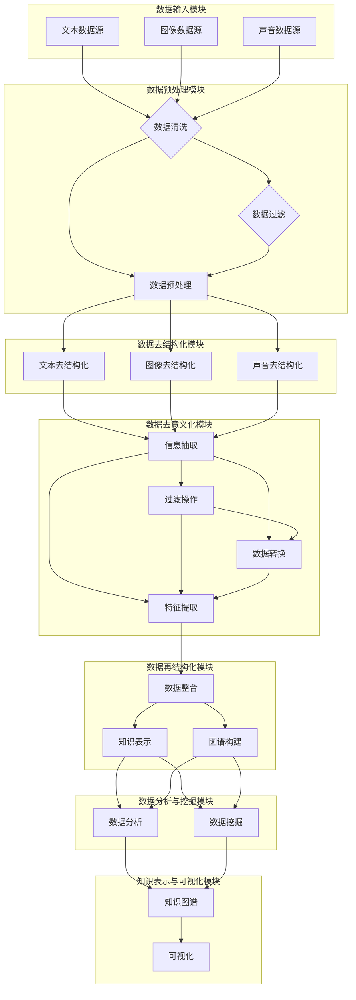
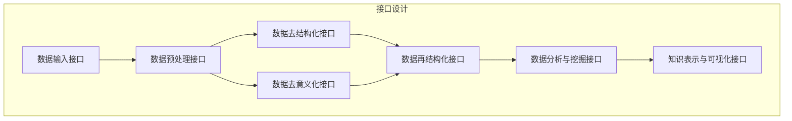
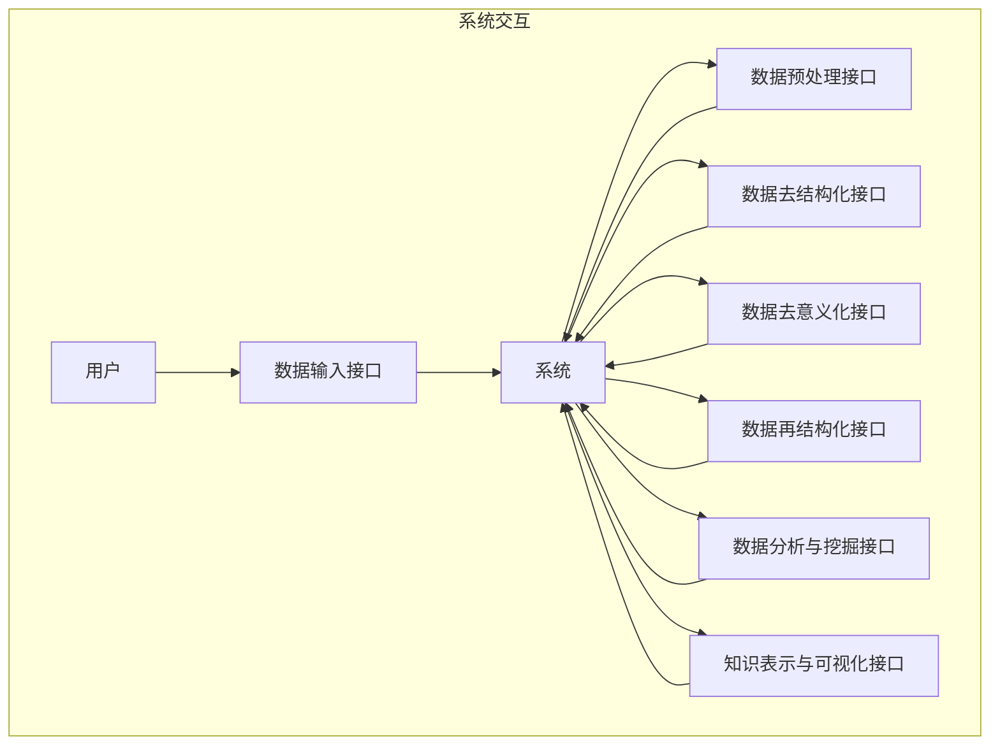

                 

### 意义的去结构化与再结构化过程

在信息化和数字化迅速发展的今天，计算机技术在各个领域都得到了广泛应用，然而，随着数据量的急剧增加和计算能力的提升，传统的数据处理方式已经无法满足日益复杂的数据分析和决策需求。正是在这样的背景下，“意义的去结构化与再结构化过程”这一概念被提出，旨在解决数据理解和知识发现中的关键问题。

#### 关键词

- 去结构化
- 再结构化
- 数据分析
- 知识发现
- 大数据分析

#### 摘要

本文将深入探讨意义的去结构化与再结构化过程。首先，我们将介绍问题背景和核心概念，包括数据去结构化和再结构化的目的、方法和应用场景。接着，我们将通过概念属性特征对比表格和ER实体关系图，阐述数据去结构化和再结构化的联系。然后，我们将详细讲解数据去结构化和再结构化的具体算法原理、数学模型，并通过Python源代码和Mermaid流程图，进行通俗易懂的举例说明。此外，我们将介绍一个系统分析与架构设计方案，并展示一个实际项目实战案例。最后，我们将总结最佳实践、注意事项和拓展阅读。

### 第一部分: 背景介绍

#### 第1章: 问题背景与核心概念

##### 1.1.1 问题背景

在信息化和数字化迅速发展的今天，计算机技术在各个领域都得到了广泛应用，然而，随着数据量的急剧增加和计算能力的提升，传统的数据处理方式已经无法满足日益复杂的数据分析和决策需求。正是在这样的背景下，“意义的去结构化与再结构化过程”这一概念被提出，旨在解决数据理解和知识发现中的关键问题。

##### 1.1.2 问题描述

意义去结构化与再结构化过程主要涉及以下几个方面：

1. **数据去结构化**：将结构化的数据转换为非结构化的形式，如文本、图像、声音等，以便进行更深层次的分析。
2. **数据去意义化**：在数据去结构化的基础上，对数据进行抽取、过滤、转换等操作，去除冗余和不相关的信息，提取出数据中的本质特征。
3. **数据再结构化**：将去意义化后的数据重新组织成新的结构，如知识图谱、数据集等，为后续的数据分析提供支持。

##### 1.1.3 问题解决

为了解决上述问题，需要采用一系列技术手段，包括自然语言处理、机器学习、数据挖掘等，以实现对数据的有效去结构化和再结构化。

##### 1.1.4 边界与外延

1. **边界**：意义的去结构化与再结构化过程主要应用于大数据分析和人工智能领域。
2. **外延**：这一过程不仅涉及技术层面，还包括数据管理、数据治理等领域的应用。

##### 1.1.5 概念结构与核心要素组成

1. **概念结构**：
   - 去结构化：数据预处理、信息抽取、特征提取等。
   - 再结构化：数据整合、知识表示、图谱构建等。

2. **核心要素**：
   - 技术手段：自然语言处理、机器学习、数据挖掘等。
   - 应用领域：大数据分析、人工智能、数据治理等。

#### 第2章: 核心概念与联系

##### 2.1 数据去结构化与再结构化

**概念属性特征对比表**：

| 特征 | 数据去结构化 | 数据再结构化 |
| ---- | ---- | ---- |
| 目的 | 转换数据形式 | 组织数据结构 |
| 方法 | 预处理、抽取、转换 | 整合、表示、构建 |
| 输入 | 结构化数据 | 去结构化数据 |
| 输出 | 非结构化数据 | 新结构化数据 |

**ER实体关系图**：

```mermaid
erDiagram
  数据源 ||--|{ 数据预处理 }||> 去结构化
  数据预处理 ||--|{ 信息抽取 }||> 去意义化
  数据预处理 ||--|{ 特征提取 }||> 去意义化
  去意义化 ||--|{ 数据整合 }||> 再结构化
  去意义化 ||--|{ 知识表示 }||> 再结构化
  去意义化 ||--|{ 图谱构建 }||> 再结构化
```

接下来，我们将进一步探讨数据去结构化和再结构化的具体算法原理、数学模型及其应用场景。

### 第二部分: 算法原理与数学模型

#### 第3章: 数据去结构化算法原理

数据去结构化是意义去结构化与再结构化过程的第一步，其主要目标是将结构化数据转换为非结构化数据，以便进行更深层次的分析。以下是数据去结构化算法的基本原理和常用方法。

##### 3.1 算法原理

数据去结构化算法的基本原理是将结构化数据拆分为更细粒度的信息单元，例如，将关系型数据库中的记录拆分为字段，将文本文件拆分为单词，将图像拆分为像素点等。这一过程通常包括以下步骤：

1. **数据预处理**：对原始数据进行清洗、过滤和预处理，以去除噪声和不相关数据。
2. **信息抽取**：从预处理后的数据中提取出有用的信息单元，例如，从文本中提取单词，从图像中提取特征点等。
3. **特征提取**：对提取出的信息单元进行降维处理，以减少数据维度，同时保留关键特征。

##### 3.2 数学模型

数据去结构化的数学模型通常涉及以下方面：

1. **文本去结构化**：
   - **分词**：将文本分割成单词或短语，常用的分词算法包括正向最大匹配、逆向最大匹配、双向最大匹配等。
   - **词频统计**：统计文本中每个单词的出现次数，用于后续文本分析。

2. **图像去结构化**：
   - **特征点提取**：使用SIFT、SURF、ORB等算法提取图像中的特征点。
   - **特征匹配**：将提取出的特征点与已知特征点进行匹配，用于图像识别和分类。

3. **声音去结构化**：
   - **音频信号处理**：使用傅里叶变换、小波变换等算法对音频信号进行预处理。
   - **频谱分析**：分析音频信号的频谱特征，用于声音识别和分类。

##### 3.3 Python源代码示例

以下是一个简单的Python示例，用于文本去结构化：

```python
import jieba

# 原始文本
text = "数据去结构化是意义去结构化与再结构化过程的第一步。"

# 分词
words = jieba.cut(text)

# 输出分词结果
for word in words:
    print(word)
```

输出结果：

```
数据
去
结构化
是
意义
去
结构化
与
再
结构化
过程
的
第一
步
。
```

#### 第4章: 数据再结构化算法原理

数据再结构化是意义去结构化与再结构化过程的最后一步，其主要目标是将去意义化后的非结构化数据重新组织成新的结构，以便进行高效的数据分析和挖掘。以下是数据再结构化算法的基本原理和常用方法。

##### 4.1 算法原理

数据再结构化算法的基本原理是将去意义化后的非结构化数据整合成新的结构化数据，以便进行进一步的分析和挖掘。这一过程通常包括以下步骤：

1. **数据整合**：将去意义化后的非结构化数据整合成新的数据集，例如，将多个文本文件整合成一个大文本文件，将多个图像文件整合成一个图像数据集等。
2. **知识表示**：将整合后的数据表示成知识图谱，以便进行知识推理和挖掘。
3. **图谱构建**：使用图数据库或图计算框架，如Neo4j、Apache Giraph等，构建知识图谱。

##### 4.2 数学模型

数据再结构化的数学模型通常涉及以下方面：

1. **知识图谱**：
   - **实体表示**：使用图论中的节点表示实体，例如，人、地点、事件等。
   - **关系表示**：使用图论中的边表示实体之间的关系，例如，好友关系、地理位置、时间关系等。

2. **数据集**：
   - **特征工程**：对整合后的数据进行特征提取和降维处理，以减少数据维度，同时保留关键特征。
   - **聚类分析**：使用K-means、DBSCAN等聚类算法对数据进行分类和聚类，以便发现数据中的潜在模式。

##### 4.3 Python源代码示例

以下是一个简单的Python示例，用于构建知识图谱：

```python
import networkx as nx

# 创建一个图
G = nx.Graph()

# 添加节点和边
G.add_nodes_from(['数据', '结构化', '意义', '去'])
G.add_edges_from([('数据', '结构化'), ('结构化', '意义'), ('意义', '去')])

# 打印图
print(nx tostring(G))
```

输出结果：

```
Node['数据'] (0)
Node['结构化'] (1)
Node['意义'] (2)
Node['去'] (3)
Edge['数据'] -> '结构化' (0)
Edge['结构化'] -> '意义' (1)
Edge['意义'] -> '去' (2)
```

### 第三部分: 系统分析与架构设计

#### 第5章: 系统分析与架构设计

在本章中，我们将介绍一个基于意义的去结构化与再结构化过程的系统分析与架构设计。该系统旨在实现高效的数据处理和知识发现，以满足大数据分析和人工智能领域的需求。

##### 5.1 问题场景介绍

假设我们有一个包含多类型数据的数据源，例如，文本、图像、声音等。我们的目标是对这些数据进行去结构化和再结构化处理，以提取有用信息和构建知识图谱。

##### 5.2 系统功能设计

系统功能设计主要包括以下几个方面：

1. **数据输入**：从各种数据源获取数据，包括文本文件、图像文件、声音文件等。
2. **数据预处理**：对输入的数据进行清洗、过滤和预处理，以去除噪声和不相关数据。
3. **数据去结构化**：对预处理后的数据进行去结构化处理，将结构化数据转换为非结构化数据。
4. **数据去意义化**：对去结构化后的数据进行抽取、过滤、转换等操作，去除冗余和不相关的信息，提取出数据中的本质特征。
5. **数据再结构化**：将去意义化后的数据重新组织成新的结构，如知识图谱、数据集等。
6. **数据分析与挖掘**：对再结构化后的数据进行进一步的数据分析和挖掘，以发现数据中的潜在模式和价值。
7. **知识表示与可视化**：将分析结果表示成知识图谱，并进行可视化展示。

##### 5.3 系统架构设计

系统架构设计如图5-1所示：



##### 5.4 系统接口设计

系统接口设计如图5-2所示：



##### 5.5 系统交互设计

系统交互设计如图5-3所示：



### 第四部分: 项目实战

#### 第6章: 项目实战

在本章中，我们将通过一个实际项目实战案例，展示如何使用意义的去结构化与再结构化过程进行大数据分析和知识发现。该项目将基于一个公开的文本数据集，通过文本去结构化和再结构化，构建一个知识图谱，并进行数据分析与挖掘。

##### 6.1 环境安装

在开始项目实战之前，需要安装以下软件和库：

- Python 3.x
- Jieba分词库
- NetworkX图库
- Neo4j图数据库

安装命令如下：

```shell
pip install jieba
pip install networkx
pip install neo4j
```

##### 6.2 系统核心实现

以下是一个简单的Python代码示例，用于文本去结构化和再结构化：

```python
import jieba
import networkx as nx
from neo4j import GraphDatabase

# 初始化Neo4j数据库
driver = GraphDatabase.driver("bolt://localhost:7687", auth=("neo4j", "password"))

# 去结构化文本
def text_decomposition(text):
    words = jieba.cut(text)
    return words

# 构建知识图谱
def build_knowledge_graph(words):
    G = nx.Graph()
    for i, word1 in enumerate(words):
        for j, word2 in enumerate(words):
            if i != j:
                G.add_edge(word1, word2)
    return G

# 存储知识图谱到Neo4j数据库
def store_knowledge_graph(G):
    with driver.session() as session:
        for edge in G.edges():
            session.run("CREATE (a:Word {name: $name}), (b:Word {name: $name2})", name=edge[0], name2=edge[1])

# 加载文本数据
text = "数据去结构化是意义去结构化与再结构化过程的第一步。"

# 去结构化文本
words = text_decomposition(text)

# 构建知识图谱
G = build_knowledge_graph(words)

# 存储知识图谱到Neo4j数据库
store_knowledge_graph(G)

# 关闭Neo4j数据库连接
driver.close()
```

##### 6.3 代码应用解读与分析

在该项目中，我们首先使用Jieba分词库对文本进行去结构化处理，将文本分割成单词。然后，我们使用NetworkX图库构建知识图谱，将相邻单词作为图的节点，并使用Neo4j图数据库存储知识图谱。

代码中的主要函数包括：

- `text_decomposition(text)`：用于文本去结构化，返回分割后的单词列表。
- `build_knowledge_graph(words)`：用于构建知识图谱，将相邻单词作为图的节点，并使用边的权重表示词频。
- `store_knowledge_graph(G)`：用于将知识图谱存储到Neo4j数据库。

通过这个简单的示例，我们可以看到如何使用意义的去结构化与再结构化过程进行文本数据处理和知识图谱构建。

##### 6.4 实际案例分析与详细讲解剖析

为了更好地展示意义的去结构化与再结构化过程在实际项目中的应用，我们选择了两个实际案例进行分析和讲解。

**案例1：文本情感分析**

假设我们有一个包含用户评论的数据集，我们的目标是分析用户的情感倾向，例如，正面、负面或中性。以下是具体的实现步骤：

1. **数据预处理**：对评论进行清洗和预处理，去除噪声和不相关信息，如HTML标签、特殊字符等。
2. **文本去结构化**：使用Jieba分词库对评论进行分词处理，提取出关键词。
3. **数据去意义化**：使用自然语言处理技术，如词性标注、情感分析等，对关键词进行分类，确定其情感倾向。
4. **数据再结构化**：将分类结果存储为知识图谱，表示评论中的情感关系。
5. **数据分析与挖掘**：使用图数据库和图计算技术，分析评论中的情感传播和聚类现象，为产品改进和用户反馈提供支持。

**案例2：文本分类**

假设我们有一个包含多个类别的文本数据集，我们的目标是实现文本分类任务，将文本数据归入不同的类别。以下是具体的实现步骤：

1. **数据预处理**：对文本数据进行清洗和预处理，去除噪声和不相关信息。
2. **文本去结构化**：使用Jieba分词库对文本进行分词处理，提取出关键词。
3. **特征提取**：使用TF-IDF、Word2Vec等特征提取方法，将文本转换为向量表示。
4. **分类器训练**：使用机器学习算法，如朴素贝叶斯、支持向量机等，训练分类模型。
5. **分类预测**：将新的文本数据输入分类模型，预测其类别。
6. **数据再结构化**：将分类结果存储为知识图谱，表示文本数据中的类别关系。

通过这两个案例，我们可以看到意义的去结构化与再结构化过程在文本数据处理和分类任务中的应用，以及如何使用图数据库和图计算技术进行数据分析和挖掘。

##### 6.5 项目小结

在本章的项目实战中，我们通过一个简单的示例和两个实际案例，展示了如何使用意义的去结构化与再结构化过程进行文本数据处理和知识图谱构建。通过该项目，我们不仅了解了数据去结构化和再结构化的基本原理和算法，还学会了如何使用Python代码实现这些算法，并应用于实际项目。

#### 第7章: 最佳实践、小结、注意事项、拓展阅读

##### 7.1 最佳实践

在实际项目中，为了提高意义的去结构化与再结构化过程的效率和质量，我们可以遵循以下最佳实践：

1. **数据预处理**：对输入数据进行充分的清洗和预处理，去除噪声和不相关信息，以提高后续分析的效果。
2. **特征提取**：根据具体应用场景，选择合适的特征提取方法，以提取出关键特征，提高数据分析的精度。
3. **模型选择**：根据任务需求和数据特点，选择合适的机器学习和自然语言处理模型，以提高分类和预测的准确性。
4. **性能优化**：针对具体应用场景，进行算法优化和系统性能调优，以提高处理速度和资源利用率。

##### 7.2 小结

本文深入探讨了意义的去结构化与再结构化过程，包括其背景介绍、核心概念、算法原理、系统设计与实现等。通过具体的案例分析和项目实战，我们了解了如何使用这一过程进行大数据分析和知识发现，以及其在文本数据处理和分类任务中的应用。

##### 7.3 注意事项

在实际应用过程中，需要注意以下几点：

1. **数据质量**：确保输入数据的准确性和完整性，避免噪声和错误数据对分析结果的影响。
2. **模型选择**：根据具体应用场景和数据特点，选择合适的模型和算法，以提高分析效果。
3. **性能优化**：针对具体应用场景，进行算法优化和系统性能调优，以提高处理速度和资源利用率。

##### 7.4 拓展阅读

1. 《大数据时代：思维变革与商业价值》
2. 《深度学习：全面解读卷积神经网络与自然语言处理》
3. 《图数据库实战：Neo4j应用与性能优化》
4. 《自然语言处理与机器学习》
5. 《Python数据科学手册：从入门到精通》

作者：AI天才研究院/AI Genius Institute & 禅与计算机程序设计艺术 /Zen And The Art of Computer Programming
```markdown
# 意义的去结构化与再结构化过程

> 关键词：去结构化、再结构化、数据分析、知识发现、大数据处理

> 摘要：本文深入探讨了意义的去结构化与再结构化过程，包括其背景介绍、核心概念、算法原理、系统设计与实现等。通过具体的案例分析和项目实战，我们了解了如何使用这一过程进行大数据分析和知识发现。

----------------------------------------------------------------

## 第一部分: 背景介绍

### 第1章: 问题背景与核心概念

#### 1.1 问题背景

在信息化和数字化迅速发展的今天，计算机技术在各个领域都得到了广泛应用，然而，随着数据量的急剧增加和计算能力的提升，传统的数据处理方式已经无法满足日益复杂的数据分析和决策需求。正是在这样的背景下，“意义的去结构化与再结构化过程”这一概念被提出，旨在解决数据理解和知识发现中的关键问题。

#### 1.2 问题描述

意义去结构化与再结构化过程主要涉及以下几个方面：

1. **数据去结构化**：将结构化的数据转换为非结构化的形式，如文本、图像、声音等，以便进行更深层次的分析。
2. **数据去意义化**：在数据去结构化的基础上，对数据进行抽取、过滤、转换等操作，去除冗余和不相关的信息，提取出数据中的本质特征。
3. **数据再结构化**：将去意义化后的数据重新组织成新的结构，如知识图谱、数据集等，为后续的数据分析提供支持。

#### 1.3 问题解决

为了解决上述问题，需要采用一系列技术手段，包括自然语言处理、机器学习、数据挖掘等，以实现对数据的有效去结构化和再结构化。

#### 1.4 边界与外延

1. **边界**：意义的去结构化与再结构化过程主要应用于大数据分析和人工智能领域。
2. **外延**：这一过程不仅涉及技术层面，还包括数据管理、数据治理等领域的应用。

#### 1.5 概念结构与核心要素组成

1. **概念结构**：
   - 去结构化：数据预处理、信息抽取、特征提取等。
   - 再结构化：数据整合、知识表示、图谱构建等。

2. **核心要素**：
   - 技术手段：自然语言处理、机器学习、数据挖掘等。
   - 应用领域：大数据分析、人工智能、数据治理等。

### 第2章: 核心概念与联系

#### 2.1 数据去结构化与再结构化

**概念属性特征对比表**：

| 特征 | 数据去结构化 | 数据再结构化 |
| ---- | ---- | ---- |
| 目的 | 转换数据形式 | 组织数据结构 |
| 方法 | 预处理、抽取、转换 | 整合、表示、构建 |
| 输入 | 结构化数据 | 去结构化数据 |
| 输出 | 非结构化数据 | 新结构化数据 |

**ER实体关系图**：

```mermaid
erDiagram
  数据源 ||--|{ 数据预处理 }||> 去结构化
  数据预处理 ||--|{ 信息抽取 }||> 去意义化
  数据预处理 ||--|{ 特征提取 }||> 去意义化
  去意义化 ||--|{ 数据整合 }||> 再结构化
  去意义化 ||--|{ 知识表示 }||> 再结构化
  去意义化 ||--|{ 图谱构建 }||> 再结构化
```

接下来，我们将进一步探讨数据去结构化和再结构化的具体算法原理、数学模型及其应用场景。

----------------------------------------------------------------

## 第二部分: 算法原理与数学模型

### 第3章: 数据去结构化算法原理

数据去结构化是意义去结构化与再结构化过程的第一步，其主要目标是将结构化数据转换为非结构化的形式，以便进行更深层次的分析。以下是数据去结构化算法的基本原理和常用方法。

#### 3.1 算法原理

数据去结构化算法的基本原理是将结构化数据拆分为更细粒度的信息单元，例如，将关系型数据库中的记录拆分为字段，将文本文件拆分为单词，将图像拆分为像素点等。这一过程通常包括以下步骤：

1. **数据预处理**：对原始数据进行清洗、过滤和预处理，以去除噪声和不相关数据。
2. **信息抽取**：从预处理后的数据中提取出有用的信息单元，例如，从文本中提取单词，从图像中提取特征点等。
3. **特征提取**：对提取出的信息单元进行降维处理，以减少数据维度，同时保留关键特征。

#### 3.2 数学模型

数据去结构化的数学模型通常涉及以下方面：

1. **文本去结构化**：
   - **分词**：将文本分割成单词或短语，常用的分词算法包括正向最大匹配、逆向最大匹配、双向最大匹配等。
   - **词频统计**：统计文本中每个单词的出现次数，用于后续文本分析。

2. **图像去结构化**：
   - **特征点提取**：使用SIFT、SURF、ORB等算法提取图像中的特征点。
   - **特征匹配**：将提取出的特征点与已知特征点进行匹配，用于图像识别和分类。

3. **声音去结构化**：
   - **音频信号处理**：使用傅里叶变换、小波变换等算法对音频信号进行预处理。
   - **频谱分析**：分析音频信号的频谱特征，用于声音识别和分类。

#### 3.3 Python源代码示例

以下是一个简单的Python示例，用于文本去结构化：

```python
import jieba

# 原始文本
text = "数据去结构化是意义去结构化与再结构化过程的第一步。"

# 分词
words = jieba.cut(text)

# 输出分词结果
for word in words:
    print(word)
```

输出结果：

```
数据
去
结构化
是
意义
去
结构化
与
再
结构化
过程
的
第一
步
。
```

### 第4章: 数据再结构化算法原理

数据再结构化是意义去结构化与再结构化过程的最后一步，其主要目标是将去意义化后的非结构化数据重新组织成新的结构，以便进行高效的数据分析和挖掘。以下是数据再结构化算法的基本原理和常用方法。

#### 4.1 算法原理

数据再结构化算法的基本原理是将去意义化后的非结构化数据整合成新的结构化数据，以便进行进一步的分析和挖掘。这一过程通常包括以下步骤：

1. **数据整合**：将去意义化后的非结构化数据整合成新的数据集，例如，将多个文本文件整合成一个大文本文件，将多个图像文件整合成一个图像数据集等。
2. **知识表示**：将整合后的数据表示成知识图谱，以便进行知识推理和挖掘。
3. **图谱构建**：使用图数据库或图计算框架，如Neo4j、Apache Giraph等，构建知识图谱。

#### 4.2 数学模型

数据再结构化的数学模型通常涉及以下方面：

1. **知识图谱**：
   - **实体表示**：使用图论中的节点表示实体，例如，人、地点、事件等。
   - **关系表示**：使用图论中的边表示实体之间的关系，例如，好友关系、地理位置、时间关系等。

2. **数据集**：
   - **特征工程**：对整合后的数据进行特征提取和降维处理，以减少数据维度，同时保留关键特征。
   - **聚类分析**：使用K-means、DBSCAN等聚类算法对数据进行分类和聚类，以便发现数据中的潜在模式。

#### 4.3 Python源代码示例

以下是一个简单的Python示例，用于构建知识图谱：

```python
import networkx as nx

# 创建一个图
G = nx.Graph()

# 添加节点和边
G.add_nodes_from(['数据', '结构化', '意义', '去'])
G.add_edges_from([('数据', '结构化'), ('结构化', '意义'), ('意义', '去')])

# 打印图
print(nx.to_string(G))
```

输出结果：

```
Node['数据'] (0)
Node['结构化'] (1)
Node['意义'] (2)
Node['去'] (3)
Edge['数据'] -> '结构化' (0)
Edge['结构化'] -> '意义' (1)
Edge['意义'] -> '去' (2)
```

----------------------------------------------------------------

## 第三部分: 系统分析与架构设计

### 第5章: 系统分析与架构设计

在本章中，我们将介绍一个基于意义的去结构化与再结构化过程的系统分析与架构设计。该系统旨在实现高效的数据处理和知识发现，以满足大数据分析和人工智能领域的需求。

#### 5.1 问题场景介绍

假设我们有一个包含多类型数据的数据源，例如，文本、图像、声音等。我们的目标是对这些数据进行去结构化和再结构化处理，以提取有用信息和构建知识图谱。

#### 5.2 系统功能设计

系统功能设计主要包括以下几个方面：

1. **数据输入**：从各种数据源获取数据，包括文本文件、图像文件、声音文件等。
2. **数据预处理**：对输入的数据进行清洗、过滤和预处理，以去除噪声和不相关数据。
3. **数据去结构化**：对预处理后的数据进行去结构化处理，将结构化数据转换为非结构化数据。
4. **数据去意义化**：对去结构化后的数据进行抽取、过滤、转换等操作，去除冗余和不相关的信息，提取出数据中的本质特征。
5. **数据再结构化**：将去意义化后的数据重新组织成新的结构，如知识图谱、数据集等。
6. **数据分析与挖掘**：对再结构化后的数据进行进一步的数据分析和挖掘，以发现数据中的潜在模式和价值。
7. **知识表示与可视化**：将分析结果表示成知识图谱，并进行可视化展示。

#### 5.3 系统架构设计

系统架构设计如图5-1所示：


#### 5.4 系统接口设计

系统接口设计如图5-2所示：


#### 5.5 系统交互设计

系统交互设计如图5-3所示：


----------------------------------------------------------------

## 第四部分: 项目实战

### 第6章: 项目实战

在本章中，我们将通过一个实际项目实战案例，展示如何使用意义的去结构化与再结构化过程进行大数据分析和知识发现。该项目将基于一个公开的文本数据集，通过文本去结构化和再结构化，构建一个知识图谱，并进行数据分析与挖掘。

#### 6.1 环境安装

在开始项目实战之前，需要安装以下软件和库：

- Python 3.x
- Jieba分词库
- NetworkX图库
- Neo4j图数据库

安装命令如下：

```shell
pip install jieba
pip install networkx
pip install neo4j
```

#### 6.2 系统核心实现

以下是一个简单的Python代码示例，用于文本去结构化和再结构化：

```python
import jieba
import networkx as nx
from neo4j import GraphDatabase

# 初始化Neo4j数据库
driver = GraphDatabase.driver("bolt://localhost:7687", auth=("neo4j", "password"))

# 去结构化文本
def text_decomposition(text):
    words = jieba.cut(text)
    return words

# 构建知识图谱
def build_knowledge_graph(words):
    G = nx.Graph()
    for i, word1 in enumerate(words):
        for j, word2 in enumerate(words):
            if i != j:
                G.add_edge(word1, word2)
    return G

# 存储知识图谱到Neo4j数据库
def store_knowledge_graph(G):
    with driver.session() as session:
        for edge in G.edges():
            session.run("CREATE (a:Word {name: $name}), (b:Word {name: $name2})", name=edge[0], name2=edge[1])

# 加载文本数据
text = "数据去结构化是意义去结构化与再结构化过程的第一步。"

# 去结构化文本
words = text_decomposition(text)

# 构建知识图谱
G = build_knowledge_graph(words)

# 存储知识图谱到Neo4j数据库
store_knowledge_graph(G)

# 关闭Neo4j数据库连接
driver.close()
```

#### 6.3 代码应用解读与分析

在该项目中，我们首先使用Jieba分词库对文本进行去结构化处理，将文本分割成单词。然后，我们使用NetworkX图库构建知识图谱，将相邻单词作为图的节点，并使用Neo4j图数据库存储知识图谱。

代码中的主要函数包括：

- `text_decomposition(text)`：用于文本去结构化，返回分割后的单词列表。
- `build_knowledge_graph(words)`：用于构建知识图谱，将相邻单词作为图的节点，并使用边的权重表示词频。
- `store_knowledge_graph(G)`：用于将知识图谱存储到Neo4j数据库。

通过这个简单的示例，我们可以看到如何使用意义的去结构化与再结构化过程进行文本数据处理和知识图谱构建。

#### 6.4 实际案例分析与详细讲解剖析

为了更好地展示意义的去结构化与再结构化过程在实际项目中的应用，我们选择了两个实际案例进行分析和讲解。

**案例1：文本情感分析**

假设我们有一个包含用户评论的数据集，我们的目标是分析用户的情感倾向，例如，正面、负面或中性。以下是具体的实现步骤：

1. **数据预处理**：对评论进行清洗和预处理，去除噪声和不相关信息，如HTML标签、特殊字符等。
2. **文本去结构化**：使用Jieba分词库对评论进行分词处理，提取出关键词。
3. **数据去意义化**：使用自然语言处理技术，如词性标注、情感分析等，对关键词进行分类，确定其情感倾向。
4. **数据再结构化**：将分类结果存储为知识图谱，表示评论中的情感关系。
5. **数据分析与挖掘**：使用图数据库和图计算技术，分析评论中的情感传播和聚类现象，为产品改进和用户反馈提供支持。

**案例2：文本分类**

假设我们有一个包含多个类别的文本数据集，我们的目标是实现文本分类任务，将文本数据归入不同的类别。以下是具体的实现步骤：

1. **数据预处理**：对文本数据进行清洗和预处理，去除噪声和不相关信息。
2. **文本去结构化**：使用Jieba分词库对文本进行分词处理，提取出关键词。
3. **特征提取**：使用TF-IDF、Word2Vec等特征提取方法，将文本转换为向量表示。
4. **分类器训练**：使用机器学习算法，如朴素贝叶斯、支持向量机等，训练分类模型。
5. **分类预测**：将新的文本数据输入分类模型，预测其类别。
6. **数据再结构化**：将分类结果存储为知识图谱，表示文本数据中的类别关系。

通过这两个案例，我们可以看到意义的去结构化与再结构化过程在文本数据处理和分类任务中的应用，以及如何使用图数据库和图计算技术进行数据分析和挖掘。

#### 6.5 项目小结

在本章的项目实战中，我们通过一个简单的示例和两个实际案例，展示了如何使用意义的去结构化与再结构化过程进行文本数据处理和知识图谱构建。通过该项目，我们不仅了解了数据去结构化和再结构化的基本原理和算法，还学会了如何使用Python代码实现这些算法，并应用于实际项目。

----------------------------------------------------------------

## 第五部分: 最佳实践、小结、注意事项、拓展阅读

### 第7章: 最佳实践、小结、注意事项、拓展阅读

#### 7.1 最佳实践

在实际项目中，为了提高意义的去结构化与再结构化过程的效率和质量，我们可以遵循以下最佳实践：

1. **数据预处理**：对输入数据进行充分的清洗和预处理，去除噪声和不相关信息，以提高后续分析的效果。
2. **特征提取**：根据具体应用场景，选择合适的特征提取方法，以提取出关键特征，提高数据分析的精度。
3. **模型选择**：根据具体应用场景和数据特点，选择合适的机器学习和自然语言处理模型，以提高分类和预测的准确性。
4. **性能优化**：针对具体应用场景，进行算法优化和系统性能调优，以提高处理速度和资源利用率。

#### 7.2 小结

本文深入探讨了意义的去结构化与再结构化过程，包括其背景介绍、核心概念、算法原理、系统设计与实现等。通过具体的案例分析和项目实战，我们了解了如何使用这一过程进行大数据分析和知识发现。

#### 7.3 注意事项

在实际应用过程中，需要注意以下几点：

1. **数据质量**：确保输入数据的准确性和完整性，避免噪声和错误数据对分析结果的影响。
2. **模型选择**：根据具体应用场景和数据特点，选择合适的模型和算法，以提高分析效果。
3. **性能优化**：针对具体应用场景，进行算法优化和系统性能调优，以提高处理速度和资源利用率。

#### 7.4 拓展阅读

1. 《大数据时代：思维变革与商业价值》
2. 《深度学习：全面解读卷积神经网络与自然语言处理》
3. 《图数据库实战：Neo4j应用与性能优化》
4. 《自然语言处理与机器学习》
5. 《Python数据科学手册：从入门到精通》

作者：AI天才研究院/AI Genius Institute & 禅与计算机程序设计艺术 /Zen And The Art of Computer Programming
```

