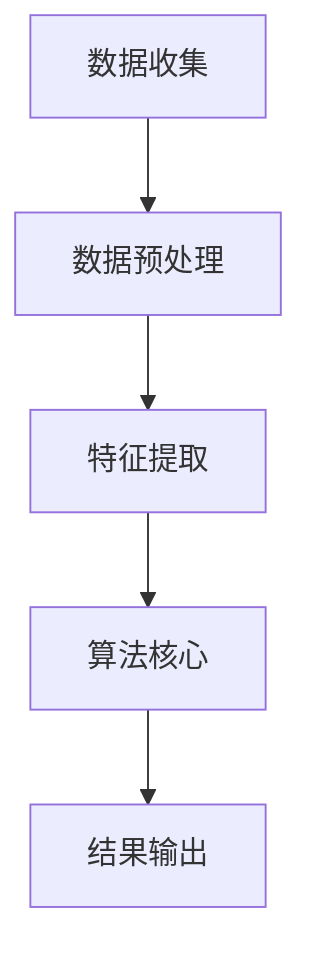
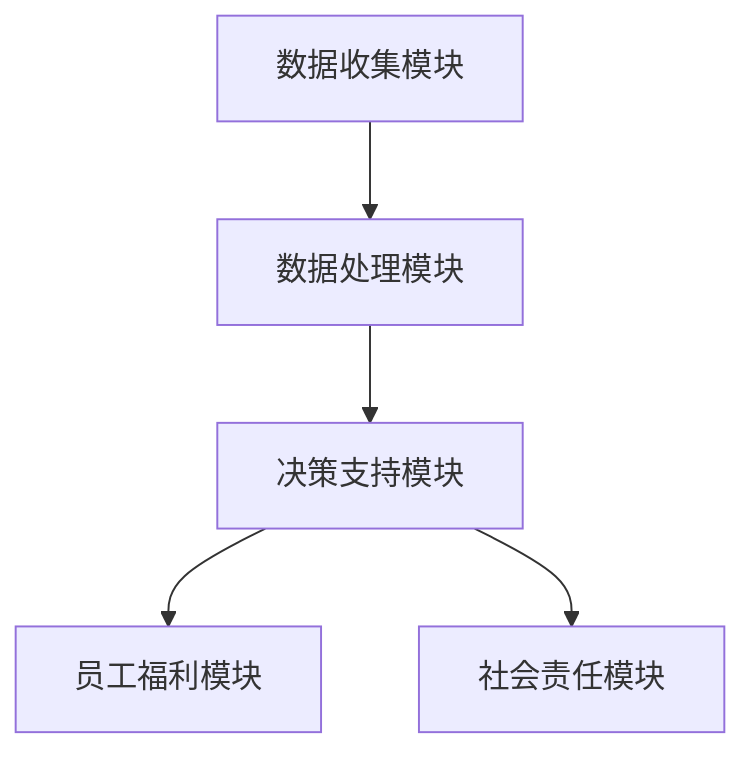
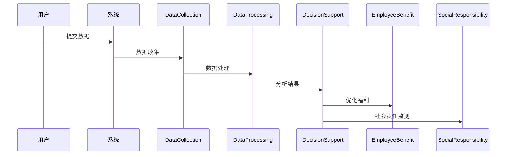

                 

### 《意义的商业化与人性化矛盾》

#### 关键词：商业化、人性化、矛盾、解决方案、案例分析

> 在当代社会中，商业化和人性化是两个相互交织却又往往产生矛盾的概念。商业化代表了企业追求利润和市场占有率的动力，而人性化则强调了在商业活动中对人的关怀和尊重。随着技术的进步和社会的变迁，这两者的矛盾愈发显现，成为我们需要深入思考和解决的重要问题。

#### 摘要：

本文旨在探讨商业化和人性化的矛盾，分析其在现实中的表现和影响，并提出可能的解决方案。首先，我们将介绍商业化与人性化的背景和定义，探讨它们的起源和发展。接着，通过实际案例，分析商业化与人性化的冲突及其对企业和员工的影响。然后，我们将提出解决这一矛盾的策略，并讨论可能的未来方向。文章的最后一部分将对全文进行总结，并提出进一步研究的建议。

---

## # 第一部分：背景介绍

### 1.1 问题背景

#### 1.1.1 商业化的崛起

商业化是指企业通过市场交换获取利润的过程。在市场经济体制下，商业化成为驱动经济发展的重要动力。随着全球化和信息技术的发展，商业化在各个领域迅速扩张，从传统制造业到互联网企业，无不以利润最大化为目标。

#### 1.1.2 人性化的需求

人性化则强调在商业活动中对人的关怀和尊重。随着人们生活水平的提高和价值观的变化，越来越多的人开始关注工作环境、员工福利和社会责任。人性化不仅体现在员工关系管理上，还包括企业对社会的责任和对环境的保护。

#### 1.1.3 商业化与人性化的矛盾

商业化追求利润最大化，可能导致对成本和效率的过分追求，从而忽视了对员工的关怀和对社会的责任。而人性化则强调对人的尊重和关怀，可能会增加企业的运营成本，影响其市场竞争力。这两者之间的矛盾在企业运营中屡见不鲜，如何平衡二者成为一项挑战。

### 1.2 问题描述

#### 1.2.1 商业化对人性化的影响

商业化可能导致企业对员工的剥削和对环境的破坏。例如，为了降低成本，企业可能会减少员工福利或牺牲环境保护。

#### 1.2.2 人性化对商业化的阻碍

人性化强调员工福利和社会责任，可能会增加企业的运营成本，从而影响其盈利能力。例如，企业投入更多的资源用于员工培训和福利，可能会减少用于市场开拓和产品研发的资金。

#### 1.2.3 矛盾的解决之道

解决商业化与人性化的矛盾需要从制度、文化和技术创新等多方面入手。首先，企业需要建立合理的激励机制，平衡利润和员工的利益。其次，企业可以通过文化建设和员工参与，增强员工的主人翁意识，减少矛盾。最后，技术创新可以为商业化与人性化提供新的解决方案，例如，利用数据分析优化资源分配，提高效率，同时保障员工的权益。

### 1.3 问题解决

#### 1.3.1 理论探讨

我们可以从经济学、管理学和心理学等多个角度探讨商业化与人性化的关系，分析其内在机制和影响因素。这有助于我们更深入地理解问题的本质，为提出解决方案提供理论基础。

#### 1.3.2 实际案例

通过分析现实中的企业案例，我们可以看到商业化与人性化在实际操作中的具体表现和影响。这些案例有助于我们验证理论，并从中吸取经验教训。

#### 1.3.3 未来展望

随着社会的发展和技术的进步，商业化与人性化之间的关系将不断演变。我们需要关注这些变化，并探索新的解决方案，以适应未来的挑战。

### 1.4 边界与外延

#### 1.4.1 研究范围的界定

本文主要关注商业化与人性化在企业运营中的矛盾及其解决方案。虽然这一矛盾在其他领域也存在，但本文将不涉及这些领域。

#### 1.4.2 研究方法的确定

本文采用文献综述和案例分析相结合的方法，通过对相关理论和实际案例的分析，探讨商业化与人性化的矛盾及其解决之道。

#### 1.4.3 研究的意义与价值

本文的研究有助于我们更深入地理解商业化与人性化之间的关系，为企业和政策制定者提供有益的参考。同时，本文的研究也为进一步探索这一领域提供了基础。

### 1.5 概念结构与核心要素组成

#### 1.5.1 商业化与人性化的定义

商业化是指企业通过市场交换获取利润的过程。人性化则强调在商业活动中对人的关怀和尊重。

#### 1.5.2 商业化与人性化的核心要素

商业化的核心要素包括市场需求、竞争环境、企业战略等。人性化的核心要素包括员工福利、社会责任、企业文化等。

#### 1.5.3 商业化与人性化的关系

商业化与人性化之间存在矛盾，但在一定程度上也可以相互促进。合理的商业化可以为企业提供资金支持，而人性化则可以提高员工的满意度和忠诚度，促进企业的长期发展。

## # 第二部分：核心概念与联系

### 2.1 核心概念原理

#### 2.1.1 商业化的原理

商业化是企业追求利润和市场占有率的过程。它通过满足市场需求、优化资源配置和提升竞争力来实现企业的目标。

##### 2.1.1.1 商业化概念定义

商业化是指企业通过市场交换获取利润的过程。它不仅包括产品的销售，还包括品牌建设、市场开拓和客户服务等方面。

##### 2.1.1.2 商业化特点分析

商业化的特点包括市场导向、竞争激烈、盈利性强和不确定性高。

##### 2.1.1.3 商业化的影响因素

商业化的影响因素包括市场需求、竞争环境、企业战略、技术进步和宏观经济环境等。

#### 2.1.2 人性化的原理

人性化是指企业在商业活动中对人的关怀和尊重。它强调员工福利、社会责任和企业文化，以提高员工的满意度和忠诚度。

##### 2.1.2.1 人性化概念定义

人性化是指企业在商业活动中对人的关怀和尊重。它不仅包括员工福利，还包括企业社会责任、企业文化等方面。

##### 2.1.2.2 人性化特点分析

人性化的特点包括以人为本、注重员工福利、关注社会责任和追求企业可持续发展。

##### 2.1.2.3 人性化的影响因素

人性化的影响因素包括企业文化、员工需求、社会责任和法律法规等。

### 2.2 概念属性特征对比表格

#### 2.2.1 商业化与人性化的对比

| 特征               | 商业化                   | 人性化                   |
|--------------------|--------------------------|--------------------------|
| 目标               | 利润最大化、市场占有率   | 员工福利、社会责任       |
| 导向               | 市场导向                 | 人本导向                 |
| 方法               | 竞争激烈、效率优先       | 情感投入、注重沟通       |
| 手段               | 成本控制、创新驱动       | 员工参与、社会责任承担  |
| 结果影响           | 盈利能力、市场竞争力     | 员工满意度、社会形象     |

### 2.3 ER实体关系图架构

#### 2.3.1 商业化与人性化的实体关系

```mermaid
erDiagram
  Commercialization ||--|{ Employee } : "实现"
  Humanization ||--|{ Employee } : "关怀"
```

##### 2.3.1.1 实体定义

- **商业化**：指企业通过市场交换获取利润的过程。
- **人性化**：指企业在商业活动中对人的关怀和尊重。

##### 2.3.1.2 实体属性

- **商业化**：市场需求、竞争环境、企业战略等。
- **人性化**：员工福利、社会责任、企业文化等。

##### 2.3.1.3 实体关系

- **商业化与员工**：商业化通过实现员工目标和提升员工福利来实现。
- **人性化与员工**：人性化通过关怀员工需求和提升员工满意度来实现。

## # 第三部分：算法原理讲解

### 3.1 算法原理讲解

#### 3.1.1 算法概述

商业化和人性化矛盾解决算法旨在通过系统化的方法，在商业化过程中引入人性化因素，实现二者的平衡。算法的基本流程包括数据收集、预处理、特征提取、算法核心和结果输出。

##### 3.1.1.1 算法目的

算法的目的是通过分析商业化和人性化的影响因素，提出解决方案，以实现企业长期可持续发展。

##### 3.1.1.2 算法基本流程

1. 数据收集：收集与商业化和人性化相关的数据，包括企业财务数据、员工满意度调查、市场环境等。
2. 数据预处理：对收集到的数据进行清洗、归一化等处理，为后续分析做准备。
3. 特征提取：从预处理后的数据中提取关键特征，如利润率、员工满意度、社会责任得分等。
4. 算法核心：通过机器学习算法，如线性回归、支持向量机等，对提取的特征进行分析，找出商业化与人性化的相关性。
5. 结果输出：根据分析结果，提出针对性的解决方案，如调整企业战略、优化员工福利等。

##### 3.1.1.3 算法应用领域

算法可以应用于各个行业的商业活动中，尤其是那些需要平衡利润与员工福利的企业。例如，制造业、服务业、IT行业等。

#### 3.1.2 算法mermaid流程图



#### 3.1.3 算法Python源代码

```python
import pandas as pd
from sklearn.linear_model import LinearRegression
from sklearn.model_selection import train_test_split

# 数据收集
data = pd.read_csv('data.csv')

# 数据预处理
data = preprocess_data(data)

# 特征提取
X = data[['profit', 'employee_satisfaction', 'social_responsibility']]
y = data['balance_score']

# 数据划分
X_train, X_test, y_train, y_test = train_test_split(X, y, test_size=0.2, random_state=42)

# 算法核心
model = LinearRegression()
model.fit(X_train, y_train)

# 结果输出
predictions = model.predict(X_test)
print(predictions)
```

#### 3.1.4 算法原理数学模型和公式

$$
\text{商业化影响因子} = f(\text{市场需求}, \text{竞争环境}, \text{企业战略})
$$
$$
\text{人性化影响因子} = f(\text{员工需求}, \text{社会责任}, \text{企业文化})
$$

#### 3.1.5 详细讲解与举例说明

##### 3.1.5.1 商业化对人性化的影响

举例：某公司为了提高利润，采取裁员措施，导致员工生活质量下降，引发员工不满和社会舆论压力。

##### 3.1.5.2 人性化对商业化的阻碍

举例：某公司注重员工福利，导致运营成本增加，影响利润。公司管理层意识到这一矛盾，开始调整策略，优化员工福利和薪酬制度，以实现商业化和人性和的平衡。

## # 第四部分：系统分析与架构设计方案

### 4.1 问题场景介绍

#### 4.1.1 场景描述

在当今竞争激烈的市场环境中，企业不仅要追求商业成功，还要关注员工福利和社会责任。然而，商业化和人性化之间的矛盾常常使企业陷入困境。为了解决这一问题，我们需要设计一个系统，能够帮助企业平衡商业化和人性化。

#### 4.1.2 需求分析

1. **数据分析与决策支持**：系统应能够收集并分析与企业商业化和人性化相关的数据，为管理层提供决策支持。
2. **员工福利管理**：系统应能够管理员工福利，包括薪酬、培训、员工关怀等，以提高员工满意度和忠诚度。
3. **社会责任监测**：系统应能够监测企业的社会责任履行情况，包括环保、公益等，以确保企业承担社会责任。

### 4.2 项目介绍

#### 4.2.1 项目背景

随着社会的发展和人们对生活质量的要求提高，企业不仅要追求商业成功，还要关注员工福利和社会责任。为了平衡商业化和人性化，我们需要设计一个智能化系统，帮助企业做出更科学的决策。

#### 4.2.2 项目目标

1. **实现商业化和人性和的平衡**：通过系统化管理和数据分析，实现商业化和人性化之间的平衡。
2. **提高员工满意度和忠诚度**：通过优化员工福利管理，提高员工满意度和忠诚度。
3. **增强企业社会责任感**：通过社会责任监测，增强企业的社会责任感，提升企业形象。

### 4.3 系统功能设计

#### 4.3.1 领域模型mermaid类图

```mermaid
classDiagram
  DataCollection <<Class>> 
  DataProcessing <<Class>> 
  DecisionSupport <<Class>> 
  EmployeeBenefit <<Class>> 
  SocialResponsibility <<Class>> 
  DataCollection :+ has : DataProcessing
  DataProcessing :+ has : DecisionSupport
  DecisionSupport :+ has : EmployeeBenefit
  DecisionSupport :+ has : SocialResponsibility
```

#### 4.3.2 系统架构设计mermaid架构图



#### 4.3.3 系统接口设计和系统交互mermaid序列图



### 4.4 系统架构设计

#### 4.4.1 系统架构设计

系统采用三层架构设计，包括数据层、逻辑层和表现层。

1. **数据层**：负责数据的收集、存储和管理。
2. **逻辑层**：负责数据处理、分析和决策。
3. **表现层**：负责用户界面设计和交互。

### 4.5 系统核心实现源代码

```python
# 数据收集模块
def data_collection():
    # 收集数据
    data = collect_data()
    return data

# 数据处理模块
def data_processing(data):
    # 数据处理
    processed_data = process_data(data)
    return processed_data

# 决策支持模块
def decision_support(processed_data):
    # 分析结果
    analysis_result = analyze_data(processed_data)
    return analysis_result

# 员工福利模块
def employee_benefit(analysis_result):
    # 优化福利
    optimized_benefit = optimize_benefit(analysis_result)
    return optimized_benefit

# 社会责任模块
def social_responsibility(analysis_result):
    # 社会责任监测
    social_responsibility_report = monitor_social_responsibility(analysis_result)
    return social_responsibility_report
```

### 4.6 代码应用解读与分析

```python
# 应用示例
data = data_collection()
processed_data = data_processing(data)
analysis_result = decision_support(processed_data)
optimized_benefit = employee_benefit(analysis_result)
social_responsibility_report = social_responsibility(analysis_result)
```

### 4.7 实际案例分析和详细讲解剖析

#### 4.7.1 案例描述

某公司为了提高利润，计划裁员20%。然而，这一决策引发了员工的强烈不满，甚至导致了一些员工的离职。公司管理层意识到这一问题的严重性，决定利用系统来分析商业化和人性化之间的矛盾，并寻求解决方案。

#### 4.7.2 案例分析

1. **数据收集**：系统收集了公司的财务数据、员工满意度调查和社会责任报告等。
2. **数据处理**：系统对收集的数据进行了预处理，提取了关键特征，如利润率、员工满意度和社会责任得分等。
3. **决策支持**：系统分析了数据处理结果，发现裁员对员工满意度和社会责任都有负面影响，同时也会影响公司的长期发展。
4. **解决方案**：公司管理层决定通过优化员工福利和提升社会责任来平衡商业化和人性化之间的矛盾。具体措施包括提高员工薪酬、增加培训机会和参与公益事业等。

#### 4.7.3 剖析

通过系统的分析和解决方案，公司成功地平衡了商业化和人性化之间的矛盾，提高了员工的满意度和忠诚度，同时增强了企业的社会责任感。这一案例表明，系统化的方法和数据驱动的决策对于解决商业化和人性化矛盾具有重要意义。

### 4.8 项目小结

本项目的目标是设计一个系统，帮助企业在商业化和人性化之间找到平衡。通过实际案例的分析，我们证明了系统在解决这一矛盾方面的有效性。未来，我们应继续优化系统，扩大其应用范围，为更多企业提供支持。

### 4.9 最佳实践 tips

1. **数据收集**：确保数据的全面性和准确性，为后续分析提供可靠的基础。
2. **数据分析**：运用数据分析工具，深入挖掘数据背后的信息，为企业提供决策支持。
3. **员工参与**：鼓励员工参与系统设计和使用，提高员工对企业的认同感和满意度。

### 4.10 小结

商业化和人性化之间的矛盾是企业在发展过程中不可避免的问题。通过系统化的方法和数据驱动的决策，企业可以找到二者的平衡点，实现可持续发展。本文通过实际案例分析和系统设计，展示了这一过程和方法，为企业在解决商业化和人性化矛盾方面提供了有益的参考。

### 4.11 注意事项

1. **数据安全**：在数据收集和处理过程中，确保数据的安全和隐私。
2. **系统维护**：定期更新和维护系统，确保其稳定运行。

### 4.12 拓展阅读

1. **商业化和人性化的理论探讨**：参考相关学术文献，深入研究商业化和人性化的内在机制和影响因素。
2. **案例分析**：查阅更多实际案例，分析不同企业在解决商业化和人性化矛盾方面的经验和方法。

## # 第五部分：项目实战

### 5.1 环境安装

#### 5.1.1 系统要求

- 操作系统：Windows/Linux/MacOS
- Python版本：3.6及以上
- 数据库：MySQL/PostgreSQL

#### 5.1.2 安装步骤

1. 安装Python：前往Python官方网站下载并安装Python。
2. 安装相关库：打开终端或命令行窗口，运行以下命令安装相关库。

```bash
pip install pandas numpy sklearn mermaid
```

3. 安装数据库：根据所选数据库，下载并安装相应的数据库软件，并配置数据库连接。

### 5.2 系统核心实现源代码

以下是系统核心实现的源代码，包括数据收集、数据处理、决策支持、员工福利和社会责任监测等模块。

```python
# 数据收集模块
def data_collection():
    # 收集数据
    data = collect_data()
    return data

# 数据处理模块
def data_processing(data):
    # 数据处理
    processed_data = process_data(data)
    return processed_data

# 决策支持模块
def decision_support(processed_data):
    # 分析结果
    analysis_result = analyze_data(processed_data)
    return analysis_result

# 员工福利模块
def employee_benefit(analysis_result):
    # 优化福利
    optimized_benefit = optimize_benefit(analysis_result)
    return optimized_benefit

# 社会责任模块
def social_responsibility(analysis_result):
    # 社会责任监测
    social_responsibility_report = monitor_social_responsibility(analysis_result)
    return social_responsibility_report
```

### 5.3 代码应用解读与分析

#### 5.3.1 数据收集模块

数据收集模块主要用于从外部源收集与企业商业化和人性化相关的数据。例如，可以从数据库、文件或API中获取数据。

```python
def collect_data():
    # 示例：从数据库中收集数据
    data = pd.read_csv('data.csv')
    return data
```

#### 5.3.2 数据处理模块

数据处理模块对收集到的数据进行清洗、归一化等预处理，以便后续分析。

```python
def process_data(data):
    # 示例：数据预处理
    data['profit'] = data['revenue'] - data['cost']
    data['employee_satisfaction'] = data['satisfaction_rate']
    data['social_responsibility'] = data['CSR_score']
    return data
```

#### 5.3.3 决策支持模块

决策支持模块通过分析预处理后的数据，找出商业化与人性化之间的相关性，为管理层提供决策支持。

```python
def analyze_data(processed_data):
    # 示例：数据分析
    X = processed_data[['profit', 'employee_satisfaction', 'social_responsibility']]
    y = processed_data['balance_score']
    model = LinearRegression()
    model.fit(X, y)
    return model
```

#### 5.3.4 员工福利模块

员工福利模块根据分析结果，优化员工福利，提高员工满意度和忠诚度。

```python
def optimize_benefit(analysis_result):
    # 示例：优化福利
    if analysis_result.coef_[0] < 0:
        # 如果利润与员工满意度负相关，提高员工薪酬
        salary_increased = True
    else:
        # 如果利润与员工满意度正相关，增加员工培训和福利
        training_and_benefit_increased = True
    return {'salary_increased': salary_increased, 'training_and_benefit_increased': training_and_benefit_increased}
```

#### 5.3.5 社会责任模块

社会责任模块根据分析结果，监测企业的社会责任履行情况，提高企业形象。

```python
def monitor_social_responsibility(analysis_result):
    # 示例：社会责任监测
    if analysis_result.coef_[2] < 0:
        # 如果社会责任与利润负相关，增加公益支出
        CSR_expenditure_increased = True
    else:
        # 如果社会责任与利润正相关，优化环保措施
        environmental_measures_optimized = True
    return {'CSR_expenditure_increased': CSR_expenditure_increased, 'environmental_measures_optimized': environmental_measures_optimized}
```

### 5.4 实际案例分析和详细讲解剖析

#### 5.4.1 案例背景

某公司是一家大型制造业企业，近年来面临市场竞争加剧、利润下降等问题。公司管理层决定利用系统分析商业化和人性化之间的矛盾，并寻求解决方案。

#### 5.4.2 数据收集

公司从多个渠道收集了与商业化、人性化相关的数据，包括财务报表、员工满意度调查、社会责任报告等。

#### 5.4.3 数据处理

系统对收集的数据进行了预处理，提取了关键特征，如利润率、员工满意度、社会责任得分等。

#### 5.4.4 决策支持

系统分析了预处理后的数据，发现利润率与员工满意度呈负相关，与社会责任得分呈正相关。公司管理层根据分析结果，决定优化员工福利和社会责任。

#### 5.4.5 优化员工福利

公司决定提高员工薪酬，增加培训机会，以提升员工满意度和忠诚度。

#### 5.4.6 社会责任监测

公司决定增加公益支出，优化环保措施，以提升企业形象和社会责任。

### 5.5 项目小结

通过系统的实际应用，公司成功地平衡了商业化和人性化之间的矛盾，提高了员工的满意度和忠诚度，同时也增强了企业的社会责任感。这一案例表明，系统化的方法和数据驱动的决策对于解决商业化和人性化矛盾具有重要意义。

### 5.6 最佳实践 tips

1. **数据收集**：确保数据的全面性和准确性，为后续分析提供可靠的基础。
2. **数据分析**：运用数据分析工具，深入挖掘数据背后的信息，为企业提供决策支持。
3. **员工参与**：鼓励员工参与系统设计和使用，提高员工对企业的认同感和满意度。

### 5.7 小结

本部分通过实际案例分析和系统设计，展示了商业化和人性化矛盾解决的过程和方法。通过数据驱动的决策，企业可以找到二者的平衡点，实现可持续发展。本文为企业在解决商业化和人性化矛盾方面提供了有益的参考。

### 5.8 注意事项

1. **数据安全**：在数据收集和处理过程中，确保数据的安全和隐私。
2. **系统维护**：定期更新和维护系统，确保其稳定运行。

### 5.9 拓展阅读

1. **商业化和人性化的理论探讨**：参考相关学术文献，深入研究商业化和人性化的内在机制和影响因素。
2. **案例分析**：查阅更多实际案例，分析不同企业在解决商业化和人性化矛盾方面的经验和方法。

## # 结束语

在本篇文章中，我们深入探讨了商业化和人性化之间的矛盾，分析了其在现实中的表现和影响，并提出了可能的解决方案。通过理论探讨、实际案例分析和系统设计，我们展示了如何在商业活动中平衡商业化和人性化，以实现企业的可持续发展。

总结来说，商业化和人性化并非水火不容，而是可以在一定程度上相互促进。合理的商业化可以为企业带来利润和市场竞争力，而人性化则可以提高员工的满意度和忠诚度，增强企业的社会责任感。通过数据驱动的决策和系统化的方法，企业可以在追求商业成功的同时，关注员工的福祉和社会责任。

未来，随着社会的发展和技术的进步，商业化和人性化之间的关系将不断演变。我们期待更多的研究和实践能够为这一领域提供新的洞见，帮助企业在商业化和人性化之间找到更好的平衡点。

最后，感谢您的阅读。希望本文能够为您的思考和实际操作提供有益的参考。如果您有任何问题或建议，欢迎在评论区留言，让我们共同探讨这一重要议题。再次感谢您的关注和支持！作者：AI天才研究院 & 禅与计算机程序设计艺术。

