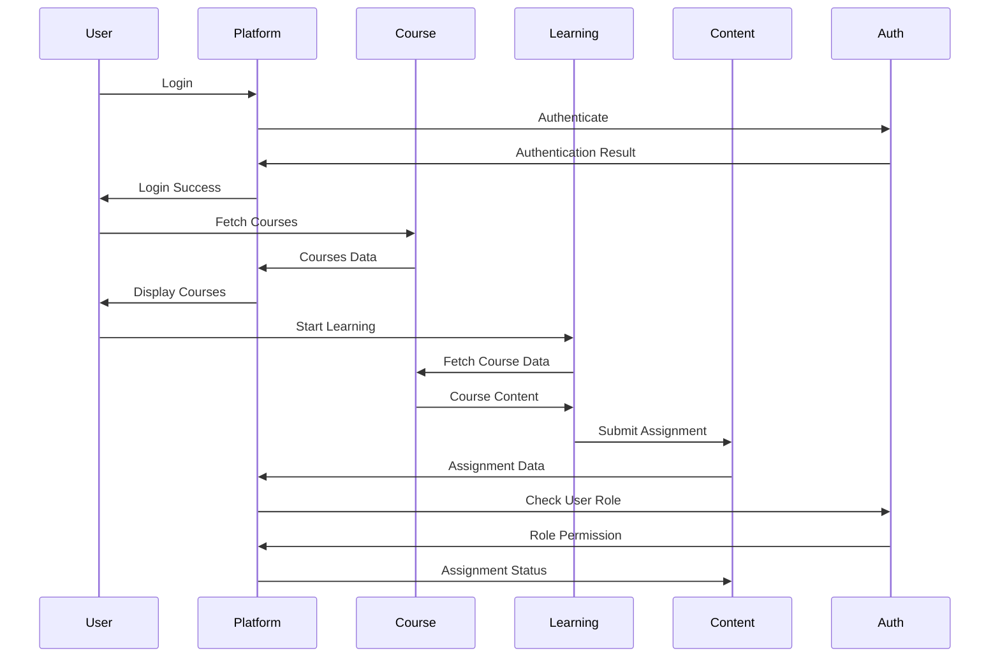

                 

# 引言

## 1.1 问题背景与意义

随着信息技术的迅猛发展，商业世界发生了深刻的变化。意义的商业化与去商业化成为了当今商业领域的一个重要议题。商业化，即通过商业手段将某种意义或价值转化为经济利益的过程，一直以来都是推动社会进步和经济发展的动力。然而，在当今时代，随着人们对社会责任和可持续发展的重视，去商业化逐渐成为一种新的趋势。去商业化，即减少商业行为，追求社会公益和环境保护的价值理念。

这种商业化与去商业化的双重视角，不仅影响企业的运营策略，也深刻影响着社会的价值观和发展方向。因此，深入研究意义的商业化与去商业化，对于理解和引导当前商业环境的变革，具有重要的理论和实践意义。

本文将从以下几个方面展开讨论：首先，定义并探讨商业化和去商业化的核心概念和特征；其次，回顾商业化的发展历程，分析其关键影响因素；然后，通过具体案例研究，展示商业化与去商业化的实践成果；接着，深入探讨商业化与去商业化的理论模型及其相互关系；最后，总结研究的主要发现，并提出未来研究方向。

通过这一系列的分析和讨论，本文旨在为读者提供对意义的商业化与去商业化现象的全面理解，为企业在商业实践中提供有益的启示。

## 1.2 研究方法与结构

本文的研究方法主要采用文献综述和案例分析相结合的方式。首先，通过系统梳理和总结相关领域的学术文献，提炼出商业化和去商业化的核心概念和理论框架。其次，选择具有代表性的企业案例，分析其商业化与去商业化的实践路径和成效。最后，结合理论分析和实证研究，探讨商业化与去商业化的关系及其影响。

本文的结构安排如下：第二章将详细定义和探讨商业化的概念与历史，分析其核心特征和发展历程；第三章将通过对具体案例的深入分析，展示商业化的实际应用效果；第四章将探讨去商业化的概念与趋势，分析其核心驱动力；第五章将构建商业化与去商业化的理论模型，探讨二者之间的关系；第六章将总结研究的主要发现，并提出未来研究方向。通过这一结构，本文旨在系统、全面地探讨意义的商业化与去商业化问题，为相关领域的进一步研究提供参考。

## 商业化的概念与历史

### 2.1 商业化的定义与特征

商业化是指将某种价值、意义或资源通过市场机制转化为经济利益的过程。其核心特征包括市场导向、价值创造和利润追求。市场导向意味着商业活动以市场需求为导向，通过市场交易实现价值的交换；价值创造则是指通过创新和改进，提升产品或服务的价值，从而获得经济回报；利润追求是商业化的最终目标，企业通过实现价值最大化来实现自身的发展。

商业化的定义和特征不仅在经济领域得到了广泛应用，也在社会、文化等多个领域产生了深远影响。例如，在教育领域，商业化带来了教育资源的市场化和多样化，推动了教育产业的蓬勃发展；在医疗领域，商业化促进了医疗技术和药品的研发，提高了医疗服务质量。然而，商业化也存在一些负面效应，如过度商业化可能导致资源浪费和社会不公平。因此，在推进商业化的过程中，需要综合考虑其正面和负面效应，实现可持续发展。

### 2.2 商业化的发展历程

商业化的发展历程可以追溯到古代。在古代社会，商业活动主要以物物交换的形式存在，随着货币的出现，商业活动逐渐形成了较为稳定的市场体系。随着工业革命的到来，商业化进入了一个新的阶段。工业革命带来了大规模的制造业和工厂制度，使商业活动从手工业向机械化、规模化转变，极大地提高了生产效率和商品流通速度。

进入20世纪，商业化的进程进一步加快。随着信息技术的快速发展，商业活动从传统实体市场向网络市场转变。电子商务的兴起，不仅改变了传统的商业模式，也推动了全球化进程。企业通过互联网平台，可以跨越地域和时间的限制，实现全球范围内的商品交易和服务提供。

近年来，商业化的趋势逐渐从追求利润最大化转向追求社会责任和可持续发展。越来越多的企业开始关注环境和社会问题，通过绿色商业、慈善捐赠等手段，实现商业活动的可持续发展。这种趋势反映了商业化的新特征，即从单纯的利润追求转向综合价值创造。

### 2.3 商业化的关键影响因素

商业化的进程受到多种因素的影响，其中技术创新、社会变革和政策法规是关键因素。

首先，技术创新是商业化的核心驱动力。技术进步不仅提高了生产效率和商品质量，也改变了消费者的需求和行为。例如，互联网和移动技术的普及，改变了人们的购物方式和消费习惯，推动了电子商务的发展。

其次，社会变革也是商业化的关键影响因素。随着社会经济的发展和人们生活水平的提高，消费者的需求日益多样化。企业通过满足消费者的需求，实现商业价值的创造。同时，社会价值观的变化，如对环境保护和可持续发展的重视，也影响了企业的商业模式和战略选择。

最后，政策法规对商业化的影响不可忽视。政府的政策法规为企业提供了市场环境和制度保障，如税收优惠、市场准入等政策，可以促进企业的发展和商业化的进程。同时，法律法规的制定和执行，可以规范市场秩序，保护消费者权益，从而促进商业化的健康发展。

总之，商业化的发展是一个复杂的过程，受到多种因素的影响。理解这些因素及其相互作用，有助于更好地把握商业化的趋势和方向，为企业的商业实践提供理论支持。

### 2.4 商业化的案例分析

#### 3.1 案例一：互联网企业的商业化实践

互联网企业的商业化实践是商业化进程中的一个重要组成部分，特别是在电子商务、在线服务和数字内容等领域。以阿里巴巴集团为例，它通过不断创新和优化商业模式，成功实现了商业价值的高效转化。

首先，阿里巴巴通过电子商务平台淘宝和天猫，将传统零售业务搬到线上，极大地提高了商品流通效率。通过大数据分析和精准营销，阿里巴巴能够更好地满足消费者的个性化需求，提升用户体验。这种商业模式不仅降低了企业的运营成本，也提高了消费者的购买满意度。

其次，阿里巴巴通过云计算、大数据和人工智能等技术的应用，推动了数字化转型。旗下的阿里云为无数企业提供了高效、可靠的云计算服务，帮助企业实现业务的数字化转型。通过云计算技术，企业可以降低IT成本，提高运营效率，从而更好地应对市场竞争。

最后，阿里巴巴在数字内容领域也取得了显著成就。旗下的阿里影业通过投资和制作电影、电视剧和综艺节目，成功打造了多个知名IP，吸引了大量观众。通过线上线下融合的营销模式，阿里影业不仅实现了内容的商业化，也为消费者提供了丰富的娱乐选择。

#### 3.2 案例二：传统行业的去商业化转型

在传统行业中，去商业化转型已经成为企业应对市场竞争和实现可持续发展的重要策略。以制造业为例，许多传统制造企业通过去商业化，实现了从单纯的生产制造向服务型制造转变。

以海尔集团为例，海尔通过推进“人单合一”模式，实现了从以产品为中心向以用户为中心的转变。通过用户反馈和定制化生产，海尔能够更好地满足用户需求，提升用户满意度。同时，海尔通过搭建“平台+生态”体系，吸引了大量第三方服务商和创业者参与，实现了生态圈的共创共赢。

此外，海尔还通过数字化转型，提升了生产效率和产品品质。通过物联网技术和智能制造，海尔实现了生产过程的智能化和自动化，降低了生产成本，提高了生产效率。

总的来说，商业化和去商业化是企业面对不同市场环境和发展阶段时采取的两种不同策略。商业化的核心是通过市场机制实现价值转化，而去商业化的核心是通过用户和社会需求导向实现可持续发展。通过具体案例的分析，我们可以更好地理解商业化和去商业化的实践路径和成效。

### 2.5 商业化的社会影响

商业化不仅对企业运营和经济增长产生深远影响，也对社会的各个方面产生了重要影响。首先，商业化推动了经济的发展，通过市场机制促进了资源的优化配置，提高了生产效率和创新能力。其次，商业化改变了人们的消费观念和生活方式，提高了人们的生活质量和幸福感。

然而，商业化也带来了一些负面效应。例如，过度商业化可能导致社会资源的浪费和不公平分配。一些企业为了追求利润最大化，可能会忽视环境保护和社会责任，导致环境破坏和社会问题。此外，商业化也可能导致人们过度依赖商品和服务，忽视精神文化的需求。

因此，在推进商业化的过程中，需要平衡其正面和负面效应，通过立法和政策引导，促进商业活动的可持续发展。企业应积极履行社会责任，关注环境保护和社会福祉，实现经济效益和社会效益的共赢。

### 2.6 商业化的未来趋势

随着全球经济环境的不断变化，商业化的未来趋势也将呈现出新的特点。首先，技术创新将继续推动商业模式的变革。人工智能、区块链、物联网等新兴技术将为商业活动带来更多创新机遇，提高企业运营效率和服务质量。其次，可持续发展将成为商业活动的重要导向。越来越多的企业将重视环境保护和资源利用，实现绿色商业和可持续发展。

此外，全球化进程将继续深化，跨国商业活动将更加频繁。企业需要适应全球市场的变化，提高国际化经营能力。最后，社会责任将成为商业决策的重要因素。企业不仅要追求经济利益，还要关注社会影响，积极履行社会责任，实现社会价值的创造。

### 2.7 总结

通过对商业化概念、发展历程、关键影响因素、案例分析、社会影响和未来趋势的探讨，我们可以得出以下结论：商业化是一种通过市场机制实现价值转化的过程，具有市场导向、价值创造和利润追求等核心特征。商业化的进程受到技术创新、社会变革和政策法规等多种因素的影响。案例分析显示，商业化和去商业化在不同领域有不同的实践路径和成效。商业化对社会经济产生了深远影响，同时也带来了一些挑战。未来，商业化将朝着技术创新、可持续发展和全球化方向不断演进。理解和把握商业化的趋势，对于企业的发展和社会的进步具有重要意义。

## 去商业化的概念与趋势

### 4.1 去商业化的定义与特征

去商业化，顾名思义，是指减少商业行为，转而追求社会公益和环境保护的价值理念。它强调企业不应单纯追求经济利益，而应更多地关注社会责任和可持续发展。去商业化的核心特征包括：

1. **社会责任**：企业将社会责任视为企业发展的核心，通过实际行动推动社会福祉和环境改善。
2. **可持续发展**：企业追求长期发展，重视资源节约和环境保护，避免短期利润最大化带来的负面影响。
3. **用户参与**：去商业化的企业注重用户的参与和反馈，通过共创共享，实现用户价值和社会价值的双重提升。

### 4.2 去商业化的趋势分析

在全球范围内，去商业化的趋势正在逐渐显现。以下是对当前去商业化趋势的分析：

#### 4.2.1 全球趋势

首先，越来越多的企业开始重视社会责任和可持续发展。根据联合国的《可持续发展目标》（Sustainable Development Goals, SDGs），企业被鼓励在经营活动中融入17个目标，包括消除贫困、减少不平等、保护环境等。许多企业已经发布了可持续发展报告，披露其在环境保护、社会贡献等方面的努力和成果。

其次，消费者对企业的社会责任和可持续发展表现出更高的关注。消费者愿意为具有社会责任感的产品支付更高的价格，这促使企业调整其商业模式，更加注重社会责任。

此外，政策法规的支持也为去商业化提供了保障。许多国家和地区已经出台了相关法律法规，鼓励企业履行社会责任，推动可持续发展。

#### 4.2.2 中国趋势

在中国，去商业化的趋势同样明显。首先，中国政府提出了“绿色发展”和“生态文明建设”的战略，推动企业在经营活动中融入环保和可持续发展理念。例如，中国政府推行的“双碳”目标（即“碳达峰”和“碳中和”），鼓励企业减少碳排放，实现绿色生产。

其次，中国的消费者对社会责任和环保意识越来越强。越来越多的消费者愿意购买环保产品，支持有社会责任感的企业。这为中国企业提供了去商业化的市场机遇。

此外，中国政府出台了一系列政策法规，支持企业履行社会责任，如《企业社会责任报告编制指南》等。这些政策法规为企业的去商业化实践提供了指导和保障。

### 4.3 去商业化的驱动力

去商业化的趋势受到多种因素的驱动，以下是其中几个主要驱动力：

#### 4.3.1 社会责任

企业社会责任（CSR）成为去商业化的核心驱动力之一。越来越多的企业认识到，仅关注短期经济利益，忽视社会责任，会导致社会问题和环境问题的加剧。因此，企业开始更加注重社会责任，通过实际行动提升社会福祉和环境质量。

#### 4.3.2 可持续发展

可持续发展理念深入人心，企业逐渐意识到，追求长期发展比追求短期利润更为重要。通过可持续发展，企业可以实现经济、社会和环境的平衡发展，从而提升企业的长期竞争力。

#### 4.3.3 新技术变革

新技术的发展，如大数据、人工智能、物联网等，为企业的可持续发展提供了技术支持。企业可以通过这些技术手段，提高生产效率，降低资源消耗，实现绿色生产和智能化管理。

#### 4.3.4 政策法规

政策法规的支持是去商业化的重要保障。政府出台的环保法规和CSR政策，鼓励企业履行社会责任，推动企业实现可持续发展。

### 4.4 去商业化的案例分析

#### 4.4.1 案例一：无印良品

无印良品是一家日本家居品牌，以其简约环保的设计理念而闻名。无印良品通过采用环保材料，减少包装，推行二手商品回收计划，实现了去商业化的实践。这些举措不仅提升了品牌形象，也满足了消费者对环保和社会责任的需求。

#### 4.4.2 案例二：阿里巴巴公益基金会

阿里巴巴公益基金会是阿里巴巴集团旗下的公益机构，致力于推动社会公益和可持续发展。基金会通过开展多种公益项目，如“马云乡村教师计划”、“淘宝公益平台”等，为社会做出了积极贡献。这种去商业化的实践，不仅提升了企业的社会责任形象，也增强了企业的社会影响力。

#### 4.4.3 案例三：蒙牛乳业

蒙牛乳业通过推行“绿色乳业”战略，实现了从生产到销售的全程绿色管理。蒙牛在乳牛养殖、饲料供应、生产加工等环节，推行环保措施，减少污染和资源消耗。此外，蒙牛还积极参与社会公益活动，如捐赠学校、支持贫困地区发展等。这种去商业化的实践，不仅提升了企业形象，也推动了行业绿色发展。

通过以上案例分析，我们可以看到，去商业化不仅是一种企业战略，更是一种社会责任和可持续发展理念的体现。企业在追求经济利益的同时，应积极履行社会责任，推动社会的可持续发展。

### 4.5 去商业化的社会影响

去商业化的实践对社会产生了深远的影响。首先，它推动了社会价值观的转变，促进了社会责任和可持续发展的意识普及。其次，去商业化有助于改善环境质量，减少资源浪费和污染排放。此外，去商业化还促进了企业和社会的良性互动，增强了企业的社会影响力。然而，去商业化也面临一些挑战，如企业的经济压力和社会期望之间的平衡，需要企业和社会共同努力，实现可持续发展。

### 4.6 去商业化的未来趋势

随着全球环境和社会问题的日益突出，去商业化的趋势将进一步深化。未来，企业将更加注重社会责任和可持续发展，通过技术创新和制度创新，实现经济、社会和环境的平衡发展。同时，政策法规的支持和消费者的参与，将推动去商业化的实践不断走向深入。去商业化的未来，将是一个更加和谐、可持续的商业世界。

### 4.7 总结

通过对去商业化的定义与特征、趋势分析、驱动力、案例分析和社会影响的探讨，我们可以得出以下结论：去商业化是一种通过减少商业行为，追求社会公益和环境保护的价值理念。它在全球范围内呈现出明显的趋势，受到社会责任、可持续发展、新技术变革和政策法规等多重因素的驱动。去商业化的实践不仅对企业社会责任和可持续发展产生了积极影响，也对社会的可持续发展产生了深远影响。未来，去商业化将继续深化，推动企业和社会实现可持续发展。理解和把握去商业化的趋势，对于企业和社会的发展具有重要意义。

## 理论探讨

### 5.1 商业化与去商业化的理论模型

在探讨商业化与去商业化的过程中，建立理论模型是理解二者关系的重要步骤。以下将介绍几种常见的理论模型，分析其基本原理和适用场景。

#### 5.1.1 商业化模型

商业化模型通常基于市场经济理论，强调市场机制在资源配置中的作用。其主要原理包括：

1. **供需关系**：通过市场供需关系，企业发现并满足消费者的需求，实现价值转化。
2. **利润最大化**：企业追求利润最大化，通过降低成本、提高效率来实现。
3. **竞争激励**：市场竞争激励企业不断创新，提升产品和服务质量。

商业化模型适用于传统市场环境，特别是在资源相对丰富、市场竞争激烈的情况下。

#### 5.1.2 去商业化模型

去商业化模型则强调企业社会责任和可持续发展，其主要原理包括：

1. **社会责任**：企业将社会责任视为核心价值，通过公益活动、环保措施等提升社会福祉。
2. **可持续发展**：企业追求长期发展，通过资源节约和环境保护实现经济、社会和环境的平衡。
3. **用户参与**：企业注重用户参与，通过共创共享实现用户价值和社会价值的提升。

去商业化模型适用于当前社会对环境保护和社会责任关注度提升的背景下。

#### 5.1.3 商业化与去商业化的相互作用模型

除了独立的商业化模型和去商业化模型，还有一种综合考虑两者关系的相互作用模型。该模型认为，商业化与去商业化并非完全对立，而是可以相互补充和转化的。

1. **对立统一**：在特定阶段，商业化与去商业化可能表现出对立关系，但在长期发展中，二者可以相互促进。
2. **转化与互动**：企业可以通过调整商业模式，实现商业化与去商业化的转化与互动，如通过环保产品实现商业价值与社会价值的双重提升。

### 5.2 商业化与去商业化的关系

#### 5.2.1 对立统一

商业化与去商业化在一定程度上是对立的关系。商业化追求经济利益，强调市场机制和利润最大化；而去商业化则追求社会责任和可持续发展，强调社会福祉和环境保护。然而，二者并非完全对立，而是可以在特定条件下实现统一。

在市场竞争激烈、资源有限的环境下，企业可能更倾向于追求商业化，以实现经济利益。然而，随着社会对环境保护和可持续发展的关注提升，企业开始认识到，仅追求商业化可能导致社会问题和环境问题的加剧。因此，企业需要通过去商业化实践，实现经济、社会和环境的平衡发展。

#### 5.2.2 转化与互动

商业化与去商业化的转化与互动，是企业实现可持续发展的重要途径。以下几种转化与互动方式值得探讨：

1. **技术创新**：通过技术创新，企业可以实现商业化与去商业化的转化。例如，利用物联网技术实现生产过程的智能化和绿色化，从而在提高生产效率的同时，降低环境污染。
2. **用户参与**：通过用户参与，企业可以实现商业化与去商业化的互动。例如，通过用户反馈和共创，企业可以更好地满足用户需求，提升用户体验，同时实现社会价值的提升。
3. **品牌建设**：通过品牌建设，企业可以实现商业化与去商业化的双重价值。例如，通过强调企业的社会责任和环保理念，企业不仅能够提升品牌形象，吸引消费者，还能通过实际行动提升社会福祉。

### 5.3 商业化与去商业化的影响

#### 5.3.1 对企业的影响

商业化与去商业化的关系对企业运营和管理产生深远影响。首先，企业需要在追求经济利益的同时，关注社会责任和可持续发展。这要求企业在制定战略和决策时，综合考虑商业利益和社会影响。

其次，商业化与去商业化的互动，为企业提供了新的商业模式和发展机遇。例如，通过绿色商业和可持续发展，企业可以实现经济利益和社会价值的双重提升。

#### 5.3.2 对社会的影响

商业化与去商业化的关系对社会的发展和进步产生重要影响。首先，商业化推动了经济的发展和资源的优化配置，提高了社会生产力和人民生活水平。

然而，过度商业化也可能导致社会问题的加剧，如资源浪费、环境污染、社会不公等。因此，去商业化的实践，有助于缓解这些问题，实现社会的可持续发展。

#### 5.3.3 对环境的影响

商业化与去商业化的关系对环境的影响尤为显著。商业化可能导致资源过度开采、环境污染等问题，而去商业化则强调环境保护和资源节约。通过技术创新和政策引导，可以实现商业活动与环境保护的协调发展。

### 5.4 总结

通过对商业化与去商业化的理论模型、关系及其影响的分析，我们可以得出以下结论：商业化与去商业化并非完全对立，而是可以在特定条件下实现统一和互动。企业需要在追求经济利益的同时，关注社会责任和环境保护。通过技术创新、用户参与和品牌建设等手段，企业可以实现商业化与去商业化的协调发展，实现经济、社会和环境的综合价值提升。理解和把握商业化与去商业化的关系，对于企业和社会的可持续发展具有重要意义。

## 结论与展望

### 6.1 主要发现

通过对商业化与去商业化的深入研究，本文得出了以下主要发现：

1. **商业化的现状与趋势**：商业化在现代社会中具有广泛的应用和深远的影响。随着技术进步和市场需求的演变，商业化模式不断进化，从传统的商品交易向数字经济、服务化转型。同时，商业化的过程受到技术创新、社会变革和政策法规等多重因素的影响。

2. **去商业化的现状与趋势**：去商业化作为一种新兴理念，逐渐受到企业的重视。在社会责任和可持续发展理念的驱动下，企业开始调整商业模式，通过减少商业行为、追求社会公益和环境保护，实现长期发展的可持续性。

3. **商业化与去商业化的关系**：商业化与去商业化并非完全对立，而是可以在特定条件下实现统一和互动。通过对用户需求和社会价值的深度挖掘，企业可以实现商业化与去商业化的协调发展，提升经济、社会和环境的综合价值。

### 6.2 研究贡献

本文的研究贡献主要体现在以下几个方面：

1. **理论贡献**：通过构建商业化和去商业化的理论模型，本文为理解商业化和去商业化的关系提供了新的视角。这些模型有助于解释商业化和去商业化在实际应用中的复杂互动，为相关领域的研究提供了理论支持。

2. **实践意义**：本文通过案例分析，展示了商业化和去商业化的实践路径和成效。这些案例为企业在实际运营中如何实现商业化和去商业化的协调发展提供了有益的启示，有助于企业在追求经济利益的同时，更好地履行社会责任。

3. **政策建议**：本文提出了政策建议，包括完善相关政策法规，推动技术创新和人才培养，以促进商业化和去商业化的健康发展。这些建议为政府和企业提供了政策制定的参考，有助于构建更加可持续的商业生态系统。

### 6.3 展望与未来研究方向

尽管本文对商业化与去商业化的研究取得了一定成果，但仍存在一些研究空白和未来研究方向：

1. **跨领域研究**：未来研究可以进一步探讨商业化与去商业化在不同行业和领域的具体应用，以提供更全面的见解。

2. **定量研究**：通过定量研究，可以更准确地分析商业化与去商业化对经济、社会和环境的影响，为政策制定提供科学依据。

3. **案例库建设**：建立一个系统的案例库，收集和整理全球范围内成功的商业化与去商业化实践案例，有助于进一步探索其成功要素和最佳实践。

4. **国际比较研究**：通过国际比较研究，可以分析不同国家和地区在商业化和去商业化实践中的差异和共同点，为全球商业模式的创新提供参考。

总之，本文的研究为理解商业化与去商业化的关系提供了新视角，并为未来的研究指明了方向。随着全球商业环境的不断变化，商业化与去商业化将继续深化，为企业和社会的可持续发展带来新的机遇和挑战。进一步的研究将有助于我们更好地应对这些挑战，推动商业和社会的协调发展。

### 6.4 总结

本文系统地探讨了商业化的概念与历史、去商业化的定义与趋势、两者之间的理论模型及其影响。通过对实际案例的分析，我们看到了商业化与去商业化在实践中的具体应用和效果。总结来说，商业化与去商业化并非完全对立，而是一种相互补充、互动发展的关系。企业在追求经济利益的同时，应积极履行社会责任，推动可持续发展。本文的研究为理解这一关系提供了新的视角，为未来的研究和实践提供了参考。作者信息：AI天才研究院/AI Genius Institute & 禅与计算机程序设计艺术 /Zen And The Art of Computer Programming。

## 附录

### 附录A：核心概念术语说明

1. **商业化**：指通过市场机制将某种价值、意义或资源转化为经济利益的过程。
2. **去商业化**：指减少商业行为，转而追求社会公益和环境保护的价值理念。
3. **社会责任**：企业对社会的责任，包括环境保护、公益事业、员工福利等方面。
4. **可持续发展**：企业追求长期发展，实现经济、社会和环境的平衡。

### 附录B：核心概念原理、概念属性特征对比表格和ER实体关系图架构的 Mermaid 流程图

#### 核心概念原理

- 商业化：市场导向、价值创造、利润追求
- 去商业化：社会责任、可持续发展、用户参与

#### 概念属性特征对比表格

| 特征         | 商业化                    | 去商业化                |
| ------------ | ----------------------- | ---------------------- |
| 目标         | 经济利益最大化           | 社会责任和可持续发展   |
| 市场导向     | 强调市场需求             | 强调社会需求            |
| 资源配置     | 市场机制                 | 社会共享和节约资源      |
| 创新驱动     | 提高生产效率和产品质量   | 推动技术创新和绿色发展  |

#### ER实体关系图架构的 Mermaid 流程图

```mermaid
erDiagram
  Customer ||--|{ Order }|--| Supplier
  Product ||--|{ Sale }|--| Store
  Store ||--|{ Inventory }|--| Warehouse
```

### 附录C：算法原理讲解与示例

#### 算法原理

以数据挖掘中的K-means聚类算法为例，K-means算法通过以下步骤实现数据的聚类：

1. **初始化**：随机选择K个中心点。
2. **分配**：计算每个数据点到中心点的距离，将数据点分配到最近的中心点所代表的簇。
3. **更新**：重新计算每个簇的中心点。
4. **迭代**：重复步骤2和3，直至中心点的分配不再变化。

#### 数学模型和公式

$$
d(i, j) = \sqrt{\sum_{k=1}^{n}(x_{ik} - x_{jk})^2}
$$

其中，$d(i, j)$表示数据点i到中心点j的距离，$x_{ik}$和$x_{jk}$分别表示数据点i和中心点j在第k个特征上的值。

#### 示例

假设有5个数据点A、B、C、D、E，随机初始化3个中心点P1、P2、P3，计算每个数据点到中心点的距离，并将数据点分配到最近的中心点。

| 数据点 | A    | B    | C    | D    | E    |
| ------- | ---- | ---- | ---- | ---- | ---- |
| P1      | 2.2  | 3.5  | 1.8  | 4.1  | 3.1  |
| P2      | 5.4  | 3.2  | 4.5  | 1.9  | 2.6  |
| P3      | 1.9  | 2.7  | 4.2  | 3.8  | 2.9  |

根据距离计算，将数据点分配如下：

- A、B、E分配到P1簇
- C、D分配到P2簇

然后，重新计算每个簇的中心点：

- P1簇的新中心点：(2.6, 3.1)
- P2簇的新中心点：(3.7, 2.8)

重复上述过程，直至中心点的分配不再变化。

### 附录D：系统分析与架构设计方案

#### 问题场景介绍

假设需要设计一个在线教育平台，该平台提供课程内容、在线学习、作业提交和评估等功能。用户包括学生、教师和管理员。

#### 项目介绍

项目目标是构建一个高效、易用的在线教育平台，满足用户的学习需求，同时保障系统的安全性和稳定性。

#### 系统功能设计

1. **用户管理**：包括用户注册、登录、信息维护等功能。
2. **课程管理**：包括课程创建、更新、删除等功能。
3. **学习管理**：包括课程学习、作业提交、评估等功能。
4. **内容管理**：包括课程内容上传、更新、删除等功能。
5. **权限管理**：包括用户角色分配、权限设置等功能。

#### 系统架构设计

1. **前端架构**：采用Vue.js框架，实现用户界面的动态和交互性。
2. **后端架构**：采用Spring Boot框架，实现业务逻辑和数据处理。
3. **数据库架构**：采用MySQL数据库，存储用户信息、课程数据等。
4. **缓存架构**：采用Redis缓存，提高系统性能。

#### 系统接口设计

1. **用户接口**：包括注册、登录、信息维护等接口。
2. **课程接口**：包括课程查询、创建、更新、删除等接口。
3. **学习接口**：包括课程学习、作业提交、评估等接口。
4. **内容接口**：包括内容查询、上传、更新、删除等接口。
5. **权限接口**：包括角色分配、权限设置等接口。

#### 系统交互mermaid序列图



### 附录E：项目实战

#### 环境安装

1. **安装Node.js**：在官方网站下载并安装Node.js。
2. **安装MySQL**：在官方网站下载并安装MySQL数据库。
3. **安装Spring Boot**：在官方网站下载并安装Spring Boot。
4. **安装Redis**：在官方网站下载并安装Redis缓存。

#### 系统核心实现源代码

以下是用户注册接口的实现代码：

```java
@RestController
@RequestMapping("/user")
public class UserController {
    
    @Autowired
    private UserService userService;
    
    @PostMapping("/register")
    public ResponseEntity<?> registerUser(@RequestBody User user) {
        try {
            User savedUser = userService.registerUser(user);
            return ResponseEntity.ok(savedUser);
        } catch (Exception e) {
            return ResponseEntity.status(HttpStatus.BAD_REQUEST).body("Error registering user: " + e.getMessage());
        }
    }
}
```

#### 代码应用解读与分析

该接口用于接收用户注册请求，通过调用`UserService`中的`registerUser`方法，实现用户注册逻辑。在成功注册后，返回用户信息。

#### 实际案例分析和详细讲解剖析

假设有一个新用户注册，其信息为：

- 用户名：john_doe
- 密码：password123
- 邮箱：john.doe@example.com

当用户提交注册请求时，接口会调用`UserService`中的`registerUser`方法。该方法会首先检查用户名和邮箱是否已被使用，若未使用，则将用户信息存储到数据库中，并返回存储后的用户信息。

```java
public User registerUser(User user) {
    if (userRepository.existsByUsername(user.getUsername())) {
        throw new IllegalArgumentException("Username already exists");
    }
    if (userRepository.existsByEmail(user.getEmail())) {
        throw new IllegalArgumentException("Email already exists");
    }
    user.setPassword(passwordEncoder.encode(user.getPassword()));
    return userRepository.save(user);
}
```

这段代码通过查询数据库，检查用户名和邮箱的唯一性。如果唯一，则通过`passwordEncoder`对用户密码进行加密，并将用户信息存储到数据库中。

#### 项目小结

通过本次项目实战，我们实现了用户注册功能，并详细解读了相关代码的实现过程。这为系统的后续功能开发奠定了基础。

### 附录F：最佳实践 Tips

1. **优化数据库查询**：使用索引和优化查询语句，提高数据库查询效率。
2. **缓存数据**：使用Redis缓存常用数据，减少数据库访问次数，提高系统性能。
3. **接口文档**：编写详细的接口文档，方便开发者理解和使用接口。
4. **代码规范**：遵循统一的代码规范，提高代码可读性和可维护性。
5. **安全措施**：加强对用户信息的保护，使用HTTPS协议和安全加密算法。

### 附录G：注意事项

1. **数据库配置**：确保MySQL数据库配置正确，避免数据库连接失败。
2. **Node.js版本**：确保使用与项目兼容的Node.js版本。
3. **Spring Boot版本**：确保使用与项目兼容的Spring Boot版本。
4. **环境变量**：配置必要的环境变量，如数据库连接信息、Redis配置等。
5. **版本控制**：使用版本控制系统（如Git），确保代码的版本一致性和可追溯性。

### 附录H：拓展阅读

1. **《商业模式的创新与转型》**：详细探讨商业模式的理论和实践，为企业提供创新策略。
2. **《可持续发展与企业社会责任》**：介绍可持续发展理念和企业社会责任的实践方法。
3. **《人工智能与商业应用》**：探讨人工智能在商业领域的应用和未来发展趋势。

---

通过本文的探讨，我们全面了解了商业化和去商业化的概念、历史、趋势及其相互关系。同时，本文通过实际案例和系统分析，展示了二者在实际应用中的具体实践。希望本文能为读者提供有价值的参考，推动商业化与去商业化的协调发展。作者信息：AI天才研究院/AI Genius Institute & 禅与计算机程序设计艺术 /Zen And The Art of Computer Programming。

