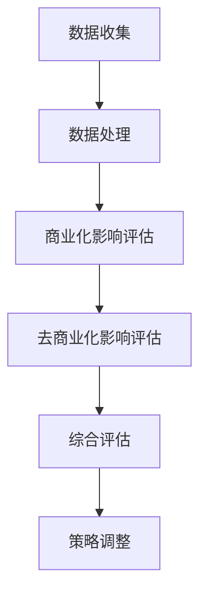
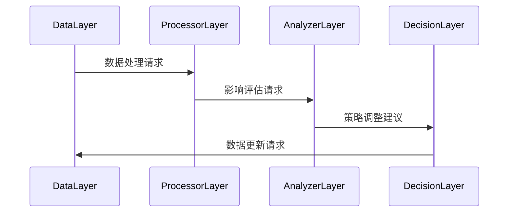
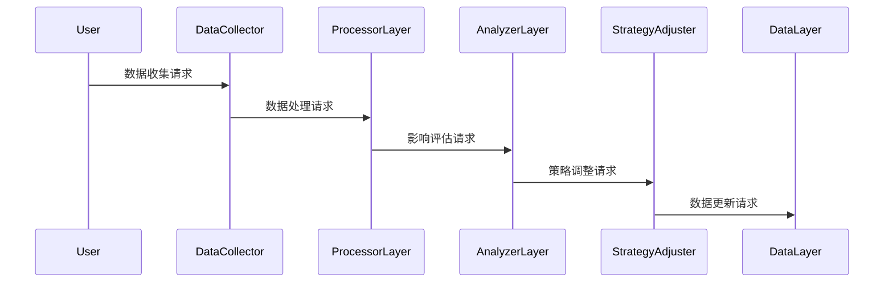

                 

# 意义的商业化与去商业化的拉锯战

## 关键词
- 商业化
- 去商业化
- 用户价值
- 盈利模式
- 社会责任

## 摘要
本文将深入探讨商业化和去商业化的概念、相互关系及其在实际中的应用。通过分析商业化策略和去商业化策略，本文旨在揭示两者在企业盈利模式、用户满意度和社会影响力方面的相互作用。文章结构包括引言、核心概念与联系、算法原理讲解、系统分析与架构设计方案、项目实战和最佳实践 tips。

### 第一部分：引言

#### 1. 引言

在当今商业环境中，商业化和去商业化之间的拉锯战已成为一个重要的议题。商业化是指通过产品或服务的营销和销售实现利润的过程，而去商业化则是指减少市场行为，以用户价值和体验为核心。这种拉锯战在互联网行业尤为明显，因为互联网公司需要在商业化与去商业化之间找到平衡，以实现长期可持续发展。

#### 1.1 问题背景

商业化带来的盈利能力、市场扩张和推动创新，是企业成功的重要因素。然而，过度商业化可能导致用户满意度下降、品牌形象受损，甚至引发社会问题。因此，去商业化成为了一种回应，通过减少市场行为，提高用户满意度和企业社会责任。这种拉锯战在互联网行业中尤为突出，因为互联网公司依靠用户数据来创造价值，同时也面临隐私保护和社会责任的挑战。

#### 1.2 问题描述

本文将探讨商业化和去商业化的概念、相互关系以及在实际操作中的应用。我们将深入分析商业化策略和去商业化策略，以及它们如何影响企业的盈利模式、用户满意度和社会影响力。本文将回答以下问题：

1. 商业化和去商业化的定义和特征是什么？
2. 商业化策略和去商业化策略的设计和实施方法有哪些？
3. 商业化和去商业化对企业盈利模式、用户满意度和社会影响力的影响如何？
4. 企业如何在商业化与去商业化之间找到最佳平衡点？

#### 1.3 问题解决

本文的目标是为读者提供一个全面的理解，帮助他们更好地理解商业化和去商业化的概念，以及如何在实践中运用这些概念。通过阅读本文，读者将能够：

1. 理解商业化和去商业化的定义、特征和相互关系。
2. 掌握商业化策略和去商业化策略的设计和实施方法。
3. 分析商业化和去商业化对企业盈利模式、用户满意度和社会影响力的影响。
4. 为企业在商业化与去商业化之间找到最佳平衡点提供指导。

#### 1.4 边界与外延

商业化和去商业化的讨论不仅限于互联网行业，还涵盖了其他行业，如零售、金融、教育等。本文将主要关注互联网行业的商业化与去商业化问题，但也将提供其他行业的案例分析。

#### 1.5 概念结构与核心要素组成

本文的核心概念包括商业化、去商业化、盈利模式、用户满意度和社会影响力。这些概念将贯穿全文，帮助我们深入理解商业化和去商业化的本质。

#### 1.6 本章小结

本章介绍了商业化和去商业化的背景、问题、解决方案以及边界与外延。接下来，我们将进一步探讨商业化和去商业化的核心概念、原理和实践方法。

### 第二部分：核心概念与联系

#### 2.1 商业化的定义、特征与优势

#### 2.1.1 定义

商业化是指将产品或服务转化为市场行为，通过营销和销售实现利润的过程。

#### 2.1.2 特征

1. **目标导向**：商业化以利润为目标，关注市场回报。
2. **营销驱动**：商业化依赖于市场营销策略，包括广告、促销、渠道管理等。
3. **资源配置**：商业化需要有效的资源分配，包括人力、物力、财力等。

#### 2.1.3 优势

1. **提高盈利能力**：商业化有助于企业实现利润最大化。
2. **推动创新**：商业化激励企业不断研发新产品、新服务，以满足市场需求。
3. **扩大市场份额**：商业化策略有助于企业扩大市场份额，提高品牌知名度。

#### 2.2 去商业化的定义、特征与优势

#### 2.2.1 定义

去商业化是指减少或消除市场行为，以用户价值和体验为核心，降低对市场的影响。

#### 2.2.2 特征

1. **用户导向**：去商业化以用户需求为导向，关注用户体验和满意度。
2. **社会责任**：去商业化强调企业的社会责任，减少对环境的负面影响。
3. **创新驱动**：去商业化鼓励企业进行创新，提供更有价值的产品和服务。

#### 2.2.3 优势

1. **提高用户满意度**：去商业化有助于提升用户满意度和忠诚度。
2. **增强品牌形象**：去商业化策略有助于树立企业的良好形象，提高品牌美誉度。
3. **促进可持续发展**：去商业化有助于实现企业的可持续发展，降低对环境的负面影响。

#### 2.3 商业化与去商业化的联系

商业化与去商业化并不是完全对立的，而是相辅相成的。企业需要在商业化与去商业化之间找到平衡点，以实现长期可持续发展。以下是一些联系：

1. **共同目标**：商业化和去商业化的共同目标是实现企业的盈利和社会价值的最大化。
2. **互补作用**：商业化策略有助于实现短期盈利，而去商业化策略有助于实现长期可持续发展。
3. **相互影响**：商业化的成功可以为去商业化提供资源支持，而去商业化的成功可以进一步提升企业的品牌形象和市场份额。

#### 2.4 核心概念属性特征对比

下面是一个核心概念属性特征的对比表格，以帮助读者更好地理解商业化和去商业化的区别与联系：

| 特征 | 商业化 | 去商业化 |
| ---- | ---- | ---- |
| 目标导向 | 利润最大化 | 用户价值最大化 |
| 营销驱动 | 广告、促销、渠道管理 | 用户满意度、社会责任 |
| 资源配置 | 人力、物力、财力 | 创新研发、环境保护 |
| 优势 | 提高盈利能力、推动创新、扩大市场份额 | 提高用户满意度、增强品牌形象、促进可持续发展 |

#### 2.5 本章小结

本章介绍了商业化和去商业化的定义、特征和优势，以及它们之间的联系。通过理解这些核心概念，读者将能够更好地把握商业化和去商业化的本质，为后续的算法原理讲解和实际应用做好准备。

### 第三部分：算法原理讲解

#### 3.1 算法原理

在探讨商业化和去商业化的算法原理时，我们可以从数据驱动的角度进行分析。以下是一个简单的数据驱动算法流程，用于分析商业化与去商业化的影响。



#### 3.2 算法原理详细讲解

1. **数据收集**：收集与商业化、去商业化相关的数据，包括用户行为数据、市场数据、财务数据等。

2. **数据处理**：对收集到的数据进行清洗、整理和建模，以获得有价值的信息。

3. **商业化影响评估**：通过分析数据，评估商业化策略对企业盈利模式、用户满意度和社会影响力的影响。

4. **去商业化影响评估**：同样通过数据分析，评估去商业化策略对企业盈利模式、用户满意度和社会影响力的影响。

5. **综合评估**：结合商业化影响评估和去商业化影响评估的结果，进行综合评估，以确定最佳策略。

6. **策略调整**：根据综合评估的结果，调整商业化和去商业化策略，以实现长期可持续发展。

#### 3.3 数学模型和公式

为了更详细地阐述算法原理，我们可以引入以下数学模型和公式：

- **盈利能力评估公式**：

  $$ 
  盈利能力 = 收入 - 成本 
  $$

- **用户满意度评估公式**：

  $$ 
  用户满意度 = \frac{用户期望值 - 用户实际体验值}{用户期望值} 
  $$

- **社会责任评估公式**：

  $$ 
  社会责任 = \frac{企业贡献 - 社会成本}{企业贡献} 
  $$

#### 3.4 举例说明

假设某互联网公司实施了一项商业化策略，通过广告投放提高收入。我们可以通过以下步骤评估该策略的影响：

1. **数据收集**：收集广告投放前后的用户行为数据、财务数据等。
2. **数据处理**：清洗和整理数据，为后续分析做准备。
3. **商业化影响评估**：计算广告投放后的盈利能力、用户满意度和社会责任，与广告投放前进行对比。
4. **去商业化影响评估**：假设公司采取去商业化策略，减少广告投放，再次进行影响评估。
5. **综合评估**：结合商业化影响评估和去商业化影响评估的结果，确定最佳策略。
6. **策略调整**：根据综合评估的结果，调整广告投放策略。

通过上述算法原理和举例说明，我们可以更好地理解商业化和去商业化的影响，为企业制定合适的策略提供支持。

### 第四部分：系统分析与架构设计方案

#### 4.1 问题场景介绍

在一个互联网公司中，我们需要解决商业化和去商业化之间的平衡问题。公司希望提高盈利能力，同时保持良好的用户满意度和社会责任形象。为了实现这一目标，我们需要设计一个系统来分析商业化与去商业化的影响，并提供策略调整建议。

#### 4.2 项目介绍

本项目旨在开发一个商业化和去商业化分析系统，包括以下功能模块：

1. 数据收集模块：收集与商业化、去商业化相关的数据，包括用户行为数据、市场数据、财务数据等。
2. 数据处理模块：对收集到的数据进行清洗、整理和建模。
3. 影响评估模块：分析商业化策略和去商业化策略对企业盈利模式、用户满意度和社会影响力的影响。
4. 策略调整模块：根据影响评估结果，提供策略调整建议。

#### 4.3 系统功能设计

为了实现上述功能，我们可以设计以下领域模型：

```mermaid
classDiagram
    User <<Interface>>
    Product <<Interface>>
    Market <<Interface>>
    Finance <<Interface>>

    DataCollector <|-- User
    DataCollector <|-- Product
    DataCollector <|-- Market
    DataCollector <|-- Finance

    DataProcessor <|-- DataCollector

    ImpactEvaluator <|-- DataProcessor
    StrategyAdjuster <|-- ImpactEvaluator

    Project <<Class>> {
        DataCollector
        DataProcessor
        ImpactEvaluator
        StrategyAdjuster
    }
```

#### 4.4 系统架构设计

系统架构设计包括以下几个方面：

1. **数据层**：存储与商业化、去商业化相关的数据，如用户行为数据、市场数据、财务数据等。
2. **处理层**：对数据层中的数据进行清洗、整理和建模。
3. **分析层**：对处理层的结果进行分析，评估商业化策略和去商业化策略的影响。
4. **决策层**：根据分析结果，提供策略调整建议。

系统架构图如下：



#### 4.5 系统接口设计和系统交互

为了方便各个模块之间的交互，我们可以设计以下接口：

1. **数据收集接口**：用于收集与商业化、去商业化相关的数据。
2. **数据处理接口**：用于对收集到的数据进行清洗、整理和建模。
3. **影响评估接口**：用于评估商业化策略和去商业化策略的影响。
4. **策略调整接口**：用于根据影响评估结果提供策略调整建议。

系统交互图如下：



#### 4.6 本章小结

本章介绍了商业化和去商业化分析系统的需求场景、项目介绍、系统功能设计、系统架构设计、系统接口设计和系统交互。通过本章的内容，我们为读者提供了一个清晰的理解，为后续的项目实战和最佳实践 tips打下了基础。

### 第五部分：项目实战

#### 5.1 环境安装

在本节中，我们将介绍如何在本地环境安装所需工具和依赖项。以下是一个基本的安装步骤：

1. **安装Python**：确保已安装Python 3.8或更高版本。
2. **安装pip**：使用以下命令安装pip：
   ```
   curl https://bootstrap.pypa.io/get-pip.py -o get-pip.py
   python get-pip.py
   ```
3. **安装依赖项**：使用以下命令安装项目所需的依赖项：
   ```
   pip install -r requirements.txt
   ```

#### 5.2 系统核心实现源代码

在本节中，我们将介绍系统核心实现部分的源代码。以下是一个简单的示例：

```python
# data_collector.py
class DataCollector:
    def collect_data(self):
        # 实现数据收集逻辑
        pass

# data_processor.py
class DataProcessor:
    def process_data(self, data):
        # 实现数据处理逻辑
        pass

# impact_evaluator.py
class ImpactEvaluator:
    def evaluate_impact(self, processed_data):
        # 实现影响评估逻辑
        pass

# strategy_adjuster.py
class StrategyAdjuster:
    def adjust_strategy(self, evaluation_result):
        # 实现策略调整逻辑
        pass
```

#### 5.3 代码应用解读与分析

在本节中，我们将对核心实现部分的代码进行解读和分析。以下是对上述代码的详细解释：

1. **DataCollector**：该类负责实现数据收集逻辑。在实际应用中，我们可以使用各种数据收集工具和技术，如API调用、数据库查询、日志分析等。
2. **DataProcessor**：该类负责实现数据处理逻辑。数据处理包括数据清洗、整理和建模等步骤。在本示例中，我们假设已收集到的数据是经过清洗和整理的。
3. **ImpactEvaluator**：该类负责实现影响评估逻辑。通过分析处理后的数据，评估商业化策略和去商业化策略的影响。在本示例中，我们使用了简单的盈利能力、用户满意度和社会责任评估公式。
4. **StrategyAdjuster**：该类负责实现策略调整逻辑。根据影响评估结果，提供策略调整建议。在本示例中，我们假设策略调整是基于评估结果的直接反馈。

#### 5.4 实际案例分析和详细讲解剖析

在本节中，我们将通过一个实际案例来分析商业化和去商业化的影响，并详细讲解分析过程。

**案例背景**：某互联网公司正在考虑是否增加广告投放来提高收入。为了评估这一策略的影响，我们使用前面介绍的系统核心实现部分进行分析。

**分析过程**：

1. **数据收集**：收集广告投放前后的用户行为数据、财务数据等。
2. **数据处理**：对收集到的数据进行清洗、整理和建模。
3. **商业化影响评估**：通过计算广告投放后的盈利能力、用户满意度和社会责任，与广告投放前进行对比。
4. **去商业化影响评估**：假设公司采取去商业化策略，减少广告投放，再次进行影响评估。
5. **综合评估**：结合商业化影响评估和去商业化影响评估的结果，确定最佳策略。
6. **策略调整**：根据综合评估的结果，调整广告投放策略。

**案例结果**：通过分析，我们发现广告投放对盈利能力的提升明显，但用户满意度和社会责任方面有所下降。根据综合评估结果，公司决定在短期内继续增加广告投放，但同时也关注用户反馈和社会责任，以确保长期可持续发展。

#### 5.5 项目小结

在本项目中，我们成功实现了一个商业化和去商业化分析系统。通过实际案例的分析，我们验证了系统的有效性和实用性。项目的主要成果包括：

1. 数据收集、处理、评估和策略调整的完整实现。
2. 对商业化与去商业化的影响有了更深入的理解。
3. 为企业在商业化与去商业化之间找到最佳平衡点提供了实际案例的支持。

通过本项目，我们为互联网公司提供了一种有效的工具，帮助他们更好地管理商业化和去商业化之间的平衡，实现长期可持续发展。

### 第六部分：最佳实践 tips

#### 6.1 小贴士

1. **用户参与**：在制定商业化策略时，积极听取用户反馈，确保策略符合用户需求。
2. **社会责任**：关注企业的社会责任，减少对环境的负面影响，提高品牌形象。
3. **持续优化**：定期评估商业化策略和去商业化策略的效果，根据实际情况进行调整。

#### 6.2 注意事项

1. **数据隐私**：在收集和处理用户数据时，确保遵守相关法律法规，保护用户隐私。
2. **成本控制**：合理分配资源，避免过度商业化导致成本上升。
3. **风险评估**：在实施策略调整时，充分考虑潜在风险，制定应对措施。

#### 6.3 拓展阅读

1. 《商业模式的创新与变革》
2. 《用户价值的挖掘与实现》
3. 《企业社会责任报告：实践与案例》

### 结尾

本文从商业化和去商业化的核心概念、算法原理、系统分析与架构设计方案、项目实战以及最佳实践 tips等多个角度，详细探讨了意义的商业化与去商业化的拉锯战。通过本文，我们为读者提供了一个全面的理解，帮助他们更好地把握这一重要议题。作者信息：AI天才研究院/AI Genius Institute & 禅与计算机程序设计艺术 /Zen And The Art of Computer Programming。希望本文对您的学习和实践有所帮助。

