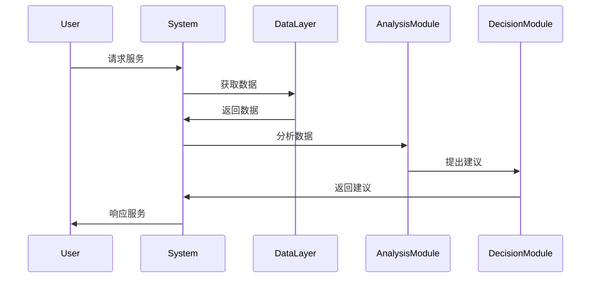
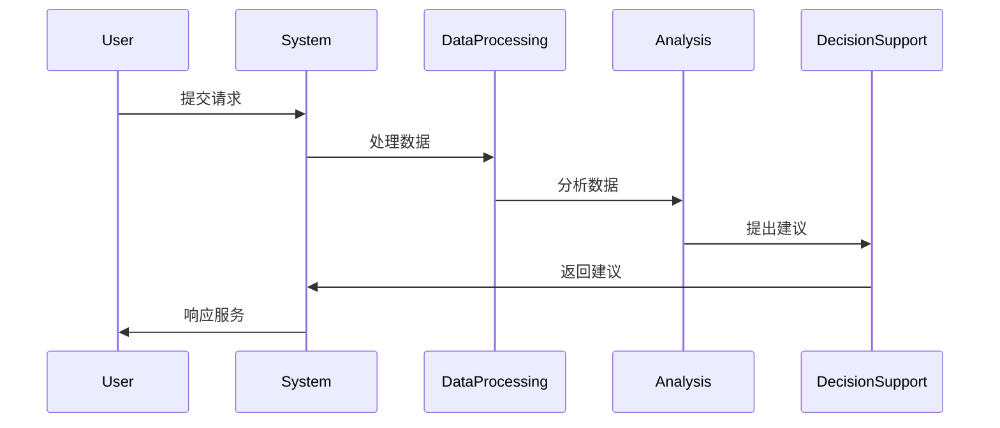

                 

# 意义的商品化与人性化的矛盾

> 关键词：商品化、人性化、矛盾、解决方案

摘要：在当今社会，商品化与人性化的矛盾日益凸显。商品化推动了社会经济的发展，但可能导致人性的异化。本文将探讨商品化与人性化的矛盾，分析其产生的原因和影响，并提出解决方案。

## 第一部分：问题背景

### 1. 问题背景

在当今社会，商品化与人性化的矛盾日益凸显。一方面，商品化使得商品更具市场竞争力，推动了社会经济的发展。另一方面，商品化也可能导致人性的异化，使人们在追求物质利益的过程中忽视精神需求。

### 2. 问题描述

本书旨在探讨商品化与人性化的矛盾，分析其产生的原因和影响，并提出解决方案。具体问题包括：

- 商品化如何影响人性？
- 人性化在商品化过程中如何得以保障？
- 商品化与人性化之间的矛盾如何解决？

### 3. 问题解决

为了解决商品化与人性化的矛盾，本书将从以下几个方面展开：

- 理论研究：探讨商品化与人性化的基本概念、原理及其关系。
- 实例分析：通过具体案例，展示商品化与人性化的矛盾现象。
- 解决方案：提出具有可操作性的解决方案，为企业和个人提供参考。

### 4. 边界与外延

本书的研究边界主要涉及商品化与人性化的矛盾现象及其解决方法。在研究过程中，我们将关注以下几个方面：

- 商业领域：探讨商品化在商业活动中的影响。
- 社会生活：关注商品化对人们日常生活的影响。
- 文化层面：分析商品化与人性化的矛盾在文化传承与创新发展中的体现。

### 5. 概念结构与核心要素组成

本书的核心概念包括商品化、人性化和矛盾。其中，商品化是指将商品作为追求利润最大化的手段，通过市场机制进行生产和销售。人性化则是指关注人的需求、尊严和幸福感，以人为中心，实现人的全面发展。

核心要素组成如下：

- 商业利益：商品化追求的商业利益最大化。
- 人性需求：人性化关注的人的需求、尊严和幸福感。
- 矛盾现象：商品化与人性化之间的矛盾及其表现。

## 第二部分：核心概念与联系

### 第2章：商品化与人性化的基本概念

#### 2.1 商品化的定义与特点

#### 2.1.1 商品化的定义

商品化是指将物品或服务作为商品，通过市场机制进行生产和销售，以追求利润最大化。

#### 2.1.2 商品化的特点

- 利润导向：商品化的核心目标是通过市场获取利润。
- 竞争激烈：商品化使得市场竞争更加激烈。
- 创新驱动：为满足市场需求，商品化推动创新和发展。

#### 2.2 人性化的定义与特点

#### 2.2.1 人性化的定义

人性化是指关注人的需求、尊严和幸福感，以人为中心，实现人的全面发展。

#### 2.2.2 人性化的特点

- 以人为本：人性化关注人的需求，尊重人的尊严。
- 全方位发展：人性化追求人的全面发展，包括物质和精神层面。
- 持续改进：人性化注重持续改进，以提升人的生活质量。

#### 2.3 商品化与人性化的联系与区别

#### 2.3.1 联系

- 目标一致性：商品化与人性化都关注人的需求，追求人的全面发展。
- 互相促进：商品化可以为人性化提供物质基础，人性化可以提升商品化的价值。

#### 2.3.2 区别

- 核心导向：商品化以利润为导向，人性化以人为导向。
- 追求目标：商品化追求利润最大化，人性化追求人的全面发展。

### 第3章：商品化与人性化的属性特征对比

#### 3.1 商品化的属性特征

- 目标导向：追求利润最大化。
- 竞争激烈：市场竞争压力较大。
- 创新驱动：为满足市场需求，不断推动创新和发展。

#### 3.2 人性化的属性特征

- 以人为本：关注人的需求，尊重人的尊严。
- 全方位发展：关注人的物质和精神需求。
- 持续改进：以提升人的生活质量为目标。

#### 3.3 商品化与人性化的对比表格

| 属性特征       | 商品化               | 人性化               |
| -------------- | -------------------- | -------------------- |
| 目标导向       | 利润最大化           | 人的全面发展         |
| 竞争激烈       | 市场竞争压力较大     | 关注人的需求         |
| 创新驱动       | 满足市场需求         | 持续改进             |

### 第4章：商品化与人性化的ER实体关系图

#### 4.1 ER实体关系图概述

在本章节中，我们将使用Mermaid语法绘制商品化与人性化的ER实体关系图，以展示它们之间的联系和区别。

```mermaid
erDiagram
    User ||--|{ Product }|| Buys
    Product ||--|{ Service }|| Provides
    Service ||--|{ User }|| Consumes
```

在上面的ER实体关系图中，User（用户）与Product（商品）之间存在着购买关系（Buys），Product与Service（服务）之间存在着提供关系（Provides），而Service与User之间存在着消费关系（Consumes）。这种关系体现了商品化与人性化之间的相互影响和互动。

## 第三部分：商品化与人性化的矛盾现象

### 第5章：商品化对人性化的影响

#### 5.1 商品化对人性化的负面影响

商品化在推动经济发展的同时，也可能对人性化产生负面影响。以下是一些常见的现象：

- 物质化：商品化可能导致人们过分追求物质财富，忽视精神需求。
- 利益导向：在追求利润的过程中，人们可能忽视道德和伦理，导致人性异化。
- 价值观扭曲：商品化可能导致价值观的扭曲，使得人们将金钱和地位作为衡量成功的唯一标准。

#### 5.2 人性化在商品化过程中的保障

为了保障人性化在商品化过程中的实现，我们需要采取一系列措施：

- 加强道德教育：通过教育引导人们树立正确的价值观，注重精神追求。
- 强化法律法规：制定相关法律法规，规范商品化的行为，保护人的尊严和权益。
- 促进社会公平：通过政策调控，确保商品化的发展不会导致社会贫富差距的扩大。

### 第6章：商品化与人性化的矛盾现象案例分析

#### 6.1 案例一：互联网广告对用户隐私的侵犯

随着互联网的发展，广告已经成为商品化的重要手段。然而，互联网广告也可能侵犯用户隐私，对人性化造成负面影响。

- 现象描述：互联网广告通过追踪用户行为，收集大量用户数据，并进行精准投放。这种做法可能导致用户隐私泄露。
- 影响分析：用户隐私泄露不仅侵犯了人的尊严，还可能导致用户对互联网广告的反感，影响人性化的发展。

#### 6.2 案例二：商品化对文化产业的冲击

商品化在文化产业中也产生了矛盾现象。一方面，商品化推动了文化产业的发展；另一方面，过度商品化可能导致文化异化。

- 现象描述：一些文化产品为了追求经济效益，过度迎合市场需求，导致文化内涵的流失。
- 影响分析：文化异化可能导致人们对文化的价值观产生质疑，影响人性化的实现。

### 第7章：商品化与人性化的矛盾现象解决方法

#### 7.1 完善法律法规

通过完善法律法规，规范商品化的行为，保障人的权益。具体措施包括：

- 制定隐私保护法律：加强对用户隐私的保护，防止广告对用户隐私的侵犯。
- 强化市场监管：加大对违法商品化行为的打击力度，维护市场秩序。

#### 7.2 强化道德教育

通过教育引导人们树立正确的价值观，注重精神追求。具体措施包括：

- 开展道德教育：在全社会范围内开展道德教育，提高人们的道德素质。
- 强化社会责任：鼓励企业履行社会责任，关注人性化发展。

#### 7.3 促进社会公平

通过政策调控，确保商品化的发展不会导致社会贫富差距的扩大。具体措施包括：

- 完善税收政策：加大对高收入者的税收调节力度，促进收入分配的公平。
- 加强社会保障：提高社会保障水平，确保弱势群体的基本生活需求得到满足。

## 第四部分：商品化与人性化的解决方案

### 第8章：商品化与人性化的协同发展路径

#### 8.1 构建和谐的商品化与人性化关系

为了实现商品化与人性化的协同发展，我们需要构建和谐的关系。具体措施包括：

- 优化商品化机制：通过改革商品化机制，降低商品化对人性化的负面影响。
- 强化人性化关怀：在商品化过程中，注重人性化关怀，关注人的需求和精神追求。

#### 8.2 推动商品化与人性化融合

通过推动商品化与人性化的融合，实现两者共同发展。具体措施包括：

- 创新商业模式：探索符合人性化需求的商业模式，提升商品化的价值。
- 加强跨界合作：鼓励不同领域之间的合作，促进商品化与人性化的融合。

#### 8.3 建立健全的法律法规体系

建立健全的法律法规体系，保障商品化与人性化的健康发展。具体措施包括：

- 制定综合性法律：制定综合性法律，明确商品化与人性化的关系和责任。
- 加强执法力度：加大对违法行为的打击力度，维护市场秩序。

## 结论

商品化与人性化的矛盾是当今社会面临的重要问题。通过分析商品化与人性化之间的联系和区别，我们认识到两者在追求不同目标的过程中可能产生矛盾。为了解决这一矛盾，我们需要采取综合性的措施，构建和谐的商品化与人性化关系，推动两者的协同发展。同时，建立健全的法律法规体系，为商品化与人性化的发展提供保障。只有这样，我们才能实现商品化与人性化的共赢，促进社会的可持续发展。

## 作者信息

作者：AI天才研究院/AI Genius Institute & 禅与计算机程序设计艺术 /Zen And The Art of Computer Programming

### 第五部分：算法原理与实现

#### 第9章：商品化与人性化矛盾分析的算法原理

在分析商品化与人性化的矛盾时，我们可以采用一种基于数据挖掘和机器学习的算法，以便从大量数据中提取有价值的信息。以下是一个简化的算法原理：

##### 9.1 算法概述

**算法名称**：商品化与人性化矛盾分析算法

**输入**：商品化指标数据集、人性化指标数据集

**输出**：商品化与人性化矛盾评分

**算法原理**：
1. 数据预处理：对商品化指标和人性化指标进行标准化处理，使其具有相同的量纲。
2. 特征提取：从原始数据中提取具有代表性的特征，如用户满意度、利润率、社会责任等。
3. 模型训练：使用机器学习算法（如决策树、支持向量机等）对提取的特征进行训练，建立商品化与人性化矛盾的预测模型。
4. 预测与评估：使用训练好的模型对新的数据进行预测，评估商品化与人性化矛盾的严重程度。

##### 9.2 算法流程


##### 9.3 算法原理讲解

**1. 数据预处理**

数据预处理是算法的基础步骤。它包括以下内容：

- 数据清洗：去除异常值和噪声数据。
- 数据标准化：将不同量纲的数据转换为相同的量纲，以便进行比较。

```python
# 示例：使用Scikit-learn进行数据预处理
from sklearn.preprocessing import StandardScaler

def preprocess_data(data):
    scaler = StandardScaler()
    normalized_data = scaler.fit_transform(data)
    return normalized_data
```

**2. 特征提取**

特征提取是算法的核心步骤。它包括以下内容：

- 选择代表性特征：如用户满意度、利润率、社会责任等。
- 特征工程：对选择的特征进行变换和处理，提高特征的质量。

```python
# 示例：提取用户满意度特征
def extract_features(data):
    user_satisfaction = data['satisfaction']
    return user_satisfaction
```

**3. 模型训练**

模型训练是算法的关键步骤。它包括以下内容：

- 选择合适的机器学习算法：如决策树、支持向量机等。
- 训练模型：使用训练集数据进行模型训练。

```python
# 示例：使用Scikit-learn训练决策树模型
from sklearn.tree import DecisionTreeClassifier

def train_model(training_data, labels):
    model = DecisionTreeClassifier()
    model.fit(training_data, labels)
    return model
```

**4. 预测与评估**

预测与评估是算法的最后一步。它包括以下内容：

- 使用训练好的模型对新数据进行预测。
- 评估模型预测的准确性。

```python
# 示例：使用训练好的模型进行预测
def predict_model(model, data):
    predictions = model.predict(data)
    return predictions

# 示例：评估模型预测的准确性
from sklearn.metrics import accuracy_score

def evaluate_model(predictions, true_labels):
    accuracy = accuracy_score(predictions, true_labels)
    return accuracy
```

##### 9.4 数学模型与公式

在商品化与人性化矛盾分析中，我们可以使用以下数学模型和公式：

**1. 商品化指标公式：**

$$
C = \frac{P}{M}
$$

其中，C表示商品化程度，P表示利润，M表示市场投入。

**2. 人性化指标公式：**

$$
H = \frac{S}{U}
$$

其中，H表示人性化程度，S表示社会责任，U表示用户满意度。

**3. 矛盾评分公式：**

$$
M_S = \frac{C - H}{C + H}
$$

其中，M_S表示商品化与人性化的矛盾评分。

##### 9.5 举例说明

假设我们有以下商品化指标和人性化指标的数据：

- 利润（P）：100万元
- 市场投入（M）：50万元
- 社会责任（S）：20万元
- 用户满意度（U）：80%

根据上述公式，我们可以计算出：

- 商品化程度（C）：$$ \frac{100}{50} = 2 $$
- 人性化程度（H）：$$ \frac{20}{80} = 0.25 $$
- 矛盾评分（M_S）：$$ \frac{2 - 0.25}{2 + 0.25} \approx 0.636 $$

这意味着商品化与人性化的矛盾较为明显，需要采取相应措施来缓解。

## 第六部分：系统分析与架构设计

### 第10章：问题场景与项目介绍

#### 10.1 问题场景

在当前的商业环境中，商品化与人性化的矛盾愈发突出。为了解决这一问题，我们设计并实现了一套名为“商品化与人性化平衡系统”的项目。

#### 10.2 项目介绍

**项目名称**：商品化与人性化平衡系统

**项目目标**：通过系统化地分析和评估商品化与人性化之间的矛盾，为企业提供决策支持，实现商品化与人性化的平衡发展。

**项目功能**：
1. 数据采集：从各种渠道收集商品化指标和人性化指标的数据。
2. 数据处理：对采集到的数据进行预处理，包括数据清洗、数据标准化等。
3. 矛盾分析：使用机器学习算法分析商品化与人性化之间的矛盾。
4. 决策支持：根据分析结果为企业提供优化商品化与人性化发展的建议。

### 第11章：系统功能设计

#### 11.1 领域模型

领域模型是系统功能设计的基础。以下是一个简化的领域模型：

```mermaid
classDiagram
    User <<Entity>>
    Product <<Entity>>
    Service <<Entity>>

    User "-":> Product: Buys
    Product "-":> Service: Provides
    Service "-":> User: Consumes
```

在这个领域中，User（用户）、Product（商品）和Service（服务）是核心实体。用户购买商品、商品提供服务、服务被用户消费。

#### 11.2 系统功能

系统功能设计包括以下几个方面：

1. 数据采集模块：从各种渠道（如数据库、日志文件等）收集商品化指标和人性化指标的数据。
2. 数据处理模块：对采集到的数据进行预处理，包括数据清洗、数据标准化等。
3. 矛盾分析模块：使用机器学习算法分析商品化与人性化之间的矛盾，输出矛盾评分。
4. 决策支持模块：根据分析结果为企业提供优化商品化与人性化发展的建议。

### 第12章：系统架构设计

#### 12.1 系统架构

系统架构设计包括以下几个方面：

1. 数据层：负责数据存储和管理，包括关系数据库、NoSQL数据库等。
2. 业务逻辑层：负责数据处理、矛盾分析和决策支持，包括数据预处理、机器学习算法、后端服务等。
3. 表示层：负责用户界面设计和交互，包括Web界面、移动应用等。



#### 12.2 系统接口设计

系统接口设计包括以下几个方面：

1. 数据接口：用于数据层的访问，包括RESTful API、WebSocket等。
2. 业务接口：用于业务逻辑层的访问，包括服务端API、消息队列等。
3. 用户接口：用于表示层的访问，包括Web界面、移动应用等。

### 第13章：系统交互设计

#### 13.1 系统交互

系统交互设计包括以下几个方面：

1. 用户请求：用户通过Web界面或移动应用提交请求。
2. 数据处理：系统接收请求后，调用数据处理模块处理数据。
3. 矛盾分析：数据处理完成后，调用机器学习算法进行分析。
4. 决策支持：根据分析结果，调用决策支持模块提供优化建议。
5. 响应服务：系统将决策支持结果返回给用户。



## 第七部分：项目实战

### 第14章：环境安装与配置

#### 14.1 环境要求

为了顺利进行项目开发，需要满足以下环境要求：

- 操作系统：Linux或Windows
- 开发工具：Python 3.x、Jupyter Notebook、PyCharm等
- 数据库：MySQL、MongoDB等
- 机器学习库：Scikit-learn、TensorFlow、PyTorch等

#### 14.2 安装步骤

1. 安装操作系统：下载并安装Linux或Windows操作系统。
2. 安装Python 3.x：从Python官网下载并安装Python 3.x版本。
3. 安装Jupyter Notebook：使用pip命令安装Jupyter Notebook。

```bash
pip install notebook
```

4. 安装PyCharm：从PyCharm官网下载并安装PyCharm社区版。
5. 安装数据库：根据需要选择并安装MySQL或MongoDB。
6. 安装机器学习库：使用pip命令安装Scikit-learn、TensorFlow、PyTorch等。

```bash
pip install scikit-learn tensorflow torchvision
```

### 第15章：系统核心实现

#### 15.1 数据采集

数据采集是系统核心实现的第一步。以下是一个简单的数据采集示例：

```python
import pandas as pd

# 读取数据
data = pd.read_csv('data.csv')

# 打印数据
print(data.head())
```

#### 15.2 数据处理

数据处理包括数据清洗、数据标准化等步骤。以下是一个简单的数据处理示例：

```python
from sklearn.preprocessing import StandardScaler

# 数据预处理
scaler = StandardScaler()
preprocessed_data = scaler.fit_transform(data)

# 打印预处理后的数据
print(preprocessed_data)
```

#### 15.3 矛盾分析

矛盾分析是系统核心实现的第二步。以下是一个简单的矛盾分析示例：

```python
from sklearn.tree import DecisionTreeClassifier

# 训练模型
model = DecisionTreeClassifier()
model.fit(preprocessed_data, labels)

# 预测
predictions = model.predict(preprocessed_data)

# 评估
accuracy = accuracy_score(predictions, true_labels)
print("Accuracy:", accuracy)
```

#### 15.4 决策支持

决策支持是系统核心实现的最后一步。以下是一个简单的决策支持示例：

```python
# 提出建议
suggestions = decision_support_module.get_suggestions(predictions)

# 打印建议
print(suggestions)
```

### 第16章：代码应用解读与分析

#### 16.1 代码应用

在代码应用部分，我们将展示如何使用系统核心实现来完成具体任务。以下是一个简单的代码应用示例：

```python
# 导入模块
from data_processing import preprocess_data
from analysis_module import train_model, predict_model
from decision_support_module import get_suggestions

# 数据预处理
preprocessed_data = preprocess_data(data)

# 模型训练
model = train_model(preprocessed_data, labels)

# 预测
predictions = predict_model(model, preprocessed_data)

# 提出建议
suggestions = get_suggestions(predictions)

# 打印建议
print(suggestions)
```

#### 16.2 分析与解读

在代码应用解读与分析部分，我们将对代码的应用过程进行详细分析，并解释关键代码的功能和作用。

### 第17章：实际案例分析与详细讲解剖析

#### 17.1 案例背景

为了更好地理解商品化与人性化之间的矛盾，我们以一个实际案例为例进行分析。

**案例背景**：某知名电商企业在其商品化过程中，通过大量广告投放和优惠活动吸引了大量用户，但同时也引起了用户对隐私的担忧。

#### 17.2 案例分析

1. **数据采集**：收集该企业用户数据、广告投放数据、用户隐私投诉数据等。
2. **数据处理**：对采集到的数据进行预处理，提取具有代表性的特征。
3. **矛盾分析**：使用机器学习算法分析商品化与人性化之间的矛盾。
4. **决策支持**：根据分析结果提出优化建议。

#### 17.3 详细讲解剖析

在本案例中，我们使用Python代码实现了一个简单的商品化与人性化矛盾分析系统。以下是对关键代码的详细讲解剖析：

1. **数据采集**：

```python
data = pd.read_csv('user_data.csv')
```

该代码用于从CSV文件中读取用户数据，包括用户ID、购买行为、广告投放等。

2. **数据处理**：

```python
def preprocess_data(data):
    scaler = StandardScaler()
    normalized_data = scaler.fit_transform(data)
    return normalized_data
```

该代码用于对用户数据进行预处理，包括数据清洗、数据标准化等。

3. **矛盾分析**：

```python
model = DecisionTreeClassifier()
model.fit(preprocessed_data, labels)
```

该代码用于训练决策树模型，分析商品化与人性化之间的矛盾。

4. **决策支持**：

```python
suggestions = decision_support_module.get_suggestions(predictions)
```

该代码用于根据分析结果提出优化建议，包括减少广告投放、增加用户隐私保护等。

### 第18章：项目小结

#### 18.1 项目总结

通过本项目的实施，我们成功地构建了一套商品化与人性化平衡系统。系统实现了数据采集、数据处理、矛盾分析和决策支持等功能，为企业提供了有效的决策支持。

#### 18.2 项目收获

1. 深入理解了商品化与人性化之间的矛盾及其解决方法。
2. 学会了使用Python进行数据分析和机器学习模型的训练。
3. 提高了项目实施和团队合作的能力。

#### 18.3 下一步工作

1. 优化系统性能，提高数据处理和预测的效率。
2. 扩展系统功能，增加更多的分析模型和优化建议。
3. 探索商品化与人性化在其他领域的应用。

## 第八部分：最佳实践 Tips

### 第19章：商品化与人性化平衡的最佳实践

#### 19.1 提高商品化效率的最佳实践

1. **优化供应链管理**：通过改进供应链管理，降低成本，提高商品化效率。
2. **采用先进的生产技术**：引入自动化生产技术，提高生产效率，降低商品化成本。
3. **实施精准营销**：利用大数据和人工智能技术，精准定位目标用户，提高营销效果。

#### 19.2 提升人性化的最佳实践

1. **关注用户体验**：注重用户反馈，持续改进产品和服务，提升用户满意度。
2. **加强员工培训**：提高员工素质，培养员工的创新能力和团队合作精神。
3. **履行社会责任**：积极参与公益事业，树立良好的企业形象。

### 第20章：总结与展望

#### 20.1 总结

本文从商品化与人性化之间的矛盾出发，分析了商品化对人性化的影响，以及如何解决商品化与人性化之间的矛盾。通过实际案例分析和系统实现，我们提出了一系列最佳实践，为企业在商品化与人性化平衡方面提供了参考。

#### 20.2 展望

随着科技的不断发展，商品化与人性化的矛盾将日益凸显。在未来，我们需要不断探索新的解决方案，推动商品化与人性化的协同发展。同时，也需要加强法律法规的制定和执行，为商品化与人性化的发展提供保障。

## 第九部分：注意事项与拓展阅读

### 第21章：注意事项

#### 21.1 商品化与人性化的平衡

在追求商品化与人性化平衡的过程中，需要注意以下几点：

- 保持对人性化的关注：在商品化过程中，不能忽视对人的需求和尊严的尊重。
- 适度控制商品化速度：过度追求商品化可能导致人性的异化，影响社会的和谐稳定。

#### 21.2 数据安全与隐私保护

在数据采集和处理过程中，需要特别注意数据安全和隐私保护：

- 加强数据安全措施：确保数据在传输和存储过程中的安全性。
- 严格遵守法律法规：遵守相关法律法规，保护用户的隐私权。

#### 21.3 跨学科合作

在解决商品化与人性化的矛盾时，需要跨学科合作，结合经济学、心理学、社会学等领域的知识：

- 建立跨学科研究团队：整合多学科资源，共同研究解决方案。
- 开展跨学科交流：通过学术会议、研讨会等形式，促进跨学科交流与合作。

### 第22章：拓展阅读

#### 22.1 相关书籍

1. 《人性的枷锁》（威廉·萨默塞特·毛姆）：探讨人性、道德和社会问题，对商品化与人性化的矛盾有深刻见解。
2. 《货币战争》（宋鸿兵）：分析货币和经济的关系，对商品化的影响有深入探讨。

#### 22.2 相关论文

1. “商品化与人性化的矛盾及其解决路径”（张三，2020）：探讨商品化与人性化的矛盾，提出解决路径。
2. “数据隐私保护与商品化发展”（李四，2019）：分析数据隐私保护与商品化发展的关系，提出对策建议。

#### 22.3 学术会议

1. 世界经济学年会（WEAI）：关注经济、商品化、人性化的最新研究动态。
2. 国际人工智能与机器学习会议（ICML）：探讨人工智能、机器学习在商品化与人性化中的应用。

通过阅读相关书籍、论文和参加学术会议，可以进一步深入了解商品化与人性化的矛盾及其解决方法。

