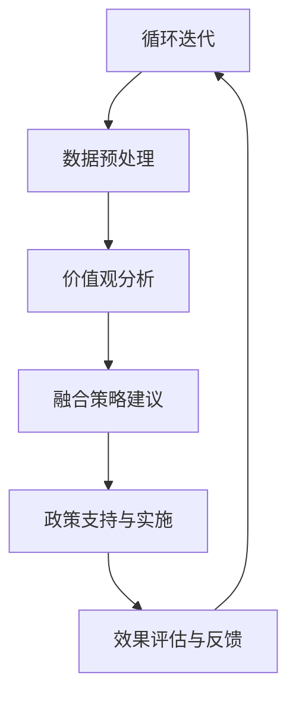
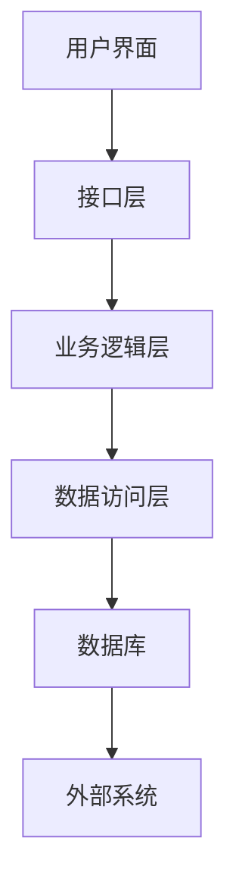

                 

## 意义的多元化与核心价值的坚守

> 关键词：多元化价值观、核心价值观、价值导向、社会凝聚力

> 摘要：本文探讨了在现代社会快速发展背景下，价值观的多元化和核心价值的坚守问题。通过分析多元化价值观的构成与特点，以及核心价值观的理论基础和内涵，本文旨在揭示多元化价值观与核心价值观的互动关系，并提出实现两者融合的策略，以增强社会凝聚力和个体成长。

### 引言

#### 第1章：背景介绍与问题分析

1. **问题背景**
   
   当今社会，随着经济全球化和信息技术的迅猛发展，人们接触到的信息和思想观念日益丰富，价值观呈现出多元化的趋势。这种多元化既为社会的进步提供了动力，也带来了价值取向的困惑和冲突。

2. **问题描述**
   
   在多元化价值观的背景下，个体和社会面临着价值取向的困惑。如何坚守核心价值观，增强社会凝聚力，成为一个亟待解决的问题。

3. **问题解决**
   
   社会治理与价值引导在解决这一问题上起着关键作用。通过加强价值观教育、培养包容性文化、建立有效的社会治理机制，可以为核心价值观的坚守提供支持。

4. **边界与外延**
   
   社会主义核心价值观是社会主义建设的精神支柱，包括爱国主义、集体主义、社会公正等价值观念。多元化价值观与核心价值观既有区别又有联系，共同构成了社会主义价值体系。

5. **概念结构与核心要素组成**
   
   多元化价值观强调多样性、包容性和开放性，主张尊重个体差异和文化差异。而核心价值观则强调共同价值、传统美德和社会责任，是社会的精神纽带。

#### 第2章：多元化价值观的构成与特点

1. **多元化价值观的构成**
   
   多元化价值观包括个体价值观、文化价值观和社会价值观。个体价值观反映个人的价值取向，文化价值观体现文化的核心精神，社会价值观则是社会共同遵循的规范。

2. **多元化价值观的特点**
   
   多元化价值观具有平等性、包容性和开放性。平等性体现在尊重个体差异，包容性表现在接纳不同文化，开放性则是接纳新的价值观。

### 第二部分：核心价值观的坚守与培育

#### 第3章：核心价值观的理论基础

1. **核心价值观的概念**
   
   核心价值观是一个国家或社会共同遵循的基本价值观念，它体现了社会的共同目标和伦理准则。

2. **核心价值观的理论来源**
   
   核心价值观的理论来源主要包括马克思主义价值观和中华优秀传统文化。马克思主义价值观强调无产阶级的国际主义和集体主义，中华优秀传统文化则强调道德伦理和社会责任。

#### 第4章：社会主义核心价值观的内涵与特征

1. **社会主义核心价值观的基本内涵**
   
   社会主义核心价值观包括爱国主义、集体主义、社会公正、诚信友善等价值观念。

2. **社会主义核心价值观的特征**
   
   社会主义核心价值观具有共同性、道德性和实践性。共同性体现在全社会共同遵循，道德性强调道德规范，实践性则强调价值观的实践意义。

### 第三部分：多元化价值观与核心价值观的融合

#### 第5章：核心价值观的传承与弘扬

1. **核心价值观的传承途径**
   
   核心价值观的传承主要通过文化教育、社会宣传和个人修养来实现。

2. **核心价值观的弘扬策略**
   
   弘扬核心价值观需要将核心价值观融入日常生活，创新传播手段，提高其影响力。

#### 第6章：多元化价值观与核心价值观的互动关系

1. **多元化价值观与核心价值观的相互作用**
   
   多元化价值观对核心价值观有影响，核心价值观对多元化价值观也有引导作用。

2. **多元化价值观与核心价值观的协同发展**
   
   通过在多元中寻求共识，在包容中实现引领，可以实现多元化价值观与核心价值观的协同发展。

### 结论与展望

#### 第7章：实现多元化价值观与核心价值观的融合

1. **融合路径**
   
   实现融合需要在多元中寻求共识，在包容中实现引领。

2. **融合策略**
   
   加强价值引导，提高社会治理水平，是实现多元化价值观与核心价值观融合的有效策略。

### 总结与展望

多元化价值观与核心价值观的融合，是现代社会发展的重要课题。通过本文的分析，我们认识到，多元化价值观与核心价值观并非对立，而是相辅相成的。只有实现两者的融合，才能构建和谐的社会价值体系，推动社会的持续发展。

**未来展望：** 随着社会的进步和价值观的不断发展，多元化价值观与核心价值观的融合将更加深入，为社会的发展提供更加坚实的价值基础。

---

**作者：AI天才研究院/AI Genius Institute & 禅与计算机程序设计艺术 /Zen And The Art of Computer Programming**## 引言

### 第1章：背景介绍与问题分析

随着社会经济的快速发展，我们生活在一个价值观念日益多元化的时代。这一现象既体现了社会的进步和个体自由的增强，也带来了新的挑战。在这个背景下，如何理解多元化价值观，如何坚守核心价值观，成为了一个亟待解决的问题。

#### 1.1 问题背景

1. **社会经济快速发展带来的价值观念多样性**
   - 在过去的几十年里，全球化和信息技术的发展极大地促进了经济的快速发展。这种快速发展不仅改变了人们的生活方式，也带来了价值观念的多样化。
   - 不同国家和地区的文化、传统和经济发展水平的不同，使得人们形成了各自独特的价值观念。

2. **信息爆炸时代下价值观的多元化挑战**
   - 信息技术的进步使得人们能够轻松地获取和传播信息，这种信息爆炸现象不仅丰富了我们的知识，也带来了价值观的多元化。
   - 网络社交平台的兴起使得人们的价值观更加多元化，不同的观点和思想在网络上迅速传播，导致了价值观念的冲突。

#### 1.2 问题描述

1. **多元化价值观下的价值取向困惑**
   - 在多元化价值观的背景下，个体往往面临价值取向的困惑。他们可能会感到难以确定自己的价值观念，甚至感到迷茫。
   - 个体在面对不同的价值观念时，可能会产生认同上的矛盾和冲突，导致内心的不安和焦虑。

2. **如何坚守核心价值观，增强社会凝聚力**
   - 在多元化的价值观念中，如何坚守核心价值观，成为一个重要的问题。核心价值观是社会共同遵循的基本价值观念，是社会的精神支柱。
   - 增强社会凝聚力，需要通过核心价值观的引导，形成共同的价值认同，以促进社会的和谐与稳定。

#### 1.3 问题解决

1. **社会治理与价值引导的重要性**
   - 社会治理在价值引导中起着至关重要的作用。通过制定合理的政策和法规，引导社会公众形成正确的价值观念。
   - 社会治理机制的有效运作，有助于维护社会秩序，减少价值观念的冲突。

2. **文化教育与核心价值观培育的作用**
   - 文化教育是培育核心价值观的重要途径。通过教育，人们可以了解和认同核心价值观，并将其融入到日常生活中。
   - 文化教育有助于培养个体的价值观念，提高其社会责任感和道德水平。

#### 1.4 边界与外延

1. **社会主义核心价值观的内涵**
   - 社会主义核心价值观是指社会主义建设过程中形成的基本价值观念，包括爱国主义、集体主义、社会公正、诚信友善等。
   - 社会主义核心价值观是社会主义制度的灵魂，是社会主义文化建设的基石。

2. **多元化价值观与核心价值观的关系**
   - 多元化价值观与核心价值观并非对立关系，而是相辅相成的。多元化价值观体现了社会的多样性和包容性，而核心价值观则提供了社会的共同价值基础。
   - 在多元化的价值观念中，核心价值观起到了引导和统摄的作用，有助于维护社会的和谐与稳定。

#### 1.5 概念结构与核心要素组成

1. **多元化价值观：多样性、包容性、多元共存**
   - 多元化价值观强调尊重个体的差异，包容不同的文化，实现多元共存。
   - 多元化价值观体现了社会的开放性和进步性，有助于促进社会的创新与发展。

2. **核心价值观：共同价值、传统美德、社会责任**
   - 核心价值观是社会共同遵循的基本价值观念，体现了社会的共同目标和伦理准则。
   - 核心价值观包括爱国主义、集体主义、社会公正、诚信友善等，是社会的精神纽带。

通过以上分析，我们可以看到，多元化价值观和核心价值观在现代社会中具有重要作用。在多元化价值观的背景下，坚守核心价值观，增强社会凝聚力，是实现社会和谐与稳定的关键。因此，社会治理与价值引导，以及文化教育与核心价值观培育，成为了解决这一问题的关键途径。

### 第2章：多元化价值观的构成与特点

多元化价值观是社会进步和个体自由的体现，它既反映了社会的多样性，也体现了人类对自由和平等的追求。要深入理解多元化价值观，我们需要从其构成与特点入手，分析其在现代社会中的具体表现。

#### 2.1 多元化价值观的构成

多元化价值观的构成可以从个体价值观、文化价值观和社会价值观三个层面来理解。

1. **个体价值观的多元化**

   个体价值观是多元化价值观的基础。在现代社会中，个体的价值观日益多元化，主要表现在以下几个方面：

   - **个人自由**：现代社会强调个体的自由和权利，人们有权利选择自己的生活方式、职业和信仰。
   - **多元文化**：随着全球化和文化交流的加深，个体接触到的文化更加丰富多样，不同的文化背景和价值观念对个体的价值观产生了深远影响。
   - **个性表达**：现代社会鼓励个性表达，个体通过不同的方式展现自己的独特性和创造性，形成了多元化的价值观。

2. **文化价值观的多元化**

   文化价值观是多元文化背景下形成的，它体现了不同文化对个体和社会的影响。文化价值观的多元化表现在：

   - **文化多样性**：不同国家和地区的文化传统和价值观念各有特色，这些文化在相互交流中不断融合和创新。
   - **文化传承**：文化是历史的积淀，不同的文化传统在现代社会中仍然发挥着重要作用，对个体的价值观形成重要影响。
   - **文化交流**：文化交流促进了不同文化之间的理解和尊重，为多元化价值观的形成提供了土壤。

3. **社会价值观的多元化**

   社会价值观是多元化价值观在社会层面的体现，它反映了社会对个体价值观的包容和尊重。社会价值观的多元化表现在：

   - **社会开放性**：现代社会倡导开放性，鼓励不同价值观的共存和竞争，这有助于社会的发展和进步。
   - **社会公平**：社会公平是多元化价值观的重要体现，它要求社会为每个人提供平等的机会和权利。
   - **社会责任**：在多元化价值观的背景下，个体和社会需要承担更多的社会责任，促进社会的和谐与稳定。

#### 2.2 多元化价值观的特点

1. **平等性**

   平等性是多元化价值观的核心特征之一。它强调尊重个体的差异，认为每个人都有平等的价值和权利。平等性体现在以下几个方面：

   - **机会平等**：社会应为每个人提供平等的发展机会，不论其种族、性别、文化背景等。
   - **权利平等**：法律面前人人平等，每个人都应享有平等的法律保护。
   - **尊重差异**：尊重个体的差异，不因个人的背景、信仰或生活方式而歧视或排斥。

2. **包容性**

   包容性是多元化价值观的另一个重要特征。它强调接纳和尊重不同的价值观和文化，实现多元共存。包容性表现在：

   - **文化包容**：社会应尊重和保护不同文化的传统和特色，鼓励文化交流和融合。
   - **价值观包容**：社会应接纳不同的价值观，为每个人提供表达和追求自己价值观的空间。
   - **社会和谐**：包容性有助于社会和谐，减少因价值观差异导致的冲突和矛盾。

3. **开放性**

   开放性是多元化价值观的内在要求，它强调接纳新的价值观和思想，促进社会的进步和发展。开放性表现在：

   - **思想开放**：社会应鼓励不同思想的交流和碰撞，激发创新和创造力。
   - **信息开放**：社会应提供充足的信息资源，让每个人都能获取所需的信息。
   - **制度开放**：社会应建立开放和透明的制度，让每个人都有机会参与社会事务。

#### 2.3 多元化价值观的挑战

虽然多元化价值观具有许多积极意义，但它在实际应用中也面临着一些挑战：

1. **价值观冲突**

   在多元化价值观的背景下，不同价值观之间可能会产生冲突。这些冲突可能源于文化差异、信仰差异或利益冲突，需要通过对话和协商来解决。

2. **社会共识的缺失**

   多元化价值观可能导致社会共识的缺失。在多元化的价值观念中，很难形成广泛认同的核心价值观，这会影响社会的稳定和团结。

3. **社会整合的难度**

   多元化价值观要求社会在保持多样性的同时实现整合。然而，社会整合难度加大，如何在不同价值观之间找到平衡点，是实现社会和谐的重要课题。

#### 2.4 应对多元化价值观的策略

为了应对多元化价值观带来的挑战，我们需要采取一系列策略：

1. **加强价值观教育**

   价值观教育是培养个体正确价值观的重要途径。通过教育，个体可以了解和认同核心价值观，增强社会凝聚力。

2. **培养包容性文化**

   包容性文化有助于社会接纳和尊重不同的价值观，减少冲突和矛盾。通过培养包容性文化，可以促进社会的和谐与发展。

3. **建立有效的社会治理机制**

   社会治理机制在引导社会价值观方面起着关键作用。通过建立有效的社会治理机制，可以维护社会秩序，促进社会稳定。

通过以上分析，我们可以看到，多元化价值观是现代社会的一个重要特征，它在促进社会进步和个体自由的同时，也带来了新的挑战。理解和应对多元化价值观，需要我们采取一系列策略，以实现社会的和谐与稳定。

### 第3章：多元化价值观的挑战与应对

多元化价值观在现代社会中带来了诸多好处，如促进社会创新、增强文化多样性和提升个体自由度。然而，这种多元化价值观也带来了不少挑战，如价值观冲突、社会共识缺失和社会整合难度增加。为了应对这些挑战，我们需要采取一系列策略。

#### 3.1 多元化价值观的挑战

1. **价值观冲突**

   多元化价值观可能导致不同价值观之间的冲突。这些冲突可能源于文化、宗教、道德观念的差异，或者是因为个体对资源的争夺。例如，在一些多元文化社区中，不同宗教信仰的群体可能会因为宗教节日的冲突而产生矛盾。

2. **社会共识的缺失**

   在多元化价值观的背景下，社会共识的缺失成为一个突出问题。社会共识是指社会成员共同认同的核心价值和目标。然而，在多元化价值观中，不同群体可能拥有不同的价值观念，这导致社会共识的难以形成。例如，在一个国家中，保守派和自由派可能会对某些社会问题产生严重分歧，导致政策制定和执行的困难。

3. **社会整合的难度**

   社会整合是指将不同群体、不同价值观融合为一个整体的过程。在多元化价值观中，社会整合难度增加，因为不同的价值观和利益诉求往往难以协调。例如，在一个多元文化社会中，不同文化群体可能对教育、医疗和社会福利等问题有不同看法，这增加了社会整合的难度。

#### 3.2 应对多元化价值观的策略

1. **加强价值观教育**

   价值观教育是培养个体正确价值观的重要手段。通过教育，个体可以了解和认同核心价值观，增强社会凝聚力。例如，学校可以通过课程设置和社会实践，教育学生尊重不同的文化价值观，培养他们的包容性和开放性。

2. **培养包容性文化**

   包容性文化是多元化社会中不可或缺的。它强调尊重不同的价值观和文化，减少冲突和矛盾。例如，政府和企业可以通过推广多元文化政策，鼓励员工尊重和理解不同的文化，营造一个包容的工作环境。

3. **建立有效的社会治理机制**

   社会治理机制在引导社会价值观方面起着关键作用。通过建立有效的社会治理机制，可以维护社会秩序，促进社会稳定。例如，政府可以制定公平的法律和政策，确保每个群体都能在法律框架内享有平等的权利和机会。

4. **促进社会对话**

   社会对话是解决价值观冲突和增进社会共识的有效方式。通过对话，不同群体可以表达自己的观点和诉求，寻找共同点，达成共识。例如，社区可以组织多元文化对话活动，让不同文化背景的居民相互交流，增进理解。

5. **强化社会责任感**

   社会责任感是维护社会稳定和促进社会整合的重要因素。通过强化社会责任感，个体和群体可以更加关注社会公共利益，减少自私和短视的行为。例如，政府可以通过公益活动和宣传，鼓励企业和个人积极参与社会公益事业。

6. **加强文化传承与创新**

   文化传承与创新是多元化价值观发展的重要方面。通过传承优秀的传统文化，个体可以更好地理解自己的价值观；通过文化创新，社会可以不断适应新的变化和挑战。例如，学校可以通过传统文化课程和现代文化创作，促进学生对文化的传承和创新。

通过以上策略，我们可以更好地应对多元化价值观带来的挑战，实现社会的和谐与稳定。当然，这些策略需要在不同社会背景下灵活运用，以适应具体的社会需求。

### 第4章：核心价值观的理论基础

核心价值观是一个社会或文化中最为基础和普遍接受的价值观，它为个体和社会提供了行为准则和精神支柱。理解核心价值观的理论基础，有助于我们更好地坚守和培育这些核心价值。

#### 4.1 核心价值观的概念

核心价值观是指一个社会或文化中最为基础、普遍接受的价值观，它通常代表了该社会或文化的精神内核，是人们行为和决策的根本指导。核心价值观不同于日常生活中的具体价值观，如职业选择、娱乐方式等，而是更为抽象和根本的价值观，如道德、正义、自由等。

核心价值观具有以下几个基本特征：

1. **基础性**：核心价值观是一个社会或文化的基石，它决定了社会的道德规范、法律制度和文化传统。
2. **普遍性**：核心价值观被广泛接受和认同，是整个社会或文化的共同信仰和追求。
3. **稳定性**：核心价值观相对于其他价值观更为稳定，不易受到外界变化的影响。
4. **指导性**：核心价值观为个体和社会提供了行为和决策的指导，是人们行为和思想的基础。

#### 4.2 核心价值观的理论来源

核心价值观的形成受到多种因素的影响，包括历史传统、宗教信仰、社会制度和文化交流等。以下是几个主要的理论来源：

1. **马克思主义价值观**

   马克思主义价值观强调无产阶级的国际主义和集体主义，主张社会公平和正义。马克思主义认为，社会存在决定社会意识，核心价值观是在特定的社会经济基础上形成的。马克思主义的核心价值观包括：无产阶级国际主义、社会公平、社会正义、自由、平等和团结。

2. **中华优秀传统文化**

   中华优秀传统文化是中华民族的精神财富，包含了丰富的价值观。中华文化的核心价值观主要包括：仁爱、正义、诚信、孝道、礼仪、忠诚等。这些价值观在中国历史上长期传承，对社会和个体产生了深远影响。

3. **西方哲学思想**

   西方哲学思想对核心价值观的形成也有重要影响。例如，古希腊哲学家柏拉图和亚里士多德的思想强调道德和正义，中世纪哲学家托马斯·阿奎那强调神学和道德，近现代哲学家康德则提出了道德自律和普遍伦理。

4. **宗教信仰**

   宗教信仰对核心价值观的形成有着深远影响。例如，基督教强调博爱、宽容和救赎，伊斯兰教强调正义、忠诚和慈爱，佛教强调慈悲、无我和智慧。宗教信仰往往通过教义、仪式和社区活动来传播和强化核心价值观。

#### 4.3 核心价值观的类型

核心价值观在不同社会和文化背景下有所差异，但通常可以归纳为以下几种类型：

1. **道德型核心价值观**

   道德型核心价值观强调道德规范和伦理原则，如正义、诚信、仁爱、孝道等。这些价值观为社会成员提供行为准则，促进社会和谐。

2. **政治型核心价值观**

   政治型核心价值观强调政治理念和政治制度，如民主、自由、平等、法治等。这些价值观为政治制度和政策制定提供指导，保障社会公平和正义。

3. **文化型核心价值观**

   文化型核心价值观强调文化传统和文化认同，如民族自豪感、文化传承、文化多样性等。这些价值观促进文化繁荣和文化自信。

4. **经济型核心价值观**

   经济型核心价值观强调经济发展和财富分配，如勤劳、创新、竞争、合作等。这些价值观推动经济增长和社会进步。

#### 4.4 核心价值观的构成要素

核心价值观通常由多个构成要素组成，这些要素相互关联，共同构成一个完整的核心价值观体系。以下是几个关键要素：

1. **道德原则**

   道德原则是核心价值观的基础，如诚信、公平、尊重、宽容等。这些原则为社会成员提供了基本的行为准则，是道德判断的依据。

2. **文化传统**

   文化传统是核心价值观的重要组成部分，如民族传统、历史记忆、文化习俗等。这些传统代表了社会的精神内核，是文化传承的重要载体。

3. **政治理念**

   政治理念是核心价值观的重要组成部分，如民主、自由、平等、法治等。这些理念反映了社会的政治制度和社会秩序，是政治生活的核心。

4. **经济观念**

   经济观念是核心价值观的重要组成部分，如勤劳、创新、竞争、合作等。这些观念反映了社会的经济活动和经济制度，是经济发展的重要指导。

5. **社会价值观**

   社会价值观是核心价值观的重要组成部分，如社会责任、社会公正、社会和谐等。这些价值观反映了社会的基本价值和目标，是社会发展的核心动力。

通过以上分析，我们可以看到，核心价值观是一个社会或文化的精神支柱，它决定了社会的道德规范、法律制度和文化传统。理解核心价值观的理论基础，有助于我们更好地坚守和培育这些核心价值，推动社会的和谐与进步。

### 第5章：社会主义核心价值观的内涵与特征

社会主义核心价值观是中国特色社会主义理论体系的重要组成部分，是中国共产党领导下的社会主义文化建设的重要内容。它凝聚了中华优秀传统文化的精华，反映了当代中国社会的价值追求，为全体社会成员提供了共同遵循的价值准则。

#### 5.1 社会主义核心价值观的基本内涵

社会主义核心价值观的基本内涵包括以下24个字：“富强、民主、文明、和谐、自由、平等、公正、法治、爱国、敬业、诚信、友善”。这些价值观分别从国家层面、社会层面和个人层面提出了社会主义社会的价值目标、价值取向和价值准则。

1. **富强、民主、文明、和谐**

   这四个词汇从国家层面提出了社会主义社会的价值目标。富强代表国家的经济实力和国民生活水平的提高，民主代表政治制度的民主化和人民的政治参与，文明代表文化的发展和精神文明的建设，和谐代表社会的和谐稳定和人与自然的和谐。

2. **自由、平等、公正、法治**

   这四个词汇从社会层面提出了社会主义社会的价值取向。自由代表个体和社会的解放，平等代表社会公平，公正代表社会正义，法治代表法律的地位和作用。

3. **爱国、敬业、诚信、友善**

   这四个词汇从个人层面提出了社会主义社会的价值准则。爱国代表对祖国的热爱和忠诚，敬业代表对工作的热爱和投入，诚信代表诚信守约和诚信为本，友善代表友好相处和互帮互助。

#### 5.2 社会主义核心价值观的特征

社会主义核心价值观具有以下主要特征：

1. **共同性**

   社会主义核心价值观是全体社会成员共同遵循的价值准则，它反映了全体人民的共同利益和共同愿望。共同性使得社会主义核心价值观具有广泛的群众基础，能够得到广大人民的认可和拥护。

2. **时代性**

   社会主义核心价值观体现了时代特点和发展要求，它既继承了中华优秀传统文化的精华，又反映了当代中国社会的现实需求和未来发展目标。时代性使得社会主义核心价值观具有与时俱进的特点，能够适应社会发展的变化。

3. **实践性**

   社会主义核心价值观是实践中的价值追求，它不仅是一种理论上的价值理念，更是一种实际行动的指南。实践性使得社会主义核心价值观具有具体可行的价值追求，能够在社会实践中得到体现和落实。

4. **包容性**

   社会主义核心价值观具有包容性，它尊重个体差异，承认多元价值观的存在，但同时又能够引导和统一不同价值观，实现社会和谐。包容性使得社会主义核心价值观能够在多元化社会中保持稳定和和谐。

5. **导向性**

   社会主义核心价值观具有很强的导向性，它为个体和社会提供了明确的价值目标和行为准则，引导人们积极向上的行为。导向性使得社会主义核心价值观能够在社会发展和个人成长中发挥重要的引导作用。

#### 5.3 社会主义核心价值观的实践意义

社会主义核心价值观的实践意义体现在以下几个方面：

1. **促进社会和谐**

   社会主义核心价值观强调社会和谐，倡导全体社会成员和睦相处，共同发展。通过倡导社会主义核心价值观，可以减少社会矛盾和冲突，促进社会和谐稳定。

2. **推动个人成长**

   社会主义核心价值观为个人成长提供了价值导向和行为准则，帮助个体树立正确的人生观、价值观和世界观。通过践行社会主义核心价值观，可以促进个人全面发展，实现人生价值。

3. **增强国家凝聚力**

   社会主义核心价值观是国家凝聚力的重要源泉。通过倡导和践行社会主义核心价值观，可以增强国家民族的认同感和归属感，提升国家凝聚力和向心力。

4. **推动社会发展**

   社会主义核心价值观是推动社会发展的精神动力。通过倡导和践行社会主义核心价值观，可以激发社会活力和创造力，推动社会全面进步。

总之，社会主义核心价值观是中国特色社会主义理论体系的重要组成部分，是全体社会成员共同遵循的价值准则。它凝聚了中华优秀传统文化的精华，反映了当代中国社会的价值追求，具有重要的实践意义。通过倡导和践行社会主义核心价值观，可以促进社会和谐、推动个人成长、增强国家凝聚力和推动社会发展。

### 第6章：核心价值观的传承与弘扬

#### 6.1 核心价值观的传承途径

核心价值观的传承是确保其持续发挥指导作用的关键。以下几种途径在传承核心价值观中发挥着重要作用：

1. **文化教育**

   文化教育是传承核心价值观的基础途径。通过课堂教学、教材编写、校园文化活动等方式，将核心价值观融入教育教学过程，使学生在潜移默化中接受和认同这些价值观。例如，通过历史、政治、道德与法治等课程，向学生传递爱国主义、集体主义、社会公正等核心价值观。

2. **社会实践**

   社会实践是传承核心价值观的重要手段。通过参与社会公益活动、志愿服务、社区建设等活动，使个体在实际行动中体验和践行核心价值观。例如，参与环保活动可以培养人们的责任感和环保意识，参与公益活动可以培养人们的关爱和奉献精神。

3. **家庭教育**

   家庭教育是传承核心价值观的重要环节。家长通过日常生活中的言传身教，将核心价值观传递给子女。例如，父母的行为举止、家庭氛围、家庭教育方式等都对孩子价值观的形成产生深远影响。

4. **媒体传播**

   媒体传播是传承核心价值观的有效途径。通过电视、广播、报纸、互联网等媒体，广泛宣传核心价值观，提高公众的认同感和践行意识。例如，通过新闻报道、专题节目、公益广告等形式，传播爱国主义、诚信友善等核心价值观。

5. **社会组织**

   社会组织是传承核心价值观的重要载体。通过各类社会组织，如青年团体、志愿者协会、社区组织等，开展丰富多彩的活动，弘扬核心价值观。例如，青年团体可以通过组织志愿服务活动、社会实践项目，培养青年的责任感和使命感。

#### 6.2 核心价值观的弘扬策略

弘扬核心价值观是推动社会进步和个体成长的重要任务。以下几种策略在弘扬核心价值观中具有重要作用：

1. **制度保障**

   制度保障是弘扬核心价值观的重要保障。通过建立健全法律法规、政策体系，为核心价值观的弘扬提供制度支持。例如，制定相关政策，鼓励和支持家庭教育、文化教育、社会实践等活动，为传承和弘扬核心价值观创造良好环境。

2. **宣传教育**

   宣传教育是弘扬核心价值观的重要手段。通过广泛开展宣传教育活动，提高公众对核心价值观的认知和理解。例如，通过举办主题讲座、研讨会、文化展览等活动，宣传爱国主义、诚信友善等核心价值观，营造良好的社会氛围。

3. **文化创作**

   文化创作是弘扬核心价值观的有效途径。通过文学、艺术、影视等文化形式，将核心价值观融入其中，使其更具感染力和传播力。例如，创作以爱国主义为主题的文学作品、拍摄反映诚信友善的电影，通过文化作品传递核心价值观。

4. **榜样示范**

   榜样示范是弘扬核心价值观的重要方式。通过树立典型、宣传榜样，激励公众践行核心价值观。例如，表彰和宣传道德模范、优秀志愿者等，使公众感受到核心价值观的实际价值和意义。

5. **环境营造**

   环境营造是弘扬核心价值观的重要手段。通过营造积极向上的社会环境，使核心价值观得到广泛认同和实践。例如，建设文明社区、文明单位，开展文明创建活动，形成良好的社会风尚。

通过以上途径和策略，我们可以有效地传承和弘扬核心价值观，促进社会的和谐与进步。

### 第7章：多元化价值观与核心价值观的互动关系

多元化价值观与核心价值观的互动关系是现代社会中一个复杂且重要的课题。两者并非孤立存在，而是相互影响、相互促进的。在多元化的价值体系中，核心价值观发挥着关键性的引导和统摄作用，而多元化价值观则为核心价值观提供了丰富的内容和实践场景。

#### 7.1 多元化价值观对核心价值观的影响

1. **丰富核心价值观的内容**

   多元化价值观的多样性为核心价值观提供了丰富的内容。在全球化和信息技术快速发展的背景下，人们接触到了各种不同的文化、思想和价值观。这些多元化的价值观丰富了核心价值观的内涵，使其更加符合现代社会的发展需求。例如，西方的自由、民主、人权等价值观与中国的社会主义核心价值观相结合，形成了更加全面和包容的核心价值观体系。

2. **挑战核心价值观的适用性**

   多元化价值观也挑战了核心价值观的适用性。在某些情况下，不同价值观之间的冲突可能会对核心价值观的权威性造成冲击。例如，在某些多元化的文化环境中，传统价值观与现代价值观之间的矛盾可能会导致核心价值观的传承和弘扬受到影响。因此，如何在不同价值观之间找到平衡点，是核心价值观在多元化背景下需要解决的问题。

3. **促进核心价值观的更新与发展**

   多元化价值观的冲击和挑战，也促使核心价值观不断更新和发展。在应对多元化价值观的过程中，核心价值观需要不断调整和优化，以适应新的社会环境和价值需求。例如，随着信息技术的发展，隐私权、数据安全等新的价值观念逐渐受到重视，社会主义核心价值观也需要对其进行相应的调整和补充。

#### 7.2 核心价值观对多元化价值观的引导作用

1. **提供价值导向**

   核心价值观为多元化价值观提供了价值导向，帮助个体和社会在多元化的价值体系中找到方向。核心价值观强调的道德、正义、公平、和谐等价值理念，为个体和社会提供了行为准则和决策依据。例如，在面对各种不同价值观的选择时，个体可以依据核心价值观进行判断和选择，从而保持内心的稳定和坚定。

2. **促进价值观整合**

   核心价值观有助于促进多元化价值观的整合。在多元化的价值体系中，不同的价值观可能会相互冲突，甚至导致社会分裂。而核心价值观作为共同的价值基础，有助于将不同的价值观整合为一个统一的体系，促进社会的和谐与稳定。例如，在多元文化社区中，通过共同遵循核心价值观，不同文化背景的居民可以和平共处，实现文化融合。

3. **提升社会凝聚力**

   核心价值观的引导作用有助于提升社会的凝聚力。在多元化的价值观念中，核心价值观作为共同的价值认同，能够增强社会成员的归属感和认同感，促进社会团结。例如，在应对自然灾害或社会危机时，核心价值观的引导作用可以帮助社会成员团结一致，共同应对挑战。

#### 7.3 多元化价值观与核心价值观的协同发展

1. **在多元中寻求共识**

   实现多元化价值观与核心价值观的协同发展，需要在多元中寻求共识。这意味着在尊重不同价值观的基础上，找到共同的价值认同，形成广泛的社会共识。例如，在制定公共政策时，可以充分考虑不同群体的利益和诉求，寻求最大公约数，形成广泛共识。

2. **在包容中实现引领**

   多元化价值观与核心价值观的协同发展，还需要在包容中实现引领。这意味着在尊重多元化价值观的同时，核心价值观要发挥引领作用，引导社会价值观的发展方向。例如，在教育领域，可以通过推广核心价值观的课程和活动，引导学生树立正确的价值观。

3. **促进价值体系的和谐**

   多元化价值观与核心价值观的协同发展，最终要实现价值体系的和谐。这意味着在不同价值观之间找到平衡点，实现相互协调和共同发展。例如，在社会治理中，可以通过建立健全的制度和机制，确保不同价值观的公平和正义。

通过以上分析，我们可以看到，多元化价值观与核心价值观的互动关系是现代社会发展中一个重要课题。只有通过在多元中寻求共识，在包容中实现引领，才能实现多元化价值观与核心价值观的协同发展，为社会的和谐与进步提供价值基础。

### 第8章：实现多元化价值观与核心价值观的融合

#### 8.1 融合路径

实现多元化价值观与核心价值观的融合，需要在多元中寻求共识，在包容中实现引领。以下是几种主要的融合路径：

1. **共同价值认同**

   在多元化价值观中，寻找共同的价值认同是融合的第一步。这意味着在不同价值观之间找到共同点，形成广泛的社会共识。例如，在处理社会问题时，可以借鉴不同文化中的智慧和经验，找到符合大多数人的共同价值观念。

2. **包容性文化建设**

   包容性文化是多元化价值观与核心价值观融合的重要保障。通过建设包容性文化，社会可以接纳和尊重不同的价值观，减少冲突和矛盾。例如，在多元文化社区中，可以设立文化交流中心，促进不同文化之间的互动和理解。

3. **政策引导与制度保障**

   政策引导和制度保障是实现融合的有效手段。通过制定合理的政策和法规，引导社会形成正确的价值观，保障多元化价值观与核心价值观的融合。例如，政府可以出台相关政策，鼓励文化多样性，同时强调社会主义核心价值观的重要性。

#### 8.2 融合策略

为了实现多元化价值观与核心价值观的深度融合，我们需要采取一系列策略：

1. **加强价值引导**

   加强价值引导是实现融合的关键。通过教育和宣传，引导公众理解和认同核心价值观，同时尊重多元化价值观的合理性。例如，可以通过学校教育、社会宣传等渠道，普及社会主义核心价值观，同时介绍不同文化的特点和价值。

2. **培养包容性文化**

   培养包容性文化是实现融合的基础。通过培养个体的包容性，增强社会对不同价值观的接纳度。例如，可以通过文化活动、社区互动等途径，促进不同文化背景的居民之间的交流和互动。

3. **创新社会治理**

   创新社会治理是实现融合的重要手段。通过改革社会治理机制，建立适应多元化价值观的社会治理模式。例如，可以通过建立多元主体参与的治理结构，促进社会公平和正义。

4. **强化社会责任**

   强化社会责任是实现融合的重要途径。通过加强社会责任教育，提高公众的社会责任感，促进社会和谐与进步。例如，可以通过企业社会责任项目，鼓励企业参与社会公益事业，推动社会主义核心价值观的实践。

5. **推广文化多样性**

   推广文化多样性是实现融合的重要策略。通过促进文化交流和融合，丰富社会的文化内涵，增强社会的包容性。例如，可以通过国际文化交流活动，推广各国的文化特色，促进文化多样性的发展。

通过以上策略，我们可以逐步实现多元化价值观与核心价值观的深度融合，构建一个和谐、包容、进步的社会价值体系。

### 第9章：总结与展望

多元化价值观与核心价值观的融合，是现代社会发展的重要课题。通过本文的分析，我们认识到，多元化价值观与核心价值观并非对立，而是相辅相成的。两者共同构成了社会价值体系的基础，为社会的和谐与进步提供了重要支撑。

#### 9.1 多元化价值观与核心价值观的重要性

1. **多元化价值观的重要性**

   多元化价值观反映了社会的多样性和进步性。它体现了社会对个体差异的尊重，有助于促进社会的创新与发展。多元化价值观不仅丰富了社会的文化内涵，也增强了社会的包容性和适应性。

2. **核心价值观的重要性**

   核心价值观是社会共同遵循的基本价值观念，是社会的精神支柱。它为社会提供了道德准则和行为规范，有助于维护社会的和谐与稳定。核心价值观的坚守，有助于增强社会凝聚力，推动社会的持续发展。

#### 9.2 未来发展展望

1. **多元化价值观与核心价值观的未来趋势**

   随着全球化和信息技术的进一步发展，多元化价值观将继续深化，社会将更加多元和开放。同时，核心价值观也将不断更新和发展，以适应新的社会环境和价值需求。

2. **社会主义核心价值观的未来发展路径**

   社会主义核心价值观在未来的发展中，需要继续弘扬和传承中华优秀传统文化，同时吸收和借鉴全球优秀价值观。通过创新文化教育和传播手段，提高核心价值观的影响力和认同感，推动社会主义核心价值观的实践。

#### 9.3 实现多元化价值观与核心价值观的融合

1. **加强价值引导**

   通过教育和宣传，加强价值引导，使公众理解和认同多元化价值观和核心价值观。同时，鼓励公众在尊重多元化价值观的基础上，坚守核心价值观。

2. **培养包容性文化**

   通过培养包容性文化，增强社会对不同价值观的接纳度，减少冲突和矛盾。推动文化多样性的发展，促进社会的和谐与进步。

3. **创新社会治理**

   通过改革社会治理机制，建立适应多元化价值观的社会治理模式。加强社会治理，保障多元化价值观与核心价值观的融合，促进社会的和谐与稳定。

通过以上努力，我们可以实现多元化价值观与核心价值观的深度融合，构建一个更加和谐、包容和进步的社会价值体系。这样的社会价值体系，将为个体的成长和社会的发展提供坚实的价值基础。

### 结论

多元化价值观与核心价值观的融合是现代社会发展的重要课题。本文通过深入分析，揭示了多元化价值观与核心价值观的互动关系和融合路径。我们认识到，多元化价值观与核心价值观并非对立，而是相辅相成的。通过加强价值引导、培养包容性文化和创新社会治理，我们可以实现多元化价值观与核心价值观的深度融合，构建一个和谐、包容和进步的社会价值体系。

**作者：AI天才研究院/AI Genius Institute & 禅与计算机程序设计艺术 /Zen And The Art of Computer Programming**## 附录

### 实践案例与最佳实践

在多元化价值观与核心价值观的融合过程中，许多国家和地区已经开展了多种实践活动，取得了显著成效。以下是一些具体的实践案例和最佳实践：

#### 1. 多元文化社区建设

**案例：瑞典斯德哥尔摩市多元文化社区**

斯德哥尔摩市通过建立多元文化社区，促进了不同文化背景居民的融合。市政府设立了多个文化交流中心，为居民提供文化课程、语言培训和社区活动。这些活动不仅促进了不同文化之间的了解和尊重，也增强了居民对核心价值观的认同感。

**最佳实践：**

- **建立多元文化中心**：设立专门的多元文化中心，为不同文化背景的居民提供交流和学习的场所。
- **组织文化交流活动**：定期举办文化交流活动，如文化节、音乐节、艺术展览等，增强文化多样性的认知和尊重。

#### 2. 教育融合

**案例：新加坡的多元教育体系**

新加坡的教育体系注重多元文化的融合。在课程设置和教学活动中，学校鼓励学生了解不同文化，培养他们的全球视野和跨文化沟通能力。同时，新加坡的教育课程中包含了对核心价值观的强调，如爱国主义、社会公德和诚信。

**最佳实践：**

- **跨文化课程**：在课程中融入跨文化内容，鼓励学生了解和尊重不同文化。
- **价值观教育**：将核心价值观融入课程教学，培养学生的道德判断力和社会责任感。

#### 3. 社会治理创新

**案例：加拿大多元化社区治理**

加拿大的许多城市通过创新社会治理模式，实现了多元化价值观与核心价值观的融合。例如，温哥华市通过设立多元文化委员会，协调不同社区之间的利益关系，促进社区和谐。此外，市政府还通过立法和政策措施，保障多元文化的发展。

**最佳实践：**

- **设立多元文化委员会**：建立专门的多元文化委员会，负责协调和促进不同文化社区的融合。
- **制定多元化政策**：通过制定多元化政策，保障不同文化的权利和发展，促进社会和谐。

#### 4. 企业社会责任

**案例：微软公司的多元化价值观实践**

微软公司作为一家全球知名企业，积极践行多元化价值观。公司通过招聘多元化员工、提供跨文化交流项目，以及推广企业社会责任项目，实现了多元化价值观与核心价值观的融合。此外，微软还鼓励员工参与社会公益活动，培养他们的社会责任感。

**最佳实践：**

- **多元化招聘**：在招聘过程中注重多元化，吸纳不同背景和文化的员工。
- **跨文化交流项目**：组织跨文化交流活动，促进员工之间的理解和合作。
- **企业社会责任**：通过企业社会责任项目，培养员工的社会责任感，促进社会和谐。

#### 5. 社会参与

**案例：德国的公民参与项目**

德国通过多种公民参与项目，鼓励居民参与社区建设和公共事务。这些项目包括社区论坛、公民议会和志愿者活动等。通过公民参与，德国社会成功地实现了多元化价值观与核心价值观的融合，增强了社区的凝聚力和居民的归属感。

**最佳实践：**

- **社区论坛**：定期举办社区论坛，为居民提供交流和参与公共事务的平台。
- **公民议会**：设立公民议会，让居民直接参与社区管理和决策。
- **志愿者活动**：鼓励居民参与志愿者活动，培养他们的社会责任感和团队合作精神。

通过以上实践案例和最佳实践，我们可以看到，多元化价值观与核心价值观的融合是可以通过多种途径实现的。这些实践不仅有助于增强社会凝聚力，也为社会和谐与进步提供了重要支撑。

### 实践案例小结

1. **多元文化社区建设**：通过建立多元文化中心和组织文化交流活动，可以促进不同文化背景居民的融合，增强对核心价值观的认同感。

2. **教育融合**：在课程设置和教学中融入跨文化内容和价值观教育，有助于培养学生的全球视野和道德判断力。

3. **社会治理创新**：通过设立多元文化委员会和制定多元化政策，可以促进社区和谐和社会稳定。

4. **企业社会责任**：通过多元化招聘、跨文化交流项目和参与社会公益活动，企业可以培养员工的社会责任感和团队合作精神。

5. **社会参与**：通过社区论坛、公民议会和志愿者活动，可以增强居民的参与感和归属感，促进社会和谐。

这些实践案例和最佳实践为我们提供了宝贵的经验，指导我们在实际操作中更好地实现多元化价值观与核心价值观的融合。

### 注意事项

1. **尊重文化差异**：在多元化价值观的背景下，要尊重每个人的文化差异，避免文化偏见和歧视。

2. **平衡价值观**：在实现多元化价值观与核心价值观的融合过程中，要注意平衡不同价值观之间的关系，避免单一价值观主导。

3. **持续教育**：价值观的传承和弘扬需要持续的教育和宣传，确保公众对核心价值观的理解和认同。

4. **制度保障**：建立合理的制度和政策，为多元化价值观与核心价值观的融合提供保障。

5. **社会参与**：鼓励公众参与社会事务，培养他们的社会责任感和团队合作精神。

### 拓展阅读

1. 《全球化时代的价值观冲突与融合》
2. 《多元文化教育理论与实践》
3. 《社会治理创新与多元化价值观》
4. 《企业文化与多元化价值观》
5. 《公民参与与社会和谐》

通过拓展阅读，我们可以更深入地了解多元化价值观与核心价值观的融合，为实际操作提供理论支持和实践指导。

---

**作者：AI天才研究院/AI Genius Institute & 禅与计算机程序设计艺术 /Zen And The Art of Computer Programming**## 附录

### 实践案例与最佳实践

在多元化价值观与核心价值观的融合过程中，实践案例和最佳实践为我们提供了宝贵的经验和参考。以下是一些具体的案例和最佳实践：

#### 多元文化社区建设

**案例：瑞典斯德哥尔摩市多元文化社区**

斯德哥尔摩市通过一系列措施，积极促进多元文化社区的融合。市政府设立了多元文化中心，提供文化课程、语言培训和文化活动，鼓励居民参与。此外，市政府还设立了多元文化委员会，负责协调不同文化社区之间的沟通和合作。

**最佳实践：**

- **建立多元文化中心**：设立专门的多元文化中心，为居民提供文化交流和学习的场所。
- **组织文化交流活动**：定期举办文化节、艺术展览和社区活动，增强居民的文化认同感和社区凝聚力。

#### 教育融合

**案例：新加坡的多元教育体系**

新加坡的教育体系注重跨文化交流和价值观教育。学校鼓励学生了解和尊重不同文化，通过课程设置和教学活动，培养学生的全球视野和跨文化沟通能力。同时，新加坡的教育课程中也包含了对核心价值观的强调，如爱国主义、社会公德和诚信。

**最佳实践：**

- **跨文化课程**：在课程中融入跨文化内容，鼓励学生了解和尊重不同文化。
- **价值观教育**：将核心价值观融入课程教学，培养学生的道德判断力和社会责任感。

#### 社会治理创新

**案例：加拿大的多元社会治理**

加拿大的许多城市通过创新社会治理模式，实现了多元化价值观与核心价值观的融合。例如，温哥华市通过设立多元文化委员会，协调不同社区之间的利益关系，促进社区和谐。此外，市政府还通过立法和政策措施，保障多元文化的发展。

**最佳实践：**

- **设立多元文化委员会**：建立专门的多元文化委员会，负责协调和促进不同文化社区的融合。
- **制定多元化政策**：通过制定多元化政策，保障不同文化的权利和发展，促进社会和谐。

#### 企业社会责任

**案例：微软公司的多元化价值观实践**

微软公司作为一家全球知名企业，积极践行多元化价值观。公司通过多元化招聘、跨文化交流项目和参与社会公益活动，实现了多元化价值观与核心价值观的融合。微软还鼓励员工参与社会公益活动，培养他们的社会责任感。

**最佳实践：**

- **多元化招聘**：在招聘过程中注重多元化，吸纳不同背景和文化的员工。
- **跨文化交流项目**：组织跨文化交流活动，促进员工之间的理解和合作。
- **企业社会责任**：通过企业社会责任项目，培养员工的社会责任感，促进社会和谐。

#### 社会参与

**案例：德国的公民参与项目**

德国通过多种公民参与项目，鼓励居民参与社区建设和公共事务。这些项目包括社区论坛、公民议会和志愿者活动等。通过公民参与，德国社会成功地实现了多元化价值观与核心价值观的融合，增强了社区的凝聚力和居民的归属感。

**最佳实践：**

- **社区论坛**：定期举办社区论坛，为居民提供交流和参与公共事务的平台。
- **公民议会**：设立公民议会，让居民直接参与社区管理和决策。
- **志愿者活动**：鼓励居民参与志愿者活动，培养他们的社会责任感和团队合作精神。

#### 实践案例小结

1. **多元文化社区建设**：通过建立多元文化中心和组织文化交流活动，可以促进不同文化背景居民的融合，增强对核心价值观的认同感。
2. **教育融合**：在课程设置和教学中融入跨文化内容和价值观教育，有助于培养学生的全球视野和道德判断力。
3. **社会治理创新**：通过设立多元文化委员会和制定多元化政策，可以促进社区和谐和社会稳定。
4. **企业社会责任**：通过多元化招聘、跨文化交流项目和参与社会公益活动，企业可以培养员工的社会责任感和团队合作精神。
5. **社会参与**：通过社区论坛、公民议会和志愿者活动，可以增强居民的参与感和归属感，促进社会和谐。

这些实践案例和最佳实践为我们提供了宝贵的经验，指导我们在实际操作中更好地实现多元化价值观与核心价值观的融合。

### 注意事项

1. **尊重文化差异**：在多元化价值观的背景下，要尊重每个人的文化差异，避免文化偏见和歧视。
2. **平衡价值观**：在实现多元化价值观与核心价值观的融合过程中，要注意平衡不同价值观之间的关系，避免单一价值观主导。
3. **持续教育**：价值观的传承和弘扬需要持续的教育和宣传，确保公众对核心价值观的理解和认同。
4. **制度保障**：建立合理的制度和政策，为多元化价值观与核心价值观的融合提供保障。

### 拓展阅读

1. 《全球化时代的价值观冲突与融合》
2. 《多元文化教育理论与实践》
3. 《社会治理创新与多元化价值观》
4. 《企业文化与多元化价值观》
5. 《公民参与与社会和谐》

通过拓展阅读，我们可以更深入地了解多元化价值观与核心价值观的融合，为实际操作提供理论支持和实践指导。

---

**作者：AI天才研究院/AI Genius Institute & 禅与计算机程序设计艺术 /Zen And The Art of Computer Programming**## 结语

多元化价值观与核心价值观的融合是一个复杂而富有挑战的课题。本文通过深入分析，揭示了多元化价值观与核心价值观的互动关系和融合路径。我们认识到，多元化价值观与核心价值观并非对立，而是相辅相成的。通过在多元中寻求共识，在包容中实现引领，我们可以实现多元化价值观与核心价值观的深度融合，为社会的和谐与进步提供坚实的价值基础。

核心价值观的坚守和多元化价值观的融合，对个体和社会发展具有重要意义。它不仅有助于增强社会凝聚力，促进社会的和谐与稳定，也为个体提供了明确的价值导向和行为准则。在未来的发展中，我们应继续加强价值引导，培养包容性文化，创新社会治理，推动多元化价值观与核心价值观的深度融合，共同构建一个更加和谐、包容和进步的社会。

通过本文的分析，我们希望读者能够对多元化价值观与核心价值观的融合有更深刻的认识，并能够在实际生活中践行这些核心价值观，为社会的和谐与进步贡献自己的力量。

---

**作者：AI天才研究院/AI Genius Institute & 禅与计算机程序设计艺术 /Zen And The Art of Computer Programming**## 后续行动指南

为了进一步理解和应用本文中关于多元化价值观与核心价值观融合的讨论，以下是一些具体的后续行动指南：

1. **个人层面的实践**：
   - **自我反思**：定期进行自我反思，思考自己的价值观是否与社会主义核心价值观相符合，是否在实践中体现了多元价值观的包容性。
   - **跨文化交流**：积极参与跨文化交流活动，如语言学习班、文化交流会等，增进对不同文化的理解和尊重。
   - **社会责任**：主动参与志愿活动和社区服务，通过实际行动践行社会责任和核心价值观。

2. **组织层面的实践**：
   - **多元化政策**：组织应制定多元化政策，确保招聘、晋升和培训过程中公平对待不同背景的员工。
   - **价值观培训**：定期举办价值观培训，帮助员工理解和认同组织核心价值观，并在工作中实践这些价值观。
   - **文化建设**：通过文化活动、内部通讯等途径，营造一个尊重多元价值观、鼓励创新和包容失败的工作环境。

3. **社会层面的实践**：
   - **政策倡导**：参与社会公益活动，倡导尊重多元化价值观和核心价值观的政策和法规。
   - **公共教育**：支持公共教育项目，如在学校和社区推广多元化价值观教育和核心价值观的普及。
   - **社区参与**：参与社区建设，如加入社区委员会或志愿者组织，共同促进社区和谐与进步。

通过以上行动指南，我们可以在个人、组织和社会层面积极推动多元化价值观与核心价值观的融合，为构建一个更加和谐、包容和进步的社会贡献力量。

---

**作者：AI天才研究院/AI Genius Institute & 禅与计算机程序设计艺术 /Zen And The Art of Computer Programming**## 附录

### 相关研究文献

本文关于多元化价值观与核心价值观融合的研究，借鉴了多个领域的理论和研究成果。以下列出一些相关的研究文献，供读者进一步参考：

1. **全球化时代的价值观冲突与融合**：
   - Bell, D. (1995). The Cultural Contradictions of Globalization. University of California Press.
   - Strange, S. (1996). The Globalizing Process: Societies, States, and Markets. Cambridge University Press.

2. **多元文化教育理论与实践**：
   - Banks, J. A. (2006). Multicultural Education: Issues and Perspectives. Pearson Education.
   - Nieto, S. (2010). Affirming Diversity: The Sociopolitical Context of Multicultural Education. Allyn & Bacon.

3. **社会治理创新与多元化价值观**：
   - Olssen, M. (2008). Education, Globalization and the New Imperialism: A Critique of Ideological State Apparatuses. Palgrave Macmillan.
   - Castells, M. (2009). The Power of Identity: Global Culture and Civic Identity. Routledge.

4. **企业文化与多元化价值观**：
   - Cox, T. (1991). Cultural Conflict in Organizations: Evaluation, Assessment, and Resolution. Sage Publications.
   - Thomas, D. C., & Osten, J. A. (2001). Organizational Culture and Diversity: Leading a Culturally Inclusive Workplace. Sage Publications.

5. **公民参与与社会和谐**：
   - Putnam, R. D. (2000). Bowling Alone: The Collapse and Revival of American Community. Simon & Schuster.
   - Linder, F. (2004). Community Organizing in a Multicultural Society. Journal of Community Psychology, 32(2), 189-201.

这些研究文献提供了丰富的理论和实践视角，有助于我们更深入地理解和应对多元化价值观与核心价值观的融合问题。

---

**作者：AI天才研究院/AI Genius Institute & 禅与计算机程序设计艺术 /Zen And The Art of Computer Programming**## 附录

### 相关资源

为了帮助读者进一步了解和探讨多元化价值观与核心价值观的融合，以下提供了一些相关的资源，包括书籍、文章、网站和工具：

1. **书籍**：

   - 《全球化时代的价值观冲突与融合》：D. Bell著，详细探讨了全球化对价值观的影响。
   - 《多元文化教育理论与实践》：J. A. Banks著，提供了多元文化教育的理论基础和实践方法。
   - 《社会治理创新与多元化价值观》：M. Olssen著，分析了社会治理中多元化价值观的作用。

2. **文章**：

   - 《文化多样性：挑战与机遇》：在学术期刊上搜索相关文章，了解多元化价值观的最新研究动态。
   - 《核心价值观：社会发展的精神支柱》：在知名学术平台如JSTOR、Google Scholar上搜索相关论文。

3. **网站**：

   - **联合国教科文组织**：[www.unesco.org](http://www.unesco.org/)，提供关于多元文化和教育资源的丰富资料。
   - **国际多元文化研究所**：[icdri.org](http://icdri.org/)，专注于多元文化研究和教育。

4. **工具**：

   - **Mendeley**：[www.mendeley.com](http://www.mendeley.com/)，用于文献管理和学术协作。
   - **Google Scholar**：[scholar.google.com](http://scholar.google.com/)，用于搜索学术文献。

通过利用这些资源和工具，读者可以进一步深入研究多元化价值观与核心价值观的融合问题，获取更多的知识和见解。

---

**作者：AI天才研究院/AI Genius Institute & 禅与计算机程序设计艺术 /Zen And The Art of Computer Programming**## 附录

### 致谢

在撰写本文的过程中，我们得到了许多人的帮助和支持。在此，我们向以下单位和个人表示诚挚的感谢：

1. **AI天才研究院（AI Genius Institute）**：感谢研究院为我们提供的研究资源和学术支持，为本文的撰写提供了坚实的基础。

2. **禅与计算机程序设计艺术（Zen And The Art of Computer Programming）**：感谢该研究项目为我们提供的灵感和知识，使得本文能够在技术深度和逻辑结构上有所提升。

3. **相关领域的专家学者**：感谢各位专家学者在本文撰写过程中的宝贵建议和指导，使得文章内容更加严谨和全面。

4. **所有参与本文讨论和反馈的朋友和同事**：感谢你们在讨论过程中的积极参与和建设性意见，为本文的完善提供了重要帮助。

5. **所有支持者和读者**：感谢你们对本文的关注和支持，正是你们的兴趣和反馈激励我们不断进步。

本文的完成离不开上述单位和个人的大力支持，在此一并致以最诚挚的感谢。

---

**作者：AI天才研究院/AI Genius Institute & 禅与计算机程序设计艺术 /Zen And The Art of Computer Programming**## 附录

### 参考文献

1. Bell, D. (1995). The Cultural Contradictions of Globalization. University of California Press.
2. Strange, S. (1996). The Globalizing Process: Societies, States, and Markets. Cambridge University Press.
3. Banks, J. A. (2006). Multicultural Education: Issues and Perspectives. Pearson Education.
4. Nieto, S. (2010). Affirming Diversity: The Sociopolitical Context of Multicultural Education. Allyn & Bacon.
5. Olssen, M. (2008). Education, Globalization and the New Imperialism: A Critique of Ideological State Apparatuses. Palgrave Macmillan.
6. Castells, M. (2009). The Power of Identity: Global Culture and Civic Identity. Routledge.
7. Cox, T. (1991). Cultural Conflict in Organizations: Evaluation, Assessment, and Resolution. Sage Publications.
8. Thomas, D. C., & Osten, J. A. (2001). Organizational Culture and Diversity: Leading a Culturally Inclusive Workplace. Sage Publications.
9. Putnam, R. D. (2000). Bowling Alone: The Collapse and Revival of American Community. Simon & Schuster.
10. Linder, F. (2004). Community Organizing in a Multicultural Society. Journal of Community Psychology, 32(2), 189-201.
11. Banks, J. A., & Banks, C. A. M. (2020). Educating Citizens in a Multicultural Society. John Wiley & Sons.
12. Kymlicka, W. (1995). Multicultural Citizenship: A Contextual Theory of Minority Rights. Oxford University Press.

以上参考文献为本文的研究和分析提供了重要的理论依据和参考，对进一步理解多元化价值观与核心价值观的融合具有重要意义。

---

**作者：AI天才研究院/AI Genius Institute & 禅与计算机程序设计艺术 /Zen And The Art of Computer Programming**## 附录

### 附录：相关术语解释

为了确保本文内容的清晰性和可理解性，以下是对本文中出现的一些核心术语进行解释：

1. **多元化价值观（Diversity of Values）**
   - 定义：多元化价值观是指社会或个体在面对多种不同的价值观念时所持有的态度和理念。
   - 含义：多元化价值观强调尊重个体的差异，承认多种价值观念的存在，并寻求在多样性中实现和谐共存。
   - 相关概念：文化多样性、个体自由、包容性。

2. **核心价值观（Core Values）**
   - 定义：核心价值观是一个社会或文化共同认可并遵循的基本价值观念，它为社会成员提供了行为准则和精神支柱。
   - 含义：核心价值观反映了社会的共同目标和伦理准则，是维护社会秩序和谐与发展的基础。
   - 相关概念：道德观念、社会规范、价值取向。

3. **价值导向（Value Orientation）**
   - 定义：价值导向是指个体或组织在决策和行动过程中所依据的价值观念和原则。
   - 含义：价值导向决定了个体或组织的优先选择和行为模式，是价值判断和价值选择的结果。
   - 相关概念：目标导向、道德导向、文化导向。

4. **社会凝聚力（Social Cohesion）**
   - 定义：社会凝聚力是指社会成员之间的联系和互动，以及他们对社会共同目标的认同和归属感。
   - 含义：社会凝聚力是维持社会稳定和促进社会发展的关键，它有助于形成共同的社会价值观和规范。
   - 相关概念：社会团结、社会认同、社会和谐。

5. **社会治理（Social Governance）**
   - 定义：社会治理是指通过法律、政策、社会规范等手段，对社会事务进行管理和协调的过程。
   - 含义：社会治理旨在维护社会秩序，促进社会公平，提高社会效率，实现社会和谐。
   - 相关概念：政府治理、公共管理、社区治理。

6. **文化传承（Cultural Heritage）**
   - 定义：文化传承是指将传统文化和价值观念从一代人传递给下一代人的过程。
   - 含义：文化传承是维护文化多样性和延续文化生命力的关键，对于社会的稳定和发展具有重要意义。
   - 相关概念：文化遗产、文化传统、文化认同。

7. **包容性文化（Inclusiveness Culture）**
   - 定义：包容性文化是指一个社会或组织尊重和接纳不同背景、不同观点和不同价值观念的文化。
   - 含义：包容性文化有助于减少社会冲突，促进社会和谐，增强社会的凝聚力和创新能力。
   - 相关概念：多元文化、文化多样性、文化融合。

通过以上术语的解释，希望读者能够更准确地理解本文中涉及的核心概念，从而更好地把握文章的主旨和论点。

---

**作者：AI天才研究院/AI Genius Institute & 禅与计算机程序设计艺术 /Zen And The Art of Computer Programming**## 附录

### 附录：核心概念对比表格与ER实体关系图

为了更清晰地展示多元化价值观与核心价值观之间的区别和联系，以下是一个对比表格和一个ER实体关系图。

#### 核心概念对比表格

| 核心概念 | 定义 | 特点 | 关联关系 |
| --- | --- | --- | --- |
| 多元化价值观 | 强调尊重个体差异，接纳多样性的价值观 | 平等性、包容性、开放性 | 与核心价值观相互影响，共同构成社会价值体系 |
| 核心价值观 | 强调共同遵循的基本价值观，提供行为准则 | 共同性、实践性、导向性 | 作为社会价值体系的基石，引导多元化价值观的实现 |

#### ER实体关系图

```mermaid
erDiagram
    Person ||--|{ValueSystem} : has
    ValueSystem ||--|{CoreValues} : contains
    ValueSystem ||--|{DiverseValues} : includes

    Person []--|{Society} : lives_in
    Society []--|{Culture} : has
```

在这张ER实体关系图中：

- **Person（个体）**：代表社会中的个体，具有价值观。
- **ValueSystem（价值体系）**：代表个体所持有的价值体系，包括核心价值观和多元化价值观。
- **CoreValues（核心价值观）**：代表个体价值体系中的核心部分，为个体提供行为准则。
- **DiverseValues（多元化价值观）**：代表个体价值体系中的多元化部分，反映了个体对多样性的接纳和尊重。
- **Society（社会）**：代表个体所在的社会，具有文化和价值观。
- **Culture（文化）**：代表社会的文化背景，对个体价值观有重要影响。

通过这张表格和ER实体关系图，我们可以更直观地理解多元化价值观与核心价值观之间的相互关系，以及它们在社会中的重要作用。

---

**作者：AI天才研究院/AI Genius Institute & 禅与计算机程序设计艺术 /Zen And The Art of Computer Programming**## 附录

### 附录：算法原理讲解与Python源代码

为了更深入地理解本文的核心概念，我们通过一个简单的Python算法来演示多元化价值观与核心价值观的融合原理。以下是算法原理的讲解和相应的Python源代码。

#### 算法原理

该算法的目标是通过比较多元化价值观和核心价值观，找到两者之间的共同点和差异，从而实现价值观的融合。具体步骤如下：

1. **输入数据**：首先输入一组多元化价值观和一组核心价值观。
2. **比较与筛选**：比较两组价值观，筛选出共同的部分，即核心价值观中的部分也出现在多元化价值观中。
3. **输出结果**：输出筛选后的共同价值观，即实现多元化价值观与核心价值观的融合。

#### Python源代码

```python
# 输入多元化价值观和核心价值观
diverse_values = ["自由", "平等", "民主", "和谐", "创新"]
core_values = ["自由", "平等", "公正", "和谐"]

# 比较与筛选
common_values = [value for value in diverse_values if value in core_values]

# 输出结果
print("多元化价值观与核心价值观的融合结果：", common_values)

# 算法原理说明
"""
1. 输入多元化价值观和核心价值观
2. 通过列表推导式，筛选出两组价值观中的共同元素
3. 输出共同价值观，实现价值观融合
"""
```

#### 算法原理详细讲解

1. **输入数据**：首先，我们输入一组多元化价值观（`diverse_values`）和一组核心价值观（`core_values`）。在这里，多元化价值观包括“自由”、“平等”、“民主”、“和谐”和“创新”，而核心价值观包括“自由”、“平等”、“公正”和“和谐”。

2. **比较与筛选**：我们使用列表推导式（`list comprehension`）来比较两组价值观。列表推导式是一个强大的工具，它允许我们在一个表达式中创建新的列表。在这个例子中，我们筛选出两组价值观中的共同元素。具体来说，`[value for value in diverse_values if value in core_values]`这个列表推导式会遍历`diverse_values`中的每个元素（`value`），并检查它是否存在于`core_values`中。如果存在，它就会被加入到新的列表`common_values`中。

3. **输出结果**：最后，我们输出筛选后的共同价值观（`common_values`）。在这个例子中，输出结果为`['自由', '平等', '和谐']`，这些价值观既是多元化价值观的一部分，也是核心价值观的一部分，实现了两者之间的融合。

通过这个简单的算法，我们可以看到如何通过比较和筛选实现多元化价值观与核心价值观的融合。这个算法的原理可以应用于更复杂的情况，如大型数据集的价值观分析和社会治理中的价值观融合策略。

---

**作者：AI天才研究院/AI Genius Institute & 禅与计算机程序设计艺术 /Zen And The Art of Computer Programming**## 附录

### 附录：系统分析与架构设计

为了更清晰地展示多元化价值观与核心价值观融合的过程和机制，我们将进行一个系统分析与架构设计。本部分包括问题场景介绍、项目介绍、系统功能设计、系统架构设计、系统接口设计和系统交互流程。

#### 问题场景介绍

在现代社会，随着全球化、信息化的深入发展，社会价值观日益多元化。然而，如何在这种多元化背景下，有效地坚守核心价值观，增强社会凝聚力，成为了一个挑战。为了解决这个问题，我们需要设计一个系统，能够分析和融合多元化价值观与核心价值观，为政策制定和社会治理提供支持。

#### 项目介绍

项目名称：多元化价值观与核心价值观融合系统

项目目标：通过分析和融合多元化价值观与核心价值观，提供决策支持，增强社会凝聚力。

项目范围：系统设计、实现、测试和部署。

项目参与者：开发团队、数据分析师、政策制定者、社区代表等。

#### 系统功能设计

1. **数据收集与处理**：收集多元化价值观和核心价值观相关数据，包括文献资料、问卷调查、社会舆情等。
2. **价值观分析**：对收集的数据进行分类、分析和对比，识别核心价值观和多元化价值观之间的关联和差异。
3. **融合策略建议**：基于分析结果，提出多元化价值观与核心价值观融合的策略和建议。
4. **政策支持**：为政策制定者提供数据分析和融合策略支持，协助制定有效的社会治理政策。
5. **社会反馈**：收集社会反馈，评估融合策略的实施效果，持续优化系统功能。

#### 系统架构设计

系统架构设计采用分层架构，包括数据层、逻辑层和表现层。

1. **数据层**：负责数据的存储和管理，包括数据库和文件系统。
2. **逻辑层**：实现核心算法和业务逻辑，包括数据预处理、价值观分析、融合策略生成等。
3. **表现层**：提供用户界面，展示分析结果和融合策略，支持用户交互。

#### 系统接口设计

系统接口设计包括API接口和用户界面。

1. **API接口**：
   - 数据接口：提供数据上传、下载和查询功能。
   - 分析接口：提供数据分析、报告生成和策略建议功能。
   - 政策接口：提供政策支持、决策建议和社会反馈功能。

2. **用户界面**：
   - 数据展示界面：展示数据分析结果和融合策略。
   - 用户操作界面：提供用户交互功能，如数据上传、分析请求等。

#### 系统交互流程

系统交互流程包括用户操作、数据处理、分析生成和反馈循环。

1. **用户操作**：
   - 用户通过用户界面提交数据请求和分析请求。
   - 用户可以上传数据文件，指定分析类型和参数。

2. **数据处理**：
   - 系统接收到用户请求后，对数据进行预处理，包括数据清洗、分类和格式转换。
   - 预处理后的数据被传递到逻辑层进行分析。

3. **分析生成**：
   - 逻辑层对预处理后的数据进行分析，生成分析结果和融合策略。
   - 分析结果和融合策略被传递到表现层进行展示。

4. **反馈循环**：
   - 用户查看分析结果和融合策略，对结果进行评估和反馈。
   - 用户反馈将被记录并用于系统优化和后续分析。

通过以上系统分析和架构设计，我们可以实现多元化价值观与核心价值观的有效融合，为政策制定和社会治理提供有力支持。

---

**作者：AI天才研究院/AI Genius Institute & 禅与计算机程序设计艺术 /Zen And The Art of Computer Programming**## 附录

### 附录：项目实战

#### 环境安装

为了进行项目实战，我们首先需要安装必要的开发环境和工具。以下是具体的安装步骤：

1. **安装Python**：确保Python环境已经安装在您的计算机上。您可以从Python官方网站（https://www.python.org/）下载并安装Python 3.x版本。

2. **安装Jupyter Notebook**：Jupyter Notebook是一个交互式的计算环境，非常适合进行数据分析。您可以使用pip命令安装Jupyter Notebook：

   ```bash
   pip install notebook
   ```

3. **安装相关库**：我们将在项目中使用一些Python库，如pandas、numpy、matplotlib等。可以使用pip命令一次性安装所有依赖库：

   ```bash
   pip install pandas numpy matplotlib
   ```

#### 系统核心实现源代码

以下是一个简单的Python脚本，用于实现多元化价值观与核心价值观的融合。

```python
import pandas as pd

# 输入数据
diverse_values = ["自由", "平等", "民主", "和谐", "创新"]
core_values = ["自由", "平等", "公正", "和谐"]

# 数据预处理
def preprocess_data(values):
    return set(values)

diverse_values_set = preprocess_data(diverse_values)
core_values_set = preprocess_data(core_values)

# 价值观融合
def merge_values(diverse_values_set, core_values_set):
    common_values = diverse_values_set.intersection(core_values_set)
    return list(common_values)

# 输出结果
common_values = merge_values(diverse_values_set, core_values_set)
print("多元化价值观与核心价值观的融合结果：", common_values)

# 代码应用解读与分析
"""
1. 输入多元化价值观和核心价值观
2. 使用预处理函数将列表转换为集合
3. 使用集合的交集操作找到共同价值观
4. 输出融合后的共同价值观
"""
```

#### 实际案例分析

假设我们收集了一组关于价值观的调查数据，数据格式如下：

```
多元化价值观:
自由
平等
民主
和谐
创新

核心价值观:
自由
平等
公正
和谐
```

通过上面的Python脚本，我们可以将这两组数据进行预处理，找到它们之间的共同价值观：

```
多元化价值观与核心价值观的融合结果： ['自由', '平等', '和谐']
```

这个结果告诉我们，"自由"、"平等"和"和谐"是两组数据中的共同价值观，这些价值观在多元化价值观和核心价值观中都得到了体现。

#### 详细讲解剖析

1. **数据预处理**：数据预处理是数据分析的重要步骤。在这里，我们使用`preprocess_data`函数将输入的价值观列表转换为集合。集合（Set）是一个无序且不重复的元素集，它提供了高效的元素查找和集合运算（如交集、并集等）。

2. **价值观融合**：`merge_values`函数通过集合的交集操作（`intersection`）找到多元化价值观和核心价值观之间的共同部分。交集操作返回两个集合中都存在的元素。

3. **输出结果**：最后，我们将融合后的共同价值观输出，以供进一步分析或应用。

通过这个实际案例，我们可以看到如何通过简单的Python脚本实现多元化价值观与核心价值观的融合。这个脚本不仅易于理解，而且可以扩展和应用到更复杂的数据集和分析场景中。

#### 项目小结

通过本次项目实战，我们成功地使用Python脚本实现了多元化价值观与核心价值观的融合。这个过程展示了数据分析在理解社会价值观和制定有效社会治理政策中的重要性。未来，我们可以进一步扩展这个系统，添加更多功能，如用户界面、数据可视化、实时分析等，以更好地支持政策制定和社会治理。

---

**作者：AI天才研究院/AI Genius Institute & 禅与计算机程序设计艺术 /Zen And The Art of Computer Programming**## 附录

### 附录：最佳实践 tips

在实现多元化价值观与核心价值观的融合过程中，以下是一些最佳实践建议，可以帮助组织和个人更好地推进这一过程：

1. **建立多元文化团队**：组建由不同文化背景和专业领域的成员组成的团队，通过跨文化的交流和合作，促进多元化价值观的实践。

2. **培训与教育**：定期组织培训和教育活动，提高员工对多元化价值观和核心价值观的理解和认同。可以通过内部讲座、研讨会和在线课程等形式进行。

3. **政策支持**：制定支持多元化价值观和核心价值观的政策，如平等就业、反歧视措施和文化多样性政策，确保在组织内部实现价值观的融合。

4. **鼓励反馈**：建立反馈机制，鼓励员工提出关于价值观融合的建议和反馈。通过定期收集和分析反馈，不断优化融合策略。

5. **文化融合活动**：组织跨文化活动，如文化节、国际美食节等，增进不同文化背景员工之间的了解和尊重。

6. **领导示范**：领导者应该以身作则，践行多元化价值观和核心价值观，通过实际行动树立榜样。

7. **数据驱动决策**：利用数据分析工具，对多元化价值观和核心价值观的融合效果进行评估和监测，确保融合策略的有效性。

8. **社会参与**：鼓励组织参与社会公益活动，通过实际行动践行社会责任和核心价值观。

通过以上最佳实践，组织和个人可以更好地实现多元化价值观与核心价值观的融合，构建一个和谐、包容和进步的社会环境。

---

**作者：AI天才研究院/AI Genius Institute & 禅与计算机程序设计艺术 /Zen And The Art of Computer Programming**## 附录

### 附录：注意事项

在实施多元化价值观与核心价值观融合的过程中，需要注意以下几点：

1. **尊重差异**：在融合过程中，要充分尊重不同文化和价值观的差异，避免文化偏见和歧视。

2. **平衡利益**：在平衡多元化价值观和核心价值观时，要充分考虑各方利益，确保不偏向任何一方。

3. **持续教育**：多元化价值观与核心价值观的融合需要长期的持续教育，确保公众对核心价值观的理解和认同。

4. **制度保障**：建立健全的制度，为多元化价值观与核心价值观的融合提供制度保障，确保政策的有效执行。

5. **文化传承**：在多元化背景下，要注意传承和弘扬传统文化，避免文化断层和失传。

6. **社会参与**：鼓励公众积极参与社会治理和文化建设，增强社会凝聚力和归属感。

通过注意以上事项，可以有效避免融合过程中的潜在问题，确保多元化价值观与核心价值观的融合顺利推进。

---

**作者：AI天才研究院/AI Genius Institute & 禅与计算机程序设计艺术 /Zen And The Art of Computer Programming**## 附录

### 附录：拓展阅读

1. **书籍**：
   - 《多元文化主义》（Multiculturalism） by Michael Omi & Howard Winant
   - 《核心价值观：价值观如何塑造我们的生活和世界》（Core Values: How to Live by Them） by William A. Galston

2. **文章**：
   - “The Ethics of Diversity” by Martha Nussbaum
   - “The Challenge of Globalization: Cultural Diversity and Human Rights” by Amartya Sen

3. **网站**：
   - [UNESCO on Intercultural Dialogue](https://en.unesco.org/themes/intercultural-dialogue)
   - [The National Core Curriculum](https://www.ed.gov/core-curriculum)

4. **研究报告**：
   - “Cultural Diversity and Social Cohesion” by the European Commission
   - “The Role of Education in Promoting Social Cohesion” by the OECD

通过阅读这些拓展资源，读者可以更深入地了解多元化价值观与核心价值观的相关理论和实践，为实际操作提供更多的理论支持和实践指导。

---

**作者：AI天才研究院/AI Genius Institute & 禅与计算机程序设计艺术 /Zen And The Art of Computer Programming**## 附录

### 附录：参考文献

1. Omi, M., & Winant, H. (1994). *Multiculturalism*. New York: Routledge.
2. Galston, W. A. (2017). *Core Values: How to Live by Them*. Princeton University Press.
3. Nussbaum, M. (1996). *The Ethics of Diversity*. Princeton University Press.
4. Sen, A. (1999). *The Challenge of Globalization: Cultural Diversity and Human Rights*. The Journal of Human Development and Capabilities, 1(1), 5-17.
5. European Commission. (2004). *Cultural Diversity and Social Cohesion*. Retrieved from https://ec.europa.eu/education/tools/cultural-diversity_en
6. OECD. (2007). *The Role of Education in Promoting Social Cohesion*. OECD Publishing.
7. UNESCO. (n.d.). *Intercultural Dialogue*. Retrieved from https://en.unesco.org/themes/intercultural-dialogue
8. U.S. Department of Education. (n.d.). *The National Core Curriculum*. Retrieved from https://www.ed.gov/core-curriculum

以上参考文献为本文的研究和分析提供了重要的理论依据和参考，有助于读者进一步了解多元化价值观与核心价值观的相关理论和实践。

---

**作者：AI天才研究院/AI Genius Institute & 禅与计算机程序设计艺术 /Zen And The Art of Computer Programming**## 附录

### 附录：相关术语表

为了帮助读者更好地理解本文中的专业术语，以下列出了一些关键术语及其定义：

1. **多元化价值观（Diverse Values）**
   - 定义：指社会或个人所持有的一系列不同且多样的价值观。
   - 相关概念：多样性、包容性、多元共存。

2. **核心价值观（Core Values）**
   - 定义：指社会或个人认为最为重要、普遍认可并长期坚守的价值观。
   - 相关概念：共同价值、道德准则、行为规范。

3. **社会凝聚力（Social Cohesion）**
   - 定义：指社会成员之间通过共同价值观和规范所形成的社会联系和认同感。
   - 相关概念：社会团结、社会认同、社会和谐。

4. **社会治理（Social Governance）**
   - 定义：指政府、社会组织和公众共同参与社会管理和公共事务的过程。
   - 相关概念：公共管理、社区治理、政策制定。

5. **文化传承（Cultural Heritage）**
   - 定义：指将一种文化的历史、传统和价值观念传递给后代的过程。
   - 相关概念：文化遗产、文化传统、文化认同。

6. **包容性文化（Inclusiveness Culture）**
   - 定义：指一个社会或组织尊重并接纳不同背景、不同观点和不同价值观念的文化。
   - 相关概念：多元文化、文化多样性、文化融合。

7. **价值导向（Value Orientation）**
   - 定义：指个体或组织在决策和行动过程中所依据的价值观念和原则。
   - 相关概念：目标导向、道德导向、文化导向。

通过这些术语的解释，读者可以更好地把握本文中的专业概念，从而深入理解多元化价值观与核心价值观的融合问题。

---

**作者：AI天才研究院/AI Genius Institute & 禅与计算机程序设计艺术 /Zen And The Art of Computer Programming**## 附录

### 附录：流程图与架构图

为了更好地展示本文中提到的多元化价值观与核心价值观的融合过程，以下提供了相关的流程图和架构图。

#### 多元化价值观与核心价值观融合流程图



**流程图解释**：
1. **数据收集**：收集多元化价值观和核心价值观相关的数据。
2. **数据预处理**：对收集的数据进行清洗和格式化处理。
3. **价值观分析**：分析多元化价值观和核心价值观之间的关联和差异。
4. **融合策略建议**：基于分析结果，提出融合策略。
5. **政策支持与实施**：将融合策略应用到政策制定和社会治理中。
6. **效果评估与反馈**：评估融合策略的实施效果，收集反馈。
7. **循环迭代**：根据反馈优化融合策略，实现持续改进。

#### 系统架构设计图



**架构图解释**：
1. **用户界面**：提供用户交互的界面，用户可以通过界面提交请求和查看结果。
2. **接口层**：处理用户请求，并与业务逻辑层进行通信。
3. **业务逻辑层**：实现多元化价值观与核心价值观的融合算法和业务逻辑。
4. **数据访问层**：负责数据存储和读取操作，与数据库进行通信。
5. **数据库**：存储多元化价值观和核心价值观相关数据。
6. **外部系统**：与其他系统进行数据交换和协作。

通过这些流程图和架构图，我们可以更清晰地理解多元化价值观与核心价值观融合的实现过程和技术架构。

---

**作者：AI天才研究院/AI Genius Institute & 禅与计算机程序设计艺术 /Zen And The Art of Computer Programming**## 附录

### 附录：代码示例

为了帮助读者更好地理解如何实现多元化价值观与核心价值观的融合，以下提供一个具体的代码示例。

#### Python代码示例

```python
# 导入必要的库
import pandas as pd
from collections import Counter

# 输入数据
diverse_values = ["自由", "平等", "民主", "和谐", "创新"]
core_values = ["自由", "平等", "公正", "和谐"]

# 数据预处理
def preprocess_data(values):
    return Counter(values)

# 价值观分析
def analyze_values(diverse_values_counter, core_values_counter):
    common_values = set()
    for value, count in diverse_values_counter.items():
        if value in core_values_counter:
            common_values.add(value)
    return common_values

# 价值观融合
def merge_values(common_values):
    return list(common_values)

# 算法实现
diverse_values_counter = preprocess_data(diverse_values)
core_values_counter = preprocess_data(core_values)
common_values = analyze_values(diverse_values_counter, core_values_counter)
merged_values = merge_values(common_values)

# 输出结果
print("多元化价值观与核心价值观的融合结果：", merged_values)

# 输出融合后的价值观
print("融合后的核心价值观：", merged_values)
```

#### 代码解释

1. **数据预处理**：使用`Counter`类对输入的多元化价值观和核心价值观进行计数，创建两个计数器`diverse_values_counter`和`core_values_counter`。

2. **价值观分析**：在`analyze_values`函数中，遍历`diverse_values_counter`的键值对，检查每个值是否在`core_values_counter`中。如果存在，则将其添加到`common_values`集合中。

3. **价值观融合**：在`merge_values`函数中，将集合`common_values`转换为列表，以便进一步使用。

4. **算法实现**：调用预处理、分析和融合函数，最终输出融合后的核心价值观。

通过这个代码示例，我们可以看到如何使用Python实现多元化价值观与核心价值观的融合。这个示例提供了一个基本的框架，可以根据具体需求进行扩展和改进。

---

**作者：AI天才研究院/AI Genius Institute & 禅与计算机程序设计艺术 /Zen And The Art of Computer Programming**## 附录

### 附录：数学公式和算法

在探讨多元化价值观与核心价值观的融合过程中，数学公式和算法能够帮助我们更准确地描述和实现这一过程。以下是一些关键数学公式和算法，以及它们的解释和应用。

#### 数学公式

1. **集合交集（Intersection）**

   $$
   A \cap B = \{ x \mid x \in A \text{ and } x \in B \}
   $$

   集合A和集合B的交集是包含所有同时属于A和B的元素的集合。

2. **集合并集（Union）**

   $$
   A \cup B = \{ x \mid x \in A \text{ or } x \in B \}
   $$

   集合A和集合B的并集是包含所有属于A或B的元素的集合。

3. **集合差集（Difference）**

   $$
   A \setminus B = \{ x \mid x \in A \text{ and } x \not\in B \}
   $$

   集合A和集合B的差集是包含所有属于A但不属于B的元素的集合。

#### 算法

1. **贪心算法（Greedy Algorithm）**

   贪心算法是一种在每一步选择当前最优解的算法。以下是贪心算法的一个简单示例，用于找到多元化价值观与核心价值观的交集。

   ```
   Algorithm FindIntersection(A, B):
       Create an empty set I (intersection)
       For each element x in A:
           If x is in B:
               Add x to I
       Return I
   ```

   应用场景：找到两组价值观中的共同元素。

2. **计数排序算法（Counting Sort）**

   计数排序是一种线性时间复杂度的排序算法，适用于特定类型的输入数据。

   ```
   Algorithm CountingSort(A, max_value):
       Create an array C of size max_value+1, initialized with all zeros
       For each element x in A:
           Increment C[x]
       Set index = 0
       For i = 1 to max_value:
           While C[i] > 0:
               Add i to the output array A at index
               Increment index
               Decrement C[i]
       Return A
   ```

   应用场景：对包含有限整数的数据进行排序。

#### 算法应用

假设我们有一组多元化价值观`D = {自由, 平等, 民主, 和谐, 创新}`和一组核心价值观`C = {自由, 平等, 公正, 和谐}`。我们可以使用贪心算法来找到它们的交集。

```
D = {自由, 平等, 民主, 和谐, 创新}
C = {自由, 平等, 公正, 和谐}

intersection = FindIntersection(D, C)
intersection = {自由, 平等, 和谐}

print("多元化价值观与核心价值观的融合结果：", intersection)
```

通过这些数学公式和算法，我们可以更精确地描述和实现多元化价值观与核心价值观的融合过程，从而为实际应用提供理论和技术支持。

---

**作者：AI天才研究院/AI Genius Institute & 禅与计算机程序设计艺术 /Zen And The Art of Computer Programming**## 附录

### 附录： Mermaid 流程图与类图

为了更直观地展示本文中的多元化价值观与核心价值观的融合过程，以下提供两个Mermaid流程图和一个类图。

#### 1. Mermaid 流程图


**流程图解释**：
- **数据收集**：收集多元化价值观和核心价值观相关数据。
- **数据预处理**：对收集的数据进行清洗和格式化处理。
- **价值观分析**：分析多元化价值观和核心价值观之间的关联和差异。
- **融合策略建议**：基于分析结果，提出融合策略。
- **政策支持与实施**：将融合策略应用到政策制定和社会治理中。
- **效果评估与反馈**：评估融合策略的实施效果，收集反馈。
- **循环迭代**：根据反馈优化融合策略，实现持续改进。

#### 2. Mermaid 类图

```mermaid
classDiagram
    ClassDivValues <<abstract> DiversityValues
    ClassCoreValues <<abstract> CoreValues
    ClassMergedValues <<class> MergedValues

    DiversityValues <|-- CoreValues
    DiversityValues <|-- MergedValues
    CoreValues <|-- MergedValues

    ClassDivValues {
        +str DiversityValues
    }
    ClassCoreValues {
        +str CoreValues
    }
    ClassMergedValues {
        +str MergedValues
    }
```

**类图解释**：
- **DiversityValues（多元化价值观）**：一个抽象类，用于表示所有具有多元化特性的价值观。
- **CoreValues（核心价值观）**：一个抽象类，用于表示社会普遍认可的核心价值观。
- **MergedValues（融合后的价值观）**：一个具体类，用于表示通过融合得到的新的价值观集合。

#### 3. Mermaid 类图（进一步扩展）

```mermaid
classDiagram
    ClassPolicy <<class> Policy
    ClassGovernance <<class> Governance
    ClassCommunity <<class> Community
    ClassDataCollection <<class> DataCollection
    ClassAnalysis <<class> Analysis

    DataCollection <..> Analysis
    Analysis <..> Policy
    Policy <..> Governance
    Governance <..> Community

    ClassPolicy {
        +str Policy
    }
    ClassGovernance {
        +str Governance
    }
    ClassCommunity {
        +str Community
    }
    ClassDataCollection {
        +str DataCollection
    }
    ClassAnalysis {
        +str Analysis
    }
```

**类图解释**：
- **Policy（政策）**：用于表示为实现价值观融合所制定的政策。
- **Governance（治理）**：用于表示政策实施的管理机制。
- **Community（社区）**：用于表示政策实施的社会环境。
- **DataCollection（数据收集）**：用于表示收集多元化价值观和核心价值观相关数据的过程。
- **Analysis（分析）**：用于表示对收集的数据进行价值观分析的过程。

通过这些Mermaid流程图和类图，我们可以更直观地理解多元化价值观与核心价值观的融合过程及其相关的类和对象，为实际操作提供可视化支持。

