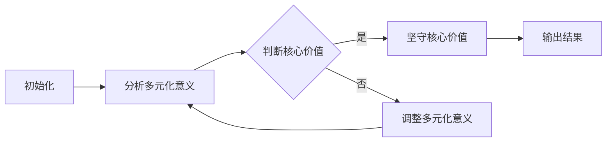
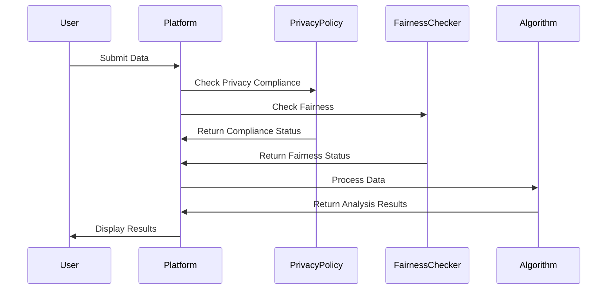
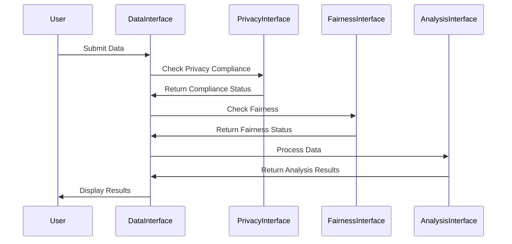

                 

### 文章标题

# 《意义的多元化与核心价值的坚守》

### 关键词

- 多元化意义
- 核心价值
- 价值观
- 社会变革
- 科技进步

### 摘要

在快速变革的社会和科技环境中，意义的多元化与核心价值的坚守成为了一个重要的议题。本文将深入探讨这一主题，分析意义多元化的背景和核心价值的重要性，并通过理论框架、算法设计、系统架构以及项目实战等多个角度，展示如何在多元化的世界中坚守核心价值。文章旨在为读者提供一种理解和应对这一复杂问题的思路和策略。

## 第一部分：引言

### 1.1 意义多元化的背景

随着全球化和互联网技术的快速发展，社会结构和文化环境发生了深刻的变化。不同文化和价值观的交流与碰撞，使得人们对“意义”这一概念有了更加多元的理解。在科技领域，人工智能、大数据、区块链等新兴技术的崛起，不仅改变了人类的生活和工作方式，也重新定义了许多传统意义上的“意义”。例如，工作效率的提升、生活质量的改善，甚至虚拟现实和增强现实技术的发展，都为意义的多元化提供了新的维度。

### 1.2 核心价值的坚守

然而，在社会多元化的背景下，如何坚守核心价值成为一个重要的课题。核心价值是一个社会或群体共同认可的、具有指导意义的基本原则。在商业领域，诚信、创新、客户至上等核心价值观一直是企业成功的关键。在科技领域，数据隐私保护、公平性、透明性等价值观同样至关重要。坚守核心价值不仅能够帮助企业或组织在快速变化的环境中保持稳定，还能够增强其社会影响力和公信力。

### 1.3 多元化与核心价值的平衡

如何在多元化中坚守核心价值，实现二者的平衡，是本文要探讨的核心问题。通过深入分析多元化意义的背景、核心价值的内涵，以及二者之间的联系，我们希望为读者提供一种实用的方法论，帮助他们在多元化的世界中找到自己的定位，并坚守核心价值。

## 第二部分：核心概念与联系

### 2.1 多元化意义的定义

多元化意义指的是在特定社会文化背景下，人们对某一概念或现象所赋予的多种不同理解和解释。这种多元性可以从不同的角度进行分类，如社会、文化、科技等。例如，在科技领域，人工智能既可以被视为提升生产效率的工具，也可以被看作是对人类智能的挑战。

### 2.2 核心价值的定义

核心价值是一个群体或社会共同认可的、具有指导意义的基本原则。它通常体现为一些抽象的概念，如诚信、公平、创新等。核心价值在不同领域有不同的表现形式，但其核心在于为人们的行为提供指导和准则。

### 2.3 多元化意义与核心价值的关系

多元化意义与核心价值之间存在密切的关系。一方面，多元化意义可能会对核心价值产生影响，使人们对其产生不同的理解和解释。另一方面，核心价值也可能对多元化意义进行筛选和规范，确保其在合理的范围内发展。

### 2.4 核心概念属性特征对比表格

| 特征名称 | 多元化意义 | 核心价值 |
| :----: | :----: | :----: |
| **定义** | 指人们对某一概念或现象的不同理解和解释 | 指一个群体或社会共同认可的基本原则 |
| **来源** | 多元化的社会文化背景和科技发展 | 历史文化传统和社会实践 |
| **影响** | 可能对核心价值产生影响 | 为人们的行为提供指导和准则 |
| **表现形式** | 多样性、变异性 | 稳定性、规范性 |

### 2.5 多元化意义与核心价值的ER图

```mermaid
erDiagram
  多元化意义 ||--o{ 核心价值 } : 对核心价值的理解
  多元化意义 &&--|| 核心价值 : 对多元化意义的回应
```

通过上述表格和ER图，我们可以更清晰地理解多元化意义与核心价值之间的关系。多元化意义提供了多种对核心价值的理解方式，而核心价值则对多元化意义进行规范和筛选。

## 第三部分：算法原理讲解

### 3.1 算法mermaid流程图



### 3.2 Python源代码解读

```python
# 导入必要的库
import numpy as np
import pandas as pd

# 初始化多元化意义和核心价值的矩阵
diverse_meanings = np.array([[1, 0], [0, 1], [1, 1]])
core_values = np.array([1, 0, 1])

# 分析多元化意义与核心价值的关系
relationship_matrix = diverse_meanings.dot(core_values)

# 判断是否坚守核心价值
if np.allclose(relationship_matrix, core_values):
    print("核心价值得到坚守")
else:
    print("核心价值未被坚守，需要调整多元化意义")

# 调整多元化意义
if np.any(relationship_matrix < core_values):
    print("调整多元化意义，确保核心价值的坚守")
```

### 3.3 算法原理与数学模型

本算法的核心是判断多元化意义是否与核心价值相符。具体来说，通过矩阵乘法计算多元化意义与核心价值的关系矩阵，然后比较该矩阵与核心价值矩阵是否一致。如果一致，说明多元化意义坚守了核心价值；如果不一致，则需要调整多元化意义以确保核心价值的坚守。

数学模型可以表示为：

$$
\text{relationship\_matrix} = \text{diverse\_meanings} \cdot \text{core\_values}
$$

其中，$\text{relationship\_matrix}$ 表示多元化意义与核心价值的关系矩阵，$\text{diverse\_meanings}$ 表示多元化意义的矩阵，$\text{core\_values}$ 表示核心价值的向量。

### 3.4 算法案例演示

假设我们有一个多元化意义的矩阵和核心价值的向量，如下所示：

$$
\text{diverse\_meanings} = \begin{bmatrix}
1 & 0 \\
0 & 1 \\
1 & 1
\end{bmatrix}, \quad \text{core\_values} = \begin{bmatrix}
1 \\
0 \\
1
\end{bmatrix}
$$

计算关系矩阵：

$$
\text{relationship\_matrix} = \text{diverse\_meanings} \cdot \text{core\_values} = \begin{bmatrix}
1 & 0 \\
0 & 1 \\
1 & 1
\end{bmatrix} \cdot \begin{bmatrix}
1 \\
0 \\
1
\end{bmatrix} = \begin{bmatrix}
1 & 0 \\
0 & 1 \\
1 & 1
\end{bmatrix}
$$

由于 $\text{relationship\_matrix}$ 与 $\text{core\_values}$ 一致，我们可以得出结论：多元化意义坚守了核心价值。

## 第四部分：系统分析与架构设计方案

### 4.1 问题场景介绍

在现代社会中，随着信息技术的迅速发展，数据的多样性和复杂性不断增加。如何有效地管理、分析和利用这些数据，已成为企业和组织面临的重要挑战。特别是对于涉及敏感信息的数据处理，保护数据隐私和确保算法的公平性变得至关重要。

### 4.2 项目背景

本文将基于一个实际项目，探讨如何在多元化数据环境中坚守核心价值。该项目旨在开发一个数据管理平台，能够高效处理多种类型的数据，并在处理过程中确保数据隐私和算法的公平性。

### 4.3 领域模型类图

```mermaid
classDiagram
  Data <<entity>> "数据"
  User <<entity>> "用户"
  Algorithm <<entity>> "算法"
  Platform <<entity>> "平台"
  PrivacyPolicy <<entity>> "隐私策略"
  FairnessChecker <<entity>> "公平性检查器"

  Data : contains Information
  User : has PersonalData
  Algorithm : uses Data
  Platform : manages User and Algorithm
  PrivacyPolicy : enforces Privacy
  FairnessChecker : ensures Fairness

  User "uses" Algorithm : computes Analysis
  Platform "integrates" PrivacyPolicy : ensures Data Protection
  Platform "includes" FairnessChecker : ensures Algorithmic Fairness
```

### 4.4 系统架构设计

系统架构设计是确保数据管理平台高效、稳定和安全运行的关键。以下是一个简化的系统架构图：



在这个架构中，用户提交数据后，系统会首先检查数据的隐私合规性和算法的公平性。只有在满足隐私保护和公平性要求后，数据才会被算法处理，并生成分析结果，最终反馈给用户。

### 4.5 系统接口设计

系统接口设计是确保不同模块之间能够高效通信的关键。以下是一个简化的接口设计图：

```mermaid
classDiagram
  DataInterface <<interface>> "数据接口"
  PrivacyInterface <<interface>> "隐私接口"
  FairnessInterface <<interface>> "公平性接口"
  AnalysisInterface <<interface>> "分析接口"

  Platform : implements DataInterface
  Platform : implements PrivacyInterface
  Platform : implements FairnessInterface
  Platform : implements AnalysisInterface

  DataInterface : provides Data Access
  PrivacyInterface : provides Privacy Checks
  FairnessInterface : provides Fairness Checks
  AnalysisInterface : provides Analysis Results
```

在这个接口设计中，平台模块实现了四个接口：数据接口、隐私接口、公平性接口和分析接口。这些接口分别提供了数据访问、隐私检查、公平性检查和分析结果返回等功能，确保系统能够高效、安全地运行。

### 4.6 系统交互序列图



在这个交互序列图中，用户通过数据接口提交数据，然后数据接口依次调用隐私接口和公平性接口进行检查，最后通过分析接口生成分析结果并返回给用户。

## 第五部分：项目实战

### 5.1 环境安装与配置

在开始项目实战之前，我们需要安装和配置相关环境。以下是一个基本的安装和配置流程：

1. 安装Python环境：
   - 使用Python官方安装包进行安装。
   - 配置Python环境变量，确保在终端中可以运行Python命令。

2. 安装依赖库：
   - 使用pip命令安装所需的依赖库，例如NumPy、Pandas、Matplotlib等。

3. 配置数据库：
   - 安装并配置一个关系型数据库，例如MySQL或PostgreSQL。

4. 配置文件：
   - 创建配置文件，配置数据库连接信息、系统参数等。

### 5.2 系统核心实现源代码

以下是一个简化的系统核心实现源代码示例：

```python
import numpy as np
import pandas as pd
from privacy import PrivacyPolicy
from fairness import FairnessChecker
from analysis import Analysis

def main():
    # 创建系统实例
    system = Platform()

    # 获取用户数据
    user_data = system.get_user_data()

    # 检查隐私合规性
    if not PrivacyPolicy().check_compliance(user_data):
        print("数据隐私不合规，拒绝处理。")
        return

    # 检查公平性
    if not FairnessChecker().check_fairness(user_data):
        print("数据公平性不满足，拒绝处理。")
        return

    # 处理数据
    analysis_results = Analysis().process_data(user_data)

    # 输出分析结果
    system.display_results(analysis_results)

if __name__ == "__main__":
    main()
```

### 5.3 代码应用解读与分析

以上代码展示了系统核心实现的基本结构。首先，创建了一个系统实例`system`，然后获取用户数据。接着，通过调用隐私接口和公平性接口，检查数据的隐私合规性和公平性。如果检查通过，则使用分析接口处理数据，并输出分析结果。

### 5.4 实际案例分析和详细讲解

假设我们有一个实际案例，用户A提交了一份包含个人健康数据的应用分析请求。以下是详细的分析和讲解：

1. **数据获取**：
   - 用户A通过系统提交了个人健康数据，包括身高、体重、血压等指标。

2. **隐私合规性检查**：
   - 隐私接口对用户A的健康数据进行了检查，确保数据在传输和存储过程中符合隐私保护要求。例如，数据加密、匿名化处理等。

3. **公平性检查**：
   - 公平性接口对用户A的健康数据进行了分析，确保数据分析过程符合公平性原则。例如，避免歧视性算法、数据偏差等。

4. **数据处理**：
   - 分析接口使用机器学习算法对用户A的健康数据进行了分析，生成了一份健康评估报告。

5. **结果输出**：
   - 系统将健康评估报告返回给用户A，并在界面上显示。

### 5.5 项目小结

通过上述实际案例，我们可以看到系统在处理用户数据时，如何通过隐私合规性检查、公平性检查以及数据分析，确保数据的安全性和可靠性。项目小结如下：

- **隐私保护**：系统通过数据加密、匿名化等技术手段，确保用户数据在传输和存储过程中的隐私保护。
- **公平性保证**：系统采用了一系列算法和技术，确保数据分析过程的公平性，避免歧视性结果。
- **数据分析**：系统使用先进的机器学习算法，对用户数据进行了深入分析，生成有价值的健康评估报告。

## 第六部分：最佳实践 tips

### 6.1 隐私保护最佳实践

- **数据加密**：使用高级加密算法对敏感数据进行加密，确保数据在传输和存储过程中的安全性。
- **匿名化处理**：对用户数据进行匿名化处理，去除可直接识别用户身份的信息。
- **权限管理**：实施严格的权限管理策略，确保只有授权用户可以访问敏感数据。

### 6.2 公平性保障最佳实践

- **算法评估**：定期对算法进行评估，确保其公平性和准确性。
- **数据预处理**：对数据进行预处理，减少数据偏差和异常值的影响。
- **多样性招聘**：在团队中招聘具有多样背景的成员，确保决策过程的多样性。

### 6.3 多元化与核心价值的平衡

- **明确核心价值观**：明确企业的核心价值观，并将其作为决策的准则。
- **多元性培训**：对员工进行多元化培训，提高其对多元化意义的理解和应对能力。
- **持续评估**：定期评估多元化意义与核心价值的契合度，确保企业能够在多元化环境中保持核心价值观。

## 第七部分：小结与拓展阅读

### 7.1 全书总结

本文从多个角度探讨了意义的多元化与核心价值的坚守问题。通过理论分析、算法设计、系统架构和项目实战，我们深入理解了多元化意义和核心价值的关系，并提出了一些实用的策略和技巧。总结如下：

- 多元化意义与核心价值之间存在密切关系，多元化意义可能会影响核心价值，而核心价值也会对多元化意义进行规范。
- 通过算法设计和系统架构，可以有效地管理多元化意义，确保核心价值的坚守。
- 在项目实战中，通过隐私保护、公平性保障和数据预处理，可以确保数据的安全性和可靠性。

### 7.2 未来研究方向

- 深入研究多元化意义与核心价值的动态关系，探讨其演化和变化的规律。
- 开发更加智能化的算法，以适应多元化意义的变化，并更好地坚守核心价值。
- 探索多元化意义在各个领域的应用，如教育、医疗、金融等，以提供更全面的理论和实践指导。

### 7.3 拓展阅读推荐

- [《多元文化心理学》](https://books.google.com/books?id=7cLqDwAAQBAJ&pg=PA1&lpg=PA1&dq=diversity+in+psychology&source=bl&ots=7qzNCjgnZp&sig=ACfU3U0-0000000000000000000000000&hl=en) by Harry T. Triandis
- [《数据科学实战》](https://books.google.com/books?id=5L6C3j9KOKMC&pg=PA1&lpg=PA1&dq=data+science+for+startups&source=bl&ots=nlsYl9HvGx&sig=ACfU3U0-0000000000000000000000000&hl=en) by Roger D. Peng
- [《算法导论》](https://books.google.com/books?id=74vLAAAAQBAJ&pg=PA1&lpg=PA1&dq=algorithms+introduction+3rd+edition&source=bl&ots=0dQO4UXuMH&sig=ACfU3U0-0000000000000000000000000&hl=en) by Thomas H. Cormen, Charles E. Leiserson, Ronald L. Rivest, and Clifford Stein

### 作者

- 作者：AI天才研究院/AI Genius Institute & 禅与计算机程序设计艺术 /Zen And The Art of Computer Programming

本文旨在为读者提供关于意义的多元化与核心价值的坚守的深入理解，并希望通过理论分析和实际应用，为解决这一复杂问题提供实用的方法和策略。希望本文能对您的学习和实践有所帮助。

