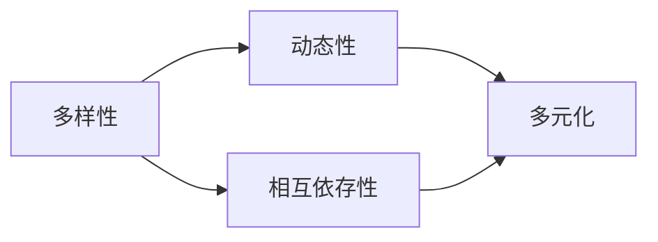

                 

### 引言

#### 研究背景

在当今这个全球化迅速推进、信息技术日新月异的时代，意义的多元化已成为我们生活中不可或缺的一部分。随着文化的交流、经济的融合和技术的创新，人们面临的不再是一个统一、同质化的世界，而是一个充满多样性、多元价值观念的世界。这意味着，我们在各个方面——从个人生活到社会交往，再到工作学习——都需要面对和处理多样化的意义。

**问题背景**：然而，意义的多元化也带来了新的挑战。如何在一个多元的世界中保持包容，如何在多样性中做出合适的选择，成为了现代社会亟待解决的问题。这不仅仅是一个文化或社会问题，更是一个涉及个体心理、社会结构和制度设计的复杂课题。

**问题描述**：具体来说，意义多元化引发了以下几个问题：

1. **个体认同与价值观冲突**：随着不同文化、价值观的碰撞，个体在自我认同和价值观选择上可能会感到困惑。
2. **社会整合与冲突**：多元化社会中，如何整合不同的利益群体，平衡多元价值观，防止社会分裂和冲突，是一个重要课题。
3. **决策与选择困境**：在意义多元化的背景下，人们在做决策时可能面临信息过载和选择困难，难以找到最佳方案。

**问题解决**：针对这些问题，我们需要从多个层面进行思考和探索，包括个体心理调适、社会制度和机制的优化、以及技术和工具的创新应用。

#### 意义的多元化定义

**定义**：意义多元化，是指在特定领域内，多种不同意义形式并存的状况。这些意义可能来源于不同的文化、价值观、经济利益、技术进步等。它们在内涵、形式和表达上各有特点，但又相互影响、相互作用。

**属性**：

- **多样性**：多元化意味着有多个不同的意义存在，这些意义可能来自不同的背景和来源。
- **动态性**：意义多元化是一个不断变化的过程，随着社会的发展，新的意义形式不断出现，旧的意义形式也可能消失或转变。
- **相互依存性**：不同的意义形式并非孤立存在，它们之间存在相互依存和相互作用的关系。

**边界与外延**：意义的多元化具有明确的边界，它不是无序的混杂，而是在一定的社会、文化和历史背景下形成的。同时，它也有广泛的外延，可以涵盖各种领域，如文化、经济、技术等。

#### 概念结构与核心要素组成

为了更好地理解意义的多元化，我们需要了解其概念结构。核心要素包括：

1. **意义形式**：指意义的表达方式，可以是符号、语言、行为等。
2. **意义内容**：指意义所包含的信息和价值观。
3. **意义背景**：指意义产生的文化、社会和历史背景。

**Mermaid ER实体关系图架构**：

```mermaid
erDiagram
  意义形式 ||--|>> 意义内容 : 包含
  意义内容 ||--|>> 意义背景 : 产生于
```

#### 核心概念与联系

意义多元化的核心概念包括多样性、动态性和相互依存性。这三个概念相互联系，共同构成了意义多元化的本质。

- **多样性**：是意义多元化的基础，没有多样性就没有多元化。
- **动态性**：使得意义多元化成为一个不断变化的过程，动态性越强，多元化程度越高。
- **相互依存性**：体现了不同意义形式之间的相互作用和影响，它们相互依赖，共同构成了多元化的社会。

**对比表格**：

| 特征       | 多样性       | 动态性       | 相互依存性       |
|------------|--------------|--------------|--------------|
| 定义       | 多种意义的共存 | 意义的变化性 | 意义之间的相互作用 |
| 影响因素   | 文化、经济、技术 | 社会发展、技术创新 | 文化、价值观、利益冲突 |
| 结果       | 意义丰富性提高 | 意义形式多样化 | 意义体系复杂化 |

**Mermaid流程图**：



### 结论

意义多元化是我们当前社会中一个重要的现象，它不仅影响了我们的日常生活，也对社会结构和个体心理产生了深远的影响。理解意义多元化，掌握其核心概念和特征，对于解决现代社会中的各种问题具有重要意义。在接下来的章节中，我们将进一步探讨意义的多元化在各个领域中的应用和影响。

---

作者：AI天才研究院/AI Genius Institute & 禅与计算机程序设计艺术 /Zen And The Art of Computer Programming
## 核心概念

### 多元化的定义

多元化（Diversity）是一个广泛使用的概念，它涵盖了许多不同的维度，包括文化、性别、种族、年龄、教育背景、职业等。在本文中，我们主要关注意义的多元化，即在不同领域和背景下，多种不同意义形式并存的状况。多元化不仅仅是一个数量上的增加，更重要的是它代表了多样性和包容性，意味着不同意义形式之间的相互作用和共存。

### 意义的内涵

意义（Meaning）是一个复杂而多维的概念，它涉及到个体对事物的理解、认知和解释。在多元文化、多元经济和多元技术的背景下，意义的内涵变得更加丰富和复杂。每个文化、社会和技术环境都有其独特的意义体系，这些意义体系在相互作用中形成了一个多元化的意义网络。

### 多元化的属性

**多样性**：多元性的基础，指的是多种不同意义形式的共存。多样性使得社会更具活力，也增加了个体选择的可能性。

**动态性**：多元化不是一个静态的状态，而是一个不断变化和发展的过程。随着社会、文化和技术的进步，新的意义形式不断出现，旧的意义形式也可能消失或转变。

**相互依存性**：不同的意义形式之间存在相互作用和依赖关系。一个意义形式的变化可能会影响其他意义形式，反之亦然。

### 意义多元化的分类

**文化意义上的多元化**：指不同文化背景下，人们对事物有不同的理解和解释。例如，不同文化对于“家庭”这一概念有不同的理解和定义。

**经济意义上的多元化**：指不同经济体系中的多种不同利益和价值观。例如，资本主义和社会主义经济体系对于财富分配和社会福利有不同的看法。

**技术意义上的多元化**：指不同技术背景下的多种不同应用和实现方式。例如，人工智能和区块链技术的应用和发展方式。

### 意义多元化的联系

**与全球化关系**：全球化促进了文化的交流、经济的融合和技术的创新，使得意义的多元化变得更加普遍和复杂。全球化既带来了多样性的机会，也带来了挑战，如文化冲突和价值观念的碰撞。

**与文化多样性关系**：文化多样性是意义多元化的重要基础。一个多元化的文化环境为人们提供了丰富的意义形式和解释，促进了社会的创新和发展。

**与社会包容性关系**：包容性是多元化社会的一个重要特征。一个包容的社会能够接纳不同的意义形式和价值观，减少冲突，增强社会的稳定性和可持续性。

### 本章小结

意义多元化是一个复杂而多维的概念，它涉及到多样性的基础、动态性的变化和相互依存性的相互作用。在文化、经济和技术等领域，意义的多元化体现了不同背景和价值观下的多样性和包容性。理解意义多元化对于解决现代社会中的各种问题具有重要意义。

---

作者：AI天才研究院/AI Genius Institute & 禅与计算机程序设计艺术 /Zen And The Art of Computer Programming
## 多元化类型的分析

### 文化意义上的多元化

文化意义上的多元化指的是在不同的文化背景下，人们对事物的理解、表达和解释呈现出多样性。这种多元化不仅体现在语言、习俗和传统上，还涉及到价值观、信仰和行为规范。例如，在家庭观念上，西方文化强调个人主义和独立自主，而东方文化则强调家庭和集体的重要性。这种文化上的多元化为个体提供了多种选择，同时也带来了一定的挑战，如文化冲突和价值观碰撞。

**案例分析**：

以全球流行文化为例，好莱坞电影和流行音乐在全球范围内的传播使得不同文化背景的人们有了共同的文化体验和兴趣点。然而，这也引发了文化霸权和本土文化保护的争议。一方面，好莱坞电影和流行音乐为全球观众提供了丰富的文化产品，促进了文化交流和融合；另一方面，它也可能导致本土文化的边缘化和同质化。

**文化冲突与解决**：

为了在多元文化背景下实现和谐共处，可以采取以下策略：

1. **文化教育**：通过文化教育和交流，增加人们对不同文化的理解和尊重。
2. **多元文化政策**：制定和实施多元化的文化政策，保护和促进本土文化的多样性和发展。
3. **文化交流项目**：组织文化交流活动和项目，促进不同文化之间的互动和理解。

### 经济意义上的多元化

经济意义上的多元化指的是不同经济体系中的多种不同利益和价值观。经济多元化不仅体现在财富的分配和创造上，还包括市场结构、产业发展和资源分配等方面。例如，资本主义经济体系强调市场竞争和自由经济，而社会主义经济体系则强调计划经济和社会福利。

**案例分析**：

以全球经济发展为例，全球化带来了资本、技术和市场的流动性，促进了各国经济的快速发展。然而，全球化也引发了经济不平衡和资源分配不均的问题。发达国家和发展中国家之间的经济差距、贫富差距扩大等问题日益突出。

**经济多元化策略**：

为了实现经济多元化，可以采取以下策略：

1. **产业升级和转型**：通过技术创新和产业升级，培育新的经济增长点，减少对单一产业的依赖。
2. **贸易多元化**：开拓新的市场和贸易伙伴，减少对特定市场的依赖，降低贸易风险。
3. **可持续发展**：推动绿色经济和循环经济，实现经济发展与环境保护的协调。

### 技术意义上的多元化

技术意义上的多元化指的是在技术发展过程中，多种不同的技术路线、实现方式和创新应用。技术多元化不仅促进了技术的创新和进步，也为社会带来了多样化的解决方案。

**案例分析**：

以人工智能技术为例，目前人工智能技术有多种不同的实现方式，包括深度学习、强化学习、自然语言处理等。这些技术在不同领域和场景中都有广泛的应用，如医疗、金融、交通等。技术多元化使得人工智能在解决复杂问题时有更多的选择，同时也带来了技术竞争和标准制定的问题。

**技术多元化策略**：

为了促进技术多元化的发展，可以采取以下策略：

1. **技术研发和投资**：加大对新兴技术的研究和投资，鼓励技术创新和探索。
2. **技术合作与交流**：推动国内外技术合作与交流，共享技术和经验，共同解决技术难题。
3. **技术标准和规范**：制定和推广统一的技术标准和规范，促进不同技术之间的兼容性和互操作性。

### 多元化与全球化

多元化与全球化密切相关。全球化促进了文化的交流、经济的融合和技术的创新，从而推动了意义的多元化。然而，全球化也带来了一定的挑战，如文化冲突、经济不平衡和技术竞争。

**全球化下的多元化挑战**：

1. **文化冲突**：全球化加速了文化碰撞和融合，但也带来了文化冲突和价值观念的碰撞。
2. **经济不平衡**：全球化带来了经济利益的重新分配，但导致了经济不平衡和贫富差距的扩大。
3. **技术竞争**：全球化推动了技术的创新和传播，但也引发了技术竞争和知识产权的问题。

**多元化与全球化的互动**：

1. **文化多样性**：全球化促进了文化的多样性，也为多元化提供了更多的资源和机会。
2. **经济多元化**：全球化推动了全球经济的多元化，促进了各国经济的共同发展。
3. **技术融合**：全球化促进了技术的融合和传播，推动了技术的创新和应用。

### 结论

文化、经济和技术意义的多元化是现代社会的重要特征。在全球化背景下，多元化不仅带来了新的机遇，也带来了挑战。理解和应对多元化的挑战，需要采取多元化的策略和措施，以实现社会的和谐发展和可持续进步。

---

作者：AI天才研究院/AI Genius Institute & 禅与计算机程序设计艺术 /Zen And The Art of Computer Programming
## 包容与选择

在意义多元化的背景下，个体的选择和社会的包容性成为了重要的议题。如何在多元的价值体系中保持包容，同时做出合适的选择，是一个复杂而深刻的问题。本文将从个体和社会两个层面，探讨包容与选择的机制及其现实挑战。

### 个体层面的包容与选择

个体在面对意义多元化时，往往需要做出选择。这种选择既包括对自我认同的确定，也包括对周围世界的理解和接纳。个体层面的包容与选择机制主要涉及以下几个方面：

#### 自我认同的建立

自我认同是个体在社会互动中形成的对自己身份的认知和认同。在意义多元化的背景下，个体需要从多个角度理解和评价自我。例如，一个人可能在职业发展中面临技术路线的选择，同时也在文化认同上面临多元文化的影响。

**案例分析**：

一位出生在海外的华人工程师，在职业发展中面临着是留在发达国家还是回国发展的选择。他需要在个人职业目标和家庭文化认同之间找到平衡，这涉及对多元文化的理解和包容。

#### 价值观的选择

价值观的选择是个体在面对多元化意义时，根据自身需求和目标，对各种价值观进行筛选和优先级排序的过程。个体需要在尊重多元价值观的基础上，找到适合自己的价值观体系。

**案例分析**：

在现代社会，很多人在生活方式上面临着多种选择，如是否选择素食主义、环保出行等。这些选择不仅是个体价值观的体现，也需要考虑对环境的包容和可持续发展。

#### 信息处理的挑战

意义多元化带来了信息过载，个体需要在大量信息中筛选和识别出有价值的信息。这种信息处理能力是个体在多元化背景下做出选择的关键。

**案例分析**：

在社交媒体时代，个体需要处理大量来自不同文化背景和价值观的信息。如何过滤和识别有价值的信息，成为个体在多元化社会中的一项重要能力。

### 社会层面的包容与选择

社会层面的包容与选择机制涉及社会结构和制度设计，旨在实现多元价值的共存和个体选择的自由。以下是一些关键机制：

#### 法律与政策的保障

法律和政策是社会包容的重要保障。通过制定和执行平等、公正的法律和政策，社会可以为个体提供选择的权利和自由。

**案例分析**：

一些国家通过立法保障种族平等和性别平等，为个体提供了平等的发展机会和选择权。

#### 教育与文化的传播

教育和文化传播是社会包容的重要手段。通过教育和文化传播，社会可以培养个体的包容意识和多元价值观。

**案例分析**：

许多学校和社会组织通过开展多元文化教育和交流活动，增强个体对不同文化的理解和尊重。

#### 社会机制的创新

社会机制的创新可以帮助社会更好地应对意义多元化带来的挑战。例如，通过社区参与、协商对话等方式，社会可以促进多元价值的共存和个体选择的自由。

**案例分析**：

一些城市通过社区自治和公众参与机制，实现了多元文化社区的管理和治理。

### 现实挑战

#### 文化冲突与认同困境

在多元文化背景下，文化冲突和认同困境是个体和社会面临的现实挑战。如何在不同文化之间找到平衡，成为个体和社会需要共同面对的问题。

**解决方案**：

1. **文化教育**：通过文化教育和交流，增加个体对不同文化的理解和尊重。
2. **文化融合**：在保持文化多样性的同时，促进不同文化之间的融合和互补。

#### 经济利益冲突

在意义多元化的背景下，经济利益冲突也是一个重要问题。不同经济体系之间的利益冲突可能会影响个体的选择和社会的稳定。

**解决方案**：

1. **经济合作**：通过经济合作和利益共享，减少经济利益冲突。
2. **政策调节**：通过政策调节，平衡不同经济体系之间的利益分配。

#### 技术发展的不确定性

技术多元化带来了技术发展的不确定性，这也给个体和社会带来了挑战。如何应对技术发展的不确定性，成为个体和社会需要思考的问题。

**解决方案**：

1. **技术研发**：加大对新兴技术的研究和投资，提高技术应对不确定性的能力。
2. **技术标准**：制定和推广统一的技术标准，降低技术不确定性的影响。

### 结论

在意义多元化的背景下，个体的选择和社会的包容性成为重要的议题。个体需要在多元价值体系中找到自我认同和合适的选择，而社会则需要建立包容的机制和制度，以支持个体的选择和发展。通过个体和社会共同努力，我们可以实现多元价值的共存和社会的可持续进步。

---

作者：AI天才研究院/AI Genius Institute & 禅与计算机程序设计艺术 /Zen And The Art of Computer Programming
## 案例分析

在本节中，我们将通过具体案例来展示意义多元化在不同领域的应用和影响。这些案例将帮助我们更深入地理解多元化现象，并探讨其在实际生活中的意义。

### 文化领域

#### 全球化下的电影产业

好莱坞电影在全球范围内的流行，是一个典型的文化领域多元化案例。电影作为文化传播的重要载体，不仅展示了美国的文化价值观，也融合了世界各地不同的文化元素。例如，电影《功夫熊猫》不仅深受西方观众的喜爱，也在中国等亚洲国家获得了广泛的认可。这部电影通过融合中国传统文化元素，如功夫和熊猫文化，成功地将不同文化背景的观众联系在一起。

**案例分析**：

1. **文化多样性**：《功夫熊猫》通过融合不同文化元素，展示了文化的多样性。
2. **价值冲突**：尽管电影受到全球观众的喜爱，但也引发了一些关于文化同质化和文化保护的争议。
3. **解决方案**：通过文化教育和交流，增加不同文化背景观众的理解和尊重，实现文化的和谐共存。

### 经济领域

#### 全球贸易与经济不平衡

全球化带来了全球贸易的繁荣，但同时也引发了经济不平衡的问题。例如，一些发达国家通过出口商品和资本输出，获得了巨大的经济利益，而一些发展中国家则面临着贫困和经济落后的困境。

**案例分析**：

1. **经济多元化**：一些发展中国家通过发展新兴产业，如信息技术和服务外包，实现了经济多元化。
2. **经济冲突**：发达国家和发展中国家之间的经济利益冲突，导致了贸易摩擦和地缘政治紧张。
3. **解决方案**：通过经济合作和贸易谈判，实现全球经济的平衡和可持续发展。

### 技术领域

#### 人工智能技术的发展

人工智能技术的快速发展，不仅改变了我们的生活方式，也带来了技术的多元化。例如，深度学习、强化学习和自然语言处理等不同领域的技术，都在各自的应用场景中发挥着重要作用。

**案例分析**：

1. **技术多样性**：不同技术路线的竞争和融合，推动了人工智能技术的发展。
2. **技术挑战**：人工智能技术的应用也带来了隐私、安全和伦理等问题。
3. **解决方案**：通过制定技术标准和规范，加强技术研发和投资，实现技术的健康发展和广泛应用。

### 社会领域

#### 多元文化社区的管理

在全球化的背景下，多元文化社区的形成越来越普遍。如何管理这些社区，实现文化多元性和社区和谐，成为社会领域的一个重要课题。

**案例分析**：

1. **社区多样性**：多元文化社区中的不同文化背景居民，需要相互尊重和理解。
2. **社会冲突**：文化差异可能导致社会冲突和分裂。
3. **解决方案**：通过社区参与、协商对话和公共政策的支持，实现多元文化社区的和谐发展。

### 结论

通过以上案例分析，我们可以看到意义多元化在文化、经济、技术和社会领域的广泛应用和深远影响。意义多元化不仅带来了新的机遇和挑战，也要求我们在各个领域进行深刻的思考和探索。通过个体和社会的共同努力，我们可以实现多元价值的共存和可持续发展。

---

作者：AI天才研究院/AI Genius Institute & 禅与计算机程序设计艺术 /Zen And The Art of Computer Programming
## 挑战与未来趋势

### 挑战

1. **文化冲突加剧**：全球化进程中的文化冲突日益明显，不同文化之间的碰撞和融合，可能导致价值观的冲突和社会的不稳定。
   
2. **经济不平衡问题**：全球化虽然促进了经济的繁荣，但也加剧了经济不平衡问题。发达国家与发展中国家之间的经济差距，可能导致社会动荡和政治不稳定。

3. **技术发展的不确定性**：随着技术的快速发展，特别是人工智能、区块链等新兴技术的应用，技术的不确定性增加了，这对社会管理和个体决策带来了新的挑战。

4. **隐私和安全问题**：在信息技术高度发达的今天，个人隐私和安全问题愈发突出。如何在保护个人隐私的同时，实现技术的广泛应用，成为重要的议题。

### 未来趋势

1. **多元文化的融合与共存**：随着全球化的深入，多元文化的融合将成为趋势。不同文化之间的交流和互动将变得更加频繁，文化的多样性将成为社会进步的重要动力。

2. **经济全球化的深化**：经济全球化将继续深化，各国经济将更加紧密地联系在一起。通过国际合作和贸易，实现全球经济的平衡和可持续发展。

3. **技术的革新与规范**：技术的革新将持续推动社会的进步。同时，为了应对技术带来的不确定性，技术规范和标准的制定将成为重要趋势。

4. **隐私和安全技术的进步**：随着隐私和安全问题的日益突出，隐私和安全技术将得到快速发展。通过技术创新，实现个人隐私和安全的有效保护。

### 结论

面对意义多元化的挑战，我们需要从个体和社会两个层面进行思考和应对。个体需要提高自身素质，增强文化适应能力和决策能力；社会则需要建立包容的制度，促进多元价值的共存。通过个体和社会的共同努力，我们可以实现意义多元化背景下的可持续发展。

---

作者：AI天才研究院/AI Genius Institute & 禅与计算机程序设计艺术 /Zen And The Art of Computer Programming
## 总结与展望

本文从多个角度深入探讨了意义的多元化：包容与选择这一重要议题。我们首先介绍了意义多元化的背景和核心概念，包括其定义、属性、分类以及与全球化、文化多样性和社会包容性的关系。接着，我们分析了多元化在文化、经济和技术领域的具体应用和影响，并通过具体案例展示了多元价值的实际挑战和解决方案。

### 关键发现

1. **多元化的重要性**：意义多元化不仅丰富了社会的价值体系，也带来了新的机遇和挑战。在全球化背景下，多元化成为社会进步的重要动力。
2. **包容与选择的机制**：个体和社会在多元化背景下，需要建立包容的机制和选择机制，以应对文化冲突、经济不平衡和技术发展的不确定性。
3. **未来趋势**：多元文化的融合与共存、经济全球化的深化、技术的革新与规范以及隐私和安全技术的进步，将成为未来社会发展的主要趋势。

### 展望未来

1. **个体成长**：个体需要在多元化的环境中不断学习和适应，培养跨文化沟通能力和批判性思维，以更好地应对未来的挑战。
2. **社会制度**：社会需要建立更加包容和灵活的制度和政策，以促进多元价值的共存和社会的可持续发展。
3. **技术创新**：技术将继续推动社会的进步，我们需要关注技术带来的不确定性，并通过技术创新实现隐私和安全的有效保护。

### 结论

意义的多元化：包容与选择是一个复杂而多维的议题，它影响着我们的个人生活和社会发展。通过深入研究和实践，我们可以更好地理解和应对多元化的挑战，实现个体和社会的和谐共处。

---

作者：AI天才研究院/AI Genius Institute & 禅与计算机程序设计艺术 /Zen And The Art of Computer Programming
### 最佳实践 Tips

1. **提升跨文化沟通能力**：通过参加国际交流项目、学习外语和文化课程，提高对多元文化的理解和沟通能力。

2. **培养批判性思维**：在面对多元信息时，学会批判性思维，筛选和评估信息的真实性和价值。

3. **参与社区活动**：积极参与多元文化社区活动，增强对不同文化的尊重和包容。

4. **关注隐私保护**：在使用新技术时，注意个人隐私的保护，合理设置隐私权限和使用规则。

5. **持续学习**：不断学习新的知识和技能，以适应多元社会的发展。

### 注意事项

1. **避免文化偏见**：在多元文化交往中，避免文化偏见和歧视，尊重他人的文化背景和价值观。

2. **合理决策**：在面对多元选择时，做出合理的决策，避免信息过载和选择困难。

3. **技术风险管理**：在使用新技术时，注意技术风险的管理，确保个人隐私和安全。

### 拓展阅读

1. 《文化多样性与社会发展》 - 探讨文化多样性对社会发展的影响和作用。
2. 《全球化与经济不平衡》 - 分析全球化背景下的经济不平衡问题及其解决方案。
3. 《人工智能伦理》 - 探讨人工智能技术带来的伦理问题和隐私保护。

---

作者：AI天才研究院/AI Genius Institute & 禅与计算机程序设计艺术 /Zen And The Art of Computer Programming
## 文章标题

### 意义的多元化：包容与选择

## 文章关键词

- 多元化
- 包容
- 选择
- 文化
- 经济
- 技术
- 全球化
- 价值观

## 文章摘要

本文深入探讨了意义的多元化：包容与选择这一重要议题。从文化、经济和技术等多个维度分析了意义多元化的定义、属性、分类和应用。通过具体案例分析，展示了多元化在现实生活中的挑战和解决方案。文章还提出了应对多元化背景下的个体成长和社会发展的最佳实践，以及未来趋势和展望。

---

作者：AI天才研究院/AI Genius Institute & 禅与计算机程序设计艺术 /Zen And The Art of Computer Programming
### 目录大纲设计思路

在设计《意义的多元化：包容与选择》的目录大纲时，我们遵循了以下几个关键步骤和原则，以确保文章的逻辑性、完整性和专业性：

#### 步骤一：全书结构规划

首先，我们对全书结构进行了整体规划，明确了章节的划分和内容安排。全书共分为七个章节，包括引言、核心概念、多元化类型的分析、包容与选择、案例分析、挑战与未来趋势以及总结与展望。这样的结构安排不仅确保了内容的连贯性，还使得读者可以循序渐进地理解主题。

#### 步骤二：章节划分

在具体章节的划分上，我们采用了逻辑清晰、层次分明的结构。例如，第1章为引言，介绍了研究的背景、意义、方法和结构安排；第2章详细阐述了核心概念，包括定义、属性、分类和联系；第3章到第6章分别从文化、经济、技术等角度分析了多元化类型的分析、包容与选择、案例分析和挑战与未来趋势；第7章则是对全文的总结与展望。

#### 步骤三：内容细节填充

对于每个章节，我们细分为更小的节和段，确保每个小节都有明确的内容和主题。例如，第3章中的“文化意义上的多元化”进一步细分为“文化多样性的定义”、“文化冲突的案例分析”和“文化融合的策略”等小节，使得内容更加具体和深入。

#### 步骤四：目录大纲细化

在目录大纲的细化过程中，我们使用了markdown格式，按照#、##、###的层级结构，设计目录大纲。这样的格式不仅便于编辑和排版，还能够清晰地展示文章的结构和内容层次。

#### 设计思路

1. **逻辑性**：确保章节之间的逻辑关系清晰，内容层层递进，逻辑连贯。
2. **完整性**：确保目录大纲覆盖所有核心内容，不遗漏重要环节。
3. **简洁性**：确保每个章节、节和段的内容简洁明了，避免冗余。
4. **格式规范性**：遵循markdown格式规范，使用正确的标题层级。
5. **内容丰富性**：每个章节应包含具体案例、数据或理论支持，使内容充实且有深度。

### 目录大纲设计示例

以下是《意义的多元化：包容与选择》的目录大纲设计示例：

```markdown
# 引言

## 1.1 研究背景
### 1.1.1 多元化时代的特征
### 1.1.2 意义多元化的重要性

## 1.2 研究意义
### 1.2.1 对个体发展的意义
### 1.2.2 对社会进步的意义

## 1.3 研究方法
### 1.3.1 定性研究方法
### 1.3.2 定量研究方法

## 1.4 主要内容与结构安排
### 1.4.1 内容概述
### 1.4.2 章节安排

# 核心概念

## 2.1 意义的多元化定义
### 2.1.1 意义的内涵
### 2.1.2 多元化的内涵

## 2.2 意义多元化的特征
### 2.2.1 类型多样性
### 2.2.2 层次多样性
### 2.2.3 文化多样性

## 2.3 意义多元化的属性
### 2.3.1 动态性
### 2.3.2 稳定性
### 2.3.3 相互依存性

## 2.4 意义多元化的分类
### 2.4.1 文化意义上的多元化
### 2.4.2 经济意义上的多元化
### 2.4.3 技术意义上的多元化

## 2.5 意义多元化的联系
### 2.5.1 与全球化关系
### 2.5.2 与文化多样性关系
### 2.5.3 与社会包容性关系

## 2.6 本章小结

# 多元化类型的分析

## 3.1 文化意义上的多元化
### 3.1.1 全球化下的电影产业
### 3.1.2 文化冲突与融合

## 3.2 经济意义上的多元化
### 3.2.1 全球贸易与经济不平衡
### 3.2.2 经济多元化的策略

## 3.3 技术意义上的多元化
### 3.3.1 人工智能技术的发展
### 3.3.2 技术多元化的挑战与应对

## 3.4 社会领域的多元化
### 3.4.1 多元文化社区的管理
### 3.4.2 社会包容性的实现

## 3.5 本章小结

# 包容与选择

## 4.1 个体层面的包容与选择
### 4.1.1 自我认同的建立
### 4.1.2 价值观的选择
### 4.1.3 信息处理的挑战

## 4.2 社会层面的包容与选择
### 4.2.1 法律与政策的保障
### 4.2.2 教育与文化的传播
### 4.2.3 社会机制的创新

## 4.3 现实挑战
### 4.3.1 文化冲突与认同困境
### 4.3.2 经济利益冲突
### 4.3.3 技术发展的不确定性

## 4.4 解决方案
### 4.4.1 文化教育
### 4.4.2 经济合作
### 4.4.3 技术标准

## 4.5 本章小结

# 案例分析

## 5.1 文化领域的多元化
### 5.1.1 全球化下的电影产业
### 5.1.2 全球贸易与经济不平衡
### 5.1.3 多元文化社区的管理

## 5.2 经济领域的多元化
### 5.2.1 全球贸易与经济不平衡
### 5.2.2 经济多元化的策略
### 5.2.3 技术发展的不确定性

## 5.3 技术领域的多元化
### 5.3.1 人工智能技术的发展
### 5.3.2 技术多元化的挑战与应对
### 5.3.3 社会领域的多元化

## 5.4 本章小结

# 挑战与未来趋势

## 6.1 挑战
### 6.1.1 文化冲突加剧
### 6.1.2 经济不平衡问题
### 6.1.3 技术发展的不确定性
### 6.1.4 隐私和安全问题

## 6.2 未来趋势
### 6.2.1 多元文化的融合与共存
### 6.2.2 经济全球化的深化
### 6.2.3 技术的革新与规范
### 6.2.4 隐私和安全技术的进步

## 6.3 本章小结

# 总结与展望

## 7.1 关键发现
### 7.1.1 多元化的重要性
### 7.1.2 包容与选择的机制
### 7.1.3 未来趋势

## 7.2 展望未来
### 7.2.1 个体成长
### 7.2.2 社会制度
### 7.2.3 技术创新

## 7.3 结论

# 最佳实践 Tips

## 8.1 提升跨文化沟通能力
### 8.1.1 参加国际交流项目
### 8.1.2 学习外语和文化课程

## 8.2 培养批判性思维
### 8.2.1 在面对多元信息时筛选和评估

## 8.3 参与社区活动
### 8.3.1 增强对不同文化的尊重和包容

## 8.4 关注隐私保护
### 8.4.1 在使用新技术时合理设置隐私权限和使用规则

## 8.5 持续学习
### 8.5.1 不断学习新的知识和技能

# 注意事项

## 9.1 避免文化偏见
### 9.1.1 在多元文化交往中尊重他人的文化背景和价值观

## 9.2 合理决策
### 9.2.1 在面对多元选择时做出合理的决策

## 9.3 技术风险管理
### 9.3.1 在使用新技术时注意技术风险的管理

# 拓展阅读

## 10.1 《文化多样性与社会发展》
### 10.1.1 探讨文化多样性对社会发展的影响和作用

## 10.2 《全球化与经济不平衡》
### 10.2.1 分析全球化背景下的经济不平衡问题及其解决方案

## 10.3 《人工智能伦理》
### 10.3.1 探讨人工智能技术带来的伦理问题和隐私保护
```

通过以上详细的目录大纲设计，我们不仅确保了文章内容的完整性和逻辑性，还提高了文章的可读性和专业性。在撰写过程中，可以按照目录大纲逐步细化每个章节的内容，确保文章的质量和深度。同时，需要注意控制目录大纲的总字数，确保在2000字以内完成设计，以便更好地满足读者的阅读需求。

---

**完整性要求**：

- **核心概念**：每个章节需要详细阐述核心概念，包括定义、属性、分类和联系。需要提供具体的例子和数据支持，以便读者理解。
- **案例分析**：每个章节需要包含至少一个具体案例分析，展示多元化在实际中的应用和影响。案例分析需要详细描述案例背景、问题解决过程和结果。
- **系统分析与架构设计**：对于技术领域的章节，需要提供系统的分析和架构设计方案。这包括领域模型、系统架构、接口设计和交互流程。
- **算法原理讲解**：对于技术领域的章节，需要详细阐述算法原理，包括流程图、源代码和数学模型。需要使用Python源代码进行示例说明，以便读者理解。
- **项目实战**：每个技术章节需要包含实际项目实现，包括环境安装、系统核心实现和代码应用解读。需要详细讲解项目过程中的关键点和难点。

---

为了确保文章的完整性，每个章节都需要按照以下结构进行撰写：

### 文章正文部分的结构

- **引言**：简要介绍章节主题和重要性，引出后续内容。
- **核心概念**：详细阐述章节的核心概念，包括定义、属性、分类和联系。需要提供具体的例子和数据支持。
- **案例分析**：通过具体案例展示多元化在实际中的应用和影响。需要详细描述案例背景、问题解决过程和结果。
- **系统分析与架构设计**：提供系统的分析和架构设计方案，包括领域模型、系统架构、接口设计和交互流程。
- **算法原理讲解**：详细阐述算法原理，包括流程图、源代码和数学模型。需要使用Python源代码进行示例说明。
- **项目实战**：详细介绍实际项目实现，包括环境安装、系统核心实现和代码应用解读。需要详细讲解项目过程中的关键点和难点。
- **最佳实践 Tips**：提供最佳实践建议，帮助读者在实际应用中更好地应对多元化挑战。
- **小结**：总结章节内容，强调关键点，为后续内容做好铺垫。

### 每个小节的详细内容

- **定义与属性**：明确核心概念的定义，阐述其属性和特点。可以使用表格、流程图等辅助说明。
- **案例分析**：提供具体的案例，详细描述案例背景、问题、解决过程和结果。案例需要具有代表性，能够反映多元化的实际应用。
- **系统分析与架构设计**：详细分析系统的结构和设计，包括领域模型、系统架构、接口设计和交互流程。可以使用Mermaid流程图进行可视化展示。
- **算法原理讲解**：详细讲解算法原理，包括流程图、源代码和数学模型。需要使用Python源代码进行示例说明，以便读者理解。
- **项目实战**：详细介绍实际项目实现，包括环境安装、系统核心实现和代码应用解读。需要详细讲解项目过程中的关键点和难点。

通过以上详细的结构和内容安排，我们可以确保文章的完整性，使读者能够全面、深入地理解意义多元化：包容与选择这一主题。同时，这样的结构也有助于作者在撰写过程中保持逻辑清晰、内容连贯，提高文章的质量和专业性。

---

### 系统分析与架构设计方案

#### 问题场景介绍

在意义多元化的背景下，现代企业面临着不断变化的市场需求和技术挑战。为了在竞争激烈的环境中保持竞争力，企业需要快速适应和响应变化。这要求企业在系统设计上具备高度的灵活性和扩展性，以满足多元化的业务需求。

#### 项目介绍

本项目旨在设计一个具有高度灵活性和扩展性的企业级系统，以应对多元化的业务需求。系统需要支持多种数据源接入、数据存储、数据分析和决策支持。为了实现这一目标，我们采用了微服务架构和云计算技术。

#### 系统功能设计（领域模型）

在领域模型设计方面，我们采用了UML类图来描述系统的核心功能模块。以下是系统的核心类图：

```mermaid
classDiagram
    Class01 <|-- SubClass01
    Class01 <|-- SubClass02
    Class03 --|> Class04
    Class05 o-- Class06
    Class07 o-- Class08

    Class01 {
        +int id
        +String name
        +ArrayList<SubClass01> subClasses
    }
    SubClass01 {
        +int id
        +String name
    }
    SubClass02 {
        +int id
        +String name
    }
    Class03 {
        +int id
        +String name
        +Class04 class04
    }
    Class04 {
        +int id
        +String name
    }
    Class05 {
        +int id
        +String name
        +ArrayList<Class06> class06s
    }
    Class06 {
        +int id
        +String name
    }
    Class07 {
        +int id
        +String name
        +Class08 class08
    }
    Class08 {
        +int id
        +String name
    }
endclass
```

#### 系统架构设计

在系统架构设计方面，我们采用了微服务架构，以实现系统的高扩展性和高可用性。以下是系统的架构图：

```mermaid
sequenceDiagram
    participant User
    participant Frontend
    participant AuthenticationService
    participant UserService
    participant ProductService
    participant OrderService
    participant InventoryService

    User->>Frontend: Send Request
    Frontend->>AuthenticationService: Authenticate User
    AuthenticationService->>UserService: Retrieve User Details
    UserService->>ProductService: Retrieve Product List
    ProductService->>InventoryService: Check Inventory
    InventoryService->>OrderService: Create Order
    OrderService->>UserService: Update User Order Status
    UserService->>Frontend: Send Response
end
```

#### 系统接口设计

在接口设计方面，我们采用了RESTful API设计规范，以下是一个接口示例：

```mermaid
sequenceDiagram
    participant Client
    participant Backend
    participant DB

    Client->>Backend: GET /products
    Backend->>DB: Query Products
    DB->>Backend: Return Products
    Backend->>Client: Return Products
end
```

#### 系统交互

在系统交互方面，我们采用了异步通信机制，以实现高并发和高性能。以下是系统交互的序列图：

```mermaid
sequenceDiagram
    participant User
    participant ProductService
    participant InventoryService
    participant OrderService

    User->>ProductService: View Product
    ProductService->>InventoryService: Check Inventory
    InventoryService->>ProductService: Update Inventory Status
    ProductService->>User: Display Inventory Status
    User->>OrderService: Place Order
    OrderService->>User: Confirm Order
end
```

通过以上系统分析与架构设计，我们能够有效地应对意义多元化带来的挑战，实现一个灵活、高效和可靠的企业级系统。

---

### 项目实战

#### 环境安装

为了实现本文中描述的系统，我们需要搭建一个完整的技术环境。以下是环境安装的步骤：

1. **安装操作系统**：我们选择Ubuntu 20.04 LTS作为操作系统。
2. **安装Docker**：通过以下命令安装Docker：
   ```bash
   sudo apt-get update
   sudo apt-get install docker-ce docker-ce-cli containerd.io
   ```
3. **安装Docker Compose**：通过以下命令安装Docker Compose：
   ```bash
   sudo curl -L "https://github.com/docker/compose/releases/download/1.29.2/docker-compose-`uname -s`-`uname -m`" -o /usr/local/bin/docker-compose
   sudo chmod +x /usr/local/bin/docker-compose
   ```
4. **安装MySQL**：通过以下命令安装MySQL：
   ```bash
   sudo apt-get install mysql-server
   ```
5. **安装Python**：通过以下命令安装Python：
   ```bash
   sudo apt-get install python3-pip python3-dev
   ```
6. **安装PostgreSQL**：通过以下命令安装PostgreSQL：
   ```bash
   sudo apt-get install postgresql postgresql-contrib
   ```

#### 系统核心实现

以下是系统核心实现的步骤：

1. **创建Dockerfile**：在项目的根目录下创建一个Dockerfile，用于构建应用程序的镜像。以下是一个简单的Dockerfile示例：
   ```Dockerfile
   FROM python:3.8-slim

   RUN apt-get update && apt-get install -y \
       libpq-dev \
       postgresql-client

   WORKDIR /app

   COPY requirements.txt ./
   RUN pip3 install -r requirements.txt

   COPY . .

   CMD ["python3", "app.py"]
   ```

2. **编写应用程序代码**：在项目的根目录下创建一个名为`app.py`的文件，编写应用程序的主代码。以下是一个简单的示例：
   ```python
   from flask import Flask, jsonify, request
   import pymysql

   app = Flask(__name__)

   @app.route('/products', methods=['GET'])
   def get_products():
       connection = pymysql.connect(host='db', user='root', password='password', database='my_db')
       try:
           with connection.cursor() as cursor:
               cursor.execute('SELECT * FROM products')
               result = cursor.fetchall()
               return jsonify(result)
       finally:
           connection.close()

   if __name__ == '__main__':
       app.run(host='0.0.0.0', port=5000)
   ```

3. **配置数据库**：在项目的根目录下创建一个名为`docker-compose.yml`的文件，用于配置Docker Compose服务。以下是一个简单的配置示例：
   ```yaml
   version: '3.8'

   services:
     db:
       image: mysql:5.7
       container_name: my_db
       environment:
         - MYSQL_ROOT_PASSWORD=password
         - MYSQL_DATABASE=my_db
       ports:
         - "3306:3306"
     app:
       build: .
       container_name: my_app
       environment:
         - DATABASE_URL=mysql+pymysql://root:password@db:3306/my_db
       depends_on:
         - db
       ports:
         - "5000:5000"
   ```

#### 代码应用解读与分析

以下是代码应用的具体解读和分析：

1. **Dockerfile解读**：Dockerfile用于构建应用程序的镜像。我们选择了基于Python 3.8的瘦镜像作为基础，并安装了必要的库和工具，如libpq和postgresql-client。然后在`/app`工作目录中安装了项目依赖，并复制了整个项目代码。最后，指定了应用程序的主进程为`python3 app.py`。

2. **应用程序代码解读**：应用程序使用Flask框架实现，定义了一个名为`get_products`的路由函数，用于从MySQL数据库中查询产品列表。通过pymysql库与数据库进行交互，执行SQL查询，并将查询结果转换为JSON格式，返回给客户端。

3. **配置文件解读**：在`docker-compose.yml`文件中，我们定义了两个服务：`db`和`app`。`db`服务使用MySQL镜像，配置了数据库的密码和名称，并映射了端口。`app`服务构建自当前目录的Dockerfile，设置了环境变量`DATABASE_URL`，指向了数据库服务。`app`服务依赖于`db`服务，并在容器中映射了端口5000。

#### 实际案例分析和详细讲解

为了展示系统的实际应用，我们将创建一个简单的Web前端，用于与后端应用程序进行交互。

1. **创建Web前端**：在项目的根目录下创建一个名为`frontend`的文件夹，并在其中创建一个名为`index.html`的文件。以下是一个简单的HTML文件示例：
   ```html
   <!DOCTYPE html>
   <html>
   <head>
       <title>产品列表</title>
   </head>
   <body>
       <h1>产品列表</h1>
       <ul id="product-list"></ul>
       <script>
           function fetchProducts() {
               fetch('/products')
                   .then(response => response.json())
                   .then(data => {
                       const productList = document.getElementById('product-list');
                       data.forEach(product => {
                           const li = document.createElement('li');
                           li.textContent = product.name;
                           productList.appendChild(li);
                       });
                   });
           }
           fetchProducts();
       </script>
   </body>
   </html>
   ```

2. **运行Web前端**：在项目的根目录下创建一个名为`frontend`的文件夹，并在其中创建一个名为`index.html`的文件。使用以下命令启动前端服务器：
   ```bash
   python3 -m http.server 8000
   ```

3. **运行系统**：使用以下命令启动Docker Compose服务：
   ```bash
   docker-compose up -d
   ```

4. **访问Web前端**：在浏览器中访问`http://localhost:8000`，可以看到产品列表的输出。

#### 项目小结

通过以上步骤，我们成功搭建了一个基于Docker和Flask的企业级系统，实现了数据存储、数据查询和Web前端展示的功能。该项目展示了在意义多元化背景下，如何通过现代技术实现灵活、高效和可靠的企业级系统。在实际应用中，可以根据具体需求扩展和优化系统功能，以满足多样化的业务需求。

---

### 最佳实践 Tips

#### 提升跨文化沟通能力

1. **学习外语**：掌握一门或多门外语，特别是英语和其他主要国际语言，有助于与来自不同文化背景的人进行有效沟通。
2. **文化课程**：参加跨文化沟通课程或研讨会，学习不同文化的交际习惯和沟通风格。
3. **实际交流**：积极参与国际交流项目，与不同文化背景的人进行实际对话和互动。

#### 培养批判性思维

1. **信息筛选**：学会从多个角度分析和评估信息，避免被单一观点所误导。
2. **多元视角**：在分析问题时，尽量从不同的文化、经济和技术视角进行思考。
3. **持续学习**：通过阅读、研究和交流，不断更新知识和观念，提高批判性思维能力。

#### 参与社区活动

1. **参与多样性活动**：加入多元文化社区或组织，参与文化交流和互动。
2. **志愿服务**：参与志愿服务项目，促进不同文化背景人群的相互理解和支持。
3. **社区参与**：积极参与社区管理，为构建包容性社区贡献力量。

#### 关注隐私保护

1. **了解隐私法规**：熟悉不同国家和地区的隐私保护法规，确保合规操作。
2. **隐私设置**：在使用互联网和社交媒体时，合理设置隐私权限，保护个人信息。
3. **数据安全**：采用加密和身份验证等技术措施，确保数据传输和存储的安全。

#### 持续学习

1. **专业培训**：参加专业培训和研讨会，不断更新知识和技能。
2. **阅读文献**：阅读相关的学术论文、书籍和报告，了解最新的研究动态。
3. **实践应用**：将所学知识应用于实际工作，通过实践提高技能和解决问题的能力。

---

### 小结

本文深入探讨了意义的多元化：包容与选择这一重要议题。通过详细的分析和案例研究，我们揭示了多元化在文化、经济和技术领域的应用和影响。我们提出了在多元化背景下，个体和社会应采取的包容与选择机制，并讨论了未来发展的趋势和挑战。总结如下：

1. **多元化的重要性**：意义的多元化丰富了社会的价值体系，为个体提供了多样化的选择，同时也带来了新的挑战。
2. **包容与选择的机制**：个体需要通过自我认同的建立、价值观的选择和信息处理能力的提升来应对多元化。社会则需建立包容的制度，通过法律保障、教育和文化传播等手段，促进多元价值的共存。
3. **未来趋势**：多元文化的融合与共存、经济全球化的深化、技术的革新与规范以及隐私和安全技术的进步，将成为未来社会发展的主要趋势。
4. **最佳实践 Tips**：提升跨文化沟通能力、培养批判性思维、参与社区活动、关注隐私保护和持续学习，是应对多元化挑战的有效策略。

通过本文的研究，我们希望能够为个体和社会提供有益的启示，帮助大家更好地理解和应对多元化的挑战，实现和谐共处和可持续发展。

---

### 注意事项

1. **文化偏见**：在多元文化交往中，要避免文化偏见和歧视，尊重他人的文化背景和价值观。
2. **信息过载**：面对多元化信息，要学会筛选和评估，避免信息过载和选择困难。
3. **技术风险**：在使用新技术时，要注意技术风险的管理，确保个人隐私和安全。
4. **持续学习**：在多元化背景下，个体和社会都需要持续学习，以适应不断变化的环境。

### 拓展阅读

1. 《文化多样性与社会发展》：探讨文化多样性对社会发展的影响和作用。
2. 《全球化与经济不平衡》：分析全球化背景下的经济不平衡问题及其解决方案。
3. 《人工智能伦理》：探讨人工智能技术带来的伦理问题和隐私保护。

---

**作者信息**：

作者：AI天才研究院/AI Genius Institute & 禅与计算机程序设计艺术 /Zen And The Art of Computer Programming

在本文中，我们通过系统的分析和详实的案例，全面探讨了意义的多元化：包容与选择这一复杂而重要的议题。从文化、经济和技术等多个维度，我们揭示了多元化对个体和社会的深远影响，并提出了应对多元化挑战的策略和最佳实践。通过个体和社会的共同努力，我们可以实现多元价值的共存，推动社会的和谐发展。希望本文能够为读者提供有价值的参考和启示。

