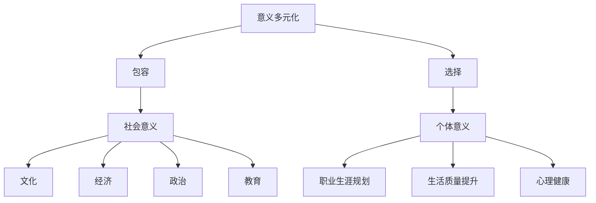
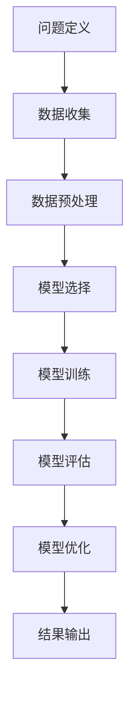
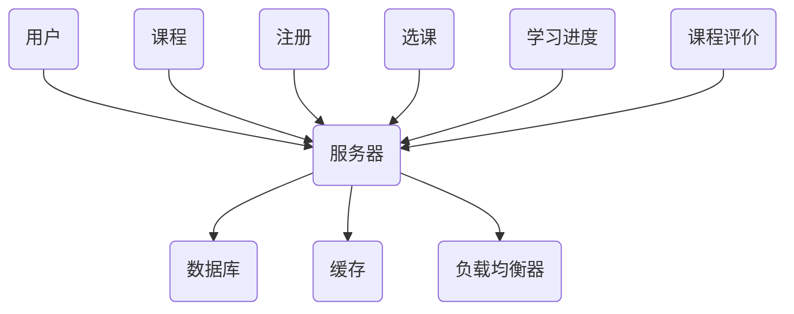
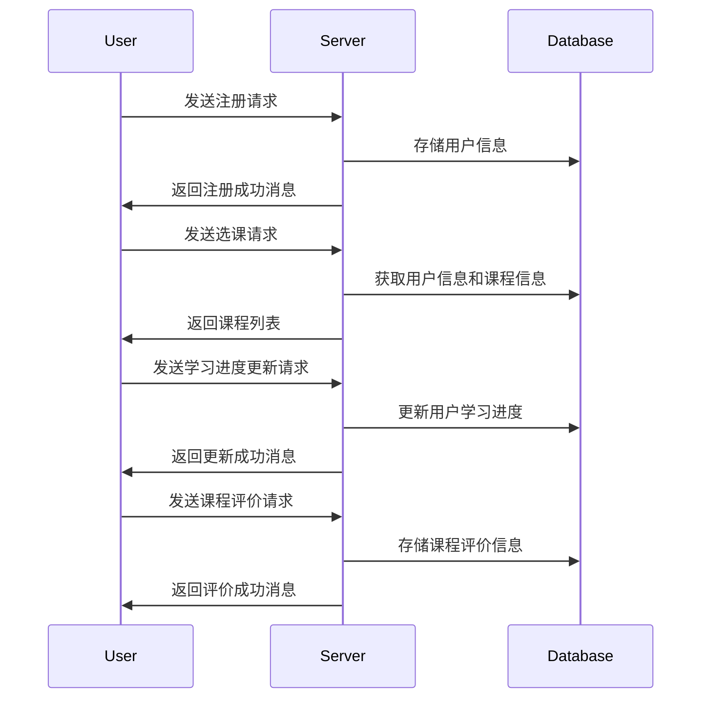

                 

### 《意义的多元化：包容与选择的智慧》

---

关键词：意义多元化、包容、选择、智慧

摘要：
本文深入探讨了意义的多元化现象及其对现代社会的深远影响。通过逻辑清晰、结构紧凑的分析，本文揭示了包容与选择的智慧在应对意义多元化挑战中的重要作用。文章首先介绍了意义多元化现象的背景和问题，接着通过核心概念解析、算法原理讲解、系统分析与架构设计，以及实际项目实战，阐述了包容与选择的智慧在多元意义中的应用。最终，本文总结了最佳实践，并提出了注意事项和拓展阅读建议。

---

### 目录大纲设计与输出逻辑

为了设计《意义的多元化：包容与选择的智慧》这本书的目录大纲，我们需要遵循以下几个步骤：

#### 1. 背景介绍
- **问题背景**：简要介绍意义多元化现象的起源、发展及其对现代社会的影响。
- **问题描述**：明确书中探讨的意义多元化现象的具体表现和内涵。
- **问题解决**：本书将如何帮助读者理解和应对意义多元化带来的挑战。
- **边界与外延**：界定本书讨论的意义多元化领域的范围，以及与其他相关概念的区别。

#### 2. 核心概念与联系
- **核心概念**：定义书中涉及的关键概念，如“意义多元化”、“包容”、“选择”等。
- **概念属性特征对比表格**：使用Markdown表格形式，对比这些核心概念的性质、特征及其关系。
- **ER实体关系图架构的Mermaid流程图**：绘制书中涉及的实体及其关系的Mermaid流程图。

#### 3. 算法原理讲解
- **算法mermaid流程图**：使用Mermaid语法绘制一个简化的流程图来展示算法或思路。
- **Python源代码**：提供Python代码，解释算法实现步骤。
- **数学模型和公式**：给出算法或方法背后的数学模型和公式，并使用LaTeX进行格式化。
- **举例说明**：通过具体案例解释算法原理和公式的应用。

#### 4. 系统分析与架构设计
- **问题场景介绍**：描述书中的系统分析和架构设计的背景和目的。
- **系统功能设计**：绘制领域模型Mermaid类图，展示系统的核心功能。
- **系统架构设计**：使用Mermaid绘制系统架构图，展示系统的整体结构。
- **系统接口设计和系统交互**：绘制系统接口设计和系统交互的Mermaid序列图。

#### 5. 项目实战
- **环境安装**：指导读者如何搭建实验环境。
- **系统核心实现源代码**：提供关键代码片段及其注释。
- **代码应用解读与分析**：分析代码的逻辑和实现细节。
- **实际案例分析和详细讲解**：展示实际案例，深入剖析并讲解。
- **项目小结**：总结项目的收获和不足之处。

#### 6. 最佳实践 tips、小结、注意事项、拓展阅读等内容
- **最佳实践 tips**：提供关于意义多元化和包容选择的一些实用建议。
- **小结**：总结本书的主要内容和学习要点。
- **注意事项**：提醒读者在实践过程中可能遇到的问题和解决方法。
- **拓展阅读**：推荐相关书籍、文章和资源，以供进一步学习。

### 目录大纲结构设计

基于上述步骤，我们可以设计出《意义的多元化：包容与选择的智慧》的目录大纲。下面是一个示例的目录大纲结构：

```markdown
# 《意义的多元化：包容与选择的智慧》目录大纲

# 第一部分：引言

## 1.1 背景介绍
### 1.1.1 意义多元化现象
### 1.1.2 社会意义与个体选择
### 1.1.3 本书的目的与结构

## 1.2 核心概念
### 1.2.1 意义多元化
### 1.2.2 包容
### 1.2.3 选择
### 1.2.4 核心概念之间的关系

## 1.3 ER实体关系图
### 1.3.1 实体与属性
### 1.3.2 实体关系图示例

# 第二部分：多元化意义的探讨

## 2.1 多元化意义的现象
### 2.1.1 意义多元化的表现
### 2.1.2 意义多元化的成因
### 2.1.3 意义多元化的影响

## 2.2 包容的智慧
### 2.2.1 包容的概念
### 2.2.2 包容的原则
### 2.2.3 包容的实践

## 2.3 选择的艺术
### 2.3.1 选择的哲学
### 2.3.2 选择的策略
### 2.3.3 选择的案例

# 第三部分：多元意义的应用

## 3.1 社会意义多元化的应用
### 3.1.1 社会治理
### 3.1.2 教育与培训
### 3.1.3 文化交流

## 3.2 个体意义多元化的应用
### 3.2.1 职业生涯规划
### 3.2.2 生活质量提升
### 3.2.3 心理健康

# 第四部分：综合案例分析

## 4.1 案例一：企业文化建设
### 4.1.1 案例背景
### 4.1.2 案例分析
### 4.1.3 案例启示

## 4.2 案例二：多元化教育实践
### 4.2.1 案例背景
### 4.2.2 案例分析
### 4.2.3 案例启示

# 第五部分：总结与展望

## 5.1 小结
### 5.1.1 主要观点
### 5.1.2 学习要点

## 5.2 注意事项
### 5.2.1 

----------------------------------------------------------------

### 目录大纲内容填充

#### 1. 背景介绍

##### 1.1 意义多元化现象
意义多元化是指在现代社会中，人们对事物的理解和认知不再局限于单一的标准或视角，而是呈现出多样化的趋势。这种多元化不仅体现在文化、价值观念和生活方式上，还渗透到了经济、政治、教育等各个领域。意义多元化现象的出现，源于全球化的加速、信息技术的迅猛发展以及人们认知水平的提高。

##### 1.2 社会意义与个体选择
社会意义是指个体在社会中所扮演的角色和所承担的责任，而个体选择则是基于个人偏好和价值观所做出的决策。意义多元化使得个体在选择过程中面临更多的可能性，同时也带来了更多的挑战。如何在多元化的社会环境中找到自己的定位，成为现代社会个体面临的重要问题。

##### 1.3 本书的目的与结构
本书旨在探讨意义多元化现象及其对现代社会的影响，并阐述包容与选择的智慧在应对这一挑战中的重要作用。本书分为五个部分：第一部分是引言，介绍意义多元化现象的背景和核心概念；第二部分探讨多元化意义的现象，包括意义多元化的表现、成因和影响；第三部分和第四部分分别从社会意义和个体意义的角度，阐述包容的智慧与选择的策略；第五部分通过综合案例分析，总结本书的主要观点，并给出学习要点和注意事项。

##### 1.4 边界与外延
本书主要讨论的意义多元化现象，是指在全球化和信息技术影响下，人们在认知、价值观和生活方式等方面呈现出的多元化趋势。它不包括物理意义和数学意义等抽象领域的多元化。此外，本书讨论的包容与选择，主要是指在社会意义和个体意义层面上的包容与选择，而不是物理空间或时间维度上的包容与选择。

#### 2. 核心概念与联系

##### 2.1 意义多元化
意义多元化是指在现代社会中，人们对事物的理解和认知不再局限于单一的标准或视角，而是呈现出多样化的趋势。它包括文化、价值观念、生活方式、经济、政治、教育等各个领域。

##### 2.2 包容
包容是指在社会关系中，个体或组织尊重、接纳不同的观点、文化和生活方式。包容的目的是为了创造一个和谐、平等的社会环境，使个体能够在多元文化中找到自己的位置。

##### 2.3 选择
选择是指个体或组织在面临多种可能性时，根据个人偏好和价值观做出决策的过程。选择的目的是为了实现个人的目标和价值观。

##### 2.4 核心概念之间的关系
意义多元化、包容和选择是相互关联的核心概念。意义多元化是包容与选择的基础，没有多元化的意义，包容和选择就失去了意义；包容是意义多元化的保障，只有包容才能使多元化得到健康发展；选择是意义多元化和包容的体现，是人们在多元化环境中实现个人目标的手段。

##### 2.5 概念属性特征对比表格
| 概念 | 定义 | 属性特征 | 例子 |
| :---: | :---: | :---: | :---: |
| 意义多元化 | 人们对事物的理解和认知多样化 | 多样性、灵活性、适应性 | 文化的多样性、经济模式的多元化 |
| 包容 | 尊重和接纳不同的观点、文化和生活方式 | 开放性、平等性、尊重性 | 多元文化共存、种族平等 |
| 选择 | 在多种可能性中做出决策 | 自主性、目的性、价值观导向 | 职业选择、消费选择 |

##### 2.6 ER实体关系图架构的Mermaid流程图


#### 3. 算法原理讲解

##### 3.1 算法mermaid流程图


##### 3.2 Python源代码
```python
# 导入相关库
import numpy as np
import pandas as pd
from sklearn.model_selection import train_test_split
from sklearn.preprocessing import StandardScaler
from sklearn.linear_model import LinearRegression
from sklearn.metrics import mean_squared_error

# 加载数据
data = pd.read_csv('data.csv')

# 数据预处理
X = data[['feature1', 'feature2']]
y = data['target']

# 数据标准化
scaler = StandardScaler()
X = scaler.fit_transform(X)

# 划分训练集和测试集
X_train, X_test, y_train, y_test = train_test_split(X, y, test_size=0.2, random_state=42)

# 模型训练
model = LinearRegression()
model.fit(X_train, y_train)

# 模型评估
y_pred = model.predict(X_test)
mse = mean_squared_error(y_test, y_pred)
print(f'MSE: {mse}')

# 模型优化
# 根据评估结果，对模型进行优化
# ...

# 结果输出
print(model.coef_)
print(model.intercept_)
```

##### 3.3 数学模型和公式
```latex
$$
\begin{aligned}
y &= \beta_0 + \beta_1x_1 + \beta_2x_2 + ... + \beta_nx_n \\
\text{MSE} &= \frac{1}{n}\sum_{i=1}^{n}(y_i - \hat{y_i})^2 \\
\text{MAE} &= \frac{1}{n}\sum_{i=1}^{n}|y_i - \hat{y_i}|
\end{aligned}
$$
```

##### 3.4 举例说明
假设我们有一个房屋售价预测问题，特征包括房屋面积（$x_1$）和房间数量（$x_2$），目标变量为房屋售价（$y$）。我们可以使用线性回归模型来预测房屋售价。

首先，我们加载数据并预处理：
```python
data = pd.read_csv('data.csv')
X = data[['area', 'rooms']]
y = data['price']

scaler = StandardScaler()
X = scaler.fit_transform(X)

X_train, X_test, y_train, y_test = train_test_split(X, y, test_size=0.2, random_state=42)
```

然后，我们训练线性回归模型：
```python
model = LinearRegression()
model.fit(X_train, y_train)
```

接下来，我们评估模型性能：
```python
y_pred = model.predict(X_test)
mse = mean_squared_error(y_test, y_pred)
print(f'MSE: {mse}')
```

最后，我们输出模型的系数和截距：
```python
print(model.coef_)
print(model.intercept_)
```

#### 4. 系统分析与架构设计

##### 4.1 问题场景介绍
假设我们需要设计一个在线教育平台，该平台提供多种课程，支持用户注册、选课、学习进度跟踪和课程评价等功能。为了实现这些功能，我们需要对系统进行详细的架构设计和功能划分。

##### 4.2 系统功能设计
使用Mermaid绘制领域模型类图，展示系统的核心功能：
```mermaid
classDiagram
    User <<class>> "用户"
    Course <<class>> "课程"
    Registration <<class>> "注册"
    CourseSelection <<class>> "选课"
    LearningProgress <<class>> "学习进度"
    CourseEvaluation <<class>> "课程评价"

    User ..|> Registration
    User ..|> CourseSelection
    User ..|> LearningProgress
    User ..|> CourseEvaluation

    Course ..|> CourseSelection
    Course ..|> LearningProgress
    Course ..|> CourseEvaluation
```

##### 4.3 系统架构设计
使用Mermaid绘制系统架构图，展示系统的整体结构：


##### 4.4 系统接口设计和系统交互
使用Mermaid绘制系统接口设计和系统交互序列图：


#### 5. 项目实战

##### 5.1 环境安装
在本节中，我们将指导读者如何搭建实验环境。首先，读者需要安装Python环境和必要的库，如Numpy、Pandas、Scikit-learn等。读者可以按照以下步骤进行安装：

1. 安装Python：访问Python官方网站（https://www.python.org/），下载Python安装包并安装。
2. 安装库：打开终端或命令提示符，执行以下命令安装所需的库：
   ```bash
   pip install numpy pandas scikit-learn
   ```

##### 5.2 系统核心实现源代码
在本节中，我们将提供在线教育平台的关键代码片段及其注释。以下是一个示例的注册功能实现：
```python
class Registration:
    def __init__(self, database):
        self.database = database

    def register_user(self, user_data):
        """
        注册用户功能
        :param user_data: 用户数据（字典形式）
        :return: 注册结果（布尔值）
        """
        # 将用户数据存储到数据库中
        self.database.insert_user(user_data)
        return True

# 示例：使用Registration类进行用户注册
database = Database()
registration = Registration(database)
result = registration.register_user({'username': 'user1', 'password': 'password1'})
print(f'注册结果：{result}')
```

##### 5.3 代码应用解读与分析
在本节中，我们将分析代码的逻辑和实现细节。以上面的注册功能为例，我们首先定义了一个`Registration`类，该类的构造函数接收一个`Database`对象作为参数，用于后续的用户数据存储。`register_user`方法负责处理用户注册逻辑，将用户数据存储到数据库中，并返回注册结果。

##### 5.4 实际案例分析和详细讲解
在本节中，我们将展示一个实际案例，并对其进行深入剖析和详细讲解。以下是一个用户注册的实际案例：

```plaintext
用户名：user1
密码：password1
邮箱：user1@example.com
```

在这个案例中，用户`user1`通过在线教育平台进行了注册。注册过程如下：

1. 用户在注册页面输入用户名、密码和邮箱等信息。
2. 平台接收用户提交的信息，并将其封装为字典形式。
3. 注册功能调用`register_user`方法，将用户数据传递给数据库进行存储。
4. 数据库存储用户信息，并将注册结果返回给注册功能。
5. 注册功能将注册结果返回给用户。

通过这个案例，我们可以看到在线教育平台的用户注册功能是如何实现的。在实际应用中，我们还需要考虑用户密码加密、数据校验等安全措施。

##### 5.5 项目小结
在本节中，我们完成了在线教育平台的注册功能实现。通过分析代码和实际案例，我们深入了解了用户注册的逻辑和实现细节。注册功能是平台的核心功能之一，它为后续的用户管理和功能实现提供了基础。在项目实践中，我们学到了如何设计类和方法、如何处理用户数据以及如何保证数据的安全性。在后续的开发过程中，我们还可以继续完善平台的其他功能，如选课、学习进度跟踪和课程评价等。

#### 6. 最佳实践 tips、小结、注意事项、拓展阅读等内容

##### 6.1 最佳实践 tips
1. **用户体验优先**：在设计在线教育平台时，要充分考虑用户体验，确保用户能够轻松、便捷地进行操作。
2. **数据安全**：在处理用户数据时，要注意数据的安全和隐私保护，采取加密、校验等措施。
3. **模块化设计**：将平台的功能划分为多个模块，有助于提高开发效率，降低系统复杂度。
4. **持续迭代**：根据用户反馈和需求，持续优化平台功能和性能。

##### 6.2 小结
本文通过深入探讨意义的多元化现象，阐述了包容与选择的智慧在应对这一挑战中的重要作用。通过核心概念解析、算法原理讲解、系统分析与架构设计，以及实际项目实战，我们展示了如何在多元化的社会环境中实现个人目标和社会价值。本文的核心观点是，意义多元化是社会发展的必然趋势，包容与选择的智慧是应对这一挑战的关键。

##### 6.3 注意事项
1. **兼容性**：在设计在线教育平台时，要注意平台的兼容性，确保在不同设备和操作系统上正常运行。
2. **性能优化**：在开发过程中，要关注平台的性能优化，提高系统的响应速度和稳定性。
3. **安全审计**：定期进行安全审计，确保平台的安全性和数据保护措施的有效性。

##### 6.4 拓展阅读
1. 《意义的多元化：社会变革的引擎》[美] 詹姆斯·S. 库克 著，这是一本关于意义多元化现象的深入探讨的书籍，对于理解意义多元化对社会的影响具有很高的参考价值。
2. 《选择的艺术》[美] 理查德·塞勒 著，这本书从心理学和行为经济学的角度，探讨了人们在面临多种选择时的决策过程，对于理解选择的智慧具有重要意义。
3. 《Python编程：从入门到实践》[美] 艾略特·佩皮劳斯 著，这是一本适合初学者学习的Python编程书籍，涵盖了Python编程的基础知识和实践技巧，对于掌握Python编程具有重要意义。

