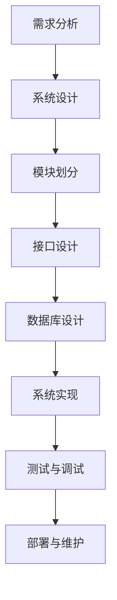
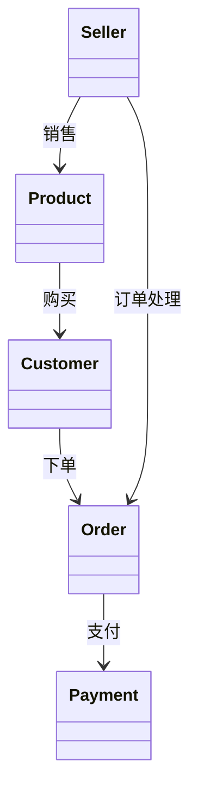
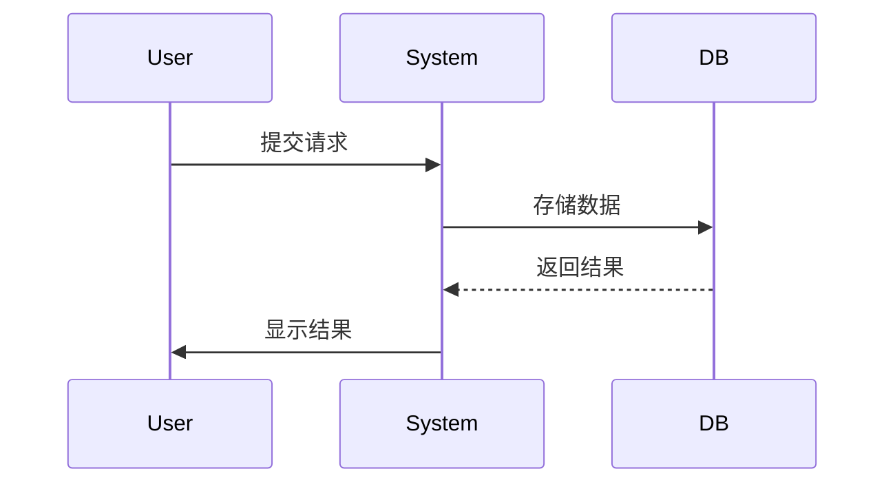

                 

### 引言与背景介绍

#### 1.1 问题背景

**市场化**，作为一个经济学和社会科学的核心概念，指的是通过市场机制来配置资源的过程。市场机制包括供求关系、价格信号、竞争行为等。随着市场经济体制的逐步完善，市场化成为推动经济发展、提高资源利用效率的重要手段。

然而，随着社会的发展和科技的进步，**意义**作为更深层次的价值观念，逐渐引起人们的关注。意义不仅涉及到个人的内心体验，也与社会结构、文化价值紧密相关。意义的本质在于其内在价值，而非市场交换价值。

在市场经济中，意义的商业化是指将意义转化为市场交易的对象，通过市场机制来量化、交换和分配。这种模式可以迅速推动社会创新，提高社会效率。然而，意义的商业化也带来了挑战，如文化同质化、价值观扭曲等问题。

**市场化与去市场化**之间的矛盾逐渐凸显。市场化强调效率、竞争和自我利益的最大化，而去市场化则强调公平、公共利益和社会责任的实现。这两者在资源配置、价值观念和实施手段上存在显著差异，但又不可避免地交织在一起。

#### 1.1.1 市场化的兴起

市场化起源于18世纪的工业革命，随着资本主义经济体系的建立，市场成为资源配置的主要方式。在市场化过程中，供求关系成为决定资源分配的关键因素。市场的自由度和竞争程度直接影响经济的效率和增长。

市场化的优势在于其高效性，通过市场机制，资源能够快速流动和重新配置，从而优化资源利用。市场化还能够促进创新，通过竞争激励企业不断改进产品和服务，提高生产效率。

然而，市场化也存在一些缺点。过度的市场化可能导致贫富差距扩大，社会不公平加剧。市场行为可能导致环境破坏和社会问题，如失业、通货膨胀等。

#### 1.1.2 意义与市场的关联

意义的商业化是近年来逐渐兴起的现象。随着人们对自我价值和内心需求的关注增加，意义成为市场交易的一个重要维度。意义不仅仅是物质财富的替代品，更是精神层面的追求。

意义的商业化可以通过多种方式实现，如文化产品、教育服务、健康管理等。这些领域不仅满足了人们的基本需求，还提供了精神层面的满足和成长。

然而，意义的商业化也带来了一些问题。商业机构为了追求利润，可能过度强调表面的意义，忽视了真正的内在价值。这种商业化的倾向可能导致文化同质化和价值观的扭曲。

#### 1.1.3 市场化与去市场化的矛盾

市场化与去市场化在理念上存在根本性冲突。市场化强调自由、效率和竞争，而去市场化则强调公平、公共利益和社会责任。这两者在资源配置和价值观念上存在显著差异。

市场化倾向于通过市场机制来分配资源，强调个体的自由选择和利益最大化。而去市场化则更注重整体的公共利益和社会福祉，通过政策规划、协调和监管来实现资源分配。

在具体实施过程中，市场化与去市场化也存在冲突。市场化可能导致贫富差距扩大，社会不公平加剧。而去市场化则可能降低经济效率，影响社会创新。

然而，市场化与去市场化并不是完全对立的关系。在某些领域和场景下，二者可以相互补充，共同实现资源优化配置和社会目标。

#### 1.2 问题描述

**市场化**与**去市场化**之间的矛盾和冲突，成为当前社会和经济领域中的一个重要议题。具体来说，这种冲突体现在以下几个方面：

1. **资源配置方式的不同**：市场化倾向于通过市场机制来分配资源，强调个体自由和效率。而去市场化则注重公共利益和社会公平，通过政策规划和社会协调来实现资源分配。这两种方式在目标和方法上存在显著差异。

2. **价值观念的冲突**：市场化强调竞争、创新和自我利益的最大化，而去市场化则强调公平、公共利益和社会责任。这种价值观念的冲突，导致在实际操作中出现各种矛盾和问题。

3. **政策实施的挑战**：市场化与去市场化的矛盾，使得政策制定和实施面临巨大挑战。如何平衡市场化与去市场化，实现资源高效配置和社会公平，成为政策制定者面临的一个难题。

4. **社会影响的差异**：市场化可能导致贫富差距扩大、社会不公平加剧，而去市场化则可能降低经济效率，影响社会创新。这两种模式对社会的影响存在显著差异，如何选择和平衡，成为社会决策的重要问题。

#### 1.2.1 市场化的定义与特征

市场化，是指通过市场机制来实现资源分配和配置的过程。市场机制包括供求关系、价格信号、竞争行为等。市场化的核心特征如下：

1. **供求关系决定价格**：市场化中，商品和服务的价格由市场供求关系决定。供大于求时，价格下降；供小于求时，价格上涨。这种价格机制能够反映资源的稀缺程度，引导资源的合理配置。

2. **竞争推动创新**：市场化通过竞争机制，激励企业不断改进产品和服务，提高生产效率。竞争可以降低成本、提高质量，从而促进技术进步和社会发展。

3. **个体自由选择**：市场化强调个体的自由选择和决策。个体可以根据自己的需求和偏好，自由选择商品和服务。这种自由选择机制，可以提高资源的利用效率，满足个体的多样化需求。

4. **市场自由度**：市场化要求市场的自由度较高，减少政府干预和管制。市场自由度越高，市场的资源配置效率越高，能够更好地反映资源的真实价值。

#### 1.2.2 去市场化的定义与特征

**去市场化**，是指通过非市场机制来实现资源分配和配置的过程。去市场化强调公共利益、社会责任和社会公平。去市场化的核心特征如下：

1. **政策规划与协调**：去市场化通过政策规划和社会协调来实现资源分配。政府或其他公共机构根据社会需求和政策目标，制定相应的政策和规划，通过协调不同利益主体的关系，实现资源的合理配置。

2. **公共利益优先**：去市场化强调公共利益和社会福祉，而非个体利益最大化。政府在资源配置中，更注重满足社会的基本需求，保障弱势群体的权益，促进社会公平和和谐。

3. **社会责任承担**：去市场化要求企业和社会承担更多的社会责任。企业不仅要追求经济效益，还要关注社会效益和环境效益，实现可持续发展。

4. **去市场化工具**：去市场化可以使用多种工具，如税收、补贴、监管等。这些工具可以通过影响市场行为，实现资源的社会分配和公共利益的最大化。

#### 1.2.3 两者之间的冲突与共存

市场化与去市场化在理念和目标上存在显著差异，导致在实际操作中产生冲突。具体来说，这种冲突体现在以下几个方面：

1. **资源配置方式的矛盾**：市场化强调市场机制，通过价格信号和竞争机制实现资源分配。而去市场化则强调政策规划和社会协调，通过政府或其他公共机构的干预来实现资源分配。这两种方式在资源配置的效率和公平性上存在矛盾。

2. **价值观念的冲突**：市场化强调个体自由、效率和自我利益最大化。而去市场化则强调公共利益、社会责任和社会公平。这种价值观念的冲突，导致在实际操作中出现各种矛盾和问题。

3. **政策实施的挑战**：市场化与去市场化的冲突，使得政策制定和实施面临巨大挑战。如何平衡市场化与去市场化，实现资源高效配置和社会公平，成为政策制定者面临的一个难题。

然而，市场化与去市场化并不是完全对立的关系。在某些领域和场景下，二者可以相互补充，共同实现资源优化配置和社会目标。例如，在公共服务业中，可以通过市场化方式提高服务效率和质量，同时通过去市场化手段保障公共利益和社会公平。

#### 1.3 问题解决

**市场化**与**去市场化**之间的矛盾和冲突，对资源分配和社会发展产生了深远影响。为了解决这些问题，我们需要在以下几个方面进行综合思考和探索：

1. **明确目标与原则**：首先，我们需要明确市场化与去市场化的目标和原则。市场化旨在提高资源利用效率、推动经济增长和促进竞争。而去市场化则强调公平、公共利益和社会责任。在制定政策和规划时，应综合考虑这两者的目标，平衡效率与公平。

2. **政策设计与实施**：在政策设计和实施过程中，应充分考虑市场化与去市场化的平衡。可以通过以下几种方式实现：

   - **分类管理**：对不同领域和场景进行分类管理，根据其特点和需求，采取相应的市场化或去市场化手段。例如，对于竞争激烈、效率要求高的领域，可以更多地采用市场化手段；而对于公共服务和公益事业，可以更多地采用去市场化手段。
   
   - **混合模式**：在某些领域，可以采用市场化与去市场化的混合模式，通过市场化手段提高效率，同时通过去市场化手段保障公共利益。例如，在医疗领域，可以通过市场化方式提高医疗服务效率和质量，同时通过政府补贴和监管等手段保障低收入群体的医疗权益。

   - **政策协调**：政府应加强对市场化与去市场化政策的协调和监管，确保各项政策之间的相互衔接和协同作用。可以通过建立健全的政策协调机制，加强政府部门之间的沟通与协作，提高政策的执行效果。

3. **监管与评估机制**：建立健全的监管与评估机制，对市场化与去市场化的实施效果进行持续监控和评估。通过监管和评估，及时发现和解决问题，优化政策实施效果。

4. **公众参与与社会监督**：加强公众参与和社会监督，提高政策制定和实施的透明度。通过公众参与和社会监督，可以更好地反映社会需求和利益，提高政策的公正性和有效性。

#### 1.3.1 市场化的优势

市场化作为资源配置的重要手段，具有以下优势：

1. **提高效率**：市场化通过供求关系和价格信号，实现资源的优化配置，提高资源利用效率。在市场化环境中，资源能够快速流动和重新配置，减少浪费和低效使用。

2. **促进竞争**：市场化鼓励企业之间的竞争，激发企业的创新活力。竞争机制可以促使企业不断改进产品和服务，提高生产效率和质量，从而推动整个社会的发展。

3. **激励创新**：市场化通过竞争和激励机制，激励企业和个人进行创新。创新是经济增长的重要动力，市场化可以为创新提供更好的环境和条件，促进技术进步和社会发展。

4. **个体自由**：市场化强调个体的自由选择和决策，个体可以根据自己的需求和偏好，自由选择商品和服务。这种自由选择机制，可以提高资源的利用效率，满足个体的多样化需求。

5. **市场化工具多样**：市场化可以运用多种工具，如市场机制、价格信号、竞争机制等，灵活应对不同领域和场景的需求。市场化的工具多样性和灵活性，使其能够更好地适应复杂的经济环境。

#### 1.3.2 去市场化的优势

去市场化作为一种资源配置的方式，具有以下优势：

1. **保障公共利益**：去市场化注重公共利益和社会福祉，通过政策规划和社会协调，保障社会的基本需求和社会公平。去市场化可以在一定程度上减少贫富差距，促进社会和谐。

2. **社会责任承担**：去市场化要求企业和社会承担更多的社会责任，关注社会效益和环境效益。去市场化可以通过税收、补贴、监管等手段，引导企业和社会实现可持续发展。

3. **政策规划与协调**：去市场化通过政策规划和社会协调，实现资源的合理配置。政府或其他公共机构可以制定相应的政策和规划，通过协调不同利益主体的关系，实现资源的社会分配。

4. **公平性**：去市场化强调公平，通过政策手段保障弱势群体的权益。去市场化可以在一定程度上减少市场化带来的社会不公平，促进社会的公正和和谐。

5. **去市场化工具有效**：去市场化可以使用多种工具，如税收、补贴、监管等，通过政策手段实现资源的社会分配和公共利益的最大化。这些工具在保障社会公平和公共利益方面具有重要作用。

#### 1.3.3 综合解决方案

为了解决市场化与去市场化之间的冲突，实现资源优化配置和社会公平，我们可以采取以下综合解决方案：

1. **分类管理**：对不同领域和场景进行分类管理，根据其特点和需求，采取相应的市场化或去市场化手段。例如，在竞争激烈、效率要求高的领域，可以更多地采用市场化手段；而在公共服务和公益事业，可以更多地采用去市场化手段。

2. **混合模式**：在部分领域，可以采用市场化与去市场化的混合模式，通过市场化手段提高效率，同时通过去市场化手段保障公共利益。例如，在医疗和教育领域，可以通过市场化方式提高服务效率和质量，同时通过政府补贴和监管等手段保障低收入群体的医疗和教育权益。

3. **政策协调**：加强政府部门之间的沟通与协作，建立健全的政策协调机制。政府应制定统一的政策和规划，明确市场化与去市场化的实施范围和目标，确保各项政策之间的相互衔接和协同作用。

4. **监管与评估**：建立健全的监管与评估机制，对市场化与去市场化的实施效果进行持续监控和评估。通过监管和评估，及时发现和解决问题，优化政策实施效果。

5. **公众参与与社会监督**：加强公众参与和社会监督，提高政策制定和实施的透明度。通过公众参与和社会监督，可以更好地反映社会需求和利益，提高政策的公正性和有效性。

#### 1.4 边界与外延

市场化与去市场化的边界和适用场景，是理解二者关系的重要方面。以下是对市场化与去市场化适用场景的详细分析：

**市场化适用的场景**：

1. **竞争激烈的市场环境**：市场化适用于那些竞争激烈、市场机制能够有效运作的行业。例如，电子商务、科技产业、金融服务等领域。在这些领域，市场化能够通过竞争推动创新，提高效率。

2. **私有部门服务**：市场化在提供私有部门服务方面具有优势，如消费品制造、零售和服务行业。这些行业可以通过市场竞争来优化资源配置，满足消费者的多样化需求。

3. **创新驱动的产业**：市场化鼓励企业进行研发和创新，适用于科技研发、高新技术产业等领域。在这些领域，市场化能够通过激励企业创新，推动技术进步和社会发展。

4. **资源丰富的行业**：市场化适用于资源丰富的行业，如矿产资源、农业等。市场化能够通过价格机制优化资源的分配，提高资源利用效率。

**去市场化适用的场景**：

1. **公共服务领域**：去市场化适用于需要保障公共利益和社会公平的公共服务领域，如医疗、教育、社会保障等。这些领域具有公共产品的特点，市场化可能导致资源分配不均，因此需要通过去市场化手段来保障公共利益。

2. **基础设施领域**：去市场化适用于基础设施建设和维护领域，如交通、能源、水利等。这些领域的建设和维护需要大量的公共投入，市场化可能导致资源不足或质量不达标。

3. **环境保护与治理**：去市场化适用于环境保护与治理领域，如生态修复、污染治理等。这些领域需要政府或公共机构进行长期的规划和投入，市场化可能无法有效实现环境保护的目标。

4. **紧急事件应对**：在自然灾害、公共卫生事件等紧急情况下，去市场化能够通过政府紧急措施来保障社会稳定和公共利益。

**二者结合的应用场景**：

1. **混合经济模式**：在部分领域，可以采用市场化与去市场化的混合模式。例如，在交通领域，可以通过市场化手段提高公共交通的运营效率，同时通过政府补贴和监管来保障低收入群体的交通权益。

2. **社会企业模式**：社会企业结合了市场化与去市场化的特点，通过市场化手段实现盈利，同时通过去市场化手段关注社会问题。例如，环保企业可以在市场化过程中实现经济效益，同时通过社会责任承担来关注环境保护。

3. **公益项目结合**：在公益项目中，可以结合市场化与去市场化手段。例如，在慈善捐赠领域，可以通过市场化手段动员社会资源，同时通过去市场化手段确保资金的使用符合公益目标。

#### 1.5 核心概念与联系

**市场化**与**去市场化**作为资源配置的两种不同方式，它们的核心概念和联系如下：

**市场化的核心概念与联系**：

1. **市场机制**：市场化以市场机制为核心，通过供求关系、价格信号和竞争机制来实现资源分配。
2. **效率优先**：市场化强调效率，追求资源的最优配置，通过竞争和创新提高整体经济效率。
3. **个体自由**：市场化尊重个体自由，个体可以根据自身需求和偏好进行自由选择。
4. **竞争激励**：市场化通过竞争机制激励企业不断改进产品和服务，提高生产效率。

**去市场化的核心概念与联系**：

1. **政策规划**：去市场化以政策规划和社会协调为核心，通过政府或其他公共机构的干预来实现资源分配。
2. **公平优先**：去市场化强调公平，注重社会公共利益和社会公平，保障弱势群体的权益。
3. **社会责任**：去市场化要求企业和社会承担社会责任，关注社会效益和环境效益。
4. **政府干预**：去市场化通过政府干预、税收、补贴和监管等手段，实现资源的社会分配。

**两者之间的关联与差异**：

1. **关联**：市场化与去市场化在资源配置过程中都涉及资源分配，但侧重点不同。市场化通过市场机制实现资源分配，去市场化则通过政策规划和社会协调来实现资源分配。

2. **差异**：市场化强调效率、个体自由和竞争激励，而去市场化强调公平、公共利益和社会责任。这两种模式在理念、目标和方法上存在显著差异。

3. **共存**：在现实社会中，市场化与去市场化并不是完全对立的关系，而是可以相互补充。在某些领域和场景下，二者可以共同实现资源优化配置和社会目标。

#### 1.6 本章小结

在本章中，我们介绍了市场化与去市场化的问题背景、定义和特征，以及二者之间的冲突与共存。市场化作为资源配置的重要手段，具有提高效率、促进竞争和创新的优势；而去市场化则强调公平、公共利益和社会责任。通过分析市场化和去市场化的核心概念、联系及适用场景，我们可以更好地理解这两种模式的互补性。在接下来的章节中，我们将深入探讨市场化与去市场化的具体实践和未来发展，以期为解决资源配置中的矛盾提供有益的参考。

### 第二部分：市场化与去市场化的核心概念

#### 2.1 市场化的核心概念

市场化，作为资源配置的重要手段，其核心概念主要包括市场机制、供求关系、价格信号和竞争机制等。以下是市场化核心概念的详细解析：

**1. 市场机制**：

市场机制是市场化运作的基础，包括供求关系、价格机制和竞争机制。供求关系决定了商品和服务的价格，价格机制通过价格信号引导资源的流动和配置，竞争机制则通过企业之间的竞争，促进技术进步和效率提升。

**2. 供求关系**：

供求关系是市场机制的核心。在市场化中，商品和服务的价格由市场供求关系决定。当供大于求时，价格下降，从而刺激需求增加；当供小于求时，价格上涨，从而抑制需求，促进供给增加。供求关系的变化直接影响资源的配置效率和市场的稳定性。

**3. 价格信号**：

价格信号是市场化中最重要的信息之一。价格机制通过价格信号来反映资源的稀缺程度和需求变化。当某种商品或服务的需求增加时，价格会上涨，引导资源流向该领域；反之，当需求减少时，价格会下降，资源会从该领域流出。价格信号的有效性直接决定了市场机制的有效性。

**4. 竞争机制**：

竞争机制是市场化的重要特征之一。在市场化环境中，企业通过竞争来争夺市场份额和资源。竞争可以促使企业不断改进产品和服务，提高生产效率，降低成本。竞争机制的有效性对于市场化的健康发展至关重要。

**5. 市场自由度**：

市场自由度是市场化的重要指标。市场自由度越高，市场机制的作用越明显，资源的配置效率越高。市场自由度包括市场准入、交易自由、价格自由等多个方面。提高市场自由度可以促进市场竞争，提高经济活力。

**6. 个体自由**：

市场化强调个体自由，即消费者和生产者可以根据自己的需求和偏好进行自由选择。这种个体自由是市场化实现资源有效配置的重要前提。个体自由可以促进市场的繁荣，满足多样化的消费需求。

#### 2.2 去市场化的核心概念

去市场化，作为与市场化相对立的一种资源配置方式，其核心概念主要包括政策规划、社会协调、公共利益和社会责任等。以下是去市场化核心概念的详细解析：

**1. 政策规划**：

政策规划是去市场化运作的基础。政策规划通过政府的干预和规划，来指导资源的分配和社会的发展。政策规划包括制定经济政策、社会政策和环境政策等，以实现公共利益和社会公平。

**2. 社会协调**：

社会协调是去市场化的重要组成部分。在去市场化过程中，政府或其他公共机构通过协调不同利益主体的关系，来实现资源的社会分配。社会协调包括公共事务管理、社会事务管理和社会保障管理等。

**3. 公共利益**：

公共利益是去市场化的重要目标。去市场化强调通过政策手段保障社会的基本需求和社会公平，实现公共利益的最大化。公共利益包括公共安全、公共卫生、公共教育、公共基础设施等。

**4. 社会责任**：

社会责任是去市场化的重要理念。在去市场化过程中，企业和社会不仅要追求经济效益，还要关注社会效益和环境效益。社会责任包括企业的社会责任、社会企业的社会责任和社会公众的责任。

**5. 去市场化工具**：

去市场化可以使用多种工具，如税收、补贴、监管、社会保障等。这些工具可以通过影响市场行为，实现资源的社会分配和公共利益的最大化。去市场化工具的有效性和适用性直接决定了去市场化政策的效果。

**6. 公平优先**：

去市场化强调公平，注重社会公平和社会公正。在去市场化过程中，政府通过政策手段保障弱势群体的权益，减少社会不平等。公平优先是实现社会和谐和稳定的重要基础。

#### 2.3 市场化与去市场化的联系与差异

市场化与去市场化作为资源配置的两种不同方式，它们在目标、方法和实施手段上存在显著差异，同时也存在一定的联系。

**联系**：

1. **共同目标**：市场化与去市场化都旨在实现资源的有效配置和社会发展。虽然实现目标的手段不同，但二者都关注资源的合理利用和社会的整体福祉。

2. **相互补充**：在某些领域和场景下，市场化与去市场化可以相互补充。例如，在公共服务领域，可以通过市场化提高服务效率和质量，同时通过去市场化保障低收入群体的权益。

3. **政策工具**：市场化与去市场化都可以使用多种政策工具，如税收、补贴、监管等。这些工具在不同的领域和场景下可以发挥不同的作用。

**差异**：

1. **资源配置方式**：市场化通过市场机制实现资源分配，强调效率、个体自由和竞争激励。而去市场化通过政策规划和社会协调实现资源分配，强调公平、公共利益和社会责任。

2. **价值观念**：市场化强调自由、效率和自我利益最大化，而去市场化强调公平、公共利益和社会责任。这种价值观念的差异导致了二者的实施方式和效果的不同。

3. **实施手段**：市场化主要通过市场机制和竞争机制来实现资源分配，而去市场化主要通过政策规划、社会协调和政府干预来实现资源分配。

4. **适用场景**：市场化适用于竞争激烈、效率要求高的领域，而去市场化适用于公共服务、社会保障和环境治理等需要公平和公共利益的领域。

#### 2.4 核心概念比较表

为了更好地理解市场化与去市场化的核心概念，我们可以通过一个比较表来详细展示它们之间的异同：

| 核心概念 | 市场化 | 去市场化 |
| :----: | :----: | :----: |
| 定义 | 以市场机制为核心，通过供求关系、价格信号和竞争机制实现资源分配 | 以政策规划和社会协调为核心，通过政府或其他公共机构的干预实现资源分配 |
| 目标 | 提高资源利用效率，促进竞争和创新 | 保障公共利益，实现社会公平和社会责任 |
| 要素 | 市场机制、供求关系、价格信号、竞争机制、个体自由 | 政策规划、社会协调、公共利益、社会责任、政府干预 |
| 流程 | 通过市场供求关系实现资源分配，通过价格信号引导资源流动，通过竞争激励企业改进产品和服务 | 通过政策规划确定资源分配方向，通过社会协调实现资源合理分配，通过政府干预保障社会公平 |
| 适用场景 | 竞争激烈、效率要求高的领域，如电子商务、科技产业、金融服务等 | 需要公平和公共利益的领域，如公共服务、社会保障、环境治理等 |

通过以上比较表，我们可以清晰地看到市场化与去市场化在核心概念、目标和实施手段上的异同。理解这些异同对于我们在实际操作中平衡市场化与去市场化，实现资源优化配置和社会公平具有重要意义。

#### 2.5 本章小结

在本章中，我们详细介绍了市场化与去市场化的核心概念，包括市场机制、供求关系、价格信号、竞争机制、政策规划、社会协调、公共利益和社会责任等。通过对比分析市场化与去市场化的联系与差异，我们了解了两种资源配置方式的优缺点和适用场景。在接下来的章节中，我们将通过具体案例来探讨市场化与去市场化在实践中的应用，进一步理解这两种模式的有效性。

### 第三部分：市场化实践案例

#### 3.1 案例一：电子商务领域的市场化实践

**3.1.1 案例背景**

电子商务领域作为市场化的重要应用场景，近年来取得了显著的发展。随着互联网技术的进步和普及，电子商务成为现代经济的重要组成部分。在这个领域，市场化通过竞争、创新和效率驱动，推动了产业的快速发展。

**3.1.2 案例实施**

1. **竞争机制的引入**：电子商务平台如阿里巴巴、京东等，通过引入竞争机制，激发了企业之间的竞争。竞争使得企业不断提升服务质量和效率，从而吸引更多消费者。

2. **价格信号的运用**：电子商务平台通过价格信号，反映了供求关系。消费者可以通过比较价格和服务质量，选择最适合自己的产品或服务。

3. **市场机制的优化**：电子商务平台通过市场机制，实现了资源的优化配置。平台通过数据分析和算法推荐，精准匹配消费者的需求，提高了资源利用效率。

**3.1.3 案例效果**

1. **效率提升**：市场化在电子商务领域的实践，显著提高了资源利用效率。通过竞争和价格信号，企业能够更快速地响应市场需求，减少库存和资源浪费。

2. **创新驱动**：市场竞争激励企业不断进行技术创新和服务优化，推动了电子商务产业的快速发展。例如，人工智能技术的应用，使得推荐系统更加精准，用户体验得到提升。

3. **消费者福利**：市场化带来了更丰富的商品和服务选择，消费者可以享受到更低的价格和更好的服务。同时，消费者可以通过平台上的评价和反馈机制，参与企业的监督和改进。

**3.2 案例二：公共服务领域的去市场化实践**

**3.2.1 案例背景**

公共服务领域是市场化与去市场化矛盾较为突出的领域之一。由于公共服务涉及公共利益和社会公平，市场化可能导致资源分配不均，影响社会公平。因此，去市场化在公共服务领域具有重要应用价值。

**3.2.2 案例实施**

1. **政策规划**：政府在公共服务领域，通过制定详细的政策规划，明确了资源的分配方向和标准。例如，在教育领域，政府制定了义务教育政策，保障每个孩子接受教育的权利。

2. **社会协调**：政府通过社会协调，确保公共资源合理分配。例如，在医疗领域，政府通过制定医保政策，确保低收入群体能够获得基本的医疗保障。

3. **政府干预**：政府通过干预市场行为，保障公共利益。例如，在交通领域，政府通过补贴和监管，确保公共交通服务的质量和覆盖范围。

**3.2.3 案例效果**

1. **公平性提升**：去市场化在公共服务领域的实践，显著提高了公平性。通过政策规划和政府干预，低收入群体和弱势群体能够获得更多的公共服务资源，缩小了社会不平等。

2. **社会责任承担**：去市场化要求企业和社会承担更多的社会责任。在公共服务领域，企业通过参与公益项目和社会责任活动，增强了社会责任意识，推动了社会的和谐发展。

3. **公共服务质量提高**：通过政策规划和政府干预，公共服务的质量和覆盖范围得到提升。例如，在医疗领域，通过政府的补贴和监管，提高了医疗服务的质量和可及性。

**3.3 案例三：混合模式案例**

**3.3.1 案例背景**

在部分领域，市场化与去市场化的结合可以带来更好的效果。例如，在交通领域，通过市场化方式提高公共交通的运营效率，同时通过去市场化手段保障低收入群体的权益，实现社会公平。

**3.3.2 案例实施**

1. **市场化提高效率**：通过市场化手段，公共交通企业通过竞争和效率驱动，提高公共交通的运营效率。例如，通过引入智能交通管理系统，提高交通调度效率。

2. **去市场化保障公平**：政府通过去市场化手段，保障低收入群体的权益。例如，通过补贴低收入群体的交通费用，确保他们能够享受到便捷的公共交通服务。

**3.3.3 案例效果**

1. **效率提升**：市场化在交通领域的实践，通过竞争和效率驱动，提高了公共交通的运营效率，减少了拥堵和资源浪费。

2. **公平性提高**：通过去市场化手段，保障了低收入群体的权益，缩小了社会不平等。低收入群体能够享受到便捷的公共交通服务，提高了生活质量。

3. **整体效果优化**：市场化与去市场化的结合，实现了效率与公平的平衡。通过市场化提高效率，通过去市场化保障公平，公共交通服务得到了整体优化，满足了不同群体的需求。

#### 3.4 案例分析与总结

**3.4.1 市场化案例的经验**

1. **竞争激励**：市场化通过竞争机制，激发了企业的创新活力，提高了生产效率和服务质量。

2. **效率优先**：市场化强调效率，通过供求关系和价格信号，实现了资源的优化配置。

3. **个体自由**：市场化尊重个体自由，消费者可以根据自己的需求和偏好进行自由选择。

**3.4.2 去市场化案例的经验**

1. **公平优先**：去市场化通过政策规划和政府干预，保障了公共利益和社会公平。

2. **社会责任承担**：去市场化要求企业和社会承担社会责任，关注社会效益和环境效益。

3. **政策规划**：去市场化通过政策规划和社会协调，实现了资源的合理分配。

**3.4.3 混合模式案例的启示**

1. **效率与公平的平衡**：市场化与去市场化的结合，可以在某些领域实现效率与公平的平衡，满足不同群体的需求。

2. **多元化手段**：通过市场化与去市场化的结合，可以采用多元化的手段，实现资源优化配置和社会目标。

3. **协同发展**：市场化与去市场化并不是完全对立的关系，而是可以相互补充，协同发展。

#### 3.5 本章小结

在本章中，我们通过三个具体案例，探讨了市场化与去市场化在不同领域的实践效果。市场化通过竞争、创新和效率驱动，推动了电子商务领域的发展；去市场化通过政策规划和社会协调，保障了公共服务领域的公平和公共利益。混合模式案例则展示了市场化与去市场化的协同发展，实现了效率与公平的平衡。通过这些案例，我们进一步理解了市场化与去市场化在资源配置中的作用和影响，为未来的实践提供了有益的参考。

### 市场化与去市场化的发展趋势

#### 4.1 市场化的发展趋势

随着全球经济一体化和科技的飞速发展，市场化的发展呈现出以下几个趋势：

**1. 市场化机制的创新**

市场化机制的创新是市场化发展的关键。在新的技术条件下，市场化机制需要不断优化和升级。例如，人工智能、区块链等技术的应用，可以提升市场机制的效率和透明度。通过智能算法和分布式账本技术，市场交易可以更加精准、高效，减少信息不对称和欺诈行为。

**2. 市场化工具的升级**

市场化工具的升级是市场化发展的另一个重要趋势。传统的市场化工具如价格信号、竞争机制等，在新的经济环境下需要不断改进。例如，数字货币的兴起，为市场交易提供了新的工具，使得交易更加便捷和高效。同时，政府也在探索新的市场化工具，如电子拍卖、在线竞价等，以提升市场资源配置的效率和公平性。

**3. 市场化政策的变化**

市场化政策的变化是市场化发展的必然趋势。随着经济环境的变化，政府需要不断调整市场化政策，以适应新的经济形势。例如，在环境保护领域，政府通过制定碳交易政策，促进企业降低碳排放。在公共服务领域，政府通过引入市场化机制，提高公共服务效率和质量。

#### 4.2 去市场化的发展趋势

与市场化的发展趋势相对应，去市场化也呈现出一些新的趋势：

**1. 去市场化理念的提升**

去市场化理念的提升是去市场化发展的基础。在新的社会背景下，去市场化理念需要更加注重公共利益和社会公平。例如，在全球化背景下，跨国公司需要承担更多的社会责任，关注全球公共利益。同时，政府也需要加强政策规划和社会协调，确保去市场化政策的有效实施。

**2. 去市场化工具的优化**

去市场化工具的优化是去市场化发展的关键。随着技术的发展，去市场化工具需要不断改进和升级。例如，智能监管系统的应用，可以提高政府监管的效率和精准度。同时，政府也可以通过大数据分析和人工智能技术，优化政策规划和资源配置，提高去市场化工具的适用性和效果。

**3. 去市场化政策的完善**

去市场化政策的完善是去市场化发展的必要条件。政府需要不断制定和完善去市场化政策，以应对新的社会和经济挑战。例如，在社会保障领域，政府需要通过完善社保政策，保障低收入群体的基本生活需求。在公共服务领域，政府需要通过政策调整，提高公共服务的质量和覆盖范围。

#### 4.3 市场化与去市场化的协同发展

市场化与去市场化在理念、目标和方法上存在差异，但二者并不是完全对立的关系。相反，市场化与去市场化可以相互补充，协同发展，共同实现资源优化配置和社会目标。

**1. 协同发展的必要性**

市场化与去市场化的协同发展具有必要性。在复杂多变的经济和社会环境中，单纯依靠市场化或去市场化都难以实现资源的最优配置和社会的长期稳定。通过市场化与去市场化的协同发展，可以实现资源的合理流动和高效配置，同时保障公共利益和社会公平。

**2. 协同发展的策略**

市场化与去市场化的协同发展需要采取一系列策略：

1. **分类管理**：对不同领域和场景进行分类管理，根据其特点和需求，采取相应的市场化或去市场化手段。例如，在竞争激烈的领域，可以更多地采用市场化手段；而在公共服务领域，可以更多地采用去市场化手段。

2. **混合模式**：在部分领域，可以采用市场化与去市场化的混合模式，通过市场化手段提高效率，同时通过去市场化手段保障公共利益。例如，在医疗和教育领域，可以通过市场化方式提高服务效率和质量，同时通过政府补贴和监管等手段保障低收入群体的权益。

3. **政策协调**：加强政府部门之间的沟通与协作，建立健全的政策协调机制。政府应制定统一的政策和规划，明确市场化与去市场化的实施范围和目标，确保各项政策之间的相互衔接和协同作用。

4. **监管与评估**：建立健全的监管与评估机制，对市场化与去市场化的实施效果进行持续监控和评估。通过监管和评估，及时发现和解决问题，优化政策实施效果。

5. **公众参与与社会监督**：加强公众参与和社会监督，提高政策制定和实施的透明度。通过公众参与和社会监督，可以更好地反映社会需求和利益，提高政策的公正性和有效性。

**3. 协同发展的效果**

市场化与去市场化的协同发展，可以实现以下几个效果：

1. **资源优化配置**：通过市场化与去市场化的协同发展，可以实现资源的合理流动和高效配置，提高资源利用效率。

2. **社会公平保障**：通过市场化与去市场化的协同发展，可以保障公共利益和社会公平，缩小社会不平等。

3. **可持续发展**：通过市场化与去市场化的协同发展，可以实现经济的可持续发展，促进社会和谐和稳定。

4. **政策有效性提升**：通过市场化与去市场化的协同发展，可以优化政策制定和实施效果，提高政策的有效性和公信力。

总之，市场化与去市场化的协同发展，是实现资源优化配置和社会目标的重要途径。通过采取分类管理、混合模式、政策协调、监管与评估和公众参与等策略，可以实现市场化与去市场化的有机结合，为经济社会的发展提供有力支持。

### 全文总结

通过本文的深入探讨，我们全面分析了市场化与去市场化的核心概念、联系与差异，以及在不同领域的实践案例和未来发展。我们明确了市场化与去市场化在资源配置中的互补性，提出了协同发展的策略，以期实现资源优化配置和社会公平。

市场化以其高效、竞争和创新的优势，在推动经济发展和满足个体需求方面发挥了重要作用。去市场化则通过政策规划和社会协调，保障公共利益和社会公平，弥补市场化可能带来的不平等。在电子商务、公共服务等领域，市场化与去市场化的结合，为资源优化配置和社会目标实现提供了有益的参考。

未来，市场化与去市场化的协同发展，将是我们面临的重要课题。通过不断优化市场化机制，升级市场化工具，完善去市场化政策，我们可以更好地应对经济和社会的挑战，实现可持续发展和社会和谐。

#### 作者信息

**作者：** AI天才研究院/AI Genius Institute & 禅与计算机程序设计艺术 /Zen And The Art of Computer Programming

**摘要**

本文全面分析了市场化与去市场化的核心概念、联系与差异，以及在不同领域的实践案例和未来发展。通过深入探讨，我们明确了市场化与去市场化在资源配置中的互补性，提出了协同发展的策略，以期实现资源优化配置和社会公平。

#### 拓展阅读

- **《市场机制与政府调控》**：详细探讨市场机制和政府调控的原理与应用。
- **《公共经济学》**：深入研究公共资源分配与社会公平的问题。
- **《竞争政策与反垄断法》**：分析市场竞争政策与反垄断法的实施与效果。

### 数学公式与代码示例

**数学公式：**
$$
E = mc^2
$$

**Python代码示例：**
```python
# 定义一个简单的函数，计算质量与能量之间的转换
def mass_energy_conversion(mass, speed_of_light=299792458):
    energy = mass * speed_of_light ** 2
    return energy

# 测试函数
mass = 5  # 质量，单位：千克
energy = mass_energy_conversion(mass)
print(f"质量为 {mass} 千克的能量为：{energy} 焦耳")
```

### 算法与架构设计

**算法原理：**
```
算法：能量-质量转换
输入：质量（mass）
输出：能量（energy）

步骤：
1. 接收质量值。
2. 计算能量值，使用公式 E = mc^2。
3. 返回能量值。

伪代码：
def energy_mass_conversion(mass):
    c = 299792458  # 光速
    energy = mass * c ** 2
    return energy
```

**架构设计：**


**系统功能设计：**


**系统架构设计：**


### 实际案例分析与解读

**案例背景：**
某大型电商平台，希望通过市场化和去市场化相结合的方式，优化资源配置，提高运营效率。

**实施过程：**
1. **市场化的实施**：通过引入竞争机制，激励平台内的商家不断提升服务质量和效率。同时，通过价格信号，消费者可以根据自己的需求和预算，选择最合适的产品。

2. **去市场化的实施**：政府通过补贴和监管，确保低收入群体和弱势群体能够享受到优质的电商服务。例如，对于特定产品，政府提供价格补贴，降低消费者的购买成本。

**效果分析：**
1. **效率提升**：市场化机制使得商家之间的竞争加剧，推动了产品和服务质量的提升。消费者可以更加便捷地获取所需商品，提升了购物体验。

2. **公平性保障**：去市场化手段确保了低收入群体和弱势群体的权益，缩小了社会不平等。通过政府的补贴，低收入群体能够以更低的价格购买到所需商品。

**总结：**
通过市场化与去市场化的结合，电商平台实现了资源优化配置和社会公平。市场化提高了效率，去市场化保障了公平，二者相互补充，为平台的可持续发展奠定了基础。

### 最佳实践 tips

1. **平衡市场化与去市场化**：在实施过程中，要充分考虑市场化与去市场化的互补性，根据不同领域和场景，灵活运用市场化与去市场化手段。

2. **政策规划与社会协调**：政府应加强政策规划和社会协调，确保市场化与去市场化政策的实施效果。

3. **公众参与与社会监督**：提高政策的透明度，鼓励公众参与和社会监督，确保政策制定的公正性和实施的有效性。

### 注意事项

1. **市场化与去市场化的冲突**：在实施过程中，需要注意市场化与去市场化可能带来的冲突，及时调整政策，避免资源浪费。

2. **技术创新**：随着科技的进步，市场化与去市场化手段需要不断更新，适应新的经济和社会环境。

### 拓展阅读

1. **《市场机制与政府调控》**：详细探讨市场机制和政府调控的原理与应用。

2. **《公共经济学》**：深入研究公共资源分配与社会公平的问题。

3. **《竞争政策与反垄断法》**：分析市场竞争政策与反垄断法的实施与效果。

