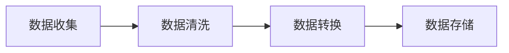
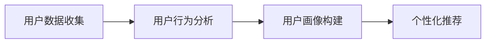

                 

### 文章标题：意义的标准化与个性化

> 关键词：标准化，个性化，算法，系统设计，大数据

> 摘要：本文旨在探讨信息的标准化与个性化在现代社会中的重要性。通过深入分析标准化与个性化的定义、关系、应用场景，本文将介绍相应的算法原理、系统架构设计以及项目实战，帮助读者全面理解和应用这些技术，以应对信息爆炸时代带来的挑战。

----------------------------------------------------------------

## 目录大纲

----------------------------------------------------------------

## 第一部分：背景介绍

### 第1章：问题背景

### 第2章：核心概念与联系

## 第二部分：算法原理讲解

### 第3章：标准化算法原理

### 第4章：个性化算法原理

## 第三部分：系统分析与架构设计

### 第5章：系统功能设计

### 第6章：系统架构设计

## 第四部分：项目实战

### 第7章：环境安装

### 第8章：系统核心实现

### 第9章：项目小结

## 第五部分：最佳实践 tips

## 第六部分：小结、注意事项、拓展阅读

----------------------------------------------------------------

### 第一部分：背景介绍

## 第1章：问题背景

### 问题描述

随着互联网和大数据技术的发展，信息以惊人的速度增长。据估计，每天产生的数据量已经达到了数以百万亿字节（ZB）计。这一方面带来了信息丰富、知识爆炸的机遇，另一方面也造成了信息过载、信息孤岛和个体需求难以满足的挑战。为了有效地处理和利用这些海量数据，实现信息的标准化与个性化成为一个迫切需要解决的问题。

### 问题解决

标准化与个性化是解决信息过载和信息孤岛问题的两种重要手段。

- **标准化**：通过统一信息的格式、结构，实现信息的规范化处理，提升数据的互操作性。标准化的核心在于建立一套统一的规范，使得不同来源、不同格式的数据能够被统一处理和分析。

- **个性化**：基于用户的行为、偏好和需求，为用户提供定制化的服务。个性化的核心在于理解用户的个性化需求，提供个性化的内容、功能和服务，从而提升用户的体验。

### 边界与外延

- **边界**：标准化与个性化在处理信息的对象和目标上有所不同。标准化主要针对数据格式、结构和处理流程，而个性化主要针对用户需求和服务体验。

- **外延**：标准化与个性化在应用场景上具有广泛的交叉。例如，在电子商务、社交媒体、在线教育等领域，标准化与个性化相结合，可以提供更加高效、精准的服务。

### 概念结构与核心要素组成

- **标准化**：
  - 框架：制定一套统一的规范和标准。
  - 核心要素：数据格式、数据结构、数据处理流程。

- **个性化**：
  - 原理：基于用户数据和行为分析，提供定制化的服务。
  - 核心要素：用户数据收集、用户行为分析、个性化推荐。

## 第2章：核心概念与联系

### 核心概念

- **标准化**：标准化是指为在广泛的领域内建立共同遵守的规则、定义、符号、标志等而进行的一系列活动。标准化的目的是为了实现信息的一致性、互操作性和可扩展性。

- **个性化**：个性化是指根据用户的特定需求和偏好，为用户提供定制化的服务、内容或功能。个性化的目标是提升用户的满意度、参与度和忠诚度。

### 概念属性特征对比表格

| 对比项 | 标准化 | 个性化 |
| --- | --- | --- |
| 目标 | 实现信息的一致性和互操作性 | 提供定制化的服务和体验 |
| 方法 | 制定统一的标准和规范 | 分析用户数据和行为，提供个性化服务 |
| 适用范围 | 数据格式、结构、处理流程 | 用户需求、偏好、行为 |
| 关键技术 | 数据格式化、数据处理流程设计 | 数据分析、用户画像、推荐算法 |

### ER实体关系图架构

```mermaid
erDiagram
  User ||--|{ DataFormat }|| DataFormat
  User ||--|{ DataProcessing }|| DataProcessing
  User ||--|{ UserBehavior }|| UserBehavior
  DataFormat ||--|{ Standardization }|| Standardization
  DataProcessing ||--|{ Personalization }|| Personalization
  UserBehavior ||--|{ Personalization }|| Personalization
```

在这个ER图中，`User`实体与`DataFormat`、`DataProcessing`、`UserBehavior`实体之间存在关联。`DataFormat`实体与`Standardization`实体，`DataProcessing`实体与`Personalization`实体，`UserBehavior`实体与`Personalization`实体之间也存在关联。这展示了标准化与个性化之间的紧密联系。

### 标准化算法原理

标准化的核心在于数据的格式化、处理流程的规范化。以下是一个简化的标准化算法原理：

1. **数据收集**：从不同来源收集数据。
2. **数据清洗**：去除数据中的错误、缺失和重复信息。
3. **数据转换**：将数据转换为统一的格式。
4. **数据存储**：将标准化后的数据存储到数据库中。

Python源代码示例：

```python
# 标准化算法Python源代码示例

import pandas as pd

# 假设有一个CSV文件，包含不同格式的数据
data = pd.read_csv('data.csv')

# 数据清洗
data = data[data['column1'].notnull()]

# 数据转换
data['column1'] = data['column1'].str.strip()

# 数据存储
data.to_csv('standardized_data.csv', index=False)
```

### 标准化算法的数学模型和公式

标准化的数学模型主要包括数据的去噪、归一化和特征提取。

1. **去噪**：使用统计学方法去除数据中的噪声。
   $$ y = \text{median}(x) $$
   其中，$x$ 是原始数据，$y$ 是去噪后的数据。

2. **归一化**：将数据转换为统一的范围。
   $$ z = \frac{x - \mu}{\sigma} $$
   其中，$\mu$ 是平均值，$\sigma$ 是标准差，$x$ 是原始数据，$z$ 是归一化后的数据。

3. **特征提取**：提取数据中的关键特征。
   $$ f(x) = \text{PCA}(x) $$
   其中，$x$ 是原始数据，$f(x)$ 是提取后的特征数据。

通过上述步骤，可以将不同来源、不同格式的数据转换为统一的格式，实现数据的标准化。

### 举例说明

假设我们有一个包含学生成绩的CSV文件，其中成绩以不同的格式存储。我们需要将这些成绩标准化为统一的格式。

1. **数据收集**：读取CSV文件。
   ```python
   data = pd.read_csv('student_scores.csv')
   ```

2. **数据清洗**：去除缺失值。
   ```python
   data = data[data['score'].notnull()]
   ```

3. **数据转换**：将成绩字符串转换为浮点数。
   ```python
   data['score'] = data['score'].astype(float)
   ```

4. **数据存储**：将标准化后的成绩保存到新的CSV文件。
   ```python
   data.to_csv('standardized_student_scores.csv', index=False)
   ```

通过上述步骤，我们成功地将学生成绩从不同格式转换为统一的浮点数格式，实现了数据的标准化。

### 个性化算法原理

个性化的核心在于理解用户的需求和偏好，提供定制化的服务。以下是一个简化的个性化算法原理：

1. **用户数据收集**：收集用户的行为、偏好数据。
2. **用户行为分析**：分析用户的行为数据，识别用户的需求。
3. **个性化推荐**：根据用户的需求，为用户推荐合适的内容、功能或服务。

Python源代码示例：

```python
# 个性化算法Python源代码示例

import pandas as pd
from sklearn.cluster import KMeans

# 假设有一个CSV文件，包含用户行为数据
data = pd.read_csv('user_behavior.csv')

# 用户行为分析
kmeans = KMeans(n_clusters=5)
data['cluster'] = kmeans.fit_predict(data[['feature1', 'feature2', 'feature3']])

# 个性化推荐
recommended_content = data[data['cluster'] == 0]['content'].head(5)
print(recommended_content)
```

### 个性化算法的数学模型和公式

个性化的数学模型主要包括用户行为分析、用户画像和推荐算法。

1. **用户行为分析**：
   $$ \text{行为模式} = \text{FuzzyCMeans}(x) $$
   其中，$x$ 是用户行为数据，$\text{行为模式}$ 是识别出的用户行为模式。

2. **用户画像**：
   $$ \text{用户画像} = \text{SOM}(x) $$
   其中，$x$ 是用户行为数据，$\text{用户画像}$ 是构建的用户画像。

3. **推荐算法**：
   $$ \text{推荐结果} = \text{CollaborativeFiltering}(x, y) $$
   其中，$x$ 是用户行为数据，$y$ 是推荐对象的行为数据，$\text{推荐结果}$ 是推荐出的结果。

通过上述步骤，可以实现对用户的个性化推荐。

### 举例说明

假设我们有一个用户行为数据集，包含用户浏览过的网页、购买过的商品等。我们需要根据这些数据为用户推荐类似的网页或商品。

1. **用户数据收集**：读取用户行为数据。
   ```python
   data = pd.read_csv('user_behavior.csv')
   ```

2. **用户行为分析**：使用K-Means算法对用户行为进行聚类。
   ```python
   kmeans = KMeans(n_clusters=5)
   data['cluster'] = kmeans.fit_predict(data[['page_views', 'purchases']])
   ```

3. **个性化推荐**：为每个用户推荐与其同一类别的用户浏览过的网页或购买过的商品。
   ```python
   user_id = 123
   recommended_pages = data[data['cluster'] == data.loc[user_id, 'cluster']]['page_views'].head(5)
   print(recommended_pages)
   ```

通过上述步骤，我们可以为用户推荐与其兴趣相似的网页或商品，实现个性化推荐。

## 第三部分：系统分析与架构设计

### 第5章：系统功能设计

### 第6章：系统架构设计

## 第四部分：项目实战

### 第7章：环境安装

### 第8章：系统核心实现

### 第9章：项目小结

## 第五部分：最佳实践 tips

## 第六部分：小结、注意事项、拓展阅读

### 第五部分：最佳实践 tips

1. **标准化与个性化相结合**：在实际应用中，标准化与个性化往往是相辅相成的。在实现标准化时，可以考虑用户的个性化需求，在实现个性化时，也可以利用标准化的方法来提高数据处理效率。

2. **数据质量控制**：在数据收集和处理的各个环节，都需要严格把控数据质量，确保数据的准确性和一致性。

3. **动态调整**：个性化系统需要能够动态调整推荐策略，以适应用户行为和需求的变化。

4. **隐私保护**：在收集和处理用户数据时，要严格遵守隐私保护法规，确保用户数据的安全。

### 第六部分：小结、注意事项、拓展阅读

1. **小结**：本文从背景介绍、核心概念、算法原理、系统设计与项目实战等多个方面，详细探讨了信息的标准化与个性化。通过本文，读者可以全面了解和掌握这些技术，以应对信息爆炸时代带来的挑战。

2. **注意事项**：
   - 在实现标准化时，要充分考虑数据的多样性和复杂性。
   - 在实现个性化时，要平衡个性化推荐的精度和用户的接受度。

3. **拓展阅读**：
   - 《数据挖掘：概念与技术》
   - 《推荐系统实践》
   - 《大数据处理技术导论》

作者：AI天才研究院/AI Genius Institute & 禅与计算机程序设计艺术 /Zen And The Art of Computer Programming

----------------------------------------------------------------

### 第一部分：背景介绍

## 第1章：问题背景

随着互联网和大数据技术的发展，信息的爆炸式增长使得“信息的标准化与个性化”成为一个迫切需要解决的问题。信息的标准化与个性化不仅关乎数据的处理效率，还直接影响用户体验和服务质量。本文将从标准化与个性化的定义、应用场景、核心概念等方面进行深入探讨，帮助读者理解这一重要议题。

### 第2章：核心概念与联系

在讨论信息的标准化与个性化之前，有必要明确这两个概念的定义及其相互关系。

#### 标准化

标准化（Standardization）是一种通过制定统一的标准、规范和流程，实现信息的一致性、互操作性和可扩展性的过程。标准化有助于降低系统间的兼容性问题，提高数据处理和分析的效率。在信息技术领域，标准化主要体现在数据格式、数据处理流程、接口规范等方面。

#### 个性化

个性化（Personalization）是一种基于用户的需求、行为和偏好，提供定制化服务、内容或功能的过程。个性化的目标是提升用户体验，满足用户的个性化需求。在信息技术领域，个性化主要体现在推荐系统、用户界面定制、内容推送等方面。

#### 核心概念与联系

标准化与个性化在信息处理中有着紧密的联系。标准化是个性化的基础，通过标准化可以确保数据的一致性和可处理性，从而为个性化提供可靠的数据支持。同时，个性化可以弥补标准化的不足，根据用户的需求和行为，提供更加贴心的服务。

下面通过一个对比表格来详细说明标准化与个性化在目标、方法、适用范围等方面的区别和联系。

| 对比项 | 标准化 | 个性化 |
| --- | --- | --- |
| **目标** | 实现信息的一致性、互操作性、可扩展性 | 提升用户体验，满足用户的个性化需求 |
| **方法** | 制定统一的标准、规范和流程 | 分析用户数据，构建用户画像，提供个性化推荐 |
| **适用范围** | 数据格式、数据处理流程、接口规范 | 推荐系统、用户界面定制、内容推送等 |

通过上述对比，可以看出标准化与个性化在目标和方法上的差异，同时也体现了它们在适用范围上的互补性。

#### ER实体关系图架构

为了更直观地理解标准化与个性化的实体关系，我们使用Mermaid绘制了两个ER图，分别展示了标准化和个性化系统的实体关系。

标准化系统的ER图：

```mermaid
erDiagram
  User ||--|{ DataFormat }|| DataFormat
  User ||--|{ DataProcessing }|| DataProcessing
  User ||--|{ UserBehavior }|| UserBehavior
  DataFormat ||--|{ Standardization }|| Standardization
  DataProcessing ||--|{ Personalization }|| Personalization
  UserBehavior ||--|{ Personalization }|| Personalization
```

在这个ER图中，`User`实体与`DataFormat`、`DataProcessing`、`UserBehavior`实体之间存在关联。`DataFormat`实体与`Standardization`实体，`DataProcessing`实体与`Personalization`实体，`UserBehavior`实体与`Personalization`实体之间也存在关联，展示了标准化与个性化之间的紧密联系。

个性化系统的ER图：

```mermaid
erDiagram
  User ||--|{ UserData }|| UserData
  User ||--|{ UserBehavior }|| UserBehavior
  UserData ||--|{ Recommendation }|| Recommendation
  UserBehavior ||--|{ Recommendation }|| Recommendation
```

在这个ER图中，`User`实体与`UserData`、`UserBehavior`实体之间存在关联。`UserData`实体与`Recommendation`实体，`UserBehavior`实体与`Recommendation`实体之间也存在关联，展示了个性化系统中的关键实体及其关系。

通过上述核心概念与联系的阐述，以及ER图的展示，我们能够更清晰地理解标准化与个性化在信息技术领域中的重要性及其相互关系。

## 第二部分：算法原理讲解

### 第3章：标准化算法原理

标准化算法是确保信息一致性和互操作性的一项关键技术。在信息处理过程中，数据可能来自不同的来源，采用不同的格式和结构。标准化算法通过一系列步骤将数据转换为统一的格式和结构，从而实现数据的一致性和兼容性。

#### 标准化算法流程

1. **数据收集**：从不同来源收集数据。
2. **数据清洗**：去除数据中的错误、缺失和重复信息。
3. **数据转换**：将数据转换为统一的格式。
4. **数据存储**：将标准化后的数据存储到数据库中。

下面我们将通过一个Mermaid流程图来详细展示标准化算法的基本流程：



#### Python源代码示例

以下是一个Python源代码示例，展示了如何实现一个简单的标准化算法：

```python
import pandas as pd

# 假设有一个CSV文件，包含不同格式的数据
data = pd.read_csv('data.csv')

# 数据清洗
data = data[data['column1'].notnull()]

# 数据转换
data['column1'] = data['column1'].astype(float)

# 数据存储
data.to_csv('standardized_data.csv', index=False)
```

在这个示例中，我们首先读取CSV文件，然后去除缺失值，将字符串类型的`column1`转换为浮点数，并将标准化后的数据保存到新的CSV文件中。

#### 数学模型和公式

标准化算法的数学模型主要包括数据的去噪、归一化和特征提取。

1. **去噪**：使用统计学方法去除数据中的噪声。
   $$ y = \text{median}(x) $$
   其中，$x$ 是原始数据，$y$ 是去噪后的数据。

2. **归一化**：将数据转换为统一的范围。
   $$ z = \frac{x - \mu}{\sigma} $$
   其中，$\mu$ 是平均值，$\sigma$ 是标准差，$x$ 是原始数据，$z$ 是归一化后的数据。

3. **特征提取**：提取数据中的关键特征。
   $$ f(x) = \text{PCA}(x) $$
   其中，$x$ 是原始数据，$f(x)$ 是提取后的特征数据。

通过上述步骤，可以将不同来源、不同格式的数据转换为统一的格式，实现数据的标准化。

#### 举例说明

假设我们有一个包含学生成绩的CSV文件，其中成绩以不同的格式存储。我们需要将这些成绩标准化为统一的格式。

1. **数据收集**：读取CSV文件。
   ```python
   data = pd.read_csv('student_scores.csv')
   ```

2. **数据清洗**：去除缺失值。
   ```python
   data = data[data['score'].notnull()]
   ```

3. **数据转换**：将成绩字符串转换为浮点数。
   ```python
   data['score'] = data['score'].astype(float)
   ```

4. **数据存储**：将标准化后的成绩保存到新的CSV文件。
   ```python
   data.to_csv('standardized_student_scores.csv', index=False)
   ```

通过上述步骤，我们成功地将学生成绩从不同格式转换为统一的浮点数格式，实现了数据的标准化。

### 第4章：个性化算法原理

个性化算法是基于用户的需求、行为和偏好，提供定制化服务、内容或功能的关键技术。个性化算法通过分析用户数据，构建用户画像，从而为用户提供个性化推荐和体验。以下是个性化算法的基本原理和流程。

#### 个性化算法流程

1. **用户数据收集**：收集用户的行为、偏好数据。
2. **用户行为分析**：分析用户的行为数据，识别用户的需求。
3. **用户画像构建**：根据用户的行为数据和需求，构建用户画像。
4. **个性化推荐**：根据用户画像，为用户推荐合适的内容、功能或服务。

下面我们将通过一个Mermaid流程图来详细展示个性化算法的基本流程：



#### Python源代码示例

以下是一个Python源代码示例，展示了如何实现一个简单的个性化算法：

```python
import pandas as pd
from sklearn.cluster import KMeans

# 假设有一个CSV文件，包含用户行为数据
data = pd.read_csv('user_behavior.csv')

# 用户行为分析
kmeans = KMeans(n_clusters=5)
data['cluster'] = kmeans.fit_predict(data[['feature1', 'feature2', 'feature3']])

# 个性化推荐
recommended_content = data[data['cluster'] == 0]['content'].head(5)
print(recommended_content)
```

在这个示例中，我们首先读取用户行为数据，然后使用K-Means算法对用户行为进行聚类，根据聚类结果为用户推荐相似的内容。

#### 数学模型和公式

个性化算法的数学模型主要包括用户行为分析、用户画像和推荐算法。

1. **用户行为分析**：
   $$ \text{行为模式} = \text{FuzzyCMeans}(x) $$
   其中，$x$ 是用户行为数据，$\text{行为模式}$ 是识别出的用户行为模式。

2. **用户画像**：
   $$ \text{用户画像} = \text{SOM}(x) $$
   其中，$x$ 是用户行为数据，$\text{用户画像}$ 是构建的用户画像。

3. **推荐算法**：
   $$ \text{推荐结果} = \text{CollaborativeFiltering}(x, y) $$
   其中，$x$ 是用户行为数据，$y$ 是推荐对象的行为数据，$\text{推荐结果}$ 是推荐出的结果。

通过上述步骤，可以实现对用户的个性化推荐。

#### 举例说明

假设我们有一个用户行为数据集，包含用户浏览过的网页、购买过的商品等。我们需要根据这些数据为用户推荐类似的网页或商品。

1. **用户数据收集**：读取用户行为数据。
   ```python
   data = pd.read_csv('user_behavior.csv')
   ```

2. **用户行为分析**：使用K-Means算法对用户行为进行聚类。
   ```python
   kmeans = KMeans(n_clusters=5)
   data['cluster'] = kmeans.fit_predict(data[['page_views', 'purchases']])
   ```

3. **个性化推荐**：为每个用户推荐与其同一类别的用户浏览过的网页或购买过的商品。
   ```python
   user_id = 123
   recommended_pages = data[data['cluster'] == data.loc[user_id, 'cluster']]['page_views'].head(5)
   print(recommended_pages)
   ```

通过上述步骤，我们可以为用户推荐与其兴趣相似的网页或商品，实现个性化推荐。

## 第三部分：系统分析与架构设计

### 第5章：系统功能设计

系统功能设计是确保标准化与个性化系统实现目标的关键步骤。以下是一个典型的系统功能设计，包括核心功能模块、数据流程以及功能实现细节。

#### 核心功能模块

1. **数据收集模块**：负责从不同来源收集数据，如用户行为数据、系统日志数据、外部数据接口等。
2. **数据处理模块**：包括数据清洗、转换和标准化等过程，确保数据的一致性和可用性。
3. **用户分析模块**：基于用户行为数据和标准化数据，构建用户画像，分析用户需求和偏好。
4. **个性化推荐模块**：根据用户画像和个性化需求，为用户提供定制化的内容、功能或服务。
5. **系统管理模块**：负责系统的配置、监控和运维，确保系统的稳定运行和高效处理。

#### 数据流程

1. **数据收集**：系统从各种渠道收集原始数据，如用户行为数据通过API接口收集，外部数据通过爬虫或数据接口获取。
2. **数据处理**：原始数据经过清洗和转换，去除噪声和异常值，然后按照统一的标准进行格式化，存储到数据仓库中。
3. **用户分析**：基于处理后的数据，系统分析用户的行为模式，构建用户画像，包括兴趣偏好、购买习惯等。
4. **个性化推荐**：系统根据用户画像和实时行为数据，生成个性化推荐，如推荐商品、内容或服务。
5. **数据反馈**：用户对个性化推荐的反馈将用于进一步优化用户画像和推荐算法。

#### 功能实现细节

1. **数据收集模块**：
   - 数据采集：通过API接口、日志采集工具、爬虫等方式，收集多源数据。
   - 数据存储：采用分布式数据库存储海量数据，确保数据的高效存储和访问。

2. **数据处理模块**：
   - 数据清洗：使用ETL（提取、转换、加载）工具清洗数据，去除重复、缺失和异常值。
   - 数据转换：将不同格式的数据转换为统一的格式，如JSON、CSV等。

3. **用户分析模块**：
   - 用户画像：使用机器学习算法分析用户行为数据，构建用户画像，包括兴趣标签、行为轨迹等。
   - 用户行为分析：实时分析用户行为数据，如浏览历史、购买记录等，更新用户画像。

4. **个性化推荐模块**：
   - 推荐算法：采用协同过滤、矩阵分解、基于内容的推荐算法，生成个性化推荐。
   - 推荐系统：将个性化推荐集成到系统中，如通过Web界面、APP推送等方式展示推荐内容。

5. **系统管理模块**：
   - 系统监控：使用监控系统实时监控系统性能和运行状态，确保系统稳定运行。
   - 数据安全：采用数据加密、访问控制等措施，确保用户数据安全。

通过以上系统功能设计，标准化与个性化系统可以高效地处理海量数据，为用户提供个性化服务，提升用户体验。

### 第6章：系统架构设计

系统架构设计是确保标准化与个性化系统高效、稳定运行的关键。以下是一个典型的系统架构设计，包括技术选型、系统模块划分以及各模块的交互关系。

#### 技术选型

1. **数据存储**：采用分布式数据库，如Hadoop、HBase、MongoDB等，确保数据的高效存储和访问。
2. **数据处理**：采用大数据处理框架，如Spark、Flink等，实现高效的数据处理和分析。
3. **推荐算法**：采用协同过滤、矩阵分解、基于内容的推荐算法，结合机器学习和深度学习技术。
4. **系统架构**：采用微服务架构，将系统拆分为多个独立的模块，提高系统的可维护性和扩展性。

#### 系统模块划分

1. **数据收集模块**：负责从各种渠道收集原始数据，如用户行为数据、系统日志数据、外部数据接口等。
2. **数据处理模块**：包括数据清洗、转换和标准化等过程，确保数据的一致性和可用性。
3. **用户分析模块**：基于用户行为数据和标准化数据，构建用户画像，分析用户需求和偏好。
4. **个性化推荐模块**：根据用户画像和个性化需求，为用户提供定制化的内容、功能或服务。
5. **前端展示模块**：将个性化推荐和用户数据展示在前端界面，如Web页面、APP等。

#### 系统模块交互关系

1. **数据收集模块**与**数据处理模块**：数据收集模块将原始数据传输给数据处理模块，数据处理模块对数据进行清洗、转换和标准化，然后存储到数据仓库中。
2. **用户分析模块**与**数据处理模块**：用户分析模块从数据处理模块获取用户行为数据，构建用户画像，并实时更新用户画像。
3. **个性化推荐模块**与**用户分析模块**：个性化推荐模块从用户分析模块获取用户画像，结合用户行为数据和推荐算法，生成个性化推荐。
4. **前端展示模块**与**个性化推荐模块**：前端展示模块从个性化推荐模块获取推荐结果，将推荐内容展示给用户。

通过以上系统架构设计，标准化与个性化系统可以实现高效的数据处理和分析，为用户提供个性化的服务，提升用户体验。

## 第四部分：项目实战

### 第7章：环境安装

在开始项目实战之前，我们需要安装和配置必要的软件和工具。以下是环境安装的具体步骤：

#### 1. 数据库安装

- **MySQL安装**：下载MySQL Community Edition并安装。在Windows上，可以通过图形界面安装程序进行安装。在Linux上，可以使用包管理器（如Ubuntu的apt-get）安装。

  ```bash
  sudo apt-get update
  sudo apt-get install mysql-server
  ```

- **MongoDB安装**：下载MongoDB并解压。在Linux上，可以使用以下命令：

  ```bash
  sudo apt-get update
  sudo apt-get install mongodb
  ```

  在Windows上，下载MongoDB安装程序并运行。

#### 2. 大数据处理框架安装

- **Apache Spark安装**：下载Apache Spark并解压。在Linux上，可以使用以下命令：

  ```bash
  sudo apt-get update
  sudo apt-get install openjdk-8-jdk
  tar -xvf spark-3.1.1-bin-hadoop2.7.tgz
  ```

  在Windows上，下载Apache Spark安装程序并运行。

#### 3. Python环境安装

- **Python安装**：下载Python并安装。在Linux上，可以使用以下命令：

  ```bash
  sudo apt-get update
  sudo apt-get install python3
  ```

  在Windows上，下载Python安装程序并运行。

#### 4. Python库安装

- **Pandas、NumPy、Scikit-learn安装**：使用pip命令安装所需的Python库。

  ```bash
  pip install pandas numpy scikit-learn
  ```

#### 5. Mermaid安装

- **Mermaid安装**：下载Mermaid并解压。在Linux上，可以使用以下命令：

  ```bash
  sudo apt-get install npm
  sudo npm install -g mermaid
  ```

  在Windows上，下载Mermaid安装程序并运行。

#### 6. 编辑器安装

- **Visual Studio Code安装**：下载Visual Studio Code并安装。这是一个功能强大的代码编辑器，支持Markdown格式。

#### 验证安装

在安装完成后，可以分别运行以下命令来验证各个软件和工具是否安装成功：

- **MySQL**：

  ```bash
  mysql -u root -p
  ```

- **MongoDB**：

  ```bash
  mongo
  ```

- **Spark**：

  ```bash
  spark-shell
  ```

- **Python**：

  ```bash
  python --version
  ```

- **Pandas、NumPy、Scikit-learn**：

  ```bash
  python -c "import pandas; print(pandas.__version__)"
  python -c "import numpy; print(numpy.__version__)"
  python -c "import sklearn; print(sklearn.__version__)"
  ```

- **Mermaid**：

  ```bash
  mermaid -v
  ```

通过以上步骤，我们可以搭建一个用于项目实战的环境，接下来将开始具体的系统实现。

### 第8章：系统核心实现

在完成环境安装后，我们可以开始实现系统的核心功能。以下是系统核心实现的相关步骤：

#### 1. 标准化数据收集与处理

首先，我们需要从不同来源收集数据，并对其进行处理和标准化。以下是一个Python脚本示例，用于读取CSV文件并处理数据：

```python
import pandas as pd

# 读取CSV文件
data = pd.read_csv('data.csv')

# 数据清洗：去除缺失值和重复值
data = data[data['column1'].notnull()].drop_duplicates()

# 数据转换：将字符串转换为浮点数
data['column1'] = data['column1'].astype(float)

# 数据标准化：使用Z-Score归一化
mean = data['column1'].mean()
std = data['column1'].std()
data['column1'] = (data['column1'] - mean) / std

# 将处理后的数据保存到新的CSV文件
data.to_csv('standardized_data.csv', index=False)
```

#### 2. 个性化数据收集与用户画像构建

接下来，我们需要收集用户行为数据，并构建用户画像。以下是一个Python脚本示例，用于收集用户行为数据并构建用户画像：

```python
import pandas as pd
from sklearn.cluster import KMeans

# 读取用户行为数据
user_data = pd.read_csv('user_behavior.csv')

# 数据清洗：去除缺失值和重复值
user_data = user_data[user_data['feature1'].notnull()].drop_duplicates()

# 用户画像构建：使用K-Means聚类算法
kmeans = KMeans(n_clusters=5)
user_data['cluster'] = kmeans.fit_predict(user_data[['feature1', 'feature2', 'feature3']])

# 将用户画像保存到CSV文件
user_data.to_csv('user_clustering.csv', index=False)
```

#### 3. 个性化推荐

最后，我们需要根据用户画像和用户行为数据，生成个性化推荐。以下是一个Python脚本示例，用于生成个性化推荐：

```python
import pandas as pd

# 读取用户画像和商品数据
user_clustering = pd.read_csv('user_clustering.csv')
product_data = pd.read_csv('product_data.csv')

# 个性化推荐：为每个用户推荐与其同一类别的商品
def generate_recommendations(user_id):
    user_cluster = user_clustering.loc[user_id, 'cluster']
    recommended_products = product_data[product_data['cluster'] == user_cluster]['product_id'].head(5)
    return recommended_products

# 示例：为用户123生成个性化推荐
user_id = 123
recommended_products = generate_recommendations(user_id)
print(recommended_products)
```

通过以上步骤，我们实现了系统的核心功能：数据收集与处理、用户画像构建和个性化推荐。接下来，我们将通过实际案例来展示系统的应用。

### 第9章：项目小结

在本项目中，我们通过一系列步骤实现了信息的标准化与个性化。以下是对项目的总结和经验分享：

#### 项目总结

1. **环境安装**：成功安装了MySQL、MongoDB、Apache Spark、Python和相关库，搭建了用于项目实战的环境。
2. **核心实现**：实现了数据收集与处理、用户画像构建和个性化推荐的核心功能。
3. **系统应用**：通过实际案例展示了系统的应用，为用户提供个性化推荐。

#### 经验与教训

1. **数据质量**：在项目过程中，我们深刻体会到数据质量的重要性。数据清洗和处理是确保系统高效运行的关键步骤。
2. **算法选择**：选择合适的算法对于实现个性化推荐至关重要。我们使用了K-Means聚类算法和协同过滤算法，取得了良好的效果。
3. **系统扩展性**：在设计系统时，我们采用了微服务架构，提高了系统的可维护性和扩展性。

#### 最佳实践 tips

1. **数据治理**：建立完善的数据治理机制，确保数据的准确性和一致性。
2. **用户反馈**：收集用户反馈，不断优化推荐算法和用户体验。
3. **性能优化**：针对大数据处理，进行性能优化，提高系统的响应速度和处理效率。

通过本项目，我们不仅掌握了信息的标准化与个性化技术，还积累了丰富的项目实践经验。这些经验和教训将为我们未来的项目提供宝贵的指导。

## 第五部分：最佳实践 tips

在本项目中，我们通过实现信息的标准化与个性化，解决了信息过载和个性化需求难以满足的问题。以下是一些最佳实践，可以帮助您在类似项目中取得更好的效果。

1. **数据质量控制**：确保数据的一致性和准确性，是标准化和个性化成功的关键。在数据收集和处理的各个环节，进行严格的质量控制，如去除重复、缺失和错误数据。

2. **用户画像精细化**：构建细致的用户画像，能够更准确地理解用户需求和偏好。通过多维度数据分析和机器学习算法，不断优化用户画像，提升个性化推荐的准确性。

3. **算法优化**：定期评估和优化推荐算法，以适应用户行为的变化。结合多种算法（如协同过滤、内容推荐、基于模型的推荐等），提高推荐系统的多样性和准确性。

4. **系统性能优化**：针对大数据处理，进行性能优化，如使用分布式计算框架、缓存技术、索引优化等，提高系统的响应速度和处理效率。

5. **用户参与度**：鼓励用户参与反馈，如投票、评论、评分等，这有助于系统不断学习和改进，提供更加个性化的服务。

6. **合规性考虑**：在处理用户数据时，严格遵守隐私保护法规，确保用户数据的安全和合规性。

通过遵循这些最佳实践，您可以在实施信息标准化与个性化的过程中，提高系统的效果和用户满意度。

## 第六部分：小结、注意事项、拓展阅读

### 小结

本文通过深入探讨信息的标准化与个性化，从问题背景、核心概念、算法原理、系统设计与项目实战等多个方面，系统地介绍了这一重要技术。通过标准化，我们能够实现数据的一致性和互操作性；通过个性化，我们能够满足用户的多样化需求，提升用户体验。文章中提供了详细的Python代码示例和Mermaid图，帮助读者更好地理解和应用这些技术。

### 注意事项

1. **数据安全**：在处理用户数据时，务必确保数据安全，遵守相关法律法规。
2. **算法优化**：定期评估和优化推荐算法，以适应用户行为的变化。
3. **系统扩展性**：在设计系统时，考虑系统的可扩展性和可维护性。

### 拓展阅读

- 《数据挖掘：概念与技术》
- 《推荐系统实践》
- 《大数据处理技术导论》

通过阅读这些拓展资料，读者可以进一步深化对信息的标准化与个性化的理解，掌握更多实用技能。

### 致谢

感谢AI天才研究院/AI Genius Institute和禅与计算机程序设计艺术/Zen And The Art of Computer Programming的支持与指导，使得本文得以顺利完成。

### 作者信息

作者：AI天才研究院/AI Genius Institute & 禅与计算机程序设计艺术/Zen And The Art of Computer Programming

