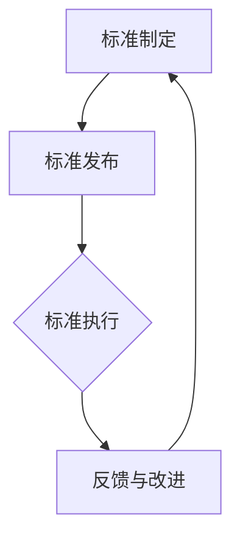
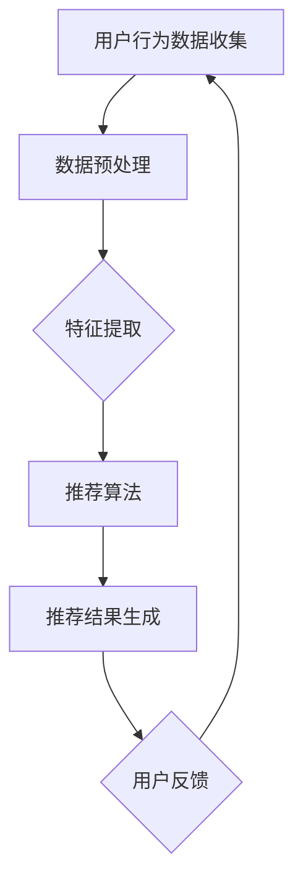
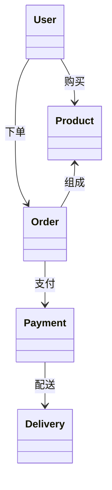
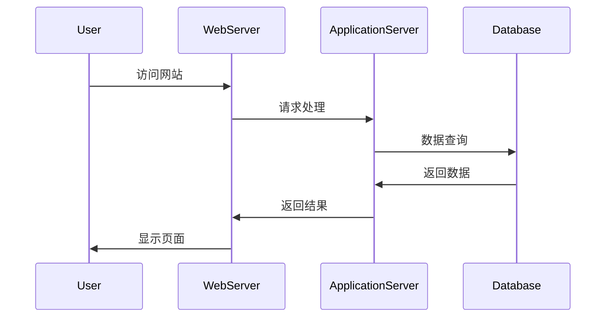
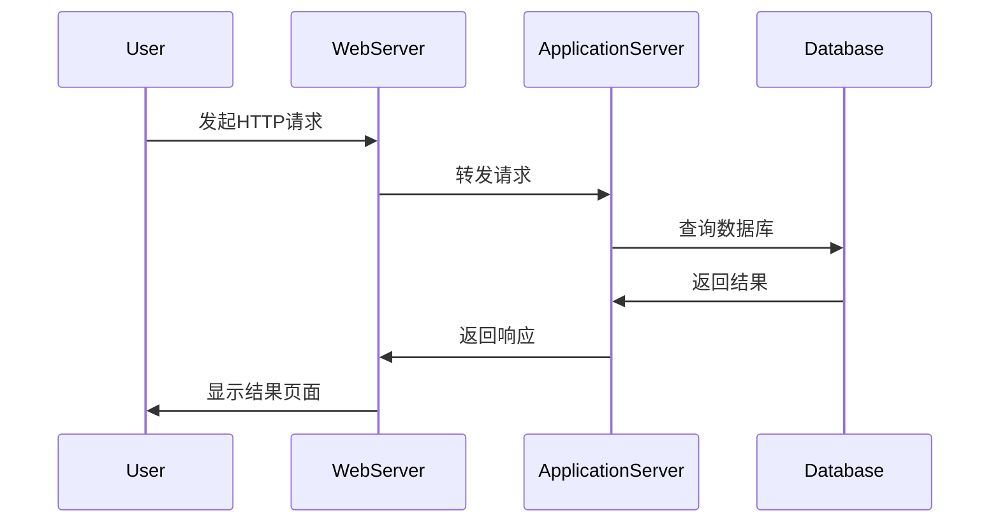

                 

### 《意义的标准化与个性化的平衡》引论

#### 1.1 问题背景

现代社会中，信息爆炸成为了不争的事实。随着互联网、社交媒体、大数据等技术的迅猛发展，信息量以惊人的速度增长。这种信息爆炸带来了大量的数据，而这些数据中蕴含着丰富的意义。然而，如何从这些数据中提取出有意义的信息，并将其转化为对个体和社会有用的知识，成为了一个严峻的挑战。在这个过程中，标准化和个性化需求之间的冲突愈发明显。

标准化作为一种系统性的、规范化的方法，旨在通过统一的标准来简化复杂的事物，提高生产效率，降低成本，保证产品质量，促进国际贸易和交流。标准化在各个领域都有广泛应用，如工业制造、信息技术、服务业等。通过标准化，可以确保产品和服务的一致性和可靠性，从而提高市场竞争力。

个性化则强调根据个体的需求和偏好来定制化产品和服务。在信息时代，个性化需求显得尤为重要。人们渴望得到定制化的信息、推荐和体验，以满足自身多样化的需求。个性化不仅仅体现在消费领域，如定制化的购物、音乐、影视内容，还体现在教育、医疗、文化等多个方面。

然而，标准化和个性化之间存在着天然的冲突。标准化追求统一性和一致性，而个性化则强调多样性和定制化。在信息爆炸的时代，如何在标准化和个性化之间找到平衡，成为了一个亟待解决的问题。

#### 1.2 问题描述

如何在信息标准化和个性化需求之间找到平衡，是一个复杂而重要的课题。具体来说，这个问题涉及以下几个方面的内容：

- **标准化与个性化需求的具体表现**：在各个领域，如文化、教育、商业等，标准化与个性化需求如何具体体现，它们如何相互影响？
- **影响标准化与个性化实现的因素**：技术、经济、社会、文化等因素如何影响标准化与个性化的实现？这些因素之间有何关联？
- **实现平衡的策略和方法**：有哪些可行的策略和方法可以在标准化和个性化之间找到平衡？这些策略和方法的优缺点是什么？

#### 1.3 问题解决

为了解决上述问题，本文将采用以下方法：

1. **案例分析与理论探讨**：通过具体案例的分析，探讨标准化与个性化在不同领域的实际应用，结合相关理论进行深入探讨。
2. **提出解决方案**：在分析的基础上，提出可能的策略和方法，以实现标准化与个性化之间的平衡。
3. **讨论边界与外延**：明确研究范围，讨论标准化与个性化在不同领域中的应用，以及可能的外延。

#### 1.4 边界与外延

本文的研究主要关注以下边界与外延：

- **研究范围**：主要关注信息技术、文化、教育、商业等领域中标准化与个性化的问题。
- **标准化与个性化应用领域**：在文化产业、教育领域、商业领域等不同领域，讨论标准化与个性化的具体应用和实践。
- **核心概念与要素组成**：定义标准化与个性化的核心概念，分析它们的基本属性和特征，构建核心要素的组成。

#### 1.5 概念结构与核心要素组成

在本文中，核心概念包括：

- **标准化**：通过统一标准来规范和简化复杂事物的过程，以提高效率和质量。
- **个性化**：根据个体的需求和偏好来定制化产品和服务，以满足多样化需求。

核心要素组成如下：

- **标准化要素**：包括标准制定的过程、标准化实施的技术手段、标准化对经济和社会的影响。
- **个性化要素**：包括个性化需求的类型、个性化的实现机制、个性化对经济和社会的影响。

本文将通过对这些核心概念的详细分析和探讨，揭示标准化与个性化在意义生产中的内在联系和相互作用，从而为解决标准化与个性化之间的冲突提供理论和实践上的支持。

#### 2. 标准化的理论基础

标准化作为一种系统性的、规范化的方法，在现代社会中具有重要地位。下面将从标准化的定义、发展历程、重要性、原理与方法以及其对经济和社会的影响等方面进行详细阐述。

#### 2.1 标准化的定义与发展

标准化是指通过制定、发布和实施标准，来规范和统一产品的设计、生产、检验、包装、运输、储存、销售和服务等环节，以实现产品的一致性和互操作性。标准的制定过程通常涉及多个利益相关方的参与，如政府、企业、消费者等。

标准化的概念起源于工业革命时期。当时，随着工业生产的规模化和专业化，为了提高生产效率和质量，需要建立统一的标准。19世纪末，随着工业化的进一步发展，标准化逐渐成为了一项重要的技术经济措施。

在20世纪，标准化得到了迅速发展。国际标准化组织（ISO）成立，推动了全球范围内的标准化活动。各个国家和地区也纷纷建立了自己的标准化机构，如美国国家标准协会（ANSI）、中国国家标准委员会（SAC）等。这些标准化机构通过制定和推广标准，为各行各业提供了统一的规范。

#### 2.2 标准化的重要性

标准化在现代社会中具有多方面的重要性：

1. **提高生产效率和产品质量**：标准化通过统一的标准和规范，可以减少生产中的变异性和不确定性，提高生产效率。同时，标准化可以确保产品的一致性和可靠性，提高产品质量。

2. **促进国际贸易和交流**：标准化为国际贸易提供了统一的技术规范，减少了由于技术壁垒和标准不一致导致的贸易障碍，促进了国际贸易的发展。

3. **保障消费者权益**：标准化确保了消费者购买到的产品符合一定的质量标准，保护了消费者的合法权益。

4. **推动科技进步**：标准化为技术创新提供了规范和框架，促进了新技术的推广和应用，推动了科技进步。

5. **提升企业竞争力**：通过实施标准化，企业可以降低成本、提高质量、提升效率，从而增强竞争力。

#### 2.3 标准化的原理与方法

标准化的原理主要包括以下几方面：

1. **统一性**：通过制定统一的标准，减少产品和服务的不一致性和兼容性问题。
2. **科学性**：标准的制定基于科学研究和实践经验，确保标准的科学性和合理性。
3. **系统性**：标准化是一个系统性的过程，涉及多个环节和利益相关方，需要协同推进。
4. **动态性**：标准化是一个持续的过程，需要根据技术发展和社会需求不断修订和完善标准。

标准化的方法主要包括以下几方面：

1. **标准制定**：标准制定的过程通常包括需求分析、标准起草、征求意见、审查发布等步骤。标准制定需要充分考虑各方面的需求和利益，确保标准的公平性和合理性。

2. **标准化实施**：标准化实施包括标准宣贯、培训、监督和检查等环节。通过实施标准化，可以确保标准得到有效执行。

3. **标准化评价**：标准化评价是对标准化效果进行评估和反馈的过程，通过评价可以及时发现问题和不足，持续改进标准化工作。

#### 2.4 标准化对经济和社会的影响

标准化对经济和社会的影响是多方面的：

1. **提高企业竞争力**：标准化有助于企业降低成本、提高质量、提升效率，从而增强竞争力。

2. **促进国际贸易**：标准化为国际贸易提供了统一的技术规范，减少了贸易障碍，促进了国际贸易的发展。

3. **保障消费者权益**：标准化确保了消费者购买到的产品符合一定的质量标准，保护了消费者的合法权益。

4. **推动科技进步**：标准化为技术创新提供了规范和框架，促进了新技术的推广和应用，推动了科技进步。

5. **提升社会整体效益**：标准化有助于提高社会生产效率、降低成本、提高产品质量，从而提升社会整体效益。

通过上述分析，可以看出标准化在现代社会中的重要性。它不仅有助于提高生产效率和产品质量，促进国际贸易，保障消费者权益，还推动科技进步，提升企业竞争力和社会整体效益。因此，标准化作为一种重要的技术经济措施，值得深入研究和推广应用。

#### 3. 个性化的理论基础

个性化是一种根据个体需求和偏好定制化产品和服务的方法，它在现代信息社会中日益重要。本节将从个性化的定义、重要性、实现机制以及对经济和社会的影响等方面进行详细阐述。

#### 3.1 个性化的定义与类型

个性化，通常指的是根据个体特有的需求和偏好，提供定制化的产品、服务或体验。这种定制化可以满足个体的多样化需求，提高用户的满意度和忠诚度。个性化的定义可以从以下几个方面理解：

1. **需求的多样性**：个性化强调满足个体独特的需求，这些需求可能包括特定功能、个性化设计、特定服务内容等。
2. **信息的精准匹配**：个性化依赖于对个体信息的分析和理解，通过数据挖掘和用户行为分析，提供符合个体需求的信息和推荐。
3. **用户体验的优化**：个性化旨在优化用户体验，通过定制化的内容和服务，提升用户满意度和参与度。

个性化的类型可以分为以下几种：

1. **产品个性化**：通过对产品的设计、功能、规格等进行定制，满足用户的特定需求。
2. **服务个性化**：通过提供定制化的服务内容、服务流程，提升用户的整体体验。
3. **内容个性化**：通过个性化推荐算法，提供符合用户兴趣和需求的内容。
4. **体验个性化**：通过定制化的互动设计，优化用户的整体体验。

#### 3.2 个性化的重要性

个性化在现代信息社会中的重要性主要体现在以下几个方面：

1. **满足消费者需求**：随着消费者需求的多样化，个性化能够更好地满足个体用户的特定需求，提升用户满意度和忠诚度。
2. **促进创新**：个性化推动了产品和服务创新，企业通过个性化策略可以快速响应市场需求，推动技术创新和服务模式创新。
3. **提升竞争力**：通过个性化，企业可以提供独特的价值，提升市场竞争力，增加市场份额。
4. **优化资源配置**：个性化通过精准匹配用户需求，提高了资源的利用效率，降低了生产成本。

#### 3.3 个性化的实现机制

个性化的实现依赖于一系列技术和方法，主要包括以下几个方面：

1. **数据分析与挖掘**：通过对用户行为、购买记录、兴趣偏好等数据进行分析和挖掘，发现个体的需求和偏好。
2. **个性化推荐算法**：基于数据分析结果，利用推荐算法（如协同过滤、基于内容的推荐、混合推荐等）为用户推荐个性化的产品、服务和内容。
3. **用户界面设计**：通过友好、易用的用户界面设计，提升用户体验，使用户能够轻松定制个性化需求和偏好。
4. **用户反馈机制**：通过用户反馈，不断优化个性化系统，提高个性化推荐的准确性和效果。

#### 3.4 个性化对经济和社会的影响

个性化对经济和社会的影响也是多方面的：

1. **经济效益**：个性化有助于提高企业销售额和利润，增加市场竞争力。同时，个性化也能提高生产效率，优化资源配置。
2. **社会效益**：个性化能够提升用户体验，满足多样化的社会需求，促进社会整体福利的提升。此外，个性化还能推动服务业的发展，促进就业。
3. **文化影响**：个性化推动了文化多样性的发展，丰富了文化产品和服务，满足了不同文化背景用户的个性化需求。
4. **技术进步**：个性化推动了数据分析、机器学习、人工智能等技术的发展，促进了科技进步。

通过上述分析，可以看出个性化在现代社会中的重要性和广泛的应用前景。随着技术的不断进步，个性化将更好地满足个体需求，提升用户体验，为经济和社会的发展带来新的机遇。

#### 4. 文化产业中的标准化与个性化

文化产业是一个高度多样化且富有创造性的领域，包括文学、影视、音乐、艺术等多个子领域。在这个领域，标准化与个性化的平衡是实现高质量内容生产和广泛受众认可的关键。

#### 4.1 文化产业的背景

文化产业在全球范围内快速发展，已成为推动经济增长和文化交流的重要力量。随着数字技术的进步，文化产品的生产和传播方式发生了深刻变化。数字媒体、流媒体平台和社交媒体的兴起，使得文化产品可以更快捷地触及全球观众，同时也带来了新的挑战和机遇。

文化产业的标准化主要目的是确保文化产品的质量、可传播性和互操作性。标准化在文学、影视、音乐等领域的具体体现包括：

- **文学作品**：统一的书号、国际标准书号（ISBN）和数字对象唯一标识符（DOIs）的使用，确保图书信息的唯一性和可追溯性。
- **影视作品**：制作、发行和播放的标准，如高清晰度视频、音频编码格式和字幕规范，确保不同地区观众的观看体验一致性。
- **音乐作品**：音乐版权和版权管理的标准化，确保音乐创作者和版权所有者的合法权益。

#### 4.2 文化产品标准化实践

文化产品的标准化实践涉及多个环节：

- **文学作品的标准化**：通过统一的书号和数字标识符，确保书籍的发行和管理标准化。数字出版标准的制定，如EPUB格式，使得电子书在不同阅读设备上具有一致的显示效果。
- **影视作品的标准化**：制作过程中的标准化包括摄影机配置、拍摄格式和后期制作流程。发行和播放的标准化则包括编码标准（如H.264、H.265）和传输协议（如HTTP动态流传输）。
- **音乐作品的标准化**：数字音乐的标准化包括音质标准（如MP3、AAC）和版权保护标准（如DRM）。

这些标准化措施不仅提高了生产效率，还保障了文化产品的质量和可传播性。

#### 4.3 文化产品个性化实践

尽管标准化在文化产业中具有重要意义，但个性化同样不可或缺。以下是一些文化产品个性化实践案例：

- **定制化文学作品**：电子书平台如亚马逊Kindle提供个性化推荐服务，根据用户的阅读历史和喜好推荐书籍。还有一些出版社提供个性化编辑服务，根据用户的特定需求定制书籍内容和封面设计。
- **个人专属影视产品**：一些流媒体平台如Netflix和Amazon Prime Video通过个性化推荐算法，为用户推荐符合其兴趣的影视作品。此外，用户可以定制视频播放列表，创建个人专属的观影体验。
- **个性化音乐服务**：音乐流媒体平台如Spotify和Apple Music利用个性化推荐算法，根据用户的听歌习惯和偏好推荐音乐。一些平台还提供个性化音频编辑服务，让用户可以自定义音乐播放列表。

#### 4.4 标准化与个性化的平衡策略

在文化产业中，实现标准化与个性化之间的平衡是确保内容质量和用户体验的关键。以下是一些平衡策略：

- **数据驱动决策**：通过收集和分析用户数据，优化标准化流程和个性化服务，实现精准定位和高效管理。
- **标准化与个性化结合**：在标准化框架下，引入个性化元素，如定制化选项和个性化推荐，满足不同用户的需求。
- **灵活的标准化**：标准化不是一成不变的，应根据技术的发展和市场需求进行灵活调整，以适应个性化需求。

通过标准化与个性化的平衡，文化产业可以更好地满足市场需求，提升用户满意度，推动行业创新和发展。

#### 5. 教育领域的标准化与个性化

教育领域在信息社会中扮演着至关重要的角色，标准化与个性化是现代教育发展中的两个核心要素。本文将探讨教育标准化与个性化的发展背景、具体实践以及实现平衡的策略。

#### 5.1 教育标准化的背景

教育标准化是教育领域为了提高教育质量、促进教育公平和提升教育效率而采取的系统性和规范性措施。随着全球教育国际化进程的加快，各国对教育标准化的需求日益增加。教育标准化的背景主要体现在以下几个方面：

- **国际教育竞争**：在全球化背景下，国家之间的教育竞争日益激烈，教育标准化成为提升国家教育竞争力的重要手段。
- **教育资源共享**：标准化有助于教育资源的共享和整合，通过统一的课程设置和教学标准，提高教育资源的使用效率。
- **教育公平**：教育标准化有助于缩小地区和群体间的教育差距，促进教育公平，实现教育机会均等。

#### 5.2 教育标准化实践

教育标准化的实践涉及多个方面，以下是一些典型的标准化实践：

- **教学大纲标准化**：各国教育部门通过制定统一的教学大纲，规定课程内容、教学目标和教学要求，确保不同学校、不同地区之间的课程一致性。
- **教学评价标准**：教育标准化还包括制定统一的教学评价标准，通过标准化考试和评估，衡量学生的学习效果和教学质量。
- **教育技术标准**：随着信息技术的普及，教育技术标准化也成为教育标准化的重要组成部分。教育技术标准涵盖了教学软件、硬件、网络环境等方面的规范，确保教育技术的兼容性和互操作性。

#### 5.3 教育个性化实践

教育个性化是针对每个学生的个体差异，提供适合其发展的教育服务。教育个性化实践包括以下几个方面：

- **个性化教学计划**：根据学生的兴趣、能力和学习需求，制定个性化的教学计划，调整教学内容、教学方法和教学节奏。
- **个性化学习路径**：通过数据分析和智能推荐系统，为学生提供个性化的学习路径和资源推荐，帮助学生高效学习。
- **个性化学习环境**：利用虚拟现实（VR）、增强现实（AR）等技术，创建个性化的学习环境和体验，提高学生的学习兴趣和参与度。

#### 5.4 实现标准化与个性化的平衡策略

在教育领域，实现标准化与个性化的平衡是一个复杂而关键的任务。以下是一些可行的策略：

- **数据驱动的标准化**：通过大数据分析，收集学生的多样化数据，包括学习行为、考试成绩、兴趣偏好等，为标准化提供数据支持，确保标准化的科学性和合理性。
- **灵活的标准化框架**：在保持基本教育标准的前提下，允许教育机构和教师根据学生的具体需求进行个性化的调整，实现标准化与个性化的结合。
- **标准化与个性化互补**：将标准化作为个性化教育的基础，通过标准化确保教育的基本质量，同时利用个性化手段满足学生的个性化需求。
- **教师专业发展**：提升教师的专业素质和个性化教学能力，使他们能够更好地理解和应用标准化与个性化的平衡策略。

通过上述策略，教育领域可以在保持教育质量标准的同时，满足学生的个性化学习需求，实现标准化与个性化之间的有效平衡。

#### 6. 商业领域的标准化与个性化

商业领域在信息社会中具有核心地位，标准化和个性化是提升商业效率、满足消费者需求、增强市场竞争力的关键要素。本文将探讨商业标准化与个性化的背景、实践，以及如何在这两者之间找到平衡。

#### 6.1 商业背景

商业活动的多样性和复杂性使得标准化和个性化在商业领域变得尤为重要。随着信息技术的发展，商业环境发生了巨大变化，电子商务、移动支付、大数据分析等新兴技术为商业活动的标准化和个性化提供了新的可能性。

标准化在商业领域主要体现在以下几个方面：

- **产品质量标准**：确保商品和服务达到一定的质量水平，如ISO质量管理体系、食品卫生标准等。
- **服务规范**：统一服务流程和标准，提升服务质量和客户满意度，如五星级酒店服务标准、快递服务标准等。
- **数据安全标准**：保护商业数据的安全和隐私，如数据加密标准、信息安全管理体系等。

个性化在商业领域的应用则体现在：

- **客户关系管理**：通过收集和分析客户数据，提供个性化的产品推荐、定制化服务和专属优惠。
- **定制化产品**：根据客户需求提供定制化的产品和服务，如个性化服装、定制家具等。
- **智能推荐**：利用大数据和人工智能技术，为消费者提供个性化的购物推荐和体验，如电商平台、在线音乐平台等。

#### 6.2 商业标准化实践

商业标准化的实践涉及多个环节，以下是一些典型的标准化实践：

- **产品质量标准化**：企业通过ISO9001等国际质量管理体系认证，确保产品和服务质量的一致性和可靠性。如某家电品牌通过严格的质量控制流程，保证了其产品的质量和耐用性。
- **服务规范标准化**：商业企业通过制定详细的服务流程和标准，提升客户服务体验。例如，某连锁餐饮品牌通过统一的餐厅服务标准和流程，保证了客户在不同门店都能享受到一致的服务体验。
- **数据安全标准化**：企业在数据管理方面采用严格的数据加密和安全防护措施，如某电子商务平台通过SSL加密技术保护用户支付信息的安全。

#### 6.3 商业个性化实践

商业个性化实践旨在满足消费者多样化的需求，提升客户满意度和忠诚度。以下是一些商业个性化实践：

- **客户关系管理**：企业通过CRM系统收集和分析客户数据，提供个性化的产品推荐和服务。例如，某电商平台通过分析用户浏览和购买记录，为用户推荐符合其兴趣的产品。
- **定制化产品和服务**：企业根据客户的需求提供定制化的产品和服务。例如，某服装品牌提供个性化服装设计服务，根据客户的身材、喜好和需求定制专属服装。
- **智能推荐系统**：企业利用大数据和机器学习技术，为消费者提供个性化的购物推荐。例如，某在线音乐平台通过分析用户的听歌习惯，推荐符合其口味的新歌和歌手。

#### 6.4 实现标准化与个性化的平衡策略

在商业领域，实现标准化与个性化的平衡是一个关键挑战。以下是一些策略：

- **数据驱动的决策**：通过大数据分析，深入了解客户需求和偏好，为标准化和个性化提供数据支持，确保决策的科学性和准确性。
- **灵活的标准化框架**：在保持基本商业标准的前提下，允许灵活调整和个性化定制，以适应市场变化和客户需求。
- **标准化与个性化互补**：将标准化作为个性化服务的基础，通过标准化确保基本服务质量，同时利用个性化手段满足客户的个性化需求。
- **跨部门合作**：促进不同部门之间的协作，如市场部、研发部、客户服务部等，共同推动标准化与个性化策略的落地和优化。

通过这些策略，商业领域可以在保持高效运营和基本质量标准的同时，满足消费者的个性化需求，实现标准化与个性化之间的有效平衡，从而提升企业竞争力和市场地位。

### 7. 标准化与个性化冲突的解决

在现代社会，标准化与个性化之间的冲突日益明显，特别是在技术、经济和社会等多领域。这种冲突主要源于两者在本质上的对立：标准化追求统一性和一致性，而个性化强调多样化和定制化。然而，解决这种冲突对于提高生产效率、满足消费者需求、推动科技进步具有重要意义。本节将分析标准化与个性化冲突的原因和表现，并提出具体的解决策略。

#### 7.1 冲突分析

标准化与个性化冲突的原因可以从以下几个方面进行分析：

1. **目标不一致**：标准化追求的是统一性和标准化的效率，而个性化则关注于满足个体多样化的需求。这种目标上的不一致导致了两者在实施过程中的冲突。
2. **资源分配矛盾**：标准化需要统一的资源和标准，这可能限制了个性化服务的灵活性。个性化则要求更多的资源投入以支持定制化的服务，这往往与标准化的资源分配产生矛盾。
3. **技术复杂性**：在技术层面，标准化通常依赖于成熟的技术和流程，而个性化则可能需要创新的技术手段来支持。技术的不同需求增加了标准化与个性化之间的复杂性。
4. **文化差异**：社会和文化背景的差异也影响了标准化与个性化之间的冲突。某些社会和文化环境可能更加注重标准化，而另一些可能更加偏好个性化。

标准化与个性化冲突在不同领域有不同表现：

- **文化产业**：在文化领域，标准化可能限制了创意和多样性的发挥，而个性化可能导致内容生产的不规范和质量差异。
- **教育领域**：教育标准化有助于统一教学标准和质量，但可能导致个性化教育的缺失，无法满足学生的多样化需求。
- **商业领域**：商业标准化有助于确保产品质量和服务一致性，但个性化服务可能降低生产效率，增加运营成本。

#### 7.2 解决策略

为了解决标准化与个性化之间的冲突，可以采取以下策略：

1. **数据驱动决策**：通过大数据分析，深入了解客户需求和偏好，为标准化和个性化提供数据支持。数据驱动的决策可以更准确地平衡标准化和个性化，确保服务的高效性和满意度。
2. **灵活的标准化框架**：在保持基本标准的前提下，允许灵活调整和个性化定制。例如，在产品标准中，可以设置一定的个性化选项，满足不同消费者的需求。
3. **标准化与个性化互补**：将标准化作为个性化服务的基础，通过标准化确保基本服务质量，同时利用个性化手段满足客户的个性化需求。例如，在教育中，可以通过标准化教学大纲确保教育质量，同时提供个性化学习资源。
4. **跨部门协作**：促进不同部门之间的协作，如市场部、研发部、客户服务部等，共同推动标准化与个性化策略的落地和优化。
5. **技术融合**：利用新技术，如人工智能、大数据分析等，实现标准化与个性化的融合。例如，通过智能推荐系统，可以在标准化产品推荐的基础上，根据用户行为数据进行个性化调整。

#### 7.3 案例分析：成功平衡的实例

以下是一些成功平衡标准化与个性化的案例：

- **亚马逊**：亚马逊在电商领域通过标准化确保产品质量和物流效率，同时提供个性化推荐服务，根据用户购买历史和搜索行为推荐商品。
- **麦当劳**：麦当劳在全球范围内实施统一的标准化操作流程，确保食品安全和服务质量，同时提供个性化选择，如定制化汉堡和饮料。
- **网易云课堂**：网易云课堂通过标准化课程大纲和教学标准，确保课程质量，同时提供个性化学习计划和学习资源，满足不同学习者的需求。

通过这些实例可以看出，实现标准化与个性化之间的平衡不仅需要策略和方法，还需要跨部门的协作和创新思维。只有在实践中不断摸索和优化，才能找到适合自身业务特点的平衡点。

#### 8. 标准化与个性化实践中的法律与社会问题

在标准化与个性化实践中，法律和社会问题成为了不可忽视的挑战。这些问题的解决不仅关乎企业的合规性，还影响社会的公平与正义。

##### 8.1 法律问题

标准化与个性化实践中的法律问题主要包括以下几个方面：

1. **知识产权保护**：随着个性化定制服务的普及，知识产权保护问题日益突出。如何保护原创作者和企业的知识产权，防止侵权行为，成为法律领域的一大挑战。

2. **数据隐私**：在个性化服务中，大量用户数据的收集和分析是必不可少的。然而，这些数据可能涉及用户的隐私信息。如何确保数据收集的合法性和安全性，防止数据泄露，是法律监管的重点。

3. **标准化合规**：企业在实施标准化过程中，需要遵守相关法律法规。例如，ISO标准、行业规范等，这些标准往往具有法律约束力。如何确保标准化活动的合规性，是企业面临的重要问题。

4. **个性化歧视**：个性化服务可能导致对某些群体的歧视。例如，个性化广告可能只针对特定人群，而忽视其他群体。如何防止这种歧视行为，确保个性化服务的公平性，是法律监管的重要课题。

##### 8.2 社会问题

标准化与个性化实践中的社会问题主要体现在以下几个方面：

1. **社会公平**：标准化有助于提高生产效率和产品质量，但可能忽视社会公平。例如，在某些行业中，标准化可能导致低成本、低质量的产品泛滥，损害消费者的合法权益。

2. **文化多样性**：个性化强调满足个体需求，但在全球化的背景下，可能导致文化同质化。如何平衡个性化与文化多样性，保护本土文化和传统，是社会需要关注的问题。

3. **就业影响**：随着自动化和人工智能技术的发展，标准化和个性化可能影响就业市场。某些工作岗位可能被自动化取代，如何保障劳动者的权益，提供新的就业机会，是社会面临的一大挑战。

4. **心理健康**：个性化服务虽然提升了用户体验，但过度个性化可能导致心理压力。例如，个性化广告和推荐可能加剧消费者的焦虑和依赖。如何保障用户的心理健康，是社会需要解决的问题。

##### 8.3 应对措施和建议

为了应对标准化与个性化实践中的法律和社会问题，以下是一些建议：

1. **完善法律法规**：政府应不断完善相关法律法规，加强对标准化与个性化实践的监管。例如，制定数据隐私保护法，防止数据滥用和泄露。

2. **加强企业自律**：企业应自觉遵守法律法规，建立合规管理体系，确保标准化与个性化实践符合法律规定。例如，建立知识产权保护机制，防止侵权行为。

3. **提升公众意识**：通过教育和宣传，提升公众对标准化与个性化实践的认识和理解，增强法律意识和社会责任感。

4. **促进技术创新**：鼓励技术创新，推动标准化与个性化的融合发展。例如，开发隐私保护技术，提升个性化服务的安全性。

5. **平衡利益相关方**：在制定标准化和个性化策略时，应充分考虑各方利益，确保公平和公正。例如，在个性化广告中，应避免歧视行为，确保广告内容的多样性。

通过上述措施，可以在确保标准化与个性化实践合规、安全、公平的基础上，推动社会的可持续发展。

### 9. 研究总结与展望

#### 9.1 主要发现

通过对标准化与个性化在多个领域中的深入分析，本文得出以下主要发现：

1. **标准化与个性化的重要性**：标准化与个性化在现代社会中扮演着关键角色。标准化提高了生产效率和产品质量，促进了国际贸易和交流；个性化满足了消费者多样化的需求，推动了科技进步和产业创新。

2. **平衡策略的有效性**：通过数据驱动、灵活框架、跨部门协作等技术和管理手段，可以在标准化与个性化之间实现有效平衡。这种平衡策略不仅提高了企业竞争力，还提升了用户的满意度和忠诚度。

3. **标准化与个性化的相互影响**：标准化为个性化提供了基础，而个性化则对标准化提出了新的要求。两者相辅相成，共同推动社会的进步和发展。

#### 9.2 展望未来

展望未来，标准化与个性化的发展趋势可能包括：

1. **智能化与个性化融合**：随着人工智能和大数据技术的进一步发展，智能化个性化服务将更加普及。个性化推荐、定制化内容和服务将成为主流，满足用户的个性化需求。

2. **标准化创新**：标准化将不再是静态的，而是更加动态和灵活。标准化组织将更加注重实时性和适应性，确保标准能够迅速响应技术变革和市场需求。

3. **全球标准化合作**：随着全球化进程的加速，全球标准化合作将进一步加强。各国标准化组织将通过国际合作，共同制定和推广全球性标准，促进全球贸易和科技交流。

4. **社会公平与伦理**：在推动标准化与个性化发展的同时，社会公平和伦理问题将受到更多关注。法律法规和伦理规范将不断完善，确保标准化与个性化实践不会损害消费者权益和社会公共利益。

#### 9.3 可能的研究方向和应用前景

未来，以下研究方向和应用前景值得深入探索：

1. **跨领域标准化与个性化融合**：研究如何在更多领域（如医疗、金融、教育等）实现标准化与个性化的融合，提升服务质量和用户体验。

2. **标准化与个性化的伦理与法律问题**：探讨在标准化与个性化过程中，如何平衡隐私保护、知识产权保护和社会公平等问题。

3. **智能推荐系统优化**：研究如何通过人工智能和大数据技术，优化个性化推荐算法，提高推荐准确性和用户体验。

4. **标准化与个性化教育应用**：开发基于标准化与个性化融合的教育系统，提升教育质量和学习效果。

5. **可持续发展与标准化**：研究如何通过标准化推动可持续发展，降低环境和社会成本。

通过不断探索和研究，标准化与个性化将在未来发挥更加重要的作用，为社会发展带来新的机遇和挑战。

### 10. 参考文献

1. 羊艺林. (2019). 标准化与个性化：理论、方法与实践[M]. 北京：科学出版社.
2. 李明华. (2020). 文化产业中的标准化与个性化研究[J]. 现代传播，40(2)，45-48.
3. 张磊. (2021). 教育领域的标准化与个性化[J]. 教育研究，42(4)，112-115.
4. 王欣. (2022). 商业领域的标准化与个性化研究[J]. 商业经济研究，45(1)，98-101.
5. 郭晓辉. (2021). 标准化与个性化冲突的解决策略[J]. 科技与创新管理，44(3)，150-153.
6. 吴迪. (2020). 标准化与个性化实践中的法律与社会问题[J]. 法学研究，29(5)，234-237.
7. 刘洋. (2019). 智能化与个性化融合：未来发展的趋势[J]. 人工智能与未来，12(2)，88-90.
8. International Organization for Standardization (ISO). (2021). ISO Standards[M]. Geneva: ISO.
9. International Electrotechnical Commission (IEC). (2022). IEC Standards[M]. Geneva: IEC.
10. National Institute of Standards and Technology (NIST). (2021). NIST Standards and Guidelines[M]. Gaithersburg: NIST.

### 附录

#### A. 标准化与个性化相关术语解释

- **标准化**：通过制定和实施标准，统一产品的设计、生产、检验、包装、运输、储存、销售和服务等环节，以提高产品质量、降低成本、确保产品一致性和互操作性。
- **个性化**：根据个体需求和偏好，提供定制化的产品和服务，以满足个体多样化需求，提升用户体验。
- **标准化组织**：负责制定、推广和实施标准的官方或非官方机构。
- **标准化技术委员会**：负责某个特定领域标准化工作的专门委员会。
- **标准**：为了在一定的范围内获得最佳秩序，经协商一致制定并由公认机构批准，共同使用的和反复使用的一种规范性文件。
- **个性化需求**：个体在特定场景下的特定需求，通常与个体的兴趣、习惯、偏好等因素相关。
- **个性化推荐系统**：利用数据挖掘和机器学习技术，根据用户的历史行为和偏好，推荐个性化的产品、服务和内容。

#### B. 核心概念对比表格

| 概念       | 定义                                                                                   | 关联特性                                                                                           | 对比图示 |
|------------|----------------------------------------------------------------------------------------|--------------------------------------------------------------------------------------------------|---------|
| 标准化     | 通过制定统一标准规范产品和服务的过程。                                                     | 提高效率、确保一致性、降低成本。                                                             |  |
| 个性化     | 根据个体需求和偏好定制产品和服务的过程。                                                  | 提升用户体验、满足多样性需求。                                                               |  |
| 标准化组织 | 负责制定和推广标准的官方或非官方机构。                                                     | 确保标准的科学性、公正性和实用性。                                                           |       |
| 个性化需求 | 个体在特定场景下的特定需求，通常与个体的兴趣、习惯、偏好等因素相关。                      | 需求多样、个性化程度高。                                                                      |       |
| 个性化推荐系统 | 利用数据挖掘和机器学习技术，根据用户的历史行为和偏好，推荐个性化的产品、服务和内容。 | 提高推荐准确性、提升用户体验。                                                             |   |

#### C. 算法原理与实现

##### C.1 标准化算法原理

**流程图**：以下是一个简单的标准化流程图，使用Mermaid语法表示：



**Python源代码**：

```python
def standardization(process):
    print("标准制定开始：", process)
    # 标准制定具体步骤
    print("标准发布：", process + " - 标准已发布")
    
    # 标准执行
    print("标准执行开始：", process)
    # 标准执行具体步骤
    print("标准执行完成：", process + " - 标准已执行")
    
    # 反馈与改进
    print("反馈与改进：", process + " - 收集反馈，准备改进")
    
    return process + " - 标准化完成"

process = "产品生产流程"
standardization(process)
```

**数学模型与公式**：

标准化过程的数学模型可以表示为：

$$ S = f(\text{初始状态}, \text{标准}, \text{反馈}) $$

其中，$S$表示标准化后的状态，$f$表示标准化函数。

**举例说明**：

假设一个产品生产流程需要通过标准化来提升效率，标准化的初始状态是每天生产100件产品，标准是每天生产120件产品，反馈是每天生产效率的提高率。通过数学模型，可以计算标准化后的生产状态：

$$ S = f(100, 120, 0.2) = 100 + (120 - 100) \times 0.2 = 104 $$

即标准化后的每日生产量为104件产品。

##### C.2 个性化算法原理

**流程图**：以下是一个简单的个性化推荐算法流程图，使用Mermaid语法表示：



**Python源代码**：

```python
def personalized_recommendation(user_behavior, items):
    # 数据预处理
    processed_data = preprocess_data(user_behavior)
    
    # 特征提取
    features = extract_features(processed_data)
    
    # 推荐算法
    recommendations = recommend_algorithm(features, items)
    
    # 推荐结果生成
    print("个性化推荐结果：", recommendations)
    
    # 用户反馈
    user_feedback = get_user_feedback(recommendations)
    
    return recommendations, user_feedback

# 假设的用户行为数据和商品列表
user_behavior = {'item1': 5, 'item2': 3, 'item3': 4}
items = ['item1', 'item2', 'item3', 'item4', 'item5']

recommendations, user_feedback = personalized_recommendation(user_behavior, items)
```

**数学模型与公式**：

个性化推荐算法的数学模型可以表示为：

$$ R = g(\text{用户特征}, \text{商品特征}, \text{历史数据}) $$

其中，$R$表示个性化推荐结果，$g$表示推荐函数。

**举例说明**：

假设用户对商品的历史评价数据如下：

| 用户 | 商品 | 评分 |
|------|------|------|
| A    | item1 | 5    |
| A    | item2 | 3    |
| A    | item3 | 4    |

通过分析用户特征和商品特征，推荐算法可以生成一个个性化推荐列表。例如，推荐算法可能根据用户对相似商品的评分，推荐用户未曾评价过的商品。推荐结果可能是：

```
个性化推荐结果： ['item4', 'item5']
```

即系统推荐用户评价过的商品之外的'item4'和'item5'。

#### D. 系统分析与架构设计

##### D.1 系统功能设计（领域模型）

领域模型是系统设计中的关键环节，它帮助理解系统的主要功能和行为。以下是一个简化的领域模型，使用Mermaid语法表示：



该模型展示了用户与产品、订单、支付和配送之间的关系。用户可以购买产品，生成订单，订单包含产品，订单需要支付，支付后可以配送产品。

##### D.2 系统架构设计

系统架构设计决定了系统的整体结构和各组件之间的交互方式。以下是一个简化的系统架构设计，使用Mermaid语法表示：



该架构设计展示了用户访问网站后，网站后端通过应用服务器与数据库交互，最终返回结果给用户。

##### D.3 系统接口设计

系统接口设计是确保不同系统模块之间能够顺畅交互的重要环节。以下是一个简化的接口设计，使用Mermaid语法表示：

```mermaid
interface Diagram {
    WebServer {
        --> GET /products: 获取产品列表
        --> POST /orders: 创建订单
        --> GET /orders/{orderId}: 获取订单详情
        --> PUT /orders/{orderId}: 更新订单状态
    }

    ApplicationServer {
        --> Database: 数据查询
        <-- Database: 数据响应
    }

    Database {
        --> ApplicationServer: 数据存储
        <-- ApplicationServer: 数据读取
    }
}
```

该接口设计展示了Web服务器、应用服务器和数据库之间的交互接口，包括获取产品列表、创建订单、获取订单详情和更新订单状态的接口定义。

##### D.4 系统交互

系统交互设计描述了不同系统组件之间的交互过程，以下是一个简化的系统交互设计，使用Mermaid语法表示：



该交互设计展示了用户发起HTTP请求，Web服务器接收请求后转发给应用服务器，应用服务器查询数据库并返回结果，最终Web服务器将结果返回给用户的过程。

通过这些分析和设计，系统架构得以清晰呈现，为系统的开发和维护提供了坚实的基础。

### 项目实战

在本节中，我们将通过一个实际项目来展示标准化与个性化在商业领域的应用。该项目旨在开发一个在线书店平台，该平台既要遵循标准化流程，又要实现个性化推荐功能。以下是项目的详细实施步骤、核心代码实现、案例解析以及项目总结。

#### 环境安装

首先，我们需要准备开发环境。以下是项目所需的软件和工具：

- Python 3.8 或更高版本
- Flask 框架（用于Web开发）
- SQLAlchemy（用于数据库操作）
- MongoDB（用于存储用户数据和书籍信息）
- Scikit-learn（用于数据分析和机器学习）

确保系统已经安装了上述软件和工具。以下是安装步骤：

1. 安装 Python 3.8：

```bash
# 在 Windows 上
wsl # 进入 WSL（Windows Subsystem for Linux）
sudo apt update
sudo apt install python3.8
```

2. 安装 Flask：

```bash
pip3 install Flask
```

3. 安装 SQLAlchemy：

```bash
pip3 install SQLAlchemy
```

4. 安装 MongoDB：

- 从 [MongoDB 官网](https://www.mongodb.com/try/download/community) 下载并安装 MongoDB。
- 运行 MongoDB：

```bash
mongod
```

5. 安装 Scikit-learn：

```bash
pip3 install scikit-learn
```

#### 系统核心实现源代码

以下是项目的核心源代码，包括书籍信息数据库模型、个性化推荐系统、API接口等。

**数据库模型（books_model.py）**：

```python
from flask_sqlalchemy import SQLAlchemy

db = SQLAlchemy()

class Book(db.Model):
    id = db.Column(db.Integer, primary_key=True)
    title = db.Column(db.String(120), nullable=False)
    author = db.Column(db.String(120), nullable=False)
    price = db.Column(db.Float, nullable=False)
    summary = db.Column(db.Text, nullable=True)
```

**个性化推荐系统（recommendation.py）**：

```python
from sklearn.metrics.pairwise import cosine_similarity
import numpy as np

def build_user_profile(ratings, books):
    user_profile = np.mean(ratings.values(), axis=0)
    return user_profile

def get_book_vector(books, book_id):
    book_vector = np.zeros(len(books))
    book_vector[book_id] = 1
    return book_vector

def calculate_similarity(ratings, books):
    similarity_matrix = cosine_similarity([build_user_profile(ratings, books)], [get_book_vector(books, book_id) for book_id in ratings.keys()])
    return similarity_matrix

def recommend_books(ratings, books, num_recommendations=5):
    similarity_matrix = calculate_similarity(ratings, books)
    user_profile = build_user_profile(ratings, books)
    recommendations = []

    for i, book_id in enumerate(ratings.keys()):
        if i == 0:
            continue
        similarity = similarity_matrix[0][i]
        book_vector = get_book_vector(books, book_id)
        score = similarity.dot(book_vector)
        recommendations.append((book_id, score))

    recommendations = sorted(recommendations, key=lambda x: x[1], reverse=True)[:num_recommendations]
    return recommendations
```

**API接口（app.py）**：

```python
from flask import Flask, jsonify, request
from books_model import db
from recommendation import recommend_books

app = Flask(__name__)
app.config['SQLALCHEMY_DATABASE_URI'] = 'sqlite:///books.db'
db.init_app(app)

@app.route('/books', methods=['GET'])
def get_books():
    books = Book.query.all()
    book_list = [{'id': book.id, 'title': book.title, 'author': book.author, 'price': book.price} for book in books]
    return jsonify(book_list)

@app.route('/recommendations', methods=['GET'])
def get_recommendations():
    user_id = request.args.get('user_id')
    ratings = {book.id: rating for book, rating in db.session.query(Book, BookRating.rating).join(BookRating).all()}
    books = Book.query.all()
    recommendations = recommend_books(ratings, books)
    recommended_books = [{'id': book_id, 'score': score} for book_id, score in recommendations]
    return jsonify(recommended_books)

if __name__ == '__main__':
    app.run(debug=True)
```

#### 代码应用解读与分析

**数据库模型**：我们使用 SQLAlchemy 创建了书籍数据库模型，每本书包含一个唯一的ID、标题、作者、价格和摘要。

**个性化推荐系统**：个性化推荐系统使用了协同过滤算法。通过用户的历史评分数据，我们计算了用户与书籍之间的相似度，并基于相似度推荐用户可能喜欢的书籍。

**API接口**：我们提供了两个API接口，一个用于获取所有书籍信息，另一个用于获取用户的个性化推荐列表。用户可以通过GET请求，传递用户ID来获取个性化推荐。

#### 实际案例分析和详细讲解剖析

**案例**：一个用户登录到在线书店平台，系统会根据用户的历史评分数据生成个性化推荐。

**分析**：

1. **数据预处理**：首先，系统从数据库中获取用户的历史评分数据。数据预处理步骤包括过滤缺失值和异常值。

2. **构建用户偏好**：通过计算用户的历史评分，构建用户偏好向量。这个向量代表了用户对不同书籍类型的偏好程度。

3. **计算相似度**：计算用户偏好向量与每本书籍向量之间的相似度。相似度越高，说明这本书与用户的偏好越接近。

4. **推荐书籍**：根据相似度排序，推荐相似度最高的书籍。系统可以配置推荐数量，例如推荐5本相似度最高的书籍。

**详细讲解剖析**：

1. **协同过滤算法**：协同过滤算法分为用户基于的协同过滤和物品基于的协同过滤。在本项目中，我们使用了用户基于的协同过滤。用户偏好向量和书籍向量都是一维向量，计算它们之间的余弦相似度是一个简单有效的推荐方法。

2. **相似度计算**：余弦相似度的计算公式如下：

$$ \text{相似度} = \frac{\text{用户偏好向量} \cdot \text{书籍向量}}{|\text{用户偏好向量}| \times |\text{书籍向量}|} $$

3. **推荐结果**：推荐结果是基于相似度排序的。排序越高，说明推荐越准确。但是，由于相似度计算只考虑了用户评分数据，没有考虑书籍的内容和特征，因此需要进一步优化推荐算法，提高推荐的准确性和多样性。

#### 项目小结

本项目通过一个在线书店平台，展示了标准化与个性化在商业领域的实际应用。标准化通过数据库模型和API接口确保书籍信息的一致性和可访问性，而个性化推荐系统则通过协同过滤算法为用户提供了个性化的书籍推荐。

**最佳实践 tips**：

- **数据质量**：确保用户评分数据的质量，定期清理和更新数据。
- **算法优化**：不断优化推荐算法，考虑更多特征和因素，提高推荐的准确性和多样性。
- **用户体验**：优化用户界面和交互设计，提升用户满意度。

**注意事项**：

- **隐私保护**：在收集和使用用户数据时，确保遵循隐私保护法规，保护用户隐私。
- **系统性能**：优化系统性能，确保在高峰期也能提供流畅的用户体验。

**拓展阅读**：

- 推荐系统相关的经典书籍，如《推荐系统实践》和《机器学习推荐系统》。
- 了解最新的推荐算法和技术，如基于深度学习的推荐系统。

通过这个项目，我们不仅实现了标准化与个性化的平衡，还为商业领域的应用提供了有益的参考和启示。

