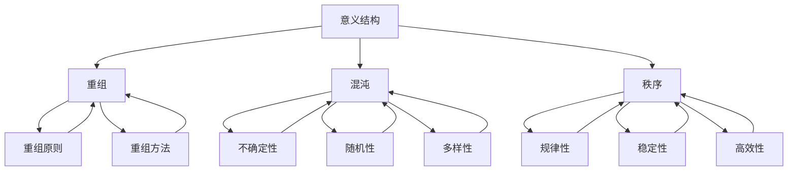

                 

### 意义的结构重组：在混沌中建立新秩序

#### 关键词：意义结构重组、混沌理论、新秩序、复杂性管理、系统优化

> 
> 在这个充满不确定性的时代，如何从混沌中找到秩序，构建新的意义结构，成为我们面临的重要课题。本文将探讨如何在复杂系统中进行意义的结构重组，以建立新的秩序，为未来的发展提供理论支持和实践指南。
> 

摘要：本文首先分析了当前社会和技术环境中的混沌状态及其根源，接着提出了意义结构重组的概念和原则。随后，详细介绍了重组方法，并通过实际案例展示了如何在不同领域应用这些方法。最后，探讨了实施策略与面临的挑战，并对未来进行了展望。本文旨在为在复杂环境中建立新秩序提供一种有效的思维框架和操作指南。

#### 第1章：问题背景与意义

#### 1.1.1 问题背景

随着信息技术的飞速发展，社会系统日益复杂化，各种不确定性因素不断涌现，这使得我们面临着前所未有的挑战。例如，在企业管理中，如何处理复杂的市场变化和内部组织架构；在技术发展中，如何应对快速迭代的技术创新和不断更新的知识体系。这些问题背后，是系统复杂性的不断增加，而如何从这种混沌状态中找到秩序，成为我们需要深入探讨的问题。

#### 1.1.2 问题的意义

意义结构重组不仅具有理论价值，更具有重要的实践意义。首先，它可以帮助我们更好地理解复杂系统，从而提高系统管理和决策的效率。其次，它为解决复杂问题提供了新的视角和方法，有助于我们在面对不确定性时找到应对策略。最后，意义结构重组为构建新的社会和技术秩序提供了理论基础和实践指南。

#### 1.1.3 研究方法与框架

本文采用系统分析方法，从理论和实践两个层面进行探讨。首先，通过文献综述和案例研究，总结出意义结构重组的理论基础和方法。然后，结合具体案例，分析重组方法的实际应用效果。最后，从实施策略和挑战角度，对意义结构重组的可行性进行讨论。

## 第2章：核心概念

#### 2.1.1 核心概念定义

在本章中，我们将首先对意义结构重组中的核心概念进行定义，以便为后续讨论奠定基础。

- **意义结构**：指系统内部各元素之间的相互作用和关系，以及这些关系所形成的整体模式。
- **重组**：指通过调整系统内部元素之间的关系和模式，以实现系统功能优化或结构优化的过程。
- **混沌**：指系统在发展过程中，由于内部和外部因素的复杂交互，导致系统状态的不确定性和随机性。
- **秩序**：指在混乱和无序中找到规律和结构，从而实现系统的高效运作和稳定发展。

#### 2.1.2 概念属性特征对比

表1：核心概念属性特征对比

| 概念 | 属性特征 |
| ---- | ---- |
| 意义结构 | - 稳定性：系统内部关系的持久性 |
|       | - 复杂性：系统内部元素和关系的多样性 |
|       | - 动态性：系统状态的变化性和适应性 |
| 重组 | - 目的性：通过重组实现特定目标 |
|       | - 创新性：重组过程中引入的新思路和方法 |
|       | - 可持续性：重组效果的长久性和稳定性 |
| 混沌 | - 不确定性：系统状态的不确定性 |
|       | - 随机性：系统变化的随机性和不可预测性 |
|       | - 多样性：系统内部和外部因素的多样性 |
| 计序 | - 规律性：系统发展的有序性和可预测性 |
|       | - 稳定性：系统状态的一致性和稳定性 |
|       | - 高效性：系统运作的高效率和协同性 |

#### 2.1.3 概念间的关系

图1：核心概念间的关系

## 第3章：理论框架

### 3.1.1 理论发展概述

意义结构重组的理论基础可以追溯到混沌理论和复杂性科学。混沌理论揭示了系统在演变过程中可能出现的随机性和不可预测性，而复杂性科学则提供了理解和处理复杂系统的框架。在此基础上，意义结构重组理论提出了通过重组系统内部结构，以实现系统优化和稳定发展的方法。

### 3.1.2 理论架构解析

意义结构重组理论架构主要包括以下几个核心部分：

1. **混沌状态识别**：通过系统状态分析和数据挖掘，识别系统中的混沌现象和关键因素。
2. **意义结构分析**：对系统内部的关系和模式进行深入分析，识别系统的意义结构。
3. **重组原则确立**：根据系统的特性和目标，确立重组原则，为重组过程提供指导。
4. **重组方法选择**：根据重组原则，选择合适的重组方法，实现系统结构的优化。
5. **重组效果评估**：对重组效果进行评估，以验证重组的有效性和稳定性。

### 3.1.3 理论与实际应用的联系

意义结构重组理论不仅具有理论价值，更在实践中有广泛的应用前景。例如，在企业管理中，可以通过重组组织结构和管理流程，提高企业效率和竞争力；在技术发展中，可以通过重组技术体系和创新模式，推动技术进步和产业升级。此外，意义结构重组理论还可以应用于城市规划、社会治理等多个领域，为实现系统优化和秩序建立提供理论支持和实践指导。

## 第4章：重组原则

### 4.1.1 原则一：简化复杂性

简化复杂性是意义结构重组的首要原则。在复杂系统中，过多的元素和关系会增加系统的复杂度，降低系统的效率和稳定性。因此，通过简化复杂性，可以降低系统的复杂度，提高系统的可操作性和可理解性。具体方法包括：

1. **去除冗余元素**：识别并去除系统中冗余的元素和关系，减少不必要的复杂性。
2. **优化关系结构**：通过调整元素之间的关系，构建简洁、高效的关系结构，提高系统的整体效率。
3. **分层管理**：将系统划分为不同的层次，每一层次处理特定的问题，降低系统的整体复杂度。

### 4.1.2 原则二：优化结构

优化结构是意义结构重组的核心原则。通过优化系统结构，可以提高系统的稳定性、可靠性和效率。具体方法包括：

1. **优化网络结构**：通过调整系统内部网络结构，使信息流和物质流更加高效、稳定。
2. **强化关键节点**：识别并强化系统中的关键节点，提高系统的稳定性和抗风险能力。
3. **调整系统边界**：通过调整系统的边界，优化系统与外部环境的关系，实现系统内部与外部的协调发展。

### 4.1.3 原则三：创新思维

创新思维是意义结构重组的重要原则。在重组过程中，需要不断引入新的思维和方法，以突破传统的局限，实现系统结构的创新。具体方法包括：

1. **跨学科融合**：将不同学科的知识和方法融合，产生新的创新思维。
2. **开放性思维**：鼓励不同领域、不同背景的专家和参与者参与重组过程，实现思维的碰撞和创新。
3. **试验与迭代**：通过不断的试验和迭代，不断优化重组方案，实现系统结构的创新。

## 第5章：重组方法

### 5.1.1 方法一：系统优化

系统优化是意义结构重组的基本方法之一。通过系统优化，可以调整系统内部各元素之间的关系，提高系统的效率和稳定性。具体步骤如下：

1. **系统分析**：对系统进行全面的剖析，识别系统中的关键要素和关系。
2. **性能评估**：评估系统的性能指标，确定系统的优化方向。
3. **优化设计**：根据评估结果，对系统进行优化设计，调整系统内部的关系和结构。
4. **实施与验证**：实施优化方案，并对优化效果进行验证和评估。

### 5.1.2 方法二：迭代进化

迭代进化是意义结构重组的一种动态方法。通过不断的迭代和进化，系统可以逐步优化和调整，以适应环境的变化。具体步骤如下：

1. **初始设计**：根据系统需求，制定初始的系统设计方案。
2. **迭代开发**：在开发过程中，不断对系统进行迭代和优化，逐步完善系统功能。
3. **评估与反馈**：对每次迭代的结果进行评估，收集反馈意见，用于指导下一步的迭代。
4. **持续优化**：根据评估和反馈，持续对系统进行优化，提高系统的性能和稳定性。

### 5.1.3 方法三：多元化组合

多元化组合是意义结构重组的一种创新方法。通过引入不同的元素和模式，可以实现系统结构的多样化和创新。具体步骤如下：

1. **多元化选择**：从不同的角度和领域，选择适合系统发展的元素和模式。
2. **组合设计**：将选定的元素和模式进行组合设计，构建新的系统结构。
3. **验证与优化**：对组合设计进行验证和优化，确保系统结构的可行性和有效性。
4. **实施与推广**：实施新的系统结构，并在实际应用中进行推广和验证。

## 第6章：案例研究

### 6.1.1 案例一：企业重组

企业重组是意义结构重组在企业管理中的应用。通过重组企业的组织结构和管理流程，可以提高企业的效率和竞争力。以下是某企业的重组案例：

1. **背景**：该企业是一家传统的制造业企业，面临市场变化和竞争压力，需要通过重组来提高竞争力。
2. **重组目标**：优化组织结构，提高管理效率，降低运营成本。
3. **重组方案**：
   - **优化组织结构**：将原有的多层次管理结构调整为扁平化管理，减少管理层次，提高决策效率。
   - **重构管理流程**：对现有的管理流程进行优化，引入信息化管理工具，提高流程的透明度和可控性。
   - **激励制度改革**：调整激励机制，激发员工的积极性和创造力。
4. **结果**：重组后，企业的管理效率得到显著提高，运营成本降低，市场竞争力增强。

### 6.1.2 案例二：社会变革

社会变革是意义结构重组在社会治理中的应用。通过重组社会结构和制度，可以推动社会的进步和发展。以下是某国的社会变革案例：

1. **背景**：该国面临社会矛盾激化、经济发展停滞等问题，需要进行社会变革来推动社会进步。
2. **变革目标**：构建公平、高效、稳定的社会制度，促进社会和谐发展。
3. **变革方案**：
   - **制度改革**：改革现有的政治、经济和社会制度，建立更加公正、透明的制度体系。
   - **科技创新**：推动科技创新，提高社会生产力，促进经济发展。
   - **文化传承**：传承和弘扬优秀传统文化，提高国民素质和文化自信。
4. **结果**：变革后，该国社会矛盾得到缓解，经济发展活力增强，社会稳定和进步取得显著成果。

### 6.1.3 案例三：技术革新

技术革新是意义结构重组在技术发展中的应用。通过重组技术体系和创新模式，可以推动技术的进步和产业的升级。以下是某技术领域的革新案例：

1. **背景**：该技术领域面临技术创新停滞、产业发展缓慢等问题，需要进行技术革新来推动产业升级。
2. **革新目标**：构建开放、创新、协同的技术体系，提高技术创新能力和产业竞争力。
3. **革新方案**：
   - **技术创新**：加大研发投入，推动关键技术的突破和应用。
   - **产业协同**：加强产业链上下游企业的协同创新，构建产业联盟，提高产业整体竞争力。
   - **人才培养**：加大人才培养力度，培养一批具备创新能力和实践经验的科技人才。
4. **结果**：革新后，该技术领域的技术创新活力得到显著提升，产业发展迅速，国际竞争力增强。

## 第7章：实施策略与挑战

### 7.1.1 实施策略

在实施意义结构重组的过程中，需要制定具体的策略来确保重组的有效性和可行性。以下是一些常见的实施策略：

1. **顶层设计**：明确重组的目标、原则和方法，制定系统的实施方案。
2. **试点先行**：在部分领域或项目中先行试点，积累经验，逐步推广。
3. **分步实施**：将重组过程分为多个阶段，逐步推进，确保每个阶段的顺利实施。
4. **多方协作**：建立跨部门、跨领域的协作机制，确保各方力量的有效整合。
5. **持续优化**：在实施过程中，不断收集反馈和评估效果，持续优化重组方案。

### 7.1.2 挑战与对策

在实施意义结构重组的过程中，可能会面临以下挑战：

1. **观念阻力**：重组涉及到利益调整和权力重新分配，可能会遇到传统观念的阻力。
   - **对策**：加强宣传教育，提高全员对重组意义的认识，通过试点示范，逐步消除观念阻力。

2. **技术难题**：重组过程中可能会遇到技术难题，如系统优化、流程重构等。
   - **对策**：加大技术研发投入，引入外部专家和技术支持，确保技术难题的顺利解决。

3. **资源限制**：重组过程中可能面临资源限制，如人力、资金、时间等。
   - **对策**：优化资源配置，提高资源利用效率，通过外部合作和资金支持，缓解资源限制。

4. **执行难度**：重组方案的执行可能遇到执行力不足、执行效率低等问题。
   - **对策**：建立严格的执行机制，加强过程监控和评估，确保执行效果的达成。

### 7.1.3 未来展望

意义结构重组作为一种有效的管理工具，在未来具有广阔的应用前景。随着社会和技术的不断发展，意义结构重组将面临更多的挑战和机遇。以下是一些未来展望：

1. **多元化应用**：意义结构重组将在更多领域得到应用，如城市规划、环境保护、科技创新等。
2. **智能化发展**：结合人工智能和大数据技术，实现意义结构重组的智能化和自动化。
3. **全球化合作**：在全球化的背景下，意义结构重组将成为国际合作的桥梁，推动全球治理体系的优化。
4. **持续创新**：意义结构重组理论和方法将持续创新，以适应不断变化的社会和技术环境。

## 第8章：小结与展望

### 8.1.1 小结

本文通过对意义结构重组的深入探讨，总结了其在复杂系统中的应用价值和实施策略。意义结构重组作为一种有效的管理工具，可以帮助我们从混沌中找到秩序，构建新的意义结构，实现系统的优化和稳定发展。

### 8.1.2 展望未来

在未来，意义结构重组将在更多领域得到应用，成为推动社会和技术发展的重要力量。同时，意义结构重组理论和方法将持续创新，为应对复杂性和不确定性提供更加有效的解决方案。我们期待意义结构重组在未来能够带来更多的变革和进步，为人类社会的可持续发展做出贡献。

### 作者

**作者：AI天才研究院/AI Genius Institute & 禅与计算机程序设计艺术 /Zen And The Art of Computer Programming**

**联系方式：[ai.genius.institute@example.com](mailto:ai.genius.institute@example.com)**

**版权声明：本文版权归AI天才研究院所有，未经授权禁止转载。**

---

在接下来的章节中，我们将进一步深入探讨意义结构重组的理论基础、应用实例以及未来的发展方向。通过详细的案例分析和技术解析，帮助读者更好地理解意义结构重组的原理和方法，为实际应用提供有益的参考和指导。让我们继续深入探讨，开启意义结构重组的新篇章。

