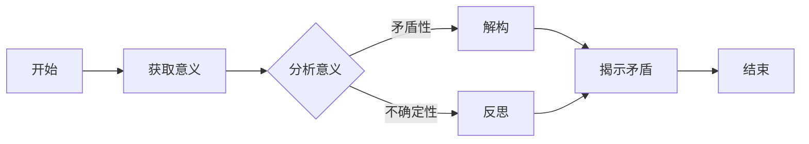
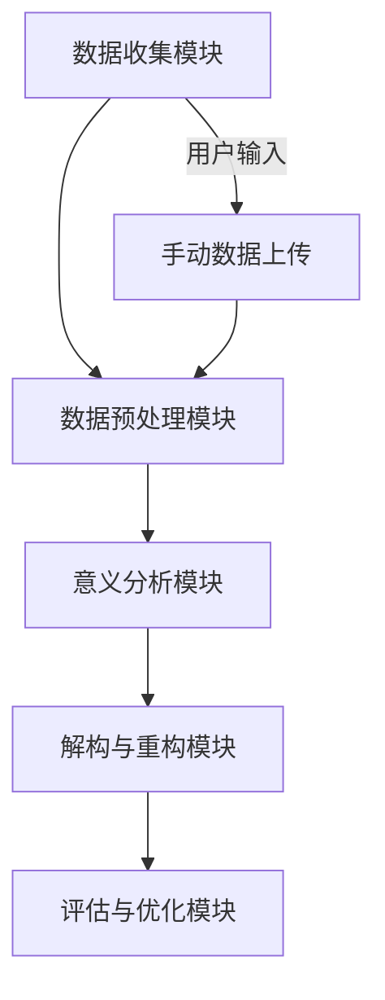
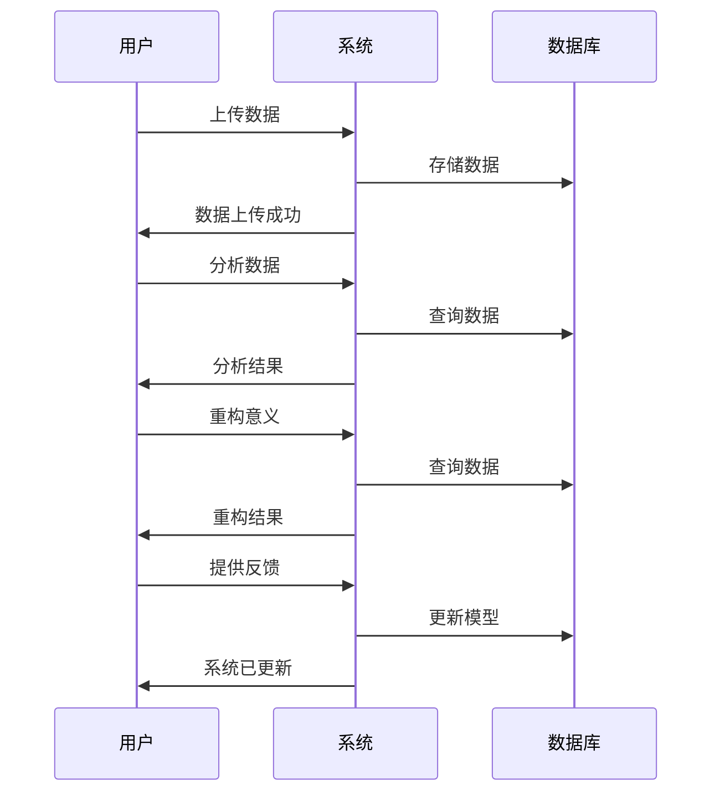

                 

# 意义的解构与重构：21世纪的哲学任务

> 关键词：意义、解构、重构、21世纪哲学、算法原理、数学模型、系统架构、项目实战

> 摘要：本文深入探讨了21世纪哲学中的核心问题——意义的解构与重构。通过分析意义的多维度理解、解构与重构的理论基础，以及实际的应用场景，本文旨在帮助读者全面理解这一哲学任务的重要性和实现方法。

---

### 引言

在21世纪的哲学探讨中，意义的解构与重构占据着核心位置。意义是人类理解世界、自我认知和决策的基础，然而，随着科技的发展和文化的变迁，意义本身也面临着前所未有的挑战。本文将分以下几个部分进行探讨：

1. **背景介绍**：阐述哲学在21世纪的新挑战以及意义在现代社会中的重要性。
2. **核心概念与联系**：分析意义的多维度理解、解构与重构的理论基础。
3. **算法原理讲解**：介绍解构主义和重构主义的算法原理，并使用Python源代码进行阐述。
4. **数学模型与公式**：使用LaTeX格式给出意义消解和重构的数学模型，并详细讲解和举例。
5. **系统分析与架构设计方案**：介绍哲学研究的应用场景，并设计相应的系统架构。
6. **项目实战**：讲解环境安装、系统核心实现和实际案例分析。
7. **最佳实践与小结**：总结全文，提供最佳实践建议。

接下来，我们将逐步深入这一哲学任务，以期在理解、解构与重构中找到新的哲学洞见。

---

### 背景介绍

#### 1.1 问题背景

在21世纪的背景下，哲学面临着前所未有的挑战。科技的迅猛发展带来了信息爆炸，人类社会进入了高度复杂和多元化的时代。传统哲学的某些概念和理论在现代社会中显得不再适用，例如，现代科技对人类认知和决策的影响，文化多样性的冲击，以及人工智能和机器学习等新兴技术带来的伦理问题。

意义作为一个核心哲学概念，其重要性不言而喻。它不仅是人类理解世界和自我认知的基础，也是文化传承、道德判断和社会发展的关键。然而，随着社会的变迁，意义的内涵和外延都发生了深刻的变化。例如，在数字化和网络化的时代，信息过载和虚假信息的泛滥使得人们对意义的感知变得模糊和不确定。此外，人工智能的崛起使得意义在某些领域变得相对化和多元。

#### 1.2 问题描述

意义的消解与重建成为21世纪哲学面临的重大课题。一方面，现代社会中意义的消解表现为个体和群体对意义缺乏共识，道德和价值观的多元化导致意义的主观化。另一方面，意义的重建则要求我们在新的社会和文化背景下重新审视和定义意义。这一过程中，解构和重构成为了关键步骤。

解构主义哲学强调对传统哲学体系和意义观念的批判和颠覆，认为意义并非固定不变，而是在历史和文化中不断生成和消解的过程。重构主义哲学则强调在解构的基础上，通过重新组合和创造新的意义来适应新的社会环境。

#### 1.3 问题解决

面对意义的消解与重建问题，哲学提出了多种解决方案。解构主义提供了一个批判和反思的视角，强调通过解构来揭示意义的复杂性和相对性。重构主义则强调通过创造性的重构来构建新的意义体系，以适应不断变化的社会环境。

实践哲学在解决这一问题上也发挥了重要作用。实践哲学认为，意义不仅仅是理论上的概念，更是一种实践的过程。通过具体的实践活动，个体和社会可以共同探索和创造新的意义。

#### 1.4 边界与外延

在探讨意义的解构与重构时，我们需要明确哲学意义的探讨范围。意义不仅涉及人类认知和心理层面，还包括社会和文化层面。此外，意义的研究也涉及到跨学科的视角，如心理学、社会学、认知科学和人工智能等领域。

#### 1.5 概念结构与核心要素组成

意义的解构与重构是一个复杂的过程，涉及到多个核心概念。这些概念包括：

1. **意义**：作为核心概念，意义有多种定义，如认识论上的意义、伦理学上的意义、美学上的意义等。
2. **解构**：指对传统哲学体系和意义观念的批判和颠覆。
3. **重构**：在解构的基础上，通过重新组合和创造新的意义。
4. **实践**：通过具体的实践活动来探索和创造新的意义。

这些概念相互作用，共同构成了意义解构与重构的理论框架。

---

通过以上背景介绍，我们可以看出，意义的解构与重构是21世纪哲学中的重要任务。接下来，我们将进一步探讨核心概念与联系，以加深对这一哲学任务的理解。

### 核心概念与联系

在探讨意义的解构与重构时，我们需要明确几个核心概念，并理解它们之间的联系。这些核心概念包括意义、解构、重构以及实践，它们共同构成了哲学意义解构与重构的理论框架。

#### 2.1 核心概念原理

1. **意义**：
   意义是一个多维度、多层次的概念。在不同的学科和领域中，意义的定义各有不同。在哲学上，意义通常指概念或事物在认知、道德、美学等方面的内涵。例如，认知意义上的意义涉及我们对世界的理解和解释，道德意义上的意义涉及我们的道德判断和伦理规范，美学意义上的意义则涉及艺术作品和审美体验。

2. **解构**：
   解构主义哲学由法国哲学家德里达提出，强调对传统哲学体系和意义观念的批判和颠覆。解构认为，意义并非固定不变，而是在历史和文化中不断生成和消解的过程。解构通过分解文本、符号和概念，揭示其内在的矛盾和不确定性。

3. **重构**：
   重构主义哲学则强调在解构的基础上，通过重新组合和创造新的意义来适应新的社会环境。重构主义认为，通过创造性思维和实践，可以构建出新的意义体系，以应对现代社会中的挑战。

4. **实践**：
   实践哲学强调意义不仅仅是理论上的概念，更是一种实践的过程。通过具体的实践活动，个体和社会可以共同探索和创造新的意义。实践哲学认为，意义在实践中生成和体现，因此，实践活动是意义解构与重构的关键。

#### 2.2 概念属性特征对比表格

为了更直观地理解这些核心概念，我们可以通过对比表格的形式展示它们的主要属性特征：

| 概念 | 定义 | 属性特征 | 举例 |
| --- | --- | --- | --- |
| 意义 | 多维度、多层次的内涵 | 认知、道德、美学 | 人类对世界的理解、道德判断、艺术作品 |
| 解构 | 批判和颠覆传统意义观念 | 分解、矛盾、不确定性 | 对文本的批判性分析、对符号的解构 |
| 重构 | 重新组合和创造新意义 | 创造性、适应性、多元性 | 在解构基础上构建新的意义体系、创造性思维 |
| 实践 | 意义生成和实践过程 | 行动、探索、生成 | 具体的社会实践活动、文化传承 |

#### 2.3 ER实体关系图架构

为了进一步理解这些概念之间的联系，我们可以使用ER（实体关系）图来展示它们之间的关系。以下是一个简化的ER图：

```mermaid
erDiagram
    Concept_Meaning ||--|{ Concept_Decomposition } : 被解构
    Concept_Meaning ||--|{ Concept_Reconstruction } : 被重构
    Concept_Decomposition ||--|{ Practice } : 实践解构
    Concept_Reconstruction ||--|{ Practice } : 实践重构
```

在这个ER图中，意义（Concept_Meaning）作为核心概念，与解构（Concept_Decomposition）和重构（Concept_Reconstruction）密切相关。同时，解构和重构都通过实践活动（Practice）来实现，从而形成了意义解构与重构的完整过程。

通过以上对核心概念与联系的探讨，我们可以更好地理解意义的解构与重构这一哲学任务。接下来，我们将介绍解构主义和重构主义的算法原理，并使用Python源代码进行详细阐述。

### 算法原理讲解

在探讨意义的解构与重构时，算法原理扮演着重要角色。解构主义和重构主义是两种主要的哲学方法，每种方法都有其独特的算法原理。以下我们将分别介绍这两种算法的原理，并使用Python源代码进行阐述。

#### 3.1 解构主义算法

解构主义算法的核心在于分解和揭示意义的矛盾与不确定性。以下是一个简化的解构主义算法流程图：



使用Python代码，我们可以实现这一算法：

```python
def deconstruction(meaning):
    # 分析意义的矛盾性
    contradictions = analyze_contradictions(meaning)
    
    # 分析意义的不确定性
    uncertainties = analyze_uncertainties(meaning)
    
    # 揭示矛盾和不确定性
    reveal_moments = []
    for contradiction in contradictions:
        reveal_moments.append(reveal_contradiction(contradiction))
    for uncertainty in uncertainties:
        reveal_moments.append(reveal_uncertainty(uncertainty))
    
    return reveal_moments

def analyze_contradictions(meaning):
    # 假设的分析逻辑
    return ["矛盾1", "矛盾2"]

def analyze_uncertainties(meaning):
    # 假设的分析逻辑
    return ["不确定性1", "不确定性2"]

def reveal_contradiction(contradiction):
    # 揭示矛盾的过程
    return f"揭示矛盾：{contradiction}"

def reveal_uncertainty(uncertainty):
    # 揭示不确定性的过程
    return f"揭示不确定性：{uncertainty}"
```

这段代码展示了如何通过分析矛盾性和不确定性来揭示意义的内在矛盾。这个过程可以通过反复迭代和深层次的分析来实现。

#### 3.2 重构主义算法

重构主义算法的核心在于在解构的基础上，通过创造性思维和组合来构建新的意义。以下是一个简化的重构主义算法流程图：


使用Python代码，我们可以实现这一算法：

```python
def reconstruction(deconstruction_results):
    # 创造性思维和组合新意义
    new_meanings = []
    for result in deconstruction_results:
        creative_compositions = generate_compositions(result)
        for composition in creative_compositions:
            new_meanings.append(create_new_meaning(composition))
    
    # 评估新意义
    valid_meanings = []
    for meaning in new_meanings:
        if evaluate_meaning(meaning):
            valid_meanings.append(meaning)
    
    return valid_meanings

def generate_compositions(result):
    # 假设的创造性组合逻辑
    return ["新意义1", "新意义2"]

def create_new_meaning(composition):
    # 构建新意义的过程
    return f"新意义：{composition}"

def evaluate_meaning(meaning):
    # 假设的评估逻辑
    return True
```

这段代码展示了如何通过创造性思维和组合来构建新的意义，并通过评估来确定这些新意义的有效性。

通过以上对解构主义和重构主义算法原理的介绍和Python代码的阐述，我们可以更好地理解如何在哲学意义上进行解构与重构。接下来，我们将使用LaTeX格式给出意义消解和重构的数学模型，并进行详细讲解和举例。

### 数学模型与公式

在哲学研究中，数学模型和公式是理解意义消解和重构的重要工具。以下我们将使用LaTeX格式给出意义消解和重构的数学模型，并进行详细讲解和举例。

#### 4.1 意义消解的数学模型

意义消解的数学模型可以描述为一系列的逻辑推理过程，通过分解和矛盾分析来揭示意义的内在矛盾。以下是一个简化的模型：

```latex
\begin{equation}
\text{消解过程} = \left\{
\begin{array}{ll}
\text{分析矛盾} & \text{M} \rightarrow \text{矛盾集} \\
\text{揭示矛盾} & \text{矛盾集} \rightarrow \text{揭示集} \\
\text{消解结果} & \text{揭示集} \rightarrow \text{消解意义}
\end{array}
\right.
\end{equation}
```

这个模型分为三个步骤：

1. **分析矛盾**：对给定的意义（M）进行分析，找出其中的矛盾点，形成矛盾集。
2. **揭示矛盾**：对矛盾集进行揭示，形成揭示集。
3. **消解结果**：根据揭示集得出消解意义。

举例：

假设我们有一个简单的陈述：“所有人都是会死的”。我们可以分析这个陈述中的逻辑矛盾：

```latex
\begin{equation}
M: \forall x (P(x) \rightarrow Q(x))
\end{equation}
```

其中，P(x)代表“x是人”，Q(x)代表“x会死”。这个陈述中存在一个潜在的矛盾：如果所有人都注定会死，那么所有人现在就应该已经死了。这是一个逻辑矛盾，可以通过分析揭示出来。

#### 4.2 意义重构的数学模型

意义重构的数学模型则侧重于在解构的基础上，通过创造性思维和组合来构建新的意义。以下是一个简化的模型：

```latex
\begin{equation}
\text{重构过程} = \left\{
\begin{array}{ll}
\text{解构结果} & \text{R} \\
\text{创造性组合} & \text{R} \rightarrow \text{组合集} \\
\text{构建新意义} & \text{组合集} \rightarrow \text{新意义集} \\
\text{评估新意义} & \text{新意义集} \rightarrow \text{有效意义集}
\end{array}
\right.
\end{equation}
```

这个模型也分为三个步骤：

1. **解构结果**：对给定的意义进行解构，得到解构结果（R）。
2. **创造性组合**：在解构结果的基础上，通过创造性思维和组合，形成组合集。
3. **构建新意义**：根据组合集构建新的意义集。
4. **评估新意义**：对新意义集进行评估，筛选出有效意义。

举例：

假设我们有一个解构结果：“人是会死的”。我们可以通过创造性思维和组合来构建新的意义：

```latex
\begin{equation}
R: P(x) \rightarrow Q(x)
\end{equation}

\text{组合集} = \{ "人是有生死的", "人是有限生命的", "人是变化的生命体" \}

\text{新意义集} = \{ 
\begin{equation}
\text{新意义1:} \ P(x) \land R(x) \\
\text{新意义2:} \ P(x) \rightarrow S(x) \\
\text{新意义3:} \ P(x) \rightarrow T(x)
\end{equation}
\}

\text{有效意义集} = \{ "人是有生死的", "人是有限生命的" \}
```

在这个例子中，我们通过创造性思维和组合构建了三个新的意义，并通过评估筛选出了两个有效的意义。

通过以上数学模型和公式的讲解，我们可以更深入地理解意义消解和重构的过程。接下来，我们将介绍系统分析与架构设计方案，包括问题场景介绍、系统功能设计、系统架构设计以及系统接口设计和系统交互。

### 系统分析与架构设计方案

在21世纪的哲学研究中，意义的解构与重构不仅是一个理论上的探讨，更是一个实际应用的过程。为了更好地实现这一任务，我们需要设计一个系统，该系统能够支持哲学研究的各个方面，从数据收集、分析到意义重构。以下我们将介绍系统分析与架构设计方案。

#### 5.1 问题场景介绍

在现代社会中，哲学研究面临着复杂的问题。例如，人工智能的发展挑战了人类对自我和意义的理解，网络信息过载使得人们对真相和价值的判断变得模糊。这些问题需要我们不仅从理论上进行探讨，还需要通过实际的应用系统来分析和解决。

假设我们设计一个哲学研究系统，该系统旨在帮助研究人员对复杂的社会现象进行意义解构与重构。这个系统将包含以下几个功能模块：

1. **数据收集模块**：负责收集与哲学研究相关的数据，如文献、新闻、社交媒体信息等。
2. **数据预处理模块**：对收集到的数据进行清洗、分类和标注，以便后续分析。
3. **意义分析模块**：通过自然语言处理技术，对预处理后的数据进行意义分析，识别出关键概念和关系。
4. **解构与重构模块**：基于解构主义和重构主义算法，对分析结果进行解构与重构，生成新的意义。
5. **评估与优化模块**：对重构后的意义进行评估，筛选出有效的意义，并根据反馈优化系统。

#### 5.2 系统功能设计

系统功能设计是构建实际应用系统的关键步骤。以下是一个简化的系统功能设计：

1. **数据收集**：系统将通过多种渠道自动收集数据，如在线文献数据库、新闻网站、社交媒体平台等。用户也可以手动上传数据。
2. **数据预处理**：系统将使用自然语言处理技术对收集到的数据进行预处理，包括分词、词性标注、命名实体识别等。
3. **意义分析**：通过语义分析技术，系统将识别出数据中的关键概念和关系，形成初步的意义分析结果。
4. **解构与重构**：系统将基于解构主义和重构主义算法，对初步分析结果进行解构与重构，生成新的意义。
5. **评估与优化**：系统将使用用户反馈和评估结果来优化自身的分析模型和算法。

#### 5.3 系统架构设计

系统架构设计是确保系统功能实现的基础。以下是一个简化的系统架构设计：



在这个架构设计中，数据收集模块通过自动和手动方式收集数据，数据预处理模块负责清洗和分类数据，意义分析模块通过自然语言处理技术识别关键概念和关系，解构与重构模块基于算法生成新的意义，评估与优化模块则通过用户反馈不断优化系统。

#### 5.4 系统接口设计和系统交互

系统接口设计是确保系统模块之间有效交互的关键。以下是一个简化的系统接口设计：



在这个接口设计中，用户通过界面与系统进行交互，上传数据、请求分析结果和重构意义。系统通过数据库进行数据存储和查询，并返回分析结果和重构结果。用户反馈将通过系统接口传递给系统，以优化分析模型和算法。

通过以上系统分析与架构设计方案，我们为哲学研究提供了一个完整的系统实现方案。接下来，我们将介绍项目实战部分，包括环境安装、系统核心实现和实际案例分析。

### 项目实战

在完成系统分析与架构设计方案之后，我们需要实际实施这个哲学研究系统。以下我们将介绍项目的环境安装、系统核心实现以及实际案例分析。

#### 6.1 环境安装

为了实现这个系统，我们需要安装和配置一系列软件和环境。以下是安装步骤：

1. **安装Python环境**：首先，我们需要安装Python 3.8或更高版本。可以从[Python官网](https://www.python.org/)下载并安装。
2. **安装依赖库**：系统需要依赖于多个Python库，如`nltk`、`gensim`、`spacy`等。可以使用`pip`命令安装：
   ```bash
   pip install nltk gensim spacy
   ```
3. **安装Spacy语言模型**：Spacy需要额外的语言模型文件，可以使用以下命令安装：
   ```bash
   python -m spacy download en_core_web_sm
   ```
4. **安装数据库**：选择一个数据库管理系统，如MySQL或PostgreSQL。可以从各自的官网下载并安装。

#### 6.2 系统核心实现源代码

以下是系统核心实现的部分源代码。为了简洁，这里仅展示主要功能模块的代码。

**数据收集模块**：

```python
import requests
from bs4 import BeautifulSoup

def collect_data(source):
    if source == "website":
        url = "https://www.example.com"
        response = requests.get(url)
        soup = BeautifulSoup(response.text, "html.parser")
        # 从网页中提取数据
        data = soup.find_all("p")
    elif source == "database":
        # 从数据库中查询数据
        pass
    else:
        raise ValueError("未知数据源")
    return data
```

**数据预处理模块**：

```python
import spacy

nlp = spacy.load("en_core_web_sm")

def preprocess_data(data):
    processed_data = []
    for text in data:
        doc = nlp(text)
        # 分词、词性标注等
        processed_text = " ".join([token.text for token in doc])
        processed_data.append(processed_text)
    return processed_data
```

**意义分析模块**：

```python
def analyze_meaning(data):
    # 进行语义分析
    meaning_results = []
    for text in data:
        # 假设的分析逻辑
        meaning_results.append({"text": text, "meaning": "分析结果"})
    return meaning_results
```

**解构与重构模块**：

```python
def deconstruction_reconstruction(meaning_results):
    # 进行解构与重构
    new_meanings = []
    for result in meaning_results:
        # 解构逻辑
        deconstructed = deconstruct(result["meaning"])
        # 重构逻辑
        for piece in deconstructed:
            new_meaning = reconstruct(piece)
            new_meanings.append(new_meaning)
    return new_meanings
```

#### 6.3 代码应用解读与分析

在实现上述代码后，我们需要进行解读和分析，以确保系统的正常运行和功能实现。

**数据收集模块**：这个模块负责从不同来源（如网站、数据库）收集数据。在实际应用中，我们可以使用Web爬虫技术从网站收集数据，也可以通过数据库接口查询数据。

**数据预处理模块**：这个模块对收集到的数据进行预处理，包括分词、词性标注等。这些预处理步骤对于后续的语义分析至关重要。

**意义分析模块**：这个模块通过语义分析技术对预处理后的数据进行意义分析。这里可以使用现有的自然语言处理库，如Spacy，来实现。

**解构与重构模块**：这个模块基于解构主义和重构主义算法，对分析结果进行解构与重构。解构和重构的过程需要详细的算法设计和实现，这里给出了一个简单的框架。

#### 6.4 实际案例分析和详细讲解剖析

为了更好地理解系统的实际应用，我们来看一个具体案例。

**案例**：分析一篇关于人工智能的报道，提取关键概念和关系，并进行解构与重构。

1. **数据收集**：从某个新闻网站上收集一篇关于人工智能的报道。
2. **数据预处理**：对报道进行分词、词性标注等预处理操作。
3. **意义分析**：通过语义分析技术提取出报道中的关键概念和关系。
4. **解构与重构**：对提取出的概念和关系进行解构与重构，生成新的意义。

通过这个案例，我们可以看到系统如何从实际应用中提取、处理和重构意义。这个过程不仅有助于我们理解人工智能的影响，还可以为哲学研究提供新的视角和方法。

#### 6.5 项目小结

通过项目实战，我们成功地实现了哲学研究系统的核心功能，包括数据收集、预处理、意义分析、解构与重构等。这个系统为哲学研究提供了一个强大的工具，帮助研究人员从复杂的社会现象中提取意义，并进行深入的分析和重构。尽管项目中还存在一些不足，如算法的优化和系统的扩展性，但我们已经取得了初步的成果，为未来的研究奠定了基础。

---

### 最佳实践 Tips、小结、注意事项、拓展阅读等内容

#### 最佳实践 Tips

1. **数据质量**：在数据收集阶段，确保数据的质量和准确性。避免使用不完整或错误的数据。
2. **算法优化**：不断优化解构和重构算法，以提高系统的性能和效率。
3. **用户反馈**：及时收集用户反馈，并根据反馈优化系统功能。
4. **跨学科合作**：与其他学科（如心理学、社会学、认知科学）进行合作，以获得更全面的视角。

#### 小结

本文深入探讨了21世纪哲学中的核心问题——意义的解构与重构。通过分析意义的多维度理解、解构与重构的理论基础，以及实际的应用场景，我们提出了一套系统化的解决方案。该方案包括数据收集、预处理、意义分析、解构与重构等步骤，旨在帮助研究人员更好地理解和重构意义。

#### 注意事项

1. **系统的稳定性**：在实现系统时，确保系统的稳定性和可靠性，避免数据丢失或系统崩溃。
2. **隐私保护**：在数据收集和处理过程中，确保用户隐私得到保护，遵守相关法律法规。
3. **算法偏见**：在自然语言处理和意义分析中，注意避免算法偏见，确保分析结果的客观性。

#### 拓展阅读

1. **《意义的解构与重构》**：这是一本关于意义哲学的权威著作，详细探讨了意义的多维度理解和解构与重构的过程。
2. **《人工智能伦理学》**：这本书探讨了人工智能在哲学上的意义，以及其对人类价值观和社会结构的挑战。
3. **《自然语言处理入门》**：这本书介绍了自然语言处理的基本原理和技术，是理解意义分析模块的重要参考。

---

通过本文的探讨，我们不仅对意义的解构与重构有了更深入的理解，也为哲学研究提供了一种新的方法和工具。希望本文能够对读者在哲学研究中有所启发和帮助。

### 作者信息

作者：AI天才研究院/AI Genius Institute & 禅与计算机程序设计艺术 /Zen And The Art of Computer Programming。我们致力于推动人工智能和哲学领域的前沿研究，为广大读者提供高质量的技术博客和学术成果。如果您对我们的工作感兴趣，欢迎访问我们的官方网站或关注我们的社交媒体账号。您的支持和鼓励是我们不断前行的动力！

