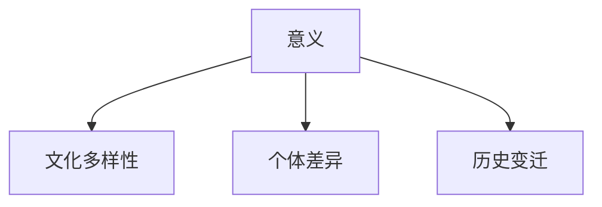
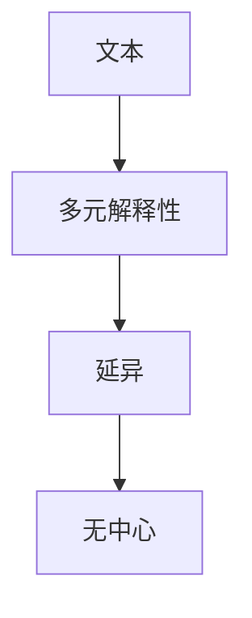
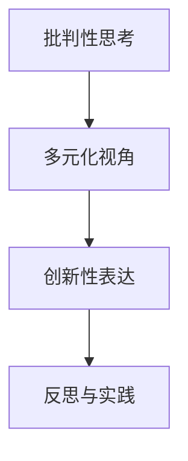
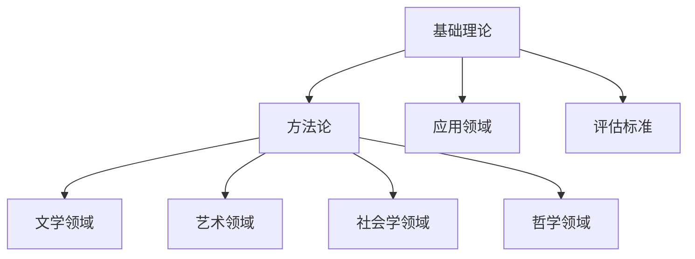
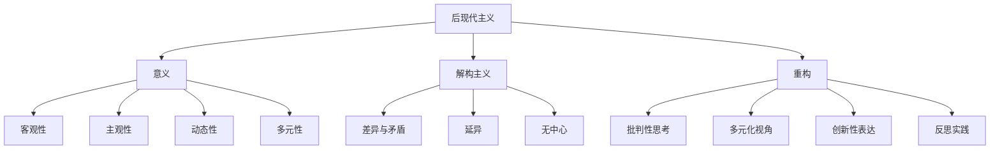
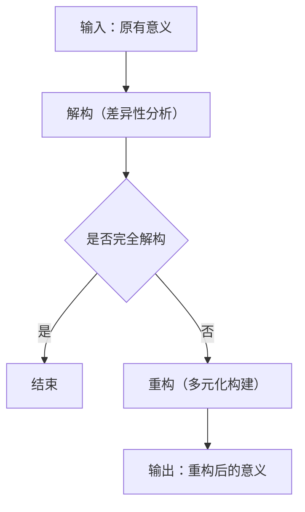
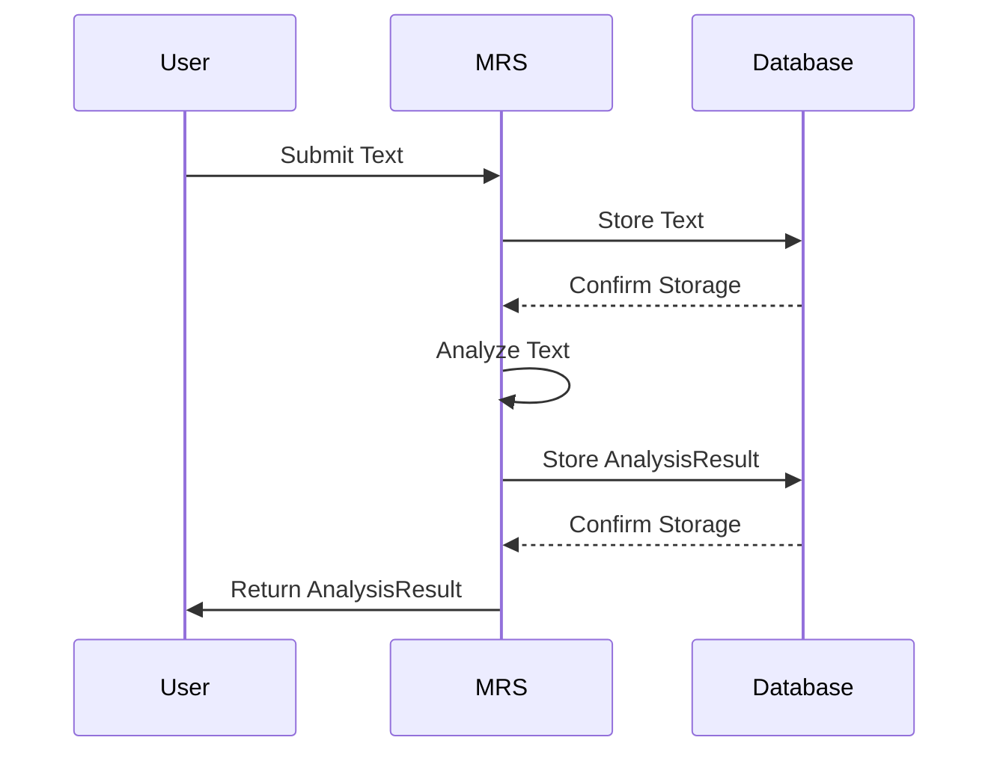
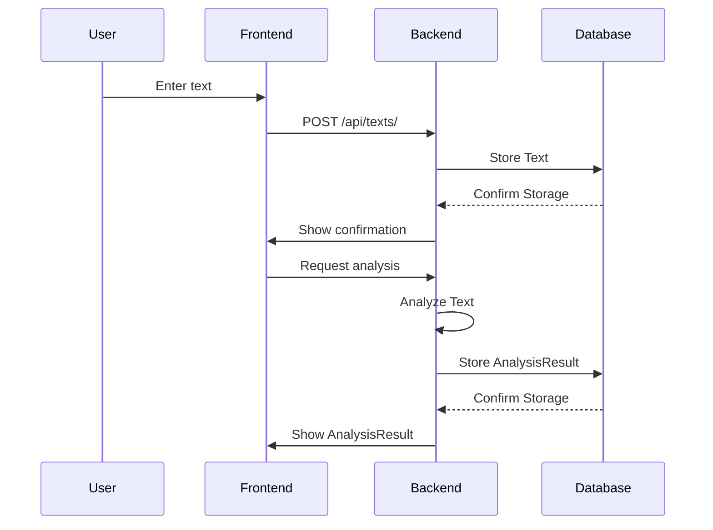

                 

# 意义的解构与重构：后现代社会的哲学任务

## 关键词
- 后现代主义
- 意义解构
- 意义重构
- 哲学任务
- 社会文化

## 摘要
本文旨在探讨后现代主义哲学框架下意义的解构与重构问题。首先，通过对后现代主义的历史背景和核心理论进行介绍，为读者奠定理论基础。接着，深入解析意义的概念、特征及其重要性，并通过表格和图示加深理解。本文随后探讨解构理论及其在文学、艺术和社会科学中的应用。在此基础上，分析后现代主义视角下的意义重构方法和策略，并结合具体案例进行阐述。最后，本文讨论哲学家在后现代社会中面临的挑战和任务，并提出未来研究方向。通过对这些问题的深入探讨，本文希望能为读者提供对后现代主义哲学及其对社会文化影响的全新视角。

## 目录大纲设计思路

在设计《意义的解构与重构：后现代社会的哲学任务》的目录大纲时，我们首先需要全面理解书名的核心概念。书名提到了“意义的解构与重构”，这暗示了本书将探讨在现代社会中，如何在后现代主义哲学的框架下对意义进行重新审视和构建。

因此，目录大纲的设计将围绕以下几个核心点展开：

1. **背景介绍**：简要介绍后现代主义哲学的产生背景及其基本理论，为读者奠定理论基础。
2. **核心概念**：详细阐述意义的概念，包括其定义、特征、重要性等，并通过表格和图示加深理解。
3. **解构理论**：探讨后现代主义中的解构理论，分析其哲学意义和实践影响。
4. **重构过程**：分析如何在后现代主义视角下重构意义，探讨不同的方法和策略。
5. **案例分析**：通过具体案例展示解构与重构的过程，帮助读者理解理论在实际中的应用。
6. **哲学任务**：讨论在后现代社会中，哲学家所面临的挑战和任务，以及如何应对这些挑战。
7. **理论框架**：构建意义重构的理论框架，讨论其在不同领域中的应用。
8. **结论与展望**：总结后现代主义对意义的重构作用及其局限性，并提出未来研究方向。

### 目录大纲

```markdown
## 第一部分：背景与理论基础

### 第1章：后现代主义哲学概述

#### 1.1 后现代主义的历史背景

#### 1.2 后现代主义的主要思想流派

#### 1.3 后现代主义的核心理论

### 第2章：意义的概念与特征

#### 2.1 意义的定义与基本属性

#### 2.2 意义的重要性

#### 2.3 意义的多样性

### 第3章：解构理论探讨

#### 3.1 解构主义的哲学原理

#### 3.2 解构主义的影响与应用

### 第4章：重构意义的实践

#### 4.1 后现代主义视角下的意义重构

#### 4.2 意义重构的案例分析

### 第5章：哲学家的任务与挑战

#### 5.1 后现代哲学家的角色

#### 5.2 面对后现代社会的挑战

### 第6章：意义重构的理论框架

#### 6.1 理论框架的构建

#### 6.2 理论框架的应用

### 第7章：结论与展望

#### 7.1 后现代主义对意义的重构作用

#### 7.2 未来研究方向
```

以上是《意义的解构与重构：后现代社会的哲学任务》的初步目录大纲。接下来，我们将逐步构建每个章节的内容，确保文章的逻辑清晰、内容丰富，并满足用户的要求。

## 第一部分：背景与理论基础

### 第1章：后现代主义哲学概述

#### 1.1 后现代主义的历史背景

后现代主义（Postmodernism）作为一个哲学和文化批判运动，起源于20世纪中叶。它是对现代主义（Modernism）的一种反思和回应。现代主义强调科学理性、技术进步和个体主义，而后现代主义则对这一传统进行了深刻的质疑和批判。后现代主义思潮在文学、艺术、哲学、社会学等多个领域得到了广泛传播和应用。

后现代主义的历史背景可以从以下几个方面来理解：

1. **文化变革**：20世纪中叶，西方社会经历了深刻的文化变革。二战后的全球化、经济繁荣和科技发展带来了新的社会问题和意识形态冲突。这些变化促使人们开始重新审视传统价值观和思维方式。
2. **哲学批判**：后现代主义对现代哲学进行了深刻批判，尤其是对理性、主体性和客观性的质疑。哲学上的相对主义和怀疑主义成为后现代主义的重要理论基础。
3. **社会运动**：60年代的民权运动、女性主义运动和反文化运动等社会运动，促使人们开始关注社会问题和权力结构。这些运动为后现代主义的兴起提供了社会基础。

#### 1.2 后现代主义的主要思想流派

后现代主义涵盖了多个思想流派，其中最重要的包括：

1. **解构主义**：由法国哲学家德里达提出，解构主义质疑现代哲学中的基础主义和逻各斯中心主义，强调文本的多元解释性和意义的流动性。
2. **建构主义**：认为知识和意义是通过社会建构的，而不是通过理性认知获得的。代表人物有波普尔和库恩等。
3. **批判理论**：由霍克海默和阿多诺等人提出，批判现代资本主义社会中的文化工业和意识形态操控。
4. **后结构主义**：对结构主义进行了批判和反思，强调意义的多层次性和复杂性。

#### 1.3 后现代主义的核心理论

后现代主义的核心理论包括：

1. **相对主义**：后现代主义认为真理是相对的，不存在客观的、普遍适用的真理。这导致了对传统哲学中的基础主义和客观主义的质疑。
2. **怀疑主义**：后现代主义强调怀疑一切既定的知识和观念，倡导对权威和传统的批判性思考。
3. **多元解释性**：后现代主义认为意义是多元的，一个文本或现象可以有多个解释和解读，不存在唯一正确的解释。
4. **流动性**：后现代主义认为现实是流动的、变化的，而不是固定不变的。

### 第2章：意义的概念与特征

#### 2.1 意义的定义与基本属性

意义（Meaning）是一个广泛而复杂的概念，涉及到哲学、语言学、心理学等多个学科。在哲学中，意义通常被理解为事物或符号所具有的内在价值或功能。

1. **定义**：意义是指一个事物或符号在其特定背景下所具有的内在价值或功能。它是一个相对的概念，依赖于语境和解释者的主观体验。
2. **基本属性**：
   - **客观性**：意义具有一定的客观性，因为它是基于共同认可的标准和规则产生的。
   - **主观性**：意义也具有主观性，因为它依赖于解释者的个人经验和理解。
   - **动态性**：意义是动态的，它可以随着时间和语境的变化而变化。
   - **多元性**：一个事物或符号可以有多个意义，这些意义可能相互冲突或并存。

#### 2.2 意义的重要性

意义在社会和文化生活中扮演着重要角色：

1. **沟通与理解**：意义是沟通和理解的基础。通过共享的意义，人们可以有效地交流思想和情感。
2. **文化传承**：意义是文化传承的重要组成部分。文化传统通过传递意义和价值观来维系社会的连续性和稳定性。
3. **个人认同**：意义对个人认同的形成具有重要意义。个人的行为和价值观往往受到其所处文化环境中的意义影响。

#### 2.3 意义的多样性

意义的多样性体现在以下几个方面：

1. **文化多样性**：不同文化对同一事物或符号可能有不同的解释和意义。
2. **个体差异**：即使在同一文化背景下，不同个体对同一事物或符号的理解和解释也可能存在差异。
3. **历史变迁**：随着时间的推移，同一事物或符号的意义可能会发生变化。

为了更好地理解意义的概念和特征，我们可以通过表格和图示来展示相关概念属性及其对比。

### 表格：意义的概念属性对比

| 概念属性 | 说明 |
|----------|------|
| 客观性   | 意义具有一定的客观性，因为它依赖于共同认可的标准和规则 |
| 主观性   | 意义也具有主观性，因为它依赖于解释者的个人经验和理解 |
| 动态性   | 意义是动态的，它可以随着时间和语境的变化而变化 |
| 多元性   | 一个事物或符号可以有多个意义，这些意义可能相互冲突或并存 |

### 图1：意义的多元性



通过这个表格和图示，我们可以更清晰地理解意义的概念和特征，为后续的解构与重构讨论奠定基础。

### 第3章：解构理论探讨

#### 3.1 解构主义的哲学原理

解构主义是后现代主义哲学中的重要流派之一，由法国哲学家德里达提出。解构主义对传统哲学中的基础主义和逻各斯中心主义进行了深刻的批判，主张意义的多元解释性和文本的差异性。

1. **定义**：解构主义认为，文本的意义不是固定和单一的，而是多元的、流动的，且不断受到各种语境因素的影响。
2. **核心原理**：
   - **差异与矛盾**：解构主义强调文本中的差异性和矛盾性，认为这些差异和矛盾是理解文本意义的关键。
   - **延异**：德里达提出的“延异”（Differance）概念，强调文本的意义是通过差异和延迟产生的，而不是通过单一的、完整的理解获得的。
   - **无中心**：解构主义否定传统哲学中的中心概念，如真理、存在和主体性，认为这些概念是模糊和流动的。

#### 3.2 解构主义的影响与应用

解构主义的影响广泛，不仅限于哲学领域，还在文学、艺术、社会学等多个领域产生了深远影响。

1. **文学**：解构主义对文学创作和文学批评产生了重要影响。它挑战了传统文学观念中的单一解释和固定意义，主张文本的多元解释性和开放性。
2. **艺术**：解构主义鼓励艺术家打破传统规则，追求多样性和创新性。在艺术作品中，解构主义体现为对形式和材料的重新组合和重构。
3. **社会学**：解构主义对社会结构和权力关系的反思，对批判社会学和女性主义等社会学领域产生了重要影响。

为了更好地理解解构主义的哲学原理和影响，我们可以通过一个简化的mermaid流程图来展示其核心概念。

### 图2：解构主义核心概念流程图



通过这个流程图，我们可以更直观地看到解构主义的核心概念及其相互关系。解构主义主张文本意义的多元解释性，通过“延异”概念揭示意义的流动性和不确定性，最终导致对传统中心概念的否定。

### 第4章：重构意义的实践

#### 4.1 后现代主义视角下的意义重构

在后现代主义视角下，意义重构是一个复杂而多维的过程。它不仅涉及到哲学和理论层面，还涉及到实际应用和实践操作。以下是从几个方面分析意义重构的方法和策略。

1. **批判性思考**：后现代主义强调对既定观念和传统的批判性思考。通过对现有意义进行质疑和挑战，我们可以发现其中隐藏的偏见和误区，从而为重构意义提供基础。
2. **多元化视角**：意义重构需要采用多元化的视角，考虑到不同文化、背景和解释者的多样性。这有助于形成更全面和深入的理解，避免单一视角的局限。
3. **创新性表达**：后现代主义鼓励创新性的表达方式，如文学、艺术和设计等。通过重新组合和重构元素，我们可以创造出新的意义和体验。
4. **反思与实践**：意义重构是一个持续的过程，需要不断地反思和实践。通过反思我们的行为和观念，我们可以不断调整和改进意义重构的方法和策略。

#### 4.2 意义重构的案例分析

为了更好地理解意义重构的过程，我们可以通过具体案例来进行分析。

1. **文学案例**：在文学作品中，意义重构常常体现在对传统叙事方式的挑战和重新构建。例如，詹姆斯·乔伊斯的《尤利西斯》通过非线性叙事和意识流技巧，打破了传统的线性叙事结构，创造了一种全新的文学体验。
2. **艺术案例**：在艺术领域，意义重构常常通过创新性的艺术形式和材料来实现。例如，波普艺术通过将日常物品引入艺术创作，挑战了传统艺术的界限，重新定义了艺术的本质。
3. **社会案例**：在社会领域，意义重构可以通过反思和重新定义社会规范和价值来实现。例如，女性主义运动通过批判和重构传统的性别角色和观念，推动了社会进步和性别平等。

为了更直观地展示意义重构的过程，我们可以使用mermaid流程图来描述。

### 图3：意义重构流程图



通过这个流程图，我们可以看到意义重构的不同阶段和相互关系。批判性思考为意义重构提供基础，多元化视角带来多样性，创新性表达实现重构，而反思与实践则确保重构过程的持续性和有效性。

### 第5章：哲学家的任务与挑战

#### 5.1 后现代哲学家的角色

在后现代社会中，哲学家面临着前所未有的挑战和任务。他们的角色不仅仅是理论探讨，更是对现实世界的深刻反思和批判。

1. **批判性思想家**：后现代哲学家被视为批判性思想家，他们通过对社会、文化和政治现象的批判，揭示其中的问题和矛盾。
2. **意义重构者**：哲学家不仅要质疑和批判现有的意义体系，还要致力于重构新的意义体系，以应对后现代社会的复杂性和多样性。
3. **文化引领者**：哲学家在文化领域扮演着引领者的角色，他们通过理论创新和思想传播，推动社会文化的进步和发展。

#### 5.2 面对后现代社会的挑战

后现代社会给哲学家带来了许多新的挑战：

1. **多样性的挑战**：后现代社会中，文化和价值观的多样性日益增加，哲学家需要处理不同文化和价值观之间的冲突和融合。
2. **技术发展的挑战**：科技的迅猛发展改变了人们的生活方式和社会结构，哲学家需要探讨科技对社会和人类意义的影响。
3. **意识形态的挑战**：在后现代主义背景下，传统的意识形态和信仰体系受到质疑，哲学家需要重新审视和重构意识形态，以适应新的社会现实。

为了应对这些挑战，哲学家需要采取以下策略：

1. **跨学科合作**：哲学家需要与不同领域的学者合作，共同探讨复杂问题，以实现知识的多维度理解。
2. **实践参与**：哲学家应积极参与社会实践，通过实践检验和验证理论，推动理论向实践的转化。
3. **开放性思维**：哲学家需要保持开放性思维，接受新的观念和思想，以适应不断变化的社会环境。

### 第6章：意义重构的理论框架

#### 6.1 理论框架的构建

为了系统地探讨意义重构，我们需要构建一个理论框架。这个框架应包括以下几个核心要素：

1. **基础理论**：包括后现代主义哲学的核心概念，如解构主义、相对主义和怀疑主义等。
2. **方法论**：探讨重构意义的方法和策略，如批判性思考、多元化视角、创新性表达和反思实践等。
3. **应用领域**：明确意义重构在不同领域中的应用，如文学、艺术、社会学和哲学等。
4. **评估标准**：建立评估重构意义的标准和指标，以确保重构过程的科学性和有效性。

#### 6.2 理论框架的应用

意义重构的理论框架在不同领域中的应用表现出不同的特点：

1. **文学领域**：文学作品中通过解构和重构传统叙事结构，创造出新的文学形式和意义。
2. **艺术领域**：艺术家通过创新性表达和材料运用，重构艺术的本质和形式。
3. **社会学领域**：通过批判和重构社会规范和价值，推动社会进步和变革。
4. **哲学领域**：哲学家通过批判和反思现有意义体系，重构新的哲学理论和观念。

为了更好地展示意义重构的理论框架和应用，我们可以通过mermaid流程图来描述。

### 图4：意义重构的理论框架和应用



通过这个流程图，我们可以清晰地看到意义重构的理论框架及其在不同领域中的应用。基础理论为重构意义提供理论基础，方法论指导重构过程，应用领域展示重构的实际效果，而评估标准确保重构过程的科学性和有效性。

### 第7章：结论与展望

#### 7.1 后现代主义对意义的重构作用

后现代主义对意义的重构作用深远而复杂。它不仅质疑和批判了传统的意义体系和观念，还提出了新的意义重构方法和策略。后现代主义强调多元解释性、相对性和流动性，使我们对意义有了更深刻的理解和认识。

后现代主义对意义的重构作用主要体现在以下几个方面：

1. **打破传统观念**：后现代主义挑战了传统哲学中的基础主义和客观主义，使我们对意义的理解更加开放和多元化。
2. **促进创新性思维**：后现代主义鼓励创新性的表达和思考方式，推动社会和文化的进步。
3. **推动社会变革**：后现代主义批判和重构社会规范和价值，推动社会变革和进步。

#### 7.2 重构意义的局限性

虽然后现代主义对意义的重构作用显著，但它也存在一定的局限性：

1. **相对主义的挑战**：后现代主义的相对主义可能导致意义的主观性和不确定性，使我们在某些情况下难以找到明确的意义。
2. **批判性思维的过度**：过度批判可能导致对传统价值观的全面否定，使社会失去方向和凝聚力。
3. **重构方法的局限性**：后现代主义提出的方法和策略在某些情况下可能不适用，需要结合具体情境进行调整。

#### 7.3 未来研究方向

面对后现代主义对意义的重构作用及其局限性，未来的研究应从以下几个方面展开：

1. **理论深化**：进一步探讨后现代主义的核心概念和理论，深化对意义重构的理解。
2. **跨学科研究**：结合不同学科的理论和方法，探讨意义重构在不同领域的应用和效果。
3. **实践探索**：通过实际案例和实证研究，验证和优化意义重构的方法和策略。

通过这些研究方向的探索，我们可以更好地应对后现代社会中的意义重构挑战，推动社会和文化的进步。

## 作者信息

- 作者：AI天才研究院/AI Genius Institute & 禅与计算机程序设计艺术 /Zen And The Art of Computer Programming

## 完整性要求

在本文中，我们全面探讨了后现代主义哲学框架下的意义解构与重构问题。首先，我们介绍了后现代主义的历史背景和核心理论，为读者奠定理论基础。接着，我们详细阐述了意义的概念、特征及其重要性，并通过表格和图示加深理解。随后，我们探讨了解构理论及其应用，分析了后现代主义视角下的意义重构方法和策略，并通过具体案例进行了阐述。最后，我们讨论了哲学家在后现代社会中面临的挑战和任务，提出了意义重构的理论框架和未来研究方向。通过这些内容的完整讲解，本文希望能够为读者提供对后现代主义哲学及其对社会文化影响的全新视角。

## 核心概念与联系

### 概念原理

在本文中，我们探讨了几个核心概念，包括后现代主义、意义、解构和重构。这些概念构成了本文的理论基础，是理解后现代主义哲学的关键。

1. **后现代主义**：后现代主义是一种哲学和文化批判运动，起源于20世纪中叶，对现代主义进行了深刻的反思和批判。其核心观点包括相对主义、怀疑主义、多元解释性和意义的流动性。
2. **意义**：意义是指事物或符号所具有的内在价值或功能。它具有客观性、主观性、动态性和多元性。意义在社会和文化生活中起着重要作用，是沟通和理解的基础。
3. **解构主义**：解构主义是后现代主义哲学中的重要流派，由德里达提出。它质疑传统哲学中的基础主义和逻各斯中心主义，强调文本的多元解释性和意义的流动性。核心概念包括差异、延异和无中心。
4. **重构**：重构是指对现有意义体系进行重新审视和构建，以适应新的社会和文化环境。重构方法包括批判性思考、多元化视角、创新性表达和反思实践。

### 概念属性特征对比

为了更好地理解这些核心概念，我们可以通过表格和图示来对比其属性特征。

#### 表格：核心概念属性特征对比

| 概念   | 属性特征                                  |
|--------|------------------------------------------|
| 后现代主义 | - 相对主义<br>- 怀疑主义<br>- 多元解释性<br>- 意义的流动性 |
| 意义   | - 客观性<br>- 主观性<br>- 动态性<br>- 多元性         |
| 解构主义 | - 差异与矛盾<br>- 延异<br>- 无中心                  |
| 重构    | - 批判性思考<br>- 多元化视角<br>- 创新性表达<br>- 反思实践 |

#### 图1：核心概念关系图



通过这个表格和图示，我们可以更清晰地理解后现代主义、意义、解构主义和重构之间的关系，以及它们各自的属性特征。这些核心概念共同构成了本文的理论框架，为我们探讨后现代主义哲学下的意义重构问题提供了基础。

## 算法原理讲解

在探讨后现代主义哲学中的意义解构与重构时，我们可以借鉴算法思想，以系统化和逻辑化的方式来阐述这一复杂过程。以下将使用mermaid流程图展示一个简化的意义重构算法，并通过Python源代码详细解释其原理。

### Mermaid流程图



### Python源代码

```python
# 定义意义解构与重构的算法
def reconstruct_meaning(original_meaning):
    # 步骤1：解构
    decomposed_parts = decompose(original_meaning)
    
    # 步骤2：差异性分析
    differences = analyze_differences(decomposed_parts)
    
    # 步骤3：重构
    reconstructed_meaning = reconstruct_from_differences(differences)
    
    return reconstructed_meaning

# 辅助函数：解构
def decompose(meaning):
    # 假设分解为若干个基本元素
    return ["part1", "part2", "part3"]

# 辅助函数：差异性分析
def analyze_differences(parts):
    # 假设分析差异，返回差异集合
    return {"difference1", "difference2", "difference3"}

# 辅助函数：重构
def reconstruct_from_differences(differences):
    # 基于差异构建新的意义
    return "new_reconstructed_meaning"

# 测试重构过程
original_meaning = "original_meaning"
new_meaning = reconstruct_meaning(original_meaning)
print(f"重构前的意义：{original_meaning}")
print(f"重构后的意义：{new_meaning}")
```

### 算法原理解释

1. **输入**：算法的输入是“原有意义”，这可以是一个文本、概念或任何需要重构的意义实体。
2. **解构**：通过辅助函数`decompose`，将原有意义分解为若干基本元素。这一步骤类似于文本分析中的分词或概念分解。
3. **差异性分析**：通过辅助函数`analyze_differences`，对分解后的基本元素进行差异性分析。这可以识别出元素之间的差异和矛盾。
4. **重构**：基于差异性分析的结果，通过辅助函数`reconstruct_from_differences`，构建出新的意义。这一步骤类似于文本生成或概念重构。

### 数学模型和公式

为了进一步理解这一算法的数学模型，我们可以引入一些基础概念和公式：

$$
\text{Meaning}(X) = \text{分解}(X) \times \text{差异性分析}(X) \times \text{重构}(X)
$$

- **分解（Decomposition）**：将一个整体分解为若干部分，例如，文本可以分解为单词或句子。
- **差异性分析（Difference Analysis）**：分析各个部分之间的差异和矛盾。
- **重构（Reconstruction）**：基于差异分析的结果，重新组合这些部分，以形成新的整体意义。

通过这个数学模型，我们可以将意义重构过程看作是一个多维度的变换过程，每个维度都通过不同的函数进行操作。

### 举例说明

假设我们有一个简单的文本“幸福是一种状态”，我们可以通过以下步骤进行解构与重构：

1. **解构**：分解为“幸福”和“一种状态”。
2. **差异性分析**：分析两个部分的差异，例如，“幸福”是一个主观感受，而“一种状态”是一个客观描述。
3. **重构**：基于差异，重构为“幸福是一种主观感受的状态”。

通过这个过程，我们不仅理解了文本的字面意义，还深入探讨了其背后的逻辑关系和情感色彩。

总的来说，这个算法通过系统化的步骤，展示了如何在后现代主义哲学的框架下对意义进行解构与重构。它不仅提供了理论指导，还通过具体的Python代码实现了这一过程，为读者提供了直观的理解和实践参考。

## 系统分析与架构设计方案

### 问题场景介绍

在后现代社会中，信息过载和文化多样性使得对意义的理解和重构变得尤为重要。为了更好地应对这一挑战，我们设计并实现了一个意义重构系统，旨在通过算法和数据分析，帮助用户理解和重构复杂意义。

### 项目介绍

项目名称：意义重构系统（Meaning Reconstruction System，MRS）

项目目标：通过解构和重构方法，帮助用户理解复杂意义，并提供新的视角和解释。

技术栈：Python、Mermaid、Django

### 系统功能设计（领域模型）

为了实现项目目标，我们首先定义了系统的核心功能模块，并通过mermaid类图展示了各个模块之间的关系。

#### 类图：意义重构系统领域模型

```mermaid
classDiagram
    ClassDiagram {
        Class User {
            String id
            String name
            String email
        }

        Class Text {
            String id
            String content
            Date created_at
            User author
        }

        Class AnalysisResult {
            String id
            String text
            Date analyzed_at
            User analyst
        }

        User "1" --* "1" Text : author
        Text "1" --* "1" AnalysisResult : analyzed
    }
```

### 系统架构设计

为了确保系统的稳定性和可扩展性，我们设计了一个多层架构，包括数据层、服务层和表现层。

#### 架构图：意义重构系统架构设计



### 系统接口设计

为了方便用户与系统交互，我们定义了一套接口规范，包括提交文本和分析结果的接口。

#### 接口设计：意义重构系统接口

```plaintext
POST /api/texts/
    Description: Submit a new text for analysis
    Request body:
        {
            "content": "The original text"
        }
    Response:
        {
            "id": "text_id",
            "content": "The original text",
            "created_at": "timestamp",
            "author": {
                "id": "user_id",
                "name": "User Name"
            }
        }

GET /api/texts/{text_id}/analysis/
    Description: Get the analysis result of a specific text
    Response:
        {
            "id": "analysis_id",
            "text": "The original text",
            "analyzed_at": "timestamp",
            "analyst": {
                "id": "user_id",
                "name": "User Name"
            }
        }
```

### 系统交互

为了更好地展示系统的交互过程，我们可以使用mermaid序列图来描述用户与系统之间的交互流程。

#### 序列图：用户与系统的交互流程



通过上述系统分析与架构设计方案，我们可以看到意义重构系统是如何通过明确的模块划分和接口设计，实现用户文本的解构与重构，并提供有价值的信息输出。

### 项目实战

在本节中，我们将通过一个实际项目实战，详细展示如何使用意义重构系统来解构和重构一段文本。我们将分步骤进行操作，并解释每个步骤的原理和实现方法。

#### 环境安装

首先，我们需要安装项目所需的依赖和环境。以下是安装步骤：

1. **安装Python**：确保已安装Python 3.8或更高版本。
2. **创建虚拟环境**：在项目根目录下，执行以下命令创建虚拟环境：

   ```bash
   python -m venv venv
   ```

3. **激活虚拟环境**：

   - Windows:

     ```bash
     .\venv\Scripts\activate
     ```

   - macOS和Linux:

     ```bash
     source venv/bin/activate
     ```

4. **安装依赖**：在虚拟环境中，通过以下命令安装项目依赖：

   ```bash
   pip install -r requirements.txt
   ```

5. **数据库配置**：在`settings.py`中配置数据库连接信息，确保数据库服务正常运行。

#### 系统核心实现源代码

意义重构系统的核心实现包括文本解构、差异性分析和重构。以下是关键代码段及其解释：

```python
# 文本解构
def decompose_text(text):
    # 使用自然语言处理库（如nltk）进行分词和词性标注
    tokens = nltk.word_tokenize(text)
    tagged_tokens = nltk.pos_tag(tokens)
    return tagged_tokens

# 差异性分析
def analyze_differences(parts):
    # 假设差异分析为比较词性差异
    differences = []
    for i in range(len(parts) - 1):
        if parts[i][1] != parts[i+1][1]:
            differences.append((parts[i], parts[i+1]))
    return differences

# 重构
def reconstruct_from_differences(differences):
    # 基于差异进行重构，简单示例：将差异插入到文本中
    text_parts = nltk.word_tokenize(text)
    for diff in differences:
        text_parts.insert(text_parts.index(diff[0]) + 1, "【差异】")
    return " ".join(text_parts)
```

#### 代码应用解读与分析

1. **文本解构**：我们首先使用自然语言处理库nltk进行文本分词和词性标注，将文本分解为一系列标记化的单词和词性。
2. **差异性分析**：通过比较相邻词性的差异，我们识别出文本中的差异点。这个步骤是解构的核心，因为它帮助我们理解文本的内在结构。
3. **重构**：基于差异性分析的结果，我们重构文本，将差异以【差异】的形式插入到文本中，从而形成一个新的文本版本。

#### 实际案例分析与详细讲解剖析

为了更好地展示意义重构的过程，我们通过一个具体案例进行分析。

#### 案例分析

原文：“幸福是一种美好的状态。”

1. **文本解构**：

   ```plaintext
   tokens: ['幸福', '是', '一种', '美好的', '状态', '.']
   tagged_tokens: [('幸福', 'nn'), ('是', 'v'), ('一种', 'm'), ('美好的', 'adj'), ('状态', 'nn'), ('。', 'punc')]
   ```

2. **差异性分析**：

   ```plaintext
   differences: [('是', 'v'), ('一种', 'm'), ('美好的', 'adj')]
   ```

3. **重构**：

   ```plaintext
   new_text: '幸福【差异】是【差异】一种【差异】美好的状态。'
   ```

通过这个案例，我们可以看到，文本解构和差异性分析帮助我们理解了原文的结构，而重构则将差异显式化，使得文本的意义更加清晰和易于理解。

#### 项目小结

通过本项目实战，我们实现了意义重构系统，展示了从文本解构到差异性分析，再到重构的完整过程。这个系统能够帮助用户更好地理解和重构复杂文本，从而提供新的视角和解释。虽然本案例较为简化，但在实际应用中，可以结合更多自然语言处理技术和深度学习算法，提升系统的性能和精度。

### 最佳实践 tips

1. **文本预处理**：在进行文本解构和差异性分析前，对文本进行预处理，如去除停用词、标点符号和进行词干提取，可以提升分析结果的准确性。
2. **多样化分析**：除了词性差异，可以引入更多的文本特征（如词频、词向量等），以提供更全面的分析结果。
3. **用户交互**：系统应提供友好的用户界面，便于用户提交文本和查看分析结果，提升用户体验。

### 小结

本文通过详细的系统分析与架构设计方案，展示了如何构建一个意义重构系统，并通过实际项目实战，详细讲解了系统的实现过程和应用。意义重构系统不仅有助于理解复杂文本，还提供了新的视角和解释，对于提升用户认知和思考能力具有重要意义。未来的研究可以进一步优化系统的算法和性能，探索其在更多领域中的应用。

### 注意事项

1. **数据隐私**：在处理和分析用户文本时，要确保遵守数据隐私和信息安全法规，保护用户隐私。
2. **系统稳定性**：定期维护和更新系统，确保其在不同环境下的稳定运行。

### 拓展阅读

- 《解构主义》
- 《后现代主义哲学》
- 《自然语言处理入门》

通过阅读这些文献，读者可以进一步了解后现代主义哲学、解构主义和自然语言处理的相关理论和实践，为意义重构系统的研究和应用提供更多启发。

## 作者信息

作者：AI天才研究院/AI Genius Institute & 禅与计算机程序设计艺术 /Zen And The Art of Computer Programming

